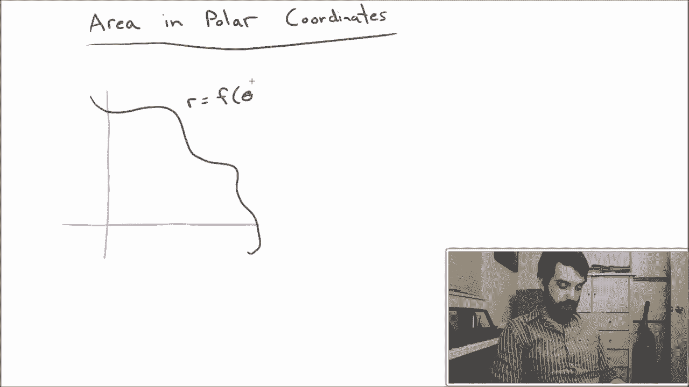
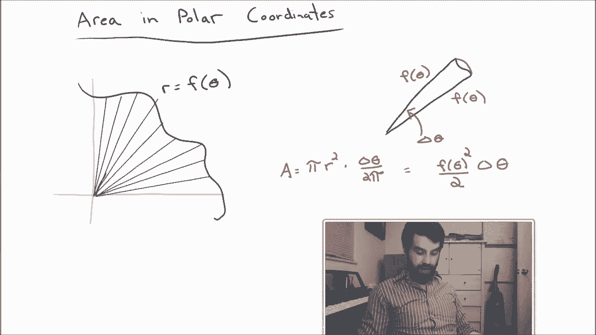
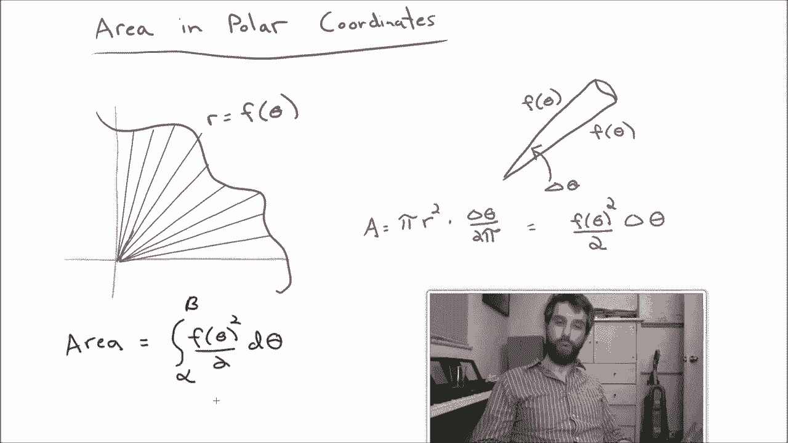

# 【双语字幕+资料下载】辛辛那提 MATH101 ｜ 微积分Ⅱ(2019·完整版) - P44：L44-Areas in Polar Coordinates - ShowMeAI - BV1tq4y1U7Cv

Determining the area of a region was one of the primary motivating concepts behind calculus。

 And indeed， we defined the definite integral to be the area under the curve of some positive function between an A and a B。

 So if we're going describe our curves now in polar coordinates。

 Not as the graph of some function and Cartesian coordinates。 We kind of want to repeat that process。

 We kind of come come up with a integral formula for the area of such regions。 So， for instance。

 let me suppose that I just have some random curve that I'm putting down。

 And I'm imagining that I've given this curve in polar that that my radius at any given point is some function of theta。

 So I'm going to write it F of theta。😊。

Now， if this was in Cartesian coordinates， the way we would do integration was that we would add up a whole bunch of little rectangles。

 And then in some sense， the limit as the number of rectangles went to infinity and their widths went to 0。

 that that limit was going to be a definition of the integral。 But it was a sum of rectangles。

 And when we're in polar， we have a somewhat different symmetry that we want to exploit。

 in particular， I want to write this as a sum of triangles。

The idea here is that each of these sort of spokes that I've drawn goes out to an f of theta when this spoke is at some angle theta。

 So it sort of represents the natural symmetries of polar coordinates very nicely。

So what my approach is is I'm going to try to figure out the areas of these triangles and then they say that the sum of the areas of these things that are approximately triangles is going to be the area of the total region。

 I'll take sort of a limit and I'm going to call that an integral formula。😡。

So let me zoom in on one of these particular triangles。So it's going to look something like this。

 I've got a triangle and it's not truly a triangle because sort of the far edge of it is actually just this curve。

 so it's not necessarily exactly flat。So I'm going to label a few points of this。

 I think the first is this interior angle that I have here。 I'm going to refer to as Delta theta。

 So this is sort of the change in theta and it's related to the Delta X that we used to have when we were in Cartesian。

 which was like the width of the different triangles。

Then I'll note that the length of my spokes are going to be a theta。

And as long as I assume that my Delta theta is really small。

 then I may as well just say that both of the two different spokes are approximately the same length。

So's a little bit of an approximation， but it's an okay one。And then finally。

 what I'm going to do is。I've got some random curve。

 I don't know necessarily what it is on the outside edge here。

 but I'm going to approximate it by a little portion of a circle。

This is sort of analogous to when we were talking about rectangles。 Well。

 the tops of a rectangle when we did integration before weren't always exactly flat。

 It wasn't exactly a rectangle at the top。 It was something a little bit different。

 but our approximation was gonna be approximate by triangle。 Sam thing I'm going story do here。

 I never sort of imagine as' this really skinny pizza slice with a little bit of a circle around the outside edge。

 And then two spokes two edges of my pizza slice that had the same way。😊，Now， what I want to say。

 I want to claim that the area of this entire thing。 well， it's the area of a whole circle。

 which is going to be pi R squared multiplied by this is not the entire pizza。

 It's just a little portion of it。 It's just deelta theta divided by two pi。

2 pi is the entire thing and we've only got deelta theta of it。

 so this is going to tell me the area of my pizza slice。😡。

Since the radius is going to be the f of theta， this is going to be f of theta squared。

 the pi on the top and the bottom of the cancel， but I do divide by2 and I do multiply by a deelta theta。

 so that's going to tell me the area of my pizza slice。

And then the final step， noting that I'm only sketching the intuition here。

 not doing any form of formal proof is to note that the total area， not of the pizza slice。

 but of the entire region that I want to be doing。 I'm going to think of this as the sum of all of these different little pizza slices。

 My deelta theta in the limit is going to become a D theta。

 And I'm going to replace this with an integral formula。 It is going to be the integral of。

F of theta squared， divided by 2 d theta。And finally， I need to give some limits of integration。

 I'm going to let those limits be an alpha。😡，And a beta。

 and I think that my region is going to be defined by the angles theta going from theta equal to alpha up to theta equal to beta and so there I have it。

 I have a formula for the area when I have a curve given in polar coordinates。

