# 【双语字幕+资料下载】辛辛那提 MATH101 ｜ 微积分Ⅱ(2019·完整版) - P45：L45-Example - Area Inside Polar Curves - ShowMeAI - BV1tq4y1U7Cv

So I want to compute the area of a particular polar curve R is cosine of 2 theta and my first step is almost always going to be to sketch a picture of what this curve actually is。

 So let's do that as our first step， What does r equal to cosine of 2 theta look like。

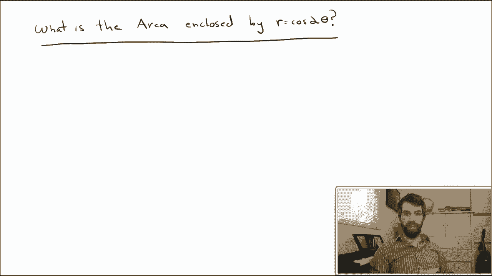

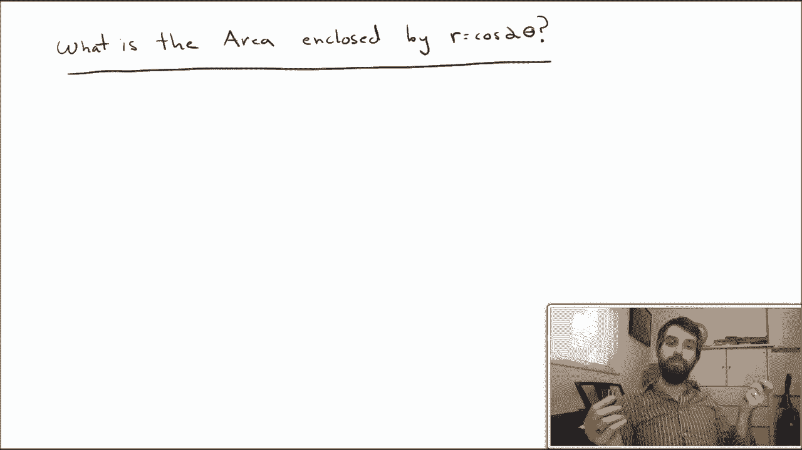

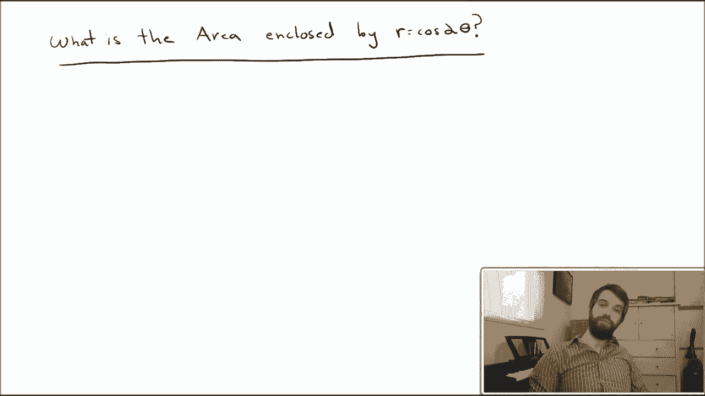

So what I'm trying to get to is a graph where I express this curve， which is given in polar。

 and I'm able to draw that polar curve on the typical X Y plane。

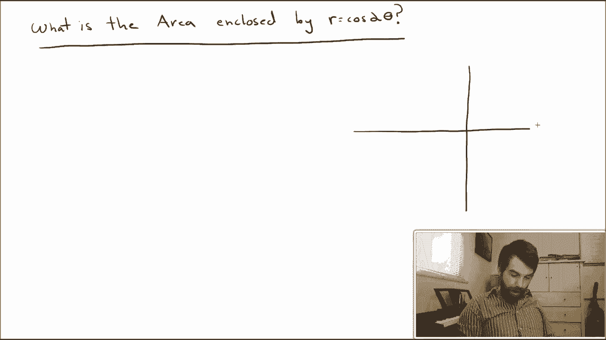

But before I do that， I want to sketch a graph of R as a function of theta and what I mean by that is I want to draw a graph where on the horizontal we have the argument theta and on the vertical we have the argument R and the reason why I'm doing it this way is that I know what this graph looks like。

 I know what y equals cosine of 2 x looks like。😡。

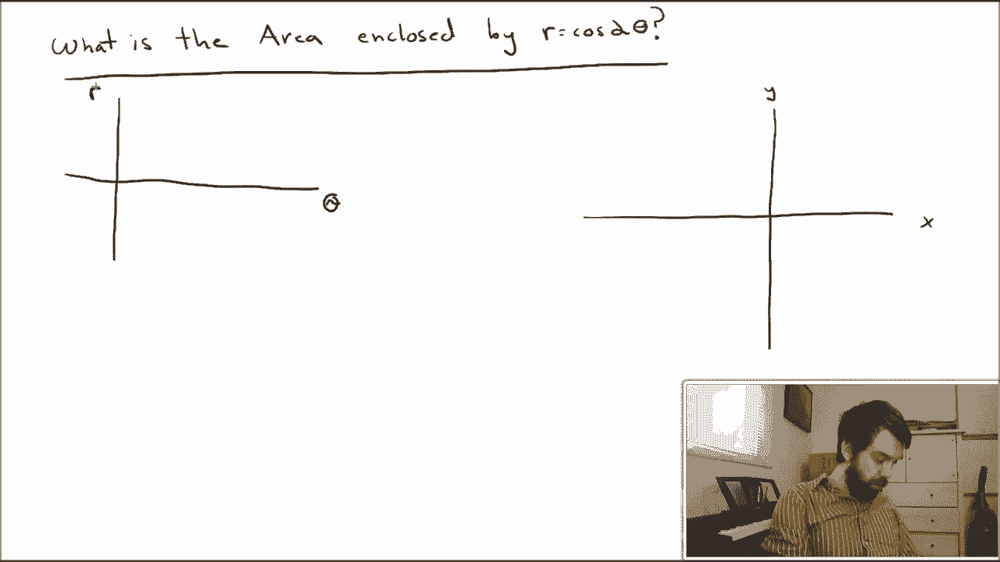

So in particular， I know cosine， that graph starts up at one， goes down to minus1。

 and goes back up to one。Because it's cosine of2 theta， if I want this equal to two pi。

 that tells me that my theta value is equal to pi， so everything's sort of compressed by this factor of two。

 this point where it's minus1， which is normally at pi is now going to be at pi divided by 2。

 the point where it goes to zero， which is normally pi over2 is now going to be at pi divided by4 and so on。

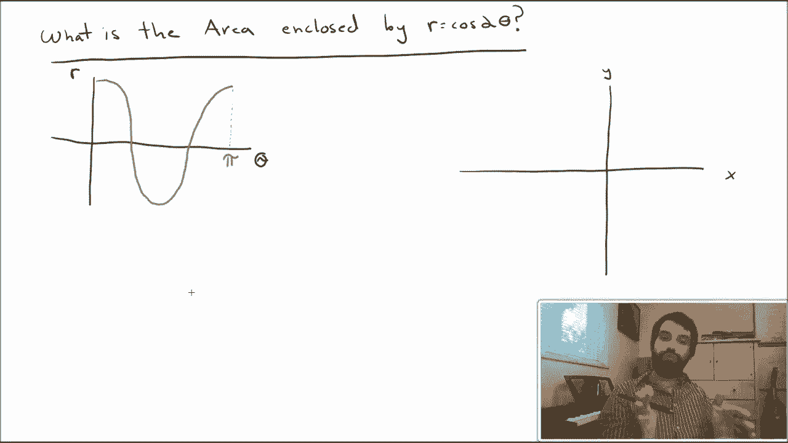

So now what we want to do is take this information that we know in the R theta axes and try to translate it onto the Yx axes。

And the idea is that I'm going to start with my theta value equal to zero。

 and I'm going to let my theta increase， increase， increase increase。

 and then the R is going to do whatever this graph here on the left tells me to do。

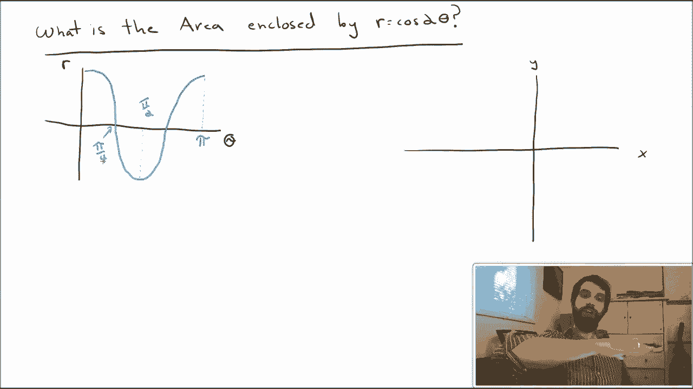

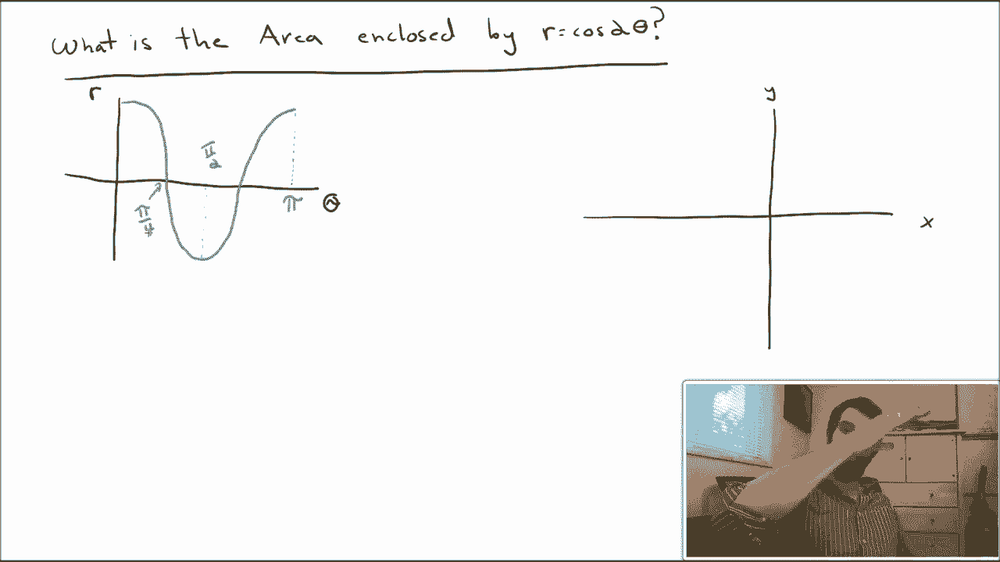

So first of all， I'll note that thetas are going this direction。

 this is going to be my theta increasing， so right down on the x axis， the positive x axis。

 that's where theta is equal to zero， and what does this formula tell us when theta is equal to 0。

 it tells us the r has a value of1。And then as my theta goes towards pi over4。

 what the graph on the left tells me is that my R value goes from one and drops down to zero。

 so I'm going to dot in the line for pi over4。And well， I'm added it。

 I may as well go and do the same thing。For three pi over4， cause I'm going need that in a moment。

So what we've deduced was that between the equal to0 and the equal to pi over4。

 our curve is going from r equal to 1 down to r equal to  zero。

 and so it looks a little bit like this as I increase。

 it gets smaller and smaller and smaller and eventually goes right down to zero。Then what happens。

 then I'm going between the pi over4 and the pi over two， so so then I'm looking in this region here。

So now all of mine our values are going to be negative。My thetas are now in this region here。

 the going between the pi over 4 and the pi over two。

 but all of my R's are going to be negative and they start at zero and go down to minus1。

Negative values getting bigger， getting bigger， getting bigger。

 and finally ending up at the value of -1。Next up I got to look in this next region here where I'm going from minus1 back to zero and now I'm over in this little portion of it。

 so minus1 back to zero， this is going to be taking my minus1 back to zero there I am and I carry on with this pattern you can see whether it fills all in with your mind but it keeps on going along and makes this really kind of cool for leaf clover。

And I can go a little bit faster because I've done this once or twice before。

 but as we carry on with our thetas， this graph that we have。

 it's going to carry on and we just keep on filling all of the different portions in and I always go by another pi over four。

 keeps on alterulating between0 and1， minus1 and so on so I get this really nice graph。

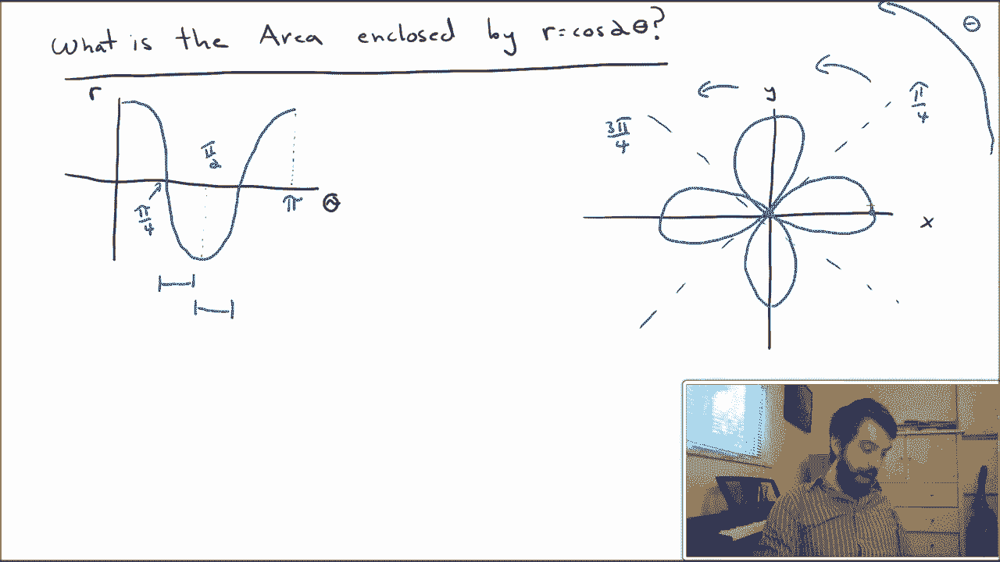

Now I was graphing this because the original question told me to the area。

 so now I can figure out what is the area that I want to do it's going to be all of this stuff and so on。

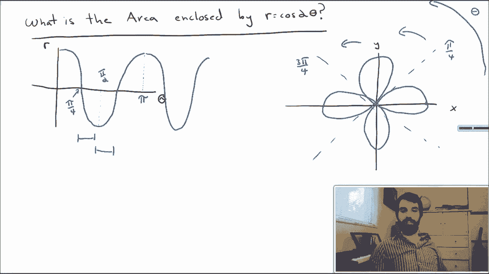

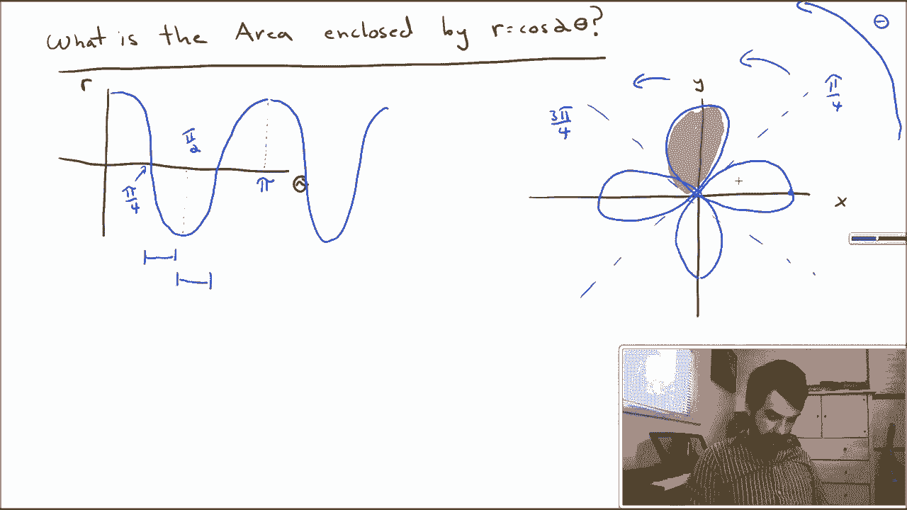

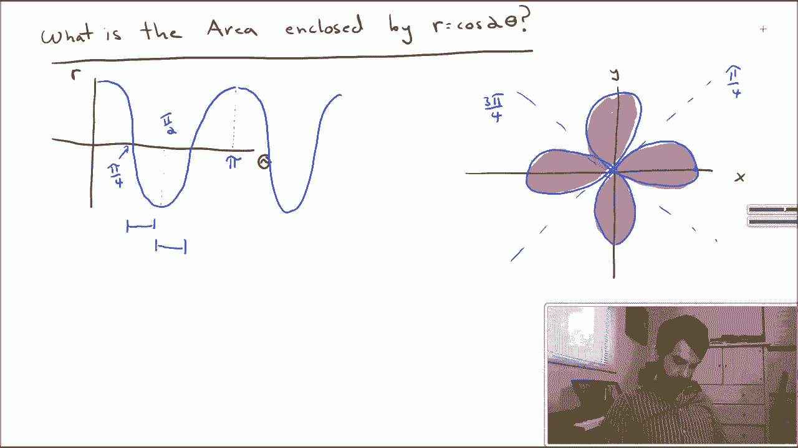

So my final goal is to figure out the entire area here， but I'm going to use a little trick。

 I'm can to use a little bit of symmetry， I'm going to figure out the area just of this part that I am shading in here。

So this looks to me like18 of the entire region， indeed it is the cosine of 2 theta has a lot of symmetry here。

 there's sort of four petals， they all have the same area。

 and at the top and the bottom of the petedals， at least if I draw them well which doesn't exactly look like the case here should also have the same area。

So what I'm going to claim is the area of my half pal times8 is the entire thing。

 and now I'm going to focus on how do I figure out the area of this shaded in blue portion？

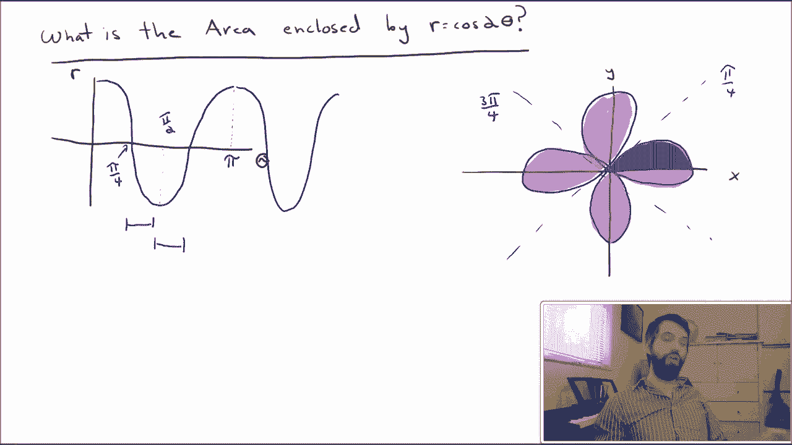

We know a formula for the area。 We know that the area is given by the integral between alpha and beta。

 so two different theta values up the function of theta squared divided by 2。BC了。The F of theta part。

 that seems quite reasonable it was given to us， this is just going to be cosine squared of2 theta。

 all divided by 2 d theta， but the hard part is figuring out what the limits are。

 figuring out what the theta values are。So let's go back and take a look at the region under consideration。

 this half leaf。

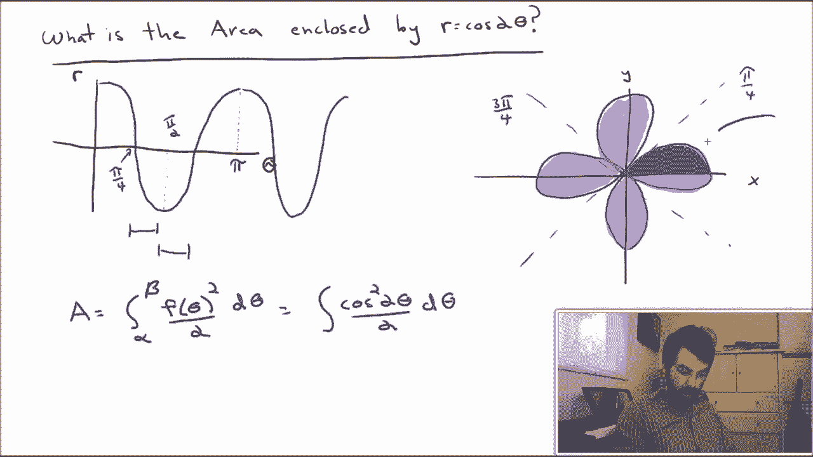

This was formed by theta starting at zero and going up to pi dividedta by 4 when we did that initial arc length。

 that's what we were doing theta equal to  zero to theta equal to pi over 4。

 so zero up to pi dividedta by 4。

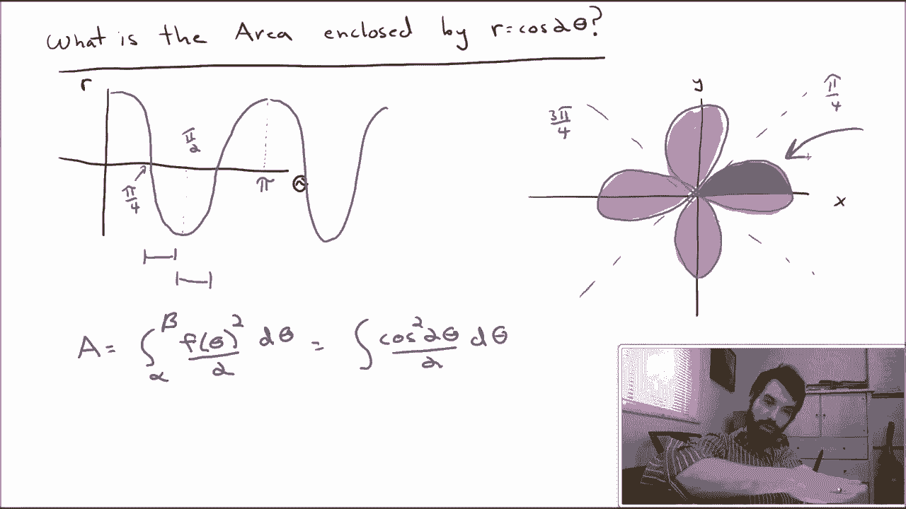

And now this is just a computation。

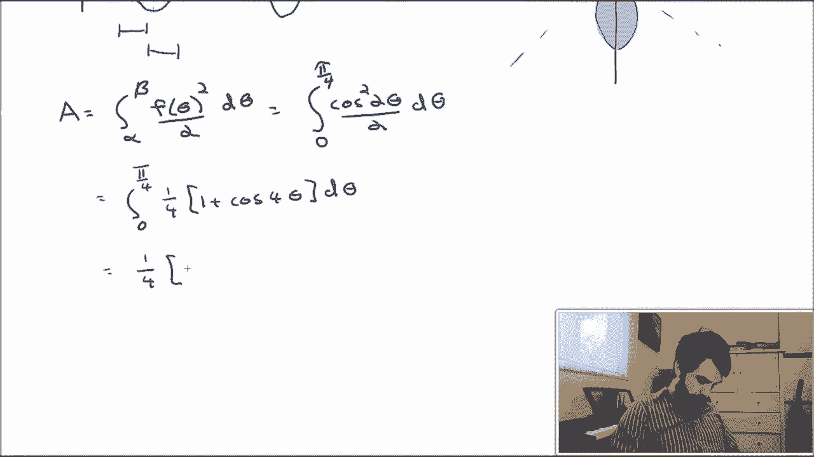

So expanding out， I get this final answer， and if you remember this was going to be the region just for1/8 of the total thing。

 and so if I really want to get a truly final answer， that implies that my area is eight times this。

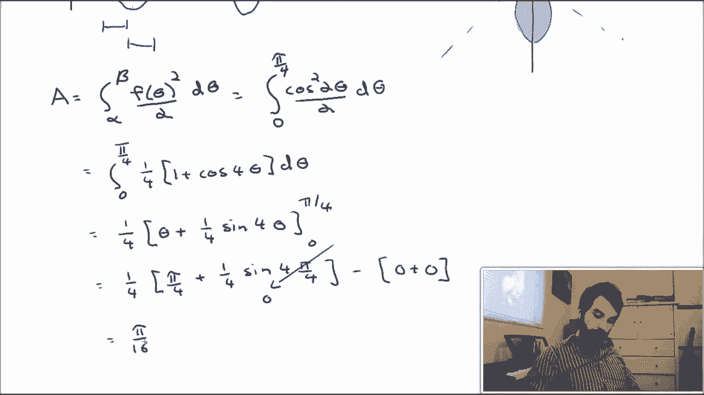

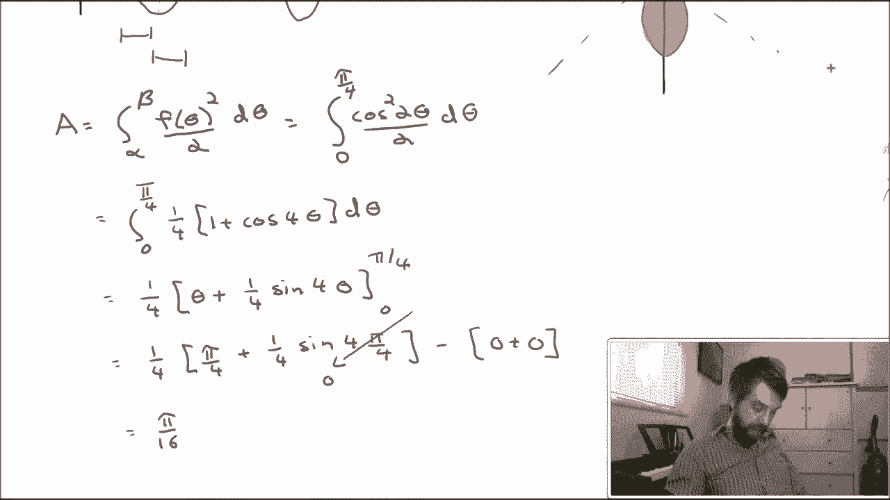

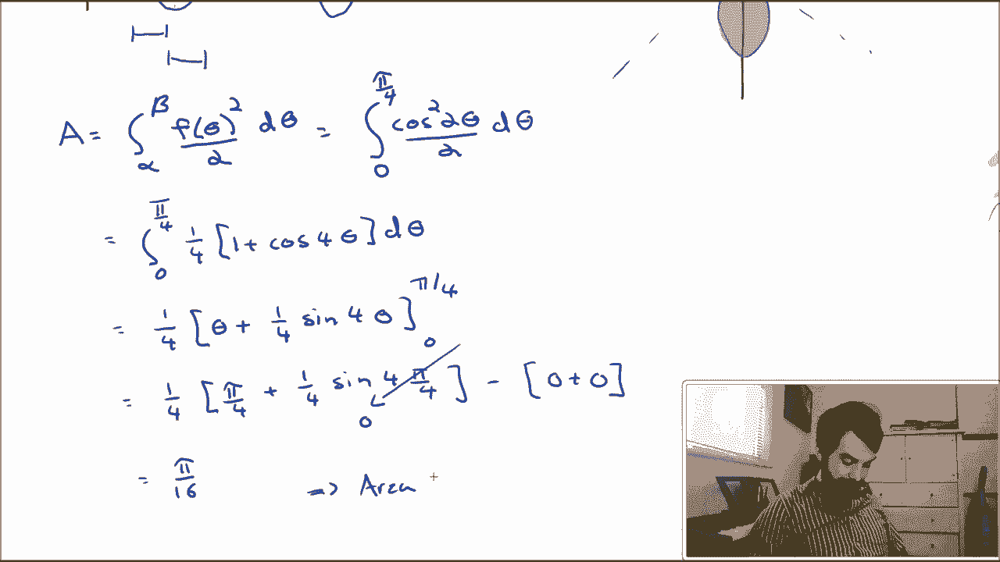

And so pi divide by 2。