# 【ChatGLM金融大模型挑战赛 · 决赛项目】01 - 馒头科技 - P1 - ChatGLM - BV18h4y187UU

我们的方案呃，这个很荣幸第一个汇报，因为从这个教委老师决定发红包，决定这个顺序之后。

我就觉得有点不太妙，然后果然第一个就是我的，然后我这边大概就四部分内容，第一部分是我会介绍一下我队伍的成员，然后第二部分我是第一个讲，所以我会大概介绍一下这个任务是做什么的。

然后第三部分是我们整体的方案啊，最后做一个总结。

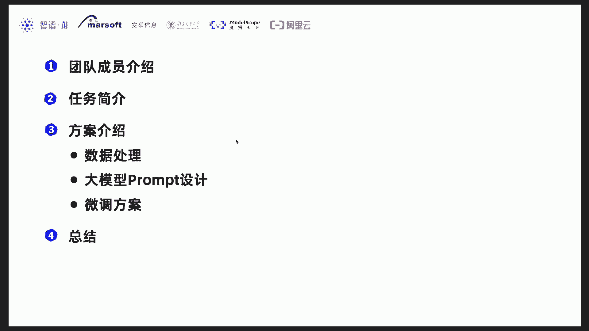

我们都有三个人，分别是我，我来自于这个下面的门前数据科技，然后还有宋志刚的，来自于深圳金发科技，然后郑锦鹏来自于广州冷成电子，具体的公司我就不介绍了。

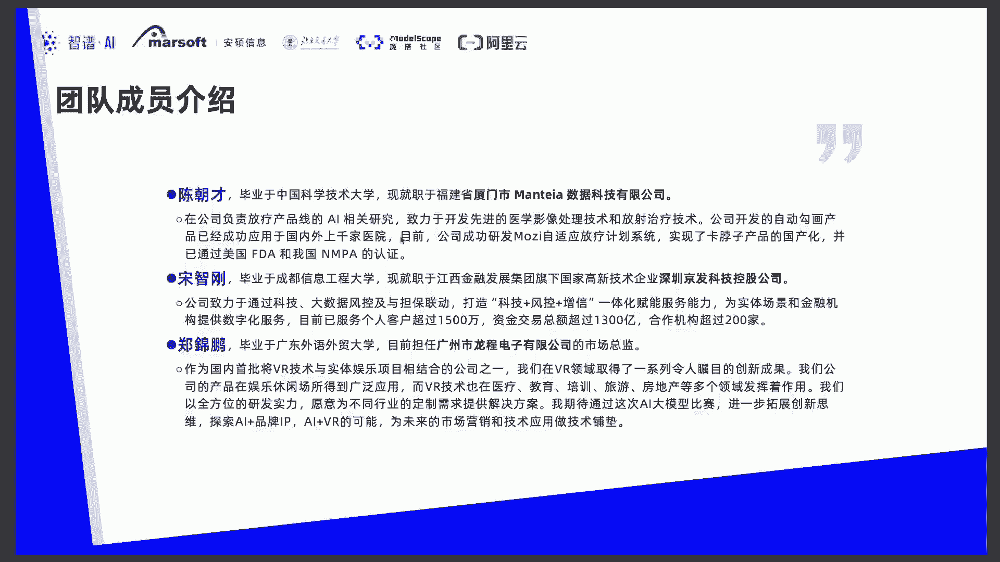

然后这个任务的目的，就是用这个GGLM2的6B的模型，做一个问答系统，就是来回答回答这个用户的金融的一些问题，它有它主要有三种问题，第一种是这种基础的查询，就是说比如说我要问这个公司的研发费用。

然后就一些基就是可以在报表当中得到的内容，然后第二部分它会有一些统计分析的内容，就比如说问这种研发费用增长率。

或者算一些指标，然后其实还有一部分就是它有一些统计性的，就在所有的数据上做一些统计的分析，就是然后第三类问题就是一些开放性的问题，就是他会问到某个公司的，就是年报当中的一些介绍内容。

就它不是在报表当中体现的。

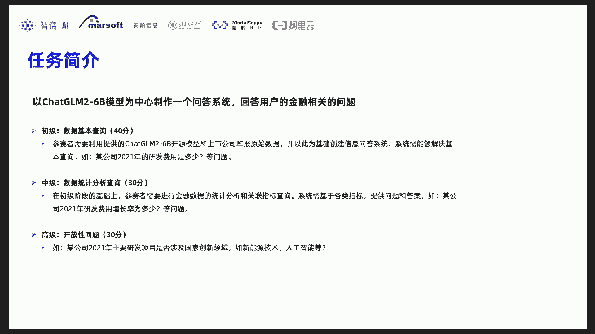

是文本形式体现的，然后它的评价指标，评价指标的话有有几个点，就是他第一点，他他要求你的回答的是必须要准确的，就是你回答一个数字，这个数字是必须精确的。

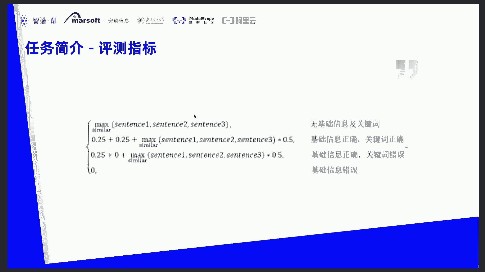

然后第二部分，你的回答里面还必须附带有对应的关键词，然后最后他还还会有一个文本的相似度，就是他会评价你回答的这个呃语句，是不是符合他的要求，这里有个示例，大家可以稍微看一下，呃然后这个介绍完了。

然后这个是我们整体的一个处理流程，他最开始给的是很多的年报数据，然后我们第一步必须就是对这些PDF做一个解，析的抽取，就是拿到那些报表的内容，然后然后第二，然后后面的话。

我们会首先对用户的问题做一个分类，然后分类，然后分类分类完了，分类完之后，我们会就对于需要这种统计类的问题，我们会做一个SQL语句的生成，然后其他类的问题，我们会先对这个用户的问题做一个意图的识别。

识别完之后，然后从报表或者这个年报当中，做这个数据和文本的召回，做完召回之后，我们再把这些召回的信息组合成prompt，交给这个JM们去处理来回答，然后第一部分，第一部分我就简简单介绍一下。

我们做的这个提取呃，我们这个文本提取，用的就是用的官方提供的脚本，然后第二步我们会就根据这个关键词去召回，这个对应的，就找到报表当中对应的这个页，为什么要做这一步，因为我们就是做把表格识别的时候。

这个方法会比较慢，所以我们要先找到对年不到页，就只对那一部分页去做这个表格提取，然后提取完了之后，我们需要过滤掉一些就是不对的信息，因为它就是有公司的年报，里面的内容会比较复杂。

我们需要过过滤掉一些就非合并报表，然后调整报表，还有一些母公司的报表，右边是一个代码实例，然后这边是一个提取流程的实例，就是就是它大概是通过图像，识别这个年报当中的这种横线或者竖线，然后去识别表格内容。

然后右边是我们会把提取的结果，存成这个JSON文件，然后首先第一步我们是要对这个问题，就是对用户的问题进行分类，我们最开始的方案是就是比较简单，就是用规则去匹配，就是然后根据这个你问题里面的公司。

然后年份，然后有没有爸爸里面的一些字段，然后有没有公示的字段，然后包括一些特殊词汇，然后第二步和第二步的话，我们就尝试着用这个大模型去做一个分类，比如说这中间的，比如说我去让他做一个选择题。

就问他这个问题是属于哪个选项的呃，然后最后最后我们的方案。

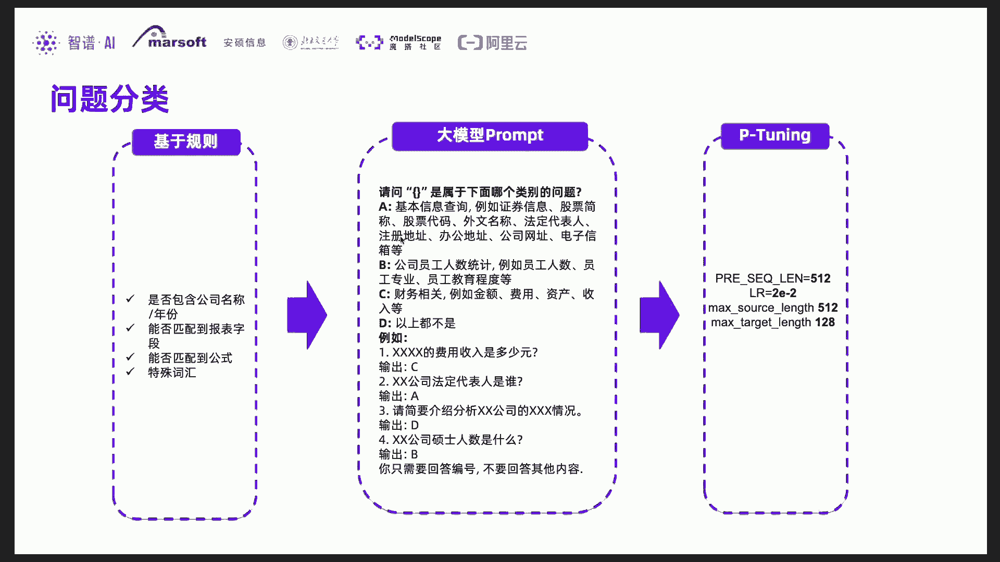

就是通过微调的方式去实现，然后在微调里面的话，我们会把这个问题分为六类，第一类是就是你可以谈，他就去查这个公司的基本信息，就比如说问一些邮箱啊，然后注册地址之类的，然后第二部分是员工的信息。

就是大概就是嗯你公司的员工数量，然后这些啊C的话就是全部的，就三个大的财务报表好，D的话这种需要计算的题，老E的话就是统计题，统计题就是我问比如说负债率，负债最高的这个上市公司是什么。

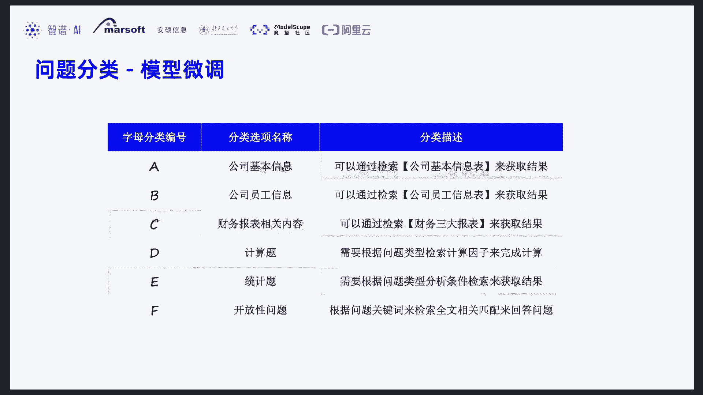

然后F的话就是开放性问题，就是需要通过文本找回去实现的，然后这边是微调。

微调的时候微调的时候使用的一个prompt的，然后最后的话我们就是左边是我们的这个，微调数据的一个实例，然后右边是我们最后做微调的时候，一个的参数，具体的我就不说了，然后这个是微调的过程。

就是为什么要做这个微调，就是因为我发现这个6B的模型，它对于选择题是有就有一定的理解能力，但是呃它不够不够精准，所以我们后面就取回调，来增强他的这个分类的能力，然后下面是这个分类的过程，训练的过程啊。

这边是一个呃分类的示例。

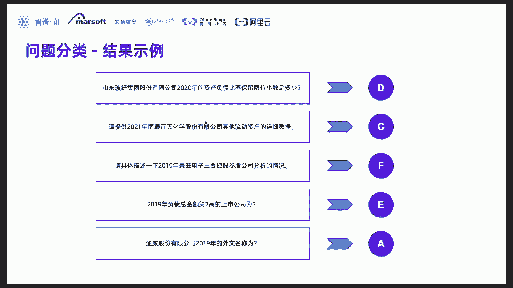

然后这个seq生成的话，我们我们最开始也也就没有走一条，就是想通过prompt看他能不能自己写SQL语句，后面发现他输出的不太稳定，然后然后我们试了一下这个130B的模型。

就是发现他是有这种就你我我要求你写SQL语句，他写的是非常准的，所以我们就决定通过微调，来增强他这个SQL生成的能力。

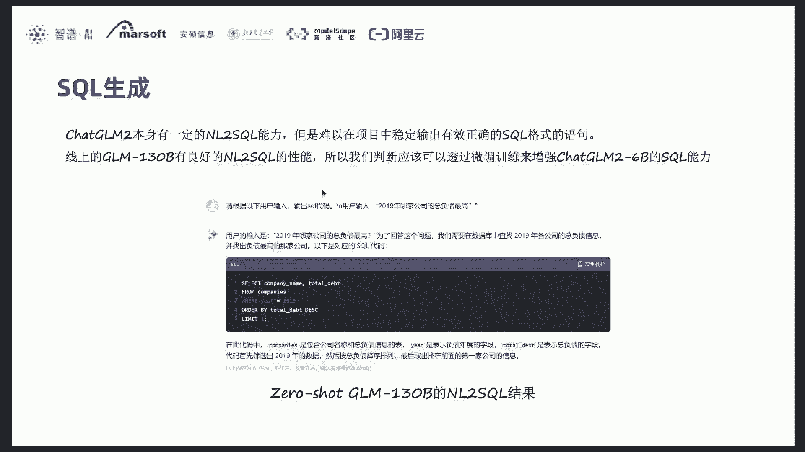

然后其实这一部分就是主要是这个训练数据，怎么构造，我们最开始，因为天池最开始是有一个这个n LT secret语句的，公开数据的，我们去拿它去调了一下，发现它的效果不太好，因为它的数据集的范围。

跟本次比赛的数据差别还是挺大的，然后后面的话我们就通过呃，我主要是通过模板和这个大模型改写的方式，生成了比较多的这个SP训练数据，然后我们能处理比如CQ语句的排序统计啊，条件求和，然后单字段多字段的。

反正就是比较通用的CPU就都都能实现啊。

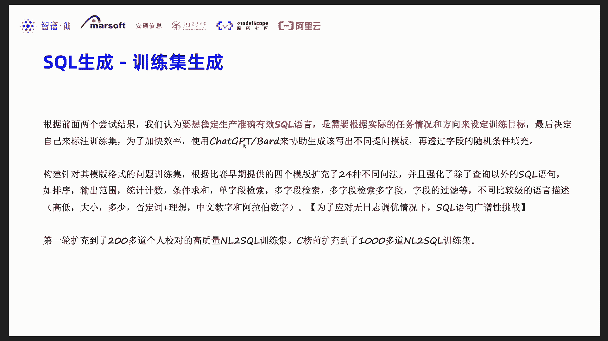

这个是一个数我们数据构造的一个过程，就我们是会先通过设置一些模板，然后再用随机的字段去做填充，然后之后我们再用这种调大模型，对这个问题进行改写，就增强大的方法能力。

然后右边的是就是训练的时候使用的prompt，和这个PETA的这个参数。

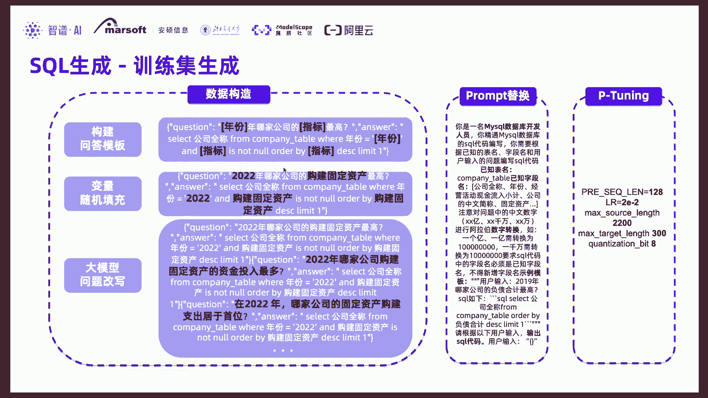

然后这边是它生成的一个示例，我们看到就是他生成的seq语句是非常准的啊，这里其实还有一个还有一个点，就是我们配比如说会有会有这种问题，就问这个，比如总负债大于5000万的这种上市公司。

就是我们也对这种比如千万他实际生成的数字。

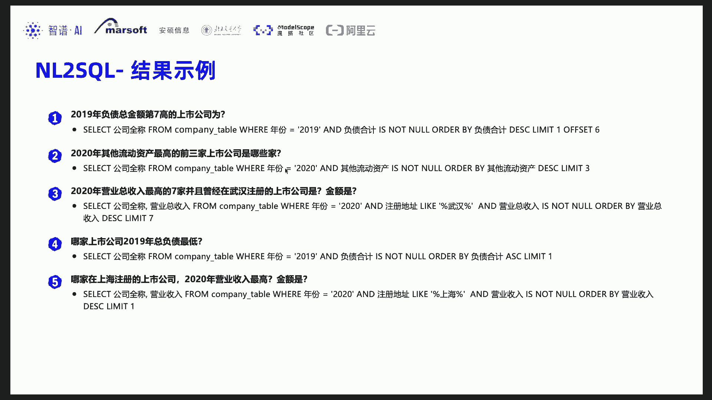

这种就可以去做了一些增强，这这里没有展示出来，然后第二步我们会对这个用户的问题，做一个意图的识别呃。

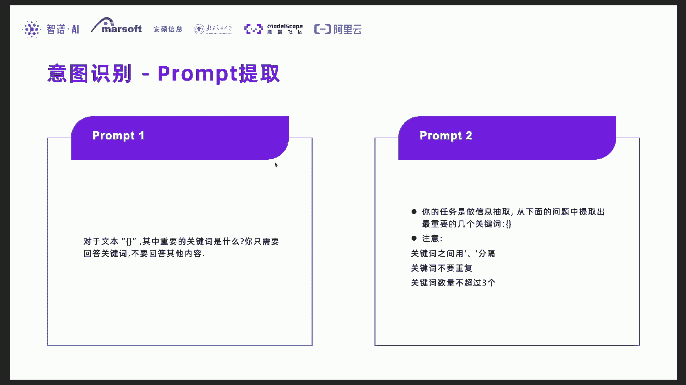

我们最开始是用一个比较简单的problem去问，就让自己的模型直接去给出来这个用户的问题，他他想要的是什么，这边是两个简单的prompt。

然后后面的话是我们设计了一个，就稍微复杂的一个problem里面，就是包括我要我要求你，我想要做什么，然后你的具体要求是什么，然后我会会给一些参考的事例，然后最后我呃对模型的输出格式也有要求。

然后这个这个做完之后呃，我们最后也采用了一个微调的方式，就是我们是数据的构造，就是通过先用模型输出，然后最后造了一个微调的数据，然后这边是他识别的一个结果，可以看到他对于这种就最后一个问题。

他对于这种多个字段的这种询问，他的提取也是比较准的，然后最后就是具体的这个问题的回答，这个太B的问题就比较简单，就是他他是对这个单个字段的询问，我们首先会提取这个问题当中的，这个公司名称和年份。

然后就去匹配到这个报表之后，然后他有一部分是问这种这种文，文本类型的对比，就比如说问这个呃，你两年的法定法定代表人没有变化，或者是几年之间的这个法，法定代表是不是是不是一样。

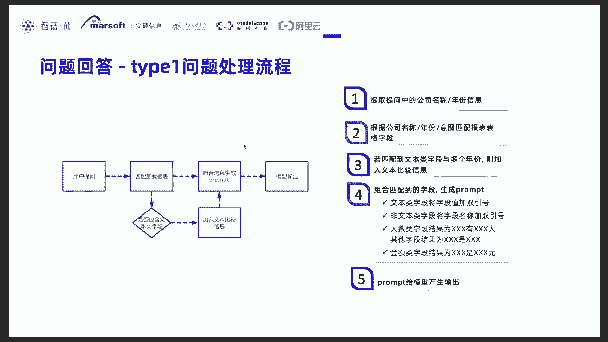

对这种文本的话，我们就做了一个就比较，然后在就匹配到这个字段之后，再生成prompt的时候，我们发现就是如果你直接丢给它的话，就它对于一些字段可能识别的不好，所以我们就做了一些处理。

比如说这种文本类的字段，我会把这个字段的值加个双引号，然后非文本的字段字段名称这样算也好，然后人数的话，我们就就组合成有多少人，然后金额类的是是多少元。

这里是一个回答的事例，比如他问这个研发人员的详细数据，你就提取到呃，这个年公司的名字，然后年份还有他的这个意图词，然后匹配到的，比如匹配到这个报表当中，他会有研发人员占总人数的比率，还有研发人员的数量。

我们就把这两个字段就组合成下面这个prompt，然后我在这个prompt里面，我们会把这个字段，然后给他加双引号，包括会会把这个数数值后面加一个人数啊，这样的话可以就提高它这个识别的能力。

然后还有我们我们会在这个prompt，会要求他的这个输出格式，比如说我要求你输出他的长沙是长沙，然后他最后回答的就是一个比较标准的回答。

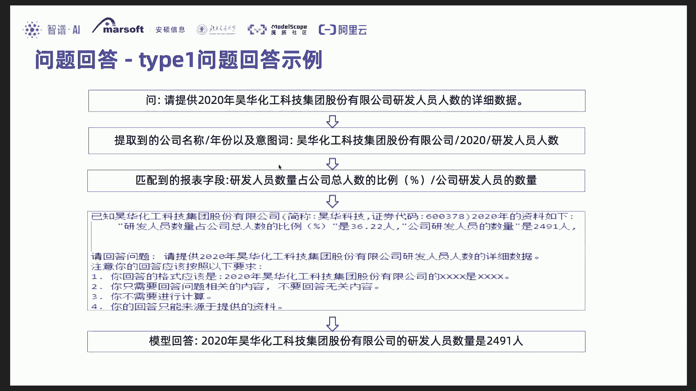

然后tab2的话他就是会问一些比率性的，因为它是需要计算的，但是在实际当中，这个6B的它的计算能力有一定欠缺，所以呃我们就采用一个拆分的方式，就是就我们就找到这种计算的问题，以后会生成一个问题链。

然后对于问题链中的每一个问题，也是类似于type1的方式，然后得到回答之后，我们提取当中提取对应的值。

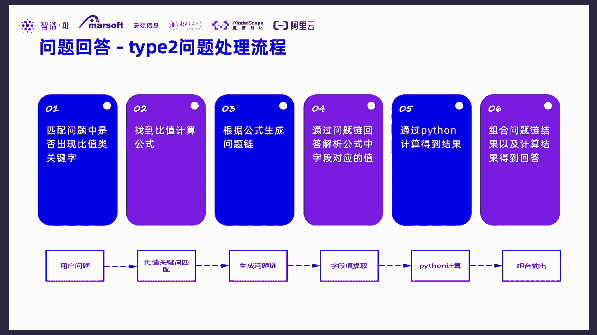

然后然后直接交给Python计算，然后最后再得到一个输出，这边是一个示例，就是比如他问这个公司的营业利润利润率，然后我们得到这个我知道的，他的公式是这样的，我们就生成对应的这个问题，练他会会有两个问题。

然后模型对这两个问题进行回答之后，我们提取出来它当中的这个数值，然后最后通过Python计算之后，然后最后得到最终的答案。

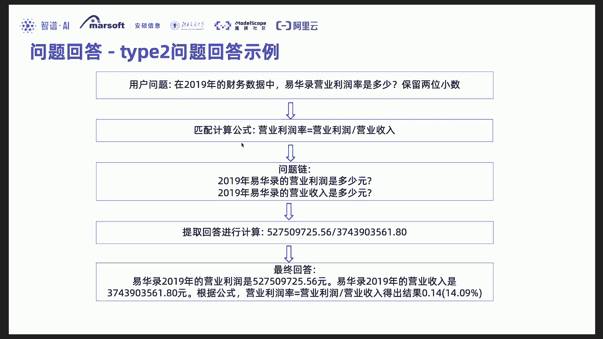

呃这里是写错了，这里是type3的问题，tab3的问题，它就是一些需要文本作文本召回，它就类似于一个做就是搜索搜索的问题，但是他多了一个总结的步骤，这里的话我们也是就跟前面流程一样的话。

我们先根据这个关键词的问题。

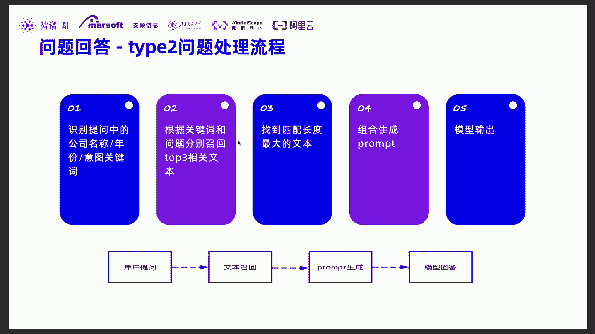

去对整个年报去做召回，我会先分别召回这个top3的文本，然后最后因为你的你的pp a太强的话，这个6B的模型是无法处理的，而且就PROBLEMA很强的话，它是有效果会有下降，所以我们就在做了一个排序。

然后找到这个最匹配的文本留给他。

然后这边是一个事例，就是我们比如他问这个公司的破产重整，相关事项，然后我们会召回到这个对应的章节，然后也也也加了一个context，就是上面的就回答用户，回答用户的，就年报内容的一些说明。

因为他有的时候，他这个模型就不太理解年报里面的一些符号。

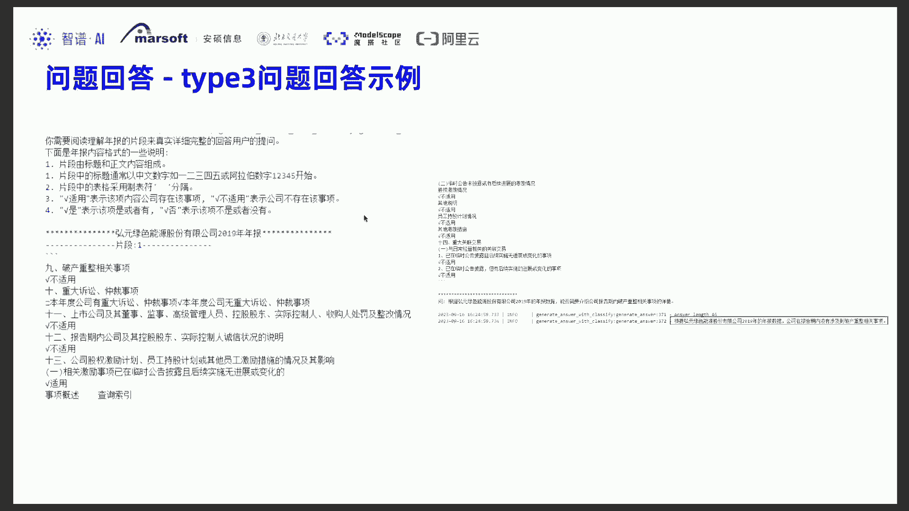

啊这边是我们自己造的一些问题的回答，这个是问这个函数信息的，主要销售客服和主要供应商。

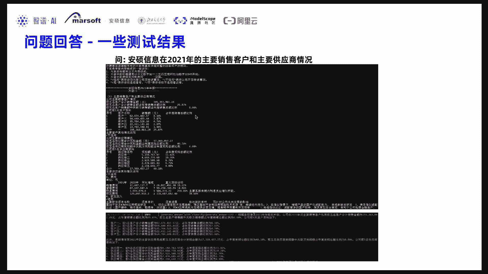

就他的召回也是比较准的，这个是审计意见。

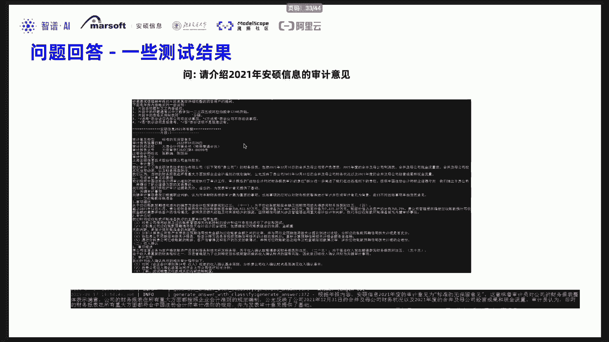

啊这个是公司的股权激励计划呃。

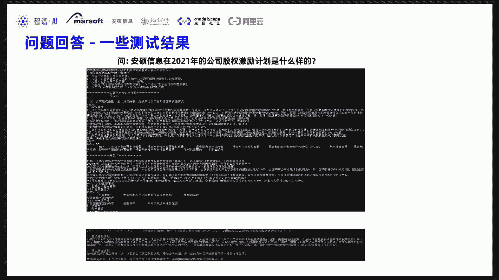

然后然后这一部分是我们测试了，我们这个回答的性能，因为前面我们有三步，就是一个分类，一个是CC的生成，然后意图识别这部分时间是比较快的，然后后面具体到每一类的问题的话，因为他这个回答问题的时候。

是实际上是你和你的最后promise token，个数有关的，他这个type3的话，因为你需要召回比较多的年报。

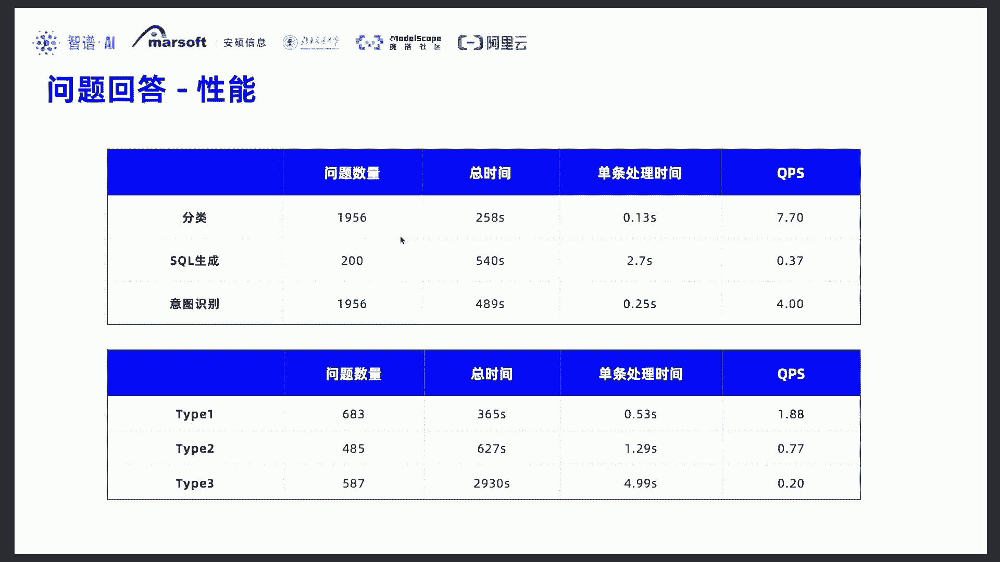

文本会比较慢一点，然后总结的话，就是我们在这个problem的定义的时候，就是会有会有几个点，就是第一个就是你的描，你的角色定义要比较精确，然后第二个就是你在描述着他做。

他就大模型要做任务的时候比较简洁，就避免使用那种模糊或者有歧义的词汇，然后第三步就是多用枚举，然后少用这种否定句啊，第三第四个就是你在利用这个模型的。

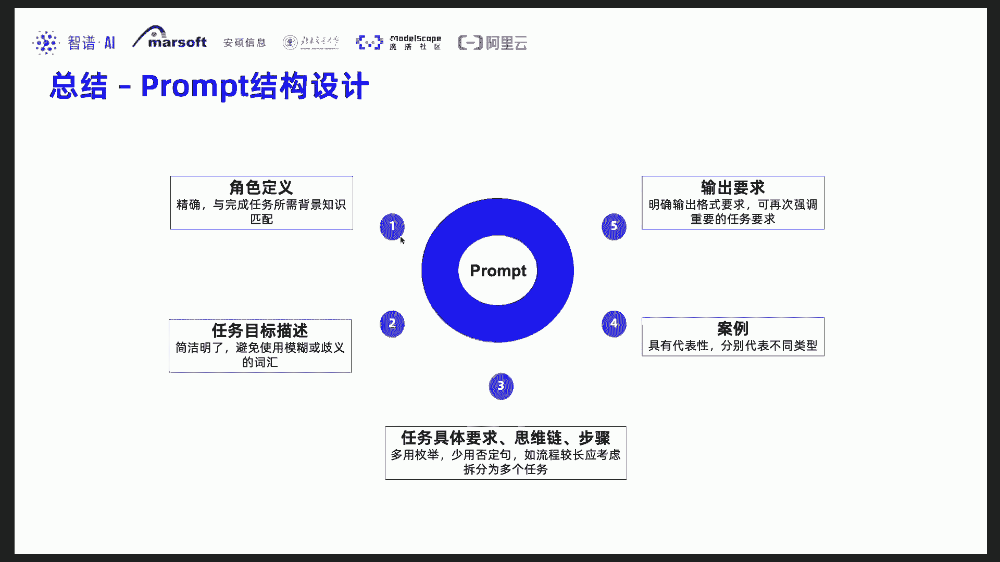

这个in context的学习能力的时候，就是你提供的这个案例，就必须比较具有代表性好，第四第五部的话，就是你可以在还要求这个模型，有具体的输出格式，然后在微调这一部分的话。

因为我们我们实际上是微调了三个模型。

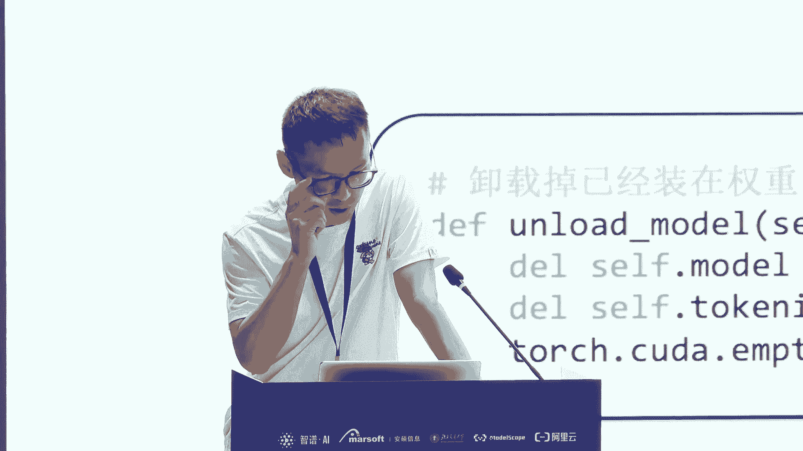

然后最后其实我们后面想了一下，就是可以把这个他这三个就是做做分类，然后关键就是意图识别，然后JCQ这三个是可以合成一个的，合成一个去做微调的，这里是具体的训练的步骤，然后总结一下的话。

就是我们这个就觉得有有三个点可以。

后面可以继续做，然后第一个点就是这种召回的准确率，就是目前来看，因为我们也尝试了一些，就是embedding的模型去做召回，就发现它的效果不太好，就可能后面就在尝试一些其他的方式，然后第二点就是嗯。

因为这个6B的模型它比较小，可能识别你的这种复杂指令的能力，会比较弱一点，就看这怎么能增强这个他的这种，比较复杂的指令的理解能力啊，第三点就是呃就模型的这种自身的知识能力，我们可能能够结合一些知识库。

或者或者把年报做一些知识图谱，然后来增强它的知识能力，然后第二点就是速度方面的话，呃速度方面的话，其实因为他模型的速度，就是跟透透根数是强相关的，我们就怎么能把这个召回做的更精准，让他冷处理的数据更少。

这样的话它的速度就更快好，第二点是呃，我们可以可能通过这种大小模型的协同，然后多模型的协同，就是每个模型负责自己的分工，然后比较复杂的我可以留给大模型去处理，比较简单的我想不清处理就够了。

然后第三点就是工程方面的一些，比如说我们可以做一些token的开口和量化，模型的量化去提高这个速度，最后是通用性的话，其实我们的我们的整个方案就是第一种思路，就是我先去做检索，然后再去做回答。

就有点类似于搜索引擎，其实我觉得更通用的方法是第二种，就是直接回答，就是如果你的模型的理解能力和知识不够的话，你其实可以完全可以回答这个问题的，就是但是我没有想，就是怎么去做这个全量的训练和微调。

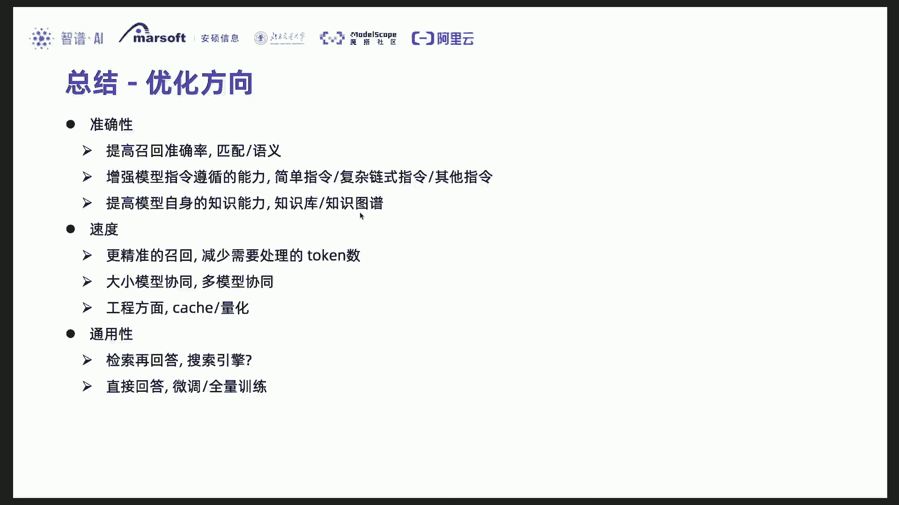

这个可以后面需要探索一下，第二点的话就是我们的方案里面，就是我们就发现这种主要是两个点，一个是就大模型，有它有它有非常强的这种方法处理能力，它可以适应各种MP任务，就不像之前我每个单个的LP任务。

都要去单独做一个模型啊，像我们像我们这里就做了文本分类，然后意图识别，然后实际进去，然后CPU生成就他的方法处理能力很强，第二点是它的可微调性，就是我们发现它就是，你只要只需要造一些比较简单的数据。

它就能呃啊对，就做的很好，然后就前面我发现他写SQL写的是非常准的。

最后是其他的，比如说呃呃就第一点我比较比较感比较感，比较感谢我的队友，就是我们，因为这个比赛他的工作量还是比较大的，就比较幸运，我们一周一起合作把这个项目做完。

然后第二点就是也感谢就是吉普这个gm的开源，然后用到让大家用的就做这种NP的任务，就非常方便，然后最后就是像素信息准备的这些数据，然后某大社区提供的模型好，第三第三个方面就是我想提一下。

因为我是做这个放疗领域的，所以就也非常希望大家多关注一下，这个大模型加医疗的应用啊。

我觉得这个对于患者来说，或者医生来说都是有非常大的帮助的啊，最后是一个我们的成绩的总结，就比较幸运，在C版和B版都来了，第一啊啊谢谢大家。

然后非常希望各种职，好的啊，能听到吗，感谢那个第一组这个馒头科技的这个分享，因为是第一组，也是第一个吃螃蟹的一组，所以给的时间稍微充裕了一些啊，那后面的队伍我们可能就会严格控制。

就是15分钟的一个讲解和，5分钟的一个跟评委的一个互动，那么现在就看一下评委有没有什么是啊，问题要提问的可以打开你们桌上那个麦嗯，喂喂那可以了啊啊，谢谢你的答辩哈，那我的问题是在那个问题分类那一块。

就是你们问题分类的那个微调的样本，是自己标注吗，大概标注了多少，问题分类阶段的准确率能到多少，呃这个这个分类的数据，我们其实他这个模型本来分的也比较准了，我们后面只是做人工做了一下检查。

嗯最后的准确率的话，因为没有，就因为他没有具体的数据，我们没有仔细检查，就只是大概看了一下，基本上分类准确率我觉得应该很高，这就是我们其实微调的这几部分数据，都是利用一些模板，或者是先用模型输出。

好的其他评委还有问题吗，来嘛你直接说吧，就是在这个为了自己的这个构件上发短，这个其实时间不多，其实主要是负载了一段时间，做的可能一两周吧，那就是有一个按照这个过程，主要是预先构建的吗。

对这个表的话大概有还有300多个字段吧，然后对诶，这是解包方提供的吗，还是你们自己构建的啊，这个这个是因为他他其实这个比赛里面有限定，就是呃几个报表呃，包表示文字格式，还是说你这个就是一个这个表的格式。

它是这种就是像这种资产负债表，然后合并利润表，然后你就把它抽取出来，然后放到这个放到这个数据库里面去了对吧，对对对，OK这个东西用的是BILIBLIP解析和信息收取，这块是用大模型的吗，这个解析没有啊。

解析没有用到模型，然后他这个cs for它直接就可以入库了是吧，对对对，这个主要是C口语句生成的那一部分，好的，我再补充问一下，就是说嗯你这模型比如说换一组报表，就不是这个什么上海北京。

但他那个skin ma可能变得不一样，那在这种情况下，你需要多长时间能适应到这个新的，因为我们我们生成数据，生成这个训练数据都是基于嗯，比如说会造一些SEL语句的模板，然后再利用比如大模型。

因为其实像130B的模型，它写SECURL语句是非常准的，我们可能先通过大模型它去生成，然后我们自己下人工稍微检查一下就好了，其实非常快乐，而且他需要的训练数据并也并不是很多，刚才讲的是多少条啊。

刚才讲的是多少条，最开始我们就用了200多刀，然后最后因为因为这个语句，他的就像各种条件的求和。

然后单子上多字段的我们都到了一些，这个有测试精准度，就是光是在C口上，其实我们大概看了一下，就是它生成的就非常准，因为我们最后在实际在提交，提交最后结果的时候，我们发现我们好像那个系数有句。

我感觉基本上没没有错，几个基本上都对了，就最后的答案还有问题，就是刚刚说你其实要从那个报表里面。

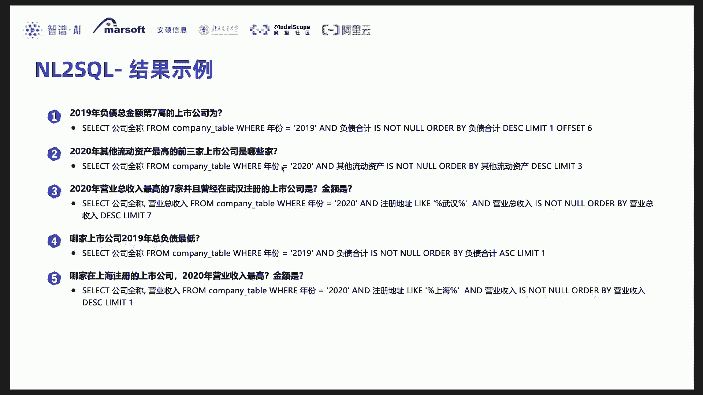

抽出那个表，然后把它构建数据库是吧，那如果未来就是我要online的话，就是新的报表来了，你还要online的去构建这个数据库，就是这个过程怎么服务呢，对爆对爆表这一部分目前是这样。

他就只能有一个offline预处理是吧，来支持对，因为这样精度是最高的，其实你也可以就是直接去年报里面去做召回，但是那样的话就精度没有这样高。

他那边的，好的那我们感谢第一组的这个答辩和分享。