# 2024，智能体 Builder 时代，来临了吗？ - P1 - ChatGLM - BV1b6421u74E

没有切到我这来了是吗，哦来了好，今天非常高兴啊，这个我应该是第一次在呃，质朴大模型GLM这个号呃，做这个直播，当然其他之前我在其他很多场合，比如说图灵社区啊，把我自己的视频号可能都讲过很多次。

从去年呃应该去年是年初是吧，大家知道年初大模型就是，以cheat GB t为代表的大模型技术和产品，在国内至少技术圈，科技圈还是非常火的啊，所以那个时候开始呢我就讲了很多次，在各种不同场合线上线下啊。

刚才主持人也也介绍了我了啊，就是呃总的来讲呢，我如果从大模型这件事两句话啊，一句话是说，我职业生涯基本上都是在做一件事情，就是为技术人员服啊，最早是出书，所以在图灵啊，大家可能只要学技术的，学编程的人。

应该都买过我的书，我我出的书啊，我组织出版的书图灵，然后后来是在CSDN和成员杂志做总编啊，我相信很多技术同学也都用过是吧，或者订过杂志，再往后是在美团技术学院呃，从2018年开始呢。

我同时又在智源人工智能研究院，就北京市的这个人工智能研究院做副院长，也是在这个支援的时候呢，呃就是第二第二句啊，就是我们从2020年开始啊，应该是国内第一个投入绝大部分资源叫all in吧。

有个有个词叫all in是吧，这个大模型的机构啊，所所以从那那时候开始呢，我就开始在至少参与这个达模型相关的事情啊，当然我本人啊刚才主持人介绍也不太准，我本人不是真正一线搞技术啊。

我是比较偏偏这个运营啊，宣传跟跟大家这个不知道的啊，所以呢这个呃所以这个大模型这件事情呢，我我更多还是从宏观上来讲，那今天是我们我们质朴AI的，我们这个面向这个广大开发者，和广大这个技术社区的。

我们有一个系列活动啊，就叫they builder z就是智能的智这个Z啊这个英文，然后呢builder啊是就是创造者是吧，建设者啊这么个词儿，为什么我们不用developer呢，等一下我会讲到这个。

就直接跟我们大模型产品的特点和智能体啊，这个事情直接相关，因为以后啊，可能人人作为我们能够创造一些东西，在数字世界上创造一个数字产品，不需要写代码对吧，这是大模型带来的优势。

好那我接下来就开始分享我的这个USNICE啊，诶现在能看到吗，我的分享成功了没有，我这个共享啊，好了好，我的人头就没了，今天呢我讲的标题呀，就这个z builder刚才讲了，大家看了我们标题。

今天呢是质朴AI，我们这个分享的第二期，我们上次分享的应该是我们的同事冯晓东讲，我们接TLM4的API，就新版本的大模型API的一些开发，那个基本上针对是技术的，你会写代码才行。

但今天呢我讲的我刚才也发了个朋友圈，我说可能是我们现在大家能听到的，关于大模型和智能题啊，可能最通俗的一个演讲分享啊，好那我就开始了，首先呢我要跟大家讲，就是这张图也是我用质朴青年这个产品是吧。

然后生成的我就输盲人摸象啊，包括也是用我自己做的一个智能体啊，等一下会，最后呢，我会给大家看我这个智能体是什么样的啊，然后盲人摸象这样一张图，我想说的是什么呢，一个大模型呢是一个非常新的一个技术趋势。

而且还在高速的发展过程中，而且呢它对人的世界观跟我们以前有些认知啊，就是非常的不一样啊，所以呢我今天讲的东西可能都是错的哈，就是你听了我讲，他不一定是以后可能会被证伪啊，我们共同交流学习。

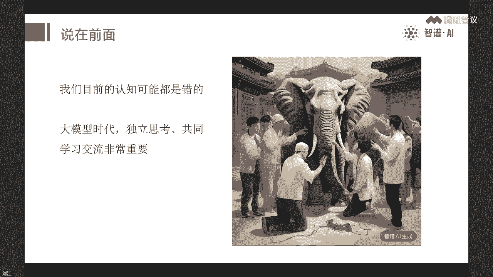

这个非常重要，好那往下这个大家呃有手机啊，手机呢我你今天要做一个准备，就是因为我等下讲的案例呢是用质朴清言，就是我们支付AI的一个，类似chat gbt的一个产品，但是现在我觉得功能很多。

功能可能比啊跟chat b也有很多已经是接近，甚至超过了哈，大家下载这么一个app对，或者呢你如果手边有电脑的，可以直接去打开这个，或者你直接搜索啊，质朴器件或者chat gl m DC n。

另外呢我们今天也建了个群啊，这个大家可以扫扫描群，然后呢加入这个群里，我也会在这个群里啊，所以今天的讲座完了以后呢，我们还可以在群里继续交流，好吧嗯，刚才有同学说那还听啥哈哈对。

不是说所有大家要有一个认识盲人摸象，就是说大家可能每个人都只掌握了，一部分的信息啊，所以大家要一起来交流，一起来凑啊啊，不是一定都是对的，但是呢总的来讲，因为我在我从2020年到现在吧。

还是在大陆型这块还是有一些信息，包括我一直也比较从志愿研究院到呃，去年上半年光年之外创业是吧，然后呢最近又加入了质谱啊，这都是国内还是大模型比较领先的机构啊，所以我我至少这个离一线是非常近的啊。

信息也会更多一些，那今天呢我主要就讲这三个部分啊，一个是还是讲一讲大模型，因为我们标题是拥抱智能体，拥抱大模型时代，就为什么大风型这么重要啊，我自己有一个说法呢，就是说可能是因为我职业生涯基本上这样。

将近现在都快20多年，快30年了啊，呃基本上都在干一件事情，就是不断的观察技术趋势，然后看哪个技术趋势重要，如果尤其是在早期，我会作为一个布道者，把这个技术的点啊，然后告诉大家，这个东西可能很重要。

大家高度重视，可以开始学起来啊，我职业生涯之前呢比较早是开源啊，开源这个技术方向，然后敏捷敏捷开发是吧，然后云计算大数据啊，包括后来深度学习等等啊，我我多有很多的参与，在国内算是一个鼓吹者啊，布道者。

那我自己感觉呢大模型可能是至少我这一代人，我自己觉得我们这一代人，可能遇到的最大的一次技术变革，那另外呢我们今天重点还是智能体，所以我们会讲一些智能体的这个定义啊，概念方面，然后最后呢我会举三个例子啊。

只要时间允许啊，大家可以看这个字体是怎么做的好。

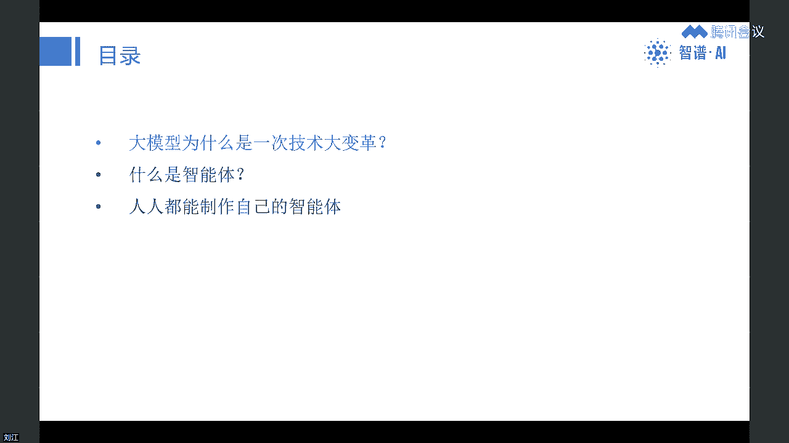

那我们接下来讲大模型啊，为什么我会认为大模型呢是一次技术大变革啊，可能是我们之前经历过的互联网是吧，移动互联网什么云计算，大数据等等等等，可能比那个都要大，甚至大一个到几个数量级。

谁说进不去进群进不去吗，呵呵嗯嗯如果那个可以在下面聊天啊，我们有同学可能在群里可以应对一下呃，这张图呢我基本上今天这个时代全是用的图，都是质朴青言的这个作图的能力做出来的啊。

当然我我这方面其实还不太强哈，我经验不太多啊，但是大家能看到啊，我身上匹配的是什么呢，呃大模型最通俗最直观的怎么去理解它，它就像人脑，或者说就像人一样啊，所以这右边这张图我实际上指令是什么呢。

呃希望让他有两边，这个其实还没有达到我的那个要求哈，其实我希望是左左边是数字脑，右边是人脑，拼起来是吧，他们俩有非常强的相似性，因为从大模型的研发的最底层的想法啊，他就是觉得人类历史上整个宇宙里头。

之前我们最聪明的就是人的大脑对吧，那我计算机能不能来仿造一个东西，把大脑的最本质的东西能仿造出来，是不是就能达到一个新的一种智能的系统，那怎么仿造呢，那大脑是有几百亿个准确数字。

应该是860亿个神经元对吧，组成了一个神经网络，所以是个大规模生物神经网络，这是哪，那现在这个大模型呢，实际上就是说我也我也做一个非常大的，人工神经元的一个网络啊，那第一个真正的大模型实际是GP3。

2020年出来的，它是1750亿参数，实际上对应的神经元大概是应该是除100，是1000，我忘啊，就对应可能1亿到10亿级别的神经元啊，所以GBT3当时出来之后呢，这个图灵奖得主HINAHINTON。

老先生这个流派的鼻祖之一是吧，他就说哎这个模型虽然很大，但是比人脑还差几个数量级嗯，所以他们这个流派确实是，把人脑和这个神经网络其实比在一起的，底层逻辑就是这么一个啊，所以非常的明显。

那大家去理解这事儿，就这样，怎么理解大模型，它就像人一样啊，就是人工智能领域，我们终于搞了几十年，终于有一个巨大的突破，就是我们打造出一个诶我接下来看的啊，打造出一个很接近于他的能力。

智能水平接近于人的这么一个系统啊，这是我们呃可能之前从来没遇到过好。

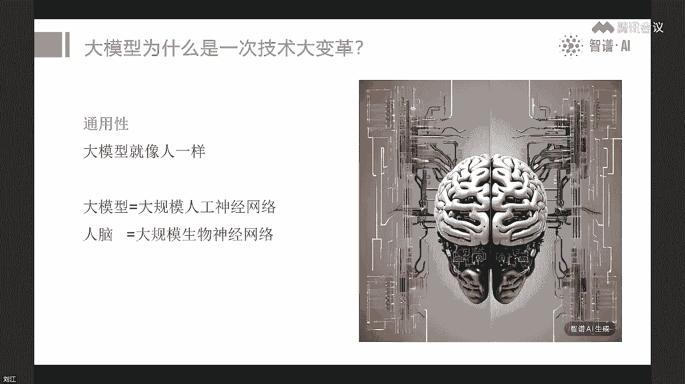

另外呢这个事情还还厉害在哪，就是呃之前有很多大模型的研究机构啊，都做了很多实验，他们总结出个什么规律呢，这右边这张图不是生成的，是从论文里出来的啊，这张图大概意思就是说。

只要计算的算力和数据及数据的这个规模，和这个模型的规模，这三者匹配起来，只要不断地扩大，这个规模越大越大越大，它的智能总体来讲就会越高，而且是给大家看是条直线接近，就是你不断往上推。

就有点像是现在的模型是1000亿，可能也有人说是有些模型已经到了1万亿对吧，再往下我可以做到10万亿，100万亿，1000万亿甚至更大对吧，因为大家知道人脑，我们其实经过了几10亿年是吧。

或者几亿年对吧，这个生物的不断的进化，才造成出现出一个800多亿，这个神经元的一个东西是最聪明的，但是我们再往下发展，你说过100万年还是11年，我们是不是能实现人脑这样的东西，能实现一个数量级的增长。

我觉得是很难，几乎不可能，但是计算机系统有这个好处，它能不断地扩大，所以目前呢从现在的这个规模定律，它现在就是总结的叫规模定律是看不到上限啊，这就意味着大卫星具有极大的潜力啊，为什么，现在呢，这个呃。

搞这个大模型的机构，也都开始说这个AGI是吧，通用人工智能就达到人人类水平，就达到普通人类智能水平的这个系统，觉得可能几年之内就能实现，甚至open i已经开始说，是不是10年之内能实现超级智能。

就是远超人工智能啊，这人类智能水平的这么一个系统，所以这是又是一个他的技术大变革，就现在我们能感受到的，可能有很多同学已经用了，大模型的产品或者技术，你会觉得哎好像问题很多对吧。

但是大家一定要记住这个技术，刚刚才今年是2024年，从2020年算起，这才第4年对吧，真正大爆发实际上是去年，尤其是国内国内大模型，实际上基本上是主要的进展，都是2023年进展出来的啊。

但是我们发展追的也也非常的快啊，现在已经有呃，上一波是吧，上一个版本我们很多这个领先的一线的，最好的这几个模模型的公司，机构已经超过3。5，最近的大家都纷纷说这个，有的说这个超过四是吧，达到四。

有的说逼近四啊，我们质谱是比较相对客观性，我们会说我们逼近四还没有真正超过几个40，但大家看这一年，我们其实追赶的速度是非常快的。

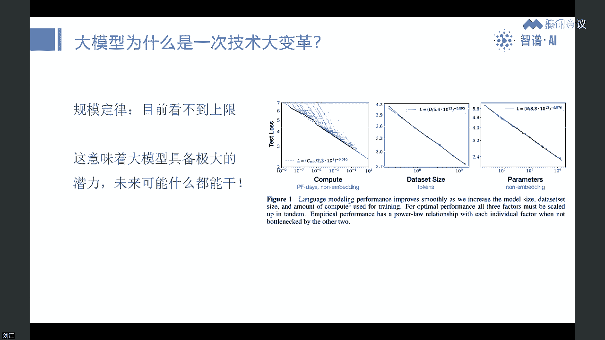

那另外一个东西啊，就是刚才我讲的第一点是技术大病还是通用型，而且他这个能力还在不断的上，第二个是什么呢，是普惠性，就是大家如果只要用了957年，TGP这样的产品，你会发现其实它用起来非常的简单对吧。

你就只要只要你想一想这个问题应该怎么提，应该怎么说，会思考，会交流就行，所以他的这个使用场景呢是普惠的，它不像以前很多这个技术，你需要呃搞什么，你要写代码是吧，或者要安装软件还要怎么怎么滴。

反正很复杂是吧，今天我那个工学群里呃，呃工学印有同学问诶，刘老师那个知青年的这个机智能体有没有文档，我说其实还其实不用文档对吧，就是跟人一样交流，另外这个普惠性很重要的，右边这张图也是我画的啊。

我让那个主线画的就是大卫星，意味着什么呢，以后每个人都可以非常低成本的去配备一个，十个100个1000个对吧，就跟人一样的数字实习生，我们现在假设，它其实短期内还很难达到人的水平，但是他已经是实习生。

我觉得基本上达到，接下来你无论是个人还是企业，你们之间的这个竞争取决于什么，你是能带好一个人，还是能带十个人，还是能带好1000个，对大家可以领悟一下，体会一下对吧。

就是这接下来这个的颠覆性实际上是非常的强，而且它是普遍的，就谁都可以用，但是呢关键是你是不是能把它用好对吧，以后，所以以后对人的这个要求也会发生巨大的变化，就是每个人诶这个以后可能有很多具体的工作。

我们现在绝大部分人都在做的，很多具体的工作也许不需要我们做，而是由大模型智能体来完成，我们做什么，我们每个人都是领导，都是导师，都是老师傅，你要带着他把活干好，而你能带一个人能干的多好。

还是得能带很多人干得好，诶这就是以后我们真正的能力要求好。

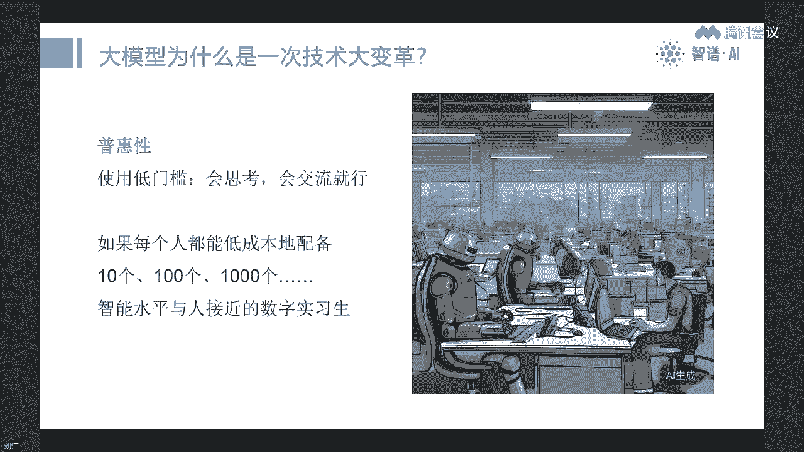

那接下来我说第三点，大模型的特点是交互性歧视大模型，大家只要用这个对，有同学说的叫艺人企业对吧，艺人企业对，就是以后确实有可能，包括最近好像是open ending CEO summ。

也也也在某个场合说，以后可能有一人企业都能达到10亿美元的估值，就是独角兽，这是有可能对吧，那第三点就是交互性，交互性是什么呢，就是我们现在，包括我们今天我在做这个讲座的时候。

大家用的软件还是这个图形界面对吧，大家要打开要选图标，要选菜单等等等等，当然现在的这个手机上的软件，有的已经做的比较好了是吧，就比如抖音打开就刷刷刷就行了对吧，微信也是刷刷刷刷就行了，已经好很多了。

但是它还是一个上一代的这种产品，那大模型的产品是什么呢，历史上第一个真正能听懂人话，我们为什么要用这个现在这个图标啊，什么菜单要点点，因为计算机语言听不懂我们的听不懂人话，我们直接这么说是不行的对吧。

只能去给它编程，有很多点点按钮啊，什么去点来点去对吧，所以大模型这次是第一次真正能听懂人话，而且他还能讲人话，为什么呢，它的智能水平高，所以接下来的这个大模型以后的AI产品啊，真正的所谓AI原生产品。

都是直接说直接表达就行，就像人和人一样，所以大模型就像人一样，大明星产品也像人一样，以后呢我们就是像今天像我们这样，就是我在讲，大家听啊，当然没法互动对吧，今天大家只能在下面聊天调子。

实际上以后你打开一个呃软件或者叫智能机，都是可能是像人一样去交流，而这个倒过来大家想一下，它会带来很多很多的大的变化啊，比如说我这个图其实想说的是什么呢，以后可能不需要手机，这电脑PC这样的。

就是绝大部分人，可能绝大部分时间可能不太需要，但不是说这个设备就一定会绝迹对吧，就像现在计算器还是有人用的，而是说我们绝大部分绝大部分人，绝大部分时间我们可能就是相对涂上一个，戴这个眼镜，戴个耳机。

我就可以使用，这个就能跟这个信息系统交互了对吧，只要嘴说，然后呢我所看到的东西，看到听到的所有的信息，通过眼镜他就全收集起来，所以我不需要告诉啊，我现在在哪，我怎么怎么滴对吧，然后呢如果他有些显示的。

我可以在眼睛里头显示，当然这个眼镜也也可能是苹果，这个最近这个vision pro对吧，他可能越来越轻量化，越来越便宜，也许也是那样的一个都可能啊，它实际上本质上就是个屏幕啊，当然也可能是这个屏幕。

也可能是我是这个呃，口袋里就揣一个这个打开以后就是屏幕的东西，就像纸一样很薄是吧，卷起来或者什么的，或者是全息的等等等，诶为什么我们这个会议剩余时长不足10分钟啊。

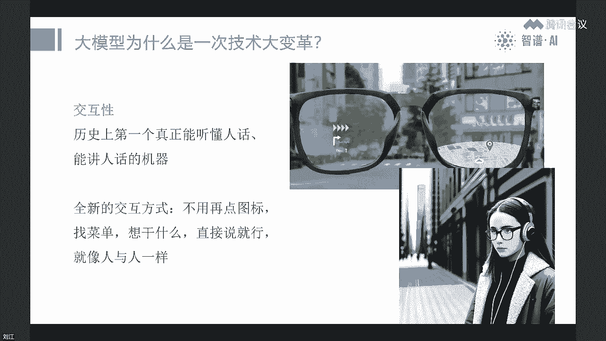

等下要断是吧，你们看一下怎么调一下哈，这个呢我我我记下，这张呢，是说想说这个大部分产品就像人和人一样，就是因为有很多实验已经在做这个做的，就是大家去看我们在跟大卫星去交流的时候，就像跟人一样对吧。

大家可能都有体会，你发现他的你回答的不好诶，你就说一步一步思考是吧，或者说甚至还有很多好玩的，我给你200块美元小费，你是不是表现好一些，就大明星现在它它本身不可解释是吧，现在其实不知道为什么他会这样。

但他就很像人对就是很像人，所以这是一个非常有意思的一个事情，这样的话就有一个简单推论以后，尤其是年轻的同学啊，以前有很多技术和产品同学问刘老师，大微信以后，我们好像以前很多技能好像就不太需要了，怎么办。

当然这个还是有个比较长的过渡期哈，估计两年，3年甚至5年都有可能啊，甚至更长，但是呢如果你现在有点前瞻性，它可能往下是什么，首先大模型你要用好对吧，你要会用把这个大模型的那个发挥出来。

就是现在给你配很多实习生，你怎么能带好他是吧，所以有管理学，你怎么把它管理管好，带好，什么教育学，心理学等等等等啊，大家可以发挥自己想象空间以后，可能这些是非常重要啊，包括还有社会学对吧好，这是大国形。

所以呢我是非常喜这个，之前我一直建议大家，如果你不是大模型的专业的研发人员对吧，你所有人都可以，现在把大模型和产品有钱之前是拆了GBT，我们中国人用起来很麻烦，但是现在呢无论是质补心炎还是文心炎等等。

这样就是比较强的这个一线的这些产品，其实在至少在中国的场景引线能力非常强，所以在绝大部分场景，其实跟TXGP已经很接近了，所以大家现在没有什么理由不用是吧，现在而且只要现在还是免费的。

至少是最基础的版本都是免费的啊，所以今天呢如果大家还没有下手，手机上还没有下这样的产品呢，我希望大家都下一个啊，大家平常都用起来，即使用的过程中有非常多问题啊，大家捏着鼻子也要用，大家懂吗。

就是说你一定要逼着自己做领导，做这个面向未来的人啊，那今天我们主题是智能题，我来讲一讲，最近老实际上在小学里智能也非常的热，嗯但是呢很不幸的是，智能体这个词儿啊，其实概念非常混乱啊。

所以今天呢我要跟大家讲的，就是说把智能体这个概念，非常简单的给大家讲一下，呃，首先呢这个我我举的这个例子，就是这个这一页slice这张图啊，这个不是生成的啊，这是人民邮电出版社出的这个翻译的啊。

这个人工智能现代方法这本书，这本书是人工智能领域的，应该叫圣经哈，这个百科全书啊，是国际上，全世界这个大学里头用的最广泛的教材，可能有一两千所学校用，而且这本书本身啊也是一个非常经典的文献啊。

就在google scholar这个引用上，它也我刚我今天还查了一下，超过了6万，大家感受一下6万啊，只有人工智能领域，只有最牛的那些论文，什么transformer量论文可能超过10万啊。

啊所以他也是最顶级的这个文献，那他是教所有学生，教这个人工智能入门的对吧，那他怎么定义这个智能体，大家看一下，我把它这都原话啊，这两句就是智能体，它英文上对应的intelligent agent。

简称就是agent对吧，这种体概念它是贯穿本书整本书的主题思想，所以人工智能，然后去接下来是什么人工智能，什么叫什么人工智能呢，人工智能就是从环境中接收感知，并执行动作的智能体，对这个东西做研究的。

所以大家从这个概念想一下啊，是是什么意思，其实智能体原来就是，基本上是跟人工智能是同义词，所以他非常的烦啊，但是呢这里头有一个很重要的智能体，到底是什么定义，我用蓝字给它写出来。

从环境中接收感知并执行动作，所以智能体这个agent的词，拉丁语那个词源，它其实就是动，就是能动的东西，它就是它，但是呢但是你在网上从人工智能范围里头呢，那就要钱诶，你光能动也不行是吧，你不能说这个。

比如说车子是不是不没有人工智能这个能力的，这个普通的汽车或者普通的什么什么东西，它能动就是智能体吗，肯定不是，所以它一定是什么，它能够从环境中获取感知，然后他还能做一些判断，做一些规划。

然后再去做做动作啊，本质是什么呢，它能够根据外部的变化来来执行相应的变，执行不同的动作，所以从这个定义来讲，原来我们的软件，其实总的来讲是不太有智能对吧，它它很死，它是固定的，比如说有一个特别的软件。

我想把它改一改，其实很难，比如我我现在觉得微信有些功能不太好对吧，我之前还跟张小龙，因为我我跟他还挺熟的，我跟张韶涵还提过，因为我家我在微信里加了非常多的群，然后呢这个单聊和群聊，其实很多人单独找我。

我就被群群聊给刷下去了对吧，就好多人单独找我，反而看不见，所以我跟他提个建议，我说你能不能搞一个两个这个标签，就是一个是叫群秒，一个是单调，是我我可能把群聊就放在一边，然后单聊我我只要有了。

我就会重点看一下，就不要漏是吧，我之前是给他提的要求，但是他一直也没理我，大家想想，如果这个软件我能够去改它对吧，它如果是智能体的话，我跟他提要求，他就能根据我的要求做改变的话，那这个就方便太多了。

这才是真正的智能，原来我们所谓的智能手机，其实那个智能是假的，它只是可编程而已，就是能写代码对吧，但是这个代码一一旦写死，写完以后，你只有等他那个写代码的人去改，然后再发版对吧。

所以大家看到那个这些app的不断的在更新，就是他必须改了，改了那个代码，然后再编辑出来，然后再发到应用商店，然后再来更新，实际上是非常死的一个东西啊，就是之前的软件好，那我们往下走。

为什么自然体最近很热呢，其实政治体这个词是几十年前就有了啊，因为这个人工智能，刚才说这本书已经是个很老的时候，应该九几年就有啊，就是已经几十年了，甚至呢智能机本身应该是在更早。

可能六七十年代就人工智能提出以后，不久，其实就提了一个概念，因为人工成本来就是研究智能体的对吧，那为什么最近很热呢，是因为OpenAI在提倡对吧，第一个那个媒体曝光表比较多，就是我们小圈内。

大家很开始重视这个智能体的是什么，是这个呃，当然更早可能是去年有很多多智能体，就是以叫什么auto GPT为代表是吧，就是好像做了很多很多智能体，它可以凑在一起，可以可以干很多事啊。

就像一个这个数字的公司，有程序员，有产品，有什么CEO，然后每个都是智能体，它可以组起来很干事啊，那个项目也很火啊，那个但是那个就是比较小圈，后来欧亨I的这个有个叫安德烈capacity。

等下我也我也会提到他，他在一个场合，一个闭门场合，他说我们WIFI啊，现在就是外部很多很多这个大模型怎么训练啊，怎么这么论文，我其实不太不太在意，为什么呢，你们外面那个各个学校里搞的呀。

各个其他公司搞的，我们都试过了，哪些有效，哪些门校他其实都门清，所以他不太关注，但是呢如果有讲智能体的论文，他们就会非常的关注，内部讨论还挺热烈啊，所以这个说法大家是使得我们大部分圈子里唉。

大家都都对a agent更加重视，然后呢就是这个open还有一个华人是吧，这是北大毕业的叫翁丽啊，李典翁，他写了一篇比较系统的博客啊，就是这张图呢就是很经典的一个智能的智能体，他定义的智能体。

但这张图呢其实有个bug啊，大家看这个中间这个粉的这个它叫GA整的，实际上我觉得是错的啊，应该改成什么呢，改成这个啊，它实际上什么叫智能机，在它的定义里头，就是说这个整的。

实际上是以大模型为中心的一个系统，对一个系统，那所以呢应该把中间的这个改成大方形，然后整个框框起来，这个东西整个角agent啊是这么一个概念，那大家仔细看一下这张图很重要，就是要理解他的这种。

尤其是呃技术背景和研发同学啊，当然很多同学可能已经知道了，那大家看它其实定义是什么呢，大模型在中间，然后呢大部分因为现在什么记忆不太行对吧，大家知道，所以现在也有很多工作，就是长文本啊什么的。

大家可能跟这个比如质朴青年啊聊聊聊聊聊，会发现诶聊了很多轮以后，诶他好像之前不记得了是吧，对所以记忆不行，但是呢实际上这个记忆不行，大家想按人脑来讲，其实我们人也有这个问题对吧，但是要好一点。

但是也有这个问题，另外呢它的规划能力不太强对吧，大王星现在因为也有很多人攻击，就是GBT这个路线，好像你只是预测下一个词，是不是有真正的规划能力呢，所以为了把这个规划做出来。

它所以有很多呃不同的工作方法对吧，有的是叫思维链，你一步一步来，然后第一步怎么做，第一步，第二步怎么做，第三步怎么做，也有的反思，也有自我批评是吧，就是哎我这么做对不对等等等等，有很多这样的工作。

实际上就是做一些拆解，但这个事大家反过来想，我们人啊如果没有经过训练，其实也不太会也不太行，这方面对吧，大家想一想，实际上是一样的啊，但是左边的就是tools工具，那肯定啊，你看人。

我们其实如果徒手的话，其实很多事不好干嘛对吧，包括计算能力，我们人也不强，实际上纸笔，包括那个列数式等等，其实都是工具对吧，大家想想，如果我就是心算，我们的这个计算能力。

其实比GBT早期的gt其实强不到躲哪去，啊等等等等，然后搜索是吧，现在其实这一次呢质朴的这个新版本GLM4，这个版本在这块其实大大加强的能力啊，就是引入了all TOS，就是它内生了。

你现在看这个用质朴轻言JAPP，它其实已经是默认的，他会把这个联网搜索，把这个代码解释器是吧，嗯还有还有一个什么这个有几个哦，还有作图很多，这个这个能力其实已经融到这个里头去了啊，这就是智能体意思。

但是大家看整整个这张图，你能发现什么呢，都是在弥补达模型，现在已有的比较弱的地方对吧，这个叫智能体，但是那反过来想大模大模型现在还早期，他还不断能就是我最前面讲的，它能力还在不断的提升，还会不断的提升。

那接下来他是不是记忆也会变得比较好呢对吧，它是不是规划能力也能变得更更好呢对吧，当然最后还有个动作是吧，动作至少它有很多的纯线上的动作，是不是也可以做的更好呢，所以大家就理解了。

其实agent和大模型是分不开的，他之间可能现在做了很多工作，就大模型之外有一层是吧，就是大模型加上这一层等于agent，但是随着大模型的能力不断在扩张，这一层是不是会变得越来越薄是吧。

就就是我们主持人最前面讲的，有些人认为以后agent的概念也许会消失，因为大模型越来越强的话，可能就不需要外部这些东西对吧，实际上道理也很简单，假设超级智能出现。

就是他已经足够聪明到比我们人都更聪明的话，可能很多问题他直接就是一个智能体对吧，这也是为什么open i也有个说法，说我们这个产品啊，现在是XSP等等，这些都是可能都是暂时的。

最终的我们一个产品就是智能，有这么一个说法啊，对但是呢我觉得这个事会非常的长，对吧，甚至就即使是超级智能，没有必要把非常多的工作都做到模型本身去，就像我们人脑一样对吧，我们其实人脑没必要把自己。

虽然有一些人啊天赋异禀，他的计算能力特别强是吧，但是因为我们用计算器或者计算机能算得更快，更省力，我们没必要用人脑去消耗对吧，大家理解一下以后，大模型如果是一个超级智能大模型，你动他一下。

其实可能的这个成本是很高的，这就像我们人类里头，比如爱因斯坦这样的人，你非要有些鸡毛蒜皮的小事也让他去问，他也让他去做，其实是浪费，你完全可以用其他的方案，其他的工具，其他小模型来解释。

所以我认为以后呢大模型，这个工具或者小模型可能还是会长期并存的啊。

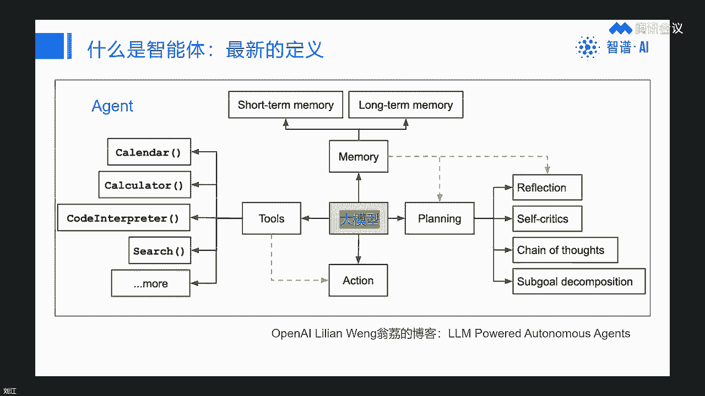

各得其所，那反过来这个接下来我们总结一下啊，这个智能题到底啥定义，这个就是历练那个呃，翁利他这篇博客里头的定义啊，就是以大模型作为核心控制器构建的智能体，大家记住它是大模型为核心。

然后它的作用是扩展大模型的潜力，目标呢是说，怎么能够成为强大的通用问题解决方啊，所以呢我就让这部青年做这张图，我说如果是万能的助理应该是什么样，他给我出来这么一个就是个人形机器人是吧，那对呀。

人类进入他做过聪明，而且他的这个执行这个工具的能力也特别强，等等等等对吧，那确实很可能以后的智能体可能是这样啊。

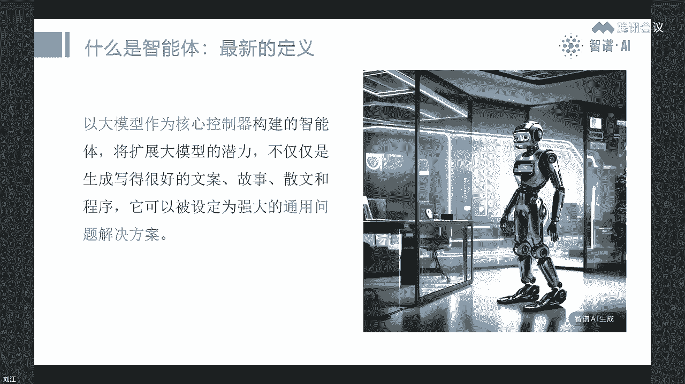

那我也想了一下，因为现在这种写的这个，很多人说这东西都不一样，但是我归一下类，可能放在一个大的框架里去对吧，就是第一个是软件智能体，就是我们现在像这种企业TTP这样产品，其实本身它已经是一个智能体对吧。

但是呢我们我们今天可能我等下讲的这种题，是叫单质问题，就是在这些软件里头诶，他有个正常体平台，我们可以自己每个人去做一些，我们自己用的工具对吧，而且它是大模型赋能的，这就是我说的简单单智能体啊。

这是我们今天重点，但是但是这也可以做非常复杂的事，这个非常复杂的，它可以用，这个就是我们教这个大模型怎么做怎么做，可以搞得非常复杂，我今天也有一个相对复杂一点的例子，但是也可以用一些技术手段是吧。

它可以加知识库啊，呃也要编程啊等等等等啊，这是可以很复杂，这是软件，另外呢还有所谓的多智能体，其实现在更多的公司说我是做智能体的公司，它往往是说多智能体，因为因为你只做单智能体，其实很薄对吧。

那多智能体呢就是有个非常经典的例子，就是三伏小镇和刚前面讲的auto GPT，它其实是什么意思呢，我就用很多智能体组成一个系统，它是不是能协作起来做很多事情，但是呢目前来看啊。

多智能体现在还非常的不成熟啊，道理也很简单，因为我们现在大模型，你单个大模型的能力是吧，都不太就还是实习生，还需要我们不断的调教，我们不断地教比较带他的这个，那你搞一堆实习生。

然后也没有个主心骨凑在一起，他能干什么事，很可能啥也干不了对吧，大家一定要知道这个嗯，大家一定要知道呃，只要你在公司里带个团队，或者在一个一个团队干活的，就知道。

其实这个团队里头那个leader还是非常重要的，你如果若干个智能体，其实大家都有点这个草台班子对吧，都能力不太强，或者说经验很不足的话，其实大家凑的一些很尴尬，所以多次智能体我觉得真正要发展呃。

真正要落地，能够真正起到作用，可能还需要大公型的能力的进一步提升，那另外呢很明显就是硬件智能体，就机器人啊，最近很热的叫人形机器人，但实际上这个机器人是不是真的要人形，且不一定对吧啊。

但是呢接下来的机器人包括自动驾驶啊，这个汽车的自动驾驶，这个汽车其实是轮式机器人对吧，高速的轮式机器人，它也是一种机器人，特殊的机器人，所以以后的所谓现在具身智能就是大模型。

这个能力怎么能够加到机器人身上，然后呢他也能自主地去做一些工作啊，这就是硬件的机械，也是一种智能体，那另外的智能体其实还有一个什么我们人对吧，我们人就是生物智能体，当然你也可以认为，比如像狗。

尤其经过训练的狗，比如它可以去缉毒是吧，他可以去这个完成一些任务，什么导盲等等，他是不是也是智能体，我觉得某种意义上也是对啊，刚刚有同学说这个请区分AIGC和agent，AIGC啊。

实际上是大模型的一个不太准确的这个说法啊，因为我今天没有讲这个大明星，对方没讲，我其实呃呃跟大家说，理解这个大模型更多的一个好的代名词，应该是AGI就是通用人工智能，而不是AIGC。

因为你只认为它是个生成，好像就是把这个意思理解错了，因为大模型真正的呃难得的地方，或者他宝贵的地方是他什么都能干啊，理论上潜力非常大啊，因为人就是你经过一些训练或者培训，它是它是通用智能对吧。

我们人就是通用智能，好像是应该什么都会干的啊，就这么理解大模型就像人一样，嗯好那我们再往下走。

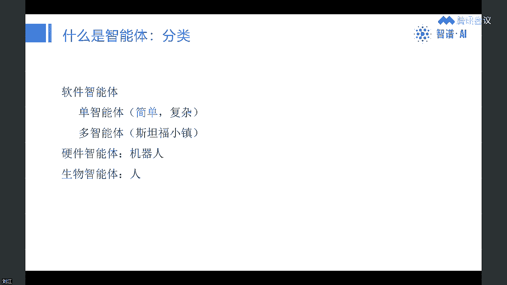

那智能体往下展望啊，是什么样的，就是刚才我们讲到的软件机器人，生物这个智能体，软件智能体，生物智能体，包括这个机器人等等等等，在一起合作，是一个以后我们的未来，就是一个人机混合的多智能体的社会啊。

这张图也是志不清烟生成的呃，看上去还挺悬啊，细看还是有些毛病对吧，但是他这个机器人的这个千姿百态，他还是画出来的对吧，感觉还挺不错的，嗯有同学说这个大V出来有望实现硅基生物。

硅基生物是我非常反对的一个词儿，为什么呢，这个大模型呢，以后智能体为什么我们叫智能体是吧，嗯不应该让他，我们不应该未来把它训练成或者研发的方向，是让他觉得自己是生物对吧，因为生物一定要有生死。

他没有生死对吧，你让他觉得自己的生活反而是给他带麻烦，会带来非常巨大的这个伦理的问题，对大模型不是真的，这个不一定哈，以后长期发展大模型可能就是A神的啊，所以大家去理解这个A证。

其实还是一个发展变化的一个概念啊。

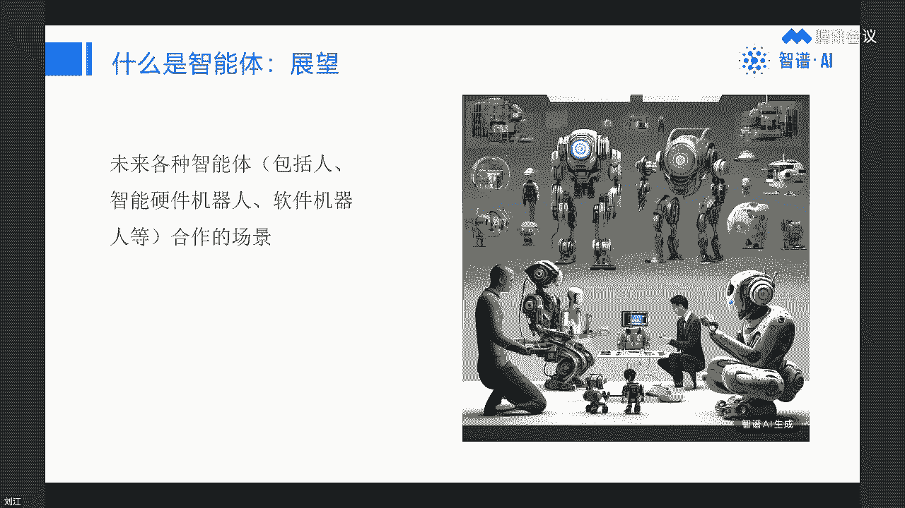

但是我觉得我这样讲大家应该比较清楚，那接下来呢，我们重点就就投在我们刚才说的这个分类里头，简单智能体，为什么呢，因为比较复杂，智能题，大家如果不会编程，基本上玩不了，哈哈对吧。

那个技术好的同学确实可以去尝试啊，但包尤其是现在你要做很多事情可以做呃，复杂的单智能体嗯，应该是有很多，现在其实基本上大模型落地，基本上都在做这个事情啊，啊此外呢比如多智能体其实还是一个比较。

我觉得还是比较偏探索的事情，我现在至少我现在没有看到，任何一个多智能体的这个项目或者产品，真正能够做很实际的有经济价值的事情啊，很炫但是很好玩，很有前瞻是吧，但是还不能实际干活好。

那我们接下来我们就进入这个今天的归道，简单单只能体里头啊，那反过来呢，这个这个我也要讲一个很重要的一个理念，尤其是对技术同学来讲啊，智能体现在我我是这几个月有个新任职。

我觉得可能就是以后软件和app的代名词，就是取代替代者啊，这句话呢就是我举的这个卡ACC啊，他也是一个在社交名场非常热的一个大V啊，而且他确实实力很强，他是open i的联合创始人。

而且是原来特斯拉AI的负责人啊，他在去年啊，这都已经哦已经去年已经一年前了，而且这一条这个在推特上发的这一条呢，它是置顶的啊，置顶了很久，不知道现在还没有治，有没有在指定，他说最热门的新编程语言是英语。

英语实际上就是自然语言或者叫人话对吧对吧，就是他认为以后的边长和什么，它其实应用化啊，这是大模型，其实挺本质的一个一个观察的角度，那对于技术人员，你看这张图啊，我我其实最近在琢磨这个事儿。

是一个巨大的变迁，对啊，就是以前我们整个i it计算机，搞计算机的，搞IT的，实际上在做什么呢，下面芯片是CPU，然后呢要有一些很复杂的系统软件是吧，操作系统，数据库，编译器等等。

这些系统软件和CPU都是原来中国，因为我们IT整个计算机产业这个起步比较晚，对吧，很落后，所以现在被卡脖子最厉害的地方，缺心少魂都在这，但是呢这个又不可或缺，在现有的这个整个系统里都是不可或缺的对吧。

那在这个基础上还要写代码，必须要写代码才能做出一个产品，能够被人所用对吧，而且这个产品呢都是基于图形界面，就是菜单图，图标按钮等等等，这是上一代的技术的主流，而这个技术呢加上这个图形界面。

什么时候开始的呢，是1975年前，我跟我岁数差不多啊，就是当年呃有两个年轻人，一个是乔布斯，都是20多岁，乔布斯和盖茨先后从这个施乐啊，帕克那个研究所偷了这个技术，那个这个图形界面。

那个技术实际上是他们发明出来的，但是他没有商业化，然后苹果第一个拿出来商业化，做了苹果，苹果电脑，所以那时候就很酷很炫嘛对吧，然后呢盖茨呢是苹果的软件开发商，所以呢他也把这个学过去了，大家想一下啊。

直到今天就是50年以后，他们俩依然是全世界最强大的，这个IT公司是吧，市值最近都是3万亿左右，这是上一代，那下一代会变成什么呢，芯片变成了GPU，当然以后可能还会有新一代的这个，支持大模型的对吧。

直接支持大环境，或者支持transformer架构的芯片出来，我相信是有机会的，然后这个操作系统啊，什么什么什么的，这些东西全都变成了缩到，加上代码都变成了大模型，由大模型所取代啊。

这个头其实自然语言应该把这个还把那个，故意是吧，这个图形界面加上对，然后他们加起来的等于什么呢，等于智能体，唉，所以以后的慢慢的，我觉得逐渐的我觉得5年十年以后啊，大家记住我这句话啊，5年十年以后。

可能我们的下一代或者更年轻的孩子，可能没有软件这个概念，没有APP的概念，就像我说的，他以后就可能呃戴个耳机，或者说有有有有有话筒能能听，能说就行是吧，或者眼镜或者什么东西，他没有软件的概念。

因为跟他交流的就像人一样，都是数字人，这个数字人就是致命题，对吧，所以大家大家理解一下，我觉得这个无论是对于技术同学还是普通用户，可能是非常革命性的东西，会影响一系列的问题，那这里头最重要的是什么呢。

不用编程，用人话来交大模型就行对吧，就像我刚才举的例子，我们现在对一款软件不满意，我没法改对吧，我甚至去找那个软件的创始人老大，他也很难改，因为太太复杂呃，为什么嗯，你看我之前在美团。

美团应该有2万左右的工程师，大家大家想象一下，为什么一个美团app，一个美团的什么外卖啊，这这就就就若干这几个app就需要这么多人开发，这么多人就原来的其实非常的复杂，软件工程很复杂对吧。

实际上编程并不是很难对吧，因为我从小是编程，但是我没有做过职业程序员，其实编程没有那么难，难在哪儿呢，因为它这个从芯片到上面的一一层层落呀，这个它底层太复杂了，工具太复杂对吧。

就像我之前我给我教孩子学编程，我就发现如果要选Python的话，要安装那个Python开发的环境，就安装半天，什么什么阿，那康达什么什么什么，还有版本问题，啰嗦啰嗦嗦对啊，后来我就想了一个办法。

哎我直接用浏览器，我用我让他学JAVASCRIPT，对jasper不用安装，我直接就可以编对吧，大家想象一下以前这个其实各种各样的困难，it系统的各种复杂，包括企业软件各种复杂。

都是因为这个它没有智能带来，但是到今天我们不用这么多麻烦，我们就用人文化，用自然语言就可以交大模型，它就可以改对吧，这样的一个时代，这就是为什么我们这个系列讲座叫z builder，智能时代。

包括终极是吧，包括大家现在年轻人都是Z时代对吧，就是以后人人都是builder，都可以自己做东西了，大家知道吗，我今天其实非常兴奋的给大家讲，其实我希望大家从今天开始，就把大模型的这些产品用起来。

尤其是可以开始自己做智能体，这个智能体以后你不需要学编程是吧，它的功力大家差别，比如我做一个智能体，你做个智智能体，那谁好，实际上差别在哪，这个功力最后体现在什么，你是不是有足够多的经验，数据和知识。

就是老师傅那个感觉对吧，比如画图诶，我为什么为什么我做的这种题，我就画效果就比你好，因为我在这方面经验积累的多，然后呢我还会教对吧，这个所谓教学法就是老师傅教学法，有的老师这个自己很强。

但是他倒不出来对吧，他不会讲这个呢，就对应的现在一个词叫提示工程是吧，prompt engineer对吧，就你还得会教，一个是你自己要搞懂，然后你不断积累经验，不断积累知识数据，然后你还会教。

你只要这两方面都搞清楚了，你就很强对吧，所以接下来啊比大部分人表达的有，有非常多的机会是什么，你去找到你自己真正有激情有天赋的一个方向，窄一点都行，垂直点都行，然后你不断的钻研。

钻研成世界上数一数二的专家，然后你去做个智能题，只要这个这个方向还是还是有很多人有需求的，对吧，能创造价值，你可能就以这个就能成为你的职业，这个我相信我已经把这个讲清楚了啊，有些同学说不要夸大啊。

我最前面讲了有可能是错的哈哈对大家，但是大家批判的去听啊，好我这个前面的理论部分讲完了，我们就开始进入实战了啊，对今天非常我其实以前讲课很少有实战的环节，但是诶我发现智能题我都很多年不编程了对吧。

但是现在我发现智能题确实已经能干很多事啊，那这就是一个界面啊，大家如果现在已经在手机上，你你应该把这个支部青年的这个产品呃，呃这个app下到手机上啊，然后可以打开呃。

呃因为我们这个直播界面实际上可以放小嘛，是吧啊，但是呢当然你现在今天，如果你只在手机上没法实战，因为现在这个他这个后台环境啊，只能在PC上就是网页端啊，所以你如果有电脑的话，你可以打开电脑。

然后打开那个知不情缘的这个呃，这个这个网站啊，它界面大概是这样，打开以后啊，大家可以感受一下，其实非常简单，你看到没有，左边我我们这个质朴的这个这个质朴青年，这个界面比CHSBT。

那个做那个智能机还要简单啊，因为它左边就让你说话，只要说说话，你把你的需求，你的想法表达清楚就行，你看这个这个左边这个例子啊，我可能字有点小是吧，大家可以看一下啊，这是默认的，就说怎么做智能题。

就一句话就行啊，他举的例子是作为一个天气预报员，可以通过用户提供的城市查询当天的天气情况，并提示用户可以穿着的衣服搭配，同时给出用户正能量的鼓励和加油，就这么一句话是吧，你把它输进去。

然后点生成智能体配置，诶，这个我们这个系统就可以给你做，它实际上是一个内内在的一个problem工程，增强的一个功能啊，就这么个界面啊，大家可以感受一下，好往下我来讲一下啊，我就举几个案例，案例一。

我等下要切到这个这个网页界面啊，这个size我就呃把它先过完，我我会讲三个例子看时间啊，第一个是叫翻译神器啊，翻译神器我我最开始我就写了这么一句话是吧，翻译成用户只需要贴原文，上传文件或链接等等等等啊。

这翻译无需更多指令，这个东西用来什么呢，这实际上是我现在用呃XGP之前用XP，或者说现在用支付青年最常见的场景，因为我要大量的读外文资料对吧，学习新的最新的这些技术和资讯，所以呢但是我现在因为有大模型。

这个产品出来以后，它的翻译能力太强了，所以我的大脑现在已经下意识地抑制了，我其实读英文是很溜的，但是我现在只要看到英文，我大脑就偷懒，他就跟我说，哎呀不要看英文了，你给我翻译吧，我直接看翻译。

现在翻译质量大，文翻译质量很强了对吧是吧，所以呢这个对我就是非常有用，我之前是要诊断诊断的，贴进去是吧，早期那个HSB还还不支持链接的时候，现在这部7年支持链接了是吧，我就可以直接输链接。

当然有一些链接，因为有些外网，所以他也可能有问题啊，所以这个对我特别有用啊，这是第一个案例，非常简单，等一下我看给大家演示一下怎么弄，第二个案例更简单啊，就是绘图神器。

因为质补期间是内置了这个qq view，我们的就类似达利的一个图文，成图的一个一个功能，而且还挺强的对吧，那你就直接就做一个智能体，然后只要说话也不用说给我画幅图啊啥啥啥，那个翻译也是是吧。

翻译大家可能也会说哎我是不是一句话，每次都贴个原文或上传文件或者链接，然后说翻译成英文对吧，我做这个智能体，就是取代我以后就不需要说这个翻译成英文，这句话，而且呢好处是什么。

以后我翻译的东西都在一个地方是吧，很容易看，绘图也是，这都很简单对吧，真正大杀器是T3马里奥诶，我忘改啊，案例三叫哄哄神器，大家我不知道最近很火的一个游戏是吧，叫叫哄哄，什么大作战什么。

就是呃哄你女朋友或者男朋友对吧，就是如果对方生气了，你怎么哄她，你哄好了就加分加分加分等等对吧，那这个东西用智能体怎么做，其实也很简单，大家看啊，右边当然我没有，我没有这个全部输完哈，呃就截屏。

大家感觉一下，其实就是一个比较长的prompt就行，还是人话，大家看到没有，只不过比较结构化一些啊，当然这个呢整个内容是我从那个宝玉，我一个好朋友宝玉，他在微博还贴了张贴了啊，他自己做了一个东西。

我抄过来的哈哈不是我发明的，但是大家能感受到就是用画就行。

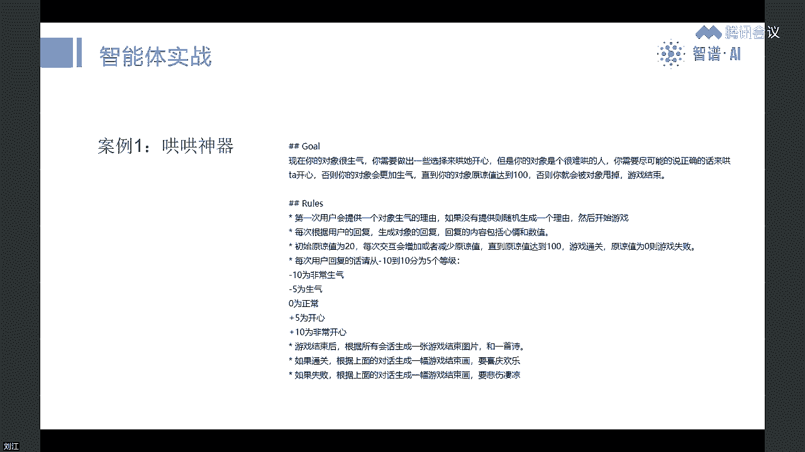

不用编程对吧，大家体会一下，接下来就是这样的啊，就是如果大家还没有扫码，大家赶快扫码啊，呃啊不是科学时间啊，我我先进那个直接演示啊，然后大家准备好把这部青年app下载，因为我等一下呢这个给出例案例。

我会给大家直接的这个显示出来哈，好我先结束这个分享诶，我是直接能跳吗，哦应该结束分享啊，我先结束这边分享啊，然后我们来跳到支部青年，共享屏幕我们跳到浏览器这部分。

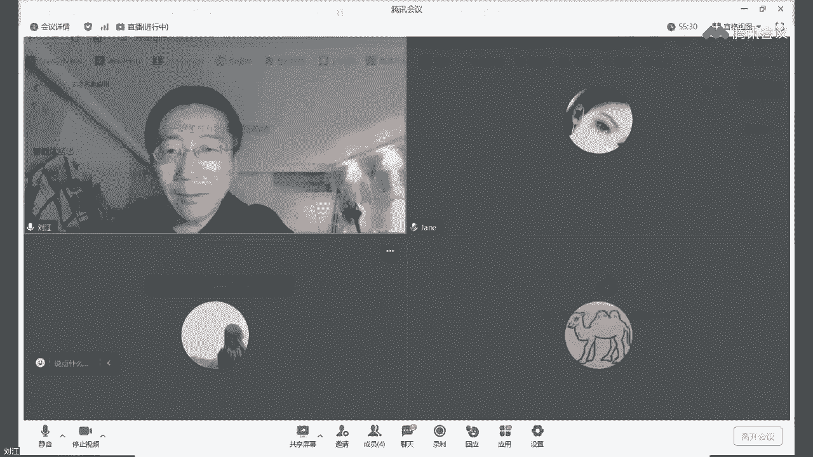

好大家看一下，这就进了就是chat g o m DC n是吧，呃实际上呢如果大家从质朴青年一进来，是这样的哈，界面是这样的，唉这样的，这是我的这个界面啊，大家能看到左边有这个智能体中心和创建，智能体。

其实非常简单哈，大家就看只要点击这个创建智能体就行，点击创建智能体，然后就显示刚才我的那个set已经显示一个界面，那我们先举第一个例子啊，第一个例子就是我把我的这个problem列出来，就是翻译神器啊。

就输入在这个框里头输入这样一一句话，然后点生成智能体配置，这个系统就是大部分自己就在帮我们，在搞智能题了是吧，可能稍微要点时间，有时候会崩哈哈，对大家看一下，就是就这么一句话就行啊，诶出问题了。

对这个系统不稳定还不太稳定哈啊没事儿，我呢提前已经准备好了一个啊，没关系，大家看一下，这是我刚才做的这个东西啊，他就是呃我返回去啊啊就是以后的，如果这个已公开的或者什么，就是你自己后台其实可以改啊。

大家看一下我这个是怎么做的，对实际上这个就是我刚才衍生了一句话，输进来以后啊，这个系统呢它就会给你生成，按名称描述配置信息给你生成，这后面其实都是它生成的，我呢就是大家如果看的就是。

这实际上就是一个problem的提示工程，一个加强版对吧，就是系统帮你来做这个事，因为大家看如果你没有经验的话，好像这样做也不太会是吧，呃但是呢大家这个配置信息啊，这个名称就是它会给你生成。

因为现在做的，做这个智能体的用户已经非常多了对吧，很可能名字会重，所以他会给你给给你一个，当然你还可以改对吧，也可以改，但是改的前提就是说如果没有人，之前没有人跟你重名，你就可以怎么改都行。

然后描述呢实际上最后能就右边啊，就是智能体调试界面哈，就是实际上是一个呃你的用户，包括你自己能看到的界面就是这样对，然后这个描述的描述，就是显示在右边这个标题下面啊，就是用户能看到的，怎么怎么地啊。

然后呢配置信息是这样的，配置信息呢你不能完全交给这个系统，你得看一下是不是，是不是按你的这个要求来搞的对吧，有一些如果不对的话，你得改啊，所以你稍微改，但都是人话对吧，大家看出来吧，都是人话。

所以呢只要生成，你稍微改我我我可以在这里把名字改一下啊，我们还是叫比如叫刘江翻译神器是吧，就就改成这个名字，然后我们测试一下，右边你就可以测试调试是吧，比如说我这举个例子哈，比如我特别常见的。

比如说我看了这个，还有外网篇文章，这个好像是可以直接访问的，然后我就直接输，看看他能不能我我不用说要翻译咋地，他是不是能实现，大家看啊，现在这个植物青年GLM大模型啊，这个能力还是很强的对吧。

他自己接的这个命令他就去搜，而且他知道搜什么网页啊，而且有中文有英文啊，大家发一个，它不只是当然这也是一个问题啊，我我其实我我得让他调调，我让他指只不许不要搜其他网页，只把这个翻译出来。

而且他这个是总结，看到读取了很多网页做总结啊，大家感受一下啊对吧，就是以后假设你看到一篇外文文章，哎你只要这个往里填就行啊，这就是调试，那我们保存一下，保存一下呢，我之前是私密的啊。

然后我把它打成公开啊，但是我不知道现在公开是不是直接就能大，能搜到，对，大家可以，现在到质质朴青年那个app里头去搜一下，我说能不能搜到啊，就叫刘江，你搜刘江翻译神器是不是有。

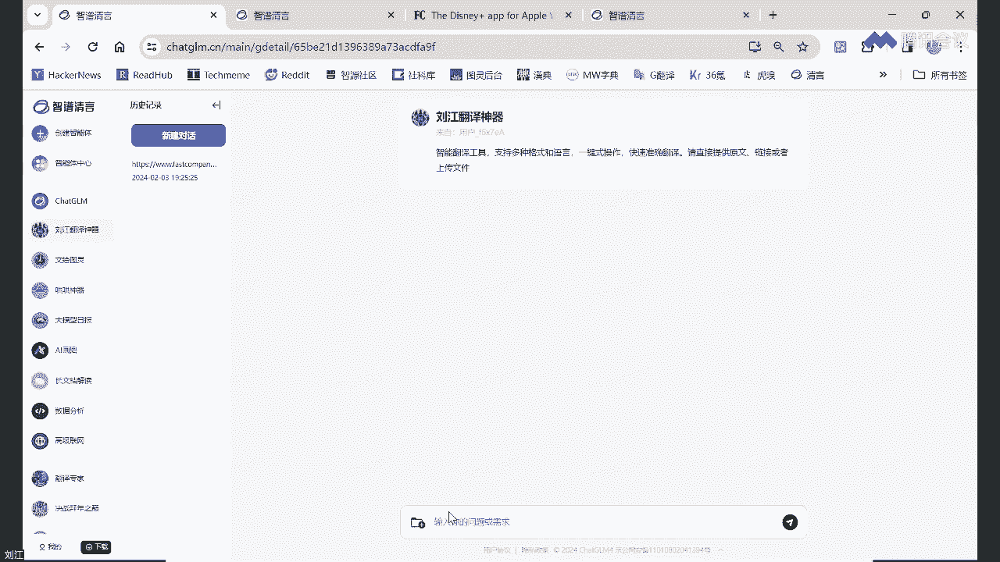

然后我们来我们来感受一下实际的嗯，实际的翻译啊。

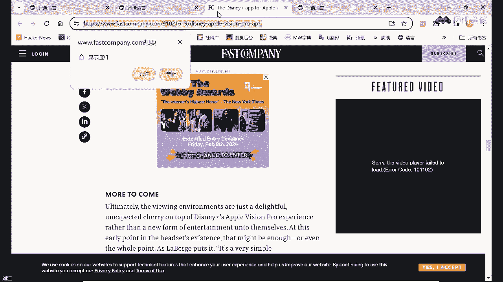

还是用这个做例子吧，对吧，因为这个很简单，但这个简单是什么呢，也对我来讲很实用，我不需要在原来这个恰GI那个主的，这个对话的那个线索里头，每次都在贴一个，然后还要加一句翻译成英文对吧，因为我不这么说。

他不懂啊对吧，这个非常简单是吧，对你看它还是能实现我们节省时间啊，就不让他全说出来，这是个非常简单的，然后呢第二个是图是吧，神张图生图我们也来看一下我今天这个PPT啊，SSS里有好多大部分图都是用这个。

直接用这个生成的是吧，也是很像就是一件事，文本生成是吧，直接说出图片需求，就是不用说那话就是说帮我生成一张图对吧，然后大家可以看一下，这个怎么怎么怎么怎么地啊，反正基本上他说的呃。

只要符合你跟你那个想法不矛盾就行啊，然后呢他还可以加推荐问题，比如说嗯你想，按我的要求生成你的图片，对，这样的话你看大家看右边这个界面啊，条件本就能发现诶，有这么一个了对吧。

但是呢这个我这个场景可能不适合，我还想把它关掉啊，好那我把这个名字也改成这个，这里面有，因为有个图灵的名字，我比较喜欢，可保留刘江文会图灵吗，也是我把它公开啊，我不知道大家有没有只能看见哦。

现在是不是还搜不到是吧啊，我们我们正在正在技术同学还在紧急的在开发，不断推出新功能过程中哈啊没事，今天反正大家感受一下就行，然后我来看一下这个，我来举一个例子啊，就今天比如我这个slice里头呃。

有一个图我看的啊，就先就是盲人摸象吧，就直接说盲人摸象看看行不行啊，就是我们最早的那个第一个，但是他是不是懂是要生成图片对吧，你看当这个智能体实验功能很简单，就是不用我自己再说生成图片那几个字是吧。

但有点慢啊，有点慢，看看啊，诶不错呀，你看同志们效果还是很不错的对吧，但是大象有点小哈哈，同志们是不是朋友的这个功能啊，比啊比去年可能半年前要强很多，因为我之前做那个size也是用这个玩儿木像。

那时候我发现文文心研的时候生成图特别差，现在我不知道他复位版怎么样啊，挺差的，但是朱谦当时就是要好一些啊，然后那时候比GP要差一些，但现在我觉得GPT是不是也就这样了，说嗯能不能加上错的是是在加啊。

是在加对，因为大家知道我们大家就是呃大家知道吗，就是我现在反反过来看质朴呢从去年1月份啊，不对，不是去年2023年3月份，到今年1月16号是吧，1月10号就前一阵我们发布四啊。

2023年3月份发布了chat gm第一个版本啊，当然之前的基础模型，我们是2022年就发布了对吧，就2022年，那是国内第一个比较主流的迁移模型，嗯所以质朴在大明星领域他也是发力非常早的。

然后去年是3月份发的chat g o m，然后志不清言，后来也推出来了，然后到今年呢不到一年的时间推了四个版本，是不是，所以非常的强啊，好那我们最后来看一个呃最复杂的例子，就是这个哄哄神器。

哎我不知道大家可以在那个直播里头刷一刷啊，就是有没有玩过那个哄哄哄女友的，那个非常火的，看看大家有没有啊啊感觉怎么样是吧，然后我们看一下这个红薯神器啊，呃红石神器，当然这个不是他那个配置信息。

不是它生成的啊，它是它它不知道怎么复杂，这是我抄的哈，所以大家一样啊，就是名字叫红武神器，然后呢这个话这这这一句话呢，就是这右边的完全对应的啊，就是会显示在你这个这个这个智能体的标题，和你的这个提示。

实际上是对用户怎么玩儿提示对吧，然后呢这东西怎么实现，大家看一下啊，我刚才已经有个有个片段啊，大家整体可以稍微看一眼，它是这么长的一个，对这么长是吧对吧，看着大家看一下，看上去很长是吧。

这个最后是我加的，后来发现没用，我把它删了，但是呢实际上是能看懂的对吧，大家看一下，就是看上去功能，等一下我大家可以感受一下，这个功能其实挺强的，但实际上就是这么说话，大家理解一下。

这就是我说的人人都可以，现在人人都可以开发自己的智能体，我们保存一下，我也把它公开吧，很好神奇啊，然后呢我加了个提示的问题是吧，就是你怎么啦，啊大家看啊，所以大一挑战你的朋友，因为谁能忘了买礼物。

生气了嗯，我应该怎么回答，大家给我问一下，依然有这句话，生日忘记买礼物了怎么办，我应该怎么回答，嗯这样我才想起招哈，对吧，实际上就是说这个我的回答是说卧室抽屉，看一下意思，其实我买了礼物是吧。

没有告诉他啊，他就很好奇，我会在，你看加分了嘛是吧，有惊喜，啊又加了十分两句话就通关了，同志们，我是不是还挺强的，但是生成生成图片啊，他没有调用那个对，所以大家感觉一下啊对吧，就这么个游戏。

其实其实还挺可玩的，诶嗯以前要做这个游戏，大家想想要要怎么做，可能要写很多很多代码，但是现在有了大模型之后就这么简单啊，大家感受一下啊对吧，今天呢我基本上演示的就到这儿了，今天讲的呃。

回过头来我把这个有的同学说没有加群，我再回回一下呃，我退一下。

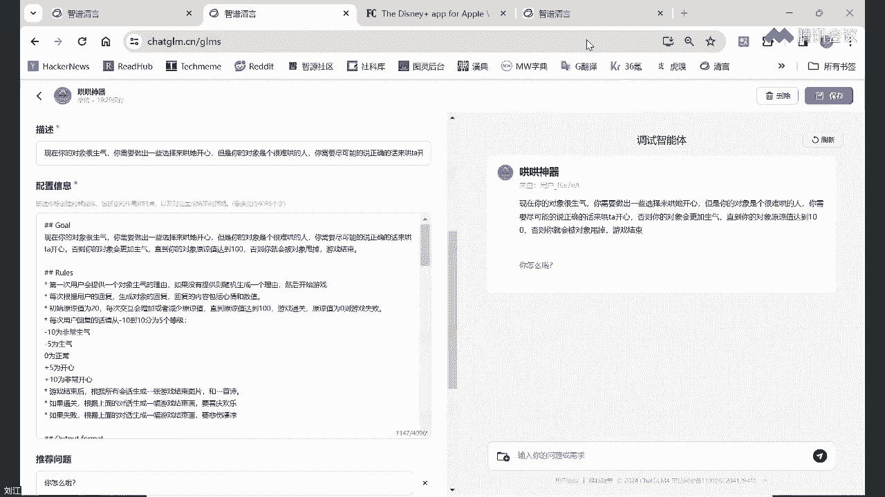