# 4090单卡可跑丨CogVideoX视频生成模型 - P1 - ChatGLM - BV1dH4y1c7cX

呃大家好，我是coco video x团队的杨卓毅，然后今天我给大家讲解一下呃，coo v o v9X所用到的一些算法相关内容。

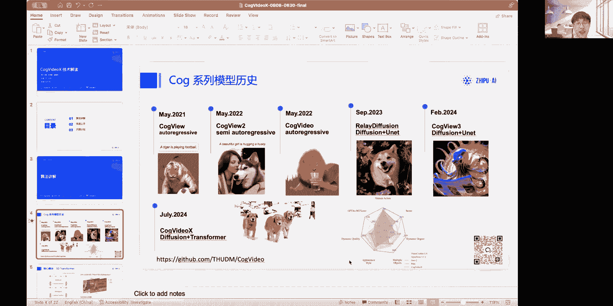

然后首先我先给大家介绍一下我们啊，cover系列的历史，就是在2021年的时候，我们就已经开始使用，就是大规模就是大规模transformer来预训练，这个文生文道图的生成模型。

当时使用的是一个叫做auto regressive技术，就是说把图片分成很多块，然后从左上角到右下角一块一块的生成啊，可以看到当时的这个呃，当时的技术已经可以生成一些现实中，现实中不存在的物体。

比如说一个老虎在玩足球，然后随后呢，因为这个auto grave它速度过慢的问题，我们还对它这个过程进行了一些改进，变成了一个半回半次回归的一个模型叫cover u2，同时它的声音效果有个常大的提升。

然后在同年啊，同年同月，我们也开开源了第一个呃大规模的视频，文文文档，视频生成模型，co个video诶，我们现在这个coy video x，也是也是在这个系列上继续传承下来的，一个一个模型啊。

当时这个维模型也是也是当时开源的最大的，并且效果最好的一个文生图模型，并且它是一个全领域的，可以生成任意任意可以接受任意输入，然后生成任意输出，然后之后我们把技术站转到底，修刃上呃。

额做出了一个靠V3的模型，然后他目前效果也是，打败了当前当时的一些开源模型，然后最后就是我们今天的主角cover videx模型啊，它主要采用架构。

是defection和TRANSFORMWORK的一个结合啊，然后可以看，然后这个视频也可以播放一下，就可以看到它相于之前的一些适应试模型，效果都非常大的进步，并且他在评测上。

结果上也呃也是目前开源模型中最最好的，然后我讲一下它的核心模块呃，我们主要是使用了一个3D的transformer，来进行呃文档视频的一个生成，然后这个transformer比较特殊的一点是。

我们会相比于之前的diffusion，transformer的一些相对特殊的一点是，我们会把这个文本还有啊，还有视频压缩后的token同时CTRL到一起，然后输入到这个transformer中。

然后他们会给同样的ATTEN会过，会过同样的self attention和self，同样的fafit forward的网络，但是唯一不同的是，他们在做layer nob的时候，会用两组不同的系数呃。

我们分别称为text export adaptive，layer nam和vision export adadadaptive layer nam呃，然后这这种这种结构，我们主要有一些以下一些考量。

首先是它可以做更好的语理解呃，之前的模型往往是会把额图像，整个图像过整整个过这个传统方法网络，同时它会对文本做一些cross attention，那么在这个过程中。

文本本身是不会过self attention和fit forward，这个过程的，那么就会导致这个模型的语义理解能力不够强，因此参考S波TPN3的网络结构，我们就设计了这么这么一款。

text加V9的一个for tension结构，那么为什么我们要使用fl tension，而不使用一个空间和之前常用的，之前常用的一个空间和时间分离的，才是呢啊大家可以看这个图。

就是说如果我们采用时间和空间分离的attention，那么当物体当其中图中的物体运动过大的时候，比如说第一帧这个人在呃，第一第一列的patch里，然后第二张这个人在第二列的PCH中。

那么在时空分离的特征中，第二这个位置就没有办法直接有探测到，第一帧的这个位置，他必须要通过一个隐式的传递，来获得这个这个呃，第一帧这个人的头的位置信息，首先它需要通过时间attention。

把信息传递到这个配置中，然后再通过空间attention之，空间attention把信息传递到这个派置中啊，这也是为什么我们现在采，我们这个模型采用了一个full tention结构。

而没有使用时空和时间和空间分离的，attention结构，对然后我们另外一个核心的模块就是3GVE，之前的文章，视频模型往往会使用一些2DVE的结构，那么我们可以看到，从右边图可以看到2D的VE。

它会有，它会有出现相邻之间之间视频不连续的情况，就会显得整个画面一直在闪，但当时我，但当我们把它变成一个3GV1的时候，它可以做到整个视频非常连续，同时它也可以得到得达得到更高的压缩倍数。

然后其中这个模型结构主要区别呢，其实就是把一个com2D换成了一个抗O3D啊，然后另一方面我们还使用了一个因果的呃，Conclusion，就是说每一帧他在做conclusion的时候，只在做时间。

在做时间内一维度的conclusion的时候，它只会往前往前面的指针做抗物，而不会往它后面的针针做抗物，然后这个其实也是基于一个视频的时序，因果关系啊，并且这样做看过的话可以对单张单张。

单张图像也可以进行压缩啊，当时我们在训练这个3GVE的时候，也遇到一些困难，就比如说它显存，它的显存经常会爆，那么我们就对这个VE做了一个，时间上的一个啊。

context parallel就是一个并行呃，其实也非常简单，就是说我们我们把这个视频可能有100帧，有然后分到四个卡上的话，可能就每个卡会会分到25帧。

那么因为conclusion它是一个局部的结构，那么我只要把第一张卡上的最后两帧，分给第二张卡，然后第二张卡最后两帧分给第三张卡，第三张卡最后两针不停的分给第四张卡，然后在这个在这个训练过程中进行通信。

那么他就可以在V1在训练过程中，可以在时间维度上做一个context paralle。

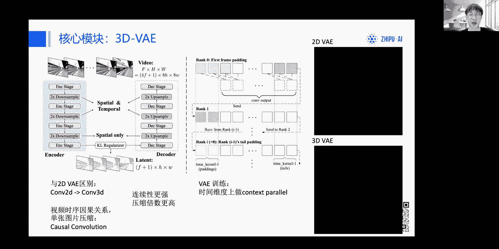

然后并且减少单张显卡上的显存，好然后接下来的内容由佳燕为大来，大家为介绍一下，嗯大家好，我是彭佳燕，coco也是coco cogo video x团队的研究员之一，然后呢。

接下来呢我继续为大家介绍我们的呃，数据处理流程以及训练过程，首先呢大家看到数据处理过程，因为呃我们其实也知道，就是在这个在生成模型训练中，数据是一个很重要的，是一个很重要的方面。

尤其是当我们在训视频生成模型的时候呢，嗯这个视频数据，由于它在就是它的海海量的特性，以及它的存储很大，所以呢它的各种处理都十分困难，其中呢我们现在重点介绍一下关于视频，Caption。

就是视频描述的一个重要的处理过程，首先呢我们知道网，目前网络上得到的视频，和他的文本队往往匹配性较差，很难得到高质量的视频文本对，所以呢呃我们需要用专门的模型，来为视频生成相应的描述，这个描述呢。

它得要求能够详细描述视频中的各种内容，这样呢才能使得你训练出的模型，能很好的去具有很好的语义理解能力，也就是意味着最终在使用的时候，它能将用户输入的prompt，很完美的就是展现为视频中的对应内容。

然后呢之前的开源的视频理解模型，它的视频描述能力呢往往比较差，所以呢为此我们我们就是专门自研了一套，视频数据caution生成的pipeline，首先呢，我们的第一个版本是，先对视频进行一定频率的抽样。

抽出一定固定数量的帧数，然后呢去用我们的也是我们质朴自研的一呃，一个图片理解模型，COCOLM去生成对应的image的描述，图片的描述，然后呢并且呢在综合上呃，我们所使用的一个开源的video拉玛。

这样一个开源视频理解模型，来生成一个短的视频，视频描述，目的是包含其中的动态信息，因为image caption中并没有动态信息，最后呢用一个与language model对这些caption进行。

将image caption和short video caption进行一个summary，这样的话就得到最终的一个长的long video caption，然后呢呃然后就是但是呢这样一个流程看。

我们可以看到他还是过于的繁琐，所以呢之后我们又推出我们的win2版本的，Pipeline，就是我们利用之前得到的long video capiti模型，对我们对质谱已经开源的COGYM2video。

这样一个视频理解模型进行翻to，这样的话我们就可以得到一个，端到端的视频描述模型，该模式也已经开源，大家可以在呃GITHUB中看到它对应的链接，然后呢最后呢就是与训练对应的，就是因为刚刚也说了。

训练的时候我们尽量输入的，我们尽量是能输入尽可能详细的视频描述，所以推理时呢我们应有，我们当然自然也应该相应的输入详细的prompt，这样才能最大限度的激发模型能力，然后呢再接下来呢我们看到训练过程。

因为刚刚也说了，视频视视视频视频模型呢，它相比于图片模型生成模型，它的数，它的数据训练量就需要的更多了，那么的话呢如何组织这个训练过程也是个难题，以前在上一代的视频生成模型中呢。

呃经常采用到一个叫image video，就是图像视频联合训练的方法，但是呢当时的方法呢，往往是将一帧图片与一个固定帧数的视频，去进行联合训练，但是这样的话大家可以看到，由于这个长度的不同。

时序长度上的不同，他们其实这两个任务之间是存在比较大的，cap的gap，这样会导致模型呢不能很好的同时建模，这种multi task的能力，所以呢呃我们采取的一个方法是。

将我们在进行图片和视频联合训练时，是将不同时长的图视频与图片一起进行训练，比如说我们会两帧三帧，四帧五帧，一直到很多帧的视频，它都是和图片一起联合训练的，然后这样的话它的好处就是尽量的可以在呃。

就是在这个长度上，序列长度上弥补它们之间的差距，然后呢，但是呢我们也知道为了训练需要成batch嘛，那么你呃相同shift才能成BH，所以呢为了解决这个难题呢。

我们使用了一个passion pack的方法，就是我们会将不同的呃，不同时长的视频以及图片进行打包，把他们打包，把他们打包到同一个呃同一个sequence，同一个序列上，就是像我们这里图中所展示的方法。

它们会被额会对在同一个呃，同一个序列中进行contact，然后呢这样呢就是通过这样的话，就是可以达到一个更好的联合训练的手段，而不至于又因为过多的拍定而去浪费训练效率，并且呢在训练的大策略上。

我们采取了progressive training，也就是渐进训练的方法，借鉴自图像训练的经验，我们依然是先在低分辨率视频上训练，这样让模型快速以一个比较高效的高效的效率。

快速去学会各种嗯就是语义理解能力，以及视频的一些动态信息的高粗粒度建模，接下来呢我们再在高频高分辨率视频上训练，去训练模型如何建模更好的细节，最后我们在高质量高分辨率数据上进行微调。

这样的话以进一步提升模型的能力，最后呢我们还嗯我们还用了一些现有的benchmark，与现有的公开模型进行比较，因为呢其实目前来说，视频宣传方面还没有一个很公认的，比较好的一个benchmark。

所以呢我们呢是从各个各个不同的维度，选取了一些相应的班型，选举这些相应的评测指标，来更好的全面的评估模型，比如说呢这里呢我们从呃人类动作到场景，到动态程度，到对象到视频风格。

以及到动态的质量和更加细腻的动态信息，我们均分别进行了测评，可以看到，跨国V6X与现有的开源模型，以及一些公开模型相比，它都取得了不错的效果，然后呢呃关于技术模型结构的算法细节，就呃介绍到这里。

接下来呢请玉轩继续为大家来讲解，如何能更好地快速用上我们的模型，好啊好，那我要投一下PPT，好那我们就来到了啊，刚才大家已经听完了，我们的这个算法的一个讲解啊，那么我们在推理的时候。

其实不需要考虑到这么多的一个细节啊，这部分的话我会以一个呃尽量通俗易懂的方法，让大家能够快速的上手，我们的这个模型，首先的话就是我们的模型是已经适配到了，diffusion这个库。

那之前我们也是非常重视，来自开发者们的这个呼声啊，希望能够把这个标准化做的比较规范，所以这一次我们在很早的这个基于模型开源，现在很早的一段时间就开始去做这个DEUTER，这种呃。

han face上面这种标准的一个适配，然后也在发布的第二天，8月7号啊，被合并为这个正式版，也就是0。30的这个版本，大家是可以直接装这个库了啊，pp install就可以了，不需要原版安装了啊。

然后清华园也都可以用啊，不需要翻到国外，然后关于模型的话，我们也上传了非常标准的这个diffusion库，想要这种格式啊，The high in face，摩达社区以及这个呃我们的呃知识社呃。

实质社区都有提供呃，然后在我们的这个guitar里面，我们也放上了对应的这个呃，一些推理的一些脚本好呃，在这个SAD讲解之前，我先讲一下diffusion这边的工作呃，diffusion的过程呃。

还是多了一个这个呃处理的代码，一会我会放在后面讲解，那在下载模型的部分，仅仅就按照我这边的git clone就可以了，不用做任何额外的操作，下载模型只要get clo就可以了。

好这里讲的是diffusion的这个方法，那么很多人在看我们的read me的时候，其实是有看到一个叫SAT的，那我在这边也就跟大家先讲一下啊。

SAT这个呃swift army transformer这个框架，而这个框架是也是THUDM下面的一个啊，推理的一个方案，它能够做推理，也能做这个微调啊都可以，然后的话我们的模型。

一开始是在这个框架上去运行的，然后再转到了前面这个diffusion的这个库啊，所以这里我们也提供了原始的SAT的这个啊，模型权重，这两个权重是不一样的，但他们的算法是一样的，效果也是一样的。

只是格式可能有一点不一样啊，所有的算法效果啊都是一样的啊，那首先的话，因为这个SD还没有，专门像韩英配这样的一个hub，所以要从这个我们把它放在清华云盘上面，然后大家就可以直接从切换硬盘上去。

克隆对应的文件啊，在这个模型结构的话，我们没有这个呃DIFFUSERS库这么复杂，我们没有这个呃，test encorder这个库，test encorder这个文件夹以及各种CONFIG。

我们的configure比较少，配置文件会少一点，好，里面只有两个文件组合起来以后的，cock video x2B应该是一个呃如下的一个状态，里面的话呃，这个LIS是个TST啊。

在推理的时候只是为载入的，载入这个1000的checkpoint，也就是现在这个IP rank00的这个呃，权重是用了是模型的transformer的部分，而3DVAE这边还是VAE的部分。

好模型就拆成这两个部分，然后把它合到同一个文件夹下，就可以按照我们SAT的代码来载入了啊，但是这个还没有完，因为这里面没有包含T5的权重，所以T5这部分的这个啊，泉州仍然要从哈英配置下。

我们没有单独为大家再准备一次T5了，我们已经在这个原始的好，cob9X里面去准备了T5的这个文件，所以大家直接从上面克隆下来以后，把你们的T5拿出来啊，我这里强调的是两个文件夹。

一个是test encoder，在里面放了T5的点bean文件哦，点点save tensor文件，然后token ize里面放的是spy，点model以及各种configure文件，把这两个合起来。

你就会得到一个用sap tensor来保存的，T5的V1杠一的叉叉L这个呃的模型，那么我们建议用sap tensor，是因为它的IO比较快，同时的话这个在微调的时候啊，可以避免很多。

因为这个病和这个deep speed的这个框架不太适配，导致的一些问题，所以我们还没查出来问题在哪对，但是用c tensor是没有这个问题的，我们已经啊有多位同学都亲身跑过了好。

那如果大家对SAT这个框架感兴趣，也可以到我们的这个啊switch armons forward，也就下面这个GIUB这个仓库，去看一下我们的源码好，不过这个不会在今天重点去提到。

啧好那么把模型下载之前呃，在开始推理之前，大家对自己的硬件要有一定的评估，好在这里我也列出了一张表啊，这个表非常非常的重要，首先的话是我们这个SAT的和这个hain place，里面，都可以。

在一张40903090嗯的这个机器下，能够单卡能够流畅的运行啊，它不会存在这个像LMM一样的，随着这个context越来越长，然后它显存越占越大的问题，它这个是个定值，所以呢就只要部署着热加载的状态。

它就不会报显存啊，这个是安全的，然后呢，所以呃但是呢有这个有的，像我今天有看到一九啊，有一些同学他使用的不是这个VIDIA的GPU，它使用的是AMD的啊，有AMD的和这个NPU的啊。

这两个的话目前我们有收到一些反馈，是这个他还是要36G啊，这个问题因为我们现在没有这个AMD的设备，所以暂时来没办法测AMD这边的情况对，然后呃但如果我们会在之后的话去啊，找一些相关的同学。

看能不能去测一下这个的实际占用好，那么在我们现在的测试环境，都在NVIDIA的3090上跑通的，所以是肯定可以在3090的卡跑的好，那关于多卡推理啊，因为我们里面的这个3D transformer。

这个block是不能拆开的，然后他的VA里面的这个卷积的部分，虽然我们用了这个刚才提到了这个fake cp，它把这个卷积变小额，分成了很多个，这个按串行的方式读入，而且降低了很多的显存啊。

他串行处理了啊，但是呢这它仍然是需要用到20G，也就是不管你有多少张卡，你的那张峰值的卡，就是那张巅峰的那张卡，要到2G的显存，比如说你有四张十六六G估计就跑不起来，但如果你只有两张20G就能跑对。

这个是这个多卡上的一些限制，这是我们实测测出来的一个结果啊，那关于微调的部分，微调40G，但只能使用SAT，目前哈根FAA的话理论上能通，但目前还没有进行这个深度的一个测试，ACT已经经过深度的测试。

并进行了压力测试啊，是非常稳的，被sin等于一的情况下，40GB是肯定可以做ROA微调的好，然后剩下的几个参数的话呃，则在下面已经展示了出来好，包括这个分辨率，分辨率一定是720×480。

然后这个帧率一定是八秒好，然后这个量化的话确实目前是暂时跑不了的哈，量化暂时是跑不了的，特别是int4暂时是跑不了的，然后我们在我们的read me也已经放下了，这这个模型的一个下载的链接好。

然后把模型下完了，并且评估好自己的这个呃算力呃，足够的时候，我们就开始去推理模型，然后我们先记住这边的这上面有个prob language，也就是这个支持的提示词的语言啊，还是英语，它是支持英语啊。

但是我们可以曲线救国一下啊，首先第一步非常重要的，就是在我们退役之前，大家一定要看到我们这个呃COMMERT，点demo等PY这个呃文件非常非常重要啊，因为我们的这个模型训练的时候。

使用的是啊比较描述比较详细的一个提示词啊，来进行微调的啊，微调和这个训练两个部分都是，所以的话需要使用的提示词汇比较长啊，比如说我只输入这个a girl。

riding a bike这种很短的一个呃提示词，效果并不是很好，至少没有太好，所以呢我们也提供了一个润色提示词的代码啊，你可以使用gm4啊，或者同级别的这种比较大一点的大圆模型。

然后我们也为他提供了shoe shot，我们提供了SUSHT以后，那这大模型模型就可以，根据我们提供的这个样例，和你输入的这个比较简短的提示词啊，转为一个比较长的描述，比较细节的提示词啊。

这也可以帮助某些以前使用啊，SD呀，Flax，i mean journey啊，这样的一些用户，那还在输入一些短提句词的时候，我们可以帮他润成一个长提示词，来适合做个vs啊，这个是非常非常重要的。

如果有很多同学发现自己跑的时候效果不好，可以检查一下是不是提示词的问题，好那在准确这库的推理就非常简单，因为是这么讲，代码对，但它都非常非常的重要，每一行都不可以少，首先第一行的话就是。

首先你只要下载的是这个DEFUTURE，00。30以上的版本，我们就可以看到这个呃，我们就可以找到code video pipeline，如果你读不出来对，如果你这个读不出来啊，读不出这个啊模型。

那么很有可能有两种情况，第一种是你的版本不对，第二种呃是你第一次运行，第一次运行可能出现这个问题，以后重载就好了，后面就不会再出现了，对一定要检查零点3年以上，然后第二行话也非常非常重要。

第二行话如果没有加的话，他是不会中途卸载掉一些没有用的模块的，意味着它就会把所有的模块都放在一起，这样你的最高峰值显存就是36G，也就是我们啊之前在群里面说过，可能会峰值到36G的情况啊。

那现在加上这行代码，那就已经优化掉了，不会出现36G就峰值就23。9G，刚好一张这个3090可以推理，但是一定要把自己3090里面，其他的显存占用都清空啊，因为它距离显存完全满就差1M呃。

100M到200M的这个区间，它的误差也是100M不到，所以它是非常极限的，对它是非常极限的，一定要把自己已有的这个占用显存的东西，都清掉好，这是非常重要读入模型的地方，那么这两行代码就把模型读进来了。

此时模型就是热加载的状态啊，之后你就可以一直升视频了，而不用每次都重新载入模型，这是热加载的啊，然后接下来的话是这个转提示词的部分，我看到有PR提到这个nfi front啊，这个这个的话是。

因为我们现在没有针对这个ninety crown，进行这个优化和调整，所以它的效果呃基本上可以等于没有对，所以我们只提供了这个problem这个接口，也就是正向提示词啊，这个模型暂时啊不推荐啊。

大家去啊，就是一直在这个负向体育实上做一些呃，很深入的这个开发啊，但如果作为研究的话，是没有问题的对，然后我们都是用正向体育试试好，剩下的次数都不用改这个那video for prompts。

就是你一个这个提示词，生成多少个视频的这么一个呃这么的一个参数，比如说你这个设置为二，那么你一个提示值就可以生成两个视频，反之就是你设置一就是一个对好，然后这个是我关于这个from invest的地方。

那如果你想快，这个是可以变快的，怎么变快呢，我们把prompts in beds，如果你想反复测试，比如说就同一个体育反复测试，那么你可以把这个prompts embed，直接存成一个PT文件。

然后我们看到下面这个，我们看到下面这个pipe tab的时候，它读入的其实是这个props in beds的一个PT，它并不是读取你的自然语言，它是读取好这个T5处理完的这个embed。

就会这个开始执行我们的推理啊，这时候我们默认的参数是50，也就是走50步，改skills是六啊，这两个参数我们都不推荐大家进行改动，特别是往小改啊，这个step往小改的话的话，效果可能会没有那么好。

比如说改到二十三十对，这可能效果不是很好对好，然后这个是呃需要注意的一个地方，还有一个地方需要注意的是，我们的demo里面，我们把necting prom的位置不是写了，而是全部填零了啊。

这个是在我们训练的时候用的是零，所以我们在这边全部填零，如果你填填long的话，会得到一些哦非常小的一些随机数对，然后我们建议都全部填零，然后呢这个代码运行完后就得到一个tensor。

此时还不是一个视频，你会得到一个tensor，那你需要将tensor进行导出，那么在下面这个命令里面呃，c o i demo里面，我们是写好了一个导出的一个脚本的，因为那个就没什么啊。

算法的流程我就没有放上来啊，好这是一个需要强调的点，然后我们回到刚才这个多卡推理，我们这张这个demo是针对单卡推理的好，那如果多卡推理，我把鼠标点到这个位置啊，多卡推理的时候，你要把这个这句话注释掉。

把这句话注释掉，其他不用变就可以多卡推力了，但多卡推力的峰值仍然是36G，只不过这个36G会被切到这个不同的卡上，那这个我们已经跟han face子交验过了。

确实是没办法把这个呃CPU offload开启的同时，还支持多卡的，好那讲完地区识库以后，我们就讲SAT呃，SAT我这边就不展开细讲了，因为SAT的这个推理代码会比较多对，然后它是一个。

我我们把它放在了一个单独的文件夹，放在了SAT这个文件夹好，所以我们再点进我们code video仓库里面，就能找到SAT这个文件夹，里面就包含了所有SAT的推理和训练，微调都在这啊。

就是没有训没有预训练，就是微调跟这个推理坐在这个地方好，那我们讲下ST的一个优势吧，首先就是它这个呃显存是占用更低的啊，同样的算吧，它占18G它是18G啊，HZ占23。9G其实是有点偏高的。

对我们还在优化中，18G是正常的，18G是正常的，因为我们把这个卷积变成了串行，然后让它在这个呃顺序的进行推理啊，同时的话SAT也是我们原始，就是我们这个算训练团队这些研究员啊，他们在进行训练啊。

微调测试过程中的原始的一个代码啊，所以是非常的符合这个学术的研究的一个啊，过程啊，它没有像啊DIFFUSER封装那么多层，division确实非常适合做二次开发，但如果做研究的时候。

你发现division的库嵌套太多了，它的类太复杂了，那你可以用我们的SAT的代码，它类比较简单，然后代码也会比较少，没有那么多的模块和分文件好，那我就是我们在推的时候，可能会有这么几个踩坑点啊。

需要大家注意一下，就是首先在我们这个SAT的这个文件夹里面，你点到configure里面，它是会出现一个TXT的啊，这个TXT是我们默认的这个题方式，然后我们要把提示填进去，那需要注意的是。

我们没有在这里做这个提示词的优化呃，所以在这里你输入是什么提示词模型传进去的，就是什么提示词啊，啊，没有去做那个gm的四的那个大模型的优化过程。

在我们在我们的diffusion里面的两个web demo，其实都做了两个web demo都会自动的啊，帮你润色，然后你可以选择润或者不润，就是选择是否用它润色后的这个提示词好。

这是非常非常非常注意到一个点，然后对于这个TST你写了多少行模拟器，会推理多少个好，然后第三个点是SAT，目前它依赖tron这个库啊，然后部分还可能依赖x former，所以这就非常呃。

这就限制了它必须在LINUX环境下进行安装，所以如果你是windows用户的话，可能会暂时只能用deuce，这个方案SAT的方案只能在LINUX下安装，然后这是需要强调三个采分点。

那剩下部分的话按照read me，我们已经呃让非常非常多的同学进行了实操，是没有出现其他问题的，然后我们的测试都在via h p u上啊，虽然SAT它本身是基于这个touch来做的啊。

应该不会存在某一些，完全依赖于这个酷打的一个算子，但是我们没有尝试过AMD的这种显卡。

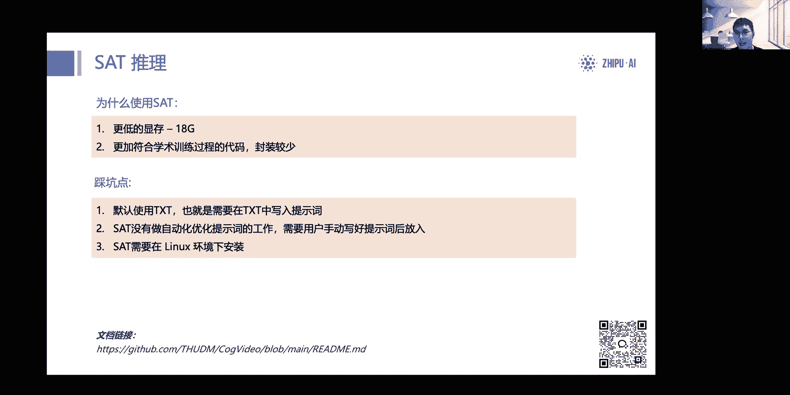

所以这个是可能需要开发自行尝试的好，那么这边两个的这个视频，也就是我们这个呃read me的这个首页，好的，这个两个视频，就是我用我们这个比较复杂这个提示词，然后用我们就是开源这个2B的模型。

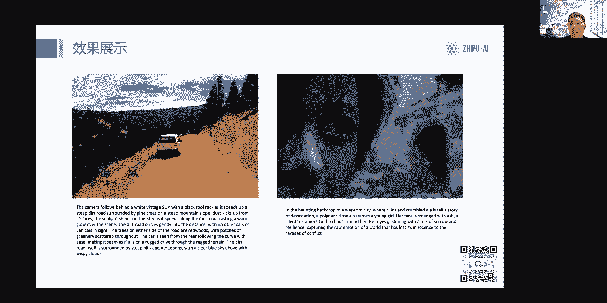

然后来推理得到一个结果，好那我们进入今天的最后一个环节，刚才已经讲完了这一个呃，呃应用和部署分别的部分，大家会发现这一次直播里面，我们可能更多就绕着模型来讲，而没有它的周边啊。

这也是我们这个未来会做的一些工作。

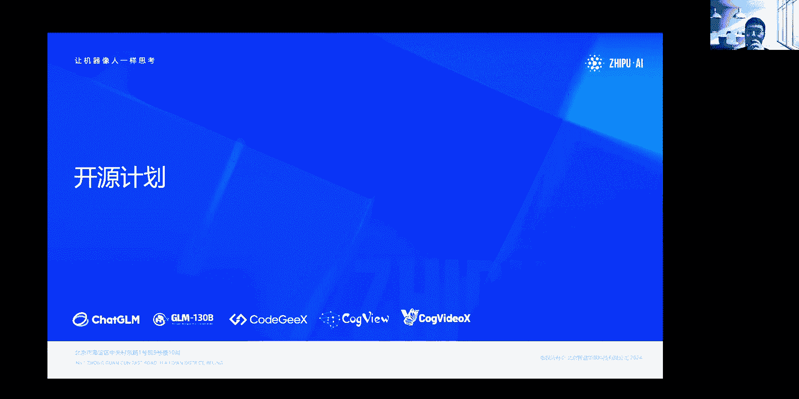

我们会希望把这个模型往外推出去，呃，首先我们在这个read me里面已经直接写到了，我们会有一个这个更大的一个模型会开源啊，这个是一定的，这里可以给大家打包票是一定会开的对。

然后然后他同时会适配的这个扣个video x2B，也就是如果你的现在的二次开发代码，是基于扣个video x2B的啊，他一定能够去接上这个我们新的这个模型，把它架构是差不多的对可以加上。

然后我们会在DEUTER库里面进行一些完善，可能会在DIUSER3。0。31。0，那个库里面完全支持好，那么它权重肯定是更大的，不是2B这个参数量权重是更大的，它效果也是更强的啊，大家可以期待一下。

然后接着就是我们会去做一些，这个周边的框架啊，及设计控件，那目前已知的是DIFFUSERS呃，这个好像打错了，知道diffuses这个库我们会继续做，包括显存优化，以及包括这个我们后来的pro。

这个版本的完全适配，接下来就是x inference呃，他这这边的话我们已经沟通过了，基本上就会去做一个适配之后，大家就可以去使用上了，然后目前GITHUB也出现了类似于CFUI的。

这一些的二次开发的工作啊，让大家可以去快速的这个体验，那么我们也会定期的在这个read me的首页上面，加上这一些来自社区的贡献啊，我们非常期待着你们的贡献对，因为我们这个仓库确实还有很多不完善的内容。

然后我们也会在下面这些工作里面哦，我们也是希望社区成员能够参与到贡献中，那我们也会在项目的首页啊，感谢你的贡献，我们肯定会放在最显眼的位置，首先的话是关于算法的部分，我们的int c1。8的工作。

以及这个非COA架构的一个测试，因为我们确实没有这样的GPU对比较难联系，然后啊这是一个嗯算法上面的一些工作，当然我们非常希望这个有很多，基于我们的这个模型做出来的一些优秀的demo。

和这个配套的工具链，所以我们也啊，我们为大家提供了一些可能常见的，或者我们能想到的一些方案，比如说啊超分，比如说这个插针的一些工作啊，这些都可以让这个模型的帧率更高，分辨率更高。

对然后它也能够去美化生成个效果，那我们也非常期望你做一些完整的一个，最小的开源项目，我们之后也会尽力去举办，举办一些这样的活动，让大家能够参与到这个项目的开发过来，因为这个视频生成的开源模型。

现在市面上还是比较少，我们也在不断的探索啊，那我这边的话它会就讲到这边，然后现在的话大家可以开始问问题，我们的算法同学都在这边为大家解答哦，我看到一个问题，就是说有人问我们的SAT版本支持多卡吗。

哦不用，然后呃我们SAT版本，现在目前推理是不支持多卡的，但是它的你如果想在上面微调的话，就SAT是自带一个tip speed的训练的，然后吉普斯speed可以有多卡路基都可以训。

然后还有人问这个需要多少时间数据，然后还有训练训练，需要的计算资源是什么样子的啊，我们这版模型大概是用了一个呃，三千三千多万的一个视频，CLICLIP的数据就是那种单镜头的视频数据，然后训练资源的话。

就就是需要一个非常大规模的训练，然后啊还有人问就做了哪些推理优化啊，推理优化的话，其实我们这个我们那个ISAT版本，和那个啊defeat版本上，都写了一个叫做fake cp的操作。

就是我刚才讲的那个VE的那个CP操作，然后如果你直接跑VE做呃decoder的话，做一个六秒的六秒视频decoder，它你会发现它其实会你24G，24G什么写错显显存汇报啊。

所以说我们那边其实是在单卡上做了一个，CB切分，然后try起层跑在时间线线上跑这个decoder，然后他就可以呃，呃就可以在单卡上influence出来了，好，我看到有同学在问那个关于这个呃推理。

有没有这个脚本啊，脚本肯定是有的，我把这个这个看一下啊，我投一下屏。

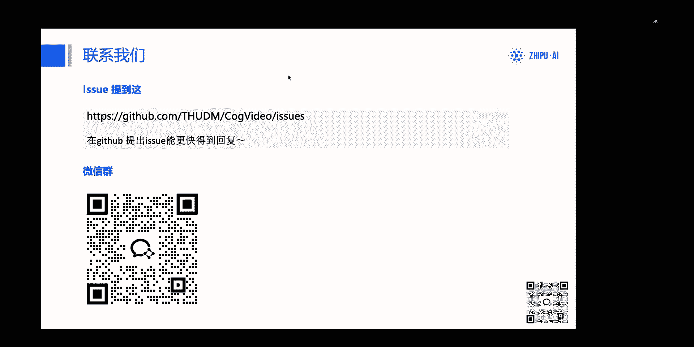

我给你直接指引在哪里，OKOK好，那我们就开始啊，刚很抱歉，刚才这个调试人员正在做一些这个，最后的准备工作，做导致有一定的延期，那我们直接就开始今天的这个直播啊，然后先给大家介绍一下，我是张艺轩。

然后今天的话我们将会带来co个BDEX，这个呃视频生成模型的一个基础解读，我们邀请到了这个我们的啊两位算法同学，卓毅和佳颖两位同学啊，以及我会为大家讲解如何快速的部署。

那么本次的这个内容也分为这三个部分。

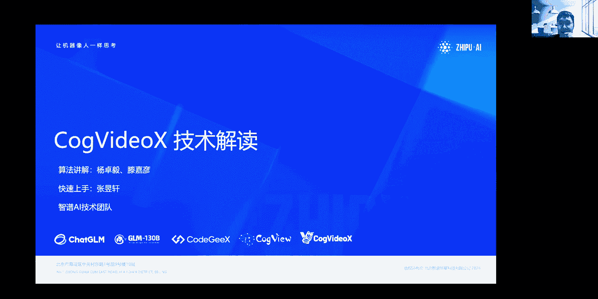

好那分别是算法讲解，快速上手以及开源计划的三个部分，那么我们啊抓紧时间，我们先把这个啊话筒给到我们的罗毅。

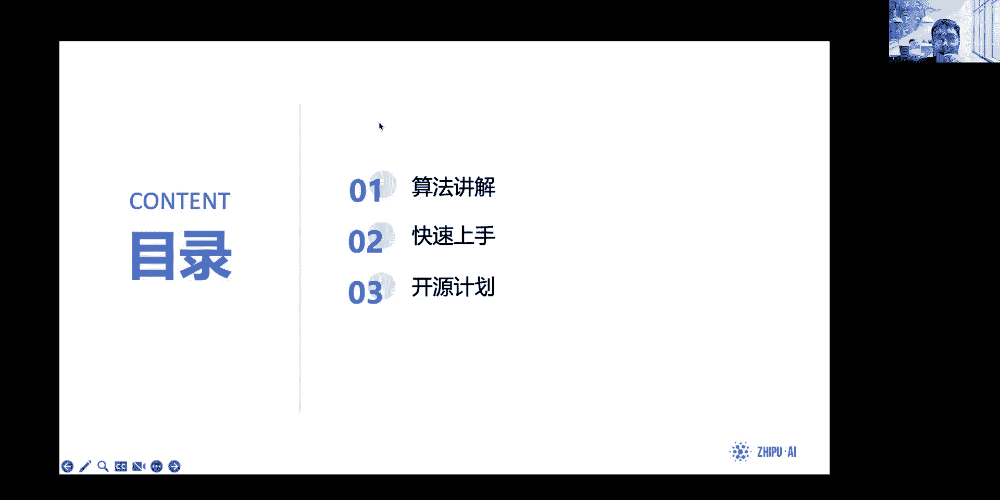

我们来做一下算法讲解的工作，好，能够看到吗。

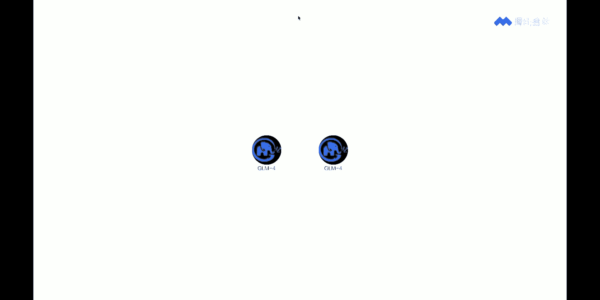

我们的脚本就是这里有好几个脚本，这都是这个，我这边再详细讲一下吧，就是有好几个脚本，然后它都是这个呃diffusion。

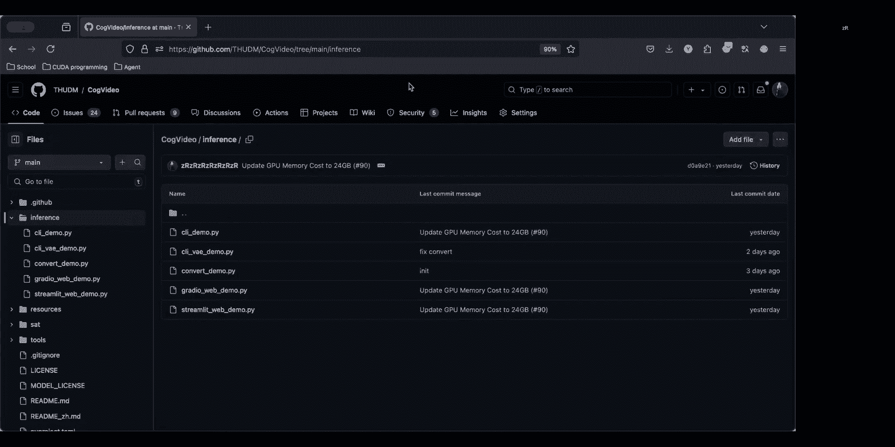

这边都是DIFFUSER啊，首先这个就是我刚才投投在PPT上的角要部分啊。

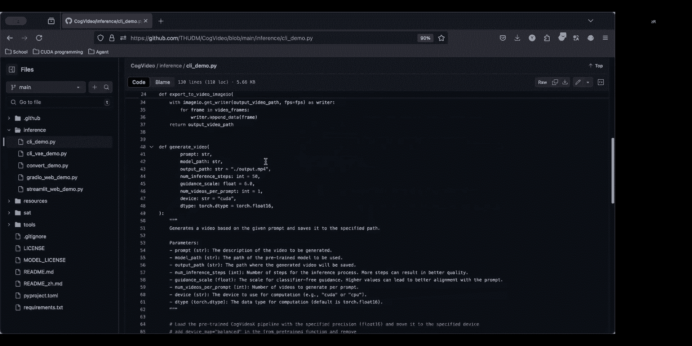

完全一样的，直接就可以运行了啊，这个是推理的脚本好，然后它有好多种，一个是这个是专门推VAE的，目前还没有，这个还没有做优化，这个还是要71G的显存啊，这个还没做优化，它可以实现一个完整的。

就是我刚才说的没有那个算法优化的VAE啊，这这个算法优化不影响模型生成质量啊，完全不影响模型生成质量，不用担心，因为这个我们推理优化导致的质量变差，这是不可能的啊。

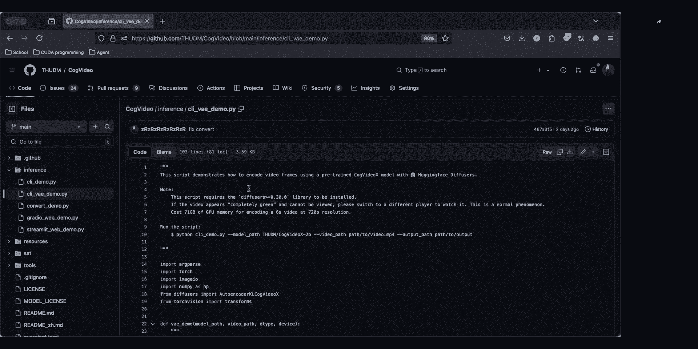

对然后我们这个呃这个是一个没有做那个切的，切成CP，它是一个完整的一个呃卷积，所以它比较大，对这个，然后下面的话这个就是刚才转权重的部分啊，就是刚才转啊，不转那个提示词的部分。

我们的few short写在这个位置，我们用多段的这个user system这样的组合，去把future写完了，好这个大家可以看到的地方。

然后GRADU是跟haking face space同款的一模一样的，一个这个啊一模一样的这个呃配置，然后我们还推荐大家用F16啊，space上面，因为它这个呃发上来的时候应该发了BF16。

但其实F16是可以的，真正大家最后用死space的时候也是F16的啊，不是BF16的，对这个权重是FP16的，意味着你的这个额V1002080ti，这样的显卡是完全可以运行的啊，不会因为这个哦。

我们是这个比如说新卡训练以后，你老卡退不了，不会有这样的问题，这次我们就重点考虑到这个需求，有非常多的同学在用V100这样的卡啊，这次V100应该是没有任何问题的好。

然后关于这个这个是另外一个CAT的代码，全部带走，我们配合着read me一起用啊，这是我们的read me好，所有的这个配置文件以及推理代码，都在这个位置好，非常的详细。

大家可以在这边一步一步跟着他走，跟GOBOOK可是完全一样的效果，就一步一步从下载模型到推理好，就然后包括最后其实你微调完了，转成HINVEST的权重啊，都写在里面了啊，4090肯定可以推理啊。

3090都能推，4090肯定能推好，然后这个，指定版本的touch后面出现了这个模块的未有能，要不发个一宿吧，这种好像不太能够在直播里面解决啊，我们的touch上面写了2。4是方便测试的啊，2。22。

32。4都是可以，2。22。32。4都可以，然后那个最好是用新的，然后二次开发的话，不太清楚你说的二次是哪种开发，如果你是偏重学术研究，我们建议在SATCAT每个都很好改，它不存在这个继承啊。

啊重新复用这些类的问题啊，所以SAT很好改，那如果你是想做二开，那你我建议你用这个开发，比如说你想做应用，那我反而建议你去用这个呃diffusion，毕竟它很这个标准，接口非常标准啊。

跟这个SDRSD3这些接口是一样的啊，接口非常的标准，所以你很好做适配，做应用的话好，然后关于这个非GPU啊，就非GPU推理我们没有测过，比如说M1M啊，比如说这个Mac Mac的设备。

因为它不是用GPU推理的嗯，我们暂时没有测过，也没有那么大的一个设备去测啊，比如说这个我看到有同学在问，这个mac1的64G有报错，可能需要提一下一宿，对我们现在没有这个设备，然后理论上来说。

我们需要有个24G的空的内存，也就意味着你能24G内存绝对跑不了，因为你还没还跑了系统操作系统，这使得你根本不可能有24G的内存，来跑这个完整的一个模型好。

然后这个fine tune这个model的code base啊，CD有的我们FTM的代码在这里，也就在这个guitar里面，呃，我们翻TU的时候有个脚本啊，这个脚本非常的简单啊，就这么点就这么点。

然后它的train在这个位置啊，这就是整个完整，它里面会引用了一些别的结构，引入一些这个结构和deep speed啊，这意味着它这个翻译TM必须在LINUX下来操作啊，这是非常重要的一点。

然后是有代码的，但是数据集我们现在应该是没放上去的，数据集应该是没放呃。

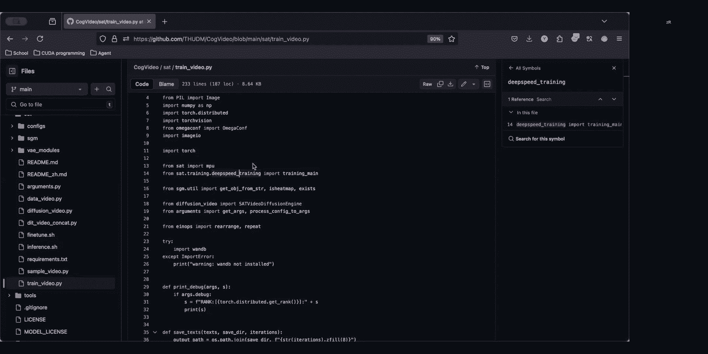

刚刚看到有同学问，一个是微调一个connect，主要就是这种关于基于base model下游任务的，因为其实我们也知道之前呃也有一些开源模型，然后大家也会对那些纹身视频的开源模型，进行了很多下游任务。

但是可能由于base model不够强大，那么往往它它进无论是进行二创，还是进行学术上的研究，可能效果都不够理想，所以呢我们开源QQVIDEX，就是要给大家提供一个更强大的base model。

这样呢大家在此基础上可以进行更好的，无论是微调还是各种下游任务，视频编辑啊，control model啊，这种各种各样的类型，就是为了给大家提供一个更好的base model。

来让大家达到一个更好的一个效果，这样的话呢大家就可以微微调，就可以，比如说每人可以定制一个专属于自己风格的，视频生成模型，首先呢关于我们提到control net control net的这个开发呢。

呃首先因为你调代码已经提供给大家了嘛，首先大家当然是可以自己去动手去开发control net的，其次呢我们当然我们今后也会逐，我们在就是之后，反正不远的将来吧。

也会逐渐开发出相对于control net，各种，就是像I之前的cable defin的图像生成那样，就相对相对应的开发出各种的编辑的功能啊，就各种啊控制功能进行可控生成的各种开发，对相相关的配套开发。

后续都是会有的，然后呢再关于这个，大家更关心的可能就是呃，它是否能像之前的图像生成的CD body pv那样，就是我们用很少的数据，很少的训练量，我们就能微调出一个不错的效果。

经过我经过我们自己的测试呢，就是大概在呃100题，100个视频片段以内，然后配合上嗯，就是配合上大概一个嗯你的batch side。

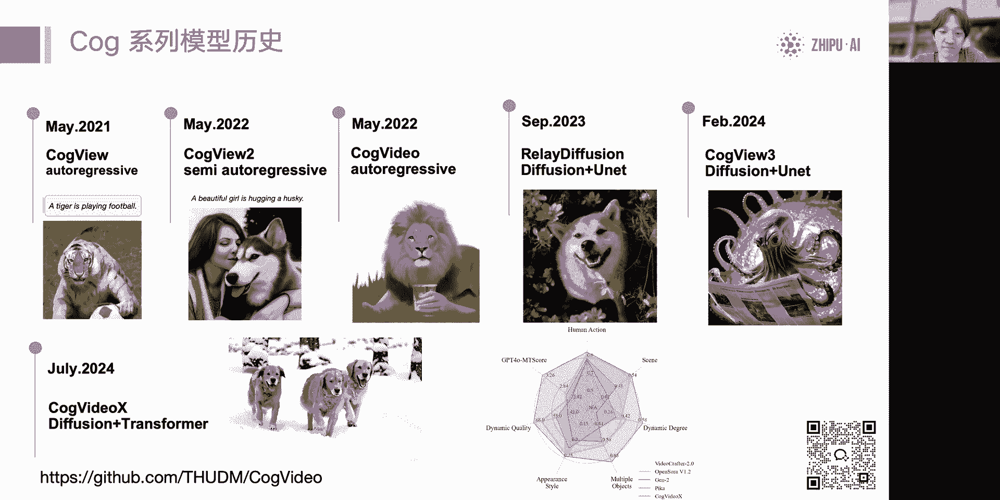

因为我们的deep CD的框架嘛，它是支持你的额，就是OK那个叫gradient accumulating，就是哪怕你只有一张卡，你把ACCU就是你把梯度累计打开。

我们batch size依然也是可以开到开八开16的嘛，这样子的话呢呃就是你只是需要多训一些时间，但是因为呢我们只需要一个很少的数据量，所以呢这个微调大概就是嗯是以一个，就是你想100个数据。

你大概过个几十个epoch，就能达到一个不错的效果，对就是模型，就当你去用LAURA翻tin的时候，模型呢就能记学会你提供的一些，比如说某一个专属形象的各个视频片段，它既能学会这个视频形象。

并且呢依然能保持原有的那种通用语义能力，来让你尽情生成各种各样的视频。

然后呢关于还有大家问问，到什么时候会出图生视频这个问题呃，我们目前呢就是我们的计划呢，是因为图生视频的开源模型我们还在完善，等我们什么时候能得到了，一个就是我们认为能让我们满意，能让大家满意的效果之后。

我们就会进行开源，然后至于还有同学提到说sat的这个代码呃，可能理解上有些困难，我们会后续对代码就是进行更多的，无论是注释啊，还是一些相应的在文档里面进行更详细的解释，这些后续都会加上。

然后还有还看到一个技术上的问题，有同学问呃，passion pack的方式会对训练速度有影响吗，Python pack方式，你说如果你单纯从序列变长的角度来看，那肯定序列变长，你肯定越长。

就是计算量越大，但是呃就是它就是你一个iteration的时间，肯定会变长嘛，但是呢你从过的数据量来看，你用passion pd的方法，我们的目的是为了减少padding。

就是呃那种zero padding的损耗，所以他当然对于计算效率是提高了，对训练效率是提高了，它的吞吐量是变大了的，所以他其实是训的更快了，然后呢还有同学问到，为什么不建议用float。

那我我呃我觉得你这里应该是FP32吧，就是因为这个就是大家现在都知道模型训练，像这种呃需要很大计算资源训练的这些模型，一般来说都是用16位的，无论是IPH还是BIPHO，目的就是减少显存，减少计算消耗。

提升速度，对呃他刚才问的应该是bf16啊，我这边讲一下，是因为这个模型是pro16版本的bf16，其实这个是因为我们现在知道，就是呃，就是这个是我们对于就是现在社区进行了一些。

是之前进行过一些前期调研的，其实本来呢这个模型训练呃，可以用BF去留学，可以用FP去留训，甚至说BF是由训练来说，应该是更加简单的，因为它的范围更大嘛，不容易呃发生上亿上亿的现象。

但是就是我们了解到就是更多的大家社区，比如说用30904090的显卡，它可能对呃FBF16对他们没那么友好，可能FC16更快，然后更友好对以及就是很多一些老板的显卡，可能他不支持BF6。

就F76显卡的支持应用面是更广的，所以是出于这个考虑，我们专门将模型，就是呃推出一版FP16的模型来给大家使用，对对对，这个是原因，之前有这个可以特别是一看，看还有什么补充的吗，对。

所以这主要还是考虑到了，V100这一批的的大量用户，V100在BF63确实出现过很多的问题，导致没办法对，但确实有很多的保有量，所以我们就考虑向下兼容了100对，甚至应该这个版本在P100。

这种卡可能都还能跑对，这不发flow16的话还是可以的对，然后不过这取决于的英伟达驱动了，O然后如果没有什么问题的话，大家也可以选择继续的这个提问，比如说进我们的微信群。

那当然关于这种代码算法方面哪一个问题，我们非常非常的建议，强烈推荐你提一九，因为体育者的话，我们呃的研究员啊，包括我们的呃，这个包括我们这些工程的一些同学都能看到啊。

无论是工程的问题还是这个呃算法的问题，都有人在盯着，所以这个回复会很快对，会比这微信熊快很多，然后我们主要的活跃的地方，也是在GIUB的英雄好，然后大家有什么样的意见，也可以在里面去这个提啊。

也许不一定要提bug啊，也可以提feature，可以提的，只要是合理的feature都可以提，然后如果你有一些比较好的项目想做贡献，就提pr就可以了，然后pr的话应该我们有一个完整的PR流程。

包括在contribute里面，有提到了一个这代代码规范，以及我们希望什么样的一些pr的，这样一些啊内容，所以非常非常期待来自大家的一个支持，非常感谢。

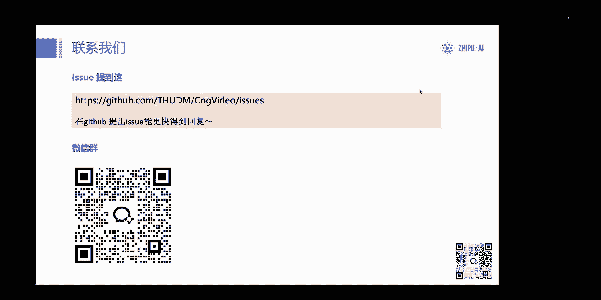

那如果没有更多的话。

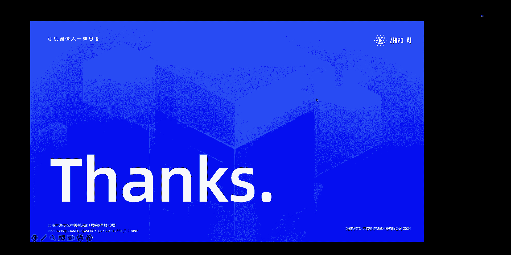