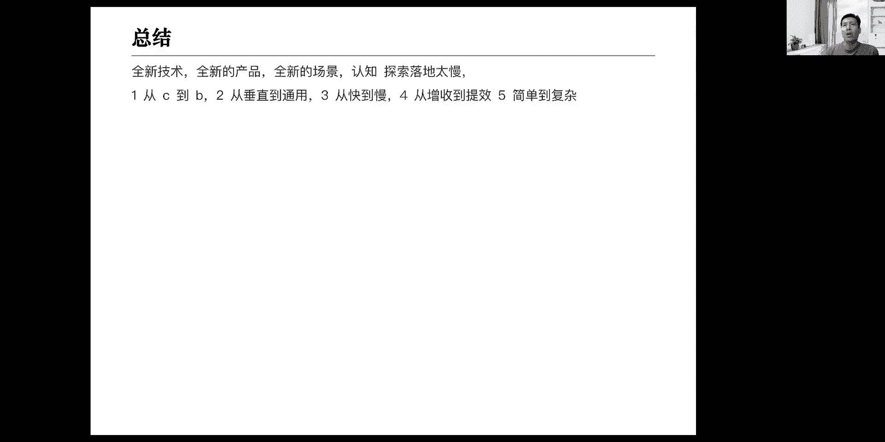
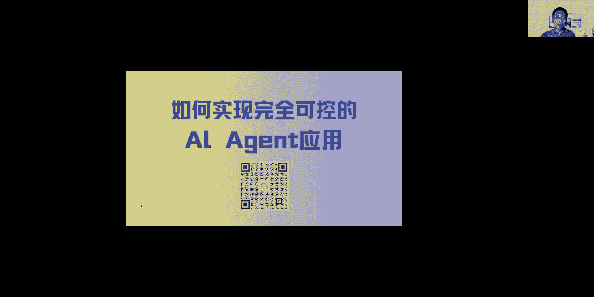

# Agent丨工作流 - P1 - ChatGLM - BV1Ss421w7So

嗯对我来介绍一下，非常非常开心，能有机会和咱们质朴z builder的这个，这个应该叫同行吧，咱们能交流一下啊，刚才刘江老师也这边做了个介绍，其实李翔老师刚才提那个点呃，非常好啊，又有启发的效果。

可能在我们的BT电影相关内容也不是很多，哎他提到说未来这个agent呃，可能是一个普世的通用的平台，所有的人会在上面做很多的应用，呃其实对我我也有一些类似看法，我曾经是一个操作系统的这样开发者。

所以我在认识这个问题的时候，我就在想未来的agent可能就是一个操作系统啊，它的核心作用在于，屏蔽我们所谓底层的这个大模型啊，这个等等各种技术的细节啊，往上冲向一个比较简单的界面啊，可能就是拖拉拽。

就是一些自然源编程，就可以使得我们无论是这个总技术的，或者是产品经理，甚至我们行业外的，这这种没有技术背景的一些人，都可以方便的啊做更多的呃，这所谓叫AI助手啊，我觉得我我其实还是非常乐观的。

我觉得可能在下面的半年到一年，就会发生一些这样一些现象，而且我觉得呢所谓这个agent的平台之上的应用呢，就会对应到我们曾经啊，移动互联网里面叫什么呢，叫嗯我们做一个垂直行业的app啊。

我们to c叫amp，我们to b呢做一个垂直行业，我们叫SAS啊，可能未来我认为会出现说所谓的叫to c的agent，to b的agent啊，他们可能是人面解决的问题是不同的。

但是呢呃可能使用的类似的技术啊，这其实我还非常期待这个这个的到来嘛，那么我今天的一个分享主题呢，叫做如何实现完全可控的an agent的应用啊，其实这里面最重要的一个关键词，我觉得它叫完全可控啊。

完全可控，因为我我默认认为是嗯，认为大家对A证，对智能体应该是有一定的了解啊，包括刚才我们开头在介绍，大家应该知道A证是怎么回事啊，那所以呢今天呢重点，我们会从这个可控这个角度来分享一些。

我自己的啊认识实践啊，那么刚才对也有个简单的介绍，我再详细补充一下啊，那我自己呢花名很好记，古德白啊啊本名白兴奋呃，我自己工作呢我总结了一下啊，我自己工作可以分为三段经历啊。

第一个7年呢就是从08年到16年，我是作为一个LINUX的技术开发者啊，主要在做一技术相关的工作呃，16年到22年这一段啊，我主要是在创业，我主要两段经历，一段一段是和朋友合伙创业。

我是作为技术合伙人啊，19年到22年呢是我自己作为一个创业者，创立了一家家纺行业的一个SAAS软件，嗯22年呢对这边呢我自己退出啊，这是我前面两个，我所谓叫两个7年，那从23年开始呢。

我就all in AI啊，目前在做的是叫销售的自动化啊，叫AI方向的销售自动化啊，呃所以我认为呢我是我的这个职业生涯，从23年开始进入第三个阶段啊，所以我也认为嗯呃呃这个叫下来。

我的7年应该是和AI是最相关的啊，嗯好嘞，也快速的介绍一下我自己最近一年啊，做的工作呃，其实我是从去年5月份开始啊，宣布奥运A开始创业，我们也做了很多尝试啊，这做一个专利的方向，还有做起名。

还有我们也做一些工程的文档审核啊，还是做了一些很多探索呃，在这些产品方向的探索，同时呢，我自己也做了一个叫所谓叫AJI，就刚才刘江老师介绍的a j i action啊，这样一个社群啊。

我们呢在23年大概组织了18场，线下的高质量的活动，总会邀请一些行业的创业者，来分享他们在最前线的最新的实践和认知啊，嗯如果是在上海的朋友的话，后面也可以关注到我们这一块，我们下周三还有一场活动啊。

是线下一场活动，嗯另外呢我自己也拜访了很多创业者啊，并且我在23年的5月份，其实我是从一个创业者，重新转变成一个技术人员啊，我在这个买了一个3090的GPU主机以后呢，我是玩了很多这个AI的模型。

开源模型啊，应该说去年前半年其实玩的非常开心的啊，基于我最近一年这些认知呢，我今天这个主题其实也是来自于此啊，来自一次，这是我去年5月份一个月时间，我大概跑过的开源模型。

其实去年前半年的开源模型相对还比较少啊，几乎我半年我应该把叫得上名感热门的呃，无论是文字的还是动画太阳啊，基本上都嗯研究了一遍啊，我在我自己的机器上把这些模型都跑了一遍啊，做过测评，刚才的重点。

我们今天话题是从可控这个角度开始，那为什么关注可控呢啊就是因为我在探索的啊，我从去年后半年的10月份开始，主力在研究的就是AI如何用于销售啊，那这块呢我稍微展开一下，为什么是销售呢。

啊销售就是来我们做传统企业数字化，都知道企业的数字化三件事叫增收，降本提效啊，增收是以前最近的，那销售呢就是离增收最近的，那我们在思考的时候，我们说AI如何能更快的产生实际的价值，落到行业里去。

那我们就选择销售那个方向啊，我们的销售呢是把AI的能力啊，主要应用在私域这个场景下，他把那些私域的场景下，一些最佳的导购，或者是呃在线销售人员的这个话术呢，复制出来啊，在微信上让他去模拟人。

去完成这个替代人的这个工作啊，那大家有人可能会听过啊，做销售虽然很好，做导购虽然很好，但是他对安全的要求，确定性的要求其实是非常高的啊，因为在去年啊再有一个案例就是这个啊，我呃一个主机厂，主机的车厂。

在在现和给客户推荐他的产品的时候，他竟然推荐了他竞对的产品啊，那么我们可以理解就是说在销售，在对外这个场景下啊，我们的AI可以不作为，可以什么事都不做，但是一定不能做错事情啊。

所以呢这也是嗯我们开始关注这个可控，那可控呢另外一个角度来说啊，他一定是在可控的前提下要完成任务啊，比如说我们这里有个案例，叫写一个爆款的小红书文案啊，嗯我们也许在去年的时候。

刚开始的我们认为AI是无所不能的啊，小红分出报告不安，这是一个听起来好像很确定的，AI可以完成的事情啊，但是在后来在我们随着这个研究的深入，实践的深入和发现，实际上并不是这样的啊，它是比较难的啊。

嗯对这里呢，我想介绍一下我对大模型的能力的理解啊，大模型固有的能力不足，会导致它在我们尝试想应用它解决问题的时候，就会遇到问题啊，比如说啊创个宽度新鲜知识啊，可能这些概念大家都都已经听得比较多了啊。

我今天也不太不太展开它啊，正因为他固有能力不足呢，所以呢，在行业内有很多对应的解决方案就会出来啊，这个其实也是我自己在探索的过程中，一直在关注的啊，那么因为大模型有这样一些问题不足。

但是我们呢要用它来解决问题，那么行业内啊我们经常能听到啊，提示词，工程rap啊，函数调用等等，对，那听起来这些技术好像都很有效啊，我前两天看到一个图，就rap工程这一项嗯。

行业内的研究论文可能都可以打出来，一个屏幕有几十上百项啊，行业内呃，包括我们在看到这个，刚才说的这些应用层的一些方案，包括底层啊，我们可能会我们经常在外面听到，别人在谈论的时候。

一般会有两个两个层面的解决方案啊，一个是我们不要去微调啊，直接用JS工程加rap，那么前两天我也是刚刚从这个北京的，AI考大会回来啊，但是对于很多行业内的人，尤其是对于我们专业的NP专业的人。

我们更多的人其实在研究的是底层的，解决问题的方法啊，可能他跟他们在讲说要继续训练，要做微调啊，其实同一个问题对应的方案是多种的啊，那么后面呢我会提出来，我们现在尝试实践在参与的方法啊。

那么在提出这个之前呢，我先谈一下为什么可控非常重要啊，所有的to b场景，包括我们刚才说到的销售额确定，对这个模型能力的确定性要求一直是很高的，因为我们在生活中啊，我们公司招人一定会说。

我们可以说他的能力不强，但他一定是一个靠谱的人，靠谱性一定是大于能力的啊，我们往往往会在这个人的要求上是这样的，嗯那么可控，一方面是要求它不要犯错，第二方面是要求他不要去遗漏的东西。

比如说在我们今天下来要进行的，这个叫日程管理，这里面啊，我这里提到有一个场景叫新建日程，本月底最后一个工作日，下午五点钟开项目总结会，这个呢我不知道大家有没有去试过，大家可以去去试一下。

就这句话我们发给不同的模型去测，你会发现啊，它尤其是你把这今年每个月都遍历一遍啊，让他每个月都跑一遍，你可能会发现有些模型跑测结果，和别的模型是不一样的啊，其实它是一个相对复杂。

它牵扯了这个很多判断条件，以及甚至他要知道这个日历的规律，不然的话他这个问题其实没有回答，还有我下面举这个例子啊，我们再做一个广告齐明啊，第一步，第二步，第三步，第三步，第四步。

第四步里面又涉及到两个平行节点啊，第三步呢又涉及到科学啊，这么一个简单的场景，看起来好像我们模型是很容易解决的，实际上大家如果做过类似的话，其实并不是这样的啊，对所以我们我今天的理想就是稍微延伸一下。

就是从人的这个视角来看，我们的模型到底遇到了什么样的问题啊，那么我自己把人的能力，人的智力啊，我想分成三种类型啊，第一种我认为他是提出问题的能力啊，第二类呢它是针对提出的问题做一个拆解。

形成一个解决方案啊，这个这个呢我们想一想，想象一下对应我们生活中工作中是什么样的，就是我们的老板给我们提了一个问题啊，今年我们的叫流量或者我们的公众号，我们的那个自媒体的影响力啊，增加三倍啊。

这是一个指标啊，这是个问题，那我们的中层人员呢就会拆解啊，如果要写三倍，我们要做什么啊，拆解完以后形成一个一个执行，那么剩下来我们就是公司里面的一线人员，就会可以去做确定的执行啊。

甚至我们刚入学的这个刚招聘大学生啊，也是可以的，这个是我理解人的能力，对应是这样的啊，那么我今天想提出什么呢，想提出一个是我们在用大模型解决问题，我们想实现一个受控的大模型的智能体的时候。

我们首先要定义出来它所谓的受控，它是在代替我们所谓叫L3层级，就是在执行任务这一层，他是受控的，那么我们想要他替换一个老板，或者一个中层人员啊，今天不是我讨论的这个话题啊，这个大家了解。

我今天在讨论的就是一个底层执行层面啊，这个呢也是我们经常听到的，说哎我们要不要大模型把AI当做大学生，他是一个985毕业的大学生，他的专业基础很好，但是他还不没有特别的公司的这个呃，很多经验啊。

没有对我们公司的这个业务的了解，没有公司的专业训练，这个公司的企业文化啊等等等这些东西啊，专业训练嗯，对这个是很重要的一个前提，就是我们下来我分享的可控，它是建立在这个前提之上的啊。

额另外还有一个就是它是一个受限场景啊，他是个受限场景，它不是一个开放场景，比如说今天谷歌也要出一个AN版的搜索，那是不是说引用我们类似的方法，就可以实现解决所有问题，那么所有问题都可以去变得可控的。

我认为还不是这样啊，因为我们是在一个确定的受控的场景下啊，是这样的，那么我再来进一步，我来说一下，我们认为的这个AI的应用场景来说啊，我们可以大致分为三种类型，三种类型，第一种类型。

我认为其实它就对应到我们大多数人，日常直接打开HGPT或者我们的质朴清言啊，直接在上面问一些问题，获得一些答案或者一些启发，这个我认为它就是最基础的使用，那再高级一点的使用方式。

可能是他在某一个场景下切入了一个AI的能力，比如说我们编程啊，比如说我们这个呃，在公司连hr再写一个JD模板的时候啊，我可能说啊我要招一个网络工程师啊，或者是AI prop工程师，我写完这个以后呢。

你下来根据我的上下文给我说文字，我觉得这个叫叫叫所谓的考canon模式啊，对应到我们开车可能就是叫辅助驾驶模式啊，第三类A证模式，A证模式呢，可能区别于刚才我们所说的叫智能体A证模式，我的理解是。

它是要完整的代替我们的人去做一段工作，而不是说啊我们人和他一起来做，他可能就是某一项某一段工作，就是全部一样完成，比如说我们在做的这个销售工作，在微信端我们加了一个我们的这个客户，客户上来以后。

加到我们微信才开始诶咨询我们产品啊，了解产品的详细详细信息，产品的价格等等，服务的售后指标啊，以及最后啊，我们是这样根据销售的SOP，以及销售的一些策略啊，推进这个客户，让他成交。

这个就是一个完整的任务，那么这个任务呢你要完成，我们认为它就是一个A证模式，而不是一个当然也有compeer模式，component模式的做刚才这件事情的，它就变成了我们人啊，比如说现在也有很多。

我发现这个汽车新能源汽车，你问他哎，我们的车，为什么这个上面有一个带宝剑的这个图案啊，他们后台的AI就会给他一个答案，那这个我理解它叫com，这叫辅助模式，那么我澄清这个呢是我们今天下来介绍呢，也是啊。

在A证这个模式下，如何做一个可控的东西出来啊，呃对engine这个定义呢，最早是这个叫谷歌的open a公司啊，他提出了A证的定义啊，叫什么规划记忆工具使用，那我这个图我今天没放。

但是很多人可能看到过这张图，我总觉得这张图其实是有点啊，不容易让我们理解到底是不是A症啊，那后来呢吴文达在今年应该又提出了什么，所谓A证这个workflow设计的一个模式啊。

嗯我倾向于认为说这个呢我就不展开，我倾向认为我自己对A卷的理解是啊，其实有点照应，我们刚才开头的时候的刘洋老师提到的，我自己对A证的理解，一句话的本质来说，他就是协调组织各种AN的基础能力。

和外部工具分工协作，最后呢实现一个对指定任务稳定有效的解答啊，我觉得这是一个从功能，从使用黑盒角度来说是比较比较比较好理解的，一个描述啊，比较好理解engine，现在我们所谓认为主流的A证平台。

所谓的叫大模型的中间层平台也会比较多啊，嗯那么标准的一个A证平台，现在都会包括一些通用的，比如说向量数据库的能力呃，这个workflow的能力供求所谓工作流的能力啊。

还有呢像现在有些人也会标配存储的能力，比如他会直接把数据库集成啊，当然所谓的那个发射call函数调用，是基本是标准能力，因为只有集成的函数调用，它才能使用第三方工具啊，但啊就这样一些技术能力不同的平台。

可能会有所差异啊，他有工作流呢又会些细分的点，我想来讨论啊，我们这里呢我想再展开一个点，叫所谓的A证的工作流啊，我认为它其实是分为两种类型的啊，A证的工作流分为两种类型的嗯。

我们经常听到的所谓的A证平台啊，最初听到的可能是像凹凸嗯，auto eden啊等等，这一线就是全自动的，包括什么西部小镇啊，全部分工分分角色以后，全部由AI来去规划，去设计去执行的这个整个策略啊。

我认为这一类呢属于叫，如果说对于我们解问题的角度来说，叫人类不知道解题的步骤，但是呢我们知道要给这些AI角色设计，什么样的身份，让他们互相之间去博弈啊，去沟通，去迭代啊，这一段加上各种算法以后呢。

让他们自行去找到最好的答案出来，我认为这是一种类型，那还有一种类型的，就是叫人类自己是知道确定答案的，比如我们今天下来要讨论的日程助手，有关日程助手的功能，它是一个完完整整确定的一个场景，它就这些功能。

我们的理解并没有特别大的差异啊，那我认为这个叫正工作流的角度来理解，它是分为两种类型的啊，当然我们啊这个一阵还有分类，可能是有些给这个程序员使用，或者是这个这个非技术人员也能使用的啊。

等一会我会再介绍一下啊，非技术嗯，从额工作流，对刚才我们对这里我刚才其实在讲，就是这个工作流分为两种，一种是叫人类知道答案，知道步骤啊，并且告诉延安去怎么执行，一种是他人们也并不知道啊。

嗯我这里想重点说一下，所谓的叫人类知道步骤，并且告诉A安的这种工作流的本质是什么呢，啊我认为它的本质是把一个复杂的问题简化啊，使得模型呢啊就举个例子，我们前面提到的这个叫美。

这将本月的最后一个工作日的下午五点钟，设一个日程啊，开会就这件事情，这件事情对我们人类来说它是很确定的，我们知道一年中每个月分别有这些情况，所以我们人类是可以编排除一个准确的流程，让AA去做执行的啊。

那如果说我们没有把一个问题展开，比如说回到前面那个问题，我们说让写一篇，或者说我问一个问题，如何写一篇小红书的爆款文案，这样一个问题实际上对AI来说，未拆解之前，AI给到我们答案会是什么样的答案。

会设想可以尝试一下，它，一定是每一次给到我们答案几乎是不一样的啊，有共同点，但也有不一样的点，如果说我们要实现一个to b的稳定的服务，去给我们的客户销售一个指导他如何写小红书，小红书爆款文案。

那么我们直接使用这样一个不确定的答案交付，他是肯定是不OK的，不确定，但是对于一个懂小红书，如何写爆款文案的人来说，他可以把这样一个问题拆解成1234啊，完了以后呢，他就可以实现相对确定的一个交付啊。

行，那么我自己对agent对工作流是比较有信心的，我觉得他在刚才所所谓的受限这个场景下，是可以解决很多问题啊，但他带来的它的局限性，我认为是一个是就是它不是通用的，是通用的。

是一个是事先预第一个这是一个，第二个是要先编排，就是所谓有多少员工才有多少职能啊，比如说我们在做销售的时候，选择客户的时候，我们有个前提叫你的销，你公司内部的销售是不是有所谓的叫嗯SOP，是不是来了。

新的员工可以通过你的SOP马上让他能上手，如果没有这样的形成这样一个激励和总结，那么你让AI去复制你的相关，它是无从去复制的啊，这个是我们这个解决方案它做不到的，那么我们也可以看到市面上常见的。

目前工作流的一些产品啊，大家可以大概了解一下，这是一个我自己对行业的一个观察，我我倾向于认为如果我们再找一些场景的话啊，他应该是从C到B啊，从垂直到通用，从快速可落地的到比较慢的。

从能增加收入的到提效的啊，从一个简单系统开始，到复杂的这样一个逻辑去选择啊，那么下来呢我分享一下，我对日程助手这个事的一个拆解啊，就我们前面整个讨论到如何实现一个受控的，那第一步就是要做到。

我们对我们做这件事情做一个完整的拆解啊，日程助手这件事情，那我们来看一下它包括什么啊，它包括查询编辑删除啊，删除其实作为编辑部分，我们单独拎出来，是因为我们可能可如果从安全角度来考虑。

它可能还需要一个独立的流程啊，新建这是四个基本操作啊，嗯查询查询呢又分为几种情况呢，按日期范围去查询，按关键词去查询，当然这两种其实还是有组合的，比如既指定了范围，又指定了这个关键词。

比如说查询明天开始的，所有和项目会议有关的日程啊，它就是两个叠加条件啊，项目会议有关的呃，这是查询，那修改呢，修改的前提，第一步是一定是要找到对应的日程啊，那修改了，所以我就画一个关联线。

这先第一步查询到对应的操作对象，第二个呢做对应的操作啊，操作可能是本来更新名称，更新名称更新开始或结束时间，或者增加或修改备注啊，这是编辑删除呢，那比较简单，删单删除的第一步也是要查询到删除对象。

比如说删除所有董事会有关的日程，那么我们背后呢首先要去走一个查询的路线，找到所有的这个查询的董事会日程，返回集合以后，下一步做操作，删除操作动作，当然为了确保删除不要出错啊。

我们可能会再增加一个确认环节啊，新建新建呢那我们就分为好新建，它是一次创建一个还是两个，直接看选子，那除了这些直接的一个流程相关，我们再要还要找出来信息的完整度啊，信息完整呢。

那就包括我们日常的我们人在使用的时候呢，我们在使用时候会怎么样呢，我们经常说明天上午去北京啊，或者后天下午和别人约吃晚餐，哎有时候我们又不会忽略，就忽略掉一些信息，那这时候呢我们就要用一些补充的策略啊。

这个我们要去指定好，还有一些呢涉及到关键要素它没有提供的啊，比如说他只说去火星旅游，还没说时间啊，等我们把这样一个流程全部拆解出来，那么在下来解决这个问题的时候，他就会比较去好去处理啊。

针对前面这个图呢，我自己做了一个这样一个拆分啊，大家可以看一下，来形成一个这个图呢，其实直接对应到我最终工作流的一个，一个架构了，那用户输入问题大，目前做一个意图判断啊。

嗯有一可能我们有些没有这个工作流经验的，采用的话啊，不太知道大目前的意图判断，大目前的意图判断，就所谓是我们要根据用户的输入，让他做一个判断，它是属于新建还是查询还是编辑还是删除。

让他做完了以后能输出一个关键词，在我们一个工作流里面呢，就可以去判断这个关键词是属于哪一个种类啊，就可以让控制我们的工作流往下走啊，那么新建日程，我们就从新建日程的一个流程大模型生成sq。

来生成这个Sol啊，然后呢调用我们的数据库节点啊，我们数据库可可能内置的可能外置的标点啊，啊所谓查询查询也是一样，那这里面的编辑删除和查询呢，都复用了这样一个查询节点啊，查询就是找到对应日程啊。

这里举个例子，比如说修改所有和吃饭有关的日程，删除所有和执法有关的日程，查询所有和吃饭有关的日程，这三件事情用到的查询其实是这个叫是同样的，所以我们做成抽象，我这里写了三部分，实际上它可以啊连到一起来。

对连到一起以后呢，呃查询呢查出来以后直接给结果，编辑呢出来以后，那可能还要再让大模协议啊做一些二次的调整，比如说啊我们会说把所有后天开始的吃饭，吃饭的日程统一修改为游泳啊，这个实际例子可能未必是这样。

我们就这是一个场景，那么第一步呢他会去查询，找到后天开始的所有吃饭的日程，查询一在下来这个大模型，这个节点呢，它会把这个日程呢我们要求模型已在prom里面，让它生成针对这个集合的新的数据库修改语句。

最后呢数据库操作还是输出啊，数据库呃，这个删除也是同样的，删除逻辑相对简单一些啊，呃因为我们今天上面我不知道海报上有没有发，我们那个古德日程助手，那个演示的那个二维码啊，这个例子呢我们今天是这个例子。

作为一个嗯，他是一个一个例子，我们来分析一下，其实对于日程助手这事呢，也许我们不需要划分的这么细啊，其实在大模型最好的大模型眼前，它其实不分那么细，很多时候他也是工作是正常的，那我们今天更重要的是。

我觉得是两个点，一个是我们这我们通过这个来这个例子来了解，如何把一个复杂的任务，拆解成一个一个的节点去执行，这一二的话嗯，模型的能力虽然虽然现在越来越强，但是我们还是要把问题拆的更细的情况下。

模型的确定性会更加高啊，其实我们的模型大家在做应用的时候会发现嗯，不同的版本在更新的时候，他的能力是其实是有变化的，那最后呢我这个流呢，可能大家就看的不是很清楚啊。

这是一个针对我们刚才拆解的这样一个流程图，最后形成一个效果啊，这是一个主动工作流，这里面做了一个抽象嗯，我们把有关查询的部分，做成这样一个单独的节点嗯，然后上面呢只是一个总的一个流程。

他在查询这一块会调用我们这个叫抽象出来的，这个模块，最后呢我再分享一下，我们在做一些有意思的idea吧，我最近在做一个一对一的宝宝起名啊，其实也是用类似的一个思路嗯，是怎么去做呢。

啊我们会把网络前面这个分成两个阶段啊，刚才其实我有一个例子也也提到了啊，第一个呢是叫先完成问题的了解，比如客户会回来告诉你他宝宝的姓名性别的的，但有时会漏掉一些信息。

我必须要有一个流程确定要把必须的信息，比如说姓名性别啊，以及是不是十几个字，他迷调几个字，以及这个他是不是要有叫自备啊，就是自备份用字对信息收集完了以后呢，下一步呢我们会有选项。

哎你是要八字起名还是要古诗词起名，还是要怎么样啊，针对信息完成以后呢，我们这边后面会做单独的流程，我古诗词起名呢，我们会调用词是古诗词的这个词库啊，我们的新品库以及呃一些前面的策略啊。

一啊还有一些是别人在做的有意思的，比如聊天辅助工具啊，还有一个电子式表格的公式生成器啊，再做一些参考啊，最后我简单总结一下，那么今天呢呃更多是一个实践的，一个思路的分享，它可能不是一个日程入手。

本身不是一件特别复杂的事情啊，只是从这样一个例子里面来来，我们来事情了解剖析，如何去做一个稳定的这样一个流程的分拆啊，这一二的话从一个完整的设计思路来说嗯，如何实现逻辑以及数据的存储啊。

这样一个真实的例子啊，最后呢谈一下我对所谓A证落地的，我自己的一些想法啊，我还是刚才说的，一定是从简单啊，从能马上借到钱啊，从比较快落地开始啊，这个呢策略更加哎，他可能适合我们一些小的创业者啊。

他未必适合我们现在一些大的公司里面，还要解决一个相对复杂的问题，我觉得他未必是我这个更多是参考，我们作为一个小的创业者，在现在这样一个时代里面，还有什么样的一些机会啊。

可以去传统软件开发，它，其实计算机发明以后，到我们大模型之前，我觉得整个编程范式并没有特别大的变化啊，他可能就是呃我们所所谓知道，它就是用程序去一行一行的，把我们这个我们想学东西编出来嗯。

对所以这次的我觉得最大的变化就是，我们其实所有人在这个新的这个时代，不知道该如何去编程了，就是它所有的这个轮子都没有了啊，所以到底怎么开始去解决这个问题，我觉得大家首先就是这认知上有点没有，没有共识了。

呃没有这个这认知上有点还没有没有重视，对我我是我大概是一下想到吧，就是他好像我们原来所谓的经验都都没有，没有没没用了啊，哎你刚才讲的像工作流啊什么的，其实还是有点像是吧。

哼因为刚才我看那个评论区有好多人说，好像那工作这块讲的不细说了，诶诶你今天是因为没有你没有，那当然大家可能有些人期望你是说一步一步，怎么怎么搞是吧，你这个本身那个app应该是基于cos之类的。

这种平台做的嘛是吧，你这本身那个对，现在对这种平台也比较多，我们自己也做了一套，做了一套，又本身我们这个销售也也需要这样的东西啊，嗯我觉得是这样，嗯对其实操作本身会比较简单，操作本身的话它是一些细节。

就现在操作本身UTO会会比较麻烦，就是这个这个要去调试还要调试，有时候大模型还很不稳定，他一会醒一会，有时候更新版本就不行了，嗯我觉得有关这个具体操作，其实后面录个视频，他其实是很容易去理解啊。

我今天提出这个其实也和刘刘江老师讨论一下，就我在想的是，就现在大家会认为说呃所谓rank技术，所以这个就是在模型层去做这种所谓PTRAY，或者是微调，或者是对在理论层面，如何做这个复杂的召回是吧。

就这些现在研究这事的人非常多的嗯，我在想一个事，就是目前所看到的这些东西，它并不能百分之百解决问题，它其实都是在哎比如我们现在说啊，60%提高到80%了啊，或90%，但是我们在应用的时候。

我们有些场景下它就是要求，但是你不能出错啊，所以我在想是啊，我不确定大模型这个大模型的能力在如何更新，让它可以立竿见影的从90~99甚至100，我其实我觉得这一块是哎呦，我感觉是比较难的啊。

我觉得可能更大的空间就来自于，如何让AI去生成工作流本身，但是在AI生成工作流，这个能力还不具备的时候呢，那我觉得呢人工去代替AI先完成所有，我们叫我们agent，在我们现在主流的认识是叫。

前面是规划一件任务，第二是执行一件任务，那我们先把后面的执行这些任务，执行任务这件事做掉，规划这件事呢我们在看他如何下一步进进化，那再看看如何下笔记，诶刚才老白其实说两点哈，一个是说他其实感觉呃。

这次确实大部其实大部分新开发呀，这个因为今天我们的主题稍微有点标题党是吧，就完全可控，其实现在大问题挺难的，挺难，这个完全可控的呃，现在可控性确实是稍微弱一些的啊。

所以这个跟原来的开发嗯感觉很不一样是吧，嗯我我之前刚才老白那个slice的也有，就说现在大机械大V的开发，其实有好多种方式呃，最容易上手的嗯，就是我最前面讲的人人都可以做的，就是所谓的提示工程。

因为就是自然语言，你不用用学编程是吧，你把这事想清楚，你能说清楚就行呃，实际上提示工程在很多场景下，其实还挺挺有效的，超出一般人的这个这个直觉啊，它其实还挺有效，当然此外就是说呃再复杂一点。

就是所谓的搜索带知识库，主要就外部的数据库知识库，然后呃搜索嗯，然后再往下是所谓的这个agent是吧，嗯然后还有这个微调哈，家训啊等等，实际上呢你在具体的场景中呢要判断这个事啊，其实要做实验啊。

不一定说是复杂，越复杂越难的那个呃方式，它真的就效果会更好啊，其实是不一定，所以这一点是很很重要的一点，然后呢刚才这个老白也也提个问题，就是说是不是以后大模型的能力会越来越强，他自己会理解工作流。

由我觉得这是存在这种可能的，对，包括嗯你如果通过这个problem工程或者知识库，这种方式，把很多工作流的这种东西啊，这种这种数据让他去学，我觉得可能也会有一些效果对，因为总的来讲。

现在大模型还是迭代非常快的对吧，你像国内的模型就以质朴的模型为代表，质朴因为是国内最早做大模型的团队之一，所以呃他们团队，实际上，我们整个这个技术团队，是2020年就开始做了，所以做到2023年。

大部分的公司开始成立是吧，然后那时候其实支付已经做了3年啊，那个时候就是它模型会比较早早就有了啊，那在这种情况下呢，你会发现智谱从2023年做出第一版本，当然之前的模型都还是基座是吧，纯基座呃。

2023年3月份发的第一个chat g o m啊，就是对话模型是第一个版本，那对话模型从2023年3月发出来的以后呢，到今天呃一年的啊，就是今年1月份的时候，我们发了四嘛，版本四就是大家能算一下。

就是不到一年的时间，我们发了四个版本，就基本上一个季度一个版本对，而且每个版本呢现在这个迭代速度还很快啊，所以所以大模型的呃，之前我记得好像欧拍的那个萨摩R他们也在讲，就是说大家做应用开发呀。

当然你现在如果是很急的项目，你现在就有一个项目就要把它做出来，你当时就做实验，什么什么效果好就用什么，但是呢他实际上如果你是一个创业的事，他是建议，包括我也很同意，就是你要稍稍微超前一点。

因为你要为这个，比如接下来呃GPT的4。5或者五是吧，包括我们国内也会跟跟的比较紧，下一个比较强的模型，更强的模型哎，你要为那个做做准备，就不要在目前基于目前模型的能力，做太多的工作，太重的工作。

实际上现在这个事是有点嗯，我是非常建议大家啊稍微清亮一点，尤其是你创业强，而不是to b的，有客户，他就要做这个效果，你半年一年就要拿出来是吧，那个你没办法，你就得做。

但是呢如果是你自己在做的这种创业项目的话，可能要超前规划，这是一个很重要的，对刚才那个有有一个同学问了一个问题啊，说工作流额，工作流有没有什么多模态支持比较好是吧，哪个工具对多模态只是流程工具。

现在应该还还没有特别好的吧，就工具，当然当然现在呢就是呃东方泰大模型，就包括质朴在内，我们的模型其实东方泰现在其实也还挺不错的，嗯我们现在也在紧密的在研发呃，开放更多的API给大家呃。

接下来很可能啊有机会嗯，尽快的啊大家能够基于比如说多模态，你做工作流是有可能，比如说我们现在有有这个图像理解对，就是你你传一张图，他可以去读这个图，理解这个图对吧，然后理解这个图以后呢。

你就可以去做这个呃，下一步若若干步，然后也可能也可以，接下来也可以调语音等等等等啊，这个其实是可以接下来做做一些事情啊，比如说啊我在想假设我们做一个这个给呃，患者是吧，就我们去医院看病。

可能有些体检报告什么的，对，当然这个不能当医生啊，那个替代就说你作为一个医疗顾问吧是吧，我看了病或者我体检报告出来以后，我就把这个报告直接拍了照片，然后他来识别，然后他就根据他自己的知识库来解读说。

比如有些指标高了，这意思什么意思是吧，所以这种应用估计接下来是很快能够落地的，能开始搞哎老白你你那也看到这个直播间，大家下面的问题吧，对我我看到我看到挑挑一下啊，挑一下什么时候出GG115呵。

我们肯定还是要看一看GDP，这TVT5到底是什么程度，我们看怎么追对吧，但是呢最近发的这个OPHII发的这个四欧啊，其实已经很强了啊，至少他是第一次把这个多个模态确实多模态进，多模态出。

用一个模型把解决这个事，还是现在超过应该国内的所有团队的，好老白，你来你来回答一个嗯，好嘞，对我看这里，他有一个说这个和传统的sop的这个区别对嗯，我觉得这个两个问题两个对应点。

一个是就是所谓上一代智能客服里面，这种叫槽点的这种这种方法啊，就所谓的小度啊，小爱同学这种用的啊，觉得他那也就更加会上一代还是会更加死板，他对于这种嗯，就用户的问题引导时候还是会比较生硬啊。

呃而我们这个新一代遇，它一定是能更加的好的理解用户，其实就是我理解就是我们人本质上，你脑子里不就是装了很多知识，然后你和别人在对话的时候，你就是在里面一个节点一个节点去套的嘛，啊。

这个上一代sop其实是做不到一个，很好的用户体验的啊，嗯也当然他在一些强控制的场景，比如说你你12345问个电话号码，我觉得这样可能是OK的啊，所以他还是有区别的，就是主要是我觉得场景上。

它会更加可以支持更多的一些场景啊，就是还有我我想我想说这个点我想展开一下，就是我们的我自己有个创业的经验，就是我们不要去讨论技术，他是和上一个是一样，或者好像比较落后，这样其实我们从创意的角度。

从解决问题角度来说，它是是不是那个有效解决了问题啊，我觉得这个点是比较重要的啊，就是今我看昨天前两天朱啸虎也在讲啊，你不要那个尝试切一小块东西，然后那个呃小一点技术都不是最重要的。

重要的是能场景能出来啊，然后看这里，还有就是说所谓的怎么把那个Sol的，这个语言的生成怎么弄出来，其实这块呢我后面嗯，大家反正后面有有关心的话，我会录个视频，我觉得这个录个视频是比较容易的。

因为操作本身就他就是一个按流程一步步去做，如何创建一个回头老白把那个工作流，因为今天你没没没时间细讲嘛，对吧，没没时间展开，你可以去录个视频，到时候我们也放到我公众号那个视频号里，对。

包括刚才那个那个C口是吧，生成C口的对对，那个那个那个队，我觉得相对他是比较容易的啊，那那块我回头我我就会可以补充一下，对我觉得老白刚刚说那点很重要啊，对尤其是对技术，因为今天我们相对偏技术。

可能我刚刚看了很多问题，确实都是技术背景同学在问啊，嗯实际上大模型这个应用开发，我自己有这种感觉，我也听有一些这个技术同学在说，其实这本身是技术还挺简单的，就大部分本身你基大明星做研发。

本身技术还挺简单的对吧，就是当当你本身你要去训练大模型，难度很大呃，但是实际应用开发，所以大家就技术细节，当然你最后干活肯定要学，但那个不是那么难，关键是什么呢，你要有一个我自己。

我我有一个说法叫你要换一个世界观，就也怀疑回应那个老白前面讲的那那那个话啊，就说其实现在基于大模型啊，跟以前感觉很不一样，就大模型最通俗的一种这个世界观理解，就它像人一样，就是你现在实际上研发呀。

是说有一个跟人类似的，这个活的很很聪明的一个一个机器，一个系统，然后你要去跟他一起协作对吧，你你比如说刚才也有个同学，就是老白，刚才也解释了这个原来的老的SNOP。

甚至那个就是就是写代码一个流程死的流程，和现在刚才老外演示的这个工作流程不一样，其实不一样的样子在哪呢，它那个每个模块你去调用大模型的时候，其实是调用一个像一个人一样对吧，因为以前我写代码。

所有的模块都是死的呵对吧，都是死的，他遇到稍微火一点的情况，他就不懂，搞不定了，就不懂了，只要我们写代码的时候，或数据的时候都没有考虑进去，他就他就完了，但现在呢这个工作流这种模式。

其实是把大模型做一个组件放在那里头，是你刚才看老老嗯，老白那个slice里头，其实它里头有些环节是用大模型去生，比如生成C口是吧，那那是大部分明星做，但实际上是大明星像人一样，因为他会他很聪明。

他就是他很通用，所以这种情况你怎么在环节里头，其实现在大模型你说不同的大模型的呃，开发的手段其实本质上是什么呢，你怎么去用这个人对吧，把人派到那个环节里头，还是说你是说就像我们是一个leader。

一个老板是吧，一个管理者，然后呢大模型就像一个人，就像一个这个助理是吧，或者说我们的一个同事，然后呢你是说我不用交代太太细是吧，就像工作理由，或者你去pron工程讲这个比较复杂，包括刚才老白演示的。

也许以后某个版本的大模型直接就能解决对啊，比如给宝宝起名，哼就刚才那个应用，也许你就是说告诉他啊，这个起名的有几种方法是吧，或者有几种套路，然后你就你就呃呃就是prompt就告诉他，他可能就会了。

你可能不需要一步一步的教他对吧，因为他如果足够聪明的话，请你稍微说一说需求或者说目的，他就他就懂了，但是现在大大问题，总的来讲能力稍微弱一点的时候呢，你可能就得就是这个实习生或者这个助理，有点笨。

你就得一步一步交代，很清楚第一步干什么，第二步干什么，第三步干什么，其实现在工作流是在干这个事儿，好哎刚才还有一个，我看有个问题其实也挺挺典型，我不知道老白这块有没有经验，就是说嗯也有个百分比嘛是吧。

你刚才提到就基于大模型，你做不管用什么方式调额，从六十六十%分到80分，然后再往上调，那主要的经验是什么呵，做这个应用开发，从效果发对这个对这个可能就涉及到，比如说你rank的召回的这个准确率。

失误率啊这些嗯其实对这块我不是很专业啊，我对那块相对了解少一点啊，就是现在行业内所谓rank的整个技术站，我我看下来也比较复杂啊，嗯现在有什么叫所谓叫以问题找问题，以问题找答案，以答案找答案啊等等。

这个这个叫方法论，这在在这个之上又有很多延伸的，包括前两天我看会上什么清华那个老师，他又讲了什么react acre，他又讲了一个嗯，嗯对我觉得那一块儿是属于长期的，很有价值的研究，嗯对作为我来说呢。

我现在作为一个创业者，我觉得今天重点的一个交流确实就在于说诶，我们如何呢，小成本的，快速的可以有一个呢行得通的一个方案啊，我我倾向，因为我最近也在做实践，我们在这个销售场景下，其实也就在尝试这件事情啊。

根据我们的实践，它其实是走得通的啊，因为我前段了我们是受限域嘛，受限域，所以实际上他即使去编排，它其实相对长期是有限的，所以呢根据我现在测下来，我一个复杂的工作流，他刚才说60%是吧。

我一个复杂的工作流走下来，我几十次测下来，它就是能做到每次出来的结果都是一样的，那我认为它已经百分之百了，在我这个场景下，他以百分之百啊，那我就切小切细啊，切的垂直，而且他是能能能看到钱。

他就我觉得是很好的一个场景啊，所以我我是反过来去思考这个问题，去找到解决方案的啊，对老白这个因为他创业时间久了，就是这个这种思维方式是对的，我觉得接下来我们技术同学啊，要更多的往这个方向走。

就说呃技术的牛角尖不要钻哈哈对，就是当然当然其实搞技术你你有兴趣，你不断的深入，深的很细，其实挺好的，值得鼓励，但是接现在这个阶段跟原来有点不一样，你比如说老白，早期他搞那个LINUX内核。

link内核有好多那个技术，你可能10年20年30年都还有用，但现在的大模型技术啊，尤其是偏应用的技术，你可能比如rag是吧，有好多东西你搞半天吧，你说不定下一个版本大模型就迭代，就发现没用了。

哈哈大模型自动就解决了是很有可能的啊，所以大家要对这个高度警惕啊，所以反过来你要更多的去思考用户的需求价值，反过来再看，哪哪个东西好用，哪个东西怎么实验是吧，因为大家想想以后很可能在5年之内呃。

人直接编程都变少了嗯对吧，因为大模型的编程能力很强啊，当然可能有很多同学都在用质谱，还有一个产品叫coo jax是吧，就是一个一个一个ID的一个插件，就是基也是基于我们这个基座大模型训练的。

专门一个代码的一个一个模型产品，对有点像这个这个github copilot是吧，现在我看今天那个公司，他们发海报说已经超过100万用户了，对日活都超过10万了对吧，所以所以你想这个接下来。

现在可能他能力还是一个组件型，就是模块式的嗯，你你你让他写特别复杂的程序，他也写得出来，但是不见得work对吧，但是接下来他能力会越来越强越来越强，所以以后更多的人啊，呃我们其实真正要做。

我就说这个builder啊，builder实际上你要去想更多的大问题呵，对你比如说最近智能体这个方向啊，其实有一个呃已拿到融资，现在国外的智能体啊，专门做智能体的公司，现在是个非常热的方向啊。

比如说就是一个很热的，就是也是跟我们编程一样的，就是叫呃divine是吧，我不知道他你怎么念DEVIN嗯，是一个很多华人，然后在美国都是什么奥林匹克金牌呵，好像有十几枚金牌是吧。

拿过十几枚金奥奥奥林匹克金牌的一个团队，然后他们做了一个什么，他实际上就是端到端的，把这个程序员的工作都实现了，但是后来中间他那个视频搞得很炫，后来也有人说是不是也有点这个夸大是吧。

对但是那个思路是对的，就接下来很可能呃对大家来讲，可能机会技术人员，包括你要去创业或在公司内部去做这个事情，你要去想一想，就是说比较复杂的场景，你比如说我就真的把一个岗位把它全部实现，应该怎么做对啊。

比如刚才那个老白那个slice里也有一个一页，我看写的，因为你之前不是做那个销售是吧，嗯销售还什么，你比如说一个金牌销售，他到他应该是怎么干工作的，你可能需要去把这种找这样比较有价值的。

商业价值的场景去研究研究对吧，人家怎么做的，然后我是不是能用一个智能体就基于大模型呃，把这个SOP是吧，人的这个流程，包括一些经验，这些数据我能收集起来，我去做一个就是真的用智能体。

人工智能去做金牌销售对吧，把金牌销售的那个经验学回来，嗯对我觉得这种方向啊可能以后机会非常多，对当然不是说完全取代金牌销售，而是说你把金牌推销很多经验，至少说你无论是做培训。

还是说这个在某些情况跟人人机配合嘛是吧，跟人配匹配起来可能会有很多非常有价值的事，唉老白，你现在随手的这个这个产品，这个创业你具体在做什么方向啊，也可以跟跟大家分享一下呃。

哦对我们其主要就是复制这个金牌销售了，哦是吧，就这个方向是吧，对诶，那你可以简简简单介绍介绍你现在的进展如何，然后其中的这个坑啊，就是经验和这个这个教训哼有什么啊，对嗯对这块呃我们主要在思域端嘛。

就思域端在所谓在微信端，把这个大模型的这个能力介入啊，其实我我自己总结一下，其实就是两个事，一个就是让大模型像人一样去说话，在微信上，因为你做销售嗯，我们不能一下说一大段，说说你，你说的很官方。

他可能觉得你只是黑暗在推推销了，我觉得这是一个事儿，我们要去做的，第二个事儿是，他要就是要把刚才所谓的销售的这个，SOPM呢复制出来啊，嗯我对我，我觉得理论上来说，这件事其实刚才也讲点多了。

就是他一定是一个动态的行业专家参与的，实际上我们现在也是这样的，就是一定是找到这个最好的销售人员，和他一起去共建这个SOOP，而不是说嗯一些一些文档，或者一些这个所谓的聊天记录啊，就能把这事干的很好。

我们目前我们看下来其实还是比较难的啊，就是因为因为所谓的拿聊天记录拿文档，你无非就是好像你去先去微调，你去那个呃做那个rang微调这个方法啊，因为现在反正行业内大家试下来就这些方法。

但我们现在看下来确实反而最有效的啊，看起来好像一个人工去编排是慢的，是男的，要还要要以客户参与的，但实际上他一旦完成了，他是最有效的啊，不同意对，而且前提的话当然就是我们做这个事。

是它是它是一个不是那么宽的一个事情啊，而且这个本质上它所谓的编排工作流，它并不和我们刚才所谓的这个叫rap，这些技术是冲突的，其实它还是需要，只是说你一开始你如果不做这个工作流，不做前面的拆分。

你直接给他扔一个任意一个库呃，这是库上举例说哎，就这里面找这个商品，这里面找这些对应的话术，他其实AI一定做不好，但是当我们切分场景以后啊，比如说我们把这个我们现在做的还蛮细，我们在做两个两个切分。

一个是用户的进度旅程切分啊，一个客户从开始到成交，他这个坐火车也要他经历了哪些阶段，第二个呢我们对每一个客户在横向做切分啊，比如说我们在推荐他买牛肉的时候啊，你到底是倾向于买这个冻牛肉。

还是这个新鲜牛肉啊，你去就客户的你你的消费能力是不一样的啊，做一个旅程上的拆分和一个就一个横向，一个纵向拆分以后呢，其这个人呢其实就在格子里面，就大概有一个位置了啊，有了这些位置以后呢。

你再给他去做对应的，你无论是做，你比如说他这个客户实现初期在咨询牛肉啊，但你可能通过其他的一些话术已经给他定位的，它是要它相对于消费低的，那这时候呢你就只在那个相对那个匹配的，那个商品里面去找了。

这时候呢我觉得所谓我们在召回率啊，等等很多问题上就会相对容易解决，嗯嗯嗯但哎其实其实老白说这个很好啊，就是其实挺挺形象的一个例子，就是实际上我我自己感觉啊，他本质是在做什么事情，你知道吗。

就说在座的大家好多，如果技术同学或者你想创业的，或者已经在创业了，呃其实本人他在干个啥事呢，就是有好多这个知识，高价值的知识其实是没有显性化的，对刚才你看老白说的这个你要真的金牌销售。

他很可能是有这么一个格子的概念，就是就就比如说你从客户开始嗯，观看那个网页是吧，还是观看你那个宝贝的页面还是什么什么，然后在最后决定下单，这个中间他其实有好多部，然后真是金牌销售，为什么呢。

就跟你想我们在在这个这个商店里头是吧，一个真的很牛的销售，如果他是在商商场里头来卖东西的话，他会察言观色，他看你这个人首先的这个呃收入水平啊，或者什么什么，他能判断一下，说你喜欢买贵的还是买买便宜的。

然后呢再看这个情况，你在摸的过程中先去拿了一些东西，看什么什么的，有些又有意，然后他会觉觉得在某些阶段某些点上发现诶，我只要说一些话术，可能就能大大促进你成交对吧，鼓励你。

其实真正金牌销售是是也在做这个判断，但这种判断呢可能很可能没有公开的文档，就是我们现在大模型其实很多高价值的任务，其实做不做不好是什么，其实你就在网上就很难找到这种文档，所以大文新也没地没地去学。

所以接下来大模型其实有一个，在我觉得真正落地的场景，它真正高价值是什么，把以前有很多，很多这种没有真正被留下来的经验啊，知识就是有点儿叫隐性知识是吧，把他留下来，把它把它获取下来。

对所以你这个呃我们接接下来做研发，你就要从从这个角度去想这个事对吧，就把这个金牌的经这个销售经验，包括还有其他的就好多高价值的，他到底是怎么做的，他为什么做的比别人好，这种经验其实你如果能获取更多的话。

可能以后你做好了这件事，可能在某一个垂直点上，就就是一个很好的生意呵，嗯对我对我，我我觉得是的，就是索尼结合A证的，我最近有个朋友在做演讲啊，他就在我咨询，我说你就可以做一个演讲的助手。

你可以把这个演讲这个事形成一个脉络化，就可能演讲是个大话题，但是在演讲拆分一个细分场景，比如说公司内部的项目汇报啊，对那么你就可以做一个哎，针对他客户来了以后呢，你就可以很快引导它。

形成一个比较好的一个一个一个东西出来啊，嗯而且我觉得对，我觉得嗯所谓的文档其实和工作流还不太一样，就即使就文文档的话，文档往往是静态的嘛，文档往往是静态的，可能比如说他也会有些用户的研究，一些什么分类。

就是我觉得工作流是一个，我们我们人类消化以后输出的一个动态的东西，而文档比如说我们rag里面放的这些资料呢，它其实是一个静态的东西，他其实哎老白我插一句啊，我插一句是不是有可能，因为我们现在模型。

其实你你最后生成工作流，其实也也就是一个工作流图吧对吧，对你说那个洞什么的，我觉得以后也许你的文章里头带这个工作流图，他大模型也可以，他也能读懂呵，这是可能的，对对对，我，我觉得应该可以久未言未来。

对我我觉得这里面好比说我们在人，人类在做这个，就我们这所谓系统一系统二，比如我们在学游泳，学游泳的时候，我们开始就哎这个脚动一下，那个手动不了了，这个没有形成一个复杂的，就就他去向不稳定嘛。

但是有时候有时候好像手脚一致了，有时候又不一致了，我觉得但是当你一旦把这个游泳学会以后呢，你就相当于把一个流程固化下来了，我现在倾向于认为说诶，这个事好像就和我们所谓的系统二。

不就是嗯你你你学会了一个事儿，就形成了一个这个一个东西，而且就可以去复制了啊，至于说为什是有点有点这个对系统一，系统化这种分法呀，有有一点怀疑，就说你就现在有好多人说大模型。

就现在这个大模型没有系统二的能力，我其实有点怀疑对，因为我们人类系统二能力，大量的是在这些语料里头的文档里头对吧，包括我们为什么你想我们从孩子开始，为什么能呃逐步具有了这种系统二的能力。

其实也是哈也是在很多读书啊对吧，这种这种环境下学会的，所以我对呵呵，我我我我我同我同意你这个观点，就是你比如说我们现在写一篇文章啊，你让大模型咔写一篇文章，先赞美我的家乡是吧，我觉得这个没经过训练。

他理论上也应该不会出来是吧，他也是肯定是对人民来说是写作能力，其实已经超过绝大部分人了，我觉得对吧，现在大模型的写作能力超肯定超过平均水平了，因为人其实写文章能力绝大部分人是很差的，很差很差的。

对你但是这个写文章的能力它一定是我，我认为它是一个系统二等能力，它它不应该是个系统一等式啊，就是但是我我我觉得问题在哪呢，在于说我们真实的现在生活中，商业中场景中若用到的一些能力。

可能刚好这个系统二次能力，但目前还没构建出来，是因为他训练的语料，可能这部分包括的比较少，对啊对对，我觉得这是接下来，当模型广泛应用于商业场景以后啊，大家想一下以后啊，就比如说比如我们青岩是吧。

就是我现在特别鼓励大家呀，对这个我要特别强调啊，就是呃像智慧新研这样的产品，就是大家一定要呃想想方设法在工作中，学习中用，用起来，你每天有个什么问题都去用嗯，比较直观的一一种用法呢。

就是你尽量不要去用什么google啊，百度搜索有问题都扔到这个清源这样的产品啊，去问，因为因为现在我们有有搜索能力，所以呢它的好处是它可以，你怎么问他都他都听得懂，然后呢他可以把你这问题拆解了以后。

他自己判断我要搜哪些网页，然后在那些网页，把那些网页的这个信息，总结成一个东西给你看是吧，他就像一个小小小小秘是吧，就是每个人都有个秘书一样对吧，所以所以其实是非常普世的，可以使用了，那在用的过程中。

你会发现嗯就是嗯大家想想以后，如果我比较偏思考的是吧，就是工作中比较偏思考的这些问题，我都是跟他去交流，我都跟他讨论哎这个事应该怎么干呀，你你帮我查查信息啊，什么时，然后他把这些信息全都记下来以后。

然后各行各业的人都在这么做，尤其是其中的老师傅，那慢慢模型就会发现，哎你干这个工作是这么干的啊，对吧，你要是这么想的哈，要要问这些问题，要去研究这些问题，然后要这么思考。

就是就是我刚才说把这个隐性的知识啊，其实通过工作的流程，过程本身越来越多积累下来，其实他未来啊越来越聪明，或者越来越有商业价值，很可能都是这样干出来的，但是对我们这种创业者，你就要想清楚。

我就要赶快找一些场景，把这个场景圈到我这来，知圈到你这个这个这个这个产品里头，像老白现在做这个销售，我觉得就挺好的一个方向对吧，我就要把销售，而且呢大家也就我特别推荐大家，去跟那个老师傅，就是金牌销售。

找一个典型的人或者一个群体跟他们去合作，我觉得这可能是个很好的创业方向，大家想想，而且呢你如果能找到本身他就有流量的最好，呵呵对吧，就现在有一些各行各业都有一些大V嘛，他可能自己有有样。

他可能在他那个行业里头就有很多很多人，然后你帮他做一个智能体，他可能你就跟他搞一个公司什么的，一个团队，很可能是一个挺好的方向，诶，我看时间也差不多了，我们应该是一个小时也超了一点时间啊。

哎老白你最后最后你看看呃，今天今天我们反正讲智能体基于工作流呃，呃当然老白也是比较宏观的讲了一下啊，就是我后面后面呢也请老白到时候也也录一些，就是具体操作，因为有些技术同学可能看着有点不过瘾是吧哈。

对我们也录下来啊，当然呢就是最最终啊这个智能体这个方向，我觉得绝对是大家值得特别探索啊，而且尤其是搞技术的同学呃，基于大模型做研发，可能是一个非常不一样的感觉，所以大家要马上尽量的开始弄起来。

可以基于我们质朴现在的API是吧，最近我们还大幅的降价，做各种各样的实验啊，然后呢，平时啊你还是还可以多用青盐这种产品啊，因为我们其实最完整的体验，其实现青眼是比较完整的，有纹身图，有代码对吧。

也有这个联网搜索，然后它也可以图图片理解，包括语音等等等等，它都有啊，所以这是一个非常至少在国内来讲，我觉得还是一个非常功能比较全的，一个一个产品，老白你还有什么，最后想跟大家再说几句。

嗯嗯对，我觉得咱们智普也是咱们国内的这个一梯队的，这个打模型，然后咱们其实这个社群，其实咱们我也感觉到，咱们这个呃朋友们应该还是专业技术，它还是比较深入的啊，对所以我觉得其实蛮好。

就是人一跟我们的整个社会一定是有分工的嘛，就是我们需要有些人扎扎实实的去研究判断，从60%提高到80%，它是有价值的啊，我我可能在这个嗯，我不是说它没价值啊，它一定有价值的。

而且尤其是我们在一些这个大厂里，一些这个比较技术有积累的这个机构里边，我觉得他他这是一很有价值的工作，嗯对嗯，我嗯，我今天可能更多还是从一个小的一个，对创业者的一个角色。

因为创业者其实就是我觉得多多少少，他确实还是有一些这个所谓的机会主义嘛，我去找抓住机会，因为你创业就是这个这样一个目的啊，嗯对我其实这个话题想和，那你拿出来和大家讨论事情。

我觉得他现在是确实是一个非共识的啊，就我觉得嗯，嗯大家可能嗯我觉得很多人确实在觉得说，这里面有你刚才说有几个点，应该就是，你是不是确实能把一个行业的这个节点，都编出来啊，即使不算工作量。

是不是能做出来啊，对这些我觉得是是是分共识的，并不是说那个所以我想想出来讨论，就是哎是不是大家能有一些反馈，有一些这个对这个事的理解啊，这一二的话又嗯，就因为我们自己还没有把这个推进到很很。

就是现在真正的已经完全商业化，大规模落地了啊，只是在接近这一步啊，接近这一步嗯，所以大家有类似这个这方面的这个想法，我觉得是非常欢迎的啊，能能给我的些交流，甚至给我一些指导，我觉得都非常好啊。

我觉得反正这波AI就是把一切，我们原来认为铁板一块东西都打破了嘛，就把大厂的所谓这个，他们在这个上面可能占住了机会啊，我以及我们所有的我们行业的从业者，我们其实都认为没有什么变化的啊。

我们可能就是没有太多创意可以做的事情的，我觉得这个就是现在这个是最好的一件事情，这个是我看到，反正我我觉得我看到的是最有影响力的，一个技术，让所有几乎所有的人都在关注他。

那我觉得这个就是就是所谓的机会啊，我觉得所以如果是我们也有一些创意的朋友，在听的话，非常好，我觉得这是一个很好的时代啊，最后非常感谢我们质朴的这个质朴the builder啊，感谢刘佳老师哼好。

那我们今天直播就到这结束了啊，然后也大家关注这个我们z builder这个呃。

