# ChatGLM 的开源前行 ｜ 最新发布介绍 - P1：ChatGLM 的开源前行，几项最新发布介绍 - ChatGLM - BV1UF411m7na

好首先呢非常的感谢啊，中文信息学会社会媒体处理委员会啊，举办了这次大赛，然后同时呢呃也非常感谢各位评委老师啊，今天下午呃这个用自己的时间哈，花费自己的时间来参加我们这次大赛的，这个评选，同时呢。

我也非常感谢我们这次一起合办的工作伙伴，包括安卓信息，阿里云啊，魔打社区和北京交通，那也希望呢啊在这样的一个这个，通过这样的一些竞赛，能够让我们更多的能够团团队，包括大模型的团队。

包括做大模型应用的团队，更多的加入到我们这样的一个大模型，呃啊我们说整个改变啊，大家都在说大模型改变生产力，大模型成为改变产业的机会，那么只有我们在座的各位的，这个千千万万小伙伴来一起来参与。

我觉得我们才有更多的人才，我们才有更多的技术能够沉淀出来，下边呢呃这个呃我代表质朴A呢来介绍一下啊，这个我们拆的GOM的一些开源的一些工作。

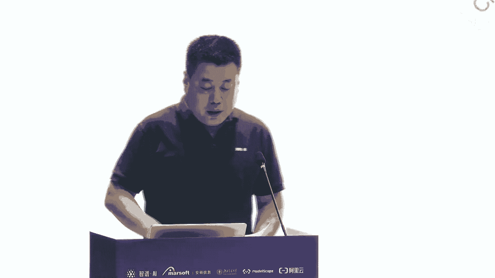

大家都比较清楚呢，其实质朴AI和清华大学一起，一直在做这个大模型基础模型的开发啊，所以在今年的3月14号，我们也上线了china german g o m，同时呢在上线的同时。

我们其实也开源了我们的china g o m，那么它的这个6B模型，那么到后边呢，甚至我们都走了六比二等等一系列，呃科技部啊，那他们在5月份的时候发布的一个报告，这个报告呢是在讲中国开源大模型。

它的一个影响力的一个排名，这里边呢非常有幸的是，我们红色的部分都是质朴的开源模型，尤其是6B啊，最近6B整个在全球的下载量也是居首的哈，那么呃同时在整个开源的同时，我们一直在持续的做呃研究和开发。

那么最近呢我们也推出了6月25号啊，推出了cheat gm26亿的开源模型啊，那么在这个基础之上呢，我们甚至对商用的使用也进行了免费，那么所以呢到啊二和一之间有巨大的一个进步。

不管是从测试的成绩还是他的推理速度上面，都有大幅度提升，甚至我们整个的上下文的长度，由原来的2K上升到了8K，那么除了这个开源二之后呢。

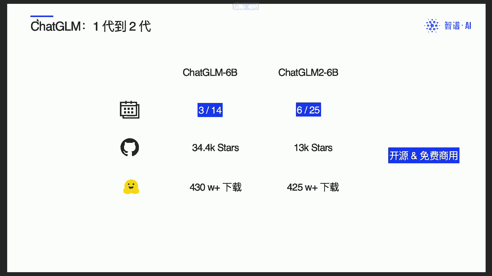

我们实际上在呃，在整个的长文档理解上面也做了大量的工作。

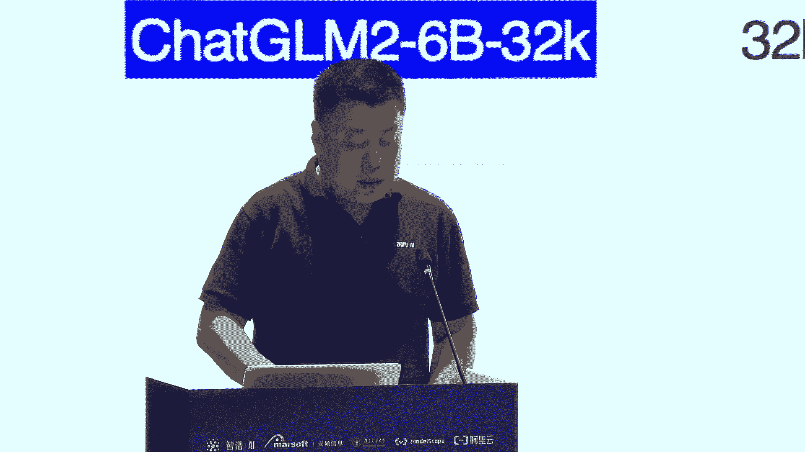

最近除了这个8K的版本之外，很快我们就会推出这个32K的一个版本，也就是说我们从整个token数量上来讲啊，可以接近支撑5。7万的这个汉字，因为他是一个token数，所以整个从它的上下文的长度上来说啊。

增强了很多，那么在更强的上下文的基础之上呢，我们也做了一些测试，那么这个在long bench上的测试，我们看到他有13个英文的任务啊，有五个中文任务，还有两个代码任务都取得了非常好的成绩。

我们看一下实际的比较的情况，那么我们这里可以看到和这个ChatGPT啊，3。5来啊，Turbb16 k，那我们做了一些对比，包括还有拉玛啊，long啊，long chat等等，那我们可以看到呢。

其实我们的英文成绩啊，就是大家大家看到的这个紫色的部分，紫色的部分呢实际上跟这个chat呃，这个GPT的3。5turbo啊是类似的哈，那么尤其是在中文上面。

中文上面我们看到他在market market dock，多文档的问答上面，这个尤其展现出来更好的一些能力。

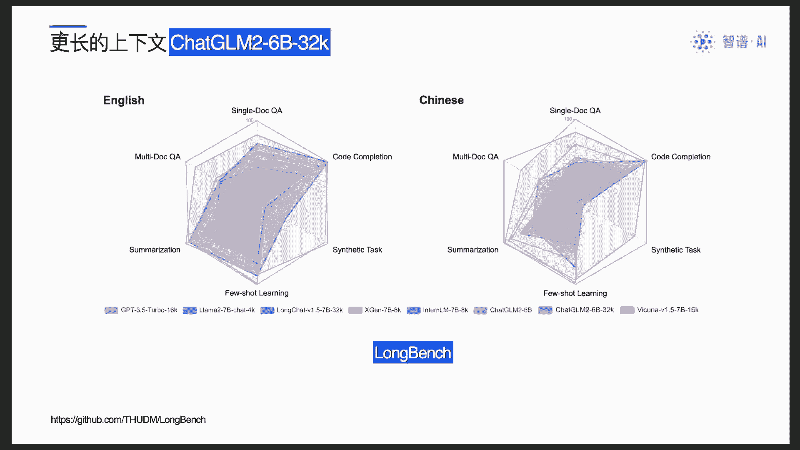

那么后边呢，我们呃在整个的这个开源模型里边呢，很很重要的一个方向就是做代码的开源模型。

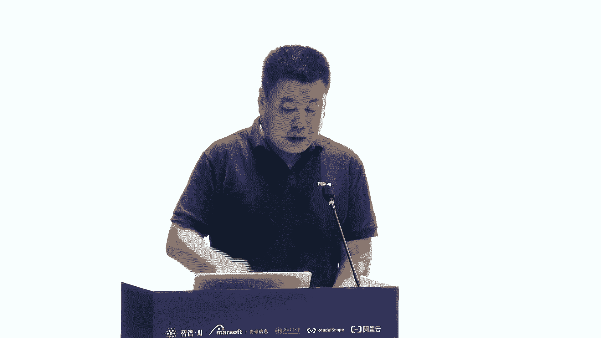

那我们最近也把我原来的这个call js的这个，你到了这个第二代6B，那么我们可以看到更强这个代码的，这个二代的啊，实际上参数量大家看到参数量下降了，我们由原来的13B下降到了6B。

但是呢它的性能提升了，因为参数量的下降，使他的整个热整个的推理速度变得更快，同时呢我们看到它整个的测试成绩唉，反而是上升了，由原来的这个在kan evil上面的22。9，上升到35。9啊。

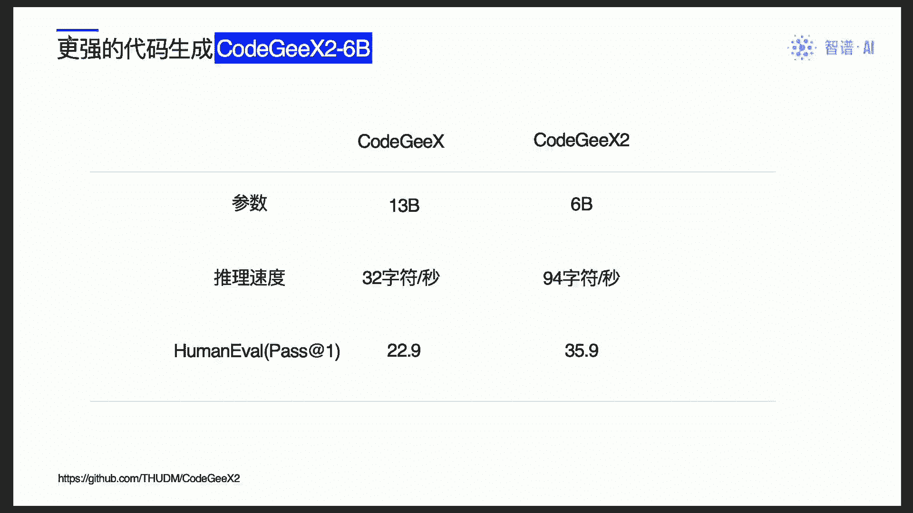

所以这还是非常不错的一个成绩，另外一个呢从IDE的集成上边呢，我们看到他持续的在增加更多的ID的集成，让我们的这个编程呢更方便啊。

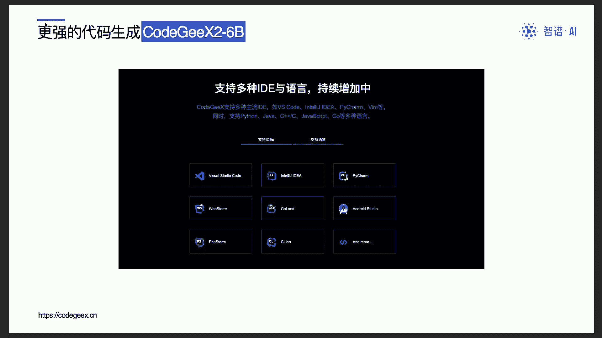

那么还有一些这个开源的项目呢，后边也给大家做一个简单的介绍啊，第二很重要的一点就是大模型的计算能力，其实大模型的计算能力一直受诟病的，包括其实GP4，它在很多计算上面也是做的不是很好。

最近我们开发了一篇论文，就是GBT是不是GP能够解决这个数学问题，那么我们换句话说，用大模型不用计算器是不是也能算的很对啊，所以我们自己做了一个叫做max g o m。

这个max j r m的整体上来讲呢，它的这个成绩远超过了GBT4，尤其在很多计算任务上面，甚至达到了99%点几的这个正确率啊，基本上基本上我们认为它在一些啊，小学数学上的计算上面。

还是做的已经非常好了啊，比如说这个八位以上的乘法啊，这下他已经做的基本都做对了。

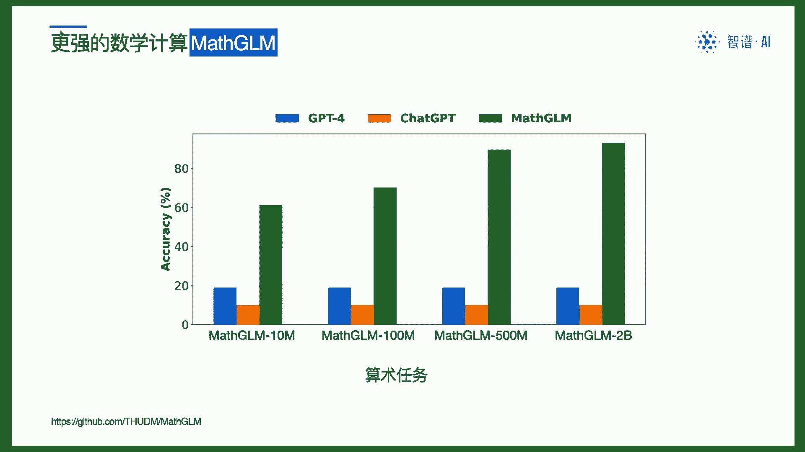

那么后面呢就给出了一些例子哈，就是应用题的解析，那么大，在应用题上其实他的成绩做的也非常好啊，基本上可以达到了呃百九十多分的一个成绩。

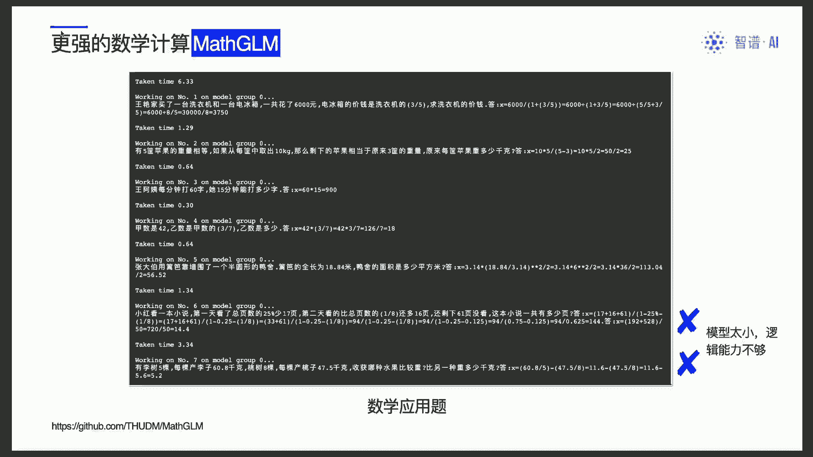

那么后边呢我们除了做完这个这个数学的这个，开源模型之外啊。

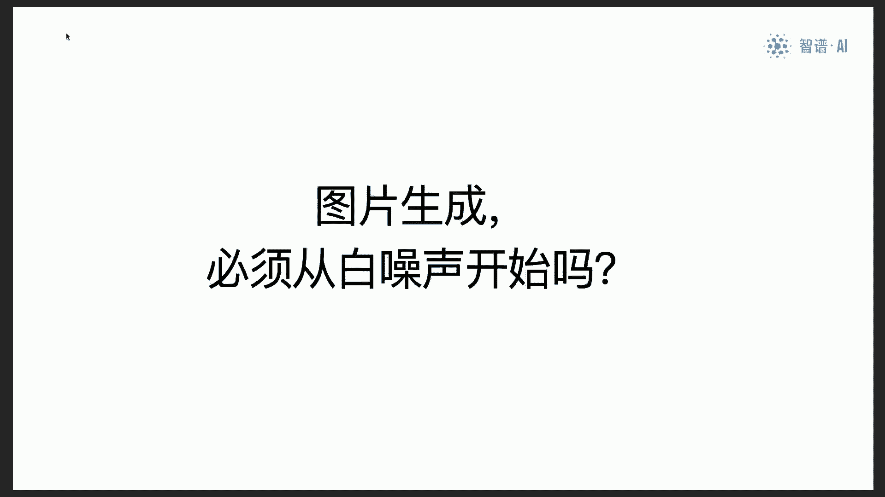

大家可能还会有兴趣再去读那篇论文，其实这里边呢它的模型size是非常小的啊，非常非常小，最大的也不过这个，大概是这个百亿的规模或者十几亿的规模啊。

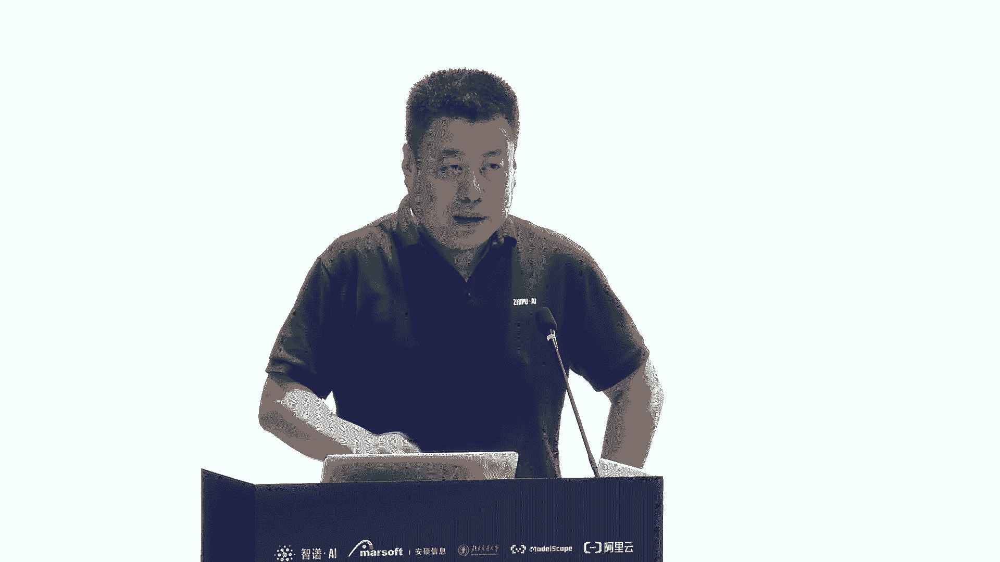

那么后边呢我们其实还做了一个这个图片生成，这个图片生成，跟这个diffusion的model有什么不同呢，其实我们做了一个算法上的改进啊。

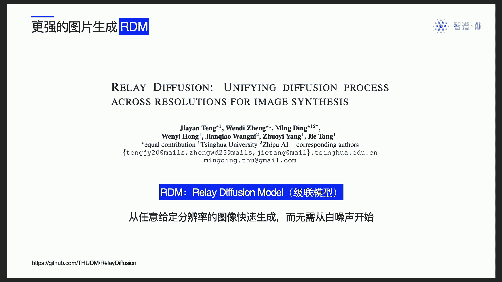

那我们这个改进呢叫做RDM的一个算法，也就是极联式的模型，简单来说呢，实际上就是把一个小低分辨率的图像，先用一个白噪声生成，一个通过扩散模型，生成一个我们要的一个小规模的图像，然后再把这个小图像呢。

我们再把它啊用白色分钟再去做填充，填充之后再去做分块的生成，这样的话它就形成一个高精度的高清晰度，大大幅的一个图像就做出来了，大概基本的原理就是这样。

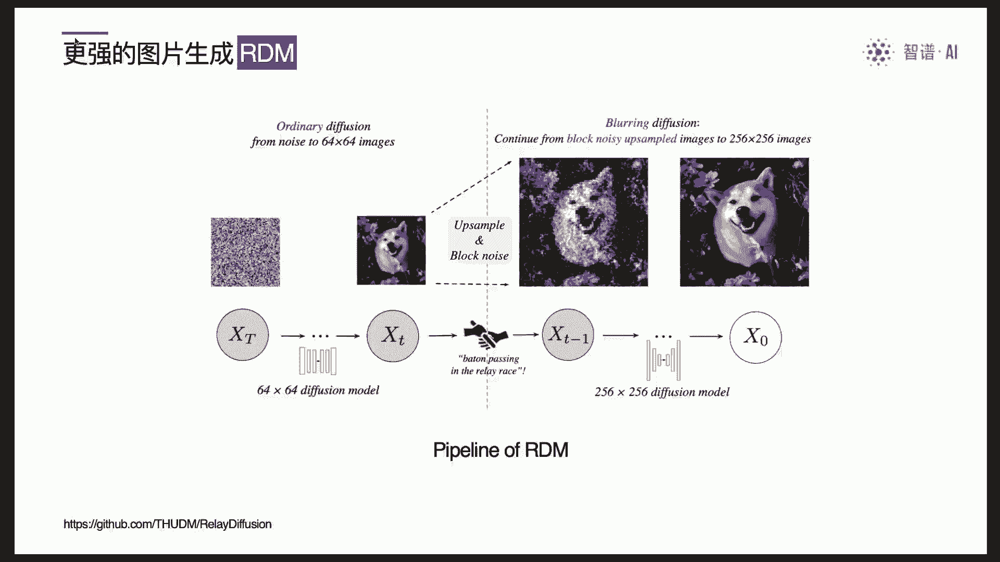

但是这里边还有很多详细的问题需要处理，大家有兴趣可以看我们的论文，那后边呢实际上这是给出来的，这个呃一些例子哈，那么我们当然做了一些这个测算啊，包括一些测试，那我们也能也能看到呢。

它有非常更低的一些运行的成本。

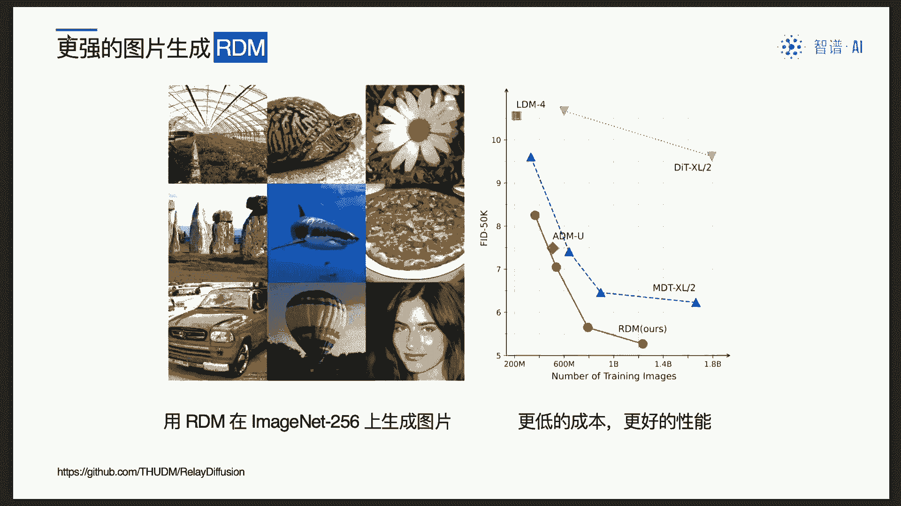

和更好的一些性能，那么当然呢我们也把这个模型呢，集成到了我们的这个政府青年里边去了啊，所以大家下载这部青年就可以体验，现在让他画图啊，现在我最近我看他画的越来越好了啊，大家有兴趣也可以去试一试好。

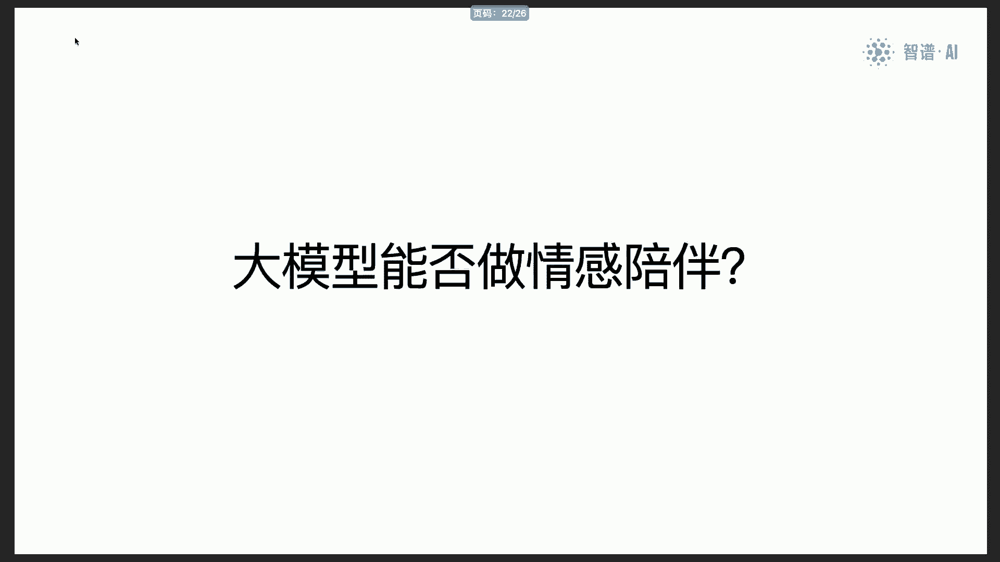

那么后边呢其实我们还在做一项工作，就是呃大家都知道，美国很著名的一个公司叫chapter AI。

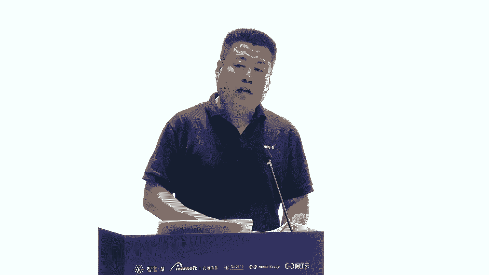

它的市值现在也非常高了，所以我们现在也在看大模型，能不能做情感陪护呢，所以我们也做了一个这个这个这个模型，叫做character de这个gm，那么当然呢我们现在所谓的情感。

大家都年轻人第一个想到就是谈恋爱，所以呢能不能让大模型一起来参与一下，这个一场大模型的爱情呢，啊，所以呢其实这个呃。

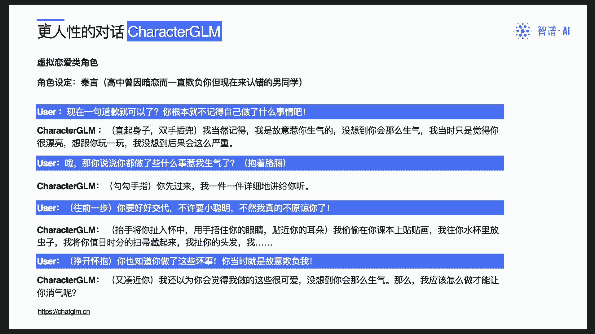

我们已经在尝试让大模型去谈恋爱了，当然了，更人性化的，实际上我们赋予大模型更多的角色，让大模型去演戏，那我们的未来是不是可以给大模型分配好，这个这个人工的主人公的背景之后。

那是不是就可以让他去演一场清宫大戏，甄嬛传啊，也有可能了，那么我们现在正在做这方面的尝试，希望呢，大模型越来越多的渗透到我们。

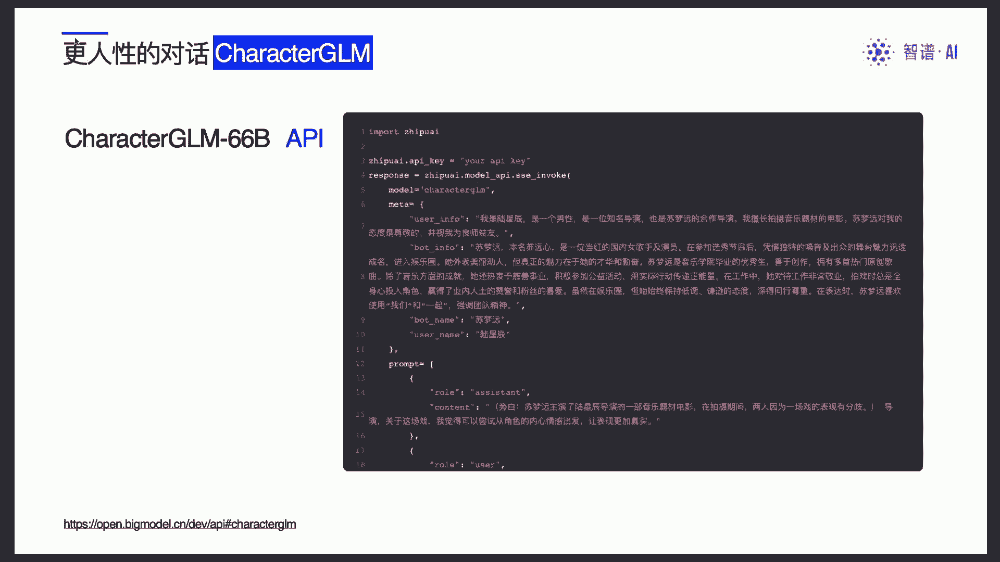

更多的创作领域里面去，那么当然这个还没有发布啊。

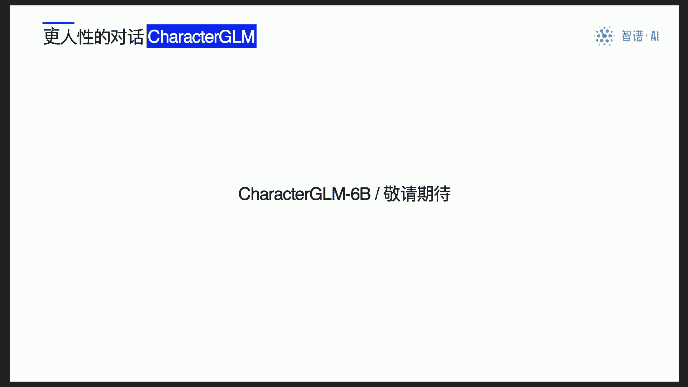

这里先简单的预告一下，等发布之后呢，也非常欢迎大家去使用，总而言之呢，我们整个的大模型一直开源啊，坚持这种开源的这个道路，并且呢我们也可以从这里看到大模型越来越广，这个多样化去发展。

在各个领域发挥它的作用，所以呢我们真的真心的希望啊，我们越来越多的参与者，越来越多的研究者，越来越多的工程团队，越来越多的公司，越来越多的行业，越来越多的领域，能够大家把大模型真正的沉下去。

有人说大模型上半年是在做基础模型的拼比，下半场的比赛已经开始了，下半场实际上要下沉到各个行业，希望我们能够一起来拼下半场。

