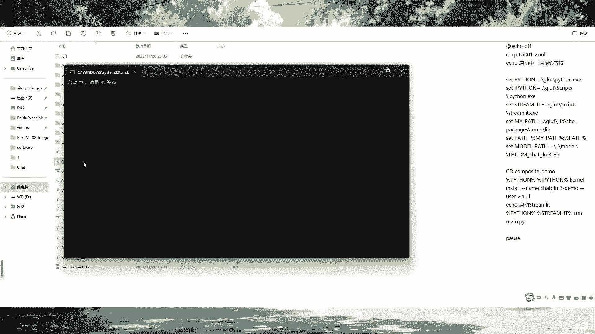
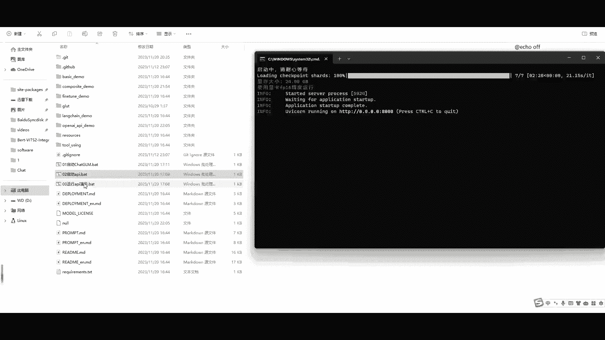
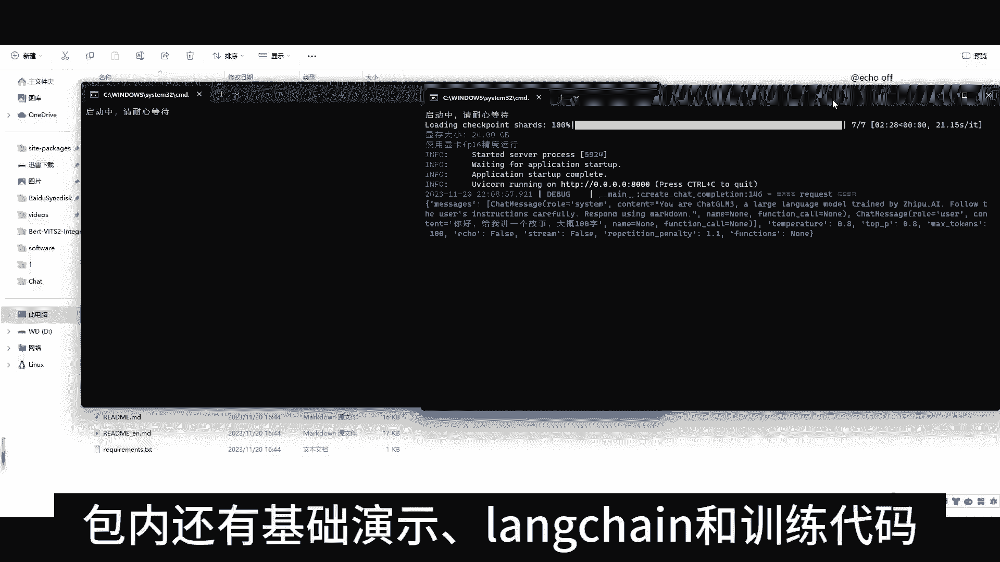
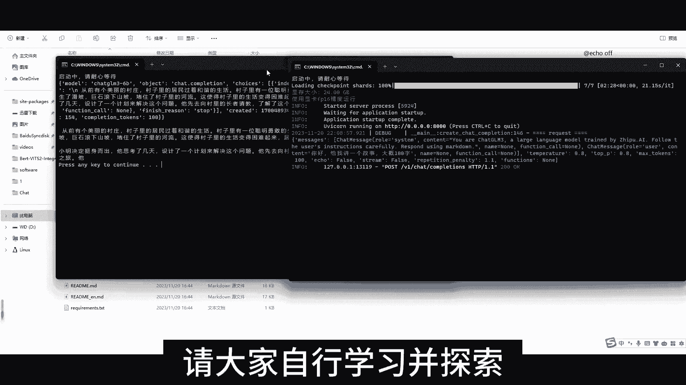
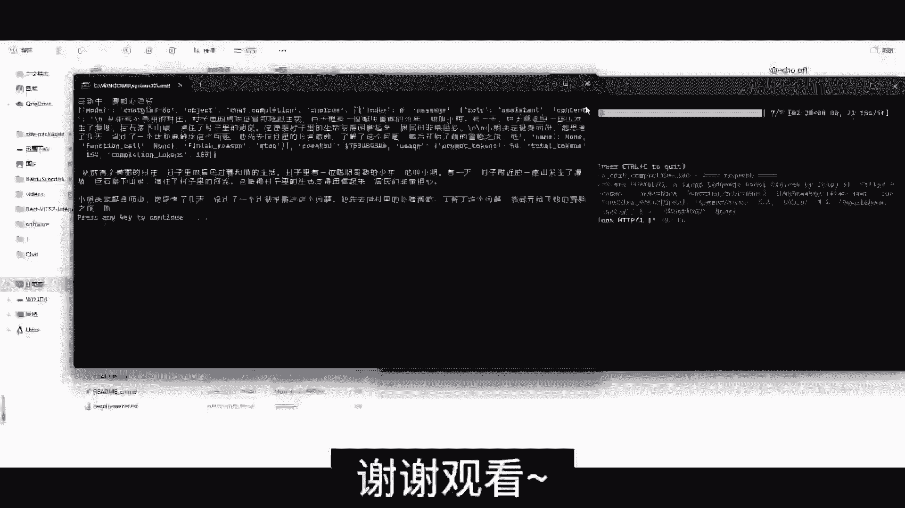

# ChatGLM3 一键安装，懒人专属 - P1 - ChatGLM - BV1c34y1w75K

打开零一启动chat jam会自动打开网页。

如果没设置默认浏览器，请复制网址打开，等待后台加载模型。

加载完成后，页面出现默认是chat模式，跟chat gm3聊聊天吧，看看他能做什么，刷新网页即可清空聊天记录，左边栏是设定栏，甚至可以让她扮演猫娘再次刷新，调整到0。8，测试一下它的算术能力。

结果都正确呢，刷新切换到to模式，查询北京天气小工具也可自行添加哦，刷新切换到code模式，可以生成代码并展示效果，例如用Python画一个爱心chat gm3，基本功能如前。

下面讲讲API，关闭网页和后台打开零二，此API可以作为任意基于ChatGPT的应用的后端，例如ChatGPT next web等，启动成功后打开零三进行演示。

本包基本是git库的原版文件，仅针对N卡添加了自动量化代码，包内还有基础演示。

lag train和训练代码，请大家自行学习并探索。

