# ChatGLM金融挑战赛 金融+AI大模型应用解决方案 - P1 - ChatGLM - BV1H14y1q7yE

那我是质朴的这个金融行业的解决方案啊，的这个负责人，然后呃我们在这个金融行业，包括银行，保险，券商啊，这些我们也都在跟很多的客户啊，在做对接和共创，所以这里头呢有一些，关于说大模型在金融领域的应用的。

一些呃思考吧，有些思考，然后给大家做这么一个分享，嗯现在整体来说大模型的这个游戏，包括在金融领域，包括在各行各业的这种应用，其实现在也还在一个起步的一个阶段，对，所以我们更多的还是一些呃往前的探索啊。

啊呃就是我们先有一个最简单的一个认知啊。

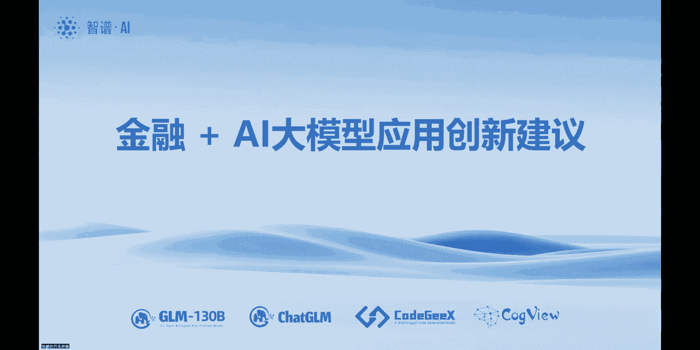

这个我想可能大家也都是这么想的，只是说我在这这个就做一个这种认知对齐，因为其实呃大模型，首先我觉得它最主要的功能就是认知对齐，那从呃技术形态上来说，我们说这个人工智能或者大模型，是让机器去实现。

让机器像人一样思考，那么呃这里头其实呃这个呃，这个从整个的思考过程上来说，首先他需要有一些知识库，包括专业的知识库啊，包括大学模型啊，它呃本质上这个都有一些这个知识库的，这种功能，那其实现在非常重。

然后另外一个呢表现出来这个听说读写啊，这些都是我们的五官去表现出来的，各种各样的行动，其实非常重要的是中间的这个思考过程，那现在我们在这个实际的应用场景的这种解，析和开发的过程当中呢。

也发现其实非最关键的是是这个思考过程，就是一个问题过来之后呃，如何解析，就如果是一个简单的问答，就所谓的一问一答，那其实就是那个本质上，就是一种搜索的一种能力，那现在呃大模型加专业知识库。

其实已经表现的很不错了，非常好了，但如果背后是一种呃需要多轮，然后背后是需要有一个呃思考机制的话，那么这里头还有非常多的这种设计，开发的工作要去做，就不只是简单的这个甩给大模型就可以了。

所以就是其实这个呃思考过程的，这个设计和优化，我觉得是现在大模型应用开发的一个关键点，或者也是一个也是一个难点吧，好然后呃，所以就是说这个从应用的这种形态上来说呢，就是它的应用价值呃。

呃可以说就是为人提供这种呃，智能助理或者智能型的这种工具，从产品形态上来说呢，其实咱们所说的这种智能对话问答，这就对应着人的这种听和说的这种能力，然后智能文档和代码，就对应着人的这种读和写的能力。

还有像智能的工具啊，比如说mile journey啊，这一类的，包括阅读啊，看呀啊，包括那个对所谓的这个多模态呀，其实也都是就是我们可以给它归为是看画，或者是这个创作或者是做事的这种能力。

然后还有一种呢，就是说其实可以通过自然语言教育交互去调用，现有的一些这种已有的一些生产力工具，比如说像CADCE啊，这些工具用自然语言交互去调用对，所以就是说他其实呃可它的产品形态。

应用场景是非常非常多的，但是回过头来它的逻辑原理其实是很简单的，本质上最核心的就是这个思考过程的这个编程，那从他的这种应用价值上来说呢，呃如果抽象来看，就是人和他的对象都能够赋能。

人呢包括了员工或者是包括了这个客户，然后对象呢包括了他的他人，以及他使用的工具，以及跟他相关的，或者他正在使用的产品，所以这些一切的可以说我们所有的人和我们人，所有的对象。

其实都是可以用这种大模型来赋能的，那会带来双向的增强，一个是对人来说会增强人的这种智能，然后从从物的角度呢，就是误会形成一种拟人的能力，就是假如产品会说话，或者假如工具会说话。

那么它会跟人会是一种什么样的一种交互形态，所以这里头的交互啊，他的能力啊，都会发生这种呃根本性的这种改变，那最终大模型的应用在各个领域呃，是可以去实现这种认知的普惠或者叫泛在智能。

那这个事儿呢就是现在呃我们的这个摸索，现在看起来就是逻辑上是全通的，技术手段上也是通的，现在的这个一些难点，就在于每一个专业领域的这个思考，过程的设计啊，这个大家呃这个熟悉大模型的呃。

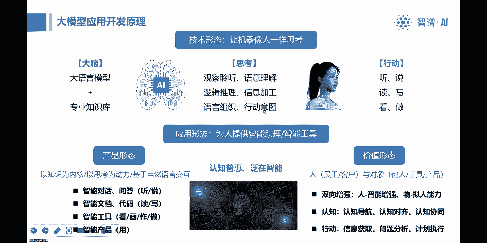

这个小伙伴们应该都熟悉这样的一个过程，就是从通用的预训练，然后到专业的领域，然后再到prompt呃，这个任务的能力，然后最终的产品化和工程化呃，我们这段时间的一个很大的一个体会是什么呢。

就是说其实非常重的，真正走向使用非常重的事儿，是在这是在产品化和工程化上，就说呃呃应该说这个就是在使用场景当中，刚才说的，在每一个实用场景当中，它都会有一套思考逻辑，这一套思考逻辑是现在的大模型里头呃。

不直接有的，或者有也需要去，也需要去把它萃取或者提炼出来，然后通过微调呢只能去改变，就是他对于一些嗯问题回答的这种准确度，或者是包括他的这种回答的这种风格，但是就像说我们有呃这个呃。

就像说比如说打个比方呃，这个预训练或者微调这些东西，或者就像说这个在医学领域有教科书，然后呃他本身呃，这个呃已知识库有了一定的知识库了，但是知识库本身并不能代替思考，或者说呃医学的教科书并不能代替医生。

那现在大模型呢，是具有了一定的这种问答的能力，就是你问我什么，然后我在这类似于说你问我任何一个问题，然后我在这个教科书当中我都能反馈出来答案，但是它和实际的这个医生的问诊过程。

临床的问诊过程不是同一个过程，所以这里头非常重要的是说，比如说医生的临床问诊过程，那就得去理解那个临床问诊过程当中的，思维逻辑和他的这个思路，然后呃把这个设计好，然后反向才能去用大模型。

把这个所需要的这种知识呃，包括这种问答的多轮交互去给调动出来，然后才能形成一个，就是我们现在应该说客户所期待的这种产品，所以其实呃这个在大模型的应用当中，产品化和工程化这一块其实是很重的。

啊关于这个大模型的呃。

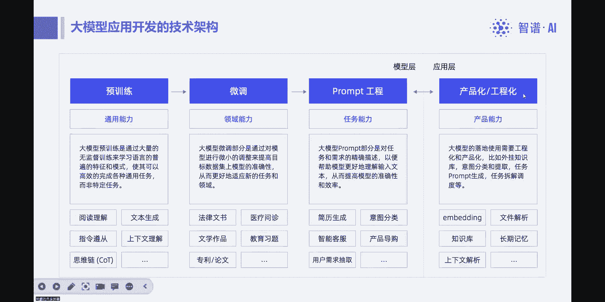

在行业当中的应用价值呢，其实麦肯锡呃应该是上个月出来了一个报告呃，然后除了说他强调这些数字之外呢，其实他后面去总结了这四大方向，就是他认为他们解，对八八百五十多种工种进行了建模。

然后拆解了2100多项工作行为，然后最后是认为这这四个方向，一个是客户运营，就是包括跟客户的聊天，然后问答查询这个客户的档案，生成员工的工作建议，这些呃能够带来对生产力的这个影响，能够带来最大的影响。

然后同时向这个营销销售呃，以及软件工程，就是软件开发以及这个产品研发，就是这些过程呃，都是大模型带来的改变会比较大，那其实这些过程大家如果去看的话，就是都是需要那个动脑子呃，动脑子或者动嘴。

就是需要去实时交流，实时交流的背后，动嘴的背后也就意味着是动脑，包括产品研发呀，软件要去写代码呀，包括软件研发，产品开发，这些都是一些动脑的工作，所以就说现在就是呃之前说到这个大模型。

更多的我们在做的事情，就是让机器像人一样思考，所以它的核心关键点还在思考，所以就说对于一些思考型的工作，它会带来这种比较明确的这种价值，然后呢，现在的开发难点，也就在于对思考过程的这种浮现。

呃对于这个麦肯锡报告当中，他也提到了银行业，那在银行业当中，就是比如说对于员工的这种工作辅助。

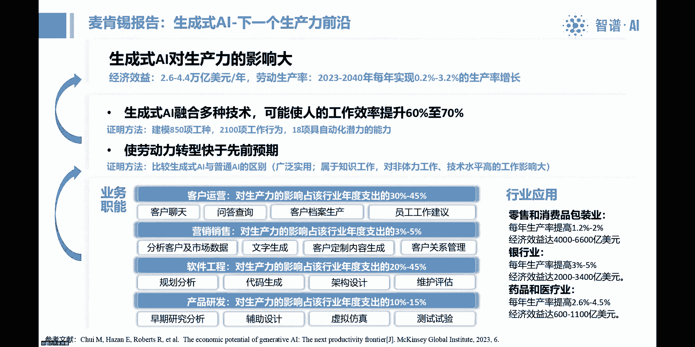

比如说信息问答啊，外部的这种专业知识，比如说呃要去拜访一个客户，然后这个客户假设假设是什么新能源，或者其他的什么专业领域，那其实呃这个呃银行业的员工，现在也需要了解更多的这种专业知识。

包括内部的信息检索，然后个性化的营销方案，这些呢其实啊大家也都在各个不同的地方，应该也都会看到，就是所谓的这种大模型的这种应用方向，包括这种自动化呀，软件代码生成啊，还有这个客户服务。

还有内部的这个风控管理，就是呃在银行业当中的这种应用呢，也是这种加快员工的效率，提高客户满意度，降低公司的风险，呃其实这些现在看起来这个都是比较有共识的，就大家都会认为说哪些场景能做。

然后大概会带来什么样的价值，其实呃目前来看嗯，共识还是蛮多的啊，那接下来就是我们在呃接触的一些客户，然后我们会总结提炼出来一些这种场景。

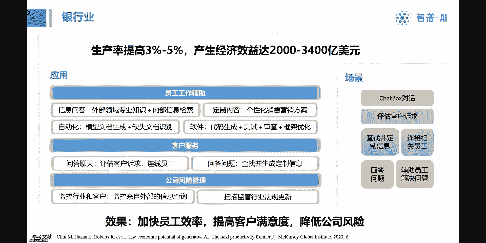

然后可以给大家做一些分享，呃其实在各个行业大模型的应用，我觉得如果去简单的去跟客户沟通，其实就是告诉他可以做各个岗位的智能助手，然后那就再回到每一个具体怎么做，就回到每一个岗位上去。

看他那个岗位上的工作都有哪些，然后可以通过智能助手来帮助他做哪些事情，那比如说在保险当中啊，比如说这个保险的销售，这个可以做保险销售助手，然后核保就是核保这个环节的助手，包括理赔啊，稍等。

啊包括这个保险理赔理赔的过程，也可以用这个智能助手去做帮助呃，然后在公司内部呢，包括这个像医学法律的专家，那我们这边之前这个也有，就是我看咱们在开源社区当中，也有基于6B去做了那个胸片的那么一个应用。

那像那个我们跟保险公司再去，他们在看的时候，他们就会呃比较感兴趣，包括这个呃保险精算，然后那个投资经理这些就是说白了，只要它背后是需要用到知识库，需要有思考过程的。

其实都是可以用大模型去给他开发这种岗位，助手的，好就是呃，这是也是一个跟保险公司在聊的一个需求。

那包括他的这种内部的规章制度的，规章制度的查询，以及这种产品知识的查询，因为比如说保险的产品呃，大家如果买过保险的话，就是那样的一个保险产品的说明书，其实普通人都是看不懂的。

然后嗯所以就是用模型去理解了之后，然后可以让呃这个从消费者的角度，可以去从消费者的视角和思维去提问，而获取他所想要的信息，包括这个保险内部的这个合规政策呀这些，那其实从呃这个他的这种技术逻辑上来说。

也比较简单，就是嗯本质上最表层就是一个自然语言，交互的呃一个能力，然后呃背后其实很重要的，就是说它这个里头的思维逻辑，就这个场景的思维逻辑，以及它在这个场景之下，不同的文件啊。

的这种信息调取和信息组织的这种机制，然后底层会是一个知识库的构建的这种能力，呃这个呃，这个呢就是专门来做的一个这种保险助手。

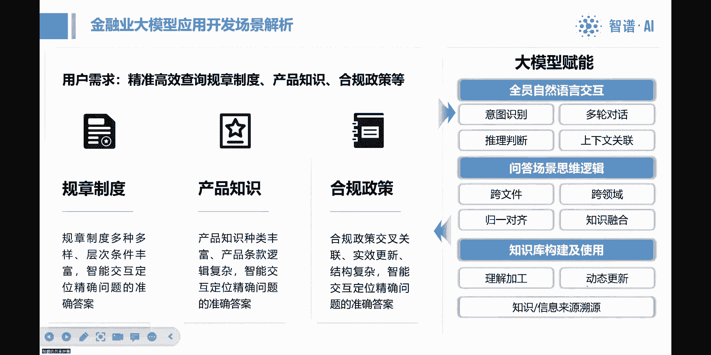

就是比如说对于保险产品的全生命周期，就他在从了解产品到购买产品，然后在再保的过程当中一道理赔，一起退出全生命周期，其实客户都是需要有一个这个，对产品的这种了解的，然后呃目前呢就是说呃包括保险公司在内。

就是包括这个金融机构就有非常非常多的入口，但其实这些入口其实都是有可能去做这种，语音交互型的这种助手，然后去叠加在每一个入口之上的，它就会形成一个全入口的一个矩阵，然后后面就是说需要把这个呃。

产品相关的信息呃，这个产品的就是产品是有多种多样的产品，保险产品有健康健康保险啊，资金规划发行的投资型的人身保障型，不同型的类型的产品，以及他的这种呃产品的说明，这个产品的说明有包括投保的条件。

理赔的条件，还有各种权益，以及这种围绕着产品的服务，就是你买了产品之后有保单的服务，领取的服务，查询的服务，所以就说呃这个背后围绕着一个产品，完整的全生命周期的这样的一种呃问答。

问答交互其实是有非常大的价值的啊，那这里头就是说它的难度，其实我还是刚才所说的，其实关键的这些难点除了说呃表层，也包括，比如说多轮对话，其实在技术上现在还是还是有难度的，当然也有一些实现的机制和方法。

然后呃刚才说的很重要的是，它背后的这个场景的知识逻辑，啊这个是另外的一种场景。

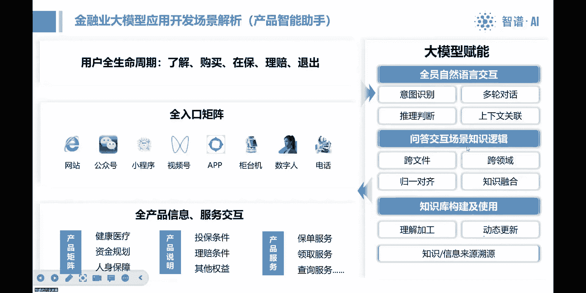

就是比如说做这种销售教练，那其实这件事情呢之前呃我们了解到，当那个就是之前有ALP的时候，大家用LP也已经去做过这块的这个事，然后呢如果用大模型去做呢，肯定是会带来更大的这种效果的提升。

呃就是其实销售过程本身，首先第一个就是销售，其实是所有公司呃，最重要的或者最感兴趣的一个点，因为总得把东西卖出去，然后从销售这个环节来说，其实销售的本质或者销售的关键点，不在于给客户推一个产品。

而在于跟客户的交互过程，就是通过跟客户的聊天或者交互过程，然后获得客户的认可和信赖，最后才是产品的成交，所以呃好的销售包括这个呃，如果是这种，但女生啊或者大家陪女生去那个买衣服。

这个好的销售一定不是上来就推荐一个衣服的，好的销售呃，一定是说这个上来先聊天，然后理解整个的这个你的痛点，然后甚至在这中间通过聊天会去引导需求，然后才能实现最终的一个销售。

所以其实销售的过程就是一个非常精细化的，一个聊天对话的一个过程，所以就是说这个呃最终这个销售要让消费者，就他最终要去呈现自己的专业，就是对问题的理解和引导，能够体现出很强的专业能力。

第二个要体现出来用心，就对这个客户很专注的呃，这个为这个用户考虑，包括甚至要做到贴心，就是呃包括话语啊，呃那个呃思维啊都更加贴近客户的这种思维，所以这里头其实是一种综合能力的提炼。

那通过大模型加知识库呢，他可以去沉淀这种客户的画像库，包括客户痛点需求库呃，然后以及背后围绕着客户的痛点，你究竟要卖一种什么样的产品以及产品的方案，以及这个产品跟不同的客户，它的核心的贴合点在哪里。

背后还需要很多的这种对产品的，专业知识和销售技术啊，很多很多的这些知识，那其实有这些东西综合在一起，然后可以去复现销售的一种听说啊，甚至是写方案的这样的一种过程。

所以上来可能是对一个客户的这种画像的预测，就是可能看见这个人嗯，就先想一想他可能会是一种什么样的画像，可以做一个模拟，然后在跟客户沟通的过程当中，然后在这个过程当中去呃这个做痛点的挖掘呃。

以及说确认要去确认客户的痛点是不是这样的，包括对需求的引导，然后最终才会推出来一个方案，这个方案出来之后，你还需要跟客户沟通，得到客户的认可，最终才能实现销售，所以其实这种呃。

我觉得这种呃销售的这个环节其实是呃，如果大家想要去开发这种应用，我觉得这会是呃这个每家企业吧，或者包括金融场景当中，应用会非常呃价值会非常大的，但是难度也是蛮高的，就刚才说到难度，其实知识库还简单。

但是关键很很重要的是要去复现，或者是更多的去复现那个思维逻辑，就是在那个好的销售的，它的整个的那种问答问答过程，呃金融业当中。

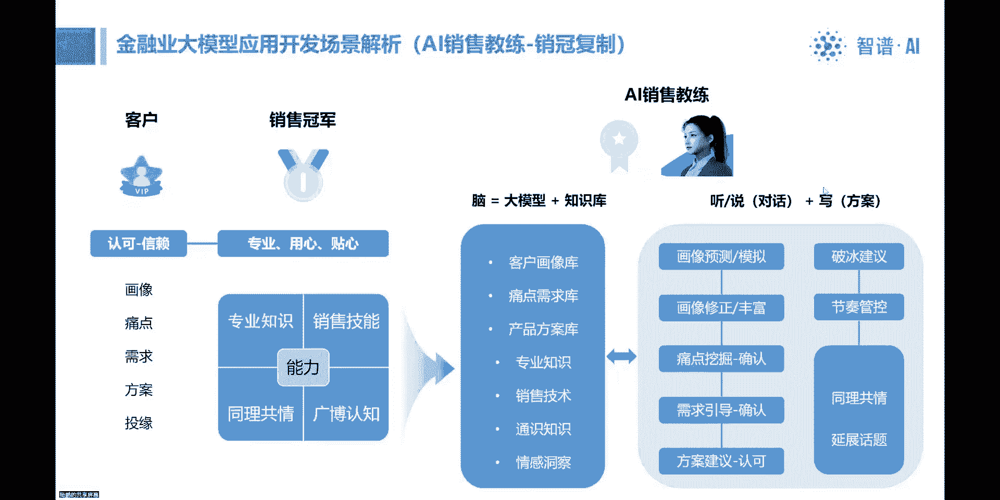

还有比如说就是呃这种客户报告生成呃，比如说这个银行业的客户，银行他要去拜访客户，那么这个客户他得去了解这个客户的情况，那现在就是多元的数据，有包括客户年报啊，各种各样的来源的这些数据。

然后通过大模型呢可以去做这种总结，提炼和生成，然后按照特定的这种要求和格式去生成，所需要的报告，可以给到呃这个这个客户啊，就是呃咱们的这个销售经理吧，或者是客户专员去拜访客户的时候做一些准备。

甚至做的更加智能的话，背后直接给出来客户的合作建议，就是根据客户的特征以及自身的这些产品特征，直接给他匹配出来一个合作建议，所以这些都是可以去做的点，啊这是在保险行业。

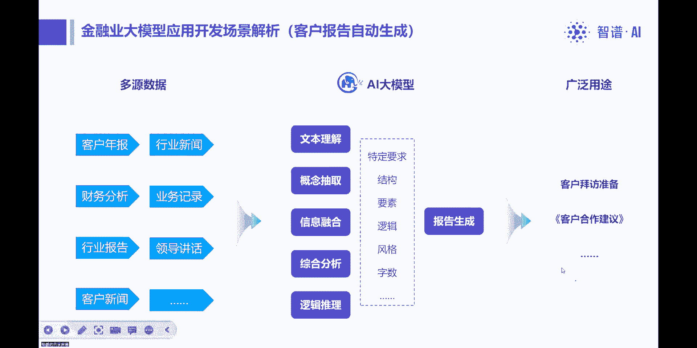

那其实刚才说的这个大模型，除了说对话之外，就是做这种呃文档，那其实所有企业嗯，我们从那个最根本的角度，企业管理的最核心的东西就是ISO9000，ISO900的基础就是文档管理。

所以其实文档背后就是企业的管理，流程和决策流程，所以就是呃包括运营流程，所以就是说任何一家企业，我们可以从他的岗位入手，也可以从他的文档体系入手，从岗位入手呢就去做他的岗位助手，文档体系入手。

就去做文档的自动生成，所以就可以去找企业当中的各种各样的文档，这是保险当中的文档，然后每种文档其实都可以去给他呃，去规划它的自动生成，然后从文档的自动生成，可能倒着会推出来对原有的数据库的调用。

包括对bi的调用，包括对信息的整合，对，所以就是呃会带出来一系列的这个呃，AI的就是集成应用，我们现在觉得大模型更多的是说，通过自然语言交互，形成人与这个系统交互的第一入口。

然后反过头来用大模型去调动更多的工具，就是这里头一定不是大模型唱独角戏，而是大模型去调用更多的工具，然后集成起来呃，为人提供这个智能助手的这个服务，好刚才讲到这些场景呢。

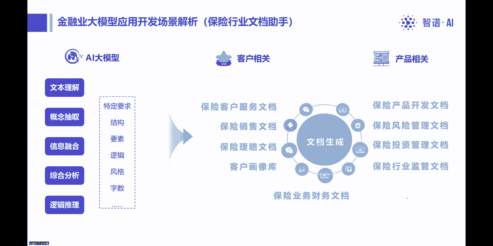

就是如果我们把它呃总结一下，或者化繁为简，其实所有的业务都是由人完成的，那么大模型现在本质上就是做人的助手，那人的助手人要做的工作，在工作当中主要就是沟通分析决策，那其实从沟通岗沟通。

更多的是在我们说是在一些业务岗，就是他要去跟服务客户，包括赋能员工，就员工的包括业务技能啊，工单助手啊，这一系列，包括专家系统啊，这些都是它的呈现形态，基本上是以问答为核心，那所谓问答呢。

更多的关键点就是说第一个要能理解意图，然后第二个就是要能梳理问题，就理解了意图之后，就像医生看病一样，呃知道他他过来是要看什么病，然后那个要要去呃对他进行全面的分析，要带着主动的去引导。

就其实现在呃大模型现在大家用起来呃，这个更多的还会是说，这个人就相当于用户去问大模型，但其实这里头呢，我我认为真正实用的产品应该是反过头来，因为现在在用大模型的时候，其实呃包括我们现在在用的大模型。

就是说包括提示词工程，就说怎么样你才能得到一个好的答案，那你就需要把问题问对好，那这反过头来就意味着说呃，问问题的人要非常的专业，那再推导一下，如果问问题的人非常专业，那么还需要找模型干什么。

所以就是说我们认为在实用的场景当中，应该是反过来，就是问问题的人应该是个小白，他的他的思考思维很简单，但是大模型需要去引导着他思考，然后帮助他思考，去完成他所他的他这个脑子当中的问题。

或者他想要去完成的任务，那么这背后其实就是刚才说到的，涉及到对这种任务过程的思维，编程大模型，它有基础的语言能力，然后他也有这种呃一定的思维能力，通用的思维能力，但是在专业场景当中。

需要去构建那个专业场景的那种编程能力，所以就是呃其实这个是非常有挑战的，或者我们现在在做的过程当中是是非常困难的，但是是走得通的，就是说只是说这里头的这个开发逻辑，和开发思路得发生非常大的变化。

过去的IT开发更多的是说做动作过程的分解，这是我第一步，第二步，第三步是什么，但现在大模型的开发，更多的思维思维过程的分解还不仅是分解，还有整个思维链的这种组织，才能把这个场景给做好，然后另外一种呢。

其实就是这个相当于这个就类似于对化了，这个就是生成，那文档的生成呢，更多的其实在管理岗位上就会用的会比较多呃，因为这个管理者就是其实更多的就是基于信息，然后做信息的这种搜集整理。

然后对信息进行逻辑分析而得出来一些结论，然后再去这个指导这个工作，所以就是在这里头呢，其实大模型呃，在这里头他在信息分析这个环节，就刚才说的应该是呃大模型，再去叠加上现有的各种各样的工具，包括BI。

包括数据库一系列的工具，然后去生成业务所需要的东西，呃最终呢它其实是支撑一个一个的环节的决策，然后呢所以从这个点上，其实我们也可以反着来做，就是决策牵引逆向来开发决策流的支撑功能，比如说找领导，好领导。

每天你基本上决策流当中经常会用到哪些文件，然后这些文件倒着去看，你这个文件如何自动生成，然后倒着去捋的时候，就会发现，就这些背后的一些工具都会被都会需要用到，都会调用起来，嗯好。

就是这个就是我们现在在做大模型的应用。

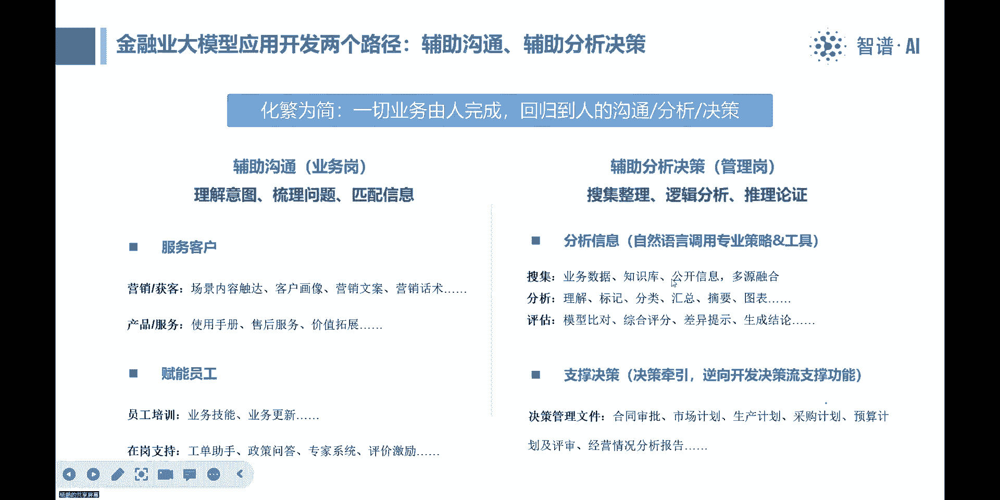

开发的过程当中呢，其实呢还是能感觉得到，就大模型这个技术本身和应用，其实还存在一个非常大的一个鸿沟，这中间的鸿沟，就刚才说包括说呃一些，比如说多轮问答工具的优化呀。

尤其是呃这种问答场景当中的思维过程的呃，这个呃复线呀，或者是思维的编程啊，所以现在我们在跟客户在聊的时候呢，或者在沟通的时候，我们其实呃很怕客户一上来就说哎，我这要一个功能，你就你就给我提供这个功能。

我就就要这个功能，但其实这里头现在是，我们认为是需要大家双向去走的一个过程，第一个因为这些大模型的应用本身还很新，其实啊大家都在探索这种路，然后第二个就是刚才说到这里头，大模型的应用想要做好。

我们现在的感觉可能业务方得占到70%，要付出70%的努力，技术可能是30%的努力，因为只有业务方才懂那个场景当中的思维逻辑，就只有业务需业务点上，它才能提出那个需求，并且它才能解构那个思维过程。

然后包括知识库的准备啊，问答对的准备，都需要业务方来提供支撑，包括产品开发出来之后，它还需要不断的那个问答测试迭代，也是需要业务方深度介入的，所以其实这里头我们会认为说，像这种大模型的这种开发。

可能它会形成一种全新的技术和应用之间的呃，技术和业务之间的一种合作机制，可能业务这边会占到七八十%的这种比例，然后呃技术更多的是提供这样的这个方法论，然后思路以及中间去配合一些技术实现。

那我们现在呃给给客户这边在建议呢，就是如果说我们面向一个企业的时候，就说呃，其实大模型现在确实本质上还是一个创新，是一个创新的过程，因为它的这个应用还在落地的过程当中，那我们自身定位呢。

就是我们希望我们成为这个企业的这种创新，应用的这个副驾驶，就是能够帮助能够通过我们呃，在各行各业的这些应用呃，探索开发的这些经验，能够帮助企业少走弯路呃，这个直接能走上快车道啊，然后呃。

因为今天那个我知道，咱们其实是这个是一个开发者生态呃，所以其实我之前跟贾老师也也，我们也多次沟通过，其实我们现在呃在面临在跟客户沟通的时候，是有非常多的这种呃实际应用的需求的，那呃质朴呢。

我们其实本质上我们核心定位还是在做大模型，就是我们呃做这个应用开发的，更多的是是跟客户一起来规划设计，然后呃辅助客户做一些这种前期的工作，但其实里头很多业务应用开发的工作，其实是有很非常多的空间的。

所以我们其实也期待呃后面能够找到一，就是我们也能拿一些这种点出来，然后跟咱们的开发者生态来做协同，这样的话大家也可以在这种呃，实战的这种场景当中来，不断的来打磨自己应用大模型的这种能力吧。

好呃这个我今天的分享大概就是这些。

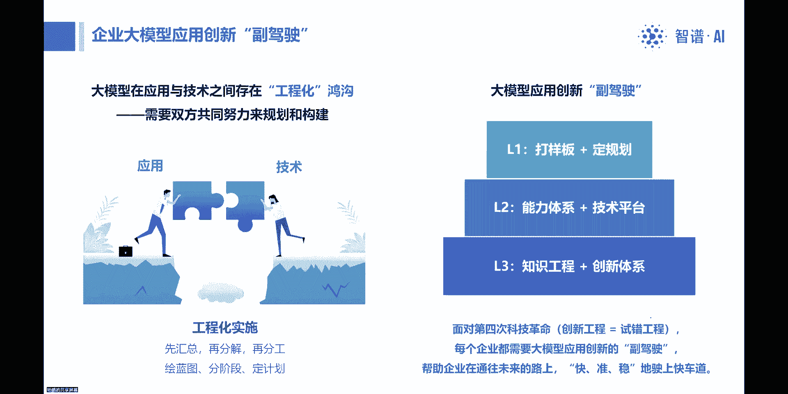

然后呃后面是我们这边的呃，我们金融条线的一个负责人的微信，对大家如果呃需要扫的话，可以扫一下这个微信，然后有什么问题可以跟我们联系好，大概是这样好。

