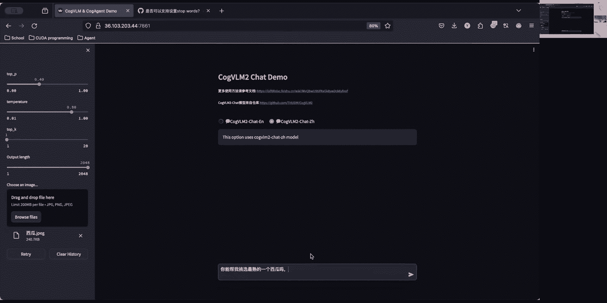
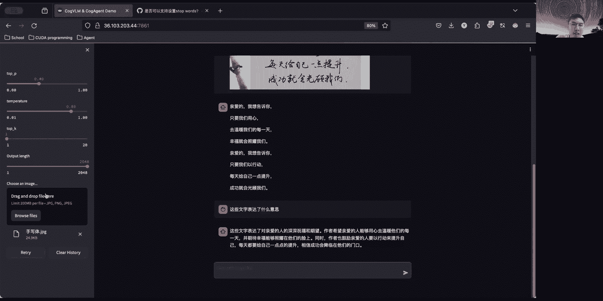

# CogVLM2：第二代视觉大模型，19B即可比肩 GPT-4V - P1 - ChatGLM - BV1LD421G7oh

欢迎大家来到我们今天的直播，我们今天将为大家带来COVM2，也是我们智慧AI清华大学联合办啊，联合研究的一个最新的一个开源模型，好大家就可以体验到用19B的模型参数啊。

体验到比肩GBT4V的这么一个模型，那么今天的直播将分为两个环节，第一个环节是由我们的啊，伟汉学长为大家带来模型的一个基本的原理，以及训练过程一些细节，包括模型一些架构等等，以及最后模型的一些综合成绩。

那么第二部分啊是由我为大家带来啊，模型在开源模型的这个基本应用，以及大家如何去快速上手，我们的co个VM2的模型，以及我们将来的一些计划，和大家能联系到我们的一些渠道和方式好。

那我们呃就不多时间不呃不多讲，我们直接给到我们的啊，伟汉学长啊，开始去讲第一部分好，我们欢迎嗯，嗯大家晚上好，我是王维翰，是呃智谱AI多蒙泰团队的主要研究成员之一。

然后今天很荣幸能给大家带来一些我们团队，而最近一年来都在多模态领域的最新进展。

哦那么自从GPZGT4发布以来的，大语言模型，在很多任务上都展现出了越来越强的性能，比如说它可以通过少量的学习，和通过思维链来解决一些复杂的问题，呃，但是由于大圆模型训练使用的纯文本语料。

是缺乏对视觉概念和真实物理世界的理解，他们常常会在一些简单的问题上犯错，呃自从今年以来呢，我们我们也可以发现一些头部的科技公司，无一例外的都使用了多模态能力力，做的一大卖点，比如说谷歌早在去年的3月份。

就提出了泡沫模型，他把多一个多模态大模型和机器人相结合，从而可以响应人类的指令，并且做出各种动作呃，然后他今年提出的致命令1。5，可以支持原生的动态，也可以和支持输入最长十个小时的视频呃，今年5月份。

OpenAI发布的GPC4O，可以实现实时输入和解析以及输出，包括呃音频图片，视频文字在内的所有模块的内容呃，我们也相相信就是训练一个强大的语言模型，然后在它的基础上添加上各种模态。

是一个实现AHI比较可行的技术路线，哦那么虽然呃最新的多模态大模存在，过去的一年呃，发展的比较迅速呃，但脉象形文化仍然存在一些比较关键的痛点啊，比如说模型往往会输出图片中的幻觉呃。

分不清图片中的物体的形状和位置，或者是它只能处理24分辨率的模糊图片呃，以及完全无法识别的中文场景和文字等等，那么我们团队针对这些痛点，也是连续不断的在做出了各种改进呃，并且很早就意识到。

多模态模型的OCR能力，是关于呃，模型能不能落地的一个比较关键的因素呃，因此我们在去年5月份发布的VISJM模型，还只能回答一些比较简单的问题呃，比如图片中有几个人，或者图片里的人在干什么啊。

这显然不是我们所希望的呃，那么到去年9月的时候，我们发布的靠格标M初代的神作，已经具有了一些呃比较强的菜走能力，还有一些呃比较初步的文字识别能力，到了11月之后，我们发布的cover agent。

可以在呃，GIAENT和一些通用的领域，都取得一个比较好的结果呃，它可以具备一些TT能力，也可以和我们进行一个关于图片的对话，可以呃进行一些OCR的这个对话。

比如说这里他可以把一个表格转化成markdown格式，或者去分析一个折线图里具体的数字等等，呃然后具体来说，我们在去年10月发布的cover agent模型，已经可以高效的完成呃十个多模态任务。

比如说一些传统的视觉问答和世界知识，以及一些高级任务，相关于额数据和代码的逻辑问答，图表问答等等，呃，那它的另一大特点是，可以直接与我们的生活场景进行交互，也就是让我们的模型模仿人一样去跟手机。

电脑等操作设备的GUI界面进行交互啊，让模型完全模拟人的行为，额对于top engine，它相对于初代top vm一个比较重要的改进点是，我们想让它适应到一个高分辨率的输入的图片。

因为我们都知道一个网页截图或者一个文档，它至少需要一个720P的分辨率呃，可能需要一个至少上千的输入才能支持模型，很好的识别网页中的图片信息，但是我们如果直接使用原始的cod y m结构。

它就会导致一个问题，就是他的视觉数列会非常的长，呃，假设呃，cow v m的输入是一个24分辨率的图片，它其实已经有大概256个投资，但是如果我们继续扩展到1000以上的分辨率。

它可能会达到一个呃6400token的图片序列，接近一个纯文本输入十页的PDF，那么这个巨大的计算开销，可能是我们不太能接受的呃，虽然在现在的一些长文本语言模型的进展之下，是可以训练的。

但是他的速度是会非常缓慢，也不利于模型的快速推理和迭代，呃这也是现在大多数都能开模型面的问问题，那么我们的呃一个解决方案，就是引入了一个高分辨率的cross弹性分支，他的思路其实很简单。

就是呃完全保留靠个VM的原始结构，只是加上了一个呃，以cross tension形式桥接的高分辨率图像输入，它会对应一个很小的图像encoder，并且呃与原有的cover VR进行结合。

它原始的参数是17例，但是加上这个模块之后，只增加了大约1亿的参数，并且通过减少了输入到语言模型中的序列长度，最终实现了一个十倍左右的加速，额那么到了cover vm2的阶段。

我们也是这样用了一代模型和cover agent的，使用的VISUEXPERT模块，额，其实我们刚刚提出的visual expert的时候，像blink two。

还有flamingo这样的模型还比较流行，就是他们只呃微调了视觉编码器和语言，模型之间的少量参数，也就是所谓的浅层融合呃，它所有的语言模型参数，在训练过程中是完全不变的呃。

然后他可能在VQAVR这样的简单数据上，能取得一些比较好的效果呃，但是我们实测的时候，会发现这种浅层融合的模型呃，在一些困难任务，比如max维斯塔和一些视觉推理的任务，上的效果其实不是很理想。

要比一些相似参数量的拉瓦要低，可能有几十个点，并且模型输出幻觉的概率也会远远高于，训练了语言模型的参，训练语言模型参数的模型呃，我们分析这种现象是在浅层融合的过程中呃，大远模型其实并不能理解。

多出来的一些图像序列是什么呃，导致视觉特征和文本特征难以对齐呃，那么一个直观的方法就是在预训练的时候呃，连着语言模型的参数一起训练，比如说谷歌的帕里就是做了这样的事，他在训练的时候直接训练所有参数。

这样呃可能又会带来另一个问题，就是模型会完全忘记，之前学过的纯文本料知识呃，而我们希望的是训练后的模型，既能保持原有的大于模型的呃，知识和已知推理能力，而不是一个只能输入图片的模型呃。

因此如何在呃深度人和视觉和语言特征的同时，又保留原本的语言理解能力，是我们一个需要解决的问题，额那么对于上个月提到的两个问题，我们的靠哥VM，也是给出了一个比较优雅的解决方案呃，因为很多视觉的东西。

其实是语言空间里所不具备的呃，因此我们其实想做的是，让我们的视觉和语言空间还是各自占一个空间，他在冻结的预训练语言模型，也引入了一个可以训练的呃，视觉专家模块，具体来说的话。

这个视觉专家是在语言模型的每一层，注意力和前馈神经网络里添加了为视觉特征，可以单独学习的参数，然后在调节参数的时候，我们只调节这部分参数，额，所以输入不含图像的时候，模型就会自动退化为原来的语言模型呃。

这样就既实现了视觉语言特征，在所有层的深度融合，又可以完全保留了语言萌新的知识，而它的总体机制是呃，类似于一种硬路由的MOE机制，也就是说每个token，它只激活模型参数中的一部分。

所以说就没有增加任何的计算开销呃，当然最近的一些开源模型，比如说larava next和迷你JM，你是没有使用expert，也取得了比较好的效果呃，所以我们也是同时基于拉玛三训练。

一个有expert和一个没有expert版本的模型呃，发现训练原始的语言模型，也可以取得比较好的效果呃，因为他也是算一种深入人合的手段，只是说可能模型的纯文本能力会损失大一些呃，我们的实验结果显示。

加上expert之后，模型在额数据以上的分数，会平均高出2%左右，所以我们最后也是决定看完这个带阿SA的版本，呃在设计靠谱VRM2的结构的时候，一个呃比较重要的问题是，如何来调节视觉和语言的特征呃。

像blip2和flamingo是采用了q farmer，它可以它的好处是可以很好的压缩信息，来减少token呃，所以说训练和投推理的速度都很快，但是一个比较明显的坏处是。

他的科瑞无法保证哪些图像的特征被保留呃，特别是像instruct blip，它的curry会和每日的PRT强相关，这样的话每一轮输入的图像特征都不同，甚至没有办法使用像kv catch这样。

推理加速的方法，额另一个缺点是它呃也很难保留原始图片，在这个语言空间中的位置信息，因为它将图片序列完全转成这个新的查询序列，呃，我们测试的时候也发现啊，如果用一个Q方法。

就会导致模型输出幻觉的概率明显变大呃，第三个呃，缺点就是它如果我们要测试的这个图像内容，和训练Q方面的图像有一些gap的话，他的这个他就不一定能很好的泛化啊，这个其实也很好理解。

就是说假如我们用一个自然图像来训练q former，那么可能就会丢弃掉那些用于文本的，适用的特征，最最后的话，他在OCR和一些文档理解这样的数据，这样的能力就会变得很弱，而在另一方面。

在低分辨率上顺应的一个Q方面，也很难迁移到一个高分辨率的场景，那么我们采用的方法就是，直接用一个MMOP和一个linear层，从而就是起到一个模态翻译的功能，尽可能减少在这个桥接过程中。

信息的压缩或者损失的概率，我们最终的结论是，把一个两层的MMOP，和一个2×2的卷积层相结合，就可以在尽可能保证图像特征的前提下，降低四倍左右的计算量，同时实现一种无损压缩，呃最近这个。

那么我们针对高分辨率图像的另一个重要感知，就是呃修正了图片序列的位置编码，就原始的位置编码额，我们要图文本中的某个token的位置，只需要一个标量，比如说N就是记录他是第N个token。

但是对于一个图片序列来说，即使我们进行了pch five的操作，它也可能会保留它的宽度和高度，两个方向的维度，那么我们就需要一对坐标来准确编码，这个patch在这个语言序列中的位置呃，那么总的来说。

文本的位置是一个标量，而图像的位置是一个向量，XY它们两者并不一致，因此我们在图处理这种图图文混合书的时候，就需要一些技巧呃，来调和这两个模态之间的一些不一致性呃，一个直接的方案。

就是直接把图片展成一个一维的序列，然后把它当成一个图，一个呃普通的文本来处理，然后文本怎么加位置编码，它就怎么加位置编码呃，但是这样的话呃如果图片序列很长的话，又会带来一些新的问题呃，比如说一个啊。

我们在一个4月长度2000的图片后面，拼接一个PRT呃，如果这个croft是关于图片下面的信息，可能还好，但是如果它是关于图片上半部分的信息，就会受到一些比较大的注意力衰减的影响。

所以我们是采用了一个比较比较粗暴的方法，就是呃，同一张图片内的所有token会共享一个位置id，那这样的话呢就是既减少了位置id的消耗，方便这个rot外推性，又可以避免注意力衰减影响呃。

而这个图片中的数列的相对位置关系，就完全通过视觉编码器来获取，这样的做的好处是呃，可能在低分辨率的图片上效果不太明显，但是对于1000分辨率以上的文档，和一些别的图片，可能会看到一些比较大的提升。

额然后最近rose的原作者，也就是苏建宇也发现了啊，dom time模型这个位置编码的问题，他认为额位置编码的概念呃，其实不应该和attention的用法相绑绑定。

它是应该适用一个decoder encoder，和一一种任意的tension mask呃，所以说只有保持图片的二维性，才能最大程度保证模型关于这个呃，相对位置的先验，如果我们将它这个序列直接转平的话。

就没有办法保保证这个所有邻近位置的相近性，因为他是少了一个维度，所以可表达的相似性也就少了很多，所以他提出的另一种方法是，把图片序列中的位置编码，用2G的rap表示呃。

从而无损的保留图片拍摄的位置信息呃，而对纯文本的输入，它又会退化为原始的1D rap，从而兼容玩这个已有的大V模型，那么感兴趣的同学，也可以在会后去看一下他的这篇分享，额在视觉编码器反方面呢。

可能也有同学会好奇，就是呃，为什么我们在去年的cover a层那里，是使用了Eva large和E8E两个VIT，但是在我们的二代top v m里，是只回归到了一个E8E啊。

其实这也是基于我们一些充分的实验，观察到的现象，就是说，虽然cover isation可以在结合高分mu和低分menu的同时，额进行比较高效的推理，但是很多情况下呃，两个v it的特征其实是冲突的。

比如说可能这个VIT认为图片中有三个人，但是另一个VIT认为图片中有两个人，或者说两个VIP的特征，会显示图片中写着不同的字，导致原模型呃，并并不知道该输出什么信息，从而影响OCR任务的结果啊。

所以为了保证模模型效果，我们是在cover v r m2中，是只用了一个4B的v i it呃，这样做的问题可能是很多同学会反馈，它占用的显存比较大，额未来我们也会基于一些新的视觉编码器。

比如说是效果持平，但是效果但是参数少的多的是个leap，来方便大家的部署嗯，然后就是最近也有一些其他的研究工作，比如说他会把两个四个甚至八个，VIP的编码器特征拼到一起呃，个人观点是这样做的。

效果可能还需要进一步验证，很可能是不如使用一个更大的视觉编码器，效果好，额那么我们发布之后，大家常问的另一个问题是额，mama官方发布的浪漫三是可以理解中文，但是很难用中文来回答嗯。

那么靠个VR max，怎么可以用这个语言模型为基础呃，做到理解跟支持中文的呃，其实主要是在训练数据方面的一些优化呃，首先是在预训练这段，我是收集了比较大量的中文的图文数据。

这些数据会涵盖额中文场景中的各个情况，但是我们在实际训练时候也发现，就是中文图文对的质量，是远远要低于已有的开源的英文数字，在训练一个clip模型的时候，可能用呃英文数据能达到70左右的效果。

但是中文只有50甚至40，因此我们训练的策略是以英文图文对为主呃，结合少量高质量的中文图文数据，而另一个比较关键的步骤是呃，我们针对的中文场景进行了OCR和文档呃，等类型特呃一些特定数据类型的数据收集。

比如说我们是将一些纯文本语料库的数据，渲染成了图片，得到了大概8000万张图片，然后我们还借助了一些呃已有的OCR工具，比如说拍的OCR来标注，额1800一张的自然图片。

呃我们还是从这个ark5身上爬了，大概900万人朝的学术论文，曾获取了一些呃，比较高质量的雷太子和PDF的配对呃，在这个过程中，额模型是可以学到一个比较好的中文能力，然后在接下来的指令微调阶段。

我们又确保了中英数据的比例，在一个合理的范围内，从而可以使得模型在处理呃，一些中文问题的时候，可以更加的得心应手呃，然后通过这些措施，我们的呃，靠谱VM模型，在自制中文方面。

是相比前一代取得了比较显著的提升额，无论是在理解中文问题方面，还是用中文回答论职这方面呃，都能展现出比较良好的性能呃，这也是我们在构建靠谱，vivir v arm请求的一个比较大的亮度和优势，呃。

最后我们也是进行了一系列，比较彻底的消融实验呃，研究了一些多模态训练过程中的不同设定额，也有了一些比较额有意思的发现吧，比如说我们尝试引入了图像自建筑的损失，让模型预测颗粒的特征和或者是原始像素。

但是发现这样并没有提升模型的效果，呃，我们猜测，这样虽然可能寻到一些更好的视觉表征呃，但是对于模型的自然名，生存能力的帮助可能不大，而这一点在谷歌的帕里工作中，也得到了一些印证，而另一个发现是呃。

在图像序列中使用额下三角图理类编码，会比使用全注意力编码效果更好，这个也是比较反直觉的，因为一般情况下呃，如果一个图像头可能看到这个序列的所有内容，按理说是能取得更好的效果呃。

我们猜测这是因为下三角注意力的源码，更加契合原模型原有的结构，而全注意力会破坏这种机制呃，我们也尝试使用了一个3亿参数的E8，LUT模型来替换，现在的40亿参数的E8E模型，来作为视频编编码器呃。

发现在绝大多数论任务任务上可能影响很小，但是对OCR用的影响比较大，我在训练中文OCR图片的时候，也发现了这个现象，就是说呃，3亿参数的VIT学会中文字符的速度，可能要远远远慢于40亿的VIT呃。

这也会呃，为大家未来的工作提供一些新的启发吧，额在实验结果方面，我们也是与一系列搜查的开源和闭眼模型，进行了对比呃，比如说同参数量最优的lava，1。5和lva net模型。

而我们在所有的数据集上的表现，都要领先10%到20左右呃，相比于cloud3GG四，这些闭眼模型在OCR奔驰这样能体现呃，模型识别文字文档表格方面的能力的数据上，也可以说是有比较大幅度的领先，额。

仅仅在MMMO这样需要模型，有特别强的纯文本语言能力的情况下，是大概落后了5%到十左右呃，那么我们接下来也会也会用一些具体事例，来展示展示我们模型的一些实际应用嗯，好，我们感谢为韩学长提供的。

这个非常详细的技术的一个解读，好那我们把我们的呃PT交换成我的部分。

好我来投我的PPT好，那刚才大家已经听了非常多的，关于理论部分的一个介绍，相信大家也是呃非常有收获的对，那么接下来我们呃回到一个呃，就可以到一个应用的环节啊，这部分的话就没有刚才这么硬核好。

大家能看到我吗，我开启视频。

看不到我们他看不到我的PPT。

好像我看一下对，看不到我的PPT有吗。

好那我们就到我们的应用实践的环节，好刚才我们已经看到啊，前面提到了我们的code vim2，在很多的榜单上是有小有成就啊，在一些领域有啊比较大的提升，对那大家就会有疑问。

就是我们已经经历了这么多代视觉模型的进步，那么我们是否能在更多的应用层面啊，或者说更多的应用方面进行一些新的探索呢，好这那本次直播的后半部分，将由我为大家提供额这方面的一个简单介绍，那我们就开始好。

我这部分将分为三个环节，首先是我们的这个典型案例的介绍啊，那就是刚才提到了这么多性能提升以后，在哪一些案例我们有很大的提升，那应用效果达到了什么样的一个水平，那第二部分啊，就是因为我们是一个开源的模型。

那我们其实提供了一些基础的配套措施，让大家如何去快速上手，我们的课B2啊，需要什么样的硬件配置，需要什么样的软件配置，那需要什么样的一个条件来完成什么样的工作，都会提到好。

那最后呢就是包括我们刚才提到的理论部分，以及现在实验部分的QA的环节啊，大家可以在这边啊进行提问，那我们会进行解答好我们可以看到啊，就大家其实对这个呃，多模态模型有很多的憧憬啊。

包括大家最常见的就是这个呃图表分析，来提到了OOCR里面呃，这是一个非常经典的任务，一个扫描，特别是对于一些不规则的一些呃文档啊，没办法使用传统的OCI工具进行啊，扫描的时候。

那么大家就会把这个场景记录到多模态的模型，同时对于一些不太好用啊，类似于Python或者其他编程语言，直接读取的图表和文件，而我们也希望能通过视图的方式，用多模态模型进行理解。

然后给出这样的一个简单分析，那同啊，同时还有大家呃经常会提到的，比如说这拍照解数学题啊，或者一些这种拍照看漫画啊，去体验这个呃，体会这个漫画后面寓意的一些这种啊，带有图像和文本的双重模态的一个任务。

我们都对多模态模型有一定的期待好，那我们这里也就将对几个应用场景啊，进行在直啊直播的一个尝试，在直播的时候为大家进行体验这些场景好，这里也提到刚才几个具体的一个场景，对应的在应用界的一些经典案例啊。

特别是这个图片细节的识别以及文件提取，是我们cob m2啊，在应用层次能够以肉眼感受到的强大提升啊，对OCR能力的话，包括啊我们的一些表单拾取啊，识别啊，是在相对于一代以及一些。

甚至我比一些专业的OCR工具啊，还有更出色的表现好，那关于图片的细节，我们在之前的一些这个呃，老一代模型已经为大家进行演示，那么我们今天其实是基于更更高难度的一些，图片细节，包括一些梗图啊。

包括一些这个带有细节图片，包括我们最近很火的这个封面上提到的，这个选西瓜的这个环节呃，这个啊挑战我们都可以丢给模型啊进行实验，那第三部分也就是啊，之前有很多的这个大家去憧憬到的这个过程。

我给到一个前端页面的草图啊，然后给出一个代码，或者给出一些简单的解答，给一个数学题啊，能不能对它进行一个简单的解答，最好带有一定的过程啊，这些我们都会以这个啊直播的方式，让他感受到我们模型一个能力好。

这里啊我们直接切换到这个网页的直播，直播挑战的一个环节，那这里两张图我会现场为大家进行演示好，我会先结束共享，切换到我们的这个啊，这这个开放的这个呃平台好。

可以看到吗，我们现在已经换到了我们的啊，这开放的一个网页上，那大家都可以在这个网页，就这个地址上直接进行尝试，那我们就针对刚才提供的几个呃案例，然后我们现场进行演示好，我们已经把这张西瓜图片上传上来。

我们可以看到在这个demo页面啊，跟一代其实是长差不多的，如果有进过我们一代的同学应该知道啊，这个页面是差不多的，那唯一不同的是在于啊，一大有非常多的同学在诟病说，我们没有提供这个中文的开源模型。

那在二代的话，我们提供了这个具有中文能力的模型，那我们今天的演示也都以中文能力，那的这个模型来进行演示，那大家切换到左边以后，就回到了我们的英文的模型啊，这个模型是没有办法啊，用中文进行对话的。

只能够理解中文啊，就刚才这个拉马的就用原始的lama instruct，这个模型的咳，这版本，那右边这个中文的就是我们今天的演示版本，它具有中文的对话能力，我们也用中文进行呃，演示好。

我们已经上传了这张西瓜的照片，那我们也是去提问这个西瓜熟不熟的问题，那这张上传照片里面有十个西瓜，我们让他去选啊，其中最熟的一个。

好我们是测传自那张图片，我们给他标号了，然后因为这里的话我们没有用流式输出啊，所以这个还要等那么一段时间好，我们就可以看到啊，目前他这边给出了9号的这个西瓜去除的，并且还给了这个对应的能力好。

这是一个比较呃最近比较火的这么一个案例，然后我们啊以它作为一个开场的演示好，那我们现在演示的还是比较就是code bn，比较能够体验他能力的一个环节，就是OCR的一些相关工作啊，以及包括一些文字识别。

包括我们手写体识别的一些相关工作，好我们选择了一个呃手写体的文字。

作为这个识别，那我把之前的历史填空，好我们直接让他就输出我们图形当中的内容，暂时不先做进一步的动作，好他返回非常快，我们已经呃看到它的返回结果啊，是比较准确的啊，同时我们也可以把它当做正常的语言模型啊。

进行对话，我们可以直接跟他进行下一段对话，对这是一个多模态模型，它同时它不仅能够完成常规的VQA的一些呃，工作啊，不然后同时他作为一个文字的表达，就作为传统的对话模型，它也是有这个能力的，对好。

这是我们提到它能够在有图片的情况下，和没有图片上进行对话，好，那么之前也有这个呃同学在提到，这个我们一代的有一个带有grounding的模型啊，那目前这个版本的模型。

是不是专门面向grounding而设计的，那我们之后也会有个计划去做这么一个，grounding的模型啊，那效果肯定是会比一代更加提升的好，这个是提到的我们的一个呃几个demo演示好。

那我们最后再选一个，就是我们这个漫画的哦。

选个流程图吧，就选一个流程图来进行尝试，这是一张化学流程图。

他应该是能够用非常简单的这个话，来表述这个流程图的过程的，好，这个他其实已经表述了我们这张图里面，所有的一个内容，那包括了我们提到的有文字表述的啊，和没有文字表述，它都能够理解啊。

并且能够给到一个呃比较额初步的有效的回答，对，那大家有更多的案例，可以在这个网址上进行测试，那既然时间有限，我们就不演示更多的demo，大家欢迎在这个网站上进行尝试，这个网站也是免费的，公开的。

那部署的也是我们的BDF16的模型啊，所以它的性能是比较好的对，但如果大家想去复现这个榜单的话，继续用，需要用我们的英文模型，也就EN这个模型去复现那个最高的榜单好，那我们回答PPT。

好那我们到了今天的第二个环节，就我这部分的第二个环节，就是我们已经感受到了，也体验过了，coo a b m这carry模型的一些魅力以后，那我如何去快速的上手，或者说快速的部署这样一个呃模型。

好，这部分又回到了我们的这个代码的环节，首先我要为大家去提供一些有效的资料，第一个就是我刚才提到的这个这些地址啊，在线的地址是上面这个体验，那这个是可以无限的去使用的啊，可以去尝试，就不用下载模型。

那么接下来就是如果我要去对这个呃，模型进行更深入的体验，包括去用各种方式调用，以及我要去微调这个模型，那我要去怎么去做好，那这里也为大家去提供了咳，很多个模型啊的这个一些地址。

首先哈in face的话还能给出一整个系列，所以我这边直接给出了code vm2这个专栏区，点进去以后，你会看到四个模型，那分别是扣个VM2呃，Chat19 b，也就是使用拉网三。

barbary instruct在这个模型进行呃，作为底座训练的一个英语的模型，那它对应有个int4版本，那同时有另一个啊是用中文的，他在chat前面有个CHINESE啊。

这个版本就是可以用中文进行对话的一个版本，也就是刚才大家看到的体验版本啊，这个版本也有一个int4版本好，一共就是四个模型，大家可以去啊，它跟位置上下载，那摩达特区也有四个模型啊。

大家只要是去选择对应的模型编号，就可以下载那两边的模型的代码同步更新啊，那如果登录不了hin face，也可以在某大数据进行下载，那么关于我们的一些相关代码啊，就如何调用模型的代码。

就调用代码是在GITHUB上面啊，GIUB上面，而我们也新建了一个仓库，然扣个VM2，那这里面有很多的一些基础的调用方式啊，为大家进行啊，让大家能够做到一个入门级的上手，对那关于模型的实现啊。

我们可以在哈英菲里面的模型代码找到，好那大家就到检查自己这个设备的一个时候，那毕竟他是一个19B的模型，那所需要的这个硬件配置，相较于额之前提到一些小一点的模型，可能更高一点。

那我们先以这个最低的就是使用int4的模型啊，我们需要注意的是，目前所有的模型就是我们目前提供的四个模型，都需要在LINUX环境呃，并搭配英伟达显卡的情况下进行运行。

因为我们使用了这个prison for，里面依赖tron这个库啊，这个库需要在LINUX环境下啊，才能正常安装，windows可能会出现一些问题啊，这是我们之后会进行解决，一会我们也会提到好。

那大家可以先检查自己的硬件配置，首先我们需要准备一张呃，至少就有16GB显存的显卡，去运行我们的int4啊，但还是需要足够的内存进行载入，所以我放了32G的内存，这低要求，那如果你想使用BF16的话。

虽然我们在载入模型的瞬间只有39，38个G到39个G的显存啊，但是随着这个模型对话，以及我们啊对话的过程中，这个选择是会有一定的增加的啊，特别是传入了多段文字以后啊，有一定的增加。

所以这边建议大家提供四准备，42GB以上的显存去进行运行好，那如果啊如果有的同学说，我没有这个一张这么大的卡，因为42G以上的显存的，因为它单卡不多啊不多，而且大部分是专业的卡，那如果我没有那么多的卡。

那怎么办呢，那我们也提供了一个多GPU的一个呃方案，就是三张GPU啊，三张16G的GPU，那是张相同的16G的英伟达显卡来进行推理，那我们测试过是两卡三卡都可以，但是单个卡必须要有16G以上啊。

才能够正常推理，避免出现这个啊FORWORD过程中传递错误的情况，好刚才有人提到这个Mac m芯片，M芯片应该安装也是有问题的，就是tron这个库，以及我们使用的int4的BBISON这个库。

这样用户都需要使用英伟达的显卡，才能够正常运行，它依赖了英伟达的一些组件，好，这个问题我们之后会做一些改进，能让大家能够在非英伟达的飞文已达的显卡，或者说在这个LINUX系统之外的操作系统。

能够正常运行好，那关于扩大的话，库大和Python，这边只是用了我们常见的这个测试环境啊，COA十十一。8应该也是可以的，对他这里用的是这一套是肯定是没有问题，对这套也是我们demo部署的版本好。

那下面有看到一个链接，大家可以看到链接里面都提供了是对应的，直接复制链接就可以进入到GITHUB，对应的推理demo里面好，那关于微调的话，微调的话，目前HINTERFACE版本的微调是没有办法做到呃。

tensor并行的，目前都用的是数据并行的办法，所以最低的配置要求是使用70GB的显存，进行推理，而进行微调，使用LOA方法对，那同时的话啊随着卡越多，因为我们用的是DS2啊。

呃那个用的DSZO2的方式进行了优化，所以我们的显卡如果越多，他这个显存节约是越多的对，但我们现在有同学，有同学之前提问到关于这个zero3，那我们目前的话这方面还需要一定的优化。

目前zero它是没有办法调的对，那这是我们的这个hin face微调方法，那我们之后也会放出我们SAT的版本啊，SAT的微调代码也是可以去调啊，这是我们扣个BM1这个啊。

仓库里面提到的用SAT进行微调的方法啊，这个是直接适配的对那这是微调的一个部分，那这里我们提供的demo，是使用71G的显存进行微调，输入是512，输出也是512的一个长度，好这个是模型微调的一部分。

大家可以在final demo这个地方，去找到我们模型微调的位置，那相关的我们还做了很多的这个周边工作，比如说OpenAI的API，后端啊，肯定有非常非常多的同学，也想去用集成部署到一个后端端。

并且用熟悉的这种OpenAI API的格式进行请求，然后我们也提前为大家准备好，这些对应的一个呃代码，那同时网页端部署啊，以及这个我们TENSRT的一个加速代码啊，都是已经为大家准备好。

大家可以到对应的代码直接运行，对那这部分的一些工作，大家都可以在d ta上已经找到，已经通过了测试好，这是我们模型是做的一些周边的工作，那我们最近也收集到了非常多同学的这个，一些问题。

包括大家常见的BLM的适配，欧拉瓦的适配，以及ti的一些啊适配，这些都是非常要有效的啊，以及我们需要破解解决的问题，因为这直接涉及到了模型，到真正应用中的一些过程，那我们的计划中也是呃去计划了。

去用V2M这样的框架，以及欧拉马TGI的一些相关的加速工作，这样能让大家在使用我们模型的时候，有更快的这个响应啊，有更快的这个并发，更高的一个并发的一些相关的优化工作，我们正在进行。

那同时我们刚才提到了，有同学提到这个啊不同的操作系统啊，不同的这个显卡的一些啊运行的一些问题，那我们之后也会去相关的解决啊，特别去解决这个tron，没有办法在这个windows上面运行的一个问题。

我们会在这个地方尝试做一定的兼容，让大家能够去使用windows平台去啊，运行我们的模型好，这个是关于我们接下来的一些加速和一些，改进的一个相关计划对好。

那么在我们进入到最后的QA环节之前啊，我们还是要提一下啊，关于开源模型和大家可能会犹豫，哎我有一另外一个模型可能大家也听过，就是呃gm4V这个模型好。

我简单讲一下这两个模型的一个区别啊，我们这边的话，今天提到的都是QQBM2，还是一个本地的开源的模型，首先如果大家对这个数据安全有绝对的要求，我们是推荐大家去使用我们co编方的模型的。

它的一些相关能力啊，也比较接近gm4V啊，虽然还差一点点，但啊基本接近我们gm4V这个模型的啊，相关的一些参数和啊，特别是在应用上的一些实际体验啊，同时大家如果想对这个模型进行微调，或者更多定制化啊。

我们都推荐使用这个开源的模型，包括一些学术研究啊，包括我们想去对这个模型跑这个分数的复线，以及我们想对这个模型进行下一步的改进啊，我们都做了，这个都推荐大家欢迎到我们的GITHUB上。

haring face上提出相关的医学和pr工作，以及去引用我们的这个学术论文，那它确实也存在，我们刚才提到的这个显存较高啊，推理这个成本较高的一个问题，那如果呃大暂时没有这样的能力。

去部署这么一个较大的开源模型，我们也可以去选择呃，调用我们的API的GM4V，这个模型对它的成本就降低很多，它只需要一台呃，任何一台电脑啊都可以去调用这么一个模型，它的并发也是比较高的。

对那他的综合能力还是目前相较于一个19，因为它毕竟不是有19B的这个量级，它的质量会相对高一点，那如果大家想用它进行这个呃实际的落地，那我们可以去用这个gm4V啊。

我们之后也会有更强的gm4V的一些新模型啊，去服务大家对，那如但他这个如果大家对这个数据格率有，绝对百分之百的要求，那么推荐使用这个本地的模型，那这个也是大家在选自己模型的时候。

我来解释一下这个模扣个vi模型和gm4V啊，这样的模型的一个答案的一个疑惑啊，那最后呢就是我们的一宿啊，我们欢迎大家在d tap如一休，我们的这开发人员啊，研究人员都会在啊。

GITHUB上去关注大家提出的一些issue，然后并给出一些专业的回答，等下如果大家对我们的模型有一些好的建议，或者一些好的高效的推理代码，以及一些优化改进都可以，欢迎提出PR。

我们都会去一一的进行审核，对那下面的话就是我们的一个微信的讨论社群，大家可以在这边加入到我们的社群里面啊，然后这边的话又有一些开发人员，跟大家进行分享，那这就是我这边讲到的，关于应用测的全部的一个内容。

那大家有任何的问题可以现在开始提出啊，我和北汉学长都可以进行解答。

额问题是一，一般图像embedding本身已经隐含了位置编码，这种显示的引入有明显的提升吗，呃显示引入是哪方面的呃，就是说我们额我们我们的cod VR VR模式，直接利用了图像版本的这个位置编码。

所以就不需要在大于模型中引用它的loop，这样一个额外的位置编码，所以说就是所有的图像序列，在这个拉玛或者是个PUA，和一个JLM这样的模式应用，它的额占据了一个统一的位置id，但是如果多张图的话。

就会比如说有五张图，就会给他分配五个位置id，这样的话额就会减少绝大多数的位置编码占用，比如说我们可以把一个就是一张图，占据两三个头，可如果按照原有的方法，他可能需要额10万个位置编码。

但是如果用我们的位置编码，它只需要占这五个数字，这样的话就可以很大的减小，实际的比较一个文本长度，而第二个问题对旅流程图的理解有特殊之处，额，我们目前的模型，可能对一些简单的流程图效果比较好。

但是对额就是那种比较复杂的流程，就是包包含很多个模块的这种流程图，它可能需要进行一个额BOT，或者用思维链的推理，我们在去，我们在今年的一个找靠谱切换零的工作，也是在这个方面做出了一些改进。

就是让模型可以理解一些呃比较复杂的图表，或者一些需要多操考推理的数学问题，第三个问题，手绘的流程图呃，不知道能否支持呃，对这个和前一个问题一样，可能对目前的模型来说难度比较大，第四个问题。

请问能做检测任务呃，目前我们开源的模型还没有支持，这个grounding和和目标检测任务，但是我们计划是在接下来半个月到一个月之间，发布一个呃更全能的这个模型版本，可以呃通过一条com它检测出呃。

图片中所有符合条件的物体，或者一些这个视觉概念，额，刚才也提到了这个，一些关于应用的一些相关问题啊，包括提到这个是否和这个图片无关的问题，能不能呃有效的回答，那这里我也呃现场给大家做了一个呃。

直接做了一个演示给大家看一下呃，我不知道您说的是否是有这种情况。

我先结束一下共享并跳到屏幕这边好，这就是一个典型的一个嗯，图像跟这个额，我的问题没有太多的关系的一个情况好，这个问题里面我上传了一张象形的图片，但是很明显没有这个没有什么，他俩之间没有太多的联系。

然后我我更我我提问的时候，他也能够正常的回答，同时我还直接问他了，这张图片和呃我们的这个问题有关系吗，他也不能回答出来，是没有关系的，所以现在的话我们这个模型是能够控制到，不被这个图片带偏的一个状态。

然后关于有提到这个怎么去做这个数据集，以及怎么去微调这么一个模型啊，这边的话我们拿了一个我们之前已经开源的。

扣个BMSFT321K这个数据集好，大家可以记一下这个链接，对这个链接里面的话，我们的数据集格式是固定的，那比如说我想制作关于啊为图像识呃，这个OCR识别啊，或者关于这个文档识别的任务。

然后其实只要放一张图片，并且这个配置好一些相关的这个啊对话，我完全使用的是这个chat类型的对话就可以了，我们对微这这份格式是一个chat的格式，好我们可以看到有两种，一种是用caption。

就是直接是捕获的内容好，这是一个描述的部分，那我们也可以使用chat形式啊，构造这么一个JSON文档，比如说你的问题是，这张这个文档里面的内容是什么，或者说这个文档想表达什么样一个内容啊。

想表达什么样的一个某些细节，比如说里面的人名是谁，地名是谁，那么在这里补上这个assistant的回答就可以了，对然后配上一张图，跟这个JASON文字同名，那大家感兴趣的话，可以下载这个格式的数据集。

我们微调的那个demo用的就是这种数据集格式，在我们的read me里面有写到好，这个是关于制作数据集和微调的一个部分，好那关于这个相关的生成芯片的计划嗯，目前开源的模型啊。

这个计划可能会在之后会尝试着去做一下，但可能没有啊，目前其他几个加速推理的优先级高，对，这个可能会放在之后会去考虑。

这个关于生成的一个芯片加速对，但这个是不会考虑的呃，关于这个模型能力方面，有个问题是能能能能否支持多图对话，和多图对话，能够推出几张图呃，呃这个问题，因为我们现在是使用了一个比较高的分辨率，就是一三呃。

1344组，这样的话一张图片嗯，这名哦，这样的话这样的话一直不下站，可能就会占据2000多个，所以说为了所以说为了维持这个计算开销，目前的模型是只支持一张图，然后然后我们未来会计划发布一些不是不是呃。

分班率更输入分辨率更小，但是可以支持多图和视频序列的模式，大大家尽力期待一下，应该会在一个一个月之内发呃，问另一个问题，套个VRMM2M二和，在视觉代理，尤其是手机上是需要of cloud3和。

这就是自由一三比怎么样呃，因为呃因为我们使用的呃，原模型只是一个8B的腊八三模式，所以在在一些这种加A证的，就是这些呃呃复杂推理的任务上呃，性能是暂时还没有那些用了特别大参数的语言，模式效果好。

但是呃呃经过小量数据微调，这实验九我已经真正的可以超过了额，Gemini pro的1。0版本嗯，后续关闭我只能一个后续工能自给出哦，对，因为之前初代的帕克布亚公司，写这个一个框和一个坐标框。

但是呃我们现在的数量数据里，是包含了这种数据，所以呃是可以支持一个prompt来对应多张图，这样哦，然后刚才也有同学提到，这个模型在开放平台的编号啊，目前在开放平台用的是我们的商业模型啊。

用的是gm4V这个商业模型啊，不是这个开源模型，它是一个更强大的商业模型呃请教各位老师，我们的模型是运用了拉玛38B，为什么不用拉玛三七十B呃，可能是考虑到嗯，方便大家这个离线部署的一个需求吧。

可能70亿的规模呃，大多数的设备都没有没有办法满足，所以额我们确实也在训练一个70B的版本，但是可能就不会考虑发布，对好那感谢大家参与到我们今天的直播环节，那如果大家还有更多的问题，也可以。

欢迎到我们的GITHUB以及我们的微信群内进行提问，好那我们今天的呃分享就到此结束。

