# Embracing GLM-4： API调用&案例实践 - P1 - ChatGLM - BV1zZ4y1n7UD

啊今天由我来给大家分享，我分享的题目是呃embracing gm four啊，然后我们今天分享的核心目标啊，有这么几个方面吧，啊，首先就是介绍一下我们呃。

最新DAVID发布了质质朴开放平台的API的能力，然后演示一下我们基本的API的模型调用方法啊，然后介绍介绍一下模型效果和呃，我们的生呃跟生态资源的开发者，资源的一些配合呃。

呃最后会提供一些简单的那个呃，我们日常工作中的，我们自己的那个简单的应用场景啊，难度难度不太不会太高吧，然后呃今天正好也是周末，然后大家可以呃倒一杯茶，放松下来，慢慢听好，那我我现在呃正式开始。

OK然后主要包括这几个方面的内容。

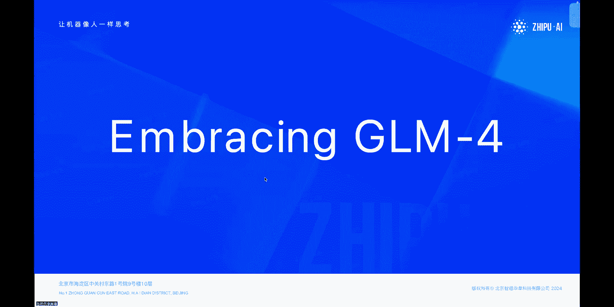

首先是平台的简介，然后是API的啊，能力的介绍和实践，我会有呃大量的时间都是用来做啊，在做代码的啊，演示啊，然后呃是我们两个呃具体的呃，比较具体的解决方案啊，最后是我们的一些这个呃公开的资料。

然后开放平台是什么呢，呃首先我们开放平台是通过呃开放API的事情，是希望提供好用和易用的这个大模型的能力，好用，就是说去提供全球顶尖的，这个各类大模型的能力，包括呃呃语言的多模态的，拟人的训练的。

也未来可能也陆续会推出其他的模型，然后应用呢是而是指能够为开发者提供，高效的这种大模型开发的应用，开发的啊各类知识吧啊可能包括这几方面，第一个是呃应用开发套件的打通。

可能啊在社区里大家最常用的就像是long chain，la index这些，然后我们官方提供一些呃官方SDK啊，cookbook那个呃最佳实践，以及我们呃呃，关，我们会把陆续把我们那些工业级的。

交付给客户的解决方案啊，贾老师这边会呃陆续的我们去整理出来，也呃争取多多给大家做分享，那呃说大一点，我们的愿景呢，就是为开发者去提供这样便宜可靠，安全高效的大模大模型能力啊。

帮大家去轻松的实现一个智能化去创新，然后使命呢就是呃为每一个开发者赋能，我们去呃共同去开启这个智能未来的时代，嗯然后嗯我们质朴这个开放平台是什么呢，首先开放平台的open API是它是我们开源模型。

以私有化以及私有化部署之外的第二种啊，其实是第三种啊，嗯的第三种选择吧啊他能做什么，就包括这几个核心的方面，一个是呃最主要的是我们今天要讲的就是呃，各类模型推理能力的一个呃开放API呃。

然后是最典型的大模型推理的应用就是rap啊，基于retrieval增强的这个呃内容生成啊，作为知识库搭建啊，然后我们也在逐步的开放我们的呃，那微调的能力，我们DAVID也刚开放出微调的API啊。

我们今天的主要目标就会把API的推理调用，这边呃，帮大家做一个入门的介绍啊，然后我们的目标大家看一下，就呃AAPI的成本相比私有化部署也会低很多嘛，希望程序员们能在这里能够最低成本的使用到。

最先进的大模型啊，嗯然后开放平台的一个简单的历史介绍，我们从23年初开始呃，大概经历了这四个版本啊，从最早的6B然后到pro到turbo，然后到现在最终的GM4，4V以及图像的这类大模型呃。

其实它是一个越来越清晰，越来越强大，丰富以及更加稳定的过程，然后前期我们可能API有些宝，版本协议还不太稳定啊，大家也经历了那么一两次先A变更的痛苦，然后第四版本我们经过呃严格的评审。

现在协议是非常稳定的大板，大家啊建议大家如果有用之前版本的可以啊，尽快的切到我们的V4的API上来啊，好那个简单的介绍就到这，然后就是我们模API的实践，这里包括呃不同模型的介绍。

和他的API1些调用的演示呃，首先是语言类大模型，那个gm3turbo相比我们原来的g i m turbo，它是一个全新升级的模型，然后在综合性能上的相比嗯。

gl arm turbo上其实呃是提升在20%以上，推理速度也会更快，上下文，我们从之前的32K，也提升到了128K嗯，但是价格保持不变啊，还是那个五厘钱每千tokens啊。

这个在呃呃在据我所知这个国内的呃，呃模型里面，这应该是我们应该是价格最优惠的哦，啊然后同样是语言类大模型gm4，它整体性能相比呃，gm3全面提升60%以上，是逼近GPT4的啊。

他的啊他跟啊3turbo相比呃，呃两个是不一样定位的模型，这样四会在性能效果上呃会更领先一些啊，然后也是支持128K上下文，同时呢我们在4GRM4里面新增了呃智呃，智能体的相关的能力。

首先把cs prompt支持，然后就是呃autos的各种能力啊，function call web search和retrieval嗯，然后其他外外挂的插件的呃能力，我们也在推进当中呃。

呃有进展我会呃尽快开放出来给大家去使用啊，啊gm4的计费是0。1元每千token啊，这个BGM3turbo会贵一些，但是在同等级别的模型里面，我们在国内应该也是最便宜的啊，然后在这里边再简单介绍一下。

我们呃GG4相比一呃，我们呃嗯那个相比JPG4的一个对比，在英文的基础能力上的评测，其实是达到了GBT495%，95。8的一个水平，呃，这是呃主流的一些开放评测及啊，具体的数据大家可以看一下。

然后在指令跟随上啊，也能达到GPG4大概一个90%的水平，然后在中文的能力上是整体都超越GPT4的，毕竟我们是中文大模型嘛，所以在呃一些大家常用的场景，像文章写作，然后呃综合类问答角色扮演呃。

中文语言相关的都是呃，比较明显的领先于GP4的啊，在中文的逻辑推理和中文推理上，也接近GP4的水平了，另外还是long bench啊，现在全面升级到了128K，这样大家在长文本的总结。

信息抽取等功能上就更方便嗯，然后在狼奔驰在呃大海捞针，就是lank context主流的这个评测，大海捞针测试方法内在128K以内的，我们能做到全力，好然后是一个核心代码的演示啊，包括这几个方面嗯。

首先是gm4的一个应该怎么去调，然后呃怎么设置system prompt，我们直接看代码吧。

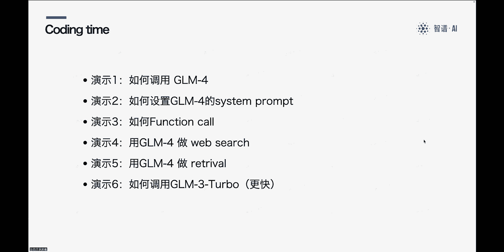

嗯好。

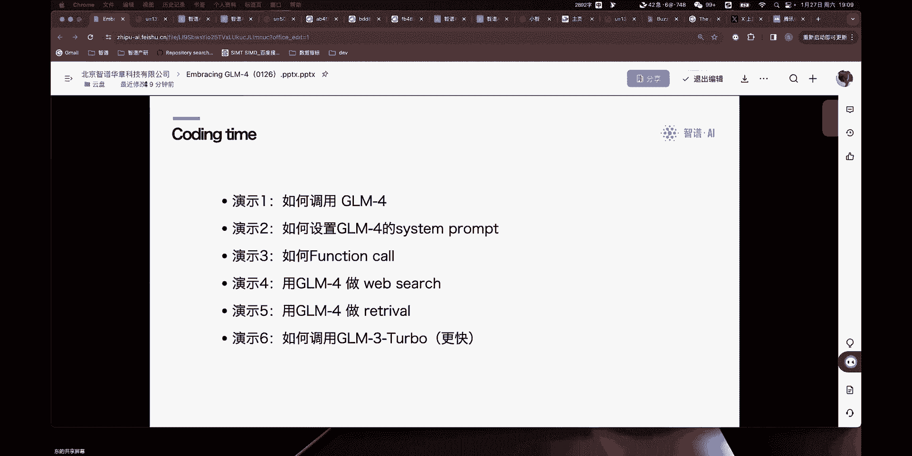

好首先是那个基础的那个使用，我们嗯呃这呃四代模型的相关的API，我们包封装的那个Python和java的SDK，然后其他的SDK看社区的和市场的需求，我们也会啊尽快的去补全啊。

目前主要是pasta Python和java，然后呃我今天主要就以Python为例去演示啊，我们嗯所有模型的调用基本上都是一个API，然后大家在这个API里面去切换不同的模型。

然后呃相关的参数可能需要简单的一个微调，就能用所有所所有模型了啊，然后模型的调用提供同步，异步以及呃SSE流的三种方式啊，我先介绍一下同步啊，首先这个呃SDK的使用。

大家在通过p IP IP store，智谱AI就可以使用这个，而我们的Python SDK了，然后通过自己的那个APIK去初始化一个client，然后就可以使用client的推理接口。

主要就是这个接口啊，APIK这里面要强调一点，就是注意自己的app i k要保密，因为这里边呃他其实呃会被用来我们的那个呃，呃就在通信过程中做对啊，GWT的那个呃加签，所以这个如果泄露的话。

会呃一个是会导致你的数据风险，另一个是会导致你的账户被盗用啊，对然后啊我这个大家可以在自己的管理后台，如果泄露的话，可以删掉，然后去建新的APIK啊，我这个我下来就就就会删掉啊。

然后同步调用呢就是调调用之后同步等待响应，那嗯就这这两个核心的参数model，我们就主要调gm4，我们最先进的这个模型，然后呃主要的message这个参数大概分这几个啊。

row包括system us和assistant，System，system prompt呢就可以通过system problem，给模型设置一些呃背景信息回答的风格之类的。

这种在system prompt的效果会更好，也包括自我认知的，比如说我在告诉他啊，你是你的名字叫做天网，对他，然后他回答过程中，他就会呃用天外网一个身份自居来跟我们对话。

然后user呢这就是我们人的呃回答，然后sim呢就是模型推理的一个结论啊，这是多轮对话，然后我们第三轮对话，我又问他，比如说一些时事相关的问题，你能告诉我2年世界杯冠军是谁吗。

然后呃模型的一些超参推理的超参，像temperature和top这些控制模型的啊，创造能力和随机程度，内容随机成浓度的这种参数啊，这啊这套餐嗯建议大家可以啊，在不了解的情况下，可以就使用默认就可以了。

然后如果确实要使用，我们在我们API文档里面也有详细的介绍，大家可以按照API文档里面的一些个，规范和最佳实践去啊，以结合自己的需求去设置这个参数啊，然后啊我我们就可以跑一下我们当前这个呃case。

同步调用的case，呃可以看得到它呃同步调用返回的结果，22年世界杯冠军是谁谁谁啊，而且而且可以注意，这个gm4的响应速度相比前代呃，还是要快很多的，基本上呃在几百毫秒就完成推理了。

OK然后那个嗯异步的推理相比同步的，它是呃适用于一些呃就输入比较长，以及不需要实时响应的那种那种场景，体验会好一些，那呃异步调用接口之后，它会同同步只返回一个任务id，然后大家可以用这个任务id。

再去在合适的时机去调用那个呃任务状态，任务结果的查询接口，完成这个呃结果的获取，那这里嗯，就是把刚才的completion换成一个ec completion。

然后model和mary message参数不变，然后像其他的那个超参也都不变啊，就不赘述了，然后这边打印出来呢就是对应的那个任务的id，然后我们这里在简单写了一个在40秒以内。

每两秒一次去轮询这个呃那个任务结果的呃，呃呃代码，然后我们可以在这跑一下，首先是把id打出来了，然后异步查询，异步查询获取了结果，OK啊流逝，然后接下来是流式的调用，流式调用啊。

我相信很多开发者也其实也都在用啊，这块我就呃反正就整体的作为基础都讲一下啊，嗯流式就是把呃小米同步，就是把我们一个stream模式设置为true，那这时候就是呃用推流的模式来返回我们的呃，推理的结果啊。

然后从response里面拿他的chunk，当收到的时候就把德尔塔打印出来，哦你看一下这个啊，看它就是一行一行的周到就会打出来啊，就是推理的结果跟康纳是一致的，好吧，哦这是简单的怎么去调节M4，然后嗯。

然后是演示一下，我们呃gm4新推出了关于呃就呃autos这些能力。

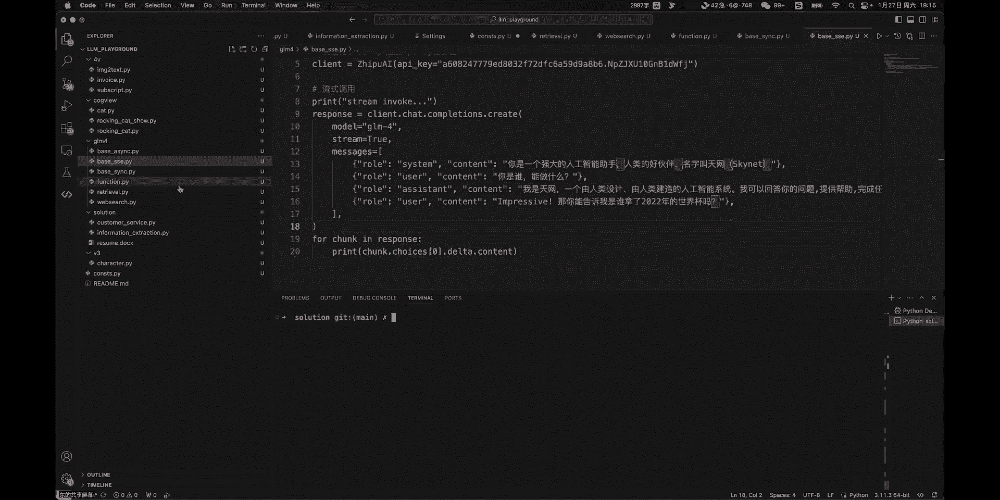

怎么去啊，表用啊，首先是function，先介绍一下function是什么。

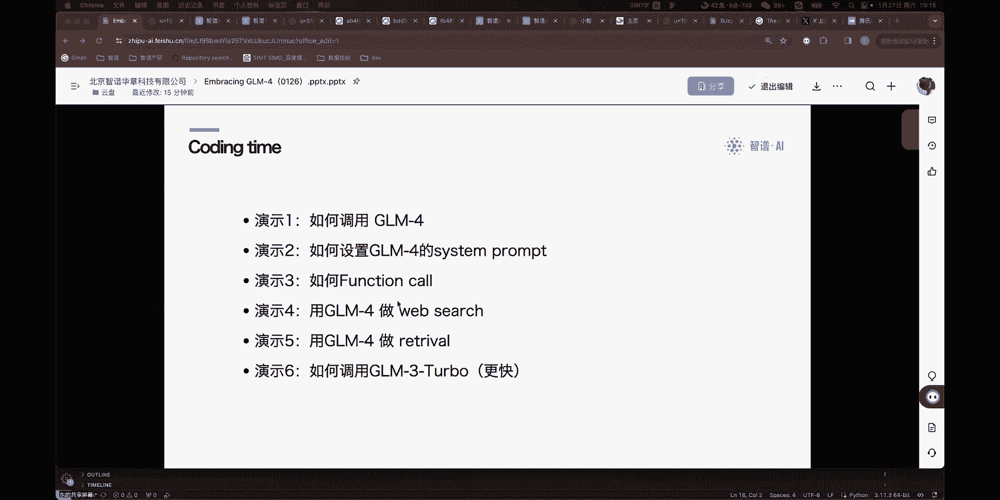

我们要先介绍一下兔子是什么，我们兔子其实就是用模型用来去连接真实世界，只有连接了真实世界，我们模型才能不管是获取信息，还是还是对真实世界产生影响，才能有这样的能力啊。

然后function呢就是呃是通过模型去生成，符合用户所提供规范的，这样的一个函数的调用参数啊，这里要注意就是API，它实际呃我模型模型实际上不会呃，执行这个函数调用。

它仅会返回函数调用所需要的这个呃参数，然后就我们开发者就可以呃，在自己的应用编排中，去利用模型的输出的参数啊，去执行函数调用，然后以及往下推进啊，其下游的那个流程啊，然后我们agent的能力。

也就是支部青年上也已经展示过了嘛，然后API嗯我们也会尽快开放，开放了AA证的能力之后，那嗯嗯等于模型就就会有呃，帮助帮助大家去完成完成这个函数的调用，直接去打通真实世界的这个能力啊，然后下面演示一下。

就是通过function call怎么去生成这个调用请求，首先client，然后呃调用的模型是GIM4啊，这里然后这里就是message，其实是没有区别了，我想问他能不能帮我查询一下北京南站到上海。

在2024年1月1号的火车票啊，然后这里相比之前要多出一个，兔子的一个参数啊，兔子里面安全，它的类型是function function，主要这几个参数，name description啊。

主要是parameters，Parameters，它呃定义你需要的这个函数，调用需要的这些个额数据的，参数的名称以及类型啊，departure它的啊类型是string啊，它它的含义是什么嗯。

然后required呢是说这些参数哪些是必要的啊，To choice auto，那就是由模型去判定呃，当前这段对话，这这个用户的prompt是否需要调用这个呃，function call啊。

如果是强制调用大模型，无论怎么样都会去尝试去给你，给我们去生成那个函数的那个调用参数，然后我们也看一下那个执行的结果，哦然后很快啊，它它返回的结果就是额外返回一个function这个对象。

然后里面就是调用了一个参数，对的是什么啊，这个时间日期也是正确的，departure和destination都是正确的啊，然后另外一个刚才可以调一下这个参数，就是啊比如说我问他一个无关的那个呃。

我问他一个呃呃跟函数调用无关的问题啊，他应该就应该是生成了，应该就没有函数调用诶，诶这还是生成了吗，再跑一遍，呃这个好像还是其实是返回了一个错误的函数，调用啊，这是模型的效果，可能有一些边界的问题。

那个我们也在持续的优化，行那我们我们会持续优化这种BIG的case好吧，然后翻成call就介绍完了，然后是retrieval呃，retrieval啊，其实就是指指定知识库进行呃，呃rag对。

然后呃这里哎呀跟function call类似，也是在上面挂一个设置一个兔子，然后它的类型是retrieval，retrieval的参数呢也是知识库的ID，一个是调用知识库啊，通常会有一个prompt。

像这里我设置一个prompt是我们嗯开放平台，知识库知识库平台，我们有一个后台，有个专门的知识库平台的那个标准的模板，就是从文档查询到这个知识切片里面，去查找输入的这个问题的答案。

然后你可以再输入一些指令，指令形式的这种提示，就告诉他有答案，就用文档的那个语句去回答问题，没有答案你就告诉我，你就用自身知识回答，但是你要告诉我不是来自文档啊，会这些呃，有一些指令集的提示。

防止它去减少一些模型的这个啊幻幻觉啊，然后嗯，然后我们去我我，我这是提前创建好的一个知识库啊，是我们啊COJS代码大模型，在交付过程中的一些呃知识，然后这里面就问他cos有几种POST方法。

OK然后他就查到一个知识切片，告诉我那个呃有两种，一个本地POC，本地POC就是我们去完成部署，然后云端的POC呢就是不需要部署，直接在插件市场上去下载插件啊，去进行评测，这是你看他会告诉我。

这是文档中提提及的POC方法啊，然后我可以再问一些文档中没有的问题，好我们看看这个指令它是否遵循，五，OK然后他无法从文档中找到答案，然后他用自己的那个知识回答了，告诉我们关于感冒应该啊。

怎么样要多喝水之类的啊，这个啊这个指令还是遵循还是还是不错的，嗯嗯然后第三个兔子是我们的web设施，OK然后web search呢呃就是顾名思义，它就是我们提供的呃，在网上进行搜索同啊。

其实跟retrieve类似，只不过它是从我们互联网啊搜索相关的内容，搜到内容之后啊，基于这些内容再去做增强的生成嗯，这里是挂一个类型为web search的to。

然后这个里面把它enable设置为true啊，需要说明一下下的是，我们这里我们目前默认就是true呃，如果大家有些场景我们遇到过一些场景，大家不需要搜索，因为搜索其实会带来额外的延迟，如果不需要搜索。

可以在这里把它关掉啊，我们现在是提供一个免费的那个默认的搜索呃，的实现，然后未来也会也有更多的那个更强大的呃，搜索了，实践放进来，在参数里面开放出来供大家使用啊，啊比如我在这里问他。

关于智慧AI这家公司的一些信息，然后他会去搜索智慧AI相关的内容，然后，搜索有搜索的话，这个流程就时间就会长一些，好像他只是预训练的知识，里面应该是没有这些内容的，他从网上查了之后，再给予这些进行回答。

好这是我们的web search，好兔子也介绍完了嗯，然后还有个演示六。

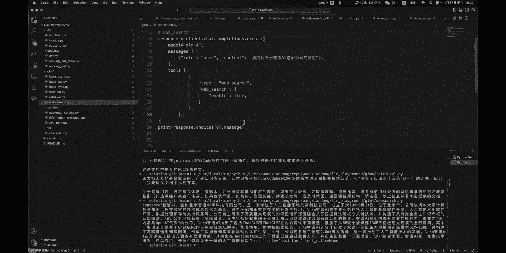

如何调用JL3turbo啊，啊3turbo其实是一个呃更快的模型，刚才也介绍了嘛，四呃在很多能力上会比3turbo要好一些啊，但是他3turbo呢它会更快呃，在使用上其实呃没有没有太大区别啊。

to能力啊，他应该没有to的能力啊，所以我就不单独演示这个gm3turbo的一个调用了，OK然后是我们GLM4V，这是我们图文图文大模型多模态的一个模型，嗯这里是这张图呢。

是我们质朴青年app下的一个呃示例，那就给了一张图，有什么人类最后一篇推文，结合图中的文字去分析这张图，然后呃质朴清言呃就会对这张图进行分析，然后可以看到，其实他把图中的各个关键的元素都查到了啊。

最上面的那个人类最最后一篇推文，中间的那个呃相相框，然后下面三个机器人，然后也基于上面这些进行了一些深度的那个呃，分析和总结啊，然后比这复杂得多的图片，其实也都有很好的一个呃效果。

这个呃大家可以在在质朴青年下载质，质朴清扬和APP，或者在我们的开放平台，质谱开放平台去，都可以对这些模型进行一个快速的测试调用，体验这个效果呃，然后呃，Gm4 v，其实我们从过去一年中也花了很长时间。

来持续的去迭代，从啊最早期开放平台的VIVOGLM，到后来的cock vim，再到现在的最终版本呃，性能更加强大的呃GRM4V啊，啊4V的一个定价是0。1元每千token子嗯，然后图片会有一个额外的呃。

大概是固定的，大概1000tokens的一个呃呃消耗，然后gm4V呢就是实现了视觉模型，视觉与语言特征的这样的深度融合啊，这个呃视觉问答图像字幕和视觉定位，然后复杂目标检测，当然也包括我们传统的一些。

OCR的识别的能力啊，这种各类的图像的理解任务都有不错的效果，然后我去演示一下，怎么调用我们的思维的模型哈，这里啊这里是简单的一个呃。

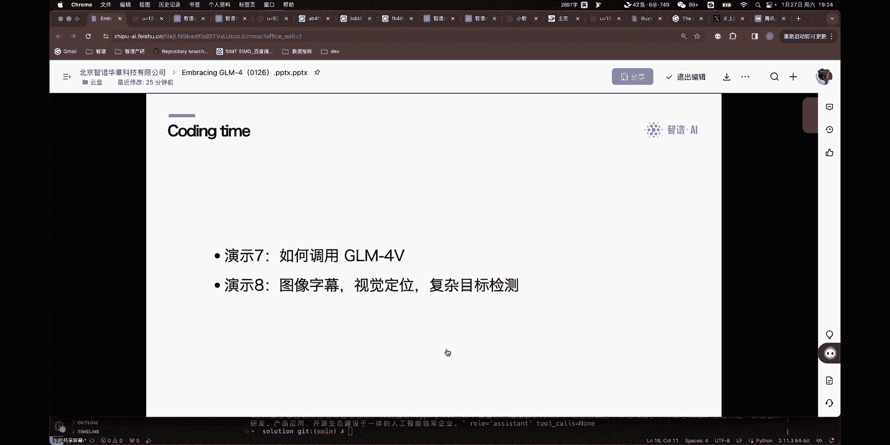

跟刚才那个那个最后一篇推特差不多啊，也是接口跟语言模型都是一样的啊，model设置message，只不过message里面要呃设置一个呃，图像类型的呃参数，然后去跑一下这个，啊然后什么一片蓝色的海。

基本上所有元素都识别到了啊，我们不看那张图片了吧，其实呃识别还是比较准的，然后可以看看我们这个另外两个呃，呃示例，一个是比较常见的那个像字幕的识别啊，我是在我是随便找了这么一张图，就是这张图啊。

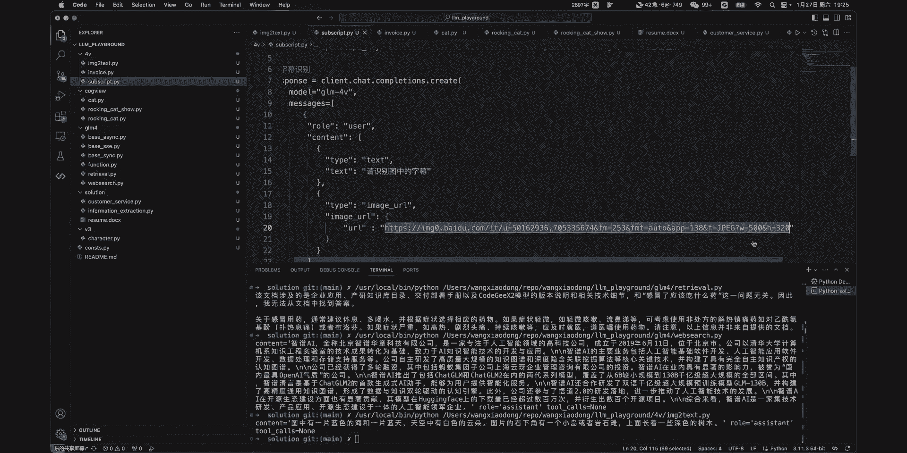

这是肖申克救赎里面典狱长的一句话，然后我们去识别其中的字幕。

参数什么的都没变啊，图中的字幕中文字幕，英文字母都拿到了啊，其实然后呃，如果大家有遇到那种呃不懂得语言的那种字幕，可以用这个去做啊，OCR的识别，甚至可以呃呃再进一步的编排，去做翻译之类的工作啊。

然后这是发票，我们呃给财啊，在报销过程中我们用到的一个呃简单的工具，就是把啊我们所有的发票文件文件集中在一起，然后通过呃呃G2M4去提取出呃，发发票中的一个信息，把他们的金额去提取出来。

然后比如说其中一种需求，就是把所有的发票总金额去拿到，可以看一下这个发票的样式。

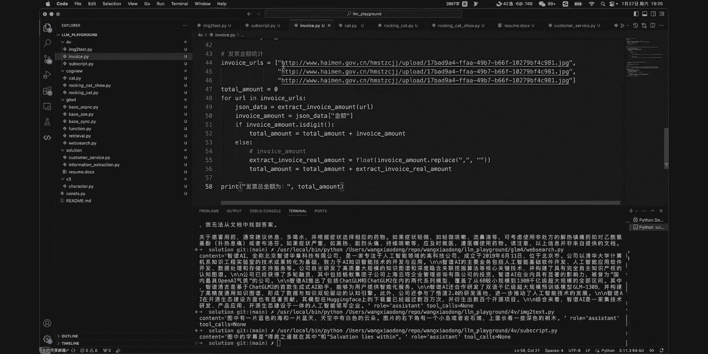

大概是这样一个发票金额是多少。

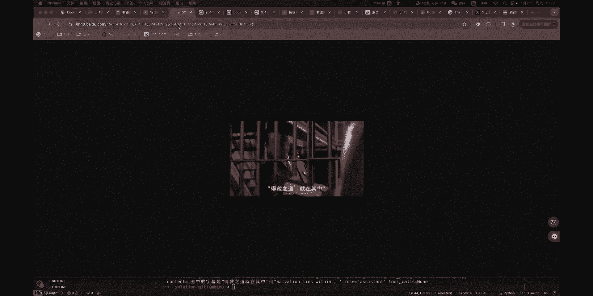

然后看看能不能识别出来，我这是同一个发票，写了三个，我就不多举例了，然后这里再看一下这段代码吧，跟刚才也没啥区别，只不过是prompt呃不同，那我会跟告诉他。

他说去以严格的JSON字符串的形式去进行输出，然后我需要哪些字段，像包括名称金额，开票日期啊，税率这些好，我们跑一下看，然后这其中一张两张嗯，三张啊都是一样的，然后计算出发票的总金额是8276啊。

这个数我check过了是准的啊，当然大家实际开发中过程中，可能要呃去呃呃去呃呃，好好的把这个problem进行调优，以获取自己想要的字段啊，然后OK这是4V的一个能力。

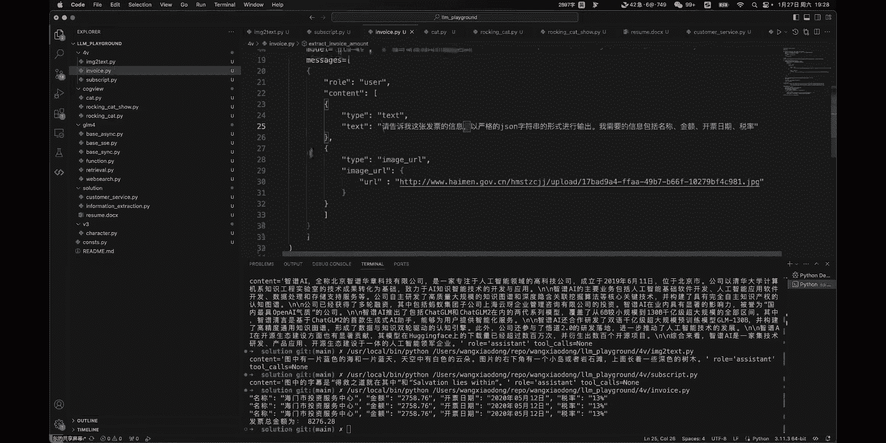

然后是图像大模型。

top view3FB三是我们最新上线的，适用于多种图像生成任务的呃，这个模型可以通通过用户的文字描述，能够把图像啊画出更精准，更快更快速的这种嗯图像，然后在这些评特级上跟呃，跟跟大理三的一个对比。

大概能达到一个91%，到99%的啊，一个水余屏，然后然后那个定价算是在是0。25元每张嗯，然后我可以简单再演示一下图，怎么怎么去做文生图。

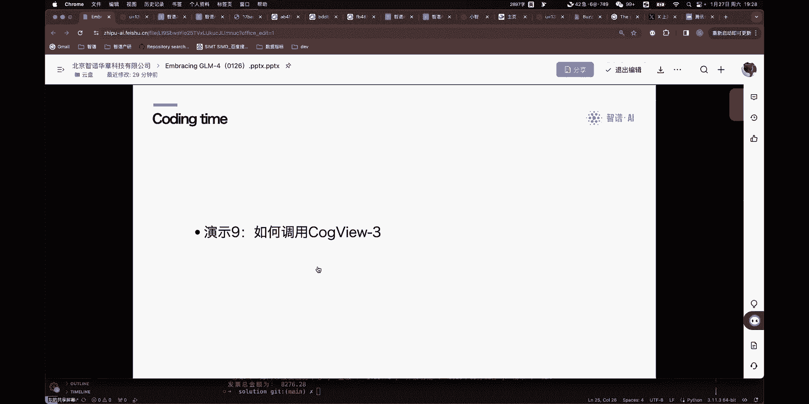

啊我上图一般我们使用过程中是这样的，就是我们啊就是用一些呃用在一些demo的场景，那我现在有一个idea，然后我再持续的去呃优化这个idea啊，比如说我现现在我想想呃设计一张海报。

我想需要一张一张猫小猫的图片啊，这里就model是cover view3，然后problem呢就是一只小猫，然后它，什么情况，嗯嗯开始执行哎。

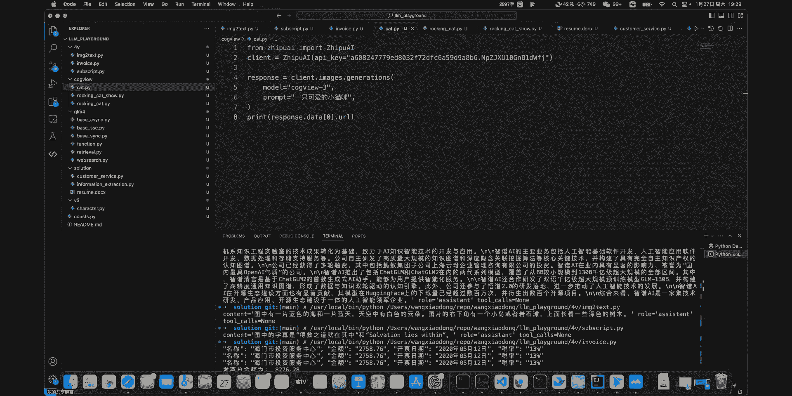

看起来是执行失败了，重试一下，对这个的执行时间大概在十秒到20秒吧，OK这回没问题，我们可以看一下这张图片生成可能是效果啊。

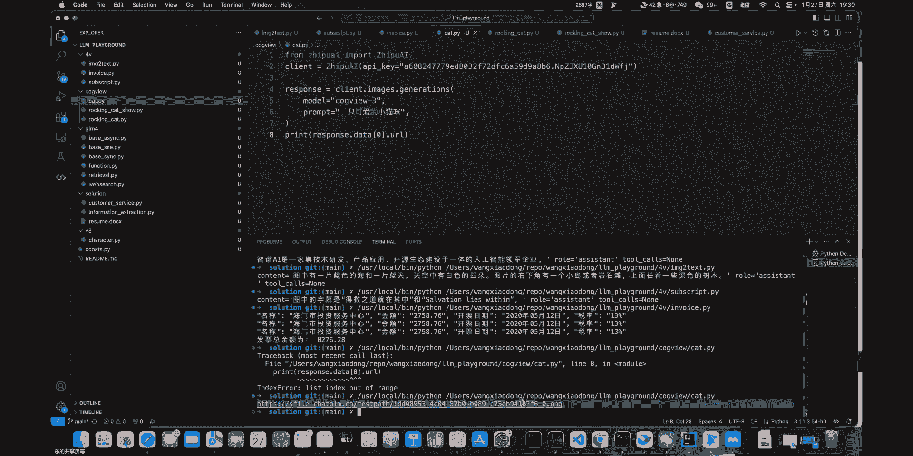

我就要一张小猫，然后它就会随机的加一些背景啊什么的，那些很简单的，其实没有太多主题，但是其实我对这个不太满意，这个海报如果呃呃是单纯一个小猫。

没什么东西嘛啊，我又提示它是一个摇滚的风格，OK你再看一下相应的效果，OK好好像有一点摇滚。

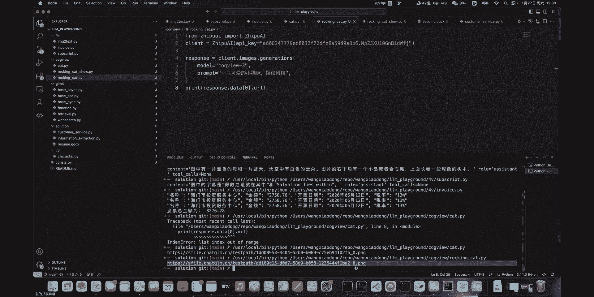

有当然不多啊，所以啊我们再具体去调一下这个prompt啊，就是啊其实是这样的。

就是其实眼摇滚风格这种比较抽象的概念模型，可能不会呃很好的体现出来，那这时候我们就可以呃，去尽量的描述它需求的具体的细节，比如我这里给它加上怀抱电吉他呀，在舞台，在舞台舞台上表演唱歌。

然后啊其实后面这段啊他也未必能理解我，我们看看吧，总之呢就是尽量的具体，关于插空说一下关于prom的那个调优，我们后面有我们平台，我们柴老师做过的专业的problem engineering。

相关的分享，我们也会放出来，大家可以去学习一下啊，对大模型来说啊，proper engineering是我们基本上是我们必备的一项技能，我们看一下这次的效果，OK我觉得这次就好多了。

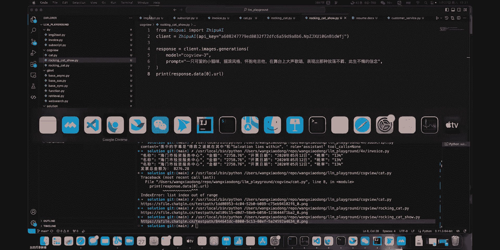

就可以拿来拿来用用了，好，OK然后下一个模型是character gm3，那什么是character gm3呢，就是它其实是我们那个啊，也是我们清华大学的黄明磊老师，他们零零心智能专门推出的呃。

国内也是top级别的这个超拟人模型，我们很多的客户和呃质朴的像那个AIU应用，就是情感陪伴类的这种呃这种应用啊，都在使用这个模型啊，它就是支持这种基于人设的人设的角色扮演啊。

支持超长轮的那个呃是超长的那个地啊，千人千面的这些角色对话啊，比较广泛的用在那些什么情感陪伴啊，游戏智能NPC啊，这些呃角色上啊，这这这这这些场景啊，然后这块的定价是0。015每千token啊。

然后用GEM对话，那个正好给大家介绍一下，我们开放平台的这个体验中心，看看简单演示一下怎么用哦，我刚才就是体验中心也可以啊，随时呃去使用我们各类的模型。

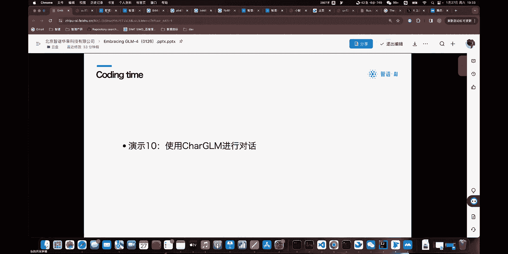

比如说在这里面3turbo4都可以在这体验，然后后面像四啊，4V什么的，我们也也在呃，呃呃抓紧开发会，会让大家在这里面能体验到所有的模型，然后像这个character gm哦，哦需要说明一下啊。

是这个其实是一代啊，然后我们三代的也会马上上上下来之后呃，可能效果应该会有一个更好的提升，然后像character模型，它就会有它的meta data，就包括这些这些像角色名称开场白，然后角色信息啊。

这里那通过这些metadata去给这个角色，在问答过程中的一个呃回答的风格，然后他的一个自我认知等等这些去进行控制，然后API里面还有其他更多的那个这种套餐，可以去用，用来做更精细的一个控制，然后。

嗯然后那个呃对这个就是苏轼的那个嘛，可以可以可以可以随时问问他一些问题，好像我问他有什么传世的作品啊，成为文学大师应该怎么做啊，或者最常啊，或者其他角色的那个我们不在这展示了。

可能最常的就是最常用的就是情感陪伴类的啊，那个知心大姐姐可能有些呃相对内向的小朋友，可以在这里面去获取一些精神上的安慰，然后啊刚才那个是我们体验中心啊。

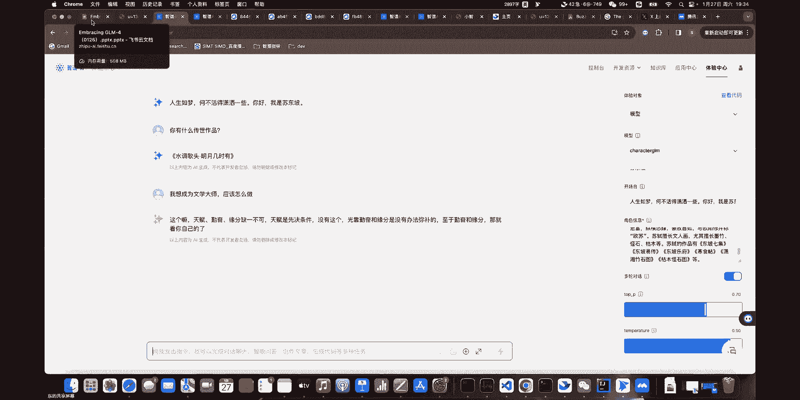

大家可以看一下嗯，然后是两个另外两个简单的使用场啊，使用我们自己的小的使用工具吧，其实都不能不能叫解决方案，我们有很多工业级的解决方案，交付给客户的那个等，接下来我们呃会持续的组织去开放给大家好。

然后第一个我们日常的使用的是一个呃，AI的customer service啊，其实也是我们开发平台自己在用的了，嗯是啊，就是我们在开发者们以及企业，在使用开放平台过程中会有各种各样的问题。

有稳定性的问题，有产品需求之类的，都都会可以，我们都有一个工单的积累，然后我们把这个问答对呢去呃，传到我们的知识库中，然后通过质谱开放平台的那个啊知识库应用，然后设定合适的那个答题问答的模板。

然后创建好之后就可以在这里面去啊，提问客服相关的问题啊，我直接在这儿也是通过看病来给大家演示一下，我们这个怎么去用。

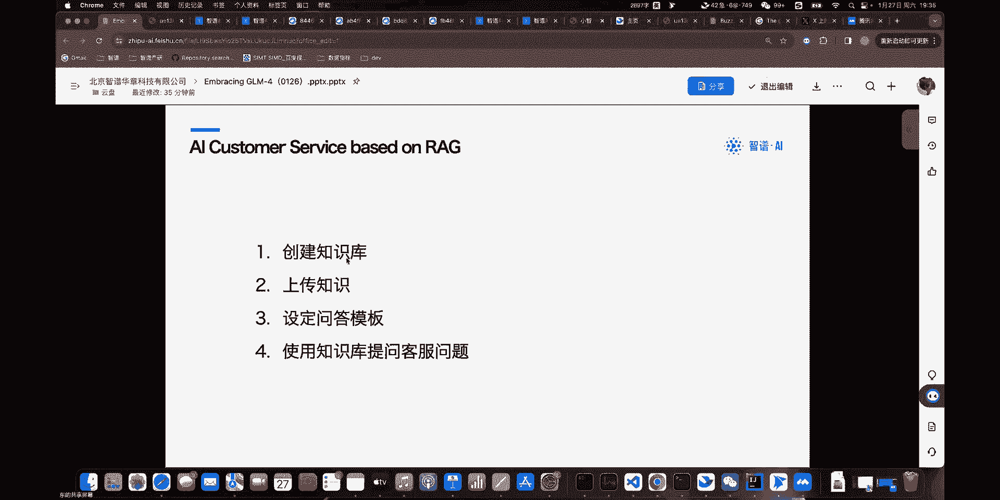

首先是知识库啊，大家在这里可以去建立新建一个知识库啊，然后随便描述一下。

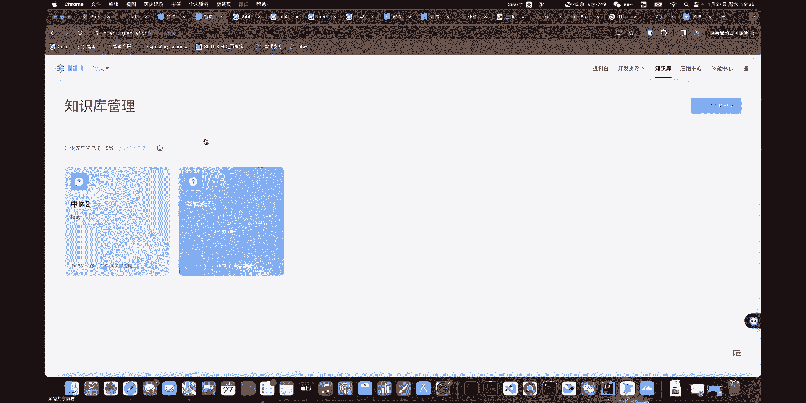

然后使用哪个哪个embedding模型，embedding模型建议大家用B2啊，因为V1我们预期会下线，好建好了之后。

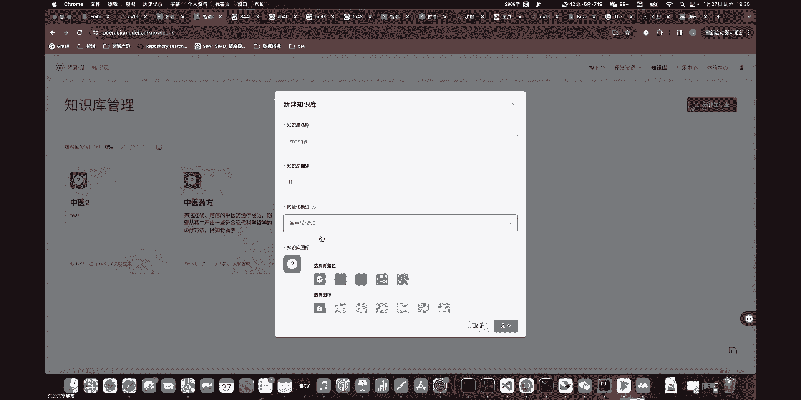

我们再去上传知识知识，就是这里边的灯，data connect呢支持这呃。

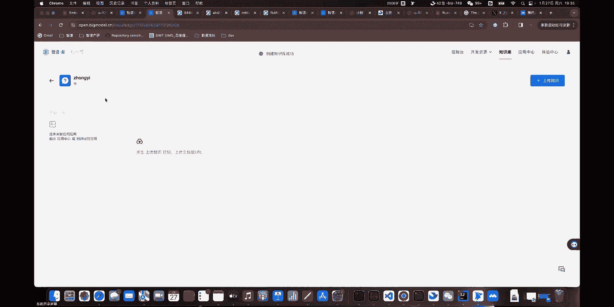

dog差PDFXSL3种文件格式，然后也支持在线的文档哦，我们最常用的像比如说可以把飞书云文档，把网页什么都可以切进来啊，但是呃那种不规范的，像网页什么的呃，有可能切的不会太好，所以建议用飞书云文档。

这这这种啊，我这里呃不新建了吧，不新建了。

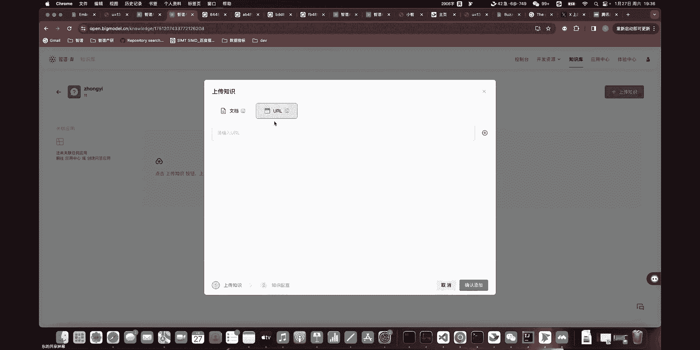

建好了知识库之后，可以在这里面再去呃，创建应用嗯，可以在这里面新建一个应用，问答机器人，对我们这个客服就是有问答机器人啊，接下来描述，然后这里去啊，这里面有一个默认的prompt，然后可能呃大家可以看。

可以在这里面去呃，使用自己的一个problem去呃调优啊，然后引用了哪个知识库，有哪个知识库，然后使用哪个模型，然后由啊这里推荐用GLM4啊，尤其是呃如果涉及一些指定遵循相关能力的。

用gm4的能力就会就会能取得一个很好的效果，然后这边我不创建了，这是我给大家看一下，我们那个实际的，实际上我们在用的那个客服的嗯。

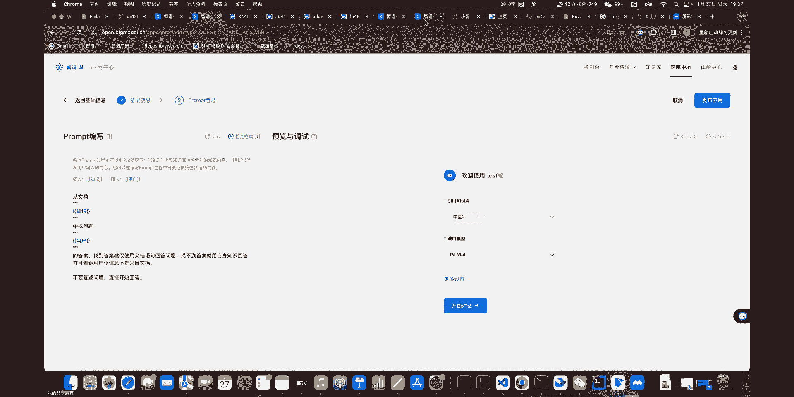

客客服的那个应用哪里啊，在这里嗯。

这里呢就是比如我会我，我当我遇到那个问题的时候，我就可以来问他，我我调用API碰碰到的那个API系统错误怎么办，然后他就会把搜到知识去添加在这里，告诉你不同的那个扣的应该怎么处理，不过这里面也好像啊。

一你看这有参数非法的，不过没有API系统错误了，可以再补一下API系统错误是呃12234的，看看能不能查到，然后比如说模型的并发限制是什么，就支付开发平台，我们不是有通过模型的并发来呃，呃控制呃请求量。

那在这里面啊，这个回答还是很精准的，模模型并发限制式子的同一时刻，系统能够起给某一个用户处理的并发请求，数量的上限啊，然后他还告诉我们这个并发的限制默认是多少，应该怎么去申请去提升。

我可以在这在比如说这边再问一下，那个告诉他那个破码是1234，看能不能抽点，额外再问一个是1234，嗯没有查到这里，其实主要是知识的整理，我们不要把问答对，从信息从呃原始的那个语料中整理出来。

整理的特别好就才可以啊，目前我们还在内部使用，我们也会在调优知识库之后啊，把这个争取开放给我们啊，开发者们去能够帮助大家去排查问题啊，毕竟它比那个人工的响应要快得多，嗯好这是知识库的一个啊演示的呃。

呃就是这这是这是一个智能问答的一个实现啊。

然后像呃呃信息的一个提取啊，以这个简历为例，就是我们自己在招聘过程中，可能一个职位要呃几百个简历啊，然后怎么去提取简历信息，做一些初筛，减少这个呃呃重复的人肉的工作量啊，就是抽取抽取简历信息。

然后做啊JASON的输出，然后去呃再去做候选人的这个分析，他也是我们某家客户呃，在线上的实际交付的场景之一啊，然后我们自己也做了个简单的demo给大家看一下。

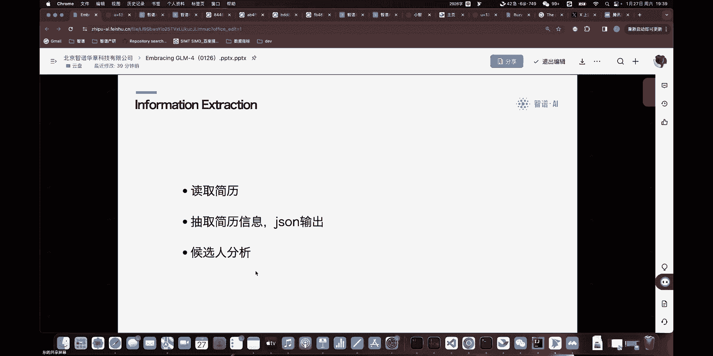

这里这里OK好，首先这里是需要引入那个LUNCHAIN啊，LUNCHAIN就大家做过开发的，可能应该都知道就是上层应用开发组件啊，然后通过浪琴的那个呃document loader。

去把我这个简历这里边这个简历去漏了出来啊，漏得到这个data，然后把这个data呃去传给模型，当然这里面其实是也设置了一个呃普普的模板，这个模板我是这么说的，就是以下内容是直播AI招聘时收到的简历。

我把简历放在这里，然后请继续简历信息，回答问题或执行执行相应的动作啊，然后我这里边呃，就是列举了我们常用的三个问题吧，我们一个一个来看，可以看一下一个问题，第一个问题我说问他上过哪些大学。

嗯大家还要看一下那个文档吗，不用不用看了吧，这个文档其实就是嗯呃这是一个普通的简历，编造出来的一个简历啊，啊就就读了这两所大学啊，就是很常见的那种简历，没什么特殊的嗯，然后这个比较简单啊。

然后我们再看看第二个问题，就是我是想去让他做系统性的分析，这个就先指令怎么评价这个候选人，从他现有的资历啊，技术能力啊，工作态度，发展潜力，然后借我告诉他，我的需求是什么。

我想招聘一个三到5年的工作经验的，有一定的发展潜力的这个员工，你结合候选人的分析和我的招聘需求，判断我是不是应该给他面试的机会，然后我们看一下这个question2，OK然后他会做了一些总结嘛。

从啊这个技术能力上，项目管理的能力上，然后工作态度，发展潜力都进行了呃相应的分析啊，其实分析也都比较准确嗯，然后最后做了一个总结，结合您的招聘需求，他认为是值得面试的啊，而且他说了。

这里面那个工作经验是超过了这个呃需求的，他觉得会高提示你这边工作有年头有点多啊，这应该是十加年以上，然后技术能力和发展潜力都可以啊，所以他建议我去面试啊，这是一个这样的结果，另外第三个问题就是说提出呃。

一个更通通用的一个方式，就是从简历里面去把它，把这个简历的信息结构化提取出来呃，JSON格式的相关的那个内容，比如说什么啊，姓名啊，姓姓名，性别年龄，学历技能之类的，然后把它提取出来。

然后呃在程序中通过呃应用的编排，我们就可以去做更多的一个工作，比如说呃什么统计啊，什么啊分析之类的啊，这里我们就单独跑一下这个呃，这个简历的这个JASON的生成，嗯稍微等一下，嗯可以看一下啊。

这是呃他去提取出来姓名，性别年龄学历，可以对照一下这个字段是不是都有啊，年龄学历，工作年限，工作经历，项目经历，嗯技能优势缺点优势缺点呀，你看这优势他还是对对它进行了总结，跟他简历中没有的诶。

我记得有一段关于总结的字段值太长了，就让他总结之后再输出，OK然后这边还举了个例子啊，解说short还是挺全的啊，这是我们一个客户的一个简单的使用场景。

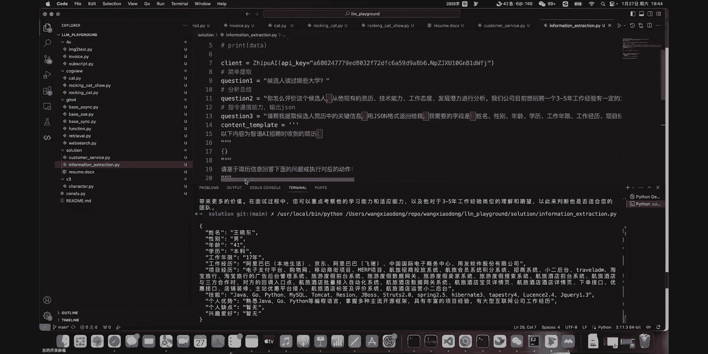

然后就是呃呃给大家总结一下，我们怎么去开启这个呃，人人工智能的这样一个研发之旅呢，做了一些简短的简单的资源汇总，大概需要这些能力，首先就是模型模型，我们呃开放平台的open API。

然后我们也有啊私有化的交付，如果是大企业可以联系我们进行私有化的交互，也可以获得我们呃深度的解决方案的这个支持，然后开源的模型啊，然后嗯开发者工具和呃基础设施上了，最最常用的就是LUNCHAIN了。

然后我们也在构建自己的这样一些个呃应用，构建的能力是不敬，请敬请期待吧，然后呃data connect，就是怎么去把我们刚才，其实刚才那个知识库里面，看到了不同格式的文件，然后以及在线的各种资源。

怎么把这些信息快速的连接，连接到模型上面来啊，这边像la index啊，像ASTRUCTURE的，以及我们的刚才演示的智库知识库，都可以去做连接啊，也包括那个向量库的实现啊，智库的知识库也有了。

也也给了那个embedding22呃，embedding的模型，然后也可以大家也可以用什么M3E去结合呃，盘控啊，啊MONGODB去做一个呃自己的那个知识库实践啊。

然后呃prom engineering这块啊，我们也提供了prompt模板的管理，然后呃质谱我们也提供了那个BBBPO模型，BPO模型开源已经开出来了，然后我们的开放平台API啊，近期也会推出来。

来BPO就是在一些短文本回答上啊，在在在很多场景上，都可以去把用户输入的prompt，去做一个资本作用的优化啊，都能取得很好的效果啊，然后是一个evaluation，就是我上调用这个模型之后。

我跟不同的模型嗯，呃呃去比较，或者说我创建了应用，我应用调不同模型之间，我想做一些横向的比较，或者历史版本新版本之间的那个比较，一决策，你让我决策，辅助我决策，后面是怎么去用啊。

是需要一个呃呃evaluation质朴的评测中心，我们也已经建的7788了，等我们评测觉得啊工程能力效果都过关之后，也会啊在近期开放给大家嗯，嗯然后主要内容就这些啊，最后有一些常用资源的链接啊。

像这里第一个是一个demo github，就是呃使用呃gm4的一些个demo在各种场景啊，就包括今天的，也包括其实跟我们持续会添加更多的呃，其实是是一个什么作用呢，就是一个敲门砖。

抛砖引玉的过程去启发大家呃，在更多的场景上去使用大模型，去呃创造新的价值，去实现智能化，然后SDK的GITHUB就是我们官方的SDK啊，我们是呃因为最近刚刚上网，就是我们自己也发现了一些bug呃。

呃这块也是欢迎各路大神去呃，给我们TTPR去修正相关的呃呃bug吧，然后也包括long chen，我们去支持了最新的GLM4的那个呃调用，可以大家可以在launch里面原声的去调用啊。

gr m4系列的模型啊，这块呃如果有bug，欢迎大家也不光bug也新的想法，新的feature也都可以提升上来啊，然后啊这这右边就是API文档，然后刚才提到的china老师的prompt了。

官方的教程以及官方的一些cookbook，一些最佳最佳实践，都都放在这里了啊，然后怎么联系我们，那个可以加入我们的交流交流群，我们交流群会啊，有同学实时的在群里去跟进大家的问题，我们呃去尽量的呃解答。

嗯啊最后是一个硬广啊，欢迎大家加入我们，我们在呃这些职位上也不管解决方案啊，项目经理，pm o s a算法，后端研发，服装工程师啊，也包括产品经理，客户经理之类的，都都有很好的很很很多的那个人力的需求。

以及呃机会啊。

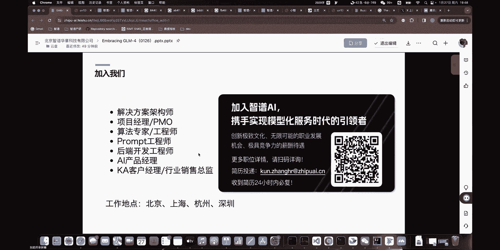