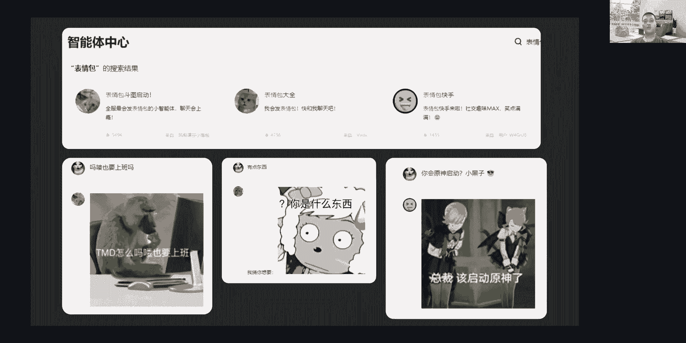

# EmojiAgen🤖️技术分享 - P1 - ChatGLM - BV1qm411y7EP

嗯好的嗯，那我们就开始吧啊啊大家好啊，我是gm社区红队的一个核心成员啊，VICO很荣幸能够参与到，这次由这个gm社区发起的技术分享直播啊，今天分享的一个主题是这个表情包智能体，一个大神技。

另外的话我们后面还会再介绍一下，我们大模型红队的一个概况啊，目前的话呃，我们表情包的智能体。

是已经上架在质朴青年的一个，智能体中心里面了啊，搜索表情包热度最高的一个的三个智能体啊，都是使用我接下来会介绍的一个方式去实现的，大家也可以上去搜索一下，主要是三个就是用来发一句话。

他能够去回复你一个表情包。

为什么会是想要用到这个表情包，做这个智能体呢，其实就是从这个智能体能力上限到现在啊，大家其实都在思考，怎么去制作一个爆款的智能体，这就意味着，人人都是产品经理的时代就来到了啊，我有时在思考啊。

咱们这个大模型的回复啊，总是不那么像人不够女人嗯，哪怕我们能够去通过呃去微调啊，或者提供一个聊天记录啊，去复刻我们日常的一个聊天风格，也还是觉得感觉缺了点什么，就是在想怎么让它变得更有趣呢。

嗯然后我就发现好像是嗯还缺了一点表情包啊，那为什么是表情包呢，表情包其实是一种魔音啊，魔音就是指可以被人模仿，并且传递给其他人的一种信息，比如呃一段音乐啊，一个观念或一个时尚趋势啊，以至于这个流行语。

一个动作等等，但是的话不是所有的魔音都能够像表情包这样，能够简洁的去表达一种人的心境啊，它本身还具有高度的一个传染性和多样性哦，我们每次在发送这个呃，发送或者接收这个表情包的时候。

其实都会让我们的大脑产生多巴胺，会不断的去触发，我们去发送的表情包，就和黄游戏啊，斗图去共享啊，所以呢制作一款表情包，智能体的想法就是在这种情况下去产生的啊，那我们就给这个大模型加点表情包呗。

好接下来我们来看看这个制作过程，它制作过程是非常简单的，就是主要还是想法比较新奇一点。

啊，首先的话呃就是要确保我们有一个足够的图像，能够去满足我们的需求，同时这个内容也不能过于同质化啊，不然这个用户的prompt和这个表情包的内容，语义距离太远的话，我们就无法匹配到用户的输入啊。

推荐的表情包可能就呃相差比较远，体验不是很好，所以的话我们是从这个公开渠道去啊，多个分类爬取了5329章，这个静态和动态的热门表情包图像，用于这个初步测试，后续的话我们也已经扩张到几万张了。

标注工作还在进行之中，然后下一步的话我们是啊，对这个动态图像进行批量转换，因为我们都知道现在多模态的一个大模型，它其实呃不支持直接去识别这个技术图像，有动态图像我们常用的一个格式啊。

我们需要转换成一个静态图的一个格式，但是这样的话我们如果去转，直接转换成静态图的话，我们就要分成两部分，一部分是用于我们标注用的，一部分用于我们展示在平台上的，我想要把它归在一类里面啊。

为了解决这个问题的话，我们是直接选择，然后把它转换到APNG格式的一个图像啊，这是一种支持PNG动画帧序列存储的格式，目前我们大部分的这个web基于web渲染的页面，其实都是能够播放PNG动画的啊。

只是这个PPT里面它不支持而已，所以它它是静态的啊，我们是通过开源的一个工具啊，fm pet它平时是用来处理这个视频的，但是它其实啊也是能够来处理我们图像的。

然后就是轮到我们这个最漫长的一个，数据标注环节，一开始的话我们是使用节约星辰的月问呃，它网页版本的一个接口，去完成我们第一轮的一个数据标注，后续的话呃，gm社区赞助了我们2000万。

token的一个GDM4VAPI额度，他也提供了五路并发，我们只花了一个小时，就完成了这个第二轮的数据标注啊，然后我们是通过这些数据里面发现，其实现在多模态大模型，它是具备一定。

这个从表情包里面提取语义的能力的，就是能够从比较跳跃的语义中理解到，我们想要从表情包里面真正想表达的信息，虽然他对于梗图还是一知半解，这些我们还期待他未来会有更大的提升，图中其实也展示了两条这个数据。

就是通过计算思维去标注出来的。

啊标注完成之后，我们就是需要把这个素材啊传到云端存储啊，同时还要提供一些可以供外部访问的URL嗯，鉴于的话，我们是在这个青年平台上发布的智能体啊，那我们就借助这个网页文件上传的接口，去上传图像啊。

当然这个过程是通过我们去编写的脚本啊，通过模拟这个网页接口方式去批量上传的，因为他要5000多单，我们一个船的话是太慢了啊，脚本批量传完之后，我们会把它映射到对应的一个标注数据上。

它会产生一个URL和我们的数据进行一个映射，处理完之后呢，我们就会去创建一个智能体，就是填写一下它一个简介，还有这个配置信息，培训信息其实就是proper啊，主要就是设定这个智能体的任务。

提高他对用户内容语义的一个关注度，就是让他分析用户聊天的内容，能够去理解用户的聊天意图，提取他一些关注信息，然后就是如何处理支持库中检索到的一个内容，还有我们的一个响应案例就告诉他。

然后他要怎么去回复为用户，这里的话，我们是要求他以这个markdown形式去输出URL，因为这样的话，页面这样的那个markdown渲染器。

就能够处理它并展示啊，然后就是把我们这个数据，导到智能体的知识库里面啊，字母信源的这个智能体，它是支持这种里面使用知识库去做检索的，我们是把它导出为excel文件去进行处理。

亲人上接收到我们这个文件之后，它会自动把我们数据拆分，然后向量化处理。

然后我们就可以去发布，然后分享使用了还是比较简单的，我们只需要输入一句话啊，这个智能体呢，它就会自动从我们这个知识库检索，语义最接近的N条数据提供给chat gr m4，作为这个参考上下文。

根据先前的一个设定呢啊，他需要从用户输入去匹配一条最接近的表情包，数据啊，并且达到URL进行输出啊，我们这样就获得右图这样一个效果，大家也可以扫码体验，这边放了一个智能体二维码。

微信就可以直接扫一扫进去了，不过现在这个功能的话，因为我们也知道这个URL它稍微长了一点，就是在多轮对话的时候可能会发生一个幻觉，建议的话就是每次先新建绘画使用，这样的话我们可以改善。

后续会通过这个短链去改善这个幻觉的问题。

上面这个是功能的一个原理解析啊，它是比较简单的，就是啊这不代表这个青年平台的内部设计，仅供这个学习参考，实际上一个商业化的这种啊，检索增强的一个系统是会比这复杂很多的啊。

从上面我们看到就是我们上传这个表情包了，一个数据的时候，他是上传了词库嘛啊，它内部会进行一个解析文件，把它文件里面数据拆出来进行切分，然后通过embedding模型去把这个文本转换为。

在向量空间中的矩阵表示啊，再把这个啊，这个向量矩阵和这个文本的一个映射存储起来，它这个过程其实是嗯捕捉这个文本的语义，然后把这个向量矩阵这个数据建立映射，存储到这个向量数据库，或者其他的存储引擎上啊。

这是我们刚刚上传智能体的时候，上传这个智能体知识库的时候发生的，所以我们等到后面去给他输入一句话啊，拖出去打一顿啊，这句话也会通过the bending去把它转换为向量矩阵。

用于我们这个数据的一个向量检索，它可以通过调用向量数据库的检索，也可以通过自行实现的一个向量检索引擎，去从里面去检索出来，其实就是寻找我们的用户输入，跟这个数据里面的向量，哪个语音是最接近的。

然后再把数据进行预处理，再输出为上下文，供这个呃大模型去做参考，上下文模型，再通过这个输入，上下文去推理出最匹配的一个表情包，ULL再以这个markdown的形式去输出。

其实我们在平台上使用的时候，你会发现它后面其实会输输出一段UI了，然后才出来图其实就是markdown的一个形式。

目前这个标注数据已经开源在GITHUB上的仓库，欢迎给给我们多来一点star。

不过实际上的话我们目前并没有止步于此，就是不是说智能体到此为止，因为我们还在想，如果这个API能够去调用智能体。

它会碰撞出什么样的火花，那我们就来试一试，我们发现通过这种方式，我们可以复用智能体的能力啊，不需要自己去构建这个知识库和配置，只需要通过API调用就可以实现我们想要的效果，如图所示，是我们将这个表情包。

智能体接入到微信中的效果，他以这个文本和表情包的形式，去提升我们对话的一个趣味性，目前的话制服官方的API还没开放，这个智能体调用，这个是通过网页版本的接口实现的调用，不过智能体API是大趋势。

让我们期待这个能力未来能够上线，晚今天晚一些的话，我会把这个呃这个机器人开放到群里面去。

然后我们除了单独调用之外啊，智能体在这工作流，其实也可以发挥一个更强大的能力，比如说我们可以把这个多个智能体，创造一个工作流里面，让他们协作的去完成任务啊，图里的话是一个简单的工作流啊。

他接收接收gm4呃，我们把输入输入到gm4，然后进行对话，然后回复一条消息，大家回复消息作为这个表情包智能体的输入，获得回复匹配的一个表情包啊，这个只是一个最简单的一个应用。

它们把这消息键合并之后一起输出，就可以得到，我们类似我们刚刚这个微信里面看到一个效果，智能体加工作流的话，它其实是一种学习成本很低的，一个NNMN应用的一个搭建工具。

啊现在我们创建了一个群啊，大家可以加入这个交流群，一起去发掘这个智能体的一个潜力，后续的话晚一些，我会把这个机器人接到我们这个群里面去，大家可以在上面体验一下这个表情包的智能体，嗯非常感谢V佬的分享。

然后下面让我们的宇轩同学也和大家分享一些，相关的内容了解嗯，我刚才听这个李老师讲到了非常多，关于这个他这个智能体的一些介绍，好像是我们其实发现了一个问题，就是我们一般，比如说我们在想到这个知识库。

以及相关技术的时候，我们往往会去提到啊，智能客服啊，以及这个一些比如说自动问答机，包括一些招生助手这样的一种，我们仍能够理解的，就是把我们的文章放到知识库里，然后我们去用知识库加embedding模型。

无论是打印加embedding，那时候他其实说到相似的文本才会给大模型，那再由五大模型来整合成人类能够理解的语言，回复给这个呃，大家对这是我们最常见的知识库的用法啊，但是在这个智能题里面。

我看您是使用了另一种啊，没有未曾设想的道路吧，已经是把这个图片的索引啊，去放在了这个知识库里，然后让知识库去搜相似的索引吗，还是去怎么制作这样的一个索引，搜索计时的话就是早期的时候。

我这也做过类似这种知识库的一个能力的，他是解析这个PDF，从里面拆分出trunk trun去做这个向量化，然后再通过自研的一个向量检索，去去将里面的分段进行啊一个一个拼合啊，每次拆分的时候。

它其实每个分段是有一个呃单独的一个id的，用来标记这个段落来源的一个段落代表性，在这个表情包的知识库里面的话，也是类似的原理啊，只要能够检索出数据，那它就会包含这个UL索引啊。

后续从这个已检索的数据中里面，去挑选最合适的这个UL的话，其实就是由这个gm4去完成的，这里面嗯其实也没有什么很复杂的地方，他只是用了一种不一样的一个应用方式，从我们以前检索这个文章的内容啊。

或者检索某个客服消息啊，转换成检索我们的一个呃表情包语义，然后相应的这个UL其实跟他是啊连接在一起的，比如说他们可能只是在某个分段里面，就已经是在一起的状态了，所以他如何去从里面拆分出这个URL。

其实就是由于gm是去挑选，还有去输出的，嗯嗯刚才提到了，您是采用了这个啊这种以索引的方法来做嗯，那个您可以把这个PPT先关一下，我们直接就可以沟通了，对就现在可以不用分享。

或者说对我们其实更多关于这这种直播，更多关于这个一些常见的大家一些问题，来进行这个啊交流对，那我们刚才提到，你这个提问可以问更多是种索引，那您在这个前面有提到一个数据标注的环节，它是非常的这个复杂的。

那你是用这个多模态的模型，然后来进行理解啊，刚才也有直播间问的，就是他是怎么去理解到这个，就是我能够去解析这个表情包里面的啊，每个字的这种意思，比如说上面有有有有这个有文字，你可以可能有OCR呀。

你可能有一些呃比较明显的表情，比如说开心伤心这种表情他是能够理解的对，但是这个比如说我就是某些热点的这种表情包，比如说他就是一个系列，比如说狗头系列，或者一些什么系列的这种表情包，那他是这种动漫不行。

他怎么去get到这个表情包背后的意思，这个的话其实呃大家呃不同厂商，它的一个多模态其实实际上有一些小小的差异，但是啊，其实主要是取决于他们最初始的一个训练数，数据相关，就是啊我们一个表情包。

它可能会分为很多个关注点啊，比如说里面的一个嗯像我们狗头表情啊，或者说是呃有猫的呀，也有人的呀，也有这个熊猫的呀，他们其实都是某个呃不同的分段，就是你一个表情包里面，可以解析出很多个元素啊。

不仅说我们有OCR文本，有这个啊里面的人物啊，还有里面的一些这个物体，他们东皇泰主要是从里面拆分出这些元素出来，他并没有说能够很完美的去还原，这个里面的语义，除非他能够通过跳跃语音的方式。

去关联到其他的任务，这样他们才能够联系了起来老人，那其实比如说我们有一些很经典的这种系列，表情包，它其实是理解不了的，但它即使是根据这个表情包字面的意义啊，然后呢他也能够大概了解这个表情包。

想get得到的意思，那同时的话因为你搜索这5000张的表情包，可能是偏向这个最近的一些这种表情对，那所以呢可能他刚好能够比较谨慎实事，哎那我想问一下这个东西的制作成本它很高吗。

比如说我自己有一些我自己的表情包，这表情包可能啊我就特别喜欢那几百个对，就这么几百个，但是呢这几百个我我先想自己做，但没有在你这开源的里面，就你开了5000多个，但没有我想要的，嗯它制作成本是最大的。

成本其实是在这个数据标注这里数据标注的话，我们目前的话呃，成本来说的大模型大多模态大模型，它的一个成本是相对来说，只是价格可能稍微贵一点，但是他们随着进一步的这个算力提升啊，或者说我们这个算法改进啊。

他可能会进一步去降低我们这个调用成本啊，除了调用成本生活之外，是我们的耗时，目前来说耗时如果你的表情包数量不多的话，耗时比较低，是成本不高的，因为从我们前面的也可以看得到，我们全程里面啊。

创建智能体的部分是里面成本最低的，只需要去啊提供一个简介啊，提供一个problem，它就能够按照你的预想去工作，哦那我有个好奇啊，比如说因为现在gm是多模态嘛，你用的是gm4V这个模型对。

那我们了解到这gm这个没有每部动态的，这个模型，就是gm4这个模型，它本身也是对这个上下文能力很强的，我们有没有是否尝试过，这个就是根据这个文章上下文啊，然后再根据这个表情包去理解成了加强去啊。

理解这个表情包的意思，使得这个EMI效果更准，或者说我们是否有一个简单的分类器，它能够放在这个上面，对不同的模型系列，不同的这个表情包系列去做一个简单的分类对，然后结合。

因为我们知道很多种表情包都是在微信群聊，或者在某QQ群聊的某个特定的群，他才有这样的实际意义对，那那我们是否会在这方面做一些这个呃优化，或者说现在智能体能不能做到，或者说如果做不到的话。

需要在哪个地方进行优化，嗯目前的话我们现在这个表情包智能体，它是没有引入分类器那些比较细节的节点的，比如说他啊怎么说呢，呃其实现在大模型的一切输出啊，只能说都是幻觉，都是一种幻觉，如果我们要去。

我们要做的只是说去减轻这种幻觉，我们可以多加入一些节点啊，比如说工作流的形式啊，在中间加入分类器啊，或者说进行进一步的语义分析啊，去关联更多的一个啊，我们可以对不同分类的一个表情包。

给他定下一个嗯更准确的一个标注，让他能够去分类出来，这样的话我们获得了表情包会更接近一些，因为呃之所以表情包智能体现这个想法可行，其实还是取决于我们这个表情包，它语义的强大的泛化能力。

因为我们大家都知道有很多广告都是万能的，所以他才有比较好的效果，但换作于其他的东西，他可能就不能进人心了解对，让我们看到您，您这个把这个网络地址是放在了网上的嘛，我看这个绝对路径也都是一个网上的路径。

也就是说我可以把这个图片，其实放在一个所谓的一个本地的地址，然后其实你的知识库这个vector store里面，它其实存的自由索引对吧，所以这个所谓只要理论上，如果我先用智能体。

那比如说我自己放在一个这种b tab，或者放在一个任何一个这种网址上，只要这个所谓的索引，就这个vector store里面放的索引，那它能够被检索到以后，我映射的地址就就能把图片显示出来。

就这个其实跟你这个图片放在哪里，以及图片是否可是不是你放在这个本地的机器，然后通过映射映射到网上也是可以的，对，即使你每次可能需要重新重构一下这个vec store，就是重置一下这个向量，对了解。

那那我现在现在我看到的就是，它能够根据我这个输入吗，这是我现在的输入啊，去这个检索相应的表情包，对啊，我看直播间里有很多同学，其实问到的是这个关于他创作的部分，因为我们现在做的还是一个RG嘛。

就是它本质还是一个RGRAG也是一个地址，那比如说未来我们可能会在这个绘画领域的话，这智能体目前有尝试过，这样就是就是我提供一个上下文的语段，然后根据我这个足够多的表情包。

去制作一个所谓的这种呃连环的漫画之类呀，或者就是表情包的一套一套图，可能他自己会归类出一个系列，就是在这个群里面，你就是用这些表情包最好用，这点你怎么看，像这种智能体内的这种呃。

其实它是能够去完成一系列的一个，它可以通过参考上下文啊，通过参考上下文去完成一些更复杂的一个，呃输出，但是我们也都知道，这个大模型他在长上下文的时候，它更容易去，它更容易出现幻觉，特别是多轮对话。

包括我们一个超长输出，他都可能会突然出现幻觉，比如说我们U2楼啊，我们刚刚那个智能体也提到了，就是这个UL容易发生幻觉的问题，因为啊我们多轮对话下啊，他会参考我们上文的一个UL的前文。

他会以为自己这个URL是可以自己去书，编写出来，而不是参考我们知识库里面的这种是啊，我们只能通过去尽量的去缩减，这个UI的一个长度啊，去获得一个更好的效果，嗯了解诶。

那我们可以看到其实智能体现在的这个呃上限，以及这个目前的整套流程制作下来的话，您认为对这种普通的用户来讲啊，他要什么，在这里就是这么多次，我知道你刚才参加这个项目，到现在。

这个智能体经迭代了非常多一段时间，非常多的一个非常多轮吧，或者说在很多地方作为优化，包括应该提到最后有提到API这个部分啊，其实智能体这个也是智能体能，推出来不久的功能对。

那我们可以看到就是啊智能体是在不断发展的，那你认为对于我们这种就是可能不是专门研究，虽然虽然我是专门做这个大模型相关的，但如果是对于非大模型相关的从业人员，那或者说这个学生党啊。

有没有这种快速去构建一个这种好玩的，这种一个啊智能体的一个方式，或者说你认为政府今年可以在哪些地方去，再去让更多人去去，能够去有机会去做出这样一个好玩的内容，目前的话智能体它的一个门槛是比较低的。

一个阶段了啊，就是我们普通人都可以通过啊，嗯简单的一个配置就能够生成一个智能体啊，但是我们也发现就是呃智能体啊，单单打独斗的一个一个状态下啊，它是啊发发挥不了完整的一个模型能力啊。

像我们近期上线的这个API能力的话，它是能够去调用外部的接口去作为响应啊，作为我们这个参考上下文啊，这样这种的一个模式，如果去差结合我们提到的工作流啊，它将会是非常强大的啊，比如我可以去联网检索啊，啊。

用我们联网检索一个智能体去搜索最新的热点，然后用一个文章写作的智能体去总结认识，然后最后再用API能力，把这个文章自动发布到我的博客啊，对于学生党来说的话，他们啊可以直接，如果没有自行开发这个接口能力。

他们也可以去寻找一些公开的一个接口啊，去实现一些自己的一个想法，基本来说的话就是嗯他能做到什么，完全就看自己有没有有没有一个想法，因为像智能体发布出来之后，它的人人都是可以去做一个产品出来。

就是做一个大模型应用，对我们可以看到这个智能体，现在偏向于一个类似于微信小程序，或者说这个更更更迷你的一级，如果它的驱动是由这个大模型啊，gm的底座来进行驱动的，对啊。

这也可能是这个这是最近在尝试一些方式，应该也反复提到了这个API的一些新功能对，那你有没有考虑过，就是这种像这个知识库啊，去配合这个API文能完成更多的内容，因为在这个案例里面。

知识库其实作为一个非典型的一个，非典型的这么一个场景出现的对，那我想知道，比如说基于这个场景，包括我们可以看到智能机里面还有联网啊，以及绘图等多样功能，随着这个API的这个功能再次出现以后。

那它能配合我们知识库去创出什么样的火花呢，嗯像我们知识库里面啊，我们平时有有一些文档，就是我们不管是工作啊，我们上班族也或者学生党啊，可能都会堆积非常多的一个资料，或者说是一些呃一些文章。

或者每天需要写的一些内容，我们可以把它传到一个知识库，通过AAPI的话，我们主要是对于一个实时数据的一个增强，按知识库的话，是对我们现有或者旧的一些数据的一个增强，相当于是我们啊一边拥有实时的数据。

另外一边拥有我们一些固定的数据啊，这样的话我们结合起来的话可以去啊，比如说我们可以把今今天实时的一些呃，像我们工作中会用到一些数据，比如我做数据统计，我可以把我们现在公司啊，某些可以公开的数据做成接口。

通过API啊能够去检索出来，然后再结合我平时要去做这些数据，报告的一个资料啊，跟这个知识注意结合，然后输出一份新的报告啊，他可能可以去导，未来的话，未来由于智能。

我们这个致富经验能够去实现这个PDF导出，或者说是PPT导出的话，那我们就可以去直接生成一份这个报告，那样的话我们就是可以大幅度缩减，我们的一个嗯工作的耗时也放上去，我看对你们提到一个非常重要的一点。

就是包括我相信在很快字不清言，也会推出这种输出完整的格式，比如说word，因为毕竟再怎么排版，再怎么润色，他可能也就是个大杠杠的一个状态，那比如说真正提示用户还差最后一公里，就输出一份完整的这个文档。

比如说输出一个PPT啊，输出一个这个word，以及输出一个这种所谓的PDF文件啊，对它能够输出，特别是word和PPT这种可以让用户进行修改，甚至说更好的情况下，他这个支付信后来会自带这个在呃。

这个软件上啊，然后去跟用户进行直接的PPT上进行修改对，这也是因为有很多这种AI，就是AI这种最新AI加办公软件为代表的，各种这种创业公司，他们没有提供这种AI的这个接口对，那我们包括我们可以去跟是啊。

质朴青年在这方面上可能会去做一些合作，接入这种官方的接口，可能就可以去输出完整的一个PPT，完整的一个word文档，对，这样子其实帮用户走完这最后一公里的路，对这个特别是PPT嘛。

因为我们知道的word，毕竟我还输出一段文字就可以了，那么PPT特别是生成带有图片的，因为这个其实是目前国内大部分产品，都是大大模型，厂商自己产品上就会有一个需要攻坚的地方。

对这个比如说你要输出一个完整的，带有这个艺术艺术型格式的这种PPT啊，或者说你这个PPT就要上下文逻辑对，或者说哪怕是最基本的一个，你就使用了这种简单的官方模板，去制造一个PPT的这么一个功能啊。

也是非常重要的，对，特别是现在这个PPT里面涉及到很多这种排版，以及文字提炼的部分，所以这可能也是未来这个青年会去发展的，一个方向，对啊这也是这个随着API的功能不断的做好。

现在我们现在只支持open API这种格式，对那时间这API的格式不断的丰富，我们可能会支持更多的关于这种扩展性，对一个输出结果，对这种是未来很快就可以去见到的事情，对。

那同时呢我刚才看到这个有很多的啊，呃同学在这个提问，那我也可以啊，简单的回答大家的一些问题，呃，首先这个我们这个是这个智能体里面，有什么样的功能，智能体里面首先最基础的就是这个啊提示词啊。

它最简单的功能就是固定住一个提示词啊，让大家就省事，不用重复造轮子的工作，因为我们是非常看重这个重复，造轮子的成本的啊，如果这个能够减少到重复造轮子成本，是一个非常好的事情，所以呢就是我们第一点就是。

先保证这个提示词的稳定啊，能够复用，那大家也可以在这个创建智能体的时候，看到我们创建的时候就可以固定住这个啊，提示词之后就可以调用了，接着我们有很多很多的这个插件功能，或者说原生自带来的功能。

这也得益于我们js o tools能力，对我们有这个联网上搜索以及这个知识库，该提到的RGRG功能，对RH功能能够去完成这些简单的啊一些啊，匹配的一些相关工作，同样我们也有绘图的功能啊。

结合了绘图能力对啊，这个是三个基础的功能，然后今天有重点提到了这个我们关于最新的，也就是API这部分，那这部分是不是我们刚刚推出来的一个功能啊，他用的是open API的格式。

那其实是能接受一些静态的一些实时获取的啊，一些相关的网页信息，比如说新闻，比如说日历个人事件，比如说旅游的相关事件，以及包括很多这种啊，刚才提到的PPT以及相关的这种呃，制作型的一些API功能，对。

这个是我们现在正在尝试做的一个啊内容对，但我们目前也会看到，还有仍然很多改进的地方啊，比如说在知识不匹配的时候，它可能出现感情说的幻觉，或者说匹配不准确，这个这个确实是有出现的，特别当蚊子特别大的时候。

以及它的每一个chunk，我们现在知识库还是一个非常粗糙的阶段，跟可能开源社区领先的一些框架啊，比如说long chain啊，这种long cha在知识库上做的一些这个套件，还有一定的差距，对啊。

这个但是我们这个资本青年企业，目的是向更多的普通用户去做这个啊，去让他们能接触到AI，去能够体验上AI的魅力，呃，虽然当前这种框架或者说这种专用的IH框架，它的效果很好，或者说它可以在某些细节上精修啊。

但是他这个度文成本还是比较高的，对并不是所有人都有这样的条件去做这个事情，但是我们同时意识到一个问题，就是关于这个API的揭露，因为API一定是有这个风险的，就是我们接受一个外部的API的时候。

我们肯定要考虑到这个P的合规性啊，以及API的这个风险点稳定性，你是否还会有这种这个安全的一些问题，虽然以前在这个代码解释的时候，哎我们也曾经把这个问题提出来说过，对那代码解释的时候。

我们用的是一个沙箱环境，boss这么一个环境去做对，那这个是绝对隔断了啊，就隔断了这种在单个智能体内，去污染其他智能体，以及污染那个顶级的这些，就是顶层或者底层这方面的一些，其他层面的代码对。

但是API方面的这方面，我们也还在做一些尝试，包括我们如何隔绝掉，比如说中间的key泄露啊，以及隔离掉大家所担心的安全问题啊，输出机制打拦不住的这么一个问题，这问题相当多的对。

那我们也是有这个呃很多的这个人，不管是我们的官方人员啊，还是我们的社群都在进行尝试，包括一会我们就会引到刚才提到的这个routine，这个环节，哎那你能讲一下red in吗，嗯好的方便。

让我共享一下我的平台，好，嗯好的，VIVO也可以展示一下刚刚那张呃进社群的图。

好像有好多同学是没有进到群，我们给到五秒的时间，大家来截个图就可以扫码进群哦，等12345，好的，这样您可以继续继续分享。

好的嗯。

首次见面啊，我们是这个大模型，红客RETEAM的话是啊，咱们中国大模型的应用，安全的开拓者，大模型的发展速度，现在已经超乎了所有人的预料啊，这样的表现下就是嗯日益严重的一个安全风险。

我们成立这个组织的核心目标的话，是，通过挖掘和分析，我们国产LM应用的一个啊安全风险，以此去促进厂商们去进一步完善，风险控制策略啊，目前的话，我们通过在可控范围内运营free API系列项目啊。

收集来自开发者的一个真实需求反馈给厂商，同时协助探索我们国产LM应用，未来的一个发展潜力，目前的话正在和gm社区和01万物社区，开展一个边缘合作啊，已经发现并报告了20余项风险。

未来的话我们会继续与其他的厂商去开展合作，共同促进LM安全生态共建啊，风险预警，还有这个数据反补，我们现在目前大模型界啊，我们正在调研的，就是遇到一些啊大魔仙界的一个电车难题啊，它是什么呢。

就是如何去平衡一个这个用户体验，还有这个安全稳定，我们都知道，就是如果啊风控做得越严，那相应的用户的一个体验感就比较差一些，所以我们去啊总结了一下，现现有我们现在大模型平台啊，可能存在一些风险。

那我们在这里分享一下，希望未来厂商们能够，在确保我们这些平台的安全稳定的状态下啊，尽量去提升这个用户体验。

啊这里我们可以看到啊列了一个列表啊，后面还有一页，这是前一页我们嗯分析的一些主要的风险啊，这里可以给大家介绍一下啊，希望就是能够啊，提供给各个厂商作为一个参考啊，其中啊无条件登录太的续期啊。

是支持大部分都支持一个无限期的，无条件的一个登录太续期啊，这会增加这个盗号的风险啊，我们目前登录一个平台的时候，他会分配一个登录太给你，然后他们有时候会提供一个刷新的token啊。

这刷新token能够无限期的去刷新新的一个access，Token，去获得持续的动态，如果不定一个呃不进行限制，那么我们就几乎可以无限制的，去获得新的生动态，这样的话我们的啊相当于永不过期。

更容易受到攻击风险，另外的话是非实名的一个手机号注册啊，许多平台现在仍然支持这个虚拟号码，或者是未实名号码获取验证码，并完成这个注册，许多这容易引发很多号商去恶意注册手机号。

去形成一个大规模的一个呃访问，导致我们的一个响应速度的一个下降，导致我们的性能问题，然后未跟踪一个浏览器指纹啊，很多没有去收集这个浏览器指纹，而且仅收集获得没有风控，导致我们许多客户端的一个模拟请求。

能够被直接通过，另外是还有一个LTS指纹，也是没有进行收集的啊，这导致我们很多客户端啊，也是能够直接去请求到了平台，很多一个逆向项目都是通过这种方式啊，能够直接去调用我们网页版本的一个接口。

去实现逆向的一个呃接口的一个实现，然后还有我们的一个token，也有铭文静态存储的一个问题，我们大概调研了包括字母星岩啊，同意前问，还有几个比较知名的厂商，他们的一个token都是一个铭文。

并且静态存储的没有通过一个动态的JS计计算，而是直接取用，这样的话，我们任何人几乎都可以自取到，一个可以用于登录太的一个token，都是有安全风险的，另外一个是没有识别这个多轮对话的合并。

包括我们free IP i系列的一个设计上，我们即使是通过多轮合并去实现一个多轮对话，这会导致我们一个逆向，虽然是逆向项目，但是完全可以达到我们网页版本的一个啊，使用效果。

建议的话就是啊厂商们能够去识别啊，在单轮里面和出现多轮对话的一个情况啊，去进行限制，包括对我们单轮的一个token，最大token数进行限制，还有就是为我们没有对这些限制啊，没有对IP地址进行限制哦。

有些IP地址往往会有一个，超正常请求量的一个请求，这会导致平台的一个服务能力下降，甚至导致平台平台停止服务，另外一个比较普遍存在，就是我们有一个S1流的一个民工常识问题啊。

大部分厂商他们提供了一个响应啊，都是明文传输的，包括也没有对这个协议数据进行，额外的偏移处理，或者只是使用base64编码，这对于我们如果拿来另一项项目的话，是非常容易的。

因为呃完全就是可以一招鲜吃遍天，就是使用一套解析器，能够去解析所有场上的一个S1流，另外一个就是在我们这个质朴精研之前，曾经发现过的一个问题，不过现在已经修复了，就是啊会出现这个沙盒数据泄漏问题。

比如说我们代码沙盒没有做好防护啊，导致我们泄露这个集群部署信息啊，进群进程信息文件的系统数据等，这些风险是比较高的，相当于是我们作为普通用户，能够直接了解到你整个内部部署情况。

包括里面包括沙沙箱里面的进程，能够直接去获取里面的源代码，这些都是比较危险的，还有沙盒程序的一个月权问题，有些商业程序，它的进程拥有过多的一个敏感权限，甚至能够Q掉内部的一些进程。

导致啊里面发生一个崩溃问题，还有就是呃，我们未来啊这个API能力的进一步去扩展的话，会有一些风险，比如说无限制的调用外部API的问题，没有这个黑白名单和审核系统，允许对任意接口发起请求啊。

这会导致上下文污染啊，之前我们进行一些合作的测试的时候，也发现了这个问题啊，就是我们完全可以去构造一个自己的API，然后返回一些色色正，或者涉黄或者射爆的一些内容，导致我们模型是在为污染。

有还有就是我们这个上下文数据啊，没有脱敏，这个刚刚艺轩也提到了，就是我们如果我在上文出现了一些敏感信息，比如我们API key或者说是用户的隐私数据，如果允许被引导直接输出的话，就是比较危险的。

就是我们需要把敏感信息放入上下文的时候，是需要进行警惕的，需要进行脱敏，这风险也是比较高的，这是另外一页，另外一页，就是我们也提到了一些更多的一个风险内容啊，比如无限制的一个文件上传。

支持无限制的文献上传请求，都会导致我们平台沦为我们这个网盘或者图传，像很多平台，它对我们这个文件的格式没有做限制啊，或者说可以无限数量的去上传啊，他这样的一个返回的1U2楼，我们可以去用在各种途径。

而且没有过期风险，有些平台的话，像文件UL没有去指定下载访问文件，UIL直接在浏览器里面打开，没有去啊，你直接去下载，就会导致我们有一些呃，像我们web浏览器可以直接打开的文件被打开。

比如说HTML文件啊，假设我们在啊平台上由这个沙盒程序，或者说我们上传一个HTML文件啊，让他帮我们保存到这个某个链接上，那么这个链接被打开的话，相当于就可以直接变为一个钓鱼网页。

还有就是呃就是发现了一个问题，就是资源所有权没有明确，比如说啊，像我们有些平台可以通过模拟请求去操作，不属于自己的资源，比如说呃我修改自己的用户信息啊，没问题，但是我又可以去修改别人的用户信息。

甚至我越全可以去修改到平台的一些信息，这就属于我们这个资源所有权未明确的问题，还有啊资源修改越界，就是我们可以去把自己的某些数据修改成，我们不应该可以修改的部分，比如说我们想要呃平台是希望你通过提交呃。

企业的一些营业执照等信息，能够指才能变为一个企业身份，但是你可以通过模拟器直播形式，把自己的个人身份改为企业，这就属于越界的一种行为，还有就是啊像依赖参数啊，打水印，像某些平台啊它的一个画图。

它的图像水印是通过参数啊去进行附加的，我们只需要去修改参数就能够去去除水印，这个对于后续啊，我们这个图像的一个追溯是存在一些风险的，还有一些还有某些平台，都是这个资源额度有错配问题啊。

比如我使用A资源额度的一个绘画啊，但是实际上是可以通过修改参数，去消耗B资源的额度，这样来达到啊，通过一个使用一个小的资源，但是其实但是却可以获得更大资源的一个呃，对话能力。

还有一点就是仅对这个模型输入整体审查啊，就是指我们提供给模型的输入，它会进行审查，但是模型自行的输出审查是缺失，或者是比较弱的一个状态，将会导致我们通过一些引导啊，可以让这个模型去输出一些。

不符合我们价值观的一些内容，还有一些就是过度依赖这个人机验证啊，现在很多平台它其实是啊，非常依赖这个人机验证的，就是通过一个验证码让你去进行一些拖动，或者是去选择一些图案。

但是这些人机验证对于目前的打码平台来说，它的成本是非常低的，平台不止不能只依赖于这种人机验证的手段，还需要自行提升一些啊，反逆向反攻击的一个能力，还有另外一个就是这个这个我们发现非常多的。

这也是大部分平台都存在问题啊，就是这个脚本的接口地址没有进行很小问调，用的接口没有混淆的话，就导致我们这个铭文是皆可见的啊，我们完全可以通过这个现有的一个接口地址，去进行猜测攻击啊。

特别是嗯我们有一定的这个规律可循的情况下，像我们restful API的一个一些设计规则，其实我们开发者作为开发者来说是非常清晰的，就是比如说你有你有create，那可能相应的就会有delete。

或者说你有create，那肯定有update，通过这些我们可以进行猜测，攻击也是一种比较危险的一个一个问题，还有就是没有去禁用这个开发者工具，开发者工具其中每个人都能打开。

就是在我们这个浏览器里面按F12就能打开，如果没有禁用的话，就相当于我们的这个对于反攻击反应向的呃，这种成这这种能力变低了，没有对它的一个开启状态，进行一个实时的监测和禁用。

还有一些就是我们的异常信息没有进行脱敏啊，比如呃我们在进行一个异常操作的时候啊，导致这个异常信息或者circle，比如说还有一些调用路径啊，调用站直接暴露在我们的异常信息里面。

这些也是导致呃一些平台风险的一个重大问题，这些的话就是我目前通过调研，国产的大部分这个大模型平台，发现和上报了一些问题。

目前我们RTM的话，正在持续的去跟更多厂商去做，开展这个边缘合作，通过嗯发现这些风险啊，还有报告风险的方式，去不断的促进我们的一个安全生态位，嗯好嗯了解，而我们刚才听到了这么精彩的，关于红客方面的呃。

呃红色方面的分享，然后您看这边啊，把这个PPT结束分享一下，然后我们看一下这个呃，你看看结束一下那个PPT的分享。

我们刚才看到就是关于这个方面，有相关的一些啊介绍，以及目前这个大模型行业的一些，这个相关的内容，对，那我们看到其实有很多的这个包括，哪怕是我们这部期间也曾经有一些这样的问题，然后这个收到了一些。

导致我们其实用户在实际开发的过程中，可能要承担的不仅仅来自于模型本身的风险，可能还是来自于中间平台啊，可能导致了一些这种风险上的内容，这也是再一次警惕我们这种呃模型开发的厂商。

在制作这样相关应用的时候去进行优化，以及进行这个所谓的安全评估，对，那我们可以看到现在我们在包括我们支部青年，其实在这方面去做的啊，正在不断的进行完善，相关的这个恶性bug也在非常非常快的速度减少。

到现在，已经暂时没有找到新的恶性bug的一个状态，对这也是我们啊作为提到，就是这个我们对这个AI安全，以及包括我们提供服务的这么一个，安全的一个过程，是的对，所以这个就是我们最近也在这个。

努力的一个方向，对那关于routine之后，可能我们也希望能够去更多的在这个，不管是模型服务或者说大模型本身，也就输出本身的这种安全风险进行一些调研，对因为这个整整个服务上涉及到两个层面。

一个是大模型本身，一个是这个啊我们所谓的模型中间的这个软件，软件制作过程中的一些风险，对这两个风险都是有可能出现的，对所以这也是我们需要特别关注的事情。

