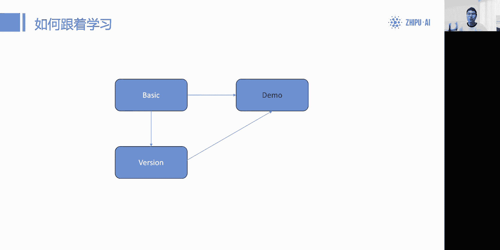
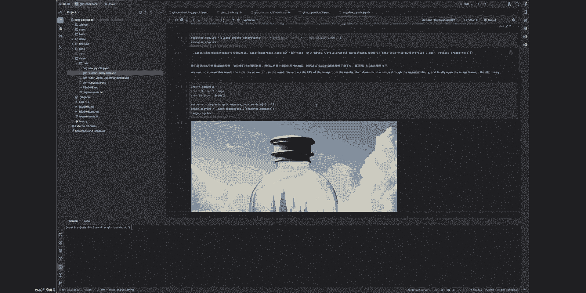

# GLM 使用指南：入门 GLM API（一） - P1 - ChatGLM - BV1zU411o7fh

那我们就开始讲今天的这个直播环节嗯，先自我介绍一下，我来自呃，我是来自北爱的呃，这个技术团队的成员，然后也是这本gm客部的作者，然后很高兴今天能够跟大家一起来分享啊，关于这本呃菜谱的使用方式。

对那本今天的这个作为第一期直播的第一期，那我们先从最基础的这个介绍，以及如何去学习的一个学习路线进行介绍，在今天的直播主要讲的是，作为一个刚刚入门大模型的开发者或者学生啊，我要怎么去学习。

或者说怎么去快速的上手啊，大模型的API调用的这些问题，对所以这是本今天直播的这个全部的一个内容，对，那关于这本客户里面的很多的一些，具体的demo和实战，我们将会在第二场和第三场直播里面去。

提到和讲解啊，这是这三场直播的分别这个内容的介绍，那我们今天就开始讲第一场的这个呃介绍环节。

好因为我是看不到这个大家的评论了，所以之后我可能会统一的放在QA的环节来呃，进行跟大家进行沟通，对大家有什么问题也可以在QA的环节问我，然后今天声音比较沙哑，所以显得会慢一点。

那首先我们先呃先讲个经验大纲吧，今天的话就是从一个开始的节点，就是我为什么用到这个COBOOK，以及我们我们作为官方人员去设计这COBOOK的，这个设计理念，和我们希望大家怎么去用好呃。

用会以及快速的学会这样的一个大模型，AAPI调用的基础内容啊，我们的理念以及大家如何的学习路径，那最后一个谎言就是提出问题和需求的部分，也是我们最后会开一个单独的时间，跟大家进行互动去讲。

会去解决记录大家的问题啊，然后我们会进行改进的这么一个部分好，首先我们讲第一部分，就是为什么我们需要这么一个破格，首先啊，我相信有很多人真正开始接触这个大模型，都是因为HIGBT对。

那真正接触到这个大模型的开发，也是因为最早是OpenAI，他有了这么一个API的功能对，然后呢特别是到这个open i1。0以后啊，这个BIOON更新到1。0以后，它的API的这个功能基本就定型对。

然后在上面基础上不断的增加内容，那么由当时的话，由于这个受国内大模型没有发展的，这么这么的丰富对，所以然后大家的这个API，也是五花八门的一个状态，那么大家在学习的时候，一开始有学习过的同学。

可能一开始是跟着OpenAI的API进行学习的，但还有一大把没有学习的同学，他可能在选择模型的时候，比如说我今天选择A公司的模型，我就要用A公司的API，B公司的模型，我就用B公司的API。

有这么一个步骤，那么我可能会遇到一些这种API互相不兼容，互相不适配的问题啊，这是我这是我们这开发者真正遇到的情况，好这是第一个问题啊，那这个问题其实是呃很多的这个开源社区。

以及这个一些应用里面都会遇到的，我们看到非常非常多的相关issue，在我们这个以往的CHARGM3也好啊，或者在以往这个一些其他的开源项里面，看到这样的需求啊，希望有一个这个。

我能够按照OpenAI的这个方式去学，那我就能把这个方式学会，然后同时能应用到我们的这种，国内的这些模型上来这么一个工作，这就是适配工作上，能不能有一个统一的学习的过程。

那么还有相当一部分人其实是呃他并不知道，或者说他完全没有用过这样的东西，那么所以他就需要一个从零开始去学，至少他也没有学过OPPD爱，他也没有去见过这些内容，他就想从零开始去学，那他没办法呃。

用国内的模型从头开始学习啊，这肯定也是可以的，对那我们也在这本设计这本菜谱的时候，考虑到了这一点，同时还有相当一部分人其实已经完成了，这个API部分的基础学习，就是我会掉了。

我能够去流畅的去做一些基础的工作啊，但是我现在不清楚我有这个KPI以后，我能干什么，这也是很多开发者创业者会想到的一个问题，就是我能干什么，或者说我有没有最小的一个MVP，能够去把这个最小的一个看上去。

可以的产品做出来，对这个产品当然就是技术上的一个内容，对，那这也是我们这本科不去提到的一个额，一个点好，这是我们看到的几个需求，那么我们跟这个首先我们第一点我们的open呃，我们这个COBOOT里面。

跟有几个比较特殊的地方啊，如果大家有看过open the eo book的人，应该知道这个open eq book确实更新非常的快，对然后也将他的很多最新的论文的一些内容，以及它的一些最新的功能啊。

集成在这本科book里面啊，特别是他最新放了很多的这个关于论文的解读，论文的一些呃代码实操，这些是比较进阶的部分，对那这个部分的话，我们暂时还没有去做，但是我们重点去做的这个部分，是把这个使用门槛降低。

也就这面提到的第二点我先讲了，第二点，因为我觉得哦，在在与其探究这种最高精尖的这个学术之前，我们要性能去使用，或者说我们去能够玩玩明白整个基础的流程，我们才有办法去探索更高的部分。

那同时的话我们很多行业界，产业界的这种能源开发人员，那他其实是希望能够快速的复用的，能够落地的这个工作，而不是在这个这么做一个最新的论文复现，所以在我们能力有限的情况下，我们选择先做入门级。

以及先做这种更适合大家常见的，能够想到的这么一些最小可执行的方案，然后我们将它进行直接，我们将这个代码直接写出来，那么大家的话可以在看完这个代码以后，就可以直接复用或者进行二开。

那这样就大大降低了这个技术门槛，而开发了提升了这开发效率嘛，对那还有很多人提到，就这个是质谱啊，字符的话有两套的这个API系统，一个是API部分，一个API平台，这部分接出来的系统是啊gm4gm4V啊。

以及character gm这三个模型，它的模型接口对，那这是一方面，那随着最近的这个质朴清源，它推出了这个质朴清岩的接口，对，那这两个接口又有一定的区别，哎不分别部署在两个平台。

有各有各自的这个有各自的这个技术文档和，API的规范文档，它是不一样的，对，那么这本科普它就只在能把这两个部分，那合并在一本教程里面，那关于不同的这个开发人群，我就可以选择适合自己的部分。

那比如说我就是想做这种对接智能体，最近比较火的智不清源，对接智能体这么一件事情，那我就可以去用这个库布里面最简单的，这个智能体的接口的一个实现啊，转转成OpenAI的形式，然后再布到自己的微信。

或者布到自己的社交媒体上面啊，这就是个最简单的可执行方案，那如果我现在不是想玩智能体，我不想玩这个智慧型眼，我就可以去换到这个API这边，我想用直接用元素模型进行开发，那我就选择这个API的版本。

那我就可以在上面学怎么去调API，怎么去做并发，怎么去体验到我们这个呃非时使或者说异步，也就是现在大家质朴，主打这个价格超低的这么一个，非即时反馈的这么一种新功能啊，都可以在我们的科普里面去用到好。

这也是我们在设计这个COBOO的时候，考虑到的一个问题，呃，我们去解决这么一个痛点，那么最后一点提到的就是，这个关于跟这个开发群，开发者群体进行沟通的一个平台和渠道。

等到我们这种cop是放在GITHUB上面的，也非常符合主流的开发者啊，去进行这个交互，获取代码以及对代码进行修改啊，甚至贡献自己的代码都是非常容易的，然后整套这个交流产品都是开源的。

对那么关于开发者更有意见，也可以直接在GITHUB上用固定的模板提出这个issue，他是会比直接在提供单区是快很多的对，因为这个在GITHUB上提的话，会直接到开发人员这边好。

这就是这个库布的我们想解决的问题，以及我们设计初衷的这么一个，我们的设计初衷吧，好那我们就提一下这个框架结构，那这也是我们GIU呃，这我们这个COBOOK这个项目在GITHUB首页的那张图，好看。

我们的各部分分成了五个部分，那么首先就是我们先把青年的部分单独拿出来，也就是gm s这部分对，因为青岩部分，在我们这本科普里面讲的会少一点，它主要讲的是两个部分，一个是关于提示词构建。

也就是大家怎么去构造智能体，我们其实有几个现成的这个呃智能体的配置啊，不是很多，但是我们之后会陆续往里面加，然后同时包括我们每周这个比较火爆的这个，智能体的一个排名也都在上面。

有一个表格叫GMSS点MD进行更新啊，然后接着就是关于这个智能体API的一部分，那智能体又分为AAPI，向外接入和A去接入第三方API两件事情，对那这里面我们都做出了最基础的一个教程。

以及大家能够去掉的一个方案，这肯定有人会肯定会有提到，包括我自己就及时跟着这个方案啊，在这个钓自补心炎的时候，也会存在一定的这种，比如说适配问题，或者说无法，无法在无法迁移到自己的这个API上啊。

这个问题我们也在尝试进行解决，对我们是第一时间去跟进到这个青年，最新的一些功能好，那么除掉青年这一部分，剩下的所有部分都是关于我们开放平台的部分，这是我们提到的这个big model这个网站。

那大概在上面接到，就是我们这个对标OpenAI的这一套呃，API的方法，以及我们做的一些基础的，以及应用性的一些代码代码仓库，对我们看到上面的basic，也是今天我会讲到大家的学习路线。

一开始如果你没有相关的基础，肯定从这边开始学，对他会去讲到我们怎么计费的，我们的怎么去调用它，以及我们能给哪一些开源仓库啊进行对接，那同时我们也有vision这个环节，Mission它本身也是基础。

那么他提到的其实是gm4V，以coo u3，分别是图像理解模型和画图模型这两种模型，那么正面的相关教程，我们都会放在这个文件夹上进行讲解，那在完成这两个部分的学习之后，我们就会到一个应用的环节。

那应用的环节就是demo环节，这边都是推理啊，这边都是推理的部分，那我们就会去讲，我们如何用我们的API，去做一些最简单的可执行代码，以及我们如何去换我们的gm宣传的A卷能力。

我们的function call这种能力，以及我们参考我们的这个分析能力，我们的数学能力去做一些这种模型特长的事情，我要怎么写好提示词，以及如何去调，什么时候去调，用什么框架去调这样的一个呃API。

来完成这个任务，那我们看到这里有一个fine tune的环节啊，这里也是跟我们这个mars平台相关，那我们之后的话也会有这样的这个API，开放的微调平台，我们现在已经是有部分内测用户上线了。

就可以在我们这个翻译上呃，这个开放平台上去微调我们的这个啊模型，然后用我们微调的模型直接可以调用，这跟open脸是完全一样的，整个调用方法完全一致，整理数据也好，微调也好，以及后面的调用也好。

是完全一致的，那么还有很多用户没有拿到，大家也不要着急，是呃过一段时间以后，这功能会陆续的放开，大家就可以去微调这个模型，那同时可以就把这个模型托管在云端上，然后直接调用，我们也会有相关的要求。

这也是我们库布里面目前的几个最基础的部分，就是关于这部分的一个探索，那我们这个部分是滚动更新的，现在的这个结构长，这样之后可能会学到一些新的内容，新的出现，那新的一些方法或者新的一些结构。

我们会去往这个demo里面加一些新的内容啊，这个都是会的，那么同时我们要区分到我们这个good BO，是跟我们智谱AI的开源模型是分开的，就QQ里面不会提到我们的这个开源的模型。

以及不会去讲开源模型和相关周边，这边提到的主要是关于API，以及这个质朴清研的这种应用侧的，相关周边的一些教程，对那关于开源模型以及开源模型相关的教程，可以访问我们THUDM这个仓库下面啊。

所有的开源模型那边有很多的这个，关于那些开源模型的一些配套措施，在哪个地方好，这就到我们介绍完这个库布的框架结构，那我们提供了什么样的例子呢，我们刚才也我刚才也简单提到了。

那么这边我再讲一下具体的几个例子吧，啊首先就是这边有两个二维码，分别对应着我们API的注册平台，和这个政府新人的注册平台，如果你没有用过，你可以在那边扫一下去注册一下，因为在后面的教程部分。

特别是API这边，你是需要去调用这个APIKE的，要用API key的话，你就是需要注册并且实名认证，然后我才会有一定的赠送token，今天直播间好像他会呃，这个自主组团队会放一个那个token包。

好像是有这么一个东西，然后也可以去用那个token包去获得比较呃，有性价比的一个一些的token，够你自己去学习好，这是我刚才提到了如何去开始，那么关于我们提供的例子，API部分都是这样的小demo。

比如说OCR识别，我们有一个专门的呃jupiter notebook，提到的是用Python ocr，跟gm去做一个文件的文件的扫描，同时对这文件进行解答啊，那同时我们也做了很多其他的，比如说数据分析。

我们对一个CSV数据读取，然后我们去抽值，我们相当于他把我们完成一个，简单的数据分析工作，而类似于大家现在在看到的这个呃，这个质补清言上面的这个数据分析功能啊，信息抽取数据分析。

那我们提供同时提供了这个A减，角色扮演的一些相关demo，包括最简单的工具调用防身扣的内容，也包括了这个planning，就A级里面比较火的planning，我们gm4如何去用planning的。

以及包括我们这个角色扮演，比如说有多个角色，我们如何让角色之间，那类似于做一个最简单的ma gt的一个功能，不同角色之间去进行互动的一个工作，好这四个demo都是以单独demo的形式出现的好。

那关于质朴青年的话，我刚才已经提到了几个内容，一个就是热榜啊，一个同时就是两两边的API，一个是介入别人的KPI，一个是我们对外的API，同时之后我们会开会放出部分吉普金源团队，这边收到的啊。

有这个作者愿意分享的公开体育值配置文件，这是我们关于我们提供的例子的部分，对那我们API部分的更新会特别快啊。

之后会有很多的一些新的内容会上现好，那么就提到我们的这个第三部分，是学习路线的环节，那今天我们是没有讲具体的某一章节的，也就是讲大家在今天看到这本书之后，或者说得到这个仓库以后。

我要怎么去跟进的这么一个大致的路线，在今天我们只讲了一个大致的路线。

好首先我刚才提到的那个token包，那这就是一个你在支付API平台上能看到的，token平台呃，这呃这个API平台上面会记录你的token报的信息，那我们调模型的时候都会去消耗这个token。

所以在你开始学之前，特别是API部分，那你开始学之前，你要确保自己有足够的token，一般来说额10万到20万token就足够，你完成基础标基础部分的全部学习了，对不用很多。

这本书并不需要一个大token的一个状态，只有后面的demo才会，比如说某一个我想生产数据集，我想做数据这么一个工作，会用到比较大的token量，剩下的情况下都不会去用到太大的token的。

都是在一个几万几千，最多到10万这么一个区间的token数量，嗯好这是我提到的，一定要先准备好的内容，那自补经验只要准备账号就可以了，因为这部经验现在的token他是赠送的，只要完成了实名制。

就可以去获得自补新人的API token，那第二个就是选择学习路径，因为这里面我把这个gm客户分成了两部分，一部分是自主经验，那另一部分是这个我们的主要部分也是API部分。

这个的话我推荐开发者先选一个进行学习，一般是先选AAPI的部分进行学习对，那因为它的上限是比较高的，同时也是比较适合有这样的需求，去开发这样的应用环境的呃，开发者进行学习好。

这个是大家自己选择学习路线的地方，那如果你选择了API调用的学习路线，那我们就要看到我们的整个最简单的一个图，就是长这样的啊，这是先学gm4，然后再学GM4V，然后再去运用到demo上面。

那demo完了之后，我现在就可以去完成自己的一些，场景上的开发对，因为绝大部分的开发者学习的时候，肯定是会配合一些其他的教程的，比如说当前比如说这个一些其他的define，这种开源框架去学习。

那么它配套学习的时候往往就M4，仅仅作为一个模型的接口接入就可以了，对也就是说你在这本教程其实是在推荐，在大家开始系统性的学习DEFI，系统性的学习long chain这样的这种大框架之前啊。

选择模型的时候去阅览一下，如何去调用这样的模型啊，这是一个最底层的工作，也是最基础的工作，对那这本教程其实帮你从这个模型测的纯调用，就纯模型调用，让你能够对接上带有框架的开源。

框架的开源应用的这么一个过程，那么在demo之后，你就可以真正的去上手long chain，以及往后的这么一种开源，开源的框架的一些学习了啊，这是我们这个co部设计的这个终点就到这边对。

因为我们个人也认为，一个好的项目，其实是不仅仅依赖单纯的一个模型接口的，而是去依赖一个完整的开源框架，我们去利用开源生态这个体系，来做到一个很好的一个呃技术类的一个展示，以及技术类一个最小可执行产品。

所以我们的科布指引到这边就到这里结束，就是我们的整个设计就到这边好，那这是我们给大家推荐的一个呃学习路线，那我们就推荐如果你没有任何的经验的时候，就先从这边开始学习，然后我们之后就可以去对照开源框架好。

这条学习路径的话，有一条平行的学习路径，是用这个开源框架去学的，这是我们的carry模型去学，对，这两条是平行和学习路径，那区别就在于开源的那个模型，你可能需要自己准备这个设备。

比如说准备这个GPU设备啊，去进行这个模型的搭建，那同时呢也要去准备一下，对应的这个就是提示词技巧，因为开源模型的性能可能会略低于，或者说较低于我们的闭源模型。

就是说下gm36B可能相对于我们的gm4API，性能会差一些，所以这个我推荐的话，就是，如果大家对这个电子发射有没有那么折腾的话，对数据安全也没有那么呃，严格到完全不能出本地的情况。

可以先考虑通过AAPI来进行入门，那如果之后需要做数据安全，可以再切换成本地模型，这是一个，而我之前学习也是。

也是跟着这种方式进行学习的一个过程，那接下来讲的就是互动的一个部分，因为咳这是一本纯自学的，这是一本纯自学的一个教程，那大家肯定会遇到一些相关的问题啊，相关的一些内容，或者说有一些期待。

我不太确定我这个应用场景，那个质谱的这个API能不能去实现啊，或者说我不信这个场景有没有人做过，或者说OpenAI API他能做，但是我不确定我们国产的这个gm它能不能做，就这么一个情况。

这些都属于这个问题和需求，我觉得他们都很合理，我们也非常欢迎大家去提这样的一个需求。

那么我们刚才提到了一宿是我们的呃，主要的一个接收需求的地方，也就是你对这个你哪个代码有问题，比如说这个教程里面哪个代码有问题，或者教程里面哪一个这个部分，你有想优化的地方，你都可以提出对应的医学和pr。

我们都已经设置好了模板，你只要在里面填空就可以了，那如果啊你在这一九上，或者说你觉得问题没有大到需要上一九，或者说你想跟其他的开发者一起学习讨论，我们也建立了官方的微信群啊，大家可以在这里面进行啊对接。

这也就是微信群的这个链接也放在这边了，对那这就是我们这个关于联系的部分，那现在这边就是一个大家去提问，我来跟大家这个在评论区互动的一个环节，我看一下评论区，我现在应该能看到。

OK我现在能看到大家的评论了，我一个一个回答就不太确定，就是有没有这个全部听到啊，是首先回放，应该是有回放的啊，那个我们支付相关的一些直播，大部分都会有回放，然后演讲稿，演讲稿没有我即兴发挥的。

因为这是一场我们做我们这个直接就即兴发挥，以及跟因为这个代码是我写的，就这酷酷是我来写，所以我直接就根据我之前写的内容，然后来进行这个啊简单的一个介绍，对那关于价格的问题的话。

这里哦对这里提到价格的问题，我就额外还补一句，而在cop里面，我们用的这个实验确实是用gm4做实验的，对，然后之前大家也有看到降价的一些相关的信息，包括我们今天看到的很多的这个，其他厂商也降的非常多啊。

对其实我们的如果你只想学一些基础调用，完全可以使用我们的gm3。5，gm3这个模型啊，它就完全就可以够用了，对那如果你想去做这个demo，也就是想体验我们demo，再去用个四这个模型的水平。

特别是方声call啊这种高级一点的功能的时候，再去用四去完成这样的功能就可以了，那三的价格其实是非常低的啊，并没有现在那么高，大家可以关注一下API这个呃平台的价格好，好关于交网在哪教程的话。

我把PPT往前放一页，教程是在GITHUB上面的，就是我们啊滋补的很多这个技术类的教程，包括我们的开源模型，包括我们的这个闭源模型教程啊，全部都放在GITHUB上面啊，当然也可以进入这个网址。

上面这个网址是提issue，把后面这个杠issue这个部分去掉，前面就是我们GIUB的主页啊，进去以后就是这个呃我们的教程，那我们可以选择直接把整个教程克隆下来，就像我们本地一样克隆下来，整个教程啊。

它的效果大概长这样，我投一个屏给大家看一下。

好，这也就是我们下一个章节会讲到的一些，具体的应用案例啊，具体的一些应用案例会放在这个位置，我们可从这个仓库克隆下来以后，就会长一个这样子的文件夹啊，这个非常硬，就是直接到代码的环节了。

因为这是一本代码的教程，那我们就分在了下面的文件夹内，我们该提到的几个文件夹都在这个位置，那么大家也可以在这边啊，直接就直接运行我们的教程，都设置成jupital book了，就会简单一点。

像这种就是临时的一个key，大家把自己的key填进去以后，我们就可以直接一键的运行好一些，运行以后它就会往下执行了，对这就不用我们自己管了，就是哪怕你完全没有学过。

你只是运行它就会自己去执行这些相关的内容，好我们就可以得到一些相关的结果，这个全部都是代码及时生成的，对，我们就可以看一下它是怎么去生成这些教程的，这个会在我下一个章节里面去提到。

为什么可以用gm去做这些事情啊，为什么我们推荐大家去用gm4去做这件事情啊，这这是一些比较复杂的一些demo在做的事情，好，这就是教程的位置啊，那怎么下载就可以扣动就可以了，好关于key是否要申请。

以及这个价格的相关问题，直接去API平台上看的话，应该是有今天是有包的吧，我我不太确定啊，因为我那个技术跟你有点分开，然后今天应该他们直播间是会有放，这个所谓的优惠包的。

对好关于有人提到我这个并发很慢的问题，这也是一个大家在应用中会遇到的一个，现实状态，对我们的这个并发确实是啊，对于没有充值的用户是比较低的，我们自己实测的时候，对于没有充值用户也是比较低。

那当你充值额度达到一定的程度的时候，应该会有一个动态调整，你的并发的情况并发会提高到20多，那关于手token比较慢的问题，我们正在解决，目前首token确实是啊，可能相对于啊一些厂商会稍微慢一点对。

但我们正在解决这个问题，好，然后也有人提到我们的这个质谱，API和智能体的配合使用啊，其实这里我想反问这位啊，同学一个问题，就是关于这个关于这个配合使用的部分，因为智能体它本身其实是它本具智能体质。

补星人的背后其实也是这个gm4，gm4的这个模型，所以我不太清楚这个配合使用，其实是的意义在在哪个地方对，因为滋补经验它背后其实是9M4模型，对好这是我刚才回答的这个问题，那我再看看还有没有别的问题。

OK嗯我还有看到有人在问到这个企业端，目前的主流应用呃，我们很难去评估一个企业内部的应用，比如说这个企业内部，你是怎么去掉这些模型的啊，怎么去构建你的这个企业应用的啊。

但是对于这个呃开源界以及这个最基础的MVP，我们是能够提供教程的，对关于关于企业内的教程，我们很难提供啊，比如说开源界常见的啊，关于RG部分，关于这个agent部分，比如说RG就是呃当前为代表的。

然后AA然后A卷这边就是这个，比如说baby a g i啊啊是open a gi啦，然后这个就是啊mea g b t test viver，这一套这种大型的开源的这种框架，都是可以去尝试适配的。

那目前我们绝大部分的开框架也都进行适配了，好有人提到APP上比质朴清源的优势，质朴芯片本质是一个软件，首先它本质朴清源本质是一个C端的软件，对那他虽然提出了这个智能体的接口啊，他提出了这个智能体的接口。

但是他的这个功能十分有限，如果大家有去关注到，这个质朴清源的这个API部分，我们可以看到，我们可以看到呃，他有个非常非常大的问题，它的API功能非常简单，这也是我要强调一点。

我们打开我们这个gm s这个地方，我们可以看到呃，我们的这个gm s是非常的简单的，只是他并没有提供像API部分这么复杂和高，更多的这个对标，OpenAI的接口，它只有一个简单的对话功能。

它没有其他的功能了，比如说一些对应的参数，以及比如说这个temperature这些对应的参数，再比如说这个对应的防身扣以及这个plan能力，以及他所需要必须绑定到质补前言对话里面。

它的灵活性远远没有gm4的这个API高啊，但是呢它有一个它的好处，在于，它的这个智能体，是可以用无代码的方式进行构建的，大家只要构建好自己的智能体，就可以去完成这个质补精元的这个智能体构建。

构建以后就调用就可以了，相当于我把这个构造的部分就省掉了，就是去做这个软件，去构造这么一个所谓的智能体功能的小，最小软件，小程序的这个小程序的部分就省掉了，这是质朴清源的优势，好滋补，清言的话。

并呃相关的并发，以及相关的这个这个所谓的手token，一定是比gm4慢的，他因子比他慢的，gm竟然是一个自部器人API，现在是一个免费的对外体验功能，它是没有像API平台做成这样高效的管理功能的。

对所以他的这个效率一定是比API部分低的对，然后关于扣子的这个扣子，这个部分很多人可能会提到这个工作流啊，工作流也是比较火的一部分啊，包括现在的fast g b t这样的开源框架。

或者扣子这样的一个商业产品，它都是这个有工作流这么一个很典型的部分，对那目前确实质朴清言是没有这个功能的，质朴清言没有工作流，而API部分它本身并不是一个工作流，这个工程级别的问题，就像我刚才说的。

DEFI也好，FIGBT也这个框架，在大家开始学框架之前，这本COBOO是帮你学会如何最基础的调用API，那之后的话你有两种选择，一是我们就到框架进行学习，比如说我就想学DEFI，我就想学这这个扣子。

我只要按照扣子教程学就可以了，最后只有接上一个gm的，这个gm的这么一个大模型，那第二种选择就是该提到企业内部自己造轮子，这么一个部门自己做自己的产品，自己做自己的这个呃一些企业应用。

我我不需要用到这个DEFI这种开源框架对，那就是至少才是完全基于API，自己进行Python开发的部分，好多模态肯定是有教程的，我们在这个vision部分啊，vision部分就有提到多模态的教程。

好这里面有提到很多个，第一个是我们的这个画图啊，这是画图的一个教程，怎么去做画图的一个基本调用好，那同时我们也有这个卷M4V啊，这个场景进行这个对图像进行理解，和对图像进行分析的这么一个过程，好。

那调用APS线RAG啊，这个部分的话，其实并不属于完全属于API的功能啊，这RH这本身是一个应用框架，也更多的应该在这种long cha，这样的一些开源框架上面去做这么一件事情啊。

这是模型层面没有办法做的事情，模型层面能做的，其实long context是长文本的一件事情，对那至于如何去做这个召回啊，这个部分是属于应用框架的事情，所以这可能是归到狼群里面。

我们也推荐他在狼圈里面调gm4的时候，只做一个模型基座，而关于RG的部分，当然直接套用模long cha已经写好了轮子，来完成这么一个事情，然后关于在这个web端上这个上传知识库，这肯定是有区别的。

我们也是提供了一个最简单的一个，无论你是在API平台看到的这个智齿股，还是在质朴心眼里面，智能体看到的知识库部分，它都是只是一个最简单的RG实现，是我们官方实现的一个商业产品。

对它只是一个最简单的一个实现，让大家能够快速的把自己的内容传上去，对那后后的原理可能会有一定的区别，就是不同的IG还原理可能一点点区别，但总体的架构思路是一样的好，好，然后有非常多的这个呃。

用户去提到了具体的落地场景，对落地场景的话呃，我们现在能提到落地场景有分两种，一种是我们这个私有化部署，那个是属于我们的商业产品部分，那同样还有一种是属于我们这个API，API调用的场景。

但具我们我们更多提供的是一个，模型侧的一个输出，那具体能否落地，不仅取决于模型测单侧，还取决于你的应用设计，你的用户的这个体验设计，你的产品设计，对那模型只是决定了它的一个智能化的。

一个能够为这个智能化赋能的一个强度，那我们会在之后的第二期里面提到，这个模型是怎么去赋能的，而我们如何去调模型，完成一些基本的工作，能够屏蔽掉哪些功能，这也是我们现在给大家预告一下我们的第二期。

我们第二期其实就不再去讲这个整个大纲了，第二期我们就会抓住一些demo1些细节去讲，我们是如何去实现的啊，就从某一个一个一个小的demo，去做这么一个实践的这个项，相关的具体项目案例啊，去讲到这个内容。

这是我们第二期的部分，对我们会在第二期讲到，那我也可能这些时最小的这些时间项目，能给你的这个落地有一些启发啊，这是可以关注我们的第二期，我们第二期会讲这部分，呃会的会的，从第二季开始。

所有demo都从零直播的，就是我会告诉他每行代码我是怎么写的，对虽然我可能不会现场给你敲代码了，因为这个会很很浪费时间对，但是我会对着代码一行去讲，我是怎么设计这个代码的啊，怎么运行这个代码的。

为什么要这么写，一定要写以后gm是怎么运行的，第二期里面本质讲的就是一个工程，就是这个gm在某一个具体的demo里面是怎么做的，这么一件事情啊，这是第二期的部分啊，啊有一个很经典的问题。

有这个相同的提示词啊，gm大模型和其他的回答有一定的差异，A卷会讲，A卷会讲的，A卷的话会在第二期，如果第二期来不及讲，就放在第三期讲，对A卷的话。

我会单独拿出来讲一下他的planning和这个function call，好那概念和提示值的问题，那这肯定是有差异的，首先gm的结构跟GBT啊，或者是拉满都有一定的差异，所以相同的提示词并不适用于。

或者说如果你是大概的意思还好，如果你想控制有精度，你想通过提示词的控制，就希望通过提升值来控制大模型的输出啊，那么gm确实是跟这个拉法希，以及跟GBT是有一定的区别的，这个是肯定有的。

因为模型结构和模型训练的时候，方法都不太一样，这个是肯定有的，所以这是一个正常的现象，所以就是这导致大家去使用GGMS的时候，不能直接的照搬，或者说百分之百直接复制啊，GBT的提示词。

当然大部分还是可以复制的，那关于提示词安全和攻防相关，我觉得我们的API平台，在这个安全方面做的应该是比较对齐的，就是说讲的是比较做的是比较到位的啊，相关的一些安全检测其实是做的。

不仅是可能说不仅是一般安全吧，是可以说非常安全，对他可能会比这个呃，质朴青年能够攻击出来的概率还低一点，所以大家可用这API平台时，可以比较放心的去使用对，所以不用太担心在API平台。

因为这个体力值攻击，或者说我去用体力值攻击我们这个模型以后，我这个API就会输出一些奇怪的东西啊，造成我这个产品可能会遭到这个举报啊，这些事情，那这个安全肯定是可以保证的，对，啊COT这个提示词呃。

不能说完全通用，但是大部分是通用的，一些基础的功能是基本通用的啊，就是相相跟OpenAI，这些这个主流的一些论文去比的话，相当通用的，比如说这个planning就是这个规划这么一个工作啊。

应该是基本一样的啊，像A卷的这个提示词，long cha里面A卷提示词是可以百分之百复制的，那不用改百分之百复制，直接复制过来就可以用了，对这是关于一些提示词，coo t部分提到的一些内容。

那基于私有数据的话，我这边的话是这样子的，就是基于私有数据，这个如果你很难先数据出，就是很难先数据离开你的电脑，我个人推荐你使用本地模型，就是使用这种呃完全本地化的开源模型，那么其实在我们的API平台。

我们也不会去用用的数据做二次训练，所以我们可以承诺，不会去用用户的这个数据去做二次训练的对，所以也不会存在你的数据安全，本地数据就一这个泄露的一个问题，但如果你担心这个，完全担心本地的这个数据安全。

你去使用这个开源模型就可以了，对那关于这个呃学习截止时间，这个我没有搞懂，但由于时间有限，我就再回答一个问题，看，OK最后一个问题就是他提到的这个gm回答嗯，我没有没有看懂这个意思啊。

但是其实本质是可以做的，就是我先做IG嘛，IG本身是用框架去实现，那我肯定会告诉你有没有召回到嘛，比如说召回到这个dog列表是空的，那就是没找到呗，那没找到的情况下，我可以用提示词控制它，或你就输出。

找不到就可以了，对那如果能找到我，这就是直接根据原有的情况进行回答，对，那如果你你们提到的意思应该是智能的去分析，我如果找到了，就根据提示，就根据这个RG找到的内容啊，检索到内容去回答，如果没有。

我就用gm自身的知识去回答啊，这个部分是可以实现的，这个部分是可以实现的，就只要通过提示词进行控制就可以了，甚至不需要使用到long graph这样的一个组建框架。

大概你用long graph这种组件框架去做这个map，或者说这种可视化的这种编排当然是更好的，对，你可以从工程或者从提示词，两个角度去完成这件事情，对这个在之后我可能会详细讲一下。

就是RG这部分的一个内容，对RH跟A卷，应该就是在之后DAO里面讲的比较多的部分，对就是不想让他说找不到嘛，就是让他直接根据已有的知识进行回答，而不是返回你一个我找不到的一个状态，就如果找到了。

就直接根据召回的内容，如果找不到了，就直接用它已有的知识进行回答，对这个效果是可以实现的。

