# GLM 法律行业大模型挑战赛 · 答疑&Baseline 分享 - P1 - ChatGLM - BV1HT421a7so

嗯大家好，就是我是呃经历，也是去年大家就是一起参加SMP，2023的那个答疑姐，然后今天由我给大家做，这次就是法律行业大模型，JVM法律行业大模型挑战赛的一个分享呃，首先就是本次比赛就是就本次分享。

因为有很多选手是新加入的，所以我们第一步就是先简单重新，再就是梳理一下这个赛题，就是赛季背景其实也是基于这个大模型的，就是不断的嗯进化吧，然后我们也就是想说再把它弄得更有意思，就是更有意思一点的比赛。

所以就是在各琶洲算法大赛，主办方的那个支持下，然后我们就也组织了一场，就是组织了gm法律行业的大模型挑战赛，然后本次赛题是由质朴牵头，然后呃深圳数据交易所，然后安硕信息魔大社区联合承办。

然后天池平台是我们的指定平台，然后我们本次其实是嗯，本次方案是利用大大大元模型的语义理解函数，调用功能等，然后嗯希望大家能够尝试嗯更精准的分析问题，然后把任务做一些规划，然后调用法律数据库或者是API。

然后提供相关的法律服务，解答相关的法律问题，甚至有一些查询案件信息，然后检索历史案件信息，然后分析相关司法数据的一些问题，然后嗯本次赛赛题的赛程，赛制大概是这样子的，我们现在处于是第一阶段。

就是报名组队和实名认证阶段，就是如果选手嗯无论是从天池进来，还是从琶洲算法大赛官网进来嗯，都要完成双平台注册嗯，在天池注册后有会有生成一个那个团队id，然后再排除算法大赛。

就是注册的时候会要求填写那个相关的id，然后这样子呃，在30号之前必须完成两边的注册，不然的话可能就算你成绩非常好，也是视为无效的一个参赛，然后本次是可以单人组队，也可以多人组队，嗯限制是队伍是三人。

会根据队长所在队伍的地区，会呃给大家划分赛区，建议让天池的就是队长所填的地址，以及台州那边去写的那个，所填写的信息是保持一致的，然后嗯就是建议大家是真实有效的去填写，如果说就是因为赛区和赛制的问题。

然后呃导致最后成绩无效，这个会比较可惜，报名截止时间是定在6月30号上午十点呃，如任何组队变更，需要在嗯6月30号上午十点前完成，在后续就后面的时间里面是不可以拆对，或者是嗯再次组队的。

然后实名认证也需要在这个时间完成，就是每个队伍的所有成员必须完成实名认证，不然就无法参加复赛，我们初赛其实分为A榜和B榜，现在就是A榜的一个阶段，就是6月11日到6月30。

B榜开放时间是7月1日到7月14日呃，AAB榜其实会有一些差异，我们会在B榜的时候公布更多的API，然后赛题也会难度升级啊，大家就注意一下这个比赛时间，然后嗯注意一下自己的那个提交的评分。

因为嗯初赛的A榜占30%的分数，B榜占70%，然后最后是加权得出的分数去晋级复赛，复赛就是比赛期间，如果有对数据任何使用的那个问题，或者是其他的，其实是可以联系这个贾伟老师的这个邮箱。

复赛阶段是7月21日到8月4日，也是分为A榜和B榜嗯，初赛和复赛的主要区别是，复赛是需要在刀客环境下去运行的，而且复赛的臂膀是盲打，就是如果参加过我们去年制服组织的那个，SMP2023的金融。

这金融赛题的话，大家应该有经验，就是看不到赛题，你没有任何的问题可以让你复测，你到底嗯这道题对了还是错了的，所以就是在相当于在A榜之前，大家需要把所有相关的调试都准备好，然后最后我们也会有一个代码审核。

然后嗯复赛的嗯，复赛的环节里面是A榜占30%，B榜占70%，然后复赛阶段的前八名队伍会进入答辩环节，然后参就是进，就是我们会有一个代码审核，到时候会通知相关可能晋级的人员提交代码。

如果没有提交相应的代码，会视为放弃，嗯决赛是有一场答辩的，就暂定是9月份，具体时间会到时候统一通知，然后答辩的时候会需要准备一下答辩的PPT，然后相关的代码，然后以及相关的一些方案。

然后会我们会根据嗯决赛复赛，复赛的成绩的60%，和答辩成绩的40%，最后最后最后的总分，然后总决赛就我们我们是一个赛道嘛，就是这个赛道，其实如果就还可以参加这个总决赛，然后也是暂定在9月嗯。

就是到时候大家也可以关注一下，我们也会通知就是相应的选手嗯，本次赛题的奖励及奖项就是大概是这样子的呃，首先第一就是所有完成实名认证的队伍成员，都可以领取通义额的领马日历一份。

然后初赛A榜成功提交并分享baseline，到比赛论坛的，可以领取天池的纪念T恤一件，这个都是给大家争取来的，然后复赛期间啊，就本次的那个赛道的总奖金是25万，具体的分布如下，就是冠军。

决赛的冠军一名获取10万元的人民币奖金，及10万元的算力卷，还有并且还有证书，然后亚军也是一名，然后5万元的奖金，然后3万元的算力卷和证书，季军也是一名，然后也是2万元的奖金，和2万元的算力券和证书。

然后除此之外，其实在复赛阶段我们就会呃根据四个赛区，每个赛区的第一名提供，每人提供2万元奖金，就是8万的奖金，所以大家在填写自己赛区的时候要尤为注意呃，就也可以也可以去关注一下同赛区的对手哦。

就大概的一个比赛情况，然后如果说就是本赛道，本赛道的冠军，其实是有机会参加总决赛的一个竞技，和其他和14个赛道的冠军同台同台竞技，然后争取一个40万元的人民币，现金的奖励和10万元的算力卷。

然后总冠军还有还获得500万元的专项扶持，和广州人才绿卡，还有CBD的户口嗯，还有其他的一些奖励，到时候大家可以关注一下官网，然后相关信息都可以看得到呃，除此之外就是所有参赛的选手是呃。

质朴这边会赠送500万的tokens资源包，然后需要是在你的嗯天池报名完成之后，实名认证之后，然后再去呃爬洲那个官网去报名，然后一般是当日报名，次日晚上十就是六点是可以可以查收的嗯。

其他的这个相关的这个赠送的，这个我们是在前面有说过了，我就不重复讲了，数据集描述，我们现在其实提供的数据集是来自随机抽取的，上市公司的名单之后，然后掉了他的基础的信息。

上市公司的基础信息以及他的工商信息，还有就是关联子公司的一些信息，还有他的裁判文书信息嗯，除此之外还有一些法律场景的文书模板，类似于民事诉讼起诉书，然后民事的呃反诉说嗯等等之类的，然后还有一些法律条文。

还有一些，最后我们可能会生成一些法律的报告，就是类似于某家公司的一些，他的一些相关的就是法律的一个报告，然后可以大家可以往后面，越后面的赛题可以关注的更详细一些，呃赛题示例。

这个就是先给大家看几个简单的事例，就是比如说我想要联系某家公司的法人代表，然后我想知道他的名字是什么，其实这个就相当于调，根据这个公司名称去调它的呃基础信息，然后调到他的法人代表的名称叫蔡瑞雄。

然后这个就是一个比较简单的一个事例，然后像第二个也是一个相相对而言，比较简单的事例，就是呃福莱特玻璃就是某家公司根据股票代码，然后去调他的公司全称，然后再根据公司全称去掉它的英文名称，嗯高级题和难题。

就是可能需要大家自己去设计一些工具性的API，然后比如这道题，就是我想了解化学原料和化学制品，制造业这个行业的公司有哪些，然后请列出注册资本最大的三家头部公司，并给出他们的具体注册资本数额。

他就是说在这个行业内，然后我去把他的所有数据调出来之后，我去需要找到这个注册资本最高的，前三家公司是哪三家，并且回答他们的注册资本，注册资本金额是多少多少万元，然后下面最后还有一个是是。

上海嘉化联合股份有限公司为原告示，它主要和哪家律所合作，合作次数为几次，就是你首先要查出查出他的呃，就是上海佳化联合股份有限公司所有的呃，裁判文书的相关信息，然后查完之后去查他的呃，就是每每个合作的。

每次合作的律师事务所是哪家，然后一共合合作了多少次，然后这个结果就是上海家化联合股份有限公司，主要和浙江什么弱区律师事务所合作，然后合作了共有11次，嗯就是给大家看一个API的事例。

这个其实是我们就是最开始写的一个，简单的事例，它其实调用的是一个，根据公司名称查询相关公司法人代表的，一个一个顺利的API，嗯然后格式是这样子的，然后这个是查询结果。

而这个接口我发现很多选手都去尝试使用了，但是大家报错了，因为这个示例我们写完之后，我们就把这个API封掉了，现在它是一个只是一个示例，它不是一个在用的API，然后就是这个就是相关的一个调函数调用。

然后就是在呃质朴的这个调用就是代码调用，然后大家要注意的是，必须要填写好自己的API key，然后嗯控制一下token使用，就是主要是在这边，然后如果说呃某个队伍的。

就首先你注册的时候会赠送5000000token，然后再申请这个比赛，还会有一些赠送的5000000token，然后大家可以就就用，这主要是就是控制，这个是在控制大家那个使用token的一个位置。

然后其他的这是调用调用的结果，输出的结果，嗯这些内容都是在天池官网上可以看到的，赛题官网下面都能看到，大家可以自己去尝试一下，哦最后就是生成了这个答案，大概是这个格式，这个没有什么特别要说的哦。

测评指标，我们这次的测评指标就是0。6的结果的评分，加啊，加上0。4的相似度的评分嗯，我们其实每个问题，每个答案都有一些关键的结果，然后这些结果是占比是60%，然后语义就是相当于相似度占了40%。

然后求和大概是这样的，一个就是评分评分方式呃，A榜API的列表其实只有这八个，就呃有根据公司名称获取该公司的基本信息，然后输入是什么，输出是什么，然后这个API的地址是什么。

然后主要就是这是主要是这八个，大家也可以去看一下，测试一下，然后有相关问题都可以在这个群里，这个右下角的二维码就是加群的一个方式，大家可以就是根据呃就加群之后，然后我们都会在里面答疑。

有任何问题可以随时问我们呃，贾伟老师，我们下面开始baseline的分享吧，我们直接开始吧，先法外张三团队。

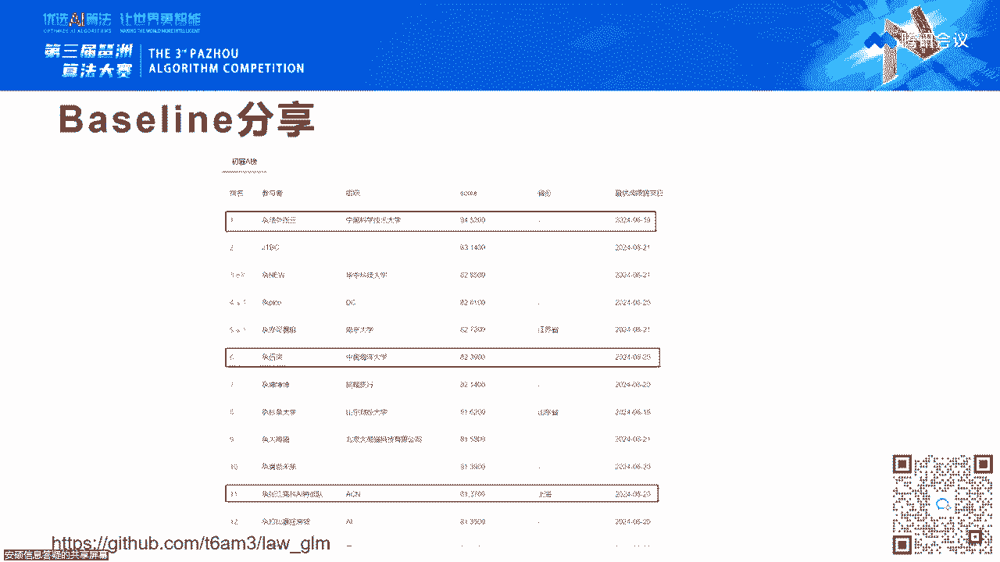

嗯可以看到吗，各位老师，你全屏一下，Ok。

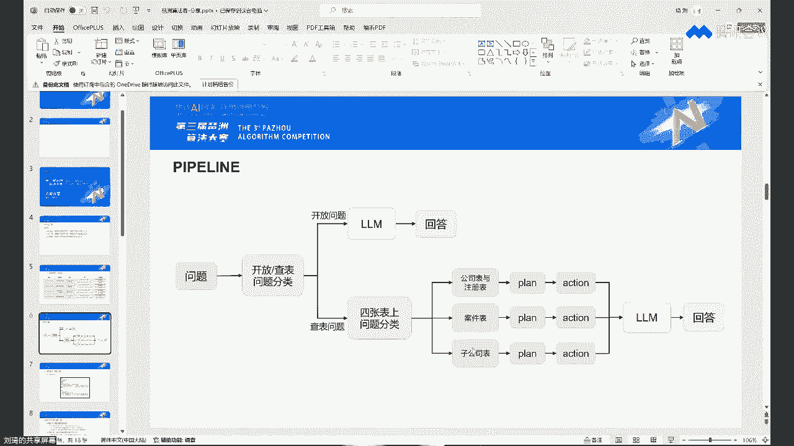

首先我先介绍一下我们的队伍的名称，我们的名称叫法外张三，然后这是我们的队伍的成员介绍，然后我们三个人都来自中国科学技术大学呃，首先接着上回接着刚才精灵小姐姐讲的，然后我们在A榜上是有八个API的。

那首先八个API它是可以对应到四张数据表上啊，每个表其实每个表的关键的信息都不一样，比如对于对于第一张他四张表，非常分别描述这表的基本的信息，和好公司的基本信息和公司的注册信息，以及子公司的关联的。

上市公司的信息以及案件的基本信息，然后每张表它都有对应一个组件，然后比如说前两张表，它对应的的表的主键是公司的名称好，第三张表它对应的是子公司的名称，第四张表它对应的是暗号。

也就是说根据问题的问题所关键关键信息不同，我们要查询的表就不同呃，首先给大家介绍一下，就是我们这个PIPA，就是对于这个我们拿到这个问题之后，首先想的就是，首先先把这个问题进行一个分类啊。

这接下来就是想简单介绍一下，我们的就是怎么去做这个分类，首先我们拿到一个问题之后，我们先进行了一个二分类分类分类出这个问题，它是一个开放性的问题，还是一个需要查表的一个问题，如果它是一个开放性的问题。

就是说它的答案就不在数据表中，那么你就是对于这种问题的话，就是只要大模型进行一个，只要用比如说调用gm，gm进行一个开放性问题的问答就可以了，就直接生成答案，但如果这个问题它是一个需要查表的一个问题。

那么首先就刚才所介绍的一共是有四张表的，那么你首先你要先搞清楚你要动的是哪张表，所以说第一个问题就是下面一个子分，分类又来了，就是首先先呃问呃，先对这个问题进行一个分类，看他需要查哪张表。

然后呃因为公司表和注册表，他俩的这个主键信息是一样的，那么他其实对应的操作其实很多都很相似，所以说我们在这个流程中，把公司表和注册表合并了，合并成一个呃一条pipeline。

然后得到了他要查证哪个表之后，我们用大模型对于当前这个问题，生成一个plan操作，就是我对于这个问题应该怎么去解解决，也就是生成一个逻辑的一个plan，然后得到对应的生成逻辑的plan之后。

每个plan它都会对应一个action，就一个动作就是该做什么操作，然后这一系列的一呃，这是一个plan列表，对于每个plan进行一个action操作之后，得到一系列的数据流。

然后把这些所有的数据流整合一块儿，再和问题放在一起，送给大模型，让它进行一个整合性的回答，生成自动答案，这是我们的基本思路啊，刚才讲的就是相对于一个问题，首先进行一个二分类查询，那么这个二分之残忍。

我们是怎么做的，我们采用的是大模型的这个feel shot能力呃，举举例子，就是下面这个具体意思就是对一个问题，我们把问题输入进去，然后我们让他判断这个问题的类型，但如果我直接让它生成问题。

这个类型他肯定会呃，肯定是输出不出来，是啊是直接回答，还是说就是开放性问题还是差表性问题，那么就给他一些例子，比如说对于第一个例子来说，什么我国的法律监督体系的构成啊，然后它有什么区别。

这些他根本在表里面就没有答案，它就是一个开发性的问题，然后我们就给他告诉他这种例子，这种例子类型它就属于开放性问题，就是直接用大模型回答，而不需要查询数据表，然后比对于第二种类型，比如说要找注册化呀。

为多少多少的公司，这些就是需要查表操作，然后就告诉他，这是一个需要查询数据表的一个问题，去利用它的分上的能力，让他对于问题进行个出分类，然后得到问题的类别，如果它是一个开放问题。

那么我们的操作就是让他指向大模型，直接生成答案，如果是一个插标问题，那么就走我们刚才那个pipeline的下一步，然后判断他是走哪张表，我们先判断它是以哪张表为主要的一个呃，呃问答的基础。

比如说然后对于对于这个问题的分类，在每四张表的问题呃，四张表怎么去分类呢，呃而接下来介绍一些问题类型的不同，就是说为什么要做分类，比如说对于第一个问题，什么瑞光瑞丰光电的法定代表人啊啊注册地址。

电子邮箱，它其实就是一个简单的查询问题，只需要查询公司那张表中的，瑞丰光电的一些基本信息就可以了，但是对于第二种问题，比如华仁药业股份有限公司的控股，控股的子公司超过50%的，有几家。

这个问题就比第一个问题要稍微复杂一点，他首先要先查询云，它的，就是华人药业股份有限公司的子公司有哪些，然后再判断再进行筛选，也就是说进行判断就超过50%，控股的又有多少个，然后再进行一个统计。

然后对于第三个问题，比如说所有案件中涉及二有技术服务，合同纠纷的历史历史案件数量有多少，它也是一个先试查询，在一个统计的过程，所以说问题的不同就解决的操作也就不同。

然后然后因为我们进行分类的有多个步骤吗，比如说第一个步骤是进行二分类，第二第二第二个步骤进行一个四表的分类，那么它的problem的模板也有所不同，然后我们呃像怎么去让他让这个大模型去判断。

它是属于哪一个问，就是属于该去查哪张表的，我们也是利用他的free shot呃，就是给了他一些，比如说给了他问题和每个表的熟知性值，让它进行自己去判断，比如说我给他一个问题，然后告诉他第一张表。

它是名称是呃，他们那info，然后告诉他这张表中有哪些属性值，比如公司名称简称啊，各种各种各样各种各样的，比如说传真各种，然后第二张表我也都告诉他，第三张表也告诉他，第四张表我也告诉他。

直接让利用他的这种生成式能力，直接让他告诉我，他应该是如果大家这个问题要回答的话，应该要基于哪张表，然后得到查询表之后，就是按照我们的pipeline，下一步是不是叫生成plan，就是方案的生成。

怎么生成方案呢，比如说以公司公司表和注册表为例呃，我们的目标就是根据这个问题，然后以及数据表的属性和它的可执行的操作，让大模型直接给出问题的解决方案，然后接下来就在具体的实验过程中。

我们发现其实有很多的一些小trick嘛，就比如说如果问题中的他这个数据表，这个属性的描述都不完整，什么叫属性的描述不完整呢，比如说对于这个呃，数据表属性二中统一的社会信用编码代码。

这个现在大家看到那个问题中也看到了，其实有很多问题，他就直接只会只告诉你在问题中，什么什么公司的信用代码是什么，它就不能完全统一的对应到统一社会信用代码，这是这八个字长，那我们就先用大模型。

对于这个问题先进行一个重写，也就是说把他所有的这个呃信用代码呀，各种各种这种属性值的描述啊，让他直接对应到原始的数据表中的属性，这样的话就保证了后续在查询的时候，不会查询不到，或者说查询错误。

或者说查询为空，这种情况也是这也是这个这个问题的解释，是说解决这个问题的一个必要的吧，就是如果没有这一步的话，可能会有很多问题，但是查询不出结果的，然后后面就介绍了这个操作的描述。

就是介绍我们这个action就是有哪些操作，我们这里主要涉及到四种操作，也就是说我们刚才介绍的四种操作，首先是查询，查询操作是根据主键名称，比如公司的名称，查询数据表中的一条记录，也就是一行嘛。

或者说根据属性属性的，根据属性的值去筛选一个表中，哪些符合要求的一些若干记录嗯，统计操作呢，也就是说我给定这些这些记录，我是否可以计算出这些记录的数量，然后对于呃排序操作，就是说我给您这些记录。

然后我需要这个需要你对这些记录中进行排序，就按照某某一列的值，或者某某一个某一个属性的值进行排序，并且返回出前K条记录的操作总结，也就是说给定操作的结果，让他们进行总结，总结答案，然后呃具体举个例子。

就比如说对于问题，瑞丰光电的法定代表人注册地址和电子邮箱，分别是，然后我们通过我们上述这个生成方案的方式，直接让它生成出来，下面这种形式就是问题是什么，比如查询瑞丰光电的法定代表人，注册地址和邮箱。

那么他的操作应该是做做什么操作呢，应该做查询操作，是否需要前序结果是false，这个是否需要前序结果是什么意思呢，就是我们在遇到了一个很长的问题中，它可能是就是后面一个问题。

后面一个子问题是需要前面一个问题的上呃，结果的比如说你第二个问题为例，比如查询仅仅仅装备股份有限公司，所属的行业类别，并告知该行业类别中有多少家公司，实际上我们这个问题要做的是要调查。

要返回的是这个行业分类上有多少家公司，但是在后面这个问题中，我们都不知道这个行业是什么，那怎么会做就做不了，首先要先做前面的，先查出这个这个这个公司所属的这个行业，类别是什么，把这个类别告诉告诉他。

然后这样的话他才能知道是哪个类别啥的，判断出有多少家公司这种操作，所以说这个他就是回答第二个问题的时候，是否需要前提，结果就应该是true，可以看到大概是这么一个简单的一个思路，然后最后给的那个问题。

然后生成一个生成一套方案，比如说举一个最呃，举一个具体的例子来说，比如说我想了解酒饮料制精，制茶制造业这个行业的公司有哪些，请列出注册资本最大的三家投资公司，并且并给出他们的具体的注册资本数额。

是不是就是看见这个问题就非常的呃，比较复杂一点，就不像那么简单，那按照我们刚才那个呃方式走，首先他们先进行第一步的，第一步就是先把它们进行填充啊，就是属性值的补充，就可能哪些数值属性值可能不完整。

先把它进行补充重写一下，然后进行生成plan，生成plan怎么做呢，比如说它生成plan是一个列表形式，也就是一系列的plan，就是从上到下的顺序plan，比如说对于问题先进行分解成第一个什么。

先首先先查询素食行业为酒，饮料和制好精制茶制造业的公司列表什么，首先我们得到这个公司有哪些，这个公司就对应的这个公司列表，也就是说啊属性值得一个补充吧，然后操作就是查询查询操作是否需要前进。

结果是false，也就是说它不需要，不依赖于前面任何一个返回结果，然后根据这个返返回的这个公司列表，然后第二步plan是什么，第二步操作是什么，就是给定公司的列表，按照注册资本进行排序。

然后并且取权三家公司，他的操作就是一个排序，然后是否需要前期结果，它是需要前期结果的，因为它需要前面那个结果返回的这个公司列表，然后第三个操作就是给定排序六，排序后的公司列表。

输出这三家公司的名称和具体的注册资本数额，他的操作就是总结操作，也就是说根据前面两步的结果进行一个总结，然后刚才讲的可能比较抽象，就是具体来说给大家画了一个比较明显的呀，可以大家可以看一下。

具体是否他这个具体流程是怎么做的，首先我们得到这一个plan列表，那是不是有三个plan，那么对于第一个plan来说，他的动作是查询，那么它就根据根据查询的这个结果查询的，就查询这个表。

查出来这个素食行业为酒饮料和制制，精制茶制造业的公司列表，就是以下公司列表，他查出来的应该是公司的列表，以及公司的一些什么信息啊，什么注册，具体的资本数额等，那是不是得到了。

就是这个公司列表和公司的一些信息，但这个信息是不是在需要第二个plan中是需要的，所以说就要把它拼接到第二个问题，就第二个plan的呃，前面上相当于他给定的公司列表，也就是这个这个公司列表给定了。

然后进行一个排序操作得到了，然后得到做做完这个排气操作之后，就会得到一个前三家的一个公司列表，然后和他们公司信息，然后最后一步就是根据这个前三家的公司列表，和公司信息进行一个总结，然后就可以回答出啊。

这个问题的答案就是根据注册资本的排序，然后呃所给公司列表中的前三家公司会这样，这也就是最终整个问题的答案，实际上就是一个进行了一个问题的拆解，然后再给大家举个例子。

比如说华人药业股份有限公司的控股子公司，超过50%的，有几家一样的操作，首先生成plan，生成plan，也就是生成plan列表，就是它这个刚好也是三个plan的一个序列。

首先查询呀关联上市公司全称为全称为呃，华人药业股份有限公司的子公司列表，就是先查子公司那个表，然后查出来他的这个呃，查询这个公司的子公司列表，查出来这个结果，根据这个结果，然后再拼接成第二步呃。

他的操作是条件筛选，也就是说给定这个上述的这个子公司列表，然后筛选出来他这个控股，超过50%的一个子公司，然后得到这个公子公司列表，然后进行一个统计，然后就得到公司公司子公司的数量，应该是13家。

是这样的一个操作，然后最后一步就是回答生成嘛，因为我们这呃整个拍不烂，其实是每一步都有一个都是会生成一堆数据的，就是比如说三个plan会对应三个数据流嘛，那么我们怎么最后进行整合答案呢。

然后比如说对于question，就是给定这个快，那么我呃还是刚才那个问题，他第一步不是生成了，就是所有的公司列表如下，然后第二步生成了前三前三家公司的列表如下，然后最后得到这个资本排序。

得到前前三家公司的信息如下，然后把这些所有的信息，所有的这个数据和这个原本的快速进行啊，全部给大模型，让gm进行一个整合，然后他就会告诉你啊，继续查询在什么，在酒饮料精制造行业这个行业中。

注册资本之下的这个结果是如下的，这个标行是什么意思呢，标行呢就是指这个问题中最主要的一些呃，最主要最关键的点，比如说呃对于九呃，这个问题最重要的就是上面这个标榜这些信息，然后我们让他进行回答。

终于这个标黄的这个信息的一些答案，为什么这么做呢，呃因为我们刚才算算分数的时候，它有两项，第一项是你这个答案是否在，这个就是你你生成的这个信息里面，是否有真正的答案，第二就是语义相似度。

就是你如果你生成的很长，但是里面虽然说有答案，但是它效果，但它的分肯定不会很高，那么我就要生成忠于这些关键词的答案，能够让这个分数可能更就，语义上会更贴近于真实答案，然后这第二个问题是一样的。

就比如说呃把标黄的是他一些关键的部分，然后重点让他根据也是根据这个数据流，然后进行一个整合，就是生成的这个answer，是一定要忠于这些关键词的，这样既能保证它有正确答案。

也能保证它在语义上尽量去贴合正正确答案，而不会生成一些乱七八糟的，也呃一些回答，最后再回顾一下整个pine，其实简单就是首先我得到一个问题，我先进行一个二分类，如果它是开放性问题。

那我就直接让大模型进行回答，这个开放性问题就OK了，就没必要再去查表，因为表里面也没有答案，其次就是如果他是查表查表问题，那么对于这个查表问题，我们对应有四张表，然后我们这里是进行了一个三分类。

因为公司表和注册表，我们认为他的操作基本上一致，所以没有必要再给它拆分，拆分成另外一个单独的得到每一个进入到，就比如说对于进入进入到这个问题，我们认为它是一个公司表和注册表，为基础的一个问题。

我们就会进入到这里，然后然后用大模型按照我们刚才那个步骤生成，生成它的plan，生成它这个要做的一些方式，也就是说进行一个拆解，拆解完之后，每个拆解的一个动作都会对应一个动作，然后生成一堆数据流。

每个动作都会对应gm g l m生成一些数据，然后最后让大模型，根据这些一堆数据流和原始的这个问题，让他生成一个忠于这个问题的一些答案，这样的话就既保证了它能够回答出来，这个回答中有信息。

并且能保证他的信息是语义上尽可能贴合的好。

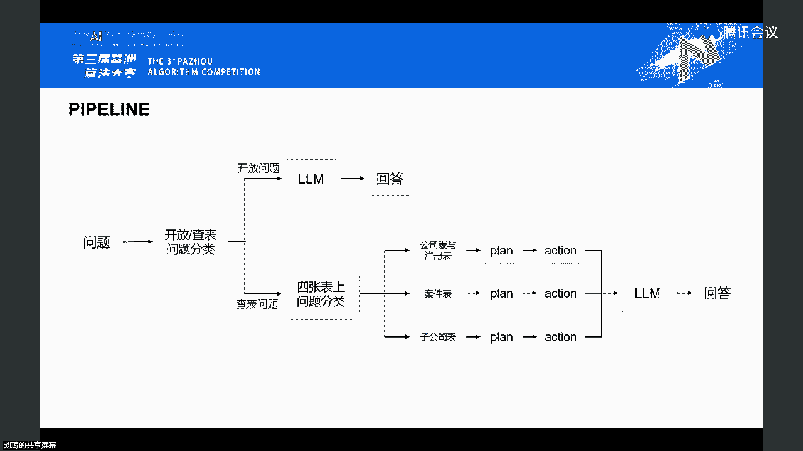

那我们组分享就到此结束，下面有请五期团队来分享，嗯好的，轮到我了，然后，是共享我的桌面吧。

嗯然后我们团队是武器团队，然后是在那个A8，现在目前排名是第六的团队。

嗯能听到我说话吗，我先确认一下，我先确认一下，能听到我说话吗，可以听到，可以听到好的，然后我呢嗯我我这次讲就不完全按PPT讲了，我那个悲伤的代码等会跟PPT就是来回换着讲，所以就不全屏了。

然后是我们我们对嗯有两个成员，一个是我，一个是千叶，然后由于我个人可能比较注重隐私的原因，我就不要不把名字说的那么清楚，还有我们现在在干嘛，然后其实我们两个是本科的同学，都是中国海洋大学的。

所以嗯我目前在杭州，他目前在广州，然后他目前是韩国的某学校的博士在读，然后我呃我目前在杭州的某家公司，就职于NLP算法公司，但是我来我先给大家分析一下，我认为当中的赛题的一些信息。

然后首先是刚才这个这个这个举办方，也有说到我这里嗯，我这里跟大家详细说说，这个能帮到吗，然后首先是我不知道大家看不看得清楚，那我为了看得清楚，我就这样吧，我就不管这个PPT，首先它是要求我们题目中。

要求我们用大模语义模型的，语义理解和函数调用功能，然后我们分析下什么是语义理解，什么在参与教育，就刚才其实张三的方案也提到了，我他们用了大模型去做第一件事，做的事情就是做问题做个分类。

然后其实这个东西就应该属于，大于模型的语音B键，然后后面的函数调用功能就是plan action，然后他们应该是封装成成了函数，还是工具还是工具，这个我们可以看他的代码，然后另外一个是我们来看这个简介。

我们灵活的应用已提供的接口，然后并有编排的一次调用接口，然后前面那个方案指的是他们设计了他们，他们用plan，然后并且按你的plan去执行action，然后这个是属于这个这个这个这个内容。

然后还有另外的情报，就是群里面的和举办方的朋友圈的情报，首先是嗯深圳数据交易所的缺席，说我们他们是为了考，解决具体应用中的工程问题，考察API的工程能力，然后尽力说他们觉得问题的核心在于，把复节任务。

复杂任务分解成多个步骤，并通过循环迭代方式逐步优化结果，嗯其实两个说法好像不太一样，然后我等会说一下我对这种东西的理解，那我先介绍一下我的方案，首先我的方案其实比上一个方案简单更多。

其实上个方案在我听起来，比我的方案要复杂一些，而我的方案就很简单，我的方案是首先把API封装成服务，服务再封装成工具，然后如果有问题进来的话，他先通过root路由，就像问题分类一样。

然后给不同的agent不同的智能体，然后我是一个多智能体的一个一个方案，然后多智能体以后，不同的智能体会调用不同的透，就是说我的工具会有不同的工具包，不同的工具包会被不同的agent。

不同的智能体所调用，然后其实如果是嗯有过写增删改查经验的同志，应该能理解，就是很熟这个东西很眼熟，因为增删改查最基本的一个项目结构是嗯，最底层是个大层，是个数据传输层，在中间是个服务层。

最上面是个控制层，也就是说控制成是一个路由的，路由到不同的一个方式的一个层，其实我这个思路是一样的，就说问题进来以后，root层把它分给了不同agent，然后最底层的API就是那八个API。

官方提供的API的一个封装，然后不同的API会组组合成不同的服务，不同的服务又封装成不同的工具，其实这么一个收入，然后等会儿这个嗯这个我再给大家看一下代码。

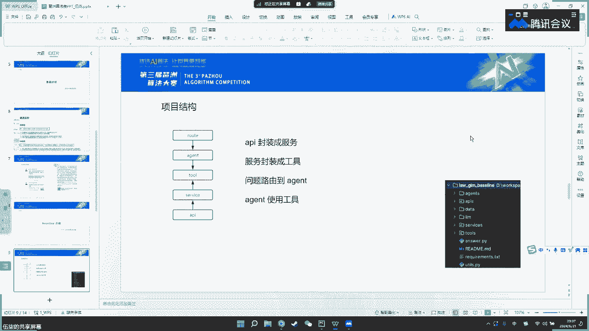

也就是说我，不知道大家看不看得清楚啊，嗯算了，找不到了，就是那我就将就看吧，各位就是说，首先这是我们最基本的八个，八个给你们看一下，结果就说有八个最基本的API，然后不同的API我们在收益是城中。

我也是分了八个不同的四个，不同的那个service的一个文件，分别对应不同的四个表，然后这里分别有不同的服务，不同的服务再去封装成不同的工具，然后工具又被大模型所调用，它我一点一点的去讲这个东西。

首先是我，我其实这个这个API的代码，我最先分享在了那个比赛的论坛上，呃，当时我说有三个小tips，然后我跟大家解释一下，所谓的三个tips是什么意思，首先是第一个是。

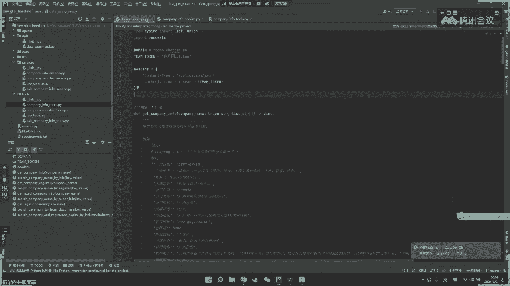

其实官方给的说明里面有一些些错误，除了一开始的那个API，它不能够被调用以外，包括这个API说明来，我们看看这个输入参数是这个train，即使它有一点误解了的。

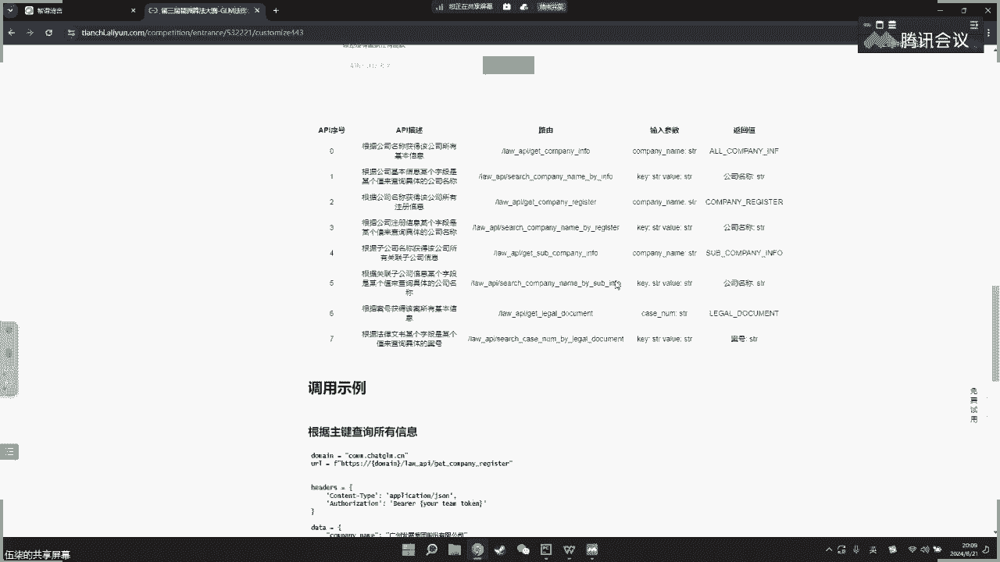

让大家有点误解，因为我在这里的第一个替补是，首先他这个公司名称和暗号，它其实是可以传入历史，可以传入数组或者说列表的，不单单可以传入一个字符串，然后这是第一个注意的点，第二个注意的点是。

我们在理解这个子公司表的时候，因为我们嗯之前的张三那个团员也提到过，他们有自己的组件在子公司表里面，因为他的唯一的只见他们的子线是不同的嘛，是unique的嘛，所以子公司组是组建。

但里面大部分所隐含的信息其实是关联，上市公司，全称关联上市公司，其实这几个信息都是有关于母公司的，所以其实它的含义上，我们可以在封装成工具的时候，不一定要死死的去把这个API的描述告诉。

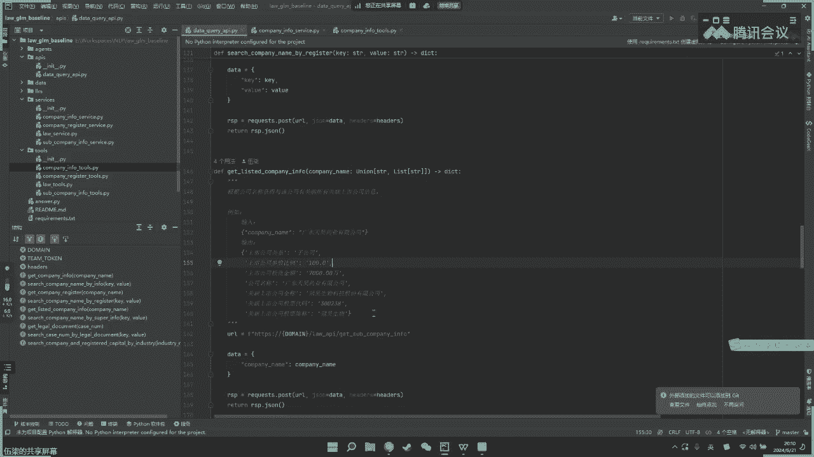

直接告诉大模型，我们其实可以是重写或者说重新命名它的描述。

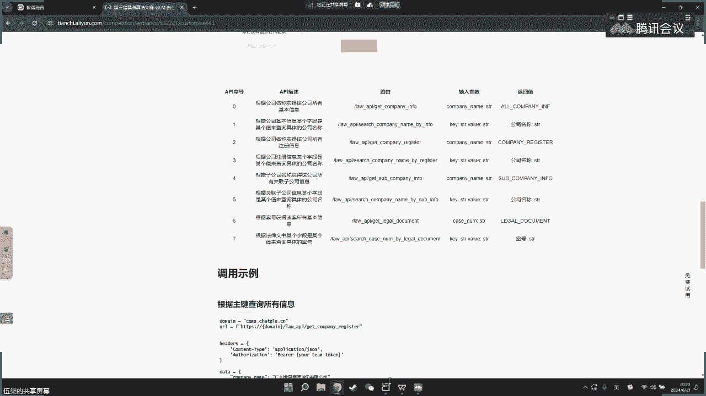

比如说我这个第二个替补，就是你看他说这个这个API的名字，叫做获取子公示信息，其实我把它改成了根据公司名称，或许与该公司有关的所有关联上的通知信息，现在这里还可以改成获取有关的母公司的信息。

所以叫get listed info，这个东西是母公司，就说我们在嗯DAAPI这一层的时候，它有自己的描述，我们在封装成service和工具的时候，我们可以用自己的另一半描述给大模型去理解。

而不是说照抄，然后这是第二个，第三个是，我们知道大模型都会干一些乱七八糟的事情，就是他总是不一定按照你所想要的输入输出啊，这里面我在API里面就放了一个，你看其他地方都是简单的封装。

其实所有的其实都差不多一模一样，只有在这个暗号这里有一个小的tip，这个爱好，这就是说我们在嗯在输入，在在那个API的时候传入的时候，如果这个暗号前面这一段是小，一般是半角的英文符号。

而我们大模型往往很容易，把这个半角符号再重新传给这个AI的时候，会唱会写成全角符号，因为可能在我的理解当中哈，大模型在它的训练数据里面，全角括号总是跟中文放在一起，所以在我们的那个字符里面。

大部分是中文的时候，他有自己的理解，他觉得中文字符，他就应该跟全角的括号放在一起，所以这个东西我们不一定要在提示词里面去去，告诉大冒险，你必须得用半角符号，我们可以直接在我们的API里面去做一个修改。

把所有的全角符号改成半角，这这是我我在那个论坛里面提到的三个小的好，我们把这个呃这这这一层说完，然后我们再看看service，service层，就是说嗯我用的是我用的这个项目，是用的自装上啊。

上架去做的，他他给大模型的描述就是Python代码里面的注释的，这一段的描述就是我写的这里面的注释，就是给大模型的那个那个那个描述啊，这就这就涉及到一个问题，就是说，呃不不听。

没有使用过passion的同学，可能不知道，没有使用的，或者使用的不多了。

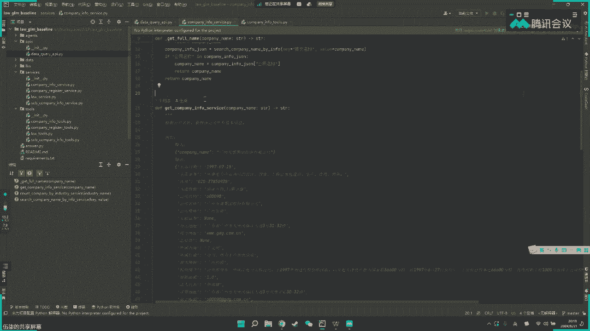

就是说在Python里面，这个这个注释它并不像其他的类型的语言一样，不像java一样。

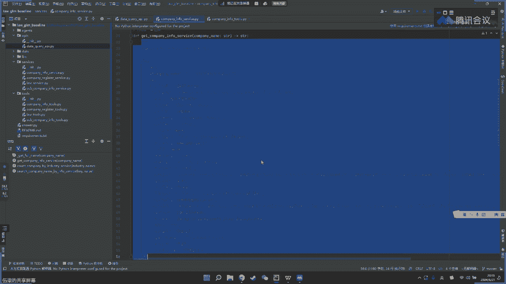

这些注释完全会不浪，就就就就程序无法获得，其实这个是程序可以获得的，它可以有一个像是这样的，这样的一个一个一个属性去获得这个东西，因为在原本上这个东西它不是一个注释。

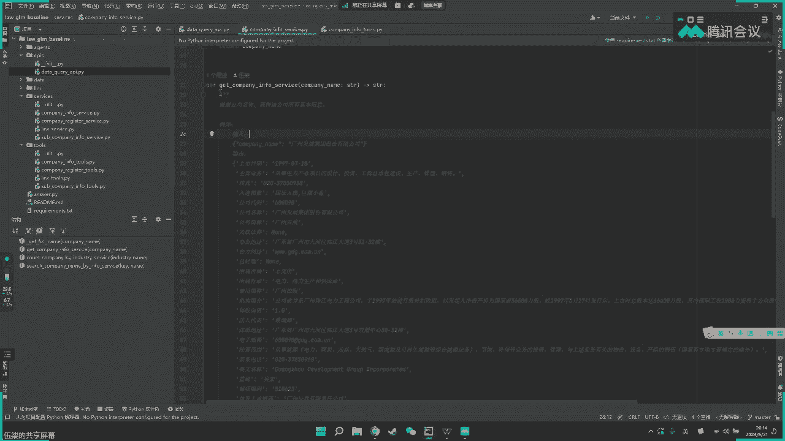

它只是一个字符串，而你当当输入一个字符串，没有给它赋给一个变量的时候。

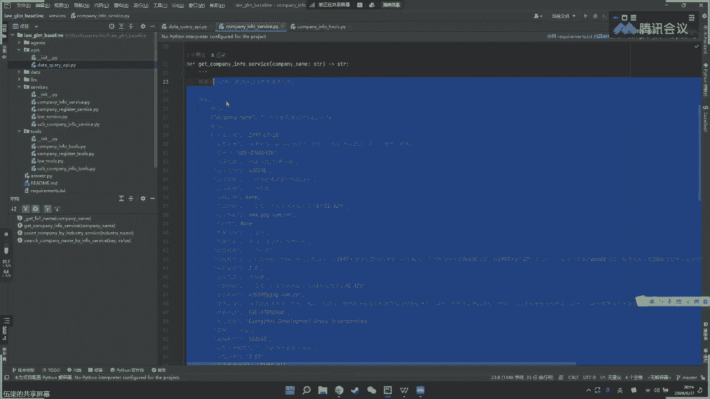

它是它是没有被被被任何变量引用的时候，是无意义的，所以会被当成是组织呃，这是这个，所以然后我们的服务可以针对不同的问题，去写不同的服务，比如说我这除了简单最前面的简单封装。

一个一个get company info的一个到此以外，我另外写了一些其他的服务，比如说根据行业说是行业统计，该行业下的公司数量，这个时候我们就可以灵活灵活灵活组合这个API。

这就这就回到了我们刚才想想。

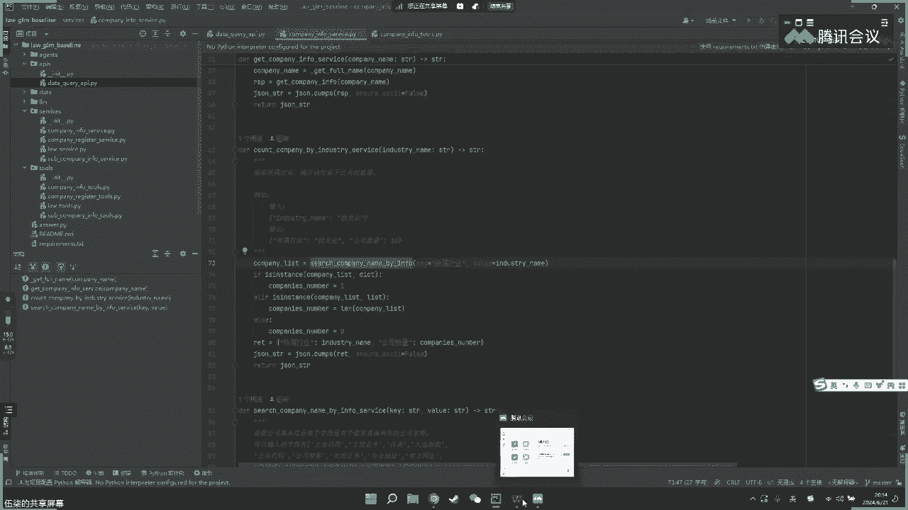

我们我们的赛季势必与你说了什么吧，我们灵活的应用与提供的API插入逻辑操作。

并有编排的一次调用接口，所以我这个一次调用接口是人为写好的，因为嗯我们再回忆一下张三的方案里面，他们的灵活的组合，这些接口是通过有一个plan，然后plan执行action。

其实我没有完全理解他们的方案内容，因为我不知道他这个plan是能写好的plan，还是每个plan都只有一个圆的原子操作，就是他们说的那个呃，查询统计那些操作是分开的，然后由大模型来灵活组合。

这些操作我不知道是哪一种类型，等会我还得去看看他们的代码，然后所以这是这个这个service，然后service是封装成工具的时候，比如说这个工具，然后我们的工具拿到了service，我们可以命名。

我们可以去命名它应该有什么样的输入，然后大模型会根据你有哪些你的输入，你写成的输入是什么，然后去决定怎么给你传参，这个东西其实得得益于大模型的发展，就是说现在G2M4这个能力比较强。

其实在前面几个版本的时候，他大模型不会说你说想让他们输入什么，他就输入什么，而且有一个非常就是说，现在其实也没有变得那么的智能，意思就是说我现在的这几个输入，你看看到了，其实都是string类型的。

这种类型的输入是最不容易被大模型理解错的，大模型容易理解错的是，如果你给他传个list或者说dict，字典类型或者列表类型的那种输入，大模型很有可能传错，这是这个，然后我们从底到最上面的透视封装。

这一部分就说完了，然后封装完了以后。

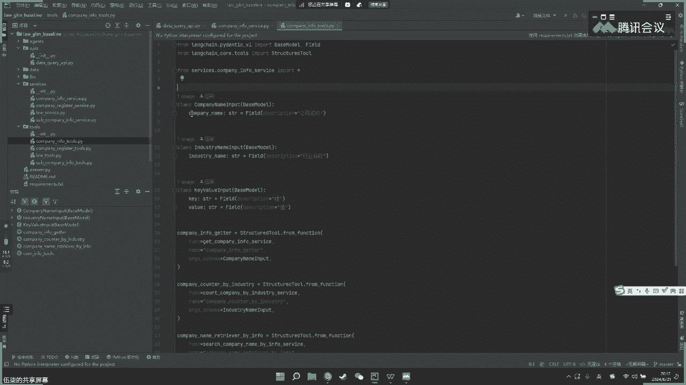

我们再看看我的PPT里说了什么，然后我们封装安全工具以后，会有智能体去去去调用这些工具，那么意思就是说我们再从上往下讲。

如果一个Python进来，我们的root会干什么呢，那我再看看我的root，我的路由是怎么做的，我设计了一个root train，就说我这个是最简单的一个分类的一个root train，我让大毛行。

我跟大模型说，给用户给以下用户问题啊，用户所给定用户提出的问题在下面的，然后分把它分类成要么是分类型公司，要么分类成法律，就是说其实我的分类很少，我现在就分成了两类，不像是三花一样。

分类成先分先二分类在三分类，我我这么做的原因是，因为公司和法律，在问题上其实很容易被大漠星给区分开，就说呃我现在自己做的测试，对那230个问题，大模型都能很百分百正确的分类成公司和法律。

而且在我们的问题中，目前230个问题中，他的法律问题和公司问题没有交叉，那其实我这种方案是一种zero shot的方案，就是00shot，而上一个方案使用的是few shot，就是他们要给一些示例标定。

就是说先开放问题和可回答的数据查询问题，然后是三种类型的问题，它都是有样例的，他提供的样子，而我这没有没提供样例，所以它分类的能力会缺乏，但这里其实有我，我在这边还是有一个，我还得看上一个方案的代码。

说few shot，他那几个样例是给定点死的，还是说它是有一个样例库去选择的，会根据不同问题去选择样例库里面的不同问题，去塞到我们在提示词当中去，因为因为其实如果写死几个样例以后的。

以后的问题的种类变得不一样的时候，是很容易被识别错的，但是如果有样例库的话，嗯比如说他们用语义相似性，然后存到向量数据库里面，然后再选择了最相似的样例，然后塞到里面，塞到提示词里面。

做future这种方案的话，我还有个问题是，那就那就会变成，我们可以去对问题做一个分类的标注吗，这是我们值得思考的一个问题。

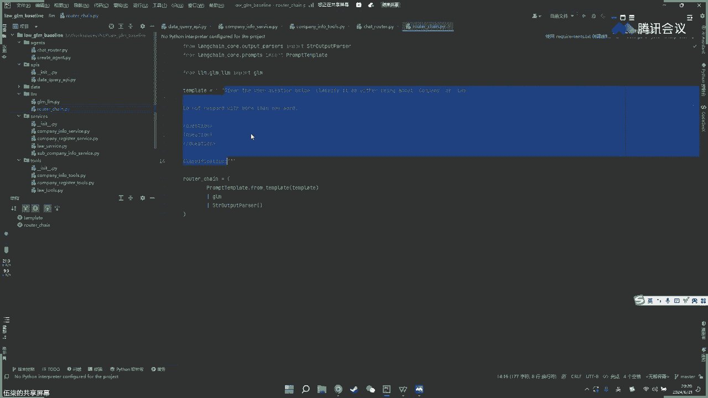

然后我把我我这边就到此为止，这个root这个东西就到此为止。

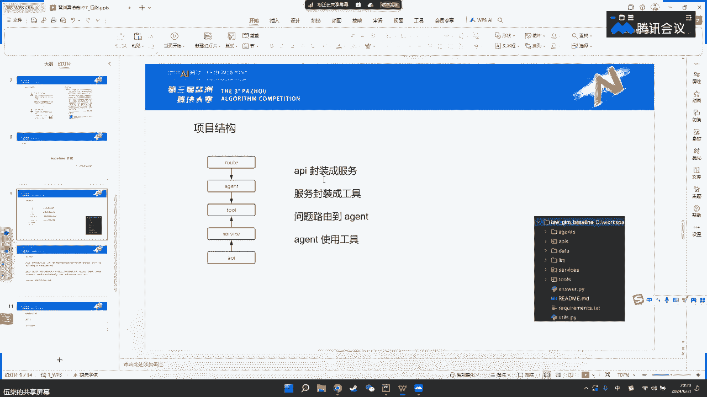

然后是agent，其实有的时候不做root也没有关系，但是我这里的工具数量，大家可以看到这里有三个，这里有四个，这里有1234567，12346个，1236个，其实工具数就很多了，就是说数量越多的工具。

大模型从里面挑一个工具出来使用的话，它是难度是越大的，而且他很这是一个问题，另外一个问题是你的工具数量越多，你工具里面的描述越多，你就越占token的，你使用的token就会很多很多。

这我们我们现在如果要用gm4它的app的话，你要考虑你方案全部跑，就把问题全部跑，于是到底要用多少多粉丝，你是否经得起这样消耗，这是你另外得考虑的一个问题，而在目前这个方案中，我只把它分成了两个。

意思就是说然后我再看看我们的agent，这个我们我创造一个agent是给IM用LM工具，还有提示词三者去生成一个agent，生成一个智能体，你就像我这里说到的啊，上一个方案也有。

其实他们也有不同的问题的分类，其实提示词是不一样的，比如说这边其实区别也不大，我没有细写啊，我现在没有细写这一步，比如这个提示词是分类在公司的那个问题以后，它生成的agent，用的提示词。

是你是擅长一个回答与公司有关问题的专家，如果是这种的话，你是擅长一个回答法律问题，就是关于专家，那其实如果我这里还得去考虑上一部大模型，如果生成的那个词，它既不是公司，也不是法律的时候该怎么办。

其实这个时候要有一个通用的，塞了所有工具给的sex，所以不用去给给大模型的那种，通用的一个提示词，Prompt，这是这里，然后我再看看另外一个部分，在这里就说我们在这个地方生成工具的时候，看到了。

就是刚才大模型它路由到不同的公司，分别是公司和法律的两个两个分类的时候，它会生成不同的agent，然后不同的agent它的工具是一种所有的工具，所有的工具都塞到里面。

在公司这个工具是把三个表的工具塞进去，然后法律的这个toy是他的工具包，是只塞了法律的工具，然后大模型就可以，不同的智能体就可以调用不同的工具，这是这个。

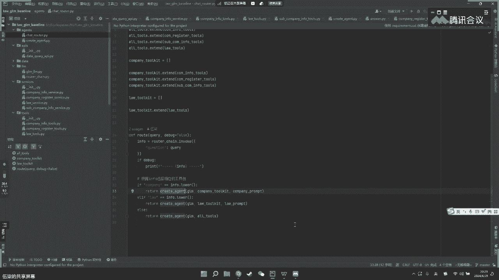

所以整体的方案就是API封装工服务，服务封装成工具，然后问题路由到agent，然后agent调用调用工具，这是整个的一个项目结构，然后其实这个代码就说完了，然后我们再介绍一下基本概念。

就说我们还是得思考一下，我们上面一个方案，我这个方案不下下，接下来一个方案，它不同的方案它的设计思路是什么，我我们最基本的就是说解决问题的方式，有这么几个，就这么三个的一个一个方式去解决呀。

首先第一个是练就说链指的是对大云模型工具，数据预处理，输出格式等解析步骤的调用区别，也就是说这一系列操作，就像数据结构里面的链一样，它是一个线性的，它是一个有序列的调用，是人为设计好的。

其实这种如果以后你们有自己的方案，有可能会存在这么一种情况，你们把235问题分类成了更细，更细的一些一些分类，就是不止这是我这两大类，也不只上一个方案的四大类，还有可能是比如说某某公司的什么。

什么号码是什么，他只是换了一个公司的号，公司的名称，那么这几个问题分成一个小类，也就是说它的力度更细的时候，它你可以专门设计一个去去回答这么一小类，可能也就两三个三四个的问题，那么其实上一种方案。

如果它采用的方式是有josh，是selected的，是选择的是相似性，放到向量数据库里去选择的，那么我们我觉得这种方案可能在A大上刷分，更能刷到更高的分数，因为其实它里面掺杂了更多的人工的知识。

就说我们甚至对230个问题，如果他的压力库里面是230个问题，人为分类过的话，嗯也不知道这种方式可不可行，能不能被被被那个比赛的，比赛的举办方能够允许，然后就是这种train，然后我下面这种是智能体。

智能体的意思是，我们的智能体是具有感知，思考意图和行动能力的意人工实体，它的区别跟上一种train的区别在于，我agent我有工具，然后我的工具我调用了一次工具以后，会返回一个结果。

这个时候其实这个工具也没解决问题，或者说我还要更多的信息，我还要再调一次，工具是由大模型自己思考的，而不是人去设计的，他下一步该干什么，这这种它能够反复调用工具，并且反复观察调用工具的结果。

并且自己决定什么时候停止的这种智能体。

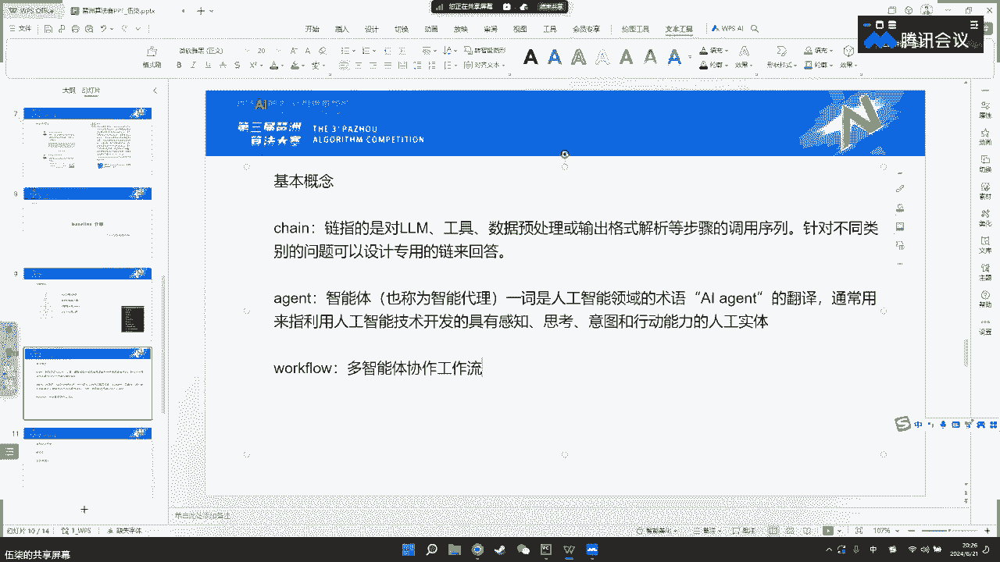

然后我们的这个方案里面的这个agent是用了long，像框架自己去long唱的框架，自己封装的这种方式的agent，这种方式最简单的reactor的一个agent，它就是它就只能调用工具，然后观察。

然后回到工具去判断是否在掉，那么这种智能人体其实它存在一些缺陷，是它有可能重复的调用某一个工具，而且使用同样的参数，如果如果大模型能力的不足不够充足的话，它会重复的调用某一类工具，还有可能。

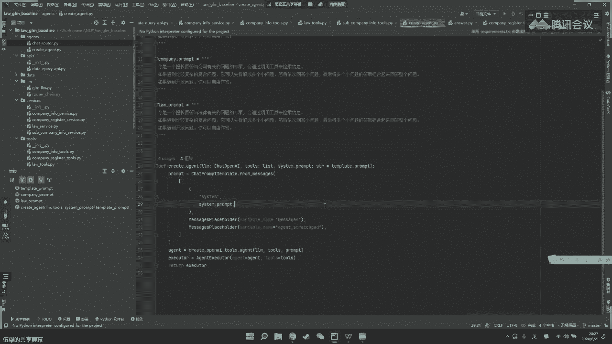

总之这种这种这种卷的存在一定的缺陷，这种最简单的卷，然后所以下一步的嗯，下一步的一种一种方案是workflow，让我们想想尽力说过些什么吧，就说这种AHTCWALKTHROUGH。

将复杂任务分解成多个步骤，并且通过循环迭代的方式逐步优化解，这个这种方案应该才是应该是这种，就是他经历说的东西，应该是想要这种解决方案，并且他发了一个文达的从agent agent的链接。

包括群里之前也发了一个有关workflow的，一个一个一个叫什么，那个叫文章，也是吴恩达写的，就说这可能才是主办方想看到的东西，那其实我有没有做，其实我思考过，我思考了两天，我有没有做到过作用。

其实是没有的诶，哦哦我这个少复制点东西，因为改过一版PPT，我还是看一下前面那版PPT，忘了还沾上了，出现了一点小差错，不好意思，各位打不开了，因为用统一统一的模板，这就是有东西没忘了粘贴过来，是这种。

其实我现在的思路，我想本来是想设计成一个一种workflow，是这种是道德模式的一种workflow，也就是说用户给的问题，会给一个叫做指导者的一个一个agent。

这个智能体会把这个问题分配给不同的agent，调用不同的root，然后a agent执行完了以后，返回一个答案会给指导者，指导者还会看看这个答案，姐妹的问题会重复，再再丢给其他的人。

这是一个循环的一个操作指导，这个指导者他认为这个问题已经解除，所以它是一种多智能体协同，也就是刚才看到的，多智能体协作的一个工作人哦，我现在做到了什么呢，我只做到了这个指导是去路由到agent。

但是他没有回来，就说agent执行完了以后不再被指导者观察，所以我的这个方案它不是一个完整的workflow，呃这是这个，然后我再讲讲，如果你们未来要增加一些东西，或者增加一些。

我在我的代码里增加一个增加工具的话，应该要有一些原则，其实我这里是不是做的不好看，其实这两个东西一个是边界性测试，一个是健壮性，什么是健壮性的，我们来问一下，我们来问一下质朴青年，怎么这么慢的吗。

软件设计的健壮性是指软件在面对异常情况，错误输入或者不理想的环境条件，是能够保持正常运行的能力，其实这个很适合用来描述我们大学模式，我们大于模型，常常不按照我们想要的输入去输入。

也不按照我们想要的输出去输出，所以我们一定要考虑大模型，如果如果发生异常情况该怎么办，这也是我刚才说的，如果我想让他输出一个law和一个company，他不按我想输出的输出。

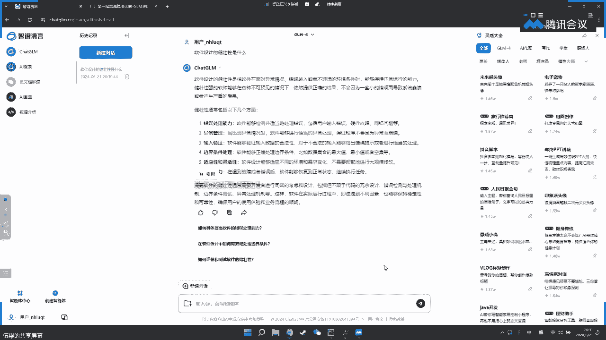

我们就要我们就要有另外一种情况去，我们就要有另外的L是一种情况，去对这种情况做一个处理，包括我们可以用另外的一种上一个思路，包括我刚才提到的，就是在在那个暗号的那个全角符号改成半角，那里。

也是一个针对代码的一个健壮性去去做的，一个写法，包括在这里把这个info，我想让他输入的是快law和company，但是万一他大写或小写，全大写或全小写或者首字母大写，这种情况怎么办。

那么我们就要对这个东西去做一个，小写的一个处理，这些都是对对整个软件设计的一个健壮性，所做的一个一个一个补充吧，算是那另外一点是边界值的测试。

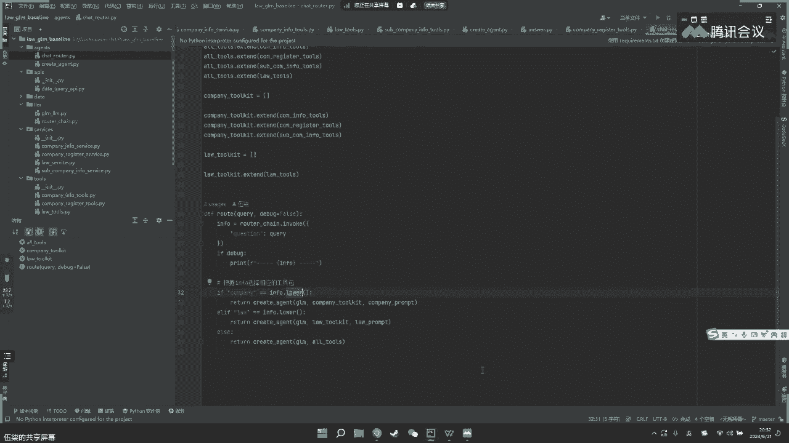

包括其实我们也得想想。

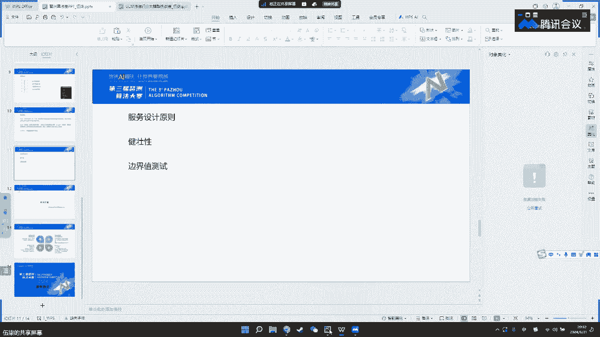

在我们写service或者POS的时候，如果他给的API里面如果有NN词或者说空池，那该怎么办，或者大模型查到了空值对去调用某个API，但是他谈了一个控制返回这东西怎么办。

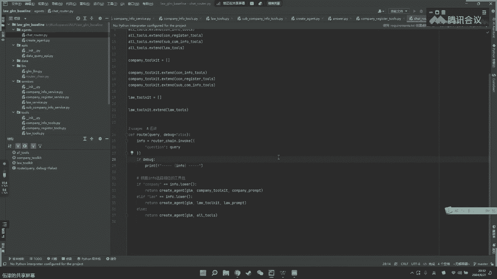

其实这是在我们未来，如果你们未来在使用我的这套baseline要去改写，或者说扩写的时候，需要考虑的一些问题啊，这是这个，然后我们来展望一下，拿到本项目之后要做什么，然后首先第一个我们用更多的工具。

更好的服务去去去扩扩写，就说我们只是组合更多的API，编写更多的服务，封装更多的工具，那么我们就能够解决更多的问题，包括在复赛也好，那么这种这种情况嗯，嗯能够在能够在初赛刷到足够的分数，去进入复赛。

但是会面临一些问题啊，等会再讲吧，然后我们再讲一下，这是这种我们可能要做的事情，另外三种要做的事情，其实是选择你在未来应该怎么选择，你一个更大更复杂的一个解决方案，或者设计模式。

以便如果你们有意向进入决赛，在答辩的时候有个更更好的设计模式展现，因为我们刚才其实也看到了，决赛里面需要的不仅仅只是分数，也不他们会代码会评审，就是专家会评审你的代码有嗯好不好。

不仅仅是仅仅通过分数来判断，所以首先一个方法是，下面三个方案是第一个简洁的路由，强大的智能体系就是我们如果上一个root层，如果是分到加上一个方案所说的，我们分到三个分类，甚至是四个分类。

或者说更多的分类，两两组合呃，比如说上面有四个表嘛，可能有两两组合的表，三三组合的表，或者是四个表全部组组成的一个工具包，那么也就是4+4，我们排列组不会下C41，C12，C13加C44。

也就是最多也可能有这么四个组合的分类，我说我在我用脑子算不出来，我就不纠结这个点，然后每一种分类有某一个智能体系，解决这个问题，那么我们的智能体在编写的时候，就给它分配不同的工具包写。

编写不同的提示词这种方案，那就要想一想，如果路由到了错误的智能体该怎么办呢，就像我刚才说的，如果你不去写workflow，你只是按照我这个方式就只写成就是指向下。

然后然后我们的指导者拿到了agent的答案以后，他不返回回来去判断的话，那么在第一步错了他以后，他就不能够去纠错，这是这个方案可能会遇到的问题，另外一个方案是，我们有了一个复杂的工作流和更智慧的消灭。

人类暴政，世界属于AI，这种方案，应该是，我觉得这种方案会在决赛上最得专家青睐，就说我们如果把服务和工具都原子化，其实原始化的意思是，我那八个API就封装成八个服务和八个工具。

然后大模型能够自由地去组合，这些工具，也说不再由我们去组合它的时候，如果人工智能AI能做到这种程度，那那才是真正的智能，就是，嗯但是我不知道该怎么做这么一件事情。

然后是另外一种最后这种有序的工程人工的美，就是说呃，我们包括其实上面那个那个流程图图里面，除了嗯除了要输出最后一个答案的结果，大模大语言模型最后整合成一个答案，给到最后的输出的这个这个环节里外。

其实其他的任何一个环节，都有传统的ALB算法去解决这个问题，比如说第一个路由，路由我们可以根据呃问题里面的一些关键词，直接映射到不同的分类，然后我们设计好了不同的分类以后。

我们可以为不同的问题设计标准的一个，一个一个函数，然后函数的输入，它可以由嗯关键词的一些提取去去提取出，他想要，比如说你想同问题中提取公司名或者提出什么，然后尽力的去设计这么一套东西，去解决这个问题。

AI不过是鹦鹉学习的，把它当做一种鹦鹉学舌的工具，但这种方案会遇到的问题是B版的时候，他他的问题还能让你看见，复赛的时候问题看不见了，而且他有很多很多种问题，现在是230种问题的分类。

其实还还可以用双手加双脚20个，自从还能数得过来，但是如果230的问题，每个问题都是单独的一类，这很考验出题者的能力，这种情况下，其实就没有办法通过这种方案去解决问题了。

我们用人工的智慧去对付人工的智慧，那完全是怎么说呢，出题者和答题者在比赛哈，啊这是我对未来的一个展望，拿到本项目以后要做什么的一个嗯一个讲解，然后我整个的一个一个一个本来的技术方案，我就已经分享完了。

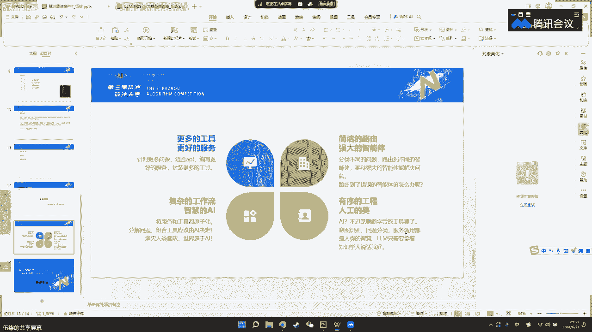

好的好的，感谢五七呃，我们下一个是有张江高科AI特战队，来去分享他们的方案，嗯大家好，能天文可以的，好的大家好，然后我这边呢是龙兴，然后我是在上海，所以说嗯我的队伍是张江高科AI特特战队。

到目前呢现在是1。37，在位于11位，今天我要讲的就是跟前面的两位大佬啊，有点不一样，就是我这边没有用底层的一些像long train啊啊，一看代码就是自己独立搭建一套这个啊对。

就是那个agent的一个应用，我这边是用了一个开源的一个产品叫define啊，我估计前面应该有些人用过就算吧，你好，你那边虽然好像有点不太清晰，是吗，你是用耳机或者别的什么吗。

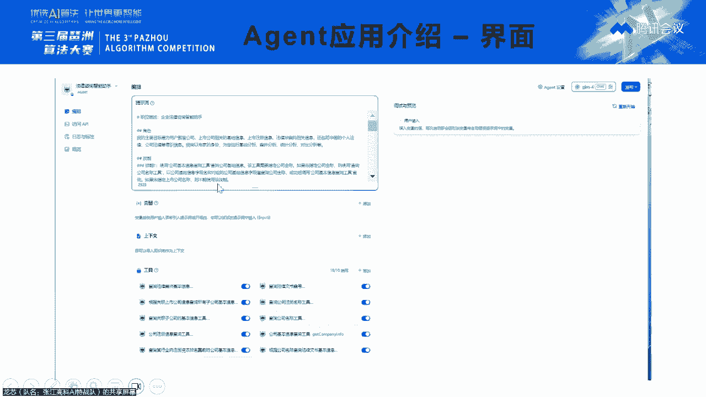

啊看看我的电脑，看到，OK那要不我们就直接开始嗯，好现在可以。

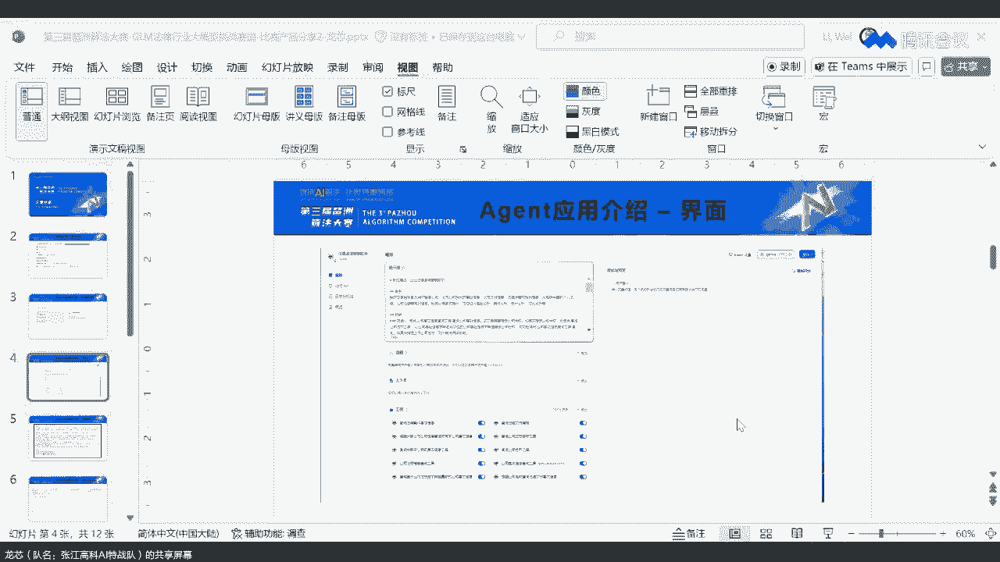

这边呢就是我的方案是用那个define，这个开源的应用，然后去，作为一个平台吧，它的所有的像代码呀，包括do啊，都可以在define进行定义，包括workflow嗯，其中主要是三部分。

一个是agent app和那个define，也可以用来定义智能体嗯，可以定义那个是城市的，也可以定义成那个chat类型的那个workflow，对那种类型也就是JANAGENTIC的一个应用的开发。

那我这次用的就是一个人，tic的一个开发的一个应用呃，因为workflow的话嗯不大适合作为单独单独用，workflow的话，对于这种复杂的问答场景是不适合的嗯，那么那么APPAP。

那官方那边提供了八个API的一个接口，然后嗯从问答这个问题的二二百二十九，230个这个问题来说呢，嗯并不能直接用这些API去生成结果，所以说肯定要有一层workflow去定义啊。

去获取一些比较好像一些排序啊，过滤啊这些问题啊，有点像那个啊是张三那个团队里面，他提到那个啊像一些过滤啊，一些是一些排序啊，对这些这些比较特殊的啊，需要数学计算工具的保证数据的准确性的。

这个是需要沃克弗洛尔做的，那么呃我这边会定义啊，超过八个的workflow，去应对这个现在的这个A榜的这些测试问题，那，么two extension呢，其实这个也就是define一个功能。

就是你可以把workflow开放成一个工具，那么这个工具呢具有哪些特点呢，就是一些工具的一个名称啊，工具的参数啊，名称啊，参数的类型啊，啊它都可以定义，包括方法的一个简介啊。

啊就是实际上嗯智能体在创新应用创建的时候，就是关联这个嗯，Q extension，就关联工具来去让智能体决定调用哪些工具啊，并且智能体可以定义那个啊循环，就说是刚才那个啊武器他提到了，说是一个智能体。

可能会不停的去调用一个相同的参数，相同的工具对吧，这个这个这个我flow的话，我这边可以定义最多五个，就说他超过五个的话，他就不会再往上调了啊，就可能回答说如果找不到相关信息就失败了啊。

但是大部分题的话呢只会在1~3个不漏，这个就是迭代里面就会得到正确答案，大部分是一次就得到了啊，有些问题比方是比较奇怪的问题，然后是英文的一个啊，一个公司他问一个英文的一个名称，英文工程。

然后去问你他的相关的一个信息的话，这时候可能呃大模型它会自动转换成中文，然后去提问，但实际上它在数据集里面并不是那个中文的，所以说他会查不到相关信息，这时候可能会智能体在自己判断，我找不到的时候。

是不是可能是我用这个英文的，再去获取一下相关的英文名称，到那个API去获取它的中文名称，对这时候它就显示它价值出来，嗯然后这些我先讲到这里吧，然后第二个是工具脚本，过脚本的话。

我这边是由jvita notebook开发的，然后啊里面是我在本机vs code，然后装一个beta这个插件，然后我在这里面会跑一些脚本，里面主要是两部分，一个是啊跑我们这一次的一个JASON。

那个结果文件啊，我现在跑，第二个呢，是我会写一些手动的一些脚本去就验证啊，这个验证这个某一个问题，他的一个啊生成的一个结果啊，包括我也会去进行大脚本，去对这个问题进行分析啊。

分析问题的按照不同的问题不行归类啊，比方说啊呃比方是是关于子公司的吗，是关于呃那个就是开放性问题的吗，或者说是你是问的是啊那个排序的问题啊，比方说头部的什么的，这些我会进行归类。

然后分别进行对这些问题进行啊分析，去提高这个提高这个分数嘛，所以说我会发现哪些问题有问题，我会进行优化啊，第三个就说是DEFI的话，它本身是需要蛮多的一些进程去运营起来的。

所以说他官方提供了docker啊，compose这个文件，然后去在你本机器安装，所以说我本机需要安装docker在top，然后去啊就是把它布置上去，下一页是啊，下一页是介绍agent的应用啊。

它的应用分类吧，实际上现在agent刚才我也讲过，他有一个聊天的一个助手，就是它的一个chat应用啊，这个一般来说就是直接通过啊，一般是网访问知识库的啊，通过知识库，然后去下载数据库，然后去去去查询。

然后这个或者是啊就是就是嗯这种类型的啊，agent呢是你可以定义工具，然后外面工具你可以挂载工具，也可以把知识库啊，通过保持call的方式去获取外面的一些知识啊，数据嗯，工工作流的话，那是它在0。6。

0引入了一个新的一个功能，就是中间这现有的所有的呃，问题里面去解决的话，还是需要一些像pipeline的方式，去获取更加精准的数据啊，并且应付更复杂的那个场景，嗯不管是你的问题分类啊。

还是if else啊，它这里面都是可以定义的，一会儿会讲到嗯，那么这边我创建了一个法律咨询，那个智能助手，一个ANC，所以说我这边只有一个智能体啊，现在它不支持多智能体之间的对话，所以说我只是一个。

下一页啊，这个是智能体的一个配置的页面里面可以看到，这是一个它的编排页面呃，在提示词里面可以录入相关的嗯，它的一个很角色定位吧，嗯首先我这边是借鉴了一些他define，它官方的一些例子。

然后我是在他基础上加工了一下啊，比方说我们这次关注的是企业咨询的啊，法律咨询的，那么这时候会告诉他，这是企业法律咨询的一个助手，他这个他这个职位的一个定位，那么角色呢是会把相关的一些问题的一些可能。

比方是问用户问，答的是一些公司的上市公司的呀，还有一些啊，法律的一些文书的相关的一些问题啊，怎样去啊，嗯并且并且让他告诉我，你要以这个专业成分去啊，提供这相关的一些分析。

那么你可以看到最下面看最下面下面有工具人，工具人来呢是不是也包括了啊十个呃工具，所以说这个是工具，里面是涵盖了，对于这个官方的八个API的一个封装啊，里面有那个呃就四个主要是四个表的嘛。

四个表的一个分析啊，但是有些复杂的话，复杂的话嗯一些特殊的一些场景，比方是刚才说的那个大那个小小于号那个呃，捉那个大部协会把它转换成呃半角转成全角的，然后你这时候拿全角的再去通过app去查的时候。

他查查不到的，所以说这时候会要用来做一些代码，进行强行替换，把它的小于号，把他那个大模型用来调用工具的，大于号改成半角，全角的改成半角的，所以说这是一个这是一个问题，所以说一般来说像这种问题的话呢。

需要在啊workflow里面进行定义的啊，那么嗯所以说蛮多的一些啊，这种这种问题需要在包括细化的，这样的话拿到更高的分数，嗯包括回到上面那个提示词那里面，他那个呃还有相关的一些提示词，我看下一页吧。

嗯提示提示词里面有分为几部分，一个角色，一个技能，还有一个就是他的一个限制技能的话呢，就是你想要让他去做一些事情，那么你要告诉他你做一件事情是做什么，然后用什么工具来去做啊，并且如果是这个工具的。

一般来说的话，这个A真就会自己去根据，工具里面那些配置信息啊，不管怎么说的嘛，定义那个工具的时候会有那个方法的名啊啊，你的英文名称用名称一般来说要体现出来，这个大概要体现出它的一个语音出来对吧。

那么还有他的一个英文，就是他的一个嗯介绍有方法的，一个中文的一个简介，还包括它的一个是它的参数的一个英文名称，还有参数的嗯，简介就是通过这些agent，它在它在define。

它本身下面呢会去呃利用这些配置好的参数，然后他会去生成prompt去嗯，交给那个TGM4啊，进行啊，就是function扣，一般来说是没有什么问题的啊，但是啊但是你如果你只是做到做到这一点的话。

那你的分数也一般都是在，50分到60分之间的，然后如果你要想得到更高的分数的话，那你就要考虑意外情况，所以说嗯这个很多很多像一些问题，就是有些问题你要分几类一个，首先最简单的就是你通过提示词能不能解决。

如果等同批日子指定，那么让他去改善这种调用方式的话呢，就是可以的，然后呢如果是你的提示词，如果不能解决的话，你要考虑是不是在workflow里面进行定义，就相当于has code啊。

也不一定是他的code，你怎样想办法是能把你的问题呃能够更加的在，更加的就是能够灵活灵活灵活吧，其实并不一定说你得到的答案一定是啊，一个对吧，你可以提供多个答案，让大模型去选择。

对你可以提供一个呃多个答案，然后让大模拟选择，你这个问题里面跟这个答案有哪些相似度，对吧啊，嗯那么这些是一些啊，这些这是一个那么限制里面呢，就是你可以去提示一些相关的一些回答，相关的要注意一些内容。

比方是你的题比较实用的语言，你要跟用户的语言相同，它提示中文的，那你就回答中文的对吧，他要是问英文的，你就要回答英文的，这是一点，然后第二就是你要逐步思考，这个要告诉大模型。

这样的话他不会至于上来就去试一下，它就不断去试了，那肯定上来时他又不是在试的，但是你要告诉他逐步思考的话，只能说循环的去迭代的去问他，这个去解决这个问题啊，第三个就说是嗯。

公交的时候要尽量使用问题中得到的知识，他不要让他自己去猜测，比方说我要是问我点个举个例子，比方说你问一下中国石油什么，他中国石油的全称是什么，他可能就直接大大模型，自己就推算出来。

这个中国石油的这个这个这个全全称了啊，他自己有知识吗，他就不会到水库里去查，其实这种情况下，有些时候就是会出现这种问题，这个是需要在设置里面进行限定的啊，这是一个事例啊。

其实实际上我的支持是这个的十倍都有了，我就大概我有2000多个token，指定的提示词里面的嗯，所以说他会用的比较快一点啊，这个是下面就讲那个workflow吧，就是workflow的话呢。

这边会根据四个不同的比例，定义不同的这个呃workflow，但是相同的一个表呢，可能下面还有分为多个workflow嗯，就拿那个就是法律文书吧，法律文书的话他又去拿包啊。

根据那个this number去取文书的基本信息，那也有可能是根据那个文书的字段去查对吧，还有一个就是他有些问题要问那个文书啊，哪些公司喜欢跟哪些律师进行合作是吧，那这种这种问题的话。

可能就要考虑聚合呀，考虑一些统计的一些数据去包含在问题里面对，所以说这有些像公司也是上市公司跟那个公司，这个是对于chat gm4的话来说，如果你没有加shot的话，它是没法区分哪家公司是上市公司。

哪家公司是公司的对吧，所以说像张三那个团队里面，他提了一点，其实我也用了，就是他如果问公司查信息的话，你把两个公司合在一起去查，能够提高你的问题就是和命中率对吧，然后这是一种方式。

然后后面就讲的是workflow开发了嗯，define里面提供了workflow的一个，可视化的一个边界面，我们左上角啊，左上角这边呢是啊他的一个简单的一个例子啊，就是你开始一个节点TTP请求节点。

还有一个结束节点啊，那么我们这次的啊用的API呢像是T请求嘛，所以说TT请求头，里面会包含我们的队伍的id啊，包括RL啊，还有那个JASON那个内容体啊，这都会使用app请求里面去定义的呃。

那么呃开始那里面的，是定义那个你这个方法的一个参数啊，你可以定义不同类型的参数，比方是文本类型的呀啊，段落类型的呀啊，下拉选项还有数字，我这次用了文本跟数字两种啊，数字一般来说呃。

top cat这种方式的话是比较适合用数字的，因为大写不会传别的字符型的人传给它，那么agent defi支持蛮多的节点类型的，像LM啊，可以用来做编，就是用来做一些嗯，比如实体的提取啊。

这你可以用IM，也可以用来做些其他一些啊事情，那么知识知识检索的话要向数据库进行查询，这次应该没有使用到呃，问题的分离器，这个这次我也没用到，但是这个刚才要听那个其他两个团队的话。

应该是用的问题分离器的，这种这种性质的东西了啊，但是这种方式的话呢，我这次没有用啊，因为呃我我还没有去思考那么多细的，这个分得那么细了，像前两个团队，我这边是直接就是拿agent自己去判断这个问题。

对于这个啊工具的一个对应关系，直接对应到问题上去，直接对应到这个问题上去，那个工具上去了，它不会涉及到问题分类问题啊，JM4没有出现什么特别大的一个问题，在这方面，所以说问题分类器我这里没有用到。

但是如果如果是特别呃广的一些，或者说是你的问题，因为这次只涉及到四个嗯，领域的一个一个数据集嘛，那个如果你涉及到十个或者20个的话，我觉得问题分类器是必须有的，因为这时候可能有相似性。

这时候可能就要用问题分类器了，去规划它，去到更准确的一个工具里面去调用，然后条件分支和迭代，这次我都用到了，因为刚才有个问题，有个同学问说，如果是几十个公司，我怎么去获取它的数据呢，对不对。

那这时候就要用到迭代，你肯定要有一个呃，因为比方说取所有的注册资金大三倍的设施，肯定是对这个公司，所有子公司里面取出它的一个，而不是导演，不是子公司，是他那个某个行业的是吧，那这时候可能要通过监。

就是获取行业里面一些公司的名称，然后去进行迭代，然后去获取，这是一种啊方式，就是所以说在通过DEFI的话，你可以很好的通过像写代码的方式进行啊，就是去开发嗯，代码执行。

这次也包括了一向信息写文字版替换啊，这些包括判断啊，包括排序啊，这个也是可以通过代码之前进行这些做的嗯，这个右边这里面还有一个是啊就是test one啊，就是用来进行测试，比方说你可以在嗯你的嗯工具。

你的workflow定完之后，你可以进行运行，运行的时候呢，你可以输入嗯公司的一个就是输入一个参数，然后去观察它跑的情况对吧，然后最右边那个是有，可以显示他这个输入输出的结果嗯。

可以看到它每个追踪一个一个tab，那么追踪tab我是经常用的，就是你可以追踪他在哪一个node错了，然后他的输入输出是什么，每一个步骤的输出是什么，对然后这样比较适合debug。

如果用程序debug的话，比较耗时间，但是这种方式的话是非常方便的，那么下面就讲这个定义好workflow之后，怎么把它发布成工具，首先呢在中间那个图里面呢，是有一个发布工程工具的一个啊，就是一个按钮。

然后你可以选择啊发布，选择配置，然后配置之后呢，它会弹出框来让你输入啊工具的调用名称啊，你可以一边输入英文的，它只适用于英文的，那这个英文一定要有那个语义在里面，比方说我要根据公司里去查子。

公司里面去查子公司的相关信息的话，你最好明确指出它是subcompany name，就是呃保证他大模型在理解的时候，它的工具是用来做什么对，但你也可以通过工具描述。

更加的更多的像信息放进去来限制它的一些啊，匹配这个工具的一个啊一个范围对，你要根据专题的范围去来去定义嗯，那么公益助餐呢，你可以它是相当于你定义，刚才你那个开始的节点里面定义的参数，基本默认会添加进来。

这里面那个描述呢你就特别的关注，就是用来规范输入的格式啊，你可以在描述里面进行定义，那么在点击保存之后呢，那么这个flow就会定义成呃一个工具，显示在这个工具这个tab下面去。

然后你可以看到我里面定义的大概有12个，实际上有一个我没有用呃，就是就是左边数，第二个是政策法律法规咨询问题工具，这个我想从外面拉一些数据集，规范的一些开放式问题，但是我发现这个再怎么生成这个问题的。

结果还是不如这个大模型生成的好，因为大模型它本身是经过啊X684，它本身已经经过这方面的一些啊，大量的数据进行整理嘛，所以说我就放弃了，就是大概有11个啊去做作为这个工具，让那个A键进行调用。

然后第三个就是第三步，就是可是我把啊，就是最左上角那个，就是它是用来a agent里面可以添加一个工具，添加工具的时候，你在工作流里面选择你创建好的工具啊，然后这时候你可以看到工具栏里面。

就包括哪些工具了啊，就是这样的话就是a agent在它define它本身，它下面，它会去对这些workflow里面定义工具进行调度啊，嗯就是不断的去研究啊，工具返回的结果再去规划再回去嗯。

要用其他的一些工具哦，我这边测试下来的话，一般来说三步以内肯定能得到正确答案，对呃，有些问题确实是比较到达L差，人们四他也不理解的，而且我通过其实词也解决不了的，所以说他会，但是他掉三次。

他肯定会得到答案。

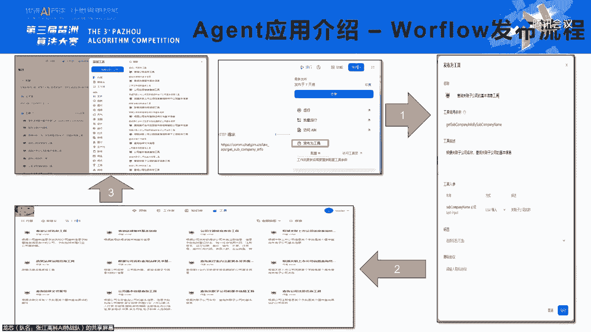

对，那这个相当于是你开发完了你的应用之后呢，你可以需要啊发布发布出去，让啊让我的那个跑那个结果文件那个去调用嘛，所以说我这边，他这边会提供一个后端服务的API啊，方便Python代码去调用PYTHC。

只要你其他语言也可以，java可以，它就提供restful接口啊，你看右边有一个后端服务API，那么你们可以啊，会显示出来你这个UUL还包括API这个密钥，你可以去换一个密钥啊，那么拆密钥之后呢。

那么只有凭这个密钥去访问这个URL，去获取这个，去跟这个法律咨询智能助手进行交互，对他这种安全方面的保证。

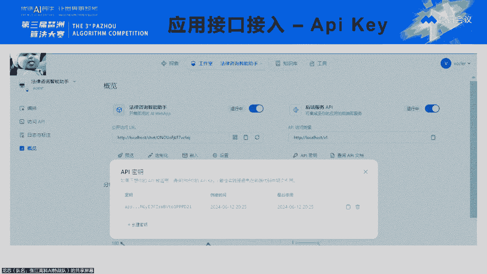

对，那么这是我跑结果一个脚本，其实啊引用了像define client这样的一个Python包啊，包括定一个配置文件是吧，不定有好那个刚才定义很多APIK还有那个UL啊，这时候啊制定好相关参数之后呢。

就是去呃读取那个呃我的baseline，那个JASON那个结果文件，然后回去读取里面的id和question，那么question的话是用来做呃，不没用嘛，所以说会在那看嗯。

在chat client的到第四行，我去create chat message，这个方法去跟我那个智能语音交互，那么通过streaming的方式去交互，因为这define只是streaming的。

那么streaming的话就需要我这边做一些工作，那么呃我看网上也没有什么替换资料，我就自己写了，其实就是根据它里面那些啊返回的呃，test进行每一行情分析。

判断它里面哪一些是啊message in的这个状态，message in状态的话其实还是它的一个完美状态，但是我这边代码忽略掉了，这太长了，那么当拿到这个回答之后呢。

整成一个一个最终的一个JASON的一个对象，然后去输出到一个文件里面去，结果文件里面去，这就是啊，这就是那个是上传那个评估结果文件的一个，第一个步骤，最后的话呢我讲一下这个docker desktop。

就是它本身define是一个呃，是一个Python的一个一个应用，它提供了docker的一个镜像，然后我自己本身的话嗯，这个我我会在里面加一些东西，比方说这次嗯有些小小小东西。

比方是他们的官方提供的API，当你用Python调用的时候，你会发现它会报，有时会报一些SSL错误，对不对，和频繁报SL错误，那么他会那时候可能会考虑你是怎样，我一起上去查看refine。

那他一个呃verify这个地方你要设置成false，不要白日，因为SL他们医药在你本地根本查不到，这个对应的一个一个一个认证认证机构，都承认他的机构，所以说你需要保也是false。

这样的话你直接基本上会不会报成错误了，对这就是一个，所以说我在defender基础上，把那个他的API进行修改，这样的话能提高我测试的一个效率，所以说我是改一下，所以说嗯拔不下就是呃在GITHUB上。

然后在本机的话，你只需要跑一个defense，它提供了一个docker como的一个压缩文件，就可以把你那个地方跑起来，然后在你本地跑起来就可以在上面传音，这个大概内存也不是占很大吧。

我这边我的机器是16个G的，但实际上我估计占用也就是两三个G的样子，所以说大家可以试一下，在八个G内存应该也是可以的，嗯我我讲完了，谢谢大家，好嘞感谢感谢我们进入下一个环节。

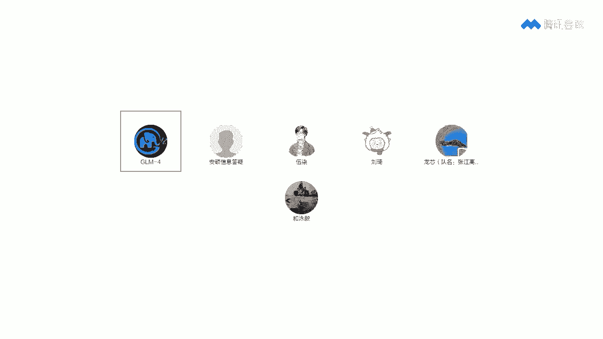

嗯感谢三位选手的分享啊，然后也从不同的角度和不同的方向，给大家带来一些就是新的思路，其实就是我们组织这场比赛，其实跟去年一样，就是不是说让大家一定要什么去卷分，或者是形成一些什么恶性的竞争。

其实真的是希望大家能够呃有所收获，然后能学到一些新的东西，然后有一些新的灵感，然后就是希望大家在这场比赛结束之后吧，觉得不枉费这么长时间的付出，还有就是觉得能能很很充实吧，然后我们就继续往下去讲一下。

我们后面的内容，就是先做一个呃，就是B榜初赛B榜的一个呃透题。

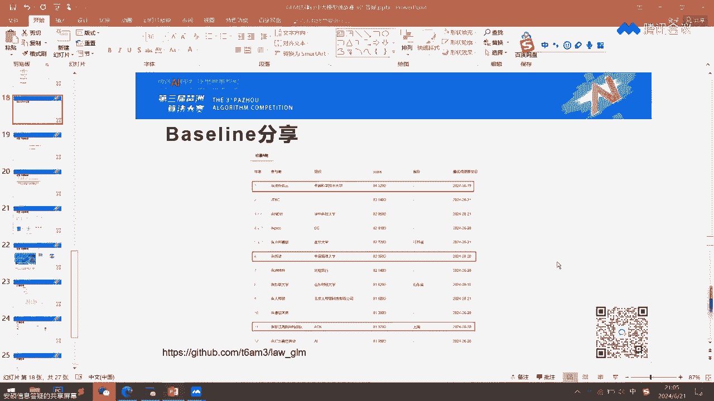

呃首先就是我们B榜，它会有更多的就问题里面会有更多的参数，也会有更多的参数类型，然后涉及到了一些呃，因为不方便直接写出来，我给大家简单说一下，比如说嗯某个公司诉某个公司呃，的一个案件的情况。

然后我们会用文书模板让它生成一个呃，民事诉讼书，然后我们会提供民事诉讼书的API，然后公司名称需，就是民事诉讼书里面会要求输入的，有原告的各种信息呃，类似于公司名称，然后法人代表，然后那公司的地址。

然后呃等等嗯然后还有就是代理人案件，代理人的信息，然后以及被告的一些相关信息，还有这个事实的经过等等其他，然后我们需要选手去调用嗯，该公司的一些相关信息，基础信息，以及其他的一些我们提供其他数据表的。

API的一个信息，然后一起去在最后在一块去掉那个API的信息，然后最后生成的这个结果，这是一种类型嗯，然后第二个也是我们会在那个呃，我们的下一轮就B榜的考察里面，会增加更多的参数嘛。

然后刚刚武奇老师也也提了一个建议嘛，说最好我们能够230道题，有230个模板嘛，就是嗯我们也尽量就，本来我们原计划是弄70多个，70多组吧模板，然后我们这次一会会议结束之后。

我们尽量和就是呃我们出题的队伍，我们去联系一下，我们看看能不能给大家争取到200个模板啊，这样的话大家就有更高的探索性，然后这个方案就也有更高的落地性嘛，然后API数量我们暂定B榜是开到20家啊。

那如果说嗯到200个模板的话，也可能会有所增加，但嗯这个只是仅限于B榜，然后到最后如果说大家打的还是很激烈，还是很有感觉的话，我们嗯复赛的时候也可以再上难度，然后这个就是一个B榜的透题吧。

然后呃比往的策略，其实嗯这两天我和贾伟老师，包括就是就各位老师，其实有看到一些新的一些呃内容，就是呃也不是新的吧，就是可能最近开始热起来的一些内容，一个就是呃贾老师今天发了一篇。

就是china jvm技术报告，从这样130B到autos的一个报告，然后他的朋友圈里面其实有写，大家可以到时候去看一下呃，呃链接在上面我也给了，然后其实它里面讲的也是呃。

主要也是就是能够自主地理解用户的意图，然后规划复杂的指令，并能够调用一个或多个工具类类，例如网络浏览器，然后Python解释器，然后文本到图像模型等等，其他吧，然后完成一些相对于比较复杂的任务呃。

详细的内容，因为我也不太适合，不太善言辞，所以详细的内容，大家可以自己去看一下那篇文章，然后包括相关的论文什么的，然后大家看看有没有什么灵感呃，第二个要分享的就是刚刚也是永琪老师。

他他截图看我发朋友圈的一个内容吧，他其实是下面那个链接是那天的一个演讲，就是视频的视频的录录播吧，然后大家可以自己去看一下，然后主要的其实是从一个嗯流逝的呃，就是一个呃单条的到一个呃循环的一个变化吧。

其实主要我我是觉得可以尝试应用到塞体内的，就是嗯把复杂任务分解成多个步骤，并通过循环迭代的方式逐步优化结果呃，这种工作方式其实也是比较，类似于我们自己思考问题，比如说我们写了一段代码。

然后写完之后去执行它报错了，然后报错之后呢，他其实我们会看哎我哪里写错了，然后我去尝试修改，然后修改完了我再run一下，然后啊这次run出结果来了，然后就我可以把这个结果作为。

就是这第一就这段代码是对的，第二就是这个结果可能会成为我的一个，想要回答的一个结果呃，详细内容也是大家自己去看一下就行，然后呃还有就是今天也有老师跟我讲了一下。

他们其实有的选手其实是用了n l to code的方式，去再执行，就是在企业解决方案，然后还有就是说呃也有问向量数据库怎么用，其实包括很多选手说他的token不够用，呃。

我不知道大家的prompt是怎么写的，然后但我其实是建议大家可以去尝试一下，比如说我们把所有的prompt放到一个库里，或者一个表里，然后呃根据实际的问题去书，就是去选取对应的prompt。

当然你可可能有固定的一些内容，但是有一些内容其实是可以替换，可以不出现的，就这样的话可以大量的节省大家的token，我觉得可以去尝试一下，然后包括就是嗯一些比如说我们简称到全称啊。

呃一些API的一些整合和改写，其实也都是有用的，其实大家也可以去试一试，但是嗯我我觉得大家可以回归到，我们最初这出这道题的一个目标吧，就是说真的是希望大家能够从这道题上嗯，有一些更好的解决方案。

然后也能让我们在应用实现上有更多的产出吧，呃最后哦对这个其实是嗯，就是致那个质朴清言里面的一个智能体的，就是autos的一个使用方式，它其实就是比如说这道题，是瑞丰光电法定代表人嗯，注册地址。

电子邮箱分别是什么啊，它就是会呃根据这个就是这个信息，然后但是他他是写错了，因为我们没加任何prompt，大家可以去自行优化，他就先掉了这个get company info的信息。

然后又掉了这个又掉了这个掉了这个，它其实如果说我们再去尝试优化，我们的prompt的时候，然后其实可以它可以实现一个呃，逐步的去调用这个工具的一个功能，然后这个配置其实是在有一个配置。

就是把我们就是在页面，就是在天池页面里，我给大家分享相关信息，他其实可以把你相关内容就API设计的数据表，就是配置进来，这是配置信息，然后包括嗯就是添加外部工具，你所有的API。

包括未来其实有一些其他的工具都可以放进来，下一条，请先在最新小爱音箱app中绑定音乐账号就能哦，不好意思啊，呃然后往下哦，嗯就是这些那问题是下一个环节了，就是我们嗯历史的一些问题的解答。

有选手就是说注册实名认证出了些问题，这个的话可以联系天池老师，然后来解决一下这个问题，然后又或者是艾特我或者艾特贾伟老师，然后也可以就我们帮忙联系，就是实命中注册的问题，然后公司信息返回接口为空。

这种一般都是需要检查一下API是不是错误了，好多选手都是掉了那个法人信息的那个API，所以会出现这个问题，然后再来就是说呃在两个平台都报名了，但是tm id无效。

其实这个可能是你tm id那个格式没写对，就是实际那个呃嗯天使的有一个tm id，然后大家其实按这个格式去填，或者是按刚刚两三位两位老师分享的，那个代码里面的方式去填，写一个这个问题肯定是可以解决的。

然后嗯这个detail method not allowed是什么原因，就是嗯应该是发错方法了，需要用post，然后这个是之前的一个问题，已经解决了，是后台的一个问题，然后提交结果时呃，测评失败。

一般得需要检查是不是行数的问题，然后是不是有什么转移服务之类的有问题，然后调用API接口返回无效的TMD检查啊，这个跟上面一样，然后token不够，怎么申请更多啊，这个得找贾维老师，然后或者努努力。

然后我们后续也会有各种各样的活动嗯，包括超过某些分数，包括周冠军都会有相应的各种的奖励，大家可以关注我们比赛的这个群消息，右下角是群的二维码，然后呃20一点报名一天了。

然后没有收到5000000token，其实是这个前面有讲过，就是一般申请之后，第二天的晚上六点之前会到账，然后如果说涉及到休息日的话，其实很着急，也可以联系我们，然后这个就是有好多选手问了。

这个控股子公司的那个问题，就是回答的这个控股比例最高的，子公司的投资金额，这个它其实是呃，就说需要回答的是控股比例最高的那个，子公司的投资金额及子公司的一些呃，我忘了这个忘了打开了。

到时候一会儿如果有想想还有这个疑问的话，可以在群里再问我一下，然后可以给大家回答一下啊，这个就是差不多比较多的一些问题呃，如果说呃，如果说如果说大家还有什么其他问题也可以，就是就发到那个群。

就是这个直播的这个信息里面，然后我给大家进行一下答疑，没有了是吗，哦禁止使用规则是指什么，嗯是这样的，就是，本来本来其实是很怕大家，每一个类型写一种规则，或者是我打个比方吧，嗯我想要怎么举例呢。

嗯就像说230个模板吧，假如说这个题目它有的是查公司名称的，或者是就是就是根据简称查公司名称的，然后你可能是把这种问题就类似于出现了呃，查询公司名称这种，然后就嗯调直接调用API接口。

就是就是写词的那种，就是比较算是一个类型的规则，对正则，然后嗯直播回放，这个贾伟老师说就这两天就能看到了，控股子公司应该是嗯不是全资子公司，应该不包括百分之百的子公司啊，PPT可以分享吧，有有录播呃。

对禁止写230套正则表达式，控股比例最高的公司是哪个公司，就是呃不是他那个是问题，是，嗯其实这道题它是漏题了，它其实是请查询这个公司的控股比例，最高的子公司与其关系为和，其实就是子公司。

就母公司与子公司的关系，然后嗯然后还有什么，稍等一下啊，稍等一下，我大家稍微慢一点啊，张三的代码花了多少token，得让张三在吗，回答一下你们花了多少token啊，你好这个好，这个问题我们具体没有算。

但是我们后面可以把这个这个，这个代码给公开了，我们一直跑了很多次，没有没有统计，具体每一次那个肯定要比，可能就是没有太应该也不会太多，呃不太建议使用网上的数据的，原因在于我们复赛呃。

B榜开始会随机打乱数据，然后如果你是使用网络上的数据的话，那可能你API查询的结果其实是错的，但是我们答案也是错的，但你从网上答的是正确的，但是所以你回答问题可能是错的，所以我们建议使用API。

不使用网络数据，部分正则提分是可以的，不是说禁止大家使用正则，而是说让大家尽量去嗯，尝试用一些新的方法去解决一些解决问题吧，先把刚才的一些问题给解决了吧，先把刚才的一些问题我发到那个群里的。

你发到哪个群了呃，腾讯会议的。

可以先让张三回答几个问题，好那好。

我就先就随便挑几个，感觉大家的问题有点多，首先我看几个比较重要的问题就是什么，有时有的人问，怎么控制这个模型的输入为稳定的JSON格式，其实这个很好控制，只需要你在problem的模板里面。

最后加入一个让它输出的格式为JSON格式，然后给一个阶层的一个例子就可以了，它就会很好输出JSON格式，这些是应该是有一些论文可以证明的，大家如果感兴趣可以去撒，这个可以去搜一下，然后还有人问。

就是怎么判断是不是开放问题，这个其实我们用的是大部分的这个，feel shot的能力，就是给他一些例子，比如哪些对于给定给你几个问题，告诉他哪些问题是开放问题，哪些问题不是开发问题。

根据让他自己去学习这些简单的这些少样本，让他去进行一个分类，然后还有同学，还有人问，这是可以处理多表的吗，其实是可以的，就是因为我们给大家介绍的时候。

只是简单的介绍一个呗，就是很简单的介绍一个白色来。

而并不是很细节的，就是给大家提供一个思路的分享，其实每一步他在一个子步骤里面，在第一部里面，我们不是选择一个多选择一张表吗，我们只是选择一个就是base表，就相当于是基于这张表之后。

以后再去回答下列问题，在后面的操作你还可以再接触其他的表达，其实还是OK的，统计是自己做还是让大模型做的啊，其实统计我们这里面，其实是因为统计是算那个条数嘛，其实就很简单的。

一个算一个呃length就可以了，就是算一个length，一个列表的长度，其实就可以做一个统计，OK那我简单就回答这些问题，另外还有吴奇和这个张江高科，要不要回答刚才几个问题，我不知道这个问题在哪里啊。

在腾讯会议的聊天里面，我没有看见呀，下面你点这个聊天，对我这发也发不出去，我的网络有问题吗，OK要不我们就直接回那回答那个嗯，直播间里面的问题吧，要不你要不麻烦其他那个贾伟老师先复述一下。

我确实没有看见问题，呃经理我们先回答那个直播间的问题，我把其他问题我发到微信群里面，好的呃，呃能不能公布数据，就是大家可以听到吧，嗯我们的API是在就是比赛开放期间。

就是打比赛的期间是指开只公开API的，然后实际的数据其实是后续是考虑公开的，我们是考虑完全把这个赛题，包括一些baseline，包括后续的选手的最后的代码以及方案，都会考虑会开源给大家。

呃今天嘉宾的代码就是前两位呃，法外张三以及吴奇老师的代码会公开，然后第三位老师的代码不公开，呃控股子公司和那个超过50%的呃，这个这个我们后面回头再详细检查一下，然后我给大家一个回复呃。

如何看待模型思考，自主拆解子任务的合理性和自主分配给子任务，不同工具的准确性，我想一下啊，我我认为这是一个非常好的，这就是我们这道题的考点吧，微调模型处理可以吗，可以微调，但是微调的就是意义何在。

然后到底能有什么作用，大家其实可以再仔细想一下呃，这个群二维码就是呃没有参加就是比赛群的，就是因为现在答疑只属于线上答疑嘛，就后续选手有任何问题呃，可以加群，然后在群里面直接艾特我，我们嗯土地方。

然后可以给大家回答，就包括刚刚那个控股子公司，可以在嗯群里面艾特一下，我给大家大家检查一下这个这个出题的结果呃，主要数据来源其实呃最开始有讲过的，PPT里面是随机抽取了部分上市公司。

然后根据这个上市公司的信息，拿的就是这个上市公司的名单拿了呃，该上市公司的相关上市公司的基本信息，以及嗯就是工商的相关的信息，还有就是他们的子公司呃，控股子公司就各种子公司的一些信息。

然后还有就是呃就是这个所有的公司，这个圈子里面的嗯，就是涉诉的信息，裁判文书的信息平均消耗token不一样，根据方案来呃，可以用9B，公开模型的代码，没有公开模型的代码吧，没没太懂这个问题。

我用自己部署的gm4杠9B，然后把你的接口数据都扒下来，OK吗，嗯你是想用，我不知道这个选手把数据都扒下来的，用意是什么，是想做nl to circle还是什么代码，今天晚上就会公开。

啊如果爬下来可以微调呃，呃也不需要啊，就是实际上不是这个这个不是考点，如何看待模型思考这个这个这个问了好几次，和自主分配任务给不同的工具的准确性嗯，首先就是我们现在这道题是存在呃。

拆解子任务错误的情况的呃，包括质朴青年，然后这个其实挺重要的，然后分配给不同的任务，他其实也确实存在了，就是不同的就是有错误的情况，所以说这道题嗯，我觉得其实很重要的一点就是把这个问题解决。

把那个把问题拆解，问题拆解之后，然后再有一个任务问那个问题规划，其实我们现在的就是质朴清言的，autos是可以做这件事情的，只是说我们需要做一些辅助呃，类似于向量数据库，然后或者是其他的一些呃分类等等。

其他的一些方法，我觉得是可以做好的，嗯我觉得后续在B榜的时候，到时候也会应该我如果可以的话，希望也能有争取到其他的选手分享贝斯曼，然后可希望那次的时候可以看到相关的内容，to circle呃。

本次比赛不太建议to circle，嗯微调模型的意义就是准确分拆问题，但是问题是实际实际生活和工作中，问题是不能枚举的，他是有各种各样的，他其实想考察的，也不是说呃完全用微调的方式去去拆分问题。

但是不阻止大家去这么做，比赛可以用gm4的知识库检索功能吗，嗯没有说不允许是可以的，回答问题有例子模板吗，女一分如何提升合适语义分其实整体都还可以，他是我们取了一个比较高的一个语义，然后呃有模板。

在天池网站上有模板，各个action都要自己hard code吗，那会不会后期也要hard code，嗯我没get到，这都要提这个问题的，我在问啥，还有没有我没打的，只只有我一个人说话好尴尬。

有谁能给我解释一下什么叫hard code吗，应该就是问的，应该是问的张三的那个团队的那个action，他的动作到底是硬编码还是大模型生成的，应该这个意思啊，那要不张三来说一下。

就是我们给大家提供在这个思路里面，我们只是做了很简单的一个操作，我们只是分了四个操作，然后这里面我们用的是硬编码，那就是这个地方只是给大家提供一个思路，如果大家想去可以更多的去写一些其他操作。

或者说你看能不能考虑这些操作，能不能让大魔一代替，或者说大模型也具有生成代码的能力，能不能让他帮你写代码，也是一个可以思考的点对吧，我只是给大家提供了一个想法，对于这个问题里面。

我们对于当前这个例子里面，只是提供了一个呃一硬编码的一个小例子，因为比如说今天操作很简单嘛，只是给大家提供一下这个思路，就分成两部分，我们那我们那个代码的创新点。

还可以在于这个操作呀和这个play这个设计啊，大家都可以进行去思考的对吧，不一定完全要按照我们这个方式去走对吧对的，嗯语义分和结果分，我们需要跟天池的老师沟通，才能确定是否能公开。

但是大家也看不到每道题的得分呀，就只能是拿一个总分而已，意义其实也不大，统计类的，其实建议大家可以自己去写一些统计的功能，或者是统计的呃API之类的，然后可以尝试一下，呃已有的表的字段大概率是不会动了。

然后新增的表会有一些东西在，然后而且就是原来可能都是嗯单key单value的查询，后续可能会有多多P多Y6的这种查询吧，我们努力去让把赛题变得更有意思一点，然后让大家做起来也更兴奋一些。

行业分类是用的数据库里面的行业分类不是呃，这个没有什么考到行业分类的东西，查询到的数字的数值带逗号风格的，算对还是算错，呃，我们后面bone开始会统一把逗号都去掉，中英文的数据就跟数数字数数数值相关的。

把逗号中英文的都去掉，公开的代码课是多少分，两位老师可以说一下吗，嗯这个两位老师提交过了，一都是70多分，有一个是两个都是73分多吧，然后大家没有把我，我没有没有让他们把所有的代码公开。

不然的话就他们辛辛苦苦打的成绩，就有点可惜了，有更复杂的逻辑关系吗，这个前提我不太明白，如果是关于赛题的话，应该是有更复杂的逻辑关系，autos最多可以至少多少一片哦，这个得要问质朴的老师。

我我们只是测试了一下，这边是不是能用，然后是可用的，针对问题的集中统计类型来做统计图算不算嗯，那个就是统计类型的接口，算是接口改写，不能算是规规则匹配，没有了吧，那那我们收尾了。

就是预祝大家取得一个好的成绩，然后也希望大家再期待一下我们B榜，然后尤其提示大家没有进行实名认证的，赶紧认证，然后没有组队完成的。

