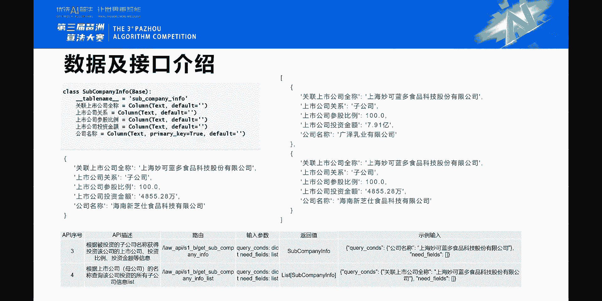
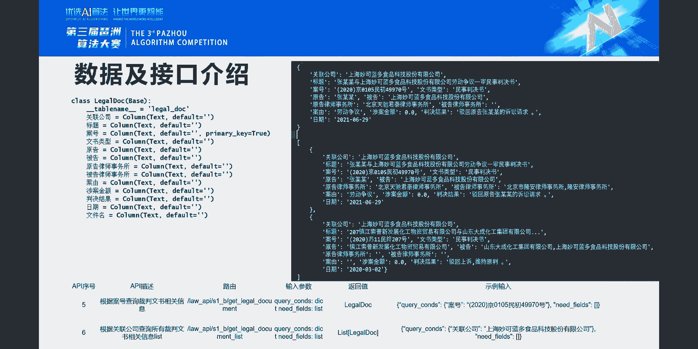
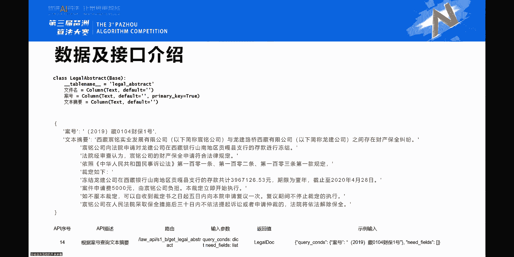
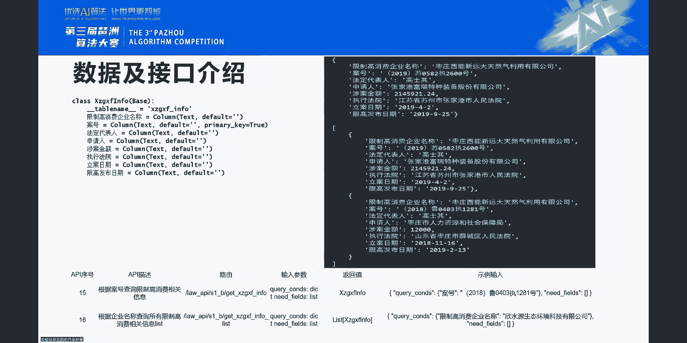
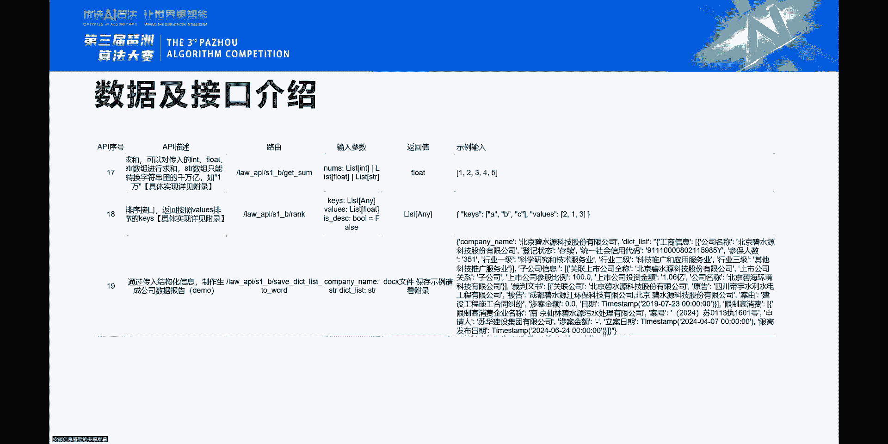
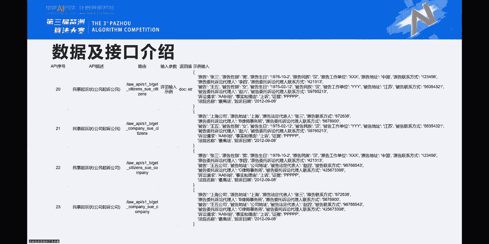
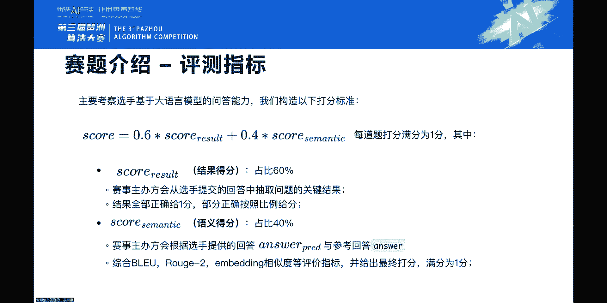
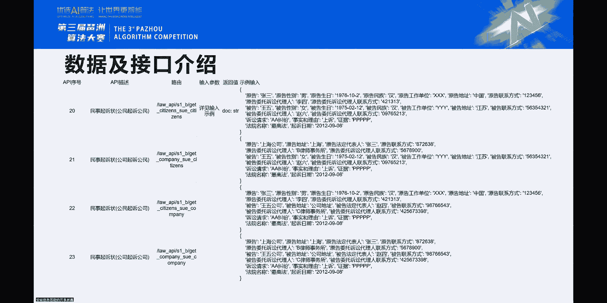
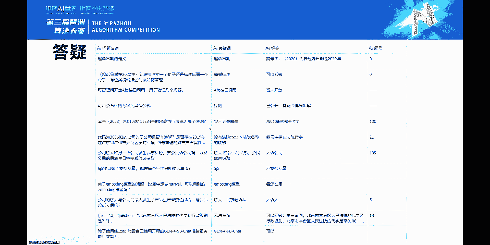

# GLM法律大模型挑战赛 · 初赛 B 榜解题思路（答疑） - P1 - ChatGLM - BV1k4421U78c

每个赛区的前十名会去进晋级复赛，然后最终我们也会有结合所有选手的表现，然后去把这个方案再灵活调整一下，然后最后的复赛名单将于7月22日公布啊，大家也不用特别呃纠结某一道题，两道题嗯。

因为我们也可能会留一定的空间，就不会说卡的那么死，一定会说是呃让就是呃努力去参加的，然后有对这个赛题也感兴趣的人，我们会尽量嗯多给一点的空间，然后放大家进来，就所以说嗯嗯就有些题目就不用特别较真儿。

就真的是不太好答了，我个人也觉得有的题确实不太好答的，就可以直接过，就先解决大片儿的问题，然后就我先先简单介绍一下，我们这个初赛B榜的这个数据数据数据表吧，就是我们一共用了13个表。

就第一个表示上市公司的基本信息，它取自就是嗯上市公司的一个，随机抽的一个名单，然后根据这个名单，然后我们抽取，就是拿那个获取了他的上市公司的相关信息，类似于嗯法人啊，总经理啊，董秘啊，然后联系电话啊。

联系地址啊等等其他的，然后第二个表是公公司工商账面信息表，然后呃有有一点回音，麻烦关一下话筒，嗯工公司工商账面信息表，就是这个表呢其实是嗯来源于我，先讲第三个表吧，第三个表其实是上市公司。

投资子公司的关联信息表，其实是我们先从上市公司，就刚刚第一个表的那个名单，然后去掉了他的所有投资的子公司的信息，然后把这个投资比例，投资金额，然后以及嗯这个投资公司的那个名称拿了出来。

然后这个是第三个表，然后相当于把第一个表和第三个表，所有的公司的信息汇总到一起，然后我们就调了公工商的信息表，然后就包含了就是他在那就是工商注册的那些，账面的信息，就非常详细的一些公司的信息。

然后第四个表是法律文书信息表，然后也是基于就是这个母公司和子公司，这个公司清单，然后去我们去调了裁判文书的相关信息，然后也是只抽取了其中一部分，就没有拿到，全部就是随机拿了一部分。

然后这个里面它就包含了一些暗号啊，然后案由啊，然后原告啊，被告啊，嗯然后还有一些就是原告律师，被告律师等等其他字段，然后再下一个表示法院基础信息表，它其实是一个法院的名录，就包括了法院的名称呃。

这个其实是法院的标准化的一个名称，但是实际上它呃会有很多种叫法，这个回头再给大家详细讲解嗯，然后包括他的地址啊，联系电话啊等等其他的一些基础信息，然后再下一个表示法院地址信息带字表，它其实是一个嗯。

嗯就是他他其实是一个比较比较重要的一个表，因为它有带字，就是其实大家都在纠结这个为什么，我知道这个法院这个这个案件的暗号，但是我不知道他的法院是什么，其实在暗号里面，它其实有一部分信息就是法院的带字。

它根据这个代字是可以关联到他这个法院，是哪个法院的，因为这个带字是唯一的嘛，然后再往下是律师事务所的信息表，这个也是个名录，然后是我们选取了一部分的律师，事务所的一个信息。

然后再下一个是律师所事务所业务数据表，我们取了某一年的，就是律师事务所服务上市公司的信息，然后后续的话就也会增加到就是呃，因为这个只是取了某一年，我们也可能201920，202021222的。

就是我们会把这些数据都放进去，对不对，就是在复赛的情况下，然后再下一个表示通用地址省市区信息表呃，就是我们我们其实大家应该都用过一个接口，就是我输入地址，然后我想获得它的省份是嗯省份城市区，然后区县。

然后呃街道，然后什么路什么多少号什么之类的，就是有一个这种这种输出嘛，然后他它其实就我们是把它这个信息，做了一些简化，所以就我们现在就是只拿了这个通用地址的，省市区，然后这个这是这个表的功能。

然后再下一个是通用地址的编码表，它这个数据是来自于呃，然后里面就包含了就是每一个呃那个省份城市，然后区县街道，然后社区的一些编码，然后我们也是简化了一下这个问题，就是只取了嗯，就是省市区的这个编码。

然后再往下是一个天气数据表，天气数据表其实是根据嗯我们生活中，就比如我哪天，然后这个城市是什么，然后这个就是省份是什么，城市是什么，然后我去去取呃，这个这个地方的天气的这个温度啊，最高温度，最低温度。

然后湿度啊等等其他的，然后再往下一个是文书摘要表，其实这个是基于一些，就是NLP的一些功能去开发的一个接口，但是我们只是说模拟了这个场景，然后我们实际是没有，就真的去掉我们自己的接口了。

因为就为了保证我们能验证这个赛题的答案吗，我们就直接嗯就是选了一部分数据，然后固定了他的答案，然后就是根据暗号作为输入，但其实是根据裁判文书的全文作为输入的，然后但是其实我们这次也是简化了问题。

就把暗号作为输入，然后回答就是关，针对针对某一个裁判书或者某一篇长文章，然后给他一个就是呃文书摘要，然后最后一个表就是限制高消费数据表，它其实是跟文书数据表就是比较接近的，就文书信息表。

它其实就是呃只是说它是一个比较标准化，格式化的一个数据，就没有那么长的文书字段，然后所以他就是但这两个它共同一点，就是都是以暗号为核心的一个关键节点，然后整体就是这个就是我们所嗯就是必备档。

所涉及到的所有的数据表，然后后续然后有什么大家有什么问题，有什么疑问可以在呃结束之后再跟我们再讨论，然后接下来我就详细讲一下，我们每一个数据表的字段，然后及它的接口设定哪些接口。

然后包括它的有这个这个这个接口，都有哪些东西嗯，第一个数据表就是上市公司的这个信息表，刚刚也介绍过了，就比如说嗯，我们下面这个是API的一个调用事例嘛，然后我的输入是上海呃。

妙可兰多食品科技股份有限公司，那我通过这个输入，我拿到的是这个这个信息，因为有的字段过长，我就直接点点点了，然后可以看大家可以看到就比较常用的信息，有公司名称，公司简称，然后还有呃公司代码。

其实这个就是股票代码，我记得有选手有问过，就上市公司的公司代码，股票代码其实都都他有很多很多证券代码，就很多很多叫法，就是反正统一就都是这个唯一码，然后嗯下面，然后法人代表也叫法定代表人也叫法人。

这个就叫法也很多，然后总经理，然后董秘，董事会秘书，然后等等都都可能，然后都都有可能就是换别的叫法，然后注册地址，办公地址，然后联系电话，然后电话就是这个这个这个叫法也非常多，然后传真官网电子邮箱。

然后入选指数主营范围，经营范围，机构简介，每股面纸质发行的一些情况，就是这个就是这个接口的特点，就是说我们其实输入可以为嗯公司名称，公司简称和公司代码，就是三个都可查，就比如说我输入妙可兰多。

我也可以查到这条信息，我输入上海妙可兰多食品科技股份有限公司，也可以查到这个信息，我输入600882也可以查入这个查查查，查出这条信息，就大家到时候回去也可以测试一下，然后就是可以可以注意一下的。

就是呃我们这个表里面有一些地址，然后我们又有一些地址的信息表，就是根据地址拿省市区，大家就可以就觉得哎这个地址其实是不是可以，就作为一个出题点或一个答题点，就大家要关注一下这个点。

然后包括其实还有办公地址也是，然后注册地址都是嗯对，然后我们再往下嗯，第二个表就是上那个就是工商账面表，这个工商账面表，其实它它跟上市公司经济表有很多接近的东西，就是只是说它有一些字段不一样。

我们已经把这个表非常非常简化了，就是第一个就是，首先这个里面它包含了上市公司，以及非上市公司，然后第二个就是说嗯这个表里面，它其实嗯就是的有一些字段是跟那个表的字段，是嗯相同的，但只是叫法不一样。

然后但是就有的是不同的，就比如说同一家公司的企业地址，和他的注册地址可能就不一样，然后然后他的法定代表人和法人可能也不一样，因为我们取的是呃，一个就是某一个时间点的，上市公司的一个所有信息。

也是某一个时间点的一个工商账面信息，但它其实都是一些变动的信息，所以可能存在不一致的情况，就是如果问题中涉及到了，就比如说让你查嗯工商表里面的法人，那你就去调呃这个表。

那如果说他让你查上市公司信息里的法人，那你就去调那个表，那如果说这家公司它根本就不是上市公司，那就直接不用调嗯，那个表就直接掉这个表就OK，或者说调到那个表也不会得到结果，然后调这个表才有结果。

然后再或者就是说两个就都答，比如说就是某我，如果说他就是问题里面根本就没有描述清楚，比如上海妙可蓝多食品科技有限公司，他的法人是谁，那以我我我的建议，其实就是说我两个口都调，调完之后，我就回答。

上海妙可蓝多食品科技股份有限公司的，在工商信息表里面查的法定代表人是这个柴秀，然后在呃那个工商信息表里查的也是，就是上市公司表里面查的也是查修就可以，是就是这样去答题，就这样子，你至少正确答案是答到了。

你就不会说出现那种就是漏答的情况，然后就导致失分嘛，啊这个里面其实也有企业地址，然后这个地址也可能会关联到某些信息，那我继续往下哦，等等等啊，刚刚这个呃里面就是有两个接口，然后一个接口就是说就是根据额。

第一个接口是根据工工嗯，公司名称去查所有信息，第二个其实是就是加工过的一个接口，就是我只能输入是统一售后信用代码，因为这个是唯一的，所以说就是我们存在这种查询的情况，然后我们故意就是就是为了做一些串联。

然后给故意难为了下，大家就是把统一社会信用代码这个接口，它改成了只能统一社会信用代码输入，然后输出只能是就是这个公司名称，所以你可能涉及到一些就是比如说呃某某某呃，嗯就是统一社会信用代码的。

就比如说9137000016，4102345T的呃，公司的企业地址是什么，那其实你就比较麻烦了，就需要第一步，我先得去呃，调下面这个接口，就是get company registered name。

然后去拿到上海妙可蓝多食品科技有限公司，然后再根据这个上海妙可蓝多食品科技股份，有限公司，再调他两个两个表的地址，就是上市公司以及这个表的地址，然后如果他不是上市公司，那上市公司调不出来结果。

然后如果他是上市公司，上市公司那边还有地址，就整体就是这个样子的好，我继续往下嗯，下面这个表示就是子公司与母公司关系表，它其实第一个字段它就是这个上市公司，就是上市公司的这个名称。

然后第二个字段就是上市公司与这个查询的，最后底下这个公司名称的关系，这个是最后一个，其实是子公司，我们就故意把这个字段名叫的比较隔路，原因就是让大家去写那个的时候，看看大家能不能就是想想办法。

能让它大模型去理解的时候，能够更就是智能一点，但其实说嗯就是它俩的关系，就是母公司，就是第一个字段是母公司，最后一个字段是子公司，然后呃参股比例就是上，就是母公司投资子公司的，稍等一下，我家狗在闹我。

我先处理一下，实在抱歉呃，我继续讲呃，就是呃母公司投资子公司的参呃参股比例，也就是投资比例以及它的投资金额，然后左边这个事例就是关联公司，就是这这一单条的这个事例，它其实就是第一个接口。

就是呃根据就是子公司的名称，去查它这个子公司被哪家母公司，就被哪家上市公司投资，然后投资的比例和金额是多少，这个是就是第一个接口，然后第二个接口就是下面这个接口呢，就是说我通过查就是某个上市公司的信息。

然后我想知道他投了哪些子公司，它就是一个list的一个一个返回的结果，所以就是就是这两个的结果就是这个样子的嗯，然后往下，呃我想问一下，就刚刚有人跟我反馈PPT没有动。

大家能看到我正常显示的PPT吗，能哦好的，那我继续，然后这个就是这个接口，这个接口是就是嗯我们的裁判文书的一个，接口数据，然后他就是关联公司，就是我通过某家公司去查他所有的涉案信息。

这是关联的公司的字段，然后标题就是这个该案件的一个标题，然后暗号是唯一的，就是某个暗号情况下，然后到底是怎么样的，就我知道大家其实也应该有的人了解过一些，就是关于诉讼或者是裁判文书的信息。

它可能会有一些案件串联的情况，他就比如说嗯，第一我们现在显示的这个2020京0105，民初49970号，它其实这个暗号可能会出现在某些呃，裁判文书的正文里面，但它不会是他的下一个暗号。

因为是它可能是再审啊，或者是在什么时在终审啊，或者是什么之类的，它会有暗号的变更，所以这个暗号是可以做唯一的，然后去查询它的结果的，除非这个数据是重复的，然后嗯再往下文书类型，文书类型。

它其实这个显示的比如是民事判决书，它其实有民事刑事，然后还有执行，还有其他各种，然后原告被告大家都比较了解的，就其实实际情况下他的那个呃身份有很多，就是嗯原告被告第三人，案外人等等。

其他就而且叫法其实也有很多，就比如原告可以叫他嗯申请人，上诉人，然后嗯申请执行人，然后等等，其他就是这个就关于原告的叫法有很多，所以说就是大家去做题的时候，可以注意一下这个东西。

然后被告的时候就是被诉人，被申请人，被执行人，然后被什么什么人就就也有很多嗯，然后再下面就原告律师事务所，被告律师事务所，这个也就比较好理解了，就是呃原告所请的律师的律师事务所。

然后被告所请的律师的律师事务所，然后案由就是嗯就是关于这个案件的一些，就是到底是关于哪方面的一个事情，然后涉案金额就是这个案件到底涉及了多少，多少金额，然后最后怎么样判决。

结果是就是大概就比如这个判决结果，驳回原告张某某的诉讼请求，就基本上等等等点点点其他，然后日期就是哦我要讲一下这个日期，我觉得哦我因为我除了考点，就嗯关于暗号的这个日期，就比如括号2020。

它就是代表2020年的某个案件，就是他的2020年起诉或者是申请，或者是正式立案的某个案件，但是他的审理日期可能是在2021年，就比如他的立案日期是在2020年底，但是他就是2020年。

他并没有正式的审理，那他其实可能最后的他的这个日期，就这个其实是一个审理日期，他就是文书里面的那个审理日期，那它的日期可能就是在2021年，就这个事例它就是一个比较明显的。

就是我的审理日期是在2021年，但我的立案日期其实是在2020年，就大家一定要把这个两个日期区分好，然后刚刚也提到了，就是到底什么是那个法反应，那个带字就是这个精0105，就代表一个法院代字。

那根据精灵105，其实我就能查到这个案件，到底是在北京的哪一个法院去审理的，然后他是一个民事的初审，然后这是49970，就代表第44万9997，970号的那个案件，然后这两个接口大概的就是第一个接口。

就是我通过暗号去查，因为它是唯一的嘛，所以我通过这个暗号可以去查它呃，整个这个案件的相关信息，然后最最后这个下面这个接口呢，那就是说我通过某一家关联公司去查，这个跟这个关联公司有关的所有的信息。

当然有的时候可能会出现，他就又不在原告里，又不在被告，那这种情况是可能存在的，因为我们少了很多字段嘛，就比如说an外人啊，第三人啊等等其他，所以说当我如果没有特指他，就是是作为原告和作为被告的时候。

只是说他就涉案的总金额是多少，那就都打就是算进去，那我如果说就特指他是在原告中或在被告中，就就是涉案的金额，那我们就只考虑他在某某个情景下的那个金额，那我再往下，然后嗯下面两个接口其实也就比较简单了。

就是嗯一个是court info，一个是cot code，就是court info和cot code，其实很多信息也都是比较接近，但是它存在的有一点区别，就在于它可能就是发布的渠道是不一样的。

就靠info其实是取自于他们的名录的一些信息，就是这个法院到底是谁在负责，它的成立日期是什么时候，然后它的地址是什么，联系电话是什么，官网是什么，就类似于你百度去查一下，这个法院的一个基本情况吧。

然后嗯下面这个带字呢，就是说呃一般都是这个是国家规定的一个，就是每一个法院给他的一个额定的级别的，有什么高级人民法院啊，有什么法院啊，就是有市级，有有最高法什么之类的，就是不同的级别，然后基层法院。

然后这个反正带字就是我们的输入嘛，就我们通过这个基因0108就能查到，这个是北京市海淀区人民法院，然后或者说我们通过北京市海淀人民，海淀区人民法院，我们能查经0108，就是其实有一些呃。

如果说大家打的非常好的话，我们未来其实也可以再设计更有意思的接口，然后给大家去做一些统计的一些呃游戏，但如果说大家已经现在压力很大了，那我们就不敢不敢再出更更更难的题了嗯，然后这个就是这两个接口。

然后这个对应的也就是这两个接口的功能啊，律师事务所的这个信息其实也都有比较类似，就是跟刚刚那个法院其实比较类似，就是第一个律师律师事务所，就是也是类似于它的一个名录的信息，就比如说我有一个电话名录。

然后他大概就是某个律师事务所的，一个电话是多少，然后他的负责人是谁，然后呢，他这个律师事务所的级别，就是注册规模规模怎么样，然后他的他成立多少年，然后他的地址电话呀，邮箱什么似的。

就是然后他是哪一个登记机关去给他登记的，然后所以说就这个是就是律师事务所，名录的一些信息啊，下面这个其实是就是一个律师事务所，我刚才也讲了，就是投资就某一年，然后服务上市公司的一个情况。

就比如这个是国浩律师集团事务所有限公司，他当年的业务排名，业务业务量排名第一，然后服务上市以服务已上市的，就是已上市公司是115家，然后报告期间所服务的上市公司，违规事件发生了22件。

然后报告期所服务上市公司，接受立案调查的次数是三次，就是这两个接口的功能，然后再往下这个表，就是这两个接口和两个表，就是关于地址的，就是也跟大家讲过了，比如我输入某个地址，然后我让他去解析省市区。

然后我也是讲了，就我们做了一些简化，我们现在把那个街道啊，然后路啊多少号啊，包括楼啊，栋楼层啊什么之类的，我们都隐掉了，就只留了一个简简简要的信息，然后再往下面这个这个数据是就是关于呃，我根据省市区。

然后我去查它的区划代码，其实这个这个代这个这个接口，其实我们也是做了简化的，就是我们只固定了省市区去查区县的代码，我们其实也可以固定，就省市那个省份和城市去查城市的，然后也可以固定就省份。

城市区县和街道去查街道的，就是等等其他的，然后再下面这个就是关于天气的信息，就是我们根据的输入就是日期省份城市，然后去呃返回所有结果，就是天气温最高温度最高最低温度湿度啊，这个接口就刚才也讲过了。

就是一个嗯摘要的一个接口。

然后这个就是限制高消费的，就是大家可以看一下这个字段，就有暗号，然后也有就是限制高消费企业名称，就是那个涉案的那个企业名称，然后上年金额就是他被限制高消费的一个金额，然后这个立案日期是多少，是哪个时候。

然后限制高消费发布的日期又是什么时候，然后这个执行的法院是哪个，就大概是这个样子啊，这个也是就是我通过暗号去查，就是单挑，然后我通过公司名称去查，就是多条，然后再往下就是这个get some和rank。

这个本来是就觉得大家，因为初赛A榜打的太棒了，所以说就是觉得可以让你们承受一些压力，然后包括我们其实也设计一些get some的一些功能，但是就是由于时间有限，也没有完全开发完成。

但是我们可能呃就所以说就也没有，也就从现在开始，也不是特别强制大家一定要调，或者就调这两个部分，因为我知道就我们的单位是不统一的，然后包括很多嗯，就又是有港币呀，又是有什么加币呀，然后还有什么日元。

美元什么之类的，欧元都有，所以就是就是这些信息也暂时给大家去掉了，但是真实场景下其实还是需要这个功能的，所以说就后续吧看看情况，然后我们再根据大家的，就是成绩的体现和大家的这个激烈程度。

再决定我们是不是要继续优化这部分的功能，然后再往下是这个排序的，也同样了，就暂时也不强制你们去调用了，然后这个结构化报告是这样的，其实我们这条这个比赛其实有一个可以指，就是往下推的一个场景之一。

就是我们可以通过一家公司去生成，它的工商信息，上市公司信息，以及他投资的子公司的一些信息，然后以及它嗯，就是呃母公司及子公司的裁判文书，就涉案的信息，甚至甚至说某年涉案的信息。

或涉案金额不为零的这一个列表，然后再往下就是他限制高消费的信息，包括子公司限制高消费的信息，就可以整体表现出，我想知道这家上市公司到底它有多少，就可能本公司还好吧，但是他可能子公司就有问题。

或者说很多子公司有问题，就我想通过这个报告去看这些东西，所以说这是我们的嗯，就是最初最初始就是设置的场景之一，但是因为我们我们人力也有限，所以就我们开发的这个接口，可能就是稳定性也不是特别强。

但我们希望就是说我给大家展现的，就是说，我们将来可以真真正正应用到这个场景上嗯，嗯包括就是比如我还可以再加一些，就是现在只有表格吗，我还可以加一些图表，统计完了给加一些描述。

就比如说我总结就是我刚刚上面这一段文字，就这这个图表了，我可以做一些总结总结我这个公司呃，我大概涉案的情况是怎么样的，子公司涉案情况是怎么样的，然后限高情况怎么样的，这个公司是不是有风险啊什么之类的。

就类似于这种，嗯再往下就是这个几个起诉书目。

起起诉状的模板，就其实我们模板有很多，就除了起诉状，还有什么硬诉状呃，不不叫叫叫什么答辩，答辩状还叫什么，我忘了名字了，但是很多，然后我们也也在纠结到底怎么去设计这个场景，因为有的时候就是呃。

虽然我们数据大部分都是公司嘛，那我们其实实际场景中就有公司起诉公司，也有公司起诉人，也有人起诉人，人起诉公司各种情况嘛，然后因为涉及到人和公司的时候，他要求的字段就是呃，中，是不一样的。

所以说我们就就就是就直接写了四个接口，就是包括就是我们的人的信息，就是选的就是呃上市公司的人的一些，就法人的一些信息，然后公司就是直接调的公司信息，然后按照这个模板去套，那还可以试一下。

其实这个还挺有意思的，就就是不用以答题为答题，就可以稍微玩一玩，然后也可以给我们一些优化意见，我们也非常欢迎，哦接口和接口和数据的这个这个接口介绍。

就是还有数据表的介绍。

就到这就到这里，然后我给大家说一下，我们测评指标，就是其实我们的测评是根据就是0。6的。

就是关键结果作为评分，再加上0。4的相似度，余一得分，然后嗯嗯其实语义分，大家只要就前面0。6对了的话，就后面其实挺高，但如果前面没对的话，就后面就是零分了，就现在是这种情况。

我们也没有设置的这个特别复杂，我们现在就是零和一的取，就是要么你就对了，我给你算，要么你就没对，我就不给你算，当然以后还是有优化空间的，比如我们关键比如我这个问题子问题有四个，那我答对了两个。

其实也是可以考，未来也是可以考虑给一半分的，但是我们这次是没有做这个处理的，复赛情况下，如果说嗯就是大家嗯有需要的话，可以跟贾伟老师沟通，就是贾伟老师如果要求我们去做一些变更的话，我们也可以配合。

额我来给大家去讲一下吧，就针对每道每道题，我就我们抽了六道题，就两个简单，两个两个中级，两个高级，然后我给大家简单就是详细的讲一下，到底我们是怎么记分的，哪些关键词，就比如说就是这个问题。

北京市金杜律师事务所，服务以上市公司的数量是多少家，然后答案其实就是呃经查询，北京市金杜律师事务所服务，以上是对公司的家数量是68家，那核心的就是一共有两个，一个就是北京市金杜律师事务所。

一个就是68家嗯，然后呃其实我们最开始大家为什么是零分，可能是因为我们之前加了一些，就我们需要大家能准确回答他的呃，列就是它的key的名字，就是我们的这个字段名，然后就所以导致大家很多人可能得不到分嗯。

但是其实因为有很多选手为了简化这个问题，做了一些并表嘛，当然并表之后，他就可能就有的有的字段因为它相同或相近，它就给扔掉了，然后扔掉之后就导致它呃，嗯就有些东西也答不出来嘛。

就是就是就是就是字字段名字答不出来了，所以说我们就当时考虑的时候，是把这个就是字段名也加上，但是后来看大家分数实在是呃太那个啥，我们就又给又给去掉了，所以现在的积分模式就是说我们只要把呃。

首先你的输入的这个呃，这个这个关键的这个内容是对的，然后第二个就是说你要回答问题的这个是对的，然后比如这道呃，它比如这道题，它其实掉的这接口，其实我们都有做记录，就比如它掉的是呃，Get lofm。

就log这个接口，然后它的type是一代表，就是这个题型是简单题，然后第二道题就是某个省，浙江省，然后某个市丽水市，然后这个景宁什么族自治县对应的区县，登记的区划代码是什么。

然后它的结果就是我需要精准的拿到省市区县，然后以及最后的这个区划代码的这个结果，然后调的接口，这个是我们记录的这个get address code的接口，也是最简简单的题，然后呃这个key out为空。

哦对就其实这个key out的存在是呃为了某些题，怕大家什么都答，什么都乱答，就比如说可以把所有的区划代码全答出来，什么之类的这种，然后我们是为了避免这种事情出现，我们本来设计了一个KEYNO。

就比较能卡住答选手那个答题的一个东西吧，然后但是后来嗯也也都去掉了，就为了简化一下，我们就只只只去考虑他到底有没有正确回答吧，然后再往下就是中级题，就是统一社会信用代码是91331007。

200456372，这家公司的法人是谁，这个就是呃呃就就是一个，我刚刚也举例了一个场景，它其实是呃，比如他答的是这个，然后它其实嗯他答案这道题它其实是能得分的，然后我们给的建议答案就是统一社会信用代码。

是这个这个公司，这个的公司首先查到他公司是什么，然后根据公司，然后再查他的上市公司表以及工商数据表，然后得知他两个表里面的法人代表都是实小友，然后所以就这个这个接口的调用。

其实也可以是就是嗯那个get company register name，然后到get company info，或者是和get company registered name。

到get company register，然后就是就好大家也问了次数，那它这个里面它其实调用的呃类别是算是三类，然后调用的次数是也是三次123，然后串行它这个相当于是需要串行的接口，是两次。

原因是get company info，它没有办法直接调，它需要依赖于浙江百达精工股份有限公司，然后这个get company register也是不能直接调的，也是需依赖，需要依赖于这个。

就上一个就是get company register name的结果，所以说这这个串行式就是两次，再往下，呃某个某个案件，某个暗号案件的被告，律师事务所的地址是在什么地方，然后这道题其实也是就是呃。

首先我要嗯找到这个，根据这个暗号去查这个案件的，被告的律师事务所，就被告的律师事务事务所是是哪哪一个，就比如查的结果是安徽永盛律师事务所，然后我再根据这个安徽永盛律师事务所，再去查他的地址。

就是他的信息，然后查到了他的地址就是什么，阜阳市颍东区幸福路，幸福东路世纪财富广场54号楼二单元，11楼东层，这几个关键信息都在这里，然后就是相当于就是做了一个，一个一个串串串行。

然后它呃调用的接口的类别就是两类，然后就是掉就是就调需要调API的次数就两次，一次两次，这就是主要串行的次数就是一次，因为这个只串了一个，就是只有一个需要串的，啊然后这个type2就代表它是中级题。

就是不算太难的，那B简单问题还是需要动一动的，但这道题其实可以往下出，就比如说我要查这个某个地址，它的省市区县的区划代码是什么，然后我还可以配个日期，看一下他这个这个暗号，当天那个审理日期是什么时候。

然后他的天气怎么样哦，我随便举个例子啊，然后高级题原告是安利股份的案件，审理法院是哪家法院，然后嗯这个就比如说他的答案就是，这就是这个经查询原告是安利股份的暗号案件，为什么什么。

然后审理法院名称是什么什么，然后我们就是给的建议的答案，其实是就是让他答全，就首先我要通过安利股份的这个简称，去查它的全称，然后查安徽安利材料科技股份有限公司，然后再根据这个公司的全称。

然后再去查他的那个呃，所有的就是那个裁判文书的信息，然后得到的应该是两条，我要没记错的话，然后根据这两条里面要判断谁是，只是就是这个这个这个公司是是原告的，是哪一个，然后案件暗号是这一个只有这一个。

然后根据这个暗号的这个续，这个晚0123再去去查那个法院，带字的那个表，然后再去得到他的法院是肥西西安人民法院，整体就这个样子，哦这个这个就是我刚刚讲的这个步骤，然后下面这个题就是某个哦。

刚刚有好多题都是原题，大家可以去里面去去，去问题里面找一下B榜里面，然后有的应该能够给大家一些，就是可以复复测一下，然后有什么灵感的话或者什么问题的话，可以再探讨，然后某个暗号的案件中，然后审理当天。

审理，法院与原告律师事务所，所在城市的最低温度相差多少度，然后本题使用API个数为多少个，然后最小调用次数为多少次，这道题就比较烦，就比较难，然后就属于是我刚刚说的那种场景。

就是我要根据暗号去做很多分析，首先第一我要根据这个暗号去拿他的审理法院，这是需要调到那个审理法院，那个就是就是就是呃裁文书的接口，然后去呃拿他的法院的那个不对啊，我根据那个啊新2122。

然后去调查的法院，然后去根据他的这个就是法院代字表，去查他的法院到底是哪一家，然后我要根据这个暗号，然后再去查他的原告的律师事务所，在的是在实施哪一个，然后再根据这个两个法院的那个那个名称。

和律师事务所的名称，分别去查他们相关的表，去查他们的信息，就地址信息，然后我再根据地址信息，以及这个刚刚那个案件里面的时间，然后再一起去查呃，该天，然后两个法院就是格式化出来的省市。

省市区的那个省市的地址的那个呃，最就天气情况，然后拿到的最低温度，然后最低温度再做个差，然后最后再就是去统计一下，它的使用的API的个数，以及它最小调用次数呃，呃这个提示评分都在下面。

大家可以自己看一下，然后回去可以自己复测一下，哦最后就是解答问题的环节，然后呃我们拿到了一些信息，就是简单先给大家说一下，拿到的这些信息的一些东西吧，前面很多东西我可能已经讲过了，就比如起诉日期。

就是括号里面2020，这个2020代表起诉日期，然后案件里提供的那个日期是审理日期，然后限限高里面题就是写的是什么，限高公布时间就是限高公布时间，然后立案时间就是立案时间，他有详细的说明。

然后嗯下面这个模糊表述，模糊表述，其实我的建议就是如果你不确定你就都打，然后这样子至少可以保证你拿分，但如果说就是就是你觉得这个东西，你不想弄得特别复杂，你觉得没有意义，那你可以跳过，就是因为我们说了。

就是不会因为一道题，两道题就一分两分去卡选手的那个最终结果，我们也会去做，就我们最后也会审代码，然后到时候根据大家这个代码，我们也会看大家答的这个问题，然后根据大家代码以及答的这个问题的情况去。

就合理的给大家再做一些调整，然后再往下这个是呃A口开放，A口已经过关闭了，是否开放，到时候等贾老师统知统一通知，然后可否公布测评标准，刚刚已经也也公开了，然后也也也给大家详细讲了一下。

然后暗号布拉布拉拉的限高执行法院，为哪个法院找不到关联表啊，就是我刚刚也讲了，就是京0108是法院带字，嗯然后代码为300682的公司的子公司，是否涉诉，嗯这个其实就是也是里面的核心。

也是法院带字的问题，这个跟上面那个也差不多，然后公司法人和另一个公司发生民事纠纷，算公民诉公公司嘛，这个算法人人诉公司，就是我们刚才也讲了，就是呃法人是我们代表的人的信息，然后公司代表的是公司信息。

但是我们可以用就是该公司的一些相关信息，作为他的人的相关信息去做填充，然后呃这个是人诉公司，然后AAPI接口如何支持批量，我们暂时不支持批量，然后呃相似度，我这个embedding向量可看怎么用吧。

我觉得是可以用的，然后公司的法人与公司的法人发生了，就属于人诉人，然后丰台，北京丰台区人民法院的带字和行政代码级别，分行政级别是就是无法呃关键词无法查询，就是它其实是这样的。

就是法院它其实存在了一些会丢失啊，丢区啊，或者是丢一些核心信息的一些情况，就是有的加了是对的，有的不加是对的，就是不一定，所以说就是呃大家可以根据，就是这个法院常规命名的一个模式，然后写一个提示。

然后让他就是自己去补充一些信息，然后做两个信息的查询，或者说直接查询，如果无效的话，可以做一些信息优化之后的查询，那可以答的就是结果就是最后可以答，就是北京，北京北京丰台区人民法院的带字和行政级别嗯。

那个没有查询到，然后呃，但北京市丰台区人民法院的带字是京0106，可以这样去打，然后除了使用线上API，能否使用开源的gr m4杠9B差的搭建服务，进行答题，应该是可以的，只是说我现在不太建议大家使。

就是调用那个就是搜索，就其他的应该都OK，然后我这边就就这些呃，优风回到你这边啊，好谢谢经理，那个那我们现在接下来20分钟，我们会解答一些大家实时提问的问题呃，我们先看一下线上问题吧。

这个呃第一个那个龙兴说问公司的地址，应该回答注册地址还是办公地址，那这个尽力答下吗，Hello，经理，啊可能经理有事去了，有没有，我在我在稍等稍等，我刚刚在找那个大家的提问，我要从哪开始呃。

就最开始先那个上面有一个隆鑫，说那个问公司的地址，应该回答注册地址还是办公地址，可以都答，如果他就摆明写了就注册地址，那就答注册地址，那如果他就是写了办公地址，就答办公地址，那如果没有写的就可以都打。

这样的话至少不会丢分，OK好，然后第二个说关联公司和原告被告有什么关系，这个是刚刚经理应该在呃大家中就说过了，就是说可能在一个案件中还有其他的角色，所以关联公司它既可能是原告，被告中的一个。

也可能是其他的，不属于这里中的一个，然后涉案也是这个意思，然后这个法院从哪里下载，这个是调接口去获得，然后这个呃串行次数的题，不把排序和求和接接口进入进行积分呃，这个应该是不扣分的吧，不扣。

因为我当时设计的时候应该没有算，就是没有算的，就当时没有把它算进去，而且其实我们本来也没有说，一定要硬性要求大家去去那什么，但如果说大家就是担心我们后面会考这个东西，可以把算和不算的就是次数都打上。

然后我们到时候就是你可以就私下联系我们，然后我们可以把这个分给你补上，就如果我们算的就是你你这个计算次数，如果是真的就算上是对的，那我们也可以给你补回去，但我记得好像没有这种提过回避了嗯。

然后下一个那个五七说68个就不对了，应该是前面有一个问题说必须要答68加，然后其实这个加这个单位，一般是会出现在题目里面的，对的就是呃题目里问的是家，那就答家是个就是答个是次就答次是累就答累。

就不要就尽量是那个跟着题目走，而且我觉得就是以大模型的性格，他也会跟着题目走的，OK然后下面隆鑫问说K命中越多分越高，现在我们的那个设计模式应该是说，必须要全答对才有一分对，必须全答对才有0。6。

然后才会计算语义0。4，然后才能得一分，如果说就是负债，如果需要调整，可以联系贾伟老师，大家一起反馈一下，那我们可以再去根据key命中的比例，然后去给他给分，这个这个后续可以再跟贾伟老师去确认一下。

然后是那个NO杠O这个说只问了法人，还必须回答公司名不合理呃，这个要不经理稍微说一下，我觉得是考察计算步骤吧，那如果说某个人，他就把接口都合并成了一张大宽表，那他直接答这个东西。

那对那些积极的努力的去认真，去按API顺序去调人调用的人，那我觉得其实是公平的，呃这个大家现在知道规则之后，可以在prom里面做一些适当的调整，然后位也是评分标准吗，胃不是OK好，然后下面的下面的呃。

这个else说为什么最小调用次数大于实际次数，这个是具体是哪个地方哪道题啊，我怎么不记得最小调用次数大于实际次数，没有吧，我不记得有这种这个这个情况啊，OK这个那else那个在群里面或者是哪里再问一下。

然后把那个地址贴出来吧，对的对的，那个陈浩的这个问题可以再看一下，那个API我们就就不在这上面答了，然后嗯下面多少家人民法院呃，这个可以去看一下，就是那个呃这个赵家凯说的，岷山市的。

眉山市的区县级人民法院一共有多少家，等一下那个李ANG是什么，他那有一个中括号，Okay uh，这个是说我们的那个key也是写的这样的，中括号的这样的形式吧，不是就是首先第一我要跟大家说。

就我们实际中的数据就是脏数据是有中括号，半个中括号，然后半个括号，然后一半中文，一半英文的括号都是存在过的，我们我们做数据处理的时候都遇到过，所以就是我们也是做了一些简单的噪声处理，给大家去。

就设置一些困难，然后才加的中括号，但实际上我们格式化的数据，就是格式化的表格里面都是，就是要么就是一对中括号，要么就是一对英文括号，然后所以其实你遇到这种情况下，就是可以给大模型的提示。

就是我们呃数据库里面的暗号，都是以什么什么形式去走的，然后他需要自己去做一些括号的转换，什么之类的，呃，他们的那个意思应该是说，key到底是包含中括号的脏数据还是标准数据的，我我建议我建议是写标准的。

我我写我的答案是做的标准的，但他如果说就是觉得我们这个不够规范，那他可以这么拿，就是这个某个就中括号暗号的呃，标准格式化的暗号，为什么什么，然后再再继续往下打，这样都答了就不会错。

也不会觉得尴尬或者不合理，Ok，然后那个嗯底下的那个眉山市的区，县级人民法院一共有多少家呃，然后这个应该是可以查一个反应的列表，然后额曲线级怎么判断，要自己判断一下，然后呃评分没听明白，这个是说对。

就是K要全部命中才会开始开始积分，然后会有0。6分，剩下的就是羽翼的往上面补对，因为你没答对，你的语义没有什么意义，所以我们会做这么样一个形式，但是前面那个key是不是可以答得部分分。

这个我们可以再商榷一下，呃然后模型性能这个开源的，开源的那个gm系列的模型是没有呃，和gm4API的性能比较直接接近的，因为但是gm4API里面的那个flash，也就是9B这个呃可以考虑一下呃，然后。

下面的还是比较多呃，时间现在可能稍微少一点，我们再回答三个题目就回答，直接线上提问，然后那个key没有全部命中，这个也是一样的，直接讲题目的就就先不答了，因为我们现在可能来不及，然后说答案的标呃。

评分标准中为什么要要求key要有输出，解题过之后过程的中间步骤，这个刚刚经理聊过了啊，然后标准答案是人工审核的吗，这个是的行，那我们现在进入那个线上的，直接提问和答疑环节吧，然后看大家有没有什么疑问。

可以直接准备开麦说话，嗯没听，你听了吗，哎hello else else，那那你说吧啊，这就是我也我也我在那个文字区也问了一下，就是什么，请问下什么叫做串行API，调用次数没太懂。

这个规则就是需要依赖于某个接口的调用，结果为输入的呃，调用算是串行调用，就是它不能通过问题直接获取到某一个字段，而是需要调用A接口AAPI，然后才能输出结果，以这个输出结果为输入的这种叫串行哦，好的。

谢谢，喂我想问一下那个生成报告那个接口，那那几个题，他这个answer是什么样的格式呢，嗯其实那个题它返回的应该是一个呃，word开头的一个一串字符，然后我们是拼的通过这个问题，然后拼的一个字符串。

然后根据这个字符串作为这个结果，就是作为这个就是最后的answer的结果，它的key里面也是这一串字，就是WORD开头的一个字符串，那只要把它返回的那个结果上传上去就行了，就是作为作为结果就OK了。

就可以拿全分，好谢谢，还有同学有问题吗，可以踊跃一点发言，毕竟线下的做的时候吐槽应该也挺多的，可以都一起来问一下，我想问一下，就是有一些子公司，没法在那个register那个表上查到，请问这是什么情况。

就是有些子公司找不到注册地址，你是说那个公公公公司司司司这种吗，什么就是加了噪声吗，这不是造成，就是我们在看那个题目case子的时候，就发现嗯，很多子公司就比如说投资过亿的子公司。

然后呢就他在第二个表上查不到，就是我们试了很多都查不到，你可以私下联系我，联系我一下，我帮你测一下，可能你写的不对，因为就是我们这种问题基本上是没有的，我们测过的题目应该是没有这种情况哦，那我怎么死。

我怎么联系你，可以加我，在群里面找我，然后加我哦，好的谢谢，额也就是说现在这种情况的话，就是所有信息都是找得到的对吗，存在不找不到的也有找，就是只是说可能不是特别多，就是而且就是有些题目。

我觉得确实给我也不太好答，就比如说有些就我我们加了很强噪声的，这种题目，我觉得有的题目可能所有选手都答不出来。

存在这种情况嗯，就是刚刚那位同学的那个疑问，就是说我们都是准备好了答案的，就是理论上都是可以通过答案有具体的命名，实体是吗，对答案里没有命名，具体的呃一个东西对，要对我们我们都是呃对着数据去。

以及各种形式都是找到了准确的答案，已经填好了，在那里对的，然后可能有一些题目会比较难对哦，是的是的是的，啊我我想问一下第30题，那个就是那个暗号对应的是瑞金市人民法院。

但是查出来的他的网址是一是一个横杠，这个是正常的吗，正常你就答杠就行好，还有问题吗，啊还想麻烦问您一下，就是在那个做word表的时候，有些这个原告或者被告他的什么民族啊，生日啊都找不到，这个也就正常了。

呃你要不也是把题目信息发来，看看他在那个问题里面，如果没有涉及，然后您可以发我哦，就是就您您，您给您给出了四个那个民事诉讼的那个API吗，然后他我看他里面每一个都会要求，显示人的什么民族生日。

然后面还有一些什么上诉的原因和什么，然后你那写了大一起五个PPPPP，然后也就我发现那个AAPI，有很多的信息都找不到，凯子哥海哥在吗，这个我们回头回线下给给你给大家答复一下吧，就我们把那个固定的字段。

就是如果说你调不到信息，就是是不是叉叉的话，会给提示给大家，那应该就是最后的结果，就到底我们填出的内容是哪一个，我给你确认一下，可以吧，我们开发这个API的同学没有在线上，大家可以抓紧一下。

因为这个会议是预定到那个呃九点结束，然后有有疑问的话，赶紧问一下，比较方便，你好，我想问一下，每道题都是0。5分吗，是好，你好，我想问一下，啊你好你好，问一下就是我们用正正常的流程答题一道题。

比如说是几分钟合适，答完比较合适的，请通行哦，我们暂时没有计时，然后呃，其实这个场景它也不是说，暂时就也没有考虑到它到底需要多长时间，嗯我这样说吧，就我们其实现在考察的其实就是API的灵活调用。

然后具体效率优化这方面，其实针对实际场景的话，我们肯定还有很多优化的空间，呃我们关于这次本次比赛答题呢其实有很多嗯，嗯就是属于是我们硬框了一些条条框框给大家，但实际场景中其实没有那么多条条框框。

其实可以优化的空间有很多，比如说我其实可以联网搜索，但我们这次其实禁用了大家联网搜索，就是这样的话，其实效率也会受到影响，嗯就是那我不断的就是试错一道，一个题答5分钟，比如说五到10分钟答出来。

就是比如说劲夫在这个也算是正常的时候，你能你能进复赛，但是就是你可能在复赛后面会比较吃亏，就因为我们复赛的评分其实很大一部分分，都是专家去打分的，它会根据你的方案去打分，如果你是一个5分钟转出来的方案。

那我估计他他一定不会给你一个很高的分数哦，了解那就是这个还要考虑一些性能吗，就对你还是要考虑一些性能的，只是说你现在可能没有必要，一一定要把性能放在第一位，可以说，但是这个一定要放在心里。

就是一定要去解决这个问题，好的了解了，谢谢嗯，嗯你好，我有个问题，就是那个回答金额的时候，那个千分位算是呃有强制要求吗，呃建议呃我我我的意思就是说我我刚刚也讲了，就是如果你不确定你就都打。

就是呃你括号里面可以扩一下，就是你你就是两种第二种格式，那如果说就是其实你只想答一个，我我们的答案其实是没有包含任何千分位的，那如果是没包含的话，算如果如果我们正确答案是。

就我们提交提交答案是带都带那个千分位的，这个算正确算不正确不正确哦，哦明白谢，呃你好，我想请问一下，就是呃题目里面的某一个暗号，我们现在是查不到信息，所以我们就直接回答是查不到是吗。

嗯某一个暗号查不到信息是没有按键吗，呃他他就是他就是没有没有没有东西输出出来，我们调用API，那就是经查询无法获取任何相关信息就可以啊，就直接回答这样子就可以了，是真可以，就是否定的词起到里面就可以。

我稍微说一下，就是你这种情况，大概率有可能是暗号里面有点什么坑到，导致你没有查到正确的信息啊，哦好的好的，谢谢，呃还有一个问题就是刚才说的暗号，那个如果是问暗号是什么什么什么。

那个暗号的括号是中括号和小括号，在标准答案里面是有规定写死的吗，我我我这个问题我刚刚也回答N次了，我就说就是括号，如果你不确定你在括号里面再写一个，就是两种模式的，那如果说你可以确定就是它你通过调接口。

你通过某一个A调接口返回了，那它就是标准的，那你可以只答它，那如果你怕我们的答案导致了，你回答没有完全回答正确，那你就两个都答，啊好的好的，OK线上还有问题吗，诶你好，我还想问一下。

就说我的答案中如果老是出现Python脱裤这种东西，它是啊，他很有可能是什么引起的呢，是不是如果用就是质谱AI，它自带的包去做函数调用或工具调用的时候，这种情况会出现的少一些。

还是说我用long创的时候，它它里面的东西会多一些，所以因为我的答案中老是有这种，就是一个字符串，前面是我的工具的名字，我他也确定，我也确定他就是要调这个工具，但但它出来的是串字符串，就老是这种东西。

不知道你理解我说的意思，没，不规则是很正常的那个情况，然后你通过那个现象也还好，还是通过什么也好，其实掉的都是质朴直接的服务，然后这个其实跟你的用什么框架没有关系，就是大模型自己可能输出会有一些问题。

这也是现在大模型落地最难的一个地方之一，这个也是大希望大家去解决的啊，好，哎呦哎问一下，就是答案标准答案中那个not k命中了，K也命中了，这这种情况会给分吗，不给就比如说问掉了几次。

你一次两次三次四次五次都答，那就零，经理刚刚就是我听你说应该降了一部分难度，现在只有一部分高级题还保留着那个key note是吧，对，只有次数，因为为了避免大家把1234，56789次都答了。

那我我们这题的意义就不在了，所以那几次那种几次几类几个的那种题的呃，KEOUT才在呃，确也是避免有的选手确实搞一些事情，然后然后那个呃如果说就是非其他，就是其他类的题，我们是听到的基本都是空的。

就没有任何相关信息，就不会命中扣分的，OK还有问题吗，呃我想问一下，就是而这次题目里面呢，因为我在打A网的时候发现一些问题，比如说呃输入一些简称，但是模型会根据自己的知识，给我返回一个个公司全称，呃。

这种情况会在B榜出现吗，但是呢之前的公司全都是错的，联网搜索你开了吗，呃没有没有改没有改，模型没有开，呃，提示一下那个联网搜索在使用API的时候，它是自动开的，所以你想要不开。

必须要把它disc able掉，要显示的disc over掉好，OKOK嗯，我还有一个问题就是关于金额的啊，就是金额里面如果是单位的话，如果回答单位里面，如果问题问了是多少亿多少万元。

那回答肯定是这个回答，那如果他没有提示多少人民币的话，是回答单位全都默认是全都是圆是吧，对如果没有说E还是Y，然后因为我们题目就是，如果没有说保留几位小数，那就默认全部都返回。

也就说是你写的三百三千五百万，那你写3500万这个字也是错的是吧，我们有出这么隔路的题吗，呃我只是问一下哈哈我，我记得我出题的时候，我应该把这个问题考虑了一些进去了。

然后我们本来SAM接口也是想想去写这个的，那你们其实如果自己去写SAM的话，其实这个部分大模型如果没有替你解决，我觉得大模型是可以替你解决的，但如果大模型真的没有替你解决，这种的规则。

我们可能能给算过吧，就是不会特别强制，但但后面的话我觉得大家其实这个东西，我据我所知，90%的选手已经解决了这个问题，他可以回答到远，也就是说是你那个店里面是呃，只是到嗯万和E后面不会加人民币几个字。

后面就不会有字了是吧，不会不会，就是我们写就是问题是怎么问的，答案就是怎么答的，呃问题如果他问哦，哦如果是问的是多少万人民币的话，那答案里面也要包含万人民币是吧，我应该没写什么病，应该会问多少万。

然后就是结果也是多少万，就是我们一般就是只过只顾外一个单位嗯，OK好的好的，谢谢啊，哎你好，复赛可以看到这个题目吗，呃复赛的A榜可以看到题目给大家调试，就是如果说大家嗯嗯反正就是A网肯定可以看。

然后B榜是绝对不会看的，B榜就是盲打，好的好的，谢谢，能换个语调用吗，要要不再说一次吧，还有两个问题是吧，我刚刚看到一个九呃，9919和一个else，就这两位同学问完之后，后面就先不问了，好。

那我再麻烦问一下，就是刚才那个有一位我觉得我答疑我没听懂他，他问的是就是问钱的话，如果没有涉及，如果题中没有给出你应该以什么单位回答，就应该回答圆的单位，那么题我没有没有，答案里不包含。

就是就是默认是圆，但是我们不包不包含单位，然后如果说就是问了具体多少万，那我们就答案里面会包含万字，然后如果问了多少亿，答案里面会包含义字，但如果没有问多少，就没有单位，那就什么都不会含。

只会好含那个数字，那如果写明了保留两位小数，那就是就是两位小数的，就是什么什么点两位的那个one，然后如果没写明的话，那就是全部都放那种哦，就比如说他他我看有很多问题问的是涉案金额，涉案总金额为公嘛。

那就应该回答以原为单位的，但是最后这个评判分的时候不会评判圆那个字，只要那个数字对了就行，这意思对的对的哦，好的谢谢，能做API的合并合并调用吗，嗯不建议后面会吃亏，好那就是今天的答疑。

线上的答疑应该就是到此为止了，然后大家如果还有问题的话，可以在那个群里面踊跃发言，以及我们之前开放了那个呃，就是QAFAQ的这个呃线上表格，大家都可以去填，然后然后大家在那个比赛中有问题。

可以随时去跟我们呃进行一个询问和确认，因为这个比赛呃只有呃赛程比较短，还有两两周，现在已经没有两周了，然后我们也希望大家能够在比赛中取得好成绩，然后一起去解决大王星落地中，实际会遇到的问题，OK好。

那今天的这个答疑就到此为止啊。