# LongCite：让大模型精准找到 {引用} - P1 - ChatGLM - BV1QD4zexEU2

各位啊各位大家晚上好，今天我介绍的工作是最近我们推出的long side，让大模型在长文本问答中生成力度的引用。

我将从下面五个方面进行介绍，首先是背景哦。

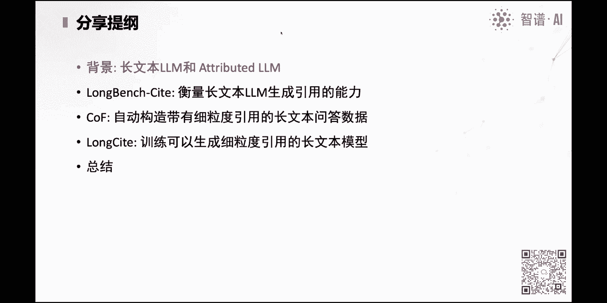

呃首先我先给大家介绍一下长文本语言模型，就大家都知道，现在超长的上下文窗口，已经成为最新一代语言模型的标配，呃，有一些语言模型，它的上下文窗口甚至已经超过了1000000token。

比如说像谷歌的GEMINI1。5，还有我们质朴的gm49b chat em呃，大多数的语言模型，就是现在公开的语言模型都呃，都标配了128K的上下文窗口，比如说GPT4o cloud g m4。

还有千问二等等，而呃如今这些长文本语言模型，一个最常用的场景呃，就是长文本问答场景，就比如用户想上上传了一篇几百列的文档，然后他可能要从中进行一些信息抽取，或者提问题，或者说他也想要总结一下这篇文章。

就比如说右边这个例子，我就把就是我们chat g o m的一个technique report，上传给了呃质朴青年，然后让他帮我总结一下，这个训练数据里面主要包含了哪些的文本，它就会给我回答。

说包含了就是下面这些文本，然后数据的处理流程是什么样子的哦，就虽然现在的长文本语言模型它已经可以出，就是回答用户对于文档各种各样的提问，但是它还是有一个比较严重的缺陷。

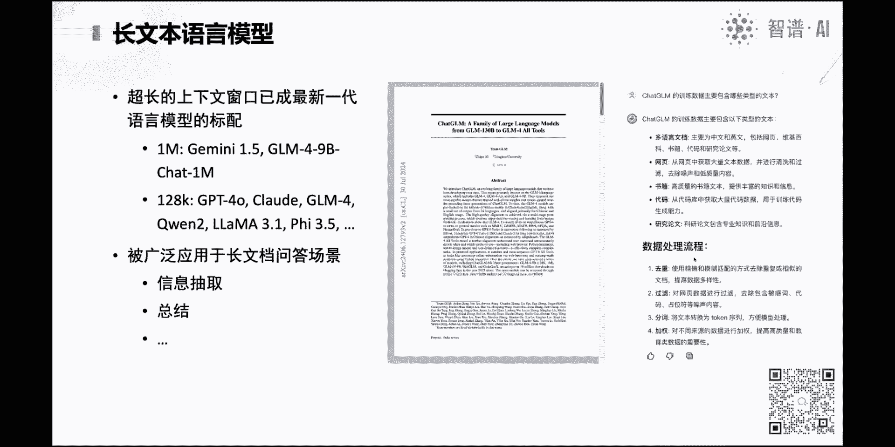

就是说嗯他没有在他的回答中标注出每句话。

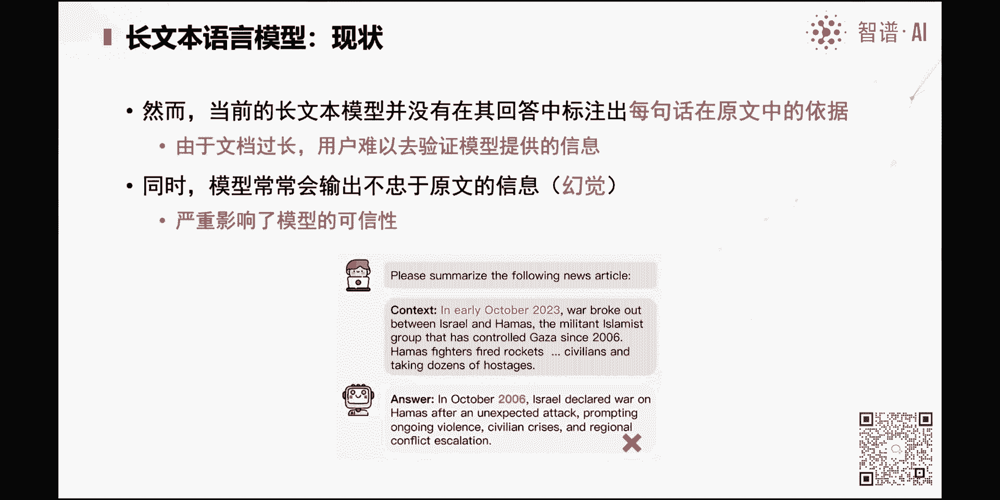

在原文中的依据，比如说他的第一句话，就是比如说他回答的第一句话，这个他说chat gl m的训练数据主要包含了多文，多语言文档，然后主要主要为中文和英文等等等等，但是这句话用户其实很难知道。

这句话对应的是原文中的哪个地方，如果用户想要验证的话，就非常的难，因为这个文档它可能有几百页的。

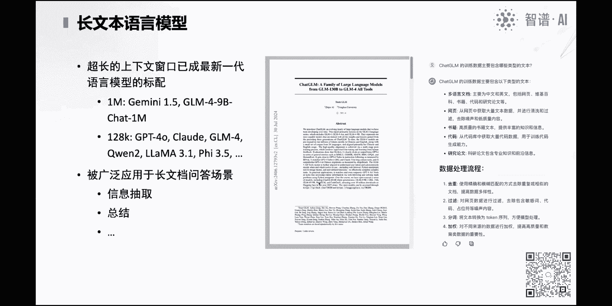

就是篇幅同时限制的大模型，常常会输出不忠于原文的信息，我们也称之为幻觉，就比如下面这个例子，用户可能想要总让大模型总结一下这篇新闻呃，这里的时间可能是2023年，但是模型的输出却标注。

就是标的是2022006年哦，由于用就是这个是一个比较简单的例子，但是在一个很长的文本的例子中，用户可能就算看到了一句话，他也不知道这句话是真的还是错的啊，这样它就严重影响了我们长文本模型的可信性。

就是用户他可能不敢去把，就是不能完全的相信呃模型的输出，但他也没法去验证，这就陷入了一个困境，特别是对于一些高度敏感的领域，比如说呃像法律的判决，或者说金融的一些数据抽取。

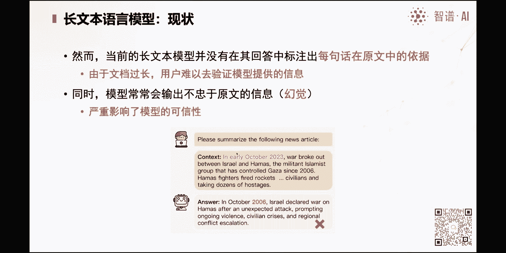

这个就是这个可信性的问题就非常的严重，那么为了增强大模型的可信性和可验证性，就在开放领域，问答和智能搜索引擎中，已经出现了一种叫attributed的LM的呃，就是系统，这个系统呢。

它就是通过检索生成或者后处理的方式，让大模型在回复中加入引用信息，就比如左边这个例子是一个开放域问答的场景，用户提了一个问题呃，就是英国什么时候哦，美国什么时候是从英国独立出来的。

然后这个模型它可能先从一个呃文就是文档库，比如说维基百科中检索出了很多个片段，然后这个LM大模型，它就会通过根据这这些检索到的片段，去生成一个带有引用的回答，他的每句话后面就会有一个引用符号。

比如说第一句话，它的引用就是一和二，那么一和二里面就包含了，就是这两个日期所对应的证据呃，第二句话的话它的引用13，这个第三句话它也包含了这一句话哦，第三个文档片段它也包含了这句话所哦对。

就是所需要的信息，这样用户他就可以很好的去验证，每句话是真的还是假的，再比如说一些现在的智能搜索引擎，比如说new being，还有很有名的perplexity AI，他们就是当你呃提出在搜索引擎里面。

搜一个问题的时候，它会给出一个回答，然后每句话回答，后面也会有像左边一样的引用信息，这里的引用信息它每个对应的是一个呃网页，比如说这里的话，它的一就对应了一个就是网页，二的话又对应到另外一个网页。

用户点开这个网页，他就可以去找到这句话就是的出处，这样的话用户就可以很容易的去验证啊，然后这两种方式，它一般都是通过检索生成的方式，就是我先检索一些文段出来，然后再把这些文段和问题一起给大模型。

让大模型生成带有引用的回答，还有一种常见的方式是通过后处理的方式，就是说我用户提了问题之后，大模型不看信息，他先自己回答呃，回答出来之后，然后他再通过检索的方式往里面去，给每句话加入引用。

比如说他可能给第一用，第就是回答的第一句话去检索十个呃文段出来，然后把top1的文段当做这句话的引用，然后再用第二句话去检索十个文档出来，把第二句话当做这句话的引用，就是他先回答后检索后加引用。

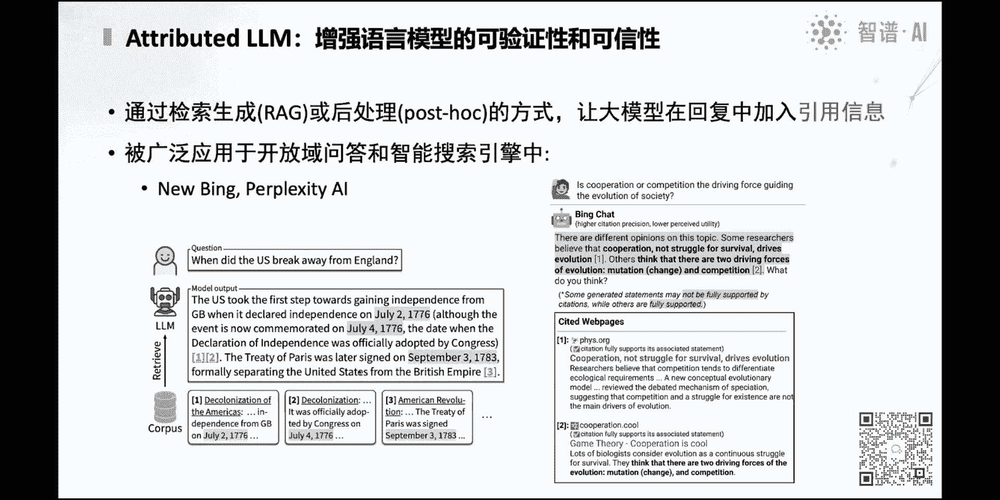

这就叫后处理的方式，那么这些常呃，那么这两个方法。

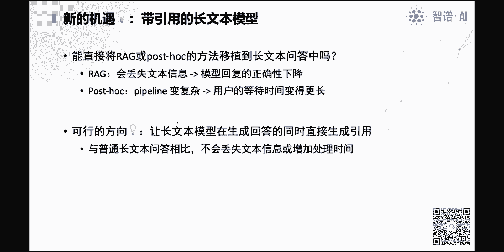

它都被广泛应用在，开放域问答和智能搜索引擎中，这两个方法能不能就是，直接移植到我们的长文本模型中呢，就是用户提了一个问题之后，我可能通过RAG或者post hook的方式。

从我那个文档中去找一些信息给我哦，模型的回答增加引用其实是比较困难的，因为这两种方法在长文本问答的场景下。

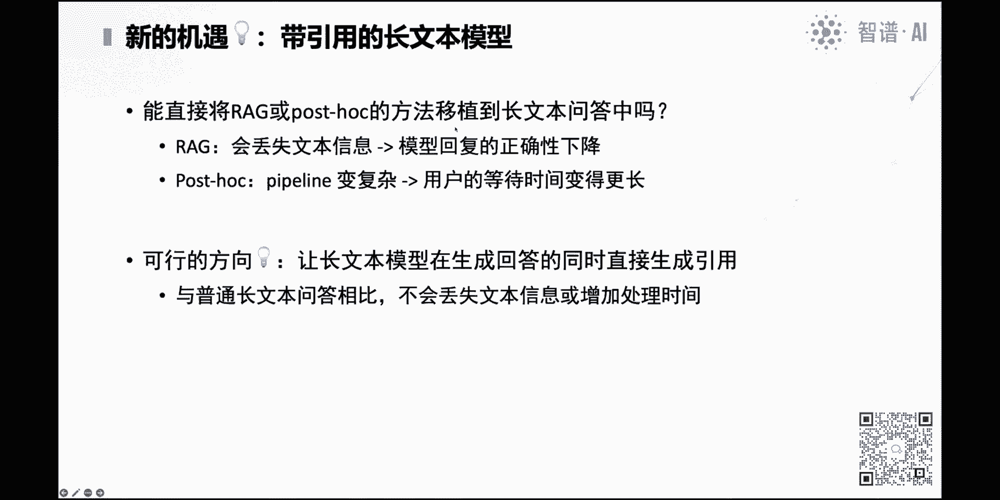

各有各的缺陷，首先是RAG呃，因为RAG它是召回了。

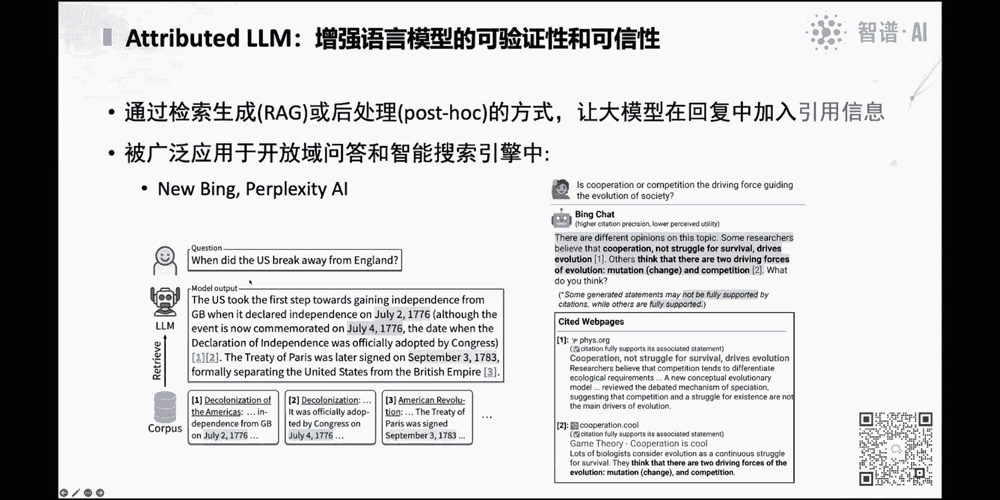

比如说召回20个片段，那么他就会丢掉原本的文本信息，比如说我原文可能有128个token，128K个token，然后他召回的话可能只会召回4K4K个token。

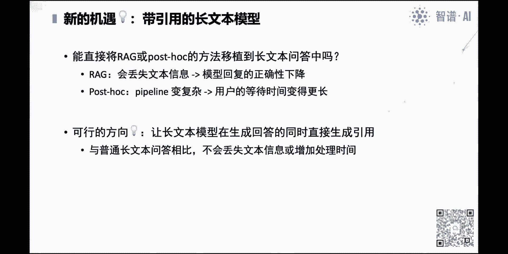

就是4000个token，那么还有大部分的文本信息都被我丢掉了，模型是看不到这些信息的，这样的话模型回复的正确性就会下降，因为他看到的信息少了，比如说特别是当用户提了一个，像总结之类的问题的时候。

那么RAG它的性能往往是会严重变差的啊，另外对于后处理的方式，就是模型先回答我再去加入引用呃，这样的话它就会使整个的pipeline，就是问答的pipeline变复杂，我相当于要多过几次LM哦。

那么用户的等待时间就会变得更长，而在长文本问答的场景中，用户等待时间本来就是一个非常重要的指标，呃用户一篇文章他可能也要等待个二三十秒，如果我再去做一些后处理的话，他可能等待的时间就要变得更长。

这也是难以接受的，有没有什么就是呃，呃这两个问题都可以解决的方法呢，哦那么就是让大模型就是让长文本模型，它在呃根据长文本生成回答的同时。

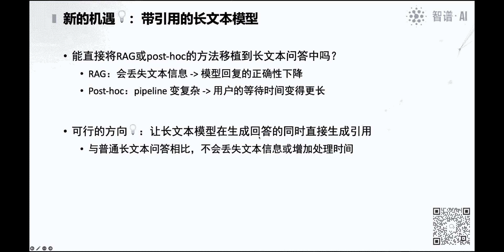

直接生成引用，就是说我可能读一篇文章，然后我模型一边生成第一句话，生成完第一句话之后，马上生成一和二这两个，然后再生成下一句话。

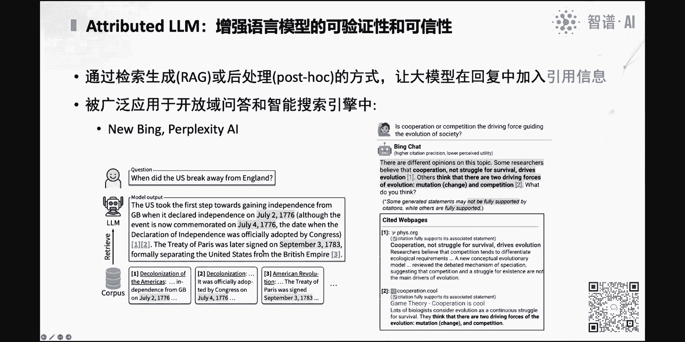

然后再生成第二句话的引用，这样的话它就呃跟post hook的方式相比，他就没有一个后处理，他就还是在一次的舒适之内，把回答和引用同时的输出了出来，就不会增加用户的等待时间，而与RAG相比呃。

长文本模型读完了全文。

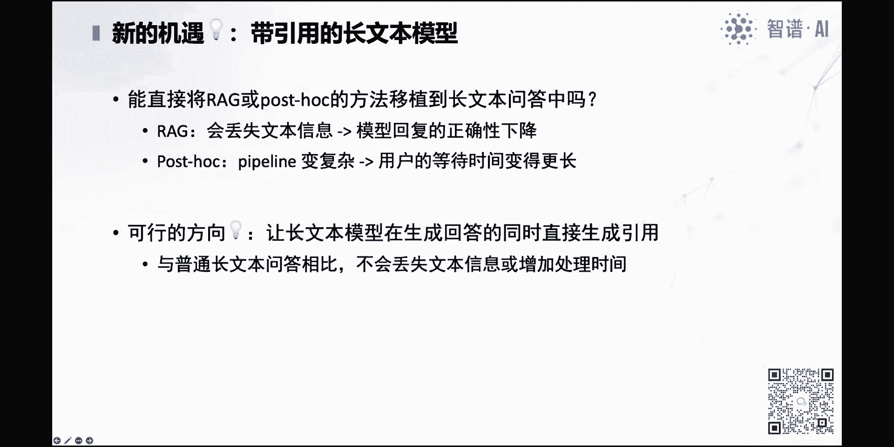

它也不会说丢失了文本信息，那么它的上限就会比RAG更高。

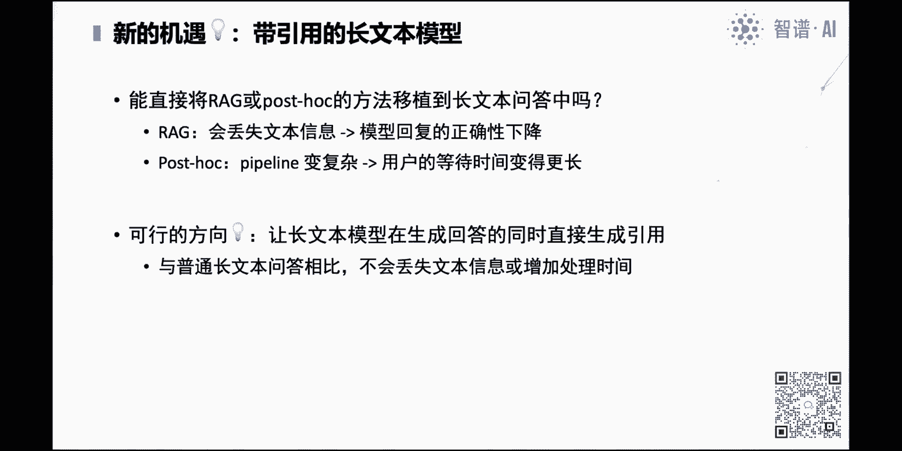

它的正确性啊也会比RAG更强，既然如此。

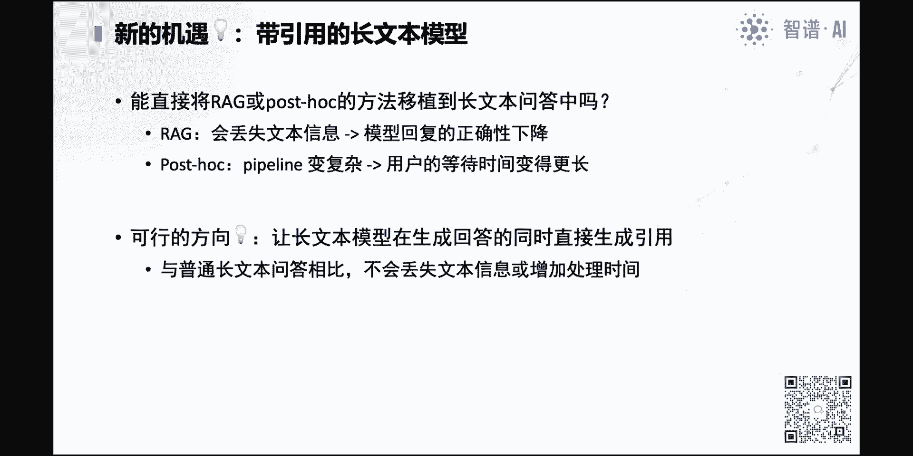

我们就想先测试一下现在的长文本模型，有没有这样的直接生成引用的能力，于是我们就提出了long bench site，一个benchmark来衡量长文本呃。

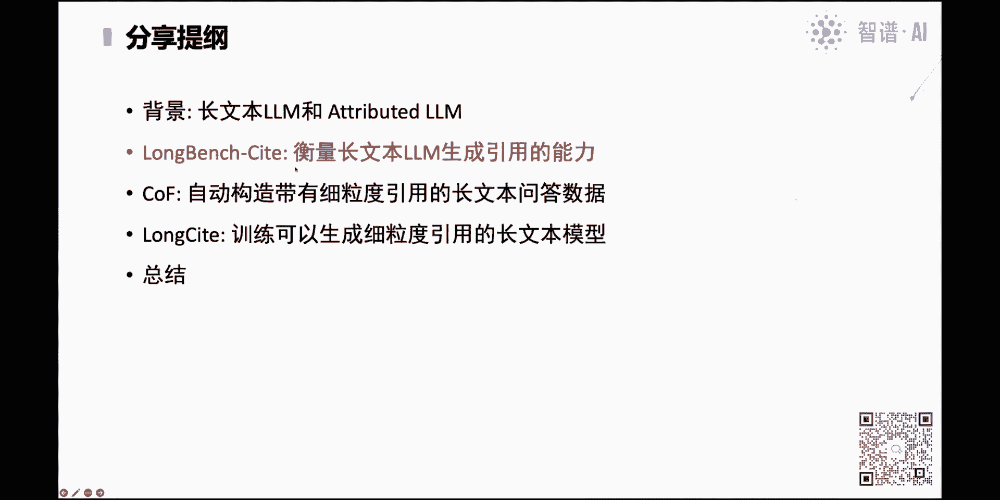

模型生成引用的能力呃，long bench set的话，它是采用了我们之前的两篇工作，一边是long online，中间的long bench side呃，long buch chat呃的数据。

还有一篇是让bench的数据，他们数据中间都呃，他们这两个benchmark中都是长文本问答的数据，就像下面列的这些呃，总计有1000条数据，那么这些数据集呢，它涉及了我们平时常用的一些呃任务场景。

比如说单文档QA，然后还有多文档QA以及文档总结对。

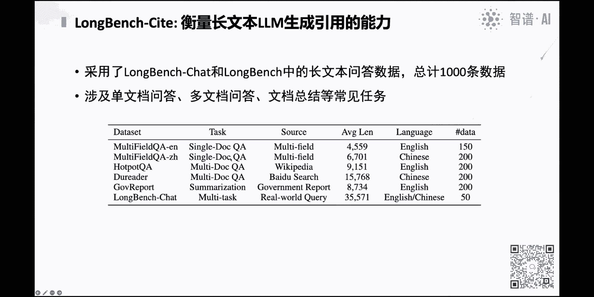

然后long besiechat里面。

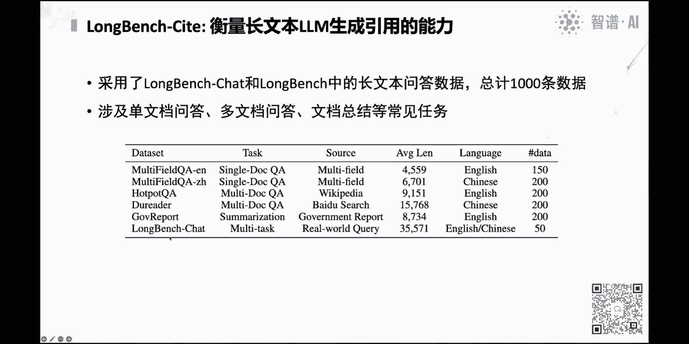

可能还有一些其他的常见的任务，这样的话我们就能就是比较好的评测出，这些模型在用贴近用户的真实场景下。

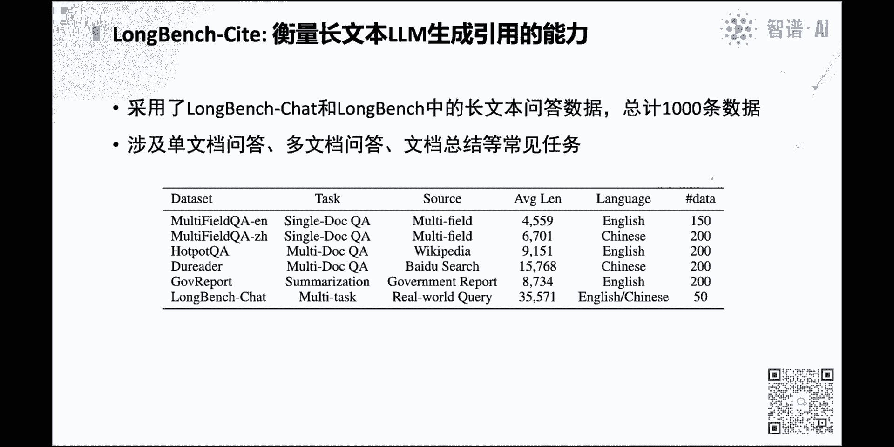

它生成引用的能力是如何的啊，而语音网的工作不同的话，在我们长文本的场景下，我们更注重于评测细粒度的句子及引用，就是说以前的开放域问答或者说智能搜索引擎，它们的每一个引用，比如说这个七。

它对应的可能是原文中的一个chunk，就比如说是128个token或者是一个网页，就是一整个网页，就比如说new b引中，它的一个引用其实就是一个网址，你点开之后它是对应的一整个网页。

那么这样的话用户它可能需要在一个chunk，或者是一整个网页中，还要进一步的去找到这个信息，就是这句话它所对应的这个证据哦，就用户还要自己去找呃，就不是特别的友好，而且对于一些CHK。

就是RAG常用的chunk手段来说，就是比较简单粗暴，就比如我就根据token数128个token，我画一个chunk，这样的话就像上面这个例子，它就会导致一些句子从中间被声音的切开。

用户的体验也不是很好哦，就像上面这个红色的这句他本来是个证据，但是却因为就是声音的呛K，直接被从中间切开了，搜的时候也只搜到了七用户，他就只能看到这句话的前半截，看不到后半截，他也比较困惑。

而对应的句子级别的引用的话，就是把原文分成一句一句的，就像右边这样，然后我们给每句话前面打一个标号，就从C就是第零句，第一句就是第22句，第23句，第24句呃，这个呃，然后模型在回答的时候。

它的引用是对应的原文的一个句子区间，就比如说这句话，它的引用是原文的第22句到第23句，这样的话这个引用里面它就包含了完整的句子，第二个它的定位也非常的精准，就精准到句子级别，基本上用户一看就知道哦。

我对应的就是这一段，就是我要找的，他就不用再去像左边这样，再在这个chunk，或者在这个网页中再次去找这个具体的证据，那么对于用户来说就更加地友好哦。

我们评测的话主要是就是long on cheat site的评测，主要是分为两个维度，是由GPT4O自动判断的，第一个维度就是传统的长文本问答的正确性呃，就是说我这个回答正确与否。

是不是满足了用户的需求哦，我们首先评测的是correctness，就是就是经典的正确性，就是看这个回答是否是正确的，与标准答案相比是否是契合的，这里的标准答案都是那些原有的数据集里面，提供了的。

然后我们就让GPT4O来判断，用用就是模型的输出，有没有和这个标准答案是不是契合的，第二个是我们要判断一下，就是说加入了引用之后，我们常务本模型的问答能力是否受损呃，我们就用。

就是加入引用之后的正确性和不加引用，我直接就问，让这个模型做普通的长文本问答相比，它的正确性是变高了还是变低了，这样一个指标来判断，就是它的性能是否受损。

我们称这个指标为correctness ratio，就正确性比例，第二个维度，主要的维度就是引用的质量，就是看我这个引用的呃，文段准不准，有没有刚好对应到我，就是我引用所对应的那句话。

我们主要从考虑了四个指标，第一个指标就是sitation record，就是说回答中的每个事实性陈述，我们就叫statement，是否被对应的citation所支持，就比如下面这个例子。

他可能呃这个模型的回答中有三句话哦，我们就第一句话，他被他的引用片段完全支持，那么他就得一分，然后第二句话他的引用是错误的，其实他这句话没在原文中没有支持，那么他就只能得零分。

然后第三句话他可能是第三个statement，它可能里面涵盖了两个要点，而这个10~11的引用，它可能只对应了一个要点，那么我们就判断他是partially supported，就是部分支持。

他就得到了01：05分哦，他就得到0。5分，所以说这三句话的得分一共就是1+0，加0。5呃，也就是01：05分呃，那么它的satic record就是呃零就是0。5，然后另一个方面。

我们还要判断每一个引用是不是准确的，因为刚刚是从statement的角度，我们还要从就是citation的角度来看，就这里的每个citation，是否包含了对应的statement的信息，而不是无关的。

比如说2~4这个片段，它是不是包含了cm1中间的一些要点，或者6~6，它是不是包含了要点，比如说这个7~9它就没包含要点，它就只能得零分，如果包含了就是得一分，那么这里有四个引用，其中有三个引用。

它是跟这个对应的SETLEMENT是相关的，那么它的sitation precision就是34，等于0。75，第三个指标就是SETATIONF1，也就是综合考虑了recall和precision。

就是按大家所熟知的F1的计算方法计算的，他就综合考虑了这两个指标，最后一个指标是citation length哦，因为我们句子值的引用，它每一个SETATION它对应的是一个句子区间。

它比如它可能是第二句到第四句，也有可能是第二句到第六句，那我们呃，那么这个就是我们就用每个citation，对应文本的长度，也就是它的token数来衡量它的引用的力度，如果这个长度越短。

就说明我引用的力度越细，定位也就越精准，就比如说我每个citation它都刚好对应了一句话，那么用户一看就知道这个就是最精准的，而换换言之，有一个方法就是我每个statement我都直接引用全文。

我就可能从零到最后一句话，这样的话它的citation length就会很长，虽然从理论上讲它肯定是support的，但是他的SETCE就很长，然后他的力度就说明很差，用就是根本满足不了用户的需求。

这样的方式也可以很好的，防止一个指标上的hack，刚刚我看有有人提问，就是说有同学提问，说GPT4O判断是准确的吗，然后这个我们后面是做了human evaluation，就是说跟人评人评价来做比较呃。

GPT4O它其实还是蛮准的，大概可以实现80%以上的准确率。

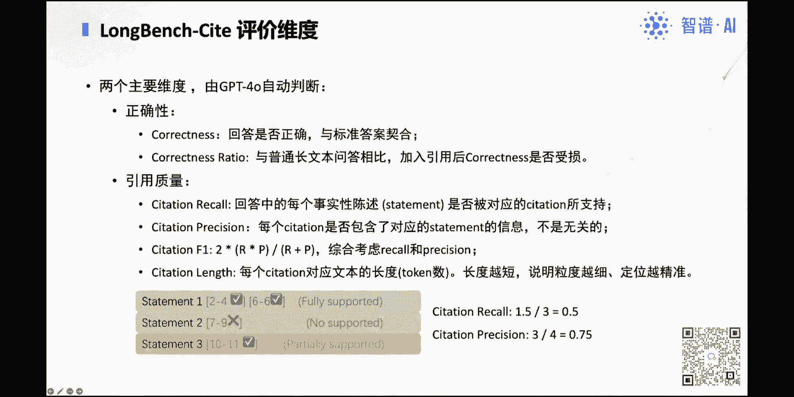

就比较靠谱，后面我也会讲哦，那么我们有了这个benchmark之后，我们就首先评测了一下现有长文本模型的效果。

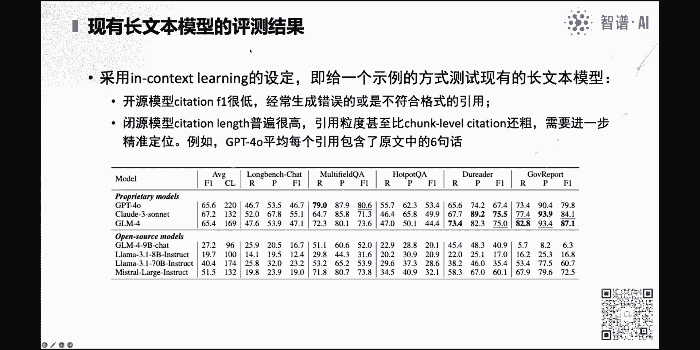

因为现有的长文本模型它没有在这样的数据上，就是像这样的数据上微调过。

我们就只能通过in context learning的方式呃，就先给这个长文本模型一个示例，然后再让它就回答我下面给定的测例，这样的方式来测试现有的常用本模型，下面就是这个表里面。

就是它SITATION的citation质量的结果哦，可以看到就是F1就是SITATION，F1R就是record p就是precision，然后这个cl就是setc length。

也就是它的力度力度是越短越好，其他的指标都是越高越好哦，我们可以看到，首先是下面的这些开源模型，就包括9B，然后拉玛八币还有70币，还有mr。large，他们的citation f1都普遍偏低呃。

这是因为他们这些模型，其实他的instruction following能力不是很好，他们经常生成错误的呃，引用或者是不符合引用格式的引用，它可能生成了奇奇怪怪的格式，就导致解析不出来。

还有很多时候他都不会生成引用，就没有很好的理解我的instruction，所以说就导致了它的引用质F1就很低，然后闭源模型的话，闭源模型基本上都能很好的符合给定的格式。

然后输出符合格式的引用也能解析出来呃，他们的F1相对来说是比较高的，但是他们的可以看到，他们的引用力度是非常粗的，这里啊平均每一个都就是每一个他的citation。

length都超过了128个token呃，这是比枪克level citation还要粗的，因为枪克laver citation的话，我如果按128个token分一段的话。

那么它的呃setation length就是一段的长度，因为它每个引用都是一段嘛，它的setation length的话应该就是128，所以说这些闭源模型。

它其实经常会一一个statement引用很很长一段话，这样的话它的SETATION密度就很粗，而就需要用户去进一步的精准定位，比如说像GPT4O，它的每一个引用都包含了原文中的六句话。

然后特别是在英文的时候，这个句子非常的复杂哦，一个一句话可能包含了好多个从句，这样的话用户看起来他就会非常的辛苦，其实不不是很好满足要求，同时在long unch chat上，这些模型它的。

因为这个数据集是一个比较难的数据集，这些呃闭源模型它的效果也不是特别好。

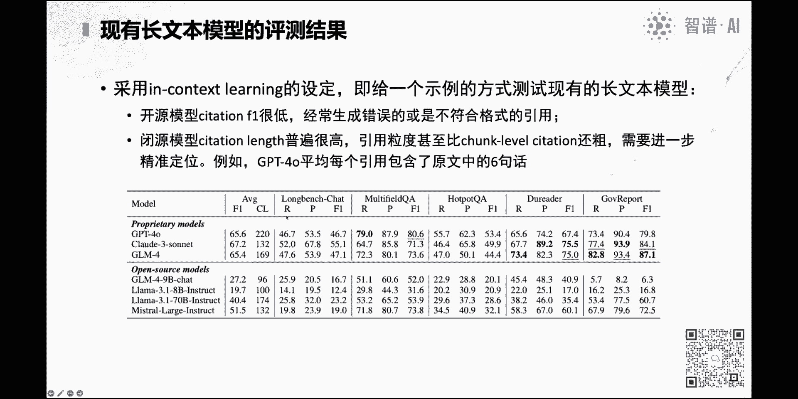

就是他们的record都只有50%左右呃，所以说还需要进一步提升，另外从正确性的角度上来看啊，这里的C就是说他带引用的哦，回答的正确性，然后CLQA就是指在普通的长文档，问答场景下。

就我直接给这个呃查文档，然后问题让他得到一个回答，然后不加任何引用，就是跟普通的场景是一样的，它的正确率，CR就是我们刚刚说的correctness ratio，就是带引用的正确性除以不带引用的正确性。

来看，它就是加入引用之后，有没有使他的长是长长文本问答的能力受损，可以看到对于这些模型来说，就是红色的就是小于百分之百的，绿色的就是大于百分之百的场景，可以看到哦。

就是大多数模型它加因为是in context learning，加了citation，那么他的能力成文本问答的能力，其实是受到受到了损害的，因为它呃其实这些模型在训练长文本的时候。

都是直接按照普通的长文本QA的形式，就给一个长本，给一个问题，然后直接回答的形式，那么如果我用in context learning让它加citation的话，它其实这个跟他的训练是有一个分布上的差异。

就会导致它的呃效果会变差一点，这就是反映了第二个问题呃。

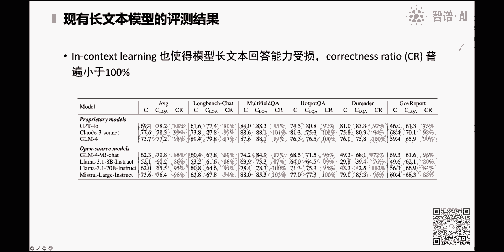

我们总结一下，就是说，当前长文本模型生成引用的能力普遍偏低，而且会损害其长文本问答的表现，所以他们是需要提高的，然后怎么提高呢，就一个比较like，就是直接的想法，就是说需要构造相应的数据。

来增强这些模型生成细粒度引用的能力哦。

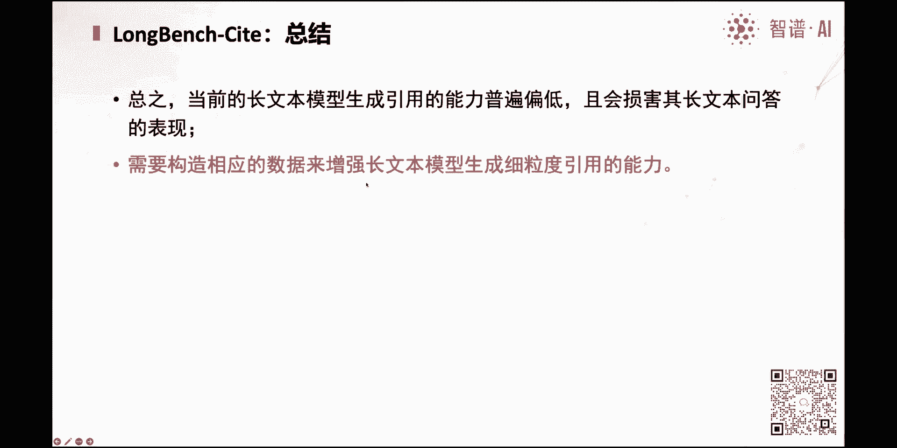

所以我们就来到了第三集，就会向大家介绍一下，我们想提出的一个呃COF，一个自动构造，带有细粒度引用的长文本问答数据的框架。

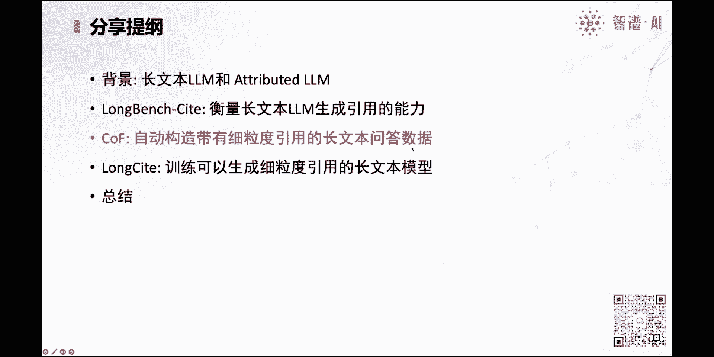

嗯首先我们来提一下我们构造数据的原则，就说要怎么构造呢，就是带有细粒度引用的长文本问答数据呢，呃首先肯定是要使用现在的长文本模型，自动构造数据，如果是人来标的话，就非常的痛苦。

因为就算是现在的长文版QA就是长文本QA，数据就不带细粒度引用的，就普通的长文本问答数据，基本上都是模型自动合成的，而没就很少是人标的，然后在加入citation之后。

我们应该遵循两个原则来保证模型的能力，第一个原则就是说，我们需要充分利用现在模型的超文本能力，保证问答的质量哦，也就是我加入了SETATION之后，我问就是答案的质量。

不能比普通的长文本问答的那个回答质量要低，不然的话我迅速的模型它可能就是它的效果，长文档问答的效果也会变差，所以说我们就没有采用普通的RAG的方式。

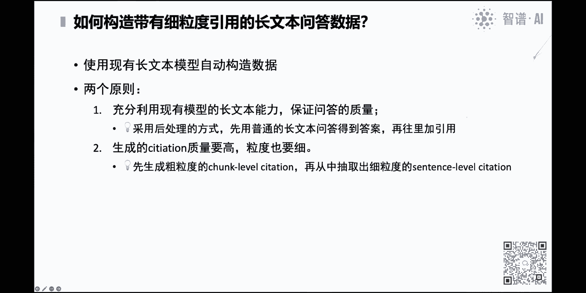

就是先检索，然后后生成回答，但引用的回答，因为这样会丢掉文本信息呃。

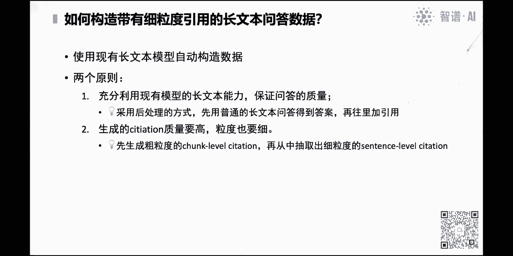

质量也会变差，而是采用了后处理的方式，就是说先用普通的长文本问答得到答案，再往里面加引用，就虽然后处理的方式在线上的时候，它会增加用户的时间，但如果我们拿来造数据的话。

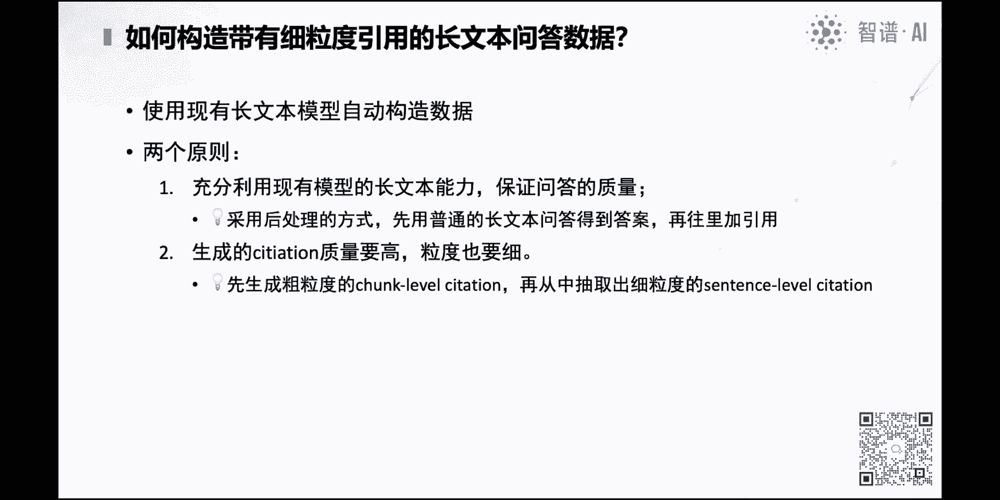

其实这个时间成本是很小的对，然后第二点就是说我生成的SETATION质量要高，密度也要细才行，所以说我们的想法是说，我采用一个由粗到细的一个呃，就是这样一个流程，我先生成粗粒度的定位。

先让模型生成粗粒度的会计的引用，然后再从每个块中抽取出细粒度的句子。

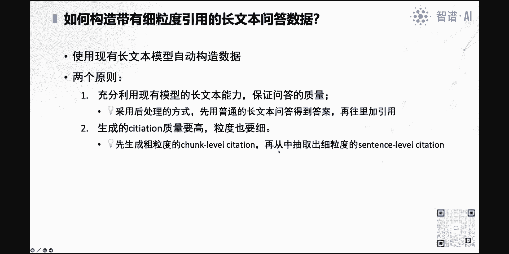

级别的引用，这是我们的主要思路。

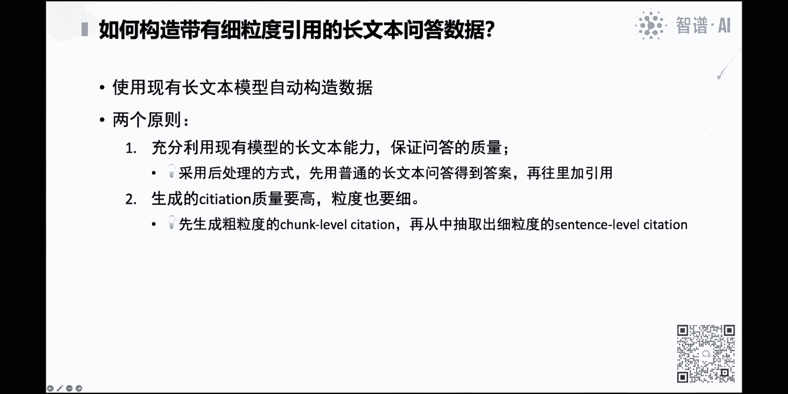

那么根据这个思路的话，我们就提出了COF，它其实是course to find的简写这样一个pipeline，它一共包含了四部，分别是呃问答生成，然后第二步是会计的引用的生成。

第三部分是句子级别的引用的抽取，最后一步是数据呃，数据清理。

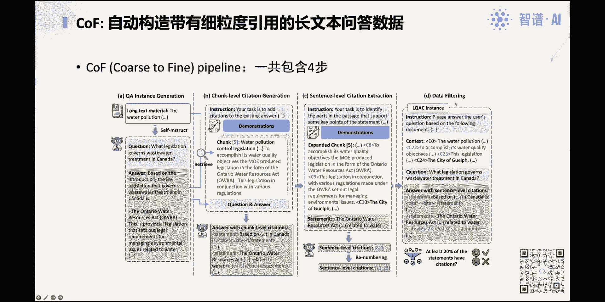

哦那么我们先来看问题生成，问题生成的话，这个在以前的就是普通的长文档，问答数据的合成，这个在以往的工作中已经被广泛地研究了啊，有很多种方法，基本上都是通过selfie instruction的方式。

让模型自问自答生成长文本，问答对，这个在我们之前的long line这篇工作里，已经得到了很好的验证呃，具体流程就是说，我先收集一些各种各样的长文档，就比如说像books。

然后一些reports或者一些论文，然后我让模型就是我给它一个instruction，让他根据这个呃文档提出一个问题，然后我再从他提出的问题中选一个问题，然后给这个模型，让他直接就是根据文档和他的问题。

得到一个答案，那么为了保证这个生成呃，生成就是问题的多样性，我们也会提前规定一些task type，就是任务的类型，就比如说最简单的就是信息抽取嘛，就是他只用看文中的一段就能得到答案。

然后难一点的就是多跳推理，还有一些总结的，还有一些general task的，也会让他自由发挥，这样的话就能保证它生成问题的多样性，那么答案的话也因为它是模型，看了全文之后得到的，它的质量也不会变。

不会很差，它就是充分利用了这个现有的模型的能力。

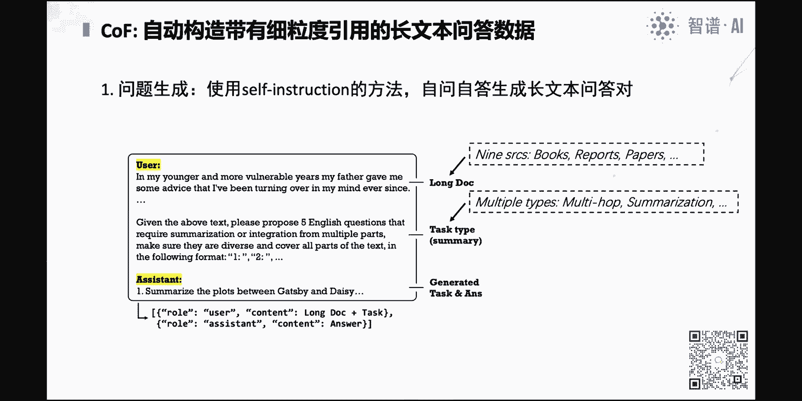

得到了一个答案，哦然后第二部分我们在得到了这个像左边这样，通过self instruct得到了呃，问题和回答之后，我们就通过一个后处理的方式呃，往这个答案中加入chunk level的citation。

具体来说我们就是像之前讲的一样啊，用答案中的每句话，就比如说这里是第一句话，这个based on，然后到canada is，这里是第一句话，可能去文中检索出一些相关的文档。

然后第二这句话也就是中介的这句话，也检索出一个文档，然后把所有的这些文档，我可能拼检索到的文档拼起来，就可能一共我们在实验里面是选了40个，检索出来的文档，每个文档是128个token的长度。

然后把这个问题和检索到的文档，还有现在的答案给这个大模型，然后通过一些事例啊，让他直接往这个答案里面加入，我枪克雷伯的citation，这样的话他就是这个赛推，这个生成了带有会计引用的回答。

他除了加了这些特殊的token以及对应的citation，比如说这里是五啊，它跟原来的答案是一模一样的，就是说他这个回答的正确性的质量是有保障的，同时它也具备了一些快捷的引用的能力。

就比如说这里的这句话，他的答案是就是他的证据是在第五个JK里面，就是标率的这一部分。

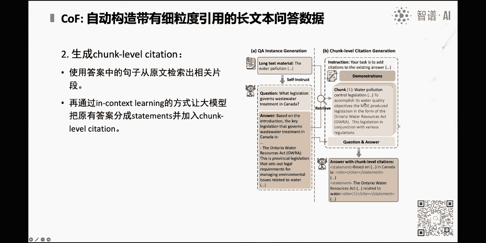

然后第二步在得到呃，就是在第二步得到了会计的引用之后，我们第三步就是从这些块中进一步抽取出，细粒度的sentence level的citation呃，具体来说我们就是因为在第二部里面。

这个大模型它已经把原来的文档分成了一个，就是一个又一个statement，我们就对于每一个statement，它都有对应的这个快捷的引用，我们就把这些快捷的引用给它。

和对应的这个statement拿出来放到右边，就像右边这样，然后同时把这个chunk，因为这些chunk里面，它可能包含了就是头尾的部分，还有一些不完整的句子，我们就需要把这些句子补充完整，从英文中。

然后再把这个chunk的每句话给他标上号，比如说这里是在这个chunk中的第八句，到第九句，然后下一句是第十句，然后再还有statement带给这个大模型，然后再加上这一步的一些事例。

就是让这个大模型从这个chunk中抽取出，具体哪些句子是支持我给定的这个statement的，就比如在这个例子中，就是这个呛课中间的第八句到第九句，这两句话他是支持我这个statement的。

那么呃这句话他的chocolate was sitation就是8~9，而这里的8~9它需要需要注意的是，这里的8~9它是呃，当前chunk这里的一个序号，它其实在原文中，它的句子序号可能不是8~9。

它可能比如说是下面的22~23，所以说我需要根据嗯，就是抽取到的这些句子，在原文中的位置给它进行一个重标号，这样的话就得到他在原文中的state。

就是这个statement在原文中的sentence was citation，就比如这这句话，这句statement它对应的是呛口中的8~9，可能在原文中是第22到第23句话呃，在前面三步都做完之后。

我们就把每个statement和它对应的这些呃，句子级别的引用一起给它拼起来。

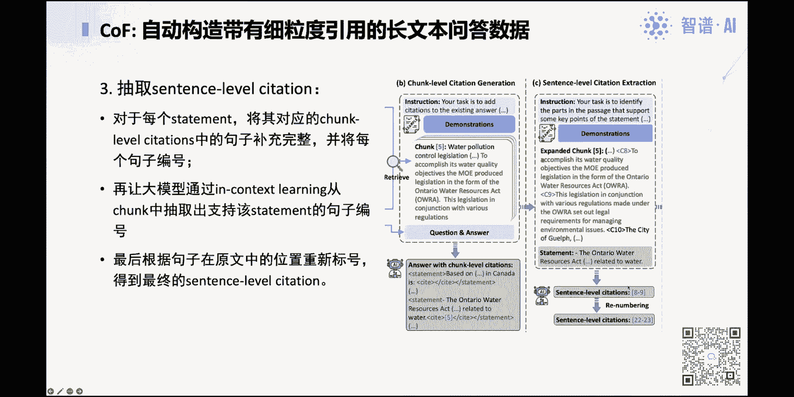

然后就得到了最后这样一个完整的训练呃，训练样例，这个样例它一共包含了四部分呃，第一部分是一个instruction，就就是大概就是一就是system prompt的意思呃，他就是告诉模型这个任务是什么。

它里面就包含了说，我需要让你根据文档回答一个问题，然后这个instruction里面还写了一些，你需要加上一些就是引用的信息什么什么，然后这个引用的格式是怎么怎么样的呃，第二部分就是这个context。

这个context的话，我们就是把原文给它一句一句分好句，然后标上号，就从C0开始标，一直标到最后一句话，第三步就是这个question，最后一部分就是带有刚刚拼起来的。

带有句子级别引用的一个answer哦，然后前面三部分是作为一个模型的输入，最后一部分是作为一个模型的输出，这样得到了一个带有细粒度引用的长文本，问答数据，最后一步的话，我们还要进行一些数据筛选。

就因为有的数据的话，他可能呃一个回答里面他都没有多少citation，就比如他可能有十句话，然后只有一个statement是带有citation的，这些数据的话呃，它的citation过少。

就有一些原因，就有可能是因为他没有这个回答，没有忠于原文，他的幻觉性很强，就包含了很多幻觉，所以说他找不到引用，对于这些数据的话，我们就把它删除掉哦，这样可以提高我们整体的一个数据的质量。

具体来说我们在实验中是吧，就是如果一个回答它小于百分，就是15的statement，没有citation的话，就是呃它如果少于15的statement，才有CCTATION的话，我们就把它删掉哦。

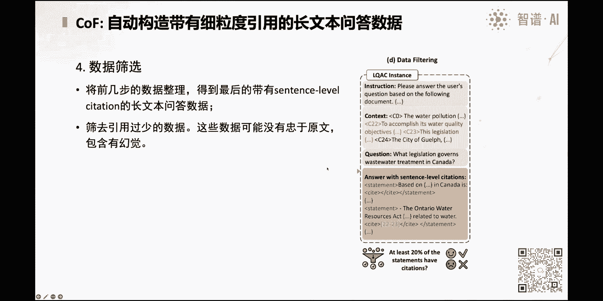

那么在得到整完整的一个框架之后哦，我们就是哦，我们就先验证了一下这个框架是不是有效的，就我们先验证这个框架是不是有效的，然后再去造数据，这样的话我可以节省我造数据的成本。

我们就在long on char呃，lon ch set上验证了一下这个框架的结果啊，我们就使用了gm4和质谱embedding two，作为分别作为我们的就是那个大模型嘛。

然后in质谱ebedding to，是作为我们的retriever来进行这样一个实验，然后对比了，就是现在的一些常见的生成SETATION的方法，就是其实也是我们自己想出来的，也是就是可能大家会用的吧。

就比如这些LACC就是说L的话，就是说我阅读完原文，然后就呃然后生成同时生成答案和citation，然后这个杠C和杠S是说它是生成的，是枪口level的citation，还是句子级别的citation。

然后这个RAC是指就是RAG的方式，我先解锁，然后再生成答案和引用，杠C和杠S也是跟刚刚一样的意思啊，这四个方法是one pass的方法，就是说我是同时生成答案和引用的。

然后下面的方法是post hook的方法呃，就是后处理的方式，这个L和R2也是分别代表了，就是后处理的方式，就是说我模型先呃读原文，然后得到了一个答案，我再往答案里面去加citation。

就跟我们的COF差不多哦，这里的L是说我后面加citation的时候，我是还是读原文，直接从原文里面去给它加加citation，还是说像COF一样，这个R就是说像cf一样。

通过检索的方式去召回一些citation，那么呃这个实验结果，我们就先看这个one past method，就虽然它们的F1是比较高的，但是可以看到哦，它们的准确率其实是就是这个CR。

就它们的正确性相比于普通的long context，QA其实是下降了的，因为就像我们之前讲的，因为他们是通过in context learning的方式，这样的话它造出来的数据正确性也会比较低。

那么新出来的模型，它的问答的质量肯定也不是很好，所以说我们就先抛弃了one pass的方式，对post hook的方式，这样因为他是先回答再加引用，所以说它的CORRECTORDNESS。

the ratio都是百分之百，它就不会影响模型长文本问答的性能，然后在这些方法中，我们的COF方法，它的F1是最高的，然后它的static length也是比较适中，就89。

它虽然没有这个post r cs高，但是它也是比较合适的，所以说总总结一下，就是说CLCOF它在所有后处理的方法中，取得了最高的SETITIONF1，然后呃和one pass的方法相比。

cf它也可以保证回答的正确性不会下降。

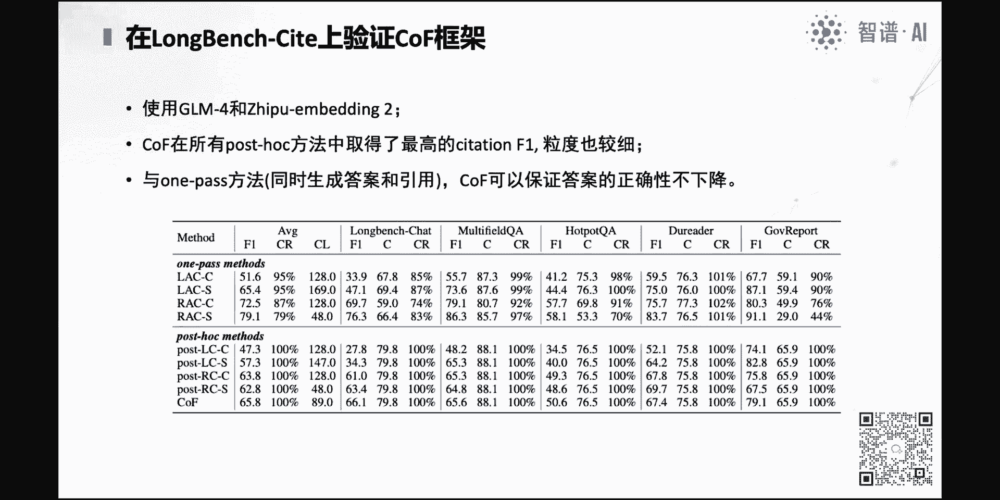

呃最后的话我们就是通过CFF这个框架，去造了一些数据，然后训了两个基于两个开源模型去呃。

进行了一个训练啊，具体来说我们通过收集gm4中的预训练，语料中的长文档，我们一共收集了5万篇长文档，然后再通过刚刚提出了COF框架，我们构造了一个大规模的SFT数据集，Long set。

45K就中间包含了4万4600条，带有句子级别引用的高质量问答数据，这些数据最长的可以达到128K的个，Token，然后基于这个long set45K，我们把它跟希尔GPT进行一个混合。

希尔GPT就是一些短的，general的一些SFT的数据，这样可以保证模型的一个整体的性能，然后再跟long set45可以进行混合，之后，我们就基于gm49B和拉玛3。18B训练，得到了两个模型。

我们分别命名为long set9B和long set8B，这两个模型的话，因为我们的数据里面是，就是128K的上限，就是128K的最大长度，那么他们训练出来，也可以支持最长的128K的上下文呃。

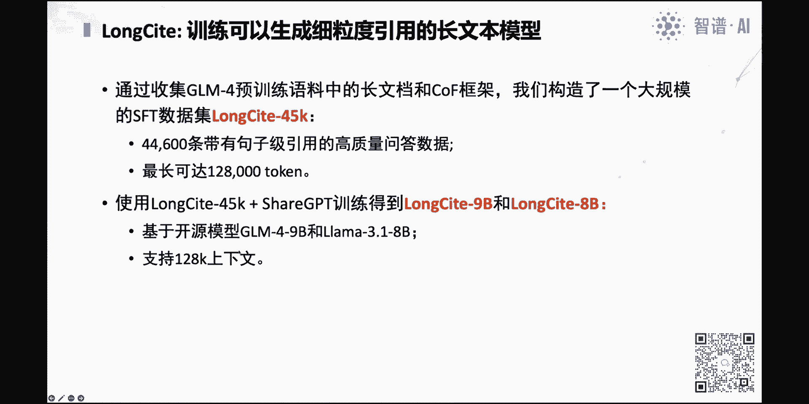

训练之后，我们就在long buch site上进行了一个评测呃，可以看到就是下面的两张图比较直观，我就没有放刚刚的那个表了，然后呃左边的这个图的话，它是呃citation的质量呃。

纵轴就是SETATION的F1，就是准不准，然后横轴就是SETC的力度，就是从粗的力度到细的力度，就是越偏右上角的模型是越好的，可以看到我们训练出来的两个模型，它在就是赛特性F1上。

取得了最高的赛特性F1，然后他的citation力度也很细，就大概是在八九十的样子，其实跟它SFD的数据是比较契合的啊，跟之前的闭源模型，包括像GPT4O和gm4。

比它的csc length缩短了近一倍，就是它的力度吸了近一近一倍，就实现了一个精准定位的功能，而右边的话，我们跟普通的long s f t，进行了一个对正确性的对比。

普通的long s f t就是说没有带引用信息的呃，长文本训练，我们就把具体来说，我们把long set，45K数据中的SETATION信息给它去掉了。

就像刚刚的那些呃，这个图里面的这些statement，然后site这个22~23。

这些特殊的token都给拿掉，就把它当成一个最原始的长文本问答的训练，然后进行了一个训练，然后long set，绿色的部分就是我们加了SETATION引用信息的呃，一个训练，在这两就是训练之后。

我们可以就是这个也是我们的一个意外的发现，我们就发现加入了SITATION信息之后，它的正确性其实是要比不加citation，普通的SFT，它的正确性有了一个进一步的提升，特别是在一些总结性的任务上。

它的提升非常地明显。

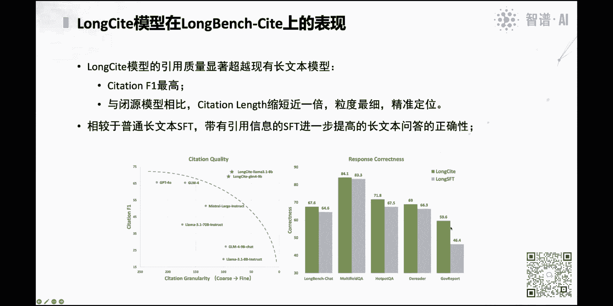

同时我们也在lambert chat上，进行了一个人类评估，就是我们人工的去呃，给他的record，还有precision以及F1进行一个打分哦。

就是只是跟sitation record和citation precision，进行了打分呃，就像GP4O一样，判断它支不支持，然后相不相关每个应用，然后F1的话就是根据前面两个算出来的。

就第一列这里是人的打分，第二列是g p t so的打分，然后第三列是一个之前提出的方法，叫ALCE的一个就是也是给SETAN打分的方法，它是用普通的NLI模型，就是就是自然语言推断的一个模型。

进行一个打分，就可以看到哦，人人打的分来说也是我们训练出来的，long set模型是最高的，要比gm4更高，然后GPCO的打分相较于之前的方法，也是更贴近人的打分，这个它的顺序也是一致的哦。

他可能稍微就是GPT4O的分数，可能稍微比人的分数还要偏低一些，是因为GPT4O，它就因为那些呃context里面他可能有一些代词，比如说他他他还有这我们提出的方法，然后新方法等等这些代词。

然后statement中可能是一个明确的人，就比如说谁谁谁，那么这个时候GPT4O，它可能因为这些代词没有对应上，它就会打出一些比如说部分支持这样的分数，那么它的评分就偏人的评分要低一些。

这些都是可以通过一些后处理，比如说指代消解等方法去提高的，但是就是呃但是又啊，这样的话会增加我们评估的成本，所以说就没有没有这么做对哦，其实我们也计算了，就是GP4O和人类之间的一个契合度。

他大概就是呃用那个卡帕计算的话，是可以实现0。6%左右的，契合度是非常高的，然后如果把人的打的分的，当成golden label的话，GPT4O也可以达到80%，以上的准确性，就说明GPT4O。

它的评价跟人的评价是基本上对齐的，就GP4O分数的提高，也可以反映到人的偏好的提高。

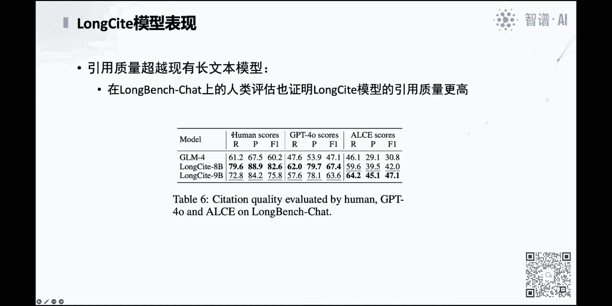

另外就是我们也把long set的模型，他的回答正确性，跟现在的常用的模型进行了一个对比，大家可以看就是C这一列，其实就是在带有引用的情况下，它的正确性，可以看到我们long set。

8B和9B其实是超过了很多现有的模型，就包括开源模型，就比如说9B还有拉玛3。18B和70B，可能比mistral large要差一点，因为模型大小的因素呃，然后GPT4O的话也是。

甚至还要高于GPT4O，对这这就说明我们训练的出来的模型，它在就是最普通的长文本问答上。

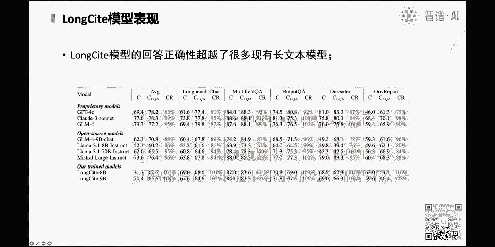

它的正确性也是有所保证的。

然后之前我们提到就是说long site它训练之后。

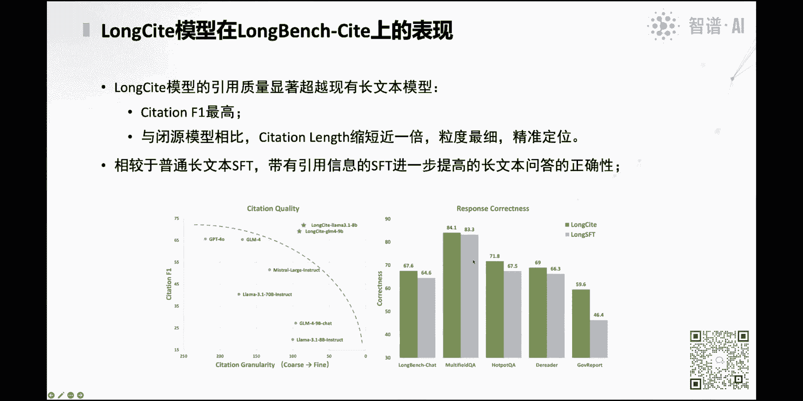

它的效果是要比普通的SFT要好的，然后我们就通过一些case study去就是探究了一下，为什么它的正确性会变好，首先的话是因为他加入了引用信息之后，它可能就是这个模型，它的幻觉性更少。

就比如说下面这个例子，上面的是long s f t9B，就是通过GM49B，普通常用本训练出来的模型呃，它就会有一些幻觉，这个问题是问这两个公司，它的就是他们两个的总部都在麻省嘛。

然后呃普通的ST模型它可能就有一些幻觉，他把第二个公司的地址直接颁给了第一个公司，就可以看到两个公司它的地址其实是一样的，这样的话他就会回答说他们都在这个麻省，其实是错误的，而下面这个模型。

因为它可能在训练的时候，它是就是有引用信息，他就会更专注于我每句话对应的引用，那么这样的话他就可以减轻一个幻觉，他就有可能正确的找到这个公司，它的总部是在哪里的，然后最后得出一个正确的答案。

下面这个是上面对应的二十五二十五，可以看到，就这个在TC里面是说了，他们公司的地址的。

哦然后第二个它为什么会提升的点，我们发现主要是因为long set模型，它能更均匀地利用上下文信息，呃，我们发现普通的SFT模型，它可能会就是在面临一些总结性的任务的时候。

他可能会倾向于就是多使用一点文档，头部的信息，然后文档中部和后部的信息，可能会使用的比较少，比如说像左边这个黑色的部分，就全在文档的开头，然后中间一些文档中间的一些信息，他就可能用三行就进行了一个总结。

其实非常的简略，其实文章的重点正是在这三行三行上面，而右边我们训练的long set模型，因为他在回答中他嵌入了一些就是SITATIONL，就是比如说这个89~97，199，119，121这些数字。

然后文档中也有对应的句子的编号，他就知道我现在回答了这句话，它对应了文档中的哪一部的部分，他就有这样一个意识，那么他在回答到这句话的时候，他可能就会想到，我后面还有很长一部分没有覆盖到。

所以说他会更均匀地利用后面的这些信息，得到一个更详实的答案，嗯但其实它只是更均匀的利用了上下文，就是说普通的SFT，他可能多用多用前面的部分，少用后面的部分，而long set它是均匀的使用每部信息呃。

它其实整体的回答长度并没有变长，就不像这个例子中所展示的啊，我们在实验中也测量了，说就说long set模型，他的回答的整体长度和普通的STSFT相比，我们发现他们回答了token数，平均数是一样。

基本上一样的，就是说我只是更均匀地利用了上下文，得到了一个更综合的答案。

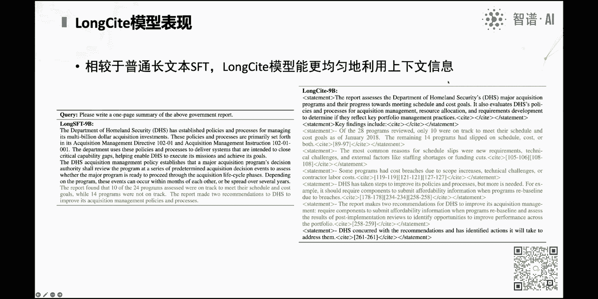

所以说我的正确性会变得更好哦，最后哦我们也进行了一些笑容实验，就说我们来，第一个是探究它long set模型的引用能力，是来源于long set45K数据集，而并非说普通的长文本SFT就可以看到这个。

第二行，就是说普通的长文本SFT，它训练训练出来的模型，其实它的sensation质量非常的差，基本上是不能做SETATION的，然后啊我们也做了，就是对COF中数据筛选这一步，进行了一个向量实验。

就可以发现经过数据筛选之后的模型，就是效果会变得更好，就从FV从61。2提升到了63。3，对哦。

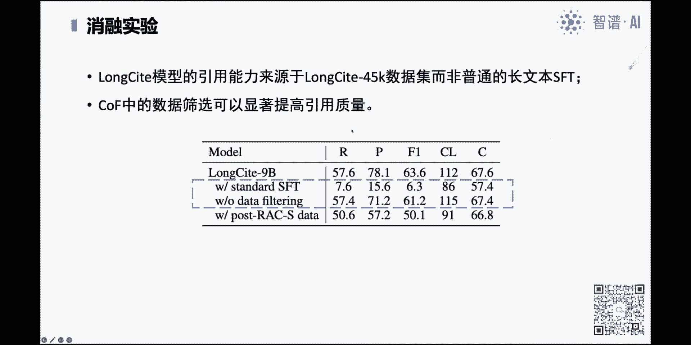

除此之外，我们也探究了一下，回答正确性跟引用的质量之间的关系，我们就把就是数据呃，测试数据根据它的正确性分为了三组，分别是零到1/3，1/3到2/3，然后1/3得分是2/3到一这样三组。

然后来算了一下他们每组的SETATIONF1的平均值，就可以看到，随着我回答正确性变得更高，它的引用质量也会变得更高，这个是符合认知的，因为因为就是说，如果这个模型他的回答的正确性变高了之后。

这说明他的幻觉更少，就他每句话在原文中可能都是有依据的，所以说我找这个citation，它也会变得更容易，如果我的正确性很低，那么就说明我这个回答中，可能有很多捏造的事实，他也找不到原来的引用。

就这个发现也是比较符合直觉的。

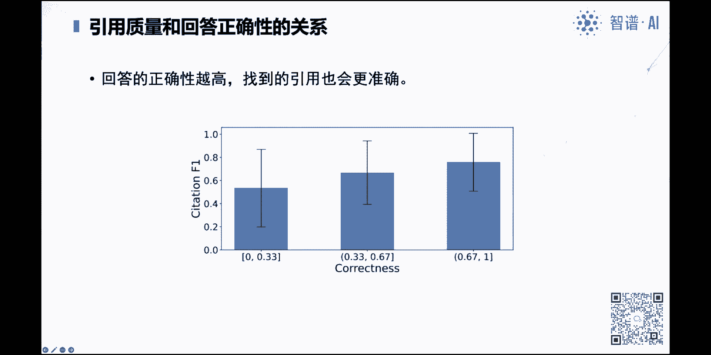

呃最后的话这里就做了一个简单的demo，就是我们现在模型的demo哦，就我们先上传一个文档，其实上传的就是我们的论文，然后就问了一下这篇数据用了什么数据，数据构造方法，然后他就得到了一个回答。

然后每个每句话后面都有一些标号，我们可以通过点击这个标号得到，在右边这里看到每句话，它对应的一个具体的引用，可以看到这个引用它其实是非常细腻的的，但基本上能准确的找到我左边回答所对应的，右边的这句话。

用户一看到这个的话，他就很可以很清晰的验证，就是很简单的验证，我模型叔说的这句话是不是被原文所支持的。

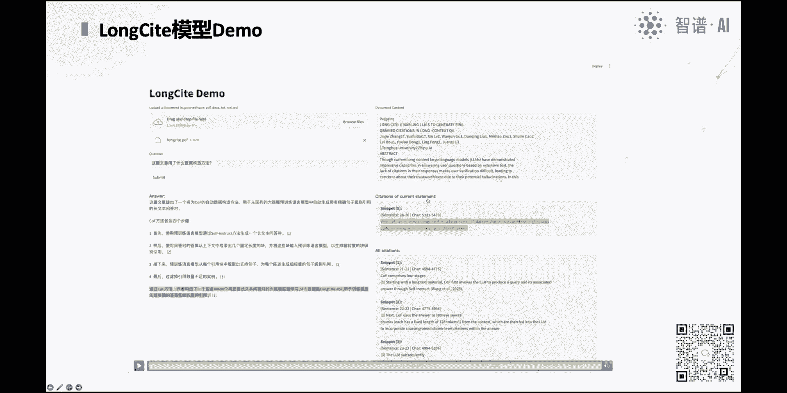

哦然后其实long set的工作也有一些局限，就是说long set就我加citation，其实只能为模型的输出添加引用，从而帮助用户去验证我的信息，但它其实并不能彻底解决模型的幻觉问题。

对呃就算我这句话错了，然后我有一个引用用户，他可能知道我这句话是错的，但他不能从根本上解决这个模型，他为什么会说出这这样一个错误的话，对，虽然就是实验上它可以一定程度上减少幻觉。

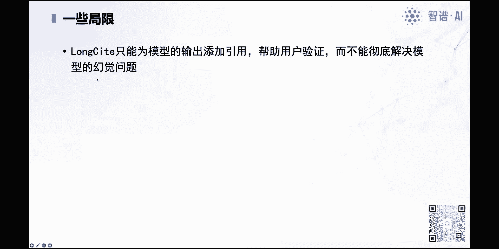

但它不能彻底解决这个问题哦，最后是我们的总结，就是说首先一点就是说，在常文本问答中加入引用，是可以提高模型的可验证性和可信度，改善用户的体验嗯，第二点是说高质量的SFT数据。

可以有效的增强长文本模型添加引用的能力哦，第三点啊，也就是我们的实验结果呃，相较于普通的SFT，带有引用信息的SFT可以减少模型的幻觉，而且使其更均匀地利用上下文，从而进一步提升其回答的正确性。

最后是我们的一个就是以后的一个展望，就是现在我们只是通过SFD的方法，去进行一个训练的模型，训练模型，但其实这个方法它带有一些天然的reward，就我其实可以把可以把我最后的那个。

citation的得分当做一个reward，那么通过一些反思的策略或者是强化学习，可不可以进一步提升模型的引用能力呢，然后我再把这个引用的文本，跟我模型的输出做一个反思，他是不是我通过一些后处理。

是不是还可以进一步降低模型的幻觉，这个也是可以值得探究的一些方向哦。

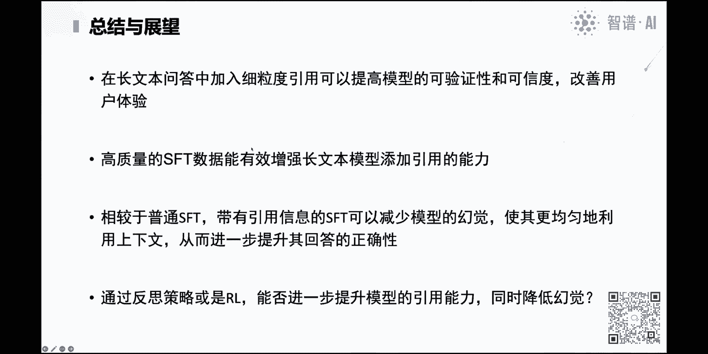

