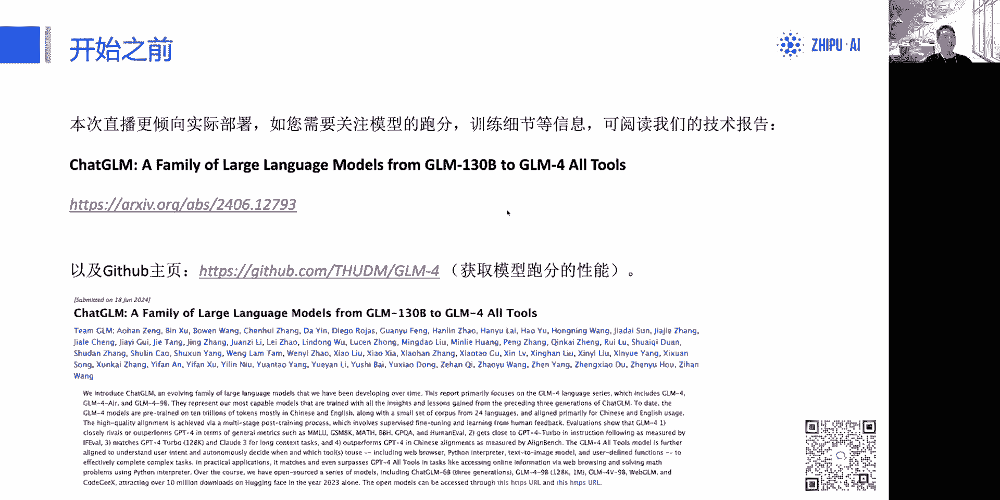
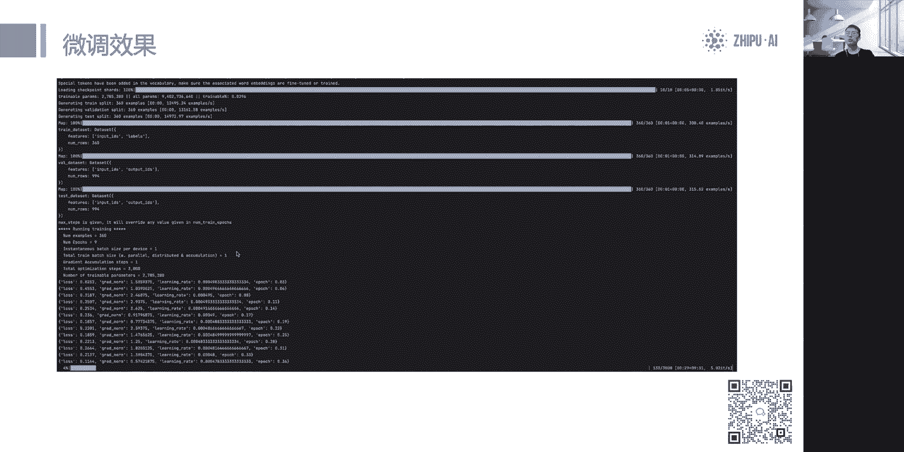
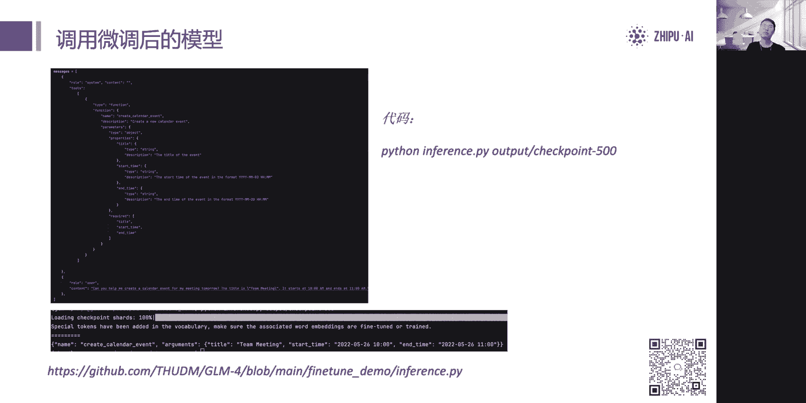

# 「官方教程」GLM-4-9B 实战部署和微调 - P1 - ChatGLM - BV1mw4m1Y7eZ

我一开始那大家晚上好，然后今天的话我的直播啊是讲这个gm4啊，这一代的开源模型，9B这个大小的，开源模型的实战部署和微调的部分好，然后我也是这次主讲人张宇轩。

好那我们今天会从三个部分来讲，我们的开源模型啊，就是承接上我们发布会的内容对，而是在发布会之后我们去做的一些呃工作，以及我们收到大家的需求啊，做了一些改进对，也会这次跟大家进行分享。

那么第一个环节就是关于模型部署，最普通的部署以及现在的加速部署的一些工作，那同时第二步会讲一下模型的微调啊，包括我们用呃，讲了部分是关于我们的对话模型的，然后同时我们会提到工具微调这个工作。

那第三步的话就是关于这个，我们去收集一些大家问题的一个时间，大家可以在评论区去，或者我们的GITHUB1宿，这是最好的，你让我们的GITHUB1宿去提出一些bug，提出一些这个需求。

然后我们能够根据自己需求去排期，去不断的去做一些接下来的工作和适配计划好，首先的话在开始之前啊，我要先强调一下，本次的这个直播，是不会再重复我们发布会的内容了，也就是关于模型介绍的部分。

和我们模型的发展历史，我们就不再强调呃，大家可以在我们的这个技术报告里面，可以看到我们的模型的发展历史，以及模型的跑分性能好，在这个地方都是有写上的，所以关于这部分内容我就不再重复。

大家可以在我们的read me里面看到，如果你对这方面有兴趣啊，可以在我们这篇技术报告里啊，看看一下更详细的一些信息，好这是写在前面的位置，那今天我们就会直接假装大家都已经就假设啊。

大家都已经听过这个模型，然后我们会从模型的下载开始讲好。

第一环节就是模型部署的环节好。

那我们有两个地方可以下，一个是这个摩达，一个谭英face好，那两个地方都是可以下的，然后目前来看呃，有遇到过一个bug，是关于这个用hain face c o i demo啊，用这个COI。

HENFCOI这个方法来下载命令行，来下载的时候，可能会出现这个下一半就下不了，model gm这个文件啊，一般重新试一试就可以了啊，ptab issue有这个问题，重新试一试就可以了。

这应该是下载单词的文件过大了导致的，那么使用git的话，我已经测试了，无论是摩拉还是hin face都没有问题，对那一定记住要去空，我们最新的这个代码，也就是6月20日的更新。

当然也可以扣我们今天更新的这个版本啊，今天课文那个更新支持了这个flash attention2，这个功能，所以呃建议还是用这个pol的方法，把最新的一些文件拉下来，模型权重不用改，权重是没有改的。

改的都是配置文件和一些推理的部分，那这段代码已经修复了很多已知的bug了，那当然肯定还会有一些新的，可能我们没有发现的地方，哎呀欢迎大家提出，我们会很快进行更新，这是下载的部分呃。

然后两边的话是同步的啊，不存在这不存在，可能说哈根face领先或者摩达这个领先的情况，两边是同步的啊，顶多就差几分钟，对我是我来同步一起往上传的好，然后呃简单的讲一下我们这几个模型，那不同的地方啊。

然后这个大家下的时候要区分一下，首先这个9BE这个模型它是不是对话模型，它是个基座模型，它不能对话对，然后支持的是8K以上下文，然后gm9b chat和gm9BEM啊，他是9b chat em。

他这两个都是对话模型，然后呢支持em的上下文，然后支持128K啊，短的就是没有加em的，这个备注是短的，长的就是呃chat em它是有这个算em的上下文的，那具备这两个模型都具备工具调用的能力好。

然后还有一个是这个4V啊，4V1的文，它是个视觉的对话模型VQA模型，然后还支持8K的上下文，然后如果你在我们的big model平台看到gm4flash，它的目前是我们gm49b chat。

开源模型的版本啊。

这是不同的一个区别，大家在下的时候需要注意的，然后呢在真正开始部署之前啊，如果你对你的硬件有一定的怀疑啊，可以看下这张表格，这张表格是讲到了我们所需要的一些硬件配置，那其中gm49b chi啊。

他的这个输入长度和推理，要的推理的要求就最低的，这个呃所需要GPU的一些限制，是跟那个长度有关的，也就是大家如果用了这个长度越长，所需要的这个嗯显存就越高啊，那这边给了几个关键的一个数据，好在左边。

那em的话呃，是一定要使用VL2M进行推理的，单卡的话基本上没有太大意义，因为到了后期以后，所需要占用的这个现存是非常高的，所以这是em的这个模型，需要使用VRM和英呃，英伟达专业的这个推理卡和计算卡。

来完成这样的推理工作，OK那关于4V9B的话啊，虽然它是个9B模型，但其实如果大家不想去看这张表格，或者说大家用一句话简短表达，你可以按照13B到14B这个模型的量级，去估算你所需要的显存，对。

可以按这个量级的模型去估算你所需要的显存，因为我们还有一个vision的模块，然后gm4V9B它是一个VQA的模型，所以它是要配合图像的，当然它没有图像，也可以聊天，也可以纯纯对话。

但是效果没有这个chat好，效果是没有chat好的，然后也只是8K的这个上下文，那gm4V9B一共支持一张图像，在一个对话中，这是一张图像，下面这个链接就是讲啊，就是这个图啊。

这张图配置表所在的这个地址，在我们的开源仓库中其实是提到的。

OK额在这一次的部署里面，其实我要重点讲的是OPENAI的这个server，那这个部分呃其实已经有非常多次的这个实践，大家都就是在我收到了非常非常多的，这个已久啊，这玩意没有对齐的部分，那接下来的话。

我们就对这个方面做了很多次的改进，那到今天直播之前呃，这个功能已经基本达到了一个完全对标，open a类接口的一个呃样子啊，对包括方声扣，非防尘口以及流式和非流式的输出，已经全部都支持啊。

这个是我们去做的一个接口，所以如果你出现了部署中啊，就是部署以后，比如说你想适配到long chain，你想适配到这个一些开源框架里面，也不太清楚怎么直接从本地模型适配过去。

那其实我的建议就是从我们的仓库中拉取这个，类open nei的接口，然后拿它启动以后之后，全部按照OPENAIAPI的格式来做啊，就可以了，这个就不用再管其他的内容了，对那这个是我们的一个推荐。

大家去应用到自己框架中的一个推理的部分，推荐这么做，然后现在这个OpenAI的这个demo，它的底座是VLLLM来做的，对它不是全ANSFORMERS的那个库，所以的话呃。

可能需要熟悉一下V2M的一些相关操作，以及可能需要使用LINUX来完成这个demo的部署，那windows系统上我们之后会有这个相关的计划，我之后会提到去把它加上。

我们的high infist silence，好，这个就是这一页所要讲的内容，也是我认为呃推理中比较简单易懂的一个部分。

就大家可以直接这样一键的去部署，OK那它的好处我刚才也提到了啊，就是这个它上面的三个好处好，但需要几个注意，就是在实践部署的时候啊，大家会发现这些问题，我在这边也一并解释一下好。

首先这这个LADEMO啊，它这个调用它同时只能调用一个工具，虽然呃就是在这个demo里面，我只设置它只能同时调用一个工具，对，那如果你的这个规划是要让他遇到多个工具的。

那可能还需要用到其他的这个额框架来完成，也就是在单人的这个方形框里面，他只能扣一个工具，然后第二个呃，我们这个扣工具的时候，它的长度默认就有8K，这上面有一个一会这个代码上面会让大家看到。

我们这个设置成8K是因为这个显存的限制，大部分人的卡是24G的显卡，我们设置成了8K，而如果你是80G的显卡啊，这个地方可以往上拉，对这个地方可以往上拉去，防止出现这个呃显存溢出的问题。

如果你的显存比较小，那同时我们这个VM启动的时候，VM启动的时候，也推荐大家去设置一下这个8K的长度，对设置一下这个8K的一个长度，这样子可以防止VM一下起来之后把内存爆了，显存爆了这个情况。

OK然后同时的话这个demo它是没有做微调模型的，适配的，也就是微调模型的话，VRL里面是有一个教程，它可以去manage这个LOA或者p t union，的一个模型全中，然后用VM进行载入。

那这个地方我们跟VM完全一样，我们就没有重复再写一遍，这个代码就没有做这个重复造轮子的工作，那如果你是微调的模型，比如说你有个ROA的权重，那还有个put的，有个PU0的这个权重。

那你就学习VR2M这官方的代码啊，他会告诉你怎么去合并到这个VM里面进行加载，那需要修改的点也就是模型加载的一部分啊，不需要修改其他模型结构上的部分，然推理的这个代码都不需要改，要改就模型加载的位置好。

那这是openly这个基本的demo，我觉得是最啊最常用的，也是目前问题最多的一个demo k，然后也有人想体验我们完整版的demo，完整版的demo的话就跟我们发布会是同样的。

对他跟我们发布会是同样的一个demo，然后呢，他也是完整的集成了我们gm4的开源模型的，几个重要的更新，一个是这个啊AUTOOLS能力啊，我们是在王者demo里面接入了我们的co个build的。

画图的API以及联网那个API的入口，那大家只需要填上这两个入口的key，就可以完成工作，然后就提升到了一个代码里面，那同时呢它也是我们这个这个这个demo，也是能够做这个文档解析的啊。

我们看到左边的图有文档解读的工作，那它也是支持em上下文的长度的，对可以解答这么长文本的一个输入啊，但是需要注意的是，EM的长文本，我刚才也提到了，即使用BIN啊来进行后端的这个载入，不然实在太慢了。

所响太慢太慢，而且所占用的显存非常高，那我们一般都会使用巴卡100，八卡H100这样的设备作为推理啊，仅仅作为推理来推理一个完整的em长度的输入，来完成这样一个工作，而且单单次推的时间是非常长的啊。

所以如果大家对这方面有兴趣的话，是可以去在这个TGI啊，TENSRT这样的，特斯RTLLLM这样的一些开源框架，去尝试去更新或者去修改啊，然后自己进行一些这个深度的一个加速啊，能让它变得更快。

那目前的话这个成绩是VLLM的成绩，TGI跟这个TENSRTLM可以更快啊，好，那刚才讲了非常多关于VLLM这个底座的demo，对，那我也看到了非常非常多的这个一休，是关于这个启动的问题。

因为有很多人的一休是直接从VRM启动的，就VM的那个docker可以直接起来，但是呢会发现他停不下来，这是个很经典的问题，就是这个gm4停不下来了，就一直说或者乱回答，其实这个问题非常的简单。

它是因为我们的这个stop token d没设置好，就是我们的这个新的模型文件，已经是三个special token id了，只有三个stop id。

分别是end of path1511329和user15，1336和observation151338啊，这几个特殊的id都是我们的stop id对，那没有停下来，是因为默认的VRM载入的时候。

是151329，但是这个是啊我们在这个用户对话的时候呃，u s i id通常是151336，所以这个id才是真正停下来的id啊，才会导致才能让它停下来，所以在我们官方demo里面都是把这三个数啊。

已经合到了代码里面，对这是跟直接一键启动vivo docker是有一点区别的，这是大家需要注意的一个地方，那同时呢VM官方的那个demo就OPENAI的那个啊，格式啊，他是他暂时是不具备攻击调用的。

就是在我看的版本的时候，他还没有这个工具调用方式扣的部分啊，这是需要强调的一点，所以我们我推荐就是使用我们官方仓库的这个，open ademo来完成这件事情，然后第四点的话模型推理啊。

我们推荐非常推荐使用这个bf16，来进行推理，那F16在我们实测中，是有极小的概率会出现问题的，这概率非常的低啊，但有可能出现对，但是呢训练有微调部分，LP16是一定不能调的。

LP16调的时候会出现这个lost为难的问题，精度溢出来，所以在微调的时候一定要使用bf16好，那么以及我们所有的跑分，就是上面GITHUB上面所有的跑分展示的效果，以及我们的一些demo。

全部都是在bf16的精度进行测试的啊，这是我们需要强调的，部署的时候，你可能会出现的一些问题，OK那第一点啊是我要澄清一下，是这个模型工具调用和模型对执行这个工具，这其实是两个不同的工作啊。

模型的工具调用是它能够根据用户传入的工具，然后能够识别到呃，我要去调用一个工具，那我输入的模型返回一般就是一个c on啊，exist字段，那在gm里面的格式是第一行是模型名称。

第二行开始是一个标准的JSON字段，代表了这个每一个键，以及说这个键对应传入的一些值，这是公共调用的内容，但是呢这是工具调用，不是工具执行啊，执行的部分啊，怎么去执行这个工具啊。

这个是一般是要用工程化来完成的啊，这并不在一个模型和能力范围之内啊，但是这个工具执行完了以后啊，得到了这个返回观察值observation，然而与这个这个string的形式或者以JSON形式啊。

JASON的成string，然后传话给这个传到模型的里面，那模型作为一个下一次的输入，然然后来进行salts，所以这是两次的模型推理，第一次是扣工具啊，就是防身扣，那扣到了以后工具去执行。

然后得到一个observation，然后再be back跟模型第二次调用，得到下一个工作啊，这是两次调用啊，所以模型没有办法执行工具，在我们的完整demo里面，执行工具的部分。

也是由我们提前注册好的Python代码来实现的啊，如果对这些地方有兴趣的同学，可以看一下我们的这个仓库里面的代码，OK然后还有几个注意点，就gm4V9B刚才提到了，他是支持一张图片啊。

机供只支持一张图片啊，图片的大小是1120和120啊，它图片占用的party长度是固定的，OK然后呢这个地方还需要记住一点，就是9B4B9B的话啊，我们用的是这个，昨天也有这个一九。

提到了这个system prompt的问题啊，我们其实用的是这个user和assistant，Assistant，这个指令跟约水可能没有chat来源强好，这也是这个需要注意的一点，以及同时部署的时候。

需要按照13倍的模型设备来进行评估，那同时呢我们在这个demo里面，是把gm4V9B的demo运行的时候，是让大家一开始就输入图像的啊，这也是希望呃，大家能把图像放在第一个对话的位置啊。

这也符合我们现在的模型结构，OK所以大家一定要结合自己的实际使用场景啊，去选择合适的模型啊，那gm4V9V的攻击电网能力就远远不如，gm49v ch啊，这是个VKA类对话的模型。

好那推理的部分啊，我先讲到这，然后我会共享代码。

把刚才几个需要注意的点，用代码形式展现出来嗯，在这个代码里面也就是VRM其中的部分啊，有几个需要注意的点是我们已经提前做好的，首先就是这个啊占用显存的比例啊，这也是最近一个一九有提到的，VRI默认是0。

9，当然你可以根据你的需要进行修改，比如说你有一张80G显存的显卡，那这个地方设成0。3，那V2M最多就占用24G的显存，24G好，那默认是0。9，这个值，这是需要一个注意的点。

如果你有多张显卡就改这个值，你有多少张就改成多少就可以了，好这是在模型载入的部分，那刚才提到的8192在这个位置好，这是模型的这个完整的一个长度，当然了，你可以在这个地方进行修改。

这是模型完整的一个长度好，为了限制它爆显存，减少这个报显存的风险，我们这个模型支持128K啊，但是要把128给报的全部用满啊，刚才也看到了，占用的显存是比较高的，所以这是一定要注意的一点好。

然后在我们传入的过程中，我们其实把id已经写好了，这个值在我们默认启动的时候是没有的，所以这也是导致了刚才没有完成，就或者说停不下来的一个主要原因，这也是大家需要注意的一点好，就这个地方是需要注意的。

然后呢我们现在这个模型也支持了这个啊，使用flash attention啊，不管是普通的chat模型还是视觉模型，都是支持flash attention的，对啊大家在载入的时候在这个地方加上这两行。

取消注释就可以了，这是我们加入这个flash attention的办法，如果你想用int4，int4是不行的，int4的话是按照下面的方法进行载入，它也不支持现在发射TENTION。

我们发TENTION必须要在b for16或者for16，这两种啊tap的格式下才能去正常的运行啊，这个需要强调的一点好，这个是关于模模型部署中两个啊，比较容易出问题的地方。

我就介绍到这个位置，然后接下来我会讲模型微调的部分呃，在模型微调的部分。

我讲一下我们的数据集是怎么构建的，呃，嗯这是一个我一会儿会演示的一个部分，好嗯在我先讲一下有两种类型的这个数据集，一种是非工具微调的数据集，就是传统的啊这种数据集。

那这个方法跟OpenAI是完全一样的啊，就完全载入的是这个按照OPENAMESSAGE做一条数据，然后放无数像无数条这样的数据，变成一个大的season，最后以一个JASONL的形式放入那角色。

也就是sistant user和assistant3个环节好，这是非工具的一个数据集的结构好，那工具数据集就比较复杂一点，工具数据集里面啊，这个部分。

首先就是我们要传入一个system和tools的部分，那么system的这个content就是内容是空的啊，必须要为空，因为我们会根据这个呃system的这个特呃。

是否调用工具来构建这个o tools的能力，也就是说其实大家在传入工具调用的时候，是用了gm49B开源模型，这个内置的一套提示词，好，大家可以看看我们的这个chat template里面，看到啊。

它是有固定的这个提示词的，所以这个地方content必须为空，那在载入之后，这个content的位置会被填上啊，我们已经预设好了角色OK，然后下面的话是这个tools的部分。

post的部分的话是描述工具的内容，也就是工具的一些解释，包括我们所需要的type name和discretion，就是这个描述你所需要的参数，和必须要填的参数，这个是工具的部分。

跟OPENAI的API完全一样，下面唯一不一样的在于工具返回的结果呃，的角色啊，在openaa message里面是以tools的形式存在的，而我们是以observation这个角色存在。

这是不一样的地方，那剩下的内容都是一样的，那也这样子，作为一个最小的JSON单元，以多个这样的JSON单元合并，变成一个JSONL作为训练集。

这个是工具与数据集的地方，OK那好我们是怎么处理的啊，我们是怎么处理这个模型微调到这个数据集的，也就是说如果大家不想按照刚才那个格式来做，大家要有自己的格式啊，我们当然欢迎，也就是大家要改代码。

那这里我也会讲解这个代码要怎么去改，首先就是这个数据处理的单元，这也是最重要的一部分，就是如果你不想用上述数据集的格式，你在这边重写数据单元就可以了，OK比较需要注意的是。

这个二这个点的位置也是为什么要标二啊，因为我们用apply template构建的时候，我们都会在每个对话前面加上均码，SOOP这个switch token，也就是左边这个代码。

151331和151333这两个space token，而只有接上了这两个special token模型，才是能够正常的处理一条消息的，对啊，但是呢我们可以看到，因为我们要标注好每一部分的损失。

也就是这个用户的输入是不计算损失的，所以我们只是在模型的损失，所以每一条数据我们都是单独处理的，我们会打标签，那对于这个数据，我每次都会进行apply chat template。

那其实我就产生了很多个重复的SOP，这个部分，too much soo p这部分，所以我每次都只取到它，居much a o p后面的部分，也就是从user开始取，从右侧取之后啊，把它拼接起来。

最后再开始加上一个局麻SOOP的部分，我们可以看到下面有一张图，那这张图就是关于这个拼接和拼接，拼接前和拼接后的一个结果，在前面加上了两个特殊的special token，来保证这个消息是完整的啊。

是符合我们的这个对话格式的好，这个是模型微调数据处理的部分，那至于剩下不计算loss的部分。

我们的label全部变成了-100就可以了，OK然后又讲到这个我们模型启动的脚本啊，我们这个模型的脚本还是比较简单的啊，一共就一行代码启动啊，比如说单卡启动，那我们就是这个按照上面这行。

每个字段分别就是前面指定一张卡嘛，啊指定一张卡，然后我们的这个Python Python指定这个文件，那第一个棕色字段就是我们数据集的位置，按照我刚才整理好的数据集，分为train和DEV两个文件。

第二个就是模型的地址啊，第三个就是我们里面的罗拉这个配置文件啊，包括rank啊，包括了这个阿尔帕罗拉阿尔帕，以及包括了这个学学习力啊，啊训练的一些参数放在这个位置，那如果你是多卡启动。

那就按照下面那个部分，你就不用指定一张卡了，你就是多卡啊，直接从上面这条命令启动以后，设定好你的节点啊，每个基多少张卡，那同时后面内容都不用变，那我这里为什么用SFT呢。

因为这个是一个这是SFT的这个配置文件，就是全量的全量微调的配置文件，放在多卡启动的位置好。

那我们到代码的这个位置来看一下，那上代码之前会有个效果，如果你正常微调，你就看到大概是这样子的样子，就前面的话啊它是载入数据集和载入模型，然后后面的话就开始训练了，这是LOLA的方式。

那看到他loss是逐渐降低的好，就大概页面全长这样，这个速度非常快。

那训练完了之后，训练完了之后就会有一个推理的部分，可以推理我们的这个微调的这个模型，那还有代码也都放在了我们的翻译two demo下面好，左边的话就是作为一个推理的部分。

也是按apply chat template的方式进行这个啊，构建啊，构建我们的输入对，那它也包括了我们的function啊，tools以及我们这个用户输入的部分，那下面这部分的内容就是左下角这张图。

就展示了我们微调以后的模型，它输出出来的样子啊，这是微调以后的结果好，我们看到他的输出方式，其实已经跟我们的这个gm m本身，是不太一样的了，gm m本身是会输出create。

然后下面第二行才是这个对应的JSON，代表每个字段，而这里的话它是按照这个JSON字段来输出，那就是你想变成你想变成你想要做的啊，工具调用的微调一个方式好，这是呃微调这边的一个讲解。

然后我会到代码里面来讲。

我们现在在这个代码中，那么在微调的部分，use fighting demo缩小，Right to nel，其实是我们这一次微调的，全部的代码都在这个位置，三分恐B分别代表了用了d s zero，Two。

zero three两种两种方式啊，的这个用DSS这个方式来做的啊，微调下面三份文件分别是LOLA，be tning和SFT的啊，三份文件啊，就是对应的配置，包括你可以在里面改学习力以及训练的文件啊。

训练验证集的文件啊，测试集的文件都可以在这边改啊，包括对应的保存的权重的这个轮次，都可以这边直接执行好，这个就是代码中啊，关于这部分的一个配置文件的讲解，然后在read me里面啊。

其实我们的read me讲的非常详细的，所以大家有问题可以先看下我们的read me，包括我们的配置要求啊，其实都已经给大家去讲了，OK啊数据集的格式在这里。

我们直接用这个markdown的形式标了一份出来啊。

大家也可以参考这个markdown的形式，来标注一份JSON文件好，这就是一个典型的例子，这个例子是非常典型的对，那么它的格式这样是作为一个完整的JSON格式的，你到时候的一个完整JSL。

就是包含一堆这样的数据，这边也包含一堆这样的数据，然后叫它为train，或者叫它为任何一个文件，同时你要在LUA里面去改这个对应的名字啊，那不需要给到这个完成的绝对路径啊。

因为前面已经说要放这个数据集的位置了，所以不用给到绝对路径，给到相对于那个数位级的相对位置，就可以就可以完成，那真正的推理其实就有这么一个代码，这个代码其实从头到尾都不会不用改了，就完全不用改。

在推理的时候，就是按我刚才说的一行代码就可以推理，好在我们这里我就有一个这个两个数据集，一个是我们给大家看看数据集大概长的什么样，好，这是我们数据集的这个内容。

然后呢我们也可以看到啊，它有两个文件。

一个是train，一个是DEV，那我们训练题就是chain，然后我们的验证题就是DEV，那我们退出来，我们可以打印一下DEV的样子，因为圈太大了，好，它就是一个由无数个这样的JSON字段构成。

一个JSONL啊，就可以进行训练啊啊这个就是这样的一个工作，好这个跟这个质谱耶，开放平台是一样的，然后我们进到这个tool里面也是同样的道理，也是同样的道理，它也是由多个这样的message来构成的。

这样是一个message，上面这个又是一个message啊，需要非常注意的是呃，如果你是用工具微调的方式，一般来说在配置文件里面是需要把额罗拉。

就是或者批评里的这个参数max input max also改长的，一般是要改成长的，因为我们可以看到这一份message里面，它的长度就已经非常长了啊，一般来说只会比这更长，所以这是一个特殊的问。

是连续对话只会比这更长，所以一定要把这个max input max output来改强啊，但这会这个这样的后果，就是导致你的显存是会变高的呃。

某一条显存也跟你这个max input output的长度有关，好这个是我要讲到的一部分。

那么在推理的部分，我们这里也为大家构建好了一个假装的。

就是假设的一个对话场景好，我们推理的时候也是可以完全按照这个apply system，message呃，apply chat template的方式来构建的好，来构建这么一个内容的好。

那为什么要告诉大家，不要在这个微调的时候，不要在system这边写内容，写个空啊，是因为在我们的模型文件里面，我打开我们的模型文件，好我现在把屏幕结束共享到另一个代码里面。

在这个代码里面我们可以看到我们的check template，它其实是在system这边进行了填充啊，这个内容是已经填充好的对，所以如果你想在做微调的时候，这部分是尽量不要改动。

这是我们在这个对齐工作中，已经提示，做好了一个关于这个呃微调的一个系统提示词，就是这个关于这个工具调用的系统提示词，所以这个地方是不建议大家啊去进行修改的，这是需要注意的一个点，所以大家在填的时候呃。

大家在构造数据集的时候，把system放成空就行了，对，因为就算你不放成空，应该也会被直接覆盖掉，会覆盖成这个新的system prompt，OK然后我们接下来就开始去做这个微调的工作。

好我再切回到刚才这个代码呃，这个就是我们现在直接微调的效果啊，开始以后就大概长这样啊，载入入了模型，载入模型之后，然后我们就开始微调之后，就是长这样子了，后面的内容就是他去保存。

保存完以后直接推理就可以了，然后我先让他调一会儿，然后我来进行第三个部分呃。

接下来就是刚才给大家提到的一些问题和需求，好呃。

首先我从这一页开始播放，我们有收到一些已知的问题呃，是在做的，那我们也给大家分享一下我们现在的一个进展，首先对于欧AMA和拉玛CPP这个工作，我们已经去做了一些适配。

那拉玛CPP我们已经有一些相关的PR啊，正在走这个对应的PR流程，那之后的话就是完成代码合并以后，我们也会在我们的GITHUB仓库，第一时间跟大家进行分享，好那下面几个需求啊。

包括gm4V9B的VM推比，那这个我们是有人正在做的，目前是正在做的一个状态，那TRTLM以及如果有同学用的是NEMO，那这部分我已经适配了啊，代码是我来做，那已经适配了。

那适配了以后我们还没有TPR对，那这个地方的话我们正在进行整理，因为要给NVIDIA去提这个pr，如果有用这部分的同学啊，之后可以跟我交流对，然后fast attention的话。

是我们刚刚跟上去的一个内容啊，现在是可以用fast tension v2的版本了，好那下面两个也是我们收到了这个demo啊，收到了这个需求，但是我们还没有这个还没有这个完整的一个呃。

落地就是还在这个调研和部分成设阶段，比如说下面这个opening a demon，我们估计很快会做一版这个han face斯的底座啊，让大家能够去在windows系统吗，或者在这个卖系统来做的，OK啊。

包括我看到了这个far shot，那FISHT也是在我们这个适配的工作中的啊，far shot也会在很快的这个接上，但这个需要大概一定的时间好，那GM4V九B的话。

这个微调的部分啊需要一定的时间进行调整啊，所以这个这个会可能会稍微慢一点，这是目前比较慢的一个工作，好那最后讲一下，就是我们今天啊今天也是质谱，今天刚更新的一个新闻啊，我们这更大尺寸的一个模型啊。

如果你觉得gm49B恰恰不够满足你的需求，那可以去用我们更大的这个尺寸商业模型，那它对应的配套交流层在下面的get up，那如果你是从OpenAI迁过来的，可以在我们的下面这个链接中啊。

去看完整的一个最简单最快的，最低成本的迁移教程，对这个是一个友情链接的部分，好那我今天的呃主演就主讲就到这边结束，然后我会切回去让大家看一下现在微调的成果，我顺便回答一些问题好我来看下大家的问题呃。

gm cm不支持多人对话吗，那肯定支持啊，呃肯定是支持多人对话的，其实多人对话的本质就是把多次对话内容，拼成一个input传到模型中，对呃这就是一个多人对话的最简单的本质对。

所以这个就是肯定支持多人对话的好，呃9月后可以在可以啊，呃我刚才也讲了半天的这个啊啊，使用这个openai demo，就是讲了本地部署以后，转成OPENAI的形式来调用的。

所以这也是我非常推荐大家的一种，推荐部署方式吧，因为这样就不用去担心各种不适配了，反正都是OpenAI的接口，对就不存在了，好啊我这边已经微调完了，可以给大家看下，结果，其实就就是一样的。

一个很简单的一个效果实现吧，对因为我这边只做了最基础的微调的一些工作。

看一下，OK他推理的时候非常简单，他推理的时候就就长这样，对他就是这样子的好推理以后，他就可以得到一个这样的结果，这就是一个微调的效果，因为我实际就想得到这样的一个结果，所以到此我们就微调完成了。

那我们可以看到录音调试结果，都会放在这个output里面啊，里面有很多checkpoint啊，也代表这个每一个这个保存点，那你可以直接就导入保存点的模型。

就像这样output checkpoint就可以了啊，那但是你要注意的一个点啊，就是在checkpoint，比如说我们打开最新的这个1500这个点，好我们可以看到这个configure。

其实是有这个有个绝对路径的，对我们是要把我们的模型放到绝对路径上的，所以这个是需要是如果你的模型有移动位置，原始模型有移动位置，这个地方是需要改的，好这是我们要注意的一个点，呃全参与训练数据啊。

这个脚本没有放出全参与训练的数据，然后这里面是有全参微调，然后微调的话呃全参跟所谓的罗拉啊，这不影响数据集的格式啊，数据集格式是一模一样的，对，好我想要对1万个汉字的文章进行分类，是这样的。

1万个字的文章，其实在我们占用的token一般也只有六，也一般也只有6000~7000token，我们一个token对应1。5左右的这个汉字，所以1万个文字，1万个汉字其实也只有6000个。

6000~7000个token，这并不是一个很大的量，当然是可以推理的，但前提是你的这个显卡能够支持到这个显存，这样的显就是这个值刚好很极限，这个值大概就在24G左右，我不敢保证就是24G能够带动。

可能就是要25G26G对呃，推理的显存大小已经在刚才页面讲到了，我们的read me里面也有写到不同长度的大小，最大的input和output可以设置成多大，你说的是微调还是推理，如果是微调的话。

那这个完全取决于你显存的大小吧，就是这套微调方案并不是一个很高效，或者说很就是极致优化的微调方案，它只是个入门级的微调方优微调方案，所以的话呃如果你是这个微调长度特别长，比如说你想微调输入8K。

输出8K我建议其实是要换微调方案的，不要直接用pet，不然所占用的这个显卡显存太高了，对好，这种方式用la factory微调怎么区别呢，那肯定这个方式比lemon factory入门多，入门多了啊。

这个只是一个附送的微调的脚本对，如果你想要去做这个专业的，比如说你还想做DPOPPO啊，这些东西你可以去用la factory，赤to开源框架下是非常专业的，也支持我们JM4这个模型啊，是完全支持的。

leon factory完全支持，如果你想做专业的微调，可以去用lama factory这个框这个框架，呃关于IG以及这个FT的问题啊，我刚才V100V100是没办法做翻TM的。

至少在我们这个脚本里面做翻译可能不太行，会出现显存溢出，因为他是F16，它不是BF16，OK然后第二个构建IGIG，这是框架的问题，就是你要怎么去结合long cha等这种。

它用框架做IG而不是模型和自身能力，本地部署是够的，viva是go的，那代码解析器如何训练一样的代码，解析器本身是一种方式，扣对它本身调用的是一个Python的解释器。

代码你可以在我们的CORE里面看到，我们的chat里面，他的这个system pro里面，其实是有代码解释器这一种工具的，它本身可以作为一种方声库来进行微调，前提是你有这样的数据。

完整的优质的代码数据作为微调，有点太多了，这问题工具微调多大量合适，那要看你有多少个工具了，因为你的工具不多，然后你的工具就那么一两个，我觉得可能上千条，几百条完全够用，但这种工具非常多。

比如说你有二三十个，四五十个工具，那还是建议找到几千条的数据，呃欧拉玛是在这个计划中的啊，大家不用急，这个是在计划中肯定会做的，不可能不做欧拉马的，肯定是会做的，然后GGUF那肯定是配套，我拉满了。

包括现在拉玛CPP本身都是配套了，GGUF的方式，K test to s q l l task to sql，本身也是一种特殊的模型输出格式，其实你只要做普通的输入输出就可以了啊。

因为它本身其实只是对输出做了规范化啊，就是要达到这个达到这个呃，就是能够让SQL理解代码，所以本质上还是一种输入和输出对，所以这个这个并不属于一种，非常特殊的微调方式，只要按照常规的微调来调。

就可以完成这样的任务，我觉得这种东西最大的难点在于，你有没有足够的数据对，因为这些数据非常的重要，呃gm49B有支持多角色对话应用吗，没有看懂呃，这个似乎是凯尔特GM干的事情。

我们的多角色是指的是user assistant，和这个observation这样的一些工作，对修改模型的精度什么意思哦，这个修改模型的精度，我把这个视频啊，把这个代码给大家看一下。

有有人有这样的意见呃，有这样的问题我给大家看一下吧，呃在模型载入的时候，就在这边改这行，这行就是模型的一个精度的位置啊，这行你想想改成什么精度都可以，比如说pro16solo32。

一般不会有人用pro32吧，对然后比如说想用int4啊，就load04BT，加上一个落地04BT的这个代码就可以了，呃调用工具的A选部分有示例代码吗，我们的copy demo就是这个demo。

这个demo里面本身就是有注册工具的，SRC里面我们用tools，我们没有tools，然后能够呃在这边注册一些工具，比如说co个view工具，比如说这个代码解释的工具。

呃prefix lava可以用PERFEX微调吗，拉马可以啊，但对但是跟今天内容关系好像不大对，额量化版权重吗，呃目前只有BFF16吧，对目前只有BF16哦，我还能回答的问题是呃，我还能回答几个问题。

我来回答一下大家啊，V100是没办法调的，V100是没办法调的，至少在现在这个脚本上是没有办法调的，会出现精度溢出的问题，问题有点太多了，大家可以在这个那个那个加入群问一下，我也只能回答一部分。

支持AWQ当然支持，但问题是我们没有放出AWQ的这个量化权重，你需要自己AWQ，呃支持小语种吗，当然了，gm4支持二十八二十二十六种语言，对gm四二十六种的语言啊，支持这个小语种的，当然可以对。

然后今天的直播是没有关于这个，模型介绍的部分啊，所以就大家就是如果是关于模型的，这个这个相关的一些跑分结果，包括他的feature啊，四个要是带我们技术，包括看的今天时间明显很紧张。

对呃必须用对话数据微调吗，当然不是必须了，你如果用base模型调就不是，但如果你用其他的，那必须是对话，OK如果你是best的话，可以用很多种方式调就读后续写，当然还是可以的，对好了。

那我还能再回答一个问题呃，差不多了，看一下，我用了什么框架啊，我原本我这份直播的就是这份gm4开源仓库，大家可以多看我们的开源仓库啊，然后有问题在里面提一个英雄，那挺好的对。

然后呢我们支持用什么样的框架，我们用我这个用的啊，我这个用的就是transport加pet p e f t，这个框架对，就没有没有额外的操作，因为有时间有限啊，所以我就A100是可以微调的。

A100肯定可以微调，对一张就能微调了，一张能做呃，LOLA那多张能做STOK那现在我时间有限，我我们看到我已经没有办法回答更多的问题了，大家可以在这个呃群内啊进行这个沟通，然后我们会嗯回答大家的问题。

那同时如果你有发现代码的bug，那可以在我们的这个github issue上提这个代码，bug其实越提越多越好，在GITHUB提的issue我们一定是会受理的，对一定是会受力的，然后就一定会回复。

然后GIUB上的PR我们也是看得最快的，所以也是欢迎大家在这个GITHUB上面进行，提一求和PR的工作，然后我看一下啊，最大内存能跑得起gm4，内存跟显存要求一样，就是这个内存的话。

你只要达到这个额对应的显存要求，就能跑出同样的效果啊，内存显存是一样的，那128K跟8K的长度，在我们read b已经写了行，那我就先回来到这边，主持人。

