# 「智谱AI OpenDay」新一代视频生成模型 CogVideoX - P1 - ChatGLM - BV1vH4y1c76a

Hello，大家好，欢迎来到智朴open day啊，这次呢很高兴以这种形式跟大家见面，6月的open day上，我和大家都说过，未来智普呢会举办更多类似的活动，及时的和大家沟通。

我们在工作上的最新进展和阶段性的一些成果，今天呢我们的重点放在多模态模型上，首先呢我们得回答一个核心的问题，为什么需要多模态，特别是原生的多模态大模型，这就要回到人类大脑的工作方式上。

作为一个复杂的系统，认知的功能，是通过各脑区相互配合完成的。

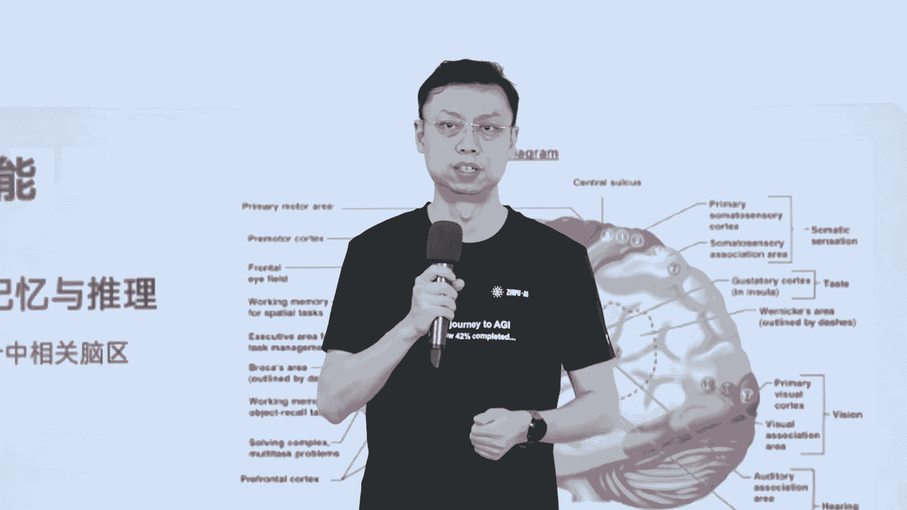

不仅包括了文字语言，还有包括视觉理解，听觉等等，所以说多模态的感知和理解啊，同认知能力的发展有非常密切的关系，作为一家目标是AGI的人工智能公司，智普一直以来都非常重视多模态技术。

这里呢我想引用物理学大师费曼说过一句话，不创造一个东西就不会理解一个东西，费曼大师并不是在人工智能的语境下说的，这句话，但我想这句话非常适合用来形容，质朴在多模态领域的观点，从文字图像到视频内容。

这既是一个模态逐渐丰富的过程，也是一个大模型对世界的理解逐渐复杂，多维化的过程，质朴的团队从2021年开始，布局纹身图和纹身饰品的模型，先后研发了coco view，Cover video。

relay diffusion等多个模型，第一代的coco view使用了单向的transformer结构，对成对的文本和图像进行了深层次的预训练。

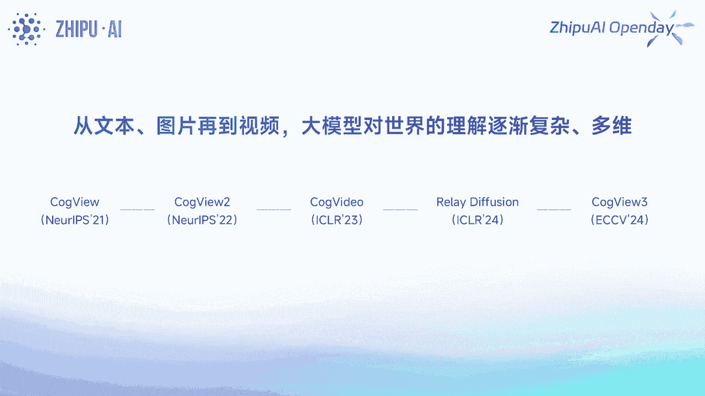

2021年发布的时候呢，在所有的指标上都超过了open AI，同期推出的达利模型，而最新的coo view3的性能和达利三也旗鼓相当，那么今天我很高兴给大家汇报，我们在多模态领域的又一阶段性的成果。

那就是我们全新升级的生成式视频模型，call个video x概括起来，它主要有下面的几个技术特点，首先为了解决内容连贯性的问题，智谱自研了一个高效的三维变分，自编码器的结构，我们称它为3DVAE。

将原视频空间压缩至2%大小，大大减少了视频扩散，生成模型的训练成本和训练的难度，配合上3D rope位置编码的模块，更有利于在时间维度上捕捉真正的关系，建立起视频中长城的依赖，第二点呢是可控性。

智谱自研了一个端到端的视频理解模型，用于为海量的视频数据，生成详细的贴合内容的描述文本，这样可以增强模型的文本理解和指令，遵循的能力，使得生成的视频更符合用户的输入。

能够理解超长的超复杂的prompt指令，最后啊，我们模型采用了将文本时间，空间，三个维度全部融合起来的transformer的架构，它摒弃了传统的cross attention模块。

并设计了expert block，将文本和视频两个不同模态的空间进行对齐，以及full tension，能够更好地进行模态交互，当然这个技术的研发过程本身，充满各种挑战和难度，但今天我们很高兴地说。

质朴又一次验证了scanning law，在视频生成方面的有效性，未来智普会在继续scale up，数据规模和模型规模的同时，探究更具突破式，创新的新型的模型架构，更高效的压缩视频信息。

更充分的融合文本和视频的内容，由此呢，质朴也再次完成了对open AI模型。

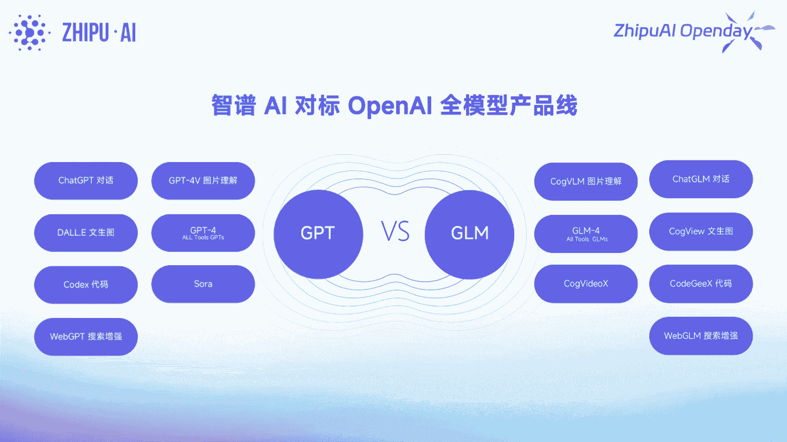

产品线的全面对标，此次视频生成模型的发布，我们衷心感谢北京市在质朴发展道路上，尤其是海淀区在投资算力补贴，生态环境建设等方面给予的大力协助，同时本次视频生成模型的研发，还要特别鸣谢我们的算力合作伙伴。

亦庄人工智能公共算力平台，感谢亦庄在算力策的大力支持，哔哩哔哩，B站也大力支持了我们，在生成式视频模型的研发，我们的合作伙伴华策影视，也在我们技术研发中提供了宝贵的支持，在此呢一并向他们表示衷心的感谢。

俗话说啊，百闻不如一见，前面技术部分的时候呢，我们说了很多，接下来来点干货，从此时此刻开始，清影在我们的质朴，青岩的PCAPP端以及小程序端，全面的正式上线。

所有的C端用户都能够通过青岩APP，使用我们的AI视频生成功能，清影免费的体验AI文声视频，图声视频的能力。

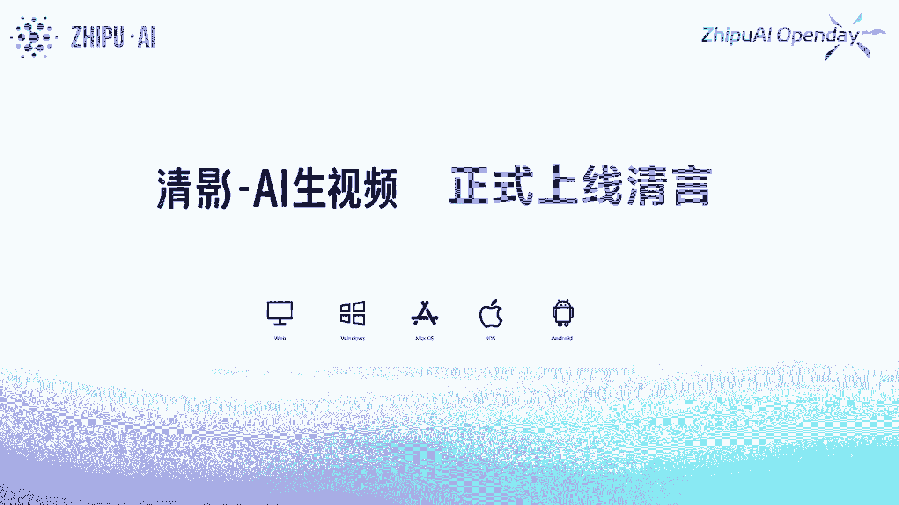

全量上限不限量的使用，这就是我们质朴AI的风格。

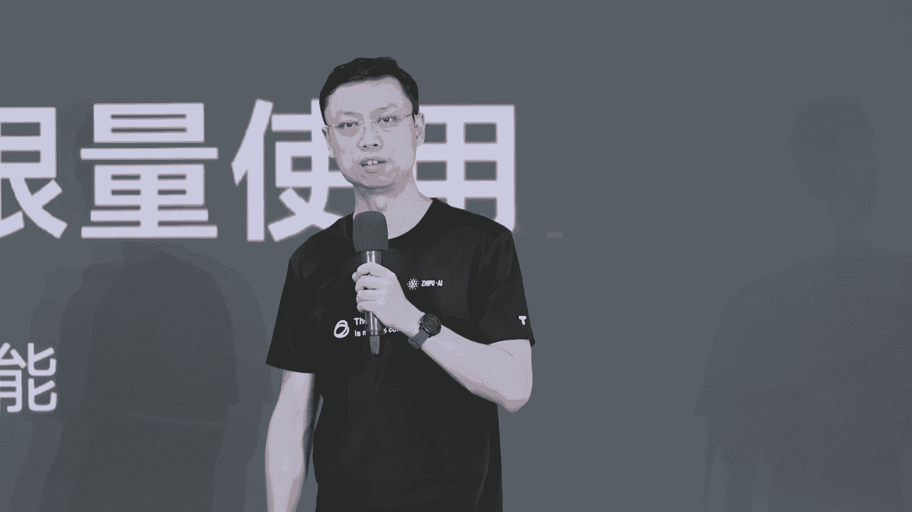

无论是没有视频制作基础的普通用户，还是专业的视频内容的创作者。

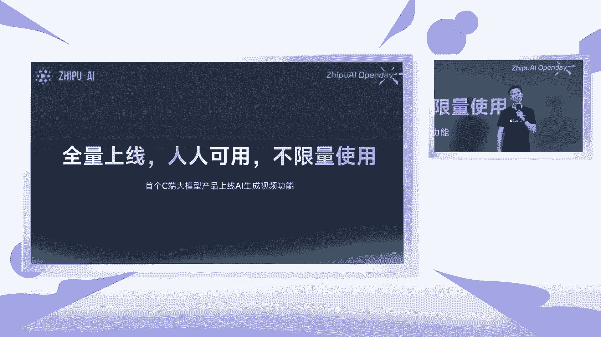

大家此时此刻，就可以在PC端和移动端进行体验，下面呢我们来看一个清影介绍的短片。

看完短片，接下来给大家介绍轻影的几个特点，首先是在生成时间上，理论上牵引每生成六秒的视频，只需要花费30秒的时间。

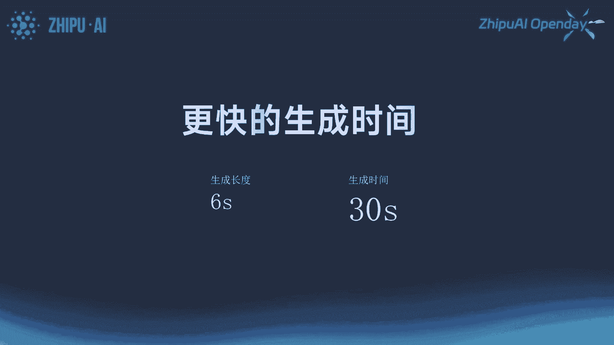

这个速度可以说还比较快了，我请工作人员来现场给大家演示一下。

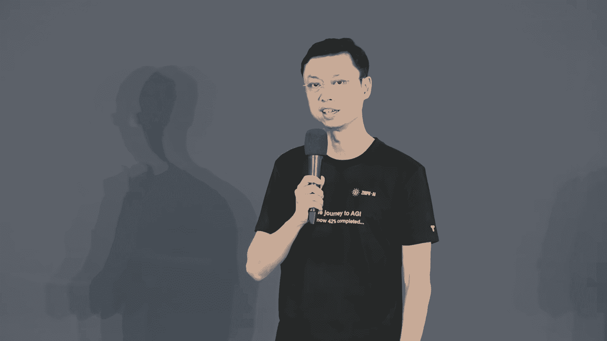

啊我们可以看到说当前的这样的一个请求，已经在排队生成当中，这样的一个prompt，包括了对视频内容的一个要求。

写实地描绘近距离猎豹卧在地上睡觉，身体微微的起伏，我们可以看已经在生成当中了啊，稍稍的等一等。

大家可以拿出你的秒表来掐一掐，这个时间到底经历了多长。

OK啊，可以看到我们已经顺利的完成了，这样的一个短片的视频的这样的一个生成效果，是不是还可以，除了用文字作为prompt输入生成视频，我们还可以利用图片作为我们的输入。

来让我们的模型为我们生成动态的视频，那这里呢我们输入一张图片好。

可以看到我们输入这张花的图片，已经进入了视频生成的队列，预计排队呢显示是2分钟，但其实也许我们不需要哦，你看我们已经开始来制作这样的一个视频了，那么用图作为prompt输入来生成视频呢。

可能比文字的输入要稍微慢那么一点点，当然也还是非常快的，大家可以看一看，好K比刚才花费了更稍微多那么一点点的时间。

我们可以看到一朵花，在短短的几秒钟之内完全盛开的，这样的一个场景还是非常逼真的，那么第二个特点呢，我们前面讲技术的时候说过，轻影可以实现更好的指令遵从的能力呃，很复杂的prompt。

我们轻易也能够理解的比较到位，好，下面我们来看一个例子，在霓虹灯闪烁的，赛博朋克的这样一个风格的城市夜景当中，手持跟拍的镜头缓缓推进，一个机械风格的小猴子，正在用高科技设备进行维修。

周围是闪烁的电子设备，和未来主义风格的装修材料啊，可以看看这样的一个效果，对于整个prompt当中，描述的所有元素都得到了很好的，这样的一个呈现啊，还是很听话的一个模型对吧好，第三个内容是呢连贯性。

基于我们自研的技术的成果，生成的视频，可以比较好地还原物理世界当中的，一些运动的过程，大家可以看到清影，让这幅大家很熟悉的杜甫的画作不仅动了起来，而且非常自然顺滑的端起了一杯咖啡。

第四个是大幅度的画面的调度，在这个例子里边，大家可以看到镜头随着画面的主体，三只狗在流畅自如的移动，就和有人用摄像机跟着一路的跟拍，效果是一样的，那么当然今天生成视频模型才刚刚起步。

整体的模型可以说还有很大的进步的空间，但我们已经受到了很多，产业和客户侧的这种需求，涉及到很多的具体的场景，比如说电商产品的广告宣传，影视特效等等领域。

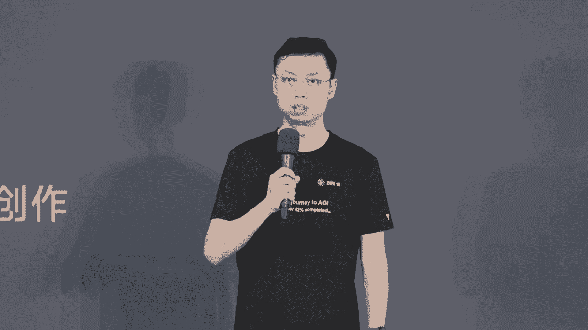

生成的视频已经可以派上实际的用场，这也是我们非常高兴的地方，当然这也是为什么，我们同样在质谱大模型开放平台big model，点CN上上线了生成式视频的模型，企业和开发者可以通过调用API的方式体验。

并且使用COV6X的纹身视频。

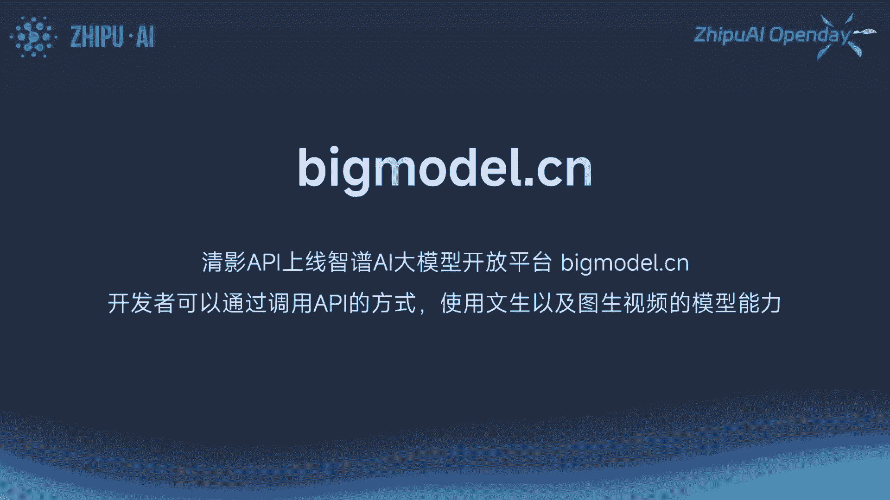

以及图声视频的能力，这在国内还是首次，除了C端用户和B端的企业用户以外，还有深程式视频的创作者，他们也在积极地推动整个产业的发展，近期呢我们也找了部分的这个第三方的创作者，让他们提前内测了模型的能力。

也惊喜地看到了一些非常不错的。

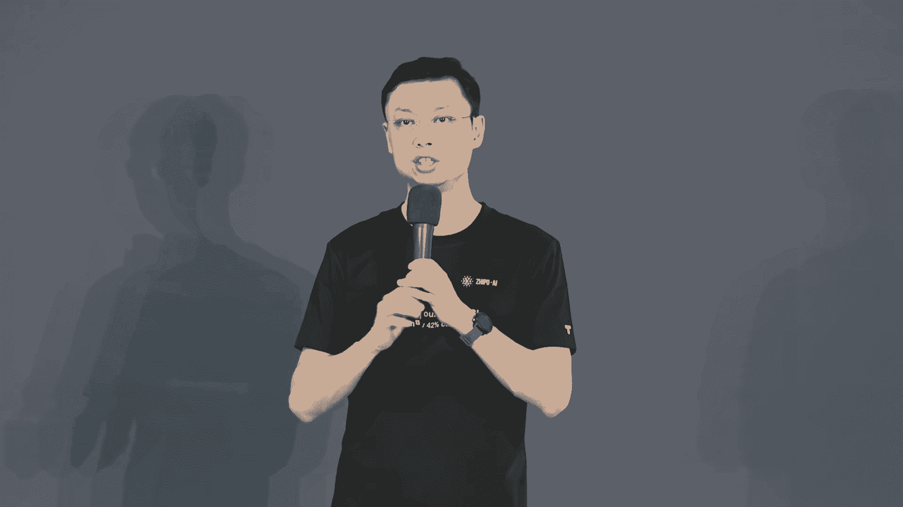

这样的一些作品，接下来请大家观看由创作者制作的两支短片嗯，嘿你还好吗，和你分开之后，我把寻人启事贴满了整个城市，你是不是还戴着奶奶送你的红帽子，每天都会去便利店买第二天的早餐。

还坚持着下雨天喜欢发呆的习惯，总在巴士车上看夕阳，我是你吗，等到雨停以后，我们一起去散步吧。

当普罗米修斯为人类盗来第一颗火种，当仓颉在华夏大地上刻下第一个汉字，当鲁班巧夺天工，造物为器，当潘多拉开启魔盒，命运的车轮开始转动，当科学选中了他的门生，当黑暗中亮起了一盏明灯。

零和一开启新的世界，AI重塑真实与虚拟的边界，人类科技的一小步离终极真理就更近一步，当科幻照进现实，当机器开始像人类一样思考，创新火种无处不在，好刚刚大家看到的是专业级玩家，这次呢我们也豁出去。

把它放在青岩上，面向所有的C端用户开放，大家看完直播都可以直接去玩，这里我也要特别强调，目前深成式视频还是会出现所谓抽卡的现象，即模型生成的很有可能是很好的case，也有可能是很奇怪的case。

这和模型今天的能力，还有产品本身都有一定的关系，大家可能也会在这些case中找到自己的一些乐趣，比如我们同事的头像拉进去加一个prompt，让它变成威震天长翅膀飞走了，那就真的起飞了。

当然这也验证了我们刚刚所说的，指令遵循的能力还是非常强的。

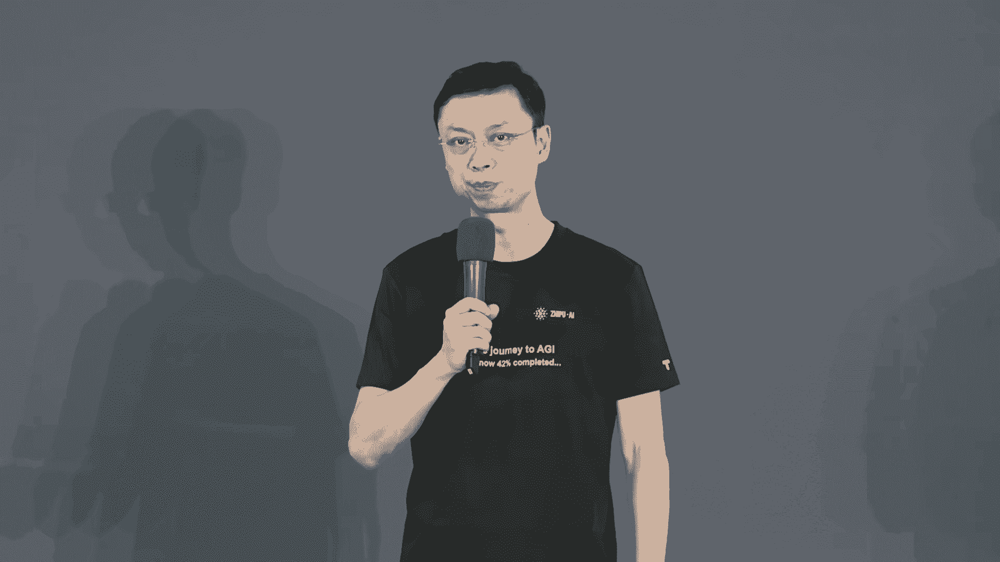

随着牵引功能的加入，质朴清言已经成为市场上少有的集对话代码，智能体，生成式图片和视频在内的全功能AI智能助手。

我们将继续努力迭代，在后续的版本当中陆续推出更高分辨率，更长时长的生成式视频的功能，今天我们还准备了一个小彩蛋，One more thing，那就是视频生成视频的能力。

智谱前两周刚刚发布并开源了coco v o m two啊，视频理解模型，可以把一段视频直接生成成一段文字的描述，加上我们刚刚发布的清影，我们就可以看到这两个视频长得非常的像，这样。

大家就可以玩起来视频生成视频了，人工智能行业对多模态模型的探索，还处于初级的阶段，call view还将不断的迭代，我们还会继续努力为大家提供更好的模型，更好的产品，谢谢大家。

最后今天晚上是巴黎奥运会的开幕式，我们用轻影做了宇宙奥运会的小短片，动作是视频模型比较高难度的挑战，大家也可以看看轻盈的表现，最后希望大家在质朴青年的牵引功能当中。

脑洞大开，抽卡开心，玩得开心，谢谢，智谱AI以让机器像人一样思考为愿景，致力于打造新一代认知智能大模型，2019年源自清华技术成果，智谱AI成立，2020年，研发具有独立知识产权的GLM大模型。

预训练框架，2022年8月，发布高精度千亿模型GLM130币并开源，目前已有70多个国家的1000多家科研机构，申请使用，9月发布代码升值模型，Code geeks，每天帮助程序员编写数千万行代码。

2023年3月，发布千亿基座的对话模型chat glm，并开源chat gl m6B哈，king face上累计下载已突破1300万次，5月发布多模态对话模型VIVOGOM6B并开源。

8月正式推出生成式人工智能助手智朴清研，10月智谱AI推出第三代基座模型chat gm3，实现瞄向GPT4V的技术升级，2024年1月，智谱AI正式推出新一代基座大模型GOM4。

整体性能相比上一代大幅提升，以比肩gt4，智谱AI一直走在不断创新的路上，自2022年初，GOM系列模型已支持十余种国产硬件生态。

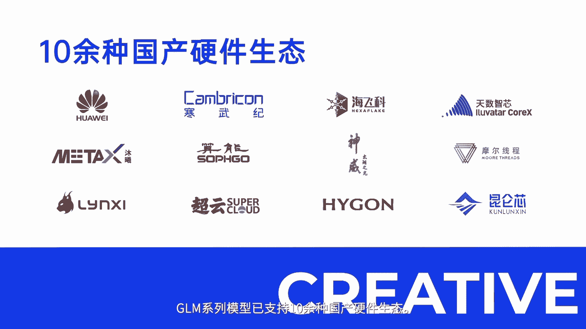

基于强大基座模型能力，质谱AI打造了完整的AI大模型。

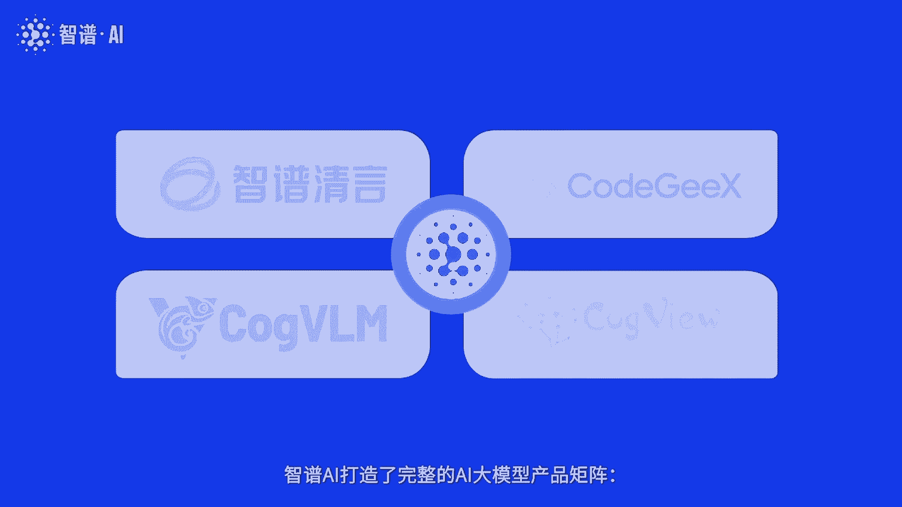

产品矩阵，生成式AI助手，质朴青年高效率代码模型，Code geeks，多模态理解模型，code v l m和文生图模型coe view等。

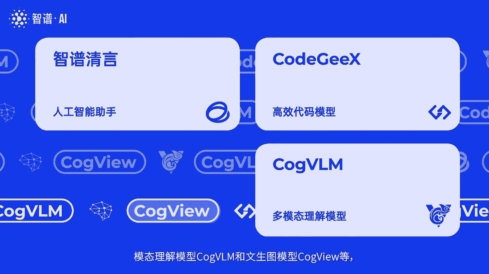

让智谱AI成为国内首个，拥有完善全自研产品矩阵的人工智能，大模型公司，质朴青岩，基于中英双语对话模型chat gm研发而成，通过外译字符的文本与代码与训练结合，有监督微调技术能够与您对话，解答您的问题。

辅助您更加方便高效的获取信息。

处理信息，code geeks是一款基于大模型的智能编程助手，它可以实现代码的生成与补全，自动为代码添加注释。

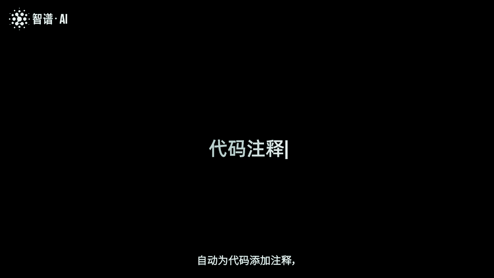

不同编程语言的代码间实现互译，以及针对技术和代码问题的智能问答功能。

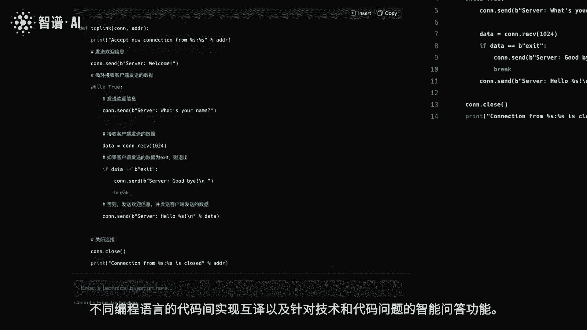

帮助开发者显著提高工作效率。

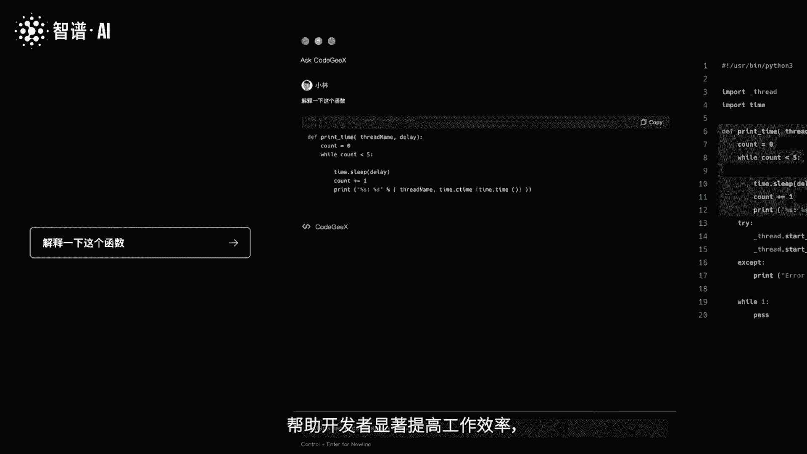

code geeks支持100家主编程语言，适配多种主流IDE平台。

包括vs code jet brains。

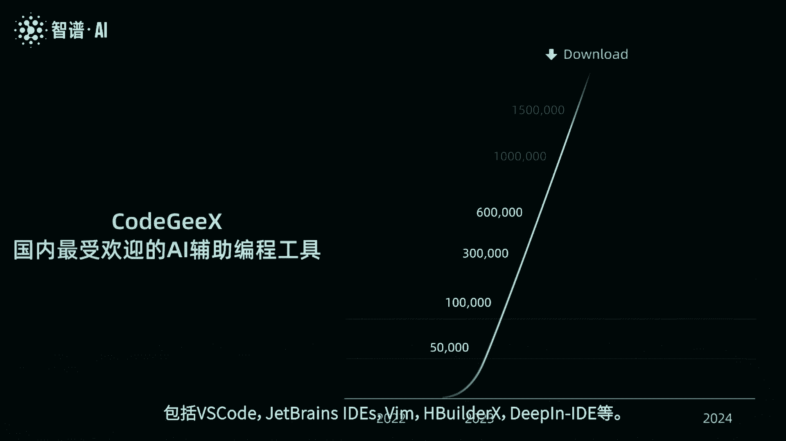

ide wm h builders DP i d e等。

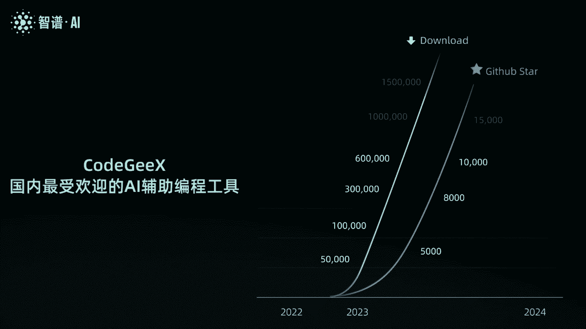

基于model as a service的市场理念，质谱AI可以为客户提供从公有模型，专有模型到私有部署的全站定制化，大模型解决方案，大模型max开放平台，还能够帮助用户快速训练个人模型。

一站式完成专属AI应用开发。

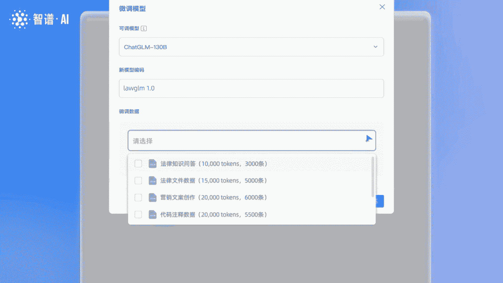

从能源制造，消费零售到医疗金融等行业，从算力硬件提供商到软件开发者，智谱AI已初步建立了覆盖完善，层级丰富的大模型生态圈，携手行业内外，共同推动中国人工智能行业发展，行业认可。

客户信赖是我们一路走来的前进动力，通过大模型连接万事万物，智谱AI基于先进技术和强大模型能力。

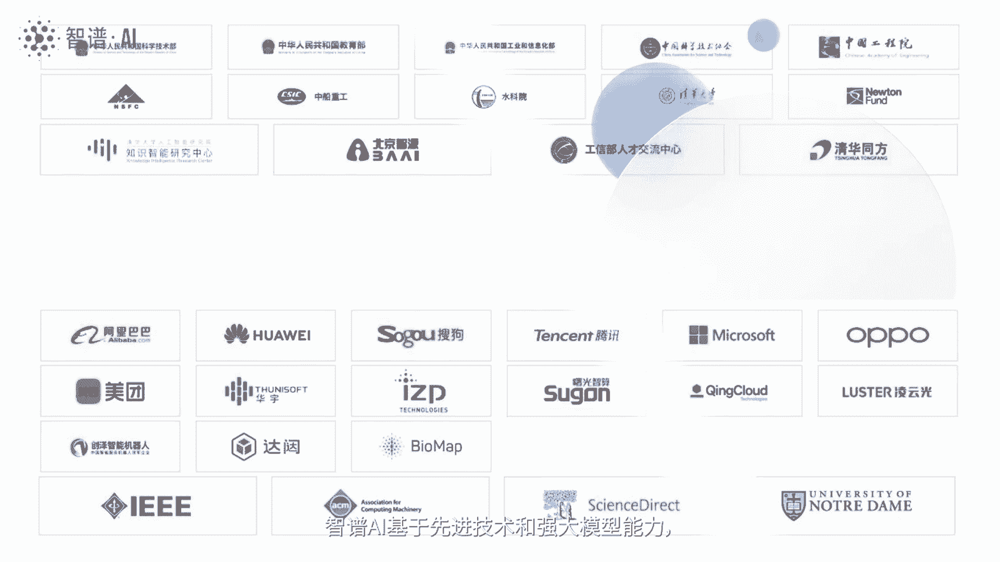

为千行百业带来革命性创新。

