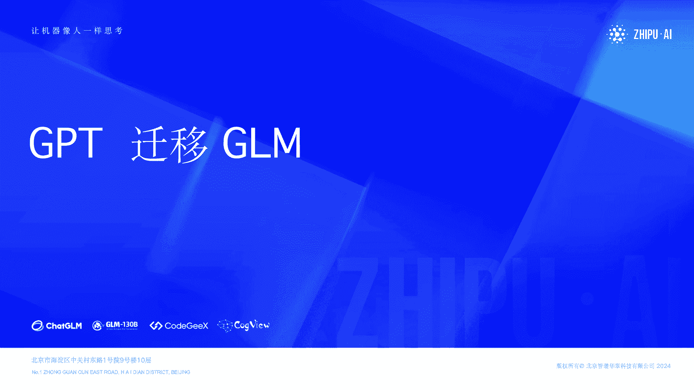
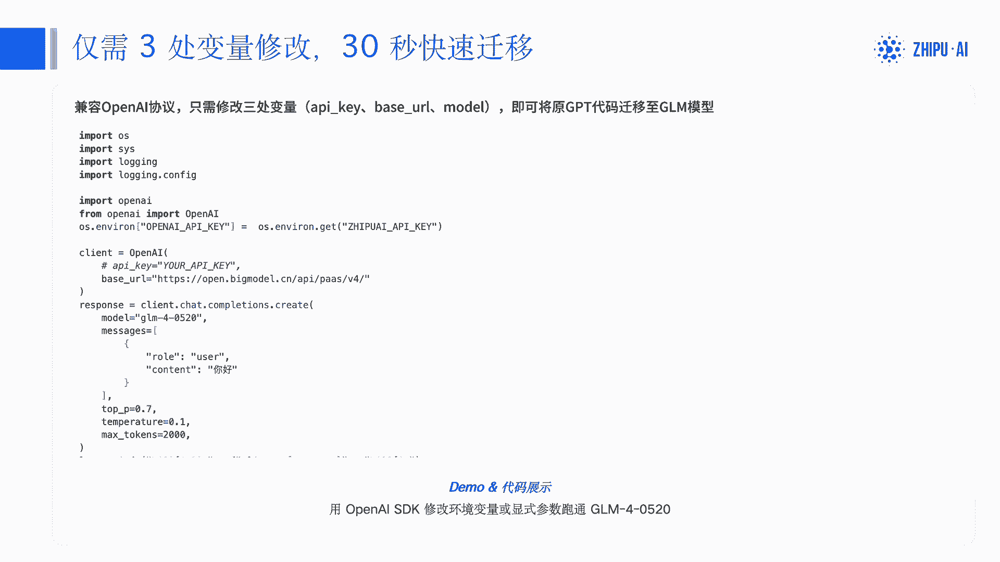
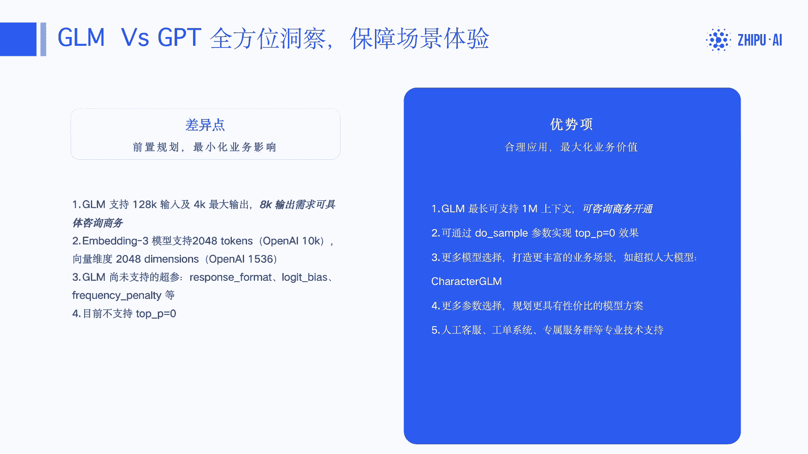
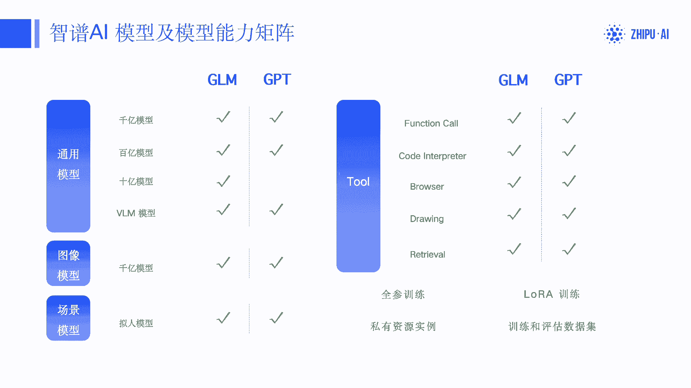
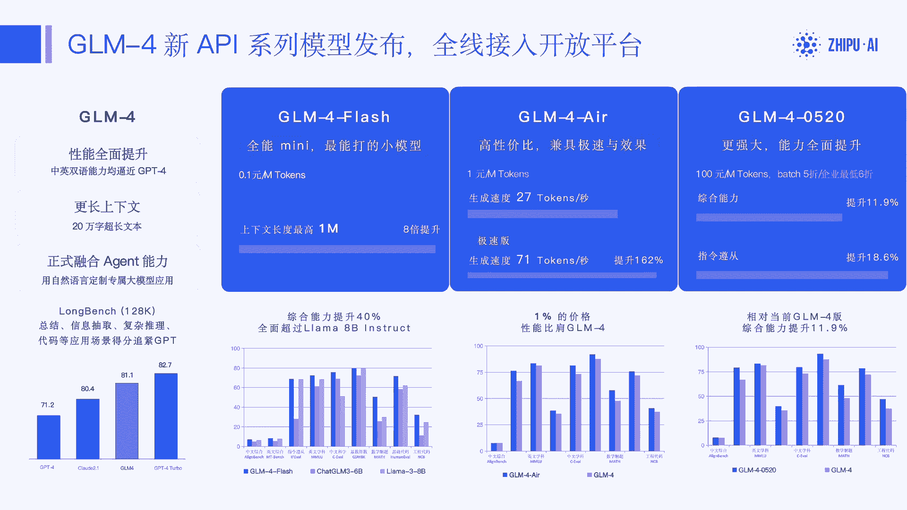

# 「第一课」GPT快速迁移GLM - P1 - ChatGLM - BV16z421q7qY

哈喽大家好，今天我来给大家分享一下，如何从啊GPT迁移到那个CHACHAGLM。

然后本次课呃分享的主要内容包括这几个方面，第一个是快速迁移指南，好快速的，我们呃跟大家介绍一下，如何在保留现有代码基础上啊，通过修改一些配置，就能快速的使，从使用GPT模型变成使用GLI模型。

然后是代码的demo展示呃，最后呢是chat gl m，我们在模型上为大家提供了哪些啊，稳定性和安全上的保障，好，首先是快速迁移指南啊，我们直接啊直奔主题啊，就是啊如何只需做三处的变量修改。

就能呃30秒快速的完成迁移，我们原有的代码可能都不变，那首先还是使用open i的SDK，我们import OpenAI进来，然后呃修改一个open i key。

把open i可以设置成我们的啊质朴IK，当然你这个质朴IK，要提前设置在我们的环境变量中呃，然后修改我们那个BACUIL换调用地址，从open i的调用地址换成open点big model点CN。

就开放质谱开放平台的调用地址，然后修改我们的啊，要使用的模型是，这里是是GM40520是我们新发布的啊，新一代啊呃千亿大模型啊，然后这里就可以去调用了呃可以看啊，就是其他的业务代码都不用变。

大概只需要啊，修改这么一些就可能可以完成迁移，然后后面的那个demo和代码展示，我会在第二个章节去给大家再啊，详细的去做演示啊。

这里不就不展开了呃，然后这节是呃GOM相对GBT的一个呃，算是全方位的的洞察吧，首先首先是一些差差异点嗯，就是可能GLGPT已经支持了，但是GELM还没有呃，完全实现或支持的不那么好的地方。

那这这些地方大家可以做提前规划，就最小化的影响业务啊，第一个是说GLM，我们支持128K的输入和4K的最大输出，但是嗯啊如果有8K输出，还可以具体的咨询商务啊，但是像GBT它输出的支持。

就可以支持到128K的输出啊，这里目前我们还没有啊，没有没有支持，好吧啊，但是这个其实也相对比较啊，corner一个case里面大部分绝大多数的场景，从我们后台统计的经验看来。

就是P999都到不了4K的一个输出啊，就是如果大家有8K输出可以单独联系，或者说如果实在有128K的输出，这块可能就要给啊深度迁移，然后像embedding3模型，我们目前embedding模型。

我们第三代支持了是文本的长度，是2048的token，但是OpenAI是支持了10K啊，这块呃，然后向量维度上是，我们目前支持的是2048K还是1536啊，然后有一些GPT已经实现了啊，超参项呃。

通过response format指定JSON格式的返回，通过REGIVICE和frequency penalty去呃，控制输出参数，输出文本的一个一个一个控制，这个g gm还并没有支持啊。

然后也也包括像支持啊，top p等于零啊，目前也不支持会报错啊，但是top等于零可以通过啊，它的一个类似的效果，可以通过我们在就是优势项目里面，GLM可以设置do sample哦，参数来实现呃。

另外呢GOM最长目前已经可以支持到了呃，一兆的上下文这块也可以咨询我们商务去呃，开通，然后gm提供了更多模型的选择，可以打造更丰富的业务场景，像目前有凯瑞克GLM超引人大模型啊，更多的参数啊。

可能会相比GBT更更丰富一些吧，10亿百亿千亿都有啊，另外就是服务国内客户，我们的啊人工客服工单系统，然后专属的服务群，专业的基础知识都可以啊，更像相比GPT能更好的服务到大家。

然后是我们的一个开发者文档的资源中心嘛，大家可以访问知府的呃开网平台来访问呢，我们的开发资源呃，这里呃另外就是智谱AI的SDK，在GITHUB上我们有相应呃Python java。

c#和node js的SDK啊，已经给出来了，欢迎大家来帮我们去找bug，帮我们去contribute啊，然后知府官方的使用指南以及质谱，在GITHUB还有一些cookbook，这没有列出来。

大家都可以去啊访问，然后那个OpenAI的SPK当然也可以用，用来访问gm，因为我们的协议对它是呃是兼容的嘛，所以大家可以也可呃，可以就像我们刚才讲的。

也可以用o i open AI的SDK来接着访问呃，GOM呃，然后这为大家介绍一下智慧AI的模型，以及相应的能力的矩阵啊，跟GPT的一个对比吧，首先是通用模型啊，不管是1110亿。

还还有那个图像的VRM模型啊，GLM都已经具备了啊，图像模型考个六三，我们也目前也支持啊，开放啊，公有池和云端私有化的一个服务啊，然后场景模型里面，我们可额外支持了拟人模型嗯。

工具的使用上to和function call code integrator啊，brother web就是就是web search retrieval，知识库的search呃。

然后那个画图目前也都已经开放出来了啊，在训练方面，我们也支持了全参训练和lower训练，以及训练之后的一个私有资源，的一个实力的购买和部署啊，大家都也可以访问KON平台去呃去体验我们啊，对于新用户啊。

都会有大量的那个不管是推理还是训练的，自然包的一个赠送，去支持大家体验我们的开放平台嗯。

然后呃然后简单介绍一下智博呃，APGM4新AAPI的一个模型的发布，嗯啊gm4性性能啊相比啊，其实就是呃我们已经接近接替接近这第四了，然后上下文也会更长，tools呃long的能力经过评测嗯。

其实都已经呃接接近GP4，然后我们的呃四代模型，现在啊以后就大概分这么三个系列，参数规模从小到大分别是4flash模型，4air模型和啊四啊，四后面可能会带后缀日期的后缀，比如说40520。

然后参呃参数由小到大，响应速度是呃呃越小的越快嘛，然后啊是gm4，它是越往上啊，模型的能力会更强大啊，以gm46520为例，然后他的那个啊综合的能力指定遵循的能力啊。

相相比于老的GM4都有一个显著的提升嗯，然后价格上呃，gm4呃会相对贵一些，但是100元每1000000token，然后gm4flash是呃0。1元每百万token，4flash更适用于一些什么场景呢。

就是长文本的一些分析啊，总结啊，呃信息抽取之类的啊，在在这方面它其实效果也不差，然后JM4是0520，适用于那个复杂的那个业务逻辑的分析，比如说呃需要用到agent的能力，需要用到兔子啊。

需要呃严格的指令遵循等啊，这时候推荐大家去用gm4啊，4air呢就是高性价比的，兼具速度与效果的，另外我们对企业客户会有一个啊，目前最低六折的一个额折扣的，这个都是大家直接在线上就可以享享受到的。

然后那个呃代ch如果如果，但如果需要那个通过batch做离线的大批量调用。

