# 【官方教程】ChatGLM + LangChain 实践培训 - P1 - ChatGLM - BV13M4y1e7cN

谢谢大家今天来参加这次分享，主要是本次主要是结合CHARGM和launching，的一个应用给大家进行一个介绍，嗯首先我进行一下自我介绍，我叫刘谦，然后是launching tragm这个项目的发起人。

嗯这个项目呢主要是基于本地知识库的一，个问答呃，也是跟我们今天要介绍的内容比较契合，项目目前上线两个月左右，然后大概已经收获了超过7000个star，今天主要介绍的内容包括三个部分。

第一个部分是CHEGL和LUNCHIN的简介，第二部分会介绍一下launching和JJM，这个项目的具体的原理和实践，第三个部分的话就是根据大家提问，来进行一个问答环节。

相信大家对TGM6B这个模型已经比较熟悉了，它是一个开源的支持中英双语的对话语言模型，基于GLM的架构，然后具备62。1的参数，在近期呢这个模型也是更新了一点一的，这个版本。

解决了英文回答中夹杂中文词语的现象，刹车M6B本身这个模型的话。

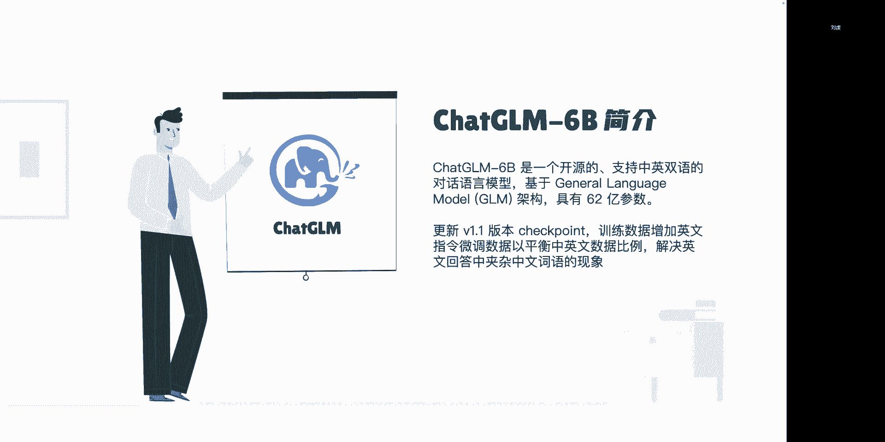

它具备呃多种不同的能力，在这里我可能举四个例子，包括自我认知提纲写作，文案写作和信息抽取，自我认知的话就是回答类似于你是谁，你的特点这些问题，提纲写作的话，大概就是依据提出的这个要写作的内容。

来列一个提纲，包括热评论文案，以及根据给定信息抽取关键数据的这些能力，在我们使用TGR模型的过程当中。

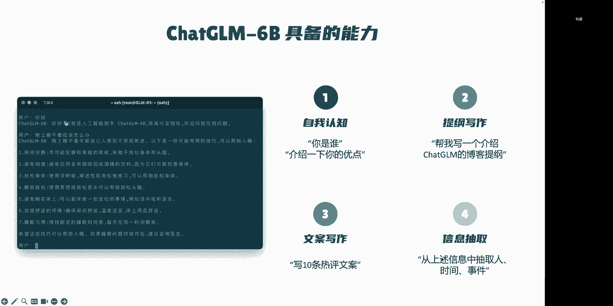

可能除了这些通识知识的应用之外，还会有一些垂直领域知识，或者基于私有知识问答的需求，那么在面对这些需求的过程当中，我们通常需要借助模型的微调，或者是提示词工程，来提升语言模型在这些方面的应用的效果。

那么微调呢，就是相当于在我本身语言模型的基础上，进行少量数据的进一步的训练，它适用的场景是指我的任务或者是业务领域，比较明确的时候，有足够的标记数据的前提下，能够进行一个模型的微调过程。

而提示子工程是指设计自然语言，是指示或者是提示，可以指导语言模型执行特定的任务，最适合需要高精度和明确输出的任务，比如我们刚才提到的这个依据已知信息，从中抽取知识的一个过程。

我们今天介绍到的基于本地知识库的一个应用，也本身是基于这个提示词编程的这一类应用，那么提到提示词编程的实践的话，我们最常见到的，目前比较常见的一个实践框架就是lunch，long train呢。

是一个用于开发有语言模型驱动的，应用程序的框架，它的主要功能包括调用语言模型，将不同数据源接入到语言模型的交互当中，除此之外，还有允许允许语言模型与运行环境进行交互，在launching的整套框架里面。

它提供了包括模型的支持，这里面的模型包括自然语言模型，还有它其中可能调用到的像向量化模型，这些模型，除此之外还有提示词的管理优化和序列化，还有一些就是外部数据和语言模型，进行交互的index。

再往后是基于自然语言模型形成的，整体的调用序列，在LAUNCHIN里面就是一个chain的概念，再进一步的话还提供了一个代理的功能，就是agent，代理的话，相当于是我在给语言模型一些高级的指令。

或者是一组工具的情况下，能够让它能够让语言模型来判断出来，我后续要使用什么工具，或者是使用上述我们提到的这个调用序列的，来执行一些相对复杂的工作，long train主要面对的应用场景呢包括以下。

最常见的话可能包括以下的几种，第一个是文档的问答呃，也是我们今天要主要介绍的内容，就是在特定文档的基础上回答问题，只利用这些文档当中的信息来构建答案，第二种应用的场景是个人的助理。

相当于在已经获取了个人，比如说日历形成的这些信息的基础上，能够完成呃，下一步需要采取什么行动的，这些助理的行为在另一个应用的话，包括查询表格数据，这里面可能需要使用到语言模型来进行，库表类型。

数据化数据，结构化数据的查询，包括csv circle，还有data trim等，除此之外还可以与不同的API进行交互，这样的话能够允许语言模型，访问到最新的信息呃，就类似于大家呃平时比较常见的。

像new bean的这种PPT和检索结果结合的形式，就可以用launch里面与API结合的方式来进行实践，下一个应用呢就可能是信息提取，就是从已知文本的当中提取结构化的信息。

这个已知文本就相当于是从long train里面，不同数据源当中获取得到呃，另一个常见的应用呢可能是文档的总结，就相当于我提供一个篇幅相对较长的文档，由语言模型来进行文本的进一步压缩。

形成一个相对精炼的总结的结论，呃今天我们主要围绕这个文档问答来展开，那么我们在进行基于本地知识，或者说文档进行问答的过程当中，我们希望能够实现的一个效果，实际上是在我提供一个问题之后。

它能够呃整个实践的链路，能够从本地的这个文档里面抽取出相关的信息，也就是右侧的这个加工后，提问内容当中绿色的部分，并且能够把提问的信息和匹配出来的相关信息，按照模板的形式形成。

最终输入给语言模型的一整套提示词，这里面蓝色的已知信息和，根据已知信息回答问题，实际上就相当于提示词的模板，呃这里面举一个我们实际生活当中的例子，实际上呃左侧的这种直接输入的形式。

相当于我们人去参加一次闭卷考试，可能是没有预习的情况下，或者是呃有一些通识知识的预习的情况下，而右侧的这种呃，根据已知信息来回答问题的形式呢，实际上就相当于我们带了一本这门课的教材。

然后去参加一个没有进行预习过的一个，开卷考试，最终能够形成这么样一个，根据书中已知信息来回答，对应的问题的一个结果，那么在对于单一的文档，问答的具体实践的过程当中，实际上分为五个步骤。

第一个步骤就是加载本地的文档，就是把本地的这个文件读取为文本的形式，第二个步骤是执行文本的拆分，将文本按照字符或者长度或者语义进行拆分，这里面字符拆分，比如说按照句号，问号，叹号这些来进行句子的划分。

按照长度的划分，比如说我论文500个字左右，可以划分为一段，根据语义的划分的话，那可能就相当于中间要经过一些，NLP的语义理解的模型，然后再执行后续文本的拆分，这里面我们之所以需要进行文本的拆分。

是因为语言模型通常情况下，它的输入是有长度的限制的，我们没办法直接把一整篇本地的文档，直接输入给语言模型，所以我们需要从中筛选出来有用的信息，然后结合我们具体的提问内容，一起提供给语言模型。

所以在呃最开始加载完文档之后，我们需要首先对文档当中的比较长的文本，把它拆分为相对呃比较短小的这种文段，在文段拆分完成之后，我们需要在获取了用户的提问之后，结合用户的提问，对拆分后的文段进行一个匹配。

这个匹配的过程我们有几种方式，可能包括字符的匹配或者是语义的检索，字符匹配的话，这个我们可能比较容易理解，就是呃，依据具体的明确的精确搜索的这种字符匹配，或者是模糊搜索的这种字符匹配，而语义的检索。

实际上相当于是把我的文本进行向量化之后呃，来进行一个向量空间的检索，举一个实际的例子来说呃，之前经常在微博上面看到，有些科技类博主举的例子，就是说呃老鼠在找食物，这个这一段话和奶酪这个词，他在呃空间。

在向量空间里面实际上应该是相近的意思，但是在字符匹配的场景下，实际上就很难匹配到这两个结果，因此语义检索是在这个匹配文本的场景下，更常用到的，包括我们在多语种的呃，比如说论文里面有中文，有英文的情况下。

那么可能语义检索的形式，就能够支持我们跨语种的进行检索，在完成了匹配文本之后，我们就要构建，最终需要输入给语言模型的这个prompt，就相当于是将匹配的文本用户的提问，共同加入到prompt模板当中。

也就是上一页里面我们提到的，最终形成的这个提问内容，最终我们把这个提问内容发送给语言模型，获得基于文档内容的回答，嗯上面我们介绍的相当于是基于单一文档，问答的一个实践的过程呃。

那么在基于本地知识库的一个实践的过程当中，我们就相当于是需要，不仅针对单个文件进行具体的检索，相当于要针对多个文档上传之后，形成的这么一整个知识库，以它为基础，再进行后续的文本匹配和问答。

那么在具体的基于launch的实践过程当中，我们第一步就是把本地的文件下载进来，这里面相当于是用到了launch里面的document loader，在这个呃launching check gm。

这个项目里面的实践，实际上是用astra document loader这个类来进行的，文档的下载，它可以支持txt markdown，PDF这种常见的文本格式的文件的加载，把这些文件加载中文文本之后。

再利用这个text platter，这个是launch里面的另外一个类，就是相当于是把我加载进来的原始文本，划分为长度更短的这些段落的一个文本切分器，经过文本切换器切分之后，形成呃这些文本的段落。

然后再对这些文本的段落，利用embedding的模型进行一个向量化的过程，形成最终的向量数据库，这个vector store就是向量数据库，然后它实际上就相当于我们所说的，本地知识库的本体。

因为我们在前面对本地文档加载完成之后，实际上所有拆分后的语句，包括其对应的呃，语义向量都是存储在这个语义呃，就是存储在这个向量数据库里面的，在向量数据库呃，实际上我们前面从1~6的这个过程。

就构建成了这个向量数据库，在构建完成向量数据库之后，我们需要获取用户的提问内容，把提问的这句话也进行一个语义的向量化，经过的是相同的embedding模型的处理，最终获得了这个query的呃向量之后。

再把这个提问的内容的向量，去到向量数据库里面，跟已有的这些文段的向量进行一个匹配，这里面可能匹配出一个相关度最高的，或多个相关度最高的，我们可以在这里面设定他检索的时候。

要求的个数的top k在检索相关度完成之后，形成最终的这个相关的文段呃，比如说我这里面top可以设置成六的话，那么相当于我能够获得最终相关的六句话，把这六句话和用户的提问。

共同加载进这个prompt template，就是提示词的模板当中，形成最终要发送给语言模型的模板，呃上面介绍的呢，相当于是我基于本地知识库问答的实践的，一整套流程的一个原理。

那么下面的话就用代码的形式来给大家讲解一，下具体是怎么进行实践的，呃这里面我首先第一步是按照那个gm6B的，这个项目里面的代码进行了一大模型的初始化，就是把这个CHEGARM的模型整个加载好。

用于后续的具体的调用呃，那么在后面涉及到long train的这个步骤当中，第一步就是加载文件，相当于是用这个unstructured file loader来把text呃。

test点TXT这个文件加载成为一段文本，这里面形成的DOS，它的具体的这个变量的类，是launcher里面定义的一个document类，它相当于是由多段文本组成的一个list。

在这里面我直接对一整个文件进行加载的时候，它相当于只加载成了呃，list里面只有一个元素，这个元素里面呃，document里面包括的属性呃，一共有两种，一种是page content。

一种是metadata，page content里面存储的就是我具体的原文，metadata包括的就是我这个文件的路径，还有一些其他相关的信息，包括页数，这些信息如果能够识别出来的话。

也会存储在metadata里面，加载完成文件之后，代入的话是进行文本的分割，这里面我们相当于是从launching自带的text splitter。

里面加载了一个corrector text splitter，这里面我只是单纯的限制了它的长度是呃，一段文本有500个字符的长度，然后这个trunk overlap的意思是说。

我两段文本之间有200个字符的重复，这样做的原因是，因为我直接依据这个字符长度来进行，拆分的时候，中间可能会有一些完整的句子被我切散了，那么在这样的前提下，我相当于是用200个字符来保证呃。

至少在相邻的两段当中，有一段话能够保证任何一个句子的语义的完整，经过这个text lor的划分之后呃，相当于我原始的最长的这段文本，划分成了500字一段的这个更细一些的文本段。

然后最终形成一个新的box，这个list里面就会有更多的元素组成，list里面具体的元素的类型还是document的类型，再下一步呢，相当于是把刚才已经切分好的这个文本段，进行一个向量化呃。

那么向量化之后，我们一般情况下需要把它存储到本地，所以这个过程实际上也就是构建向量库的过程，首先我们加载这个embedding的模型，这里面我写的时候就是用官方的例子。

然后默认加载的是一个OpenAI的embedding的模型，这里面就需要用到OpenAI的一个具体的key，需要在环境变量里面进行一下设置，后面我们会具体在讲，如果我们需要用到本地的这个呃。

开源模型来做embedding的时候，应该怎么处理，呃再到下一步呢，实际上相当于是launch里面本身已经支持了，不同类型的向量库，在这个代码示例当中，我们选用的呃。

向量库或者向量索引的类型是face类型，它本身就具备函数from documents，相当于是它可以直接加载documents进来，并构成这个向量库，就是最终形成这个vector store。

他这个函数里面的输入，就是我前面已经拆分好的文段，以及这个embedding的模型，最终形成这些已经加载好的向量，那么下一步呢相当于是用户提交了问题之后，我们把用户提交的这个问题呃。

直接到向量库里面进行检索，实际上这个vector store，点similarity search的具体实践过程，应该是，将这个query这句话，用相同的embedding模型进行一个向量化。

向量化完成之后，再到我的这个vector store，这个向量库里面去进行匹配，这里面默认的top k的参数应该是三个，我们可以在这个similarity search的这个函数里面。

进行top k的参数的具体设置，最终获得到这个TODOS，相当于就是呃我用query来匹配之后，得到的相关的这个文段有哪些，Context，我这里面相当于是从呃，DOX这个列表里面的每一个元素当中。

选取它的配置，content也就是最原始的原文，然后把它构成一个新的list，形成这个context，就是我已知信息的这个上下文的内容，这里面写的稍微有点问题哈，就是在下一步就是构造prompt的过程。

codsl prompt的时候，我们相当于先有一个prompt template，在这里面相当于是prompt template，就是已知信息，然后后面加上我这个context的内容。

再往后是根据已知信息回答问题，然后再加上我这个问题的具体内容，query就相当于是刚才已经输入的这个launching，能够接入哪些数据类型这个问题。

而context相当于是我刚才从这个DOS里面取出来的，全部原文呃，这里面存在的问题是说呃，刚才说这个context的是个列表，然后这边我直接把context加进来，是可能存在一些问题的。

应该是要把它变成字符串，并且中间可以用换行符来连接，呃然后在前面构造好了这个prompt之后，最后一步的话，就是用前面已经加载好的这个gm模型进行对话，呃。

这里面chat和函数里面首先要有一个token ancer，这个相当于是它调用方法里面的定义，然后把这个提问的内容，就是新构造这个prompt输入进去，history相当于是我的对话历史。

也就是说如果我这个问题是第一个提问的话，那么我的history相当于是呃有零个元素组成的，如果他是在多轮对话当中的某一轮的话，就history的位置相当于还有其他的呃，历史对话的信息。

呃刚才介绍的代码实现，实际上也是我们这个launching cherr这个项目，最开始的一个基础，那么下面的话呃，我们来具体介绍一下tga long train，chegg app这个项目的一些特点。

这个项目本身是基于CHARGM等大模型的，本地知识库问答的一个实践，它的特点是依托这些开源模型进行实践，可以实现离线的部署，除此之外呢，呃整套项目目前都是依托于launching的实践逻辑。

来进行实践的，可以快速的接入不同类型的数据源，因为launch这个包里面已经集成了很多，不同类型的document loader，下一步呢是在分据文档的读取方面，在这个项目里面。

会对中文的使用场景进行了一些优化，因为launch这个包实际上呃它有两个特点，第一是在GPPT的这些API上面，使用起来效果会更好一些，也就是说针对开源模型的适配，是需要另外下一些功夫来做的。

除此之外呢，它针对英文的使用场景也会更好一些，因为它预制的这个prompt的模板，都是以英文的形式写进去的，那么对于支持中文的模型，尤其是这些开源模型来说，它通常在中英文。

双语的共同的文段里面的理解会相对差一些，所以我们在launching本身的这个prompt，template的基础上对它进行了一些汉化，并结合这些开源模型进行了一些测试呃。

把这个prompt template改成一个拆gm，能够识别的相对效果算比较好的一个提示，此模板包括分句的过程中，可能也会结合中文的标点符号，还有文档的读取过程中呃，lunch预制的呃。

这些像PDF如果是扫描类的PDF的话，它的OCR识别对中文的识别支持也不是太好，所以我们在这个项目里面，对文档读取的这个方面，也进行了一些loader的单独的定义，比如说利用PYTHOCR的这些呃包。

来进行中文的PDF的识别，现在这个项目已经支持的文件格式包括PDFTXT，Markdown，Dok x，还有就是里面有文本信息可以进行OCR识别的，JPG和PNG，这些图片文件都可以支持接入。

然后已经具备的呃命令行demo，然后基于radio的web ui，还有vie的前端呃，项目的结构层面上，实际上我们也是因为本身是基于，launching的实践呃。

所以就相当于是在launching的基础上，有一些呃我们自己实践的自定义的类，还有一些是继承了launching里面的类，在进行的定义，像models呃，就是项目结构里面model s这个文件夹的话。

它就是呃，相当于是开源模型的LLM的，接口类与实践类的定义都是在这个路径下的，因为launch里面对OpenAI的接口呃，就是对OpenAI的GPPT的这种API，它才能够支持流式输出。

对于开源模型的话，它一般情况下是不支持流式输出的，所以我们为了能够实现流式输出的调用，在这里面对这个自然语言啊，对大模型的接口进行了一个重新的定义嗯，第二个呢，是相当于不同文档的加载器的这么一个路径。

它里面我们预制了像CHINESEPDF呃，就是PDF的loader有一个重新的设计，就是刚刚提到的这种扫描类的PDF，需要进行OCR识别的时候，对中文的支持会更好一些，然后text player的话。

这个里面我们也进行了一些呃，自己需要用到的中文场景下，可能会比较常用的一种切分的类型，chains里面嗯，相当于就是在long chain这一套框架的呃，里面定义的这种chain的这种工作流程呃。

我们目前这个项目里面，因为主要是基于本地文档的一个问答，所以最主要依托于chains这个里面的local dog，QA的这个chain来进行了实践，在后续的过程中，我们会再继续增加。

比如说库表类型的文件，还有知识图谱这些信息的接入，那么到时候可能就会需要用到不同类型的chain，也都会放到这个chains这个文件夹里面，content这个文件夹是用来存储，我们在上传。

就是在构建本地知识库的过程中，需要上传一些原始的文件，为了能够后续用于这个文件匹配信息的，准确率的检查，所以我们把这个最原始的文件也保存在这个content，文件夹里。

而vector store这个文件夹的话，相当于存储了向量库的文件，这是在我们刚刚举的例子，用face这种存储方式呃，这个项目里面，现在默认的存储方式就是这个face的存储方式。

它会在本地路径下存储一个文件夹，然后里面包括了点index文件，还有一共存储了两个文件，共同用来表示这个向量库的具体存储信息，然后CONFIX文件夹里面存储了我们项目里面。

目前需要用到的各类配置上的信息，再回到我们前面介绍的整套的实践逻辑里面，我们刚刚提到的launch tragm这个项目里面呃，一个比较显著的特点是对开源模型的支持，那么我们这里面涉及到的模型。

实际上包括embedding模型，还有自然眼模型，自然眼模型前面我们已经演示过了，就是相当于是针对拆GLM这种呃，我们能够本地部署的开源模型怎么进行调用，除了这个之外呢。

embedding模型在我们替换为本地模型的时候，也会存在一些需要额外优化的地方，比如说我们刚刚使用的OpenAI的embedding模型嗯，OpenAI的EMI模型，通常情况下能够处理。

可能500字左右的单个文段，但是但是对于一些开源的本地的概念模型来说，他们的训练样本当中呃，以本项目这里面使用到这个，text to app的这个模型为例的话，它实际上一次处理100字左右的样本的。

情况会比较多，就是从它最原始的训练集里面看出来，他可能一般情况下接收到的输入信息，就是在100字左右呃，所以针对这个情况呢，我们也在前面的文本划分做了一些处理，就相当于是对文段的划分的时候。

把文本的信息分得更细一些，从具体的文档的加载的角度，我们这张示意图就能表示出来我文档怎么加载，并且最终返回到一个prompt的结构里面，这里面呃最开始的划分的话。

我们相当于是使用了自己定义的这个text later，依据中文的标点符号来进行语句的划分呃，然后呃这里面还涉及到了另外一个限制，就是相当于我首先是判断每个应用这种句号，问号叹号来进行中文单词句子的划分。

在完成第一部句子的划分之后，还会依据这个单段文本的长度，如果它超过超过了我设置的一个限制值，就是sentence size，目前默认的设置值是100，如果他超过了这个限制值的话，我会再依据其中的。

比如说逗号或者分号，这些标点符号来进行进一步的划分，就是为了保证我每一段输入的文本，都能够是embedding模型，能够尽量减少EMI模型在理解过程中的信息误差，在前面分完这些句子之后。

后面我进行vector search，也就是依据那个用户的输入信息，进行向量的检索的时候，我匹配出来的假设就是这个绿色的这个句子，但是通常情况下100字左右的文本呃，或者说少于100字左右的文本。

是有可能没办法表达一个相对完整的意思，举个最极端的情况或者例子的话，可能有的时候我们在划分完了之后，在一个中文的报告里面，我划分出来的某一段匹配效果最匹配的，相关度最高的时候，结果它是这一段的一个标题。

那么在这种情况下，我们就希望能够把这个标题下边，或者是上边相关的这些上上下文的内容，一起合并进来，形成一个相对完整的语义的文段，所以我们在绿色这一段话的基础上，向上向下扩充呃，黄色的这两句话共同构成。

最终形成的这个呃已知信息的文本呃，这里面又涉及到另外一个限制值，刚才我们提到这个center size是100字符，就默认现在项目里面默认的话，它是100个字符左右呃，我们在上下文扩充完了之后。

大概是在250字左右，是提供了一个这个trump的设置，然后在呃补全了上下文之后，最终形成了一个已知信息，然后结合我用户提交过来的这个提问，最终发送给语言模型，形成最终的回答，前面这里介绍的。

实际上相当于是说针对一个匹配出来的呃，相关上下文我是怎么处理的，那么在针对多个上下文的处理的时候，比如说我这里面向量检索的时候，我可能需要匹配的不只是呃相似度排名第一的。

我可能选择的top k或三个或者六个，这种情况下需要经过哪些再处理的呢，比如说我这里面可能相关的句子，除了这个绿色的这段话之外，还有这个黄色，下面这一段没有标颜色，这段话假设这两段话都是相关度。

前三的句子都需要匹配进来，并且在扩充上下文的过程中，第二段黄色的这个句子扩充了两遍的话，那实际上其中就涉及到了文本的重复，所以我们在top k有多个的时候，会对文本进行上下文扩充之后再进行一步处理。

就是重新排序和去重，就相当于是避免我不同文段扩充之后，扩充了相同的内容，然后最终浪费了这个原模型，输入的全部字符总数，所以这里边又增加了一个重排和驱虫的过程，呃前面介绍完了项目的这些原理的话，呃。

下面就来给大家演示一下，这个项目的具体使用的情况，我这边可能要先切一下屏幕。

呃大家现在能看到我的这个网页吗。

好的那下面我就来演示一下，就是这个界面的话，实际上相当于是我们项目当中的一个，web ui的界面，它其中包括了这个对话的界面，然后知识库测试的界面和模型配置的界面呃，我们当前运行的这个环境呢。

实际上相当于是在远端服务器上已经执行好了，模型的配置，我们可以看到在对话的界面里面包括了呃，LOLM对话，也就是说直接跟语言模型对话，然后知识库问答，也就相当于基于我本地知识库进行一个对话，除此之外。

近期还新增了一个必应搜索的问答，就是相当于是结合必应检索的一个结果之后呃，把这个B应检索的内容作为已知信息，提供给语言模型，再让他提供最终的答案，那我们分别来对每一个模式来进行一个测试。

呃这个相当于就是在语言模型，直接对话的情况下，我直接输入这个内容，他就会直接给我返回语言模型直接生成的内容，嗯我们最后再来演示这个知识库问答的部分，在必应搜索问答的过程中。

我们实际上也可以提一些需要检索内容才能够，获得的提问，比如说launching是由谁，研发的，哦这里面实际上下面的出处是呃，在B应当中检索出来的具体的对应的内容，上面其实我们能看到就是语言模型。

在给定了一些已知的信息之后，他也不一定能够完全回答出一个理想的效果，这个时候我们可能需要通过调整语言模型，或者调整我们的呃提示词的模板，来进行进一步的效果的优化，那下面的这个的话。

它就是相当于依据我在B当中检索出来的，具体的内容来提供了一个回答，就是告诉我lunch的一个具体的主要用途，嗯然后接下来的话给大家演示一下。

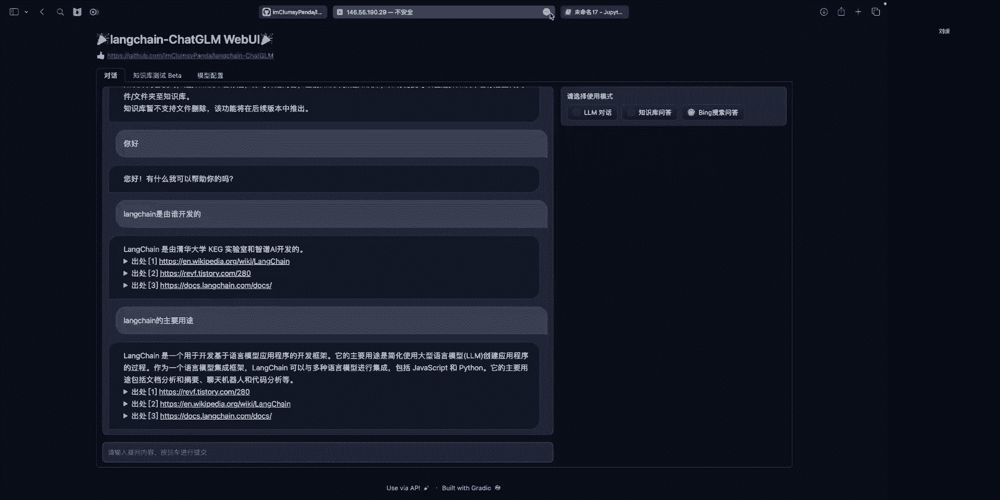

就是在知识库问答的这个模块当中，的一个使用情况，我们现在首先来新建一个知识库，因为新建知识库的过程本身，相当于是在本地新建一个路径，然后呃，因为默认选择的是这个face的这种向量存储。

所以它本身是不支持路径里面存在中文的部分，因此我们这边在起这个新建知识库的名称，的时候，最好是用英文或者是数字的这种形式，稍等一下。

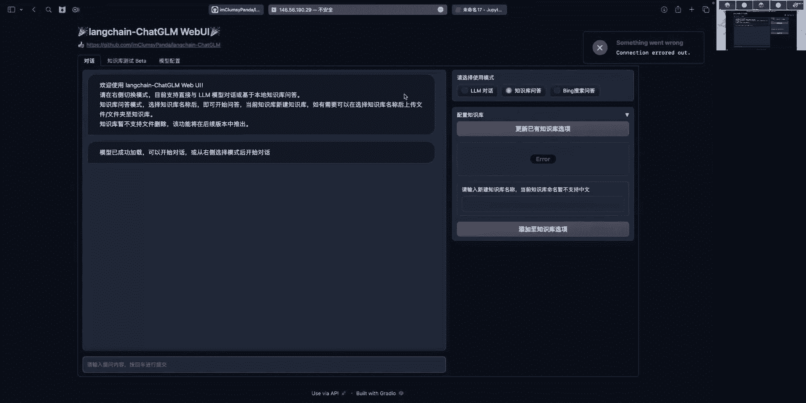

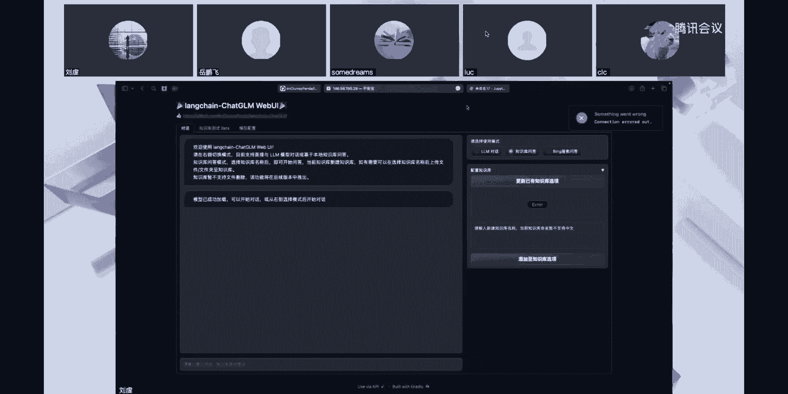

刚才这个服务器端出现了一点问题，那么我们现在在本地重新来跑一下，这个YBUI。

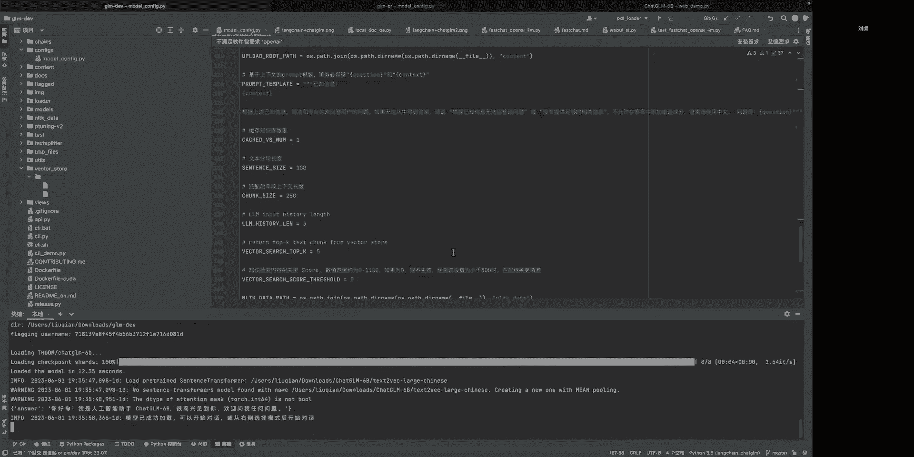

首先我们添加一个知识库，它的名字我就起作叫演示，然后我们往里面上传一个文件呃。

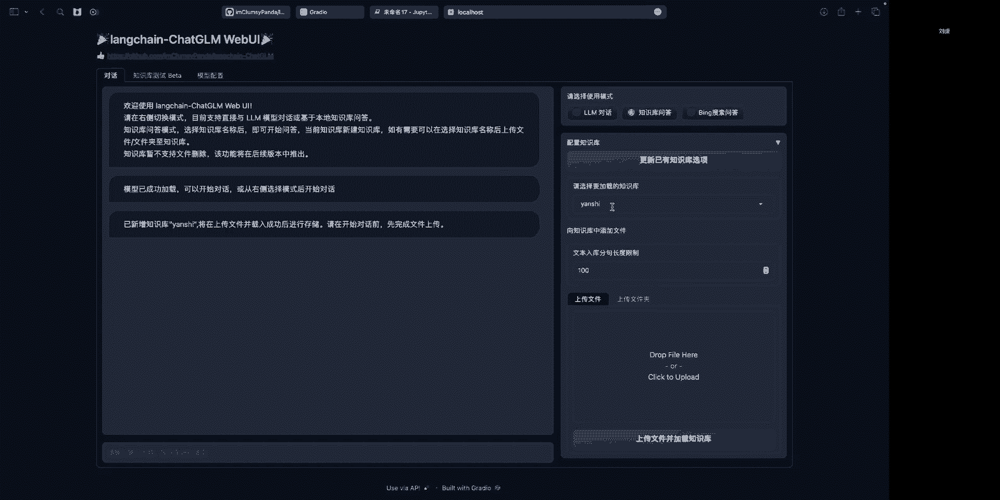

作为演示的话，我就直接上传一个呃，launching chargm这个项目里面的一个read me文件呃，添加完文件之后。

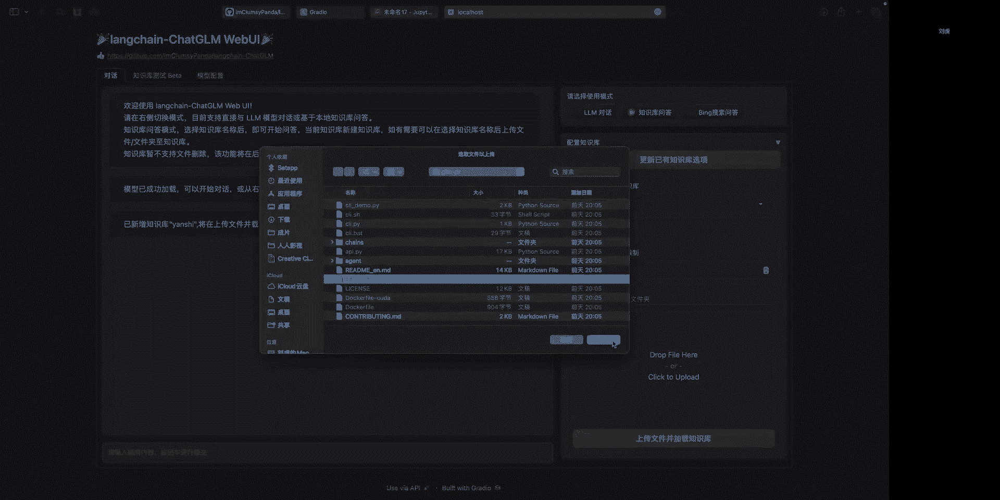

点击这个上传文件并加载知识库，他在这个过程中，实际上就相当于把文件整个加载成文本，并且进行一个向量化的过程，我们这边看到已经有提示说，已添加这个文件到知识库，并且可以进行提问。

那么我们现在提交的一个问题是说，本项目使用的默认的BING模型是什么，因为我们刚刚上传的，相当于是这个项目里面的read me，所以他就从这个read me里面进行匹配。

我们可以看到匹配的第一个出处里面，就包含了这个本项中EMI模型，默认默认选用的是这个text to wag的，large chinese这个模型，所以他这边返回的信息也是正确的。

然后因为我这边top k就是呃，从向量库当中检索匹配的时候呃，车子的数量设置为六，然后刚刚也给大家介绍了，我在过程当中，可能涉及到一个文本的重排和合并去除的过程。

所以这边个数总体上会小于等于top ca，所以这边相当于是在合并之后，共同形成了一共四个出处。

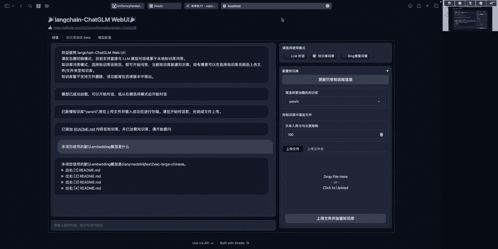

哎呦。

刚才是给大家演示了一下，我们项目实际应用的一个效果，那么接下来的话就是跟大家说一下，在我们项目现在已经实践的内容的基础上，在做本地知识库问答的时候，可以有哪些值得优化的方向，这里面就包括了模型的微调。

其中包括了对自然语言模型，像拆gm这种本地模型或者是embedding模型，这两种模型都可以进行微调呃，LLM自然元模型的话，相当于是我有一些整理好的，具有明确标记的这些模型之后。

能够对它进行一个专业领域，基于专业领域问答的这种微调，然后EMI模型的话，就是在通用领域的BEI模型里面，它可能对于专用领域里面，一些专业词汇的识别效果会相对差一些。

那么我们可以面对就是对于这种情况的话，我们可以用一些专业领域的语料，在对应BEI模型进行一个再次所训练，除此之外，在文档的加工方面也可以进行进一步的优化，我们刚刚提到，就是在本项目里面。

我们涉及到那个呃文本分段的时候，会按照标点符号来划分，其实也可以选择，现在项目里面已经集成的一个，就是基于达摩院的一个语义识别的模型，来划分文段的方式，这里面可能涉及到不同的文段划分的方式。

包括呃在文段划分之后，我具体怎么再把句子扩充，就是我们刚刚上下文填充的一个过程，现在项目里面默认的方式可能就是比较粗暴的，就是我后一句，前一句直接往上加，在能够满足TRACCESS的要求的条件下。

就直接往里面添加了，但实际上更好的做法可能是说，我首先判断一下上下文句子和我中间这位呃，中心剧，它的语义的向量的相似度是不是比较高的，在比较高的情况下，我才把它加进来。

就是类似于我刚刚说的中文匹配的内容，可能是一个文段的小标题，那么对于小标题来说，我们都知道，可能他下文的内容相似度会更高一些，这就是在文档的加工的方面呃，除了前面说到这个文本的分段和重排之外呃。

我们还有另外一种处理方式，就比如说一张一篇文章里面可能有四个段落，那么我对每一个段落，分别用语言模型进行文段内容的总结，把总结出来的内容再进行向量化，那么我后续再去做文本的检索的时候。

检索的就不是文本的本身了，而是检索出来总结的内容，这样的话其实就可以避免刚刚提到的这种，像是我在向量化的过程中，向量化模型本身，对于字符长度有限制的这种问题，除此之外呢，我们还可以借助不同的模型的能力。

但是我们如果需要做数据库的介入，或者是知识图谱的介入的时候，通常需要进行tt to cer或者是text to circle的过程，在这些过程里面呃，实际上我们中文的这些语言模型直接完成。

这些过程可能还存在一些问题，但如果直接转向这种代码生成的模型的话，可能就能更有效地完成这些过程，所以在使用的过程中，我们完全可以比如说在用户输入之后，我们首先经过模型，经过这种代码生成模型。

给它转成这种SQL或者SQL的形式，然后得到了最终要检索的数据之后，再把数据给到TJLM这种语言模型，再让它来生成最终的提问的一个回答，嗯然后除了前面提到的这个优化的方面之外。

我们long train tragm，这个项目本身后续也有一些开发的计划，包括扩充不同类型的数据源，在现有支持的Pdf markdown这些文档的基础上，再增加对库表图谱，还有网页这些类型数据的介入。

除此之外呢就是完善知识库本身的功能，目前可能具备了新增呃，新增的这个功能，然后后面的话会针对删改查再进行具体的完善，包括支持更多的类型的向量库，像CHROMA或者MV。

除此之外呢就是提供更多的文本划分的方式，针对中文场景提供一些更优秀的解决方案，再有就是基于开源的这些语言模型，探索一下launch里面提的这个agent的这种应用，也就是说我告诉语言模型。

我现在手头有哪些工具，让语言模型来选择我该用哪种工具呃，并且可以结合上一步提到的后续优化方式，里面可以接入不同的模型的这些方法，来完成最终这个A整的应用，呃上面就是我介绍的主要内容。

然后今天呢也要感谢一下我们这个launch trac，项目里面的这些主要的成员，我是这个项目的发起人，目前也在负责项目的路线规划和后端的开发，除此之外，我们这边还有两位博士，分别负责路线的规划，容器化。

还有语言模型的介入啊，还有顺序井是前端的工程师，目前在负责我们vie，前端的实践以及开发的框架，除此之外，还有几位java工程师，项目架构师和算法工程师，在共同支撑我们这个项目进行后续的开发。

好以上就是我今天的分享内容，谢谢。

好，那下面的话我们来看一下这个提问里面。

具体的QA的问题，稍等我先从前往后看他，大家如果有问题的话，可以直接在这个腾讯会议的聊天里面进行提问，嗯本地知识库的问答。

实际使用好像没有上下文呃，在我刚刚演示的过程当中。

实际上那个出处的内容，都是作为那个prompt里面的填充内容，添加到prompt之后发送给语言模型，才能够得到最终的回答，然后具体的这个实践的话，也可以到我们项目的那个chains。

然后local到QA的那个文件里面去查看呃，是怎么把那些内容填充，填充到那个prompt模板里面的，嗯然后第二个问题是，context加起来超过token长度了怎么办。

这里面实际上就是因为有这个token长度的限制，所以我们在这个配置项里面增加了这个truck，size和top k的这些设置，也就是说我们可以在项目启动之前，就直接依据这个语言模型本身的token限制。

来设置前序的这些限制值，但是如果是long train里面的话，它本身在train的应用过程当中，应该是有一个呃截取的操作，就相当于我的token长，就是呃我输入的prompt的长度。

如果超过token的话，我就直接先进行一个截取，再把它发送给原模型，目前我们项目里面，暂时还是使用这种配置项的方式来限制。

可以使用OpenAI的API模型吗。

呃launch里面本身是支持使用open a的API的，而且调用的方式非常简单，就像我刚刚那个代码演示当中，有一个embedding等于OpenAI，embed那个类的实例化呃。

包括那个GPPT的实践的话，实际上也是把OpenAI的这个API的key，存储到你的那个环境变量里面，就可以直接用launch里面，具体的类进行一个调用了。

这个具体可以参考一下那个launch的文档里面的，调研方式呃，像是其他开源模型，包括咱们CHARGM，现在已经提供了130B的这个模型呃，他的这种API的介入的话，后面我们也会考虑。

怎么在我们项目里面结合进来，但目前首要考虑的还是，这种开源模型的本地部署，图片的识别是怎么处理的呃。

目前我们图片的话，相当于是利用PYTHOCR的这个包，来进行中英文的嗯识别。

并且它里面应该也是支持这种文字，变换角度之类的，相当于是先把图片转化为文字，存储到本地的一个TXT文件之后，再把这个TXT文件的文本加载到这个tt later，就是呃加载好了之后再做文本的拆分。

然后再把它向量化存储到向量库里面，OCR现在的话应该还没有表格识别的能力，因为它里面暂时没有把那个篇章分析的这部分，加进去，嗯后续的话如果我们对表格数据已经完成支持。

就是我们会优先考虑支持这种CSV文件的表格，和SQL的这种数据库的查询，在这些都完成了之后会再考虑，比如说PDF文件里面有表格，我在篇章分析的基础上，应该如何再进行下一步的这个识别，必应搜索有API吗。

这个项目里面实际上用的就是B呃，launch里面提供的这个呃，封装好的必应的API的，必应的搜索完类，然后它里面也是相当于是需要输入这个API的key，然后我们就统一把这个API的key的设置。

放到了那个confix mode config的文件里面。

如果有多个chain可以提前退出吗。

嗯这个问题我有点没太看明白，是说，pin的执行过程中想要退出吗。

还是具体什么意思，如果嗯可以看一下这个问题。

要不要再描述的清楚一点。

呃使用必应搜索返回英文页面。

因为这个API它是国际版的API，就是我这边刚才默认载入的这个是国际版的app，使用XGM做飞出机器人，这个我记得GITHUB上面应该是有类似的项目，呃前面提到根据标点切分和100字。

那个地方是怎么处理的，呃这里面的话实际上相当于是结合了，就是在我们自己定义的那个CHINESETEXPLOR的那个类，稍等我找到那个具体的代码给大家看一下。

呃现在这个代码的部分大家能看到吗。

现在能看到吗。

呃呃这里面相当于是我定义了一个chinese text v的类，然后因为那个中文的PDF里面存在一些特殊字符，比如说呃换行的时候，就是我可能同一句话里面，跟下一行是处于在同一句话里面。

但是中间会有两个换行符，所以我这边增加了一个这个PDF的，这个是不是PDF的这么一个类的属性，然后这边有个sentence size，这相当于就是从我那个配置文件里面得到的，我这个啊句子最大长度的限制。

下面相当于就是用RE的这种正则匹配来判，来看向量，这里面涉及到了点分号问号叹号，然后中英文的句号，问号叹号包括后引号，这些字符的判断，然后就相当于是在检索到这些字符的时候，我就给它拆分成一个新的段落。

重新加回到我的句子的列表当中，啊上面是之前的一个事情，后面的这种是现行的这个实践的方式，其实当中我还是先用这个呃中文省略号，英文省略号单字符断句的这种呃，在这边都先给它按句子来拆分，拆分成一个列表之后。

我再到里面去检测我有哪些元素，它是超过我这个句子的长度的，如果超过的话，再用这种逗号顿号，还有英文的点来做拆分，然后如果还长的话，再用这种换行来拆分，啊不对，这里不是用户吗，啊这里应该是用这个呃。

单个换行来做，做成，然后最终能够实现一个效果，就是说我单据它的长度，如果还是最终还是超过的话，我就直接截取这么长的句子，把它放进去，最终能够尽量保证我的呃。

单个文段的长度是不超过这个center size。

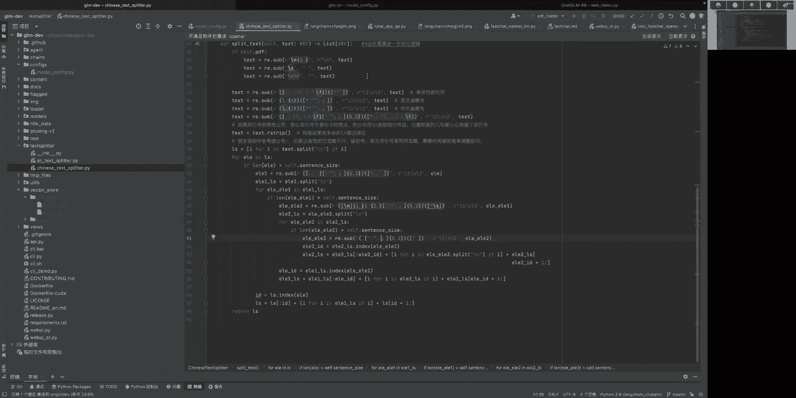

哦再看一下。

大家稍等一下，我先找一下刚才的问题，呃我在自己创建的知识库进行问答，是处处和回答没有一点联系，为什么会出现这种情况，呃，这里面可能是语言模型，对于这个prompt的理解还不太到位。

就是有可能我们提供的上下文内容，和prompt template，在某些情况下，对于原模型来说，它不能够按照我们的意图来进行理解，这个时候呢有两种方式，一种是说我们呃换一下原模型。

看看是语言模型本身的理解中可以导致的，还是在或者是换一下那个提示词的template，就是把提示词模板进行一下修改，看看换成其他模板的时候，会不会有更好的识别效果。

能不能讲一下embedding的向量保存本地，并随着不断提供的文本信息也保存到本地呃，这个里面相当于是说我每上传一个文件的时候，它会如果我本地这个选，已经选择了一个已有的向量库的话。

那他就会用那个像现在项目里面用的face的话，还有个face at document，就是把这个新的文段添加进去的这么一个函数，就可以实现新增文本的导入，然后如果是从零开始，就是呃我本地新建了一个路径。

但是还没有存储FI向量库的话，它就有另外一个from document的这个函数，就可以把文本直接存储进去，达摩院模型的名称，这个可能要看一下，刚才那个text lor里面有一个嗯。

阿里的text player，那里面会有具体的模型的名称，能必定加本地知识库相结合回答吗，呃这个技术上肯定是可行的，但是存在的一个问题就是说呃，我们刚刚也有朋友提到了。

就是总的语言模型的输入字符长度的问题呃，在我们项目组把这个呃，输入的上下文和提问的问题汇总之后，能够满足这个token要求之后，会再把这个B加本地知识库，相结合的方式加进来的。

实际上在我们做很多离线应用的时候，其实这个就不用必应加本地知识库了，呃其实比如说如果办公室在内网的话，结合本地的公司内的这种搜索引擎，然后再加一个本地知识库的，效果可能会更好一些。

怎么样有效约束语言模型，对非知识库涵盖的内容一本正经的胡说八道，哎呀这个模型发散的问题确实不大好控制呃，像GPPT的这种模型的话，它一般可以用temper rich，来调节这个模型的发散程度。

但是你说非不非知识库涵盖的内容，从非语言模型的角度来说的话，就是前面LUNK怎么套流程里面，我们可以通过相似度的阈值，就是比如说我设置了一个top k，我要从那个向量库里面，根据问题匹配出来六句话。

但是与此同时，我又设置了一个相关度的阈值的限制，也就是说像我们现在的话有一个相似度的score，这个相关度高的话，它是数值越高，相关性越低，呃测试下来的话大概在500以内的时候，它的效果会好一些。

所以我们在那个项目的配置文件里面，也增加了这个阈值的设计，现在它默认是设置为零的呃，如果大家想要一个推荐的值的话，可以试试设置为500左右，它应该能够有效地筛选这种相关系统，比较低的文本。

就不加到这个上下文里面，这样的情况下，可能就会能够让原模型，尽量的依据有效信息来回答问题，除此之外呢，我们也可以在这个群里面进行设置，比如说我在本地知识库进行检索的时候。

如果我一个相关的文本都没有检索到，就是依据我这个top k和这个相关度阈值，两个限制，一个两个限制都满足的情况下，一个相关文本都没有检索到，那么我就用一个固定的模板来回复，就不用语言模型去生成。

也是可以用这样的方式来解决，这个一本正经胡说八道，嗯语义总结的模型叫什么，这里实际上是用自然语言模型来做语义总结，嗯录屏的话应该后面我看前面的分享，应该在B站上面看，gm的账号里面都有。

估计本次可能也是这样的，呃如果数据涉密又需要调用外部的大模型API，有没有比较好的加密方式，这个我觉得是受限于外部模型的API，还需要获取的内容，就是如果你它的API要求你必须出的是文本的话。

你实际上还是通过本地的模型的这种方式，能够更可靠一些，文件的分享的话，后面我可以稍微整理一下，因为刚才PPT里面也有些问题，然后后面改好了之后，我可以再分享给大家，本地向量存储，face pra嗯。

这两种音我还没有专门去研究过科嘛，但后面我们项目里面要需要对这个向量存储，进行扩充的时候，我们来看一下，就是不同的向量库的特点，然后优先选择可能性能相对好一些，并且在本地使用的时候表现会好一些的时候。

文档中表格内容怎么支持，我目前知道的像那个PDSL里面它是有那个PPT structure，就是呃文档的结构的解析，然后它能够判断出来这一部分是文字还是表格，然后如果是表格的话。

它可以表格的形式再给你重建出来，那么这样的前提下的话，如果我们大模型里面，已经，或者说我们的chain里面已经能够实现这种库表，数据的解析的话，实际上也是可以结合这个文档里面的表格内容，进行问答的。

嗯Python这个向量库的话，最开始没有用PYON的这个向量库，是因为它是需要联网的，然后后期如果我们在扩充的时候，是可以考虑把它加进来的，而且本身这种向量库的连接，实际上launch里面已经有支持了。

大家如果想自己上手的话，也可以直接在那个local q a，那个文档里面进行修改，cc玩过这个点不太确定，这个embedding模型，HKUNOP这个模型我暂时还没有用过，呃。

我不确定你说的这个score，是不是用相同方式计算的，因为据我所知，launch里面它计算相关注ore的时候，有不止一种方式，我们默认现在采用的这种，相当于是呃一个score的计算方式。

除此之外还有一个M2的计算方式，大家可以具体到那个launch文档里面去看一下，呃，如果想参与贡献的话，有什么建议的方向吗，呃如果大家有想贡献的话，比如说想对库表类的数据进行支持的话。

实际上这里面相当于要先呃，用那个本质上相当于是在chains，文件夹里面增加一个chain，然后期间如果需要对比如说CSV文件的加载，loader这些进行变更的话，那么就在我们文件的路径下。

那个loader里面搭建一个loader的实践类就可以了，呃实际上我们现在的扩充方向，像我们刚刚PPT里面提到的，包括这个扩充数据源啊，知识库的管理，扩充文本的画图方式，还有AH的应用，这些呃。

包括不同的chain，都是希望能够扩充的，如果大家有什么好的想法的话，也欢迎TPR到我们的那个develop，就是DIO的分支，就是开发的分支，然后我们后面的话就会基于开发分支的内容，进行完善之后。

再完成发板到master分支，如果客户的提问相比文本胸片大小差异太大，导致vector store相似度不好，准确度不好，那我觉得可以考虑就是像这个问题里面提到。

他说提问的内容会比那个文本分段的这个长度，差异比较大，这种情况下，实际上我们之前开发组也有讨论过呃，可以从这里面提取关键词，就是尤其是在垂直领域里面，他如果关键词是比较明显的。

实际上就可以直接基于这个嗯关键词来做匹配，或者是说呃我对每一段文本呃向量化的之前，我是先提它里面的关键词，然后依据这个关键词再做向量化，再做匹配，这样的话就相当于我是在做关键词的语音匹配。

有没有测试过怎样的配置，是多少数据知识库量的情况下，能多少人进行问答呃，实际上API的本身的话，它是天生就具备并发的能力的，但是具体能多少人进行问答，这个实际上呃取决于模型本身的问答的效率。

目前测试下来，拆gr应该还是一个串行的回答的过程，所以并行的话，可能需要用到消息队列和不同模型的端口，的分配的，就比如说我每一张卡上面不属于TGM，然后提供一个API，然后到时候再依据消息来的顺序。

给分配到不同的那个模型的API里去，可以调用API吗，不调用本地模型啊，这个就跟刚才前面提到那个OpenAI的那个，是一样的，就是LCH里面已经提供了具体对应的类，可以直接把项目里面现在实践的那个。

比如说chi ji这种替换为那种类，流式回答的实践方式，实际上现在的实践方式，在刚才那个办法演示当中，我们能看到，就是我相当于直接用的那个transformer。

这个库里面调用这个生成这个菜JRM的模型，然后后面我如果用chat这个函数的话，它就相当于是呃以固定长度，就这是非流式的形式数据出的，如果改用这个gm里面本身支持的这个string check的呃。

一个函数的话，它就可以支持流式输出的方式，这个主要还是取决于模型本身，我们这里面实际上没有完全，按照自己明确的实践，lg里面衬的实践的话，他是要把那个原模型定义成lunch里面的LL，LM的类。

然后它的具体的那个chain定义好了之后，相当于把前面这一整段耳朵定义成那个chain，然后确定好了之后有个change点run，然后里面再输入具体的这个query啊，还有一些提示词的内容呃。

之所以没有直接用那个chain，就是因为他对开源语言模型的流逝，知识都比较差，所以我们就相当于是呃手动构建，就手动来串接前面的这个构建呃，prompt的过程，然后最终把这个prompt再返还给这个。

最原始的这个模型，加载出来的直接调用函数，能产生流失的这种方式，图谱转向量的思路呃，long train的话，在六七天之前应该已经增加了这么一个chain，就是呃把那个知识图谱。

就是suffer的这种方式给它加载进来，呃我觉得如果说我们项目要实践的话，可能会用text to suffer的方式，就相当于我输入一个问题，然后把这个问题根据已知这个呃，图谱里面存在着不同的类啊。

就是实体的类别和关系的类别，然后让它来生成对应的cf，如果拆机样本身不能够生成的比较好的话，那可以再考虑创建其他的模型来生成，然后形成CER之后返回呃检索之后的子图。

再把子图用JSON的形式返回给语言模型，让语言模型来进行最后的呃，从那个JSON形式到自然语言的一个过程，多个文件做成知识库之后，还想更新扩增，可以吗，现在就是可以的，就是我们项目里面。

现在相当于就是在知识库上传之后，形成一个新的知识库之后，是可以再往里面继续上传内容的，包括可以上传多个文件，或者上传一整部分，应该都是可以，项目中doc选取有什么注意事项吗。

这个道口我不知道你是说文件还是文段，可能需要再问题再具体一点，A证大约什么时候能够接入成这样啊，这个我觉得让我们先测试一下，TGR本身能够支持，就能够比较好地实现哪些症，然后再把它记下来嗯。

关于知识库的回答很不稳定，不准确，且长，胡言乱语，嗯这方面的话，如果在你对应的这个领域数据里面，prompt template已经有过不同的测试，都效果不太好的话，可以试试看。

直接对语言模型进行一个微调，看这样的话能不能达到一个相对比较好的效果，因为说实话，我们现在这种离线开源的模型，它的参数相对来说都是比较少的，所以他难免会有一些，不如人意的地方吗，所以这种你像GPPT。

实际上他有的时候也是在生产内容，你想让他提供一个文献出来，他可能也是编造出来的，在launching构造上下文中，如果ABCD用户检索H在这个场景下，怎么让LM回答，不知道，防止他胡说。

这个就是我刚刚提到的，就是相当于是我通过阈值和那个top k两个设置，相关度，阈值和top两个设置来限制我返回的内容，如果我返回的内容，就是你就是想让语言模型给你回答，不知道的话。

那倒不如我就不用语言模型来回答了，我就直接有一个通用的定义模板，就是在知识库中没有检索到相关内容，然后可以提一些其他的内容，其他的问题这种，本地知识库可以是结构化的表吗，表内容是不是也可以转换成文本。

再转成向量呃，表内容的读取，目前刚try里面应该是以JSON形式加载，就相当于我们表里边正常是个表头，然后下边是表的具体内容吧，它解析出来的内容，相当于是我依据你的提问去匹配到自己的行。

然后把每一行分别加都改成了呃，表头就是这个JSON里面的key，然后对应那个这一行里面的数值呢，就是呃对应的value，以这样的形式把这么多行给加载出来，再放回一个语言模型，再用于生成后面的内容嗯。

PPTF里面是图片的话能识别吗，如果图片里面是文字的话，目前是可以识别的嗯，OCR是免费的吧，现在是现在用的pad o c r它是免费的，只是大家在离线部署的时候需要注意一点。

就是它是有一个第一次加载模下载，拍到OCR的时候，需要加大模型的一个过程，所以最好是在公网上先下载好模型，并且执行过一遍拍DSL的识别，就是因为大模型下载完了之后，它是一个tr的包。

然后需要把那个包里面呢。

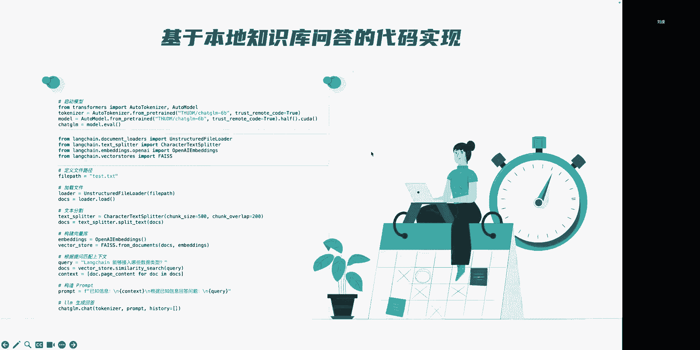