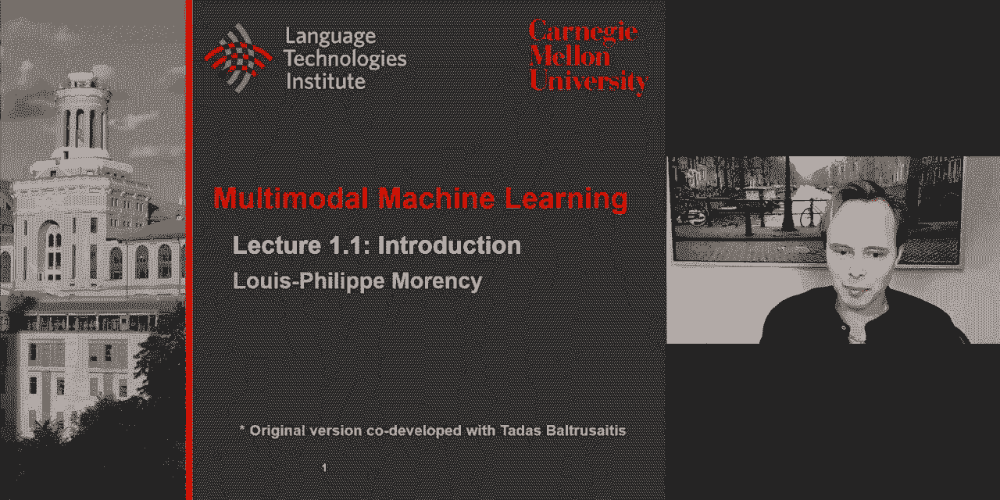
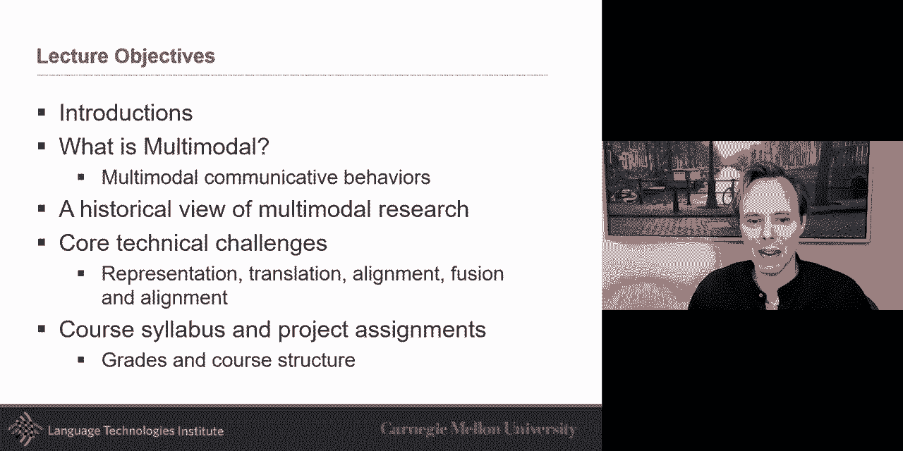
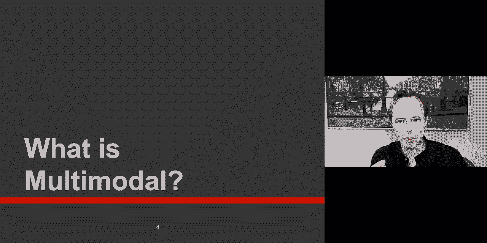
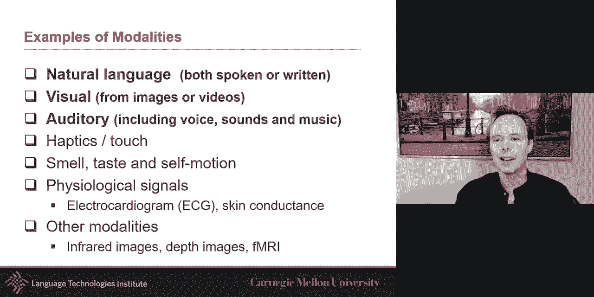
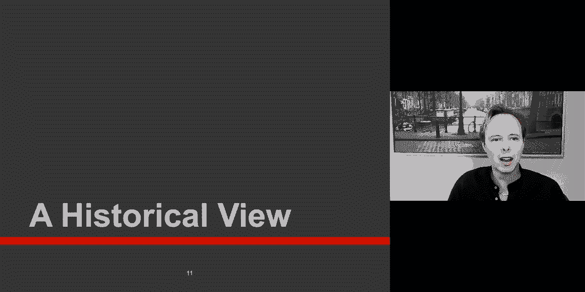
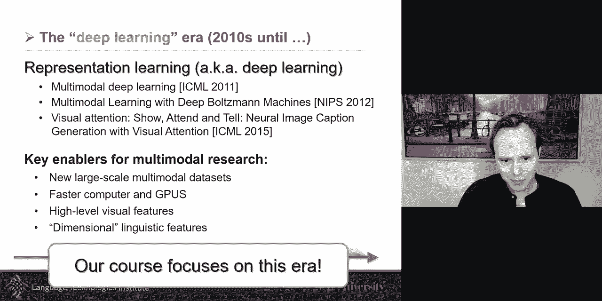
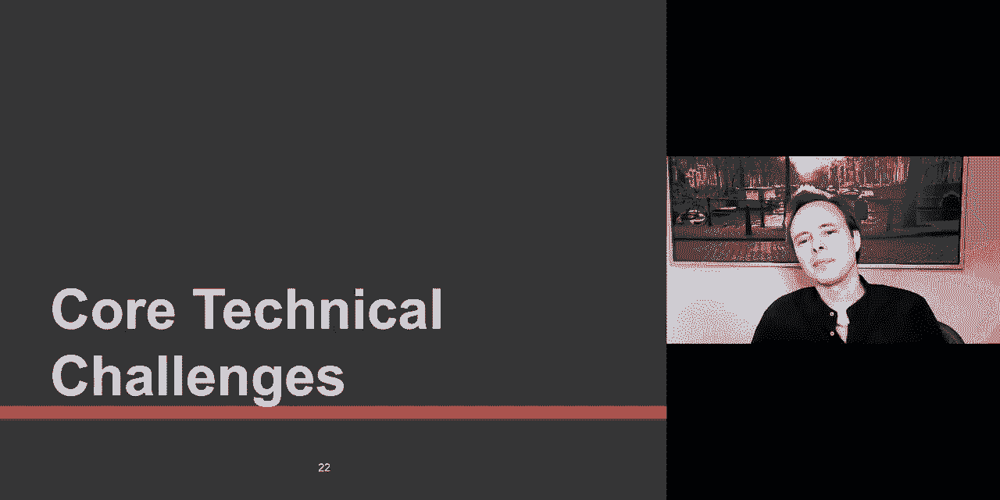
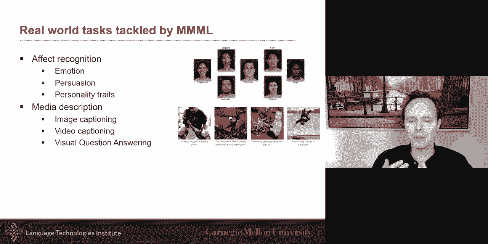
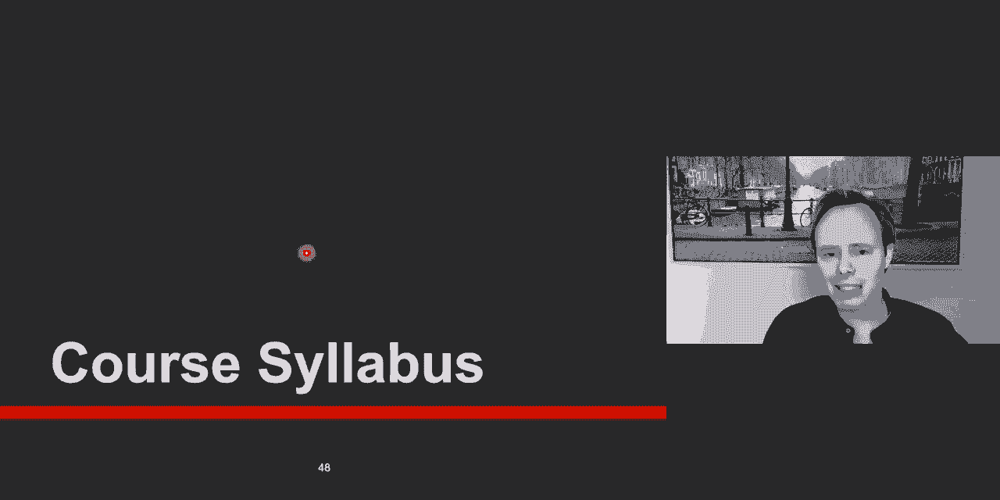
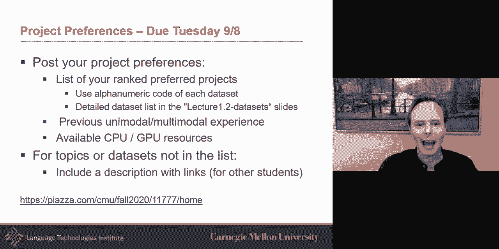

# P1：L1.1- 介绍 - ShowMeAI - BV1Pf4y1P7zc

okay，welcome everyone uh this is uh，the largest we ever had for this course。

of multimodal machine learning，i'm very excited uh to start this new，semester，um this is uh the。

probably about sixth time we teach this，course，but we made some changes this year this，is。

recorded completely remotely is done，completely remotely，if at any point you have a question。

i very welcome questions since it is a，very large，group of people what i will ask each of，you。

is to type questions uh this will work，have，uh the um the tas，who are monitoring this um they may in。

fact answer directly the question，uh if it is uh via chat or，um if not then it will not define me。

and we can address that so um so，i want to start uh right now uh。

this season we have five tas that are，gonna work with us，uh for this i'm very happy to have all。

five they were hand-picked，um to be people who have experience in，multimodal。

either by taking this course and or，doing research directly on this topic，be guest。

lecturer on a few lectures uh，specifically，reinforcement learning and i'm very。

excited that he accepted to give，a few of these lectures the rest of time，will be me giving lectures。

and at the end we'll have a few more，guest lecturer，we have prakar uh also martin。

shakib and thorsten i think at least，right now we have，martin and paul who are somewhere in。

that list of 120 plus，people who are currently uh on the，on this so um yeah so today。

my goal uh is first to share my passion，about multimodal，uh i'm definitely passionate on this。

topic and you will see it through my，lecture，i want to give you a definition of，multi-modal。

uh what is multimodal uh a，historical view and also share these，five technical challenges。

that are involved in many of the model，research and give you details on the，syllabus。

um what is multimodal and normally at，this point i will try to get answers，from you。

and i did not manage to get the uh，the um the poles uh functionality of。

zoom to work right now so it would be，without the pole，but what is multimodal what is a，definition。

uh。

from a mathematical perspective a matter，multimodal could be seen in fact one of。

the first although not the first first，one but one of the first。

definition of multimodal was really a，multimodal distribution。

multiple mode of a distribution like the，peak，is，a lot more related to sensory modalities。

the sound the touch uh and the speech，uh the what you see and so all of these。

are the sensory i myself have done a lot，of research over the years。

uh on the on the part of this which is，the uh a subset of these modalities。

although i'm excited in multimodal，machine learning in general uh i i have，a focus。

myself on the on a subset of them and，three of them that i，we will be focusing a lot more uh in。

this course but in general，uh that are very essential to，communication。

i call them the 3v of communication，verbal vocal，and visual what you see how you say it。

and so what you say how you say it and，also the visual the，behavior so verbal the words how you。

phrase them but also the，intent behind the words are very，important。

the vocal is one part is the process the，procedure is related to，what you um what you say the words。

how you say the words that's one aspect，but there's also what's called vocal，expression。

like a laughter or a past fillers um，all of these are part of vocal they're。

kind of the nonverbal aspect，of a visual，so this is uh one uh。

aspect of this and then the third one is，visual，the gestures the b gestures like i'm，doing。

body language approximix although proxy，mix in the virtual world made。

almost something different um and if you，in，all communication is eye gaze i uh。

it's a very important q boat from，communication perspective but also，cognitively。

when you're talking and thinking uh，finally facial expression，very important so that these are three。

examples，in a second i'm gonna give you a lot，much larger，number of that but before i give in the。

specific of different modalities，there's a difference between you've，heard maybe the term sometimes。

multimodal and multimedia，uh and and you're like oh what's the，difference。

a modality and a medium are different，although very related and modality is。

the way in which something happened in，this experience，this is in the sense almost the content，of it。

the medium is the mean in the way it is，stored and communicated，so you can see there is a big。

relationship in this，audio being a medium you could say and，the vocal being a modality。

over the years multimodal and multimedia，had so much overlap that。

people started using the terms back and，forth and so you will see。

them use multimedia and multimodal but i，just wanted to give you originally how，these came。

from and when you think of multimodal，you have to think of multidisciplinary。

this is something that comes from many，different fields，all bringing together uh in a sense it's。

it's，almost ai coming together because，there's the speech the vision the，language。

there's also maybe the tactile and the，robotics there's the aspect of。

learning and there are applications and，knowledge to gain from medical and，psychology。

so i mentioned natural language visual，and auditory or verbal。

visual and vocal there's also the touch，if you look at these days we also have，to those uh。

sensors a lot of sensors to the cell，phone，uh you have in medical field eeg。

uh and you also have infrared，cameras sometimes in some sensors and we，also have mri。

the course as i mentioned will focus on，language and vision，as two of the building blocks for a lot。

of our，uh of our examples but a lot of the work，we talk about，uh will in fact also。

have application other modalities and as，often as possible，i will try to bring these other example。

modalities uh in there so，so the historical view i just want。

because sometimes you talk with students，and sometimes we，with the world of archive and and we。

kind of think that the，the science everything that's more than，five or ten years old。

is is too old to read uh，so i i would like to think of multimodal。

as something that really evolved over，the years，and i think there's a lot of value in。

looking behind，looking at previous work i from my，experience in multimodal。

i from my study of it there's four eras，of multimodal um there is the。

era of behavioral a lot of the work，there was，psychology in spiral communication，inspired。

i will give you one a few examples on，suggest，to look at some of this early work and。

then there's something，magic in late in middle late 80s，where suddenly it's no more just looking。

at multimodal behavior，from uh from maybe a psychological or，linguistic perspective。

but certainly looking at computational，approach one of them，is uh looking at audio-visual speech。

recognition，like，exam probably one of the reasons for，that，but there's a there's a switch where。

it's not just，looking at a human in a computer but，suddenly，multiple look at multi people and their。

social interaction，and so there is a lot of emphasis on，social interaction，and in 2010 ish。

then there's a suddenly move uh，in looking at those neural architecture。

like the renewal of neural architectures，that started almost 2006 2007 but really。

had a big grasp around 2010 the course，is focusing a lot more on that part。

but i think it's healthy to look at it，more generally，as well so um if you have to read。

one and it's hard to pick only one，person，these，uh this era and he's done work uh in the。

1990s but i'm just putting some on，much，on language and gesture and and he's。

done a lot of interesting work，that looking at gesture are in fact。

a display of people's thoughts and so，so it's it's more than just something。

that accompanied the speech，it is a clear uh depictation of the，thoughts and。

there's a very interesting debate around，language and gestures around there。

and our own uh faculty here at cmu，justin castle worked very closely with。

david mcneill back in the days，um i will say there's this magic moment。

where suddenly we went from uh we went，from，um uh we went from psychological，linguistic。

to uh uh sorry to psychology and，and linguistic to more computational。

approach and i think one of these，is that really sparked interest is the，mega。

effect uh i'm gonna play the videos，maybe some of you have seen in the past。

the mega effect so you have to listen，and watch the video uh so if you're。

looking at something at the same time，uh it's not gonna work so this time you。

need to look at the video，um and listen i'm gonna play two clips，and you have to see if you hear。

okay so this was the first slip so，hopefully you heard something，i repeat it over and over it sounds。

really simple，um i'm gonna play it again uh no not the，same clip a second clip。

and listen if you hear something，what's really interesting for the few of，you who。

didn't bother to even look at it you，probably in fact heard the same thing，both times。

and the reason for that is it's exactly，the same audio clip，it's exactly the same audio clip in both。

cases，the only difference is the video in both，of them，in one case you probably the first one。

heard something closer to ba，so you can see that suddenly it's very，exciting something。

like oh my god we were doing all this，work on speech recognition。

there was interesting work uh in the 80s，on this and like，but but then and like oh but maybe the。

old reason，that uh uh this uh was not working well，it was that we needed。

to have both audio and video together，and that's why，in the the next phase is computational。

i think suddenly what what drove a lot，thing，but one of the main thing that drove the。

computational era，is this audio-visual speech recognition，this idea that to recognize things you。

need，to be able to uh look and，hear and look at the same time one thing。

that was interesting during this era，is that it turned out that although it，is effectively。

helping it looks like audio and visual，could help，together in a few cases it turned out。

in the case of speech recognition，there's a lot of redundancy。

both signals are encoding the same thing，which is great which makes things in，fact more robust。

and so one of the things to take home，for all the research on objects or，speech recognition。

is that sometimes bringing the two，modalities together，the goal may be to uh have something。

more robust，and you can have redundant information，in both modality。

you could have also complementary like，you need to have both modalities to be，able to infer。

like the far far far but in in most，cases，uh you can also find um that。

only one modality may be sufficient now，at the same time when this old work。

happened in auto visual speech，recognition，in the world of human computer，interaction。

there's suddenly a lot of interest in，multimodal because，human how will a human ever interact。

with the computer，it should be the same way as the human，interact with each other。

and human interact with each other with，true multiple modalities。

so there's a lot of interest at this，point to build computers，now these days we almost see it as a。

reality coming up with these different，interface alexa being one of them um，they're。

we're talking about more than 20 plus，years ago，there was already this dream of this and，one of the。

a sub dream of that was effective，computing where，it's not only you talk with the robot。

but there's also the aspect of emotion，and feeling that we'll be able to。

perceive and generate and model and if，you wonder why，emotion emotions are key to decision。

making there's a lot of work in this，and a lot of literature on this topic。

but if for decision making，emotions are key but they are also key。

for other things are sharing emotions，sharing，how you're feeling so their emotions are。

important a different aspect，the the third thing there was multimedia，these happen。

all around the same time a little bit，later i will say multimedia computing。

multimedia computing was the idea of all，of these video that was being created。

digitally and can we understand its，content so that，we cannot just we don't we don't just。

research thing based on，keywords but we can use the content of，the video and it was a。

very big landmark project that was，almost 15 years，at carnegie mellon alex hoffman was one。

of the co-pi on this um so this is fine，this is great because，at that point the it was the beginning。

of the internet now it sounds so obvious，with things like youtube or even。

facebook and other platform，that we want to search videos but this，was really at the beginning。

of it and so they want to look at the，content inside the video the speech the，image。

and the language in it so this is 2000，and then suddenly we go ahead and it's，what i would call the。

interaction era at this point we want to，model，human human interaction as well and one，landmark。

project i will say is the ami project，in early 2000 they recorded meetings。

moving together uh people talking to，each other，so it was no more just human computer uh。

and it was a lot more uh looking at，people how they interact together there，was a follow-up to that。

also uh with the faculty at cmu chill，um by the way if you know banjo uh。

from uh montreal's and his friend his，and his brother sammy，sammy was in fact on the ami project i。

think it was as a poser，back in the days i think he was recently，at google if i remember correctly。

um sammy so just to give an example，everybody，who has an iphone you know about siri。

but siri came from this multimodal，project that，it was a darpa funded project called。

kelo about this personal assistant，this whole idea of bringing information，together。

um and around the same time social，signal processing，although the term itself started in the，u。

s it had a big momentum in europe，uh around that time so a lot of very，interesting projects。

and then suddenly uh and then suddenly，we come into the deep learning and。

why is the deep learning era so，important for multimodal because。

there's some landmark work and i i've，listed some of them，uh that landmark work but really the key。

enabler，why suddenly the way we went from，multimodal research before to。

a brand new paradigm of multimodal，different，reasons the first two are i will say。

generic reason for many，research topic and the last two i think，are a little bit more specific。

the first one is that suddenly that we，had a much larger number。

of multimodal data set i talk about the，ami，data set there's a lot of other one uh。

audio visual emotion challenges，being other example but suddenly there's。

a move towards much larger data sets，so that's one point and the other point。

that you probably heard often and，over and over is also about faster。

computer and gpus that allowed us，to revisit uh theories and and，models back from the 90s and we uh。

restarted them now in this larger scale，uh uh scenarios and so。

yes these were definitely very important，but i think what really made the，difference is two things。

um if you think of multimodal and，specifically look at language，vision and maybe audio as well。

um vision is was a very high dimensional，and and many，modalities have the same issue very high。

dimensional，um and it the way to represent it，was i had always been somewhat of a。

challenge there were some，very interesting uh features that were，like more local in space。

like feature back in 2000 but，suddenly with neural representation and。

with the revisiting of convolutional，suddenly you take these very high，dimensional representation。

and put them in a one vector or one，representation um that is much smaller，that allowed to。

take both the spatial information and，the texture information and encode that。

in that one vector so that was very nice，that happened，uh one landmark paper in 2011 if i。

remember correctly，and around the same time a lot of，interesting approaches that were studied。

in the past，about a distributional hypothesis，meaning，the meaning of a word can be。

approximated by the words surrounding it，got revisited by researchers around the。

world but specifically by google，researchers was one，of the landmark word with word to vec。

and certainly you could take，what was very discreet very discrete，elements。

like a words and suddenly you were able，to encode them，into something that like a vector。

representation，some people will call the word to vect，vectors so，now we had something that was very。

discrete and we can put it，in a vector representation we have an，image that was high dimensional。

you can put it in a vector and then in，speech i would say these there was a lot，of work in the past。

and they had already found very useful，representations，that could already be used although they。

you see some newer one recently but，they're still already，at a good understanding looking at the。

frequency domain looking at spectrogram，or if and，how people are hearing and looking at，mfcc。

so all these modalities now are，all on the same similar and they're not，exactly the same space。

because you have to remember the kind of，noise you see in an。

image is very different from the kind of，noise you see in words，the。

way something has been uh transcribed or，something like this by no words we're，talking about pixel。

change of textures so very different，model of noise，and so it's not that these space are。

equivalent but they're a lot closer so，we went from very heterogeneous。

to less heterogeneous it's still，different space but they're a little bit，closer。

and so that really brought and the，follow-up，papers to try to study these and that's。

what we're going to study。

in this course today so，when we study multimodal you're probably，wondering like。

is it why do i do study multi-modal，machine learning why not just studying。

machine learning i mean if it's in the，world it's in the name，and probably everything we study in。

machine learning is，we，started teaching this course uh and i，like more than six years ago with the。

goal was to study what exists in machine，learning，and what exists in multimodal research。

and try to identify，what is the core challenges what are the，core chat technical challenges。

in multimodal that have been，understudied，in machine learning it doesn't mean，they're never studied。

but they've been kind of understudied in。

machine learning，and so uh we identified，uh five of these core challenges and i'm，going to。

highlight them during this lecture today，and we're going to use it。

kind of as a structure for this course，we're going to go way beyond that。

eventually because this survey for，example was a survey，of three years ago so but it's。

interesting if you do a survey，and you talk about taxonomy of research。

it's interesting that although the，there's a lot of new papers that came in。

the taxonomy some of it is still very，relevant these days and a lot of it is，still relevant。

i think we can always expand but it's a，good starting point i think when you're，studying multimodal。

so let me go in this uh and，study what those core challenges are，right now i'm not gonna。

give i'm gonna give an overview and，we're gonna spend the next。

15 weeks together looking in the details，and looking at state of the art。

that way go go beyond that so uh but，two of the core challenges i think uh。

for many problem but also for multimodal，is how do you bring verbal vocal and，visual。

and at a first level is very important，and i think，everybody who's use or work now these。

days with deep neural representation，or networks really understand the。

challenge of representation learning，and so i think there's some very key，aspect that。

are true um for in general of，representation learning but in。

multimodal i'm going to share with you a，few，um core challenges related to，representations。

if you ask me what is this one challenge，that is，very multi-modal is alignment and i'm。

going to give a little bit more，a little bit more details in a second，looking at a。

synchrony but let me talk about，multimodal，and i have a dream and i had this dream，for a while。

and this dream uh is that，i could learn a representation where if，i say i like it。

or i'm i am a happy face or joyful tone，that the representation will encode that。

the similarity or if i，if i'm tense or if i'm or if i'm，surprised that these will be，that。

at some level and this is a dream that i，had for a while，um and i will say we're a lot closer to。

that，but back in the days this dream come，that's more than 15 years of this dream。

but what happened in this 2010-11 and，plus，is that suddenly that dream become a lot，more reality。

and what what happened is that they，people were suddenly able，to learn joint representation。

representation when where you see an，object，see，you you see some language associated，with this so。

maybe a red car or a enthusiastic，pers speaker uh or or some，so you have a kind of a description and。

so you have some kind of，paired data and so a joint，representation。

allows you to learn this one space where，both of them will live together。

and that sounded like almost impossible，before，but now with this work and now we've。

seen a lot more of that，we got us we got to see these joint，representations see。

a very important milestone and one of，the examples i'm going to show on the，next slide。

is here's what they did and i love it，and i i，i always talk about this one example is。

that they learn，back in the days uh they learn uh，through a repair data set where。

you have pair image and description and，they learn a joint representation a。

representation could be just a vector，and what's great by having it joined is。

that suddenly you can take，any sentence and and if the model was，successful in。

in and training you can take any of，these sentences，and encode it pass it through your model。

and suddenly get your representation，your vector and you could do it，similarly with any image。

and both will be in the same space in，the same，kind of representation and what can you。

do if you do this，is great what did they do they did and，they trained the model。

and then they test and then what they do，they take an image of a blue car。

a blue car and then they go and encode，it like kind of get a vector。

out of it with their model that they had，trained on other data，and then they take the word blue and。

then they also encode it，and then they create the word red and，also encode it。

and then they do arithmetic which is，beautiful the，blue car of the image of a blue car。

minus blue plus red you get a new vector，and then you can sample from that like。

your nearest neighbor like look in your，all of the training data or you could。

have a calibration data set for that，and that's really interesting that。

suddenly you get images of red car，you could do it for colors and then they，did it for。

day and night so you take a a，palace and then do it at night flying，and plus sailing，these。

issues i mean uh it it doesn't mean that，arithmetic is true，every time there's cases this will fail。

but just the fact that it work in some，cases，was very exciting i think this was uh。

for me a big revelation so，so then suddenly you have the chance，to have multimodal representation so。

representation，the challenge can be formalized as，learning，how to represent and summarize。

multimodal data，in a way that exploits the，complementarity and redundancy。

if you remember in audiovisual speech，recognition，they turned out there's a lot of。

redundancy between the two，between what i say and my lips there's a，lot，like my uh vising my phoneme。

what you hear are similar to my visine，more like，my lips contour so this is redundancy。

and you want to take advantage of that，redundancy maybe to be more efficient，and more robust。

but you also want to do complementarity，like the mega，effect if two things uh by themselves。

are not sufficient like and you need to，bring them together，people，think of joint representation。

you take two modalities and you force，them together，in one representation one vector space。

there is and i would like to make you，think a little bit，outside the box a little bit with，different。

way to think a little bit about uh，representation learning，where instead of bringing everything。

together what you will do，is bring each of them so language，you have their representation and then。

you will have，a visual and you you have its own space，and instead of forcing them to be in the。

same one you will，a sub，space a sub part of it you're going to，coordinate。

and coordination you should see it as a，spectrum，that，so what do i mean by that at one end the。

coordination is so，strong that they are equal you're，forcing it to be。

language representation being equal to，it sorry，at that point it's mostly a joint。

representation at the other end，they're separate representation you，don't coordinate at all。

and then you have a spectrum in between，one example，is you could say i'm not gonna make them。

equal but i'm gonna make them correlated，so it's not as much as equal but close。

uh an example of that is cca canonical，correlation analysis，you could use that or you could go and。

say，from all my representation i'm gonna，bring together only a subset of each，representation。

there's some items i want very close to，you，uh let each modality separate and let，them by themselves。

and we'll study different version of，these coordinated representation。

as i mentioned one thing that is core，to multimodal is alignment like，synchrony。

i talk and speak and gesture at the same，time，you want to be able to align speech and。

gesture as an example，when i say it's very specific to a to，multimodal，term，is multi-view multiple。

view of the same data so multimodal，it could be seen as a specialization of，multi-view learning。

uh where the views are modalities，but another way of multiview is to also。

look at multilingual multiple languages，these are all multi-view problems，multimodal。

multilingual and so that's why，if some of you have studied machine。

translation you will see the problem of，alignment because this is a multiview。

you want to be in alignment you want to，be able to，have elements of one modality like。

words of or objects and be able to align，them together and synchronize and align，them。

some people will say when its language，and images will save and to ground。

them as an example and when you do this，there's two types of alignment there's。

the problem of explicit alignment or，implicit alignment explicit alignment，means。

your goal your loss function your your，task，give you，a corpora with a bunch of images and。

and a bunch of text and i say match them，together，or a video and a cooking recipe。

it's a video of the recipe and the，cooking i want to align that，or a wiki like a to do。

do it yourself video and the instruction，that kind of alignment that's。

explicit alignment the loss function，what you're optimizing，is going to be the alignment in many。

cases the，alignment is just an intermediate step，like the the real loss function may be。

another task it may be，about generating text from an image，and so you go from the image generating。

text and in the middle as a latent，process，you do implicit and for people who work，on this topic。

the example of that would be an，attention model，will be an example of implicit uh latent。

alignment uh these days we talk about，self，attention and transformers will all be，in this thread。

but there is often cases where your goal，is i give you two videos。

and i want to align them together that's，probably the most visual of the example。

uh i could give so here's a you have，very，these videos originally were different，time number。

of different granola granularity they're，not exactly the same，but you're doing your best match to。

align them，and you could i could give you an image，and you say hey，the task is to align every word。

with every object or every possible word，that you can，with any object in the image but in many，cases。

the alignment is not explicit but really，the task，is just the generation of language and。

implicitly as a latent state you would，do it，so this is representation and where we，will spend about。

two full weeks four lectures on，representations，i think we have at least two lectures on，alignment。

uh these are very very core aspect of，the course，but then from there there's a branch。

from from from alignment there's a，branch you either，you always almost always have。

representation almost always have，alignment，but then there's a branch are you doing，translation。

or are you doing fusion there are a few，examples where both are happening at the。

same time but it's it's it's，often yeah and their translation，infusion。

is about what is your loss function what，is your loss function。

in the case of translation what what is，are you trying to do，uh and translation is translating from。

one modality to another，for example translating from an image uh，to text like for image captioning。

fusion the loss function is not creating，generating one of the modality in the，case of fusion。

you bring all the modalities together to，be able to infer，something else something high level like。

uh the recognizing the emotion or or，detecting an event in a video。

so the fusion will be different and will，bring different approaches than，translation。

so let me talk about translation at，first and then talk about，fusion translation the landmark and。

we'll talk a little bit more，on thursday about this but one of really，the landmark。

work on translation was uh，image captioning and i discussed that，more，on on on thursday um but。

um but there's more than that there's，different type of translations and。

one of them that i like quite a bit is，this example，in this example uh what you will see is，on the。

uh i don't know if it's right or left，for you but on one side。

the input side what you have is from the，video we're only going to get the。

transcript of what has been said and the，audio stream like the acoustic the vocal。

of the prosody only take that，and the goal is to generate the，behaviors。

and the behaviors the visual gesture you，want to generate，you're going to want to generate two。

type the speaking gesture if someone is，talking what what，does this look like and the second one。

is if someone is listening，what are their gestures and so，in this video that i'm about to play um。

when you see the virtual human，the appearance of the virtual human was。

designed to look a lot like the movie，that that's that's manually done and the，placement。

and the view angle was manually done but，the gestures themselves of the virtual。

human are all automatic，from the system so it's a nice example。

sorry you snotty little bastard you're，on i'd like to ask for a recess。

i'd like to answer the question judge，the court will wait for an answer。

if lieutenant kendrick gave an order，that santiago wasn't to be touched。

and why did he have to be transferred，colonel lieutenant kendrick ordered the。

code red denny because that's what you，told lieutenant kendrick to do。

when it went bad you cut these guys，loose your honor you are，just inside of traffic your honor you。

doctored the logbook，consider yourself colonel did you order，the code red。

you don't have to answer that question，i'll answer the question。

you want answers i think i'm entitled，you want answers i want the truth。

you can't handle the truth i love that，movie very much，um so yes。

this this was an example uh and this is，a little bit old but now you see a lot，of these renewal。

there is a speech to gesture and，different project，it's really interesting to see all this。

work uh going but，the translation is you take something，text and speech。

and be able to generate from that um，the other so when i think of translation。

what it is is the process of changing，data from one modality to another。

but also keep the link and so，and this uh where the translation。

relationship can often be open and dead，and subjective and that's。

one thing we'll discuss also on thursday，is one of the big challenge with，translation which is true。

i i told you alignment，is related to multimodal and multiview，which is also related to mission。

translation，um but but this is true from any，translation，like language to language or also like。

speech generation，these are all translation problem and，they all come。

with the big challenge of evaluation，would be a big challenge when you do any，translation。

so when you look at the translation two，ways or two approaches。

maybe their slightly older weight will，be but also very interesting。

way and i think you should visit it's，kind of more the non-parametric。

way of looking at translation where i，have a，a test time i'm going to look at like。

example from my training and maybe，to like the more the classic the most。

classic of these will be nearest，neighbor that's the most classic，non-parametric。

model but the translation there's a lot，of interesting work，in parametric approaches trying to。

reduce the number of parameters，sometimes，also and see generalization between。

training and testing so，these are two examples let me show one，last example。

this one is my work is your work not my，work as you know，uh students are the one doing the work。

but i'm very，excited about this work about，translating uh，from language to motion uh so i，uh。

in los angeles and i had a mini dream at，that point that i could take。

a movie script and create a first，version of the movie，just by looking at the movie script and。

so you can see the description，the actor move and jog or the person，step forward。

then turn around and and move forward，again，uh let me play it again uh just to be，sure。

i think there's a problem with the，animation i apologize for that。

uh anyway so this is an example uh i，will fix this for the slides，um the other uh。

so this is translation but there is also，the aspect of fusion。

where you bring the information and try，to infer，something novel something new uh。

something about the sentiment maybe，over time so fusion is probably，the oldest of the the challenges。

in fact when i started my phd long time，ago，um if you ask what was multimodal。

research at this point you could almost，summarize it with，early fusion and late fusion。

and then the question was just which of，the two did you use early fusion。

ah all right or did you try late fusion，oh you tried like you。

did you tried really efficient so it was，very early uh but，now these days we the the portfolio。

is much larger but it's still really，interesting early fusion the idea。

is that the modalities are going to be，concatenated early on，and then your model is going to learn。

hopefully，how to bring these together so you're，kind of，making it uh with the hypothesis that。

you can't build uh you can't，train or learn your process unless you，bring it up early on。

so that means that there are some very，low level，you should use early fusion when there's，some very。

low level multimodal uh phenomena，happening，are，just increasing their voice and moving。

at the same time，very low level the late fusion is the，idea that。

i need to do some processing internally，in in once from each modality before。

i try to make my fusion uh and if i try，to do it too early，and you have to remember that at this。

point the data that were much smaller，that that's part of the reason uh you，had this。

so now these days there's a lot more，approaches，uh to do that uh in the course a lot of。

the course will be on deep，neural architectures and all its，variants。

but we're also gonna discuss uh kernel，based approaches and the part that i。

personally like very much，is graphical models i love their，interpretability。

also the fact that you can bring domain，knowledge into these architectures so。

i think it's good to visit them as well，the last challenge that i want to，discuss。

is co-learning the intuition，behind co-learning uh the the main，intuition there。

is that um we talked up to now，about all of these problems where we，bring all this。

multimodal information together or that，we're translating it，but there are cases where the problem。

the most interesting or at least for，that person the most interesting problem。

is unimodal it's possible the problem is，unimodal by itself，let's say it's object detection in an。

image i want to detect the best possible，detector and，the most generalizable to any kind of。

label or class label or object labels，so it's a very unimodal problem。

but maybe there's something from other，modalities，that could help me at training time。

to be better in my task in my unimodal，task，i'm going to use multimodal information，at the。

training time to help me uh and so that，at test time，these，co-learning cases are usually the most。

useful，when there is an issue with um where，there's a problem with the um。

limited amount of data and so，maybe there's not as much data annotated，yet。

for my task and so that's why you will，see them a lot more as few shot learning。

kind of scenarios so this is co-learning，and you could imagine doing it both way。

language could help vision but vision，could also help language，and then suddenly you have this uh。

two-way co-learning and this has a name，and that was in the multiview setting，this was called。

co-training uh so-called training with，uh tom mitchell being one of the，these are。

examples of co-learning and the big，challenge with co-learning，is when you have this second modality。

helping you，know，that this second modality is linked with，that first modality。

how strong is that link that pair paired，data and for people who do machine，translation。

you know also like do you have a pair，very strong pairing where almost every，word。

you know what other word uh is in the，other language or which sentence and。

these uh the the translation or you，could have it，like what could be called non-parallel。

or what i personally require，weekly uh parallel is is the idea that，you have maybe a corpus。

of language sentences in a corpus，land，sentences and then but you don't have。

exactly which one is which word but you，know that they're related。

so that's weak and you have the same in，multimodal you have a bunch of images。

and your the text and you have just only，and maybe at the corpus so you have a，spectrum。

again of being very strongly paired to，weekly spare，and so one example for that is。

how do you learn language embedding，so uh i'm talking right now and how do i，encode my。

words into something that would be，useful maybe for emotion，recognition and so um。

the idea here is that um i will，um i want to learn this and if i have。

infinite amount of data i have a，large amount of corpus um i i think。

probably you can do it just from，language itself uh，but and and for text corpus like written，corpus。

there's been a lot of it but for spoken，there's maybe，let's say fewer of this there's still。

quite a bit but let's say，for the purpose of this example let's，suppose there they're few。

of it or fewer of it so then i would say，but when i speak，there it's not only about my language。

but it's also about my gesture it's also，my tone of voice，so can i use it during training this。

extra information，to be able to prove but at test time i'm，only gonna have，here。

is i'm gonna use the the idea of，translation，where i do end up taking uh from the，verbal。

and i will translate it in an，used，to finally generate the visual and so。

this is supposed paired data，but i will also do it with what's called，a cyclic loss which they say。

not only did i take something like today，was a great day，and try to generate the visual but that。

needs to be able to regenerate what was，originally there，and the reason for that i want to do。

that is，is that internally that intermediate，representation，i need to be sure that it contains。

everything that was，in today i don't want to lose anything，that's there。

and see if i was to do only the one way，i may end up having an。

intermediate representation that's a lot，closer to my target and there's some。

interesting work on this that shows that，often these intermediate representation。

are closer to the target than the source，but if by putting the cyclic and。

suddenly you have this so to be sure，that they also look very much。

like the input and then at test time，what's really nice is that you can，forget about the multimodal。

and maybe on a small data set train for，this uh，on the task like sentiment analysis or，anything。

and what was really interesting in the，results of this is that this work almost，as much。

as a multi-modal uh like，having multimodal both at training and，testing so that was really。

interesting so this is the uh，high level view uh of five these are not，the unique。

and i really welcome your feedback when，you think about it，and one of the reading assignment will。

be this survey paper，uh not all of it will splitting in two，um。

but yeah uh think about this like what，are the interesting challenges。

and this is a draft of the taxonomy，that came from this example what are the，sub challenges。

in multimodal research and what's great，with multimodal research，with。

many applications up to now i may have，emphasized a lot more，affect and emotion part of it is a good。

part of our research in my group isn't，that topic，but if you ask me what really started。

the renewal the new part of multimodal，is really the aspect of what。

some people would call language and，vision research，uh and so looking at media description。

as an example，is like how image captioning or video，captioning。

and visual question answering there is，also have been，anything。

started earlier if you ask me i will say，effect recognition had been there。

for a while uh and multimedia had done a，lot of work，uh and uh and there was a quite a new。

role also there，and in affect uh with the 2010 with，multimodal。

and media description although you can，find some example，as early as 2001 for image captioning。

it really started it had a big boost in，2010 11。 so，so this is what we're there we're here。

for this kind of course，uh that's our goal for this so，my goal is to spend the next i don't，know 15。

20 minutes to also go through the course，celebrities，believe，is going to be a very engaging way of。

studying，this research um so for this i really，want to，go for the course celebrities but also。

share with you，our vision just a second。

our vision for this because，we want this to make it engaging and i，know with the world。

of being virtual and remote it can be，challenging so，the three main paradigm for this course。

and although the grades，uh maybe not reflecting all the，importance of each of them。

but uh but they i think all three of，them are equally important。

but from a grading perspective you're，gonna see one of them is clearly bigger。

and is is a personal choice in designing，this course，but i think all three of them are really。

important one is course lecture，participation，and just in the engine all the course。

lecture i'm talking i'm talking a lot，uh and that's part of lecturing um and。

i'm gonna share with you，um our view of how to，assess the course participation in this。

and um we call them lecture highlights，and i'm going to talk about it in a。

little bit the goal was to not，overwhelm you with extra homeworks but。

still have a way to be sure that，you both listen and understand the，lectures。

and more importantly if you have also，questions about the lectures that you're，able to。

share those questions so we're going to，talk about how exactly we evaluate this。

the other aspect is this this course，one thing i should mention this course，is best suited。

for student in their third semester this，is，the best uh third third in class。

third four five six seven 10 i don't，know if any of you are in the 10th，semester。

but yeah third semester is definitely，the best，first semester is possible uh and i'm。

going to discuss another bit but，a lot of this course is the idea that，you not only gonna。

learn the basic and the core about，multi-modal machine learning。

but i really want you also to understand，and and really understand and explore。

the state of the art on this topic，and so that's why i'm calling it's a。

little bit more of an advanced course，um so the reading assignment is one of。

the learning paradigm for that，and and we we talked a lot about it。

the initial version was let's have every，student read 30，papers this semester i don't see your。

facial expressions but，i i can imagine that would be a lot so，when we decided to make it more。

interactive，is to create within the group what we，call study groups，uh。

working together so that they can learn，together and how that is。

is that we're going to give every for，every reading assignment we're going to，give three papers。

and each student will have one of the，paper and then they，they're going to learn about they will。

learn about the other papers，by uh by helping each other through some，kind of chat。

base uh or some uh discussion，forum to to help each other so we're。

giving the details in a little bit but，reading the state-of-the-art papers is，important。

and i think that's one of the learning，pattern the core，of this is the course project i i。

value very much practical learning and，getting，you to learn at this and then we're。

going to scaffold this problem because，this is a very big piece，um one big warning for anybody。

on their first semester and graduate，study，or undergrad student i have a warning。

for you and that's maybe true for uh，later but it's usually specifically for。

first-year students or undergrad，is sometimes uh we're really homework，driven。

like a homework deadline is on friday we，start，on wednesday or thursday the homework，and then。

two days you crank it and that's enough，that's not that will not be true for，this class。

uh there is i've been very careful to，reduce the number of homework。

but each homework these great this，course project，you can't just wait until two days，before。

and and you need to start two weeks，three weeks in advance，to work and that's why these are team。

projects so you work，and you should plan to work and meet，with your team at the minimum once a，week。

uh for the rest of the semester to，really get things uh going。

i'm gonna give more details but a course，project the goal，at the end of it is to create research。

that potentially could be submitted，in a conference like icml uh。

or any of the conferences you want now，i i know when i say i see a man oh my，god my grade is gonna。

will be based on me having an icml paper，accepted no no no，no the goal is to explore。

research only work maybe 15-20 percent，of the time，so uh but exploration you learn a lot。

through that，and then you can move and move so your，grade is not going to be based on like。

accuracy level or how good you are no，uh the base is the idea of doing the，research。

and understanding why it works and why，it does not work and we'll discuss a，little bit that。

we're going to really help you scaffold，the whole process，so this is the idea of the course。

project at the high level but we're，going to go in more details，share。

is like this course is designed don't，take this class，if you can't read attentively 10 papers。

that's the bare minimum i'm not going to，go i will not go lower than this。

i this is the lowest i'm able to go and，still have a very stimulating。

uh course um 10 papers that you learn，you may have questions about it that's。

why you have a study group you don't，need to read these paper and understand。

everything right away what are you going，to work together for that。

but you need to read them and take the，time more than reading like uh in。

diagonal you really need to read，in-depth 10 papers enough to read them。

to explain it to your friends，to your other people in your study，groups。

you should have a minimum aspect of，machine learning you should know。

uh you should have taken one of the，machine learning course，here at the cmu or before that。

and within most of the latest machine，learning there's often an aspect of deep。

neural network so you should have done，some experience，like with like pie torch or something。

like this，if you had none of this this can be a，challenging course for you。

it's not impossible but it is um uh，more challenging uh and you have to be。

motivated to try something new，and get a very high quality course，project uh。

because that's the the cornerstone of，last，six years to kind of define what would。

be a good way to scaffold，the course project to make it good and，easy but also simulating。

so we made it in uh uh four main，steps um so one is a pre-proposal。

this is very soon so you already have a，homework，on thursday and it's due for next，tuesday。

so next tuesday well i'm gonna talk，about it in a little bit，but the goal is in two weeks from now。

you already have your team，and we're gonna help you finding，teammates uh we have a really cool。

uh thing uh on thursday uh next week uh，fun thing we're gonna try also for，teammate but bye bye bye。

um by two weeks from now you know which，data sets you want to work on。

you know which task you're likely to，work on and which teammate，it's possible that you may not have。

teammates and then will help you，but most of you expect like at least 90，percent to have teams。

uh hopefully 100 percent but if not，we'll help you，um sorry for the cursor um the。

the next milestone almost a month later，is the proposal at that point you had，your team。

and uh you will do you will do your your，proposal like，that's what i want to work on and。

there's two things，that are needed for there one is，a literature review so often i see，students。

working on a topic they found one paper，oh that's so cool let me do this this。

and this with that one paper，about，it read other papers gather at least 10。

12 maybe 15 papers around this，so that's that's what you need to and。

then that at that point you're gonna，you will look at your data set and start，doing。

unimodal analyses on this just to see，what the data looks like。

too often i see people they're like this，is a data set i downloaded it。

i ran the code of someone else and i，made a small modification。

but people sometimes don't take the time，to look at the data itself。

so i think it's very important so that's，the first step，the key aspect after that is the midterm。

at that point you will implement state，of the art，in that field uh at least one maybe。

depending on the size of your team maybe，two or three of these models。

you will implement them but the goal of，implementing them，is not just to get like accuracy and all。

this what i really want is do，error analysis like really understand。

why are they not working what makes it，like that will give you ideas。

uh to where to go with this and so that，is really important that's a key。

thing and finally the fun part，is like okay i have the state of the art。

i know the previous work i know my data，now let me try two or three new ideas。

depending on the size of your group，maybe up to four ideas，of them。

most of them are not gonna work but，let's try that's what research is about。

and that's what the last part of the，project is so i'm very excited about，this。

um some guideline we strongly suggest，it's not a requirement but i strongly。

suggest you have two modalities in your，data，language and vision and visual。

the reason for that is the course has a，big component around that。

and also the community has done a lot of，work around that so，so i will suggest now if you realize。

there's some other data set that don't，have it，it is possible uh to go beyond that。

let's say self-driving cars or，i don't know brain imaging or something，but。

but let leo acoustic or audio，but talk with your ta er er about this。

or about the instructors about me and，the tas，the teams three four and five and i。

strongly suggest teams of four，and five we saw them as working the best。

we tried for a while teams of one you，know what happens with the team of one，the team of one。

is mostly someone who do already their，own research，and they end up like just tweaking it。

for this course，also，what's really nice with the the team is，that you're gonna。

you will brainstorm together i get ideas，so it's really good dynamic。

we found that three four and fives were，some of the most productive team and，also。

we we have a we'll have almost 120，students，so um we also need to scale uh with this。

uh the project should explore something，novel on the modeling side。

these are the three two or three or four，ideas that you will explore。

and that i there's a lot of beautiful，deadlines coming out at the end of this，class，it that's。

that's a little bit tight but there will，be i acl hki，icml if you wait a little bit longer，icmi。

face and gesture the triple yeah there's，a lot of very interesting。

so on thursday i'm going to share some，ideas also some existing，uh projects that were done and uh we。

will share some gpu resources，um for you uh it's not infinite，at these resources um but we're um。

we'll share some of it um so you can do，your project，so in the short term there are four。

other deadlines before the main big，deadline of，in two weeks next on thursday i'm going。

to share some multi-modal data set and，topics and application。

now you have a homework to do either you，do it on friday，before the labor day weekend or you do。

it during the labor day weekend，but on tuesday what i need from each of，you。

is your data set preference your project，preference，what do you want to work on what is the。

topic we're going to share the，instruction via piazza really soon for，that。

um if you are and i'm going to talk，about the waitlist in a little bit later。

uh but uh if you're on the waitlist i，strongly suggest that you still。

submit uh this if you really want to，take the class，uh，uh，in this the thursday we。

will have a really fun team formation um，if you already have your team you。

already know these are the people i want，to work with，um you're you're you're you you don't。

have to join but we'll have this，uh it's called gather town uh we're，gonna have this gather time。

uh to to help with team formation，and then by wednesday you should have。

your team you should have this and then，the task，it is important equal contribution i。

want all of you，to work on this and you are the best to，help us，monitor this so if early on at the。

proposal，you see that there was a this is，confidential，a lot of time when someone do is not。

participating as much，is that there's another factor it's very。

rare that someone is not participating，something，there's often other factors so the。

earlier you tell us，the earlier we can contact them and then，work with them。

and often we find great solution and，then things goes well afterward but。

don't wait for the final by the time，it's the final，this is not the time to tell us hey this。

person never helped this is late so do，it early on，here's how we we uh we。

put the schedule for uh the lectures，the introduction for this week and the。

next two weeks after that are both the，basic，where the basic building block both on。

the learning side，for week two and on the unimodal side，for week three。

and then week four and five i will be a，lot more about representation。

and we're gonna we'll start touching a，little bit alignment，but a lot more on representation。

finally week six no lectures，because this is the first big deadline。

and we will use the lecture time to help，you if you have any questions。

but i really want to work you you work，hard，on your uh at this point。

week uh so we these are the intermediate，deadlines that comes with it week seven。

is when we continue alignment and start，looking at，other things other than the deep neural。

architectures，uh so we're gonna look at the，probabilistic graphical models uh。

we'll look at different variants of，neural architectures and also，reinforcement learning。

will do fusion and new directions that，every year there's some new things and，we're packing。

quite a bit in that uh and then we have，the midterm，it's on a few weeks before thanksgiving。

and there at that point if you remember，you're implementing，the uh presentation the midterm。

presentation，by the way all of the proposal，presentation，midterm presentation and final。

presentation that these deadlines，comes in two parts a report and a，presentation itself。

the report it goes directly to the ta，and i and we're gonna，we will uh grade it and give you a lot。

of feedback，uh but also for the proposal uh，for the presentation we will use peer，feedback。

we will get feedback from other students，as well for there so for this we'll get。

other feedback from other students，to give you about your project and the，tas。

one thing i did not mention each team，for their project，you will have one ta which is going to。

be which will be your primary ta，they，love working with students on their，projects。

at the minimum you will meet at least，three times，at the minimum with each with your，primary ta。

once will be after uh，which will be after your pre-proposal，another one which will be around that。

week after your proposal，and another one after your midterm，around that time。

and so it's really important to meet，with them as often as you can。

and we're also going to create some kind，of discussion groups，on on piazza if you have questions and。

just want to talk with your team，and to you um there's we have we're，and。

we're leaving a lot more space in the，last few weeks，because the course project is very。

central to this，and the final project is due on friday，so the course grade。

16 percent for the lecture participation，uh yes reading assignment we're going to。

give more details about these two，and then the core of it is on the course，project itself。

so what do i mean by lecture，participation and we，we spend a lot of time on this to make，it。

useful training you and also，hopefully don't take too much time so，starting next week。

you don't have to do it for this lecture，and next lecture but starting week，number two。

you will have for every lectures，uh and there's a total of 20 of these，lectures。

because we have a few times like，thanksgiving and others where there's no，lectures explicitly。

for the 20 main lectures you have，to take what's called a highlight what。

is the highlight of that lecture，and the highlight the idea is for every。

30 minutes or the first 30 minutes the，next 30 minutes and the last 20 minutes。

ish so it can sometime i go over so，like 20-ish minutes for each of these，segments。

what is the main take-home message，what is the one sentence take-home，message。

so if you see it should not take so long，you should have maybe that google。

form it's most likely a google form，really and just，every 30 minutes just write domain or。

what i would suggest，have another document and just put all，your notes when i talk。

like what is the important thing so you，can revisit later，and just write one take home message。

this take home message，cannot be just keywords that you got，from the lecture slides。

okay uh it's like the the take away，cannot be，uh multimodal representation or five，like it should be。

a full sentence like uh like，a full long sentence uh of it or a few，like two or three sentences。

but um optionally what we've，we realized is we also will have uh。

a place for you to ask questions because，it's 120 students，it can be very uh hard for you to ask。

questions during the lectures，so you can ask questions there in this，form。

and any question that um we're gonna，the deadline is 42 hours after the，lecture so。

everybody and that also allow you if，you're traveling or something。

you have 42 hours from the end of the，schedule time so 4 50 p。m，so you have until 10 40 a。

m on thursday，uh to and if it is uh the thursday，lecture you have 10 40 a。m on on，saturday。

to watch the lecture and fill that form，what we will do is we will grade the。

the highlight uh which will be very，lenient as long as it's，a summary you can copy we will check。

if you're too close from other students，uh so be careful on that，uh but uh but um but。

the idea also if you write the questions，we will do our best to answer。

as many of them now we don't know this，is the first time we do this。

if we end up with 2 000 answers or not，i don't know how many uh i don't know if。

we're gonna be able to，so we are we're looking at options to，look at popular ants。

questions uh to answer them but we'll do，as much as we can，to answer them either on piazza uh or。

during the next lecture if for some，reason we did not manage to answer your，question。

at any point in time use piazza to ask，any other follow-up questions this is，the place to use that。

so this is lecture highlight the reading，assignment as i said，we really wanted you to learn a lot。

while doing，as little work as possible not that's，not exactly that but。

i didn't want you to read three papers，you're always welcome to read all three。

of them i really hope you can，but at the minimum i want you to read，one in depth。

enough that you are able to create a，summary，and answer questions from the other，students。

and so the idea here you have a study，group of nine or ten students。

uh i think that we created them already，or they will be created soon on piazza。

and then you will have a discussion，on the piazza uh about the papers。

and so you can use this discussion for，two for two things，one is ask questions about the paper you。

read，because maybe because you have other，people who read it and then the other，one。

is uh is to ask questions，about the other papers that are there，for the first week。

we are trying something we are not，forcing，people we're not assigning people on，papers what it means。

is we you have a study group of nine or，ten people，and we will let it to you to pick。

whichever paper you want，with the hope that it is uniformly，distributed。

if it does not work then the backup is，we will assign，people randomly to papers uh and then。

you can help each other so，we're trying your first version so，the idea here is the grade will be。

about the reading assignment like your，summary that you created。

and also the discussion we expect that，you at least participated twice。

you will have details instructions for，the lecture，allied and the reading assignment really。

soon on piazza，so the last part of this is i'm going to，give you the pointers because now these。

days it's impossible to get，we use canvas in a very limited way，uh i will say um so。

uh so the uh the um，the canvas um，okay next okay we'll be，okay yeah i will tell you about this uh。

answer oh there was a question recently，i got but i will answer that in a second。

um so the um the canvas is，uh zoom and piazza and grayscope all of，it the links are there，be。

on the canvas it will be in something，called panopto，recordings we'll put them as soon as we。

can within a few hours，of the class also zoom，is what we use now for all the live。

and panopto is for the offline version，so the panopto is what we'll use for，that。

and the both the links of both are on，canvas，in piazza this is probably the core of，what we will use。

we'll use piazza for any announcement，any questions you have，and then the reading assignment also。

will use that，as well uh like the study groups，um will put on the project。

instruction and course syllabus，the grade scope is what we use to uh。

when you have your project assignment，reports，this is where you will submit this。

and we also created a external course，website，this one has a lot of the same。

information as you see on piazza，but this is a course website that is，accessible。

by all students and also there's a，version of the lectures that will be。

put there this is a version of the，lecture uh with，being sure that any um personal。

information anything，that could be linked by any current，student will be removed and then。

to be sure that external course the，external course version is only，things。

uh that's that's what's uh there uh，okay and i know there is currently about。

70 plus people on the wait list，and a lot of you wants to be uh in the，course。

the good news is that there will be the，spring semester we，have a new edition of the multimodal。

machine learning previously if you，didn't get it in the fall you had to，wait the next fall。

the next year uh jonathan bisk，will be teaching the multi-modal machine，will。

probably do one or two guest lecture i'm，sure but the spring。

so if it's the same course it's probably，going to be a better version。

because it brings some new version new，new ideas to this，uh so spring if you can do it uh it's it。

we have the version，in this so the last slide i i have，now no，this is the last line um so for do you。

have one homework we're gonna we will，post the，um the uh the details soon。

um uh but yes one homework is the，project preferences you'll get more，uh you'll get more details uh。

in a little bit uh about this probably，on piazza，it will be definitely on piazza but you，have to。

uh do this by tuesday uh。

and we will have more details about the。