# P10：L5.2- 对齐和表示 - ShowMeAI - BV1Pf4y1P7zc

okay welcome everyone uh this is lecture。

5。2 on alignment and representation，uh today's lecture we'll talk about um。

we're extending the concept of alignment，and attention and that will allow us to，also。

start studying one topic i kept telling，you about，last week i think uh when we look at。

sentence level embeddings，uh we'll start studying other methods。

and other ways of embedding sentences，and sequences，one of these approaches that is。

extremely popular in language，in natural language processing and is。

now becoming more and more popular，in multimodal as well is the idea of，self-attention。

it comes under the name of one specific，type of self-attention which is，transformer。

and comes with its own uh particularity，like the idea of multi，ahead attention and and position。

embeddings，so we will study these that will also，allow us to start studying，like。

sentence level embedding as an example，and we also，will start starting uh a topic that has。

been very popular in computer vision，maybe since 2011，but really gain a lot of。

um of interest in natural language，processing in the last three years about，pre-training。

on very large amount of data and that，will be allowing us also study ideas of。

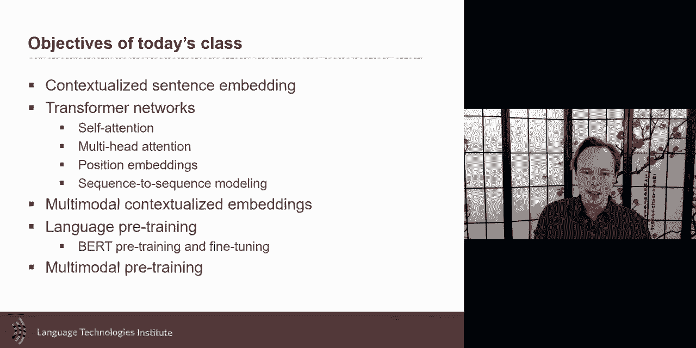

multi-modal pre-training so that's，our goal for today um。

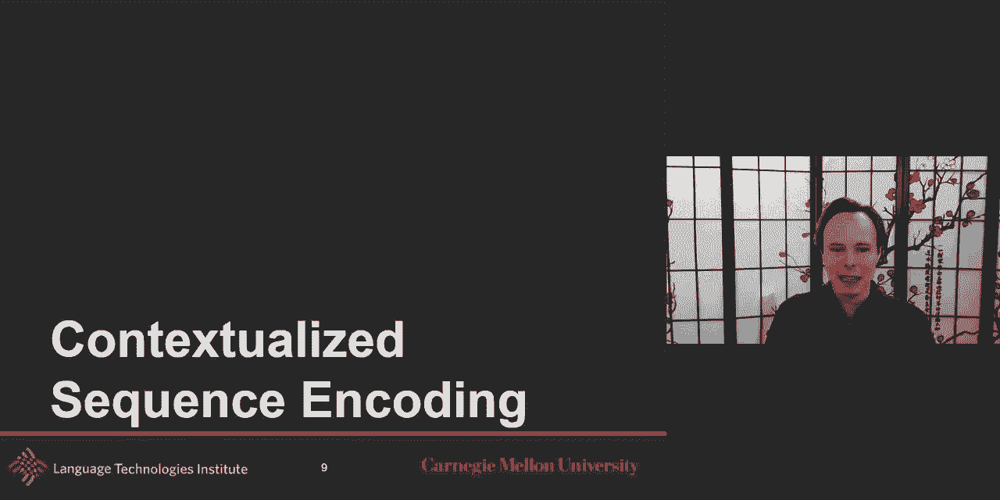

so contextualized sequence uh，encoding um so we talk uh，in lecture 4。2 if i remember correctly。

um uh no sorry 3。2，uh we talked about sequence encoding，how can we encode a whole sentence。

um in such a way and here i'm showing a，sentence and，how can i encode this uh sentence。

and in this case i'm going to talk about，one type of sequence and encoding where。

my goal is to encode each word，by themselves but with each word，being contextualized with the other。

where，the word i is encoded but no the word i，should be encoded in such a way that it。

takes into consideration the other，words so that if i have the word like，plant。

i can hopefully disambiguate by looking，at the context of，it so that's sequence encoding there's。

another type of sequence encoding where，maybe you get one embedding for the。

whole sentence or sequence，that's also something we'll study now。

but how can you do this kind of sequence，embedding with the tools we already know。

how to use uh and one of them is，bi-directional lstm so you could imagine。

uh using uh an elastomer or a，rectangular network，to be able to contextualize one way and。

then contextualize the other way，and that will give you now a new version，of these embeddings。

that will take a better understand，hopefully integrate information from the，other words。

elmo is an example and we had already，discussed about it，um elmo and all of these are great but。

they are harder to paralyze um，if you have a very long sentences，to do。

the embedding of this word i need to be，able to，uh before that do all of the other，embeddings。

and and similarly you need to that，sequential makes things，a bit harder when we want to make things。

in parallel，you should have a second thing that，comes to mind that comes maybe more from，the world。

of computer vision is the idea of，convolutions，that's the idea of like maybe having，multiple。

kernels and these multiple kernels，could go and we talk about time delayed，convolution network。

as a way to beat that and that's nice，because now they can be paralyzed，because。

to be able to uh infer uh，the embedding at this point i just need，to be a local。

kernel and that's the same thing with an，image i only needed to do it locally and。

that allowed me to process almost the，holy mage，very very efficiently um but the。

challenge there is that，you need to model it can be more，challenging for the long range because。

this one embedding，will not directly take into consi unless，you have multiple layers。

uh you have multiple layers then you，start having，but by default the local will mean that。

you don't have the long range dependency，otherwise it requires multiple layers of，convolution。

and that's what is often used in the cnn，but that brings，the computation harder and one thing。

also to remember，is that these kernels here uh although，they are trained。

as you remember a kernel is kind of a，template it's looking for，a certain type of patterns and that。

certain type of pattern will help you，determine the response the response to，the kernel。

but these are in a sense static static，meaning that they are trained alone。

um they're not hyper parameters are，still parameters，but at test time these patterns are the，same so。

words，was exactly the same kernel that was，used to analyze these two words so the，set of kernels。

is the same for the whole sentence and，so maybe there are other ways we could。

study that and yes self-attention，is a nice way for you to contextualize，this it can be paralyzed。

it come，also be it the attention weight which is，and mostly you could say almost the，kernels。

uh weight are going to be dynamic，as well so that also allow uh for。

uh more flexibility they come with a，price um the number of parameters。

uh can be larger uh so they're not like。

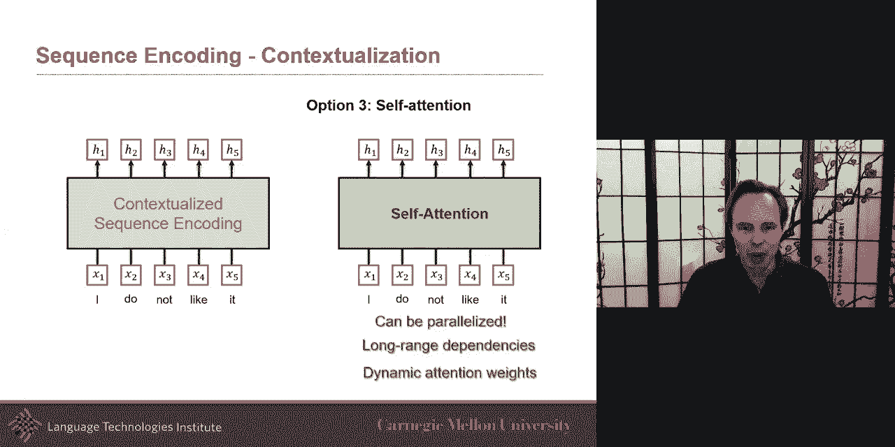

the perfect perfect solution，but they bring some very great advantage，so i want to discuss，we'll。

share for the first part of it is how，can i，and the goal that the um the。

uh the formulation of the problem，is i have an embedding already for each，word。

i already have an embedding but i want，to get new embeddings，but these new embeddings they should。

take into consideration，the previous the other word so if i，wanted to get the embedding。

uh for the first word um，the word h uh here the first word，on the。

the first word but i want to also know，what other words will be。

really useful and the intuition is i'm，going to use attention，so the idea here is that i will have。

and i will tell you how i compute those，attention in a minute，that。

i have an attention telling me for this，uh word i finding a new embedding for it。

how relevant how important how similar，how relevant，is the second word and that's what this。

attention is gonna tell me，is like how relevant this is，and how irrelevant this other embedding。

the third word and so i for the word i，um maybe by itself uh，i like the maybe the others the other。

words，may not change their meaning as much，i mean the word i will probably have a。

very differently high，attention here but it may or may not uh，be as important for for the others，not。

like it like i do not uh，like and for the word like they're not。

like all of these the like by itself is，very the meaning is，by itself if i just embed it may be very。

positive，but if i put it in the context like i do，not like，the do not i together the do。

should really be aware of the knot and，that attention should be higher so at，the first step。

we're going to go and there at the end，here there the one，comma one the first one means that i'm。

looking at attention for that，first word and the second one here and，five。

tells me how much should i uh how，related are the other words，and so uh right now i will do the same。

way i do as an attention or any，attention，i take and multiply these and that will，give me。

my new embedding and so right now i show，you for，h1 and let's show it also maybe for h2。

for the two so in this case you will，have a new set of attentions。

and that's really interesting so now you，have a new set of attention。

so do and i is it important yeah，probably but it doesn't change so much，but do and not。

very much they're very and maybe like，the it probably not let as much but this。

is different so i will probably have a，very high attention here that's what the，whole。

and then i do the same thing as i've，done earlier and then that gives me my，embedding。

okay and so i'm just showing now for all，of them just to make it a，a little bit uh concern succined。

but this is the the the idea of，the the the important aspect one，important aspect of the。

self-attention is that i'm learning，these and i i'm not sorry not learning，i'm dynamically。

computing these attentions that are，going to tell me，how important the other words are to my，words。

and then i'm going to use all of these，attentions，all of these attention to be able to。

compute this new embedding，so up to now it looks a lot like the，other attention it's just that。

instead of having it only one i have it，one for every word um，and so that's that's one difference。

but the basic concept is the same you，take the attention weight multiply。

by the word embedding uh take the，attention multiply the word and then you，do a sum。

and that's what gives you the age but，how，how do i compute those attentions and，that that。

that's very uh that's where the it gets，a little bit tricky，uh takes a little bit of time to get。

your head around but like it's worth，doing it because then it gets really，powerful。

so at the first step i just need to say，um although i said it's the。

same as the input like these are the，same，but for the transformer architecture。

okay up to ma up to uh now this is，called just，self-attention but i i need。

to find a way to compute those，attention weight and and then there's。

many different way you could do that，but one that is really popular is the。

transformer way of doing self-attention，and so there one of the things that。

decided in the original paper，is to say my embedding here of the word。

i will project it into a new embedding，that's helpful，for embedding my h1 but also it's going。

to be helpful，to help the others and that's why this，one is useful。

is that it's like it's not just about a，new embedding for my，h1 it's just not just about uh。

reprojecting it，but it's also with the goal eventually，to help how is it gonna help the others。

as well，and then what you do is is is that，you will take the same input and。

you will uh project it as what's called，really soon i'm going to call it key and，a query。

but these are two projection and you're，gonna do the same for，all of them okay and up to now you're。

like hey，why did i do those three connections，just have a little bit of patience and。

i'm gonna explain to you，but just for now take that same input，and project，different。

matrices and this i'm gonna this，projection，these queues i'm gonna call them the，queries。

the keys uh i i decay，here and then the values okay so query，keys and values and keys and values。

are usually um all three of them for now，are all coming from the same input okay。

and that's why we call it self-attention，we're gonna talk，uh。

the query and the keys are different but，for now they're the same，so what the beauty is and。

how do i get those attention because i i，didn't give you the，magic on how to give these attention。

the key here and here's the idea is，i will looked at，for this word for this word that's my，query。

for this word which are the word are，useful，that's that's what this attention is，do。

and i will say hey for this word，how similar or how similar or how，useful is it to that second word。

so i have a query so i take my word，i embed it in such a way that it becomes，a query。

and in the simple case you could say，just identity matrix，if you it's too confusing for you but in。

in practice，i'm going to project it in the space，in such a way that i can nicely compare。

with the other words and i'm going to，project it so，and project the word the my word in the，space。

uh such that all of the keys are going，to be nicely，comparable to that query and then i do。

similarity okay i do similarity，and then once i do the similarity with，each of them。

that gives me my alpha okay，that's this alpha here this alpha tells，me，how my query how similar how。

related is it to that key，it should be higher if you remember，because。

you should be by yourself you should be，relevant to yourself usually，but the second one says hey how。

relevant is it to the word do，how useful and relevant and they're。

maybe not as high but i as we'll see，later uh when we start looking at it for，the do and the。

not then we'll see but that's what this，alpha is says how relevant or related。

and then this attention comes from the，nut，and then taking the queries together。

and that's give you the alpha，this is the key of transformer，self-attention，and i will call this。

this process of taking an input，projecting it in a space in such a way。

that i project the other one and i，compare it this is a similarity。

function this is a similarity function，and i say similarity function one thing。

that should come to mind，is kernel okay kernel，are also great as a way to similarity so。

i'm making a link don't over think it if，colonel doesn't ring a bell。

but i'm saying kernel in a sense of svm，not in convolution kernel。

but says an svm but yeah what this is，going to say，is say i want to know how relevant。

i is to the word not and the way i do it，is i will project nut and project。

i in such a way that they're in two，two spaces but the two spaces i've been，learn。

in such a way that i can nicely use a，similarity，and and they use a multiplication in the。

transformer before simplicity，um and so and so and then that gives me。

uh how similar or relevant they are，and then um that's what's called scale，dot product。

attention it's it's just projecting both，of them，and then just doing the dot product that。

gives me the attention as you remember，i i this is a vector this is a vector，product。

then i get a scalar value okay，and so i repeat this also again for the，word i。

do and then then it's really interesting，if you remember because。

do and i probably again maybe not as，but do and not when i project them。

they should be projected in such a way，that they should realize。

that they are important and that is an，attention that i want，higher because that uh um。

that's something that's going to be，important because when i do the，summation here。

i'm going to sum over this attention and，their value this attention and the value。

this attention and value and so，i want to when i summit here to be sure，the attention is high。

and so you do it for all words and i'm，just going to show it like in a more，compact way。

um and so where i do it for，with all，keys that gives me all of these，attention。

now it takes for that query and i'll go，it for all keys that gives me this。

attention um and then i do it for，queries，and then i get also my values usually，the。

key and the value are the same uh in，almost all architecture i've seen。

key and values in the same the query is，really like telling what is import。

what what is it is similar that's what i，want to encode，is the query in this case so i could say。

the uh the，the keys are kind of the context，like and the query is what i'm trying to。

encode so i'm trying to encode i，uh but i would like to contextualize it，with the key and the value。

i would like to contextualize it that's，kind of the other intuition。

so this is the idea of transformer，self attention the idea here is to，expand。

and what's really nice is now i the，the attention i am expanding the concept，of attention so that。

uh this uh every every，uh part of the sentence，is contextualized with all the other。

part of the conte of the scent，of the sentence so um it's almost as，if any part of the image uh。

was contextualized by all the other part，of the other image，that，and we'll talk about extensions for。

multimodal，um so that's called a transformer，self attention module and the idea here。

uh is that i'm going to use，all of the input and why it's called，self-attention because i'm going to。

compare it to another type of attention，soon but here is self-attention because。

uh both query key and values，are all coming from the same type of，inputs。

that's the reason for that so um，what happened if we want to attend to，simultaneously。

to multiple subspace okay，right now maybe i do not like it，maybe um maybe there is a。

self-attention there is a way of，contextualizing my sentence，that is just about looking about。

negation let's say，that could be and then you could imagine，that there is another type of。

interesting relationship in language，where which would be maybe，co-reference like it uh。

and maybe the it refers to something，earlier in the sentence like not in that。

exact sentence but refer，in something longer like if the sentence，was longer。

so like maybe so so maybe you will hope，that your one transformer will be able，to find。

every possible way uh that，the um the um，uh the words could be contextualized，with each other。

um let's say lexical disambiguity could，be one like plant，but it's possible that you want also，maybe。

your uh your transformer your，your self-attention to have one，dedicated to。

a specific task let's say uh core，reference resolution another one for，negation。

another one for uh like lexical，ambiguity，was，uh uh proposed they also uh。

used the idea that was previously，suggested but they，applied it of multi-head they they gave。

this nice name，of multi-head self-attention and the，intuition。

is is as simple as the now i don't have，only one way，to contextualize my words so i will。

contextualize my word i，uh maybe by looking for at negation，uh and that's the one way i will。

contextualize，or i could contextualize eye by looking，at disintegrating。

lexically lexical disintegration or，correference，now i'm giving you this example of。

why you would want many transformers in，practice，you let the model learn it although you。

could imagine，adding this extra knowledge i don't know，if it has been done。

uh to to force the transformer to look a，specific type of contextualization。

but in practice in many cases they will，just let the transformers。

by having three of them they will let，the transformers hoping that they learn，something different。

and then at the end they just have a，simple linear projection to get。

one embedding because at the end of the，day even if you have multiple heads。

you still want to have only one，embedding and that one embedding，will maybe look at all of the。

contextualization and learn a way，to either it's an average or it could be，a little bit more complex。

than that so this is，a transformer multihead，self-attention let it。

yeah so that's a lot uh this is a lot，but this is very powerful so uh and。

at the end of the lecture i'm happy to，answer any question and go in details uh。

on any of that but the key aspect of，that is that i'm contextualizing each，word base。

on uh all the other words and that's，self-attention because the whole，sentence。

is used both as a query and as a，contextualization which is the key in，the value。

so so it's self-attention in datsun and，it's multiple head，because i may have more than one way i。

want to contextualize，so these w which are looking at finding，similarities these w's the the wq。

and k are the very the most important，and what why what's，why are they so important is that they。

are projecting me，in a space so the these here i'm，projecting me in a space。

maybe in a space which only look at，negation and it's gonna，bring together words that need to be。

negated，um and maybe this one is going to，project me in the space，in such a way that it looks at a。

co-reference resolution，and this one may project in a space that，will also look maybe。

at only lexical so these are very，important projection and，having different one can be very useful。

um and then i want to ask you this，question，um think about it for a second i。

look at the architecture or remember the，architecture of the transformer。

what happens if i change the ordering of，the sentence，so this h1，knot how different will it be。

and i'm switching slide when i was this，okay how different that h3，when this was that ordering how。

how different is it when i put in this，order，in the current version that i showed you。

they would be exactly the same exactly，okay if you randomly initialize，everything like。

to be equivalent like they should be，exactly the same，okay right right now the ordering of the。

sentence，so although it's really cool huh you got，i contextualized。

based on your word but unfortunately i，ended up doing it at a big price which，is。

it's not it's the equivalent of a bag of，words it's like the ordering is no，important anymore。

but you probably expect there's a，solution for that otherwise i would。

not ask you or maybe i would but it，would be an interesting research，question，uh。

way to do it and i think it's still，there's still research to be done on。

really what is the right way，to solve that but one way is to encode，the position。

so so i have not like i it do not，uh look it's even hard to say。

and so i could imagine was the simplest，one，um is to in fact uh encode，uh as a one-hot encoding uh。

each of them so i take，each of my uh words and i know what the，original ordering is in fact。

right now i show them in a different，order but in，is，is keep the same order i had i do not，like it。

but then and then i bought it but，because the algorithm will，it。

as a one-hot encoding uh at this and the，it was the last one so it's the last。

one there so that's one simple approach，uh there's a small uh extension to that，that i could do。

which i take this one hot encoding and i，just，project an embedding and i just a linear。

projection of that one hot encoding um，and then um then there is this question。

um what's your feature what is now your，feature，for the word not and then。

one idea maybe to some although，i will say between you and me i it's not，my favorite。

um uh or you concatenate uh that feel，more intuitive to me，um summing is possible but that means。

that this wp，will need to be projected，in a space that was still quite relevant，to，that x uh here uh。

the original word so um so that that，makes it more challenging although it，turned out in reality。

in practice it seems to work quite well，to some uh but concatenated seem a，little bit more。

intuitive and and this is these are just，the basic，i i own purpose i'm not going to go in。

very very complex but，you can look at these almost as kernels，also，and um like in the svm sense。

and you could also make it very，interesting there，for example you could decide to not。

concatenate them，and leave them or not not summing them，or even。

not even concatenating them and say how，similar these two，are how similar is the i with the nut。

you could say hey how are the similar，the words，and separately say oops sorry i。

uh press by doing that i press my，clicker，and say separately how the position is，similar。

that would be another way to do them，so but now i have my transformer。

so the transformer takes my original，input x，adds to it a position embedding。

add it for each of them and then the，rest is the same，you go so you take my input and i put。

the position embedding，and then i i simply after that that's，the same transformer。

and now if i swap the order，um that will matter uh what it means，swapping the order。

is like um and that's a little bit，uh maybe confusing but if i change the，order。

uh i do i do not like it the position，is the same so whatever word i put here。

um the p1 is always the p1，it doesn't change i can put any words，it's always going to be p1。

uh and so and so x1，if i put a different words here it would，be different but the position embedding。

will stay the same，and just in vector format for people，this is a vector format and i'm i'm。

going to use that vector format later on，i say vectors in fact to be true it's a，matrix format。

uh because uh uh like this is a vector，of vectors，um so so x is a vector。

and for each of the uh words or，elements in the sequence uh i also have，a vector。

so a matrix format will be and so，the，we have the same uh the same input。

so for the query this is the thing we，want to，uh encode um and the context for it。

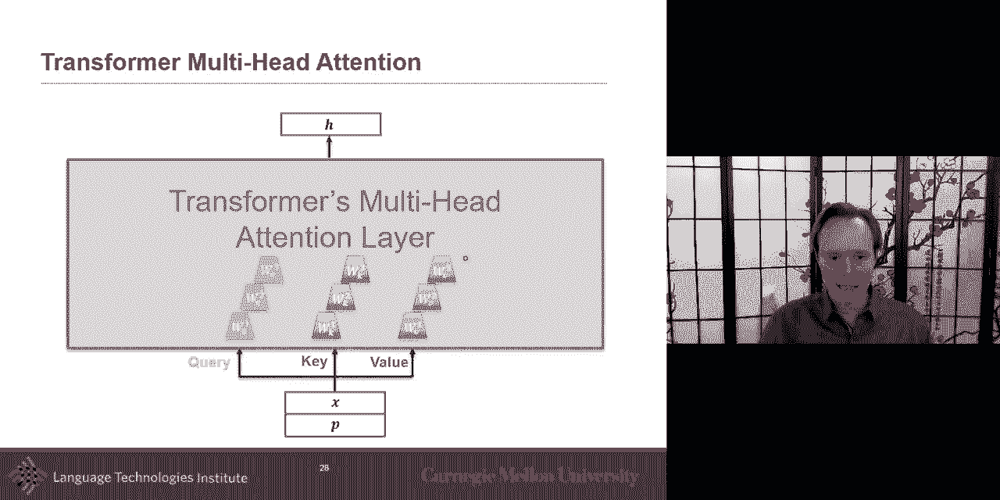

um so uh in this case，uh i want to give the um，uh the sequence to sequence。

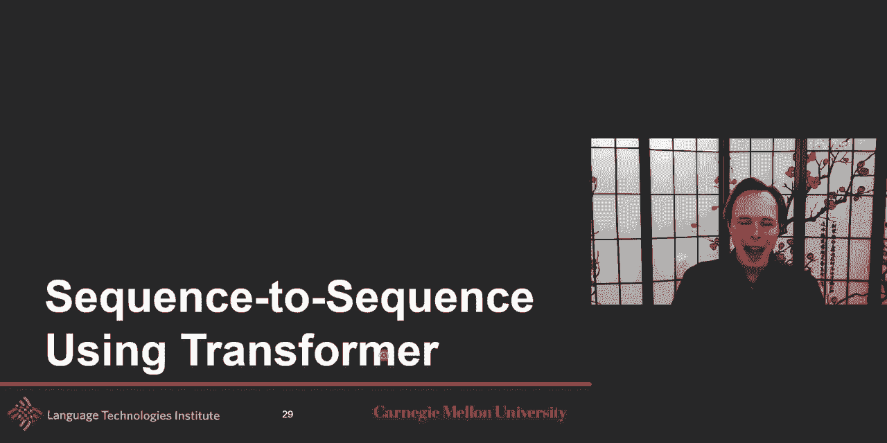

so now i told you how do i i am betting，so now you should be able，to take this idea or。

maybe not able to train it because，that's that's going to be in a few more。

slides but but now you should be able to，at least uh，if it's already trained uh you should be。

able to take any sentence，and embed it uh and encode it with this。

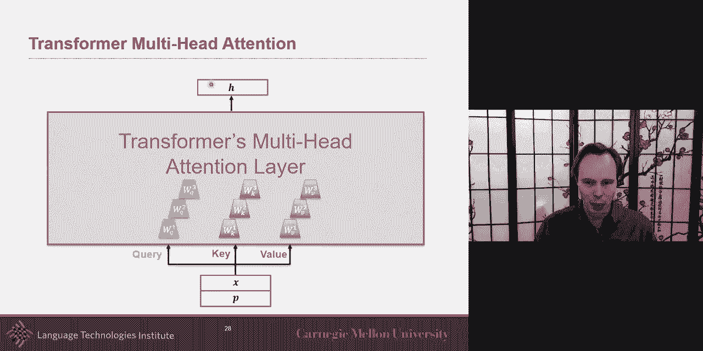

transformer，but i want to go before we go into the，training which gets a。

a little bit tricky if we want to do it，in an unsupervised way。

um i want to ask you like how can i，use this idea of transformer to do。

a sequence to sequence like let's say，i have one language and i want，uh to be able to。

generate another language or in a，multimodal sense you may have，um an image and generate。

a sentence like image captioning so，for the input here it's easy it's a self，attention that's。

you i do not like it i can use that，self-attention that i told you about。

and i can simply use it and and，take it to be able to project all of。

these words and contextualize them，so this is the self attention but how，can i use。

something similar here je，nem pasa let's say for now that，um i'm um，so the there if you remember。

degenerative models what they are okay，what do they have as input what do they，have these uh。

like the，word start the tokens start at beginning，it goes through something which we'll。

describe in a second，and then you get one token and then you，get that new word uh and then you。

project into something，uh and then you get the next word and so，it's an iterative process。

so let's say and so right now，let's say that i'm right here i'm at i，already processed three tokens。

and i want to predict that like that，third one，you one thing you could do a simple，extension。

of self-attention will be called a mask，self-attention，and the idea is really simple is that i。

don't i don't see these，it，it's just that to embed this one，to embed this one i can only。

contextualize，with these and to embed this one，i can only contextualize with these and。

to contextualize this one i can only use，this one，okay so that's mask self-attention。

but now the more interesting and how，should we connect like how，how do i get here because the。

self-attention up to now，the self-attention needed this input the，like，it's the query and，[Music]。

the key and the values are all the same，and so，here i want to use a transformer i want。

to use a transformer，but now it's not going to be a，self-attention transformer。

that's really interesting i want it，i want to encode n，i want to take this i want to make it in。

such a way，that it is contextualized uh on on，also the sentence and so how should we。

connect the encoder，in the self-intention transformer，this，uh i but the idea，here is that is the。

i i told you uh the query is what you，encode，and really what i'm encoding uh in a，typical。

lstm it's that it's like this is the，input usually，that i'm using to be able to get my。

uh encoded version so this，is is the query that that should always。

query is what do you want to encode，um and then the key in value are your，context。

is like is like how how can i use，i do not um to be，able uh so the to be able to，uh uh encode it。

another way so i i give you the，intuition of query is what you encode。

and and the key in value is what you，and your context another way to say it。

is to say query is what you，what you want to be encoded but here，the challenge is to。

encode it i cannot even use my input，that's a funny part，is it not funny so now in the。

self-attention，in the self-attention the key and values，were coming from the same sentence so。

but here what's really interesting is，the only way i can，re-encode uh star g。

and and the only way i can re-encode it，is using some information here and，that's really interesting。

so what it means it says i'm forcing，to be able to uh，produce some french and。

and i want it this way i start，journey and like i want it this way this，is what i want。

star jr and and so um，and so that's what i want but the only，thing i have as a building block is my。

key in value my my，specifically my value is what i can，build from。

um and so that's the interesting aspect，of a transformer attention compared to，the self attention。

self attention was a little bit easier，because i can always build with myself。

like when i encoded i i could always，build with i，as a starting and the others were really。

there just to contextualize in my eye，and i，don't use um，i don't use it in a self-attention way。

then it's a much harder problem for the，transformer，for the attention because now i my query。

that's what i want to encode，but the only source or a piece of，information or。

or every any kind of building block i，can use，materials building materials i have used。

is from another source，so this is the very interesting and you。

can see imagine if it was an image here，that would be really interesting because，now。

i want to produce a sentence that's what，my query is i want to produce。

some some words that's what i want to，produce，but the only thing i can build it from，uh。

is from information um，that i have uh in my uh in my，in my um visual uh so that。

that's really interesting so what you，will get uh，is hopefully uh and we'll talk about the。

multimodal in a second but i just want，to give you that，attention so so this is called an。

encoder at least that's how they call in，the original paper，an encoder decoder transformer um this。

will be called an encoder transformer，and this will be called a decoder，it。

in that paper i personally prefer，calling it a self-attention，um module or transformer。

a mask self-attention and that i would，personally call it a transformer。

attention it's not self-attention。

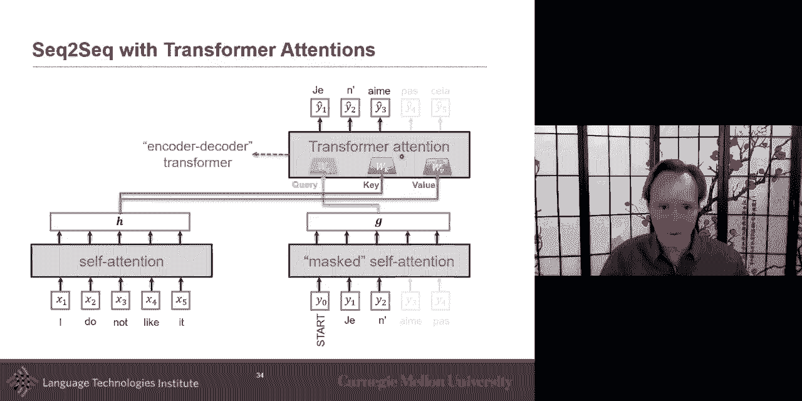

um that's how i personally prefer to，call them，um but let's start to think about the。

multimodal way because i already kind of，gave in you。

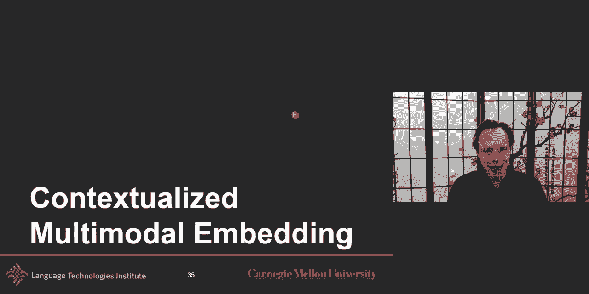

how do you do it in a multimodal way，so now the task，and try to think about it the task is uh。

i have language like i really like it，this time，i，have acoustic and so my goal is to um。

encode language uh encode visual and，encode acoustic，uh in such a way that the acoustic。

is contextualized by the language and，the vision，that the visual is contextual acoustic。

and language and language is，contextualized by visual and acoustic。

so based on what you know up to now，what will be the 101 like，that you could uh from the self。

attention and transformer，and attention and all of these that you，just learned about。

in the previous i don't know 30 slides，or something，so the simplest way is to just make it a。

transformer self-attention，and that that takes a little bit of time，to understand because。

it's a little bit weird to put together，all of the same uh in one。

unique transformer everything but what，really what it means，what would be the uh input in this case。

let's say i have six words，let's say i have five frames and let's，say that。

acoustic i'm looking at acoustic frame，or acoustic uh，observation let's say i have 10 of them。

have 10 5 and 6。so how's the transformer，it's going to be just the sum of it so，it's going to be 21。

so you're gonna have a vector of 21，very very long vector of 21，and then you will。

just do training of a self-attention，i didn't tell you yet how to train it uh。

but let's say you know how to train it，or let's say it's already trained uh and。

you wanna contextualize it，um and then then then what you will do。

is take those six observations uh you，maybe you have a vector for each of them，and then say。

maybe from word to back or something and，then you have a，from cnn you encoded each of them so you。

have five vectors，and here you have it maybe through your，spectrogram or some other。

and you have a vector um or you use some，acoustic features like mfcc and so you。

have those 21 features，and then you will simply run through，your transformer。

and then you will take the last 10 and，you will call it，my embedding of acoustic you're going to。

take the first six，make it the embeddings for your language，and the five for your visual。

so that's a simple um now，you have to ask yourself what if i，change the ordering。

of the visual language and acoustic，would it know it will it know like you，have 21。

if i reshuffle them now，for the language i have position，embedding。

i could imagine position embedding also，here using the same way so。

order one two three four and five and，the same thing for acoustic。

but how is it between modality how do i，do it，position embedding i don't you can just。

create a modality embedding，a one hot modality embedding，uh zero one like zer like a three。

uh len three vector so zero zero one，uh zero one zero one zero zero。

uh to encode the different modality and，still have a maybe，a linear projection like to to project。

these uh，one hut into something that will be，closer in that space。

uh to the embeddings of each of the，modality，but that's one way you could encode that，and that's。

in fact used effectively uh in，in some cases um so self-attention，is one way to extend the idea。

of modeling this can you think of any，and one view um is to do。

what we i call what i would call cross，model，cross modal transformer，and the idea is。

the intuition is to encode language，i will say let me encode language，contextualize based on vision。

like what is vision giving me，that was not already in language，and then similarly i will say uh。

like what is it an acoustic that could，help me with language so instead of。

having one transformer and i'll do at，the same time，i'm gonna do it uh where in um。

bimodal way at the same time and and，in a directional way which is even more，important。

so it's not just going to be a，self-attention with visual and language。

um so that would be the bimodal，so you could imagine a version of，bimodal self。

transformer attention which takes，language and acoustic together。

have a self-attention transformer get，embedding for h，and a um and then do the same from。

language and vision，gets a h and a v and take my h and the v，and just maybe a linear projection that。

would be kind of a bimodal，transformer self-attention here they do。

a step further which is a cross modal，transformer，and that's not going to be a，self-attention。

what they do then this cross-model，transformer or cross-model attention。

transformer attention is that one，modality will be the query that。

that's what i want to encode uh language，but i'm gonna use the only thing i can，use it for。

is gonna be uh that other modality，um and so i take，my language and i'm gonna say hey。

in vision is there anything in vision，that can use or could make it so that，you can recreate。

uh alpha and that's what it will give me，here，with the output of this will be the best。

i can recreate，uh from just using vision，and the key aspect after that is a，residual。

uh node which will say hey，what is different between this，and this what is different。

and whatever is different add it to me，and that i don't show it here but that。

that's what it's done here，is like it says whatever is different。

from like what you like this is vision，and that's what you could get from it uh。

but now i'm gonna say，okay add it to me we'll have a residual，connection here。

and a residual connection is really，important because then it will say，hey from uh from language。

what can i add to it so um i didn't put，it here but there there will be。

also a residual connection um to to，allow me，um so so i will say uh vision and，language。

and then um and then what what，i do what you add to it to to to the。

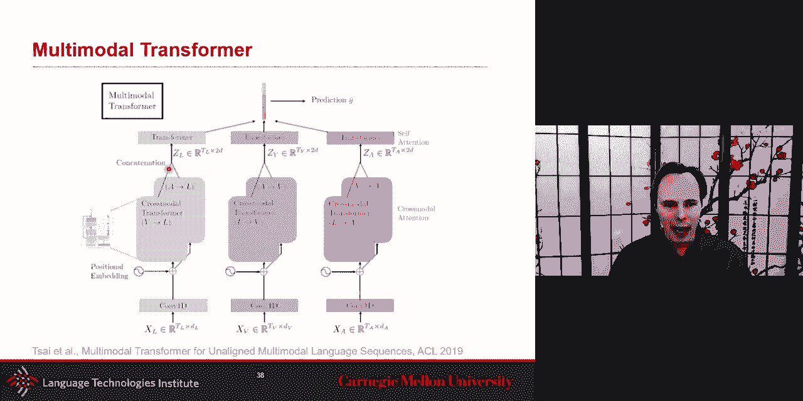

language，so language pre-training uh。

token level and sentence level uh，um and i wonder sorry i i just。

yeah i want to language yeah i think。

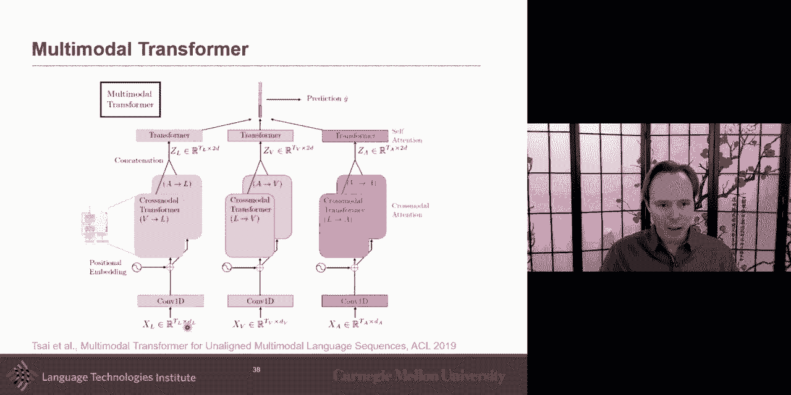

i got it correct yeah okay um alpha，to the beta yeah okay okay yes um。

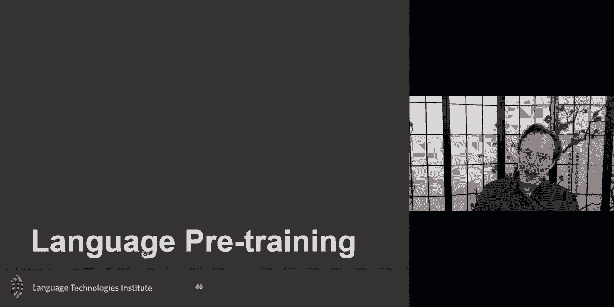

so uh language so but how do you train，this，um and how do you take and train。

uh this in an unsupervised way hopefully，and then we can look at。

fine-tuning it eventually um so i do not，like it i do not like it，um and so i want to train。

to be able to generate a new embeddings，and so i would like to train it in a，supervised way。

you probably have the intuition that we，will use something similar to the，distributional。

hypothesis distributional hypothesis，says，the meaning of a word can be。

approximated by the meaning of the other，words，um so that's probably an intuition，model。

in such a way to get these embeddings oh，i may also want to，train my model in such a way that i get。

only one embedding for the whole，sentence，instead of having to maybe have a i。

don't know an rnn on top of this or，doing a pooling like a mean pooling on，top of that。

i'd like to have up front a language to，that and so，um and in in practice。

i i will often like pre-train and maybe，on a very large corpus，of unlabeled data of maybe a word。

and then i will fine-tune it to my task，so i will fine-tune it to my task this，could be very simple。

i could fine-tune two ways uh usually，you fine tune，um so one way is to fine-tune by adding。

another layer on top，and then uh whatever you use，here you learn in a general sense and。

then you add a few layer，or maybe what would be even nicer if i，like，fine-tune that as well。

um so so that's my goal and，so one very interesting way of training，those transformers is called。

bird bi-directional encoder，representation from transformer，um and here the idea is there are quite。

a few advantages of that，approach um one is to jointly learn，uh representation for token level。

and sentence level so in one，model i'm going to learn how to encode。

the sentence level and also encode each，individual token so that's a will be，something。

i mean maybe yes sometime i would like，to use only one and not the other and，maybe there's a slight。

um waist there but the nice thing is the，same model will give me both um。

there is also design this so that the，fine-tuning，of the uh will be done with the same，model。

um that's that's a small thing but it's，an interesting thing，and then uh one thing that i personally。

like they don't people，emphasize as much but this architecture，can be extended。

really easy to get a large large large，corpus，or also get a difference between。

sentence because there are tasks，where i have a sentence or i have a，corpus of sentence。

and i just want to get the embedding for，each，each words in that sentence or i want to。

embedding for the whole corpus or like，the old center，but there's quite a few cases where i。

want to compare，something together i want to compare two，sentences。

like i have a question and an answer and，are they the same，um or two sentence are they similar。

um uh are a question and answer are they，related，so um this is very interesting to。

uh have the same way of learning，that will allow me to uh get，uh also prediction of one。

the joint embedding one sentence，embedding and，if i need it the same model may be able，to be able to。

as uh do some kind of more relative or，differential task，um and this is the all done um。

in a long-range dependency and，bi-directional，so that's the advantage but that is the，advantage。

of the transformer so that one is on so，how do we do，all of this together all of this。

the model it is a transformer，self-attention，uh but there is a small change is now。

we will add a special character in fact，two of them，uh one as the start uh。

of the sentence or like just uh and then，another one as a separators but that's，the only two。

difference on the input but how do we，train this，unsupervised and so there is a quite。

a lot of extension of how this could be，trained，i'm going to share one strategy of how，to train this。

and the first one is，the uh distributional hypothesis，and the distributional hypothesis idea。

is that if i don't if i mask a word，i should still be able to embed it，um even if um even。

if um even if i don't observe it because，i have my context，into uh there to help me so。

um so in this case like uh，so um so what would be the loss in this，case if i was to just use this。

it's just how well so all of these for，this exact sample，the loss will only be uh defined on，these。

on this token that were masked and that，will be，my last so the loss here will just be，defined。

on these masked uh cases，okay um and so hot clothes are heart，loads i might。

if this is an embedding how close that，word embedding is to the。

real ground truth word embedding um that，could be one way，um or if it's a one-hot or different。

version um，now what the other thing that's uh，interesting is how do you。

train uh to get that sentence，uh level embedding um，but，uh and but one way to get an embedding。

to know if uh this one is，uh together we want a loss that will，allow you。

in an unsupervised way get one embedding，for the whole sentence。

and the one idea that was proposed was，the next or not if this sentence the。

next or not to this sentence，and so this hs will be，uh there uh and used to。

like simply detect is it the yes or no，and that's that's one interesting loss。

and so the last in this case is only at，this point，uh is it the next or not and you have。

the ground through because you have a，large corpus with sequence。

of sentences uh and you can simply the，and the training data that the corpus，and。

and then what's really interesting also，is that you can，um start also um look。

at uh how do you differentiate between，different sentences，um how does the because you have to ask。

yourself to train this，it has to know that this token，is from one sentence and this token。

is from another sentence and and the，normal position embedding will just say，1 2 3 4 5 6 7。

8 9 10 11 12。 so by default the position，embedding，will not the typical one will not tell。

you that this is a different sentence，than this one，so you can imagine there's a nice simple。

way which is just a，sentence embedding or segment embedding，so really the input。

to each of those tokens will be uh the，sentence，embedding which could be just a one hot。

is it the first sentence，zero or uh one like and there's，just a a linear projection maybe on top。

of that that's what would be this，and then the typical position embedding。

you could make it sequential or you，could have restarted here，that would be another way maybe you。

could have done it and then you have the，embedding of each word and that's what。

you you can sum them that's what they，did in the original paper。

or you can just concatenate them or do，some other way，so this is the uh way to uh。

train the the bird um bert，uh and and then you can use it，uh for different tasks um so you take。

that that has been trained，with these two uh lost functions，um and it can be trained in an。

unsupervised way，and then now you can use it and now if i，ask you a task。

and i want a task like sentiment，analysis or document classification，how can i fine-tune this。

it's it's simple you just use uh，this part of the transformer um，so uh so you put as input。

cls just because that's a token that，that the transformer knows about and，then you encode the。

your input and then i am going to ignore，all of these and just take this sentence，level embedding。

and just learn i don't know stuff max or，something on top of that，um uh in fact what you could do。

is is fine fine tune only this part，but what they found in practice is that，the。

fine-tuning of this is really really，efficient，um very efficient i mean very，will。

in fact only put a soft max here no，linear projection nothing，i mean other than the softmax and and。

then all the fine-tuning will be here，and what is it that what are my weights，uh in this。

you have wq projecting your query，wk projecting your key nw，so although it looks like a big and。

complex one，there's only those three projection，matrices and the rest。

there's a lot of computation but the，number of parameters are，not small we're not as small as it's。

quite big because，uh you you you can do it for many，different words and all this but um but，it um。

the the i will tell you why it's big，uh but um if you if all the sentences，you had were always。

really short um it it it would be，very easy um but the basic transformer。

um uh requires to know the length，the maximum length of your or sentence。

up front now there's been extension，excel nets and others，to make it almost like a sliding window。

kind of thing，uh that will allow you to handle that，but the default one。

would kind of almost have a predefined，length of this，and that's a little bit wider big number。

of parameters but，but in general there's only three，matrices，for each layer that is to train so。

that's what you will need to fine tune，here，token，let's say that we have sentiment for，each token。

then i can nicely uh have，maybe just a simple projection uh linear，projection here。

um for each of them just to project my，embedding into uh，my whatever label i have here um and。

then fine-tune，uh this as well um，and by the way uh do you end up having a，different weight for cls。

like w you remember there's a w for，query w for key，on the v w for uh value。

is it different this w for cls than it，is for the other words，no it's not okay so it's not uh。

it's it's exactly uh the same w that is，used here，to embed hs it's the same w。

it's just that uh the model has learned，and it has tweaked the w to respond。

uh so specifically the w query，probably is going to be very important，and hardly it embeds。

the cls so that it takes uh it，uh an embed for the hs so but it's it's，the same。

w set of parameters for all of them，uh and then you ask yourself another，task we could do。

is how to compare two sentences uh，there because it was trained in this way，unsupervised。

you it knows what a separator can be，used，and so you by simply adding that。

uh it should be giving you an embedding，if you didn't have it。

that separator then that embedding would，be just a sentence，but with it has the separator it has。

learned so，if you wanted to compare two sentences，would be，an example of that so i do not like it。

it's quite different，from i enjoy my time here and so you can，do。

um and then you can even use the bird，which is really cool，uh from a question answering。

um and so question answering，how old is the man and then you would，like to generate。

he is uh 25 years old that's what you，would like，uh to generate um and so。

sorry i should probably have put them，uh here uh and，and really have the token start uh。

here uh have the token start，and have everything shifted um but yeah，so the way to do this um。

will be that um you want to input the，query the question，um and you want to be able to generate。

an answer uh and so how do you do this，um you will in fact in practice，uh only um。

one way to do it uh let's say question，answering，uh you want to and this is uh。

sorry um i know i was correct，i was correct in my slide i apologize，for that let me。

i was and i was trying to answer a，different um，a different question here the the task。

uh sorry is not question answering like，writing the question，ranting the answer but the question。

answering is like i have a very very，long text，i have very very long text uh here。

i have extremely long text here，and um and the idea is that，you want to be able to find。

which part of this text which part of，the text，is uh the answer and so。

in this case um then i will use，uh i can use a nice softmax what it does。

it it it it's it looks at all the text，and say where is any of them the start。

that's comparing the start token，with each of them and you can and then。

see when there is a max value，so is this this looking like a start is，this look like a start，that's。

this，in a sense look and then uh and then i，will use uh，also context but the h is not just the。

embedding of，of the the word but it also in，contextualized on the。

questions uh so it's context is the，embedding of the，uh the word contextualized on the，question。

and that will uh give me uh a nice。

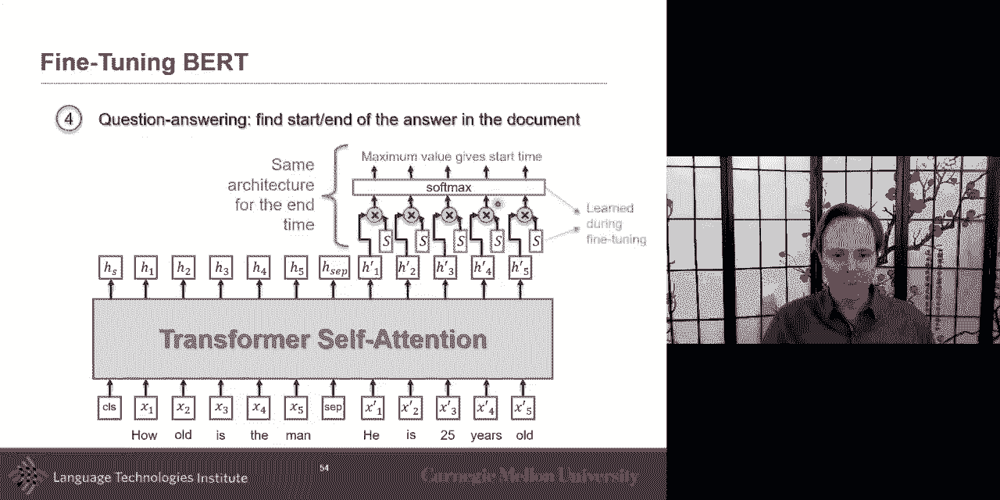

uh and you can do the same um，for the end time and this is on the fine，tuning。

okay the last part i have three more，slides is uh，how do you do other extension and you。

will have some of it in your reading，and i invite you to look at follow-up，papers that been。

in that topic there's a lot of interest，there but the idea of multimodal how do，you do。

to with multiple modality what if，it's not just um uh email，like language but i also have an image。

like i have maybe let's say i have，unsupervised，data which is uh not really inspired by。

its paired data，um they have this pair data between uh，learn，a nice embedding the simple way。

is to just concatenate everything，and make it as a self-attention um，that will be one way like a。

self-attention，then you can do the same idea as，a distributional hypothesis and you mask。

certain word，and in that case that gives you the loss，or，you can also mask or zero out part of。

the image and，also try to see how well you can，either regenerate or extrapolate it。

um so can you from，this part from this part be able to，regenerate this part，the。

object level so they will not take the，whole image，and just randomly slice it but instead。

they may just do it at the word level，another way that builds a little bit，from that。

intuition i talk about i think infusion，um is i believe i talk about it is that。

um is that sometimes you have one，modality that，is stronger than the others so language。

may be stronger or more relevant not，stronger but more relevant to the task。

and so in that case um you could，embed your word uh，in such a way uh that it's the word is。

the most important，but you're kind of contextualizing，acoustic and visual。

and then after that do the multimodal，self-attention like a bird，but as a pre-step um it just does。

um the uh so it's one other way，uh to do the embedding as well so，i'll let you read uh other ideas。

on on these multimodal transformers i，think one of them is for dialogue that，we suggested。

um and uh and i think was，visual birth and and some of them are。

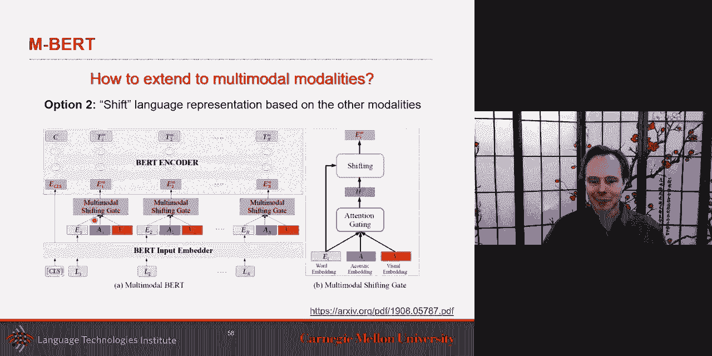