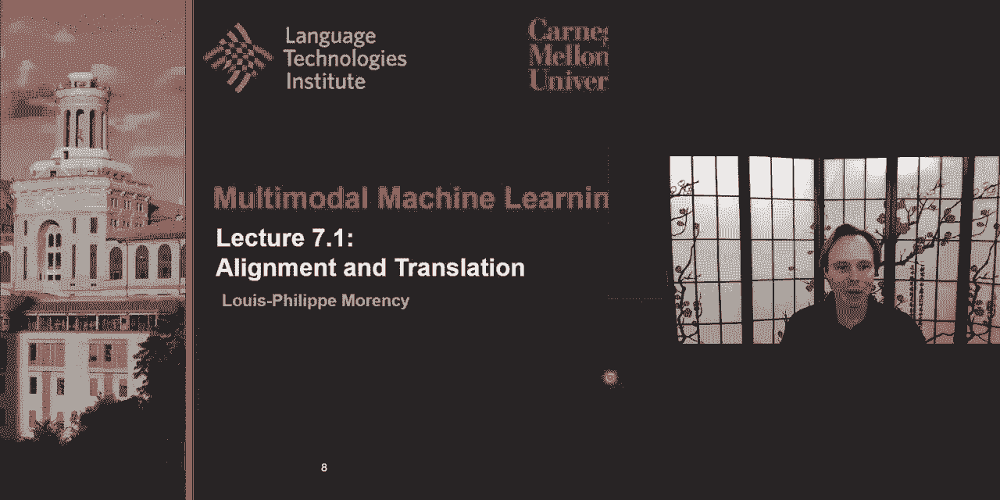
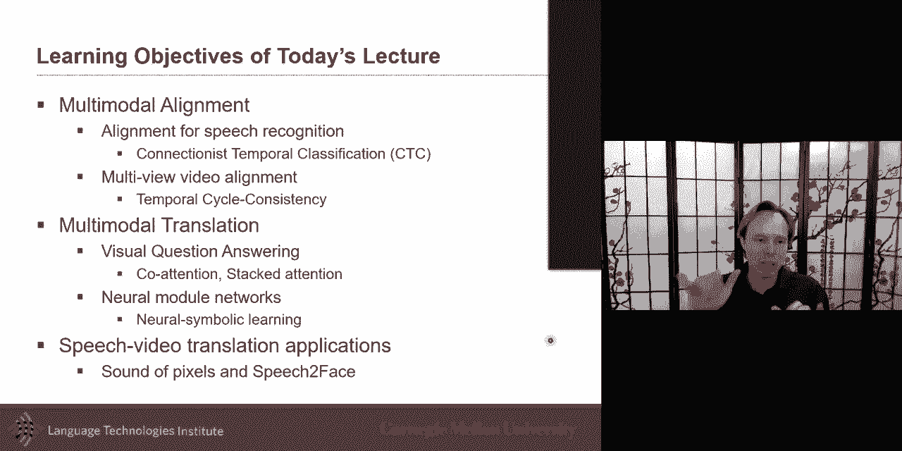

# P11：L7.1- 对齐和平移 (映射) - ShowMeAI - BV1Pf4y1P7zc

Director today is about alignment and translation，The objective of the learning objective today。

Are primarily one about multimodal alignment I want to。

Expand we talked about the dynamic time-warping，We also studied the attention bass mechanics。

But I also want to give you a few more，Also specifically for，End speech recognition。

Therapeutic approaches，That does sweet one specific one on CTC that I want to discuss。

In-N-Out Superman alignment look at 1 this morning specific for video。

Although I think I think you can be generalized eventually to milk tomorrow。

Is on temporal cycle consistency，More unimodal Bergen with the idea to expand to alignment multimodal。

And then I want to look at the translation and specifically I would like to。

Study visual question answering and picking it，Play Because image captioning is great and I think there's a pink eye。

Brats and multimodal together，In a very nice way but there's no question answering。

Address one of the key challenges on the evaluation side，I saw a lot of interesting work came。

Halloween。 So I'm going to use visual question answering。

How to introduce a lot of the other work that I want to talk about like or attention stack attention。

And also neural module，Networks are very interesting way to bring them in knowledge。

An expertise in those neural architectures，And there and some people went a step further。

Signal module Network and extended it，To make it even more interpretable。

What's the weather in neural symbolic learning is doing，And finally I want to show some application。

I think sometime it's it's interesting to see that specifically because speech and video translation。

Describe an interesting topics，More about speech and vision because we。

Sunday language quite a bit but also，Is it studying the translation。

I would like to talk about alignment specifically，At 4 second for speech recognition I know we studied as I just mentioned language and vision quite a bit。

When we look at speech recognition，Speech recognition Isomil tomorrow task at she's in the way we approach it in this lecture。

Andy's class in the scores，And the it goes from an acoustic signal，Speechnotes。

All the way to language and it's really interesting because we go from。

Where is the translation for translating from acoustic，Language。

Here is that we're going to something that's very，Hyatt Grand larity Library。

Find grain like the the audio signal，Something that is you could almost called discreet like the language。

Interesting translation process，Because of its importance also for many applications and how。

Human are communicating，True speech at has been earning interest for very long time in AI。

And so there has been very well established，Pipelines I'm good just getting one of these。

Inspired with some，Earlier tutorial，Is is like how do you go from something that's very。

Raraju if your member is just a 1D vector，And you go all the way to work。

As a first step is the challenge of how do you，The audio how do you represent that。

And if you think I'm remember one of the audio lecture。

How to represent audio as a first-stage like going Beyond just a vector Rob actor。

Spectrogram was one of these approaches where you look，Add the frequency so taking a sliding window。

Aubagio Lakers let's say，10 milliseconds of Asia，I looking at the frequency during that 10 milliseconds how much。

Twenty thousand Hertz how much in the end and that's what you would do like with something like a fast Fourier transform for example。

Pictogram does it over time so we have both time，In a frequency Dam，So this has been studied a lot。

And as I mentioned as being extension to。Sarasota to look at how the ear is doing this。

Start looking at it not just as every frequency，Exactly the same but you look at some Bank。

African Caesar like filterbank，And the male frequencies mfcc features out one example today。

When it gets closer to a desk forms I think we're still very like，Speech oriented。

We're like the Magic in the sense that goes from speech to language，Is the Latin。Two step。

First one is to start，Classifying，The frames and so is a used offering the word frames。

Because it's a local，Acoustic observation would call it，A-frame。

And so we want to classify them then satisfying you could classify is it the word which word is it。

London working in both speech and linguistic have studied，Analogy。

And so we we we start looking at that point，Looking at phonemes and detecting what each of these local in time each of them。

Songs and this sound is a phoneme，Cancel you get finally an awkward and different colors here are the different colors the different phonemes and each language。

Spoken language will often have，A very country set of phonemes。

Names with will be let's say for this ever call them to。

Will wants to get from Deptford set of phonemes，We want a story from these initial set of H frame。

Connected，You want to get today，What are the continuous contiguous。

21 here is is the prediction that every frame，Eventually you want to。

Make your final decision that this is the same phoneme。

And eventually you will want to go from all of those phony，Words。

And that's usually true lexikan model and I'm not going to discuss it，As much，Today，But this is。

And then，That's the language model we discussed quite a bit。

This is a like a like a specified like what are words made，What are the four name that made of work。

Here you like，What are the words that are close to each other what are the because W is a vector。

What are the words are likely to be next to each other and if you remember when we look at work today。

We look at these，We look at like a，Predicting the next word，Are we like fill the blank。

Kind of scenarios like in Birds，Do all of these comes in，Together and so，When we discuss。

Predict the most likely most likely，This could be a very interesting but very complex。

And some of them are deterministic as a mansion，These has been a lot of work on feature extraction in Mexican。

The middle part is as is where，There's a lot of interesting work on alignment on sequence labeling。

Which is the first step but also aligning them，Phonemes。

And so if I talk to you about sequence labeling and alignment，How can we。

Solve this task I am I in for disrespect or gram，My output is a phoneme I know that many samples will map to the same phoneme。

The mini to one kind of mapping，So how can I solve how can I predict，Need set of phoneme。

And I just want the phone name is possible like I would like to know that all of these together are the same t。

All of these together although，This exact，Aspecto， not be the match with his wife，Tomatoes。

Pronounce maybe at a bit of a French，So I first way to do it，Will be a sequence to sequence model。

It's like a very like 101，Machine translation，Going from one language to another language，I am bed。

My first modality in this case，I get my intermediate representation，In-N-Out have a generative model。

That will simply go ahead，Generate these，Different phonemes one after another。

Call condition on that initial，Seed that came from the embedding on that。

And it will be done as I showed here as a recurrent neural network，As we know also these could be。

Maybe a self-attention models like a Transformer，As we discuss。

Talking of Transformer who could also make it as an attention Bass，In the case of an RNN。

We can bring the attention，So instead of embedding，My spectrogram only ones and making it。

Is only one time that I am anchored this pictogram indent，Use the app to。

Trade the series of of of a phony，I could go at every I've every new time I want to get a new。

And euphonium and decide where to focus on，These are one day but what if I wanted to just。

This sequence LeBlanc with an RN right away，One way would be to get the label each，Audio。

But then I will miss that extra step which is this like mini to want alignment。

Cancel I wanted to share or nepro。In the last function and specifically an approach。

How do you handle that many to one alignment，And this was adopted very popular in，Recognition of gay。

A really strong performance and that's a little bit，I want to bring this。

Also because it may give you some instructions on how to extend that kind of work，Ictc witches。

It's it's it's a term that was brought by the authors，Of this paper of connectionism，Broadcast。

Station，It's kind of，Quite a long name but let's let just call it。

And this is has been optional and I will say no，We we see approaches that don't use it but。

You know it was used with a lot of these，Deep neural network architecture。

Automatic speech recognition，And these a lot of them were either simple convolution a few layer like deep speech。

Merced ceiling state-of-the-art up to maybe，A few years ago buddy I bet it was quite strong。

Convolution，It was the bi-directional and then fully connected。

Nakia spec-west how do you do that many to one mapping that alignment，Because I have on $0。01。

Very high frame rate，A very different granularity between my modalities very different granularity and how do I handle that。

Formalize this mathematically，The ex will be，Add a framerate maybe at the Nets 8：20。

I compute my spectrogram，The phonemes are like if you say that，Maybe you speak three or four words。

Second is phoneme，Maybe like more about 12：10 to 12 phonemes per second。

And the goal is to take and you may even have higher，For the number frames，Arthritis。

Do you want to do that many-to-one mapping，That's that。 That's I just discuss。

You don't have the same land，Can you want to Define over the space of Labor the space of Labor。

Will be D，The phonemes，We want to do two things at the same time go doing the main E21 mapping。

And at the same time train overhaul model or classifier，As as they call it in the CTC。

So the last will be more of a typical loss，Negative log likelihood，And that's Define of heard。

Probably。 Or the score，Over the phone，The question is how the rest of the model works and how can we do that mini to 1 mapping。

Answer to explain this I'm going to go through all the stuff，ACTC implement，Before CTC。

I had I had already done some scoring，Maybe with an RN or in the case of Deep，All of the layers。

Cancel，But let's suppose I have them and then I would just do the archetypical number zacian。

Enter from those numbers and normalized，This nice distribution。

Andy's distribution is over all possible phoneme，So here I draw them。

As if there were only five of them but if you remember them maybe 50 or 20 of them。

I'm just showing 5 of them，And so are for each of those 50，A hundred of these。

Will wants predict which phone in can I currency here，And so I can just。

All of these different phonemes so if my language like English。

Has a certain number of pruning that would be the number l，The number of a phoneme。

Auntie is overtime，And then I will do，This extra one which is for blank or No Label maybe a silence or something。

How's that I don't have，Label for it，And so，The idea here which has a flavor will discuss a little bit more when we talked about graphical models。

Birthday idea of looking at the past，Over this activation because what this is is I have。

Alamosa probability because has been normalized and so I have a probability overall，Olivos。

And now I want to know what what has been spoken what did the Pearson really speak。

And it's possible that I'm more than once，On the same，Phoneme。

And maybe there's a pause and then there's another phone in，And so I want to be able to like。

And there's a pause and then，And so I want to know。

What what is the subsume outset of phoning and so I can have a very large set of。

If you look at it there's every，Possible path that I could imagine is that infinite but is a large number。

Luckily looks a lot like things like optimizing an hmm hidden Markov model which will discuss。

More details on next lecture but，This and you can，You can compute relatively easily。

Probability of a specific party I have one pass in this，What is the probability of。

Is the presidency over，But you can given the input。

I'm still not yet I decided completely because I have a property of one path。

And then I want to predict the labels，The labels will then be a chain rule。

Then they're probably see the temporal alignment I'm going to talk about in a second。

Time each of the，Robin thede so I have the property of a path，And then，I need to go from a path。

Very very specific，A phoneme，And that's really interesting because in this case。

You could have maybe try to learn it，I want to say that's probably the approach that way。

The in the neural network world we always think hey。

I need to learn everything everything has to be learned from，Maybe knowledge we already have。

Good we can add to the model，Cancel，Some components of the model may not need to be learned or relearned again。

The approach to use here，They said Relax remove all the blank，Let's repeat all the labels。

And that's a very simple set of rules，And then once you have this，And then you can do an observation。

The most probable sequence labels，And then，So how do you have some eyes this because you have all possible set of path。

There's two ways to optimize artistic modern Two Brothers 2，Originally proposed，When is Sister's Day。

Whichever is the most optimal party，And then from that most of tomorrow pass，Just use my rules。

My my handwritten rules，And then get whichever，They are small phonemes are。

Fastest way if anybody who's done hmm，Would be to use dynamic programming。

And then I do a forward backward algorithm，It's a really well establish algorithm。

If you have in the hmm hidden Markov model，You have all of these days。

Can you have ulcer problems cheese over the station you want to know，What is the most likely。

Sequence of sage，That would be a forward backward algorithm for that，The of the extension to that。

I will be at belief propagation which is a generalization，Forward backward algorithm。

And it works with a new kind of pass the messages，And that's what you accumulate through those Alpha。

Can you pass a damn again that you can relate to the better。

And then you multiply you get that you integrate them together，One thing interesting with CTC。

I know this graph is a lot of information，We have the Raw waveform。

And what I still here is the typical outputs of before CTC。

What would be the typical outboard which is also what kind of is the important cities in the sand。

Predicting at every point in time，Trying to predict，The phony Man simply like，Working from it。

I am getting to，Every speech frame，Predicting the phone name with maybe some smooth Nest to be sure。

Things iHeart close to each other or are similar labels。

One of the challenges when you predict that as a frame not，Is that。

Do you maybe have predicted correctly the phoneme，If you make any error，Olympus let's say before。

Olympics wrong，Before after，Dad will get penalized the model will get penalized for those。

Misalignment in the boundary，Yes yes sodium，So damn the idea here，Is that you don't want，Jctc。

France in the prediction，Kiki，Focuses on the phone in transition。

And if you are looking at the pipeline for speech recognition，Yo-yo，I don't really。

Chair that the full name was spoken，Very long time like，Hello，Hello，The same word，Cancel。

And so the as long as I know which phonemes happen，Then I can use that information。

I think this is the key and the part I like the most about CTC，Is that it focuses on transitions。

And looking at nnnn for the task of Switzer recognition，This was sufficient，And so。

When you look at alignment and you look at these a temporal task。

You have to ask yourself do I really need to know exactly the boundary of everything。

Will it be sufficient，Only focus on the transition，ACTC is one of these approaches。

And it's been a lot of extension to Dad，I send them by and there's been a little bit of work I'm so before I'm transition but I wanted to。

Make you aware of these other approaches，I want also，I would like to talk and now。

Another are in France right now，I'd like to talk about messenger speech browser video alignment。

And we discuss it with dynamic time-warping，As an example for that way。

You're trying to align to videos it could be from different modalities，Going to be just two videos。

That's you know like two people doing the same action。

You don't know exactly when that maybe another aligned perfectly，And action may be done differently。

Like maybe a different version of this，Do you want a line yet。

And so we talked about Dynamic time-warping that solve this，Dynamic programming。

I am and that was one approach，This is Grace and I I know that some students had asked like。

Is there a differentiable version of it，And that we added it as a reading assignment。

It's an interesting extension of the dining time-warping，Step further。

NM look at like what are the how to take advantage，Representation like we discussed，In the first。

I like，You're about as you can learn the road represent ation。

What I mean by learning oral presentation is，We have a frame，Encode a frame，In such a way。

And this is the value of the encoding and in this case the encoding is only one dimension。

In a normal encoding，Dimension will be multidimensional like a CNN maybe 700，Elmo。

Or three thousand of these model dimensions，And so I want to way to ain't Hangin bed I want to take advantage。

These neural representation，In such a way，That's when I learned this I will also be able to。

Imprecise and also salt，The alignment problem，I would like at the same time，That I'm learning the。

Way to encode images，I would like to also at the same time，Learn。

How to align between images in between videos，It could be a set。

And in this case we'll talk about videos like 2 videos，And there's a big premise。

Because a lot of people will call it，Supervisor，That's how the authors also called。

You have a big premise that you have，Teradata，And video sequences with their spare dead。

Sharon defensive，Of the same actions that are happening in that，Alignment will be possible。

At some level，I'll do dares extension you could imagine。

When you look at a flyer rejection where there，And where there is in fact where you could make that premise。

Loosen up a little bit，But for now we'll say we know that these videos。

Are impossible to align but we don't know how to align，And through that process，We want to learn。

Embed the videos in such a way that we get there，Embedding that is telling us about。

The actions are and white like a better and bedding so we both at the same time。

Want to get better and bedding，And better alignment at the same time，And so how can we。

Do and what would be a loss function，What should be an interesting last function，To to encode this。

The last function for that，Is，One that I thought was really interested and really interested interested。

I want to get it but，It's one of these things that mean ideas。

So simple once you've heard about it but it is really great。

And I like the intuition behind this idea，Is like temporal cycle consistency。

That's the name de Autos gave to this approach，Ended basic idea is，Closest neighbor。

Also have me as their closest neighbor，You want you want them to be，Cycle consistency，Will be。

If I am，Myself，I believe and I look，Which I'm I'm one frame of sequence be that say。

I look at all of the frames，In sequence a，Video two and then I look at one frame。

Sounder train for video 1，Which one look，Lumos，Acme，Which one looks the most like me。

And I was supposed for now let's say that，But let's say it was optimized attractively。

Embedding for both of them，And I could imagine look like hey。

Embedding and look at those and you couldn't do something as simple as，As a cosine similarity。

You look at the Hayward which of these are the closest to me。

So here would be a 1 DTS and needed will be shown here maybe。

And then I go and look at all of the 4/4 at，Tumi，Hey，What what what frame is the closest to you。

From your perspective look at all of the other frame，Who is which one is the closest to you。

Nothing much，I'm going to penalize it，As much as possible，UBS ssbs consistent。

Often as possible whenever possible，We wanted to be as consistent as possible。

Answer this is the idea of，Cycle consistency and I'm going to explain this mathematically。

In a second，I wanted to give you the high-level，And so if you have two videos，Every frame。

I'm looking at Indira one which frames is the closest to me。

I can look for that friend that's closest to me，Which are the frame of a my neighbors。

Did they prefer me or not，And that's kind of the，The idea，Mathematically what it looks like。

Is up for now maybe the Sharon and quarter，I called talking about it that's two different encoder。

For now，NAU tomorrow case，Which I don't think I've seen yet but you could imagine an extension of this work。

Multimodal case，Okay so you could imagine is the same mentality Swan quarters are they going to be the same。

Insulate，Time will have，A representation like 3，000 Dimension vectors。

And then I will start a multiple-step process the first one，Baseball a specific frame。

In this major do it the other way，For specific，Frame，I will look。

Add all of the frame in the other sequence or maybe within the window。

I will see which one is the closest to me like some kind of similarity，And then，That will。

Give me my stuff nearest neighbor，And a soft nearest neighbor。

What I would do for that that's off near us，And it could be a hard nearest neighbor it just I'm prickly day。

Nearest neighbor would say hey，This person is my nearest neighbor。

F1 is a typical like kind of attention Bass，Is just like saying from all of them。

What is it that looks like me answer the maybe many frames that looks like me here。

Cancel that looks like me，I want Evans is going to take an average of all these friend that looks like me。

And then what you think is that average frame that looks like me if it's a soft 。

if it was a hard it would be just that frame that looks the closest to me，I think that's playing。

And then I will look，All my neighbors，What is the optimal rdr2 that stuff neighbor like。

And as you can imagine，What you and hope is that，It is as close as possible to me，When in reality。

Inmate looks like you closer to other frame，And if it is，I'm going to penalized，And so now。

This is going to be part of my love，Is because I'm well penalize that distance。

Distance iSeries it's really hard to see problem，Resume but this is I。

I will penalize the distance between the two，No More Lies by some kind of，Depending on how well。

I give you some very picky thing，Like if it's a PK。

Distribution that's very different from its a flat distribution。

And so that's what this is is going to add to it so the meaning of that Garcia。

This is just an imitation，And I may have just because I want to have maybe more picky or like I want to put some neural regulation on from that。

This is me，Temporal cycle consistency it's really nice it's nice and intuitive。

Which was really nice and I invite you to，Read the paper I don't think。

You did as a reading assignment，Tonight's optional one，We could add to put there，If it's not。

I forgot if we put it already or not in the reading assignment。

This is nice because not only can you do the alignment。

You also learning embedding and it turned out that you can。

Later on use this embedding with only one video，I may be able to do good。

Also action recognition for example，Okay is the penalty would be done，Oso。

And see which frame look the most like me，And so，Naked video，And run it。

The temporal cycle consistency，And then see which frame，Is the nearest neighbor。

And then what's really nice is that，Semantically dissimilar，And so that's the whole。

Is that my embedding that I learn，Is Evan Moore previous embeddings if you remember。

Most of the embeddings before，Word for object detection，Is it，Here，It's not just a glass。

What is about the appearance of the last I would like，And that's the interesting aspect here。

Is that day，Is it is it gives us more guidance in the visual and bedding，This extra guidance。

Hopefully we'll make an encoder that celibate，Closer to，More meaningful or semantically meaningful。

Embedding，Interesting part was like，If you have something you expect like a video。

Love the way you should be doing something，If there are，Frames that are just nuts。

Similar to any of the other frame，You could call it an anomaly，And I would like。

Call moab's a research question for you，And，Do you extend this idea to multimeter。

And what would be the challenge，And so I want to keep it open-ended that question。

I give you some hints of the answer，I definitely did the encoders will be，Difference，If you have。

You you'll have a different like let's say，Images of language will have different，Encoder。

The important thing is also the similarity，So how similar，My closest neighbor。

Will also be challenging and that's maybe why you would need to do。

Some of the approaches maybe you do a joint and bedding，Everything is together。

If you decide to have them more ice coordinator，In the similarity function，Would be very important。

How do you find that the two are similar I think that's very interesting。

I want to know switch to the second half of the electorate today，I talked about。

Concept of multimodal translation，This is the idea。

The typical image the translation most mod translation，Has been，Image captioning。

As I mentioned in the one of the first lecture，One of the challenge with image captioning was that it was very hard to。

Evaluate，You could have many different captions，But then at the same age maybe people decide to focus yes and maybe the most。

A Salient object but you could also suddenly decide。

Talk about other object and bones are in the sentence valid。

Which was proposed is the visual question answering，Division question-answering goes with the idea。

You have a question，Is there skateboard airborne，You have an image and then the oven answer。

And in different version of eqa zanden in Europe，Example no extensions like text vqa I think some of the teams are working on this。

Like there's been a lot of extension of the q82 to make these are the longer。

A different flavor but in the original one the answers were relatively short。

And some of them were repetitive so that they were able to heaven like，Baxter of the Towson Mall。

Curing answers，They were even able to bring it as nothing even adjusted a text generation。

But as it's a cetacean problem，And so from an evaluation perspective，If it is a 10，000 labels。

And we're having，Prediction overdose，We know how to evaluate that part，Interesting。

ICC improve on the evaluation part，No it's it is a translation but it's it's it's it's interesting because it's it's。

Two-way translation three ways if you say，Monism，You could say，I'm translating from from language。

A with him and then to email it to eventually to an answer。

I'm looking at the image Frozen looking at the question and then that the answer。

What is the flow of human will do，And how wide is the floor computer should do I think。

It's quite an interesting so if you had to put attention，And this case like use some of the concepts。

Because we，Probably wants is the translation but it's also an alignment problem because I。

I want to align some elements，The image and with some of the elements of the question，How to do that。

How can we use maybe attention，The typical way you probably and that's the way I introduced attention。

In the earlier elector，Is to go from question to emails like，You are。

You have two different words and you're going to try you and try to，Ground or connect。

These images are objects let's say we have an RCN ended run，Over the image。

So you have a bunch of instances of objects，Insensitive words。

And then you want to match the two together，Are we good at 10 you could have based on the language you could maybe embed。

The language and try to see which object to focus on，And look at the email，Maybe what。

Panther what's bigger，Always specific type of image maybe other people are more likely to talk about。

Human in the image，And then see what words are important in the question，Which one to use。

As you can imagine someone nicely，I decided to devote，And is that scalco attention。

The idea here and this is just a deputation of it，But the idea here is I have I can embed my question。

I have many entities in my question，Macon，Find a way to embed and get a context and then use。

Ended my question，Find my attention，And then find a way to embedded。

And end their business also for this，You can get the correct tension going back and forth so that。

Person can be embedded and the image can be embedded at the same time，And then you get to visually。

Individual and bedding that's contextualize，Unless you can see，These days how would you do that。

 attention，It will probably also be，Self attention but that's kind of a precursor。

Have this idea of self attention，Attention paper had to come also with the idea。

Looking at it a different level like one is a year，Unigram，Which is，When is a body by Gram。

And one is about the whole sentence，The question is like。

Maybe you want to attend specific part of the image，The whole sentence，Are you would like to。

Do Demar classic attention bass on each word，Each word where in the image。

Maybe you want to do all of them so this paper did，Like higher Kingsley & Co attention as well。

I just want to share another extension，10 produced which was，Attention，So the idea is that。

And as you received this also，In the multi-headed attention，We can expect these different attention。

And so，Attention of one can be used to the next one to the next level，Alot of things。

And I want a present that and that's not the main focus of this lecture I just wanted to。

Give a few more，Because these days we always offering to go to self attention model and Transformers。

But I would like people to，I'll be aware of other work before。

Gold as a precursor of where that where we come from when we talk，But also to think about。

Other ideas you could extend beyond，And sometime also your mother，Maybe just。

If you go with this outfit answers so many primary，Maybe for that kind of data。

There's no easy way to pre-trained，Answer this another reason you should look。

I do simpler attention model，I often start with simple，Import models more interpretive。

Is easier to interpret I think there's a lot of value there。

The main thing I wanted to talk about then why introduce evacuate。

What's the talk about another aspect，I wish has an extension，Of the attention models，But。

So what I like the most about the neck，Is the idea of bringing domain knowledge。

I know something about this domain，And instead of training everything from scratch。

Very from bottom oven like very data-driven，Let me use some knowledge I have about the problem。

In-N-Out address，Maybe one of this knowledge，Is about。

Syntax of the language or could be others and I'm going to show the ways you can do that。

The approach and with it has been quite a bit of extension about，Is neural module Network。

Neuron module Network allows to bring knowledge are two types of knowledge，One is about。

Sentences like a sentence or linguistic knowledge is the，The question。

Are the caption or the Alexa for now the question，NB splitter，And instead of using a simple RNN。

To answer this question，Call mbed discretion，And maybe some knowledge I can get from how this sentence。

This question，Is is syntax，Impacts of syntax in this structure，And we've seen that consistency。

Parsing and dependency parsing，Let's say We'll look。

Dependency parsing but we could use either of them，Nn，What we will do with with this knowledge。

Is that instead of，Trying to solve the problem of visual question-answering by Justin bedding。

Question directly，We'll go step-by-step，And so，And so let me show it to you，Is the，Bass。

Full of Passenger，Are passenger，Cancel，Subject，I'm just about the determinant，And then you have。

Is full so together，And then we have a mother，And the passengers enter，We have a nice。

Here in this case a dependency，Parsing of this，Nnn when you have this。

It kind of gives you some nice way，Address this question，The idea here。

What are the main two pieces like the leaves，We talk about messenger，Can we talk about buses so。

Why don't I start and look，Headbussas，And I know I look at passengers，Can I find these。

And then maybe I can combine the two together，And then I can see if they match，The concept of fool。

That's what's called in the world of neural module Network，Computation layout，It was nice。

 Now is that，Instead of，Holy data-driven where，Do you hope you got your hour and and，Transformers。

Contextualized incorrectly，Where we're going with the knowledge from syntax and language structure by saying。

What are the Norms phrases，Find mine on phrases in my sentence，Find M&D May attend to them。

And find an embedding，Example I want to，I bring this concept together，And then I want to know if。

In fact the measure would be the fool，Is is this，Bus in，Are they combining together。

Are they the two together so，So this is an example of a computation layout。

I talked about the using also，This is a computacional layout visit reducing dependency parsing。

I also hinted about using consistency，Parsing in that case，It will be looking at noun phrases。

And it will be looking，Adverb phrases，In the case of the original neural module。

In this case they do use，Different approach and there they look more。

For the dependency parsing so you in this case，Look at the concept of fool，The concept of bus。

And here the bus is easy to fool will be hard，And then you bring the two together and there is one is it。

Bus is full，You can，Nice with the module Network，It's less，Like this specific of these modules。

But now I can，End I'm going to learn，End-to-end，Find tune each of these modules。

And also the food pass，Default app is to answer like visual question answering，Stop。 Is to have。

Also train each of these modules to perform as well as possible。

I need the original module Network de Presa find these and that's why。

I kind of like the concept here is that，Is that the neural module，I can take external knowledge。

Inputted，Minutes and what how did they do this，Is like they look at the。

Parsing and then they Define those module themself，It isn't even arbitrary that their decision。

It could have been done differently，When they decided，Define a subset of module。

And I don't want you to get overhang on the like，These exact module I think these are fair and these are good module but there's a lot of us could have probably done。

Mondays are good starting point they decided，Hey I would have one module。

Turn on object give me any concept and I'm going to tell you where any Mage it is。

Then I will just about combining different concepts so if I don't I don't know I have a green。

And a house，So I could have everything that's green，Everything that's a house。

And then I bring the two combined together，And so I have a greenhouse together，That's the concept of。

Combining，But then I also have a task in mind and so，And there。

I what is interesting is that I have a task in mind，And that，I'm going to condition on language。

That's interesting here，Is that，He said about being a task of like，Is it the deaf location。

Is is is that is that object present，Is the glass floor like，You could think of all of these。

Instead of that they're like hey，Give me a verb，Something like，Give me a word。

I'm going to use this word，Wendy May Chen two up to now what you identify，Finally decide。

Under Final Solution like their final answer，Play Define carnivore classifier condition on the word。

Interesting，Finally they said there may be different ways of doing prediction，In some cases。

It may be that，That I want to condition，Maybe I just want to go directly。

All of the object and just find it is it there or not。

Like maybe some question are so obvious that I can just go and just look at the attention map into fine is it there or not。

This is the，Interesting aspects O'Day the take-home。

And I'm going to talk about extension on how to optimize and everything automatically。

And the computation grab bar installation here，Is that，You have，A problem that's relatively complex。

Like putting everything maybe on one giant，Transformer in just hope that everything works。

I'm saying hey can I split it in pieces，Instead of having all of these pieces，Exact same unit。

Like you're like we having a tree lstm，Here will have Vindicated，Modules，Module will have different。

Aspect to it so they will have more module，And then I can use my knowledge to Define what those module could be。

Then I would need to come，Taking any kind of input like a question，Are Sigma。

Trader computer Chanel glass so I have，As input，I have a sentence。

And I have a possible set of module that's kind of，Define。

And then I'm going to pray for that specific inputs。

I'm going to create a computation graph and right now，This is a dick kind of deterministic Base。

Parsing tree，I'm going to tell you about it in a second and hot make it。

Is that the computer sonography is also loan，How to create a computer sonography，Live as well so。

One of the interesting thing here，Is that，When this right before this neural module Network came out。

Really cool，Submit suggested，Regis College level，And for many of us we were like oh。

Bring some very complex question，And so for these very complex question，We want to be sure。

How we going to solve those very complex question，And it sounded like it will take us a year or two to solve that。

Many years ago，Turn out the neural module network was just。

Perfectly designed for this kind of deicide，Because I don't know the questions are very，Complex。

They had been concentrated by a computer or some of them at his work computer。

Guy created by computer，Rizknows question，They look complex for human，If you can slice them well。

And it can be really nicely cradle，I said one of the challenge with the original neural module。

Was that too，How do you go from，My info，A computer stenographer。

And one thing that I I liked about this，What's 2，Let's use an RN and an MD。

Why do they use an iron this was at that point，The kind of sequence Marlin you could use probably。

Need these days of Transformer or something else too。

What was interesting is that they used an iron into，Decide，What to do next，So you haven't been。

That module and another predefined module，What did you decide which module，You do。

Instead of making it as a graph and run through the graph，What I would do is make it as a sequence。

I make it as a sequence of modules，And then，Each of this will also be connected。

Ghetto but it has a flavor in a little bit，Innospec Network kind of speculation brother。

There are Nan is going to be able to predict which，Which，Module to use。

In-N-Out have a sequence of it，And then once I get that sequence of it。

Then I can get finding my answer，This is a nice，No way of taking it in the end-to-end manner。

For many of your projects，As you look at this，Right to think of like maybe some of those more。

Interpretable reproach，Interpretable and also one where you could put more knowledge because。

This is a really small set of modules，For each of your problem you can probably imagine having other kind of module。

Something to think about，One thing I want to show is an extension of neural module Network。

Which goes beyond that to try to make it even more interpretable。

Are any good paper crown with a good title，Neural symbolic Network，Symbolic network is the neck。

The neural module Network，Reddit it comes as it comes at a price，Also comes with great advantages。

The price is that a we're going to take，Very complex representation of both vision，Acoustic。

And we will make it discreet，Very interpretable a very simple ever going to simplify like。

I said arriving 7000 Dimension I'm going to force it，UBS employee。

And we could call it like kind of attributes of any major language，Do I simplify。

Simplifying my representation but visual，And I maybe I'll so you could do the same for language but。

Musically for vision，Comes at a great advantage of that will improve my interpretability。

I will get my are mask rcnn，Bussin，I typically process。

Each of these are Siena will have like maybe a vector of 3000，Each other of them。

Hear what they do is，I will train on another dataset。

I'm going to preach rain on another day this and in fact I may not even find unit。

Maybe not even find you，I'm going to train，On another state，Be able to，Music different attributes。

Of the objects，Small vs。 large，Cube versus cylinder。

Are the type of metal or maybe the position where the position I can get directly from our standing。

I go from a vector，Maybe 3000，Concrete attributes，Human into printable attributes。

And so that's that's a good advantage，Here，Christian Ben I what I will do is a lot more like the。

Neural module Network，Is that will take my question，Anderson disc in this case they had the。

The expansion of the，Original neural network，Which weather computation graph is this fine。

Based on the encoder，And then from this I get a sequence of kind of a program。

Instead of you could it's a computation graphics，Sequence composition，So you could cut it to program。

And then，Instead of running the program on the Sienna and I'm going to run it on this，These program。

Will be instead of taking as input Maybe，The object is said that they'd RCN，Big D's。

And so the first step is to，Do you exit you，These and and if you really really wanted like。

Very simple，You could make these whatever you want I mean，If you want them，If you want them to be。

Where is the vertebral region make them rule-based，Systemzee，Ashamed maybe a root base。

Hard decision tree，You can make them as，Sono I if you make this very，Writable。

And my input is interpretable，My question was，Parson something that is intervertebral。

I guess something quite insupportable。 It's at the end because then I can take，Any of these programs。

An appliance on my，Intervertebral input，Intervertebral output and then I can guess finding my answers。

And hopefully I can softer。Some things like，Something which has been，A challenge for many。

Format for a long time，And these are for a long time meaning a year or two。

And so this is just an example。The original paper，Well the neural，A symbolic victory。

Where are the nice thing here，Is that the neural Civic problems more accurate answers。

But also it's interesting to see，The kind of，The kind of programmes，Has been run，Today's sunset。

Being symbolic as long，That is related to the question，As long as，And this kind of world is is like。

All of the question in that world，We're kind of identifiable and Ender was nice way of greater than tribute。

The challenge is how do you scale this，World，That wears maybe the dictionaries is not as easy to do but。

That's I leave it to you guys too in your project maybe to explore。Extension for neural symbolic。

Westland visual concept word and semantics of sentence，We don't explicit version of any。

Have them just by looking at images and reading fair question，That was a nice extension。

So this is a little bit more in the world of self-supervised，I just give you a question and answers。

And I give you this，But I don't，Initialize module should be，I want you to learn them。

I don't tell you yet，Weather conception be，And then I want you to learn that automatically。

Not at that was a nice aspect of that line of research，Introduced。

Another extension desert just explaining，One way to do this then。

And some aspect of it Westwood reinforcement learning。

I'm an pointing to Dad will discuss more of enforcement learning，In two weeks，I think it's a really。

Basic aspect of it，Certainly，The concept in itself。

There's a small chance that those representation or not，Human intervertebral that's impossible。

But hopefully they are，And so a concept you would hope that those Concepts。

Human interpretable birthday，Unless you do the previous approach，That did it，Open problem。

Improve this，Panda，And I want to share this is just another example，Weather concept。

The problem is how do you name those concept afterwards，And then。

What's niceley's like you go and look at this，And then you can find which objects are selected。

And then you can give it，And I go to the same one we were doing topic modeling，For language as well。

Okay the last part I just wanted to few slides on this is more like for entertainment。

IDM for the last 2 minutes，I thought it was interesting。

Because we talked about translation while I sometimes it's good to go a little bit beyond。

What everybody else is doing，Is one paper，I want to bring which was really interesting which was。

Take an object，Mnml，And finality here is always with the same，I would so，And so。

It would be quite different from，I'm not going to his my cell phone to my，The sound is different。

Cancel，The idea was that can I，Object just by how they sound，Really interesting to me。

And so that's what's wrong，Sound of pixel，Was the really interesting extension。

Sorry for the the whole，Glassboro，What I wanted to show here is that you，You get a lot of video。

And there's a lot of video with audio，And what I would like to do，Is I don't tell you。

Where does sound come from，Because，So many videos，People talking，You will realize。

Is there a correlation with lips moving，And some sound，Or maybe with violin or some instrument。

I don't tell you that，Voice always come from the mall，Guitar comes from，Specific。

But you can do all of this，Automatically and so you learn just from。

Video on YouTube unannotated videos，It is paired data so you have audio，Nvdo pair。

And then you can loan，What's called the sound of pizza and they've been interesting is I just put one of them。

But there's about five papers in less than 6 months，The same things in slightly different way。

That's Elsa song，The last one was，Speech2face，I like you。

And that comes with a lot of downside and that's why we have this lecture。

In a few more weeks at the end of this about，Bias，And，Issues with this，Badia speech2face。

Jdi is given divorce can I estimate the age，Gender，How many businesses different person。

Answer you get divorce in quarter，Encode maybe the face，Deface，That's for training and a test time。

You can just from the voice record the face so，These are some application。

Also wanted to make you think，About your research，This is not the，The only。

Atopic brother thinking about fairness，And this when you look at your research is something important。

And so I want you to also think about these issues。

