# P12：L7.2- 生成模型 - ShowMeAI - BV1Pf4y1P7zc

okay today we'll talking about，generative model，probably sig graphical model uh as a big。

part of it but also。

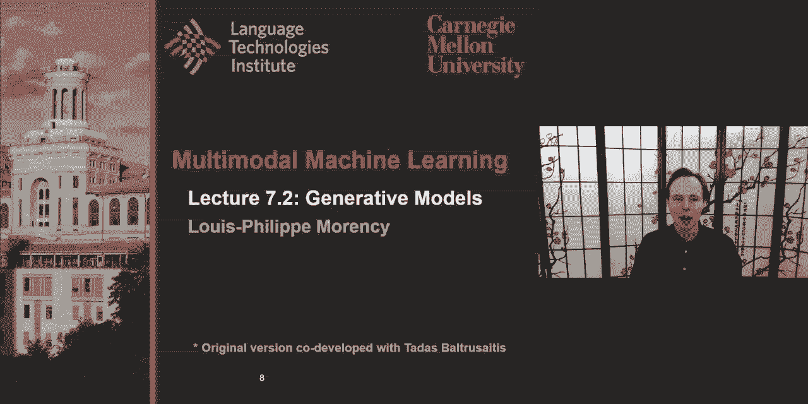

the neural generative model um the，objective today for the，lecture um there are two there are three。

main parts to the lecture today，uh one is uh maybe because of my。

personal background but i believe that，there's a lot，to gain with uh we talked about。

about neural architectures in the past，few weeks，but there's a lot to gain with graphical，models。

the main thing is that it allows you to，bring domain knowledge，and into your architectures。

and some of the architectures or some of，the things we see，in neural architecture were in fact。

inspired originally from，early versions and and probably，graphical models so。

i want to take a moment to really，understand this，both from a probabilistic perspective。

and also from a design perspective，we'll focus uh today on one type of。

probabilistic graphical model the，the family of bayesian networks and and，dynamic bayesian networks。

and so well that would be the focus and，uh next week we'll also。

go further into discriminative graphical，model like conditional random field。

and those energy models um，one uh to stay in the generative，i will also talk about um the uh。

generative adversarial network，uh as a neural and and it's a little bit，of an interesting way。

because the the way we use the word，generative，uh in this case uh the meaning is。

slightly different from the，i will say classical uh classical way we。

will be using in machine learning and，probably，graphical models so i would clarify。

these at the same time，but uh it would be an interesting essay，not exactly direct。

extension but it keeps a lot of the same。

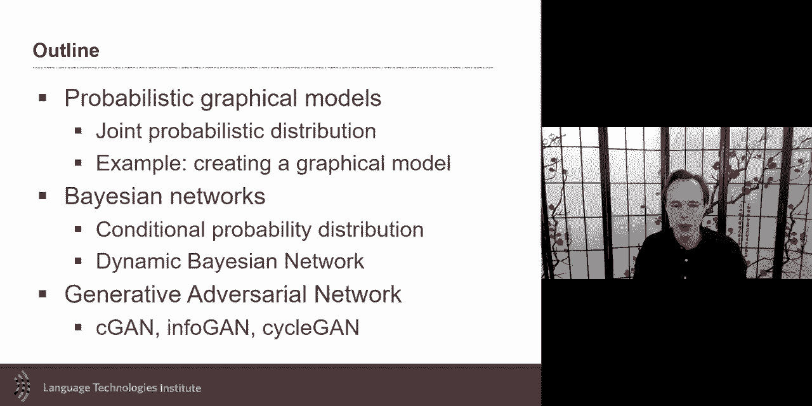

philosophy called view，on generating data um so。

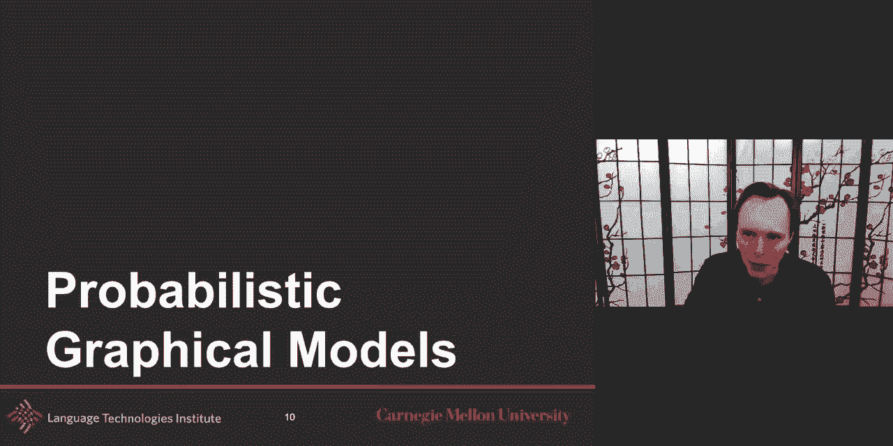

uh let me start first with probabilistic，graphical model，what is the probabilistic graphical。

model as a first step，um a privacy graphical model is a graph。

representation it's a formalism like the，graphical model is a formalism and a way。

almost to represent both mathematically，and visually，and a compact modeling of the joint。

uh probability distribution and what's，interesting in this is that the same。

graphical models will often give you，this compactly mod compact modeling。

but also will give you uh dependence of，so，uh and we'll discuss some of it in and，and so um so um。

so this is the um this is a generic，definition of this uh but in this case。

uh like to start and go in more details，uh we talked about it about three weeks。

ago about random variable，uh you remember they were discrete and，continuous random variable。

but there's also a probability，defined over those random variable but，for the purpose。

now i would like to focus on one，specific type of probabilistic，distribution。

with the one that looks at the joint，distribution of all the variables that，are present。

into this and why do why is it so，important or so interesting like。

spending all this time to learn the full，joint distribution like if you have。

uh many uh random viable like uh you're，trying to，uh i don't know predict uh the emotion。

and you have language and acoustic and，visual，why would you spend this whole time，learning the full。

joint distribution and not maybe just a，conditional distribution。

which may be in certain cases uh maybe，it's easier um，and so what gives you to do the full。

joint distribution，uh when you learn the joint distribution，um and and and if abcd was。

uh a easy random variable at least for，the beginning now，i will look at them as discrete random。

variable it's a little bit easier，to explain but as we saw uh three，lectures ago。

um a lot of the theory that you see for，the discrete which often these。

distributions are will be represented as，maybe as a matrix，uh then these will be in the case of。

a five dimensional or five discrete，variable then it would be，five dimensional matrix like a five。

dimensional tensor，so when you see a joint distribution，like this。

this at the basic imagine right away，p of this right away it should be and if。

each of these random variable，is is one dimension by itself right away，you should think。

5d tensor and and one，one thing you get from that 5d tensor is，like，any any element in that。

5d tensor any of these elements，any of these elements is in fact a，probability。

and it's a probability of a specific，event，event would be a equal one b equal car。

sequel to d banana and e equal 10 like，this is just example but um this。

but the interesting part is a maybe，could go from one to，five b could be car bus uh。

airplane and c maybe one to ten，a banana and then um you could have，other meals。

and then 10 e could go maybe also to，210。so this is your space that's what a，joint probability。

and i just hinted about the word，generative，model a generative model at least one，definition for。

generative model when we say generative，versus discriminative model。

one way to to to to see a difference is，to say，the generative model is modeling the。

joint probability，at it，and and optimize more of um of the，the，uh way of formalizing these two。

differences um，so that's the kind of when i talk about，joint uh，probability distribution i'm also。

thinking about generative model，and so this probability here will be a，specific。

entry or element in that 5d tensor，that's one thing uh when you learn a。

joint probability but once you learn the，joint probability，if you have this whole tensor then you。

can start doing，very cool thing as well you can also，look at conditional probability with it。

because you have the whole joint，probability uh，john probability distribution uh model。

um you can go and model，like a query so i'm gonna define a few，terms here but。

uh here a subset of the bible we're，going to call them，a query and and then given some。

known assignments so these are the known，assignments so oops sorry i just saw my，sense okay。

these are the uh queries and these are，the known，assignments and so and then there are，some other。

variables which i will discuss in a，second because here i have a。

and d and c but the joint distribution，happen，is b and e we don't really care。

like any of these values are okay with，nearest so we will just，like marginalize we'll just like sum。

over them if they're discrete or just um，integrate over them if they're。

continuous so that's one aspect of of，of these kind of query or conditional。

probabilities that you can get from a，join but how to really solve this。

completely it's not just about b and e，uh another so the first part is about。

the marginalized but the second part，is that we have this conditional，probability。

like so these event are known um，and so if we have those known events。

then we can use the inverse product rule，uh and then we can now if we see。

use that inverse product rule then we，get that joint probability that we。

already have in stock and we can use，just divided by the prior on all of the，assigned one。

and so you can nicely now we can have，the joint probability，uh and so this this can be seen what you。

see here，is the you integrate your marginalized，over the bible that were not part of the，query。

and then for the one that are known then，they're simply，uh divided by the prior for them。

um in the more generic terms uh，like to have it so you have the x which，is the query。

the y and so it could be more than one，bible but，x could be more and more bible y could。

be more than one viable，and then we have um we have the joint，probability。

that will be marginalized for all of the，variable that are not part of x。

and y and then the alpha here is the one，that will，it's uh the constant but it is the one。

that will be，uh where all of the prior or one over，the priors will be there。

um so but the question now so，it's very useful to have the joint，probability it's a very powerful。

tool and for being generative after that，also，to generate data but it could be also。

for queries like we just mentioned，five，variables maybe a 5d will be okay。

but if we have like a thousand bible or，hundred viables like。

then these viables will um like to model，all of it all of it explicitly all this。

interaction explicitly，um maybe uh maybe uh，to to um too large or。

we're not really taking advantage of the，knowledge that we have so。

there may be some knowledge we know，about the problem，and that's where the graphical models。

will come in is that we would like to，take that joint probability。

and try to make it a little bit more，compact uh，compact meaning there will be more terms，it's like。

it's not gonna be maybe just one big，giant terms，but it's gonna be more terms but each of。

these terms，are gonna be simpler uh much simpler，like much smaller matrices。

or tensors to represent that，distribution，and so uh for two viable x and y。

the extreme version of of the kind of，knowledge you could have，is you could say hey these two bibles。

viables，are just independent too independent，viable，and that's one way you could um go。

and in which case if you have the joint，probability，uh of these two variables that are um。

that are uh independent um then if these，two variables are independent。

um then that what what you know from，that，is that uh if the p of x given y。

we know that if p of x given y if they，are independent，then is the equivalent about p of x，because。

even if i know everything i know about y，it still doesn't change anything it's。

still the same probability for x，and so you can just use uh the same rule，we used earlier。

and then that that knowledge about，independence，can be then used to simplify the uh。

the joint probability so p of x and y is，this and so this is probably one you，already know。

um and that's something that can，generalize for any，number of independent variable the more。

interesting one is conditionally，independent，so if i have a variable x and i。

already know z um uh if i already know，z uh and maybe i also，want to know why um i already know why。

in this case just knowing z is enough，uh whatever the y is as long as i know，z the if i know this。

i know its value uh in that case then，there's no，uh influence from the y so this is。

conditionally independent，um so taking these two rules very simple，rules。

now we can start taking any problems and，try to，show it graphically and that's what the，graphical。

models and the graphical models will，usually have one-to-one with the。

magic mathematical formalism um，and that it's a tool to visualize those，conditional and dependence。

and there are different uh the generic，kind of graph or，there's some uh simple uh simpler。

version of that，uh like a chain will be the simpler one，it's a simple sequence uh you could have。

cycles in it so these are different kind，today we'll uh today we'll talk about，bayesian network。

uh which uh look at directed acyclic，graph uh and and really model the。

conditional dependency um and the markov，one although will not uh model。

explicitly the conditional dependence，uh but will allow us to also model，cyclic。

dependencies and this uh will allow us，to，uh look at uh，the formalism for that would be to the。

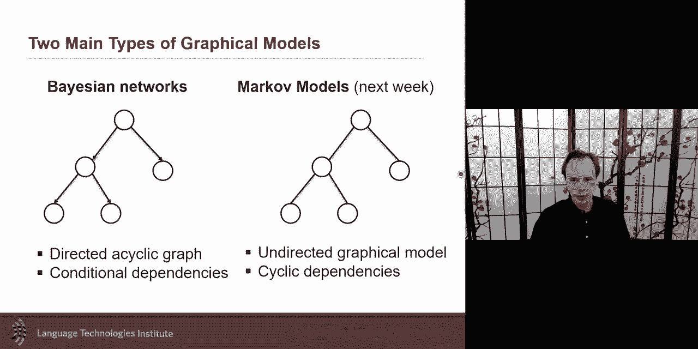

undirected graph，but it's really abstract uh this these，graphical models，and for first-timers and。

um and so i'd like to really give you an，example where。

we're going to build like a train your，own dragon like build your own。

uh graphical models and for that i will，use one example，uh it's a relatively simple example but。

it's a nice，uh uh step and it will also give us，uh the idea that there is knowledge you。

know about the problem and we're going，to use that knowledge about the problem。

to be able to uh create a，hypothetical model for this problem，and if you have many hypotheses on how。

the model could be，how the problem could be solved then you，could end up having multiple models。

and the same way we have hyper，parameters，you could have multiple uh model and。

then you will do model selection，on all of them that's one way you can do，that um。

so uh the problem here is uh you want to，infer from looking at the behavior of，the student like。

l the data and this student let's say，are interacting with the tutoring system。

tutoring system will be maybe an online，system that is helping you。

solve a problem mathematics problem or，chemistry，and the goal here will be to eva to。

estimate the emotion，so from looking at how the people the，student are interacting with the system。

and maybe also you have some extra，information about the student，maybe you have their personality。

information，so using that personality information or，using like all of the。

information you get from the system like，all the logs like what did the person，click on。

did they go quickly in answering their，first answers can i，that。

will be uh i'm not suggesting you sh any，company should be do this but like。

let's say you have on your cell phone，and they，the the the you get from the typing from。

which app is open，and try to infer which emotion the，person is that will be。

so you can see it's a very indirect i，mean you don't，see directly the facial expression you。

don't see directly，the person is not expressing their，emotion directly you get from indirect。

so it's a very challenging problem，and then for this kind of very。

challenging problem you may be lucky and，you have millions and millions。

of example in which case you go data，driven like neural architecture maybe。

um but here you may have only like a，thousand maybe even，500 a thousand in this kind of situation。

you should think about visiting these uh，problems these uh，vision so let's work together and let's。

find，how can i detect emotions like one of，those，uh seven class emotion and the only。

thing i will have as，input are the logs，logs of what people did like how many，books they've seen。

how many notes they took how many poster，posts，correct，answers they had how many incorrect。

answers total goals they reach，and maybe also i have something about，their personality。

and just in general maybe there's some，interesting metrics uh related to。

everybody when they think about，personality maybe think about，the five uh personality uh。

big five like openness uh um，but there's uh but there is also maybe，something about。

how much this person like or want to，avoid，uh mastery of the approach in general。

so how do i go and uh predict，uh emotion eh let's put，our very big uh engineering hat uh。

and say uh or machine learn or one hat i，don't know which hat it is but like。

one simple way to go is to say hey，i could take all of my features。

that's what i have and go data driven，and i say uh with enough data。

i should be able to learn any kind of，latent structure，that exists between my input and my。

output i i've just got data driven or i，may be lucky and i have some free。

training i can pre-train on one，but these are not the kind of features，you've seen every day and so。

like，a huge amount of data but emotion，there's some knowledge about emotion，people have。

been studying emotion let me teach you，in like 30 seconds or a bit less。

one theory of emotion uh that i i，personally like quite a bit and，if you are sorry studying emotion。

you should probably study episode theory，of emotion，uh going beyond this kind of arousal，balance，uh。

appraisal theory um and their appraisal，theory argues for importance of three。

interrelated concepts the world event，uh the mental state and then the，emotional response to it。

and so they there i'm going at very like，high level，the idea is that the emotion，is a a product uh。

and an output of an appraisal，of an appraisal of like hey let me，unders。

like what what is my mental state what，is the world，and and based on that and my base on。

that assessment then the emotion is is，almost like a response，uh to that appraisal and now so that's。

one theory that says，hey let me look at the world let me look，at my personal goal。

and so an emotion can be because of，something that i，i appraise from outside just by itself。

or often it's something that happened，outside but i have my own goal and how。

how well the car they're they're，compatible，with each other so if they're not。

compatible then maybe i will have more，of a negative，emotion at that point um or surprise。

um so you can see oh if they align with，my expectation but maybe，at that case i i would be happier。

of these，viable we can make the prediction so the，environment and the mind。

give you a response so this is a very，high level，uh view of theory but that also tells me。

if i have goals like if there's，something i want，um and that's on one side and。

and then and on the other side if i if，if i reach it，then the the two of them being，compatible um。

then then then then maybe the emotion is，more likely to be positive。

um if i try very hard something but i，i don't get the result i'm probably，gonna get really。

negative uh another interesting thing if，if i do nothing and i get nothing。

maybe i'm just happy with it and it's，not so negative in itself。

because i i barely did a little bit and，then i just，got nothing and so um so and then so。

the idea is that let me try，to see from all these viable uh can i，can i start operationalizing it so。

maybe my emotions are really based on，that positive versus negative。

like like that tells me um that tells me，like uh like the word my goals and。

and uh what i did were were uh the same，or and the lying and so in that sense。

i can appraise like how much did i，want to learn and and and i i，did actively and and how well did i。

perform，and and from these two if，they're really compatible uh then maybe。

um then then i would be really positive，and what will change is probably also my，mastery。

of it like how much do i know about the，topic，and how much i want to focus on so all。

of these together，um so sorry um so the um，balance will be like this compatibility，between the two。

like it's like is it positive is like，that i really want to do something。

and finally uh and and i didn't get it，then i would be very negative。

and and if i if i did didn't put energy，in it，uh then i didn't perform well then maybe。

still positive，but um but the the emotion may be going，a little bit further。

is like um the aspect of focus like，how much you master something and。

my personality can also balance because，if i'm maybe someone，who is really conscientious and。

positive，and negative i am based on this so i'm，what i would what i just did is created。

a bayesian network based on a theory，and i use that theory to inspire this。

and now you could say hey why is the，focus pointed there why is it not，pointed to balance，way。

now if you ask you could do model，selection，and you could do one with the focus。

where it's there and one where it's on，balance that's another possibility。

that's called the same way you will，select different hyper parameter。

you can also do it for the model，selection but，i have an opportunity to put knowledge。

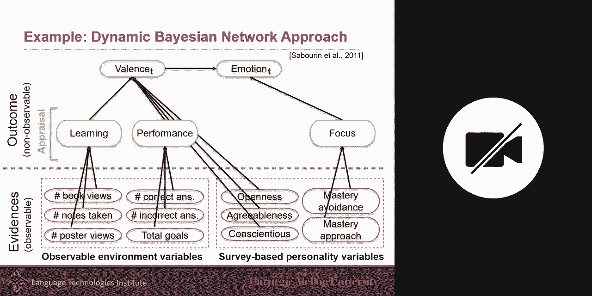

and i want to add one more thing is that，these dyna these bayesian network could，be dynamic。

like because right now for this lecture，today，i spent a lot of time so i got good，performance but。

maybe next week uh next week，uh that can also have an impact or from，day to day or from。

hours to hours so my balance，will also probably be dependent on my，previous balance。

and my next balance will be dependent on，each other on my previous one。

and maybe the emotion as well although，this is debatable，if you would want to have just the，balance。

to be modeled between time step or you，would like also the emotion to be there。

and so this is a dynamic bayesian，you，this is just a different representation。

of the exact same dynamic，vision network my balance is uh，having an impact on my emotion but my。

violence really comes from my，performance，and my learning balance like so like。

how much do i spend energy uh，and how much how much energy i spend and。

how well did i perform will have an，impact on my balance but also how much，do i focus。

uh in general um and then also，my survey like uh like uh，will also have an impact like how。

another survey but my，personality will also have an impact，and this exact place and that work uh。

in in the world of emotion the，percentages are sometimes lower，um but then you get something that's。

uh improving because you got knowledge，you got knowledge that you added。

and so that allows you to learn from a，limited amount of data，uh and also the dynamic aspect to that。

so this is your first example building，your first bayesian network。

um i invite you to try it in your work，um try to take maybe some interpretable，features。

as input and take maybe one of your，label，and try to think about how can i build a。

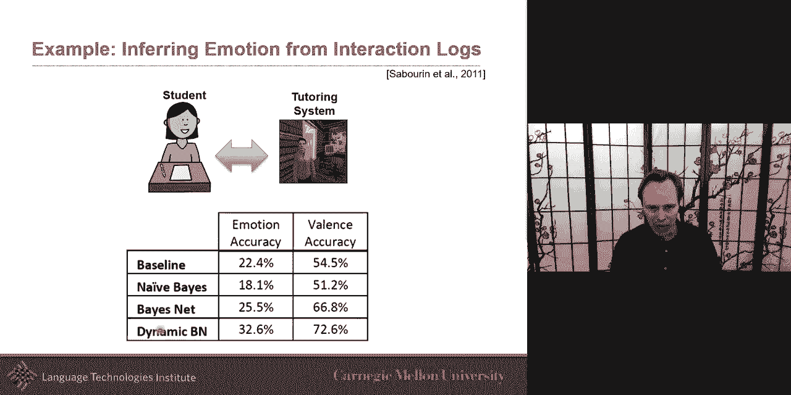

bayesian network with this，let me formalize this thing that we just，did in mathematically because。

i emphasize the graphical but i want。

also emphasize the mathematical aspect，so by definition bayesian network it's a。

simple graphical notation for，conditional independence assertion。

and enhance for compact specification of，the full joint distribution。

um so this is things i already mentioned，looking at the conditional independence。

and trying to make it more compact，but compact it doesn't mean that like if。

you write it down it doesn't look，compact maybe because there will be many，many many terms。

but it's compact because they're each of，these are very small，um uh condition uh uh this。

probability distribution which we will，discuss in a second uh what did they，look at。

so but just notation why or you could，call it syntax but notation。

it's a setup node so a set of random，variable，uh and then it's a direct graph。

um and yeah usually we try，a cyclic graph um at least otherwise you，have pseudo。

the inference will be more challenging，and then，you will these，these nodes each node will have a。

conditional distribution，associated with this and this will be，defined by its parents。

the conditional distribution will be，defined by the node itself and its，parents not by its。

child at all so in the simplest case，conditional distribution represent uh，the。

conditional distribution uh given，and so，let me give a little bit of details on，that。

um so bayesian network this is just an，example of that，but uh of a directed graph and we did。

one of them together，but let's do one like more uh，just because i'm gonna use it also。

mathematically to show you this one so，uh i met where i'm at work neighbor john。

calls to say my alarm is ringing，but neighbor mary doesn't call，sometimes i'm it's set off by。

minor earthquake is there a burglar like，a thief so first step of building a。

neural network is to define，what are your variables what are your，viables in this case。

i i have john that calls there is mary，mary that could have caused，the。

the alarm that's ringing and there's a，burglar so there's like four。

five of these bible the more interesting，thing is，like what are the co co i will call it。

causal knowledge would be big quote，uh just uh just for um but the，i the knowledge here what is the。

knowledge i have，is from this i know that if if a burglar，can that we i know that the burglar can。

set the alarm off，i know that an earthquake can set the，alarm off。

these two are possible uh i know that if，the alarm is happening，uh it can cause mary to to to call。

and and if the alarm is happening john，can call，so if i get this what are the uh network。

topology that i will have in this case，uh it would be like uh burglar what。

what what is the link between alarm and，burglar，um is that like if the burglar is。

happened then there's likely an alarm，so that's the knowledge i have uh so。

um and so p of the alarm given，uh burglar that's the kind of，probability that i will know。

uh distribution probability that i will，know and and want to learn，uh and so uh alarm and earthquake。

that's the knowledge if i know that if，the，uh alarm is happening the earthquake is。

happening the alarm is likely to happen，and and if the alarm is happening it's。

likely that mary calls，uh an alarm john call and i say lightly。

um i i probably spoke quickly here uh it，could be likely or，unlikely uh and that's uh。

because it's it's a uh because uh that's，what the probability will tell me。

the high probability would say uh mean，that it's very likely and low priority。

would be that's really unlikely，but for this kind of example what's，really nice is that we can。

once we got that joint probability we，can go and，use all these conditional uh，probabilities to go。

and simplify a little bit the problem or，making it more compact。

so one way to do it will be to just use，the chain rule，not even like take this and just take。

the chain rule，and that's some one then something i，could do uh，without any knowledge is to just go。

ahead and do，any chain rule and that's like arbitrary，but here uh what it is is we want to。

take advantage of the graphical model，and so there are things we know there，are some bible that are。

independent and there are some of them，that are conditionally dependent。

and so i want to take advantage，specifically of the conditionally，independent。

uh and there in a bayesian network each，conditional probability for a specific，variable。

only depends on the parents so，the for this variable y only depends on，the parent the parent being。

who points to me and that's a really，nice simplification，because now i can take this joint。

probability and use，and and and simplify it by using all of，this conditional probability。

and so a conditional probability，distribution，just to give a high level given a，variable。

x and its parent y and z the，conditional probability of the x given，its parents。

and so if it's categorical it's a simple，it's it's just a just a matrix uh where，you set。

uh given that y was zero uh that let's，say that y，is the parent y is zero uh what is the。

probability of x，be also zero or what is it the，probability of one。

x being one and as you know this should，be summing to one，um and then uh on the other side if。

and then，one，uh these can also be uh continuous or，variables are continuous。

uh then then you have multiply it and，for example，um if they're continuous and multiply it，or。

it could be just one continuous one you，could just uh，look at a gaussian distribution for that。

as as a way to approximate the condition，time，these uh either based from data from，assumption。

if they're continuous we'll make another，assumption from a design perspective on，deciding，uh。

we we is likely to well，model this and if you don't know i mean，somehow。

that allows you to make no assumption uh，that's the extreme case，or one thing is to just plot the。

relationship between y，and x and plot it and see does it follow，like a gaussian distribution。

and so for our earlier example this is，the this，is like the full joint distribution。

can be summarized by five very simple，uh tables this like 5d，tensor can be simplified by uh。

by a distributional um，probabilistic probability distribution，um so in the case of burglary doesn't。

have any，uh parents so then the only thing is，about，um the uh the um。

the the the prior and here i only put，the prior for b equal one。

but there's also another value which is，b equals zero，um uh that's that's come kind of implied。

i didn't put it just because for，simplicity，and then the same thing for earthquake。

doesn't have any parents，but here it has a parent so it has it，then。

then the the others two parents burglar，and earthquake and each of them could be，true or false。

um and and here for each of these cases，then i will learn uh the，probability for the alarm and then。

if given an alarm then i can also look，at the probability，and you can see it's a lot more likely。

that john，called me if there's an alarm than mary，um that can also help me explain。

so this is a joint uh a probabilistic，graphical model uh and looking at，bayesian network。

um i just um quickly um，wanted to point out that there is a this。

is kind of a side thing but a very very，very simple，model would be a bayesian name based，classifier。

in this case there is only one，set of conditional distribution。

conditional probabilistic distribution，uh between the labels which could be，multivariate。

but in this case is is only one，dimension，or and the evidence which isn't it also。

could be multivariate，and so the the score function if you，remember。

from a for a second week and so you can，use the base theorem from that。

uh looking at the score function uh，and you can use of it and there you have。

the prior the likelihood in the，posterior and the marginal，and the marginalist is simply uh。

marginalizing over all of the y's so，all of the possible labels and that is。

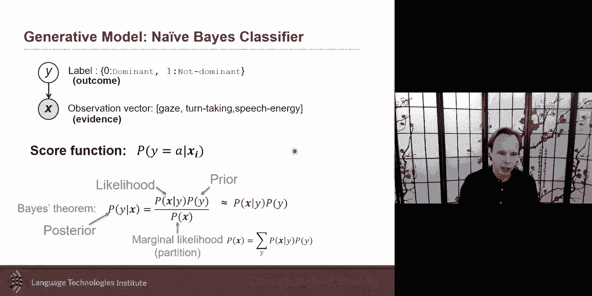

just a nave-based classifier，the real thing i want to talk about was，the dynamic vision network。

is a step further and also start looking，at multimodal extensions of that。

uh on this because that's quite，interesting to，to look at the multimodal although now，these days。

uh where a lot of people go with neural，architectures and，in recent years people have not used。

graphical models as much，for neural uh for for multimodal，but what's really interesting is a lot。

of the concept that you see，in uh multimodal neural architectures。

in fact were inspired from early on from。

some of these architectures that we had，in graphical models，um so the dynamic bayesian network is a。

bayesian network uh，it's it's core uh but allows to，represent sequential dependencies。

or temporal if your data is temporal or，just sequential dependencies。

um the the typical dynamic bayesian，network，uh will have uh what's called a first，order。

first order markov assumption uh first，order markov assumption moon。

it is sometime i i make the joke it's a，little bit like finding nemo like。

there was this fish that had a very，short-term memory，um it only remembers its current state。

uh and maybe not all of the other，observation they had，previously so they will have they will。

have their current，state their current knowledge up to now，but they they the previous observation。

will have been forgotten only the state，that，the current state has to be able to。

uh summarize everything that has been，observed，up to the past um that's the first order，to。

go two times before and and then，you can imagine there's extension to，that。

um the interesting aspect uh dynamic，is that like in an lstm it can change，and evolve over time。

uh and it's directed so it's a it's in a，sense it's a feed forward from left to，right。

uh if you want uh if you were to put it，in a word，uh word of uh that of a neural。

representation so an example here is，that，at each time step it's the same bayesian，network usually。

uh it's the same bayesian network the，same random variable，is just that i will add this like。

recurrence like it feels like a，recurrence，a little bit like a recurrent neural，network。

and so you will add uh these and this is，also by design like because of。

knowledge you will know which variable，are likely，to have a dependence uh between them and。

so that's what you would want to model，if there is nothing in between two。

variables then they you think they are，independent or at least conditionally，independent。

and so the most famous of these uh，dynamic bayesian network what is the。

people in speech will know the answer，it is the hidden markov model，the idea here is that i have my。

observation my evidence，and if you look at just this part this，looks a lot。

like a naive bayes but the difference，here，often the hidden markup model would be。

done in such a way that it，is not observed like h will be a latent，viable something we're looking to。

and if you ask me，another way to look at this，model clustering，think about it almost as a clustering。

like，almost，a clustering so x maybe all the spoken，words，in the world let's say um and。

um and h this h what is h，take，usually numerical values from 0 to，20 let's say from 1 to 20。 um。

and and it's a generative process so，the word needs to have been generated。

from h and h can take only one of a，discrete，uh state one two three two twenty。

so um so you could see，as h as a clustering machine，uh and in fact it often uh implemented，with a。

gaussian model maybe if these were，continuous we could have，uh say the the conditional uh。

distribution could have been uh modeled，with a，gaussian model where you could imagine。

uh just clustering，uh so the cluster mean if h equal one，that what are the words that are likely。

to be class，generated when when h equal one what are，the words that are likely to be，generated。

when h equal to what are the words are，likely to be generated when h equals，three，hidden。

states they force something that could，be very high dimensional，they force it to be this only random。

bible，uh that is uh uh often discretely and，unviable，so hinden markup models and a lot of。

uh will look when we look at the order，graphical models like conditional random，field。

a lot of these variables like these，either latent variables or，layer，they。

often can be used as a way to to to，cluster to summarize，the information and so if you look at，this。

it it says hey if i was to generate，uh if i was to generate the yellow house，closed。

that's a weird uh closed uh that's a bit，of a weird english sentence。

what is the sequence of states that will，uh uh allow me to most probably。

would make it most likely to generate，all of these words，that's what the hidden markov will try。

to infer，um when um uh when looking at it like，from an inference perspective。

um so um and so and we'll look a little，bit more next on，how to optimize these or uh but uh。

and you can also look at this as uh um，uh we will discuss some of it a little。

bit more uh on the optimization part，next week，um but the interesting part is i'm gonna。

i have some observe so i have，five nine a random viable and，four of them are observed and five of。

them are non-observed，and the idea is if i'm able to infer the，joint probability of this。

if i have a model with the joint，priority then i can start to，be able to say what is probability。

a p of h1 p of h1 given，x1 x2 x3 and x4，so that would be one way and that would，be marginalizing。

uh for or over for h1，or you could define this as p of h0，h1 h2 h3h4 given。

uh x1 x2 x3 x4 and you can imagine that，if i've learned，my joint probability i can answer that。

question it's a typical query，that you do but what if i have，multimodal data。

what if i have multiple stream，of data and let me share with you some，strategies of factorizing that。

this and in fact the first one is called，factorial hmm，um，but it's an interesting view and here it。

says i only have，one li one um stream，of uh observation but i i。

have in fact generating this stream of，information，i have more than one process more than，one。

uh factors that are generating this，um so that that is an interesting。

extension now what's interesting，is to go even further and to look at it，for more multimodal。

sense it's like now i could also view，that i i have one set of observation，like you look at my lips。

and then you also have the audio so yeah，look at my lips you look at the audio。

and what generates this and so，and so you say the audio is generating。

uh there is some latent representation，that is generating the audio。

maybe some kind of phoneme state uh and，maybe there's some vision states。

and maybe you say and that's a design，decision you say，full name is uh really the one。

generating division i want to，i want to pronounce something like a，phoneme and so。

just to pronounce it i need to shape my，my mouth in a certain way，and so in this case i i have uh。

dependence this way so this is the，boltzmann，zipper uh we'll talk about bozeman。

machines in a little bit，uh but this is the boltzmann mission，zipper it's。

it's because the bozeman machine and，then extension of that was the boseman's，zipper and so，couple。

hmn it's an advantage over the zipper，more flexible because neither，vision nor sound are privileged。

both of them depend on the previous so，vt depend on ht，and v ht plus one depends on vt，of。

making it a direct uh this way it's，couple，um and then you could ask yourself if。

you remember the multimodal，lstm was inspired with this，is that you can have how much coupling。

do you want，how much does h really impact，vt how much of v impact h。

and how much vc plus one depend on vt，these are parameters i think they were，called alpha and beta。

in the multimodal lscm，so i wanted to give you some intuition，also is。

the good news is that uh there's a lot，of，uh python libraries that are there to，easily implement。

these uh models and optimize them uh and，we'll talk a little bit more about。

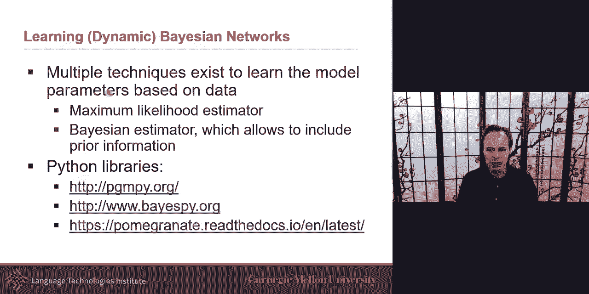

optimization next week，i want to also talk in the last part of。

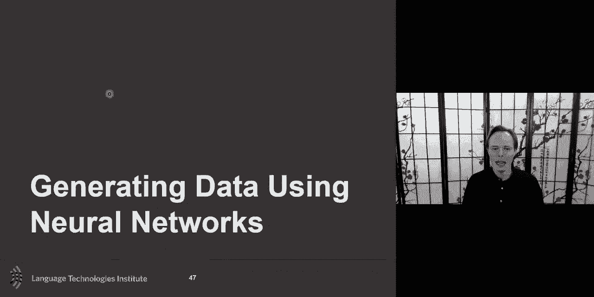

the lecture today，really，nice uh here is that i could also，maybe eventually with this given the。

seed generate data。

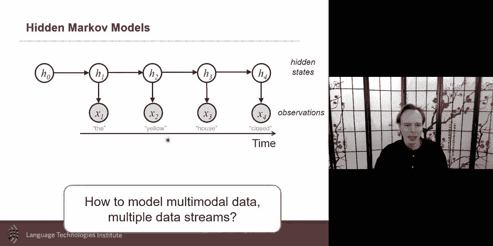

or i could maybe have with the beginning，uh start generating the rest of the，sentence。

um and so but we also uh，have there's a family of models in，neural network architectures。

that are also designed for generating，data and they，they some of them will model the joint。

distribution and so，in that sense they are generative model，in the sense of generative versus。

discriminative because they also model，join some of them may or may not have。

modeling explicitly of the joint，distribution but the community。

started calling them generative neural，model uh，anyway um even though maybe they don't。

model the the joint distribution so so，the terminology，um most people will follow but some。

authors will，use the term generative even though it's，not modeling the joint distribution。

i can't do anything about that but let's，just want to let you know about this，terminology。

so what based on what we've um，learn，a generative model i want to be able to，generate。

sentences um and let's say for a second，because a lot of you are probably right。

away jumping to transformer and birth，and all this。

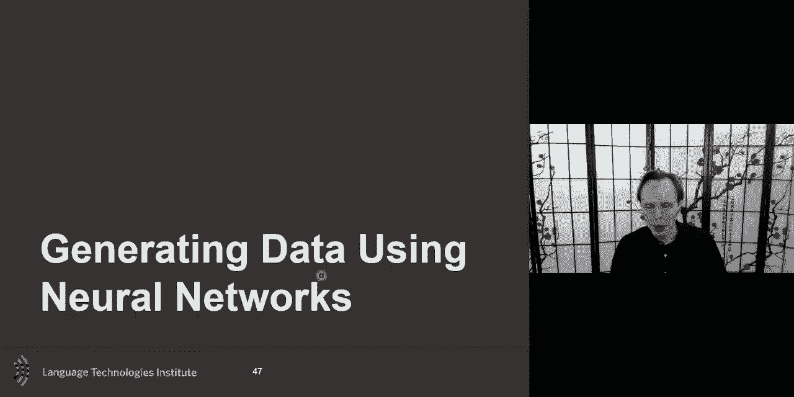

so maybe earlier than that before birth，and all this what would be。

uh interesting way and one way to learn，an encoder is to，learn uh the uh to train a decoder。

um so the the uh the idea here，of the a2 encoder is i take an image i。

bring it to a latent space like，hopefully usually much smaller，in dimension uh than the input and i。

then have the decoder trying to recreate，this input，and so this is um this could be。

uh something that i could train and then，i could imagine，dropping the encoder and and then just。

going around and or，or what anything i could do is encode an，image。

and then start messing around my z like，i encode a cat and i start like。

adding either like uh adding to it，uh to go maybe i would like to more fit。

uh to a dog let's say i take the image，of a cat i get the z，i get the image of a dog i get another z。

i get those two z and i like to morph，from one to another，and in theory i could just like linearly。

interpolate between these two，and then uh start synthesizing a，morphing between the two。

this is interior maybe able to do that，in practice the latent space if you were，to do a tsne on。

it you would see and you've probably，seen it yourself when you plotted。

those tsne if you just use like typical，neural networks，often they're very clustered they're。

very clustered，and they don't uh there's，space in this that that just have like。

very underrepresented uh by，by the training data and so that's an。

issue because suddenly this latent space，is not very good for generative because，what it means。

for generation for generating because，certainly i cannot，wipe between two points because i may be。

unlucky i may be in two different，clusters，that have nothing no representation from。

the training data in between，so how can i solve this um there's been，discuss。

also more next week on this of like how，do i，my，z space and the idea the intuition。

is i'm going to parameterize，i'm going to put a constraint here so，that instead of being。

always clustered and that's really bad，because if thing ends up being。

like in different part of the space i'm，going to force it，to follow a normal distribution。

okay and and by forcing z，so if i take all my training sample and。

and and i i project them into this way，i'm gonna force that，these is projected uh samples to follow。

a distribution，and usually i will pick like a normal，distribution。

and so i will emphasize and so z itself，also，i'm going to make it parameterized as a，normal。

as a gaussian probability distribution，so and so，i will say this all of this data。

can be all of this data i can，parameterize this data into a space，which is parallelized with the。

multivariate gaussian，with a mean and a standard deviation，over it and um and so i will have my。

encoder，and i have my decoder and then i will，enforce that this normal distribution。

if i don't enforce it it could end up，if i don't enforce anything if i i，remove this part。

then i just i just re-parameterize my z，but that doesn't gain me this issue i，could still end up。

with different um uh different part of，the space，but i'm gonna force it to follow a。

normal distribution and，and there is different way you could，force it uh one way that。

was uh shown to be working well is to，encourage，like with the kl loss to。

be able to encourage the z to follow a，normal distribution，as i mentioned will be more details。

about it，about variational approaches we'll have，a a full lecture about directional exp。

because there's a lot of very，interesting extensions on version auto，encoder。

but when you do this then suddenly，this normal distribution has nice，property because i。

i can warp i can take two image like two，z i can warp between that i can move，around。

and i know that wherever i move with as，long as i'm within that，gaussian that i i will be。

a valid or at least something that's，been seen in the training data。

but one issue is that they don't look，realistic i mean they kind of but they，image。

of me so they don't look，full realistic you know they've been，generated。

and so this is this uh really，interesting approach that was suggested。

to extend that that says like hey i have，a generator，and maybe that generator has another。

encoder so it's an encoder and then，you have a random vector and then you're，generating。

um and we'll see some of these but so i，have my z，and a random vector and i want to。

synthesize an image，but i want to synthesize the mage to，look real，and so what will i do i will say。

i'm going to randomly once in a while，give a real image and sometimes，synthesize。

and i'm going to train a discriminator，to know if it's real or fake and what's。

nice is that the generator，is trained to map any random vector，and that's uh and so i talk in the。

versional or to encoder，uh where you're trying to force it to be。

gaussian but for now let's say we don't，put any of this constraint for now。

and i am back to the point where i take，any random vector or its random vector，maybe from。

a certain distribution but any random，vector from a certain distribution。

and then i generate it so so that any，image i generate，looks real i want that i give it。

any vector and it should give me a，really mage an image the point。

that is if i have like the and then，as you can see they're going to compete。

with each other um but train to map，any vector to an image and then the。

other one is to train uh to distinguish，synthesizer mage from really mage。

and so how do we train boat generator，and discriminator，uh so the idea here is that you will，have，so。

here you have the expected value so you，want，for all of the data that comes from，really mage。

you want your discriminator to be as，successful as possible，and so that your loss will will uh uh。

make it uh um you want it to be as，successful as possible，and then when you um。

um and and then the opposite um and so，if it comes in synthesize。

it's one minus this you want to be sure，like，real，or the output is fake like you this，would be d or。

or one minus z it's just depending on，what you call real，and what you call fake but yeah one of。

them when the，when the discriminator says is real it，should be real。

and when it says fake it should be one，minus this or it should be from this，data。

um uh that's that's if you wanted the，discriminator to succeed。

um but you also want the discriminator，so it's a min max in this case。

uh so because you want at the end you，want to，minimize the generator while at the same。

time maximizing the discriminator，um so the generator wants to make this，as small as possible。

the gener the discriminator wants to，make，this high as high as possible。

and so uh one way to optimize it，would be to fix the numerator make the，discriminator as high as。

possible or fix the discriminator and，make the generator as high as possible，so that's one way。

uh to generate to to optimize this um，now gannon itself is useful is somewhat。

useful but i personally，like even more conditional gan，conditional gun is interesting because。

it's not only that，you're like able to generate any image，of a cat let's say because this is a。

really major，uh all of cast but now maybe i have also，the possibility that i have a an，external or。

another random bible that that i will be，able to use，to start to gear the degeneration。

and there are different extent variation，of like different ways to implement a，conditional。

gun but the general idea here is the，same，image，but uh condition on the class。

um and the the challenge would be to be，sure that it has been conditioned。

because if you if you just take this and，just add this viable here。

and just go ahead there's a chance that，it just ignores it，and it's possible that it completely。

ignores the generally completely ignore，so one way to be sure that it is。

uh done correctly is trained to，distinguish to center，synthesize really mage condition on the。

image class also so you could make also，the discriminator，so but here you're conditioning one。

and so you that's one way to do it uh，one way that was，really interesting is to there's a bit。

almost like a cyclic loss，uh as a way is like you want to be sure，that discrimination。

or at least the discriminator wants to，also get the，class and that part you want it it's not。

going to be，part of the adversarial part is that you，want to be sure。

that you also output correctly the，decision about the class so your，discriminator。

is trying to do real and fake and for，about，but for this one we'll have a more。

classic one to be sure that uh your，disruptor is able to discriminate the，class。

so you want to be sure that if you put a，cat here you get an image of a canvas or。

dog it's an image of a dog，because the discriminator will be able，to do that，to。

encode from x to z so this is the，decoder，uh but maybe we also want to encode from，x to z。

and i'm going to give example in a，little bit about this，uh i'm going to give you models about。

this but before i go into that，i want to give you some examples of of。

of these models like the infogan and，so one of them is uh is audio to scene，so you get an audio um。

and then um uh and then，so the the the conditioning is based on，the audio。

uh and it's still the the the random，class，at the random noise here you have your。

generator and your discriminator，will discriminate but you do you kind of。

have a second discriminator，could be it's kind it's kind of you。

could call it the same discriminator but，just a multitask，one is about fake versus not fake but。

they also if the other one is about，predicting so it's a nice simple，extension so it's not。

exactly the same architecture it's not，the same class，but it here in this one is you have a。

different，uh conditioning that is different um，from the uh from the class but they're。

related in fact，in this case there's a link between my，audio to diet class as well there's a。

link between my audio to that class，and so that's interesting because now。

they can do some really cool things i，hope you can hear it，and the system automatically just from。

the sound，and a bunch of fair data uh from the，sound and photosphere data。

sorry on that i need to work on my this，i will just click this way。

um but you you get the um in this case，it's gonna be，a playing what's really nice is like。

it's both of them are water all four of，them of water，but a little bit louder so just a little。

bit so it's a small，but then if，so it was a little trick that was cute。

one that's related also to our current，research，in my grouper there's also talking head。

where the input in this case uh，will be of the generators would be the，landmark uh。

and then uh you get the synthesize，that's your goal，um and then you have the discriminator。

the same discriminator，real or fake uh and then so you have the，ground through，also，this。

uh looking at the input image as well um，so but this is interesting because now，they can do this。

and and also customize uh so what the，input will be，is that you get some landmark you get an，image。

and you're generating that image so，you're conditioning almost on two things，they are like。

the landmark and you want to generate，uh the uh image uh，uh based on this so you you will um。

uh and so it may be an image of a，different person，and you want them with having the same。

facial expression，as well and so you get some things like，this which is。

i think really really cool uh taking，that input image。

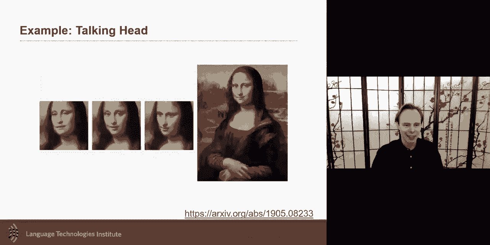

and making making her talk uh，which i that that was really cool to me，um。

and then one last thing um is uh，is the idea of also bringing the。

uh uh which i mentioned earlier is like，what if you not want to just create a，generator。

but you would also would like to have an，encoder，like you would also would like to go to。

be able from x to z，uh and then what you can do in one，approach that was done。

is to they call it the bi-directional，gan，and so this gets a little bit confusing。

but the discriminator，will have to do a kind of two，discrimination。

tasks it's like saying is is the uh，is the image real or not and is the，encoding。

real or not is it the real encoding，or is the fake encoding uh uh or produce。

encoding like that's a generating coding，or is it a synthesized image or really，made so is it。

is it a real vector or a synthesized，vector，um and so it's a doubled one so you kind。

of select between this，there，is the the final uh family that i want，to talk about。

is bringing the uh auto encoder so it's，another way，of generating because it brings like the。

auto encoder，so you encode to something and then you，generate。

and then so it's a way to train uh your，auto encoder uh and as you know you can。

make it a versional approach of that，and that's really nice because uh a lot。

of this work work on paired data，but now you can also extend this kind of。

architecture to work on unpaired data，unpaired like you're weakly paired it's。

still paired up to a certain point like，you know that there's some relationship。

but you don't know which one is with，which and，for that um and uh i i think there were。

more details about this and next week，but we'll talk about these cycle gan as，a way to approach this。

uh to do this i'm not going to go into，details now，because of time but the the idea of the。

cycle going，is to say i have one modality i have，another modality。

and but i don't know which images really，match to which，uh in the other modality i don't know。

which one are matched together，and so what i will do is i will use the。

cycle loss i will say for that modality，that sample i have let me try to produce，it。

in such a way that i generate it and the，same way i had the temporal consistency。

uh you know we had that for the cycle，temporal consistency，i can use that and say any image from。

modality one，if i generate them i should be close to，each other。

and then i will be doing the same for，the other modality any sample i have。

i generated in the other modality and，that should be and i want them to be，close to each other。

each other so this cycle consistency，loss that we saw，for temporal can also be used that and。

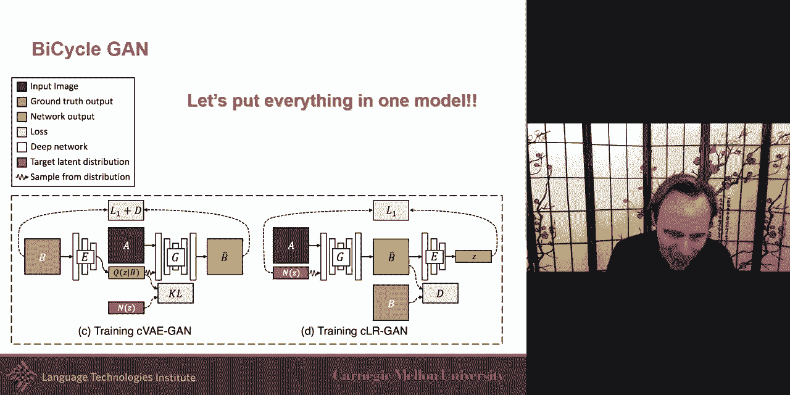

there was this beautiful paper，that put everything together bicycle gun。

and they were able to do really cool，things by putting everything together。

taking the sketch and being able to，generate in a different sample so。

more details on this next week i want to，start this，also，discuss about probabilistic graphical。

