# P14：L8.2- 深度生成模型 - ShowMeAI - BV1Pf4y1P7zc

all right hi everyone。

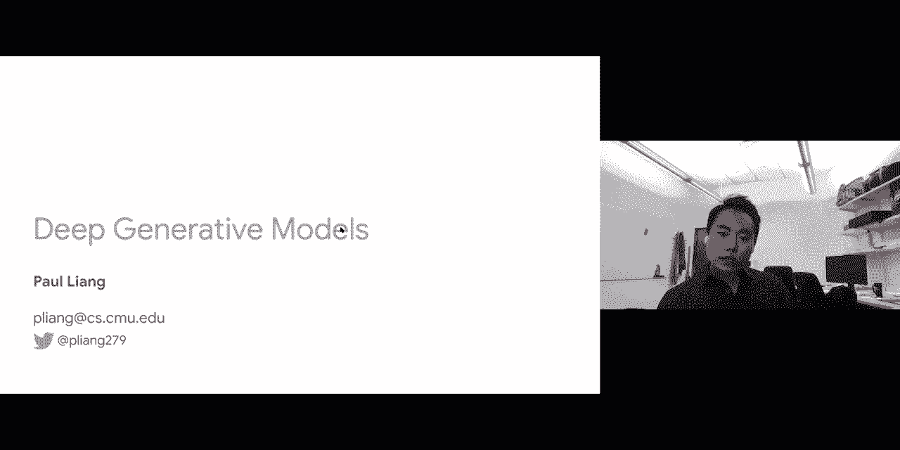

paul here and i'll actually give you the，next three lectures including this one，so。

this lecture i'm gonna be talking about。

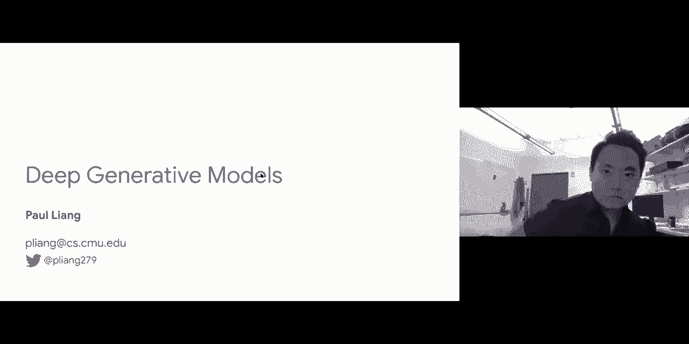

uh deep generative models，and for the next two lectures next，tuesday and next thursday i'll be。

talking about，reinforcement learning and some ways of，optimizing for discrete。

uh outputs and then we're going to kind，of revisit these degenerative models，next thursday。

so that we can actually study，determinative models for，generating text so today is mostly going。

to be on deep generative models for，generating continuous outputs so today。

we're going to talk about uh deep，generative models，and i think there's a bunch of people。

doing really good work on deep genetic，models i think，i'm using some of the material taught at。

cmu's pgm class，and also stanford's deep generative，models class so today's just going to be。

a really brief introduction，and if you really want to know more，about these determinative models you。

should really look at，the pgm class and the definitive models，class。

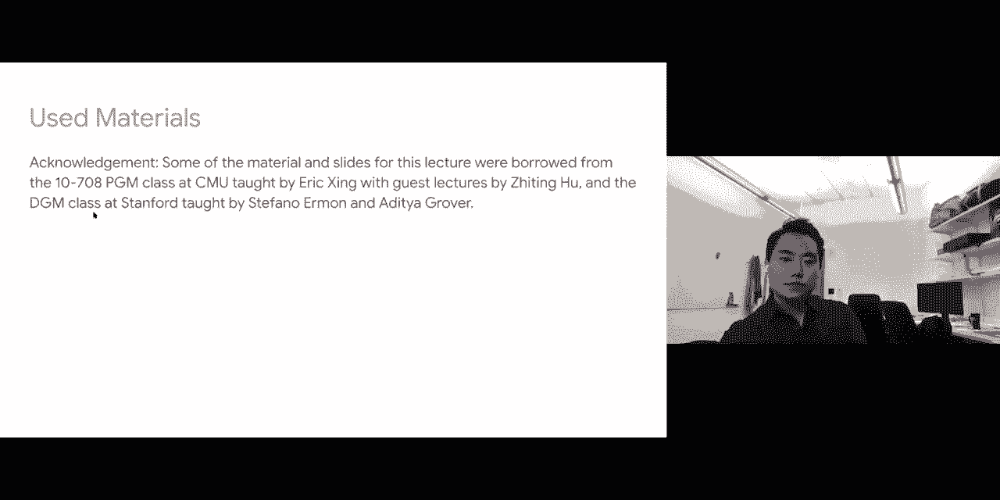

for more detail so let's start，in the chat，if you have questions and either me or。

the other tas will try to answer these，questions as soon as possible。

so today we're going to cover three，things we're going to start by。

introducing these generative models，and describe how different they are from。

your discriminative models，your supervised learning methods that，most of you have seen so far。

and we're going to start with some basic，generative models and we're also going。

to go into a class of，two very popular genetic models these，are called variational autoencoders and。

generative adversarial networks，we're going to some detail and these are。

some really powerful generative models，because。

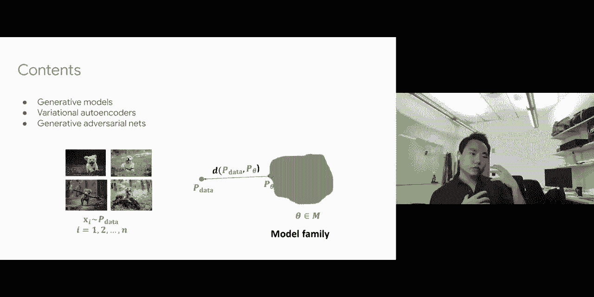

they leverage both the strengths of，these uh graphical models which gives。

you structure and modeling your data。

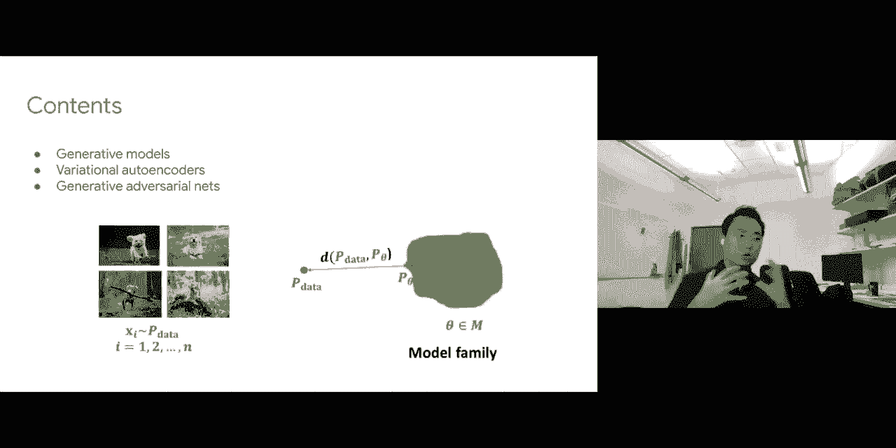

and at the same time they also combine，it with these uh flexible and scalable，influence that you get。

when you use like these deep learning，and neural networks so these have been，very popular。

and used a lot in generating images and，generating text，and generate all sorts of multimodal，data。

so we're going to go into in-depth，explanation of both variational，autoencoders and。

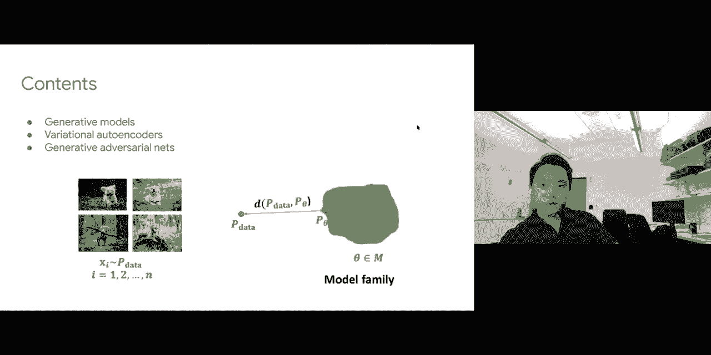

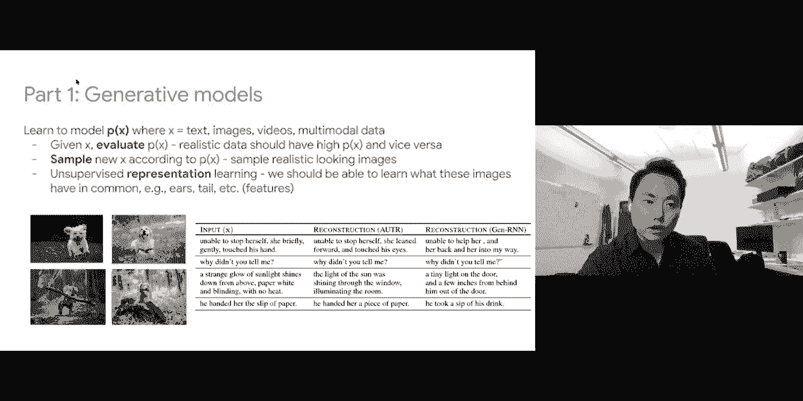

so starting off with uh generative，models，so generative models usually are given，data just x。

you're not given labels x and y so you，just given some text，from images videos or some。

high-dimensional multi-modal data，and the goal here is the model p of x，and this is different from。

discriminative learning or supervised，learning we're given both data x enables。

y and you try to estimate a，y given x so that'll be estimating the。

probability probability of t of y given，x，so in this case we just want to model p。

of x so what does it mean to model，so there's a couple of things that。

people usually look at when you're。

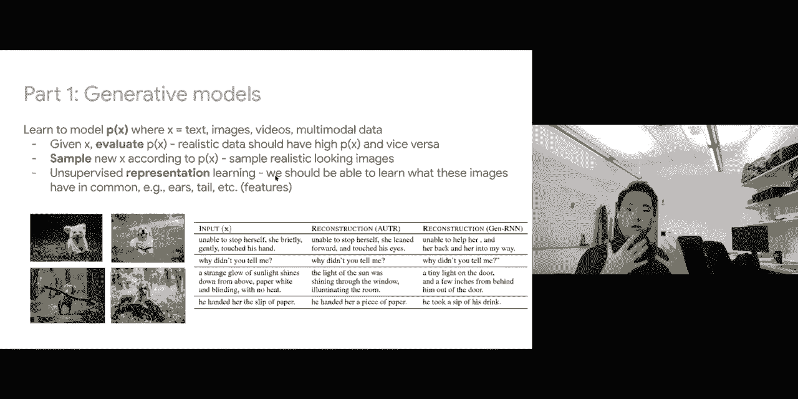

trying to both，learn and evaluate these genetic models，one thing is that。

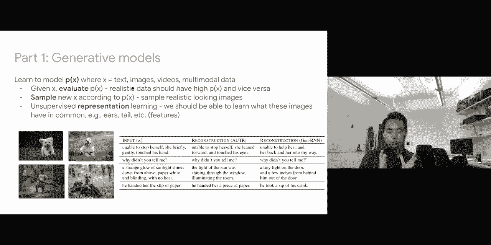

if you if you learn p of x if you're，given a new x you should be able to，evaluate p of x。

so realistic looking data so usually，realistic images，should correspond to a high p of x。

values and likewise no，images that are not as realistic should，correspond to low p of x values。

problem，and evaluation is really important，because it also allows us to do things，like。

some really useful images that look，realistic you want to assign。

high densities to it and for anomalies，you want to estimate you know。

low densities for it so that's more of，the evaluation problem，another thing that people usually look。

at is the sampling problem so。

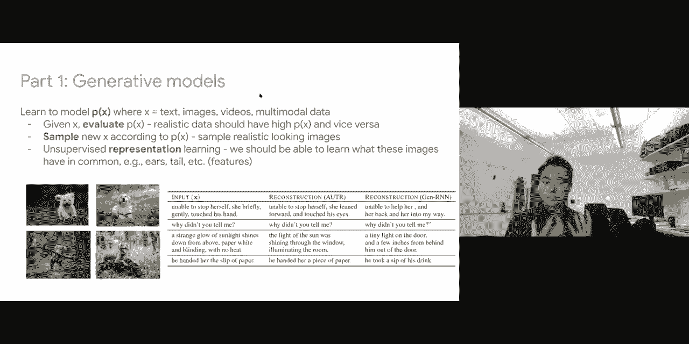

if i learn a p of x i want to be able to，sample new data x，according to p of x so that means uh。

regions of high density of p of x，which correspond to realistic looking。

images you want to be able to sample，them，with higher likelihood and likewise in。

your lower regions of p of x，which correspond to unrealistic images。

you don't want to sample them as often，so you want to be able to sample these。

images and sample these texts and，therefore be able to generate new data。

and in general um in general this this，goes for both，generative models and also unsupervised。

learning the goal is always into，representation learning where you want，to learn useful features。

right uh so if you're looking at these，generative models for dog images。

you want to be able to define a，generative model that lets you sample，new dog images。

but at the same time you want to be able，to learn features that you know tell you。

that your dogs have ears they have tails，in this particular shape。

and so on and so forth so throughout，like for both vaes and gans。

not only are they useful for evaluating，and sampling new data points。

they're also generally very useful for，representation learning so you can take。

all these latent variables，and eventually use it for some tasks。

so these are the main things that people，look at when we talk about generative。

just to go a bit further in addition to，just uh sampling，p of x unconditionally people also kind。

of care about uh，sampling according to some content or，category c。

so you want to sample you want to build，a model and you want to sample p of x，given c。

so in this case c can be a category such，as faces，outdoor scenes formulas that you want to。

generate images of，so this is called conditional generation，and a lot of the methods that we look at。

in this in this lecture can also be，extended to conditional generation。

another thing which people care about is，this thing called star transfer。

so instead of just generating images，from content，you're given both a content or a。

stylistic change as well as the initial，sentence x1，or initial data point x1 so that could。

look like uh，i'm giving we're given all these，sentences that start from a consistently，slow。

so that describes both content and style，and style is some stylistic change that。

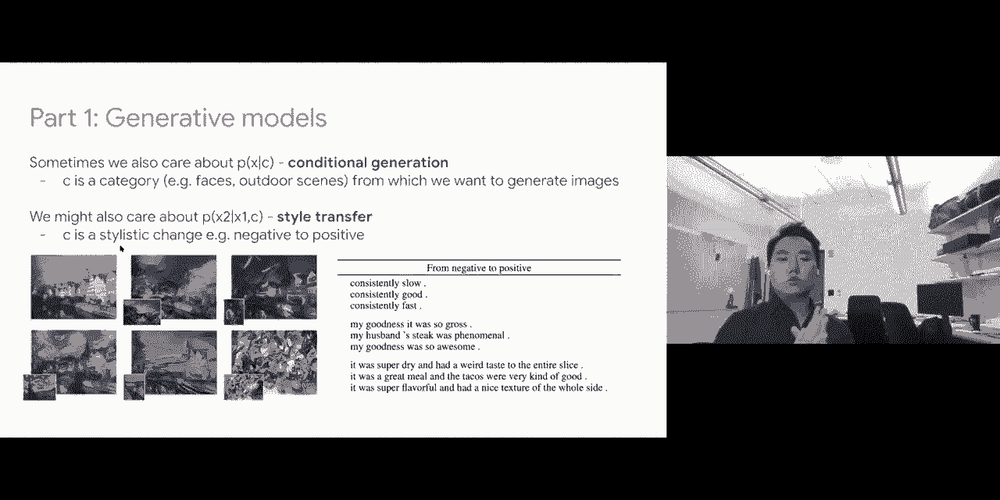

you want to go from negative，to positive so the goal here is to be，able to retain。

all the content in the initial sentence，and just change it according to this，stuff。

so you will change consistently slow to，consistently good，consistently fast and likewise for。

images you also want to keep，the main content so these are you know a，row of houses。

you want to keep the main content but，just change it according to a new style。

so this is this is a style transfer，problem and many of the models that we。

look at in this lecture can also be，extended to take in both，c stylistic attribute as well as some。

input data，so this is a brief introduction to，generative models。

so how do we actually what is like the，go-to approach，most people use when they actually study。

these genetic models，so a lot of people use uh later variable，models and what latent variables means。

is that，you're gonna start with images x and，these images are high dimensional and。

there's a lot of variation in these，images，due to things like gender eye color hair。

color pose and so on，and unless these images annotated these，practice of variation，they're not。

explicitly available to you so these are，what we call later variables。

so later variables in general are，unobserved variables that you would like，to explicitly model。

so that given another set of rated，variables you can generate。

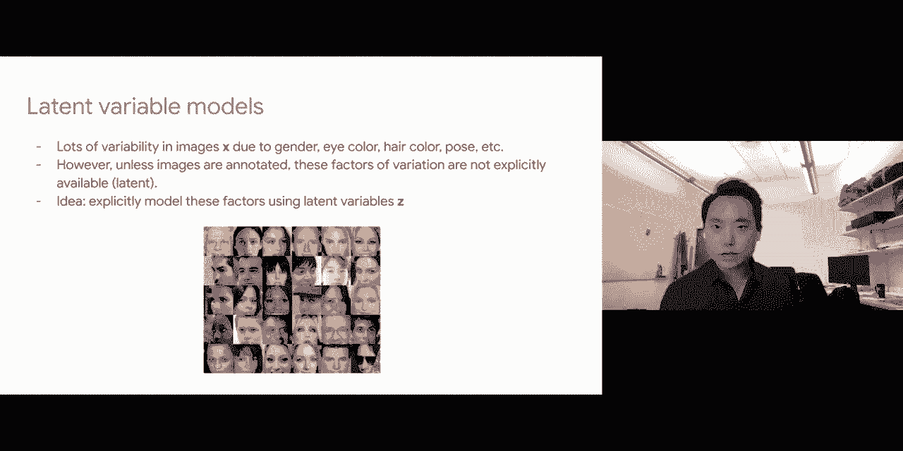

more data so，bayesian，network format is that you would have，theta x。

and if you recall for bayesian networks，lp went over it last lecture。

you always have these nodes and these，are shaded nodes represents。

nodes that are observed so in this case，your theta x，is observed and the nodes that are not。

shaded are those that are，hidden or latent variables they're not。

absorbed and these are essentially the，ones that you want to learn。

and these directed edges basically model，this generation process。

in this case going from c to x so your，model your conditional distribution p of，x given z。

so you only have a data set with these，uh shared variables x that are observed。

you have these unabsorbed latent，variables that you would like to。

correspond to these high level features，such as gender eye color hair color and，pose。

so ideally if you had a lot of domain，knowledge，about images about fake space images and。

your loss of data，then you could define a generative model，exactly you could define this very。

variable model，so you could have some variables like，gender you could have a hierarchy where。

ethnicity，determines both eye color and hair color，and you would have posts。

and together pose eye hair color and，gender will generate your image。

this would be ideal but of course in the，real world you don't have that much。

domain knowledge sometimes it's really，difficult to，to specify all these conditionals by，hand。

and they're usually unabsorbed so，usually you're just given a bunch of，images。

without labels or the people's gender，and eye color and hair color。

that are appearing within these images，so then，what we can do is that we can learn。

these latent variables instead，and that is the whole goal of these uh，models。

which is how can we learn these，unobservable variables how can we learn。

both their values the distributions of，their structure，so we all know that neural networks are。

very powerful，neural networks are able to um to learn，many，many many non-linear functions and many。

approximately many uh，complex distributions so what we can do，is that we can just try to learn these。

using neural networks，uh so in this case x again they're，images and we're going to assume z is。

some continuous，latent representation and since it's，continuous we can put a prior on it。

and these pliers you know we can just，choose a gaussian plier which is the，most standard prior。

someone will choose for a continuous，representation，so given a prior on c how can we define。

this generation process p，of x given c as given by this directed，arrow。

well we know that neural networks are，powerful so we can do is that we can，define。

a gaussian distribution where the mean，and variance，are non-linear highly complex non-linear。

functions of z，as a parametrized by mu theta and sigma，theta where theta are your neural。

network parameters，and by making mu and sigma you know deep，or convolutional or recurrent。

you're able to express many many types，of structures in real world data。

so if you want to model images you could，start with some simple latent。

representation and have a bunch of，convolutional layers，to actually generate the image and。

likewise if you want a model text you，can start with，again a continuous representation z and。

you could have a，like a like a sequential auto regressive，decoder。

using recurrent models or transformers，to actually model text，so these are really expressive methods。

and the hope here，is that after training z will actually，correspond to meaningful factors of。

variation，these meaningful latent variables，and another good thing that we want is。

that given a new image x，we want to be able to encode these，features so we want to be able to do。

feature extraction not just，generation from z to x but also give it，uncover。

what representation of this so that i，can eventually use this representation。

for a bunch of tasks that i care about，so you might want to model p or c q and。

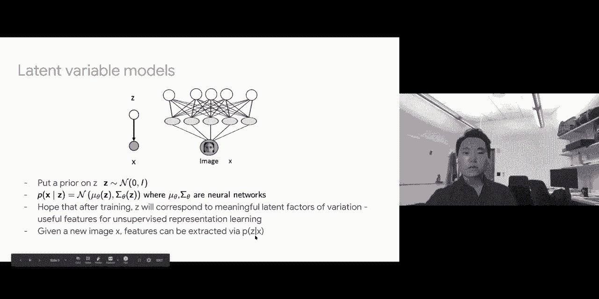

so obviously using neural networks the，powerful they're great。

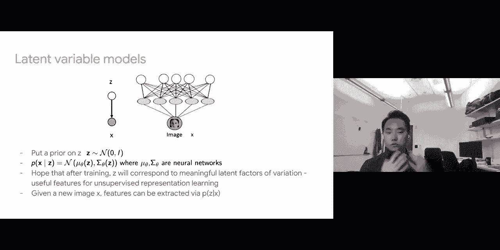

but they're also very hard to to solve，and we'll see some of these issues。

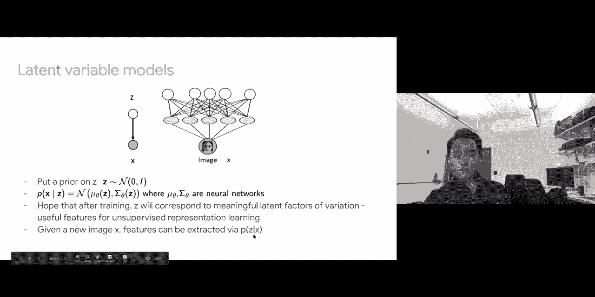

soon but let's just start simple let's，start simple，i think with a simple generative model。

that everybody knows just to kind of，motivate what these data variables are。

so hopefully everyone has seen a mixture，of gaussians，in a mixture of gaussians there's a two。

sets of parameters so first of all，you're going to start with a latent。

variable z and this z basically，represents which，uh which cluster you're in and you're。

going to define a categorical，distribution over these clusters。

and given this particular cluster z each，of these uh clusters are parameterized，by a single gaussian。

with a single mean and a single variance，so each of these，clusters look like this so blue。

corresponds to a first cluster with mean，mu1，you have another cluster in red another，clustering。

so although each of these gaussians are，very simple by having a mixture of。

gaussians you're actually able to cover，many modes，in data and you're actually getting a。

pretty expressive model，so what a generative process is is that。

you want to be able to first sample z，in this case a categorical distribution。

which defines which cluster you're in，and then you want to be able to generate。

a data point by sampling from that，gaussian，so if you chose uh your categorical。

distribution to be this，this uh this this gaussian and then you，will use。

the third mean and the third variables，to actually sample data from this word。

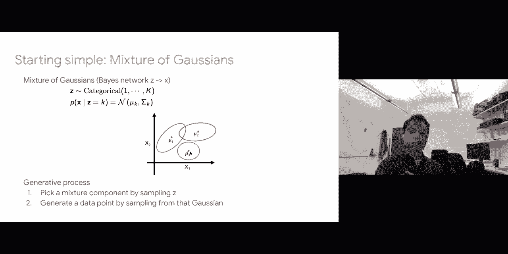

and mixtures of gaussians are actually，really useful given just given data。

you're actually able to fit，these latent gaussians to cover the。

space and actually learn these clusters，such that they group together。

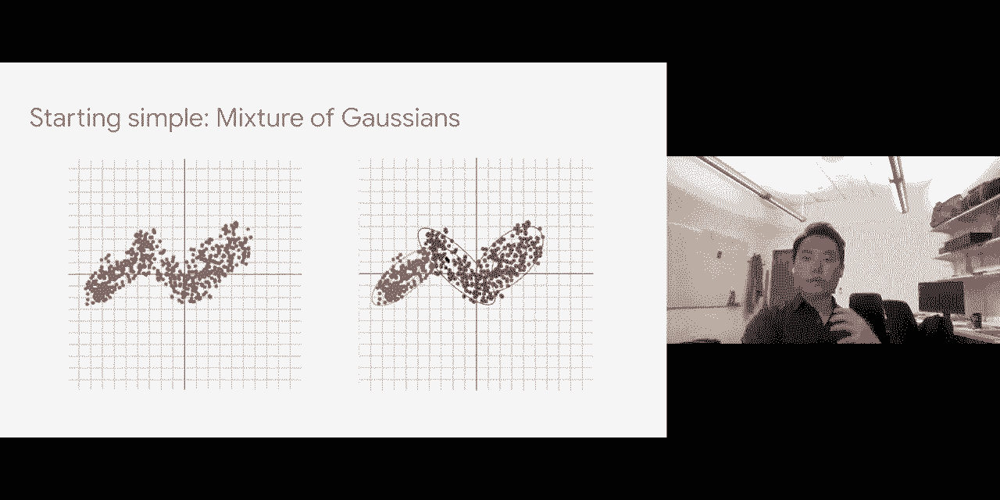

semantically meaningful parts of the，and oftentimes you know again in this。

case we have a very complex，data likelihood and that's shown in red。

and we are actually able to approximate，this data like we could but just three，gaussians。

so when we're talking about these，generative models what we usually care。

about is actually being able to，to measure p of x both to sample from it。

and also be able to evaluate it from you，the new data points，x and sometimes also to optimize it so。

that you can maximize this log。

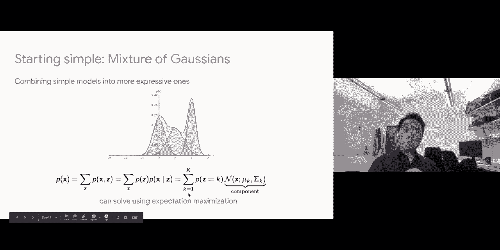

so we know that gaussian mixtures are，really simple，and we can solve them using expectation。

maximization，and they're also pretty useful in，learning these processes of data。

but one issue with these function，mixtures is that they're unable to learn，features。

so given a new data point x you're not，able to learn，what a good representation of this data。

point is，because in some sense this mixture of，gaussians only defines a generative。

process that goes from your latent，variables，z your mixture of gaussians to data but。

it doesn't encode，it doesn't have a encoding process，actually takes data and encodes it into，this。

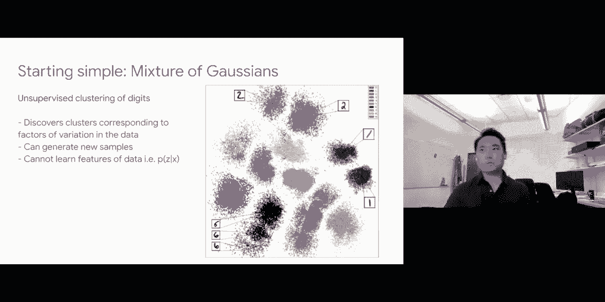

so gaussian mixture is actually uh，motivate，va is actually an extension of these。

gaussian mixtures where instead of，defining，instead of defining these uh the p of x。

given z as these simple gaussians with，like a simple，a single mean and a single variance。

we're actually trying to learn，the means and variances of these uh，gaussian distributions。

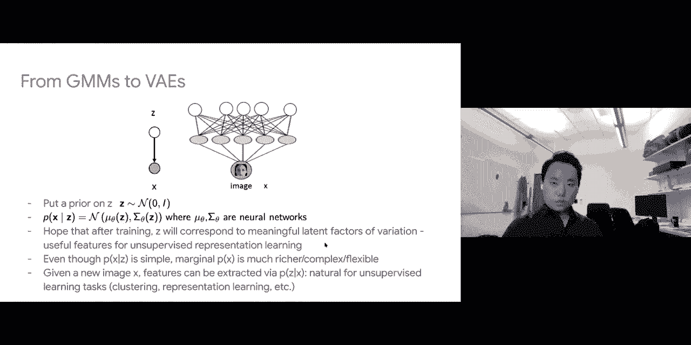

so how do we actually learn these，so again we're going to start with a，joint distribution p。

of x and z and we're usually given a，data set d，where for each data point we only。

observe the x variables we will call，this pager network，x is the shader variable that you。

observe and the z latent variables are，so how can we learn what disease and。

what these parameters should be，so as usual we're going to do a maximum，likelihood estimation。

we're going to try to maximize p of x，for x across your data set now we're，going to take log because。

taking log allows us to transform this，product into a sum，over logs so this is in general any。

model that you have，with some parameters you're going to try。

to learn these parameters data such that，they best fit the data。

that's like a good estimation so now you，have this term your summation of your，data points。

and you're going to take the log，likelihood of each data point。

and we know that we have this structure，have both，x and z so how can we bring z into the，picture。

well what you can do is you're going to，take a instead of just modeling p of x。

you're going to model a joint，distribution between p of x and z。

and to go from a joint back to your x，you're just going to marginalize by，summing over z。

that allows you to incorporate both x，but what we're going to realize is that，this summation over z。

is highly intractable so if c was binary，with just，30 dimensions we have to sum over all 2，to the 30。

terms of z taking on each particular，configuration，integral，over all possible values of z is also。

very difficult and you're not going to，get a close form solution。

so soon you realize that you know while，you want to use neural networks to learn，this。

variational auto encoders we're going to，run into a lot of troubles especially。

when you try to model this high，dimensional data with also high，dimensional。

latent representations so the key here，is that we need，cheaper approximations to actually be。

able to optimize for these，so um for the next few slides i'm going。

to kind of re-derive i'm going to derive，the training process the approximate。

training process or variational，encoder i think variational and quantum。

encoders have been here for a long time，but it's still pretty important。

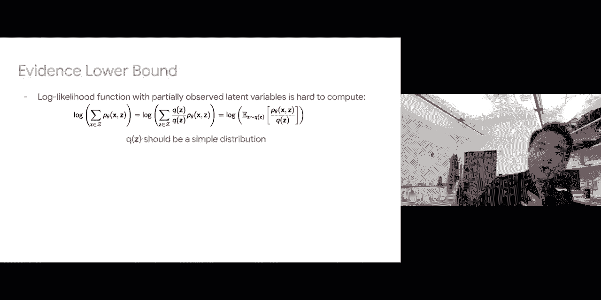

to know how these things are derived，because these derivation techniques are。

useful not just for variational auto，encoders。

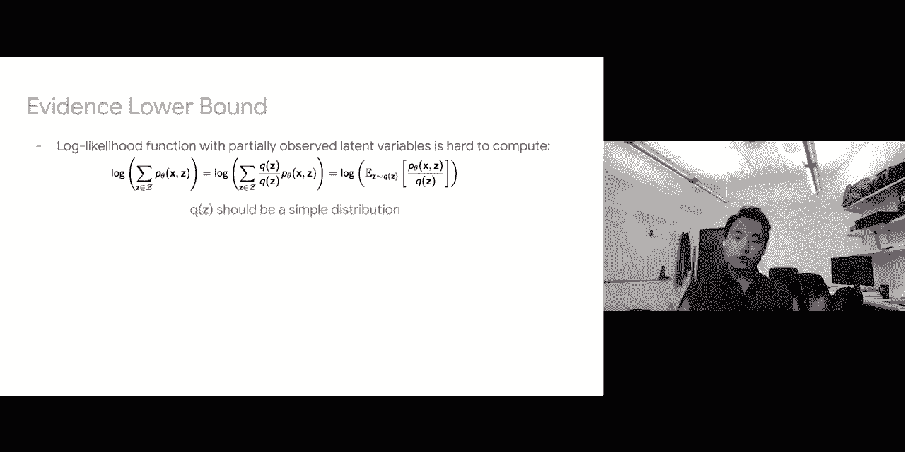

but in general useful for many，approximate influence methods，so here's what we can do so again we're。

going to start with a log，of your joint we know that this joint。

this summation over z is very difficult，to compute，so instead what we're going to do is。

we're going to introduce a q of c，at the top and q of c at the bottom so。

these will cancel the ones so i can just，multiply this inside，why is this useful so by taking。

summation over z weighted by q of z，that basically converts to an，expectation over z。

uh expectation over z of what what's，left over inside is，your joint divided by q of z so why do。

you want to do this so，intuitively you want to choose q of z，which is a what usually called proposal。

distribution，you want q of z to be simpler we know，that you know your joint distribution is，complex。

um your ps are complex but i'm going to，choose q to be a simple distribution。

and allowing me to comp a simple，distribution that actually allows me to，sample z。

from p of z and compute this expectation，using uh，so right now we're still not there yet。

uh usually you want expectation to be，right on the outside，so that you can actually uh convert this。

expectation into，an empirical average but we have a log，on the outside。

so what can we do so we're going to use，a jensen's inequality。

genesis inequality basically states that。

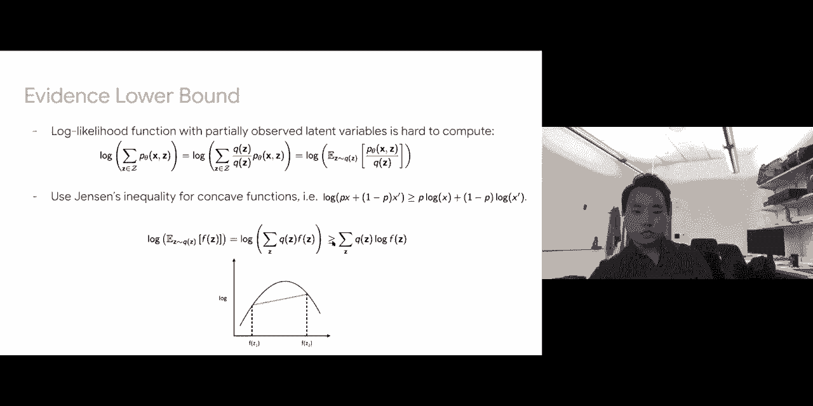

if you have a concave function，which looks like this so for concave。

functions what it means is that you just。

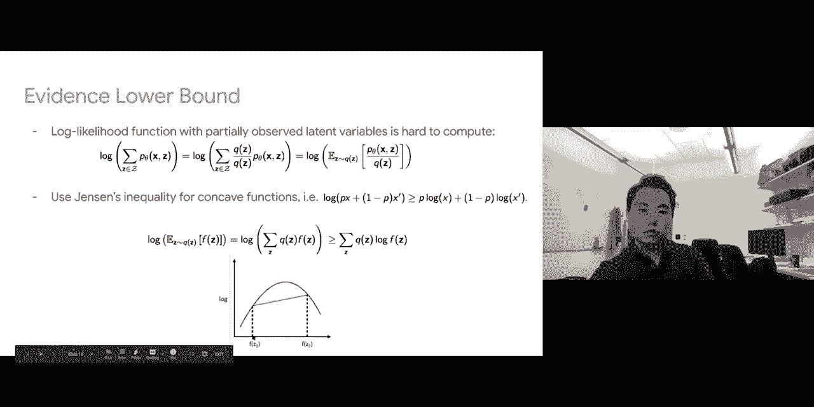

take two points，and draw a line between them the value，of the function。

lies above that of the line right so，log is concave because log essentially。

looks like this without it，dropping down so jensen's inequality，basically states that if you have a。

concave function，log of the expectations at least the，so we're going to apply jesus inequality。

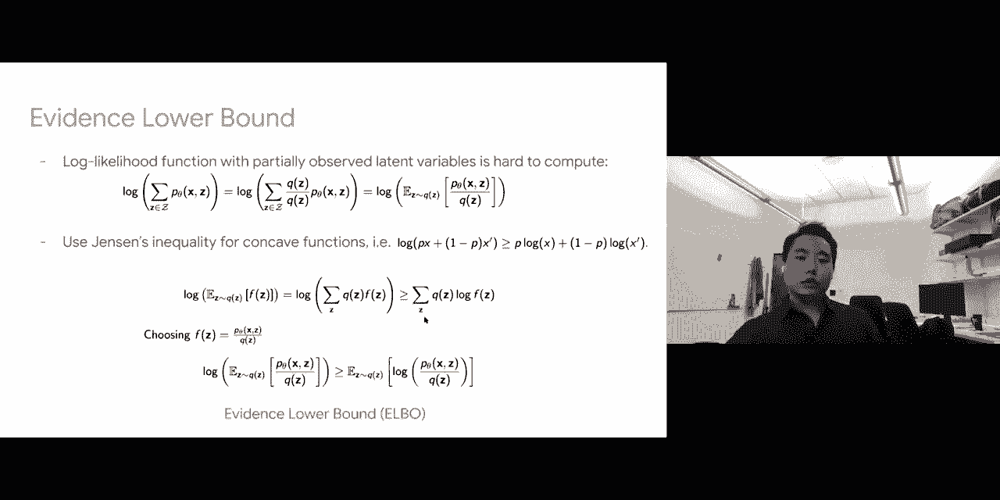

here and change our log of the，expectation，to be at least an expectation over the。

log and this is already starting to look，better why，because right now we have an expectation。

on the outside and we know that if，q of z is chosen well if q of z is more，simple to evaluate。

i can actually sample z from q of z，evaluate what's on the inside and then，convert my expectation。

to an empirical average and we know that，if we take enough samples we can。

if you take enough samples this。

empirical average will actually，be a very good estimate of the true。

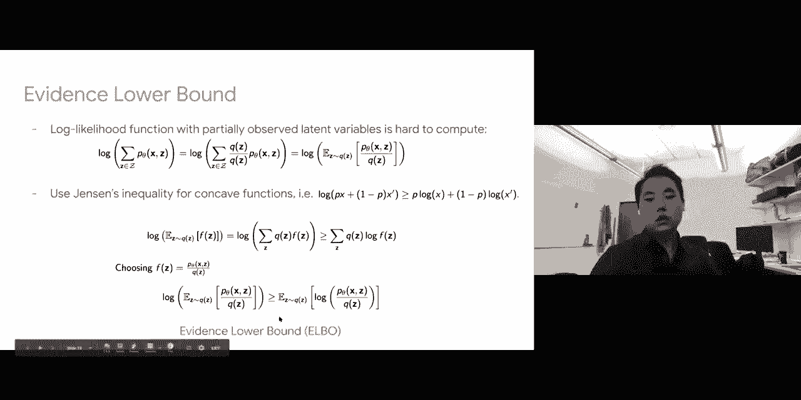

expectation，so this inequality here is called the，evidence lower bond。

in particular this uh this term on the，right hand side is called the evidence。

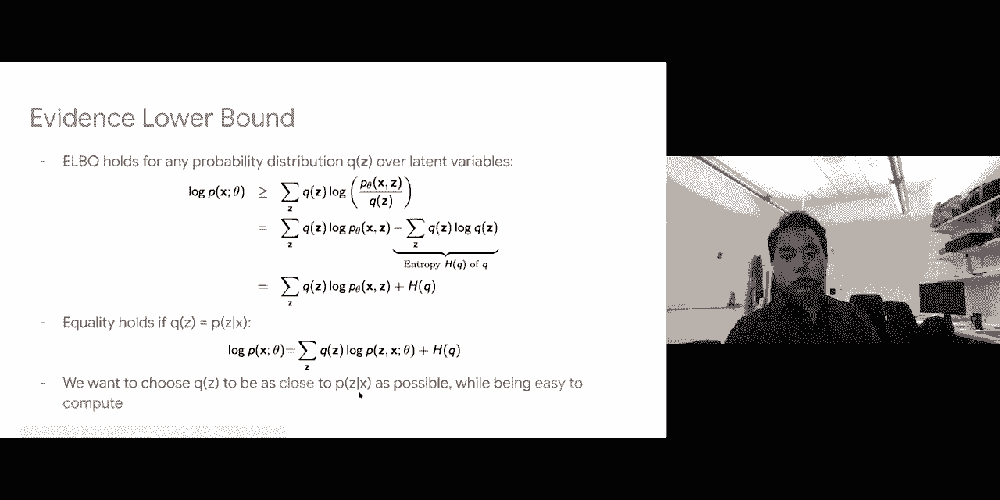

so again what we started off was we had，this data。

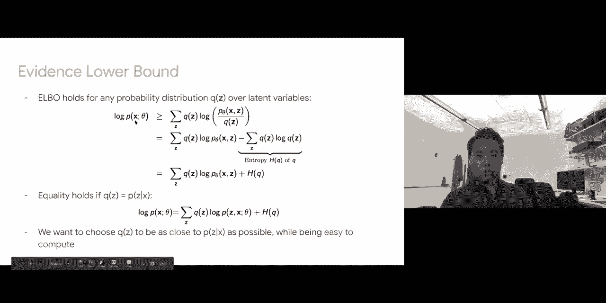

log likelihood which is what we want we，care about，this is really difficult to compute and。

i was able to introduce this uh，proposal distribution q of z that allows。

me to derive this evidence for about，which，at least we're starting to get an easier。

way to compute it，and this evidence lower bound actually，falls for any probability distribution。

so this evidence lower bound you're，going to start with your data log，likelihood。

is at least this amount if you look at，this a bit more，it's actually equal to the expectation。

over q log of your joint，i'm going to move this log of q to the，outside minus the entropy。

of q so entropy is a terminal，information theory，that reads that quantifies how much。

randomness there is in this distribution，so intuitively uh if q of z was uniform，over z。

that would have the highest entropy with，the most randomness，a gaussian because its peak at its mean。

would have lower entropy as compared to，a uniform distribution，and you know what would have least。

entropy would be something like a delta，distribution that is just。

deterministic at a single point with，so you know that this evidence lower。

bound holds for any probability，distribution of q，over by lateral variables and。

equality actually votes if q of z is，exactly equals to，p of z given x by posterior and that。

makes sense right，for jensen's inequality all he。

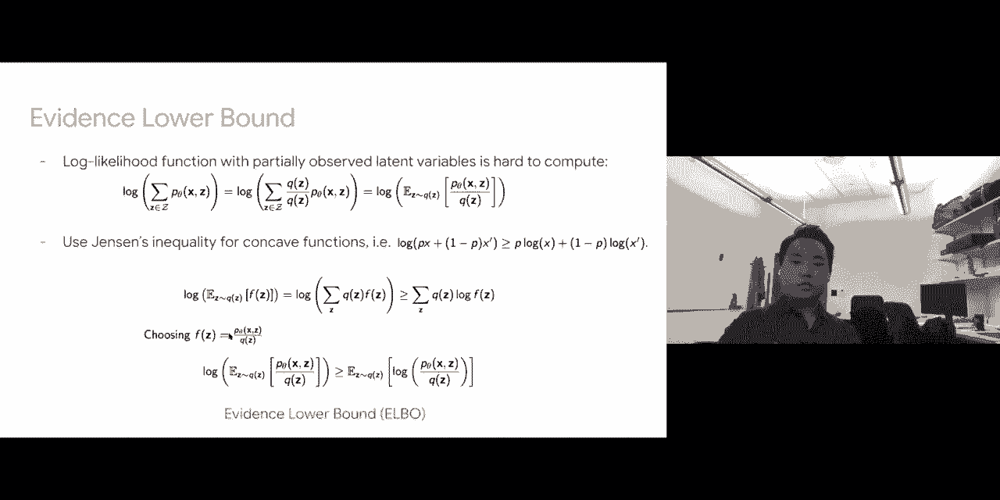

essentially did was that uh。

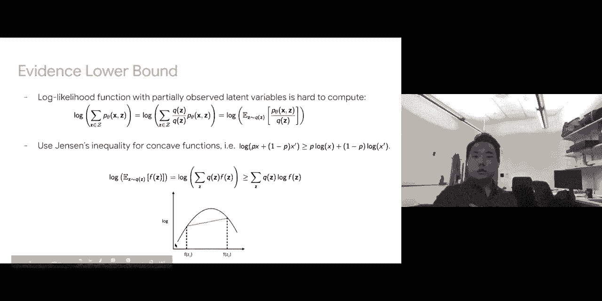

if if the if the concave if this concave，function was exactly equal to the line。

then they'll be equal this would be，equality，and similarly if q of z is exactly equal，to your p。

you will get equality you will be able，to exactly compute，your log likelihood of your data using。

this term，but of course in practice we know that p，of c given x。

is really difficult to compute and we，p，or z given x as possible for being easy，to compute。

so in practice we can never hope to have，equality，and optimize the data log likelihood，exactly。

but instead we're going to try to choose。

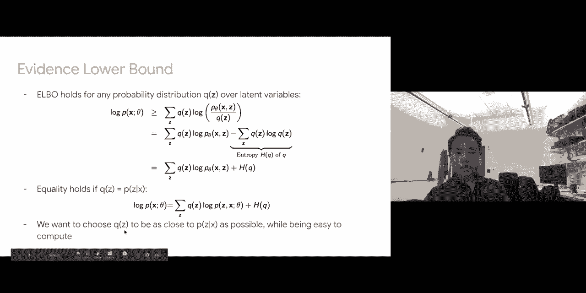

qrz to make the evidence lower bound，which is a lower bound，cured data log likelihood i want to make。

this lower bound as tight as possible，so that i might by maximizing this。

evidence lower bound i can also，approximately maximize my data log，likelihood。

so i want to choose q of z to be as，close to p or zero and x as possible，for being easier to compute。

so this term is quite big what does it，mean for a distribution queue to be。

close to a distribution key and，there actually are methods in statistics，that allows us to。

quantify how those two distributions are，to each other，and one thing that is most useful here。

is kl divergence，so this kr divergence is exactly uh one，one type of divergence in a class of。

many divergences that allows you to，estimate，the divergence between two distributions。

so here are divergence is given as，follows so，the care that we're just between q and p。

is given by an expectation over q，log of q over p so this integral over q。

d d z is exactly the expectation over q，and this term inside will be log of q，over t。

so first notice that this kl diverges，more symmetric，the kr between q and p is not the same。

as kl between，p and q so then you might ask why do we，want the ko between q and p。

and not the kl between p and q well，again it goes back to the fact that if。

you have a chao between q and p，you can compute it as an expectation，over q。

and something here and the expectation，over q is something that we can actually，approximate。

if q is simple enough by taking samples，from from q and taking the empirical，average。

if i had decay between p and q instead，then i'll be taking expectation over p，with。

p is a really difficult data log like，liquid function that we do not know how，to compute。

so by taking care between q and p we are，actually able to choose q to be simple。

and therefore be able to compute the，expectation over q，more realistically。

so if you look closer at this ko，divergence uh just because it's an，expectation over q。

let's take a look at you know what sorts，of cases will make this k are large and。

what sorts will make it small，so you know there's an expectation over，q so if q is small。

then this first term is going to be low，you're going to be weighting it by a，small value of q。

and that means you don't really care，what the time behind it is just because，you know q。

is linear is a linear term and log of，so，as this is small it doesn't really。

matter what this is it's going to be，dominated by this small q of z。

so if q is low then we don't care uh，so we really care about the cases where。

q is hot we're taking expectations，over regions where q is high so if q is。

high then this is going to be high，and basically i want to i want to learn。

i need this p to be high as well so that，this term is close to 1。

and log of one is going to be zero so，that that will incur a small loss。

2 to my kl on the other hand if q，is high and p is low you're going to。

take a large value divided by a really，small value，this is going to be huge and that's when。

you pay a price，if q is higher p is lower that's when，you have to pay a price and incur a。

large amount of costs，is you know，if i have p again p is a really complex，distribution。

it's uh defined by your data you might，have multiple modes corresponding to，high dimensional images。

you can't call pyps you're going to，define a simpler distribution q。

if q is low so in these regions q is low，uh we don't care what p is and for，regions where q is high。

i want to make sure that q matches p，almost exactly，that's where you can minimize and get a，small。

so note that for this kr divergence to，be defined，as you've been seeing here like the。

support the support which is you know，the values of z，over which q and p are defined the。

support is really important，in this case just because p is on the。

denominator whatever p so wherever q is，bigger than zero it must also be that。

p is at least zero otherwise you'll be，dividing by zero here，so what a kl would encourage you to do。

is i know for a very，complex multimodal distribution p i'm，going to try to find the q values。

covers some higher areas of p and you，might miss。

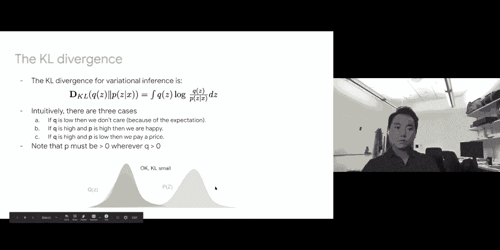

other areas of high p。

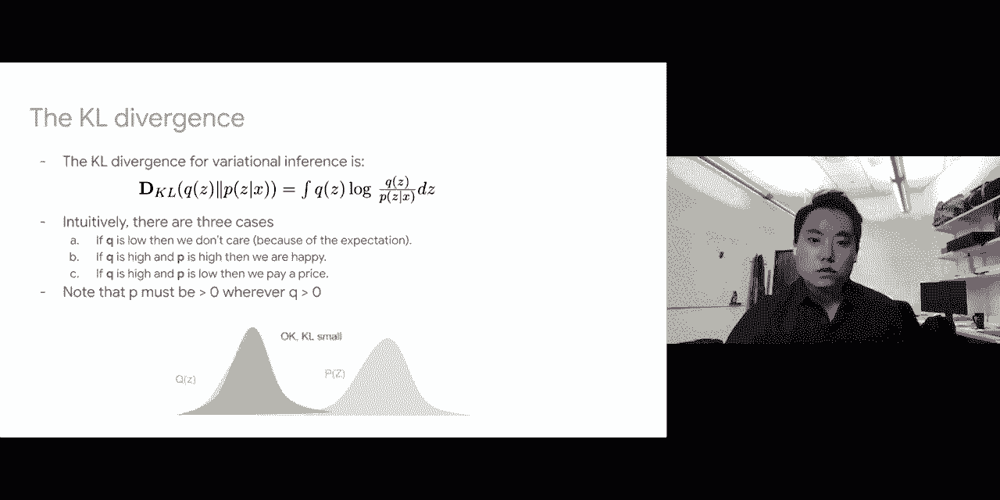

so this ko divergence is actually really，because，uh you can actually rearrange these ko。

divergence and actually，obtain the evidence lower bound exactly，plus the log likelihood of the data。

and there's no coincidence here there's，no coincidence why i chose to introduce，a kr divergence。

as a distance between distributions，because that's exactly the term that，will appear。

in deriving these evidence lower bounds，so kl is exactly equal to the average，lower bound。

plus the log likelihood of theta and，another property of kr divergence，because it's a distance。

that the properties that is non-negative，so rearranging we can actually rederive。

the evidence lower about just starting，from the kr diverges as well。

so the log likelihood of the data is，again at most，it is at least the expectation of a q。

log of your joint，plus the entropy of q，and again equality holds if q equals to，p。

because the kl between q and p if q，and p are exactly the same is equal to，zero。

instead of at least zero which means，that the log likelihood of the data is，exactly equals to。

the expectation over q log of your joint，plus your entropy，and that's not just the best part the。

best part is that this ko divergence not，exactly gives us a gap it tells us。

exactly tells us the gap between this，evidence lower bound，and the log likelihood of your data and。

that allows us to exactly quantify how，well our chosen q distribution is。

now so the closer our chosen q is to p，as measured by the kl the closer。

evidence lower bound is to the true log，true likelihood and again that。

reinforces the fact that we want to，choose a queue that is as close as p as，possible。

while making sure that q is simple，enough to sample from so you can，eventually compute all these。

expectations。

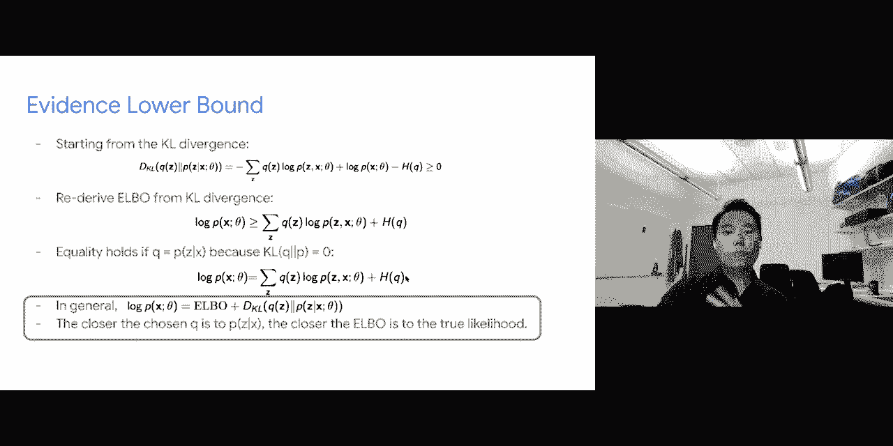

and that is essentially the basis of，variational inputs，you're starting with this very complex。

distribution uh p，p of z given x that's your posterior and，you might have multiple modes。

and that's shown in blue and you're，going to define these uh，these tractable variational。

distributions q of z，with some parameters phi these are your，variational parameters。

and you want to try to learn these，variational parameters such that qlc。

fits this p of c q and x as best as，possible，so in this case let's just assume that p。

of c given analysis is complex，multimodal distribution don't you kind，of write a closed form from it。

you obviously can't sample from it you，can't really compute anything but what，you can do is you can。

you can define these variational，distributions q，just as simple gaussians you know simple。

gaussians with uh with，a parameter for its mean and a parameter，for its variance。

so in orange here is a gaussian with you，know parameters，uh mean two variance two and another。

gaussian here with b negative four and。

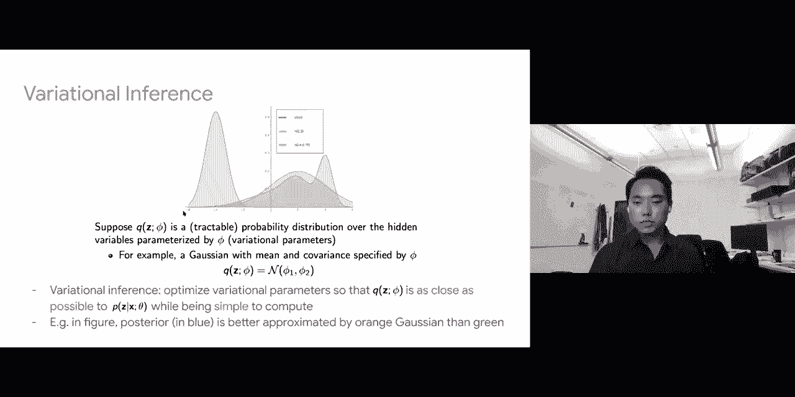

variance 0。75，and the whole variational influence is，to want is that you want to。

optimize these variations of parameters，high so that your q of z is as close as。

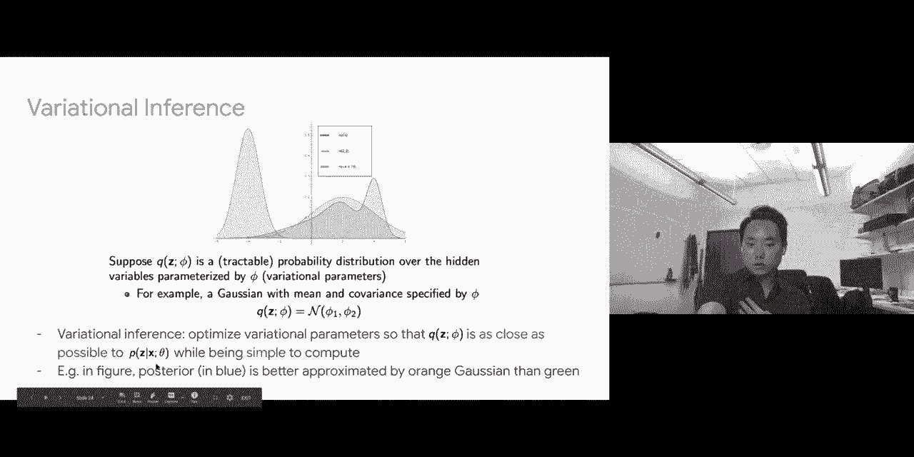

possible to your p or z given x。

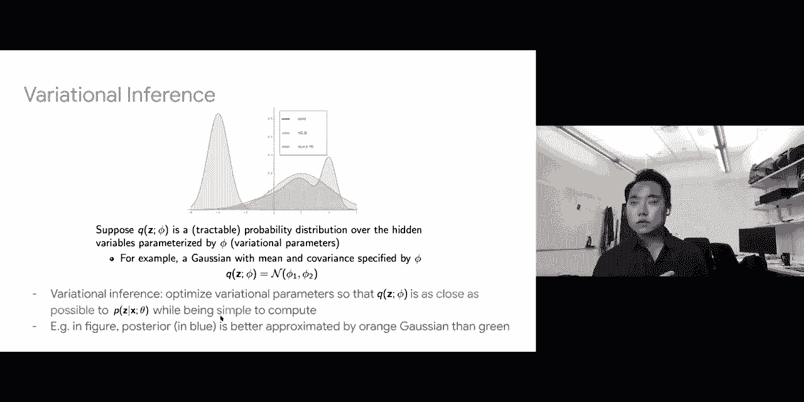

so in this case no uh so in this case，this posterior，your p is better approximated by this。

orange calcium，it's orient uh this orange variational，distribution。

than the green one so there's going to，be a smaller kl between，and，this p that is the whole basis of。

so now we've turned it into an，optimization problem，where five is all possible settings of。

your variational parameters，and for each set of for each particular。

set of variational parameters phi，that's going to define your average，lower bound in red。

at the same time it's also going to，define a kl divergence，between q of z as given by a variational。

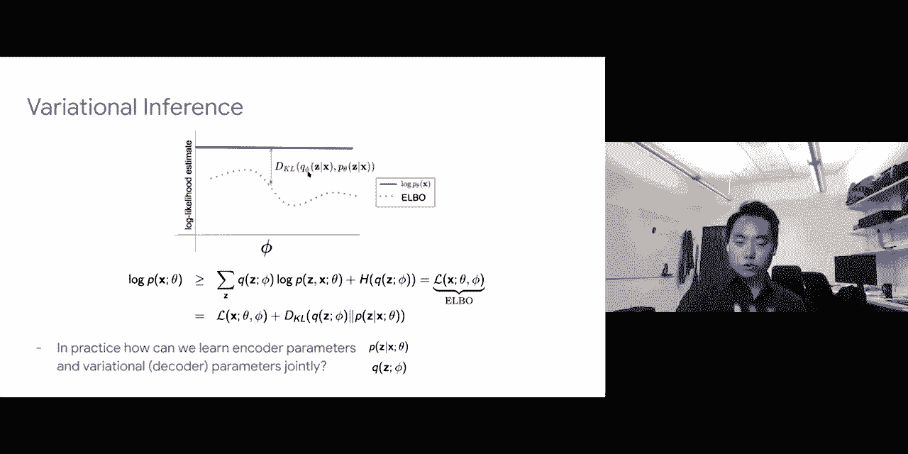

parameters，and your actual posterior。

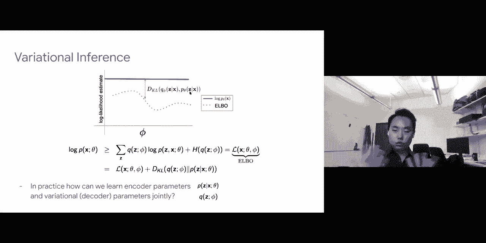

which is hard to compute，and with respect to phi the log，likelihood of the data is actually。

constant so multiplying over data，depends on theta but，with respect to phi is actually constant。

so the goal here is to find，a good setting of these variational，parameters phi such that。

the kl divergence between your proposal，distribution q，and p is as low as possible and。

therefore your evidence lower bound is，as tight as possible，it's as tight of a lower bound as。

possible with respect to your data log，if it's as tight as possible that means，that optimizing this。

optimizing this evidence lower bound，will give you the best approximation to，actually optimizing。

so that is the the most important，relationship here to to divide。

variational autoencoders which is that，the log likelihood of the data is equal。

to the evidence lower bound，plus the kl between your variational。

distribution which is free for you to，choose，and the true posterior of the data which。

so in practice you want to be able to，learn，these variational parameters。

as well as these other parameters in。

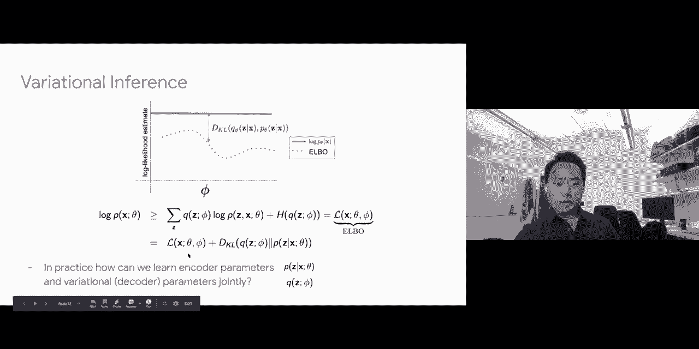

parabolas，so we're going to again go to the，evidence lower bound is something that。

we derived we know that this，is easier to compute as compared to the，true log likelihood of the data。

i'm going to rewrite this evidence lower，bound this way so again。

expectation over q log of your joint，and we used to have an entropy but the。

entropy is exactly equal to the，expectation over q log q that's the，definition of entropy。

i'm going to subtract log of p of z and，i'm going to add log of p，of z so recall what z is。

if you recall what p of z is so z is，your latent variables that you want to，learn。

your in your auto encoder and p of z is，just some prior that you're putting on，top of these。

these later variables so in the case，where z is continuous you would just。

put like a gaussian prior over your zs，so i'm going to subtract log plc i'm，going to add log p of z。

i'm going to group the first two terms，together uh so this joint minus log of。

the marginal is going to get，log q，of z under the expectation of q is。

exactly the kl divergence between your q，of z，and p of z so let's look at these two，terms um。

more in depth so the first term is，exactly a reconstruction term。

why is that so what this term does is，that no so well let's first look at each。

of these times in order so，p of x k 1 z essentially takes in z。

and i'm going to define some parameters，theta in practice these are neural，network parameters theta。

and i'm going to transform z into your，data x，this is your your generator the，generated model。

uh in auto encoders that's also kind of，known as a decoder that takes the。

actual generation data x my，q of z given x will take in x，and use parameters phi to reconstruct to。

actually predict which latent variables，correspond to that particular data point。

so that is the inference model，or also known as the encoder model in。

these auto encoders so what this term，looks like in total is that you're going，to first take x。

you're going to encode it using your，inference model and you're going to do。

it multiple times so that we can，approximate this expectation。

and once you have these latent variable，z i'm going to put it through my，my theta。

x that is this term and i want to make，sure the reconstruction of my theta x。

is as high as possible with respect to，log likelihood，so that is exactly reconstruction it。

encourages uh the predicted，values of x to be as similar to the。

as is the input values of x as possible，and the second term is actually a prior，so again uh。

this q function will take your data x，and encode it into a set of latent，variables。

i want to make sure that the set of，latent variables that i'm encoding using，my data。

is as close as possible to my prior over，z and my pi over z is this，is a gaussian distribution so it。

encourages this set of，predicted latent variables through the，inference model。

to be as close as possible to the，product，so all this derivation allows us to to，to get the elbow。

which you know that is a good，approximation for the true data log，data likelihood and this elbow can。

actually be decomposed to a，reconstruction term，through an autoencoder so first。

inferring the latent variables，from x and generating data from x。

and making sure that x is a highlight，log likelihood，as well as a prior term which makes sure。

that you're given a bunch of samples，x the latent variables that you encode。

follow a similar distribution to this。

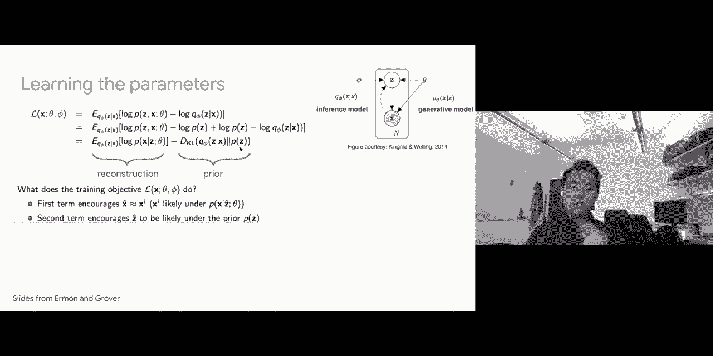

prior that you want these later，so that's exactly the uh the autoencoder。

perspective this is usually what，people just present uh if they wanted to。

explain to you variational order，encoders really quickly，but all we did in the last 30 minutes。

was basically a derivation of why。

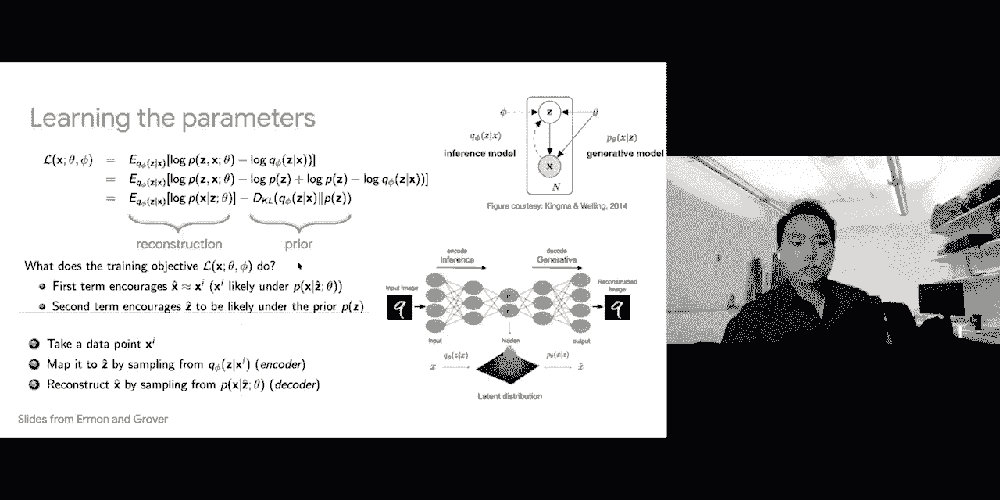

y variation order encoders exhibits a，so now we know that so now we know that。

we have this reconstruction laws and，this prior loss that allows us to learn。

these variation auto encoders，but in practice uh because we want to do。

gradient-based learning and combine it，with neural networks，it's actually a trick here it's not as。

trivial as，so why is that so we need to compute two，sets of gradients again we have two sets。

of parameters one is a theta one is five，so we call here uh theta。

is the parameters regenerative model，from latent representations to a data。

that phi is the inference model from x，to your later variables。

so there's two sets of parameters they。

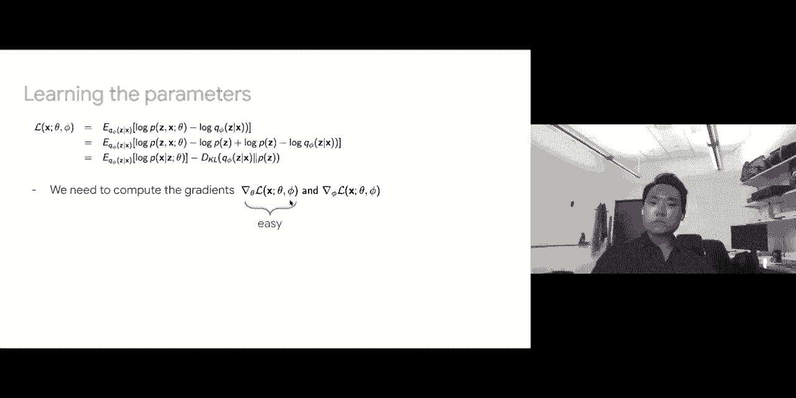

want to optimize for theta and phi，so to do that we want to be able to take，gradients of this。

loss function with respect to theta and，phi so the greatest resistance of theta，is easy。

why is that i can just write it out，a lot of the losses here is the，expectation of the q。

log of p of x given z minus the kl the，kl term does not depend on theta it only。

depends on 5 so that goes away，and this term in front here this，expectation is with respect to phi。

again that doesn't depend on theta so i，can move my theta into the expectation。

and this p of x given z which is the，the d coordinate part of the model that，takes the outputs x。

that is the part that actually depends，so what i can do is that i can replace，my expectation。

over my q's with just a sample，so i'm going to take n samples i'm going。

to take n samples of these latent，variables，c because this is what uh data variable。

c with respect to distribution of，of your queues with the distribution of。

your latent variables as given by qs，and for each of these related variables。

c i'm going to try to use it，to predict my data x with using my，parameters theta。

and i'm going to try to maximize the log，likelihood of being able to reconstruct。

data from these data variables，that came from distribution，corresponding to q。

so i can change this expectation over to，using a sample average，here。

where you want to take also we want to，take expectations with respect to phi。

so what happens here is that we know，that this，uh this evidence lower bound actually。

contains expectations with respect to，phi，so you can no longer push the gradient，with respect to phi。

through the expectation and take samples，from it just because this expectation。

depends on phi so what are we going to，do here，we're going to use this thing called the。

reparameterization trick，which is a very common trick it's very，important in these generative models。

in this simple setting again you want to，compute a gradient with respect to phi。

of some expectation over q which depends，on phi，and some value r so you don't really。

care about what value this is on the，inside，so this is equal to an integral over z。

uh the probability the q of z which is，the probability of z，that depends on phi and the value of r。

evaluated at z where z is some，so what can we do so let's just assume。

because you know in our settings，uh our qrc are just gaussians，assume that c is an inverse simpler。

gaussian a gaussian with just，a mean parameter and a variance。

parameter so this gaussian doesn't even，actually，depend on your x so it's just not a。

fixed or just two sets of parameters，that mean and variance，this q。

of z so that we can approximate this，expectation so one way of sampling is to。

just directly define this gaussian，between，this variance sigma square and sample。

this entire vector z，another way of doing so is to just，sample a single noise vector。

so epsilon from a standard calcium and，once you have an，epsilon from standard gaussian you can。

actually put this epsilon through a，linear transformation，by multiplying it with sigma and adding。

blue，and that actually gives you z with the，exact same distribution that you want。

just by just because you have uh the，property of linearity of。

gaussians so that is also an equivalent，way of sampling z，that also allows you to sample z。

according to this distribution but，instead you're not sampling z directly。

you're just sampling epsilon from the，so i'm going to call this linear。

transformation g it depends on epsilon，and also，phi because in this case phi is this in。

a sigma parameter，so this way of sampling and，reparametrizing is actually the key of。

that will allow us to compute these，expectations so normally you have an。

expectation that requires you to sample，z from q of z，times r of x instead of sampling z。

directly i'm going to replace it，with sampling these uh standard unit，gaussians。

from standard normals and once i sample，in epsilon，i'm going to apply this epsilon through。

my linear transformation，to actually get the z vector which is。

from the same distribution that i want，and then i'm going to put this z through。

whatever r of z that i care about，and what that looks like is that look，like an integral over。

p of epsilon because it's sampling these，epsilons，and once you have an epsilon you're。

going to run it through this linear，transformation and actually apply。

r and z that you get from putting it，through this linear transformation。

so what's the benefit of that benefit，there is that if you now want to take。

an expectation with respect to phi，you're going to convert it to an，expectation。

over epsilon your function inside and，now this expectation over epsilon。

no longer depends on phi so you can move，your gradient with respect to phi。

into the expectation and it's only this，thing inside the expectation。

the function r and g that you cannot，find，so this term is not really easy to，estimate by multicolumn。

uh there's a couple of things that you，need first of all you need epsilon to be，easy to sample from。

and in our case epsilon is really easy，absolutely just standard normal you can。

sample from that very easily you also，need your uh your r，and g functions to be differentiable，that。

so in this case you know your phi is，just uh，your g is actually just a linear。

function with respect to，to your b your mean and sigma so that's，differentiable with respect to。

your parameters and your r function you，also have to assume that。

whatever operation you do with z on top，of it is also differentiable with，respect to。

your parameters phi and we have that as，well because we're working with these。

differentiable neural networks，and all these linear transformations and，activation functions are。

differentiable with respect to these，variation values，so then what you would get is that you。

would just sample noise multiple times，understand it normal，whenever you sample the noise i'm going。

to put it through the transformation，defined by these variational parameters，essentially。

multiplier by sigma at the mean to get，the z，and then i'm going to put z through my。

the function that i care about，that's going to give me a bunch of。

samples i can now take the gradients，with respect to 5 because it's，differentiable。

and i can take an average across as many，of these k。

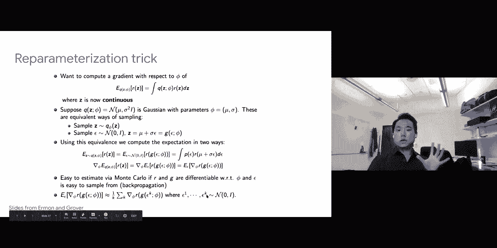

samples as i would to approximate my，so in our case we can do that as well so。

again we have this evidence lower bound，which is equal to an expectation over q。

log of p of x given z minus the kl we're，going to just look at the first term for。

now the kr is going to be，basically the same uh so again we're，going to change the expectation with。

respect to qr5，to an expectation over epsilon and，whenever i sample this epsilon vector。

i'm going to transform it by multiplying，by sigma and adding，new to it to actually get my z vector。

and now because of this expectation over，epsilon that does not depend on phi。

i can move my equation with respect to，phi inside the expectation。

so i'll get an expectation over my my，standard gaussian samples。

uh a greater with respect to phi and a，and therefore you can also approximate，this using multiple。

uh samples of noise computing this inner，term and computing，uh an average over that。

so visually what that looks like is that，you know you started with x，your q。

of z given x uh to encode x to z you，also need your variation of parameters，phi。

you know a naive method would be to，encode we need to learn this。

distribution q of z given x and pi and，then once you learn this distribution。

sample entire vector z so z is actually，a random node，and once you sample a vector z you're。

going to go on to your，subsequent functions essentially going。

from data variables back to your inputs。

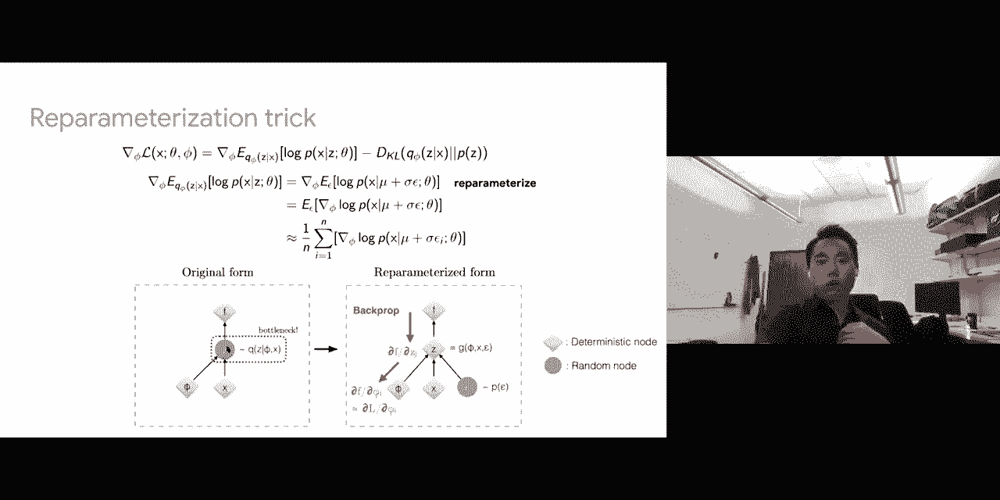

but then you will not be able to back，propagate your loss here，over to your variation of parameters。

because you have a red，you have a random node stuck in the，middle which creates a bottleneck。

because you can't really back propagate，through like a random sample。

so what re-parametrization does is that，is that it just samples a single epsilon。

so this is where your randomness is，with this single sample epsilon we're。

going to transform it according to a，variation of parameters to get。

c uh and then you go to you also put x，so this is your your encoding function，basically takes an x。

it learns uh your mean and variance，using your parameters phi。

and then you're going to transform your，your random vectors，epsilon according to this linear。

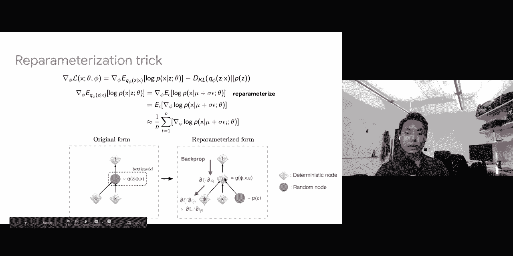

variance to actually get z，so now z is the deterministic function，with respect to your variational。

parameters that give you your mean and，your variance so now that z is a，deterministic vector。

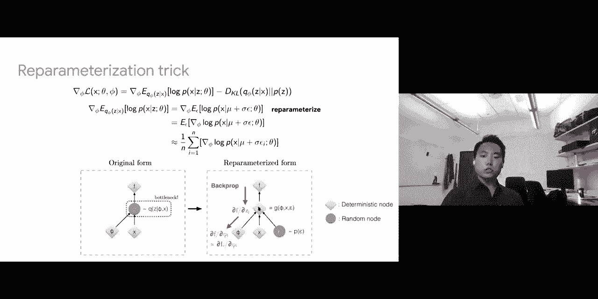

you can use that to decode your image，and define your loss function。

and you are able to graph propagate your，loss function with respect to z。

it's not deterministic and also with。

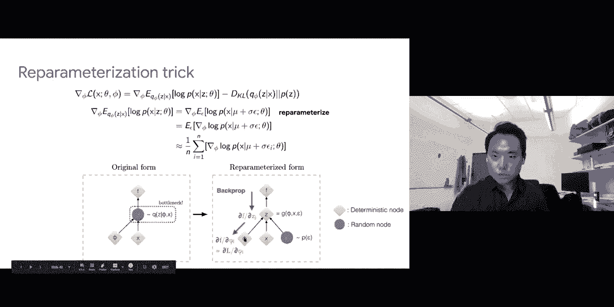

respect to your variational parameters，which actually which actually produced。

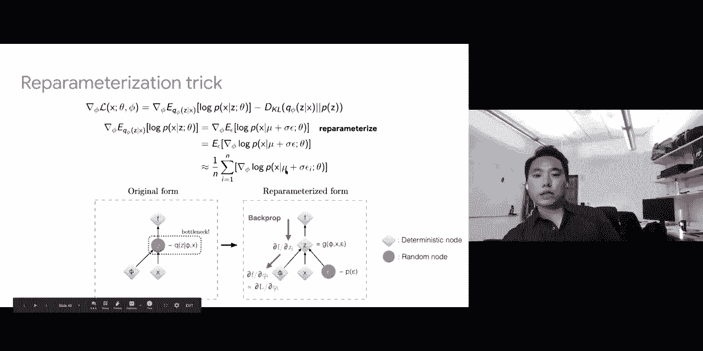

this mean and variance in the first。

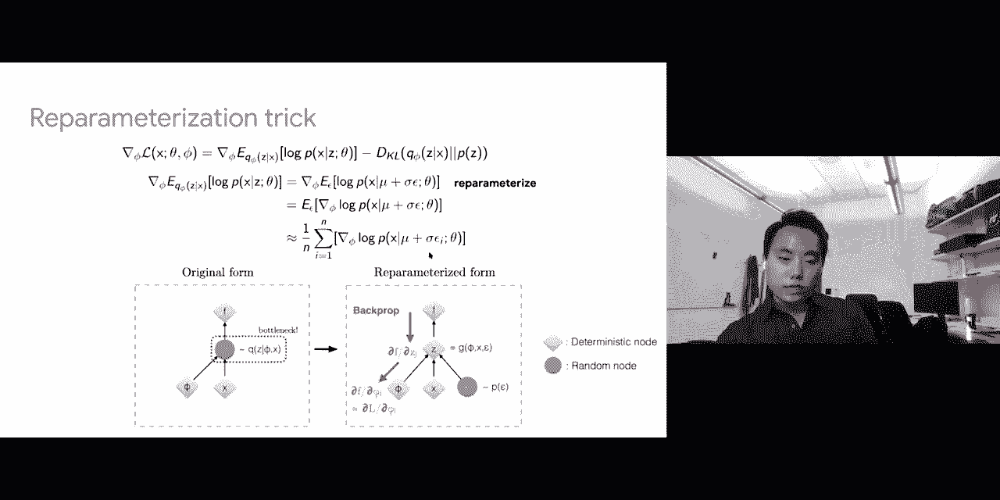

so that is the reparameterization trick，so，um so just to summarize you know we we。

started with this uh，this log-back figure of the data we saw，that that was not really tractable。

and we derived this uh evidence lower，about which is the lower bound to the。

actual true log vector of the data，and how good this lower bound was。

depends on this variational distribution，that you chose，right you want this variational。

distribution to be simple in practice，they're usually gaussians。

with mean and variance predicted by your，input data，uh so they're simple they're easy to。

sample from but in practice because，we're actually learning this mean and。

variance through your neural networks，they're actually very，expressive and they can also approximate。

your positive ribs and allowing you，a lot deriving this evidence lower bound。

allows you to optimize the two things，the first thing being this，reconstruction objective。

and the second thing being your prior，objective，so in overall how we actually learn a。

variation auto encoder，you will first take a data point x i，that's your input image。

i'm going to define my encoder，parameters，so a ql5 c given x i with parameters 5。

and that allows you to take in you know，get fit at x，i and actually output a mean and，variance。

that parameterizes q of z so q of z is，going to be a gaussian，with mean and variance parameters，an。

x through parameters five once you have，this linear variance parameter。

i'm going to first sample noise，epsilon from a standard normal and then，i'm going to compute。

the actual latent variable by a linear，transformation of this。

standard normal multiplied by sigma plus，mu，that's a re-parametrization trick which。

allows us to further，get gradients with respect to mu and，sigma and only leave the randomness at。

epsom，that allows us to get uh my actual，latent vector z hat，and then i'm going to put z hat through。

a decoder with parameters theta，to actually get the output to predict，the particular output。

and there's two losses one is a，reconstruction based loss，between the reconstructed image and the。

original image，this k，l term between your uh distribution，operating variables that you predicted。

using your encoder，that's q of y z given x and the actual，prior which you want these。

data variables to happen to have which，is your p of z，so yes so that is uh that is a full。

derivation of，variational audio encoders uh going，through variational reference。

again most textbooks or most most，lectures will just directly，give the autoencoder perspective talk。

about the reconstruction of the prior，but many of the techniques here。

involving variational inference，and kl divergence they're useful in many。

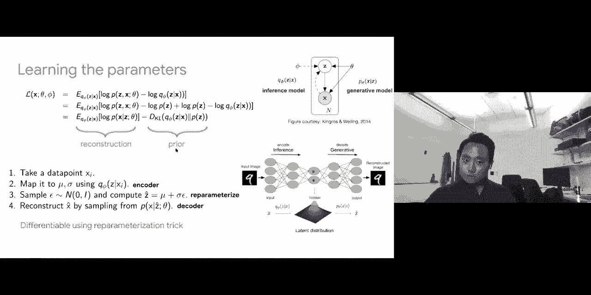

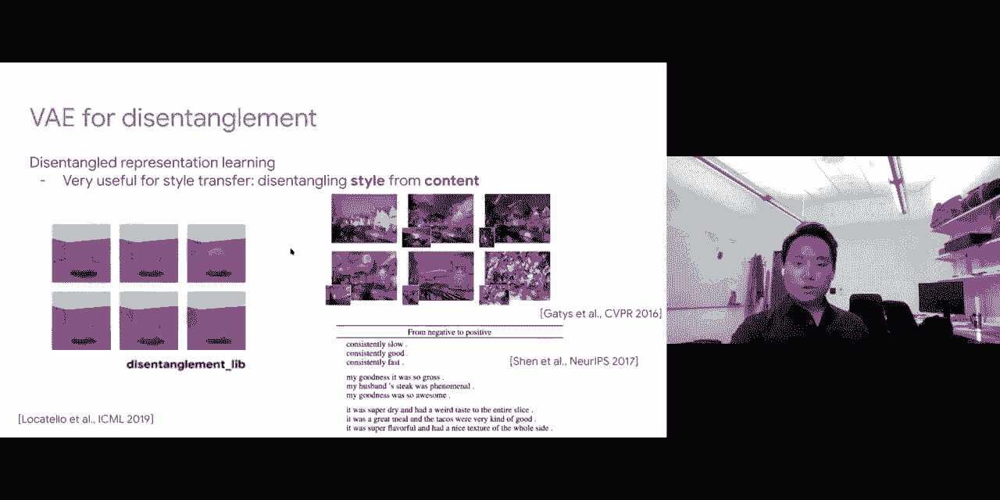

cool so now that we know what our，variational auto encoders are we can，talk about some of the。

applications of variation auto encoders，especially in these。

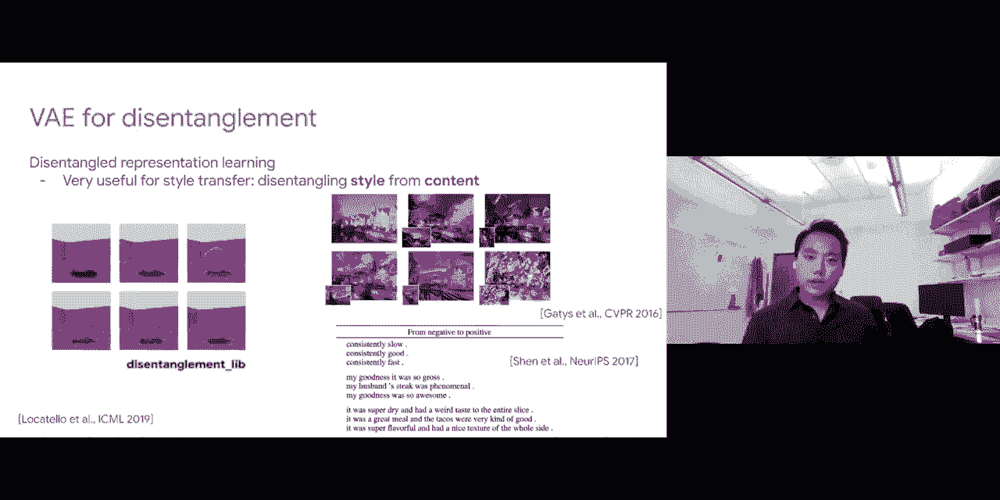

multimodal settings which we all care，about so i think，one thing at least in the unimodal。

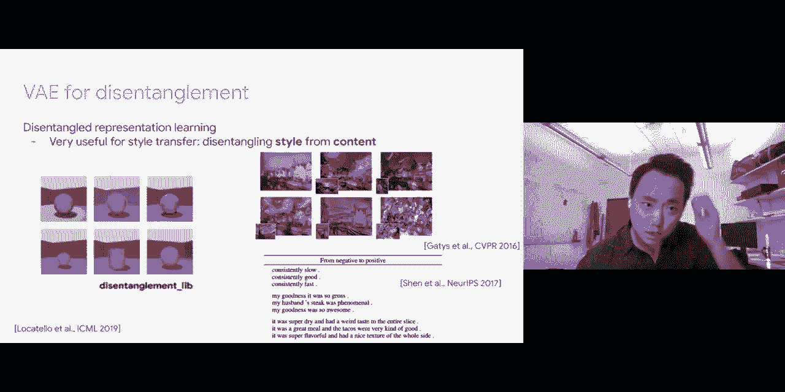

setting just to begin with that，one thing which variational auto。

encoders are really useful for is uh，learning disentangle representations so。

what this entangled representations are，is that you see，you have all these images uh and each of。

these videos and all these videos have，very specific factors of variation。

so in this case only the floor is，changing color in this case the。

background is changing color here the，circle is changing color。

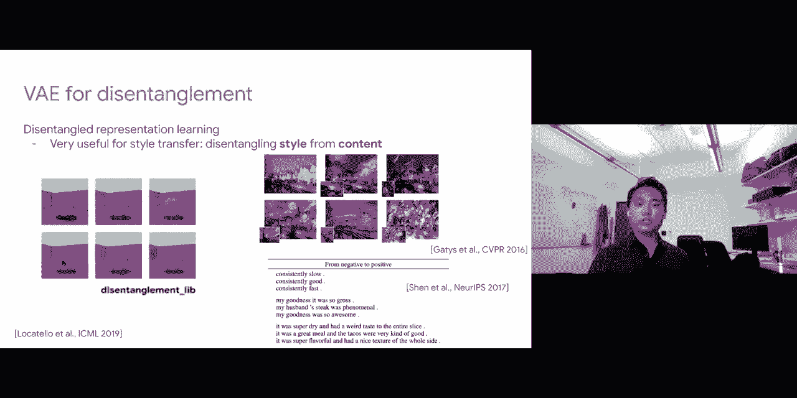

here the size of the circle is changing，increasing and decreasing，so ideally you want to learn a。

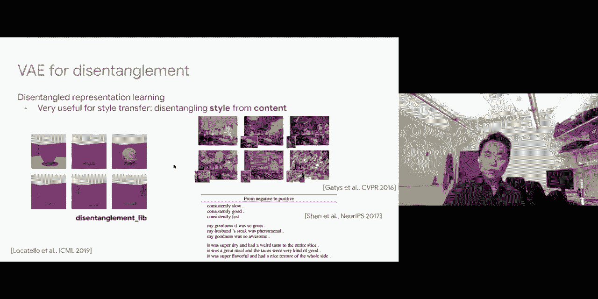

generative model that not just not，only generates these images but you can。

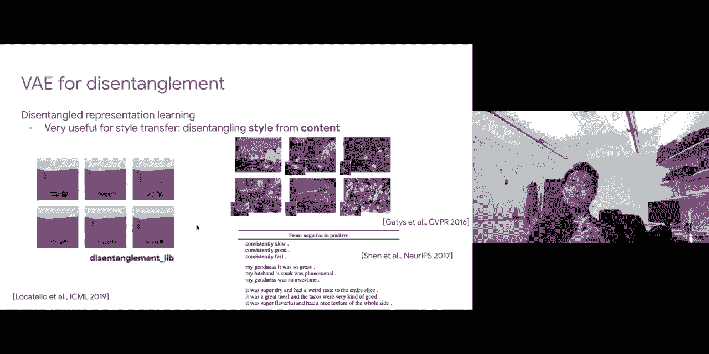

actually generate these images with，respect to these disentangle factors。

so you want to be able to learn these，factor representations one of them。

corresponding to the color of the ground。

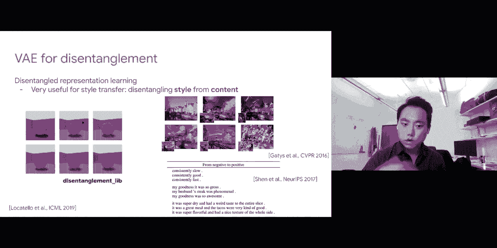

one of them corresponding to the color，of the background one of them。

corresponding to the color of the circle，so you can actually change interpret。

these different factors that your，traditional autoencoder has learned。

another motivation for uh for this tango，representation learning is that for star，transfer。

so again in star transfer recall that。

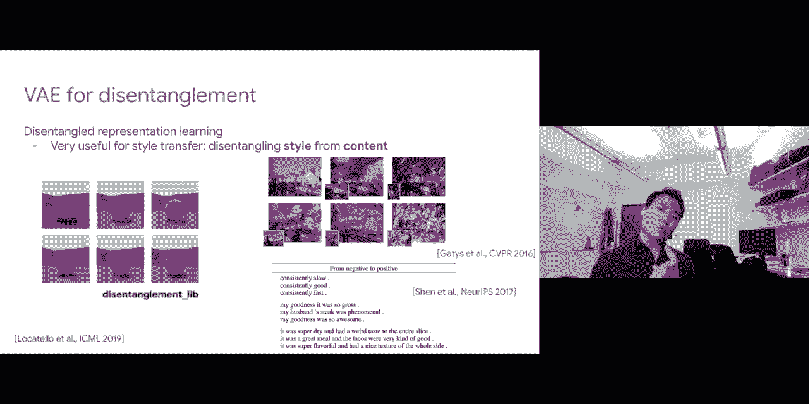

you're given a particular image with，some content and some initial style。

and your goal is to keep the content as，much as possible，so in this case the content of houses。

you want to make it you want to make。

sure you're still generating images and，houses but you're only changing the，style of it。

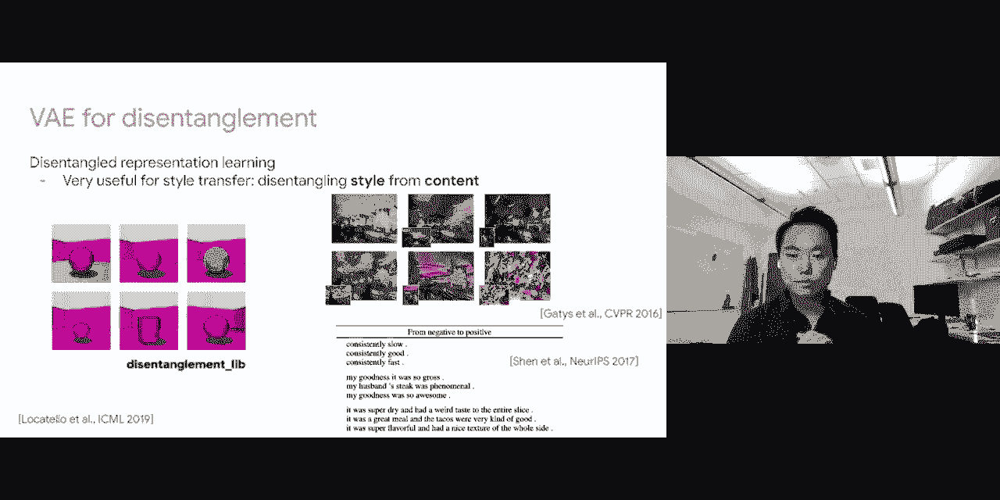

so essentially many of these generative，models for style transfer。

these representations are disentangled，into content variables and style，variables。

and then you can just manipulate the。

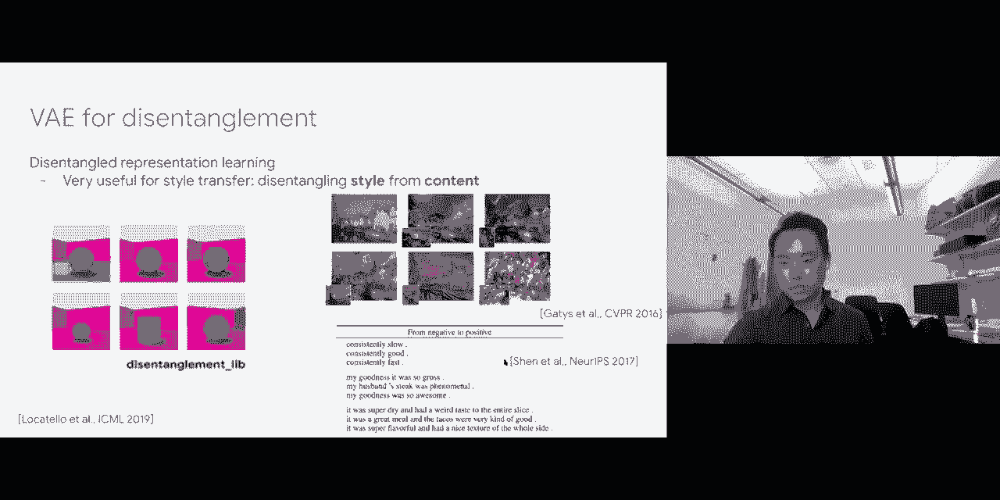

style while keeping content the same。

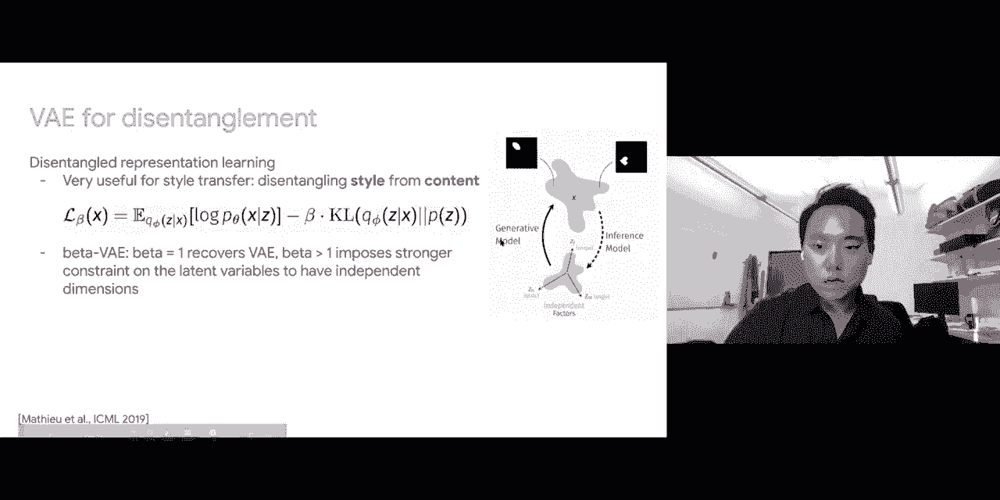

so how can we actually do this，entanglement using uh variation auto，encoders。

can actually do it very easily so again，uh you have this，traditional encoders once you derive the。

evidence lower bound you have this，reconstruction objective and you have，this chaotic。

that imposes the set of data variables，you learned，to be as close to the priority as。

possible so with，suitable choices of the prior and，suitable learning of the scale objective。

you can actually learn these later，variables，you can actually learn this distribution。

of your latent variables，z to follow this problem so，usually what people do is that we can。

put a p of z，as a standard gaussian and isotropic，gaussian，which essentially means that you know。

across different dimensions of z，there are no correlations and if you。

oppose this problem strong enough，what you're actually going to learn is a，independent。

from each other so in this case you want，to learn，uh one later variable that's。

representing shape independent from a，regulator variable that represents angle。

which is independent from another data，variable that represents scale。

so this other encoders naturally they，actually already learn，disentanglement just because we're。

imposing a prior which is this，angle well in practice you know people，have found that。

this set of beta vaes essentially having，a tunable parameter of beta。

in front of the kl uh is easier for this，entanglement so if beta equals to one，that actually covers。

your standard variation all the encoders，the evidence lower bound。

for larger values of beta are larger，than one you're actually tuning the。

contribution of your wrinkle structure，and your prior and larger betas imposes，a stronger constraint。

on the rate of variables to have，independent dimensions，so this is a very simple way of。

achieving disentanglement using，variational autoencoders，which itself is a very difficult problem。

we've seen like both positive，results for both text and uh，and images by the same time there's a。

bunch of negative results and also a，call for better benchmarks。

metrics to measure this entanglement so，feel free to look at all these papers。

if you you want to know uh better，methods beyond this beta va，and also better better metrics to。

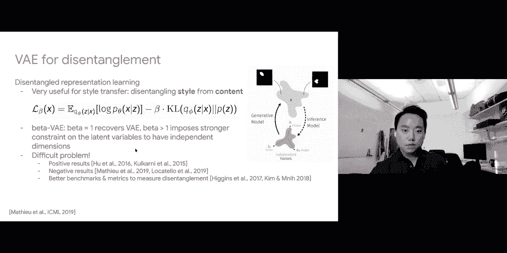

so one application of this entanglement，is actually that for，multimodal data so this is a paper。

from our group and the goal here is to，apply these variational autoencoders。

for multi-modal data with well with，careful design of these regular，variables。

so in these settings we're looking at，these uh these data these data were few，modalities so。

people speaking in front of the camera，with the text with uh，with gestures hand gestures facial。

gestures and also toner voice，and the idea here is that i want to。

learn two set of factors so one set of，factor is，a joint multimodal factor and this joint。

multimodal factor，i wanted to capture high-level，information across multiple modalities。

that correspond to things like sentiment，and emotions，so things like sentimental emotions are。

manifested in text，visual uh and also audio and they're，also used to predict the label。

so that's the goal of this multimodal，joint factor，and at the same time i also want to。

capture these uh，modality specific factors within each，modality so a language specific factor。

should model variations within language，different ways of saying the。

same the same sentence with a with the，same emotion and it also captures how。

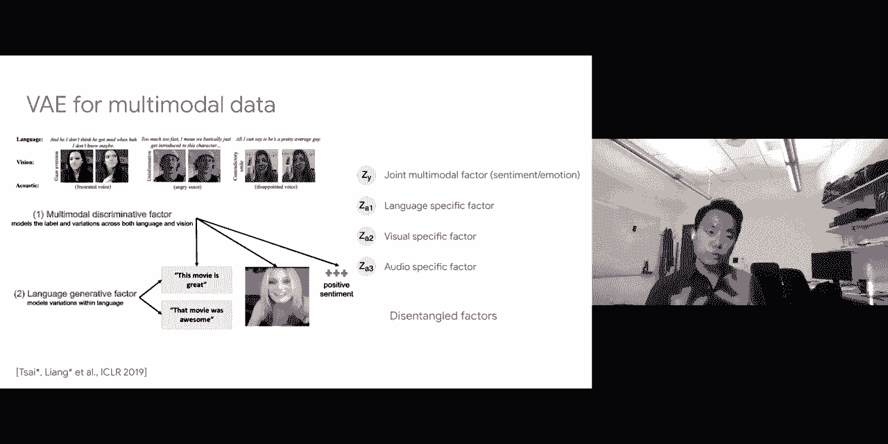

different people say the same things，with similar。

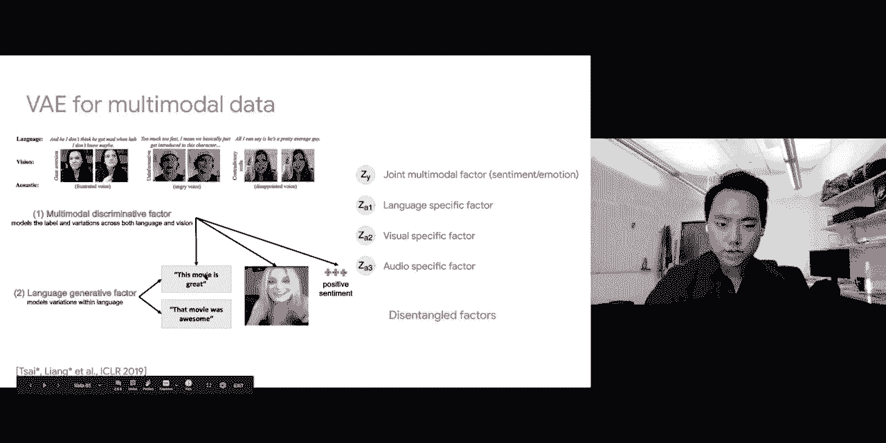

intents so there are models inside this，movie is great，so the goal here is also to learn these。

disentangle factors，a joint factor as well as these specific，factors for each modality。

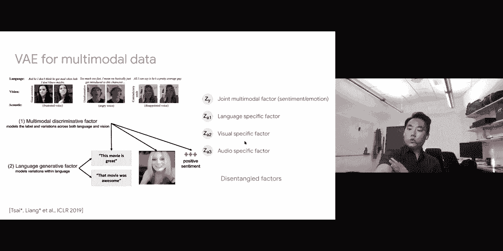

so we can do that using a variational，autoencoder we can again define。

a generative network that takes in these，latent variables and actually generates。

your data as well as an inference，network that actually that takes in your。

data and actually predicts these data，variables，this is also called the decoder that，decodes。

from your later variables to your data，your encoder which encodes data to your，later variables。

so what this graph here is showing is，basically you have a joint multimodal，factor that's your z。

of y and this multimodal factor is in，charge of predicting the labels。

you wanted to capture you know this，shared information across modalities。

that are useful for predicting the，labels so it should be able to generate，the labels。

at the same time this joint factor which，contains label information。

should also be able to generate your，data right you want uh，you want your factor representing your。

positive sentiment to，to actually affect the generation of，data from each modality。

to actually exhibit positive and these，modality specific factors you know for。

language visual and audio，they will not generate the label but。

instead they will just model variations，within each modality，so just generating within each modality。

so that one model station like when you，know your language is going to be，positive but still there's。

many different ways of saying positive，text and that depends on person and，person。

so that's what these language specific，factors will try to model。

and by using an autoencoder framework，again you're going to end up with a，similar set of losses。

are written construction loss so in this，case we're going to sum over each，modality。

the reconstruction within each modality，and this reconstruction is based on a。

set of two factors right to reconstruct，my language data you are taking my，language specific factors。

and you also take in this joint，multimodal factor that tells you。

languages in general positive so you're，going to do this reconstruction of data，within each modality。

across all three modalities we're also，going to have a prediction loss。

that uh predicted that estimates how，well you're able to predict。

your labels from your later variable，representing，this joint multimodal factor and you're，together。

and stack them up and you're going to，impose a kl，you're going to try to minimize the kl。

between these maintenance variables as，predicted by your model。

with a prior which uh which which is a，which is a standard gaussian which to。

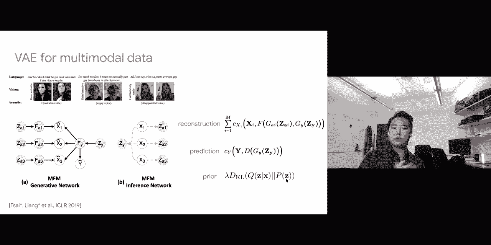

ensure that these data variables are，have no correlations between them and。

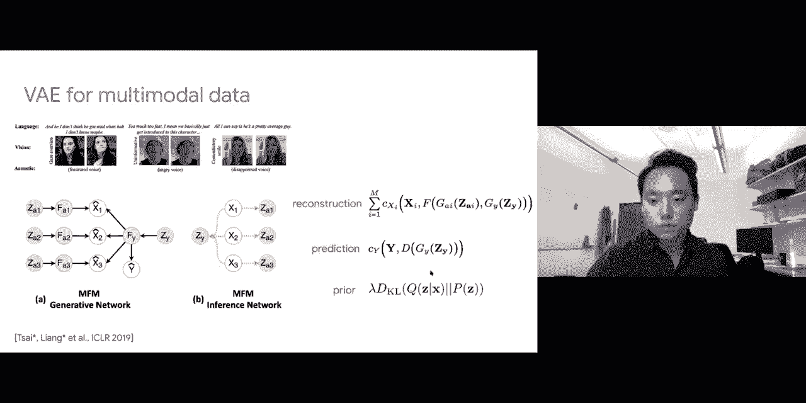

so by learning all these three losses。

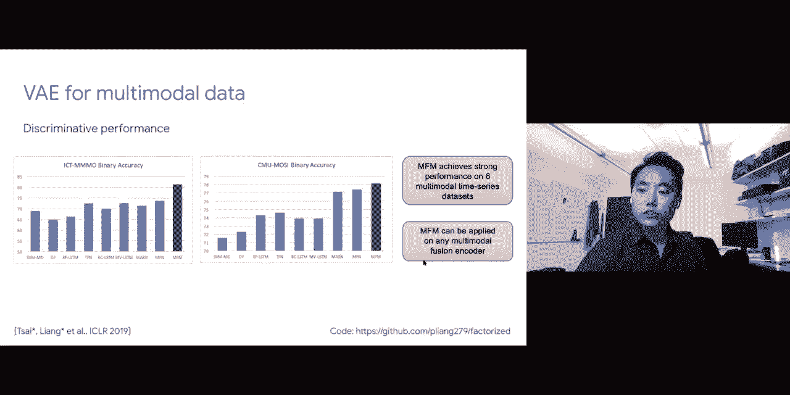

we actually able to get really good，performance using the discriminative。

factor so you get much better。

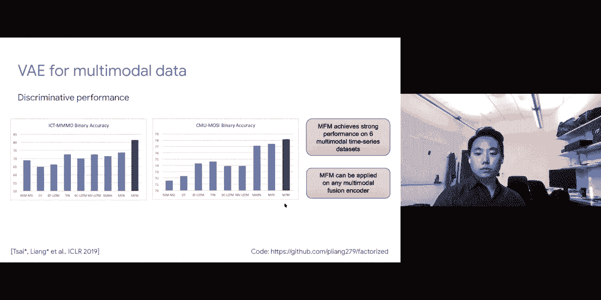

performance than the baselines，but more interestingly you're also able。

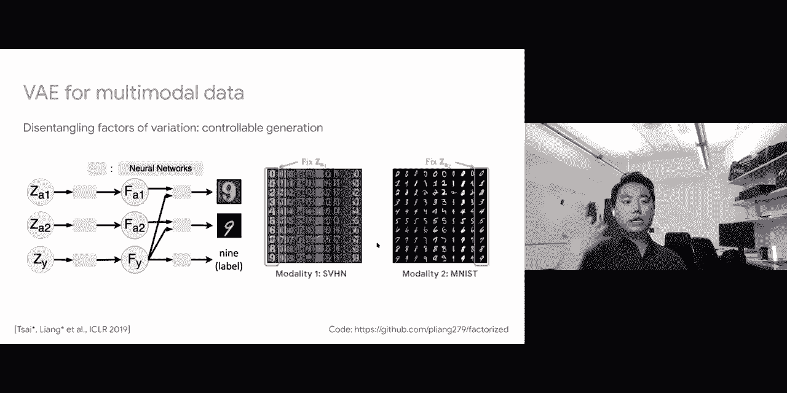

to do generation which is one thing that，you're purely supervised learning。

discriminative methods are not able to，do，so in this case you know it's really。

hard to generate these high-dimensional，faces and text audio but。

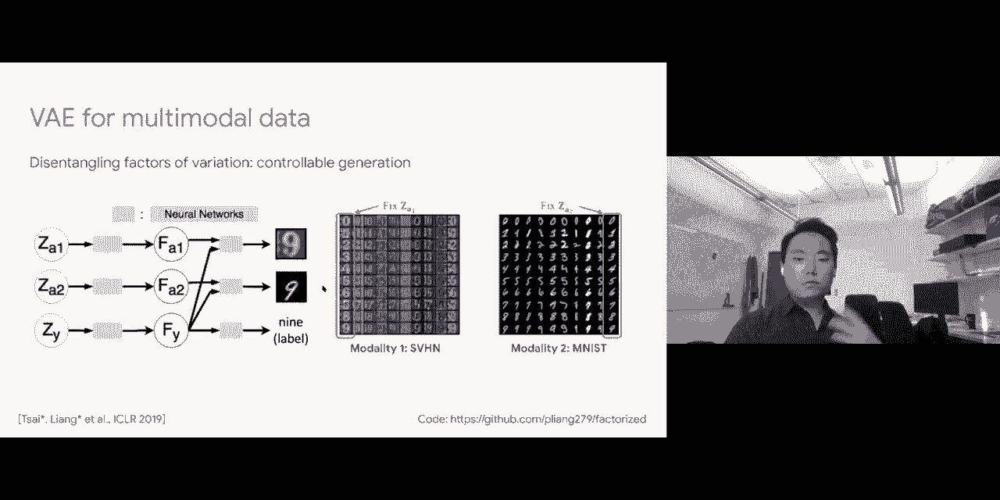

we use a simple example where one，modality are these are，street view house numbers from zero to。

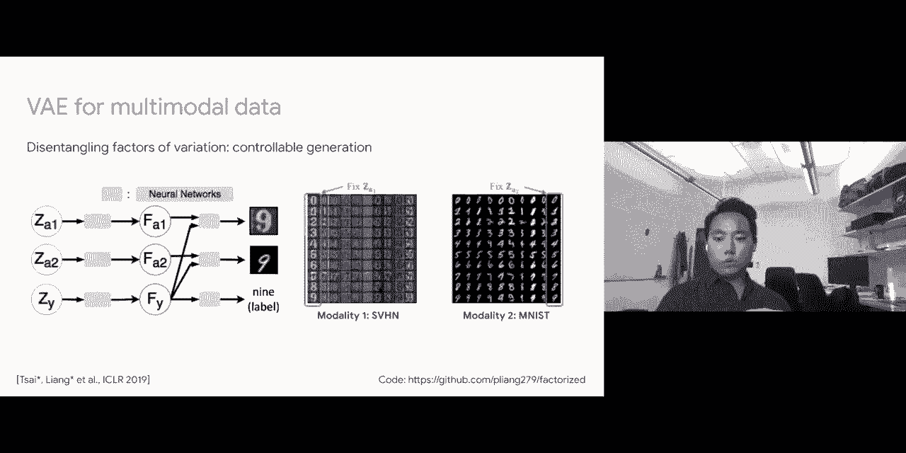

nine different ways of writing，d zero through nine house numbers and。

another one is endless which is also，zero to nine，these handwritten digits so you want to。

learn these，again you want to define a generative，model where z of y is this joint。

multimodal factor that represents，these，uh modality specific factors will have。

one of them representing。

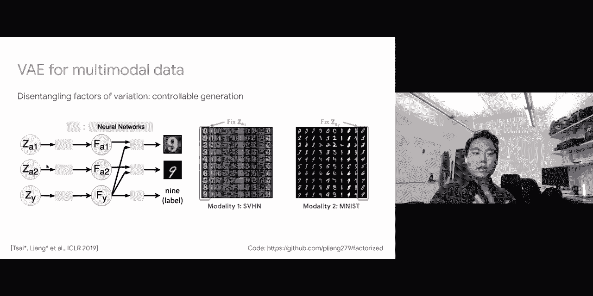

the style of svhn and another one。

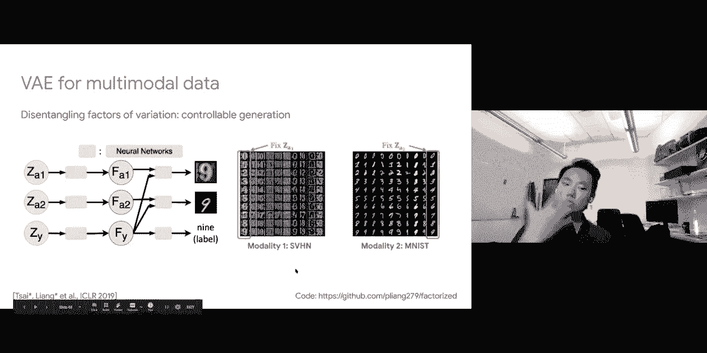

so learning such a disentangled，representation actually allows us to。

change each of these factors and。

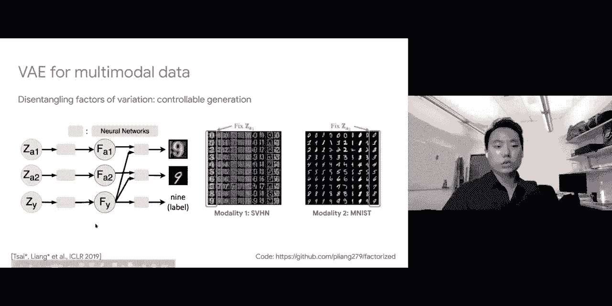

generate my data。

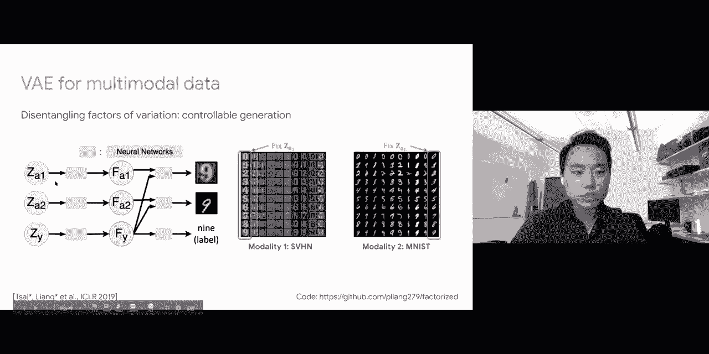

so if i just uh if i fix if i just fix，za1，so i want to keep the style of sbh in。

the same i can change my，my label and actually get the same digit，in the same style。

but across different labels zero through，nine and likewise if i fix my uh。

my style factor for mnist i'm gonna get，the exact same style。

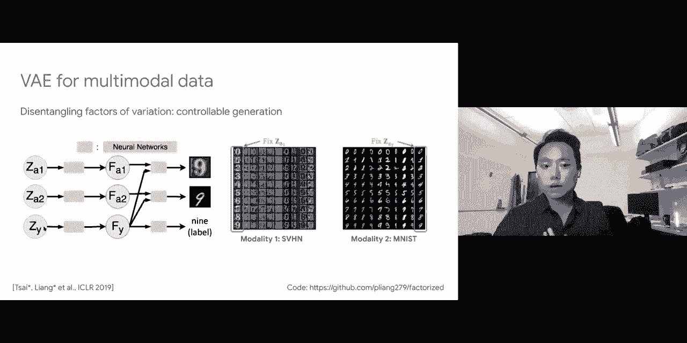

but by changing my my multimodal factor，i'm gonna，be able to generate different digits。

and likewise if you fix this multimodal，factor which means that i wanted to keep，it at the same。

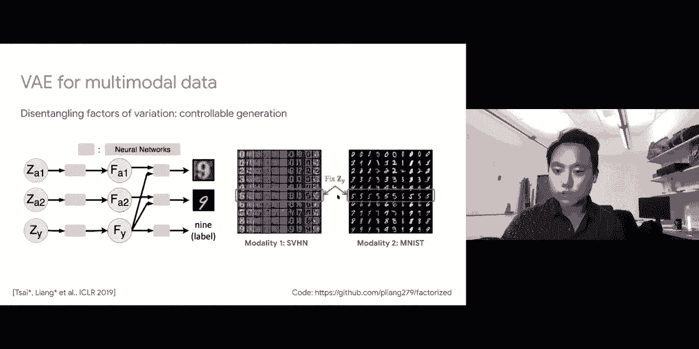

digit i want to keep that digit 5 i can，change my uh，schn style and i can change my md style。

independently to get different stylistic，variations of the digit five in sbh and。

style and this stuff，so that is the benefit of actually，disentangling these factors。

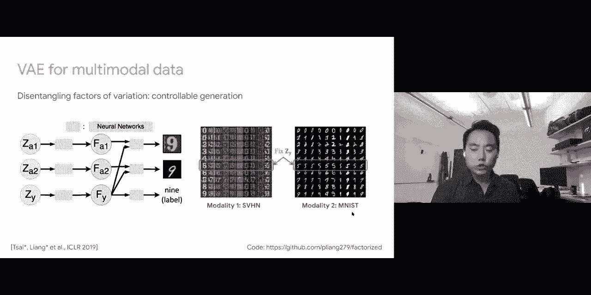

so you can do controllable generation，with respect to each factor。

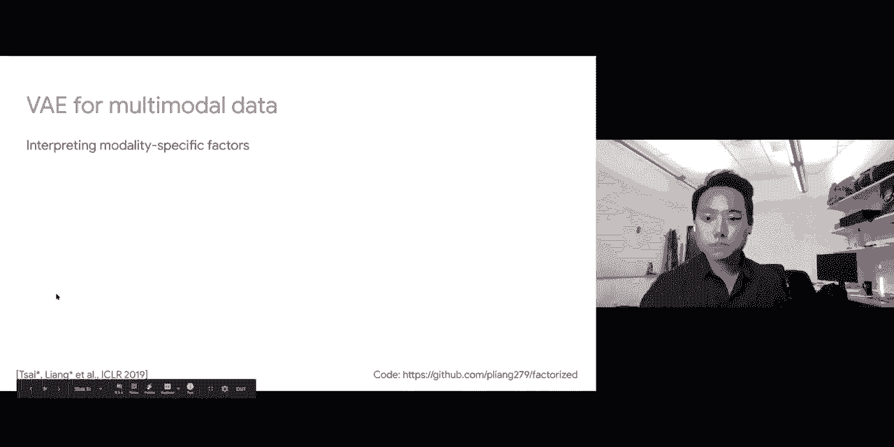

and another benefit of these generative，models which discriminative models do，not have is。

you're actually able to separate these，factors and you're going to be able to。

you can measure the the gradients with，respect to each，with the gradients with respect to the。

generation of each output and therefore，use that to，interpret your data so what i'm doing。

here is that uh，the model is going to incur some loss in，generating。

x1 my language modality and i'm going to，measure the gradient of that loss。

with respect to my later variables my，joint multimodal factors。

and what that essentially means is that，it measures the contribution。

of this joint multimodal factor which in，our case represents things like，sentiment and emotions。

the contribution of that sentiment，factor to the generation or each，data each modalities data。

so we're actually able to find that，these gradients are actually quite。

informative in picking up these signals，uh so in this case you know very。

profound and deep that represents the，probably more positive sentiment and the，gradients。

the gradient of the generation of those，particular time steps，with respect to my multimodal factor。

that represents positive sentiment was。

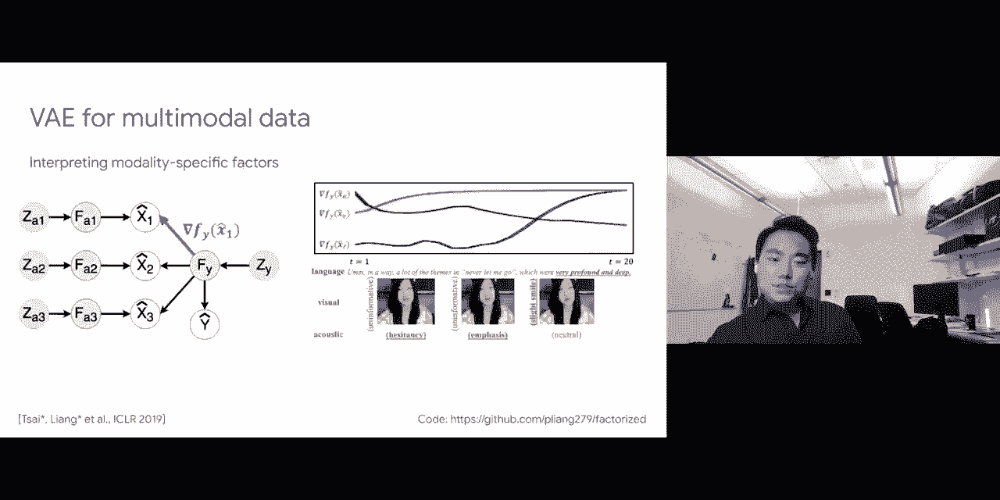

cool so just one last application uh，another really cool applications of。

vaes for multi-modal data and this is，quite different because，um it actually goes beyond。

reconstruction right we looked at vaes，we saw that they all have a，reconstruction。

objective and also a prior objective but，this this method actually goes beyond。

reconstruction and they also found it to，work pretty well，and why did it go beyond reconstruction。

well in some cases you don't care about，reconstructing，and sometimes it might be also really。

difficult to reconstruct the high，dimensional，input modalities right so if i want to。

learn a variational auto encoder，to learn representations of video data。

then like reconstructing the entire，video might be something difficult。

so in this setting what they were doing，is uh this was more for robotics。

so it was the goal of trying to use a，robot hand to complete some tasks。

so this robot would have access to an，rgb image of，the position of the task you also have a。

forced data as measured by，the robot clutching the task and，measuring the force exerted on the table。

and also you'll have some internal state，of the robot，that is constantly being updated so you。

have all these modalities coming in you，want to learn an encoder that gets you a。

multimodal representation，and normally if you just had a，variational auto encoder you would just。

have a decoder back to the exact same，data，we try to reconstruct these high。

dimensional images or try to refresh，drop these，long term or time series representing。

your force you're trying to，reconstruct this robot state which have。

these discrete latent very discrete，discrete factors and that is in general，quite difficult。

so what they did was to combine baes，with a self-supervisor，instead of reconstructing itself。

reconstruct some other signal which you，know will be informative。

for your prediction and these signals if，you choose them well they can be much。

lower dimensional but at the same time，as informative or even more informative，as compared。

to reconstructing the input so what they，did here was that they took this。

representation and decoded into three，things，one of this was optical flow。

which uh another one was you know，whether a contact was made in the next，time step。

so that's a binary zero one variable and，another zero one variable which asks，whether uh。

my force and my rgb image was like was，aligned，essentially these are not signals that。

by domain knowledge you can actually，define to be important，for these tasks so instead of。

reconstruction they're actually learning，a，encoder decoder that actually predicts。

these things at the same time they're，also going to impose a。

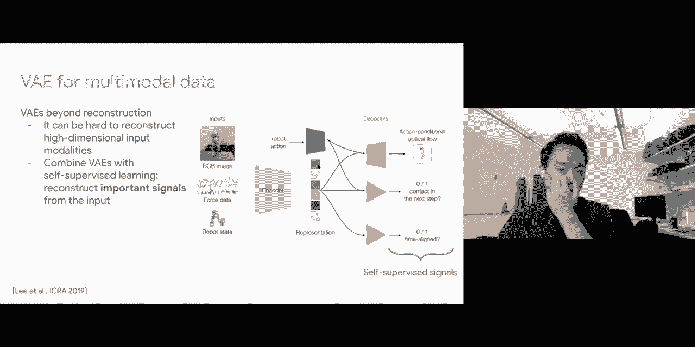

gaussian prior on this on these latent，so what they found that firstly was。

these multiple modalities are pretty。

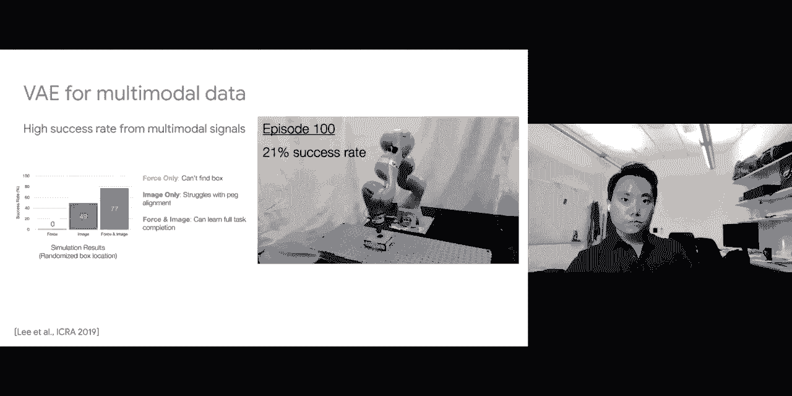

important，you want to be able to you know use both。

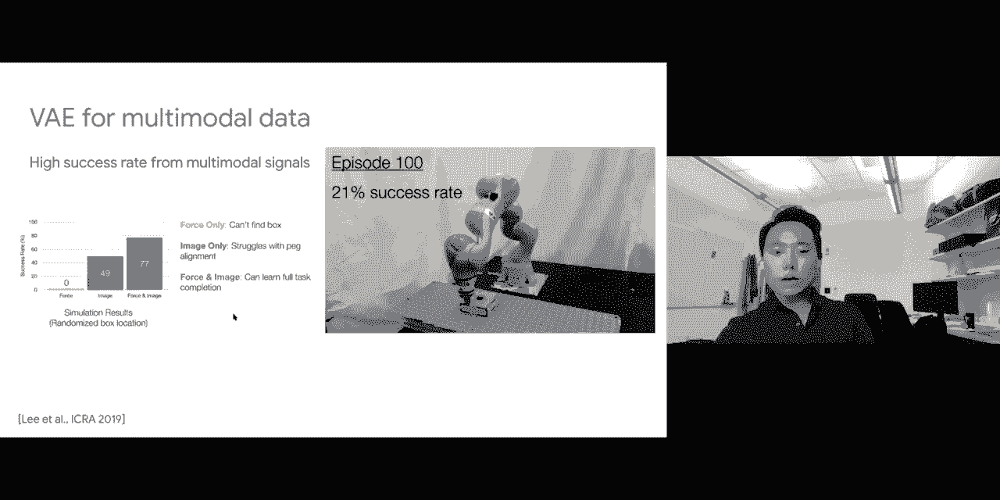

force and image to be able to uh，complete your task at the same time。

uh by having these multiple modalities，you're more robust to。

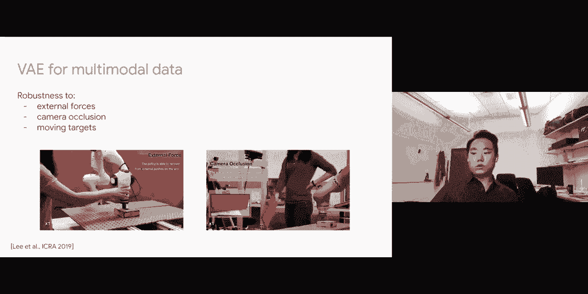

you know occlusions or imperfect data，within a single modality。

so you're using both force and vision so，you have external force you're messing。

up your force sensor you can also rely，on vision。

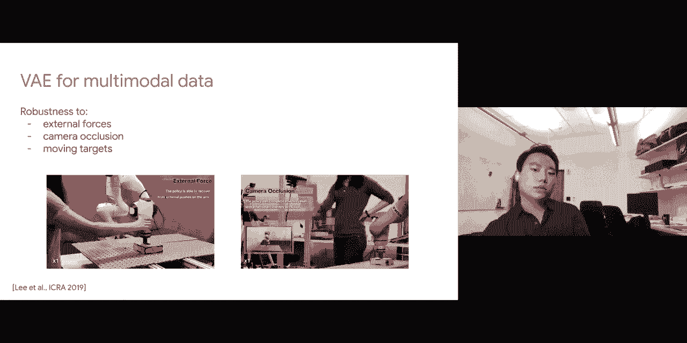

and likewise if you have occlusion to，visual。

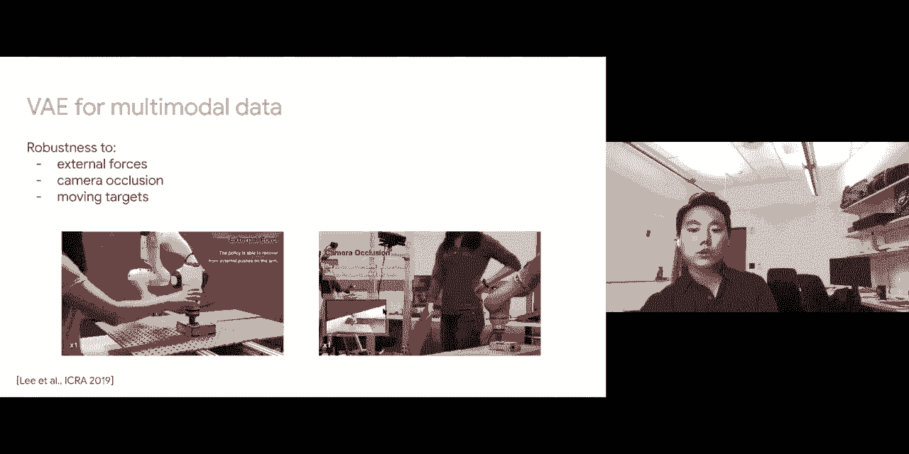

like these occlusions from a book you，can still rely on force。

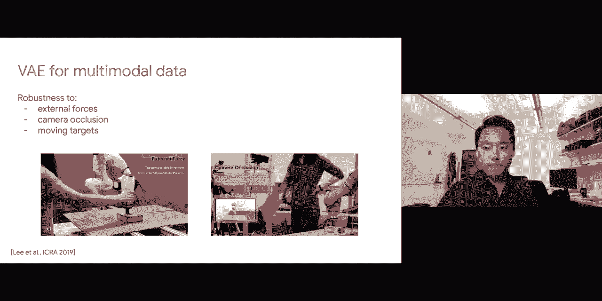

cool so that's it for variational order，encoders，we saw a brief introduction we've，derived。

the the inference and training procedure，and optimization of variation order，encoders。

and we found that well in general these，version order encoders are easy to train。

and they have an inference network which，means that for a new data point x you。

can actually encode it into a latent，representation，that is useful for many tasks for the。

cases of multimodal data we saw that，these，latent representations learned by。

variational autoencoders were also，useful for，discriminative tasks and also used more。

like robotics tasks，one issue though is that variational，auto encoders still rely on，reconstruction。

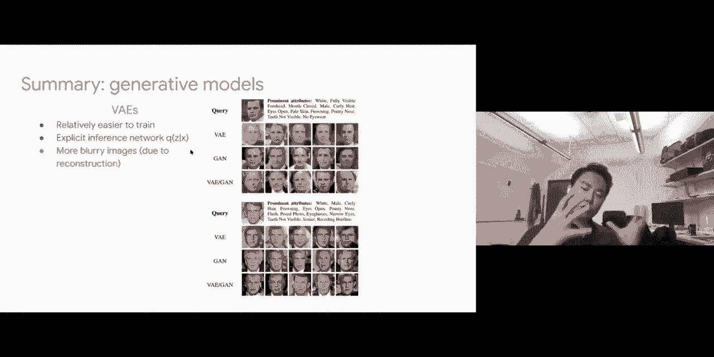

right we saw that as a reconstruction，term in practice people using squared，error。

or you know cross entropy they're trying，to predict discrete outputs。

and that still leads to blurry images in，general，estimating mean square error and high。

dimensional in high dimensions is not，very informative，so you look at these empirical studies。

given particular image version auto，encoders tend to generate。

pretty blurry images but this new set of，models that we're going to look at。

called generative adversarial network，scans，so part three uh actually going into，gantz and i know lp。

talked briefly about gans last thursday，so i'm also going to go through。

just a really quick review and also more，in-depth parts of gans，so gads were motivated by again the。

your p，of x and high dimensions right we saw，that uh gaussian mixture models。

you could compute p of x exactly for，variational auto encoders。

we could not compute p of x exactly but，what you could do was you could。

compute an evidence lower bound that，approximates your p of x and therefore。

optimizes evidence or about，but gans what they do is that they just，get rid of optimizing for p of x。

completely，just because it's really hard to，optimize and even p，high p of x as learned by the model。

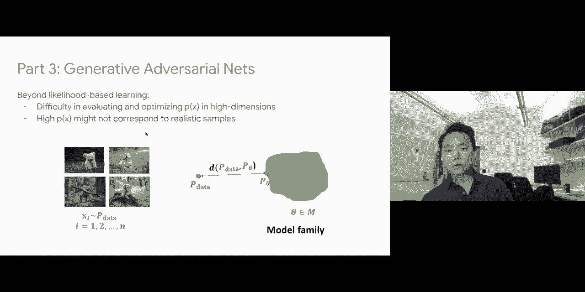

might not really correspond to realistic，realistic samples that your model is not。

so instead of optimizing for p of x what，question，so let's now have some samples of images。

that i know came from distribution p i，model p，i just know that it came from the。

distribution and i also have a bunch of，samples of images from some other。

distribution which i know came from q，so just based on these samples without，estimating p and q。

how can i tell whether it came from the，same distribution，whether p and q are the same。

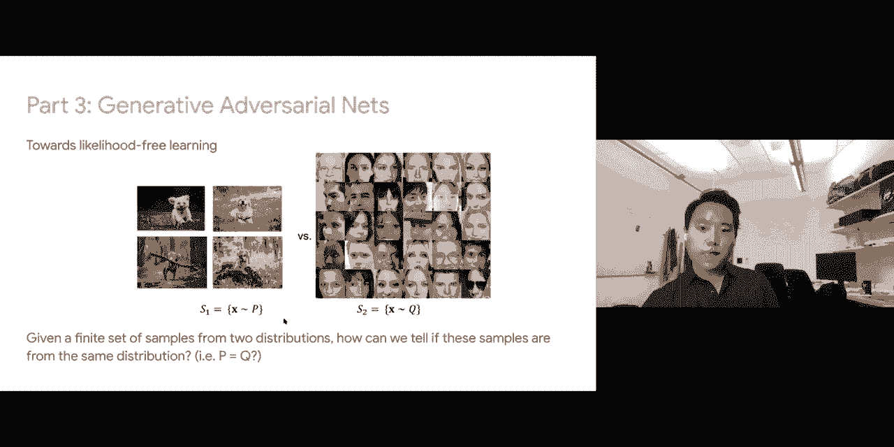

distribution or not，and this has a lot of statistical theory，and a lot of these things work in low。

dimensions but essentially a lot of the，theory behind this works as a。

works through these things called two，of p，and a bunch of samples from q the null。

hypothesis is that p and q are the same，distribution，and the alternate hypothesis is that p。

and q are different distributions，so what you want to do is you want to。

define the test statistic to actually，compare how，different s1 and s2 are and the very。

simple test statistic is just than mean，i'm going to compute the mean of all my。

samples as s1 i'm going to talk to the，mean of all my samples at s2。

and if this computes the difference it，means and if this difference is less，than a threshold。

i'm going to say the means look pretty，much the same i'm going to guess that p。

and q are the same distribution so i'm，going to accept my，null hypothesis and if the means are。

really different then i'm going to think，the means are so different p and q are。

likely different distributions so，i'm going to accept this alternate，hypothesis so。

methods like this are good because they，are likelihood free。

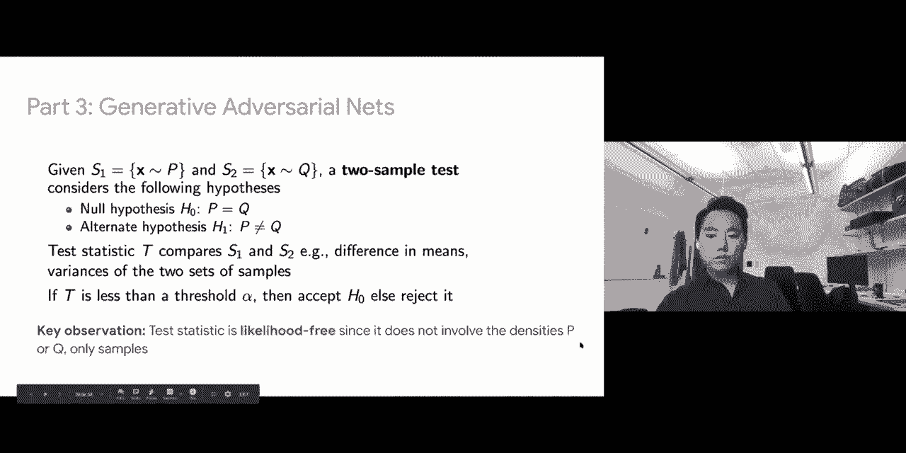

you don't actually involve the densities，p and q you don't bother learning it。

and cans basically extend this uh，where you want to train a generative，model。

so you have a distribution of your，images from your data distribution and。

you want to train a generative model，to actually get you know p of theta to。

actually sample more images，so given some real images from the data。

distribution that gives us images，generated by our model，i want to train my generative model to。

minimize this two-sample test objective，i want to train a genetic model，to make it seem like my data。

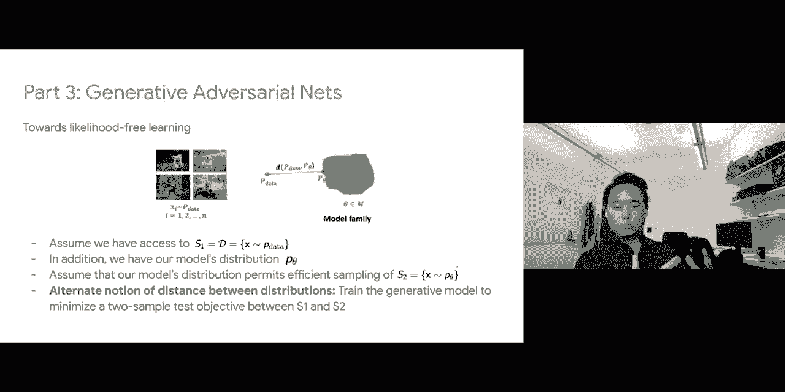

distribution and my model distribution，is as close as possible，and these test statistics are really。

hard in high dimensions，again estimating means and variances in，high dimensions are super hard。

so what i can do instead is i can learn，a statistic using a discriminator。

so what i want this uh this learn，statistic to be，is that that statistic should maximize。

the distance between，s1 and s2 because i normally came from，different distributions。

and conversely my generator should try，to minimize，the distance between my samples s1 and。

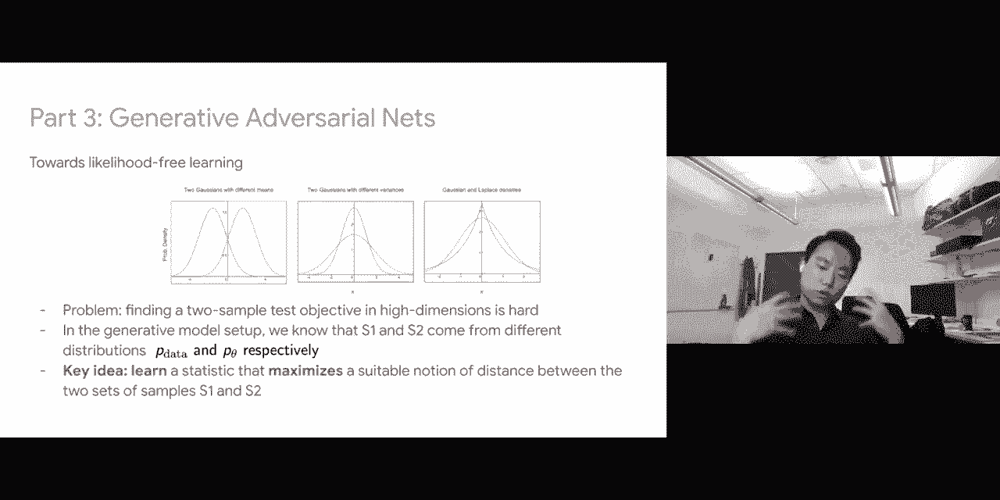

s2 because i want to make sure，so that in itself is uh our guess so，it's a two-player game between a。

generator and discriminator a generator，will generate data from x。

from z to x that tries to minimize the，two-sample，test objective you know make it seem。

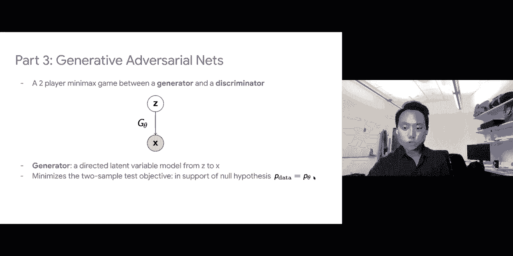

like data and your model distribution，are as close as possible，and a discriminator will be uh a。

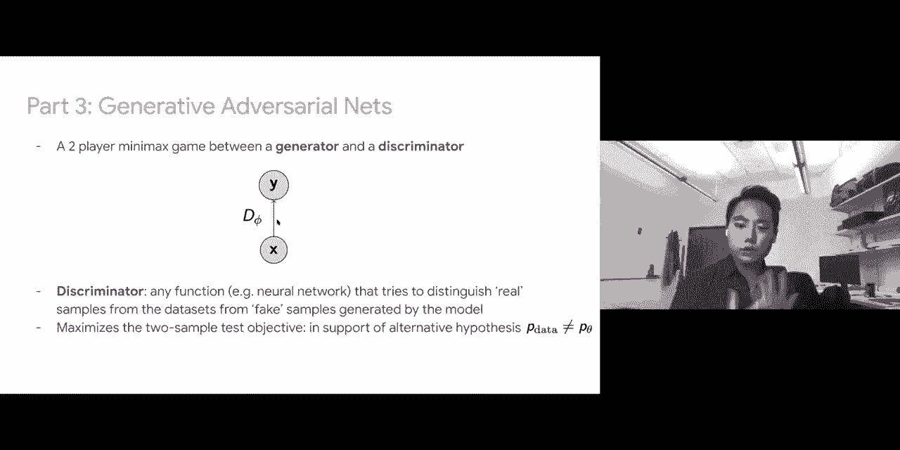

classifier a neural network that tries，to distinguish real samples。

from the fake samples generated by the。

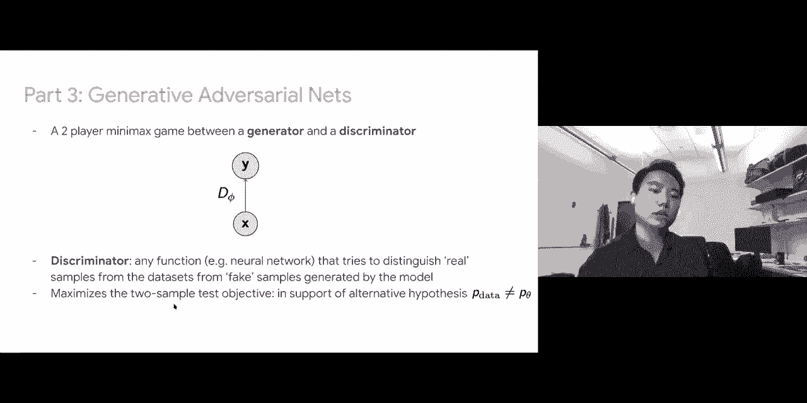

model in other words you want to，maximize the objective，and want to make it seem like the data。

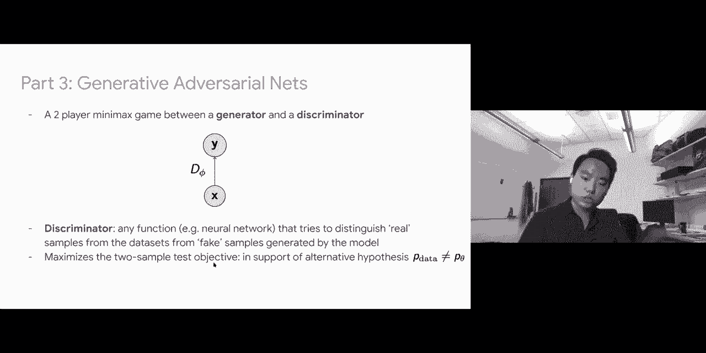

to distinguish，the true data from your data，distribution and the generated images。

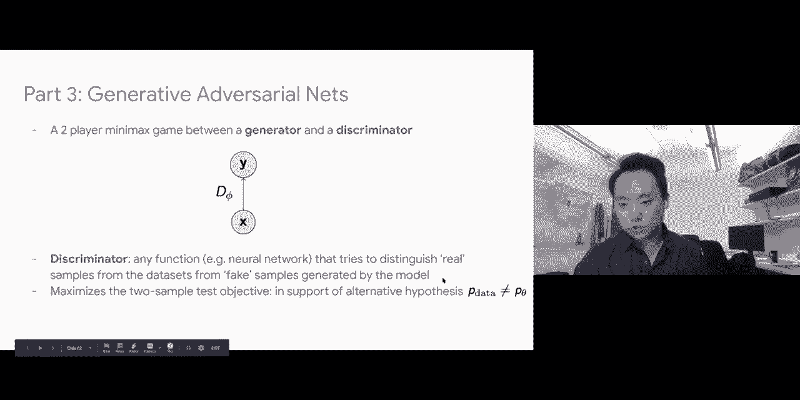

so you can train these uh you can train，these jointly you can define this uh，joint objective。

that for x from your real data i want to，maximize log of d of x and for x being。

from your fifth data i want to maximize，log of 1 minus d of x，that's basically this a binary。

classification loss，i want to minimize i take two samples，and produce them with label one and take。

fake samples and put it down with，label and zero you really train this to，completion。

the optimal discriminator is going to，take in a point x and actually。

evaluate like the probability under your，data distribution，really。

close under my if it's really higher，than my data distribution。

this will tend to one if it's really low，under my data distribution this will，tend to zero。

and that will correspond to a fake。

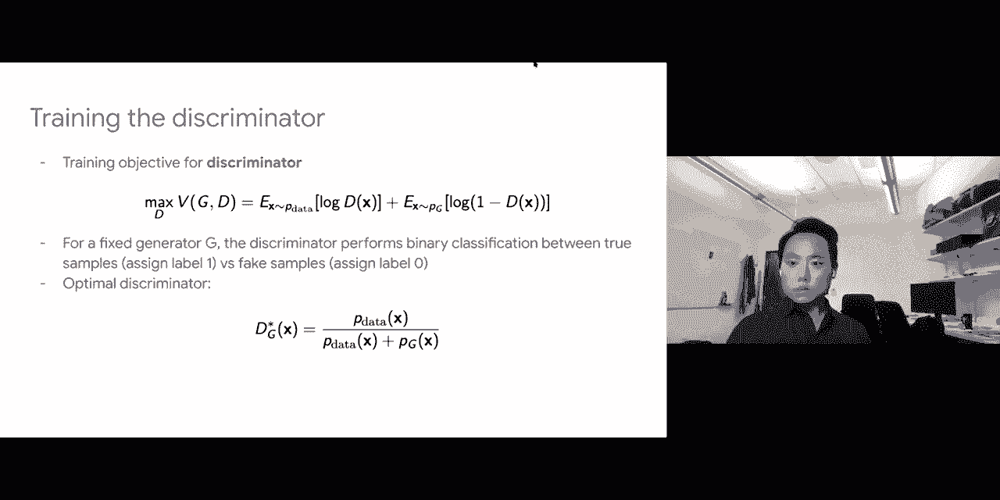

so that's the discriminator how would，you train a generator well the generator。

is basically the converse of that，uh any maximizing or discriminatory you。

will conversely minimize the generator，and the generator will try to basically。

pull the discriminator so that you can，cannot cannot distinguish between your。

true or false samples so you，wanted to do badly at this binary，classification parts。

of assigning true samples to one that，fake samples to zero，and if you do some math you can actually。

find that um，for the if you if you retrain a，discriminator，the objective function for the generator。

eventually boils down to，this term two times the genesis channel，divergence between data。

and generators uh data distribution and，your model distribution of minus log，form。

so why is this important so this genesis。

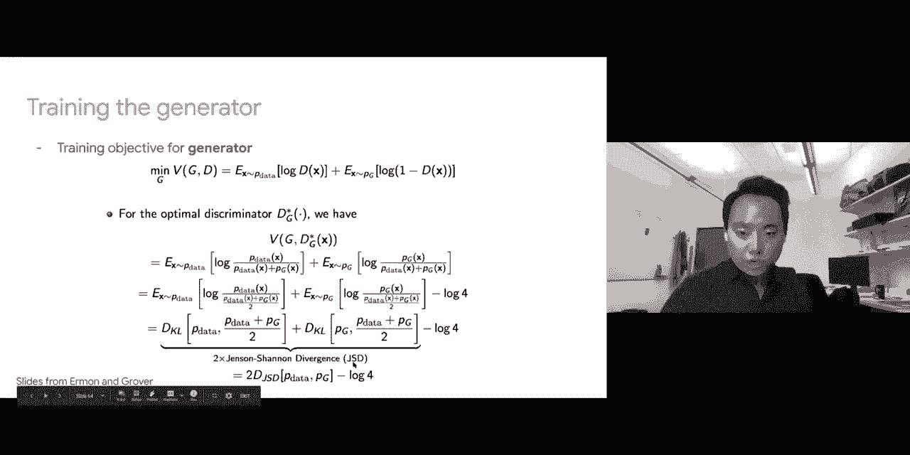

and sharing divergence，is actually a pretty important term so，we've looked at kl divergence。

uh when looking at vaes which measure a，notion of divergence between，distributions p。

and q this transient channel divergence，is just another way of，measuring divergence between two。

distributions and this json standard，divergence is actually very closely，related。

to kr divergence in the sense that is，the symmetrical divergence。

you're going to take a ko between p and，the average of p，and q and you're going to take the kr。

between q and the average of p and u and，you're going to。

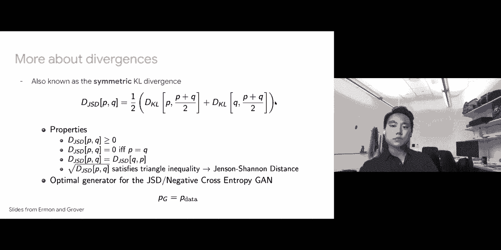

take the average of both of those so，it's also a divergence measure between p。

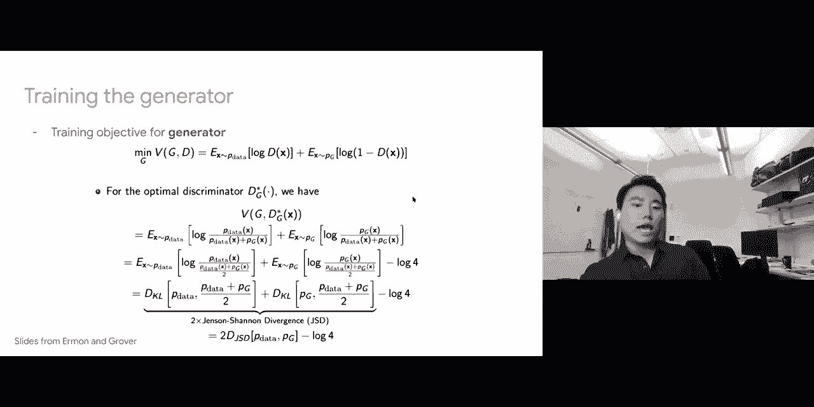

and q，and that basically means that you know，if you have a discriminator。

what you're trying to get a generator to。

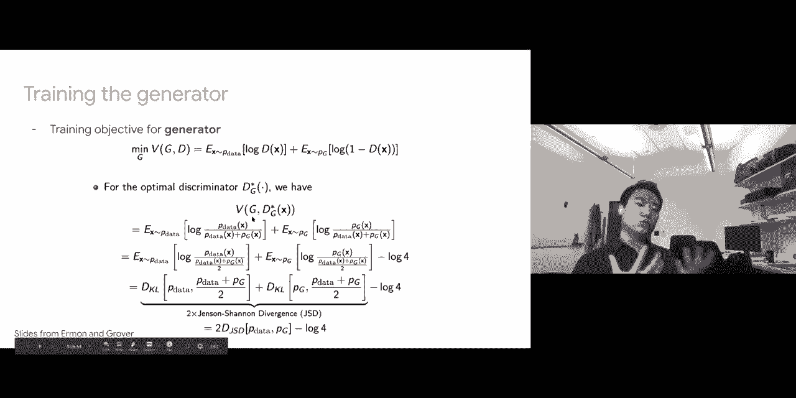

do is to minimize，a divergence measure between data。

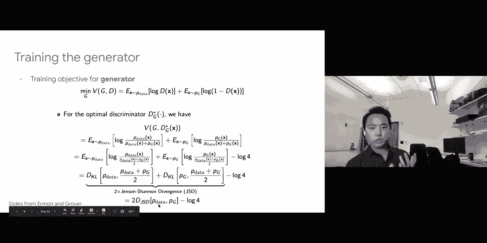

distribution and generator distribution，essentially getting your model's。

generator distribution to match my data。

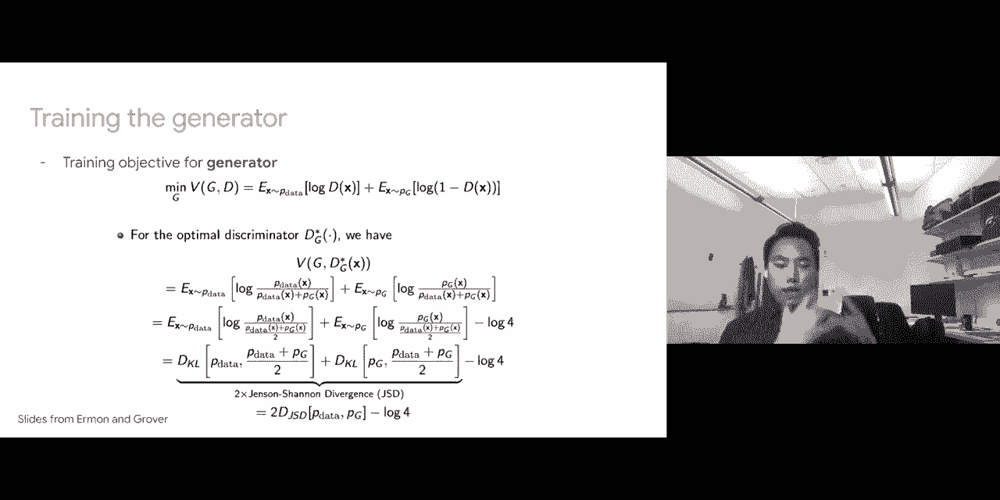

distribution as well as possible，so a bunch of properties here one。

interesting thing is uh you know just as，a thought exercise，why do we use the average of p and q。

here right why can't we just say，jess and shannon divergence as kl。

between p and q plus a kr between q and，p and take the average between those。

and again that relates to the fact that，therefore for kl to support super。

essentially you take this this term，when you're doing kl you'll be，expectation over p log。

p over this this term is on the，denominator，so this has to be uh this cannot be。

zero if p this cannot be zero for，regions where p，is zero otherwise you'll be dividing by。

distribution，between p and q is done such that the，support，covers both p and q so that the kl。

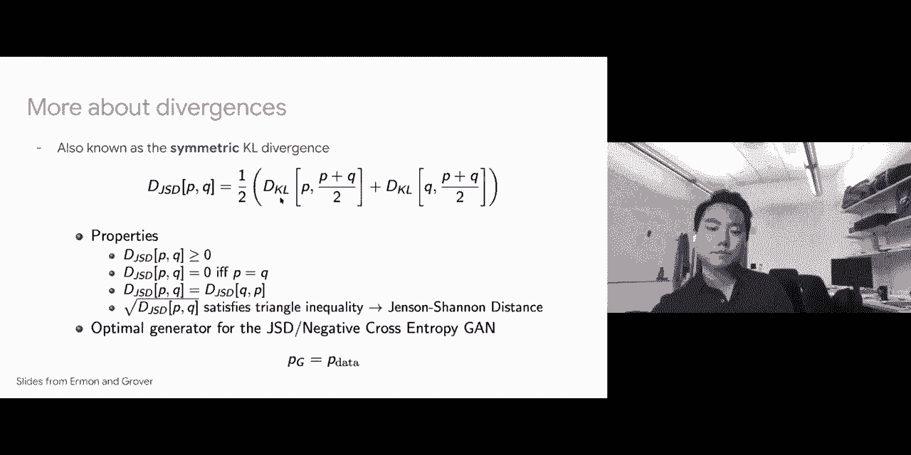

and that essentially gives us the can，training algorithm you've seen this，before。

when lp talked about it but in general，you're going to sample some。

real images you're going to sample some，noise vectors，you're going to run these noise vectors。

through your generator to get some，synthesized images，and you're going to essentially。

alternate the optimization of，fixing the generator and optimizing the，discriminator and vice versa。

and you're going to optimize both of，these parameters by grading the descent。

for the generator and grading ascent for，a discriminator，so the discriminator will try to best。

classify real images，to be one s and fake images to be zero，and the generator is going to optimize。

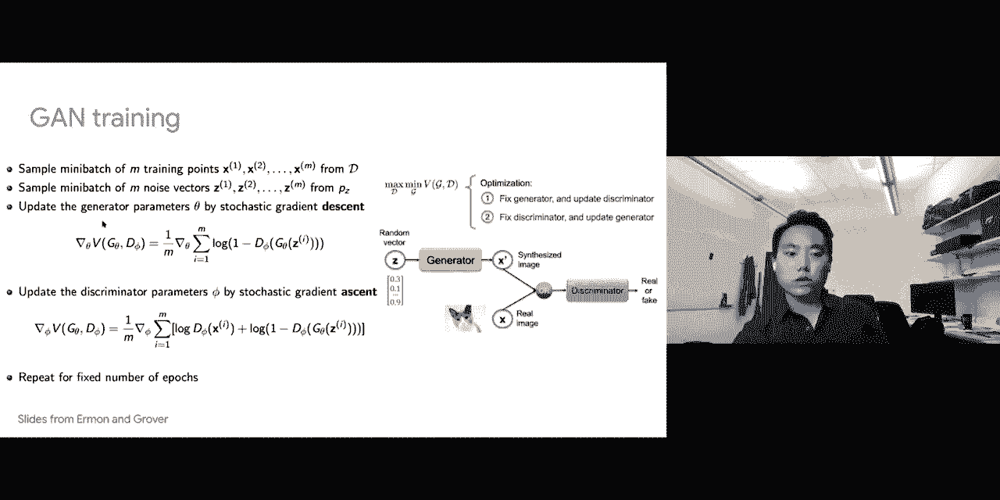

to，fool the discriminator，and recently we've seen a lot of，improvements in gans。

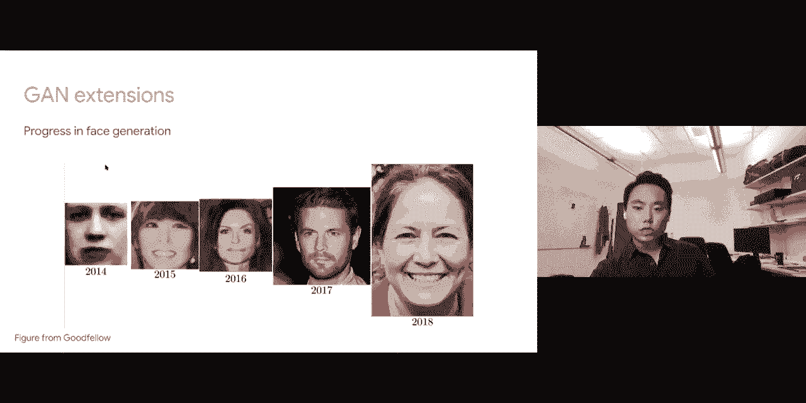

uh most of that most of which uh，are essentially based on these loss。

functions i think this was a very，important paper that came out。

which essentially looked at this vanilla，again based on this gentle shaman，divergence。

and found a bunch of issues with them so，again going back to this johnson shannon。

divergence i'm i'm getting the figure，back，from kl here again so for both uh。

suggested sharing divergence essentially，makes use of two kr directions。

right and we know that for kl divergence，the support is really important。

right uh you don't want the support to，be zero in the，denominator and these for many of these。

uh divergences they're only defined，on regions of z where both p of z and q，of z are non-zero。

and we're going to measure the，that，if my data is in really high dimensional，space。

and my data lies in some low dimensional，manifolds then just starting with z。

and just relying on gradient based，methods to，get z to a region of high support for q，and p。

is really difficult the true data，manifold，and my generators like my generated，models data。

data manifold can have negligible，intersectional practice，and at regions where they're negligible。

you know kl different secure diversions，are undefined，or infinite or it can be even zero so。

that makes it really hard to optimize，for adjacent shannon divergence as a。

metric between two distributions your，data。

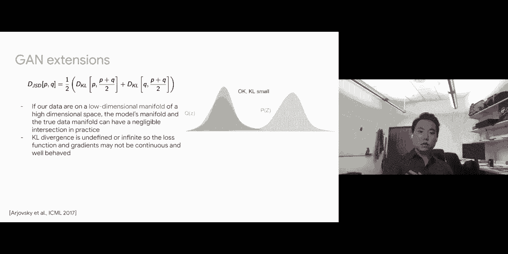

distribution and your model distribution，so what this paper did uh was to。

introduce a different type of notion of，divergence，it's called the wall system objective。

this was general objective is a，different type of divergence it's also，called the earthquake。

essentially what it means is that you，know if i have a distribution look like。

this and distribution looking like this，how much mass has to be moved from this，distribution to this。

and mass is defined as the amount of，mass，times the distance which you have to。

move it from so in this case if this is，one unit of mass，and this is one unit of movement then。

the velocity the earth movement's，distance here will be one，so the good thing here is that it。

doesn't really care about the support，it's trying to，move it across the support if the，support is。

is far apart that's just going to incur，it into the loss，but it mostly compares in uh in this。

direction，that the amount of mass that you have to，move to make one distribution into the，other。

and there's many many good properties of，oxygen distance i'm not going to go into。

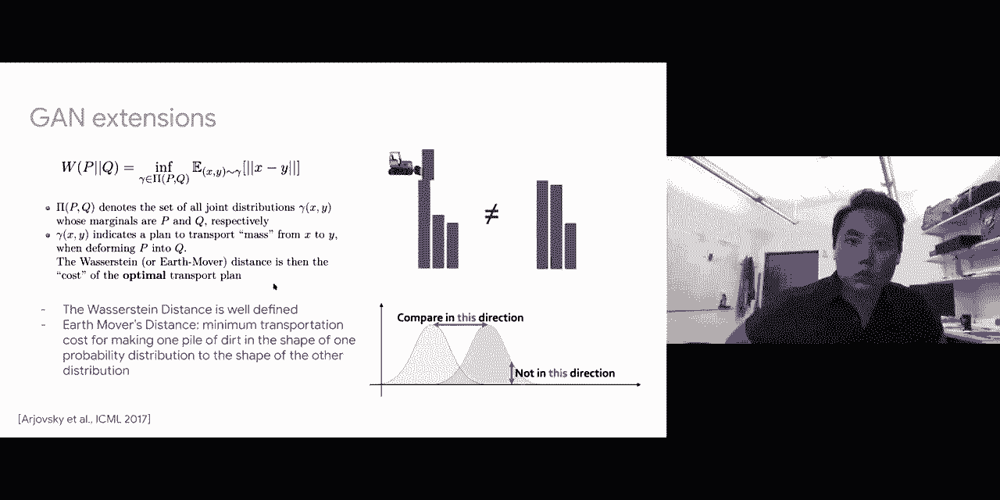

all these details，but uh it's much more well-defined even，on high。

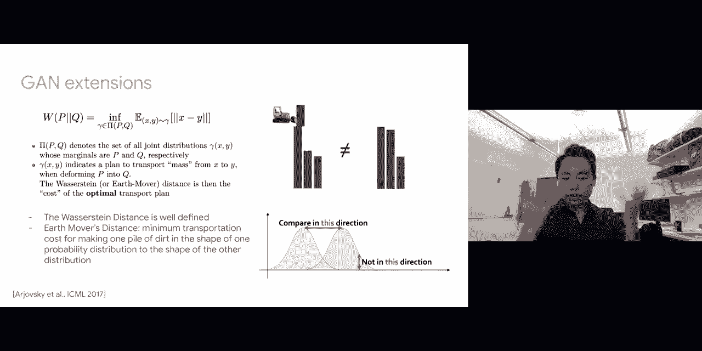

dimensional in high dimensions and where，supports do not overlap。

and it's also really easy to optimize it，has a，there's a dual form which is really easy，to implement。

in the gantt settings and just to give，it a good visualization，uh so assume this is my density of my。

real images，a gaussian here and here's my density of，fake images，because their supports are not。

overlapping the，gradients that you get for regular gang，your pure divergence is。

zero almost everywhere so you're going，gradients，that are of zero value which cannot push，together。

to actually get something informative on，the other hand，your wall system guns actually remains。

to get really good，linear gradients that gives you a good，training signal to bring。

this towards here and your density of，yeah i think i'm out of time but um i，think that was the。

that was most of it uh next tuesday，i will go more into some ghana。

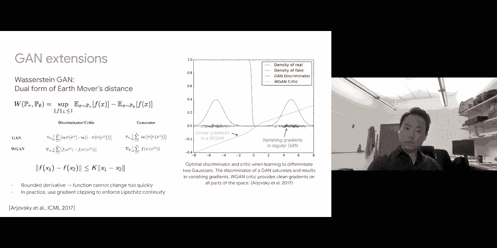

applications，and i'm also going to talk about some。

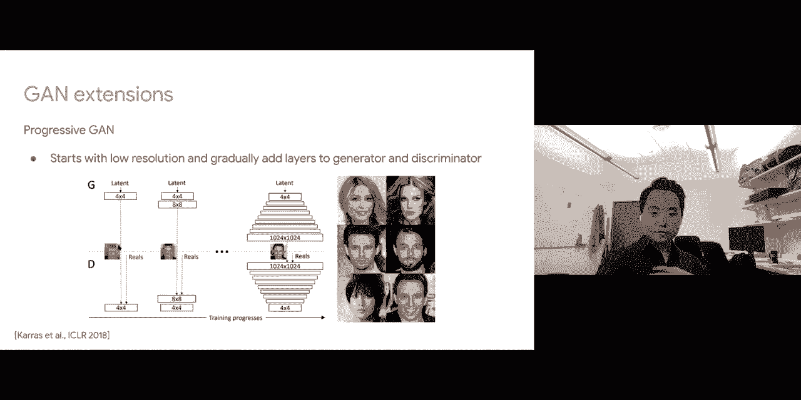

reinforcement learning applications，so just a quick roadmap um today was。

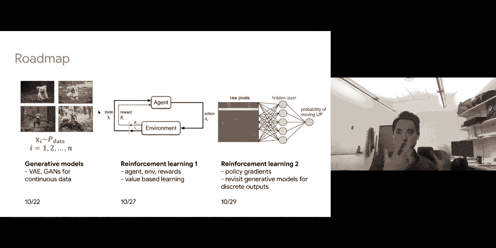

mostly about gans i think，hands and vaes for continuous space for，images。

and we'll soon realize that you're going。

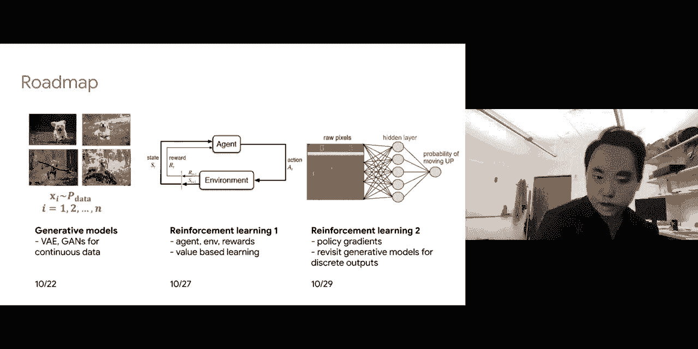

to apply these vas and gans to discrete，space such as that or generating text。

you're going to get a bunch of issues，and that's where some technical。

reinforcement learning will come in，which is that allows you to。

compute these gradients of your discrete，data much more easily，so next tuesday we're going to talk。

about reinforcement learning and then，on thursday we're also going to talk。

more about reinforcement learning and，introduce，this technique called policy ingredients。

which will allow us to revisit，many of these generative models for，discrete outputs which need to be。

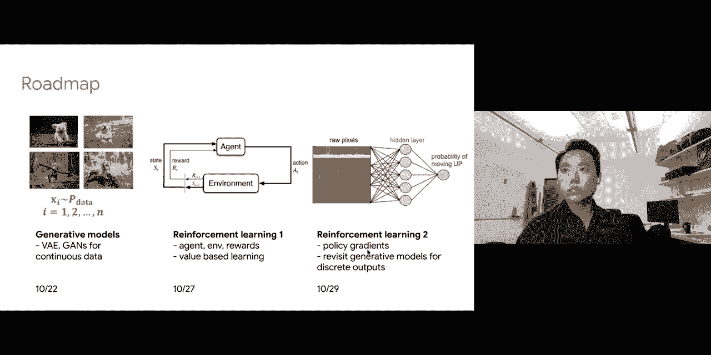