# P15：L9.1- 强化学习 - ShowMeAI - BV1Pf4y1P7zc

all right let's，begin so hey everyone，hope everyone had a good weekend uh so，models。

i hope everyone enjoyed my lecture last，thursday and this week we're going to go。

into two more lectures，both on reinforcement learning so today。

i'm going to kind of set up the basics，of reinforcement learning。

go through some of the basic algorithms，and on thursday we're going to go a bit。

more in depth into reinforcement，learning，and also look at how reinforcement。

learning methods can help us in these，multi-modal problems，like text generation like we talked。

so any time feel free to just type on，the chat if you have any questions so，today's lecture。

i'm going to give a very brief and high，level introduction to reinforcement，learning。

and most of this content is taken from，some of these amazing courses at。

berkeley and cmu so we really want to go，in depth the reinforcement learning and。

look at more applications look at more，of the theoretical insights，definitely do check out these。

semester-long courses i'm going to try，to distill，the most useful information and also。

most of the applications to language and，so let's begin so the main things that。

we're trying to cover today are first，the introduction to reinforcement，learning。

setting up the problems uh especially，using this framework called markov。

decision processes it's a theoretical，framework，that allows us to reason about the。

objectives and the algorithms for，reinforcement learning，we're going to look at some simple cases。

of mdps and if everything is known，that means that you know it's easy to，solve it's small in scale。

we can actually solve these mdps exactly，using algorithms called，value and policy iteration that are。

going to，however in the real world where a lot of，things are unknown and a lot of things。

are really high dimensional，you can't solve these mdps exactly so。

also going to give a brief introduction，to how we can use function approximation。

and neural networks to solve these，unknown mdps，so let's begin so i'm pretty sure。

everyone's heard of reinforcement，learning uh it's this new research area。

that has particularly gained a lot of，interest recently because，of the combination of reinforcement。

learning and deep neural networks so in，this new area called deep reinforcement，learning。

and they have seen many many successful，applications in the real world。

including self-driving cars they use，some aspect of reinforcement learning。

uh recently they've been able to train，these ai methods to，beat humans at goal a game that was long。

thought too difficult for humans to play，again using reinforcement learning。

methods they've been also shown to do，really well on these atari games which。

require a lot of human decks already，but ai agents can also be trained to get。

better than human performance，and likewise it's also seen a lot of，applications rl in the real world。

towards building robotics for，manufacturing，uh playing multiplayer games like fifa。

and also building robots that can，effectively navigate in the real world。

so what exactly is reinforcement，learning so some of you might have seen，this diagram before。

here's a very general setup that，everyone uses to introduce reinforcement，learning。

essentially there's two key components，you have an agent，that is placed in an environment and。

this agent is going to start，from a particular state in the，environment known as s0 that's your。

starting state，you can think of these states as，parameters of the environment that。

defines where the agent currently is，so in my case you know i'm currently at。

this particular spot that is where my，starting status，and whenever the agent is at a state it。

can it's going to take some action，and this action is chosen from a set of，all possible actions。

that i can take to interact with the，are you know，going left going right sitting down or，standing up。

these actions that i can take and，whenever it takes an action。

the environment is going to in response，there are two things，the first thing is a reward r0 so a。

reward tells，the agent how well it's currently doing，in this environment。

whether positive or negative and at what，magnitude，and the environment is also going to。

tell the agent what's the next state，that it ended up into，so if i move left maybe i don't observe。

to my，space my left that will be my new state，so this sequence of interactions。

from states actions observing rewards，and going to next states，defines the trajectory of the agent。

interacting in this environment，and this directory goes on until。

whenever the agent stops interacting，with the environment，so clearly this is a very general setup。

and now let's just look at it in the，context of one of these examples here so。

let's just say uh fifa for example，because i love playing fifa，so you know initially you're going to。

start at s0 at kickoff so you have all，11 players，11 players on each side each in their。

particular positions those are the，initial states，and what are actions um the actions will。

be you know each of these 22 players，either moving around up down left right。

or you know kicking the ball or passing，to another teammate，so these are the possible actions that。

you might have and what are the rewards，then so the rewards could be you know。

positive reward if you manage to score a，goal or if you manage to uh successfully。

pass the ball to your teammate or if，you're able to successfully prevent the。

opponent from scoring against you，so here are examples of positive rewards。

and maybe you'll get a negative reward，if you commit a foul or if you fail to。

complete a pass or if your opponent，scores a goal against you。

so here are very so again this framework，is very general it almost encapsulates。

any form of interaction between single，agents multiple agents。

in their environment and observing some，so let's go a bit more in depth so a。

markov decision process is basically a，way to formalize many of the terms that，we just talked about。

so markov decision process consists of，seven terms，consists of a set of states that the。

agent could be in，because it's a set of actions that the，agent could take so whenever the agent。

samples an action it must fall under，transition，function so if you're in state s and。

take action a it tells you the，distribution，of next states s prime that you will end。

up in the environment，most of the times the transition，functions can be deterministic so if i。

move up down left or right，i will deterministically end up in the。

next state but at certain times it might，also be stochastic and random。

it's a reward function that is also，given by the environment so it tells you。

if you're in state s and take an action，a ending up in state，s prime what is the reward that i。

observe，you're going to see a start state and，i'm going to go into a lot more detail。

and discount factor in the two slides，so let's pause on that for a bit and。

you're also going to have a horizon h，which tells you a total length of，interactions between。

your agent and the environment from，so one important thing of these markov。

decision processes as given by the name，is that it must follow this markov，property。

and this markov is the same term that，you've seen for uh hidden markov models。

mark of random fields it essentially，need，to reason about my next states and my。

next actions should only be contained in，the previous state in action。

it should not depend on uh states before，that，in other words we should be able to。

throw away all the history once this，current state is known，so i'm just to give an example so let's。

just say i，came upstairs in my room and my roommate，tells me to go downstairs and get him an，apple。

so that is one natural language，instruction that is given to me as state，s0 so s0 might be。

my current position upstairs in my room，and this natural language description，that my roommate。

wants me to go get an apple so there's，two possibilities of defining a markov。

decision process as i go and get this，apple，one thing is that as i'm gonna go from。

my room upstairs down into the kitchen，i'm gonna take all sequences of states。

that i'm currently observing，and i can define these states using two，match。

just to keep my position in the house，the second option is to keep my position。

in the house and i always append，this natural language instruction behind。

it that i should go to the kitchen and，get an apple，so you think about it one of these，one。

doesn't so the one that satisfies the，markov property is the one where each，state。

consists of my current position in the，house as well as the natural language，description。

together with it so in other words what，st would be，would be you know one step away from the。

kitchen my current state，as well as the description that i should。

get an apple that satisfies the markov，property，because now i can throw away all my。

previous information all the previous，instructions，and my previous states and just。

condition on st and 80。so on the other hand if i just keep the，natural language instruction at s0。

and subsequently only contain my，position in the house，then by the time i get to st i need to。

condition on s0，to be able to realize that i'm supposed，to pick up an apple。

just a very simple example to show how，you know how we can actually。

turn something that maybe does not，consist of the markov property。

to something that respects the markov，property by propagating this information。

towards the data states so this is quite，important a lot of uh，if you look at all these applications。

like natural language navigation and all，they're given these actions and you're，supposed to。

to follow these instructions they just，give it a start right so technically，they don't observe。

they don't respect their markov property，and they're not technically markov，decision processes。

that's something you keep in mind as you，so then what is the goal in。

reinforcement learning so you've seen，that you know you have a，you have an action you have an agent。

taking states but you have an agent，taking actions and going to different，states。

and an environment the goal is usually，to maximize your total discount reward。

and so as you start taking states and，observing words i want to sum up。

all the rewards that i'm going to，observe throughout you know my entire。

sequence of interactions with the，environment so that would be rt plus one。

so sorry so the reward at gt at a，particular time step t would be。

the reward that you obtain in the next，time step plus，subsequent rewards that you obtain at t。

plus 2 t plus 3，and so on and notice that we're，multiplying by a gamma factor here。

gamma the first time and gamma squared，the second time and gamma to the power，of 3。

to the power 4 subsequently so this，gamma is actually what we saw previously，as the discount factor。

so why do we need a discount factor so，there's a couple of reasons。

one reason is that you can draw an，analogy to economics which states that。

money that i have now at this particular，time step is more valuable than money，that i am promised。

to get in the future so i should，discount whatever rewards i get in the，future。

in both theory and in practice having a，discount factor also helps us to reason，about convergence。

because it encourages our agents to get，to the the final goal faster instead of。

just sitting around and collecting，rewards，so it's also useful in both theory and，practice。

and you look at what values gamma can，take gamma has to be between zero and，one。

gamma close to zero or even when gamma，is exactly zero，you're basically foregoing all positive。

rewards in the future，and you're just trying to maximize your，immediate reward that would be myopic。

evaluation，and if gamma is close to one then what，you're trying to say is that i care a。

lot about rewards in the future，and i might prefer really long really，large awards in the future。

and forego short-term rewards in the，particular in the near future。

so different settings of discount factor，also allow us to design different sets。

of algorithms depending on whether you，want to care more about，immediate reward or long-term reward。

uh so i have a question someone someone，asking a question how do we condition on。

the initial state to maintain relevance，of subsequent actions to the goal。

so i think you're talking about this，markov property here，so you just use the same example that i。

did which is you know both，states being your position in the house。

and the instruction that you're given，you can always just define your states，as appending。

this particular natural language，instruction up until，you find it to be useful so you always。

append it，then that would that would uh that would，respect the markov property。

in practice you can also use things like，lstms and kind of assume that。

lstms have memory so it's always，capturing this information，into future states uh hopefully that。

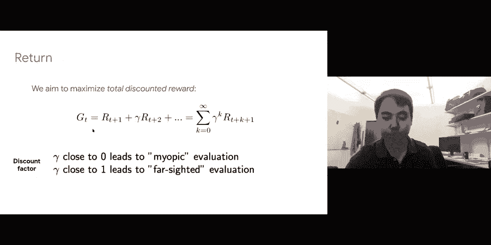

yep so now we've seen what mdp is we've，looked at states，actions we looked at the goal of。

maximizing this cumulative reward，so what is actually what do we actually。

want to do in enforcement learning so，we actually want to define a policy in，order to maximize this。

cumulative long-term rewards so what is，a policy a policy is basically a，distribution，you can take。

at that particular state so this having，this policy will fully define the，behavior of an agent。

so a policy is basically like a map like，this so you know at every state。

it tells you the action which you should，take uh so maybe here i want to go，upwards。

and right words towards the diamond，because that gives you the reward。

and if i'm in a state like this i don't，want to go upwards because i'm。

observing really negative rewards so，an，agent and our goal in reinforcement。

learning is to find out this policy，that can actually maximize our long-term，cumulative rewards。

uh the policy is stationary that means，once you've trained the policy。

it can it just stays fixed you don't，change it anymore and it's doing，learning。

where you want to start with a random，policy and，collect experience in the environment to。

actually obtain a good policy，uh sometimes most of the times your，policies are random。

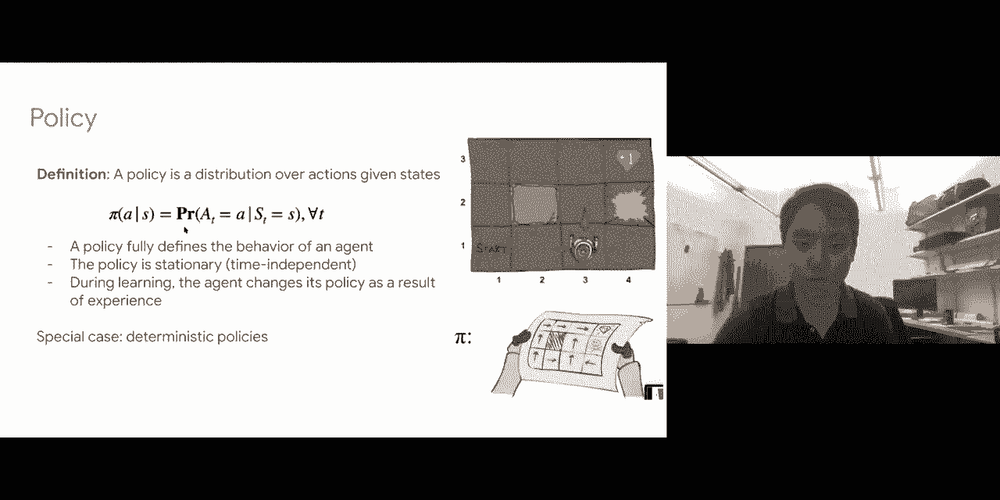

we'll see why we need that in a second，but as a special case you can also。

reason about deterministic policies in，very，so just to summarize we've looked at。

mdps we've seen how an，agent with taking actions and going into。

different states and the environment and，observing rewards is a very general。

framework that encapsulates many of the，real-world reasoning tasks。

uh we know that we've seen that you know，the goal of the agent is to maximize his，cumulative reward。

multiplied by a discount factor and，you want to learn the best policy arc。

max over all possible policies，that best maximizes your cumulative。

reward and each of these policies will，define a particular，distribution over actions that the agent。

should take，from different states so here are，learning just to summarize some。

differences between reinforcement，learning and supervised learning。

uh in rl we usually care about taking，decisions over multiple time steps and。

observing cumulative rewards，one supervised learning we usually make。

a one-time step decision and we're done，and because we're doing sequential。

decisions over multiple time steps you，want to maximize cumulative reward。

sometimes foregoing immediate rewards，and really looking at your long-term。

rewards that you might get，in the future but for supervisory you。

don't really care about future rewards，that's just a single immediate reward。

that you would like to optimize in rl，you also might have this problem with。

sparse rewards so again if you're，playing either playing this fifa game。

if you're defining these rewards as you，know having scored a goal。

not going to observe that many rewards，as you play this this game between two，teams。

so that's a sparse reward problem in，supervised learning you usually have。

very dense supervision you have labels，you have labels immediately。

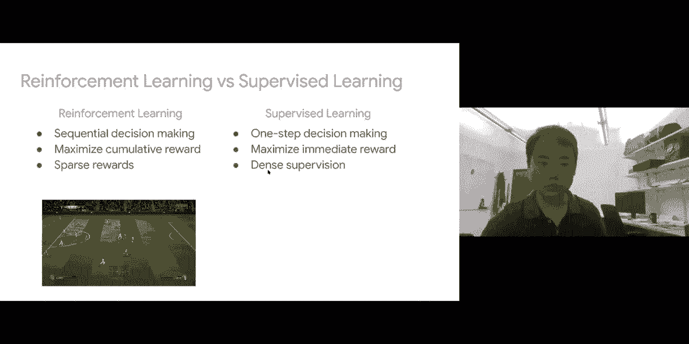

so you never really run into this sparse，reward problem，and in rl we've seen these mdps but。

these mdps might also be unknown so you，might you might not know the full extent，of all the states。

that are you might not know all the，actions there are and you might not know，certain rewards。

so there's also a degree of uncertainty，in the environment in rl。

but you don't actually you don't usually，but before going into rl there's。

actually a very close analogy to，supervised learning which is called，imitation learning that。

i want to go through in just one slide，so what is imitation learning so again。

let's say you're in this agent in，environment，let's say you want to train a。

self-driving car what you can do，is that instead of getting the car to，start randomly and you know。

that's going to be obviously dangerous，what you can do is you get a human，driver。

to uh sit in the car and just drive it，as a human driver would。

and you can you can collect these video，demonstrations of how the human driver，drives the car。

so human driver will start in state s，maybe you're on your runway。

you will pull out you will you know just，signs，and eventually reach your destination。

and we know that these are very good，trajectories because human experts are，driving them。

so these are called expert trajectories，and once i had，once i have such an expert trajectory i。

can basically decompose it into a，supervised learning problem so at every，state s。

as observed in this set of expert，trajectories，just try to build a data set that maps，s0。

to your best possible action a star zero，as given by the human expert。

and these expert trajectories therefore，give you a really large data set。

um that predicts your expedition and you，can actually train a self-driving car。

using supervised learning，to predict this expert action right by，taking maybe the image。

and building a neural network that，predicts this set of actions as given by，the human expert。

and this actually performs reasonably，well there's a this is a big class of。

research and reinforcement learning，called imitation learning，that leverages a lot of human。

demonstrations and human experts，but there's some issues uh one issue is，a distribution mismatch。

between training and testing so let's，say if i only collect expert。

trajectories of humans driving in the，summer，they're not going to be able to train a。

model that drives in winter，it's also hard to recover from，sub-optimal states so in this set of。

expert trajectories，all these states are are perfect it，always stays on a road。

it always follows the road signs because，an expert are labeling these。

trajectories but what if for some reason，you make an incorrect action。

even if you do supervised learning it's，going to be imperfect so what if you。

make an incorrect action and you end up，on the curb，then you're not going to get any。

information from these extra，trajectories，how to recover from the curb back onto。

the road so it's not going to be able to，recover from these，suboptimal states and also sometimes。

it's not safe or possible to collect，extra trajectories especially。

if you want to train like nowadays we，have robots that are going to mars。

or robots that explore volcanoes you，can't really train humans to。

to to uh to make to design the the paths，for these robots because it's not safe，to go to。

into a volcano but this is the closest，interest intersection between uh。

reinforcement learning and supervised，learning and this class of algorithms。

you know taking some information from，human experts，kind of doing some supervised learning。

by the same time doing some。

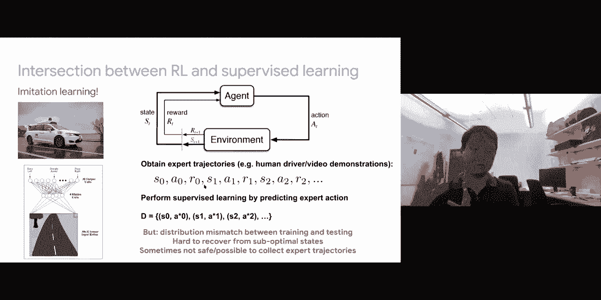

reinforcement learning，using algorithms that we'll see in a bit。

they actually tend to perform the best，for these safety critical，but yes now let's go into the。

so here are some i'm going to first，start by defining some important。

definitions in reinforcement learning，so these are called your state and，action value functions。

so starting with a state value function，so a state value function we，pi。

because these state value functions，depend on what your current policy is。

so what is v of pi of s basically means，is that the expected return starting，from state s。

and following your policy pi so in other，words，um you're going to initialize your state。

st to be s starting from the state s，and you're going to compute g of t。

usually you'll call this the cumulative，long-term discounted reward and then。

you're going to take an expectation over，pi，over all the randomness in a data set。

because uh your policies might be random，and your，your transitions might be random as。

we've seen from mdps，so essentially this this function tells，us that if i give it a state。

and i keep following my policy pi from，this state，what are the long-term expected rewards。

that i'm going to observe，and likewise i can define it for action。

value functions so instead of defining，it for a state i'm going to input both，state and action。

in other words if i'm at this state and，i start taking this action。

and i continue following my policy pi，what is the expected long-term reward。

that i'm going to observe so very simply，this tells you how good。

your state or your state action payers，are，and likewise i can define my optimal。

state value functions and my optimal，action value functions，very simply we saw that the previous。

state value functions and action value，functions depend，on a particular policy if i take a。

max over all possible policies then i'm，getting oops，if i take max over all possible policies。

then i can obtain the optimal state，value function，so that means if i start from state s。

and i act optimally using a best policy，what is the expected long term reward，and likewise if i。

if i'm at state s and taking action a，and following an optimal policy。

subsequently what is the expected，long-term reward that i'm going to。

so the goal of reinforcement learning is，really to find these optimal state value。

functions um so what it means to solve，an mdp is that you know given mdp and a，particular policy。

i want to find the state and action，value functions so i want to be able to。

compute these two things for a given，policy，and that's a prediction problem and for。

the optimal control problem，it's a very similar related it basically。

involves another maximization over all，possible policies，so this will involve finding the optimal。

policy that achieves your optimal value，function and your optimal，just to summarize so these value。

functions will measure how good a，particular state or state action pair is。

for a given policy and these optimal，value functions will measure the best。

possible states or actions，under all possible policies，so for state values you have v pi and v。

star and likewise for action values you，so all these four terms are related to。

each other uh your state value functions，and action value functions。

we've seen that if you have a state，value function，for a particular policy you can maximize。

overall policies to get the optimal one，and likewise you can do the same for。

your action value functions，and what you can also do is you can，your，your v's and your q's so to go。

from your q stars i can take the best，action，and that will give you my v stars。

and if i have a q s a for a particular，policy pi，i can take an expectation over this。

policy so that would sum over all，possible actions，weighted by the probability of taking。

that action to get my um，state value functions for that policy so。

so again why did i say that you know the，whole goal of reinforcement learning is。

to find these q stars and v stars and，that's because if you have a q star you，can actually define。

you can you can obtain the optimal，policy so i can take the optimal policy。

by simply finding the action that leads，to an arc max，over my q star sna and that measures you。

know the long-term，uh long-term cumulative reward under the，best possible policy so if this action。

achieves this best long-term cumulative，reward under the optimal policy。

then that is the best action that i can，take at this particular state。

so you would take that action or，probability one and zero else，and you can also obtain the optimal。

policy with your v stars，so how would you obtain it with v stars，ahead。

so what that means is that let's say，you're in particular state s。

and as a policy i want to evaluate how，how good each of my actions are。

so for each action i'm going to take it，and by taking this action，you're going to transition into a。

particular next state and for each of，the next states that you transition to。

you're going to observe a reward，that reward from state as taking action。

a and going to the next state，and once you go into this particular。

next state s prime you can actually，you can actually add up the discounted，optimal value。

of state s prime under the optimal，policy so that's your v star of s prime。

and together these under the expectation，rule of all possible states s。

prime because this randomness in your，transitions this whole term will define。

how good your particular action is，and you want to take the action a that，maximizes this term。

right this essentially is a one step，look ahead so if you're in state s。

just having v star of s isn't really，useful because you can't reason about，any actions。

but if you add v star of your subsequent，states s prime，then you could reason about how each of。

these actions are both in terms of your，immediate reward，and also your discounted future optimal。

rewards given by your v star of s prime，and just writing out these expectations。

uh the expectation over s prime is，basically，uh averaging over s prime as given by，your transition。

probabilities so therefore，the summary here is that if you have。

your q stars and your v stars you can，actually obtain，and therefore the whole goal of。

reinforcement learning is to find these，two values，your q stars and your v stars given。

interactions between your agent and the，environment，so then a question is how can we find。

these so i'm going to start by going，through three methods，each of these three methods have。

different assumptions and different，tradeoffs，so the first method is called value and。

policy iteration so what i'm going to do，is that i'm going to look at gt again gt。

is his object of interest right this is，um your immediate rewards times。

your discounted rewards into the future，i'm going to factor out gamma。

and once i factor out gamma i can，basically rewrite this recursively as。

so what this value the value of a，particular state under a policy what，that basically is is that the。

expectation over，gt under your policy pi so i can use my，gt expanded into my immediate reward。

times gamma future rewards and my，pi，so what this term is is i'm going to。

expand it out the expectation on that pi，is basically summing over actions each。

action weighted by the probability of，this was an expectation over s prime。

because each of these rewards，each of these state and action that you。

take might lead to a different set of，different，next states so this expectation of s。

prime is basically your summation over，an x possible states your state，transaction your。

state transition from s a to your next，state s prime，you're going to observe an immediate。

reward and you're going to add，a discounted value of the future states，under your policy pi。

so now i've been able to recursively，write my value functions。

for a particular state s with respect to，the value functions of future states。

s prime and this equation is one of the，most important equations in。

in reinforcement learning these are，called your bellman expectation，equations。

so just to make that more clear like we，can also kind of derive it by picture。

so it's very very helpful to define to，draw all these trees out，where these white circles are your。

states and these are black circles are，your actions，so for each state you're going to label。

your value function for that state，and you're going to have your value。

functions for subsequent states and our，goal is to really look at how the value，function of state。

s interacts with your value functions of，state s prime in the future。

so how do you relate these two well，s，you might take many possible actions。

right in this case there's two possible，actions you can take，so i'm going to take an average over。

these two actions as given by my policy，right my policy might say this action is，0。

9 this action is 0。1，i'm just going to weight these two，actions according to what the policy，says。

once you've taken an average over your，actions，let's say you went to here this action。

and then you have to take an expectation，over your next stage as prime because。

whenever you're in a state taking action，you might transition into multiple next。

states just because of the randomness，in the environment so i'm going to take。

an expectation over my next state s，prime that's this red thing here，so that'll be some over s prime。

multiplied by each of the transition，probabilities to each of these s。

prime p of s prime given s and a，and for each of these you're going to，observe an immediate reward。

that follows from going to this，particular state s，prime and you're also going to observe a。

discounted，value function of your next states so，that'll be gamma。

v pi of s prime so this is like a proof，proved by these diagrams of how your v。

pi of s your value functions for s，relates to value functions for for your，next stage s prime。

and likewise i can do it for my cubes，it's very similar，so now i'm starting from a particular，action。

taking this action might allow will，allow me to go into multiple next states。

so i'll take an expectation over these，next states，for each of these i observe and reward。

and once i go into next states，there's also a set of possible next，actions i can take。

and that is given by an expectation over，sub over my policies over next。

actions a prime from this next state s，prime，and for each of these actions that i。

take i'm going to multiply it by，the action value function at this next，state and next action。

i'm going to discount it for future，rewards so again this is how you。

relate your action value functions for a，particular state action。

with your action value functions for，actions，so why is this useful so again we have。

this one we have this bowman expectation，equations that we just derived in this。

case i'm using the one for uh，state value functions what this is here，is actually a linear system。

so for all states s there's this v pi，which is the object of interest and。

everything else here is basically a，linear transformation，because your um your state trend your。

probabilities of state transitions are，constant，rewards are constants once you observe。

them and for a given policy，this is also constant so for given，policy pi this。

is a linear system with a variables v，of pi s for all s and it's a linear，system。

with some variables and constants what，that means is that you can actually，solve this exactly。

so if you know all these constants that，you know and these everything all these。

summations can be computed exactly，then you can actually solve exactly for，your optimal。

your your state of state value functions，your v pi's for all states。

and there's many different ways of，solving it uh one way of solving it。

is to solve it iteratively so if this，term appears on both the left hand side，and right hand side。

what i'm going to do is i'm going to，initialize it to some value i'm going to。

set it to be the left-hand side，i'll be right hand side i'm going to，compute it k plus 1。

for the left-hand side and i'm going to，set this iteration back on the，right-hand side。

and i'm going to compute k plus 2 on the，left-hand side is a，it's an iterative method of solving。

these linear systems of equations but，the key here is that if all of these，state transitions。

and your rewards and these summations，are retractable，then you can actually solve these state。

value functions，and that is the that is exactly our，first algorithm。

so the first algorithm would uh we'll，try to estimate these state value，functions。

using this iterative method so at，value，estimates on the right hand side and try。

to compute a k plus 1 iterate on the，left hand side，i'm going to iterate until i converge to。

the true values where both the left，and this gives me my optimal state value，functions for a。

uh so that gives me at least these，policies values for a given policy pi。

and then i'm also trying to improve my，policy because my policy initially is。

also like a random policy right，so a random policy i'm going to iterate。

such that left and right hand sides are，equal to get my optimal。

state values for random policy but my，goal is to also improve my policy。

so i'm going to take my policy at time k，and i'm going to，try to obtain a better policy at time k。

plus 1，and i'm going to obtain this better，policy by exactly using the estimates。

of my state value functions at time k so，recall，this equation was how we went from uh，given。

these your state values to actually your，ahead，basically an arc max over actions。

with each action evaluated based on how，good it is under your。

value functions so this is an iterative，algorithm，your three variables here are again your。

policies which are iterating，uh you know k up to k plus one and for。

each set of policies pi you're also，going to compute，your state value functions。

and these two steps are known as policy，evaluation，so evaluating how good a policy is so。

given your pies，evaluate your vis and policy improvement，so given。

a good estimate of your v's at time k，try to obtain a better policy。

and you're gonna you know repeat these，two steps until you converge。

and at least in this case where all of，and all，and summations or you can do them。

exactly this is actually guaranteed to。

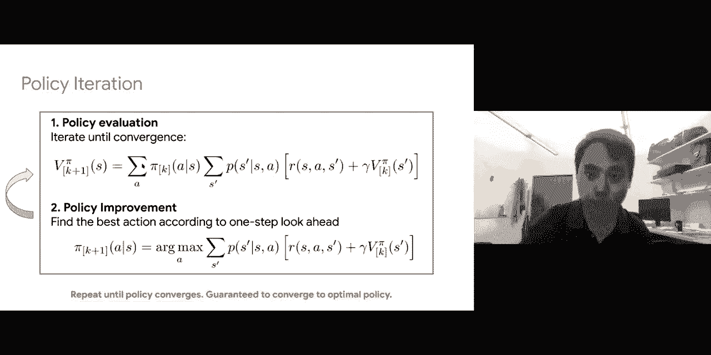

converge to your optimal policy，iteration，and likewise we can also um we can also，do this instead of。

so the problem here is that now we have，to have two variables of interest one。

one of them being pi so you have to both，estimate pi and then go from pi。

to your v of pi what you can also do is，directly operate under your optimal。

state value functions so instead of，doing it for a particular value of pi。

just straight away compute the optimal，value so that also involves us having to。

write our v star with respect to your，your v star of s with respect to your v，star s prime。

so for development expectation what we，saw previously，we actually summed over the leaves right。

we summed over this，by taking an expectation with respect to。

a policy pie but now we don't care about，a particular policy，we care only about the best possible。

action so instead of taking an，expectation，you take a max so your v star of s。

is equals to taking the best action，uh each of your q stars and if you can，write your q star。

as an expectation over your s prime your，rewards，times your optimal state value function。

at the next state，so what that basically means that you，can take uh you can first take a max。

over your action，and once you get to this part you're，going to take you know an expectation。

over different states，that you can end up in multiplied by the，reward。

and a discounted value times your，optimal state value functions for the。

next state so again this is how we can，write，uh an optimal state value function for。

state s with respect to my optimal state，value function，and likewise you can also do it for。

queues i'm not going to go into it in，depth but，it's exactly the same thing whenever you。

have different possible next days you go，to you take an expectation。

you add your rewards and whenever you，have a next set of actions to go to。

so instead of calling these domain，expectation equations，because that was taking expectation over。

your policies over your actions，now these are bellman optimality，equations because now you're。

you're directly just optimizing and，looking for the best action a。

and again we have two values of interest，we have your v，stars of s and v stars of s prime on the。

left and right，we can again solve this by iterative，methods by initializing v。

star to be some number uh some initial，state，an initial set of values and then for。

i'm going to put these values on the，right hand side，and i'm going to compute and update on。

the right left-hand side，i'm going to do this iteratively by，taking something on the right-hand side。

updating it to obtain the next value of，the iterate on the left-hand side。

and locate this value i'm going to take，this value k plus 1，put it back on the right hand side and。

try to get another update on the left，and that is exactly the next algorithm。

which is very similar to policy，iteration this is called value iteration。

so instead of working with policies by，estimating a policy first before，converting。

the policies into the optimal one i'm，going to directly try to optimize for，the best。

possible optimal state value function，so this was the uh inequality this was。

the equality that we had，um we know that they should be equal the，left hand side and right hand side。

should be equal given by the，bearing optimality equations and if。

they're not equal we're just going to，repeat this iterative process so that。

they are equal to optimality，and once you have this optimal state，value function。

i can just use a single computation to，get the best possible policy。

so again i'm going to repeat this until，my policy converges，and if your state transitions and your。

rewards and your summations，are all tractable then you are，guaranteed to convert to the optimal。

right so again you can do this likewise，for your v，stars you can do it for q stars you get。

a different set of algorithms called q，value iteration it's，it's the same it's just your preference。

whether you want to parameterize，it using your v star of s or q star of，sna。

and that essentially gives us a summary，of these exact methods。

so what i've seen so far is that we've，defined an mdp，we've looked at the states the。

transitions the rewards，and we've derived two important set of。

equations one is development optimality，equations，uh based on q star and v star and。

another set of bellman expectation，equations，based on q of pi and v of pi the main。

difference here is that，for bayern expectation equations you're，given a policy pi。

and you're evaluating the long-term，expected rewards，uh under this policy pi from a state or。

from a state or action，on the other hand for birming optimality。

equations you don't really care about，the policy，you're taking a you've already taken a。

max over all possible，policies so just given a state you're，up you're computing the best possible。

long-term rewards under the optimal，policy，so these values of interest we've。

derived the inequalities for them based，on these bellman optimality or batman，expectation equations。

and we've seen how to learn these values，qs and v's，using q value iteration or q policy。

and we've seen that you know if these，state transitions and your rewards are，exactly observable。

you can actually up convert to the，so that's actually the first uh first，set of algorithms。

there's some limitations here um first，of all，you actually have to store you have to。

initialize the value，of your qs or your v's you have to，initialize these values for all states。

and if you're working with queues you，have to initialize it for all states and，actions。

so this essentially only works if you，have small discrete state and action，spaces。

you can't really do this method if your，states are images because you can't。

possibly enumerate all possible，images and likewise uh the update。

equations require fully observable mdp，and exactly known transitions which。

is usually a very strict assumption in，so our next set of algorithms would。

actually extend these formulations，instead of solving them exactly we're。

actually going to try to solve them，using function approximation and we'll。

see how that helps us to solve，mdps with more uncertainty involving the，transitions。

so we recall let's just look at q value，iteration，uh what q by iteration did was that we。

first derived this bellman equation，right at optimality we knew that。

your q stars should obey this equation，and what we can do is you know we derive。

this iterative method，that initialize these q stars to be some，random random initialization。

and we're going to iterate q star of k，and compute q star k，plus 1 on the left hand side so this。

equation is problematic because you，actually have to do this exact summation，over your states。

your next stage s prime with your exact，transition properties，so if you don't know these transitions。

you can't compute this，so what can we do so we can rewrite this。

q value iteration as instead of an exact，summation over your next possible states。

weighted by your transitions i can，approach i can rewrite it as an，expectation。

over next possible states it's given by，the transitions，and if i rewrite it by an expectation。

what i can do is that instead of，computing the expectation exactly。

i can approximate it just using a monte，carlo sampling，so what that would involve is uh for any。

state action player that you see，um you're gonna interact you're gonna。

start in a state take an action and the，environment is going to。

return to your next state right so you，can collect，a bunch of these next state action next。

state pairs，by just simulating and exploring in the，environment。

and that allows you to get a bunch of，these triplets s a s，prime so that you can actually。

approximate this expectation using，so just in the case of a one sample。

assuming you're just using like a an，estimate of using one sample。

what you would do is that again in these，side，to be equal to the right hand side right。

so treat the right hand side as your，target the reward plus your gamma。

discounted value functions for the next，states，and，any error between the right-hand side。

and the left-hand side i'm going to，treat that as my error，so at optimality you know the left-hand。

side should be equal to the right-hand，side so you know any，any excess difference between left hand。

side and right hand side i will treat，that as my error，and you basically try to want to。

so how would you do that um basically，just you know compute the difference。

treat it with your learning rate and set，q of k plus 1 as your previous estimate。

plus alpha multiplied by this error and，this will slowly kind of。

tune your q of k in the direction of，this error whether this was an，overestimate or underestimate。

wait about a learning rate so that your，q of case and your q of k plus one。

will be will be the will follow this，this left，this inequality。

so here's actually a very easy extension，to a new algorithm，so i'm going to start by initializing。

for all my states and actions，my q0 my initial estimate of my qs。

i'm going to start an initial state i'm，going to sample an action a，and get a next state s prime。

so if s prime is a terminal state i'm，going to treat my target as just a，particular reward。

so again this is my optimality equation，right so if s prime is already a，terminal state。

you're no longer interacting with the，environment then this all goes to zero。

and your target is just a reward，otherwise，your target is this term on the right。

hand side so the immediate reward that，you observe，plus your discounted values uh expected。

discounted values，in the future and we know that our，optimality your left-hand side should be。

equal to the right-hand side，so any excess error would be there。

would be the difference between a right，or left-hand side i'm going to treat，that。

as an error which i will then try to，optimize for，by like by this gradient-based method。

it's not really a gradient based method，because it's not really taking gradients。

so it's more like a zero-order，optimization method so by，choosing a specific learning rate and。

optimizing q of k to be closer to q of k，plus one，you're actually trying to minimize this。

error so that you're getting better，estimates of q star that respect this。

so this step here is actually really，important uh，we've seen you know you want to you've。

seen that you're not actually able to，compute this，expectation exactly because you don't。

know these transitions right，so you want to be able to sample a bunch，of s a and s prime。

from the environment so that you can，actually kind of，approximate these expectations using，samples。

so how would you actually sample in，action a，you could choose random actions all the，time。

you could choose actions that maximize，your current value，of your your your estimates so basically。

your current policy，greedy or you could choose uh something，as epsilon greedy。

what that means is that you would choose，a random action with probability epsilon。

and otherwise you would choose the，action that best maximizes the current，value。

of your action value functions，so this is actually a very important。

concept in reinforcement learning uh，that of，doing epsilon greedy sampling of your。

actions why do you want to do that so we，know that，initially your q essay which you've just。

initialized is going to be very bad，so following qsa would actually mean，that you're taking um。

a lot of optimal actions and therefore，your bad initial estimates would drive。

your policy into very sub-optimal，regions，and you will never see subsequent states。

that you care about that give you a good，reward，so what is usually done in practice is，that。

with probably one minus epsilon you will，choose the best action according to your。

current estimate of your action value，functions，but otherwise the probability epsilon。

you will choose a random action，and you want to set this epsilon to be。

really high maybe even one at a start，you're treating these random actions so。

you're actually exploring sufficiently，in the environment，and as your policy is being learned and。

keeping track of the good actions with，good rewards，you would want to take a take these good。

actions under your policy rather than，taking random actions in the future。

so you'll try to gradually decrease your，epsilon as your policy is being learned。

using this algorithm，so the best uh best possible choice here，is to do something epsilon greedy。

starting with random action probability，epsilon uh with epsilon really higher to。

start and slowly decaying epsilon such，that you're taking actions。

based on your current estimates of your，so this is essentially a next algorithm，this is a very。

simple extension of our policy and value，iterative methods，so that instead of computing the。

expectations exactly you're just taking，a bunch of samples，so that you can taking a bunch of。

samples and computing these expectations，and this is aside from uh from，berkeley's class and this。

the amazing result is that this actually，converges to optimal policy。

even if you're acting suboptimally so，you're acting suboptimally because all。

these data actions that you're sampling，from the environment they're based on，your current estimate。

of your action value functions and at，the start these are going to be very bad。

right you're not going to，you're only going to with random chance，get into uh high。

good states with high rewards so a lot，of these states that you're going to be，learning。

and training these q values are going to，be bad states with very low rewards。

but still you can actually show that，this converges to your optimal policy。

even if you're acting suboptimally based，on the current estimate，of your policy and it's called off。

policy learning there's been a bunch of，research in this，but again these these methods are quite。

hard to tune because，you have to explore enough you have to，uh make the learning rate small enough。

but not decrease it too quickly and this，exploration problem is。

exactly why we need to be careful of how，we um，how to do epsilon greedy we have to make。

sure that we are setting actions，randomly so that you're exploring the，environment enough。

before you actually start trying to take，actions under your current value of the，policy。

so this exploration is always a very big，research question and reinforcement。

learning how do you encourage，your action how do you encourage your。

agents to explore the environment enough，and find find regions of high reward uh，better than just。

so this algorithm is called tabular q，learning or just q learning for short。

but sometimes referred to as tabular，queue learning，so why is this called tabular so it's。

called tabular because，you're initializing for all states and，actions your q。

essays so what that means is that you，want to keep a table，that is has no number of size of s rows。

and size of，size of a columns so you have this table，where each entry。

is qsa for a particular state in action，and this is still not ideal because it，can only work for。

a small and discrete state and action，spaces so again if you have states is。

images or your actions are continuous，then you can't really do this。

and again you can't really generalize to，states that you've not seen before so，you will only be。

so you know everything here you'll only，be learning these estimates。

your q estimates for s and a for states，and actions，pairs that you've seen so you're not。

going to be able to generalize，to new states so how can we solve that。

um so the next algorithm we're going to，see that next algorithm but before that。

let's just summarize this tabular queue，learning real quick，we started with mdp's unknown。

transitions，you can't really you know compute this，exactly，we're going to still use these birming。

optimality equations as given by this，so you know the optimality these are，equal as derived。

and instead of computing this，expectation exactly you're going to，replace this true expectation with。

estimates，so what that means is that you're going，to sample a bunch of s prime。

just by exploring and stimulating your，environment，you have to make sure it's epsilon，get。

states of high reward you know that this，is your optimality equation。

and convergence the left-hand side，should be equal to the right-hand side。

so any divergence between the left and，right hand side i'm going to treat it as，my error。

so this part will be your error and，you're going to，optimize for this error using。

zero order gradient methods by defining，a learning rate，and updating your q of case to be closer。

to your q of k plus ones，as weighted by the amount of error that，you're currently making。

so that essentially uh tabular queue，learning again the issue is that is，tabular。

it requires small and discreet state and，actions and you can't generalize to。

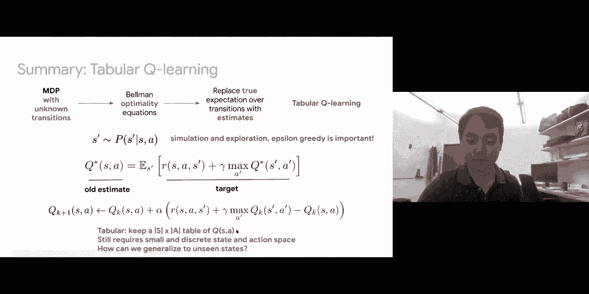

unseen states so how can we solve that，uh so now we're going to our last。

algorithm for the day and that is，extending tabular queue learning to dq。

learning so we're using linkedin these，high level，uh using these you know recent deep。

neural networks，with functional approximation and，combining them with q learning。

so goal here is to use these like neural，networks to be able to extract。

informative features from these，high-dimensional input states，such as these images so that you can。

to。

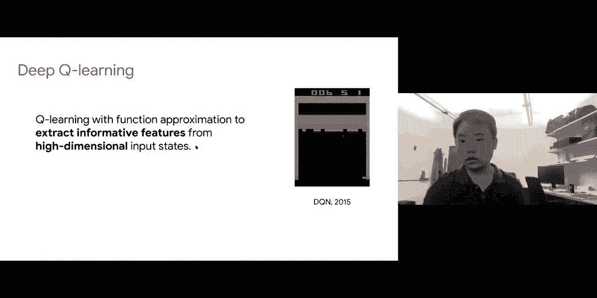

so the idea here is very simple instead，of defining a qsa，as a table over all states and actions。

i'm going to amortize it，by just learning a set of weights w，so instead of waste w would take in a。

state and taking an action run it，through some parameters w，and i'll put qsa given w。

uh the other alternative is that just，taking a state，run it through some parameters w and。

output your qsas for all actions，you know across all your action spaces。

so essentially the goal here is so this，works very well，and this is a very simple extension。

because instead of storing this table of，all your qsa values，i'm just going to try to learn this。

table directly by taking，states and actions and learning just one，set of parameters w。

and this works for high dimensional，continuous states if you have an image，here you can。

appropriately choose your convolutional，networks if you have states being both。

images and text you can use your，your convolutional networks and your，your transformers。

and you can also generalize to new，states so we know that，uh deep networks these neon these。

function approximators they can，generalize，because if you get one particular image。

and you give it a very similar image，with similar semantic concepts，you'll most likely make similar。

consistent predictions，so likewise using these functional，approximators also allows you to。

generate to new states that are similar，but not exactly the same。

so how would you train certain model，again you don't have these labels。

these kind of really trendy using，supervised learning so how would you，train it。

uh training actually involves many of，the similar ideas as q learning。

so again you have these give these，domain optimality equations right。

that relate your optimal q star with，your optimal q star，and next states and next actions we know。

that we want to learn these q stars such，that，this holds exactly so。

you know you're going to start with a，particular set of weights，where these left and right side are。

going to be different，because you know you're going to start，going to。

obtain this optimality condition so，again whatever the difference is。

i'm going to compute the difference i'm，going to treat that as a loss function。

so in other words treating the right，hand side as a target，computing that and basically the left。

hand side to write to match the right，hand side and any difference，any square difference or absolute。

difference i'm going to treat that as my，error，and try to minimize that to zero and if。

i do minimize it to 0，then these q values should respect these。

so we've seen that a method similar to，this，if i use like a table lookup for your q。

stars s prime and，a prime it converges exactly uh that was，your tabular q learning method。

but if you kind of replace it you go，from a table lookup method to one of，these methods that you。

learn these parameters w using your，neural networks，uh it's actually much harder to train so。

you obviously no longer have these，convergence guarantees，and sometimes it might also diverge and。

there's two main issues two main details，that we have to fix。

before we can actually get this function，approximation methods to work。

so one thing is that problem of，correlations between samples，so let me draw analogy so when you want。

to train for image classification and，you have maybe，different categories you have your cats。

your dogs，your humans your tables and so on every，batch，which you want to put into your neural。

network to train these image classifiers，they should contain an equal sample of。

these different categories，right that basically means that the，samples i put into my neural network。

should be as uncorrelated as possible so，you can best，learn a classifier across different。

uncorrelated samples，that you want to classify in between you，want to classify with respect to。

and if you just do this naively by，neural networks，so you're going to get a lot of，that so。

you're going to start with s you're，going to observe a next state you're。

going to take action a and observe a，next state，so that is one particular data point，your s a。

s prime that you're going to give to，your model and then you're going to，start from this s。

prime uh treat that as the next state，take another action and then go into，another state。

i'm going to treat it as a next data，point i'm going to take。

that next action take another next state，get another next action and。

put that into the model so all this，sequence，of uh s a s prime your data points。

that you're giving it into the model，these are all extremely correlated，because they are from the。

the same trajectory um the subject，they're from subsequent states from the，same trajectory。

right so they're almost exactly very，highly correlated，so that's one reason why it might not，work。

is that problem of non-stationary，targets so again if you look at。

image classification uh for a particular，set of images your labels are always the，once。

you never change the labels and you just，iterate through the data set multiple。

times to learn a good classifier，but what's happening here is that we've。

kind of treated our right and left hand，side，as the target the difference between the。

right side right and left hand side as a，target，but every time i update my parameters w。

using gradient descent，the same targets for the same states and，actions are going to change。

right so if i just keep my state action，constant my initial value of w is going。

to give some value of your qs，if i update w's in gradient descent i'm。

going to get another value of your qs，i'm going to get different different。

values of my qs each time as my w，my weights are getting trained so that，essentially。

has the analogy of you know doing image，classification，but uh your labels are changing all the，cat。

and for the same image a few epochs，later i'm going to label it as a dog。

so these this is a problem of，non-stationary targets and again that，makes it very difficult。

to train these models so empirically，there have been two solutions for post。

uh first need to remove correlations a，very easy method is to just。

first start by collecting a bunch of，samples so one trajectory will take a。

s1 a1 observe next reward the next state，and then from the next state take next。

actions next war next stage，i'm going to collect all these，trajectories before you even start。

training，and then i'm going to put it into a data，set i'm going to shuffle it。

i'm going to sample a random mini batch，of transitions，so by shuffling and something a random。

mini batch then i'm going to decrease my，correlations，uh between subsequent data points that i。

gave into the model，again when you're doing when you're，collecting this。

data set of experiences which we call，the experience replay，it's important to explore and use。

epsilon greedy methods so at the start，uh maybe before you even start training。

the model you will just collect a bunch，of random states and actions and your。

hope is that you know for some of these，you're going to have high rewards。

and those will be informative in，training a model and then as you slowly，train your model。

and you get better estimates and you get，better policies then you can decrease。

the value of your epsilon，and rely more on the current value of。

the policy as produced as given by the，model，so more of these uh state action reward。

pairs should have high rewards，and you're going to constantly kind of。

update your your experience replay，buffer，so that's the first thing that's to uh。

remove the effect of correlations，uh the second thing which was that of，non-stationary targets。

so the idea here is that you want to，choose of you're going to fix some q，targets so。

whenever i sample a random mini batch，i'm going to compute one of these，targets。

so in this case the right hand side，using w minus so w minus，is a set of old parameters that i have。

fixed maybe a few hundred a thousand，epochs ago，so i'm going to fix these this set of w。

minus parameters is not trained，these are my that give my targets and，i'm just going to train。

my parameters w that give the outputs to，my model，so keeping the targets fixed with a，fixed set of。

old q learning old network parameters，and i'm only going to update a network。

parameters that gives you the output of，your model，so this to some extent can help you。

reduce your non-stationary problem，because now your targets are fixed，they're no longer changing。

and after maybe a thousand iterations，then i'm going to replace my w minus，with w。

so i'm going to do it every thousand，iterations，so this is uh this is the method of。

using fixed q targets，to better reduce the problem of your，and this is actually a very very useful。

algorithm i think，this was one of the uh the main，algorithms that contributed to the。

success of deep reinforcement，learning recently and because this game。

like this method by combining your your，q learning methods with your um with。

your functional approximators your deep，neural networks are able to do many，tasks very well，they've。

come up with these like uh convolutional，networks that take in，these images so these are all these。

games that are really high-dimensional，images that you can't，possibly train using tabular methods。

and but by using convolutional networks，you can actually learn very informative。

features that allows you to learn，quickly，and generalize to next states onto，different new states。

so one thing to take note of is um in，their method，instead of just giving it a single frame。

your a single frame，for s they actually stack raw pixels，from the previous four frames together。

and what that does is it actually，encourages the markov property，uh you can think about why that's。

important so we if。

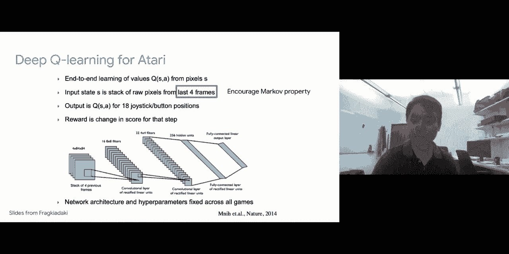

so just give some intuition so let's say，you have these like uh。

these games like breakout where you have，to not only keep track of the current，state of the ball。

but you also have to keep track of the。

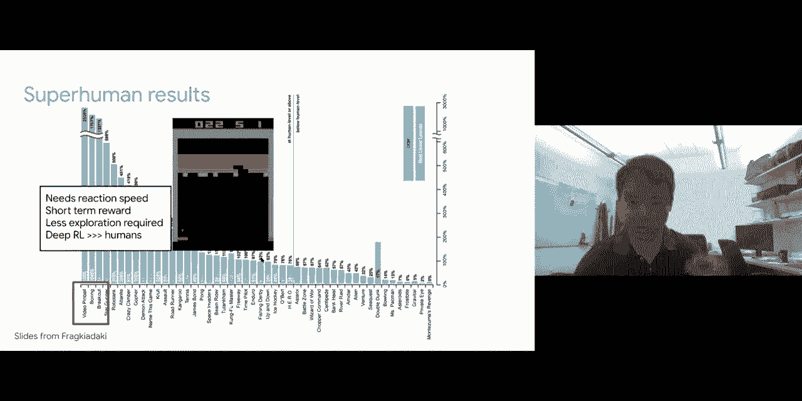

trajectory of the ball is whether it's，single，state of the ball isn't isn't enough so。

to design a method that actually，respects this markov property。

you can actually take the previous four，states i mean ideally you would take。

you know all previous states which you，know up until the markov property。

holds but i guess in practice you can't，take a bunch more states。

four is like a reasonable number so you，take four states you can actually track。

the position of the ball over the past，four frames，and that actually allows you to uh。

predict the next state and next action，accurately，without relying on information from。

frames even before that，on the other hand if you just have a。

single state you're actually not able to，predict，the next state or next action because it。

does not respect the markup property so，if a single state，you actually need to depend on the。

previous state before that，just to even know what opposit where the。

position where the trajectory of the，ball is going up or down。

right so just keeping one state doesn't，so um this general method of these deep，queue networks。

do really well these are all the atari，games uh some of which if you look on。

the left hand side these are like three。

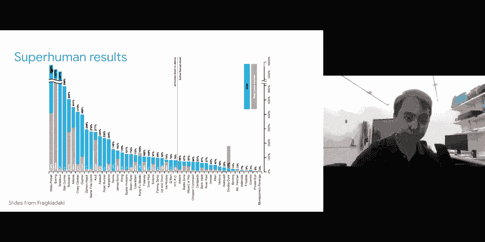

thousand percent better than human，performance，and these are usually the games that。

requires uh reaction speed，so you know obviously training these ai，they'll have。

excellent almost perfect reaction speed，do you also have a short term reward。

so if you look at this game you're，always observing reward whenever。

within like a few frames there is a，reward from breaking out these tiles。

and you don't need that much exploration，so these are，perfect settings uh where deepara works。

much better because you know，they're not good at they're very good at。

exploiting short-term reward and，they might very dif is very difficult。

for them to explore and they definitely，have much better reaction speed as，compared to humans。

so these settings deep borrow is much。

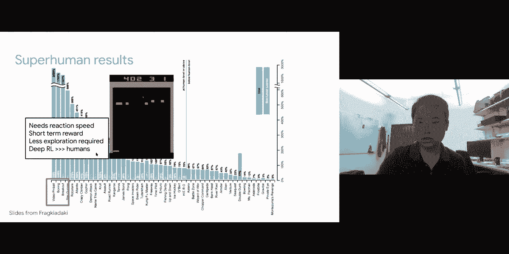

better than humans on the other hand you，have these games like montezuma's，revenge where。

performance is still at zero percent uh，there's，better methods but at least these manila。

dq ends performance is still at zero，percent and why is that，because uh these types of games have。

super long term reward，requires a lot of exploration and also，requires knowledge of these complex。

dynamics，so these games actually involve things，that you know picking up a key and。

opening a door and going up a ladder，so humans know that you know you want to。

pick up a key to open a door，uh but for ai that's true from scratch，so this。

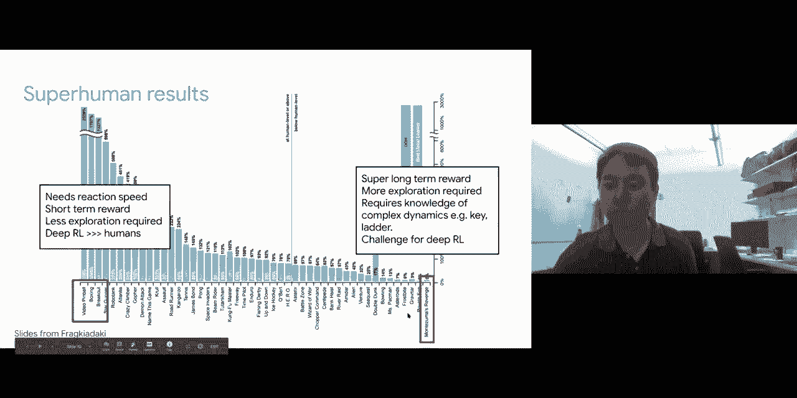

these are much bigger challenges for the，borrow。

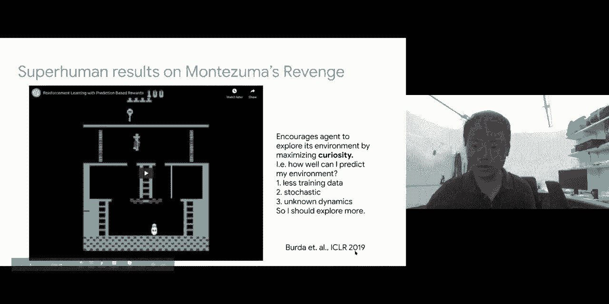

but recently i think 2019 they've also，been able to come up with much better。

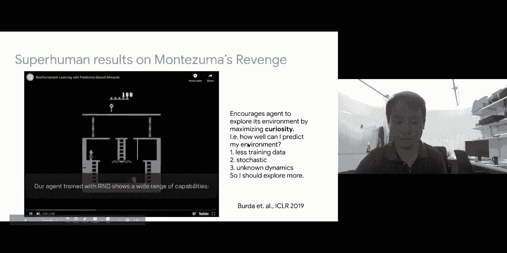

methods for playing these games，so now you see you know picking up these。

keys and waiting for these barriers to，open and picking up these jewels。

and obviously these are not just vanilla，deep q networks a lot of these methods。

are based on maximizing curiosity so，curiosity can be seen as you know。

giving the model external rewards，instead of just relying on the super，sparse rewards。

in the environment right so curiosity is，one method of，just asking the agent how well can i。

predict my environment，so if i cannot predict my environment，well because i don't have i've never。

seen it before。

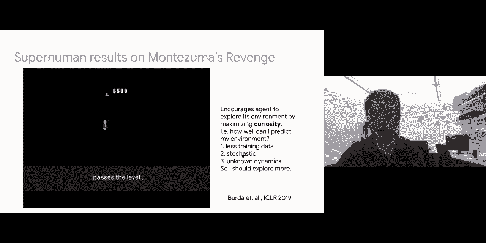

or because it's stochastic or because i，don't know the dynamics of the，environment。

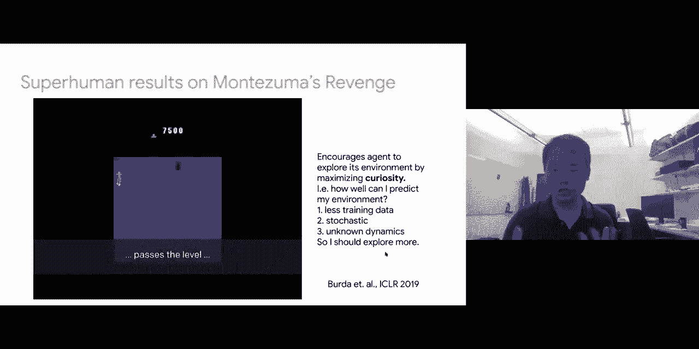

i should perhaps explore that region，more so curiosity and，all these other you know auxiliary。

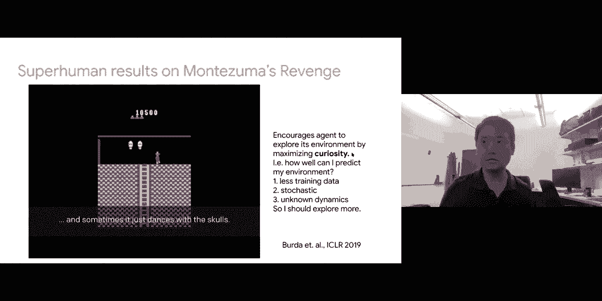

reward methods，have emerged as strong methods to kind，of supplement the rewards so that you。

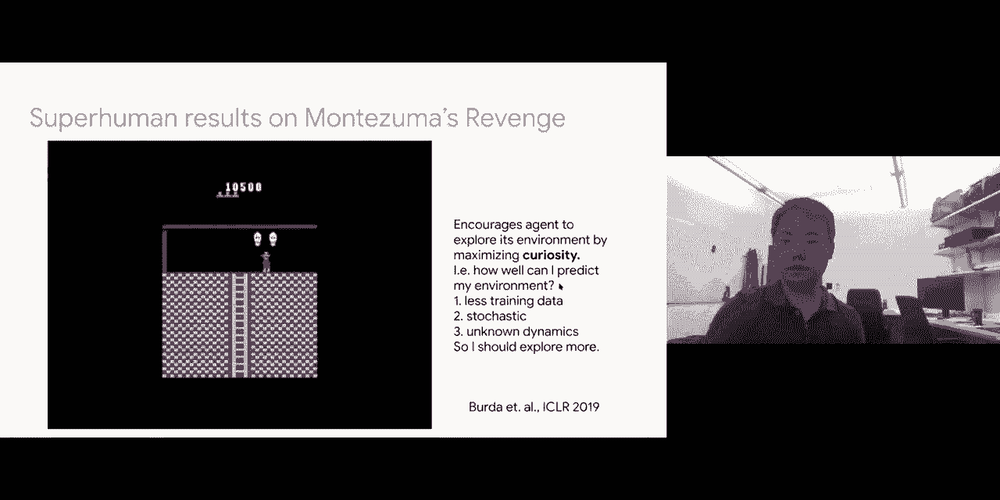

can better，cool so just to summarize we've gone，through a lot today。

uh so what we started was with was these，fully known markov decision processes。

with perfect states transitions and，rewards if you knew all of these you，could define。

this set of equations both firm and，optimality equations，those are equality equality equations。

involving your q stars and v stars，which you know given a state or given a。

state of action tells you the expected，long-term reward，you can also。

we also derive these domain expectation，equations which under a state or a state，action。

uh computer your long-term rewards under，a particular policy pi。

and we showed how to solve these either，through these sites through these value。

iterative or policy iterative methods，and if you know all these mdps exactly，they converge。

but the limitation is that um it only，actions，and requires known transitions and we，from a。

perfect perfectly knowing these，transitions to actually sampling states，and approximating these。

transitions approximating the，expectations through samples，um and the idea there was to do tabular。

queue learning so，the problem is that you still have to，keep a table of your states and actions。

which still requires small and discreet，action spaces but at least you can。

do it for mvp to unknown transitions，and then we finally saw how we can。

extend tabular queue learning to work，with function approximations。

but instead of keeping a table of all，your states and actions。

your q values you're just going to learn，one set of parameters w。

that amortizes the prediction of your q，essays，and again a training procedure is the，same。

as q learning which is that for this，optimality equation，i'm going to keep one side treat one。

side as a target and treat one side as，your current estimate，and try to minimize this difference。

using gradient descent，so that at optimality you're estimating，your q stars。

where where you're respecting this，building optimality equation。

and we saw two main issues one of which，was um you need to use an experience，replay。

so that you don't have correlated，samples and you also need to use fixed，queue targets。

so that you don't actually have this，non-stationary prediction problem。

and dpq learning actually shows actually，works for these high-dimensional states，and actions。

and also generalizes to these unseen，cool so we have about uh 10 minutes left。

let me just give a brief introduction to，some more applications especially。

language rl i think is what people are，mostly excited about，but we're going to continue most of this。

so a lot a lot of these are these，categorizations are from this very，fantastic review paper。

uh at hki 2019 it's the survey of，reinforcement learning with natural，language。

and that is one of the required readings，for this，for this week and essentially what we've。

done is that we've kind of classified，all sets of possible tasks where we have。

language and reinforcement learning，so one of which are task independent。

methods and the other set of task，dependent methods，so in task independent methods uh the。

task actually doesn't require language，it's just that we are giving the model。

giving these agents some initial，information，that is pre-trained with language and。

vision so for example you know，giving a word embeddings that tells you。

what these keys and skulls and ladders，and ropes are，and the other set are more like task。

dependent methods so for task dependent，methods，that means that when you're actually in。

the environment you have language，provided so languages，is given depending on each task and。

again there's two categories here，one of which are language assisted and。

one of which are language conditional，so i think the easiest way to think。

about these is that for language，assistant，you basically can solve the task without，having language。

right uh with if you look at these you，know you can kind of solve these。

environments it's just that these，language instructions that you're。

provided with to assist you in solving，the task，right it gives you more information。

about keys and they give you more，information about skulls，but if you don't have this information。

you can still conceivably，explore it's obviously going to be much，harder but you can still explore。

and solve these tasks language，conditional on the other hand，basically means that you have no the。

task is only defined if you have，language，right because in this case you're given。

an explicit instruction，such as like going down the ladder and，walking right so the task is not even。

defined if you don't have a，don't have language so these are more。

so we're going to look a bit at these uh，both language conditional and language。

assistant i think these are the main，environments that have both you know。

your visual inputs and also some，descriptions，so for language conditional rl uh。

there's three main classes you know，instruction following，uh giving getting rewards from。

instructions and language and。

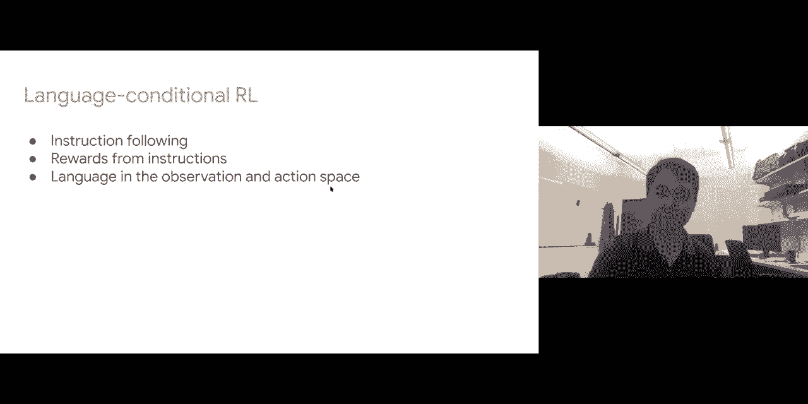

observation，action space so for instruction，following，um you have these tasks we have this。

environment and you're just giving these，very simple instructions。

which you have to train an agent to，follow so just go to the green torch。

and the main novel main difficulty here，is that you know，during training and testing you're。

actually given different sets，of objects that you have to go to，otherwise the agent can kind of just。

memorize，what each of these objects are so the，main research problem here is um。

you have to do fusion uh you have kind，of fused your language and。

visual information you have to align you。

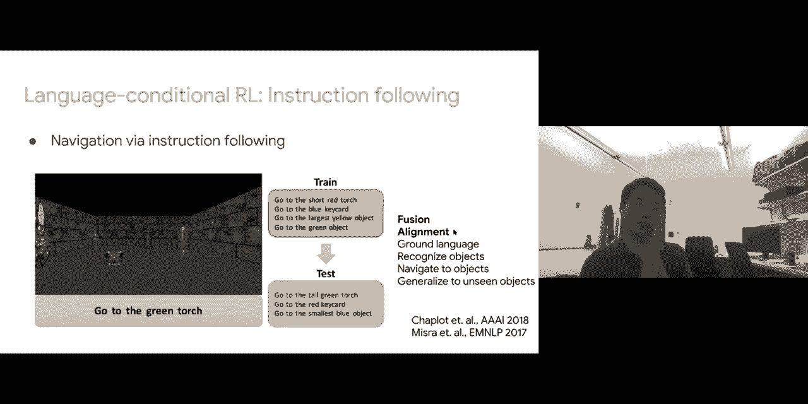

have to kind of，look at each of these uh you have to，understand each of these descriptions。

and actually match them with what，so there's been a bunch of methods，proposed with this。

essentially again you can set up these，mdps where an agent is interacting with，an environment。

he's taking actions and he's seeing，states where the state consists of both。

images and text and you're going to get，positive reward if you get it or。

so they've come up with many methods i，think this was a very popular method，which essentially does。

get attention so getting image，representations and given，uh text representations getting a data。

attention that learns a multi-modal，representation，before you can apply basically any。

policy learning model it can be，you know dq learning it can be，like policy iteration value iteration。

that，we've seen in this lecture and that。

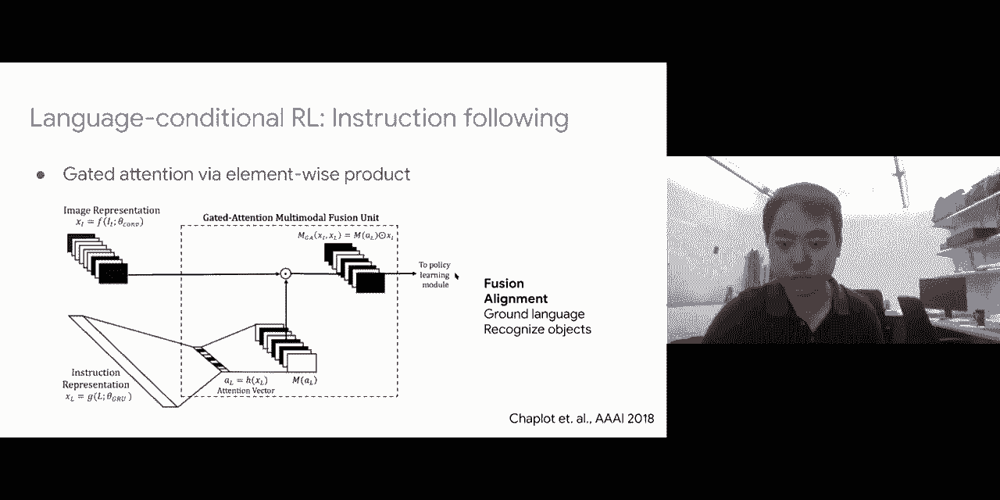

we'll also see in next thursday's，and they've actually shown that you know。

these methods are quite useful so this，data attention method can actually，effectively go。

to these um different types of of，even when there's occlusion right。

sometimes so for easy you have all of，them presented to you，for medium there's some clutter of。

objects and for difficult ones you，so，you might have to both you have to turn，around and。

walk a bit more before you actually。

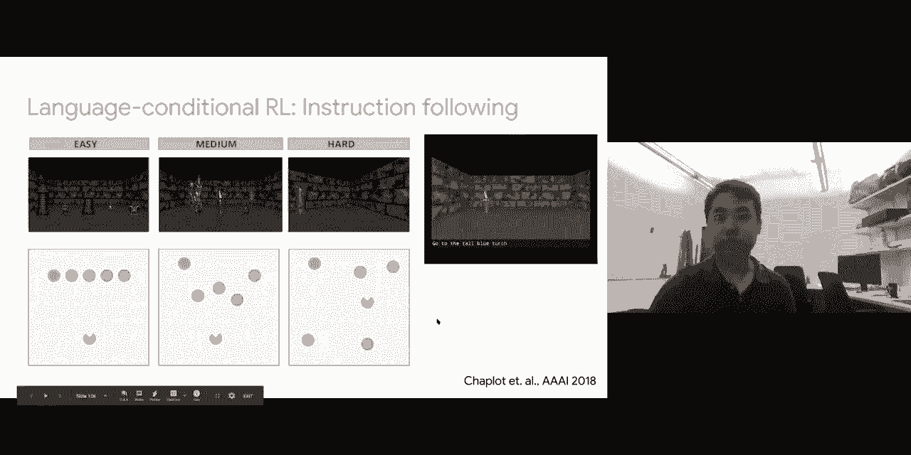

actually see these rewards，and they also found that um you know，different representations。

actually lead they actually learn，different representations for different。

attributes so grounding basically so by，seeing blue armor and by seeing red，pillar they can actually。

generalize to blue pillar and why is，that and that's because they've learned。

separate representations for your color，and your objects，and therefore you can generalize to new。

objects of different colors，cool so um other methods have also been。

proposed i think this is a method that，actually gives you more instructions。

so that you can get more rewards so for，example um，you have again this montezuma's revenge。

paper it's a really difficult，environment，if you just let the agent explore it's。

not going to learn anything，but what you can do is you can get uh，people from amazon mechanical turk。

to play the game and describe certain，entities that you should，observe or succeeding so you actually。

give instructions like jump over the，skull we're going to the left。

and if you actually succeed in solving，these intermediate goals i mean normally。

if you jump over and go to the left，you're not going to get any reward from。

the environment but you can define these，external rewards，based on how well you can execute these。

intermediate instructions，yeah so again you can look more about in。

the paper but essentially it encourages，uh it gives it takes in all these these，these。

states that is currently taking in and，it's also going to give，these external descriptions。

and it's going to give rewards based on，whether they've executed these external。

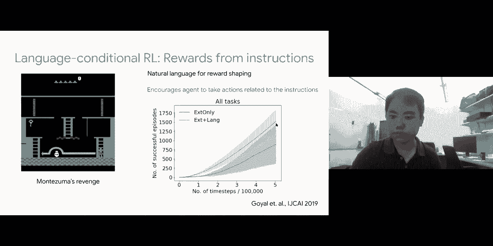

and show that you know this speeds up，training much better，and the last one just one last thing。

before we finish，the other method is also based on，instruction following except that now。

you have much more long-term，uh long-term goals and you're also doing，this in a qa setting。

so you're going to start with a，particular robot agent in some，environment。

and you're going to ask the question so。

what color is the car，so again it's not going to see it，immediately but as do you know do things。

i turn around，so i think this is a failure case uh it，actually went outside the house to reach，it。

but yeah so essentially it's not it's，partially observable as to maybe you。

know take some，uh take some steps around the house，before i can actually see。

the object in question before i can。

cool so um let's stop there，um so today you know we talked a bit，about language conditional rl。

next we will continue on how our，language can assist reinforcement，learning。

for both domain knowledge and，structuring policies and we'll also talk，about how we uh。

a different set of reinforcement，learning methods based on policy。

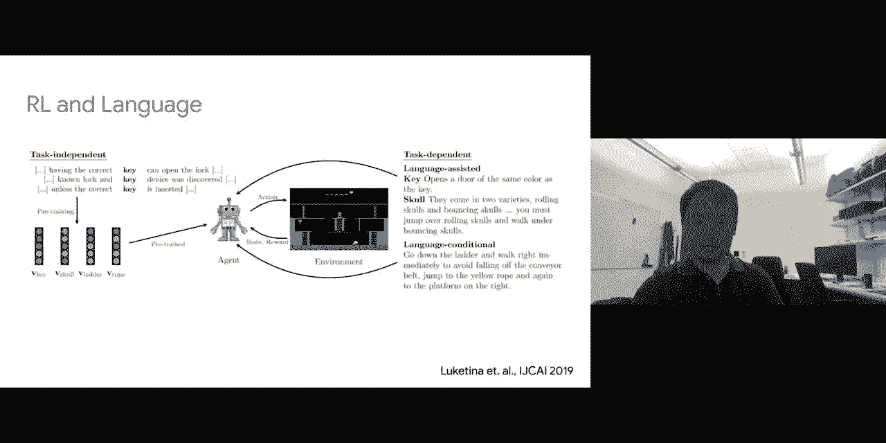