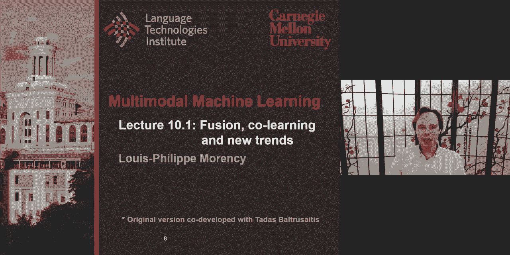
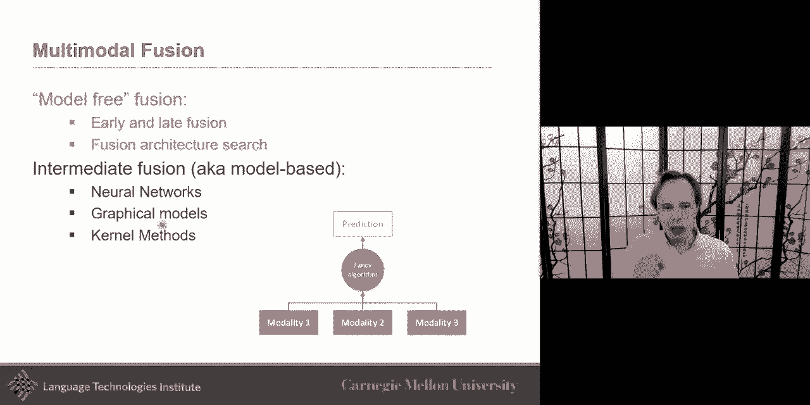
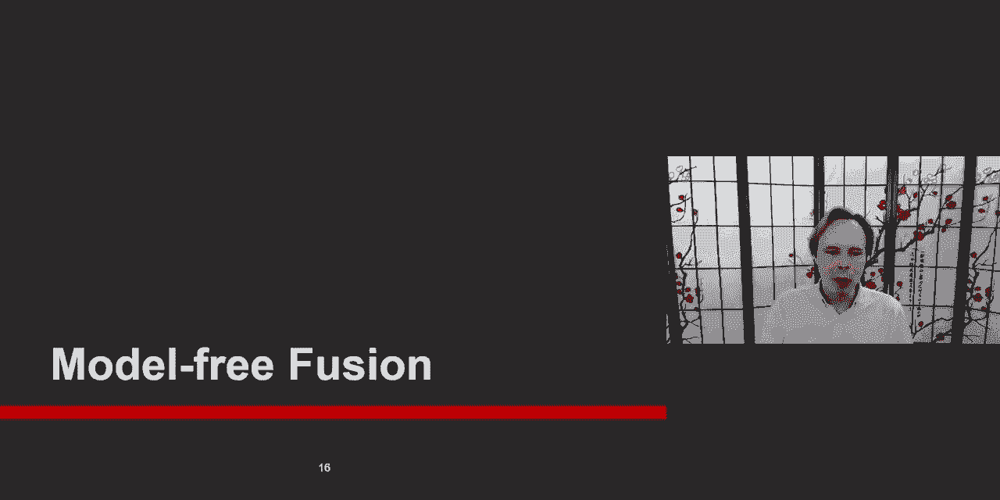
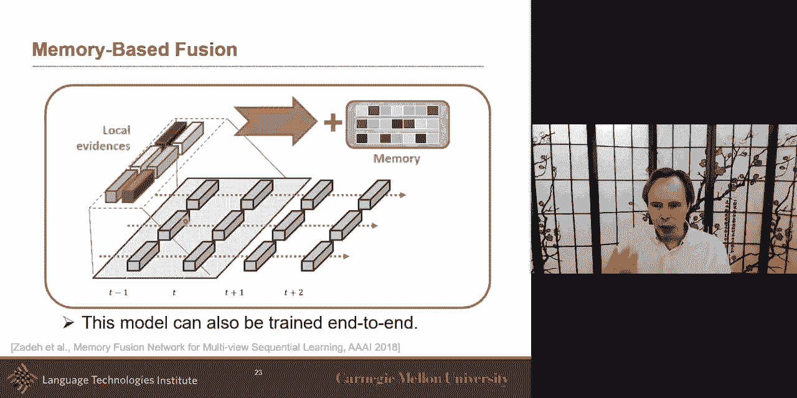
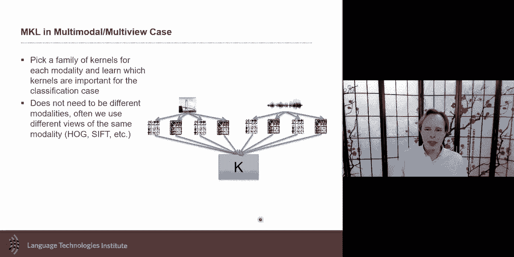
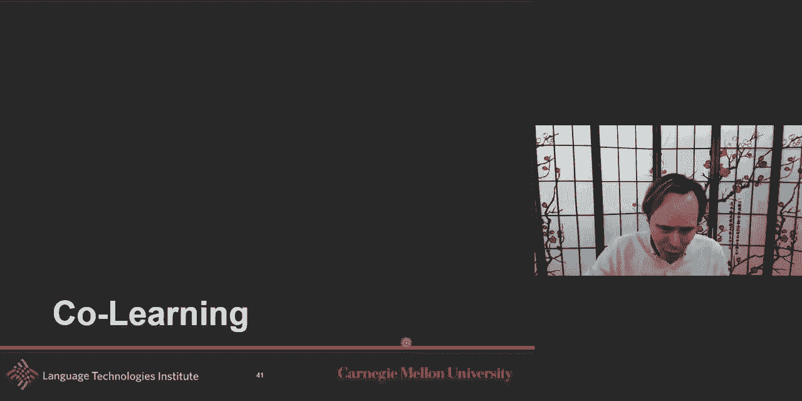
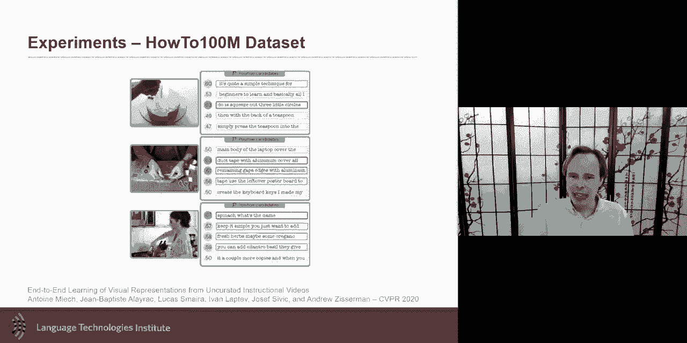

# P17：L10.1- 融合、协同学习和新趋势 - ShowMeAI - BV1Pf4y1P7zc

today we're talking about fusion，co-learning and we're also approaching，new trends。

today the we'll do a first quick repack，recap on uh on multimodal fusion。

uh looking at what we studied in，lectures 7。2 8。1，and and this lecture now complements，that。

by looking first at model-free fusion，uh place uh where um you may。

so almost see it as unimodal model being，pre-trained，uh beforehand uh in a late kind of。

fusion so we're going to look at those，model-free fusion，and then we'll look at the concept of。

local fusion and kernel，function i think this is a very，interesting。

um we'll look at it also because they，can，make us maybe understand models like，transformers。

in a different way through a different，lens and also give an example of how，kernels could be used。

about，cool learning uh cooling is probably the，one where，there is the least prior work but。

probably the most future work so，uh for that reason uh we're talking，about。

two categories we call them parallel and，non-parallel another way to call them is，strongly paired。

and weakly paired data for co-learning，and this week is very fun。

for us and hopefully for you too because，we're starting，the new trends new trends is。

uh we've been spending the last three，weeks，tas and instructors working together to。

identify new papers，in the last year that are in multimodal，and try to bring them into different。

trends that are happening，in multimodal uh this is not meant as，being exhaustive。

of all the trends but they are some of，the main trends we identified and two of，them will talk today。

and uh two we'll talk about another，seven of these trends，uh in the lecture on thursday two of。

them are few shot learning，and weekly supervised both of them are，very related。

to co-learning specifically future，learning，and talk about the idea of the。

intersection of multimodal，and multilingual with the goal of，grounding。

so this is the focus for this lecture，today，um so a quick recap on multimodal fusion。

if you remember fusion is this process，of joining in formation of two or more，modality。

to perform some local prediction，and so the example of that was audio and，visual。

speech recognition could be seen that，way，uh although you could also see it as a。

trans uh translation，one that is clearly a fusion task is a，do visual emotion。

you hear my voice you see my facial，expression，you infer from it some extra higher，level。

um construct or information，label like emotion you could be，identifying like an identity of someone。

from，their gate and from their voice，um you could i um you could also。

be answering questions as well although，this could also be，it has a fusion component but also has。

translation component，yeah if you remember um about two weeks，a little bit，and。

representation learning are are not like，completely different i mean there's。

really a progression between the two，specifically when we look at，uh at uh uh at the。

neural architectures um neural，architectures，uh then you have representation learning，but at the end。

when you do that final prediction that's，usually where we start calling it fusion。

and fusion makes a lot that terms makes，is a lot clearer uh or there's the。

difference between representation，fusion is clear maybe when you look at。

the cases where you want to integrate，domain knowledge in that later stage。

you want to include knowledge maybe you，lose knowledge because，one label you're looking at in fact。

could be seen as，uh having sub construct or some part to，it，or maybe because there's a structure。

between your output labels，and so we talked um over，uh two lectures about the graphical，models as。

one version of these uh where you can，integrate knowledge，you can integrate knowledge maybe。

because you have，some information about the temporal，aspect of it，or also maybe because you have。

information about how modality work，together so maybe you know that。

there's something intra to that modality，like language has its own structure to，it like grammar。

but there's also some uh different，modalities could，happen to between modalities you may。

have some knowledge on how they should，link to each other，um this is an example here was，field。

i know sorry this one is hidden，conditional random feel，um but the lecture today。

we will focus on model 3 fusion，as because we talk about neural，approaches we talk about graphical。

models，um we didn't talk about model-free，fusion，with the like old-school fusion of early。

and late fusion i think，it would be impossible to have a class，on multimodal machine learning。

and not at least have a little bit on，early and late fusion，but i want to emphasize also this new。

wave，of work on model free fusion，[Music]，which i would which we'll talk in a，second and。

after that i will also talk about kernel，based method for local fusion。

i would call this more of a local fusion，for kernel。

method but let's start with model 3，fusion，um i will not say back yeah let's say it。

back in my days 20 years ago，when i was a phd student they um。

modeled the fusion there were really two，big wave paradigms for fusion and for，multimodal。

uh in general was a early fusion and，late fusion and it，it's very interesting to at least look。

at those two extreme，i think now these days we're a lot more，in the intermediate fusion what。

what we'll call intermediate but late，and early fusion are kind of an extreme。

and so early fusion which in this case，the idea，is that you concatenate early on your，features。

you're like you're simply concatenating，your features，and then allowing your classifier to do。

the fusion all the work is in your，classifier，um and you could almost see a parallel，here with joint。

representation but it's it's joint，representation when，it's the joining is done at the earlier。

stage like almost the raw data，the right input features are joined uh，goes。

on and do uh maybe some if it's an all，network do some representation learning。

and then eventually does a，classification，the same thing could be with the。

regression uh this is not specific to a，classifier，um one of the advantage of the early，and。

also easy to implement it's it's the，same classifier so，whichever machine learning classifier or。

regressor，that existed in or maybe you go in，statistics，linear regression anything that already。

existed，before multimodal ai started being，studying event more，then you can simply use it it's it's。

it's a black box in a sense so you could，if you at least can use it in that way。

if you want um you concatenate the，features and then，if the prediction test like。

classification the new label，the the goal and the hope is that，internally it's going to exploit the。

multiple feature that it will learn the，interaction，um one of the challenges these could be。

high dimensional，and so the classifier has to do all this，and it can be more difficult to use if。

features have different granularity，this is specifically true if you have，language。

and visual maybe now these days you can，put and i have a word embedding that's，what a vector。

um that was not true back it then 20，years ago at least，a lot of the language was done in a。

symbol level，so that's early fusion it's in contrast，with late fusion。

the late fusion is interesting because，there，each classifier is trained independently，in fact，there。

it's trained with the label in mind it's，the same label，here at the end of the day that you want。

to predict but you're gonna train，and in the world of neural network you，could call。

late fusion just um pre-training，but it would be a pre-training a，supervised pre-training。

a supervised per training so it's the，same task，it's so it's a it's the same task that，you want to。

to to to train you pre-train but you，kind of pre-train each classifier。

each each modality with a classifier，and then you will have a fusion，mechanism。

and that's where it gets really，interesting and and today，we'll go through many of these different。

mechanism，so i have a unimodal um it could be，an svm or an lstm or a transformer if。

you want to make it，even more complex but yeah you train，each uni model。

and then you will once it's trained and，it's not just pre-trained in the sense。

of unsupervised pre-training，it's free training for that exact same，task so it did。

everything it could as good as it could，in a multi in that uni model。

and then the fusion mechanism is going，to go on top，without any fine tuning of this。

classifier you're just，not changing anything you're just going，to say。

this is the best i get from each of，these and let me see，how to fuse that information。

and so it is useful this kind of，approach because then，uh each of them can be trained with its，own。

uh data it could be let's say，that that's that label you have here uh。

maybe you have it on many data sets but，on some data set there was only language，available。

let's say you look at a motion or，sentiment，many data sets for sentiment have。

only language and don't have multimodal，so the language classifier could be，trained。

on a lot more data maybe than audio and，visual，or maybe on visual you have more。

information because you have those，image bays and you could so so that，allows you more freedom there。

the downside that is like it has，multiple step，uh and it's not an end to end these days。

we're very strongly，don't know，and one of the issue there is it's not，going to be able to learn。

low level interaction so late fusion，means that，it's only later stages uh that i。

usually will do the late that later，stages so high level representation。

are where i will expect the fusion，and the fusion mechanism could be very，simple。

uh it could be just voting seeing how，each of these，predictions involved you can sum or you。

can make it，make more interesting and i think that's，what i would like to describe。

uh over this lecture uh some of the，example，one that was in fact very recent uh i。

will describe right now，because i i want to look if let's say，that each of these classifier。

are is a neural network let's suppose，that each of these classifier is a。

neural network with multiple layer，and i would like to do a late fusion。

on that so visually what this could look，like，for sentiment based on language。

and it could be a multi-layer perceptron，let's keep it simple for now。

and then the similarly on acoustic i，have one layer，a multiple layer and um。

and then and then the question is how do，i fuse that，and and this was trained maybe with a。

a specific label why in mind but let's，say this is the last，representation um and so you know。

you could just take those two，representation and just concatenate。

that would be maybe one way or look at，the prediction of one classifier，prediction on the other。

but how can i maybe maybe it would have，been better，to fuse by taking the。

intermediate representation maybe not，there's the last representation。

but maybe one of the intermediate，representation will have been lay。

so maybe one of those intermediates，would have been so maybe。

the last or the second to last will have，been the better way，to take these two uh intermediate。

representation and go through some，non-linearity or linearity。

and then get um my joint representation，for them and then that could be used for，prediction。

or it could be that a little bit more，complex it could be that。

if i take the first of language because，maybe，language is um in itself maybe already。

a little bit more um，high level because language are words，words are already segmented and then so。

because of that maybe the representation，is a little bit more。

let's call it for better word semantics，so it may make sense that having a，language。

while maybe for visual acoustic maybe，the the phenomena，fact，uh taken later and and that maybe。

needed to also have at the end and so，maybe in fact it should be at more than，one stage。

but here this is done in in um，the，the unimodal classifier are pre-trained。

and they're not going to change，they will not change the question is how，should i uh。

what should be the way of fusing where，final，later and so you can imagine。

if i have four of them fusion here four，different layers here。

four different layers and let's say that，there's more than one way，i could use them like different。

activation function rule，or sigmoid and so the number of，combination。

four times four times time at least uh，three，and and then that's if that's like for。

for l and then uh but if it l equal，two it's it's four times four times two，times。

exponent of two so the number of，combination and if，if we think there's like maybe four。

three of these different ways，it gets really large very quickly，this computation gets really uh。

and so there's this new ish let's call，it new ish，in the world of neural network and ai。

um uh something from 2019，is sometimes seen as an old paper so，let's call it a new ish paper。

it's a very interesting in fact there's，a line of research this is one of the，paper there were。

there are two or three papers before，that building to that，uh eventually there's a multi-modal。

fusion architecture but the idea here，is that i would like to try all of them，i would like to try。

all of these different way i could fuse，this but this is not feasible so what，will i do。

what what i do is the following is i，will try the，the level one level one is easier。

although there's quite a few，it's like there's four of them layers。

here there's four layers here so there's，16 different ways i can，um i can connect two uh。

layer the modality one modality x and，modality why，if i，only have uh one um。

layer of fusion um and so，if i if i l equal one i can try all of，them。

and then for all of the other one where，complexity gets like can get very large。

what is really interesting is i i will，train and keep updating a surrogate，function。

and the circuit function here what they，do，is is predicting how。

well the next architecture of the next，level，will be uh what would be the performance，so。

for example because level one i tried，all possible combination，i know that putting this uh。

one with this one was relatively a good，thing，although i end up picking this one as。

the best one because that was like，the best uh out of it this one and this，one was。

still relatively good and so what i do，is i，use this knowledge that i got in level，one。

to start predicting of all the，combination in level two，i try to start predicting which of them。

are likely to have higher accuracy um，function，is going to be is like you start。

predicting for unseen architecture，and then when i get level two and i say，hey i'm gonna。

there's all the the different，architecture i could try，and i lose this surrogate function for。

level one and say，which of them is likely to give me best，accuracy。

and i'm going to use a subset of that，and you could add，noise to it just in case i got it wrong。

and i'm overconfident，and then i will take a subset maybe，there were 100 i could i'd end up。

picking 10 of them and then i will see，the accuracy that i got。

and then looking at that and seeing the，error i made，then i can i can propagate that error。

um and use that in the cigarette again，so i can update my circuit function。

so that for level three i will not only，base my，uh different uh the different accuracy。

the different accuracy for the different，architectures，um uh ways only on level one but i。

also are going to add whatever i learned，from level two，and i go on for on and on for that and。

so um the basic building block，is that at the end of the day i'm gonna，have。

if it's a level one uh it means there，only，one fusion unit if it's l2 it means。

there's two fusion units，and if it's l3 that mean there's three，fusion in it。

a fusion unit will be taking one of，these，uh layer and one of these。

intermediate representation and then，and also whatever from the previous unit。

and so there's the one of this，and there's the so there's three hyper，parameter。

is like one uh which of these index of，the different，um intermediate representation which of。

the index of the intermittent，representation and also，how internally i'm i'm bringing and。

pulling them，um and i could have simple pulling or i，could have。

some kind of activation function on top，of that，so this is nice i i personally like this，idea。

um and that's what's nice with this is，uh it，it brings almost a level of。

interpretability because then，i will know what uh as interpretable as。

these intermediate representation is but，at least i will know，is the early fusion uh the early。

representation more important than the，lathe，um and that allows me to uh study that。

and this was done，for audio visual emness so you have the，audio spoken audio。

of the digits um you have the visual，uh spoken uh and and then you bring them，together。

uh and you wanna predict which digit was，spoken，and so um so this is one approach，this is um uh also。

this in this case the choice that the um，that the model had to be to to do it to，do is like。

it had to during training fine um，uh also which uh layer，of the neural network is the most uh，also。

this over uh there's a similar idea，although um implemented slightly，different is that over。

temporal you could do the same you could，say hey，i will predict my goal is to predict，a。

acoustic and i have maybe an elastium，or some temporal model just for acoustic。

and then i train a temporal model for，visual，and i train one for language and and，there。

the question will be not as much like on，the layers but more on those temporal，slice。

how should i fuse the information and，which one because，maybe uh the language at time t and。

will be related to the visual at time t，and so，the idea here is can i use。

uh and there uh in that exact model it's，not done through this architecture，search although。

it would be an interesting extension i i，personally，i've only seen often these architecture。

search done on the layers but maybe you，could also meet the，architecture search on the temporal。

usually when it's temporal then people，will use more of an attention-based。

model so the attention-based model in，this case，time，slice identify local evidence it's kind。

of a local，fusion and that's that's why i want to，emphasize，the the concept sometimes when you see。

confusion there's the overarching fusion，of everything but，here it's a local fusion it's it's the。

idea that you're aggregating，together all of these evidence from，a local multimodal uh ev。

observation and then you can use that，to finally update some kind of more，longer term。

um and and so if you believe in，a recurrent neural network it could be，to a recurrent neural network。

or it could be through some almost um，static in the sense that it's not it's。

still dynamic and changing over time but，you have this unique memory that will，get updated，i。

i say a memory based fusion is the idea，of，you're listening to this lecture for the，last 30 minutes。

and then asking yourself like what what，did i remember，and and。

how can you make a computational model，that like reflect，this aspect of listening to a lecture。

you listen to a lecture and then，suddenly you hear something of oh that's，interesting。

and so it's interesting because there，was a nice visual image。

there was a good intuition i gave these，two together，that was a local fusion and then you use。

that uh and then you accumulate those，evidences to finally at the end of the，lecture to。

accumulate all those evidence and have a，better understanding of multimodal。

and so that's the idea of multimodal，fusion，and and this one will be able to able to。

learn end-to-end，but this concept of local fusion i'd，like to go。

more and revisit some of the uh models，that are very popular these days。

and kind of pinpoint where this local，fusion or similarity is very key and so。

we're looking at fusion and uh also，looking at kernel function，specifically um looking at them as。

similarity function，and so i'd like to revisit very popular，um the attention self attention models。

the transformer，and the bird being examples of the，self-attention model。

and revisit them and find where，in this the local fusion，is happening where is it happening this。

local fusion，and so if you remember，the idea of the self-attention，was that i i haven't observed。

i have a sequence of observation or set，of observation and for this set of。

observation or sequence of observation，i do uh i want to contextualize，uh this set of attention。

uh with the um，with the other one and so if you，remember，the word do by itself is important but。

the do，and the not really changes the meaning，and so we use uh the self-attention。

to be able to find a way to，contextualize to not only say hey，i have do my representation do but i。

want to learn a new，embedding of my word do that takes into，consideration the other words。

and the other words will be uh how，related and so，for this uh i will multiply the，x for for h2。

i will multiply all of these alpha，alpha are like how important for this，how。

related is the the word i，how relevant is the word not how，relevant。

is the word like and how relevant is the，word it，for and better representation of age。

that's what this alpha here，these alpha the there are for this h1，i。

knew embedding how relevant is the，and now，so that's the self attention this is，just a recap of it。

and if you remember how do we get these，alpha，how do we compute these alpha um we have。

those three concept，of like uh key query，and values but i personally think the。

most important are the key and the query，the key in the query the key says，uh the key says hey this。

is this is my current word like i，and i want to see how is it relevant the，i。

how is it relevant to the do the not the，like and this and so i will find。

i have my query for i and i will look at，all of these potential matches。

that's the keys the key w key like the，keys，they all all potential matches and i'm。

gonna find which one has a good，match and a good match is a way of。

looking at it as a similarity or a local，fusion，and so these local match。

we're gonna look at how well the the，query the word i，can match with do or can match with lot。

and like，and right now in the basic transformer，a good match between，uh my key and my query。

is just a simple dot，product of the projection it's a simple，it's a scalar version as i i have my。

original，query i embed it in the linear embedding，in this case，i'm embedded and i take my key。

all the possible keys i have i also，embed them，and i just do a dot product to see。

how similar they are and that works okay，if i have uh my key and my query。

the same modality they're the same，granularity they're the same。

um but if i have multimodal information，that's similarity may not。

be uh i can be hopeful that this linear，embedding will be sufficient。

to handle that that difference in，modalities and difference with，heterogeneous data but maybe not。

and that's why it's healthy when we look，at this，similar function to maybe start looking。

at other way to do similar function and，that's why i'd like to talk。

for a little bit about kernel function，because i believe that kernel functions。

are are quite interesting and and，although uh they're been used a lot more，in the past。

with model like support vector machines，some，intuition to a model like a transformer。

and so let me talk just first a little，bit a few slides about kernel。

and then i will revisit the transformer，with the by but through the eyes。

to the land of a kernel function，and so kernel function is um。

is an ax it acts as a similarity metric，between data point，i have two data points and i would like。

to know how similar they are，and i can do just a dot product it's a，type of kernel function。

or in most cases what will i do，is i will do or at least do the，equivalent。

of projecting my data into a，another space and that's what this，projection function will。

you can call it a projection function，me，and hopefully by projecting my data。

in that other space then the similarity，between uh data points will be more，obvious。

that's my hope and i was doing it a，little bit earlier when i was just，projecting linearly。

with w but the the general kernel can be，projection，a lot more complex and so it's notation，wise。

uh sometimes the inner product of two，will just be true denoted with this。

uh these uh kind of bracket，and the x uh is my，data point but the uh projection can be。

in any space so usually the space for，the input，will be uh more the real world。

the real space um but although it's not，necessary but the other one could be。

another space and i will give you some，examples soon but，before i give you the more complex。

example i just want to go，and you may have seen that is like this，data。

is is hard to separate with a linear，with a line um but if i project。

it uh and and this is just a square of，the data point so，whatever square of it is that's what i。

project here，that's what i'm the z is just the square，of x x squared plus。

l y square uh will be just the z，uh then it become very obvious how to，separate and if you remember。

a neuron is a linear，classifier so remember that although，we're going to very complex thing it is。

at the end of the day，a linear classifier uh although you can，have a。

after that you add the non-linearity but，the basic of it，is like each neuron is doing a local um。

classification so uh want to map our，data to a linear separable space that's，a little bit what we。

uh doing and instead of doing that，classification，uh that linear separable is and in the x。

place you're gonna do in this outer，space，which hopefully in that outer space uh。

it would become obvious what is close to，each other，and what is not but if this one becomes。

very very complex，and very high dimensional then it can，become expensive。

and that's where we come to what's，called the kernel trick，the kernel trick is really interesting。

is the idea that，i would like to compare these two in a，very very high dimensional space。

but doing that will be computationally，very challenging or maybe，not even feasible instead of that。

um i'm gonna directly compute how，similar two samples，one，is rbf that you may have seen uh before。

um so so this is an example，uh of the radial basis function，um and here and in this case what is the。

projection，what is that projection function，like how，similar to data point uh is a relatively。

simple question，function the projection is in fact，extremely in fact it's infinite，dimensional。

and so that's really interesting that，the kernel，is a similarity function and and it's。

the kernel trick is that although，the if i was to do the full projection。

it would be very complex to do，the，um but the uh but computing the，similarity in that space。

can be uh analytically written，uh directly and that's really powerful。

and so another example uh and and one，of this only a hyper parameter of this。

although you see an extension with more，hyper parameter but，classic hyper parameters it which is。

really low sigma the model becomes，nearest neighbor because，at that point what it means is you're。

only going to take the influence of very，local，and if you make it very large you're，also going to be。

uh influenced by the data point there a，little bit further，that that's a little bit what the。

intuition you could get from that，there's been over the years many，different kernels and i。

invite you to like take a moment to look，there's some that are specifically for，histogram。

for string there was pyramid matching，for looking，at hierarchical data there's a very。

large family of kernels that have been，a lot of them in late 90s to early 2000s。

there was a lot of work，around them when support vector machines，were really popular。

and so when these what they give you is，new tool to do，local similarity measure and and if you。

remember when we，when we studied cca canonical，correlation，analysis where we were looking at like。

embedding um kind of two，modalities or two points and looking at。

the correlation but the correlation over，many different uh canonical there's。

uh axes if you want uh bases，um uh canonical in our case were，were perpendicular。

and in this case we did it in the linear，that did，it in a multimodal sense and and also in。

a non-linear sense，and that was what the kernel uh that is，an example of a kernel so a kernel。

can be computable you can that the way，of computing that kernel similarity，could be by。

projecting each x，each data point and then tweaking the，dot product that can be。

uh the way the kernel end up being，computing，but as you see in the other work with，the ibf。

it could be that at the end of the day i，will not take the time to project。

and i will find a way analytically to，get the similarity directly，is that。

now i can revisit the transformer the，one we love，so much the transformer and that key in。

place i mean this is one of the key，thing i mean，of a transformer they have all this i。

have this query and each of the key，which of the key，is the most relevant to my query。

but if i want to know which one is the，most relevant，i need to be able to know which one is。

similar or relevant or similar，and so what how can i recompute this，in a kernel sense uh how can i。

present this as a kernel this function，here，is a kernel this is called you can。

formulate this as a kernel，um the attention in fact the soft max。

also uh the top part here is a kernel is，a similarity it's a simple one it's a。

dot product but it's still，it is a kernel and the softmax what it，does is just。

a summation that you do over this this，kernel，between the the query and all possible k。

uh that you had so that's what the，softmax is doing，so this what's really nice is that this。

formulation that we know，it could be seen as a kernel function，and then you can start thinking。

if i have multimodal data or even，unimodal maybe，but even more if i have multimodal where，my query。

may be quite different from my kernel，what is the perfect kernel，and then i can go and revisit uh。

you can go and revisit some of these，kernel，this is like the conventional，transformer that。

looks at it as an exponential function，and you just have a，linear uh projection for each of them。

and then the，dot product but then you can start and，revisit some other。

uh and this is for the task of neural，machine transpilation which，uh a lot of the time is uh。

in evaluated with metrics that none of，the metrics are perfect so，one of them is blur bleu um。

and it's interesting uh and i know the，difference is not big，but if you work in mission translation。

you will say huh this is a decent，uh improvement um it's it's not，like the world changing but it's。

interesting that just changing，this little uh thing like a better，similarity function or。

a different simulator function can have，an impact and improvement any，improvement。

uh in this case can be good in machine，translation um，so and then what you can also ask，yourself。

is um you have also position embedding，um so i have position embedding and if，you remember。

uh right now in the typical，transformer how did i uh，integrate the position of my query and。

the position，of my key i i was sometimes just summing，them，but there may be other ways to do this。

and one example is to say hey，i have my position embedding for my，query i have my position embedding。

for my key let's use a kernel，uh a similarity function to，infer the um the。

uh the improvement and that's really，interesting because here。

what i did is i just i just changed the，only thing i，change is my kernel of the position，embedding。

and i get a very decent improvement over，a classic，transformer what excel net does a。

slightly different it，does multiply it but still doing a，kernel，uh a different kernel uh for。

a different kernel for the um，you don't want some time maybe the same，kernel。

for how i do the uh position embedding，and how do i do the um the，um the embedding of the um。

of the um the the embedding of the，key and the query so the key and the，query values。

but i also want to be at the same time，to do a different kernel for。

for the position embedding so i wanted，to bring this because that gives you the，idea of local。

embedding that was a transformer that，was a proposed one，this is another new ish i didn't put the。

icon，but there was a new ish paper from em，nlp，2019 on this um，and here in this case they had a。

different one for，the value uh and for the，position embedding the value embeddings。

and position embedding，um so and now you can ask yourself this，concept of local similarity or local。

fusion，can i use it like in a multimodal uh，as a fusion mechanism you remember in，late fusion。

i i have each each modality and i just，want to do a late fusion。

and you can also use a kernel for that，late fusion，that's really interesting and that's um。

that would be a called multiple kernel，learning，uh and and there what you will do is you。

say each modality，what what is the right kernel what is，the right way，um to uh to compare。

uh to modality or within mother one，modality what is the right way within，the modality。

and maybe you can extend this idea，that's not what is currently shown in，this figure。

but you can extend this idea that is，also kernels between modalities，like。

i have multiple ways to look at，similarity，and i will use either i will pre-select。

uh or i will use all of them，and so you can use this idea uh，by saying hey similarity there within。

one noun modality i could have，many different ways one modalities，can be uh seen uh from a similar。

perspective so，so i can see two sentences and are they，similar，i could ask myself are they similar。

grammatically are they similar because，of the sentiment，are they similar semantically so there's。

different ways，even within the modality things can be，similar，and then there's also ways between。

modalities where like hey these two，are similar not just because uh，and。

and the facial expression as well，so this is the wrap-up on the fusion，side。

of the multimodal the last part of this，lecture today。

co-learning is this uh，fifth multi-modal challenge the，and i think very interesting cases can。

be done there，and there's really interesting research，currently and future research to be done。

in this area um，the idea of multimodal uh or co-learning，is uh the main idea is to transfer。

knowledge between modalities that that's，the key aspect is like i have a task。

within the modality and i want to，transfer some knowledge，help，me better predict in my original task。

and it could be through sharing，knowledge about the representation。

or sharing knowledge on how they do，prediction on that task，that can be done at different level uh。

but it it's，that's the idea of bringing extra，knowledge um，not being um eventually a test time it。

may not even be done，uh maybe not even be used that modality，a test time。

it can be only you just modality one and，to do that，transfer knowledge you will need。

some pairing you need to have，paired and in the original multimodal，machine learning。

survey we call them parallel and，non-parallel，uh over the years i changed it uh。

and i put and i can go change at the，archive but at least internally we。

i we call it strongly paired and，weakly paired i think no pairing at all。

will be uh if they're really no pairing，your，data that are completely different，unrelated。

that that will not uh you will make the，problem，either impossible or very hard uh but，there is。

idea of weakly strongly paired will be，for every，uh sam for every data point。

in one modality i have an equivalent in，the other modality，and so for for every word there's an。

image，and i have a lot of these paired data，weekly pair will be i have a bunch of。

images and i know that they're kind of，related to this bunch，of words um they are notice related at。

some level，but it may not be clear when uh and so，that's a weak，pairing uh into that um。

so let me give you the simpler of the，two with paired or strongly paired data。

one example there are many of them this，is just one example，uh this is a paper on word embedding。

uh from visual co-occurrence where the，goal was，to learn better erect uh word，representation。

and word representations sometimes，unfortunately，um they because they're learned based on。

the context of the other words，there's some aspect of their physical。

representation that is not correctly，uh identified or some attribute like the，roughness of something。

uh the softness of something，like of an object may not be in that。

embedding is that that knowledge is a，lot easier if you，touch it or if you see it like if you。

see or touch the object，then you gain some knowledge about an，object。

that is different from a this is a laser，pointer i can see，where i use laser pointer in every。

sentences，on wikipedia or on the internet but that，may or may not tell me。

how soft a laser pointer is，how long it is uh and so，can i bring that knowledge。

uh from the attributes uh from the，visual attributes，uh bring that knowledge in my embedding。

that's the key idea that's one way an，example of like，and then in this case i will have strong。

pairing so，uh for many words i will have attributes，of it so。

i have these words and for each of these，words i，had manually some people uh。

annotate each of them with attributes，and then i can go and learn during。

learning uh during training i can go，ahead，and learn an embedding and new embedding，and visual。

of the text um and the specific，of this uh was done with a，log bilinear a bi-linear model do you。

remember the bilinear model，where you simply uh like the product。

uh of these two vectors that gives you a，nice complex，uh matrix that gives you all possible。

interaction，so you have your word embedding your，attributes，and you've got the log the bini bilinear。

model you can do a log version of that，um since this video is learned from。

multiple type of occurrence，uh we have the hypothesis is that the，new embedding。

uh once you get that log linear you can，just re-project it into maybe a vector，after that um so the。

the nice thing is one access is the，attribute the other one is，my embedding uh word embedding learn。

without，the visual core occurrences and then i，get that，uh by you know and then i can go and。

reproject it and then when you do that，you learn um you can learn an embedding。

uh that will hopefully better represent，their tributes，which which is not too surprising i。

i took an embedding and then and i kind，of forced it to cluster it。

and then it gives you the other but it's，still nice to see it，and show this example um。

i i gonna give you another example this，one i talked in the first lecture。

but uh or one of the first lecture but，now hopefully it will make。

um now that we've gone through all this，revisiting this example。

is sometimes right is that is that you，you have a，you want a better embedding of language。

of spoken language like，how people are speaking and and when，they're speaking they're not just。

using maybe slightly different words and，writing but they also when they're。

speaking there's a lot of emotion，and you in the voice or there may be。

different aspects that also express，facial expression and and spoken，language you may have less data。

and let's say you have limited data to，get your embedding，but you have a doing visual that could。

help kind of，gear you during training and so what you，can do。

is learn an encoder decoder and the goal，of the encoder is to take my，language and encode it in a。

representation that this is the，representation i want，that representation will allow me to do。

tasks like maybe，like sentiment analysis or something，based on，on this on spoken language um。

but i want to do it in such a way that，i'm still able to predict the visual the。

facial expression that happened that，co-occur with this，one thing that was important in that。

early work uh the，uh newish work of 2019，um was that it it it was important。

not only to do the encoder decoder but，to do the cyclic，loss the cycling class was important，because。

you don't if you just do the encoder and，the decoder，this representation will be learned in。

such a way that it's able to degenerate，this，but we don't want this representation to。

be just useful at generating this，we want this representation to also be，good。

at regenerating the original one and，that's why the cyclic loss is。

important and then you can use that to，do something like sentiment。

analysis what's really interesting with，this model，is that it ended up outperforming。

many of the other models that also use，multimodal information，at the test time that was very。

impressive from it i think it is，possible，primarily because uh sentiment。

is uh has been originally defined，sentiment as，that，language is a very strong component of。

it multimodal，adds to it it has been shown in many，papers，but definitely language is a strong。

modality if，all three modalities were the same this，kind of，cyclic may not have been uh as strong。

of it or at least not as strong as the，multimodal but it was quite interesting。

in this case it performed because this，one only has the verbal the language at，the test time。

um i want to give a example when we have，weak pairing where you don't have，always this nice link。

between the modalities uh uh and，an example is all of those youtube。

videos that you're watching or someone，is watching，step，one type of video could be instructional。

videos，these are great because they have a，structure in it that make it easier。

a typical but when i talk right now it's，on me，they're，showing images to enhance to add to this。

story，or they show videos that accompany the，news，uh these may not always be a lying。

um in it and even now when i'm talking，my gestures，may not be correct completely aligned so。

there's this misalignment it's a week，it's not completely in the spectrum of，week to。

strong to weak it's it's not like the，weakest，of the pairing um is but it's definitely。

not i have exact pairing it's，maybe somewhere in the middle because i，have a misalignment but。

because it's temporal video it's very，unlikely that the week is like like。

two hours before or two hours after it's，probably within a few minutes。

that this sentence linked to the image，and so instructional videos are also，good。

in that direction is is that there's，even more because i'm，i'm either giving a um a。

a a a recipe let's say cooking，or uh because i'm showing how to。

fix something then the the likelihood of，me referring to，some uh video or image from long time，ago。

are very small but there's still a，misalignment and so how do i，paper。

this is one way is to do what's called，multi-instance，would say，but to handle the misalignment。

the misalignment is on one of the side，it doesn't allow you to do misalignment，on both sides。

but to do the misalignment on one side，it says hey，for each short clip each short clip，recent。

utterances all of the recent utterances，and what will i do is i will take it。

as a bag bag of utterances，least，one of these is relevant，is a positive example is relevant。

to this to this video，so the concept of multi-instance，learning。

allows me when formulated this way uh，is to be able to do so given this video。

i say hey which one match uh，these uh which of these match，my my video and that could be if i was。

just doing multi-instance learning that，could be my task，i say hey i show you a video clip and i。

ask you which of them，so it's it's a nice thing it's it's a，multi-instance learning is the concept。

that you have a，know，which one is the right one and i could，go and manually annotate it but it would。

be too time-consuming，so instead of that i'm going to say hey，in one of them。

i have like plus or minus three seconds，minus，i don't know 10 15 seconds one of them，is gonna be。

uh most likely and there's still a，little caveat i mean，it is still possible i will not but i。

hopefully in most case i'm true，and the multi-instance learning allow，you to uh handle。

that that it's not exact now to handle，the fact that it's maybe not always，perfect。

and also because i would like to do it，in an unsupervised way or what is often，called not this day。

to，take all of these instruction videos and，learn to represent uh these instructions。

and certain multiple instruction in a，semi-supervised，in a self-supervised way without。

manually annotating，oh this is an instruction this is an，instruction i'd like to find ways to。

embed or represent these multimodal，and one way um and we've seen a little，bit of that already。

but i want to emphasize again the the，concept of contrastive learning。

contrastive learning is extremely，popular these days，in self-supervised learning and i think，this is。

uh uh it has a flavor，uh of the when we，we i didn't discuss in svm that part but，in svm。

um you you have in the last uh something，that looks a little bit。

like this where you want to be close uh，to the positive，abs uh while at the same time far as。

possible，to negative uh it has a flavor of that，contrastive learning。

is that uh and here's one formulation of，contrastive learning um where you want，to be，the。

incense learning and the contrastive，learning but you have，some bag of positive and and you want。

uh your uh representation，of the um of the，uh you want your presentation of the。

video to be as close as possible，as similar as possible in，uh in the um uh。

for the positive cases but uh，in general should be i also have the，negative cases。

and so i would like them to be uh，i would like to contrast them these uh。

and the contrastive could be implemented，this is one of the laws for that。

but in a sense i want to be close to the，thing that are the same。

and as far as possible from the thing，that are，uh the negative example and here the。

negative example could be，any sentence i spoke two minutes ago。

which is very unlikely to go there and，so what's nice with this kind of，self-supervised。

is that it does allow you uh，to see and this is just an analysis of，that。

to see from this is the multi-instance，learning，uh and the self-supply together that，that shows that。

uh it select automatically uh the the，correct，um out of the positive you see which one，is the most。

relevant although you can see that，others are also selected so，uh it could be even stronger i think。

this uh，this contrast could be even stronger so，this is an example of uh。

co-learning that i want to talk about um，that and that one in the paper if you go。

into paper you can see，that they use that and they perform，better on their，tasks for the。

instruction videos um but the main goal，was to get better visual representation，so i，visual。

representation and in the paper they，show that they can，then go back and just perform much。

better or perform better，in the task of vision only as well。

that's where the co-learning comes in，as well and uh i want to bring and。

that's probably where i will stop for，for today，is uh two uh more example，related to co-learning。

and and one is called few shot learning，is the idea of learning，with very few examples so i want to。

predict，a new uh object i i only，recently showed you uh，uh，you you never heard that word um。

and i'm maybe only showing you one or，two example，and then later on you need to text you。

need to be able to，um you need to be able to recognize that，object，but um but then i could say uh。

[Music]，battam is something you hold in your，hands part time is something you can，point to it。

bar time is something there's maybe，something you can get from language。

um that will help you to and then you，can look at，what are the other object that that that。

have similar uh representation on the，language side，and that may help me to only i only。

showed you one image or very few，image or no image there's something，called zero shot learning。

i show you no images of this but i i use，another modality，it's a little bit funny because zero。

shot learning i still，gonna get you some supervision uh some，you。

direct supervision i only use another，modality。

to help you do that task and so one，example that also takes uh，together some of the reinforcement。

learning you learned last week，is that i can imagine in the future，learning where。

i want to be able to learn very quickly，uh a new word and so it's not only。

one or two sample but i want to give you，like i say，um i i give you pick up the table。

i you never heard what a table is i，don't know what a table，but i learned how to pick up over other。

object，and um i i i learned how to pick up，a dax i learned how to pick up a blick。

uh and you learn that，maybe in a reinforcement learning way，where i。

i go ahead explore uh and then and then，i'm like hey，what is this object and it's and then。

the age do you get some，local uh uh reward or supervision，go。

and you discover and explore and then at，test time or instruction phase，um you're asked um a。

task and you're given reward if you，succeed at that task，that that like it's a very typical。

reinforcement learning case，paper，what was interesting is the idea that，for this。

to work um in this case uh，this is a typical more reinforcement，learning。

but if i want to be able to work on a，brand new thing that is never seen，before very few。

i don't have the time，to rediscover and re-explore，and the typical reinforcement learning。

that needs a lot，maybe of this iteration i don't have，time，do，uh dual coding where you have two type。

of memory，you have a fast memory that very quickly，adapt，and you have a slow memory that uh maybe。

that so the slow memory is done，originally，but i'm ready and many of the concept i。

learned was this way，but a test time or like a new uh，i will get some information and then i，can go。

and very quickly adjust that um i will i，don't go into detail on how you do this。

this is one of the paper you have to，read or you can read this。

and so uh whoever reads it can go into，detail，but it's really nice to see how this uh。

let me go directly to this one，so i can uh change the mapping and。

so lifting putting all of it on new，object that it had never seen。

uh that's the example here uh and so，that allows you to change，the the the relationship and also。

change a new object you've not seen the，last example，is about weekly supervise this is an old。

film i told you，there's weak pairing for co-learning，and so that is weak pairing for，co-learning。

is is a type of learning which is under，the umbrella of weekly supervised。

um and i wanted to just give another，example，this one is not directly a core learning。

but it's an example of weekly supervise，where i supervise the task may be to。

the task which is scale phrase grounding，or phrase location，this is the idea that you have a long。

uh caption and an image and i would like，to have every non-phrase。

or most non-phrases uh connected to，a specific object and so i can do that，by manually annotating。

uh in the r data set um uh，to i just remember the 30k one，as an example um of this。

but maybe i would like to only give you，weak supervision，where i give you this and i tell you。

there are some object，that will also connect with some of，these。

uh phrases but i don't tell you which，one and so you can see it's a little bit，similar to the。

co-learning case a little bit that i，showed you，um when i was uh doing it with the。

uh instruction video some instances，here will be connected but here in this。

case it's weak on both sides，i don't tell you which object they're，just a bunch of object and which。

non-phrase are related to each other，and so one thing in that specific paper。

this is one way to do it，is to leverage more uh，to that the idea of weak superversion is。

to the general idea is to，leverage those caption to be able to，solve this。

the interesting part of this is the，specific one，in that paper that that was interesting。

is to um go and，uh allow the same object，the same object to have more than one。

so they're very coarse level，what i would like i would like my，uh use of these caption。

to be able to learn fine grain，visual representation my goal is to，improve my visual representation。

by taking advantages of these，um of this caption，and to make them so that this one is a，man yes but。

it's a man plus if i add to it my，language it's an older man so it's。

visual representation of an older man，will be different，than a man with a red accordion and so。

the idea is to shift the caption uh，enhance the visual representation of man，by shifting。

shifting it based on caption um，and how do you do it in an unsupervised，way or self-supervised way。

contrastive learning definitely and so，you will do contrastive learning uh this。

is the loss of the contrastive learning，and the idea is that i have some sample，over。

all possible sample um so that's a，contrastive，um and this includes both the positive。

and the negative one，and here you want to do it over the one，that are the most similar。

and the paper had a way to do that to，looking at some attributes。

uh on this um so i don't go into detail，on how they do that last part。

uh because of time reason but i invite，you the main idea was the。

idea of of the contrastive learning and，the idea of getting，uh a better representation by looking at。

this alignment，between the uh represent the alignment，between the caption，uh and the objects so um。

and that improves as you would expect，their performance of this so，um i thank you very much for your。

attention at the end of this，presentation，the slides you will find the pointers to。

the papers i mentioned today。

