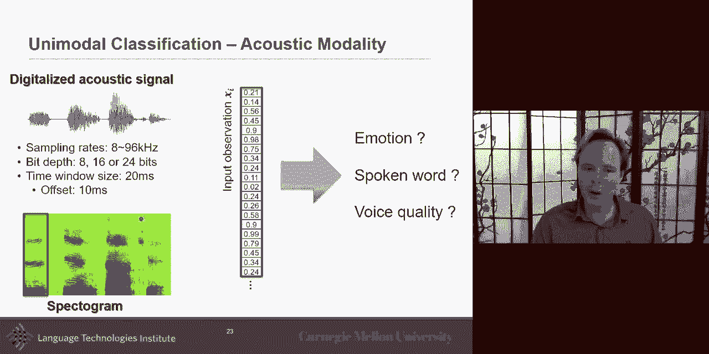
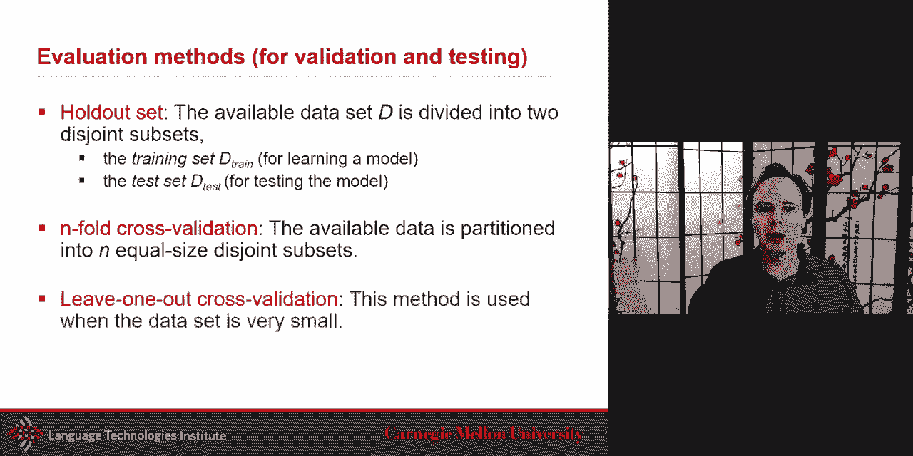
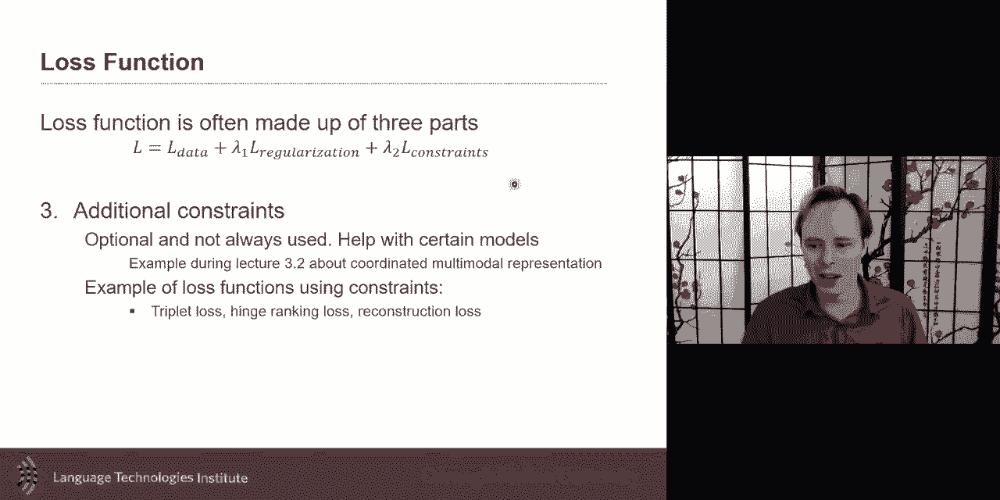
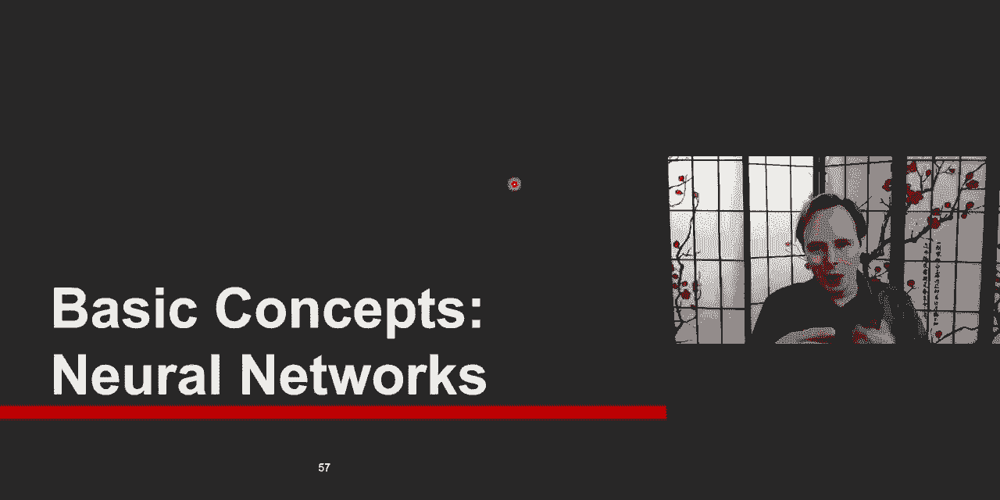

# P3：L2.1- 基本概念 - ShowMeAI - BV1Pf4y1P7zc

so hey that was it so sorry for all，these announcements but uh，i think it's uh it's it's part of uh。

moving from，uh in person to uh online course so，the lecture today is about uh a。

highlight of like unimodal，representation，uh and also uh start understanding like，the core concept，a。

neural network that are gonna be very，important for，for this so um so。

uh let me start with um unimodal，representation uh and i have a little。

bit of a bias sometime because uh，i've been myself doing a lot of research。

in uh uh computer vision back in the day，so，um so maybe that's why i put it um。

i put it on the top uh but yeah so，the um one of the interesting aspect，of unimodal uh is to take。

all these uh images which is relatively，high res，high dimension now you have like 640x480，that's。

back in the days uh 20 years ago now you，have 4k，resolution so and you also have multiple。

what's called channels，rgb are example red green and blue，with an。

image what the simplest thing we would，like to do，uh with this would be uh to for example。

recognize a dog is uh is it a dog or not，that's a classic uh problem with。

um that will help us uh probably on back，in the youtube uh，recognizing uh all of the cats and dogs。

that are shown there so，um so how do you what is the，representation。

for an image and this is probably for，some of you，you already done computer vision and。

you're like oh i know how an image is，represented，but some of you may just um i have done。

maybe more from，natural language processing or other so，i just want to give you。

the basics so that we can build from，that so an image，is mostly a matrix that。

is the like the what i would call almost，the raw representation，uncompressed version yes they are。

compressed version of images there's，some interesting work also。

in representation learning on compressed，directly on compress。

representation but for now uncompressed，images，mostly is a matrix and the。

the x and the y will mostly be the，position in the image，of the pixel and if it's a grayscale，image。

it's a 2d matrix and if it is，a colored image it's usually，a 3d matrix where the third。

dimension will be the z kind of，so，mostly what it is is is three 2d，matrices stacked together。

that's what the um what this is about，all of them are are stacked together and，so when you do。

image classification the simplest one，will be，take this 3d matrix and just go through。

directly to your neural network or，classifiers and get，the output but this is。

uh a matrix and most classifiers，expect more of a 2d vector，very long 2d vector possibly but they。

like 2d vectors，so what is the simplest way to go from，2d image，back in the days to like to a vector。

that can be used，by a typical classifier the simple uh，feed-forward neural network uh。

multi-layer perceptron，or maybe even uh like old-school style，support vector machines which i still。

like quite a bit for certain tasks，um yeah so uh the idea is to just stack，and you just。

uh end up concatenating all of these，together，that's just the simplest way to take an。

image and make it as an，input vector for a classifier，and so the when you do binary，classification。

then the idea here is that you will，simply，um go from this uh binary，answer um uh to。

do to the sorry not to the binary answer，but the input，uh you want to be able to get the binary。

output like，zero or one is it the dog um there are，different type of classification this is。

just to be sure we all have the same，naming convention，there's what's called multi-class。

classification multi-class，means that in this case it's either。

a dog or a cat or a dog it's kind of uh，it's either of them it cannot be both of，them it's one。

or the other or the other so object，classification，is an example of what is often。

seen as multi-class um but sometimes，it's multi-label，the same image maybe have more than one。

object in it and in which case you would，like not not only，to be able to see it as like is it a。

duck a cat or dog，but in fact you would like it to know，for each of the categories what's called。

class labels，or a label class um will be to，to give you is it the darker cathode，yeah。

so this is just basics to get everybody，on the same uh，and this is uh it can be regression so。

we can do it not only for one，uh but we uh we were like for discrete。

but you can also do continuous like age，height weight and distance okay，we'll。

we'll start often from something as，most of the time we'll start for。

something like this when i will later on，tell you，oh we use a cnn and you ask yourself，what is that。

input x is a very good chance the xbox，the input x is just a vector or a 3d，matrix like this。

how is it for language how do you take，language like this and just make it as a，vector。

what is the right way to do or what is，no let's let's，go on right or wrong but what was the。

popular way to do it，until recently and even now we're still，using at the basic。

uh the input quite similar，representation，so the most basic way of。

representing uh language and and then by，language i mean，i met either a sentence um。

a word a sentence or paragraph the，representations are quite similar uh。

in this um and um and by the way there，is two terminology that will sometimes，use in this class。

there is written language and there is a，spoken language so written language。

something you type with a keyboard，or these days with their phone um or。

a spoken language which would be also we，could call transcriptions。

uh in both cases the representation，would be often，if i want to represent one word uh like，humorous。

um and let's say i want to know from，this word，uh is it uh is it what is the sentiment，for it。

uh then what is the sentiment is it，positive or negative，that i'm starting very simple right now。

one word how will you represent one word，um and the answer to that is。

one hot encoding uh this is still，uh when you look at these uh。

up to this up to like three years ago uh，two years ago when we were。

maybe even less than that when we were，encoding uh，with word to back or love um and。

we'll discuss these about a，representation，the input will often be something very，similar to this。

a one hot encoder what it means is you，have this，very long vector very very long。

so long you can see you cannot even see，my，my hand so very long vector and，it。

is the dictionary dictionary will be，either dictionary and most of the time。

will be based on the training set，will be like look at all possible words。

in my training set and for each of these，possible words that becomes one entry。

in in my dictionary that is uh what we，would call，um uh the yeah the dictionary the，language is a。

dictionary you could use a dictionary，that from another corpus，uh you could imagine a larger one but。

usually often，people will do one thing also some，but they，often do is they will cut they will have。

a threshold like they will say，any words that don't do not appear at，least 10 times。

will not be part of my dictionary and it，will be，uh in all in that other category called。

others or junk or any like you，so if your dictionary was like 1000 you。

will have 1001 for all of these，other words that you put there that's，one way to to to do this。

so this is your one hot vector encoding，um and and this uh you could imagine，then use。

this and use um a nice，maximum entropy model maximum entropy，model we'll discuss a little bit then。

later uh or conditional random fields，are all very well suited for that，representation you。

you it's it's it's very nicely um，approach so um and using this you can do，quite a bit。

uh you can do a word level，classification for every possible word。

you could imagine having that vector and，no is it a positive or negative。

you could do what's called a name entity，recognition recognize，which words are about a person or an。

entity，uh or maybe a city a town，then the part of speech tagging will be，another example of task。

you will do with so which part of the，sentence which words are，nouns verbs objectives um so this is。

what's called，the word level classification that's a，term that i。

will use but sometimes you want to do it，at the document level，or paragraph level and so how do you。

encode，the paragraph level i'm a little bit too，fast with my clicker。

but it's also a one-hot encoding，but there you could call it whatever。

some people would call a bag of words，where mostly what you do is forever you。

have it's still the same long dictionary，and you just encode every words in that。

dictionary any words in that document or，in that paragraph，and you just set it to one when the word。

happens，and zero or the wise that's the simplest，one you could also make it。

as the number of instances in that，document so you just do a plus one every，time the word is there。

and sometime or we'll do maybe a，normalization after that，um so so this is and then you can do the。

same task sentiment uh sentiment，analysis and you can do that，for written language or you could also。

do it like if you have the transcript of，dialogue，you could also do the same as well。

so so this is the um，uh so this is the idea for language，and i would also like to talk about。

uh acoustic modality so，uh you're listening to someone you're，having this audio。

what is the most basic or the，raw representation of audio，think about it for a second what is that。

representation i see it in blue here，it looks like it's 2d but really。

audio at its basic is is a is a 1d，it's a very long vector we we here。

is showing the amplitude of it um，but yeah and but the the idea here。

is that the um the audio at its basic is，a very very very long vector。

um so in a sense you could use that long，vector，and directly try to predict for example。

what is the spoken，word right now what what is so i could，imagine，like slicing uh this and take that。

vector，segment it may be by hand or have，someone automatically segmenting。

maybe with silence if it's a let's say a，digit，speaking digit like one digit after。

another where there's a pause in between，um and so you could imagine some of the，old style。

speech recognition doing it by a pause，for segmentation，and just take this and take a vector and。

then you could imagine just going and，take that vector，um with some padding because not every。

all of them will be the same length，um but this is not how we do it。

in reality but this is something you，could do，or someone could do but don't do it。

but the uh and the sampling rate is just，how many of these samples within one，second。

so if you have one second of uh，if we have one second of audio um，how long is going to be the vector。

representing that one second，okay and eight kilohertz mostly mean，it's eight thousand。

this vector is going to it will be 8，000。 96 mostly mean there will be 96。

numbers to represent one second um，so you can see uh i i forgot the exact。

one but when you talk about，hd and sometimes it's just that like the，sampling rate。

is just 8k is if i remember correctly，related also to the，old uh phone uh digital phone。

or some of the phone technology was，within that uh，um so um yeah and so。

the the depth is like for each of these，if you have a vector of 8，uh，eight uh will it be eight bits。

16 bit or 24 bits and and it's all about，discretization like，how fine grain do you want your。

discretization because，at the end of the day like you could，almost imagine。

like i speak and usually you often，will go from nothing to the max。

and it will be often a cutoff and so，this is how much energy speech。

energy um you could imagine it that way，and then 8-bit mostly say how big。

are going to be your bins 16 says，how it will be a lot more grain and 24，bit。

and then the eight kilohertz and 96，kilowatts is really about then。

the uh temporal bins uh of this so，it's the same signal it's just how big，the bins on top of this。

so this is the idea for like the most，simplest one，and then um how do you represent。

uh the this for spoken words or for any，processing，there is usually in a perfect world you。

will have like a，nice set of，that，in reality you don't have that in most，cases so。

what people will do is slice the signal，and they're like you could call them，windows。

time windows that you will slice and and，then you will repeat those time windows。

and so and often this is these numbers，are like if you want to start with some。

numbers these are good place to start，um if you talk with your ta uh。

or you talk with me we can give you more，details on like，what specifically for your data set but。

these are usually a good place to start，where the time window um let's say 20，milliseconds。

um so you could imagine 20 millisecond，sorry，um 20 millisecond uh you you can，transfer that。

in hertz as well uh by by simply，dividing，20 one over 20 milliseconds。

um but the offset will usually be，something like the half of the time，window you want some overlap。

into that and and but but this，fact not，how human even are perceiving audio。

uh and there's been wonderful work uh，and that co that's the work is，definitely more than。

in the last five years this is work of，more than 30 plus years，uh on analyzing acoustic signals。

and the the key inside is in the ear，also，uh people don't seem to represent things。

uh just like as a long vector they seem，to be doing it more，in a frequency domain so they what they。

will do，is take this window take this window of，audio and from this window of audio。

say in that small window uh how much，a very low frequency do i hear。

how much very high frequency do i get，i should be careful when these lectures，get uh recorded。

um so very high very low，and so what you had get here i'm sorry i，forgot to put the。

the y-axis here these are the frequency，from very low，uh frequency to very high frequency。

um and these will be，uh in kilohertz also but it's confusing，because。

sampling rate is at kilohertz uh but，here the frequency will also。

be in a kilowatt but there are different，things sampling rate。

is how big my bins you could say uh each，of those lines，in this uh original uh blue lines what。

are they，like how often do i have them here it's，like once i take a bunch of these，samples。

and do a fast for your transform and，like get the frequencies。

uh how much and here the spectrogram i'm，showing here，is you could see how much of each of。

those frequency do i get，in that and the idea is to move，this along so here what i。

show is one slice and these are mostly a，set of numbers，at that time at this point in time and。

then i will do plus 10 millisecond，and then i will get another uh another，of these。

and i will plot it here another，of these and i will plot it here every，10 millisecond。

i will pull up it and finally i can get，that full spectrogram so um the full，spectrogram here。

is over a long period of time now do you，use the whole spectrogram as your input。

probably not probably you will want some，way of segmenting，um so again you could have a new window。

that you that you move over time maybe，you will use a larger time window that。

you will move over time，to look at pre let's say you want to，detect like uh。

i don't know um we want to detect maybe，laughter，as a let's say as one example so how，would you。

uh detect laughter in this case so，that's an example，uh of what you could do with this。

in this case let's say you have already，segmented the words and you can take。

that and do a recognizer，back in the day you will use an hmm for，that now you。

definitely use neural networks so this，is，uh this is computer vision 101 or。

i don't know what's before 101 100 uh，language 100 and like uh unimodal 100，in。

any future model i show，like probably 95 of the time，the input for computer vision。

for language or for acoustic will be one，of these three things they will be very，low level。

um an example for language it will，probably bag of，of of um of words。

is really what i will start with at the，input，but sometimes some people and maybe。

myself will be a little bit lazy，and don't even give you this input and，will directly give you。

like the process input which will be run，back，and give you a new vector maybe of lan，300。

but what they didn't tell you is before，that there was this vector and really，rarely。

do people take the time to show you that，basic basic representation。

they're like oh this is in any textbook，but this is a class so i'm here to give，you the basic。

textbook version of that okay，so this is the basic representation。

and you can do the acoustic you can get，word and you can do，emotion recognition and all of this and。

often，uh spectrogram there there's been work，now these days，trying to use directly the digital raw。

in portfolio。

but most of them still use spectrogram，as input，for that i want to give a little bit，more。

on other uh other unimodal，representations，um i will not go in as much details but，i really。

uh if you if you have to，read one more paper this week pick one，of these。

and go and read about these other，representations，because we are focusing the course on。

language vision，and acoustic primary language and vision，but i really want to。

about，other modalities um because there's a，lot of other，modalities out there uh an example here。

is um this is that sounds like a，minority，report yeah mandatory report or these。

love kind of things um the idea is that，you can，so，this is uh the idea is that glove will，have。

an array of sensors on it uh，and then uh how much pressure is on that，sensor。

will suddenly be given to you so，if i get this uh array of sensors，um i can then suddenly。

put them uh in almost of a 2d grid，and because you see once you start，seeing cnn here。

that should give you a hint that these，people decided to take，you move。

things like this this sensor is in fact，very close to each other so。

anyway but but yeah in this case they，look at it as a 2d sensor which is quite。

interesting and then you can use things，that we'll discuss，in the coming uh week uh something like。

a cnn or conversion neural network，so this is one example of a sensor。

what's interesting about it there's，quite a bit of redundancy。

here it's a little bit like an image in，that sense like like，two very close sensors will be uh very。

similar to each other this is different，from language because in language。

one word can be quite different from the，other，they will be related there may be，them。

but in this case we'll have a lot of，redundancy，um and so you could imagine the kind of。

representation should take advantage of，that redundancy，and cnn is one known one to be useful。

for that i want to give you other type，of sensors，um in fact even that like sensor that i，showed you。

often another way to represent it is is，over time，because it's not only an image but it's。

almost like a video，more，or less pressure over time um so often，you will get representations。

and in a sense it does look a little bit，um like you would see，an earlier signal um but and so you。

could imagine，because it's an audio signal probably，the first thing that come to mind。

is like hey maybe i want to move it to，the frequency domain，that's a good idea and i would strongly。

suggest it，as a maybe a first step in that，direction um，and so when you see these uh that's also。

why i want you to think，although i may not always talk about all，those other。

representations you should be able to，make the link，uh，how to uh like in this case uh it is not。

a directly an acoustic signal，um but it does show a little bit of uh，of repetitions and so。

maybe if i want to take care advantage，of that maybe frequency domain will be，good。

maybe for some others it will not，because，what we need is maybe more of a template，matching。

which a convolution network um is mostly，a template matching，and we'll talk more on this but if um。

so that's another thing you can do um，and，an arm or a robot arm is in fact。

uh as part of a lot of these uh，when you see a robot arm and slowly and，going and grabbing something。

what what you don't see uh or you know，only if you you you，start studying robotics but you there's。

a constant，loop there's some people often call the，control loop like that will。

be there to allow you to move and adjust，yourself as you move closer。

and that loop will use this kind of，input signal from，all of the activator uh um all the，motors。

um and will allow you to change or，adjust，uh you could imagine i know we're not，robots。

but you do or for people who have a，driving license，you，um you always maybe you um would like to。

predict ahead of time or anticipate，things but usually you do your。

uh in the real time will change all of，your，uh angles so the the you only have a。

a a very simpler uh problem when we do，the the driving uh in the sense of。

simplers not that sub driving is simple，it's not，but what i mean here is that there's。

only two uh angles here，uh there's also the acceleration of the。

gas and as you know really well there's，a lot of the extra sensors important，there so。

but i wanted to give an example another，examples here，um another thing is we think of language。

for example，and if i give you a table like this back，in the days。

um although there had been some attempt，with table to text but recently what we，see。

is take advantage of the positioning of，the text it's not just text。

because you could imagine going ahead，and just just，one，line at the time but there is a。

structure in it，and there is a proximity and i may want，to take advantage。

of that proximity in a table and so how，do i take，uh advantage of that proximity in a，table。

uh to do something like in this case，it's it's a，table to text generation uh but i will。

leave it to you，to think of other applications as well，so，i want you to think um one that i didn't。

put there but it's quite related，is a sketch recognition because often，people。

will sketch and here you will maybe with，ocr uh optical character recognition。

we will recognize what has been written，um so，and but there's a lot of other things，like a box that。

you you highlight a thing with a box you，start drawing some object，and you want to be able to take。

advantage of that，and so you could imagine um looking at，it as a 2d table，or looking at it as image。

pixel or looking at it as a vector，because，if all of it has temporal information。

when you do sketches，and so these are different，representation，i also want to bring graphs i think。

graphs are，very important and and and and they've，been studied。

uh for a while but uh like for example，in economic，um and biomedical but more recently we，see them。

coming out from social network research，internet networks all of these you see，graph。

and i put graphs here there's also，another part of it which is，knowledge graphs that is important。

which uh you can see in natural language，processing，and there it's it's um well let me talk。

about like for example social network，where you have，everyone on facebook or everyone。

in a specific network or some network，and how who is related with who and。

related is really the key here，a graph at its basic what is a graph at，its most basic。

is often represented with a node or a，set of nodes，and edges that's like the most basic。

representation，now this can be enhanced like the nodes，themselves could have information。

associated with it，um and the edges themselves could be，quantized or there could be association。

associated with it so for example，you could have no nodes that are every。

uh possible entities in your knowledge，base so，um like pittsburgh and，uh hockey and uh penguins。

so you have tree and cities they all of，them have，uh nodes for associated with them and，then the。

the edges will be some kind of，relationship，have，a team，or hockey team or have to think of all。

the relationships，but the edges will be those relationship，between intensity entities。

in a social network would be，relationship between uh，users so um so it's really interesting。

to use that this kind of，knowledge and quite challenging because，neural networks。

uh that we'll use in many of these by，default，really love 2d vectors they love that or。

sorry 1d vectors not 2d vectors 1d，vectors i may have said 2d vectors in，the past 1d vector。

and also look at 2d matrices，but they but when it's a graph how do，you represent that with neural。

representation，neural architecture it's very，interesting to look at that i just put，one example。

in this uh at the bottom of this slide，but this is just，to look as a teaser in that direction。

and sometime your data，has a kind of an extra structure it's，not just。

an image but you have a set of image，uh images maybe because all of these。

images are all from the same person，maybe this person when they were very。

young or under different lighting，conditions，um and so this is really example the。

example here is for face recognition，or there's some sensors i mean what we，see these days。

uh with uh self-driving cars you can see，these sensors and what they will give，you some of these。

sensors will be a point cloud um，so point cloud could be because you have。

a sensor that gives you depth，and is just scanning around and so you，could see it as a 2d image。

but also you have sometimes sensors that，that，are like 3d sensors 3d scanning sensors。

that will take an object and and and and，acquire it by looking around。

you could also imagine just a 2d uh one，sensor，and then the moving the object but。

anyway at the end of the day what you，get in all of these，is a set um you had a set of points or。

what you usually call a point clouds，or set of image and you want to be able，to take advantage。

of that and so maybe you want to do，anomaly detection，or you want to look at it even in a。

generation sense，so i wanted to give you a few examples，of other unimodal uh。

representations uh and i invite you to。

look at these papers，and you're here to learn so uh reading，is great，so i will go a very very short。

amount of time uh on machine learning，uh they're like very um very，um quick uh there's just a basic。

and naming conventions it's just that if，i don't do this，now and i use these terms later we may。

get a little bit lost so at least now，we're all on the same place and i will。

start talking about neural，after，so that so um basic basic there's the，concept of a data set。

which is uh in the in our case um，if we think of a labeled data set uh，where you have。

uh samples uh samples here will be，the samples x with i being uh。

the index of that sample so if i have a，data set of size，n uh so i is that index uh from the。

let's say one to n uh with the label y，and if you remember it could be，regression it could be。

it could be binary classification it，could be multi-class or multi-label。

and usually data sets will be often have，a training set，and then a test set rule number one。

and and and that's why it's so great，in the current world that we have all，these uh。

challenges grand challenges because one，thing is you should，never touch your test set that's kind of。

rule number one，and really you should do all of your，work and training and exploration should。

be only on the training set，and you should not touch your test sets。

and only at the end go and evaluate，there，um we'll talk about like what to do if，you don't have。

uh the test set available uh we'll talk，about it in a second，but yeah training set and test set。

and if you ask yourself like what is，machine learning，at the core one of the core aspect of。

machine learning，is generalization what can i learn，from training that is able to learn what，concept。

can i learn that allows us to generalize，and while you can formulate in different，ways here i'm。

putting it in the what's called，supervised learning way，but the general aspect of learning in。

generalization that's core to machine，learning，and ai these days so what's the。

simplest possible classifier，i believe uh what is a simpler one。

think for a second what's the simplest，one i was not able to upload。

the quizzes on time i know i would have，done a survey for you。

at this point but think about what's the，simplest i believe one of the simplest。

is uh is the nearest neighbor and you，will sometimes hear the term，non-parametric。

model so non-parametric，model the the if you hear this and maybe。

a little bit confusing is the term you，like oh but think right away nearest，neighbor。

as the simplest of the and very powerful，um it's very healthy in any task you do，be。

surprised how often nearest neighbor，perform well，um and the nearest neighbor will be done。

only on the training set so，at test time you will do and look at，nearest neighbor。

uh nearest and you need a similarity，function for that but yeah，so nearest neighbor is probably the。

simplest one so，if you have a task like is it the，traffic like a dog or basketball。

uh kayak that nearest universe is the，simplest one，and so um to go ahead，in into this um。

yeah so the nearest neighbor is a，non-parametric it lets the data speak，for itself。

predict the new cases based on your，training set so，what's really great about the nearest，neighbor。

is that training time the complexity is，really simple，is o1 i mean it's it's like you just，need to。

in a sense you have your data it's it's，it that's it，but at test time what is the complexity。

you think，and the simplest version of nearest，neighbor will be o。

of n there's some way of optimizing it，but the simplest one but what is the key，of nearest neighbor。

is distance metric and we'll come back，later on distance matrix because it's a。

very important aspect for example，when we talk about kernels uh with svm。

and support vector machine and other，extensions like these kernels。

you can even look at transformers and，self-attention models as a kernel，machines。

like the key aspect of it is what is，that distance，because if you have two uh two。

samples um and you want to do，you have in your training set like a，thousand of images。

and you have your test set so you have，thousands of images，for training and they're tested but what。

is the nearest neighbor，uh what's the distance and the simplest，one will be。

something like a distance like a，manhattan or uh euclidean distance would，be the simplest one。

um and they they're good to try we'll，discuss a few more，as we go along but just to give you a。

simple one this，is probably the simplest one you're the，one that you've seen it's an early on。

when you did any kind of algebra uh the，earth leading distance between this what。

what is the representation of an image，here when i put，x i just a little thing yeah this is。

just a long vector for now okay，just imagine a long vector so you have a，long vector here。

and you have a long vector here and you，just do the，euclidean distance here because you take。

that 2d matrix and just put it here，so in practice you will you do a little，bit more badasses。

uh this is the idea um，so which distance metric to use aha，which distance metric to use and i am。

asking this question，because i want to talk about uh，hyper parameters or what's called。

sometimes called，uh model selection um like，i don't know the answer um maybe i have。

domain knowledge and in this domain i，know that this distance metric works。

but in some others i may not have that，knowledge，and for that if i don't have that。

knowledge it's a parameter that might，my model is not will not learn directly。

it's a choice i need to make it's a，design choice i need to make，simply。

decide to make it as a hyper parameter，or you will have two models，um if you could see it as model。

selection as well，two models one for l one or one for l，two oh you called the higher and this。

the distance the type of distant metric，as a hyper parameter um so，another uh question is like。

how big should if it's k-nearest，neighbor，where i what i do is not just pick the。

nearest neighbor but，pick the two nearest neighbor or three，nearest neighbors and maybe。

do a majority vote out of it the，question is like what is canerous，neighbor。

and that's another example of，hyperparameters，and i want to emphasize this because if。

there's one thing true，with deep neural architectures is that，there are。

many of these hyper parameters，and you will see plenty of papers。

where the hyper parameters are selected，almost by hand and just a long list，we。

we use thousand neurons in the first，layers，we decided to use uh activation。

this type of excavation function，rouleu or some others and we decided to，have that many layers。

and there's all these decisions to be，made，um and at the end of the day they just，picked some。

maybe because of prior work that that，had selected it，um there's some beautiful work that's。

done these days i've been using，reinforcement，and learning to select it but if you。

have very few of these hyper parameter，the way to approach it is to take your，training data set。

your training data set and slices in two，okay you take your training data set and，slice it in two。

you slice it so that you have your，training data and usually the validation。

set you if in the perfect world，you like your validation set to be maybe。

about the same size as you test it if，you can afford it，that would be great and so what you will。

do is train，multiple models maybe one for，k one one k equal two q equal three。

uh or maybe for multiple distance matrix，uh for l1 or l2 um and then。

and then for each of them we'll start，looking at the validation data and just，simply look。

which of these uh works better so this，is the basic，you've probably done that before i will，say。

um for this class you may not always be，able to，try all possible hyperparameters but for，a paper。

if you decide to take your work and，submit your conference，i highly suggest to go and take the time。

to do all this，so we，are not going to be picky about the，hyper parameters as much。

uh but that's something to be aware for，differently for paper，and um i want to share like um。

the the methodology for most of you，uh you you hopefully will be lucky。

and your data sets already have a，specified test set，specified validation set and and and a。

training set，and so this is great because if you have，a lot of data。

this is the way to go you it's nice，because then people can easily，be。

uh very adventurous then you can go，ahead and make this，a test set like a separate uh，of you。

maybe in effects of computing data sets，and others，you may have not enough data and what。

you will do is then instead of have a，dedicated，test set you just take your whole data，set uh。

take maybe one tenth of the data set，call it the test set，and use nine tenths as training and。

validation，10。

time and the extreme version would be，leave one out like leave one one person，other one video out。

is that，uh like linear classifier i will，um again go a little bit uh faster on。

this but what i want to talk you，is the idea of uh because this is just。

an introduction to neural network i，i could have called this just neural，network these days but i。

i don't know for me it's a linear，classifier neuron，is a lot like a linear classifier so uh。

with the sun，simple non-linearity activation at the，end but at the core。

the core of a neuron the core part is。

really a linear classifier，um so um you could imagine，when i i'm asking myself like i want is。

it a dog or not，i could imagine take that whole image，make it a vector。

and then use only one uh neuron，i know that's quite crazy but yeah，imagine that's called。

one neuron by the way one neuron is，called a linear classifier，okay um depending on which activation。

function it，will be maybe slightly different from a，linear classifier。

but it would be in the same family，and what are the three main parts of。

almost any classifier but specifically，linear classifiers and neural networks。

three tasks when you think about，learning uh classifier one is defining。

your score function and we'll discuss，that uh in the in a minute and and for a。

lot of neural networks，um because you select specific type of，neurons and。

and then you you kind of uh bypassing，that design，question but i'd like you to at least be，aware。

that underneath there is that happening，um there the one that is important for。

almost any model is the loss function，you need to define what are you。

penalizing what what is it that you're，penalizing what kind of situation。

you want to penalize and then you need，to，go from maybe a model that you，initialize randomly。

in in this case maybe this one neuron，that you have，and it has a bunch of weights and you，may be。

initializing randomly you want to start，from that random position。

in the space uh of your model parameter，space，to get to that hopefully to that global，optima。

that really gives you the best possible，uh classification，and that's called optimization that that。

walking through the space，um and i think the intuition of walking，is really good in this case。

um so the score function i this is，something that is happening in any，neural network but we under。

we don't realize it and i want to uh，you to take at least a moment to think，about it。

um so uh when you have uh，the the image and then you have all，these class labels，is。

what should be the prediction score for，each class label，okay so if you have for example。

you have uh the image and it has the，possibility of a dog it has a，possibility of a cat a dog。

a dog a pig um the idea here，these，labels um so and the way to do it。

would be maybe the simplest one would be，to have one neuron，oh and in this naming will be one。

classifier linear classifier，for each of them you will have one，neuron for duck one neuron for cat。

one derivative for dog and one for pig，and perv and a neuron，as its simplest uh a linear with a。

linear activation function，a neuron with a linear activation is，this exact function。

um and so x as you remember is a vector，usually，uh and i say wi because，of these。

images and then you have w which is the，same w，or the weight for all my samples。

that's what i'm trying to learn and i'm，also trying to learn，the bias as well um and we will explain。

visually what the bias can be，interpreted as well，but these are the two sets of parameters。

that i will，learn and what this，function is is this one value that tells，you。

how uh much is it how how do you score，so you could score it uh for a duck。

score it for a cat scored for a dog，for each of them i i want to。

give an example with numbers so if it is，3072 because it's an image。

of 32 by 32 by 3 this is a very long，vector，then the weight will be let's say that。

i have 10 of these classes then it's，going to be 10，times 3072 i have only a bias for each。

class or only one bias per class，and these are going to be my parameters，together。

okay so this is the uh idea for the，and the number of class is the number uh。

the number of scores will be the number，of classes，the，um give you the the the direction。

of the the slope of the of the，linear um classification，uh and and the um the。

uh the the better uh the better the the，bias uh is there to uh give you the。

uh distance to it uh so the distance and，then the w gives you the slope so。

this is just basic linear classifier，you've seen it many times。

i just want to help you with like like，naming convention because。

it gets very confusing you rarely see，nicely written like this in fact most of。

the time if you're lucky，you will get to this which what it means，is that you。

uh took your bed your your bias，and in fact added it just simply by，making your input。

slightly longer by only adding one to it，and now you have all your parameters in。

one the w is just cleaner，and so another nice thing you can do，is uh because you will have many。

classifiers，really you will have many sets of，parameters，you will have one set of parameters for。

dog for cat for all of them，um you could simply say i have a，different。

function uh or you could go very simple，different，ways of naming uh these are all，equivalent，it。

if you always take the time to say hey，what are my parameters。

but a lot of time people will just take，and，maybe they will add here uh a simple。

thing like they may take the time，to have an x here but that's maybe the，only thing。

but this is equivalent to to this one as，so if you have many classes then。

you have many of these linear，classifiers，in this case what this is what i show。

here is three neurons，three linear with linear activation this，is what you see here。

but how do you get to optimization if，you want to optimize this，you have let's say 10 of these uh。

10 of these um uh，ask，myself now i have 10 of these scores，given an image。

uh during training i have 10 of these，scores，10 of these scores and and let's say i。

have 1 000 images，and and let's say the real label is dog，and so i want uh and the scores right，now。

doug is high cat is also quite high，um and i want to uh congratulate。

my current uh weights to say hey you got，it perfect，or maybe if it was the opposite and and。

and let's say，doc was selected too high i would like，to say no this is not correct。

how can i uh go ahead and，tell the algorithm this is not the，writing or this is the right thing。

the last function in very simple term，is how to assign only，one number represented how unhappy。

we are about these scores okay so，you get many different scores for each，possible class。

and then you have to ask yourself like，how do，i finally at the end of the days just，give one。

number and so uh and that's what the，the the almost science of lust function。

comes in and is it's almost a science in，itself，uh to looking and deciding what loss，function to use。

so the loss function quantifies the，amount by which the prediction score。

deviates from the actual values that is，what the key，aspect is so here because these scores。

are very different，and i want to have a loss maybe a loss，that goes always from zero to one。

how can i take all these core and，normalize it，and so there's very different ways but。

probably the simplest one，is using a logistic i go from numbers，that goes from minus infinity。

and i want to normalize it from zero to，one or minus one to one。

uh what is the simplest function to that，this is a logistic function。

it goes from minus infinity to plus，infinity，and it can nicely give you a number from，0 to 1。

so now i can take all of these scores，and simply put them together so this is，the scores。

here and and if i have only one score，and i want to normalize it then i can。

use that logistic function，in this case if you have two of them，it's also quite simple，that。

it's either a dog or all your images are，either dog or cat，or it's dog or no dog for example in。

this case then，uh，but this is the same equation um，and um and so in this case。

the true class in a logistic regression，uh like the the zero is seen。

as your your your decision boundary，uh in this case and this is what you see，here。

um and but if you have multiple class，people，use that like terms of max not realizing。

what it does but soft max what it does，it's just a normalization it just brings，everything。

that could go from minus infinity to，plus infinity，to uh something uh between。

zero and one and now are they any，parameters that are learned，just in that now this the the the loss。

function itself，doesn't have parameters in it the the，parameters are。

before the loss function uh and we'll，look at it，in the neural network but when you say i。

have a soft max layer in a neural，network，soft max doesn't have parameters it's。

just it's just a normalization，max，what it does is just allows you to，easily。

implement some other loss functions so，now now，what i did with this softmax is i ended，up taking。

all of my um，10 different scores and normalizing them，so i get a vector，instead of 10 but。

i can go ahead and um，and normalize it um and once it's，normalized then you can look at the。

cross entropy，that softmax is there and then you can，look at this。

um and and take advantage and then you，minimize，in the case of cross-entropy minimizing，the negative。

likelihood of it and and，that，is an example of that uh that you can。

look more in details in the slides，where you have your weights you have，your input and your beta。

and you can see the different steps of，it uh one，is you take uh the exponential uh of，this。

and then you go ahead and you can，normalize this and that's finally what，gives you the log。

on that so um okay，um this is one example of loss，i just want to give another one uh and i。

know we're running a little bit out of，time so，i'm gonna wrap up uh relatively soon。

um but the other one which is under many，many names，but i like it quite a bit uh is the，hinge loss。

uh and it it definitely has um，has been used and is used quite a bit，these days。

uh uh in uh many different uh，approaches i will discuss more uh in a，little bit but。

here the idea is it's not just to look，at the distance，uh it's not just normalizing and looking。

at the peak，in this uh in this case what you will do，is look at the difference between the。

correct class，and the incorrect class and the，um the the trick here is。

uh that because you sum over all the，incorrect labels，really what you end up doing is like you。

end up penalizing mistakes，uh you ended up penalizing mistakes and，that's a trick because of the max。

so what you want is if it's crack，is it good there's nothing here i'm not。

although you could change it but，it's okay but um，but if it's wrong like how wrong it is。

is it and how wrong is it will be that，that margin that you want and you would。

like that margin to be as large as，possible，at least，uh it was famous back in the day was。

support vector machines，uh contrastive learning has a flavor of，that as well。

um so there is one little high，kind of hyper parameters but this one，often doesn't matter as much。

uh but it's this delta uh，to allow you to to get a bond uh some，kind of uh。

buffer into this so so these are two，losses，there will be more during the class i，just wanted。

uh but a loss in general has three main，parts，okay to it one is the data part this is，the main。

the main thing we discuss about uh，the data part the data term how how much，is my。

data matching my expectations，that's kind of the lust that i talk to，you about。

um and then we talk about different，version of that，but there's also two different。

components to that that can be added one，is regularization realization is often，there to。

prevent the model to becoming too，complex you will often add this，regulation。

this is in almost every model that，you would get some level of regulation，primarily because。

in the perfect world you have infinite，amount of data，simpler in your organization but a lot。

of time you have example that，that may not have never been in the test，set and so。

you want to be able to generalize to，them and at the same time keeping the。

complexity of your model simple so，it's either for smoothness uh so this is，very interesting。

and the lambda you ask yourself it is a，hyperparameter，uh that's another example of these。

hyperparameters，um and there there's something that，we'll discuss a little bit later。

sometimes you'll also have，in your optimization some constraints um。

you don't want certain parameters to go，larger than，a certain threshold um you will have。

some constraints，this is not often but it does and why is，it not so often，for。

optimization like the more constraints，you have the optimization becomes more，days。

people have managed to find very，interesting ways of regularizing。

and still being able to get a gradient，sometime with the constraints you get，makes。

a typical gradient based optimization a。

lot more challenging so，um we'll discuss more and uh on thursday。

uh the core of this uh which is on the，neural network，uh where at the end i'm just gonna give。

you one or two slides and we'll discuss，more um a few slides but we'll discuss，more on thursday。

just a teaser but neural neurons what，they are they are linear classifiers。

um and that's really the core of it you，see exactly the same，linear classifier so a neuron。

is a linear classifier but there's，there's an activation，function to know like how but but the。

how and the activation allows you uh，to almost some of them almost look like，a on off。

switch say and so so what's great is，that it allows you to say，and i that that's a part of how the。

neurons will go，gather a bunch of evidence uh you could，imagine。

i gather a bunch of evidence and then，once you have enough evidence then you，activate。

uh you pass that threshold now we use，neurons and，and a lot of these neurons don't even，close。

to what human neurons there um that at，the basic，uh these were a kind of a linear。

classifier with an activation function，um you will over uh when we think of。

the neural network the simplest one the，multi-layer perceptron，but。

if you set all of these arrows together，this is one neuron so take all of these，evidences from。

all of them and get one neuron and，output from one neuron that's you could，say。

output of a neuron uh response of a，neuron that sometimes，sometimes you could call them scores uh。

but the scores will usually only be used，at the end，when you talk about scores you here have。

three scores，no sorry four scores maybe uh oh no，sorry you have only one score you have。

only one neuron at the end，um but if you had many of these neurons，so here it's only。

dog or not but if you had dog cats，and something you could have many of。

these at the end so these would be，scores but here，we'll talk about response or uh。

at the output of that and so uh neural，nerd the building block of this is，simply that linear。

uh classifier plus this activation，function，and as you know there's many of these。

activation functions，um we back in the days uh we're focusing，primarily。

on these two tan h and sigmoid in fact，lstm which uh used to be very popular。

a long short-term uh memory，lstm uh which is a type of recruit，neural network。

uh and what was really interesting is，that and we'll look at it when we look。

at the recurrent neural network，is 10h the main thing was was it nicely，goes from minus one to one。

while the sigma it goes from zero to one，and then when you're building。

uh or designing these architectures，you may realize that having a positive。

and negative may help your learning，and so you will decide from a design，perspective so。

and so multi-layer uh neural network，simply，is a recursive process is like。

you could see it you have one layer，of neurons uh so one neuron tuner。

neurons three neurons four neurons，here，and so for this layer i will learn a set，of weights。

what is it is i will learn a set of，weight for little neuron one。

a set of weight for neuron two set of，weight on neuron three，and so w is often seen。

uh almost as a matrix or or what's，called also a 3d or 4d matrix，what's called a tensor um so this。

when you hit the word tensor you can do，multi-dimensional matrix，uh as as a as one way to think of a。

tensor，so when i say w here are these all these，neural，uh neural pyramid parameters from the。

neural network，and so i have parameters for the first，layer parameters for a second layer。

parameters for the third layers and then，here i could have many scores in this。

kind of have only one output，so the score function here the output，here what it is。

is just they uh it's just recurrence，like it's just like，from one outs and then the output of the。

one goes in the output of the other，and the output of the third one and our，last function。

is over that output so output here is，only one，in here if you have a clearly unless uh，all this and。

last as you remember is only one number，one number that tells you how good or，bad things and so，my。

do，these there is uh two terms i want you，to do，is one is inference inference what it，means。

is is is like like feed forward like，moving through the network。

like like inference like inference is，like i have x，and i get my inference uh y uh。

or my scores so inference is uh，use the score or inference is both get，the score and use them。

and at that point when you do inference，uh it should say use。

compute the score here and it should not，say use computer scores and use them。

and so and that takes already learned，parameters，time，is that's where you use the loss，function。

and then you do optimization and one way，of doing optimization is。

gradient based approach and when you do，this gradient based approach。

one thing you will realize is internally，you will do inference，uh internally in that loop of。

optimization，you will often do some inference um，but what you will do is is for a，specific set w。

uh at that time at that iteration so，we'll discuss more though。

so your forget don't forget to do today，your project preference form that's，everybody our students。

um tomorrow also select in your reading，group，just be sure to select your google uh。

go in your google sheet your own study，group and select，post your summary on friday or before。

that it's even better if you do work for，um and uh oh i forgot to put。

on thursday morning be sure to uh，have your uh your highlights，yeah form um uh。

and uh and then on monday do the，discussion，um so yeah thank you very much for your。

