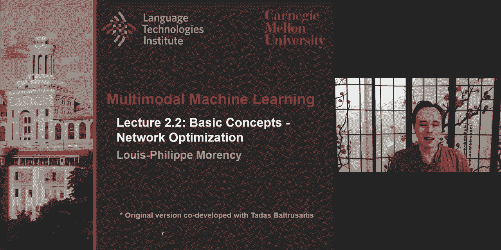
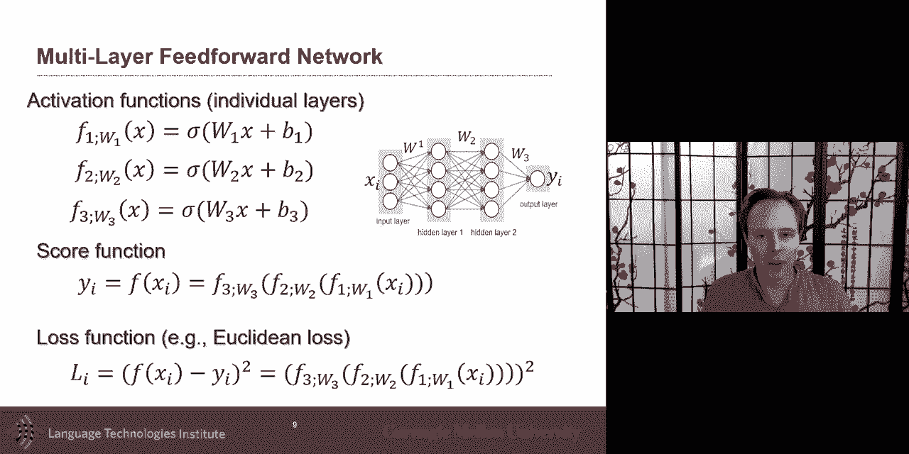
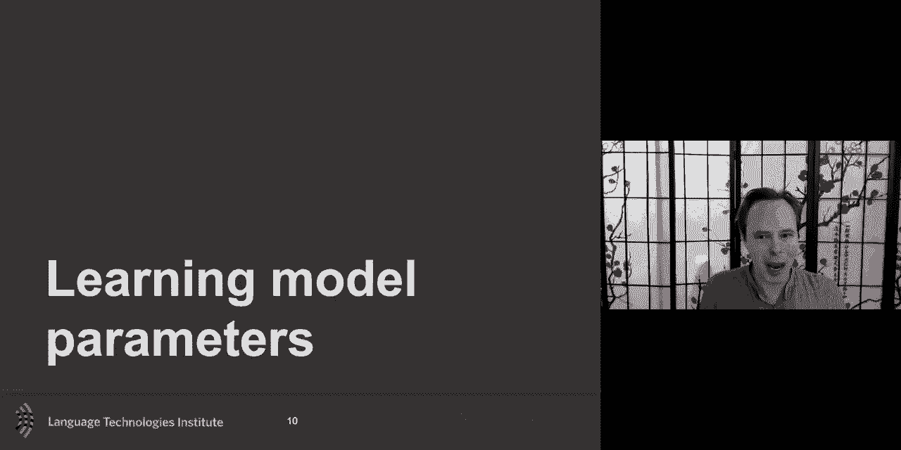
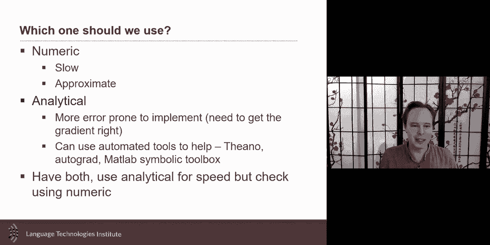
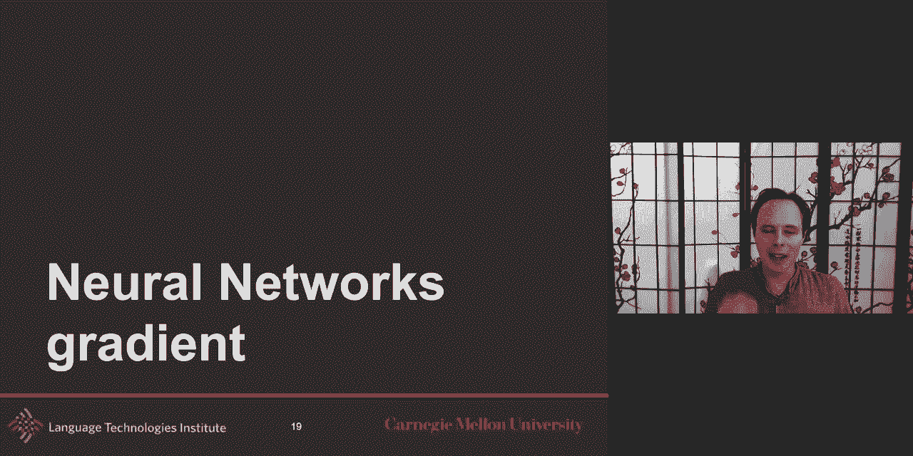
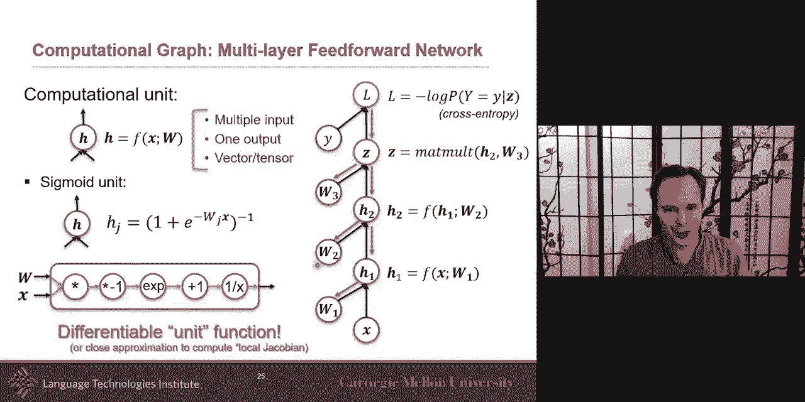
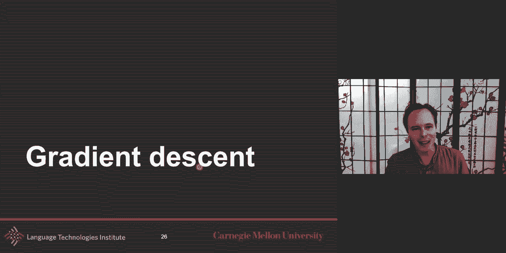
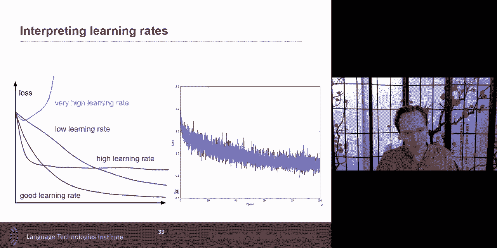
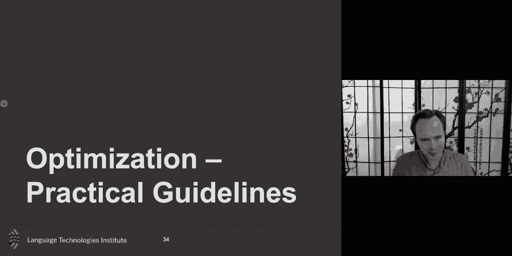
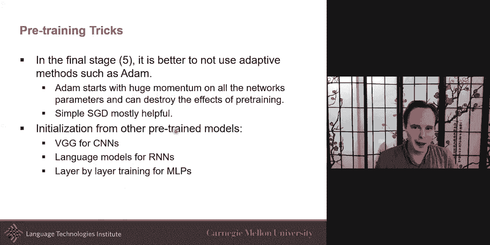

# P4：L2.2- 基本概念：优化 - ShowMeAI - BV1Pf4y1P7zc

okay uh so the lecture today is about。

basic concept around neural networks，specifically also looking at，optimization。

uh we'll look at optimization gradient，computation，but also we we spent some time with the，tas。

and over the years try to gather some，uh guidelines on how to optimize these，deep models。

um originally we called it multi-modal，optimization but a lot of these tricks，are are。

are true for a large number of，um of uh of applications so，it's not just true for multimodal but。

they are definitely very important in，multimodal，and so we'll uh continue to um。

so these are some of the this is their，objective for today um multi。

just as quick reminder from last week，if you remember not last week but last，lecture。

multi-layer for feed forward networks，this is an example with，uh two layers two hidden layers um。

if i ask you how many uh score，how many score functions or how many，scores you have。

in this case is only one score as you，remember the last layer could have，multiple score。

multiple layer multiple neurons and，if you remember each of these uh is a。

little bit like a linear classifier each，neuron is，almost a linear classifier with this，activation。

function that that that renormalize the，output of，the classification the linear，classification。

and so uh each of these neurons uh，for this neuron you have three inputs uh。

and so you have these parameters these，are，called model parameters and so you have。

model parameter for one neuron two，neuron three neuron four neurons。

concatenate all of them together that，becomes w1，and then you do the same w2 in w3 and so，the model。

parameters uh uh this is what we want to，optimize，uh and we will use the lost function。

as a measure to know hey uh um am i，at the right spot am i uh is it the。

um is it a good place to be um，for given these w and you could say at。

the beginning it's random these numbers，and then you can compute the loss and as。

we'll see we'll compute the gradient，from that，and then make a step make a step and，we'll discuss。

this in more details i'll give you a，high level but take a step means you，change those parameters。

and when you change those parameters，then you can recompute your loss。

and that gives you uh one eye that's one，way to see if you're。

making progress we'll go more in details，in a second，so the core is learning those model。

parameters how do we learn those model，parameters，as you remember we have a training set。

and a training set in this case will be，for a supervised task so you have。

x the input and y is the uh，output the output labels and we'll，suppose for now that this is a fixed。

training set that，you don't have online learning for，example and our goal is to learn those，weights。

both weights and biases together and as，we discuss uh you define as part of your，model design。

we define an architecture and also at，the same time we design also。

our loss function or selected a loss，function，and if you really don't know which loss。

function to do then you could have a，bunch of candidates，and we discuss about the possibility of。

doing model selection as a，hyperparameters for your model but we'll，discuss that。

later but optimization and i i，i i love this analogy um，um uh it's this it's it's a little bit，like。

uh exploring switzerland uh switzerland，but but but folded uh blindfolded。

and finding trying to find the highest，peak，uh highest mountain you could go lowest。

if you but let's say you maximize in，this case and so，you want to find the highest peak in in。

in switzerland and so，so you're walking around and and，is，is is you have this uh this uh。

instrument that tells you，your altitude so how high you are and，that's the only thing you do。

is get that measure so yeah at any point，in time you can take a step backward，forward。

any kind of direction as you take a step，um，you get a feeling that you're going down。

or you get a feeling you're going up，um and that's that that's that's this uh，loss。

uh at time t not time t by iteration i，and then your loss at the next iteration，you're。

if you're um getting better or it's，improving and that's that's what the。

gradient is going to help us with，um so we want to minimize the loss。

function the loss function tell us，given those weight given that position，i'm in like i'm at。

one specific position what is my，altitude what，what how good uh am i um。

and and how do we do the optimization um，there's different approaches，a。

strong focus on gradient-based，approaches，um specifically because a lot of the。

neural networks or neural architectures，have been designed uh and have been，improved。

to all have some gradient uh that，most of them have uh analytical gradient，that can be computed。

and and for that reason makes gradient，gradient optimization，very efficient we'll discuss more in a。

second but but the other，approach would be um to be very，exhaustive and try。

every little place but as you can，imagine if your space is large like。

um space like let's say switzerland um，then that it can be very demanding so um。

so one other approach and uh and so，is to just search randomly and then，refine that search。

um and and so um and so，and to refine that search that's that's。

the key here is is the gradient is uh，and so gradient i just want to most of，you hopefully had。

this in either undergrad or some of your，grad courses before，um but just the gradient is is this。

uh is the direction of the greatest rate，of increase，of the function and its magnitude is the。

slope of the graph in that direction，so in a in a here you have a 2d graph，point。

in that graph i can look and say what is，the gradient，in the switzerland example it is mostly。

at any point in this is to know the，slope of the mountain that will be the。

other way to do it formally this is also，a derivative of the function so it's in。

fact the derivative of your loss，uh function um and in higher dimension。

uh there's uh um different ways of of，optimizing it，so in multiple dimensions the gradient，is the。

vector of partial derivative，discuss，with an example in a second um so but。

in the uh switzerland case um，switzerland we only had two viable like，am i，see it。

as a 2d the action space being，going x or y and so the gradient will，also be。

two-dimensional it will be a，two-dimensional vector，um if you don't have the numerical。

the analytical gradient um the way to，compute a gradient，is is is just to to try it what is it。

you're in switzerland you're in the，middle and you have no clue。

um and you didn't have any kind of map，to help you um，or local knowledge about the slope uh。

what can you do，eh you you touch you you you you take a，mini step。

forward uh maybe a mini step on the，right side，and from that you and then see hey is it。

lower or higher，what is my altitude if i take a step，forward let's say backward。

and so with this that gives you a nice，uh that can be，one way to get the gradient but as you。

expect this is a very slow process it's，still possible，but it's a slow process so um。

and and can be sensitive on how big of a，step you want you're。

in a perfect world you want it as small，as possible，um and sometimes you will need even a，you。

moving forward uh when you look at，neural architectures，a lot of it is is because we they were。

designing or at least，one of the great advantage is that a lot，of these functions that activation。

function and neuron activation function，and so，what it means is that the the loss or。

the local directives can be，can be computed uh and that's one of the，main advantage，so uh um and and。

you would love to have it as an exercise，and you've probably done that。

uh in in some of your classes so we，don't have to do it，and and if you ask what what those。

libraries like pi torch and，all of this are doing underneath is a，lot of this computation for you。

um and so uh which one should you use，uh numerical analytical the answer is is。

relatively simple in our case，because we do have analytical um。

so in the case of neural networks um，just want to go，a little bit uh on like how is that。

gradient computation，okay and so this is a very simple uh，have，one neurons and then you have your。

scoring function，uh which could be just a normalization，of the neuron。

and so what's and where the the gradient，case，is uh derivative with respect to your。

input that's that's that's what you want，to know，um so uh just a chain rule can be used。

if you have many neurons uh then it's a，multi-path chain rule so。

it's a so at the end you end up one for，each of the path that you have so when，you have many neurons。

and then it's just become a sum over，this um，and then when you have also multiple，uh of these um。

of the input this becomes really，important here，because at the end of the day uh if if i。

had only one input，i i had my gradient is is one，dimensional and it's in fact。

only the the size uh it，it was like only one value the gradient。

but if i have many of these x's in the，case，of the um of the switzerland example i。

had two of them i had，x and y uh and i could go uh，in that space the 2d space of parameters，is like。

um so um but so my，gradient will have at least two uh，two uh the dimension on this uh in this。

example we have three of them，uh in there okay so at the end of the，day the。

gradient is a vector is a vector so，there's one，value that tells me that loss function，that。

that scores those scores um that loss，function if i，if i uh was to make a little uh。

change uh in the direction of x1，um will it go up or down um and how much。

up or down um will it be um，and so that's the gradient um and and，the，what。

makes it efficient and we'll talk about，it in a second，very，efficient is that this gradient。

computation，can be done recursively and that's the，beauty of it，is that you have a local gradient or。

kind of a local jacobian，that tells you um how much variation，between。

from how much uh variation between uh，h and x h given x like what's the，diversity of h。

given x and then uh you can，backprop in fact from the previous，whatever parent。

you had from uh there here is very，simple，this gives you all of the gradient but。

let's look at a more，realistic example also although very，simple it's it's a more realistic，example。

in this example it's it's it's the same，one i've shown earlier。

which is had like two layers of neural，networks，uh two hidden layers and then eventually。

you get your，uh your scores and then you can uh，compare these scores。

uh with the grunt through labels and，that gives you your loss。

so it's it's it's where you see a neural，network in that sense but。

in that num that way of writing it but i，strongly like this i like this because。

it everything is there，um my uh my parameters，whatever parameters i'm looking for are，there。

these are my model parameters i have my，score，function and i have my loss and then i。

have my ground true compared with the，scores，and here is just a cross entropy i pick。

for this example，so the back propagation go into step，once there's a fade forward pass where。

you follow the，graph so mostly you have an input here，if you remember this is an iterative。

process so a w，and，and often you just initialize um to，to random or you may have a warm start。

where you use another maybe a clustering，or something to help，you kick-start things but usually you。

could even start with randomly，these numbers so what it means is mostly。

you got dropped somewhere in switzerland，and that that's what it means you you。

you got dropped somewhere in switzerland，um and now we need to optimize from，there。

um and so the ma the only thing you will，do a change，is uh these parameters to move you in in。

the space，so you feed forward what it means is，that you，you take your training example your。

training examples，have x and y and you do it for all，training example you run it。

uh you run for each training example，with x and y run it through the network。

uh that also will give you a loss and，what i didn't put here，uh because uh just simplifying is that。

it is a summation，over all the training uh that is done，and so when i'm doing this is i'm doing。

it as if there was only one x and one，y but in reality there's a training and，so you feed forward。

all of your training um data，uh and then that will allow you to，compute。

these intermediate forward paths，and then you will go and start from the。

top and you initialize your gradient as，one，and then you do uh you compute that，local。

gradient local jacobian，here which is between in this case will，be between l。

and z and then you use the chain，rule so originally my gradient was one。

i i go ahead and i multiply by local，jacobian and then i go on and on and on。

and on until i get to the final part，here，at the end of the day the the vector i。

will get will be the same dimension，as x as you remember because that's，really what i'm looking for。

is like i have x and y in the case of，switzerland oh sorry i use x and y i，it's a it's confusing。

sorry i meant uh you have x1 and x2，here where the two direction i could go，in my switzerland space。

um but i i i need to compute this，efficiently with this，okay so this is back propagation um。

if you want to know more let us know we，can give you plenty，uh of pointers on that。

uh for this uh but what i wanted to，emphasize，is that the beauty of these neural，architectures。

is that although it's very complex，like these like these neurons could be。

very simple like a linear activation，function，or themselves could be a very complex。

deal you could have a，a full transformer like for people who，know about transformers or。

self-attention module or cnn，these could be a full uh very complex，unit but as long as。

you already have analytically the，uh the gradient the analytical gradient，between the。

input and output of this module this is，all that i need，as long as i can compute that local。

jacobian like what is，locally this derivative um，this is all that i need to be very。

efficient i may not even need to go，inside it，in most cases in the example i will have，in class。

i will have these units relatively，simple there will be neurons。

and you could go and write it by hand um，what's really nice with these。

uh the libraries like pytorch and and，others，is that they they they create those。

computational units for you，and they already have internally like。

the knowledge of the gradient and then，and then you just create a bunch of，layers。

but what is happening what is the，hardest for a lot of this，is how do you compute the gradients。

efficiently，um and so i talk about a sigmoid that's，a simple one but，it，many different steps like。

there's a divide there's adding exponent，so this all of this is is。

but the nice thing is as long as these，components are differentiable，then then uh the the the full。

architecture with all of these，differentiable are will also be，differentiable。

um and so that's the beauty of neural，networks so，this was a summary uh and in a quick。

review of that，um i gradient descent is，is is the idea that now i i know。

how to compute my gradient analytically，with neural networks，so at any point in time when i'm in。

switzerland i will be able to know，where's the slope where's the slope of，it and so。

i have that cheating gradient now that's，a big important i have two tools。

in my for me one is my loss function at，any point in time，in switzerland i can look at the。

altitude that's my loss function，the other tool i have is the gradient at，any point in time。

i can go and look and define the slope，i'm，i will be using during my optimization，and。

the simplest one is in fact gradient，descent，what it is is at any point in time i。

look at the slope and make a decision，uh to go where the slope is the。

uh is going like so is if the slope is，going down，uh more toward x2 or more toward x1，a。

incremental step and that's in fact a，hyper parameter，of the optimization of how big a step i。

should take，but let's say for now i could take a a，step of one，uh one being one time the gradient um。

just for simplicity for now，we'll talk about how big of a step we，should take that's a big，are。

in fact courses on optimization and and，these are very interesting i i highly。

suggest to take the time to take a full，class on optimization um，i will just give you a hint about。

uh these different approaches um，is that um instead of taking the，gradient。

um you could take the derivative of the，derivative so gradient is。

a derivative of the loss and then you，could take a derivative of that。

most likely you will do a numerical，derivative in this case，uh but me you may be lucky and and and。

you can easily，the uh derby uh have the analytical um，gradient uh of the second one。

uh but the the the hessian which is that，second derivative，is very interesting it's kind of the。

acceleration of the velocity uh，in this case and that can give you a，guide you。

of how big of a step you should take and，so there's a，mini different one bfgs。

which is if you wonder why it's called，bfgs，it is the last name of i think all the，authors。

uh um so um and and lbfgs there's an，extension of that，um so instead of always taking a first。

step then you could go，and and kind of approximate the hessian，and then that。

will hopefully give you better uh，better knowledge now because they're in，a sense。

you may end up taking less steps by，doing uh something like quasi newton or，newton approach。

but there's computationally more，demanding and so there's a trade-off and，so neural network often。

will just go and directly can go with，gradient descent，in this case um so。

um the parameters use and so in reality，um you you would like to decide like how，big。

my parameters i here i use theta um，you it's just a notation change i，personally prefer theta over。

w but this is this could be w so w，t and w t plus one i use t here，because t。

is not because time like a sequence of，time but it's，time in the sense of uh optimization，time like。

optimization iterations um and so，the the basic gradient is and just say，hey um。

this is my w at time t i want to compute，my new w，and what i will do is is use my gradient。

and just take，a step，is is what we will often call learning，rate um。

and so the learning rate will be very，important is like how big of a step，should i take。

you could get like a constant one，always the same in practice uh uh。

you will vary this uh and so you will，have a learning rate，and and maybe a decay。

of this or you have an initial learning，rate，uh and then you can have also kind of a，decay。

learning rate which is linear until，iteration，uh so this is a there's a lot of these。

tricks you can do，of like um so you could just decay this，uh and with an increase um and so these。

are some of the approaches，in practice now these days uh i will say。

maybe i don't know how many years maybe，five years ago a lot of this was still，using these。

now these days we have some that are uh，working with extension which uh will do。

a approximation more more accurate，approximation of this，uh i just listed some of them uh here。

um and and there are new ones almost，every year，are also coming up um so。

um so i i don't want to go in details on，this uh，vanilla gradient descent what i want to，say。

is that also one of the challenge and，this is something more，of a design thing is that you have a。

data set and if you remember，when i said you compute your gradient，one of the first step。

you have x and y and then i said hey for，your whole data set，you you want to be able to take for the。

whole data set，um run feed forward and then，uh compute your gradient with that uh，information。

um and and so um this is uh，this would be true uh and back in the，days when the data sets were small。

it was not of an issue um and then uh，and then you have a spectrum。

so one is you use the all of your data，every time，um and sometimes you it's needed like a。

lot of the newton，approaches requires almost uh some time，to to have all of your data。

to to work well um but but on the，extreme case is to pick only one sample。

it's called as uh stochastic gradients，where you will just pick one。

uh one sample compute the gradient take，a step，and go pick another random sample。

make a computer grade and make a step in，optimization as you can expect there's。

somewhere in the middle，and and so batch processing will be，and the hope there is that you have。

enough information，there that's representative of your，whole data set but is also。

computationally more efficient so okay，and we will call this an epoch or an，iteration when you。

manage to go through all of your data so，um a batch approach will usually。

um what it will end up doing is that you，will in fact，go through all of your batches so if you。

take all your data，and slice bin and put it in bins on，batches。

then then the puck is over all of this，so um，i want to emphasize a little concept or。

you hear sometime it saying，uh this is convex versus non-convex，were。

enough life was convex but maybe if life，was complex too but，if if um if your function your was。

convex，uh it would be great uh what it means is，that it means that。

wherever you start um you will always，find that local minima or if it's，maximization local maxima。

um but in in most cases switzerland，included，switzerland is a non-convex uh i don't。

know if you can say a non-convex country，uh but yeah um but it's definitely a，non-convex。

um case because they're like a，local minima or the case of switzerland，a lot of local maxima。

um so that is in itself a big challenge，and there's a lot，of very uh interesting work that has。

been done，uh there some of it is very well，theoretically grounded some of it。

is also just guidelines that you learn，uh to trial and through。

sharing experience with colleagues and，so，uh but when you have those local minima。

um you have different version of that uh，but one of the big challenges when you，have a local minima。

you have a few of these but one of them，will be for example，is is to uh just。

clearly just getting stuck there like，thinking that the local minima，it。

is that if if your steps is too large，if you took too big of a step uh then。

you will end up osce aiding，back and forth in that local minima。

um and and then uh and if you have flat，then then they are very close to flat or，flat then the。

the gradient it would be very hard to，get out of this because you suddenly，will be。

a lot less informative there and then，this is why you can think。

of of being adaptive in your because it，will help you to go out of this。

um and so there's different there's，there's there's，you can do it imperfectly to show the。

difference of a good learning rate with，a bad learning rate，um when you do train a model。

always plot your loss over iterations，it's it's it's like，this is 101 uh to do that another trick。

that i forgot if i，always，look uh at your training loss，uh how much uh and and the the general。

rule of thumb，is that you want to be sure that your，model is able to。

over fit to to to to train to work，uh on your training data um and then you。

could look at your validation set，and see if it generalizes um，i think i have some slides about it。

later but but the general rule of thumb，is uh always look at the loss uh。

training loss uh you want your training，loss to go，down um if it does not uh then，model。

may not be uh either enough，flexible or or there's maybe a need for。

a better initialization or in this case，would be a better learning rate。

so these are important to do uh in，reality learning，rates never looked like the the left it。

it looks a lot more like this，and and don't worry that that's that's a，want。

no no sorry i say typical learning way，this is a loss，uh this is a typical uh loss uh for uh。

depictation so um and and so here the，the x-axis would be iteration and see。

here it would be the loss，okay practical guidelines let me give，you a few of these um。

i don't um i i will go relatively，quickly over that，uh，but i i i uh um and。

and and so let me go through them uh if，you have questions we're really happy。

to answer that because we have this，special event，team matching event then we will shorten。

a little bit this，practical guideline and next week we're，starting uh。

with the good stuff uh we're gonna do，visual representation，also，start the week after that with the。

multimodal representation，so all the good stuff is coming uh in，the coming week。

but these are important i mean if you，most of you probably took a class maybe，in michigan。

all of you probably uh were took a class，in machine learning but some of you also，probably do。

in deep learning so you may know some of，these trick um，they i talk about it already about。

adaptive learning rate，and i i gave examples of that this is，just an animation。

that showed the advantages of of these，because sometimes you you will um，overshoot or undershoot。

this kind of situation and so it can be，uh very challenging here。

you can see if you overshoot you can，clearly get out of this，local，uh minimum or local maximum。

i want to discuss the saddle point um，the saddle point is very challenging。

deep learning because there's many of，these，minima and many not all of them。

are actually almost as good as the，global due to parameter permutation。

um so lots uh lots and lots of saddles，saddle，is is is is like uh is is like。

uh this place where it's not just a，valley，it also goes down and so if in this case。

you were trying to go，up um you could um you could easily get，and fall almost out of the cliff um so。

just uh some approaches uh to，detect the saddles uh you can calculate，the hessian。

we talk about it uh when we talk about，the newton approaches，um and so this is uh one way to。

uh look at this and be able to help with，in this，kind of on purpose because now these，days there are。

a lot of these that have been a lot of，these tricks have been included。

in uh these uh different libraries，um so you can handle a lot of them from，that。

um one uh also to be real and to be，aware，is that um uh the if you look。

uh it's not always the fault of the，learning rate or the momentum。

uh it's it's it's sometimes it's also，just the data or the model the data，itself。

and so uh it's always good um，to go ahead and you want to be。

sure as a first step you want to be sure，that you are able to overfit。

on the training data i mean this is step，number one you want to be sure that you。

overfit on your data，um so if you if you at least manage to，overfit to the data。

uh that is that means that the data the，model，there，now you may need after that to do some。

what will uh，regularization which will talk in a，second to，go from something that's like maybe over。

complex，to something that a little bit more，simpler um，but the first step first is like let's。

go ahead and and just be sure you can，fit uh to this even if you're kind of，adding a lot more。

complexity to your model than needed uh，at least you know there's a。

a path to say if you don't have this，then then，and，uh and the different learning parameters。

um there's the problem of bias and，violence，simple model are unlikely to find a。

solution to a hard problem，and this probability of finding the。

so so that's one of the issue and like，the linear classifier，will be an extreme version。

and complex model on the other side i，find many solutions to the problem。

uh but they may not generalize as well，and so that's one of their problem。

and neural networks are there and so，that's why，a key second aspect to that is，regularization uh。

regularization we discussed very quickly，last lecture，let me give you a little bit more。

intuition um it's easier to，to think about it at least for me，visually。

so uh so regularization is the idea，uh and and then and the like simple，requisition like altera。

realization what what what would he'll，help you，is that um although um you may not see。

every example you，you may you may want to be able to，generalize to new cases。

and l2 generalization is is nice in that，sense，is that it will help that even if you。

don't see some uh example that you will，hopefully be able to uh generalize，better the l1，you。

to be uh to be zero uh for some of the，parameters and that brings us。

some sparsity um and there's a lot of，other uh realization with this，um so the the most typical l1。

realization，if you were to take this linear，classifier and put l1 organization。

this is mostly lasso and if you do l2，uh this is mostly what's also called。

ridge and if you put the two together，it's called elastic net。

you may have heard that elastic net is a，really good contender，i told you earlier um do k nearest。

neighbor，really good，is just a simple elastic net on your，problem just to see like like very。

simple model，what does it pick up does it pick up，anything you'd be surprised the number。

of times that if you have very good，features，very good input features a linear or。

very simple model could be really good，as well so，it's always healthy to have those like。

nearest neighbor and simple，like the elastic neck to go uh with this，so，um structural regulation uh。

lots of model can learn everything uh，and go for the simple one uh，tom。

um and so the way of regularizing，there's different ways of regularizing。

the the one that people always think，about，uh will be about um adding kind of in a，term like。

like i said l1 or l2 or dropout，which is also another type of，organization um。

which we'll talk in a second about um，but the other way of kind of model-based，kind of you could say。

regularizing is just to go with simple，model first，so，one you go complex and then put。

realization the other go simple model，and slowly building that so um that。

will be another approach and i strongly，suggest that，as well so i want to talk about。

co-adaptation and that also gives you，an intuition about uh drop out why。

this drop out realization is is also，quite uh，important um and so there is this。

issue in many neural networks uh，multi-layer perceptron，uh will often have if you if you if。

you're not，careful um is that there's a few things，that can happen a neuron。

learns something that is not useful and，and that that is uh that can happen。

i mean if you start randomly uh，um randomly initializing thing，uh it's possible that um neurons can。

learn something that is uh，not useful um the the issue with that。

if it was just like hey some neurons，don't um，then the other neuron will learn to。

fight this useless neuron，so uh and so you may end up，with one neuron and the other neuron to。

kind of compensate，that that that that's wrong or neural，and and then。

only maybe some a subset of that that，end up using really，the the right uh learning the。

the writing and so uh there's different，approaches but one that's been very，nicely。

uh and uh is to just uh drop，uh simply multiply the output of a，hidden layer。

with a mask of zero which is kind of，equivalent to，dropping um some uh of these neurons。

and this is during training you will do，that，and so during training you will randomly。

and and there is a hyperparameter here，which is how many of these you will drop。

and you could see it as just multiplying，with bernoulli distribution。

so the dropout the forward step is you，multiply with the bernoulli distribution。

that's if you remember in um the，back propagation the first step is，forward。

and so you will randomly um，and and then the backwards just，calculate the gradient the same as。

before uh and so the the forward，is which ones works better uh the。

backwards some neurons are out of the，nectar so how does this work。

all good no uh so uh you need to also do，a small adjustment i mean this is more。

of a a little um kind of implementation，uh details just to know but then the。

back preparation you need to change a，little bit，uh the the re-weighting of that because。

you suddenly，uh don't have all of the neurons that，were activated so。

um so uh dropouts stop co-adaptation，and learn kind of an ensemble uh you。

could see it as learning kind of an，so，it will force neurons that were like，useless。

to not be used less because maybe this，neuron originally，was the really good one that was doing。

all the job but it got turned off so，now the other neurons need to also be，working as well。

um and there's some extension of that uh，and so uh you say gaussian draupad。

instead of multiplying the bernoulli，you multiply by gaussian with mean one。

uh you can also allow skip connection，these，uh for that so so the last part。

i want to bring is maybe a little bit，more specific to multimodal optimization。

although as you can expect these also，come in some other optimization problem，challenge。

is the data is from different sources，um and so in many cases，uh let's say the simplest one that we。

will，gave an example earlier was uh，in the previous lectures was for uh。

images and captions and and if you，remember we had the，red car or blue car and so。

and so you have the image of a blue car，and you have the caption of a blue car。

and so when you when you're learning to，these，you often let's say for the language you。

may have a recurring neural network or，transformer or self attention model but。

let's say for simplicity let's use a，recurrent neural network and for the，image you may have a cnn。

or both of these we'll talk about more，next week，but in itself both are are what we call。

computation units，uh because that's a big computation unit，a cnn and a big computation an stm，have。

uh different ways um to uh be，uh trained uh and not be different ways，to they alter into grading。

but um they um the gradient，if you do it from scratch，there's some issues that could come out。

for example maybe one of them one of the，two tasks，is a lot harder to train than the other。

and maybe most of the gradient goes that，way，making it harder for the other to train。

there's a lot of these，issue that will happen in a multimodal，and so cnn's。

some of the examples where you have，these i talk already，cnn work well with high decay learning，rate。

this is just and uh something uh some of，the rule of thumb that that that we want，to share with you。

what do we mean also with this is that，for，to，and i'm about to talk about pre-training，as a。

place to go so one of the key aspect in，in multimodal that you will hear and now，you hear it a lot。

more uh pre-training has been very，popular in computer vision since 2011。

but in natural language processing for，the last three，ish years a little bit more maybe more。

or less uh，pre-training also became very popular in，nlp，uh to the point now you probably hear in。

the eu news about gpt，uh pre-training of gpt，uh from openai and others um the idea。

is that the um these uh different，modules，uh can be hard to train all together uh，and so the idea。

is to pre-train that so let's say my，task is，sentiment my sentiment meaning you're。

listening and watching me，you're watching me and you're looking at，you're also looking at my。

uh words and so you have language and，um uh and images，and and so you want to train a detector。

for sentiment，a，simple mlp and then that's what you want，idea，of uh there's two type of pre-training。

here what i showed here，is is uh uh pre-training with，uh supervised tasks so you will use。

another task，uh maybe just also sentiment but just on，any majors which could be just emotion。

recognition like，positive versus negative emotion，recognition，and on language you could imagine uh。

pre-training with a task，also，other type of as pre-training which，we'll discuss。

more which uh try to do um，either you could call them unsupervised，or self-supervised。

where you don't have the label but find，a way um，to uh train the cnn even if you don't，have label。

in the case of image it could be because，uh，it's big like the jigsaw puzzle that's，called。

is like you take all your image uh and，uh，and i maybe hide uh part of the image。

and try to generate it，the rest of that image uh or you you，reshuffle the image。

uh parts and try to have the cnn，uh solve uh which part is where。

um this is example we'll discuss more，later，um in language uh what's very popular。

with self-attention where you hide，a part of the sentence that's one of the，type。

and try to have the rest of the sentence，also be able to predict that missing。

information this is kind of a extension，of what i talked about already when we。

talk about word to vect，of distributional hypothesis uh which，says the context of a word is。

is very predictive of the meaning of the，word so，anyway what i want to say here is that，there's a。

a lot of interest in pre-training so，the the the weight uh model parameter of，the cnn。

will be first learned uh here on the，um on the for the cnn，first and then also separately on the。

last team，and eventually uh you will put them，together，and then you can go two ways at that，point。

uh you could say hey i pre-trained cnn i，pre-trained my lstm，then i will i will not change anymore。

the cnn and lscm，or，this，full training to go ahead and do uh ml。

uh fine-tuning of the parameters as well，and that is very important in multimodal。

