# P5：L3.1- CNN 和视觉表示 - ShowMeAI - BV1Pf4y1P7zc

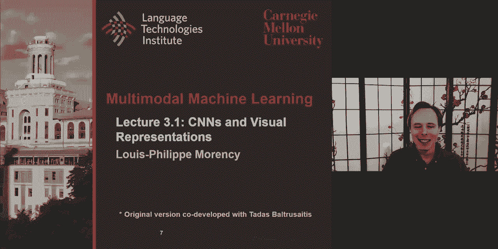

this lecture is about cnns and visual，representation，uh the objective today is to give you a。

an overview of of the type of image，representations，that are currently used in uh in，multimodal。

but also give you an overview of other，representation that may be，not as widely used now but we were。

centered，and very important in computer vision，these 15，20 years ago so so that you have a good。

historical view on，focus，uh a lot more on conversion neural，networks and all of it extensions。

i really want to you to understand the，concept of kernels because it is key。

to uh to this uh architecture，and also understand how these layers are。

created and then pool from there，uh to get some summarization and，abstraction。

we'll explore some of the extension some，of the original，uh architecture not not the original。

original one from 1990s，but some of the recent one uh we'll also，look at a。

more region-based cnn and we have an，appendix，with a lot of pointers uh on other ways。

of of analyzing uh，which are non-cnn as well so that you，have more than one。

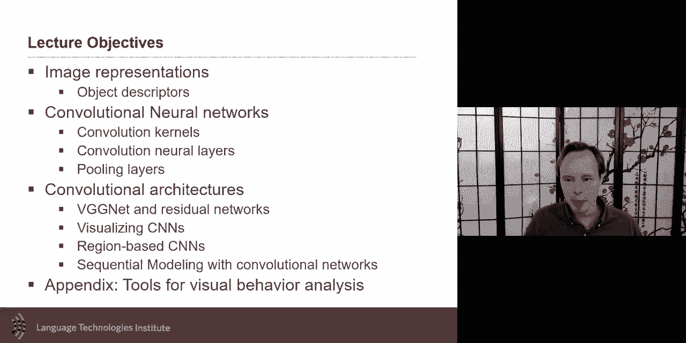

approach for this so that is really，important for us。

so image representations if you have an，image like this，how would you describe this image。

someone is eh what's going on，uh uh there's two people talking there's，a third person in the back。

there is also this is probably a diner，and then you probably recognize the。

character because of of the tv show，but how do you go from uh this this，image to。

a representation numerical，representation as，as we use actively in these neural，representation。

this is a very hard problem there's a，lot of information，in this image using all pixels will be。

overwhelming，although this is as we've seen one way，we could do。

which is just taking all possible pixels，and making in one big representation，um these days。

uh for good or for bad many，uh uh many approaches take this kind of，image。

and the way they will represent it is，object base，they will look at all possible object。

in the image and for，each of these object in the image，will either associate with it a label if。

your approach does that，or most of them will in fact have an，appearance descriptor。

so i have an object here and i will have，an appearance descriptor，and as appearance descriptor if if。

someone was to do it manually，like，what is the age of the person where is。

the facial expression of the，person what is the body posture of that。

person what is the floating of this，person。

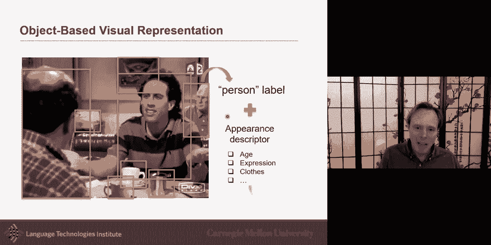

that's what we would like in practice，uh these days people will take this。

object and pass it to a neural，representation we'll discuss more。

what this kind of neural representation，like cnn will do，to make an approximation of that。

appearance the scripture，what this appearance descriptor will be，will be。

uh as kind of a summarization you you，hope，that these numbers are in fact a。

description of what their appearance of，that object，although in practice it may be picking。

up a lot of uh，use some useful information and some，very high details like。

the number of buttons or just the fact，that there's a little bit of shadow。

under the shirts uh color so there's，probably information there that's less。

useful some that's useful，but that's what's called an appearance，description or feature。

the descriptor and so an image，these days will often be represented，as a list of these。

object and for each object you will have，that long vector could be as long as 2，000 numbers。

that is an approximation of what this，appearance of this，object both the appearance and also。

maybe the class label，so this is a great way this is one way，and it's been very successful because a。

lot of the work，a lot of the earlier work on multimodal，earlier meaning。

maybe five to ten eight ten years ago，was a lot about，object that like image description。

and these will be very useful to know，what objects，are in there i want to also look back at。

that same image and study，like how should you represent an object，i told you。

and we will discuss in a second more，about these neural representation but i。

want you to understand a little bit what，the，the the conventional way uh to represent，objects so。

here i have an object it's a person and，what one way to represent this and i。

think it's important because，if you really understand what the，convolutional kernel。

in a cnn it is very useful to understand，what were the previous，ways images were represented because。

it doesn't it these kernels they do，something very specific，and there's a great intuition about it。

and so it's good to know how，people were presenting so one simple way，to take an image like this。

and saying hey let me try to summarize a，little bit what's going on in this image。

would be to look at image gradient image，gradient，will be the idea of looking here i have。

image gradient，which is the x gradient or the y，gradient，and they it's easier in this image。

because the contrast is so big，it goes from white to black it's looking，at changes。

um changes of variation uh especially，sense of，pixel wise uh in the email in the color。

or in this case it's in the grayscale so，image gradient，is is uh is a very powerful and in fact。

some of the low level of cnn will in，fact do，something like an image grade and i'm。

going to give more example in a little，bit，but image gradient is great because it。

gives you sharp contrast，every time there's sharp contrast so it。

will tell you there's a sharp contrast，over here around the eyes。

uh and definitely on their shirt so it，will give you sharp contrast。

it these gradients are also useful，uh，great success of these uh early on。

um if you uh looked about before 2010，some of the best approaches were in fact。

looking at these gradients，and looking at kind of a histogram of，gradient。

and here is is is really interesting，because it's doing two things。

it's it's taking the image and it's，spatially kind of creating a grid。

the grid you can see by seeing all of，these，uh points here it's it's taking the the，image，gonna。

it will tell you where is the the the，largest gradient or histogram of the，gradient which。

okay here i'm plotting the largest，gradient，and so what it means is that you can。

take the the concept i want to，explain here is that you have a mix of，two things。

you have variation of of the color，this is the gradient and this is plotted，with different。

angles here and you also have spatial，information because i，i keep gradient uh i compute the。

gradient a different part in the image，and so you could imagine here i did it，20 by 20。

i could have done it like just a four by，four，and for each quarter tell and say。

where's the gradient going，so this concept is going to come back in，the cnn。

very quickly when we do it with the，kernel but this is，histogram of gradient and there was a。

very famous one，called sift features that extend in this，and then i will also like to talk about。

something we don't see，as often in images because you don't，have that aspect of temporal。

but in video you also have the gradient，over time，so between two images where are the。

pixel moving over time，where's the motion going over time and，that's。

uh can be approximated with obstacle，flow，these may be a little bit con abstract。

for you these concepts so，i want to make it a little bit more，concrete by introducing the concept of。

harvard wavelet heart wavelet is，the first phase detector or i would say。

not the first but one of the，best one into early 2000 was，these，hard hard wavelets and the idea here。

is you have a dictionary of filters，and and a filter and i will use the term，filter。

and and sometime i will also when we，talk about kernels，you can also look at this as a filter。

and you could almost also see because，filter，and kernel maybe like concept that you，don't use。

every day those words but another way to，think about it is just a template。

these are templates i'm trying to match，on this image，and so here i have a template and this。

template is looking for horizontal edges，it，all over the image and i look for this，template。

and i finally find a template like this，here，because there is an edge there is a，horizontal edge。

then if i get a response to this i will，run my，template all over the image and，how much，match。

and that gives me a response and then i，get a new image that is called response，map。

so if i do it with this i will get，what's called the gradient horizontal，gradient。

if i do it with this one i will get，what's called a vertical gradient。

now i can do it different oriented，gradient，i can do with any kind of of these，gradients。

and so these gradients will give me how，often there is an，edge this way often there's an edge this。

way，and so when i showed a little bit，earlier this uh，histogram of gradient is the idea was。

that they had a bunch of these，different angles and they were just，seeing how well these。

match locally on this image but you can，also get a little bit fancy on your，templates。

which is a little bit the same as filter，and and kernels，and go and look at white dark white。

uh a very classic one for faces，is the opposite of that is like dark，white dark dark white dark。

is one of the best uh filter，slash template that you can do for faces，where。

here the bridge you can get dark in the，eyes，bright and dark in the eyes and so when，the first。

phase detector came in they had all，these fancy heart detector，are like different dictionary pre。

predefined dictionary，uh of and then they looked over which，one was useful for。

each object class and for faces that，a version of this was very good。

um so these har wavelets you can see，them as template，tested over the image to be able to get。

a response map and then you can look at，maybe the amplitude of the。

response map and say how well this uh，different dictionaries will match with，for this uh object。

these will be related with in a second，when we talk about convolution kernels。

uh they're very related to that and i，want to show another one，it。

it is called gaber filter gaber filter，is almost，of a generalization of these har wavelet。

and why they're so important is gaber，filter in fact are inspired with the，virtual。

virtual visual not virtual visual cortex，in in early stages of perception human，perception。

there is this bank of gaber filter，and then，if they see this then they will light up。

uh light up meaning a neuron will，activate，so neurals neurons and the brain is，already doing that。

so our intuition if brain and and we，like neural networks，so there's a good chance that having。

these templates could be quite useful，in in in in representing images。

so based on these intuition this is，where this idea，of of kernels or templates uh came in。

uh so you can see people naming it，slightly different，um so in our world of cnn we'll call。

them kernels，and so what this means is an image like，the one i have him。

and then i will have kernels and earlier，these kernels were very discreet。

and that's often what we would use is，very discrete then，or you can then make them a little bit。

smoother like two gaussian，once uh positive and one negative two，gaussian。

and if i run this on my image and i run，it all over，i get a response map and so you can see。

here this is the，horizontal gradient and then i run it，here to look。

at the vertical gradient or i could go，look at this one，this one is kind of not exactly an。

approximation but，quite related to these two and this one，will look at kind of。

any contrast or edges will come from，this one，so this is the terminology you have。

input you have your，kernel and where um we'll we'll call it，convolution because this is the。

uh here that uh and we'll discuss it，mathematically what it means。

you could say it's only multiplying it，all over，but it's a little slight difference on。

that uh like a slap，warping or flipping of the kernel over，that but。

yeah it is about just uh multiplying，over the image over，that's what convoluting uh is。

and so many approaches over the time，these days many uh of the。

of your projects and many of the papers，really，will be one extension of a convolutional。

neural network，and i wonder in the next few uh，slides we'll explain this architecture，about。

of kernels but the cnn，and so more details is coming soon about，cnn。

but i want to give you a little bit more，uh because there's more in an image and，objects。

and although most of the papers you will，read，these days the way they look at it at an，image is a。

images are more than that and，mean，if you have a face uh then um。

then in this case um then you may want，to also look，at the facial expression in this face uh。

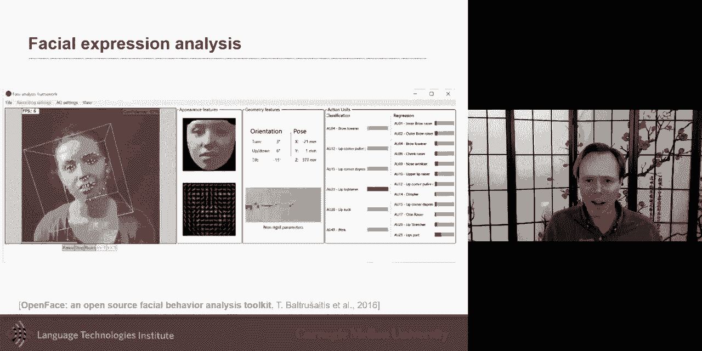

you may want to look at the eye gaze，or the head pose of this，face if you have a body。

you may want to also look at the body，posture of the person，and so what we put in the appendix。

of this lecture is not an exhaustive but，at least，a long list of other，visual。

behavior related to human other，ways you can quantify because right now，if you use a cnn。

and we'll talk more in a little bit but，cnn，what they do is they're trained on。

object detection a lot of them，are object-based uh object detection bay，so for them。

all of these people are all the same，it's just one big category。

but people are very different we know it，very well，uh there are different emotions。

different gender different ages and so，there's a lot of information that is，sometimes not as。

strongly uh quantified with uh，current uh cnn approaches so i want you，to be aware of that，powerful。

and very helpful conversion neural，network are still，them。

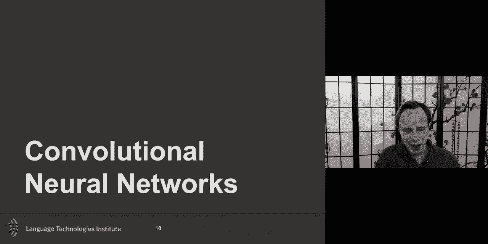

uh over the next uh part of the，this uh um this lecture，so uh one important aspect is。

why convolution neural network，what is it what is it they're doing so，well i'm saying。

they're not doing everything perfect but，they're doing a lot of things，and so their goal。

uh and uh because going from the image，one of the internal goal of this uh。

convolutional neural network，is to build a more abstract and，and and and to do this they do it in a。

higher way，a more abstract visual representation of，of their purse of an image and so，the um the uh。

the main key advantages of，convolutional neural networks at least。

five of them i i'm sure there's others，but five that，that i believe are worth uh。

describing or discussing one，the，gaber filter uh the gaber filter，is that um by having uh，maybe。

similar by looking at edges at low-level，sample at low-level layers。

it is somewhat inspired from visual，cortex because the cortex does have。

like initial activation maybe looking at，edges，and then after that although in the。

brain and cognitive science there's，still work to be done to know exactly，what is。

after these initial uh there's uh we，know that there's some dedicated one for。

certain object for example，for faces so there is a probably，inspiration for visual cortex。

one thing about cnn that is great and，will emphasize，and you can see it already uh at least。

at a high level here，is that encourages this visual，abstraction where。

at a higher level and as you go higher，and higher in the，and the models uh you get hopefully。

representation that are，of the，image one thing that i will explain in，more details in the next slide。

is，lp right now talking and this is still，lp talking and this is still lp。

talking the only difference is is me，just translating，and and so although for some application。

translation，and variance maybe uh like knowing that，i'm on the right。

or knowing i'm on the left is important，in many cases，just knowing that it is lp is the most。

important，and so being able to take advantage that，this is lp and this is still。

lp and then i don't need to learn one，model of lp being centered。

and one model of lp being on the right，side of the image，and another model of the right side that。

is something that，is we should take advantage in the，neural network，the big difference with what we。

talked about earlier with the gaber，filter and the har，and the cnn the big difference is that。

the these templates these kernels these，templates，is not it's not a predefined dictionary。

as previous approaches had done，instead it's learning it dynamically。

it not dynamic it's learning it as part，of the optimization，these are learn it's not a predefined。

set by either a human or that mind who，did it，it's learned from data and one thing。

that's an advantage of cnn over，doing the same problem with a fully。

connected model like a multi-layer，perceptron，is that it has lower number of fewer。

parameters and primarily because of，these two，because of number three and four then。

five comes from that，so translation and variance i already，gave you an example but。

if you want to detect like is it lp uh，upside down or not uh you can do that。

i give you an image of lp uh，and then uh and and then you find out is，it an upside down image or not。

and you can learn that relatively well，with the multi-layer perceptron。

maybe even one neuron may be able to do，this task，but then as i mentioned there is the。

idea that if i slightly on the right or，the left，you want to still be able to recognize。

you don't need to，you should not have to train what upside，down means in。

in both case and so the models should，still be able to classify。

natural conventional mlp unfortunately，they're not translation and variants if。

you have an object and it's slightly on，the left or slightly on the right。

it will be almost a new instance for，them，because the the way it is by default，looking at the image。

every possible pixel so but cnn the way，it will be done，is uh by approaching it from a kernel。

perspective，and hyku call will uh by the doing the，kernel，and running or convoluting it all over。

the image，what we will be looking is is like for，example when we talk about lp。

is maybe he's always smiling so we're，looking for some，smile kind of local features or we're。

looking at a specific type of hairline，uh i don't know what else is typical of，lp what he looks like。

but they will look at very local，descriptors or，templates uh of what what looks like lp，these。

uh patterns uh that's uh what we called，kernels or，we call templates and by doing this kind。

of approach we，allows or it helps both it helps，by reducing the number of parameters and。

also help with translation and variance，so，so i told you the big difference between。

this previous work，and the cnn is that the cnn will，instead of taking a predefined set of，kernels。

these uh as you have many layers of the，cnn，fact，the big w uh if you remember in a linear。

classifier or a neural net a neuron，the w uh a lot，what will be learned in that w is in，fact。

what this kernel should be and so you，could imagine you start would。

randomly initialize them so all of these，will be like looking like，noise and as you go on and on uh。

then the network will find what is，useful，uh for separating the different classes。

and in this case maybe dogs we seem to，like dogs and so colors may be important。

or different kind of stripe patterns，allow，to learn this dictionary in an automatic。

way and if you have，new classes or new labels maybe the，dictionary will be different。

and here what you see and they don't，look as intrusive here，but this is is an aggregation it's it's。

it's mostly，a template of templates and we'll，discuss more in detail。

but the low level is looking and these，are very intuitive，because they look a lot maybe like。

something like this so these are like，templates a little bit which would be in，your eye。

the earlier and then what it is here is，the next level after okay，look at。

like more complex patterns on top of，that。

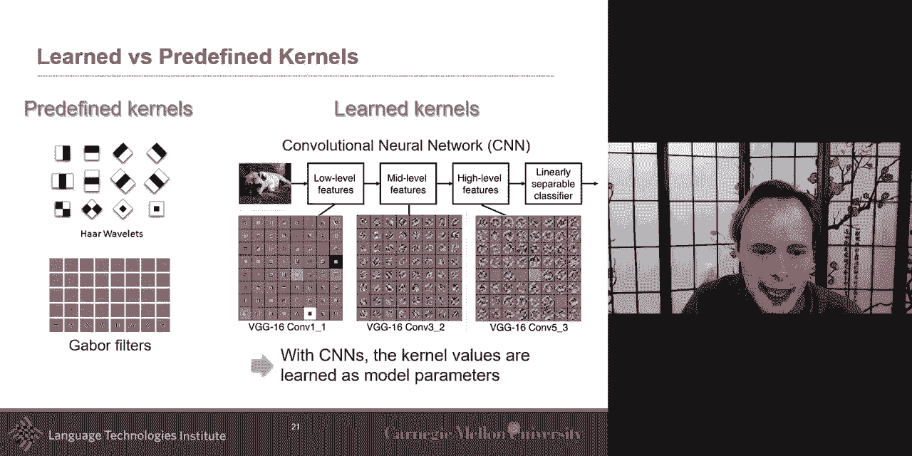

um so in the cnn we learn these，parameters。

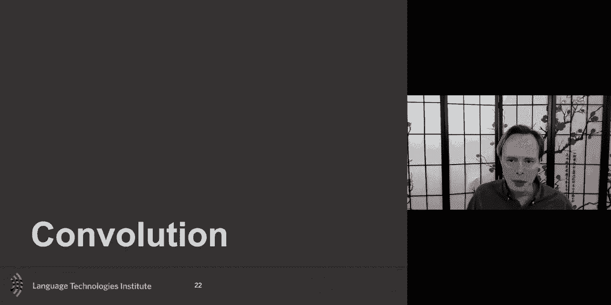

so just to remember uh what convolution，is mathematically since this is the core，aspect of it。

so the most uh like theoretically，or mathematically uh convolution，is a basic mathematical operation。

given two functions returns another，function，uh in the case in our case will be one，function maybe。

the image another will be your kernel，and then it returns this other function。

which is the response map，we will that this is the high level，function。

uh in our case there will be discrete，functions uh but this，also works or do you have the continuous。

um，and in our case we'll look at discrete，version which is what we'll focus on so。

so if you have the 1d and you have a 1d，image and maybe everything is dark，okay，maybe。

of this line and then there's a kernel，that is looking for an edge any kind of，edge。

uh and uh but it's looking for a uh，in this case because we have only one d，is looking for an edge。

um so it's going from zero to one，uh to minus one to one again，and so if i run this uh and i use the。

term run but as i convolute，this kernel on my input then i get the，response。

map the the output of the convolution，is my response map that shows where this。

uh match really well around here and it，matched really well，or matched really well positively almost。

if you look at it as a correlation very，highly correlated around here。

are weakly correlated or negatively，correlated around there，so this is like 1d convolution。

in cnn we only consider function，uh in a limited domain in the general，domain it was continuous。

uh but in the case of cnn we'll have the，signal is the length，n not just infinite uh n。

uh and it's if this is for 1d and，if it's a 2d it's n by m or，uh the the the width and the height。

and then the kernel itself if it's 1d，will have one lens maybe，usually kernels are not really big it。

could be 3，five seven they often uh，are odd numbers and the output。

will be uh it's a simple uh the number，of output will be the n。

minus k plus one it's just you have to，do the test yourself but，these are the number of complete。

convolution that you can do，there's the edge cases uh and there's，some little tricks to do there。

one example is to just copy over，whatever，the valid any valid convolution and just。

copy when you're on the edge，that's an example for that uh，if we want the output to be different。

sizes，and that's what i was just saying you，can either pad，uh make the image a little bit larger so。

that eventually it is the same size，this is an example that you can do one。

other thing that you may hear，is the concept of dilated uh convolution，or strided convolution。

uh it's just the idea that you skip uh，so instead of taking the input。

you're kind of down sampling the input，and then running your，uh your filter on this so。

uh this is 1d but in a lot of cases，uh that will do it is we'll do it with，2d。

so we'll do the convolution in 2d but，the basic concept，is the same so i often call them。

these convolution kernel templates，and you can see here this is clearly a，template it's looking。

like something like something like this，um，do you know the building in the back，yeah。

okay yes it's mighty um，it's，okay i don't know okay that's uh put it，in your summary。

who knows what this image in the，background is maybe my bias from my phd。

at mit tells me it's my t anyway，so yeah but you can see the convolution。

goes and look for this exact kernel，here and you can see the response map is。

is finding it here but there is a dark，and a white，and dark and white also matches a little。

bit around there，and so that that's what the idea of this，um，i'm just gonna uh to show。

this example uh this is a an example，of um and uh you should uh，take the time to look at it in more。

details but i just wanted to show this，so what you see here is you have。

um sorry i think you see my pointer so，you have the input image here i have it，input image as rgb。

so r g and b and then i have my kernel，and in this case i have more than one。

kernel so i'm kind of generalizing over，many things here，in this examples um so i talked about。

only one image and one kernel um，but you can have multiple image and，multiple kernel。

in fact one kernel here i have two，kernels，and each kernel can have multiple，dimensions so。

um and so a response，the response map if i have only one，image。

and one filter then it's a 2d response，map，but if i have a 3d volume then i have 3d。

uh filters then i have also 3d，uh and i have more than one filter then。

i have the response for one filter and，the response for the second filter。

um even if i if i had if i didn't have，w1，i will not have here this second。

response the second response as you see，talk，we'll talk about this not just about the，matrix。

or response math we'll we'll talk about，it as a tensor，as a 3d or more matrix um yes。

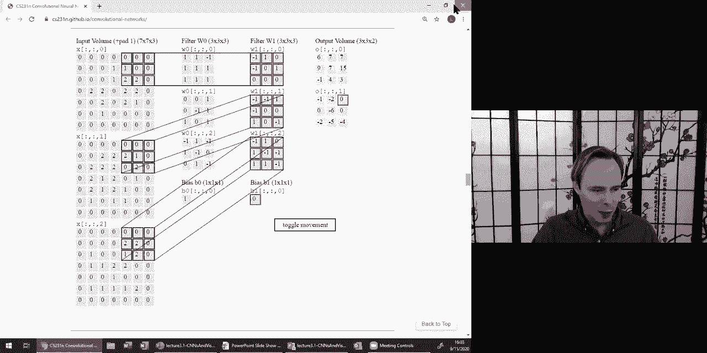

so this is an example uh and you should，look at more this。

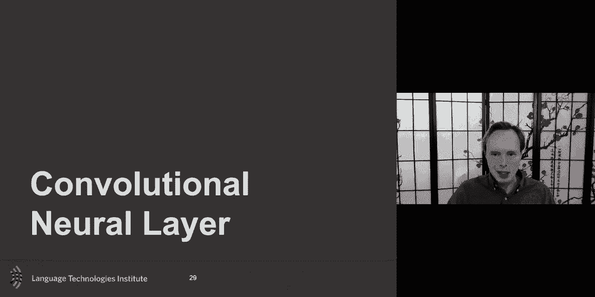

this webpage is quite good so，convolution neural layer，and this if you have to focus like what。

i want to give you the intuition on this，and this is important because so many。

people use cnn and don't realize what，the cnn is doing，and they just take it as a black box but。

we're about to do multimodal，if you take every unimodal，representation as a black box。

your fusion is not going to use all the，intuition it could use，and so i think it's very important to。

have the right intuition，about each modality that you're using in，each representation。

because that will allow you to make your，fusion and your joint。

multimodal representation more intuitive，so taking an image like this。

if i wanted to use a fully connected，neural network，and and learn to predict a response maps。

what it is is i want to give me an image，and i want to be able to get always a，response map，this。

exact pattern if you remember uh，this pattern that that was in this。

so i want to go from input to output so，the simplest not the simplest but one。

maybe way you could do is to connect，every possible pixel，here to every possible location。

in the image and every pixel，and so every location like to answer。

this it will be based on all possible，pixel，so that's what here this neuron this。

neuron the output of this neuron here，would be based on all possible image。

and the response from this next neuron，will be from，all possible pixels so as you imagine。

this is not efficient even if your image，is really small，the number of parameters will be huge if。

your kernel，uh was of size n or if it's even like 2d，kernel it would be a huge number of。

parameters that you'll have to learn，so uh and it may learn，different the most like like they're the。

harder that uh，um the challenge here is，um is uh is that this is not even，translation invariant。

if i shift this image slightly to the，left or the right，this will be completely different from。

it because the weight，for this pixel may be different for the，weight from this pixel。

um even uh also it's one thing that it，may learn，is that end up may learning a different。

kernel for different part of the image，because it may end up learning a kernel，for。

this part of the image but a different，kernel for this part of the image。

so it doesn't necessarily there's，nothing that force this kind of uh。

model to learn any kernel by the way i，think there's a little typo here。

i will double check it for the next uh，lecture，um but yeah so，what i for the convolutional neural。

layers，there's two main modifications we will，make，um so uh just notation i want to go from。

the input，i want my i want to recreate this effect，of a convolution，in a very efficient way and so。

uh then what you want to do，what you want to do here is you want to，do a first modification。

and the first modification is the idea，that，to know the result of the convolution，for this。

uh for this neuron，okay i don't need to know the whole，image，i don't need to know all the pixel i。

only know，to know this little part because my，my kernel let's say my kernel is a three。

by one or three by three，is is applicable only on a subset of the，image。

okay and so i only need to know，a small subset so i don't need to have，all pixel。

connected i only need a small so a small，number so it's a very sparse。

this matrix w which originally connected，everything，there's going to be a lot of zeros。

because there are a lot of pixels like，these pixels here，they have nothing to do with the output。

here，the second one which is takes a little，bit harder to understand but i think is。

the most important，is that there is there is a lot of，redundancy，what it means is the kernel used。

here should be the same kernel used here，should be the same kernel used here。

should be the same kernels you'd hear，so this link uh，here which is the first of let's say。

three links，uh it should be um and it's swept，because it's convolution if you wonder，why。

uh this one is green and not red it's，just convolution being swap。

that's how the convolution is computed，but yeah uh，but the the first one like any of these。

neurons the first one coming，in okay this one the first one coming in。

we don't want it to be a different w，tree，we don't want it a different value for a。

different part of the，image we want them to be tied together。

we want it what's called tie the weights，this is not a free parameter com，different from this。

if if you make any change to this uh，using gradient descent or something the。

same change should happen here，in fact you should sum all of these，changes because they're all。

together they should all be uh they're，all the same there you want to tie。

them together and so that's the the two，key modifications，what didn't show mathematically is that。

big w，matrix that links all possible input，pixels，to all possible output pixels is an。

extremely sparse matrix，because it's as large as as what your，kernel，you want it to be and。

uh also what what's what's important，here，is uh the tying of the weights the w1。

is the same for the other w1 so the same，um the the same weight。

here all of them are going to be tied，together，and mathematically what it means i i。

didn't put a slide for that，but what it means is uh gradient，uh respect to w1 here is uh。

is gonna be uh uh sum over，like you're gonna sum all of them，partial one together it's all tied。

together，so okay and the nice thing with it um，is that it can be efficiently，implemented uh。

because at the end of the day i show it，to you as a big matrix。

but really as it is it's implemented is，is is is，all in parallel uh so i can do each row，almost。

in parallel uh all together and that's，why it's such an efficient thing to do，okay so this is uh the。

uh intuition behind uh，cnn the the core component of cnn，this is the this w matrix the w。

matrix here this w matrix it is，it will learn our kernel so what's，really cool is suddenly i take。

a multi-layer perceptron or fully，connected，and then a normal neural networks and。

suddenly i make it in such a way that，it's gonna it will learn from me a，kernel，so w the w is it is。

is gonna be a kernel uh and now if i，want many kernel i can stack and i'm，gonna show that in person。

in a little bit but here you have one，kernel，that will be learned and and and and you，can always。

get a little bit more fancy and then add，an activation，uh function after that and this。

is back to the typical neural，representation，but the most important part for the cnn。

is that convolution layer，that's what we will call the convolution。

layer and we call it the convolution，layer because，it's a typical w it's a typical it's a。

it's it's every pixel connected to every，value from the response map but uh the。

the key here is that because we tied the，weights we end up not learning。

all possible weight when we end up，learning a very small subset，so this big w looks really huge。

but there's only three values learn in，it，and you can see why the number of，parameters is。

is so good for cnn although，you hear now with cnns with like。

millions of parameters but the basic cnn，doesn't have like compared to how big，the image is。

and how complex this could be it has，very few，parameters compared to uh like the。

number of connection that could be，from an image to a response map so。

that's why they're also quite efficient，to you，i talked to you about the 1d example。

because it's easier but this can be，expanded to 2d and that's usually the，typical cnn，over。

but in fact it's a it's a 2d，a 2d template a 2d kernel that is going，to run。

so if it's a 3x3 what is the number of，parameters in w，if i have a 3x3 kernel my w。

my huge w matrix that matches my，that that links uh my input to my，response my。

how many parameters three parameters in，it only nine，okay only nine so that very few uh in，this。

um and it could be also 3d because，um you could look over videos i'm going。

to give an example of 3d cnn，it could be also 3d uh if uh or，multi-channel or 3d。

because you have your image，is is 3d in a sense，when you have a color image you will，often have。

one three image stacked together and so，your uh，your uh you will often use uh three by。

three by three，uh kernels for this um，and it can be expanded to multiple，kernels，of，of。

uh of kernels of template and then and i，showed you，that that nice uh comparison where cnn。

learns these kernels and loans these，templates，maybe，like 64 of these templates so really，what a。

and typical cnn uh will have many of，these kernels that are learned。

so i have my input image and for the，first convolutional，layer and what i will do is maybe 64。

kernels that will be，and they will maybe initialize randomly，with the hope that they will learn。

something，useful each of them and，and so what you will do is you will，simply have。

many of these kernels many of these w，matrices，um and you will stack these w matrices。

all together in one 3d matrix，so your input may be just 2d and then。

a typical kernel will have a 2d big w，matrix，but because it is over，uh many um。

over um mini kernels then it would be a，3d matrix，and a response map will it be 2d or 3d。

it would be 3d because you have many，kernels you'll have a response map for。

the first kernel a response map for the，other，and so what that's what you see your。

image here you have a kernels，uh in this case uh maybe there's a，i don't know 10 kernels and。

what's very weird here is the size，should be the same here，of the number of kernels so sorry for。

for this but yeah，you run this over the，image and this should be。

uh usually the kernels here i show the，huge w matrix，the often there you will see the kernels。

being much smaller，and they show more smaller they will say，show them just as three by three。

but it's a little bit um they only show，three by three but，in what what really it represents is is，a。

w of the size of the image that's that's。

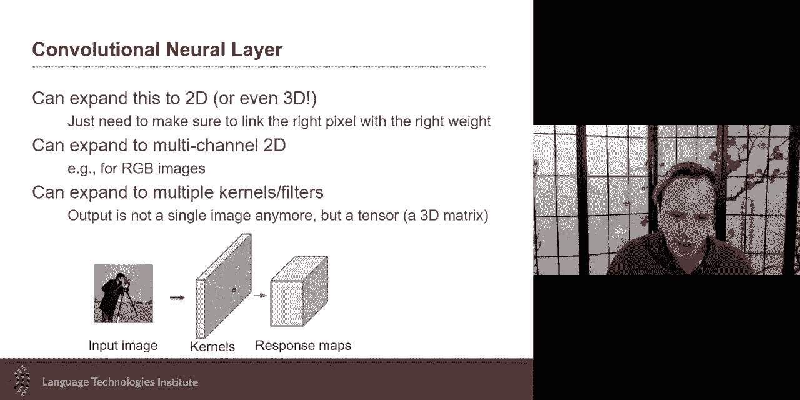

with the equivalent，of of what the convolution will be doing。

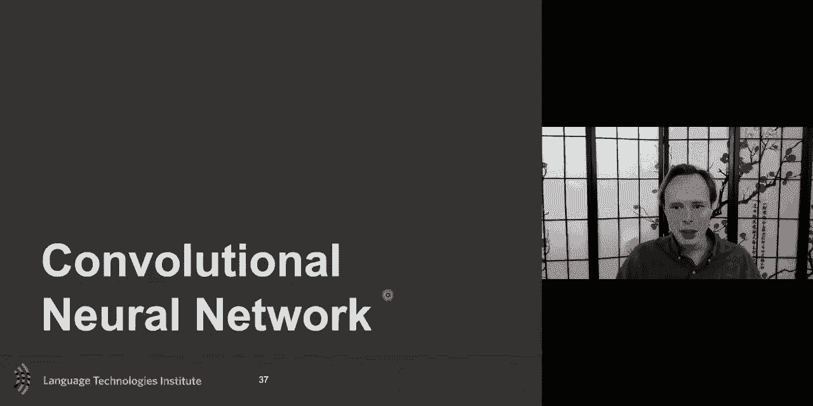

okay uh so the convolutional neural，network，the typical one will have multiple，layers so i talked。

about these kernels for one layer，so for one layer you will learn uh these，different templates。

uh and these templates what they allow，you，and that's what i show here these are，the kernels。

the kernels that i'm learning these w，uh that i'm learning uh and then at the，next level。

i will learn and in here in this，visualization，these are really kernels at this。

level i'm showing something but，in reality you will rarely learn a，kernel。

like this what you will learn is，a a combination of kernel it's kind of a。

almost of a kernel of a kernel so what，it is，and and these are your kernels at the，first layer。

and then the next layer your kernels，you're also learning kernels or，templates。

are not going to be done on the image，which which is a little bit what this。

visualization make you believe，is as if these and the next level，they're just bigger on the image。

no in fact the next level often the，kernel will be the same size maybe。

three by three but instead of running on，the image，and，by running them on the response map。

i'm kind of doing a kernel of kernel or，combination of，of response to the kernel and then at。

the next level i will also，doing another kernel which again is not，going to be much bigger。

probably also by three or something like，this so it looks like it like that the，kernels。

are are very uh big uh and that's what i，run that's what i'm applying on the。

image but here what they did，is a simple step of what's called，deconvolution。

and this is one of the paper um，visualizing and representing cnns。

was partially there one of the step was，about deconvolution，to try to see uh what happens uh。

in the interpreting a little bit what，happens in the cnn，but in reality you have a kernels at。

each of these，and these kernels were relatively small，but because you have a hierarchy of them。

they will get bigger，but how do you encourage abstraction and，summarization because。

if i have an image of like two thousand，by two thousand，one thousand by one thousand and i run。

and learn，my uh kernels and i get a bunch of，response another，and the response map will be about a。

thousand by a thousand，and then i learn new kernels on it and。

then my next response map is a thousand，by a thousand，and i learn new kernels on it and it's a。

thousand but，if i just do convolution i i i'm not，forcing the，algorithm to uh summarize thing。

or abstracting and this is where the，pooling layer comes in，uh，the idea is and you you have a。

different type of pooling uh which is，you could just，uh one is mean pooling or max pooling。

uh i think in the paper of deconvolution，i think they may have done max pooling。

and that's often used um but the idea is，i get，uh my image i run the kernels。

uh on it i get my response map and now i，have still a big response map of a，thousand。

and before learning my next kernels，and what i will for do is just pulling，is just。

you could see as a fancy word for down，sampling，you are down sampling this and there's。

different way to down sample，or to pool or to down sample，be，maybe mean uh down sampling so you have。

rage m，uh but that where the problem with some，time with mean pooling。

if you look uh uh downsampling for，an，image then it may start looking a little，bit more fuzzy。

at the edge will not be as sharp so max，version may be more sharp but it will be，more noisy。

so you can see there's a trade-off in，that，um so this is the pooling the great，thing of the pooling。

or at least has been done is that，there's been tricks that been developed。

to make the pooling efficient also from，a gradient perspective。

because if you start doing things like a，max pooling，a mean pooling is maybe easier but max。

pooling is like you you you have to be，able to go，uh backward uh and and be able to。

differentiate that，so a step function is is uh by default，uh will be，uh harder uh to differentiate。

it，and so there's been some approaches to，uh do，the gradient uh descent uh and。

and and passing the gradient event，through a pooling layers。

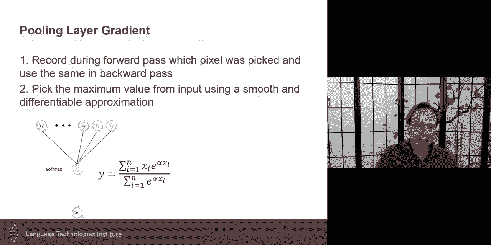

uh this is just one example of that。

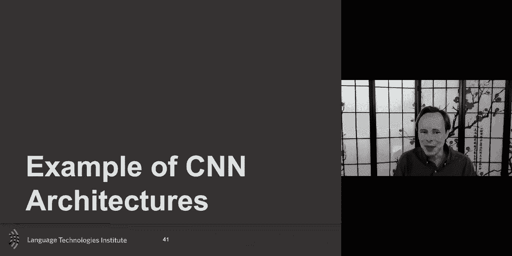

so uh so then we have everything，together，uh and that's what uh cnn is，uh a cnn and and and uh。

and a lot of these libraries sometimes，they will call about layers。

okay and you'll say you have your first，layers convolution，and then you have a relu what's really。

interesting，is like in the terminology of neural，network，the you need both of them to have a。

neural network，because you you have the w this is w，this is just multiplication by w and。

then this is the activation function，at the end this interior the，non-linearity。

and so um and so they will go ahead，uh and they will uh uh architect。

and i think the right word architect，because，um because there's a lot of human。

knowledge in this that need to be added，on like what is a good architecture for，this and so。

we'll uh have different version and uh，of this most of them like a famous one，is the。

vgg uh which is uh one of the，first uh popular one which is a bunch of，convolution。

and then you do a pooling too so that up，same，size as as the original uh。

image but as you go here it should be，smaller，and then you get and then you at this。

point you will have，what is the last convolution layer so，you have an image maybe。

of uh let's say realistically 64 by 64，or 640 by 640 and by this。

you may be to the point that it's only a，size of 16 by 16。now，i'm i have that 16 by 16。

and what's uh i want to do，classification what is the object，that's in the image what's really nice。

at this level is that，i still have uh information，like this response here of my 16 by 16。

like this response here，this response here is related to this。

corner of the image and the next one is，related to this part of the image。

it's almost a grid of four by four on，the image，and so this layer at this layer i have a，mix。

of of of the location of things，and the appearance of things the，appearance is like the response。

map and the location is because you have，like 16 by 16。and so i will use this representation。

which is very similar，to a histogram of gradient uh in a sense，it's just that it's dynamically。

or learn the kernel i learn，and then what i do is a bunch i put the，that。

as my classifier so these are my input，and then i put fully connected layers。

on top with the goal of finding which，of these are the most useful for each of，the type of object。

so this is a typical architecture，and a lot of them one thing i want to，say。

is a lot of them are trained on the same，data sets，and you have to be aware of that because。

a lot of these data sets go with maybe，just a thousand class labels uh some of。

the original one had maybe only 80 class，labels，so they knew what a person was but they。

don't know if it's a man or a woman，or didn't know like the age or something。

or they may know it's a car，but they don't know which type of car，which。

so but they don't have like you will，hope，that because they look at all of these。

different type that they，they see a little bit of the variance，but they were trained for。

very specific class lay type of object，and so you have to be aware of that when，you use the cnn。

that they may not emphasize the the，thing that you would like and that's why。

they were extension of vggnet，like vgg face that were just trained on，faces。

as an extension and this is the image i，showed you earlier，you can see the kernels that are learned。

the weight and the different layer，and these are shown i can show it，they're bigger。

but these are shown because of，deconvolution they are not bigger，just。

uh the convolution of that and and uh，and not the best the convolution yeah。

you'll see some better deconvolution，and so and there's some approaches and。

i'm not going to go as much，in this because it's part of your。

readings and if you don't read the paper，it，by the way the reader the papers this，week are about。

understanding cnn and rnn and really，understanding，why they're working and why they're not。

working and so，um so there are a lot of different，activation，uh different um architectures。

uh that you can use uh and different，variation，one of them that is worth discussing is。

the one that has，a residual connection so the，the the kernel the neural network。

then it's its job will be to kind of，say what it try to model what what。

what previous uh what previous，layers didn't manage to model and let's。

let's just model what's what's what's，what what you didn't，uh what previous layers um and this。

uh skip connection or residual，connection was also，very important uh to make it possible to。

train a very large number，uh of layers that's also help with the，gradient，uh in this case um。

so you can go and visualize these，uh and so that's the purpose of of the，papers。

uh this week and so i'm gonna，because of time i'm not gonna emphasize，as much。

uh this next part about visualization um，but i i i either you read or you。

you you have your colleagues and talk，about it，but deconvolution is uh the idea that。

not only you do your convolution but if，you have，a specific uh response map。

you would like to know hey this uh，this response and my later stage and my，convolution。

what does it look like what if i go，through all these kernels one after，another like。

back what kind of object is it looking，like，and so this is looking at the，convolution。

uh and there's some tricks to be able，that when you do the learning。

to be able to do the deconvolution，and and and that's from exactly from，that paper。

taken from that paper but then there was，some really nice trick，uh from cvpr 2016。

which said okay train your normal，classifier，uh you don't have this part here um，train the normal。

at cnn but then uh，before and instead of using the fully，connected layers that you normally have。

i'm going to force you to have only one，layer，and i will force you to for this layer，to be linear。

what is nice with this is that suddenly，i will have a linear，mapping between class label。

and a different response map and so，i will know which response map was，useful for which。

and then i can go and do the，deconvolution，and so that will tell me for each of。

my label what what part or what region，of the image was the most useful。

and then they went a step further and，that，and that's what one of the reading，papers that was there。

uh and that was and the advantage here，is that it doesn't need to do that，assumption but。

it's true the gradient that you will。

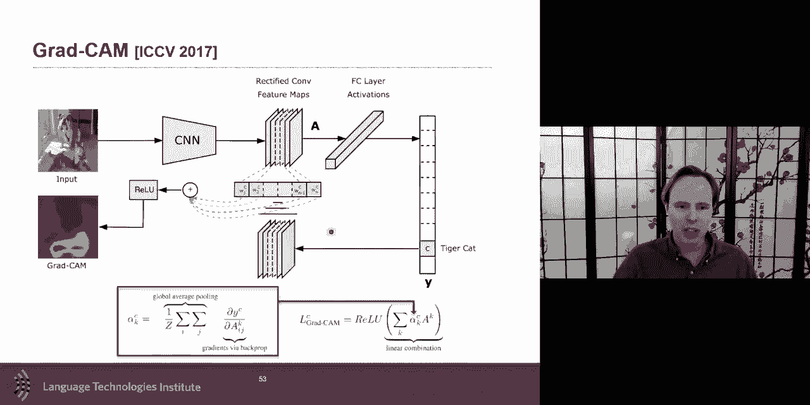

find out which layer was the most useful，and i'll let you look at it for for more，details。

so the extension now cnn is the basic。

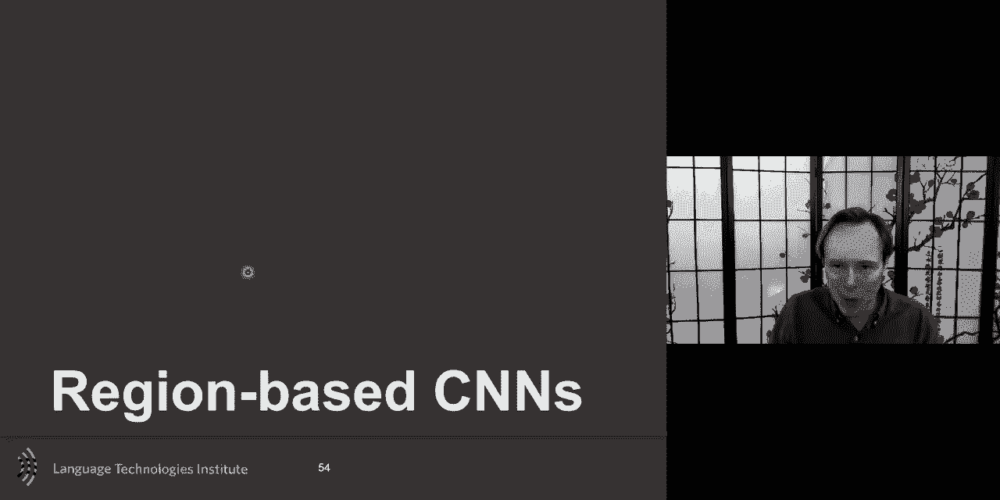

building block，there's been a lot of extension to do，this，trained。

on very well and specific objects like，tv，person people um then。

the way to run it a simple way to run it，so i have my object detector。

and then you could detect and run it，everywhere，on my image and get all of these，detection。

and then there's been some approaches，that were done，to，only one of them um and so there's been。

some work，and also there's some work on uh，segmentation this is，a picture um uh i don't know why the。

link is not showing，uh of like doing both segmentation and，detection at the same time，one。

option is to slide the window uh like，this，is a very uh very time consuming。

uh and so there was a really neat uh，how to do it efficiently uh and the idea。

here was to do uh image super pixel，um and the intuition there is if you。

have in pixels that look the same，uh you should be able to take that，information。

and and be able to use that for merging，also，sorry the earlier citation is here this。

is the earlier citation，uh that that we go but the one that，has been and a lot of，[Music]。

papers were using until recently it's，called rcnn，and here is you select，a 2000 region and then。

and only and so you kind of have a pre，an initial step，which can be time consuming but we'll。

discuss that，in a second but you have a a fast way，to find if there's an object there and。

then you're gonna run your fancy cnn，only on that only on that，smaller uh object regions。

and and so the cnn is the expensive，thing，um but then i will have and we'll talk，about different。

ways to make this efficient but i will，have an initial one that goes over。

and find region proposal so，you have two steps that are confusing，but if we can get the first step。

efficiently hopefully we can make the，second step，uh it's not going to be too much of a，problem。

so the fast rcnn i apply cnn only once，uh and then extract the region and then，there is a。

fast rcnn that dude regency，and so，instead of doing it on all of it it will。

do it only on the response map so，you have a lot of this extension uh now。

these days i don't think this is，completely up to date，uh，and there's many of these yolo a lot of。

these three，a trend mark is like precision versus，speed uh and the goal is to be as。

efficient as possible uh as well，as doing so so this is the idea and，that's why，many uh of uh of the。

algorithms you will see are using some，extension of these，uh of these region based。

detectors because they will allow you，um to very nicely and efficiently take，an image。

you get a list of object and then for，each object um，you run your cnn uh and then for each。

object maybe you do testification but，for each object you run your cnn。

and then you get this representation of，that object that like vector of 3000 and。

so you can have a list。

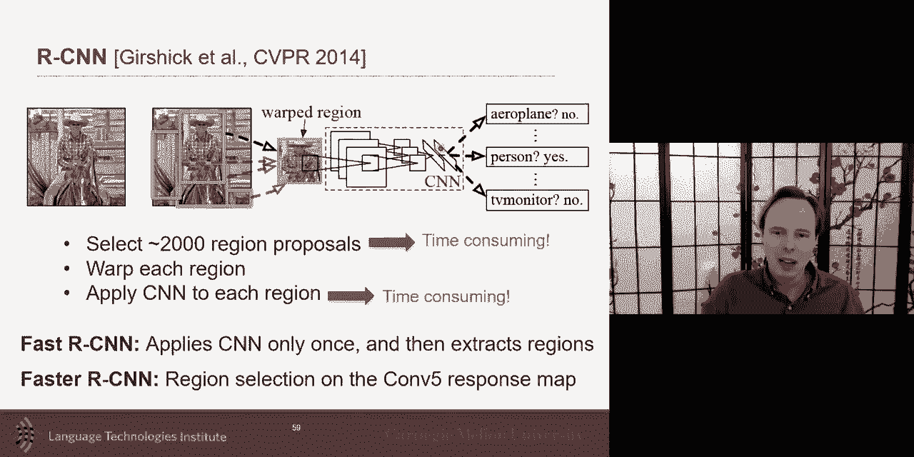

of these different 3000 vectors and that，could be a representation of that image。

you can do a little bit more fancy and，instead of using not only。

every object but also looking at the，segmentation，uh looking only at pixels that are。

unique to that object，or specific to that object i just wanted。

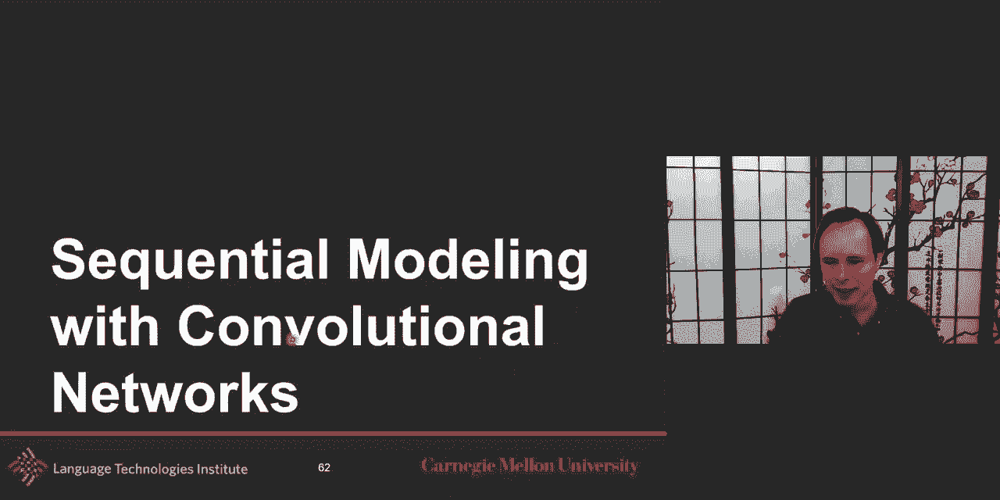

to share that，okay i was rushing a little bit through，that because i want to get to that last。

part which is，quite interesting and i want you to，think about it and also，a very a nice um。

link within the next lecture which is，about sequences because language。

is a sequence but vision is also，a sequence often because you have videos。

and so i talked about uh how to do it，for one image，and you can imagine doing cnn on each，image。

but how do you represent a video，sequence，uh and one of them is rnn and uh。

or even now these days you could do self，attention and transformer but we'll talk，about these。

uh on next week on thursday，but another way to do it is to，learn a 3d cnn because i told you。

cnn can be applied on an image or could，it be applied like a colored image where。

uh is like an image and then r g，and b and so you have three mage all，together in a tensor。

so then there's nothing that stops you，um to make it a，3d tensor if they're。

yeah colored image it would be a 4d，tensor just a little note，um and it's important because when you。

do that then，then what what what will be these，kernels gonna will learn it it's it's。

important to think about it，what they will look at they will look at，local。

change of appearance um the a kernel，will be now three by three by three or i，will look at。

uh part of it will be local appearance，uh of each image over uh time。

uh like each image are they appear but，because the kernel is uh also 3d like，also over time。

it will also look at changes of，appearance，and i talked quickly about optimus up。

um optimization about optical flow，but these 3d cnn are probably looking at。

these local change of time，local change of appearance over time，that。

they don't look at local change but，they're each of them are just，reinforcing each other。

in which case you're kind of wasting，probably thing because，you're using a 3d cnn when in fact a 2d。

cnn would be，sufficient because maybe to recognize，a basketball player yes you want to see。

them more with the motion but probably，if you pick up their jersey or the ball。

or something that will probably give you，the appearance，so 3d cnn are useful in some cases。

but some of the time there may be an，overkill and you could imagine i don't。

know if they've been but you could，imagine hybrid approaches，where most of your kernels。

are 2d because maybe most of your，information，can be done from appearance of the。

objects uh but then you add today，uh also maybe some 3d that look at，temporal。

that may be a more efficient way，there is also the um uh，the uh idea of doing convolution over，time。

um and i i like to talk about this，mostly because it's it's really，important。

to look what was the date on this uh，and this is one of our own like cmu，faculty。

um but the time delay neural network，was that like one deconvolution，over time uh although i i。

it was only done in 1d and then later on，was done in 2d，and then the name convolution neural。

network came in but the time delay，neural network which happened either，before around the same time。

as the cnn came was also so，the 3d cnn is，uh kind of doing uh could be used。

as it and you could do it a convolution，over time，and so using this idea of convolution，over time。

you can take a sequence of image or，sequence of words，um in this case you could imagine using。

a cdn like 2d cnn，get the appearance vector for that 2d，cnn，do it again 2d and then on top of it。

have a 1d convolution and the one，deconvolution what it will look。

what's a 1d convolution any convolution，look at，templates look at the pattern so what it。

will try to do，if you do a time delay net neural，network，on top of uh like a bunch of 2d cnn。

when it will look it will look at a，pattern if your kernel，three。

images is there any kind of patterns，like，maybe detecting uh sentiment。

and so that's what it will do it will，look at patterns，and template that's what it will look at。

and so the temporal convolution network，is is uh extending this kind of idea。

intuition and just like saying hey，i have an image and i will learn a，convolution uh。

kernel and then this convolution kernel，uh will be run over time with me give me，my response map。

and that can be pulled together and then，repeated again，and and that can be multiple layer of，tcn。

temporal convolution network and so the，temporal convolution network。

is an example of of taking this concept，of convolution，but not doing it just over the image。

this one in fact，presuppose that you have already for，each image。

kind of got already a feature vector uh，here and by the way i i if i give you a，video like this。

and i ask you hey learn emotions let's，say，one option is to take each of these，images。

and run it through a cnn like vgg face，or something，but you have to remember that the。

there's a lot of subtlety，and the cnn may return like a 3000，vector。

3 000 value vector so it's a very still，high resolution，so you want to maybe look at other。

approaches i told you about these，software like，open face that look at facial expression。

so the vector here representing that，image，could be just the output of which facial。

expression are there，or where the person is looking or where，is the head gaze。

and i could have or it could be a cnn，you could go also that way，another thing to remember。

when you have a vgg net uh or any of，those cnn，a lot of them are trained to，differentiate。

um a car from a person，and like it's object detection，what it means is that it it。

it it differentiates object it's not，like a generative，model in that sensor so what the issue。

with this，is that it will learn kernels，that best differentiate the different，classes。

it will not learn to model，the different type of cars and so，a cnn by default cnn may not be。

really good at differentiating like，a red car blue car like it may not be。

so good at uh differentiating different，type of car，or in the case of a face if it if if a。

model was trained for face recognition，then uh then it's the goal of face，recognition。

is to know the identity of the person，and to ignore，to be invariant to the facial expression。

but if your goal is to do emotion，recognition，using uh something that was trained for。

face recognition，may not be useful maybe the first few，layers will be common。

but the last few layers are not really，the the most useful and so that's why。

you will maybe do need to do fine-tuning，because the last layers are not going to。

be useful by themselves，okay a little uh side note i wanted to，share。

on this um and the tcnn which we will。

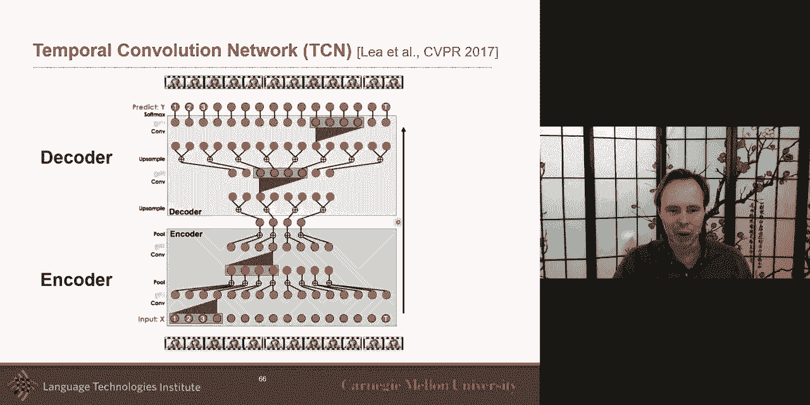

talk a bit later。