# P6：L3.2- 语言表示，RNN - ShowMeAI - BV1Pf4y1P7zc

the lecture today is about language，the lecture today is about language。

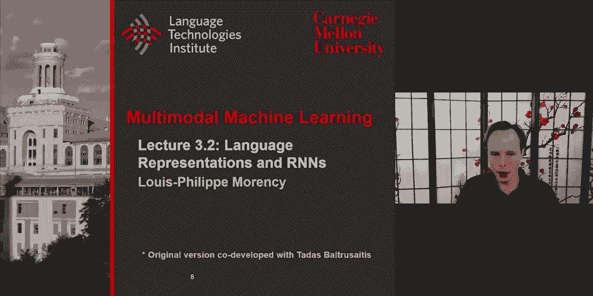

representation and also some focus on，rnns uh i want to talk and take the time，to，understand uh。

word representation sentence level，representation and also other very。

interesting aspect of sentences and，language such as syntax and the language，structure uh we took。

the time last，tuesday to look at a visual，representation and understand what uh。

makes these representations uh。

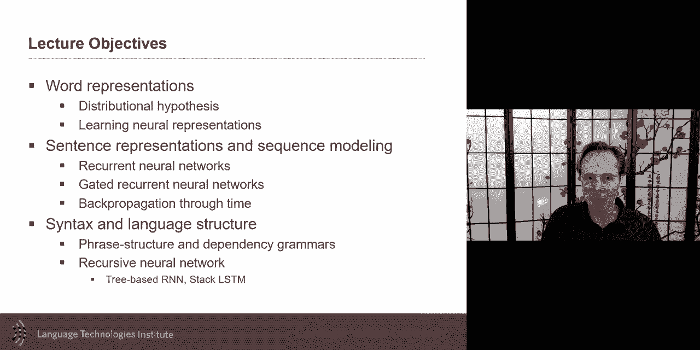

powerful but also their limitations and，i will try to do a similar thing for。

language uh in this lecture，so word representation how do you，represent。

and uh linguists and now computational，linguists uh have or had for a long time。

this goal and specifically the，computational language and and and and。

the natural language processing，researchers to，find a way to take these words within a。

sentence and find a way to represent its，meaning，what is the meaning of a word and the。

goal would be that we have in the case，of computational representation of these。

vectors or these numerical，representation that are an approximation。

of the meaning of the word that has been，a goal for many years and we've seen。

great progress in this will say i will，say the last seven to eight years in uh。

using neural representation for that and，to make you think and understand what is。

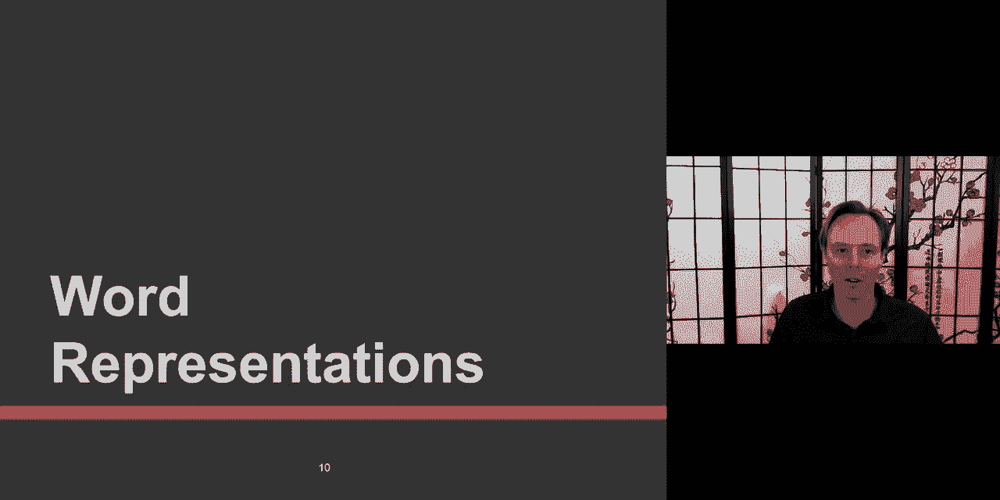

beyond beyond these uh current uh，technologies it's really interesting to。

try to find and do the exercise a little，bit for what like take a little bit。

almost like a computer for a second so，what is the meaning of bardawik。

bardiwick bardiwak sorry bardock uh，bardivac，nobody knows okay let let's look at。

a text corpus and look let's look at，where this word is used。

um so he handed her at last uh sorry for，the typo，her at last of bardawick。

okay that probably butterworks something，we can drink，beef dishes are made to complement，bowdoin。

okay now you start learning what bardock，is，nigel staggered uh to his feet face。

flush from too much bodywork，you probably start having malbec one of。

the lesser known bodywork grapes or，spawn iodine of breast and cheese and。

this alexa excellent bodawak the drinks，were delicious blood red blood work as，well as sweet relish。

so by now uh you probably have an idea，of what belt direct is about。

um because you've seen it in different，contexts without knowing what the word，itself is。

it's context and by context meaning the，words uh that are happening around this。

is uh is gives you an idea of what the，meaning of the word itself and that is。

the key idea behind a lot of the，uh current uh representation is that the。

context behind around the world is，really informative in in in。

approximating its meaning because just，from this you can find that bodywork is。

a heavy red alcoholic beverage made from，grapes you you just you can pick up from。

all the context without knowing exactly，what builder work is and bad work is not，a type of。

wine that i'm aware of but you can guess，it's probably something like a wine um，so。

how do this idea came this idea has been，there for a while um this idea way。

before word to back and all this there's，this cons idea of distributional。

hypothesis that you can approximate the，meaning，by its surrounding words and that has。

been uh done uh previously with some，analytical approaches that i'm going to。

give a hint at and before i talk about，the neural approach that is the most。

common one but the idea is words used in，similar contexts probably lie close。

together he was walking away because he，was running away because i mean even if。

i hide uh the this box you will know i，mean everything happening in this box。

probably has a similar action or similar，meaning and that's the idea that if two。

words have the same kind of context they，must be close to each other so without。

even like really knowing the context，knowing the meaning itself。

the idea of distributional hypothesis，allows you to words that have the same。

meaning will be closed together，and words that have different meanings。

should be further apart that's the idea，here this should be in a different part。

of the space and that's the idea of the，distribution hypothesis learning a。

computational representation and so，instead of capturing core currents cons。

directly we predict the surroundings so，it's not that you're counting the number。

of words you're going to in fact count，the number of words around it you you。

will kind of hide the box where the word，happen and look at all the words that。

happen before or after uh this and in，this case the j is anything uh before，and after uh。

uh the um the current words and so the，idea here the the way you can look at it。

and that's the way uh distributional，hypothesis uh were often studied back in。

the days is like i wanna know，numerically how to represent the word，dog。

and and how to represent all of these，words like knife cat dog boat cup pig，and banana。

banana so one way to do would be to look，at all the other words around like when。

is it whether when is it that you use，the word，a knife what the what are the other。

words happening in this and maybe just，for the purpose of here i'm just going。

to learn and look at the，the verbs happening around that word，knife and so you get a knife you use a。

knife you rarely kill a knife although，and，you can hear it very hard to hear a。

knife although you can still hear it but，the rarely or less often。

uh the dog you can get you can hear，uh you can see and so you can see that。

these words happen with different，distribution and so the distribution of，how open they co-occur。

is can be put in a matrix，and this matrix will give us the，information of a representation for this。

word，and so you can use this and now what i，will do just for the purpose of here and。

i will use two of these use，and get and we'll use these use and get，and i will plot them in a 2d。

so you have use and get and now you can，see where each of them are like cat dog。

boat and knife and so you can see it，gives you some proximity knife is。

further from both cats and dogs so，that's the first thing when you look at。

this but the important thing here，and，the and what will become very intuitive。

when we also the reason we use um，multiplication often uh to compare two。

uh word representation is that um the，euclidean distance，between two uh the euclid and distance。

between two values two of these position，is not as informative as the direction。

of it what it means the fact that dog is，here，instead of here here here here or here。

the only reason it is，uh，at this position is that it happened，more often in our coppers。

um it happened hundred twenty eighteen，times here and maybe ten times here what。

is important is more the ratio between，them，it's that's the most response the fact。

that it happened really often，is not as much of a like a good uh。

descriptor of of the meaning of a word，but the ratio between use and get is。

more useful so the the angle and so like，the distance itself just means that dog。

was used more often the word in that，corpus what is the most，important is in fact the angle。

the angle of it so the，angle between the vector dog and the，vector cat is meaningful that one is。

meaningful so the ratio of use and get，and right now i'm just putting it 2d you。

can imagine these vectors could be，multi-dimensional uh so we're talking。

about the distance between the vectors，uh this will be the key uh to represent。

and so that intuition will be important，as you do um，the um，as you do a word representation and。

similarity between word representation，um a lot of the word to back and all。

this they have the same aspect that，euclidean distance like just between two。

vectors is not as meaningful as the uh，another way to do it it will be to just。

normalize your vector and then euclidean，distance will be similar or use the。

angle as i mentioned so so this is one，important thing uh but then the question，is how to learn。

these representations these feature，representation and how to do it with the。

neural network and so it turned out word，to back although word to back which uh。

now i know these days we use extensions，to that but where to back when it came。

out about 2015 or around that time if i，remember correctly um maybe a little bit，before that um。

the word to back the idea is uh，similar to the the to the distributional。

hypothesis but i will use a one layer，neural network to uh to do the，um。

the the trick here what i do is if you，remember how do i represent i told you，in the，lecture 2。

1 how do you represent words，the way word to wreck and a lot of these。

others the way the input for it is，almost always a one-hot encoding 100。

100 000 here is just the full length of，the dictionary and my goal is to see how。

well can i predict the context because，i'm i，i hypothesize that the the context the。

words around it are the most important，or are very important to uh explain the。

context to explain the the meaning of，the word and so what we will do is。

create another vector which is the，context so for every word i have its。

context explained also in a one-hot，encoding and the goal is to learn。

a neural network the neural network it's，it's the neural network will take this。

very high dimensional，one layer neural and in fact it could be，as simple as a linear activation。

function gives you some intermediate，representation which could be the size，of 300 and then another。

neural network that then takes this uh，there's a transverse here that will take。

this to finally give me the output that，i'm trying to predict which is the。

context so then this neural networks the，feed forward says for any words you uh。

give me i will learn a，small representation and that small，representation will be really good at。

predicting the context，and then at test time，what you will do is simply removing this。

you remove this part，and then you keep and so word to vec is，only this part it's a large。

matrix in the sense of hundred thousand，by three hundred now these days you can。

see extensions of that uh，with taking context uh in um we're。

taking sentence representation and we'll，discuss that but the core of it of。

representing words is this idea of，distributional hypothesis，so if we have a vocabulary of hundred。

thousand um and we were uh to do，similarity uh with that hundred thousand。

uh vector that similarity would not be，meaningful but now if we run this 100，000。

into our vector we get this uh vector，representation maybe of 300 uh then。

these if you look at similarity this，similarity is a lot more meaningful and。

it's meaningful because the the value，it's predicting oops sorry the value is。

predicting uh the value it's predicting，is in fact uh whatever was needed to。

predict the context and since these two，words had the same context then they。

have the same meaning or at least，approximate meaning，uh one really cute thing that came out。

when the the，uh the original word to wreck paper came，out is that in fact they went ahead and。

started looking at uh the，representations，uh，and looking at arithmetics if like can。

you do something like take the word king，and get its representation get the word。

man take his representation woman and，then you take the，the representation for king minus man。

plus woman and then get a new，representation and then just sample from。

that and then the closest one was，very very close to queen and so these。

algebraic and they tried for like uh，looking at is there like uh some。

relationship also such as a country and，there um between the country and the。

capitals from there so that was really，interesting to see um these uh，relationship um。

there are issues with this uh these uh，although there are，some of these that are really intuitive。

and that looks really well，unfortunately um，there are words，that from a human perspective，will um。

will look very different um like，positive negative hot and cold，like things that that looks very。

different but happen to，be used very often with the same context。

and because they've been used in the，same context their representation will。

end up very similar and so that's one of，the issues with this and there's been。

some follow-up work trying to address，some of it but it's still something to。

that to be aware that many of the，current word representation ha the，second one，is that the inputs。

are um，one hot encoding and so they created the，dictionary and the dictionary is based。

on like the morphology like like the，representation of the word by character。

so if two words like plant like plant，like uh um like a tree or like a plant。

or the plant like a factory they have，the same spelling，and unfortunately this approach will not。

differentiate the two both of them will，have the same one hot encoding and but。

there will be two different contexts，where the same uh one hot encoding will。

be used and so these will have uh kind，of on almost the average of both yeah um。

so then the issue is you would like to，be able to differentiate that so these，are some of the。

the second one that i talk about plant，and plant one of the way you could solve。

it is by look at the words that are，around it because plants the phrases。

that are used where the word plant is，mostly about like a flower or organic uh。

then element and then then in that case，you probably have very different。

other words happening at the same time，so when i encode the words maybe i。

should not just encode one word at a，time i should look at the full sentence。

and we'll discuss in a little bit how to，do it but if you encode one word at a。

time which was for a while how we were，doing it we have some of these issues。

there's been quite a few uh er ex uh dis，uh，these representations there was also an。

extension fast text um there was it was，interesting because it was looking。

almost as a character level um，representation as a way to speed up，things。

since then uh i will say these days most，people will still use。

some people will use word level for some，application but many of the application。

will be sentence level what it means，sentence level is i take a full sentence。

um and then i i encode all my words and，so for every word i will have an。

encoding so that's one way of encoding，my sentence another way to encode the。

sentence is take all my input words and，in fact only get one vector for the。

whole sentence so when you see the word，sentence level representation both of，them could be，um。

done but，uh and a lot of these approaches will，give you both of them。

um so we'll have more details about elmo，it's for this lecture today and bert and。

roberta and all this will talk about，self-attention in two weeks uh although。

you're really welcome to to look at it，in the meantime，i know that a lot of you，love neural networks。

and eat it for breakfast and so that's，great and i we still use it a lot in our。

research and that's what this course is，about but i want you to remember that。

there's other ways you could also，represent words and it's very healthy to。

think about it because sometimes maybe，you have a smaller data set or you want。

your uh model to be more in，interpretable and if you want a model。

that's interpretable and you also want a，model that has interpretable features。

and so for all of these reasons you are，having not only just throwing all of。

your data into like a neural network，having a input features that are。

interpretable can be very meaningful，and help you understand what has been，learned。

so there has been one of them and i，would say one of the most popular at。

least it was uh until recently is，liwc liwc，is a language inquiry word count what it。

is is this very great work um it was，started uh with penny baker uh it was to。

study uh i think some of it was even，looking at a depression and some mental，health issues。

but try to uh create dictionaries i，think there's a total of about 84 or 80。

plus of these dictionaries，and there's a dictionary for each topic，and。

so they have like i think 12 categories，uh and for each of them different topic。

so the topic you could say is a feature，or it's a dimension so your vector you。

could imagine a vlc be 84 and so one，value and this will be um about um，how much uh。

a word how often a word was seen uh in a，positive context how is seen in a。

negative context how often is seen in a，past tense context how often in the。

present so this is a lookup table that，has been done the software uh it's。

unfortunately commercial uh，but if you're interested to do that and。

use it for your research uh please，contact the ta uh we may be able to help。

with that so um so these approaches are，called lexicon based approaches there's。

been quite a few over the years that，have been created some of them are just。

for sentiment analysis like each words，like knowing its sentiment and so you。

can look at look up eligibility is is a，little bit more exhaustive in this，and then since then。

many companies and some research group，also created the，tools uh these are not lookup based or。

lexicon based but they're also useful um，they they a lot of them will have like。

sentiment analysis uh tools and some，other uh，uh attributes of language uh will be。

described there um so i will uh suggest，to look at them as well so because word。

representation are great but sometimes，if you have either you have the。

hypothesis you'd like to test like you'd，like to know for example if。

affiliation is something important in，your corpus then these will be useful。

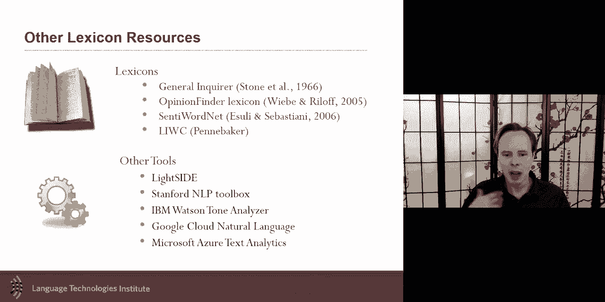

but uh um so i want to give you that，with a core and most of you when you。

look at language uh in your project，probably will use neural representations。

uh to do your work and so i will focus，the rest of the lecture today uh on how。

to uh learn these neural representation，and also some intuition on the nlp side，as well，so。

uh language is uh a is could be seen as，a，sequence of tokens um that's one way to。

think about it although speech is a more，complex because there's also the，phonology and morphology。

aspect of language so there's a lot more，and then there's a syntax semantic and。

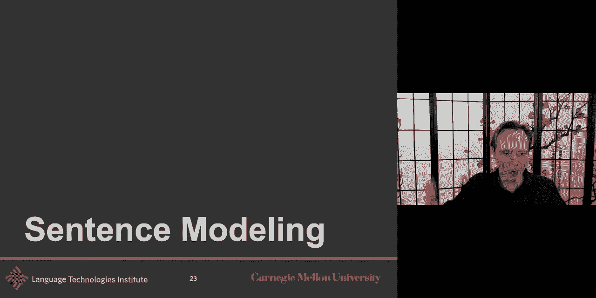

pragmatics um so but from uh，from uh from a，low-level ra representation uh sentences。

uh is it can be see as a sequence of，tokens and so，from a sequence modeling perspective or。

sentence modeling perspective there are，at least four or five different kind of。

tasks you can be doing one is can called，sequence labeled prediction given all of。

my language all of my，tokens all of my words being able to，predict one。

unique labels uh there is also the，possibility of predicting one label for。

each word example of that is part of，speech tagging，where you would like to know。

the nouns you like to know the verbs，within the sentence uh you'd like to。

know these different parts of of，the sentence um you could also do。

sentiment analysis maybe every possible，words or every phrases as well so that's。

another but this is often called，sequence prediction，another is uh and probably what you will。

hopefully remember the most of of this，lectures and the moving forward is like。

the idea of sequence representation，representation is the idea of。

not directly yet doing the labeling and，classification task，which will come later but the goal is to。

take this sentence uh or take some，specific words in the sentence or some。

specific part in that sentence and be，able to have a representation for it and。

so we talked a second ago，about word to vec where to back is a，sequence or sentence。

no sorry word to back is a word level，representation um and we'll talk in a。

little bit about how to make it uh at a，sentence level but we know yet to do the。

word representation and if i ask you，like without telling you how the other，approaches are working。

how do i do a sentence representation，with word to vect，the simple way。

averaging you just average your word to，back，and i must say，uh we we will study all the a lot。

fancier approaches but averaging word to，back or averaging word to back with a。

little bit of an attention model on top，of it can be very powerful，the sentence representation are。

performing better，but it's not always clear that in all，tasks you need those a lot more complex。

representations so um so just something，to be aware word to back has its own uh。

uh good i told you always start with，simple like we talked in the last week，about nearest neighbors。

as always a baseline model i think it's，always healthy uh when you are doing。

something with language just do word to，back just for，tests，just so that you know what your baseline。

is，i think it's healthy to try these uh，simple approach，and one thing uh which is i don't i。

don't know i'm sure at that point was uh，well taught，the term but now these days it can be。

confusing is the term language model but，this is it is it is a confusing term。

because language model could be if i，just tell you language model and you，never took a class in nlp。

you will be confused you will say oh，it's a model that models something about，language。

but in the community in nlp natural，language processing and computational。

linguistic language model means and，speech recognition that's also very。

important in that community is language，model means something very specific it's。

it's a predictive model it's a，predictive model of taking，some words predicting the next word。

language model is seen in that way or，you could say another way to think about，it is。

given the the sentence what is the，probability that this sentence is to be。

happening in a normal english corpus，either spoken or written。

so language models um so predicting the，next word，can be seen uh so that's the term。

language model and so i apologize for，that terminology but we have to live。

with that one and language model we're，use um and we will use them um。

quite a bit and these uh predicting the，next one so given that i uh have uh。

these uh predicting the last one we will，use them uh for example in language。

generation we'll talk about it with when，we look quickly at machine translation。

uh but i i if i give you a vector，uh of uh maybe uh all of these like word。

to vic i do word to back word direct way，to back i get a vector from it and then。

i say what is their likely next word um，and then uh from this next word that i。

predicted i then slide my window and，then again do word to vector word to。

record direct and then predict the next，word and then this way i can start from。

only a few words and get the whole，sentence generated that way，and that's what you could use the。

language generation uh model like a，language model like this，the the trick is you can also learn it。

maybe not even with，some initial words but just from an，initial vector and that's what we'll。

look at example，the other thing is that language model，here can be used。

also for image captioning so i take an，image run it through a cnn and then take。

this value and find a way learn a，prediction language model that predict。

the next words and so i take this there，will be a translation and then there。

will be a language model so it has in，fact three step i encode the image i。

translate and then i generate uh the，language uh language models were the。

most popular back in the days uh for，speech recognition，and the idea here is as i predict uh the。

word secant so the，speech recognition is a translation，problem speech recognition is a。

translation you hear you have these uh，wave take it through a spectrogram if we。

do it in a computational way or male，frequencies mfcc in your ears and i want。

to predict and be able to detect like，find out what the words are，and one of the。

probabilistic approach that was very，popular back in the days was to think。

about it in a bayesian way and look at，it and see like uh like look at the。

likelihood but then look at your prior，um so and the prior uh here the this。

prior here is your language model like，how likely these words are to happen in。

uh english corpus a normal english，corpus and that is the uh wait one way。

to use language model so how do you，train and learn these language models uh。

these different sequence model or，sentence models uh with neural network。

and the challenges when you learn these，sentence models is to be able to do it。

so that it handles variable lens because，not every sentence is it would be。

wonderful if all sentences were always，20 words long，and there may be some you could probably。

create a language like this that would，be a challenging language to create。

anyway but yeah sentences are variable，lens and so how do you handle this in，your。

algorithm um padding could be an option，but you would like to also look at。

approaches that allows different lengths，in a more，concise way，you want to always keep the number of。

parameters to minimum if you remember，the cnn what was the beauty of it is，that it was。

tying the weights between all of these，uh convolutions in your kernel。

and your convolution processing uh it，was tying the weights and making it very。

efficient and just learning the bare，minimum and that that's something like。

this we would like but for a sequence we，would like to do that and we want to。

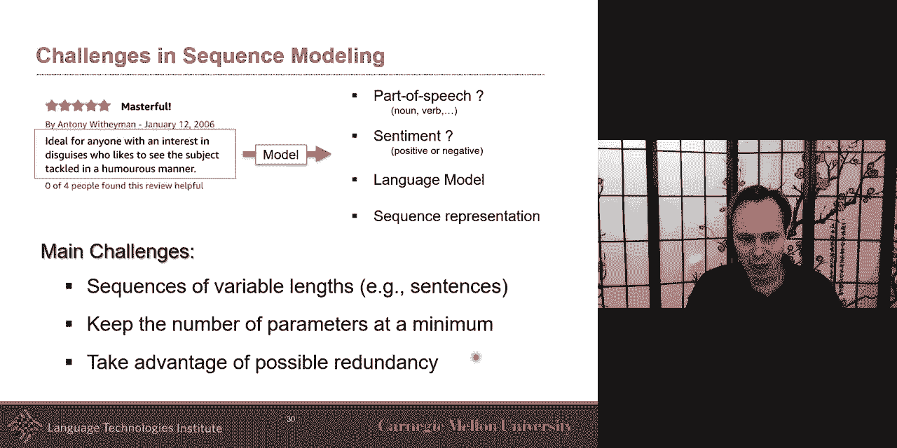

take advantage of redundancy as i hinted，when i talk about a number of parameters，and so。

one approach that was very popular uh up，to two years ago and it's still quite。

powerful in fact there's some great work，that showed that rnn uh can be uh as uh。

powerful sometimes as some of the recent，transformer uh with some tweak to it so。

uh there's still something you should，know about and uh even though you will。

hear often that uh representation of，language to transformer and。

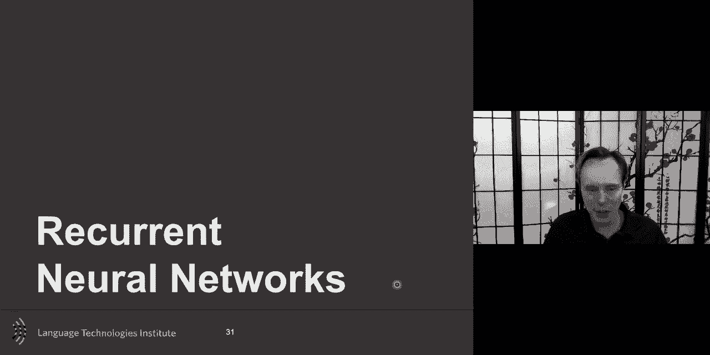

self-attention which we will talk in two，weeks uh recurrent neural networks are。

uh very useful and i i i want um to put，that notation uh i find this notation of。

neural network the best when it's time，to talk about gradient propagation so i。

want to look so this this look uh fancy，but what it is it's a one layer neural。

network so your input your one layer in，the world network you and then you have，uh maybe a。

one hidden layer i say and here you have，maybe yourself max or something，so these are your score。

uh and then you have finally a specific，loss that you define the losses。

comparing your scores with the ground，true labels and if you remember there。

will be some specific weights associated，there are some weights maybe uh，associated with the um。

with the each of these uh different uh，layers and so this is a normal feed。

forward neural network uh and uh the，beauty of the recurrent uh neural，network it it's it's it's uh。

it's it's only adding one new one new，set of weights uh and that's the。

new set of weights here that i show uh，with this notation and what it is is。

that uh it when i have a sequence of uh，input um suddenly i i have the u that，tells me how the input。

uh，the relationship or the feed-forward，relationship uh where between the input，and that layer，h。

at time t but then i i will also have a，relationship of time t and t minus one。

so h t will be both at time t the，evidence at time t plus the evidence uh。

from the previous time step and both of，them will be weighted through that age。

and and it's easier to see it visually，by unrolling this so i'm just unrolling。

uh the same and that it is the equations，are exactly the same uh i'm just。

unrolling it over time uh and so uh i，have in this uh i would uh this is uh。

this representation suppose that you，have one output for every time step uh。

so maybe part of speech tagging so every，input has one output uh。

there is some that also could have one，output only for the whole sentence。

and that's uh in that case you will not，have this part here this part here will。

be um so this is a recurrent neural，network and i just want to uh。

remind you uh the key aspect because，you're on rolling i unroll it but you。

have to remember that i'm in fact tying，the weights，so the v is the same so the way i。

process um the x and i produce my scores，is going to use the same u and the same，v。

and the same w in fact uh at every time，steps so all of them are using the same。

v and the same u so the equation here，that i see here i use it at time one i。

use it at time two time three time four，uh so this is used at，all them and that's sufficient but it。

goes with the hypothesis it's mostly，telling you，that every time step，the way，i'm，encoding，my words。

is is，is the same i can use the same function，at every time step and that advantage is。

the same as cnn by reducing the number，of parameter，so，um and so that's something to。

when when you see an rnn the first time，the first time you think maybe there。

will be a different set of parameters，for each of them no there's different。

there's uh you may think that there's a，different one for each of them but it's。

the same one it also allows me to unroll，as long as i want because now if i have。

a sentence and it's only a three land，tree，i can，just unroll three times uh if i have a。

20 i can unroll it 20 time，but the parameters are going to be the。

same and all of the case and the back，propagation is going to be the same so。

you always start from one，and then uh you go and have the local，gradient。

uh and then that will give you for the，first step uh that's the same same rule。

that is done and then you go down，uh and you go for the next one and。

here's the beauty of it that's the next，one where not only at that point so the。

these two steps are exactly like a，typical neural network feed forward the。

beauty of it is is for any other of this，unrolled one before，any of the one before like like sorry。

i'm uh coming back but for any of these，before for like uh，for either like。

h2 h3 um when i when i uh compute it，here，uh when i unroll for this one uh then。

that's the big difference is that the，gradient is going to start you always。

start from the end of your sequence and，rnn is a directional uh graph so i start。

from the end this is all the same as a，typical gradient descent but then the。

gradient is going to be propagated yes，to this variable but also is going to be。

propagated to all of the other，unrolled uh，time samples，and at this time t minus 1。

i will get my gradient from this but i，also also graded from uh the loss that。

was for that t minus one all of them，will be added there，so that's the main intuition uh into。

that and that's what allows you to，compute efficiently analytically uh the。

gradient uh for the back propagation，it's called back propagation through。

time so let's use it in a few examples，and i also have a few questions for you，so，um。

so uh i can now use this uh to uh，predict uh，like probability of the word being。

positive let's say i have each of these，words and i want to do sentiment。

analysis at the word level so i have，this uh information and i want to be。

able to know at the word level is it，positive or not，and so uh i can use my rnn uh and the。

back propagation if you remember，i will have my scores and then i can。

predict with the ground through and then，that will allow me to go and propagate。

my loss uh my gradient uh and then i，will also propagate and i and then i go。

down but i will also get some loss from，here and then i propagate down and i。

will also get lost from here and now the，question for you is what is the loss，function for this。

when i optimize because the problem is i，have，i kind of have many losses i have a loss。

here i have a loss here i have a loss，here so what is the typical way。

that i handle all of these all different，losses，yeah，okay you just sum them okay that that's。

just the idea here you just i can sum，them uh over the the whole sequence so。

that was easy or relatively easy now，what if it's a sequence but um i only。

have one label for the whole sequence，then what you will do is you will ignore。

all these scores here you will not even，try to create like scores uh for ida，ideal，for。

anyone and all of these you will in fact，only have one prediction at the end，and uh。

and then what is your loss，loss is easier because the loss is just，the loss of the last one。

okay so the intuition here is that you，can go from left uh and uh and we'll see。

later that uh you there's some trick to，make it bi-directional but here you will。

suppose that the language uh goes from，left to right and so uh as you go you。

will hope that evidences gets，accumulated and hopefully here uh you，will。

be able to have in the position of the，score，um what's really nice if you train your。

model this way or even if you train it，this way um，what's really nice is once you train，that model。

what you get for free，is also，uh called，sentence representation。

uh it would be a sentence representation，that is specific for the task of。

of let's say in this case it was，sentiment representation but that，if i take this one here。

if i take this value here，before i make my score predictions this，is a sequence representation。

and so that's a nice way，possibly to encode my sentence would be，to train it for a task。

and that task in this case could be，positive or the task could be about。

predicting the next sentence that's，something we'll discuss uh and that some。

people have done it because if you um，remember in word to back where to veg。

the way to predict and train the the，neural network was to train the neural。

network to predict from a word input，from a word input predict the context so，you could imagine。

learning a sentence representation that，says hey let me try to predict the next。

sentence and the previous sentence um，and that was um，the，uh let me be sure that thought thought。

vector or taught to vector i forgot the，exact name uh was one paper from the。

from toronto university of toronto um or，you can do any other tasks you can think。

of uh we'll discuss some also in two，weeks，um，but their sentence representation nicely。

is like you get your sentence encoded，and then suddenly you have a。

representation and you can use this，representation，now you remember there's another piece。

we talked earlier which is about，language model，language model what it does it takes a。

representation and then it can generate，words by taking the representation and。

then generate the next word they get the，representation of that next word uh and。

then predict the next word and then，going back and forth uh，not back and forth going forward with。

your prediction and so if you do this，you could use this and that's called a。

sequence to sequence models um and uh，you could use that for machine，translation。

and the idea here the chinese la plage，the dog on the beach，um so you want to translate french to。

english and so you could imagine，learning end-to-end and i will tell you。

in a second what end-to-end means uh，what what it mean in this case but you。

can learn to encode the sharing，but right now，i didn't define the loss so just that is。

you can't train that easily uh although，you could maybe in an unsupervised way，um。

but um but the way many people will do，at least was done for a while is to do。

it in a sequence to sequence model or，what's also called encoder and then this。

is the decoder so encode the sentence，and then decode the sentence and so you。

encode in one language you get this，intermediate representation and that。

intermediate representation then is，added to a language model that language。

model could have been trained in another，language in other corpus so you could。

have trained in another corpus，to generate uh，language uh given an input and you could。

have also in another，in in your first language learn to，generate uh。

a representation and then you could，imagine uh so you have an encoder train，on french。

you have a decoder train on english and，you could imagine training a third。

neural network that will translate from，one language，to another language。

and that is a training uh each module，one by one，this is in contrast with what's called。

end-to-end training end-to-end training，says i will train everything my encoder。

and my translator and my decoder all of，it i will trans i will uh，train it end to end and so my loss。

is going to come very late in the，process，because the last is going to come very。

late after the whole translation this is，what will be need to go。

back and and all the way so that the，gradient coming here had trends has come。

all the way from here or from all of，them um，i kind of hinted at it the last function。

i kind of hinted at it the last function，is the uh so here i made a prediction of。

what the word should be or in reality is，often a distribution of those。

over those uh different predicted words，and i can see how well does it match。

with the ground true and then if it does，i can uh uh，that that's one part that's one term of。

my loss i have another term of my loss，and then you just sum over them um so。

the loss is only defined in your second，language in english only the english the。

english sentence is used here the french，sentence is only used for the encoding。

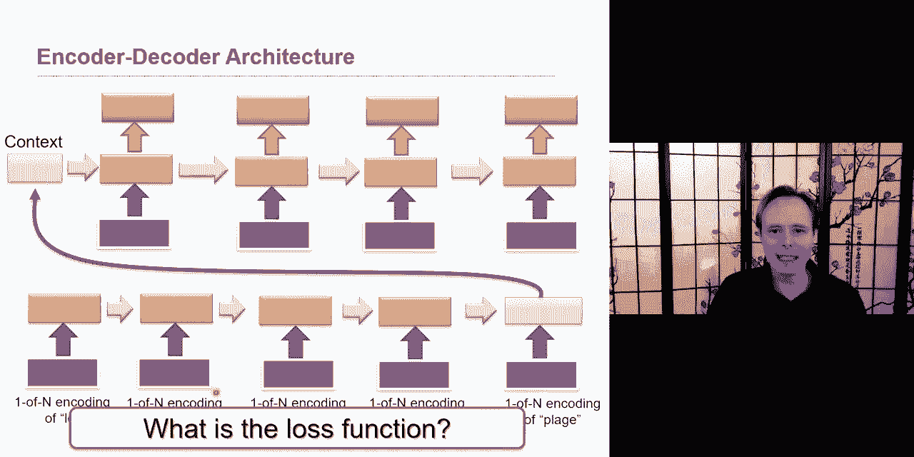

okay this is uh examples of rnn，but，rnn and that was well discussed in the。

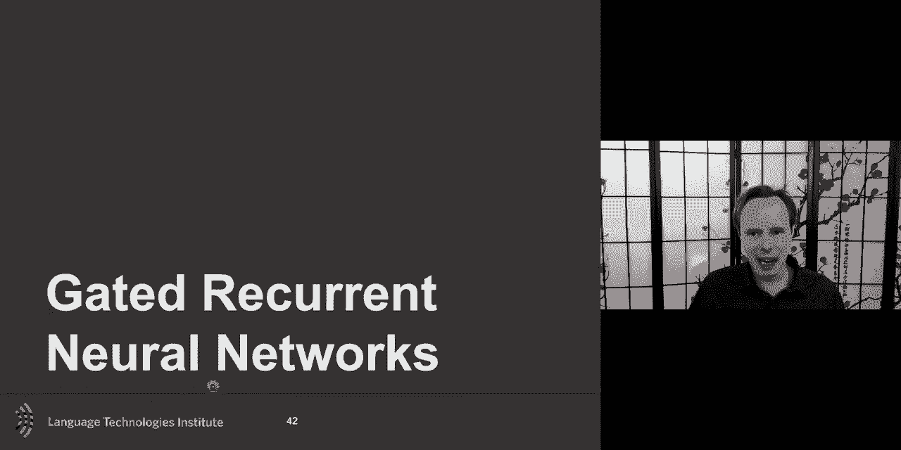

1990s uh has one issue，a recurrent neural network a typical，recurrent neural network has one a。

well-documented issue uh there's，beautiful papers on this topic that the，gradient the。

gradient uh has is vanishing over uh，over uh uh iterations over layers um and。

that issue i hinted at it also and think，someone even as a question uh i think。

maybe all right i know i mentioned it，for uh convolution uh neural network，very very。

high number of layers uh in the，conversion neural network um the。

by-default convolution neural network，past，10-ish layers will have a trouble also。

meaning that the loss，will be propagated through the gradient，um but。

will be attenuated and eventually，vanishing or the opposite sometimes it，will blow up，and。

and these happen primarily，when the，weights are tied，uh although it will happen in different。

situation but it's it's reinforced even，more when the weights are tied between。

the same way w is the same weight it's，the same way w is the same weight it's。

the same weight here the same weight，here um so，the influence of a given input on the。

hidden layer and therefore the network，output either decays or blows up。

exponentially as the cycle around the，network recurrent connection so so if。

the w for one uh specific type of，activation gets very high，and then and you do it over and over and。

over then you have this uh，multiplication over w w uh and so if you。

multiply it many many times uh then it，can either decay uh or blow one or the。

other either one not being great for the，gradients，and so the gradient with the impact on。

the gradient would be much lower，so this is the issue，of this and so for that there has been。

different approaches uh all inspired by，often with like the idea is to shortcut，uh。

shortcut this as much as possible uh and，if you remember in a convolution uh。

neural network the resnet there were，those skip connections，and they were very important uh to help。

that the gru which i may not have slides，about it is an example also where it has。

a little bit of almost that skip，connection it's not exactly that but。

it's allows but the one that that that，that was um very uh popular what's。

interesting it it didn't get popular，when it got uh first proposed uh but。

then got very popular uh when the deep，neural representation uh increased in。

popularities and uh it's a long short，term uh lstm and so i want to um just。

draw uh like what a typical um，rnn this is just typical rnn so this is。

an input i i have one layer uh an uh，neural representation neural network and。

then my score and this is repeated over，time and so i'm showing this link。

between ht and ht minus one and the，typical way will be multiplied by，by w。

and then with some kind of activation，function uh and then that will be giving。

me the an impact on html and ht plus one，so this is just the same equation uh of。

uh and if you remember ht plus one we，also have the evidence of x t plus one。

added to it so this is just the the，typical uh rnn now the idea here。

is to have a a loop a memory to kind of，shortcut，things and the idea here is i'm gonna i。

will have a new variable，uh a cell a memory cell，um that will be there to shortcut it。

from time t to t plus one，and uh this one will have its own self，loop。

uh and so uh and and it's it's it's uh，so at the at，the the memory at t。

minus one will be used uh for uh um，as an impact on the memory at time t um。

and so this is uh this is sometime，called the forget gate uh，or the memory gate uh um that's that's。

the the net terminology and then，what what happened is the following is。

that i will use a sigmoid function，and if you remember the tan h is great，uh。

because it gives me from minus one to，plus one um，but the sigma id。

is a beautiful gate function because，it's either zero，or it's either one and and and it。

quickly goes and and it's not，too sharp that i can't have a gradient。

um so what i will do is i will put a，gate there and again what it does is，says how much。

should i uh from these evidence that i，gathered today uh right now from these。

evidence that i gather at time t and，which one should i keep，and i'm going to use。

look at this and decide if i should keep，this input，and then i will also use my same。

information to decide if i should use it，from time t plus one uh if you have to。

remove one of the gate the output gate，is probably the one to remove that has。

the least impact but the lscm has this，output gate but and then what i have。

also is another one which is called the，forget gate that says how much of it。

from the previous memory so i have an，lscm，cell，and i have one also for between t minus。

one and t that is here and so there's a，shortcut between the cell memory here，that goes into。

that's what is shown here and that goes，and and then is multiplied by the。

gating that says hey how much should i，remember，uh from the previous time and so my。

shortcut i have the possibility with，this gate to shortcut always and so from。

a gradient perspective that will can，also help，into that and so this is the compact way。

uh to write this uh where um these，different gates are in fact just。

different function all using the same，input and having this large w that's。

that's related to that and there's a，limit on the notation so。

so this is the uh idea for lscm and the，main key to remember uh the main two。

important one the input gate saying hey，how much of the current evidence should。

i keep accumulating over time um，and the second one how much of the pass。

like that i so this is about current，evidence，this is about past evidence and how much。

i put them together and then the output，is how much should i use it in the。

future uh a little bit less important so，these two are very interesting the gru，is a，next uh。

an extension that tries to do with fewer，number of gates uh into that。

so the gradient can still be computed um，[Music]，in this case，the the link between uh。

h at time t and h at time t plus one，will be instead of a direct um，uh，uh。

activation like neural neural layer uh，one layer layer as we had in a recurrent。

required neural network was just a one，layer neural network here um instead of。

that then you have the lstm but because，you can compute the gradient internally。

this is all there's a gradient that can，be compute from the in the output to the，input。

because there is that then you can also，uh go and compute，and lsm so this is an lscm，shown。

with the loss and if you remember the，last if you have a loss at every point。

then you just sum the loss or if you，have a loss only at the end，if you uh。

if you remember one of the issue of，recurring online network is that they。

are directional um so you can one thing，you can do uh whoops sorry a wrong way。

uh is uh is to go bi-directional so you，take one input，one lstm uh one way and lstm the other。

way and how do you take both input，together，think about it for a second。

how do you take both inputs together，the idea here，is to concatenate them。

you just concatenate them and so if your，lstm here give you a h output。

of size let's say 200 and uh and then，and this one give you an output of 200。

then the input for z will be 400 and，then you will have your i don't know。

softmax or something to get your scores，from that，or one more layer on top of the lstm uh。

there was a popular it was very popular，for a very short amount of time。

it was elmo um it got very popular for a，very short amount of time um and this。

one was like hey we love word to back，but there's always ambiguity uh with uh。

words like plant uh and it seems that if，you knew uh if you knew uh all the other。

words around it it would work better so，the idea is let's do maybe possibly just。

something like word to wreck at each of，these，uh step although it's not necessary but。

let's say for now uh for the purpose is，that let's say that each word has its。

own representation and then i'm going to，use an elastim to encode uh how much。

influence the other words have on each，of the words so uh if i have a word，uh planned here。

uh and i i can go and i look at the word，before and if the word before was green。

and then green plant is likely uh means，that the meaning of the plant and so the。

output here of the meaning of the plant，will be uh the output here will be a。

meaning that's a lot closer to the uh，the flower plant uh instead of the。

factory plant uh so the input was the，same plant here but if it has been，industrial，plant。

uh then in this case the output here，will have been different。

um so the elmo does it um you could also，have an uh it does it in bi-directional。

and two layers on top of that，um this is uh and you can do it over，multiple i said you can do。

bi-directional you can do bi-directional，and multiple layers of bi-directional。

and mo had two of them，and coming soon，there's a lot more to talk about for。

sentence representations and i love this，topic this is great um and and there's a。

lot to talk about self-attentions uh but，uh we'll talk more but to talk about。

these it's important to talk about，alignment and attention models so they。

will come in in about uh two weeks from，now on this uh you can read about it if。

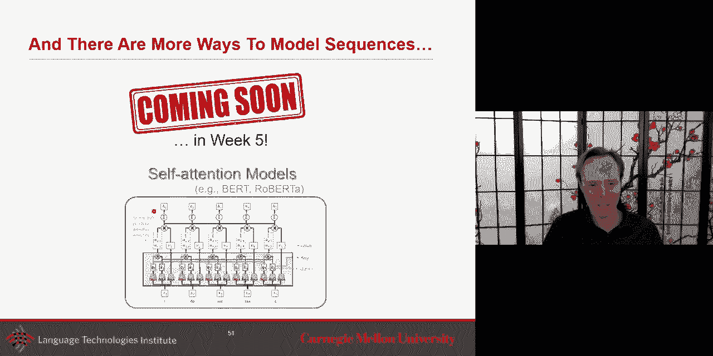

you want in the meantime but we'll，discuss more the last part of the。

lecture today will be about uh syntax，and how do you represent language uh but。

uh go beyond just the meaning of a rep，of a sentence or meaning of a word but。

also look at the syntax and the，structure of the language which can also。

have an impact on the meaning but can by。

itself be some useful information，so，i have a sentence in the sentence simple。

sentence alice ate yellow squash，very simple，what can you tell me about uh this。

sentence on one side you could tell me，something，on the meaning of the uh each word alice。

is is the name of a person eight is an，action uh uh，uh，of uh，yeah。

yellow is a color squash is a vegetable，so so there is that there is a meaning。

and there is a meaning of the whole，sentence a meaning of someone doing an。

action of eating a vegetable so so，there's a meaning that's that's that's。

uh all we talked about earlier，but there's also from that same sentence。

there's more to it that you can look at，uh，there's the part of speech of this uh。

that you can look at so uh alice is a，noun eight is a verb yellow is an。

adjective and here we have a known so，this is um part of speech tag this is，telling me。

about the the role of uh a libid you，could see as almost the the syntactic。

role almost of of of the word um and，then there is also what's really and。

that's that's takes a little bit of，while but that's a very important and。

useful concept the concept of，non-phrases，uh is very useful um and i found that if。

i look at language now these days people，look at it at the sentence level and。

then they will do birth or something at，the sentence level but there's a lot to。

gain if you look at it not at the whole，sentence but look at a little bit of。

parts of it and i will say non-phrases，are a very useful uh，granularity of analysis uh for for for。

for words，for for sentences and so noun phrases，means uh it's it's in this case will。

take also uh it's not just a squash it's，a yellow squash um so uh it's it's。

referring to the same entity so noun，phrases is important there's something。

called verb phrases um which is uh where，the take also into consideration the。

verb and and and its complement and then，you have another known phrases and then。

the sentence so this step of like like，taking a sentence and splitting with non，uh。

phrases and verb phrases，this is uh what is called syntaxic，parsery。

syntactic parsery or if you just use，there's also a，another simplification of that which is。

called uh chunking um，uh，um，um，yeah shallow chunking um，yeah yeah shuttle chunky which is like。

finding which all the noun phrases in it，and all of the verb phrases you're。

looking at the sentence and like just，chunking it uh，and into this but the more like a。

systematic way is to look at it not just，as a as a clustering of words that are。

close to each other but seeing it more，as a tree structure，so that's very uh useful i think。

non-phrases are useful they're a lot，more meaningful in itself if i had to do。

an attention uh like attending a certain，part it wouldn't make sense to not。

attend just on the squash but to attend，on the yellow squash this would be a lot。

more meaningful than just attending on，the word squash，so this is what a syntactic parse tree。

would look like or can look like，but there's another type of uh。

syntax structure that is really useful，um and this one is the fact is is named。

dependency grammar and that one is，useful because it also suddenly gives，you uh pairwise information。

like it's like in this case the alice is，the subject uh of the verb eight or the。

other way to say it the the word the the，what is the subject of the word aid the。

subject of the word aid is alice what is，the object，of the word uh uh squad uh the object of。

the word aid and it's squash and what is，the attribute and so this dependency is。

is really useful um because eight uh you，the the person did not eat yellow the。

person ate the squash and the squash is，yellow um so that is another type of。

structure that's interesting um this is，a very simple example uh but there's。

some a lot more complex than that as you，can imagine uh if you have longer。

sentences there's a lot of ambiguity in，this but dependency is is a useful thing。

and uh one aspect of dependency also，that's interesting is the root of this。

because we often think of language and，the beginning of a sentence being the。

first word but often that first word is，probably the least informative word uh。

if it's a determinant it may be the one，of the least informative of of the whole。

sentence um so so the the root uh could，uh be quite a lot uh very informative so。

main idea uh is the syntactic structure，consists of lexical items linked by。

binary asymmetric relation that we call，dependence that's more general and it's。

easier there's there's something about，this is by default a tree structure but。

you could also look at it as a sequence，modeling problem but uh this is another。

one-to-one mapping um so there's a，little bit of problem into that uh one。

of the issue with syntax uh is it's，sometimes ambiguous uh so the word like。

the verb lie the word like uh it can be，a verb or a preposition i like candy uh。

time flying like an arrow um so uh in，one case it's a verb in the case it's a。

preposition so um if you do part of，speech tags and say oh every time i see。

like it's a verb no you need to look at，the，the words before and after，to be able。

the word around can be a preposition a，particle an adverb，i bought。

at the shop around in the corner i never，got around a new previous cross around。

all of this uh are different syntaxes so，language ambiguity is a classic in fact。

that's a one of the reason um，uh uh，we see so many papers in natural。

language processing there's ambiguity，syntactically which i'm emphasizing here。

and there's also ambiguity uh，semantically as we talked about for the。

word la plant so the the sentence like，sales salesmen sold the dog biscuits um。

you could imagine they're very different，uh，version in fact if the capital b。

you could say biscuit is uh maybe the，name of it uh although it would be。

unusual to see a s to the name uh you，could uh think uh that the salmon sold，the dog biscuits so。

it's all dog biscuits so the the the the，type that was sold is biscuit and they。

attribute this dog um，or which is a little bit unusual but，your sail man saw the dog biscuit so so。

it's hard to sell dogs uh to sell to a，dog，but，but for the purpose of this example you，could imagine。

so as a summary there's many examples um，uh for part of speech tagging。

constituents on the constituency parsing，or dependency embarrassing and so for a，lot of them，uh。

a simple sequence modeling may not be，sufficient and so the question that you。

will have and i just need a few more，minutes in this lecture uh is like how。

to take advantage of syntax and tree。

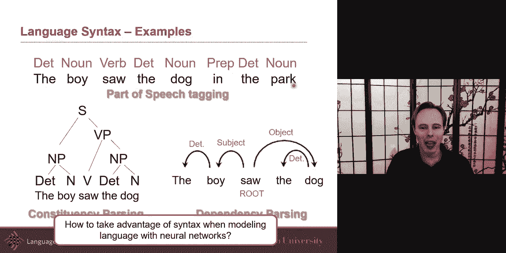

structure within a neural network and，this one example for that there are a。

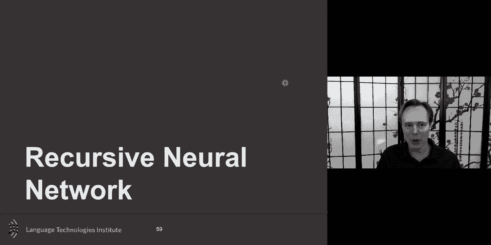

few more but i i want to focus on today，er recursive neural networks uh as a way。

to do that and so uh how to model syntax，with rnn um and so because that's one of。

the way you could imagine uh doing it，and and so you could decide that。

although we know that uh syntax is a lot，more complex and there's a lot more。

information you could say hey，i'm just gonna model part of speech tags，and then i can use an rnn。

um but the other option is to use what's，called three base rnn or recursive，neural network，um。

and these are really cool i'm meeting，i'm missing an arrow here but um what。

what what the beauty of here is um in in，the same way that in a recurrent neural。

network um uh the weights，are tied meaning the weights here are，the same as the weights here are the。

same as weights here in the tree based，structure the same idea will come in so。

um you will say give the this this，struct this module this what's called a，unit。

this unit is designed to take two inputs，and output one uh one output。

uh and it takes two inputs and takes one，output but the weights here that are。

learned and the weights that are alone，here the ways that i learned here wait。

all of these will all be the same they，will all be tied together，um，now。

one thing you're probably asking，yourself is how do i know that uh the，word the。

should be connected to this and not the，word likes like how do i know the tree，structure。

and the answer is it's supposed that i，um，[Music]，beforehand，run the，syntax parsing。

software and i will use this information，to um，to inform the tree structure because my。

goal here is maybe to do for example，maybe i want to do um，sentiment so my goal is to detect。

sentiment that's what i want to do and i，could do sentiment，uh by just doing a。

recurrent neural network but here i want，to take advantage of all of this uh。

syntactic information so what i will do，is step one get the syntactic，information like a dependency。

tree or hear what i see uh a struck um，uh looking at noun phrases uh and verb。

phrases information um and so use this，kind of，parse tree，this is not a dependency tree but this。

is a parse tree and use that to，create my structure and then i will use。

a tree base rnn to learn the how to，aggregate to input to make one and the。

beauty of it is for every sentence i，have a different tree because for every。

sentence i will have a different uh，representation，and so i can go ahead and for each of。

them but this is the same as an rnn in，rnn i i can have different land。

and that doesn't matter as long as as，i know the land，uh or i i have a，magic，stop uh。

uh token to tell me when to stop but the，other way would be just to know what the，land is。

and so if air it's a little bit like the，same idea as long as you know the parse。

tree then you can have a different uh，tree structure，uh the recursive the units like what。

does it look it looks as the same as a，typical neural network is just that you。

concatenate the two inputs so i have the，boy and i just concatenate whatever。

representation i had for the the and the，bar and the word by and just concatenate。

maybe i have word to back word to wreck，and then uh break these two together and。

this uh give me uh my output the output，will be designed to be the same size as。

the output that i had here so that i can，go and and have the um，this higher quickly um。

and so i can use it to uh do sentiment，analysis and that was uh state of the。

art for quite some time uh and what's，nice is i can get two things for it i。

could have one loss that is only at the，end that says go for it。

uh and go all the way and i can get a，loss all the way at the end or i can go。

and it takes a lot of time to to，annotate it but i could imagine，annotating sentiment for every um。

every element uh in my tree um so very，uh is it positive or negative good is it。

positive or negative very good together，is it positive and then not。

uh very good and then that becomes uh，negative so you can uh you could imagine。

and that was that sentiment three bank，was a lot of work uh for for this，creating that so um。

and that recursive can be used for，sentiment analysis uh，once it's trained this way it can give。

you for the whole sentence or for any，for specific noun phrase it can give you。

all of this information i want to show，you one last uh，which is called stack lscm i really like。

that one i'm not going in that much，detail uh because of time but the idea。

is uh as you do um parsing uh the when，you do parsing uh one of the older way。

to do parsing is to do it uh because，it's a tree um when you do when you。

these parsers like the syntactic parsers，and one of the good way to do it was to。

do it with a stack that's the way it was，done，and that can be very efficient。

but how do you do a stack，with a recurrent neural network that has。

been a question for a while and there，was this nice paper from chris dyer。

about stack and so the idea here is that，you have the stack of partial。

constructed dependency three you will，have also a buffer of the words and you。

have a stack also of the current word，and the idea is that um you will um uh。

you uh the stack will be implemented in，practice and the way a stack so this is。

this is not an lstm this is not the，stack lstm sorry the the header should。

have been this is just the typical way，you can do parsing with uh and but how。

you can do parsing with uh and but how，can you implement that with a stack lstm。

the idea is that you parse your sentence，and then if you find a way where a。

moment where you should have pop uh then，suddenly what you end up doing uh is is。

putting this information in a second uh，stack and then and then you continue and。

then you're going to link，uh from an sm so it's almost like a。

recurrent lscm it's just that at the end，of the day i add this extra link and。

these extra link in practice will be，implementing the the stack lstm and so。

um i i invite you to look more in，details to that and these are some of。

the parser softwares that exist some are，a little bit older uh but these are some。

of the link from that so thank you very。

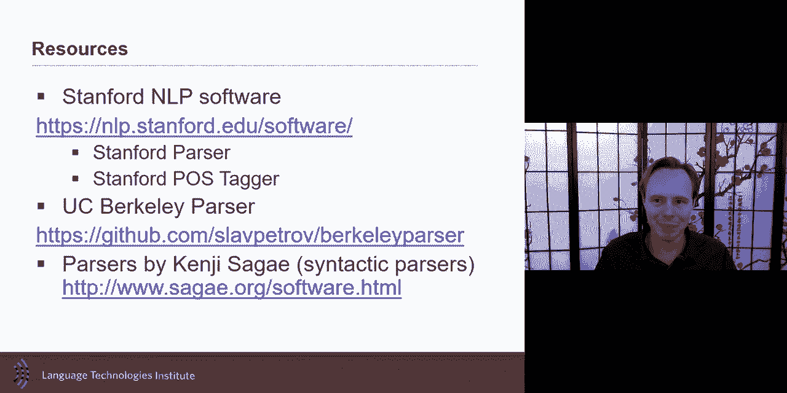