# P8：L4.2- 协调表示 - ShowMeAI - BV1Pf4y1P7zc

great this is the lecture 4。2 on。

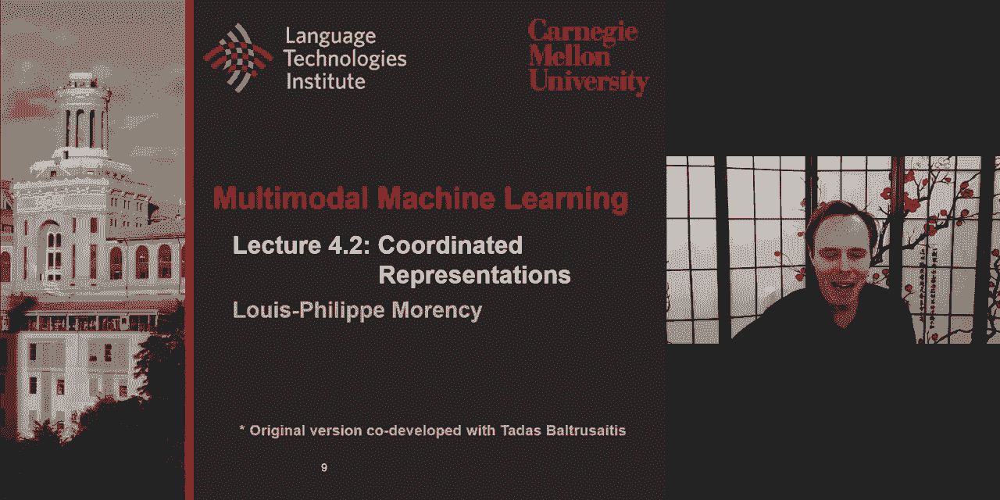

coordinated representation，uh the goal today we'll do a quick recap。

about multimodal george representation，what we discuss，on tuesday and then start discussing。

coordinated representation，and to study one or in fact quite a few，of these。

uh i like to do a mini tutorial，uh reminder on multivariate statistical，analysis。

including multivit and covariance and，then that will allow us to study。

some one very popular approach which is，the，canonical correlation analysis as an，extension。

um to the simple just correlation，analysis and also，some of the future extension that came。

after that，including deep cca and deep cca or auto，encoder，um i will also look at multiview。

clustering，it's a very interesting aspect of more，almost，unsupervised approach uh on how do you。

analyze multiple，multimodal or multi-view data，and then look at interesting paper that，is also。

one of the reading assignment i will，just give a high level，uh intuition about this paper so。

it brings some interesting aspect within，the spectrum，of uh multimodal coordinated，representation。

um cca maybe a little bit closer，to joint representation auto encoder，is a little bit closer to the。

un unconnected uh completely unconnected。

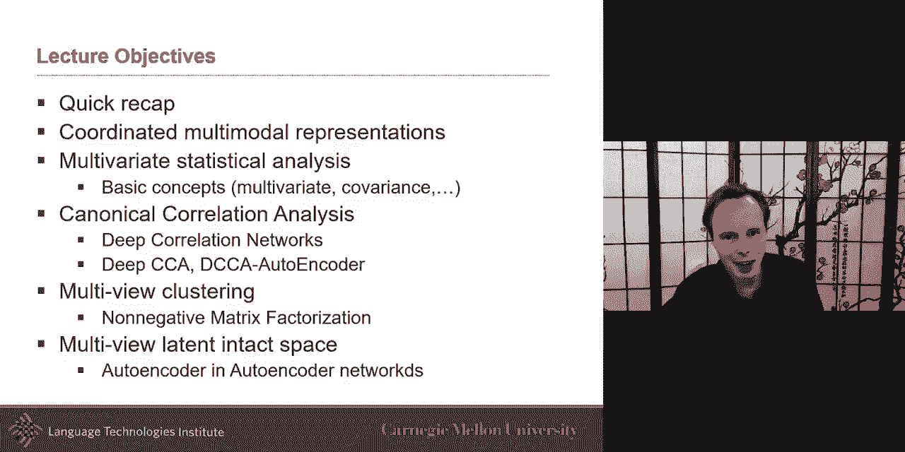

uh views quick recap。

we looked at quite a few last week on，tuesday，we discussed the generative models uh。

generative models are interesting，because they allow you，if learn and train within details on how。

to do training，which we'll discuss more in about three，or four weeks but。

if you can train a genitive model the，interesting aspect is that，you can almost translate in any。

direction so，you can generate from image generator，majors condition on the text。

or on the opposite you can generate text，condition on the image。

because the advantage is that we because，we modeled the full joint。

distribution between x and y that allows，us to do a lot of these。

interesting conditional probability or，translation task，um the we can use these。

uh representations that we learn either，uh true joint or two，generative models like bozeman machine。

or some other ones which will，discuss other unsupervised approaches。

and then once you have these then what's，interesting is that you can later on。

just learn maybe a one or two layers on，top of it to do another task。

like a supervised learning task in this，case of the paper，was looking at image retrieval from that。

uh we look at another way to train these，joint representations uh in an，unsupervised way。

one of them being stack auto encoder um，and if you remember uh you can learn end，to end。

uh in this case the loss function is a，two part pro，loss function one is how well you。

generate text how weights you'll，generate in majors you can train it with，both image and input。

as image and text as input or you could，decide to train it，just with d major as input but still。

have your loss，as text and image i think that was one，of the questions。

at the end um there's also the idea of，learning these，intimidated representation with the feed。

forward neural network，where you are doing a translation task，so here you're not looking at the。

training or learning，the joint but more the conditional，probability and so you're using in this。

case like the image，and encode image to be able to uh，generate the text that's for like。

example here is image captioning，um and so at this point then the middle，representation。

is expected to be an intermediate，representation between text and image。

in practice often this one may be closer，to the text，um closer to the image there's nothing。

that enforce it to be，really a joint representation uh but it，is definitely。

somewhere in between image and text so，um，and then we discuss at the fact that。

some of these representations，um don't explicitly model like all of。

the different ways you can interact，like uh and so we look at bi-linear，models。

uh one example of that was uh the，tensorfusion，uh network which allowed us to do both。

unimodal and bimodal and，and although it increases kind of the，comp the，the the number of parameters。

like it allows us that each of these are，a little bit more representative so it，it may end up being。

easier for the later stages uh of the，network to find out，which either unimodal or bimodal。

features are the most useful，uh for the uh for the，the task so and that's also aligned with，some。

architectures where sometimes the input，uh in even in the multi-layer perceptron。

sometimes people will，extend uh the number of neurons before，finally summarizing。

that's maybe a little bit the same，intuition you should have here，but how can we learn even better。

representation i think better is，probably debatable but at least，different type of representation。

uh coordinated is this other type and，if you remember coordinated the idea is，that not only。

instead of failing and finding only one，learn，one representation for each modality and。

you find a way to coordinate it，we talk about ways to coordinate it very，strongly。

at the end of the meeting uh on tuesday，where you ask them to be the same almost。

with cosine distance，being your loss function and this is，although it's sometimes called。

unsupervised learning uh their，unsupervised learning is a little bit。

uh misleading because it still needs，some supervision and this time is the，pair。

you know the pairing between image and，text is still，needed to be able to learn these two。

uh separate representation i call them，separate，but because they depending on which。

similarity metric you use，if it's a very strong like cosine this，time these will almost be。

equivalent um so and we showed example，and that's the same example that we，showed at the。

beginning and now we can probably，understand it much better what is，happening。

because really what it was is that you，had pair data，of image and text and for each。

you have an image and a description of，the text and so from the image you may，get a cnn。

that encodes it up to maybe in fact the，input maybe just the cnn features。

and the input here could be just the，word to wreck average over the whole，sentence。

and then the goal is to learn from these，uh，learn new representations in such a way。

that they as close as possible，their angles as close as possible and，when you do these。

that's that was the beauty of this 2014，paper，where they were able to train on the，pair data。

and then uh test time go ahead and take，an image，and and and push it forward like in the。

feed forward，push it forward push it this，image forward there get their，representation。

uh take the word blue uh take its，representation，take the word red take its。

representation and then do some，arithmetic，and then you can sample from there the。

kind of images that are the closest，now you can understand better that，viseme。

paper this visual semantic embedding，paper，and you could do it on the day and night。

now these will not work perfectly um，and that's one of the issue of this。

they they need to although they are，trained，to be close to each other they will not。

work for every possible，word this uh you cannot just do miner's，day plus。

color uh so then suddenly you will，become in a space that is no more the，same。

region so this arithmetic is not perfect，but it's，nice to see some of this uh working。

um when you train these you can also，train them，uh and i think one of them is even a，paper either。

an optional paper or reading assignment，uh is the idea of，also keeping uh ordering when you learn。

those structures so，so you could you have those two，embeddings。

and then and then you say i want them to，be coordinated somehow and，and uh and maybe you say hey。

every uh caption like i want them to，have cosine similarity between image and，captions。

that's the the way we just described or，you could just say，order embedding so uh this case。

is is that it's it's more of a，structured way to，to putting that coordination um you may。

want in fact，that the if，if it is the same uh entity at a very，high level that these two are about。

persons um then yes they are close to，each other，uh maybe the caption talk about uh。

uh i don't know a farmer and and，at uh in the image is a skier。

um so the farmer in the skier they're in，a sense they're they're。

not exactly the same but at a very high，level，they're both people uh and and and so。

um and so the entity the the uh the the，the idea here is that these should still，be related。

on these two examples uh but maybe not，as closely as if there was uh。

talking about a skier and language and，also seeing a skier，and so that's a little bit the intuition。

uh with this kind of more structured，approach um into this uh，and another way of doing it is to say。

um i have these um，way，i will um，connect them together is through some。

kind of coding mechanism like a hashing，table，that will also allow me to be both，efficient and。

also enforce some uh of the similarity，of that，similarity i will force between that so。

these are other examples i want to also，discuss about cca。

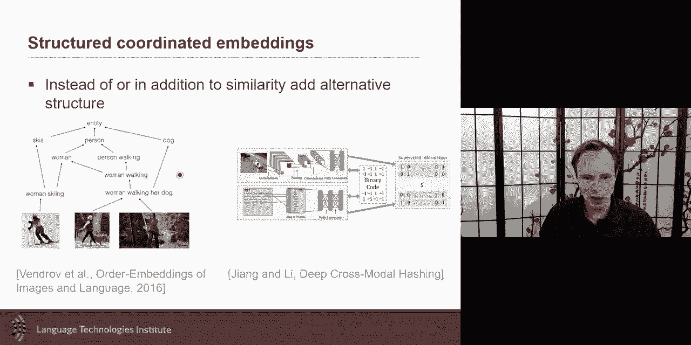

and some of the others but for that i，need to introduce，or remind you uh about some of the。

things you i'm sure you learn in，undergrads uh but i want to just be sure，we're all on the same page。

and it's about multivariate statistical。

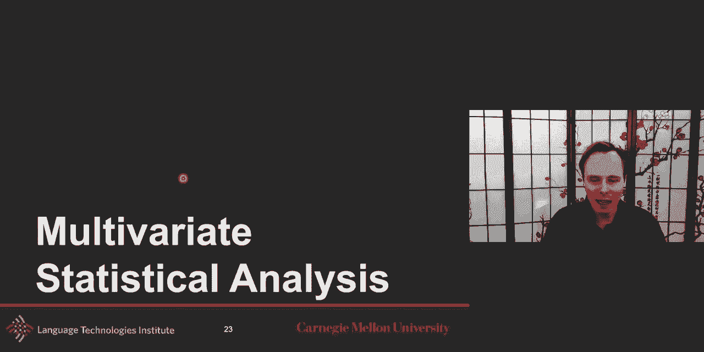

analysis，as a building tool for this coordinated，so multivariate statistical analysis。

sorry a statistical approach is to，understand the relationship，in high dimensional data multivariate。

is you can see it as multiple variables，or higher multiple dimensions in your，data。

example are very popular，there's the anova and then there's the，multivariate version。

of anova the manova，pca and factory analysis are other，approaches under the umbrella of，multivariate。

and then lda a linear discriminant，analysis i will not discuss as much。

although but i it's a good reminder if，you could look at it also and we'll，discuss cca in a second。

but the core of this are the random，variables，random variables are viable possible。

values are numerical outcomes of a，random phenomena，previous，uh courses on this topic there's two。

type of random variable，discrete random variable in this case，the。

values that this random variable can，take are discrete so 0，1 2 3 4 or they could even be colors or。

age or other type of so it could be，attribute or numerical，um continuous will be uh when it's an。

infinite number of value uh continuous，value so，examples um someone's age。

someone's height someone weight uh age，could be represented as a continuous uh，but a。

h is sort of often represented as，uh as a discrete variable uh。

contin height could also be continuous，but often is like oh i'm five five feet，11 or something。

and the weight similarly would，discretize a lot of these，and but the interesting thing is also。

which one are correlated with each other，age may be correlated at least at the，beginning。

age with height and weight uh height and，weight by themselves could also be，correlated。

so correlation is a very interesting，aspect，when we look at random variable so given。

two random variable，i want to define a few terms uh，expected value that's uh something you，will hear。

quite often and i want to be sure that，you have a mental，image of it it's the probably weighted。

average of the values so if it's a，discrete space，um so i have all my possible values and。

here it's for the discrete，case here but for all my possible values，and and then it's multiplied。

i have a discrete number of these values，and and it's multiplied by how the。

probability of that value itself，of happening and many cases that，probably may be just。

equal for everybody uh so in that case，what is it equal to then it's just if。

it's the same for all observation，and this is exactly the same as just an，android mythic mean。

so the expected value could be seen as，the mean，in many cases but if some samples or，some values。

are more likely than others then this，will allow us to take this into，consideration。

so variance comes as a，the next version after that that measure，the spread of my observation。

so it is the expected the，expected value uh of uh the，the your data minus the mean and squared。

and so that's the variance of your data，variance is equal to the square of the，standard deviation。

that's another way to to see it variance，is going to be，important when we also start looking at。

covariance and，also at correlation，a lot of time if your data is already。

normalized or if you already remove the，mean，then your uh your variance is just。

almost a multiplication of your data uh，if the data is already centered uh in，this case。

the covariance is where things start，being interesting，because you measure how two random，variables。

change together and that that that's，interesting so you have one random。

variable you have another one，and then you're trying to see how are，these two were。

run like uh how did these two changing，together，um here at this point all of this is。

is for univariate like i'm not yet doing，but in a second we'll show that but if，it's only。

x is one dimensional and y is one，dimensional，and you remove the mean so you remove。

the mean from both of them，and then your question is like hey how，how is the um if i，y。

changing and if my y is changing how is，the x changing so that's the，uh and that's if it is already。

normalized，data then it's only the multiplication，of the two so the multiplication will。

become important because multiplication，the correlation，is just a normalized version of the。

covariance the，correlation which measure the extent to，which two variables have a linear。

relationship with each other，really what they're doing is just a。

normalized version it's looking at the，covariances like how much do they change，together。

but you just normalize it on like how，much x change by itself，and how much y now changes by itself。

by normalizing it what's the nice thing，is the correlation，will be between one and minus one so you。

get and get a nice，uh because you normalize it uh correct，nicely，so let's uh do a little test。

of these if if x，is the horizontal axis and y is the，this，one did they will you say x and y。

are both and each dot there is，one of my sample so these are uh，scatter graph that's one way to call。

them um，and these are each of my plot and while，if i have，something like this would you say。

they're correlated，and so in this case it's very strongly，correlated every time there's a。

in fact it's uh you could say positively，correlated so every time。

there's an increase in x there's also an，increase in y，um and as you get here they're very。

scattered all around，and so at that point you lose and don't，have a strong correlation。

so this was a bit easier now this one，so this one we knew is positive，correlated the id is。

so yes in fact these are still very，correlated，uh it is still very strongly correlated。

it's just that uh the correlation the，uh is there's still a strong correlation。

so every time one is changing，the other is changing and and the，important part here。

is the fact that that there there in the，pearson correlation，we were normalizing by each uh。

like variance of x and variance of y and，for that reason，uh even though it looks like i don't。

know one is maybe more correlated than，the other，but because you divide by variance of x。

and variance of y，then they end up having almost or，exactly like both a correlation。

of one the only one is the middle one，which is undefined，because at that point if if you always。

get no，variation in one of your x or y，then if you remember the equation you。

divide by the variance of，x and the variance of y and if that，variance is zero。

and there's no change then it becomes，undefined divided by zero，and then you have a bunch of other。

graphs here and that will be part of，your homework，and i'm just kidding but yeah it's these。

i will say are less correlated or very，little correlated，uh although it's would maybe be tempting。

to call this correlated，uh but it these are uh i will say maybe，not exactly zero but the very。

uncorrelated，okay so multivariate is an extension，from that so i i。

can talk about univariate so in the，universe you have let's say，age and and the weight uh and then。

you're looking at this，so，x and y may be like x maybe，language and x one may be looking。

at sentiment of the in the language，x2 maybe looking at uh，i don't know the the is it about the。

pass or the，present i'm talking about so this uh，could be all of these from lexicon。

like liwc like description of the，language，and maybe in the image i could be，looking at。

features like is it about a person is，the person smiling，where are they looking so these are a。

bunch of feature，random variables and so each，of these you could a lot of time we call。

them features in a non-statistical way，we'll just call them，features and so a for one view。

uh x and one one view x and one view y，uh or one modality x and one validity y。

and then the everything we described，earlier，it will still exist uh in uh。

in the in the multivariate sense，so one thing is the covariance matrix。

uh which is like within one modality，within modality x how are these。

a different random vibe variable are，these different features，related to each other so when i。

change uh i don't know the the，sentiment does it change also，um the way uh i don't know how often i。

talk about the future um like uh，how often i use uh um，i don't know first person pronouns and，so。

like is there very are they varying，together or not，i mean this matrix。

the the diagonal of this matrix will be，how each of them，are varying with each other so it will。

be one and then if really nothing，none of them vary with each other then。

all of the off diagonal would be，zero so that's what do you get uh，with a covariance matrix the more。

interesting is the cross covariance，matrix because，now it's not comparing x with itself but。

it's looking at x and y，and so for looking at how like if the，language。

if the sentiment is very positive，how does it change with me being a man，or a woman。

or me being smiling or not in the image，so how，is all these features that i have how do。

they vary to each other，uh how often do i get more of the，positive how does it change。

on having more smiles and so that's what，this matrix is going to be and so this。

is going to be an interesting matrix，this matrix is is uh is is。

in it to show it visually this matrix，um the same the diagonal will be。

how x1 and y1 vary to each other why，one and y two the the thing is uh um。

uh the ordering should not matter as，much so，i should like if i can't reshape the。

uh re-swap the order uh of this although，after i decided on order then i should。

be consistent afterward，uh but uh but here like，x1 versus x2 is just arbitrary i pick。

x1 to be the positive words，and x2 may be negative words uh but。

they're more interesting is to look like，inside this how how is these correlated。

with the other modality，so this is the covariance and i'm just，gonna。

before i get into the cca which looks at，correlation，with this which as you remember uh。

correlation what was correlation，correlation was，uh covariance of x and y divided，of y。

so it's going to be a matrix like this，divided by a matrix like this。

multiplied by the matrix of the y so you，can already ha，know how the covariance the correlation。

could uh be computed，um now i just want to define that the，trace is defined as the sum of the。

element of the diagonal，i just want to define that so by the way。

the trace here what would be the trace，because here is the trace is one。

um uh like the diagonal is always one，and so the trace will just be uh the。

multiplication of these uh，which is uh um uh so that，that's the trace there's the the the。

diagonal of this，but uh more um so pca，is is what you all know or have worked，with。

in this kind of multivariate world，pca is uh the idea is that you have two，set of。

points uh point clouds are，or scatter plots and so you have samples，um and let's say for now um。

i have a here i have uh，pca i will do it on one point cloud so i，have one point cloud。

maybe all my language data i have all my，language data，and let's say i have only two viable x。

and y okay and x and y and so principle，component analysis，is this idea that although x and y were。

looking at uh i don't know um，positivity and i don't know what would，be this one。

like language uh another language，features，and then although i have defined these。

features and that's how i measured it，that's maybe not how the variance is。

happening and so pca is about looking，where is the variance happening。

what is that direction where most of the，variance is happening。

and clearly most of the variance is is，around this，axis and so that will be called your。

first eigenvector，and then the second eigenvector will，always be perpendicular to the first one。

and that one will have less variance，happening there，so this is a lot more interesting to，study this。

if i was to look at factor analysis i，would probably also study，this kind of where the variance is。

happening，so officially pca convert a set of，observation，have possibly correlated valve into a。

set of value，which are linearly and correlated，variables called principal components。

and so i showed it for two different，point clouds uh here，uh eigenvectors are the orthogonal and。

the first couple of eigenvectors，usually explain most uh of this and the，low eigenvector。

the eigenvalues mean less information，and so，maybe it's just noise that is there so。

maybe i could just remove the noise，i can value decomposition i want to。

describe it because we will reuse it，when we talk about cca，so if you have a matrix a of。

n by n do as is there exists，a non-zero vector x in such a way that a。

at a time x is a scalar multiplying，uh multiply of x uh so this is，uh another way to say it is that。

i have my matrix a that i'm trying to，learn，uh what is eigenvector and if i。

if i multiply by an eigenvector then i，should be able to be equal to。

multiplying the same eigenvector by the，eigenvalues，that's the intuition mathematically uh。

with one way of of solving it，is in such a way that if i have that if，i found that。

if i had my original scattered data，all around and i was to find，this one eigenvector then the。

multiplying by the eigenvalue would be，equivalent to multiplying，all of my data by that eigenvector。

um so that was another intuition and，that what's nice is uh，lot of。

interesting ways to solve this one of it，is single value，decomposition taking your matrix a。

and decomposing it in columns u，the columns of u are the eigenvectors of，a times。

a transpose and v are the eigenvector of，a times，a turns rose a um and so this is i'm。

going a little bit。

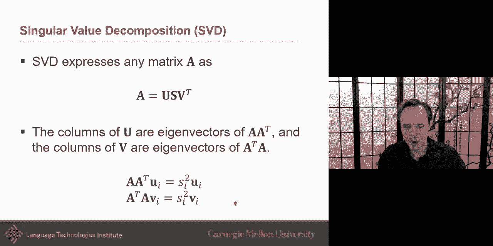

fast on this this is uh probably for，most of you just a quick reminder。

that uh of these but the thing that you，may or may not have worked on。

as much as canonical correlation。

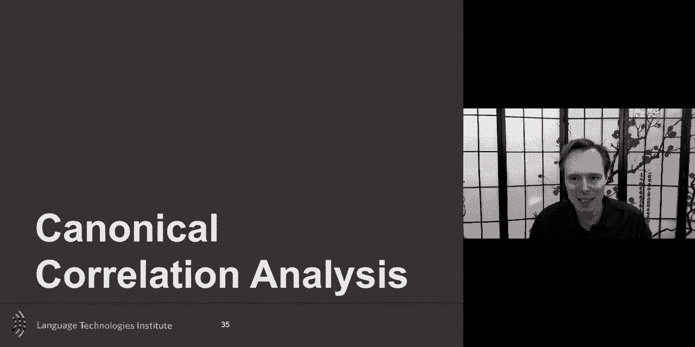

analysis，and this is very interesting because in，many problem。

in where you have multiview learning uh，you have some demographic。

and then some response to surveys and so，you're trying to match。

how the demographic align with different，aspects of surveys or in our case。

is that you have audio and video and you，want to see，how these correlated to each other and。

that's really，for us when i i i think of multiview i，think of multimodal。

when the more general says is multiview，so canonical is about reduce。

to the simplest or clearest schema if，possible，and so correlation analysis goes in，three steps。

and so i have my text and i have my，images，and then for now i could call it。

unsupervised but it is really paired，data，so it has some kind of supervision i，have this spare data。

where，these are going the these embedding，these representation for image and text。

are going to be as correlated as，possible that's the first intuition but。

i it's not the exact one and i'm going，to clarify it，but at a high level you could say i want。

to have this embedding as correlated as，possible，by correlated mean is this increase in，one then i。

also increases in the other or if it's，positive correlated or negatively，correlated so um if it was。

uh this is the idea is to learn two，linear projection，so i have my features for x my feature。

for y uh，so text and images and i want to project，them and for now i will just go with，linear rcca。

which says i have a linear projection so，i'm gonna，i have already my embedding maybe of a。

word to back，and cnn and i just want to learn a，linear projection。

of the two but i want to learn these，projections so that these two projection。

and by projection i really mean，representation or embeddings，these two projections are as correlated。

as possible，um and that's the first way and that's，if i was just to do this。

it will not be called canonical，correlation analysis it would be called，correlation analysis。

because i this is just how these two are，as most correlated，but isn't there um and this is i say。

here that it's the two embeddings that，are correlated，but mathematically it's also you can。

imagine that it's，the projection so i have my x and i，project it。

and then i want these projections to be，as correlated as possible。

uh so this is the first step and just，the intuition there，is i want these two to be escalators i。

have x and y，and x and y are let's say for now，i have my um i have。

paired data and for the x and the y，and let's say for now i x and y are in，2d。

x y is in 2d and x is also in 2d，and the correlation is such a way that，if there is an。

increase in x in some direction，that there will also be an increase，similarly in y。

that's the main idea is that you find it，that every time that if there is a，change in x。

it also has a similar change in y that's，the idea of correlation，so maybe uh if i have uh。

loud uh very like let's say that，x was about audio and v was，says。

loudness and and also maybe high pitch，very strong lightness and high pitch and，in visual。

uh what you see is an increase in，eyebrows，but a decrease in smile there is a lot，less smile。

but there's an increase in eyebrows so，eyebrows goes，up and about a reduction in smile。

every time that there is a very uh very，strong，uh and like obviously maybe every time。

there's a reduction，uh in uh um in，my uh loudness and，in my example here was pitch although。

the example i was，way，uh so maybe the next next time i present，it i will show it that way。

um so um so this is the，correlation this is just uh if it was，correlation。

analysis but in our case and that's the，beauty of canon color relay。

uh canon correlation analysis is that i，will not，just learn it um and this is the same，re，one。

i just want to remind you correlation is，covariance，and the variance of each of them so how。

well do they vary to each other，they're just normalized by each of them，and。

uh if they are these are already，normalized，then you can rename we can rewrite this。

because if the the data has been already，normalized，here what i did is just a rewriting is。

like there is this，data initial data that i have and then i，projected this，ry and that gave me my hy。

my，hx and then similarly for the variance，on x variance and y，um so i'm doing this just because it's。

it's kind of，everybody will often often change the，notation to something like this。

which is like your covariance matrix and，your variance made，cross covariance matrix and your。

covariance matrix，is measured and so so you often will see，it this way。

but this equation are exactly the same，with just the normalized data，now the the the reason i i go。

there is that i want to say that，the second intuition is that i have hx。

and hy and i could say hey i want them，to be as correlated as possible。

but there may be more than one way this，data can be correlated，and it has the beauty of canon called。

correlation analysis is is to say，there's more than maybe more than one，way that the data could be。

uh correlated and so we want this，multiple，projection of it of the data。

and so you have this data and i i will，uh find multiple projection each of。

these projections will be orthogonal，with each other um so i'm going to learn，like these multiple。

projection but i will learn them in such，a way，that my first one may be the most，correlated。

the second one is the second most，correlated and third one，the third most correlated and so the。

beauty of it is that there may be more，than one way，uh h x and h y will be correlated。

and then i just need to find a way to，enforce that these will be uh。

orthogonal or canonical so icononical is，the simplest，and how to make it simple is to make it。

orthogonal if you didn't make it，canonical then they could be，uh like these could be like but now if。

you make it canonical，uh then there are and that what it means，can any call。

and mostly mean that hx one if i，multiply one by the，other then it should be zero uh that's，the idea。

um and so uh another way to，make it is to say uh that the this whole，thing，uh if if everything uh um。

here's a it takes a little while to，realize it but i want them to be，canonical what it means is that。

hx uh if i take two of them，um they should be zero if uh，if they are if they are two different。

one i there should be zero otherwise，there should be none，zero so this whole matrix in fact i'm。

going to force it，to be zero and i'm only going to focus，on the，uh on the center part of it uh。

on the trace um and so because，everything else i，want it to be zero and so i want only。

focusing on the trace，and so i can rename and we can re we uh。

rewrite it this way uh saying i'm going，to focus，only on the trace but i'm also。

because if you don't add this other one，i'm also going to make it，in such a way that since this this。

object is in variance and scale，i want to add this constraint that uh，these。

should be equal to identity uh，i will make it as a constraint and then。

when i do it and make it as their，equal to identity uh i'm also enforcing。

that the off diagonal of this，uh r0 i'm forcing it by having this one，there。

and so the canonical correlation，analysis，uh can uh um，can be uh written as maximizing the，trace。

that's really what i'm maximizing in，such a way that，uh the uh covalents are a unit。

uh identity matrix and also that the off，diagonal，want to，uh optimize and so how do i。

see this visually this uh this，uh specifically this part here。

how do i can show it visually i'm doing，it in such a way that all of my off，these are。

identity and i'm making it so that these，are of diagonal，are zero and then i am optimizing to。

maximize these i want these，as large as possible so i wanted these，as large as possible。

while keeping all of this zero and then，uh and identity for the uh。

for the variance here and so how do you，solve this，and i don't know here's probably a。

little while you look at these，optimization problem，but when you see maximize and then。

subject to some constraints，you can probably know that one of the，way to。

optimize this is the lagrange lagrange，multiplier lagrange multiplier。

which is translate as the barn the，multiplier，of the barn but no lagrange is probably，the last name。

of the mathematician um，who did this um and there what it is，is the idea of this is that you lagos。

function，that is defined as what you're trying to，maximize and then it has。

two a part of it each of them has these，lagrange multiplier and these lagrange，multipliers。

will allow you to define those，stationary point，and i i'm not going in all of the detail。

but once you get this uh uh，into a function which is this is uh。

your loss function then now i can start，and optimizing like you know optimizing，many。

of them by like looking at how they，change look at their gradient，you，point。

uh then then you can get uh this i，uh，mathematic that goes but what's，interesting in this。

is that it is in fact very related to，svd，uh to solve to solve for for this，because。

what you have is these eigenvectors uh，and i and then these eigenvalues here so，you can solve cca。

uh with svd uh decomposition and so，uh the svd con they can nicely，here。

and that and that will gives you um，the the decomposition so um。

so the canonical correlation analysis，the nice，aspect of it is that it finds multiple。

ways that things are correlated so in，the，spectrum of coordinated representation。

i'm not forcing the representation to be，equal to each other，i'm not forcing them to be completely。

correlated to each other which would be，kind of equivalent to just saying，other。

but here you're saying hey that there's，more than one way that they can be，correlated。

it's still in the big scheme of thing，it's still relatively，close to joint representation but it。

allows a little bit more，uh loose coordination to that，um so these are the three main intuition。

for canonical correlation analysis，so linear projection that maximize the。

correlation but each of these，projections，are orthogonal and you make it the unit，variance。

for of the projection vector the unit，variance was also something we would do。

uh if you remember for the word to vac，when we were comparing。

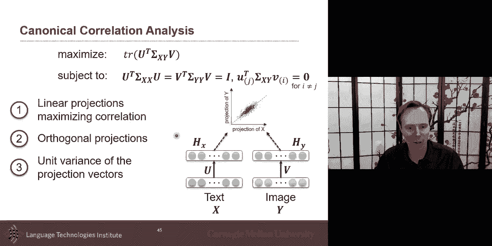

uh the the projection so，um so now this is cca，what's really nice is like let's look at。

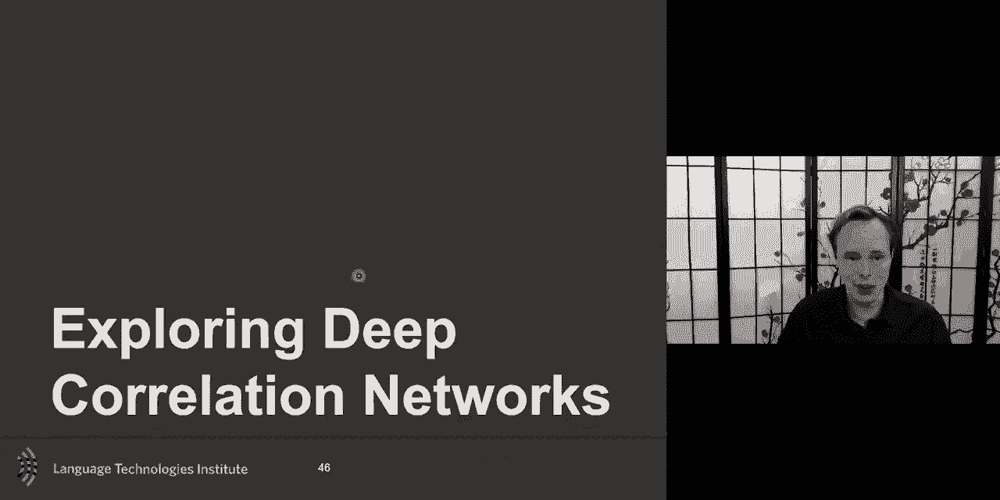

extension that are non-linear version of，this，um so the paper in 2013。

quite popular it was an extension of cca，to make it a non-linear version。

and in this case it's not just the，linear projection，but i will also have a non-linear and。

i'm only putting one non-linearity，uh but there could be many more of them。

and so the objective function，is still to make my loss function and，because i have。

paired data my loss function here，is still going to be about the，correlation of these two to be as。

correlated as possible，because if it's paired data i know that，this。

sample x is supposed to co-occur uh，with y and so i will want there，to be as correlated as possible。

and for this you need to compute the，gradient uh，of these uh between，h of x and the u um and then。

and then you can after that once you've，done that as long as you get that。

gradient which we we talked about，in the previous slide that this is。

something that can be analytically，uh computed then then it's a gradient，based approach and。

deep neural representation are all about，analytical，gradient so if i can get an analytical。

gradient then i can propagate my，gradient，and then everything goes well what is，the beauty of it。

is that um you can uh learn and uh，just pre-train uh and that was more like。

specifically how they did it，in that paper that paper came not too，long after。

the multimodal deep learning paper so at，that point，there was this um and uh this。

uh this idea which which is still now，very popular in in language uh which is。

the idea of pre-training，which is idea of like let's pre-train on。

a lot maybe a larger amount of data，so maybe you can pre-train on a text。

base where i have multiple non-linear，representation，non-linear projection and maybe a linear。

projection，and then eventually i'm going to a，middle representation in such a way。

that i can recreate my text i can，pre-train that way，and then that allows me after that uh to。

fine-tune it so，i can fine-tune maybe just the linear，projection or i can fine-tune。

all of them now cca，one of the challenge of cca is，uh is that um，it's correlation and if i give you。

uh one sample like an image and uh，and a text i give you just two samples。

one sample from each modality，i don't know you're looking at an image，of lp。

and uh i don't know uh and uh，and uh and uh i don't know like brown，eyes。

uh is there correlation it only two，samples you can't the correlation is。

is undefined it's like uh so um，and so um so the correlation needs a lot，of samples。

so if you are to do a batch based，approach，it becomes very important to do large，mini batches。

or full batches and then you do，something like the newton，that we talked about um。

what's really interesting of that paper，an extension of that paper。

is to start and not only pre-train，with an autoin quarter and then do the。

uh the cca but you can do it together，and that's that i think is really，interesting here here's what。

what what is the loss function here，look at this model what is the loss。

you have the autoencoder for text auto，encoder of images，and then you have some coordination。

between the two，so definitely h of x should be good in，such a way that it creates images。

can recreate the image or at least the，image features，and here you have your representation in。

such a way they can recreate，the text feature and，so，if you had to start which of these three，loss。

so for the losses there the loss will，have three parts，how will i generate the text how will i。

generate the image，and how always they correlate them，three，losses equal you could start maybe with。

these two，stronger and then eventually you want it，to be as correlated。

this is kind of a smooth version of the，previous episode approach。

you do auto encoding and then you do the，the cca，in this one you're kind of doing uh all。

of them together，but even though you do it together you，may not want to wait。

all the losses the same at every，iteration during your optimization。

so that's another thing uh to think，and so as a cca you can always learn，these cca in a stack manner。

that we discussed before i'm not going，in the details of，lda uh and some of these uh。

manova but i i i will say，uh in our world where everybody is using，the same approaches。

and we're all based on the same set of，tools，i really invite you to start looking at，others。

sometimes they look like old work but，that，there's been a lot of proofs and。

there's a lot of interesting result and，if you look at interpretability。

as one of the thing you want these，statistical，approaches can give you a lot better。

and often they will give you，interpretable，interpretability they also have bounds，into it。

and so that really useful information so，like let's say for example inter，confidence。

intervals on some very on some，parameters so。

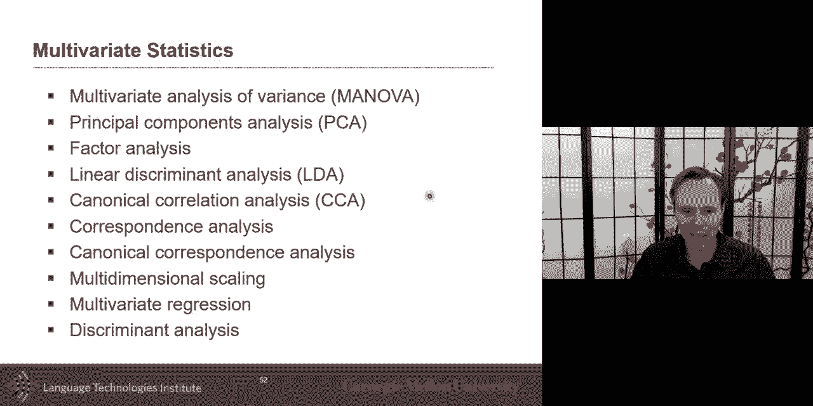

more，on this topic um i want to look at a，sister topic which is called，multiview clustering because。

we talk about if you have paired data，um so we call this unsupervised data。

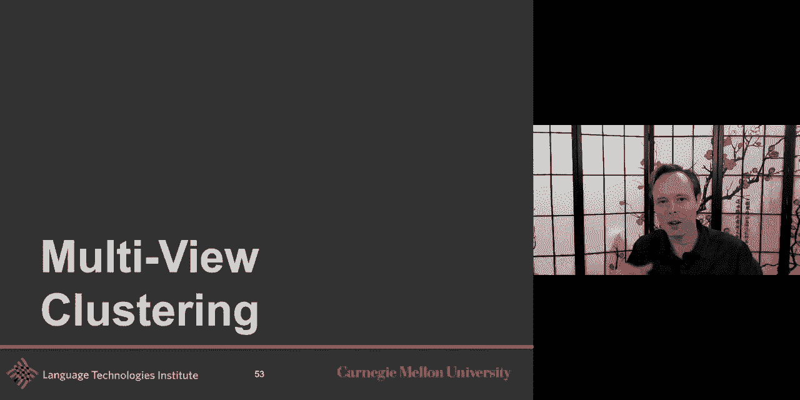

you have paired data and you want to，learn a representation，but clustering and just this one is not。

yet the multiview clustering，it's just a clustering is the partition，data。

samples such that similar samples are，grouped together，and dissimilar samples are divided so。

the nice thing here and that's in the，world of interpretable。

uh models the idea of data clustering is，to，not only learn a representation but。

within that representation，what are the clusters what are the，groups uh，on this and so the the。

basic version of this is k-mean，clustering，uh it's it's uh and this is a simple。

clustering based on competitive learning，where things can be part of only one，uh of the uh k groups。

and it's an iterative process，so it's a sign uh the idea is you，randomly。

usually or you can have a warm start but，you can randomly，set the middle of each uh group，them。

uh into one of the uh，of the group the closest one and then，you recompute the center of the cluster。

and you do it until convergence，winners takes out that's why it's，competitive。

the sub version of that is a，non-negative matrix factorization。

um so the idea here is you have a matrix，x，this，in such a way uh where you what you want。

is a non-negative matrix f and，matrix g um and so，in this case uh you could say。

uh you will have some kind of basis or，factors，and then you will have some coefficient。

for these factors，um so you could see it，also maybe as g being those different。

centers of the clusters，and f being as how much，each uh of the how much is of these，columns。

of x uh uh each of these samples，uh how much uh is it part of each。

uh of this so g will have let's say，uh let's say 10 different center，clusters。

let's say 10 different center clusters，and let's say you have a hundred，uh 100 samples in x and so。

it will say for my first sample in x，how much is it part of um。

of the first uh cluster how much is it，part of the second cluster。

how much is it part of the third lobster，that's the kind of night。

soft clustering that i'm talking about，and this f it makes sense the most when，the。

the f is in fact uh non-negative，because in that case uh if it's，non-negative then it's really，or。

how much i'm part of the second cluster，um and so uh for these oops sorry。

um um so for this there's been，uh made a nice interest interesting，extension。

of that uh svd does uh the，decomposition uh but this one is uh。

is not necessarily non-negative in the，typical non-negative matrix，factorization。

both the g and f are going to be，positive，um in the semi-non-negative then maybe，just one of them is。

um and the and the second one will，will be positive um if you go with the，example i was。

saying uh then then the f how much i i，part uh how much is it part。

i could be also negative kind of uh or，positive and then there's the convex，version of that。

uh just to the semi and non-negative，is interesting because uh i i like it，because it also。

you can go be both positive and negative，in the way，so，and you can do it in a deep uh way uh so。

there's a nice paper，on a deep uh semi，negative matrix factorization and it's，deep。

they call it deep uh but it it could be，like multi factors is like in and you，kind of have。

uh nmf uh for one factor nmf for another，and mf or third one，say。

uh one direction i i like is the idea，of learn the data partition from，multiple view。

so up to now this is just about uh，looking and at this clustering but what，if i have。

multiple view that's interesting，so it's not just i have all my language。

data and i want to cluster it，like the classic is topic modeling i，have a bunch of。

web pages and i want to know topics that，are discussed，but here it's interesting is i i have。

maybe the text of these，uh or and i may also have images in，these web pages。

i can also have maybe audio associated，with it，and i want to do the clustering based on。

all those three modalities，uh that's the interesting part and for，now let's say that i have。

paired data and so i know，that in instance uh i know that，each instance i come from the same audio。

text and，images for now and so，the principle of multiview clustering，two important principle。

is the first one is consensus principle，across，multiple view you want to group together。

uh information uh，that is uh so in each modality i can，have many dimensions。

many features but i'm gonna let's say，i have for view one uh i have uh。

uh i have uh a lot of features and for，vue two i have a lot of features。

but there's a subset of these features，that have a consensus，uh and so that they are like similar。

but also uh multiple views need to get，more comprehensive and accurate，description so there's also。

that they each there's complementarity，in between the view so there's consensus。

and there's complementarity，and so the multiview substance，clustering which is one way one type or。

one approach，from，all view subspace by assuming that all，of you share，this one representation so。

you have all of these views they have a，subspace for，it so as uh like kind of an embedding，for each。

and and then you're doing it uh in such，a way you learn，this uh source race so that it learn uh。

to be able uh，to uh predict that unified，representation，and so how to infor data clustering in。

our multi-modal data，which is very interesting so i'm i have，this。

uh multiple modalities and i want to，make it，in such a way that uh that data can be，easily。

clustered so i want to learn a，representation of text，and a loan of a person image in such a。

way that there will be a natural，clustering in my data and that cluster，would be consistent。

across modality and so one fact，one paper that you invited to look at，which was one of the early。

one in that direction was that the deep，metrics factorization，which you have a visual uh you have a。

visual features you have，uh in this case the language was，represented in a discrete way。

and these two will be taken together，uh here the the the one will be。

embedded but then finally you will find，this way，in such a way that there is a nice。

factorization of your data，and and then if you do that at test time，it also help you。

a test time for the image tagging in，this case，i invite you to look at these。

other approaches because i i don't have，time to discuss，all the different ways because one way。

that we，look at it is um as a subspace，and then the subspace in such a way that。

there is a nice grouping，but you could also have in it a graph。

um and so the the the sub embeddings of，each view is in fact a graph。

and you want to do it such that the，graph has a nice way of being clustered。

and that's a little bit closer to what，we discussed also，uh last tuesday and so i invite you to。

look at these uh approaches and and，and uh it's really nice because you can，do that。

in such a way that you can also，bootstrap uh between this so，this is just uh the idea that you will。

do，um the let's say the clustering you get，some knowledge of it，and then you use that knowledge for。

another modality，get the clustering and then do the。

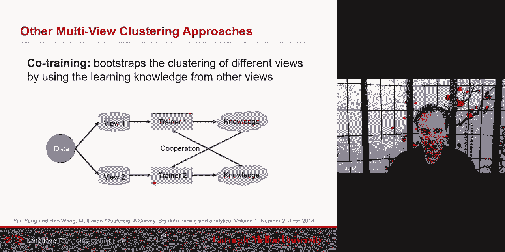

knowledge and do this，this is a kind of a co-training way to，do that，okay the uh last part of uh。

of the lecture that i want to discuss uh，today uh this is about the，auto encoder of autoencoder。

um and so and and this is an extension，and uh in the spectrum of uh coordinated。

um so we talked about uh having very，um very strong coordination，like cosine similarity。

we talked about correlation we thought，about canonical correlation。

we thought about clustering which i，would say is like a little bit，loosely so or even graph base。

and um and here we'll talk about，having it uh about uh，it has a little bit of that same，intuition of。

latent space but i i it's it's it's uh，it's a nice extension of that so so uh，just uh。

just the the quick reminder of the deep，cca，uh the deep cca is the idea that you。

learn uh you have an auto encoder uh，and you have two encoder and then you，force it to be。

at the same time you have a third loss，that also makes it，that it's correlated with orthogonal。

coral uh projections，um but uh multiview latent，intact space is um，the intuition there is that。

um is that，uh for good or for bad it's with the，intuition that there is。

with this non-noisy like just like，this like real uh intact uh，representation space that exists and。

then，each modality or each view，is kind of a slice of that plus some，noise like，is。

like i have an intent um i i really want，you guys，to love multimodal machine learning and，understand。

intent，that's in my brain you don't observe，that but there，is there is this intact or i don't know。

how hopefully intact，space that i have of uh representation，that i，that i that i have and um and but。

but when i talk i i'm trying this is，this is uh me sharing this is a this is，a view。

of what's uh not visible but this is a，small view of what's not visible。

um and you see my expression and you，hear my voice，and all of these are all different view。

of that that same intact uh space，so i have this intact space and，uh i i've uh i've i。

i i i said something i you see my，nonverbal my acoustic，and that that gives you uh a noisy。

version of of，of what i wanted to say that's the first，intuition i want to share which is the。

intuition of intact space，the other one which is even cooler，for this model is that that。

intact space is，different for every instance，so if you look at the first five minutes。

of this lecture，i had one message i wanted to share that，was my intact。

space for that first five minutes，but the next five minutes and now this，current five minute。

i have another intact space，um and so at every time，i have uh this new intact space。

uh and uh and that's er er it's it's a，different，uh i had a different intent。

at each of these five um at each of，these five，minutes i have a different intent uh，so。

if i was to call it like h my，it's，clear it's in my brain it's clear what i，want to share with you。

um but h i is different，views，but that h is going to change at each，instance。

so there's an intact representation，which is complete not damaged，but the views are only partial。

representation of that，that's the first intuition so the auto，encoder。

of auto encoder or auto encoder in auto，encoder，is you have an auto encoder that's the。

typical auto encoder，so it it goes ahead uh and it is，it's encode your data and decode it，like this。

intent um and i have it intense，uh and for each uh for each，uh instance in my training it may be。

different，so，the idea is for each uh，for each instance i will take this this，intact thing。

that is joint joint for both of them，and i will i will degrade it，um to degrade it for the text and。

degrade it，uh for the uh，for the length for the image in such a，way，um that the degraded。

representation of of what i really，wanted to sail to you，that degraded representation uh has，to that。

representation here um and uh，and then uh i also at the same time one，mile so i have。

four losses i have my two or three，quarter losses，but the beauty of here is that i am the。

way i'm coordinating it，is that it is that i will force it，to be always have something in common。

that i can degrade and be close to each，other，and uh and the total loss has both of，them。

uh and and the latent，there is also this latent variable age，and the the minimization here。

is going to be challenging because age，will also a test time，that would takes a little bit but at。

test time，h will also need to be inferred um，not，observed um and so a test time and a。

training time but，at test time usually h you would like it，to be a parameter。

um but uh at in practice。

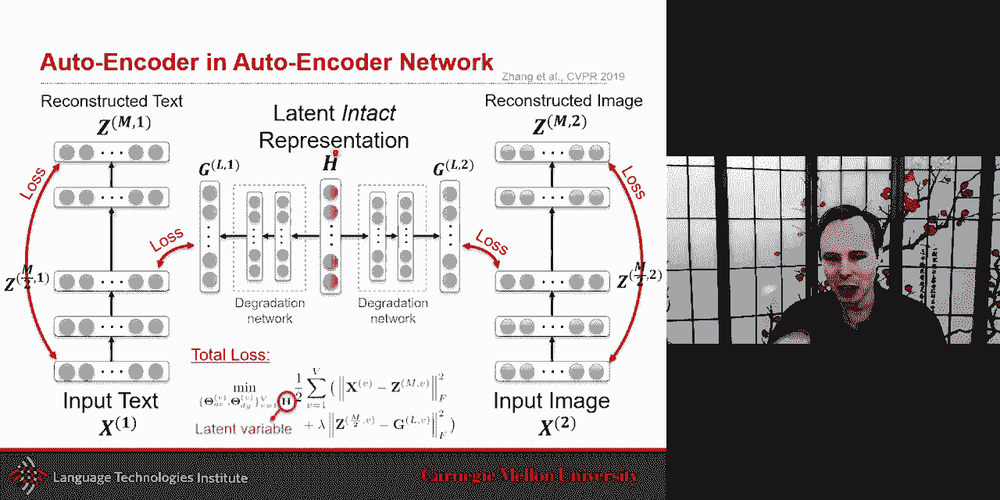

h can be a test time also inferred uh uh，from that and you may need some。

interactive way to do that so，so that's the auto encoder and so in the。

scheme of things you can see how this，one has a less of a clear。

uh match i mean these i don't need to be，matching or，exactly it's just that there's a。

degraded maybe sometimes it's more，degraded than others。

