# P9：L5.1- 多模式对齐 - ShowMeAI - BV1Pf4y1P7zc

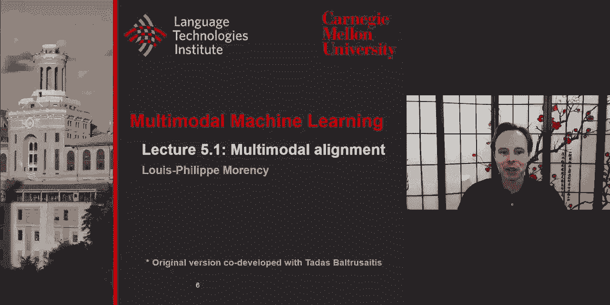

today the lecture is about multimodal，alignment，um this is a very interesting topic。

because this is what，if you ask me what from all the five，general，challenges in multimodal machine。

learning that we discussed early，in the first week multiple alignment，like synchronization。

between modalities is probably one of，the most，multimodal or multi-view of all of them。

representation learning which we，discussed last week，is very important good representation is。

important，um but this is also something that's uh，important for many machine learning。

cases but alignment is very key to，multi-modal，and this will look at different type of。

alignment implicit，in explicit alignment for explicit we'll，look at dynamic time warping and some。

extension，and for implicit we'll talk about，attention models，as examples for that so uh multimodal。

alignment we discussed it in the first，week，this is the idea of finding a。

relationship between correspondence，between two and more modality but it's，it within a modality。

we have elements in each of these，modalities，uh if it was a series a time series，there's sample temp。

time samples maybe and for each，modalities，and the alignment is about it's at the。

level of these elements like trying to，link，these together um some may not。

link to uh with other modality because，they're unique to that modality。

some of them may be redundant like the，same information，is in both modality or some of them。

could be complementary，meaning the two of them together from，both modality。

start bringing a new meaning and intent，on it，and the two type of alignment techniques。

that we'll study，are explicit and implicit the explicit，the loss function what you're optimizing。

is the alignment your goal the task is，the alignment，um and so this is the for the uh。

explicit the implicit means your loss is，something else maybe you're，predicting emotion sentiment or。

something like this，and the implicit is like to solve this，you will need。

to uh be able to do the alignment so，often you will do maybe，and then。

alignment and then eventually your loss，so the the alignment itself。

is will be latent we'll discuss uh next，learning，and alignment could be done at the same。

time but today we'll，we'll see them as two separate uh cases，so examples for both explicit and。

implicit，so images and captions，so you have the image it has many，objects in it。

and you want to be able to align it with，the words of the caption。

or you're watching a video a how-to，video and you want to align maybe the，recipe。

with the segments in the video or，in the case of phrases uh like in。

in the machine translation case which is，not multimodal，but it is a multiview so explicit。

alignment the goal is to find the，correspondence between modality this is，what the last function。

and the example for that is，uh sometimes you may have an audio track。

and then you have the transcript，and you need to do what's called word，alignment aligning words。

which are tokens with the audio，uh you may also have two videos uh。

and they're out of sync or they're，what's called core reference，uh resolution um core reference。

resolution，is uh is in the language but，co-referring expression，is uh also in the multimodal。

so here in that case we'll be assigning，the words，um with um uh，with the with the language there's。

different version of the，the co-referring expression task usually，means。

only one object is linked with the whole，sentence，um but there's also other tasks where。

the goal is to align every object that，are mentioned in the image。

that's another task that you can do，the implicit is probably the most，popular。

and that's where we'll spend the most，even，on the lecture 7。1 when we also talk，this。

but implicit means that i have a task，and my task itself may be，something like uh maybe like image。

captioning，but as a step intermediate step i will，intermediately as a middle step of this。

link entities from the text with，entities，in the image and that can be done，through like a discrete。

uh case or it could be done more in a，continuous sense，uh semi-continuous uh like uh。

attention model is there's no it's still，somewhat discreet，uh but a little bit more continuous so。

machine translation，cross model retrieval image captioning，visual question answering。

all of these are using these uh，intermediate representation，intermediate task of of linking。

uh entities from the different，modalities，uh and one of the key uh。

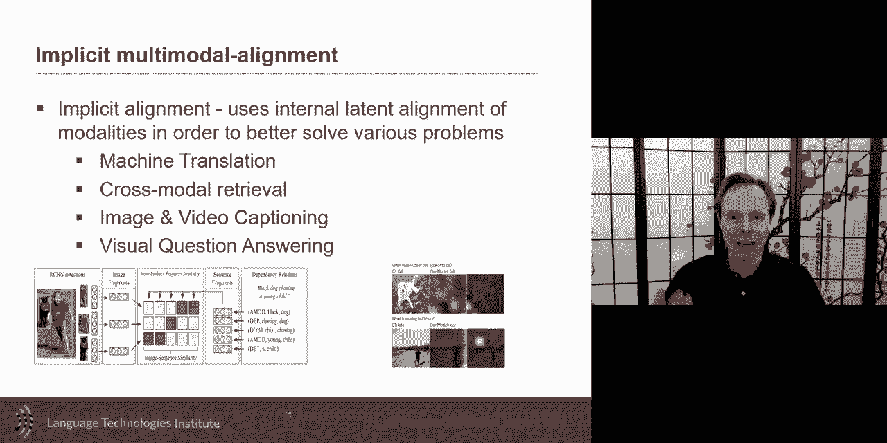

approach or at least that has been，studied is the attention models but，because。

that may be the one you've never like。

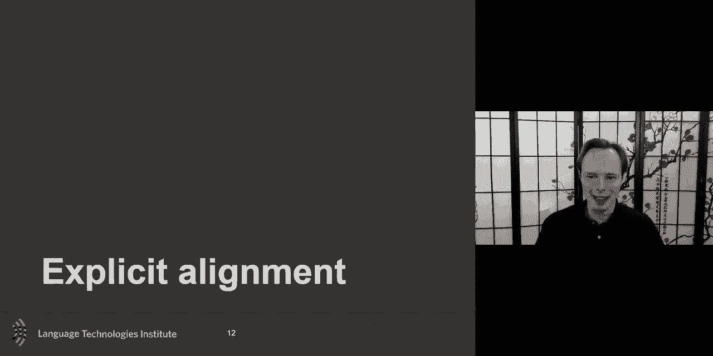

directly work with but i think is，important to know when you start looking，at alignment。

so let's say you have uh multiple videos，maybe a video in 2d，maybe you have motion capture and you。

have also，some other uh version of this maybe in，3d，a 3d of the person or just the leg and，your goal。

is to align them or maybe you have two，videos，uh you have a video of lp kicking the。

ball and you have a video of someone，else keep doing a similar action but not。

exactly the same action，and the challenge here is that it may be，not a one-to-one that。

every frame will be pla will be matched，like um，some frame may be matched to a multiple。

frame in the other modalities in a very，general case some，frame may not even match to any of the。

frames here，um so but as a first step let's suppose，that，every frame matches to at least one of。

the other frame，that's the first assumption we'll make，and so if we have in this case we have，two。

underlying uh time series，um and so the first time series and the。

second time series may not have the same，length，uh they will have different lands uh for。

now let's say that they're represented，with the same number but that's not。

needed so they could be from different，um they could be a different dimension。

but now let's suppose that it's a，unimodal case，and so that they are represented the，same way and so。

but they have different lengths and so，you want to match，uh you want sample of one。

uh sequence with the samples of the，other，and just for simplicity i presented。

visually the same sequence，um so one way to formalize this problem。

is you could define a loss function，that find the set of indices to minimize。

the alignment difference，so the indices will be the vector，p will be the same length as x and the。

vector p，t y will be the same length as y，the y vector and there what it will be，is we'll just say。

which index to use um and then the goal，will be with some kind of。

for example euclidean loss saying that，at the end of the day i want this to be，as small as possible。

let me find my parameters my model，parameters are those indices，and so if the index is a 1。

that means that i'm using the first，sample so here for x it will be，1 2 3 4 5，5 5 6 7。

and for y the optimal would probably in，this case what i showed，1 2 3 3 4。

5 six seven eight okay so that's what，pt y will be the optimal at least the。

one i depicted that and p，t x would be so where p，where are these vector uh and uh。

and why are the where ptx at the vector，the same land so sorry。

i mentioned a second ago i said they are，the same length um what i meant。

is uh not the length the vectors，themselves would be，whatever the longest sequence will be。

will be the longest you could be here，but then when i said length is that。

ptx could have a value from 1 to nx，and pty can be valued from one to ny，the。

approach for that is dynamic time，warping，and i don't know how many of you have。

worked with dynamic time warping the，idea of dynamic crown wiping is to find，the lowest。

cost path in a cost matrix so starting，from maybe，1 1 to nx and y is like how can i。

get from one point to another and，there's the optimal，path i could use but there's also。

uh many different other paths i could，use，and so when i do uh dynamic time warping。

i want to do it in such a way，and that's uh uh uh i will say a，weakness maybe。

but also makes it more efficient is like，a monotone city，meaning there's no going back in this。

the kind of dynamic，time wiping there's no gaps and that's，maybe one of the。

downside of the basic dynamic time，warping，is that there will be no gap meaning。

every element will be mapped to，something，uh and often to optimize you'll have，boundaries condition。

and then you don't want to get too far，often you will have a warping window。

um and then do not insert or skip，too much and so you'll have some of，these constraints as well。

to solve it you in fact end up doing，what is，known in optimization as dynamic，programming。

while respecting those restrictions，i will not go in the detail of the，optimization。

but you could imagine it as exploring，this，path of all possible uh all possible，path。

and dynamic programming would be an，efficient way，cost，in this so this is the。

formulation i will say the typical，dynamic time，warping formulation which will be。

allowing us to find，these indices in an efficient way，um but you could also kind of unwarp。

uh the um the this，uh these two signals and just on，same，land and then if you do this。

then you get to that really nice，situation，uh where uh you can have a matrix。

and so now it's no more the indices that，will define，uh that's what would be the parameters。

but the main thing you will be searching，for，is that matrix that matrix that matches。

x and y together and so，if you formulate this way and that's a。

really nice formulation that will give，us a lot more flexibility，is that you will find your x vector。

matrix um and if you remember，this may be of size like d，times n x and multiply by your w。

x and will put some constraint maybe to，keep it，in the form as you see it visually。

if you multiply the two together then i，will get，y，matrix and multiply by my wy，nice。

loss that i in this case i will often，use like the，something like the foreigners norm。

although this could be，a change it's not a requirement but uh，now。

what's nice is i what's what's my w x，and o and w，we know these a lot more uh and so we。

can play with these，because then we're in the world that we，know better wxwi。

it's a world where no better and so，how do we work and so one of the problem。

with dynamic time warping as i，said is maybe the complexity but it may，be sensitive。

and it's unimodal so ivan if you do that，other representation that i talk about。

this can be optimized uh maybe linear，least square or something，uh we can optimize this um。

but uh it's still only unimodal，and so how do i go，and what if i have x and y。

are from two different modalities，oh okay so d this the dimension。

from y and maybe not the same dimension，as x，and the space of y may be different from，the space of。

x but what did we talk about，last lecture how did we manage to use。

to do uh coordinated representation what，was this，one approach for coordinated，representation。

cca canonical correlation analysis，was this one way that if you have two。

modalities and you want to learn a space，where they're the most correlated that，will allow us so。

that will allow us to find that space，where the two modalities the most，coordinated。

and then after that hopefully we can do，uh，the the matching the alignment。

so canonical correlation analysis may be，a good，way and if you remember canonical。

correlation as this，reason it's called that way is that it's，more than one correlation。

we're finding many different projection，the way，the the text and image could be uh，correlated。

uh but what makes it canonical is that，these will be the simple as possible and。

simple in the sense that they're，orthogonal to each other this projection，so if you take this。

uh and you take the cca loss，uh and you put it in a matrix format。

then you can also visualize it this way，i take，x and i project my x into the hx。

in such a way that the projection of v，is also the most close to each other。

and if we if you do this with the same，kind of，we，are the same correlation loss as cca。

loss as earlier it's just earlier in，earlier site we had it slightly，different here。

but these are equivalent formulations，uh here why would i go through this。

slightly different formulation，is that now i can take the cca and the，dynamic time warping。

and put them in one formulation and that，was this great，paper from uh the de la torre。

uh about you which is a is a is a，warping，you you is about like uh bringing。

uh dynam is the u is about another，warping me about the projection。

projecting my x into a space that is，correlated，with my uh y so i project e y。

with v x with u and then w x and w，i are there to cur to do the，alignment so within the same loss。

function，i'm able to do my projection which is in，a sense my。

almost my representation learning and my，alignment together and so。

we're able to do that coordinated uh，representations，that allow us to then do the alignment。

uh so this is the canonical time wiping，uh and this is um optimized by，coordinate。

gradient distance fix one set of，parameters，and optimize the other um that's uh。

the chicken in an egg kind of，optimization paradigm that，has been done quite often so uh so。

when you fix uh wx and then you want to，optimize unv，if you remember to optimize unv in the，cca。

we could use some version of eigen，decomposition or svd，and then if we want to optimize the wx。

double ui，you could use then any optimization，in this case maybe we'll do it not at a。

batch level but，over all the data so you can uh kind of，uh gauss newton kind of optimization。

over this so so this is the uh approach，for canonical，time warping and now i'm asking you。

how can i generalize to multiple，sequence，all with different modalities uh。

and so if you want to generate two，multiples，where you have uh multiple sequences。

uh and there so i will say let's say you，have a，video uh and you have also maybe。

uh acoustics and you wanna you wanna be，able to，align these together uh then。

in this case you can just extend the，same um，formulation but here uh the problem。

is canonical correlation analysis，is is usually working uh，only when you have uh can the typical。

canonical correlation analysis，was mostly working only uh when you have，two modalities。

but the generalized version of it allows，you to，expand that and that's what what's this。

paper was doing，that was really nice um and so when you，do these approaches。

i you then that's nice because then you，have multiple sequences，and you can align these together but。

even if they're from different，modalities，uh you can try to align these uh。

different modalities like a，body 2d uh，or uh in fact one is one hand and the，other is the other hand。

um these all comes to couldn't be，aligned with this so uh canonical time，warping。

uh it's a linear transform between，modality，okay so up to now we were。

having x and y and we had a linear uh，projection uh and once it's linear，projected。

and you have also the wxwi to do the，alignment now if i say how can i make it。

probably you thought about it the deep，canonical，time warping so now uh the way to do。

the like something like cca will be to，do it in a，deep uh version of that and so。

uh so it can be seen as voter，translation of deep cca，and generalized time warping together。

and that's what this uh deep canonical，time warping，uh explore and that so so。

this is a a lot of things that we，studied and talked about，uh last week about cca but now。

merge with this uh point of doing，alignment explicitly，uh and to optimize uh this uh then you。

will be the same way，that you optimize the uh non-deep，version，where you do it uh sulfur alignment。

uh with fixed uh projection and then，on the other side uh solve uh the，projection。

given the alignment and there uh since，it's a deep representation often would。

use more of a gradient descent，so this is the um the first，approach uh on the deep chemical time。

warping，uh there's been extension to that uh a，little bit but this is。

i will say the one thing if i'm talking，about a lining and this，is the um this is the last function。

what how do i line me my two sequences。

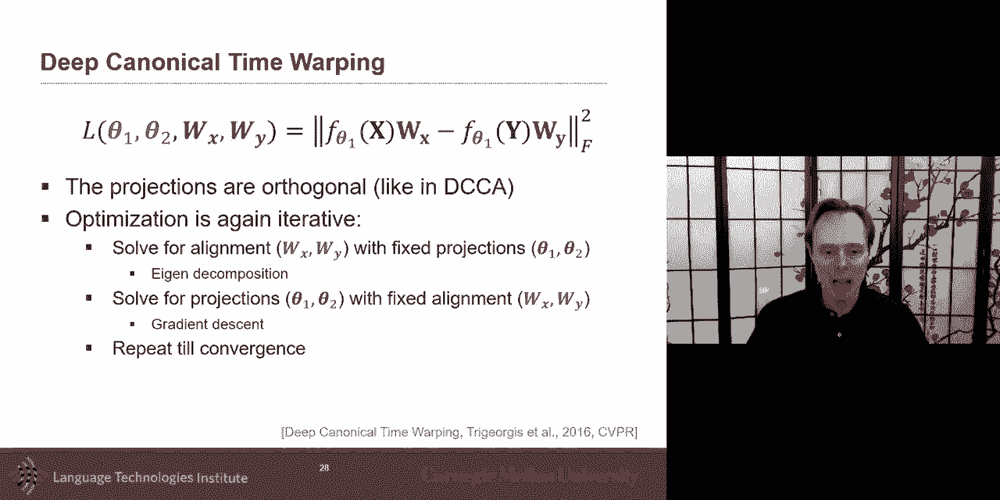

dynamic time warping is a very，uh key one that's been there for a while，but still very。

efficient um but in many cases，i don't have uh my，i i，want it i still want to do it uh。

i still want to um do，improve on this i want to be able to the，alignment。

but the loss may be something else maybe，about image captioning。

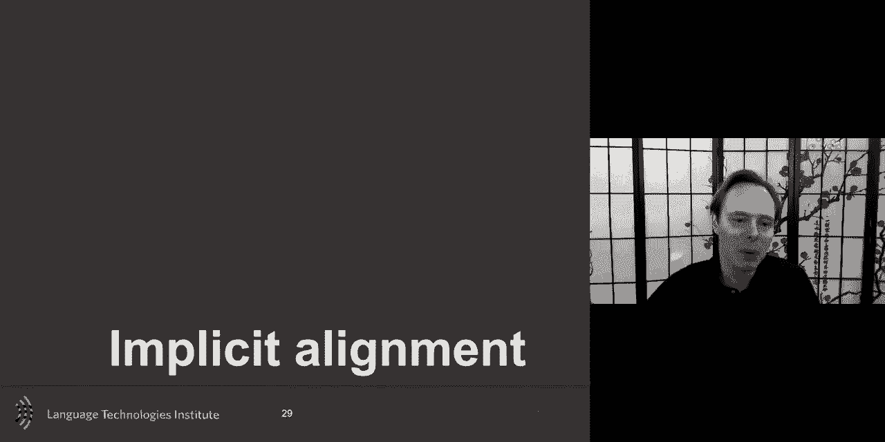

in this case we will do the implicit，alignment，so it's more like a hidden and so can we。

instead encourage the model to align，but this will be more of an intermediate。

step and there's been quite a few，approaches for that um and we'll discuss。

around week eight uh or seven we started，a bit in seven，about graphical models uh as one other，way。

uh to do alignment uh and，uh and to study how um，a random variable are are linked，together。

um uh some like uh，but for today we will look at the，gating mechanism if you remember。

elastims and gates，we'll look at an extension of this idea，of gating。

that has been named and and very，successfully，uh attention models um attentions are a。

gate like in an elastim you have a gate，so these uh weights that are the output，that's。

that's when you say it's a gates it's uh，you should think about it one way to，think about。

is like uh dynamic weights um，of this so um so the attention model。

is uh the intuition behind it is that，although let's say there's an image um，in in a displayed image。

um the eye will uh through the secade，and the fixation，will study will will be focused。

on a subset of the image at any point in，time，uh and and then the rest will be。

uh will have either less or no，uh um associated uh，it's，be，uh less information gathered there than。

in the center，um so the this uh four wheel vision，we only see high resolution about two。

degree vision，but because we move very quickly uh we，do pick up。

a a a more engroving vision of the image，but the four world vision is is a very。

high resolution in the middle of that，um you could talk i could talk a lot。

longer about attention and the，uh human side also the um，the offbeat uh of of attentions where。

uh we always in constant move and，although it looks like we're fixating，one thing。

it is often that you would move around，and that's a very interesting aspect of，human attention，this。

uh interesting and very complex aspect，of human vision，and simplify it with uh saying that。

humans are focusing on a subset of of，the image，or subset of the information at any，point in time。

so so certain words or certain uh，part of it image and this is also，relevant even when you。

are also listening uh listening we，are able to focus our attention on the。

subset maybe of the frequency，band uh or to be able to pick up，a certain person talking and maybe。

ignoring the white noise for example um，so the attention models are kind of，taking this intuition。

uh and and then expanding it，and the idea is to be able to have in。

between kind of your representation，learning and your task，like your your loss and to have these。

steps，of aligning uh information together，and be able to focus dynamically what，information。

is relevant for my task it will also，although there is this wonderful series，of paper。

that one of them is already i believe，a reading assignment and i really invite。

you to read or read the papers before，and after that one，um but there is a is attention。

uh interpretable uh that's a very，interesting，um and uh and then there's attention。

isn't is not interpretable，and attention is not not interpretable，is the paper。

i i suggested for reading so there's a，really interesting uh debate，in the community on this uh。

interpretability，but for now let's say the attention，gives a little bit more interpretability。

than not having attention，so let's let's just start with that slam，uh recent uh attention models。

uh there's been quite a few um and i，would like to，kind of categorize them uh in。

at least two or two or three categories，one is probably the most popular is like。

what's called self attention so let's，say you have，an image um you will kind of wait。

where to look at you're not gonna say，hey i'm only gonna look，at this eye of lp but more like let me。

focus more on the eye but i'm not going，to ignore the，rest it's going to be kind of a smooth，one。

and you're probably got the intuition，that having a soft attention will allow，me，um to um。

to to be easier for um optimization，like so it probably will help with the，gradients for example。

if it's a smooth another very，different view of it uh which is。

probably different from many of you have，thought about have attention if you，is like。

you get the um the image right now，and i'm not gonna try to focus instead，i'm gonna。

warp the uh the the，field of view to be only into the place，i want。

uh the information and this is most，relevant in the image world although you。

could imagine extending it，to language and and and multimodal，and the one that is the extrema and i。

would say it's one two three，one and three are differently related，one is can be the。

soft and the heart attention two is not，you should not see it as，in the middle like like it's an。

intermediate or hybrid，of those the number two is really a，separate。

way of of looking at this at least at，least from my perspective。

but a heart attention is the idea of of，looking at a a specific set of the image。

and often this can be modeled through a，stochastic process，and and optimized through reinforcement。

learning um，we'll discuss more about reinforcement，learning in，uh。

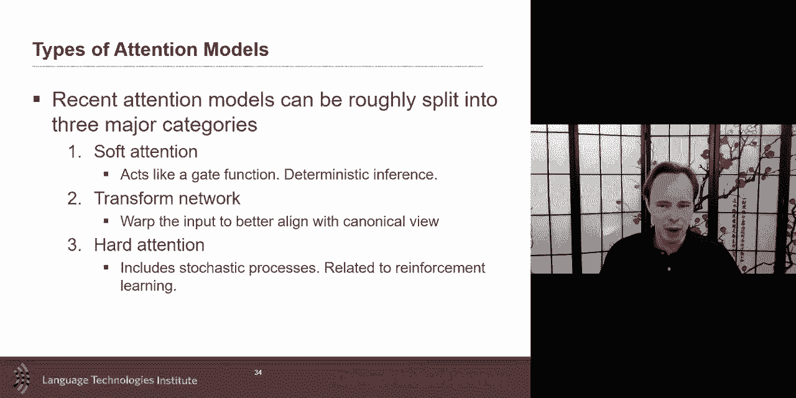

a first version of this an example of，hard attention，but they're the core of it uh to is the。

soft attention that's，definitely has been the uh the main uh，topic uh for a while and the extension。

we'll talk on thursday，is about um like self-attention。

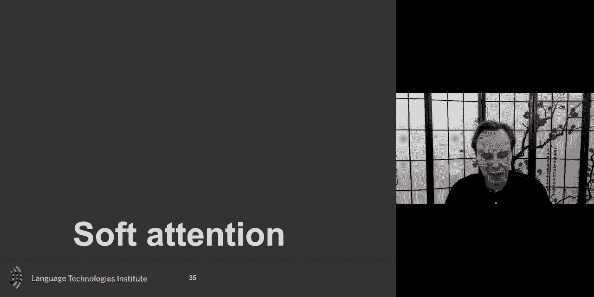

as an extension of that but as a way to，explain attention uh and also because，historically。

attention the first attention was，published，on machine translation so i talked both。

from an historic historical perspective，but also because it it's a slightly，simpler。

let me explain the the problem of，attention with the，machine translation so machine。

translation the idea here，is i have a series of tokens like words。

um and i want to translate from one view，of the problem one language into the，second view。

like the second language and so in this，case there are four words，four tokens four samples uh uh。

in the the first modality in the second，modality，in the generated one uh will have five，tokens that。

are generated um and as i mentioned it's，not a multimodal but，a lot of similarity there to the。

multimodal，so just to remember how we can do，uh sequence to sequence because this is，a one sequence。

and i want to generate a new sequence so，just a quick reminder from about。

uh two or three weeks ago um about，uh how the rnn uh，were modeled and so。

a quick reminder about encoder decoder，framework，so uh le chainz la plage um。

and so i'm going in fact the opposite，way in this example，sorry for the confusion i'm going from。

french to english here，so le chief la plage i go from la，chinese la plage。

i could i could have pre-trained that，maybe just，um that encoder just on french。

data uh i could have pre-trained the，heart-to-ring code，uh maybe by taking like one sentence and。

try to predict the next one，it's kind of kind of similar uh to the，word to。

extended to sentence level um and，uh you can or i could uh and at the end，of the day。

if i train that i get an embedding of my，language，uh for french and then i can use that。

to be able to start as an initial seed，to generate uh my words and。

and then generate the next word and and，going on until there will be in fact。

there will be one more prediction，for the end token，and so this is uh the typical。

sequence to sequence model but the，problem here，what are the problem is that the encoder。

hidden state capture everything in the，sentence，and so the what what's very challenging，here。

is you get possibly if it's a short，sentence then the rnn hopefully。

can get all of the information you need，um，but if uh if for some reason um。

the um if for some reason the，uh it it's a long long sequence，and so you want to be able to not only。

uh，be uh able to encode everything but，maybe，we'll use some mechanism like an，attention to in fact。

focus on the part of the sentence at the，time，because encoding a full sentence can be。

an issue a second issue，sometime is uh if we if you have a very，long sequence。

uh it's possible that rnn may remember，more certain part of the sentence，specifically like the late。

part of the sentence you could solve，some of it by a bi-directional inn。

but still a challenge so if you have，of，the european union economic area was，signed in。

august 1992 la costa la zone economic，states，such performance how can we do it in a，more。

efficient and hopefully more robust way，and this is what this，landmark paper uh did。

um and so the idea and i will do it step，by step，but before encode will just take the。

final so usually we'll just take the，uh encoding of all the words and and and，take this。

end point uh here we're not，uh maybe we still use an rnn to encode，each of them。

individually but we're not just going to，use the last one，we're instead going to say hey every。

word are important in itself，and then what i will do is i will take a，seed，start。

token like a token start and i will say，hey uh what are the words which。

word should i focus on as a starting，point，and probably as a starting point i will。

start with the first few words，and so i will um i will use a module，this is shown in blue here。

which is going to wait i'm going to say，hey let me associate a weight with h1。

a weight with h2 weight with h3 and，weight with h4 and h5，i'm going to associate a weight and then。

i'm going to do，a weighted average very simple and then，zero sorry for that uh and so what you。

get at the end is just a simple weighted，average that says hey，this embedding of le dissembling of。

shearing，have，let's say very small weight and then，this will give you。

the context and now i will use this，to predict the first word now i。

use the output of this predicted word，and say now that i predicted the word，dog，on，uh。

for that's why they're called dynamic，weights a little bit like a gate that's，a that's the same idea。

of a gate in lscm um i'm going to，weight，each of them sum them weighted average，give you a new。

z and then use that to predict the next，word，and then take that one and uh as a new，seed。

and decide new weights and then a new z，and you can do over and over so before。

the prediction of the words，was dependent on the previous words，and uh have all of this word。

now we'll make it in such a way uh，where the you have it uh not，using the same encoding of the words。

always but we're going to use a new，encoding，of the word at every time step and so we，have what。

the other some people call it an，attention module，i personally like the term attention，gate，like。

deciding which information you have all，these words，from uh from the source language and。

they could all be encoded in the same，z but here i'm going to decide that only，a subset of them。

at any point in time and dynamically i'm，going to decide，this weight this attention weight uh。

often people use the letter alpha i will，use this attention rate and this is just，a weighted average。

and that's what will define my attend，attended，uh information what you could call a，context。

uh into that and so these attention，weights，are in fact just scalar from zero to one。

on how important and you will usually，do it in such a way that they sum to one，uh that's。

often the case so that uh so that it it，forces it to focus，it can always decide to maybe um。

uh do i have a complete flat but，usually because of you the way you。

optimize you would put some constraints，to also make it，more peaky if possible so how do we。

determine，uh the alpha we want them to be，normalized so we'll often use a soft max。

and so then these uh these are kind of，the by default um uh these are the，output。

of how important each um，words is and these could be like a a，from。

plus infinity to minus infinity they are，the output of a neuron。

so depending on the kind of activation，function，uh they could be minus infinity plus，infinity maybe。

you you don't necessarily want them thus，far so，often the activation function itself，will either。

be zero to one or minus one to one，then，uh this is becoming just a normalization。

the softmax from this，and so the uh the core the gate，what will the gate do is the the gate，will be。

uh looking at um，at the um at the previous，seed that you had so，the previous one and then the latest。

seed，and then um and then just uh，find the projection to this uh for for，each。

so s here um the notation，uh just to to to make s is sorry i said。

c but what i uh meant is not it's the，sample s for sample，um and so uh in the case。

here so every s uh could be，uh here i use uh，uh so the hidden state as input。

uh to this uh in this case，um and and so and then so，the，so，the seed will change so that's why the。

alpha where it had two uh indices and，this is for the seeds，because the weights are going to be。

different uh，seed，and these in the case of the machine，translation，was at every time i generated a。

different word，i got a different seed and then i will，see for every word um um。

for every word and that way i will get a，different attention weight。

okay um and so basically we're running，using a neural network。

to tell us where neural networks should，be looking，so it's kind of interesting so we have。

the encoder，it's a neural network we have the，decoder，it's a neural network but then we have。

this other neural network which you，could almost see as a multi-layer，perceptron or something。

um that that's this gate that is going，to tell me，uh where where should i focus my，attention。

and so that and now，how should i do it i could do with a，simple like i said。

put it here multi-layer perceptron but，you can make it as complex as you want。

and which input you can put there，there's a lot of varia variations on，this。

uh maybe you could use all the seeds，only the，currency uh maybe you could use on all。

the words at the same time，and instead of just one word so if you，time。

maybe you will make this as an rnn，instead so we can use rnn。

gru lstm we can make it a bi-directional，so the attention，could be bi-directional the all of the。

above，so the main key here is as long as it is，differential，as long as you can get the gradient and。

then you can do back propagation，and so um once you uh，train your model at test time。

you get your sentence you go，uh and uh you with the first seed，we'll find like the start token for。

example，find which word are the most important，for that first or a seed。

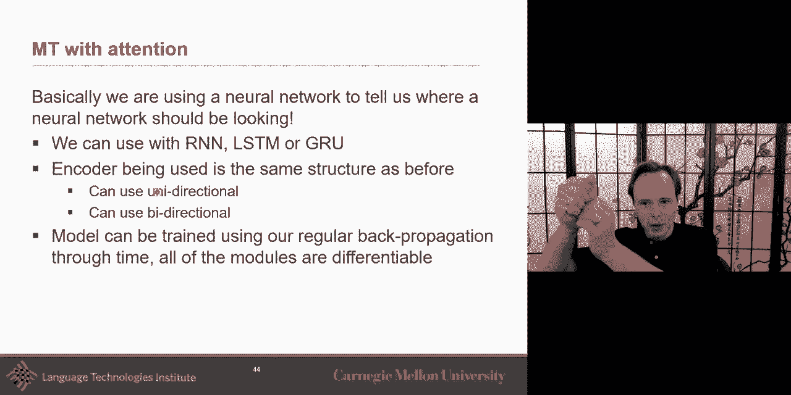

you will use it to make your first，prediction and you go over and over。

you can plot this and that's why，many people got excited also with，attention because they were like。

oh this is a this is uh definitely an，improvement，for interpretability because suddenly。

i can get and see for generation of d，uh what was the word the，token that was the most related or。

useful for it，and what's really nice is french and，english will have often a different，ordering。

uh with adjective and nouns so so the，greenhouse will be in french。

will be the house green uh and so there，will be，and you can see it uh very clearly。

uh in this case so zone economic，european，will be european economic area so very。

different and you can see it also。

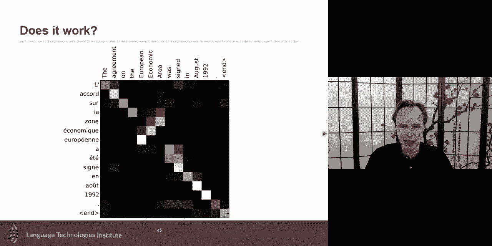

nicely coming out there and，on top of it the most important is that，it improve。

uh classification and so，how uh it gives a soft alignment between。

sentences it's done in an iterative way，and that's where um the other。

uh self-attention that we will talk next，thursday will allow you to do it all at，the same time。

aligning all of the component at the，same time，um but right now we did although。

we look at all words uh for the french，for the english we were only doing one。

at the time the module the attention，module was called，one at the time but how do you do it。

multimodal，the word to word that was great we kind，of words were，very nicely segmented they are like。

tokens by default so，you can decide where to focus but what，if you have an image of like。

thousands of pixels by thousands of，pixels，how can i uh use attention and do it in。

the multimodal way，and very quickly when the machine，translation uh。

attention model came out very quickly，there was this nice landmark paper。

on show attend and tell um and there，what was nice is that they were showing，for image captioning。

as you do the captioning of a woman，is throwing a frisbee in a park。

um the idea here is that every time i，generate a word，to see which in part of the image will，be the。

most helpful and now so some words，it's，like where would it ever like look at。

this part of the image very ambiguous，but in the case of like some entities，women you could say。

both are the gender uh，female definitely there's a girl and a，woman but let's say that their。

algorithms still see both of them is，uh is embroidered but then throwing。

clearly is force kissing more on the，frisbee，uh now if they definitely the word。

frisbee is even more focused，and the park is is looking around and so。

so this is nice this is and now you can，see a little bit，the challenge of interpreting。

integrating this，attention module uh as you can imagine，but，how can we do this with uh current uh。

representation so most of the，visual representation will use uh cnn。

uh representation canon uh mechanical，but correlation，uh convolution。

sorry i had too many c's recently，convolution neural network and so。

the goal will be to take advantage of，these representation，but if you want to do the uh typical。

cnn for for cnn for，uh image captioning so we'll take the，cnn。

get a feature and then from that feature，use it as a seat for the，uh rnn as a way to generate。

um but uh if we use the latest，as uh like if you remember the cnn。

takes the image you have a convolutions，uh you have pooling convolution pooling。

and then at the closer to the end we'll，have a few，fully connected and then we'll have your。

vector often of size 3000。so one question is can i use that vector，of 3000。

but the challenge there is then that，vector of 3000 doesn't have any more。

link with the image and the spatial，aspect of the，image because the first dimension of，that 3000。

doesn't mean it's any way related to the，first pixel，it's，uh it will not give us nice special。

information so instead what we'll do is，roll back，two layers before that and look at the，last。

layer uh that is a，response map to the convolution and that，say。

16 by 16 or let's say even simpler four，by four，they have a they are the response of。

convolution kernels which are like，patterns or convolutional kernels。

related to one part of the image if it's，four by four，then it will be closer to the top left，corner。

um and so now you have values，that are not only informative about what，is，um。

and if you remember you'll have maybe，four by four，but you will also have a third dimension。

which is all of these convolution，kernels，and so now you have a kind of for each，of these four。

four by four let's say 16 locations，you have a vector of let's say you have，50。

kernels for the last layers so you have，a vector of 50，times 16 so like four by four so you。

have a vector，and so now what you can do is take a，seed let's say the token start。

and and then learn some attention weight，that will say，them，are the most important given my initial。

seed and then it will look，at these uh four by four，and give a weight and so how many weight。

do you have，if it's four by four 16 you have 16，weights，and this will be uh these weights will，be。

so you，have a weighted average which will be，weight，weight，another vector of 50。 one something。

that's a little bit confusing，is you don't get an attention for every，kernels。

you get an attention on one vector one，value，one scalar for the whole vector of 50。

but you have 16 of them because you have，every location in the image。

and then you get uh you uh so z1，what how what will be the dimension of，z1。

50 1x50 okay and then i can use that，uh to predict my first word。

and i will also use that seed to predict，my new attention，and then i can use this attention to。

predict the next z，the next，words uh and then and and then continue，like this。

and so what's really nice here um is，that suddenly，i found a way to take an image and，attend。

uh to part of the image now，what are the issues but with this uh，what。

do you think this is the perfect way，of four by four like this is it the，perfect。

way to attend uh to an image，like uh take an image like right now。

uh that of me and like is it really the，right way and maybe i'm lucky because，the face。

is is within one but maybe my face will，be cut in half，and then so half of my face in one bin。

and half of their face，now as you know the convolutional kernel，are kind of overlapping。

so um so they're not exactly，uh cutting it that way but still the。

objects may be in one of and not the，other，so for that reason there's also other。

ways to look at it which is more of an，object base where you will first maybe，do object。

uh detection and characterization of it，like rcnn，and then you could do attention on top，of that。

which objects are useful for the，prediction，but in general self-attention allows for。

latent data and alignment so that's an，implicit，it allows us to get the idea of what，network sees。

and can optimize using back propagation，and also it was really interesting to，see all the extension。

there was the initial paper about show，and tell，which was just about image captioning。

and then a lot of other papers after，that，um which was uh extension of attend。

uh on this a really entertaining papers，name。

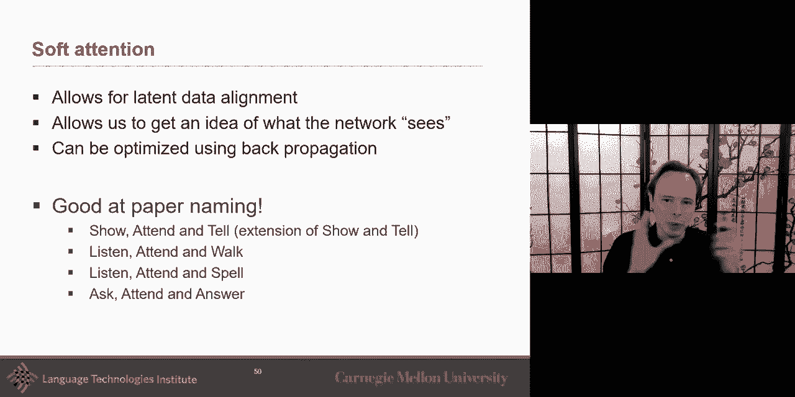

um so this is self-attention that's one，of the three，that i want to discuss um i want to talk。

about spatial which is i will say the，most relevant，um for uh images but i。

i want to put this seed in your mind and。

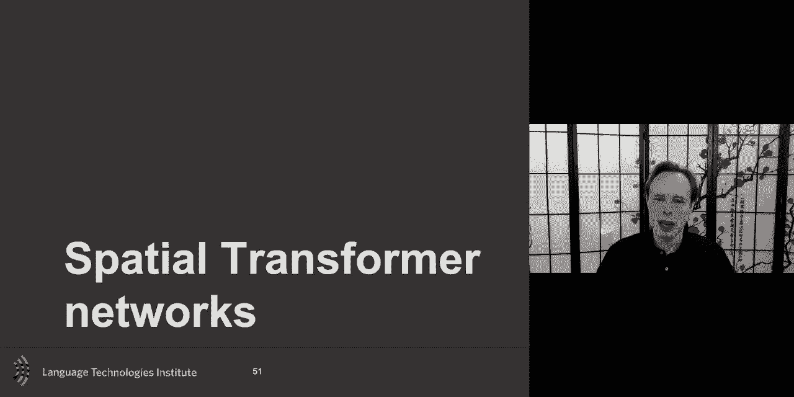

maybe you think of a way to make it，so i said one of the challenge is that。

in the typical attention is that i will，take a grid，because i use the last layer of。

cnn uh or the last convolution response，layer，of the cnn and um and then i will。

uh select a subset of these uh，object，is only in the sub part of it。

and so really they will end up in more，than one of these，elements of the grid and so for one i。

could do it，an object-based approach but，another way to do it that it is say，let's really focus um。

focus on a subset and so let me，find a spatial transformation，um and that comes from the computer。

vision world，special transformation will be can i，warp，the image in such a way and it's like as。

you could call it，how can i crop i think that's probably，the term that people。

and every day will will uh will relate，to that，in computer revision i will say uh maybe。

a warping function but just here，well how can i crop um，the image so i have the original image。

and i want to crop it in such a way that，i can do my task，which let's say is object detection。

let's say if it's purely vision，or it could be image captioning i want，to，do the um the the the。

um captioning and so as a first step，i'm going to focus on a subset of the，image。

and then start my captioning and then，focus on another subset，there's。

four parameters that are typical which，is just a box，around uh the object and so it becomes。

the offset and the width and the height，of it and then you become your you have。

your image of the crop image，and so can we make the problem with，cropping。

is like it it's it's by default is a，very，like，one minute you're like you're like with。

the whole image and，and just the second moment you're with a，very similar but so。

so it's a very uh um，a non-convex by default maybe so，smooth，process is like um a。

instead of a very sharp process is that，you will find，that function that that learns this um。

this uh these parameters you will，learn a mapping function like from an，image。

find a way to uh predict those，parameters，and this is what we will call the。

spatial transform network，and those for this i need to um，introduce a concept uh um，is。

different kind of transformation there，is the perspective，transformation and that's what makes it。

so that my hand looks bigger，and looks smaller here that's called，perspective。

projection there is also what is，displayed here，is a fine transformation um there's。

other transformation where，i could rotate my screen um so that's a，rotation。

that's a rigid transformation um，and so so the idea here is i can take。

em points from any points in my image，here，and i can apply a transformation and get。

the location of that equivalent point，in this image so instead of looking it，as a cropping，where。

you have a warping function that says，give me any points here，any point in the image and i will find。

you，multiply by this matrix which are going，to become our new parameters。

and i will give you a location in the，target，after the warping and the。

idea here uh is that these will become，uh parameters that i'm predicting and so。

i'm gonna have a gate，that is gonna take the input image，uh and not do the warping because i。

don't know how to do the warping，yet but i'm going to take an image and，that image。

as an input go through some kind of，attention or like gate，to create these parameters and these。

will be used to create the image，and then i can use this and just confirm。

that the attention was correct or maybe，i will，need to wipe again and and over and over，and over。

over，so this is visually what it looks like，is like you take，original image uh and then you will。

take that image run it some through some，neural network give you，those parameters that tells you hey。

this is how you should uh，warp，image into this and so you can see that，this next network can nicely。

be optimized and you can nicely uh，do the gradient uh back propagation，uh and so now i can learn。

give me any image i can learn how to，warp it to be as efficient as possible。

for my task my task could be for，a generation of language，or for in this case object detection。

um so the and this doesn't need to be，complex in practice，uh and the sampler is this uh。

function which is the warping function，that warps，um this this is a little bit in the，sense warping。

in the same the dynamic time warping uh，we were warping，each sequence to be but we were warping。

both sequence together in the dynamic，time warping，here we're warping only one sequence but。

it's not a sequence it's a 2d image，just so that you make a link with，earlier in the lecture。

um and so um you get，an input image uh and then you get the，warping which is the output。

and then you get the um so even though，the image originally is very，uh warp or you could say more。

and then here you get hopefully and this，is a lot clearer，when the object is rotated and then at。

that point you can do a nice rigid，uh transformation to take that rotated，object and bring it back。

so this example uh here they're plotting，and their points，uh are just uh the corners。

of that uh bonding box uh，and so you can see how this is nicely，abundant um so this。

is differentiable uh and it allows you，to do back prop，of，um ways you can do the。

transformation so i talk about a fine，transformation there's perspective。

you could do a spline version of that as，well，so this is the second type so it's no，more。

like attention a gate to weight my，sample but it's an attention and gate。

to find that the output of the attention，gate，is not directly the weights of how，important is。

but it's mostly a parameters for a，warping function that will allow me to。

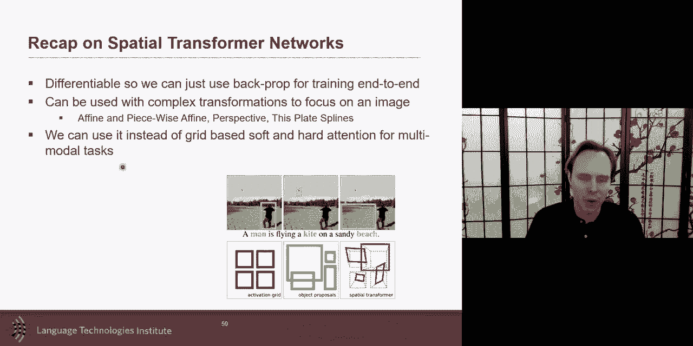

focus，and then the third one is attention and，i'm gonna talk about，discuss，discuss。

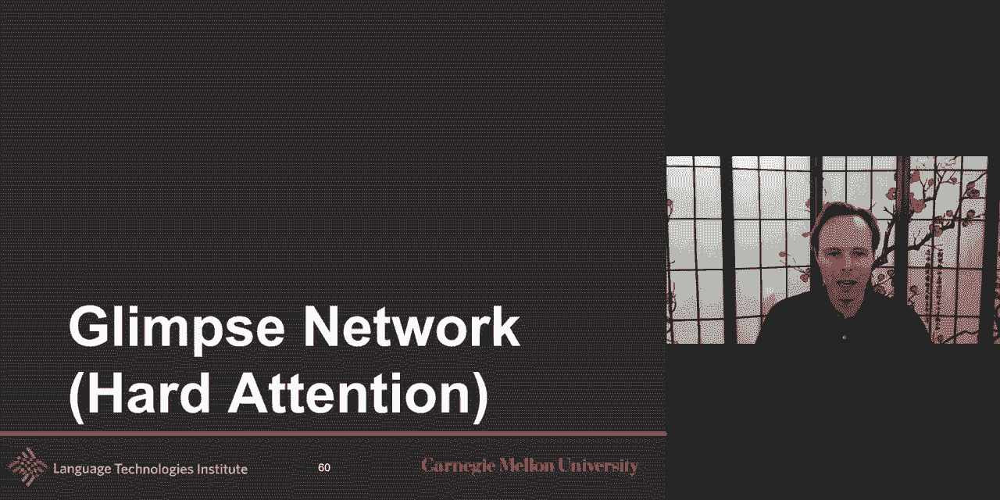

reinforcement learning uh in week nine，uh but here the heart attention is，example here。

is it limp so the suff attention require，computing representation for the holy，mage。

the heart attention says only a subset，is going to be uh the main uh，is going to be my focus uh。

and uh hopefully although it's debatable，uh is as they also reduce computation。

and you could say it's a little bit，closer to how maybe the human does。

um although it is also a little bit，smooth the human，um so what's the second keeps moving。

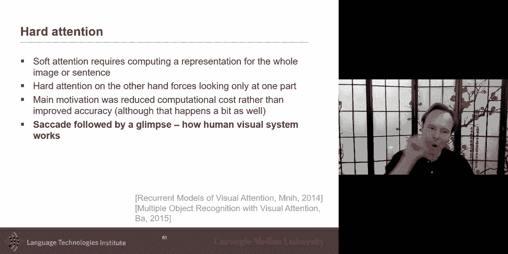

around，and that's the intuition that you get a，little bit from it so。

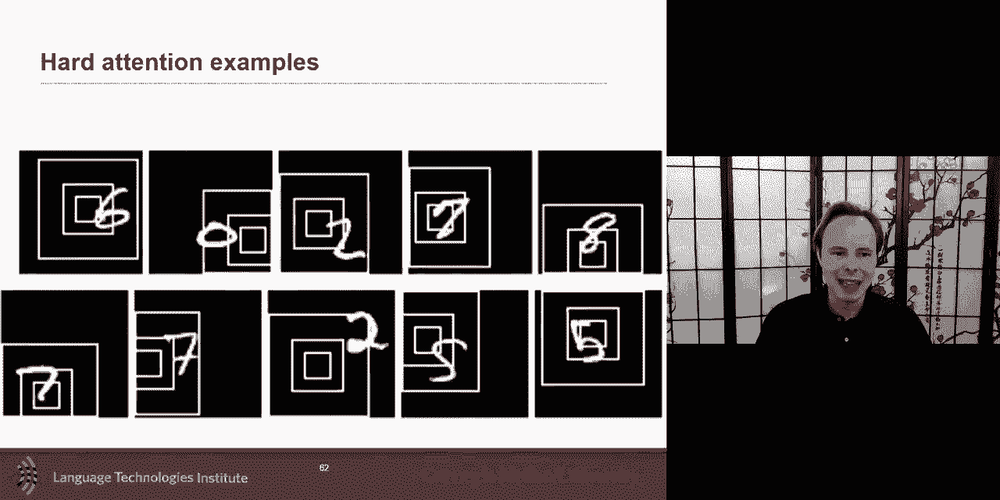

so that if you're detecting a digit the，idea here。

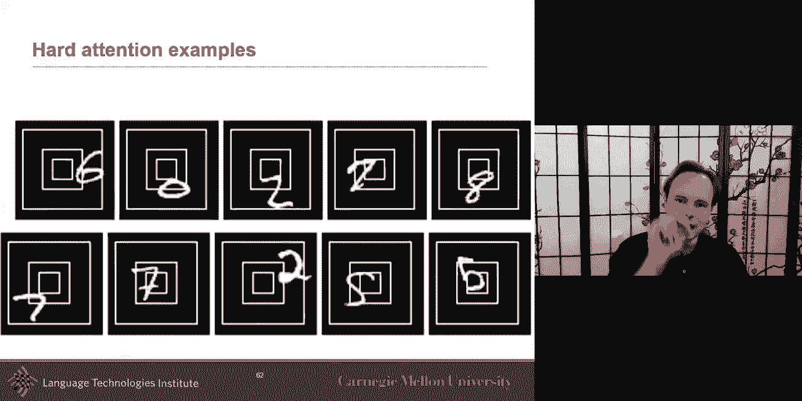

is that you will look at pieces and so，uh so if you're looking for the word the，the。

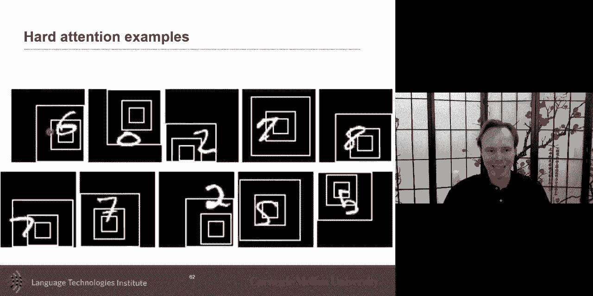

the six you may be looking a little bit，more。

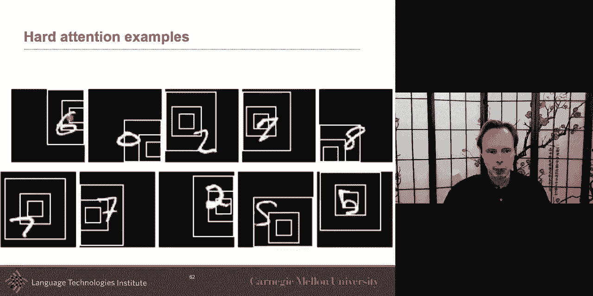

in this region but still looking around，just to be sure that。

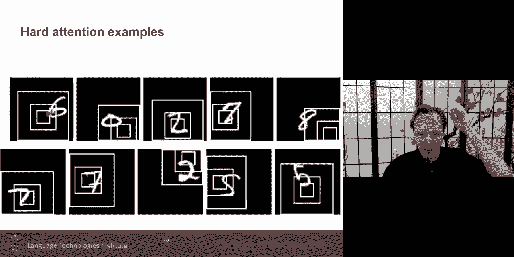

it's not a nine or it's not a seven on，others，so you'll start maybe somewhere and then。

you will look around just to be sure，that。

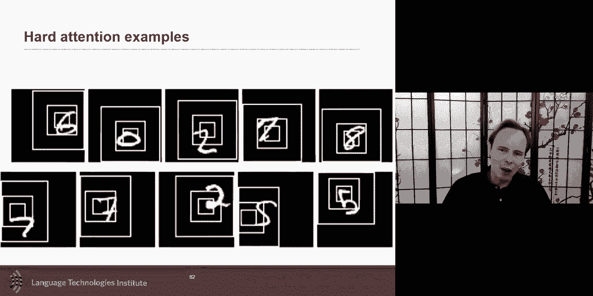

uh it is the digits you want now，they uh in that exact paper they made a，decision。

which um i would say is not a，requirement for this uh，i had attention but just so that you。

which is the idea of，uh having the very sharp，evil like like a very sharp attention。

with high definition and then with，having lower resolution，and lower resolution so the same image。

is in fact，there is this for the same glimpse you，get three version of it。

this is really what i would call heart，attention but you uh，in their papers they also include both。

the others a little bit broader and you，can see，that this will help you because if you，only see this。

it may be hardware to look next while，this can give you information on where，to look next。

so once you given an input image and，and，location then you can get these uh，pro，pro like a a。

response to like uh like where to focus，maybe，just the location itself and take that。

location and embed the location so you，kind of have a，position embedding which we'll talk。

about in the，transformer you could imagine although，it's it's done differently。

um and here you have a more appearance，embedding，and then we'll merge both of them so you。

can see it as it encodes，what like is that that's position and，where。

that's kind of what this is encoding but，the problem is how to optimize this。

uh so it's differentiable with the，with the location with the glimpse，parameters。

but not the location um because it keeps，moving around，and so to help with this we'll go and。

look at something that's a little bit，close to reinforcement learning。

and so in this case uh you have your，location and you have your uh，your image you will。

learn uh to this this part is the same，module i was talking，about earlier which is embedding the。

image，and then from there you will，predict an action an action will be move，left。

move right move up move down uh kind of，action，once you get that you get a new location。

and then from the new location，you go ahead and you embed the，the glimpse and then from that glimpse。

you're gonna get the next，attention and this at the end you can。

be sure there is consistency over time，by having it as an rnn，the that's what the rnn here is。

so you can see the similarity with our，reinforcement learning uh for people who。

uh know already about it we'll discuss，it um，and the emission network this part is as，an rnn。

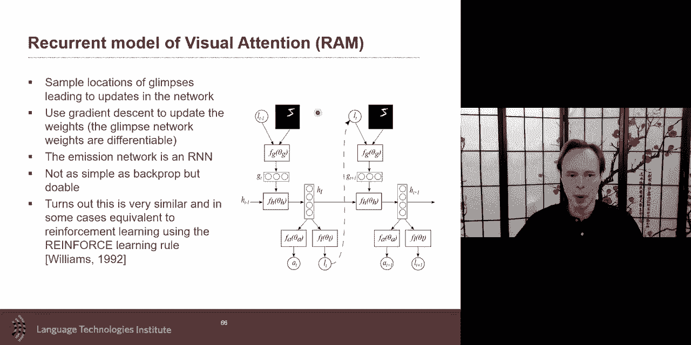

and the back prop is is doable uh，but it is a little bit more tricky in in。

this case，so today and this is my last slide，we talked about a pla explicit alignment。

the idea to align two or more modality，and here in this case the the loss，itself。

is uh the task itself the loss itself，is is is alignment uh dynamic time。

warping extension to canonical time，warping，and deep canonical time warping um the。

implicit alignment which is the most，popular one，will be uh it's not the loss but looking。

at different attention model，and so self-attention heart attention，and also。

a different view on where the attention，is giving you the parameters。

of another model which is in this case，was a，transformer model okay thank you very。

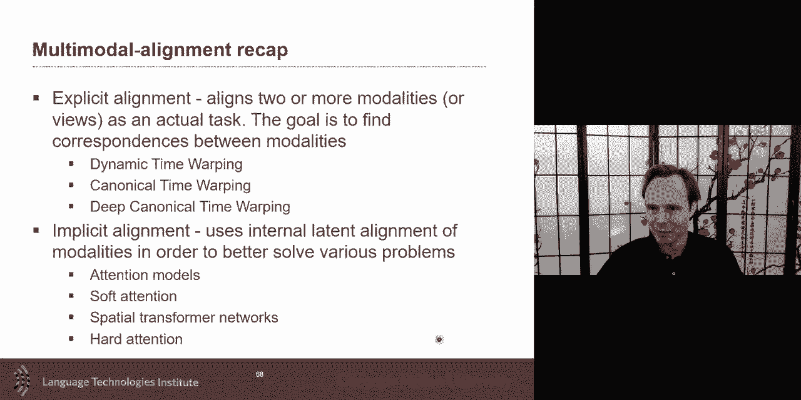