# 【双语字幕+资料下载】CMU 11-777 ｜ 多模态机器学习(2020·完整版) - P13：L8.1- 判别式图模型 - ShowMeAI - BV1Pf4y1P7zc

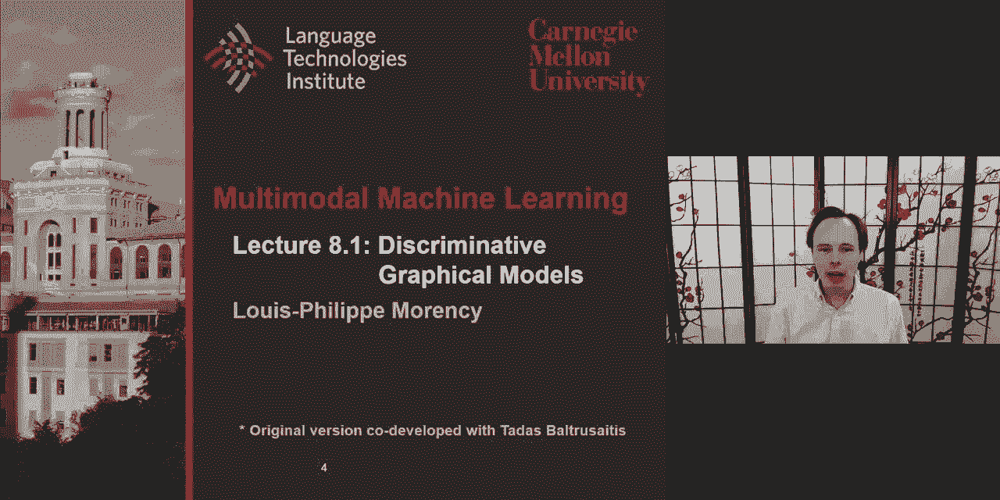

welcome everyone lecture 8。1 on，discriminative graphical model，the objective today's is to。

build on the lecture from last week，where we talk about，the bayesian network as one part one。

type of publicity graphical model，now we'll look at the other family of，model。

based on marker random fields um these，have a great advantages，um they also allow closer。

compatibility from an optimization，perspective with，uh neural networks and so they bring。

some natural building blocks，and we'll look at some architectures，building from these。

uh conditional random field and then，extensions to that，so that's the goal um before i go in the。

lecture itself i just wanted to revisit，the last few slides from the last。

lecture because i had to wrap them up a，little bit faster，than i wanted so i'd like to go back to。

these a few，uh slides and also give a quick summary，of the past few seven weeks。

so that it gives us um a nice building。

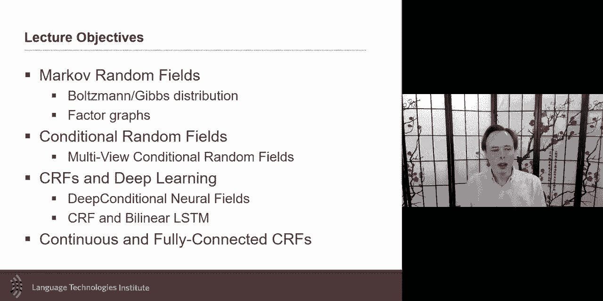

block for，for the rest of the lecture so i just，want to talk uh。

about bi-directional and cycle gun in a，little bit more details and。

going through the slide and giving you a，little bit more clarifications。

uh as you remember some of these，generative models，by having this discriminator and，generator both。

say，that gives very realistic images i think，a great example was this，talking head where you have a。

source face in this case of painting，and you have on top of that condition，you have some。

other information maybe the facial，landmarks，and using that source image the fa the，conditional。

and then the random vector then you can，generate，uh images in this case uh。

generating the um the faces the talking，head，and so one of this type of architecture，for that。

is the um the infogun as an example for，that in this case，in the info again if you remember the。

main part，of the generative adversarial network is，those random variable。

z um and that's a random variable uh，um and and and so the idea is that you，could use。

any of these z and you should get a，synthesized image，from the generator but uh。

the the key aspect here is that，synthesizing mage will be compared not，compared directly but the。

discriminator will have to make a，decision if that's，image is real or not is it a real image。

or is it a synthesized image，the conditional again is bring that step，further by saying hey。

when you generate i want to also take，into consideration some extra，information。

maybe it's a class like you're telling，you generate an image of a cat。

or in the case of the example that i，showed earlier，is maybe landmarks and so these。

landmarks will be，points on the face and this will be，given to you so that the。

the generation of the image takes into，consideration those landmarks。

the infogan does it uh in such a way to，be sure that the，see，a，at the end discriminator。

also needs to correctly classify if it's，a cat，or if it could be also a regression task，if it's a。

landmark so this is the，typical again uh but i want to talk，about two extensions from that。

um the first extension，main，goal of this whole gun is not to really。

train a discriminator the discriminator，is just there to help me。

the real goal is to train a generator，and this whole framework，allows me to train a generator but。

maybe i also would like not just to be，able to train generators going from。

my random variable uh to a synthesized，image，but maybe i would like to go the other。

way around i would like to be able，to train an encoder that takes an image。

and encode it into a lower dimensional，representation，and that's where the bi-directional。

comes in and，and the key aspect that i maybe have，glanced over，last time is that you will do two you。

will train，two things at the same time you're，trained border generator。

and an encoder uh both at the same time，and the the the the interesting part，here is。

for the generator the input will be，some random vector uh and then you can。

synthesize any image from that，and here you will take some really，majors and encode it。

um and so and there what it is，interesting，is that the discriminator will have a，double task。

and and find out is it uh is it，like uh really made uh，with uh real encoding。

but in a sense of encoding a synthesized，encoding of a real image so synthesizing，coding。

and synthesized image or will it go with，a really major and a real random vector。

and so it will do it has those double，tasks at the same time and，when you do this that allows you to。

train not just a generator but also，the encoder at the same time and as i，talked last week。

you could also have done that maybe by，having an auto encoder。

as the input and we'll discuss a little，bit more this next lecture，8。

2 the second part which i also went a，little bit quickly last time and i want，to discuss。

again was like i want to in there a lot，of cases where you don't have this，beautiful。

pair data like you have data between，uh maybe a an input in an image and an，output。

but there's many cases where you would，like to generate，the condition maybe on x you would like。

to generate，y uh but you it's great if you have the，pair of data like hey i would like。

condition on this，generate this image but there is maybe，cases where i don't have the exact，pairing。

i have maybe a bunch of painting of a，specific，um artist uh and maybe images of。

the real world but i i don't happen the，artist，and the exact image of what they were，painting。

so while do you end all this kind of，unpaired data，so you have like x and y and so you。

you have like you would like to be able，to condition on x to be able to generate，y。

but you don't have the pairing and the，idea here is really cool of cycle gun。

is really interesting is the idea is，that okay it's，it's i want to learn this generator g。

that's that's what i want to learn i，want to learn how，based on on x i want to be able to，generate y。

but i don't have like to be sure that，the y was done the right way i don't，have that。

exact pair of thing so what will i do i，will say hey，what if i had impact 2 generator i'm。

going to learn one that goes from，x to y but i also want that learn，just。

like how well did i regenerate it's，almost a，you could say almost auto encoder uh。

like you you encode and you decode，uh you could imagine a bit but it's not，just any kind of uh。

intermediate representation i'm gonna，learn here，here i want to learn one that in fact。

look like something，so for that i will in fact having two，losses。

and that's the interesting thing is i，will take a some image from x。

i will generate y and but in such a way，that the y，is able to regenerate that's kind of the。

auto encoder，but i will also do it the other way，around where i will take some image from，y。

generate an x and generate back the y，weights，so that the g's are the same in both，cases and the f。

are the same like the same generators，and the same weights，then there was really nice i have two。

losses i like trying to make them，whatever i created i synthesized as，close to。

um as those as their original，by by by tying these two together and by，tying these two。

i will in effect being able to train，uh uh jointly um like both generators so。

i will be able to go from，uh x to y and i would have got for free。

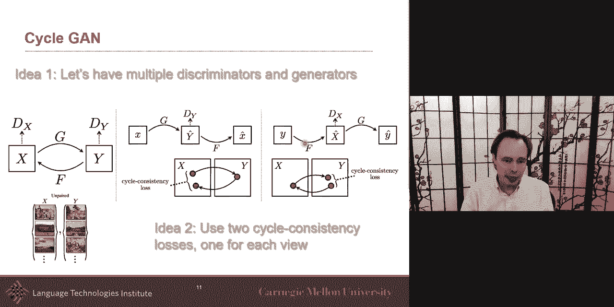

also the y to x if i need that as well，and that was really uh impressive work。

that came from that the results，uh from a photograph and then because it，knows like the style。

of a specific uh painter uh，gogh，suzanne or some other painters will be。

doing that and they will if you have，your x and y，maybe both are images but some are taken。

during the summer some are taken during，the winter，even though you don't have the exact。

same landscape in winter in the summer，you can swap them around so that was uh，really pretty。

really interesting so this is cycle gun，there's a lot of great things with these。

architecture a little bit，on the challenge on the optimization um。

and we'll discuss a little bit more that，next，lecture but i want to talk today。

about probably it's a graphical model to，continue the lecture，on uh on bayesian network。

and to be able and one thing i wanted to，do is like to be able to put that into。

the context of the whole course，like we're in week number eight where，are we。

in this uh and because we had those five，challenges and we look at representation。

we look at the representation joint，representation，and coordinated representations we。

also we were not done with，representation we also look，again isn't also a way to learn。

representation and，we look at we'll talk next uh next，lecture。

about variational autoencoder this is a，data，your multimodal data uh efficiently。

uh that taken into consideration the，complementarity between modalities。

this will help a man this will help，um a second challenge was alignment i，have a line。

amendments from different modalities i，want to align，we look at all of the attention-based。

models the self-attentions，and also look at techniques that look，when for specifically for time。

series like dynamic time warping，as an example and we looked last，week at extension of that also。

uh with the soft dynamic time warping，and we look at a few of those examples。

and then we look at translation models，like uh，and one example that i i particularly。

like was the module network so，uh as an example of translation and as。

we know for translation to be successful，in translation，you need to be able to do good。

representation and good alignment so，translation is really building，on top of that the lecture today。

and the lecture like the last 7。2，lectures，was really about fusion and it's it's，it's about a step。

further than representation，enlightenment and it's about fusion。

and it's about doing the prediction uh，and and it's multimodal prediction and，so。

when we talk about fusion it can be，sometime a little bit，uh ambiguous and maybe sometimes。

confusing to compare，fusion and representation learning and i，little bit，in in uh somewhat uh uh。

getting a little bit more detail about，the taxonomy that that we're using in，this class。

the diffusion is if you have to，look at it from like input and output。

representation learning is the idea that，i have some input data，and i want to learn a way to better。

represent and better，is is on purpose i'm using it in generic，sense it could be better。

because it is smaller like，less more compact it could be because it。

it summarizes the information it could，be because，it emphasized some aspects like semantic。

out of it so this is representation，learning，but at the end of the day in many tasks。

you have a prediction to make a，prediction，uh because it's maybe a classification。

task it's maybe regression um，or could go all the way to generation，but we often will go。

there with more as a translation task a，translation where you're generating。

but in many cases you're predicting but，what you're predicting like let's say，you're predicting。

emotions uh but you're also predicting，maybe，um let's say the personality or you're。

you're predicting uh like is it a noun，or is it a verb or some aspect of syntax。

um these predictions uh，also can have some enter these labels，could have some structure in it。

and and and that's where these，graphical model and that's where fusion，comes in。

it's like when you it's time to make，that prediction，there there when does fusion and，representation。

fusion is closer to the end point like，it's it's like closer to the，final prediction and it's true。

that in neural network for many neural，networks，it gets ambiguous where the，representation。

ends and where does the final prediction，happen，is the final prediction only the last，layer。

and everything else is about，representation learning，it almost a little bit philosophical so。

i will not in this class try to argue，where does fusion and representation。

learning ends and start for neural，network，but for some other model like。

probabilistic graphical models，there it's a lot more obvious that these。

are a lot better or probably better，suited for fusion，because one of the great advantage of。

probabilistic graphical，models is that you can integrate，them in them a lot of domain knowledge。

you can bring domain knowledge that we，got，from talking to experts or from initial。

analysis of the problem，or you can also just create a research，hypothesis。

and then test it by testing different，mod，graphical models and so domain knowledge。

can be done because you have knowledge，about the latency of structure。

by latent substructure i mean their，labels may be like，emotion like this is what you're trying。

to predict，but you have knowledge that this label，to be predicting it well，some。

models experts have studied this process，week，emotion if you take the appraisal theory。

could be seen uh can be formalized，uh with a structure that looks at，balance。

how you perform and how much effort you，put gives you some aspect of balance。

and that will also focus the focus，how much you focus on the uh as a person。

will all come together to uh，your，graphical model allows you to put that，domain knowledge。

now how do i infer，learning performance and focus this is，where representation learning will come，in。

and that's why if when i'm thinking of，graphical，models a neural network working together。

i think a lot of the graphical models，makes，more sense on the later part like closer。

to the label because，that's where you would like to put the，domain knowledge and for the。

uh more high damp high dimensional input，data，then let's be data driven and let's just，use。

really good infrastructure that we got，in neural architecture to get a better。

representation and so graphical model，allows you to learn uh if you have，knowledge uh。

uh with what is uh uh underneath your，emotion something that's latent。

or there's also domain knowledge between，your labels，and so maybe there is knowledge that。

like certain labels，there's a structure between my label，there's like。

there's like example here is the，temporal structure meaning，my emotion at time t is very likely to。

be dependent of t minus one，this is an example where there is，temporal information。

and so at that point graphical model can，help uh，example of structure prediction image。

what's called image，some research called semantic，segmentation，i could predict every pixel by itself。

but predicting if is this pixel sky，is this pixel sky and doing each of them。

independently does not make sense it，makes a lot more sense，to take into consideration my neighbors。

my neighbors pick neighboring pixel，uh er will uh when i predict my。

uh label for this pixel or for this，pixel，like，all together and they should i should。

take into consideration all of those，prediction，should be coherent together and so。

another word we could almost say is like，that structure，we want to enforce some kind of，coherence。

in my labels and that's an example，in language uh it could be from，dependency。

so if i'm predicting what is uh maybe，the part of speech tags from this。

uh or from this word uh there may be a，dependency，uh between like uh coherence or。

dependency in uh koreans，in like predicting them and so i want to，predict in them。

uh maybe and take into consideration，that structure between the word that，link that coherence。

and that's what the graphical models，don't do，so well or achilles allows us to do and，so。

these are two examples and so last，lecture we talked about，bayesian networks as a way to be able to。

model，this like take that domain knowledge and，and model it，and they're great and i still love the。

bayesian network very much，but they come with a challenge and and，when it comes time to。

take bayesian networks and on top bring，them with neural networks。

uh um optimizing them gets a little bit，challenging it it and。

it's part of the reason we don't see as，many of them probably。

working together although there is some，great work，uh pushing that envelope in that。

direction but the optimization，is always one of the sticking point，there，the markup models uh nicely。

and and their formulation brings a，formulation，that streamlines a little bit more the，optimization。

and bringing neural network markov model，is a little bit more streamlined and so。

so i'd like to discuss them，this lecture and gives you examples that。

bring neural networks and markov models，and to uh kind of introduce markov，models i。

will do a small historical detour also，because，multimodal paper multimodal paper using。

neural network，was in fact using some。

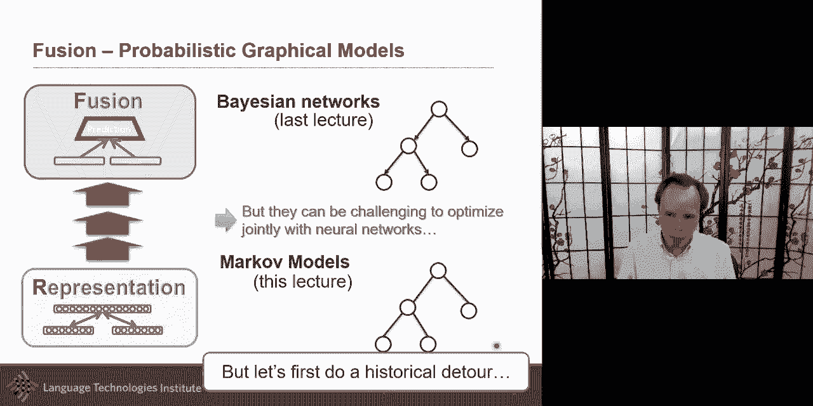

very similar paper similar model to a，markov model，and it's a restricted boltzmann machine。

and i said i will revisit it so，i promise that so i will so let me。

revisit the restricted bozeman machine，as an introduction。

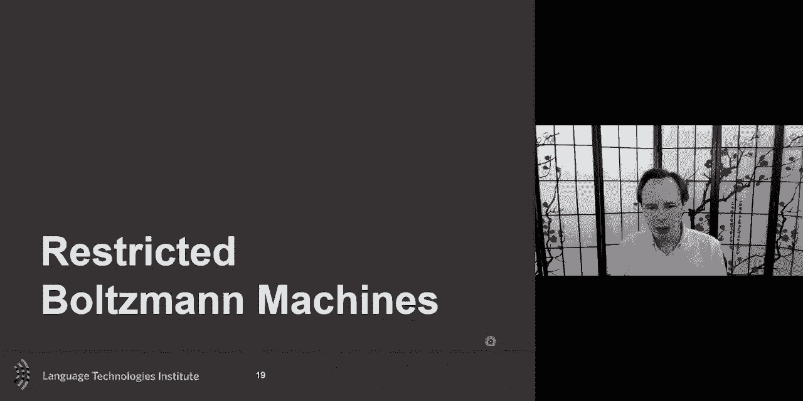

for the markov models and the，conditional random field specifically as，a markov。

but if you uh remember and i'm there i，you，the bozeman machine uh was in fact one，of the first。

uh paper very close in time with the，mults model auto encoder papers。

um and there one of the key aspect of it，is that this is a generative model an，auto encoder。

uh go from text go to the intermediate，representation，all the way uh auto encoder will be go。

to the text and go come back，oh the multimodal intercom encoder was。

going to the intermediate and recreating，the text or recreating the image。

the the generative model what it means，and now you know it because of the last，lecture。

generative model means that i'm modeling，the joint distribution，um and so i'm modeling the joint。

distribution between，in this case between text and images and，it will be trained。

uh also by also looking at the joint，objective，with text and then the hidden，representation。

and so you will from a training，perspective，would do it layered wise that's what we。

hinted at earlier on um before going，into the math，of this of this model i just want to。

remind you that one of the advantage of，it，from a joint uh from a generative model，perspective。

then if i if i have a joint，representation，i can decide to go either way i can go。

back to text or i can go back to images，i can visit i can go all any way i want，with two。

arrows or sometimes you will see it with，just one line with no arrowhead。

um this is just two different ways uh to，deep，uh bozeman machine allowed you to go，from image。

to text or from text to image it's，allowed to go both ways，and one of the coolest results from this。

paper was that，if you have a task like，like finding image retrieval which is，primarily。

often based uh on the data from the，image um but what was really cool。

here is that the text by adding the text，during training of paired data。

uh adding the text and not just taking，the image representation，but using in fact uh the text as。

uh as part of the how do you embed each，image so，how do i embed my image instead of just。

embedding my，image with vggnet i'm going to embed my，image，with the boltzmann machine which was。

trained with the text so it was trained，to kind of being a little bit closer to。

text and so by doing that，it does improve for image retrieval，um but the the question is what are。

boltzmann mission and start and，specifically what's the restricted，version。

so restructured boltzmann machine is an，undirected，graphical model it is a graphical model。

uh it's a generative rather than，discriminative as it is，already mentioned the connections are。

only defined uh，between the visible and hidden units it，is not defined。

between each unit in itself like so，within a layer，i don't have connection there is no。

structure between them，i don't enforce that and that's what，makes it a。

restricted bozeman machine i'm about to，introduce to you a bozeman machine in，itself。

but the restricted boltzmann machine is，the one that does not have，any link uh between uh。

the random variable from the same layer，um and the reason people will do。

restricted bozeman mission is that it，simplifies，uh inference that's one of the reason。

mathematically the restricted bozeman，machine it is an energy model。

and i don't know how many of you heard，that term before，but if you work with a conditional。

random field which we're about to talk，about uh，in a little bit it is these are often。

sometimes called also energy，why，the term energy models um because some，of you may。

not realize why energy model why，model，it's because it's it's it's it's coming。

from a lot of these uh different models，like the boltzmann machine，um but the uh idea of the，the。

joint probability that's what you want，to model that's a generative model。

and theta here are your parameters the，parameters are the weight let's say you，have one weight。

for each of these uh link here，and bottom term is gonna be，just a normalization term and this is。

just to say，because it's a probability but the most，important term is the top term。

and this one is uh is defining，how a specific，uh incense okay so x。

let's so the let's say that x is 0 0 1，1 1 0 and h is，1 1 0 0 0 1，and let's say that that's my x and。

that's my h，what i want to know is what the，probability of that event。

to happen what's the probability that uh，and because it's joint probability。

what's the probability of both having，x being 1 zero zero one，i i forgot what did i say and then the。

other one being one zero one one one，zero，what is the probability of both of them，occurring。

what's that's what this is really，telling me what is the probability that。

both of these events happen these，multivariate events happen，and and the way to do it is i'm gonna。

compute，uh the potential of these events to，happen，of，all possible events and as you can，imagine。

because it's discrete i can't do the，summation，if if if these events uh it would be。

were represented more like a continuous，variable then i would be。

needed to integrate um but this equation，what it shows you says like。

like this is the potential that the，event uh，the event that i i currently uh have。

quantified by by specific states，how is it that it's likely to happen it。

was the probability of it to happen i，just divide by all the events。

and the uh an event to happen how do i，know if the event is likely to happen。

i will for that i will look at all of，these link，if you remember i don't link the。

element the variables within this layer，so there's no link there but the most，important part。

are the link here between x and h，and so all of these w uh，are these weights are really gonna，define。

how likely so if the weight is really，high between，x1 and h1 very high weight。

and suddenly let's say this one is zero，and this one is one，this is not something i want to see yeah。

this is not，this is not compatible there's not a，high potential to see this。

and so but if if the weight is really，low then，i don't mind that these are different，maybe。

and so that's what this is going to do，and then there will be a bias terms。

but the main main one is the what's，called the interaction term，when we're defining how each of them。

like，is x more likely to be zero or more，likely to be，one kind of bias you could imagine and。

so but the main one，so this，is the restricted but the normal，boseman machine doesn't have these。

restrictions，and allows to have any of these to also，be linked and。

and now this if everything is linked，with everything，this is equivalent to this，representation。

these two are exactly the same and，that's where，like historically the boltzmann machine，came first。

and then the restricted came after the，bozeman machine was like，hey i have a。

i have the world and i observe，certain states x but certain state i，don't observe them。

but i know they exist but i don't，observe them，and i want to know how likely and then。

uh how likely p of x or maybe，if it was one of the uh one of the thing。

i want to do i could go p of x given h，or p of，h given x or i could just go p of x and，h。

but the the idea is that some of them，will be observed，some of them will be observed and some。

of them will not be observed，and that's the boltzmann machine the，boltzmann machine。

and why we call it um like，uh energy model is that it comes from，statistical。

mechanics um and you could see it，as almost like almost atoms it was not，exactly developed。

for atom but like it's like if this is，a very high energy like thermodynamic，like。

and um is it possible to have，all of these activated at the same time。

and maybe not if they're all activated，at the same time maybe an explosion，weapon or something。

so the idea of the boltzmann machine，was that like hey i have like some。

i'm gonna define between each of my，random bible some kind of uh。

interaction term some kind of potential，function they're like how potent how how。

much potential is it that，that these two co-occur at the same time，and i will use that uh。

and and and the idea is like give me any，kind of uh，states and i will tell you how likely it。

is that these states exist in the real，world，uh and um and they the。

core aspect of it was this energy，function，and the energy function was like hey i。

have these different states，and um how likely is it that these。

um happen and then it was divided by the，boltzmann，constant and the thermodynamic。

temperature now these days these have，been removed we don't see that。

in typical conditional random field and，all this but the core of it stayed，previous。

one uh of x and h is just that，uh they just put together instead of，having separate。

observe and not observe originally，everything was observed or。

maybe everything is not observed but and，it was by in their case with me，everything is observed。

and so this is the idea the same idea，is that i have some state i have the。

potential of this happening and then i，divide by，all of the possible other events and。

then that gives me a probability，so this is also called gibbs measure uh。

bozeman distribution or gibbs measure，that that's what this，is this is a very key equation。

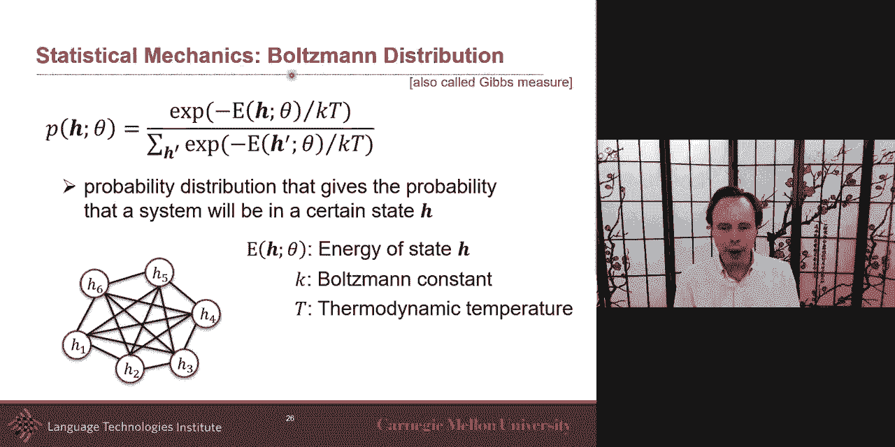

for a lot of models and we will use that，because the markov random field。

is just building from that with a。

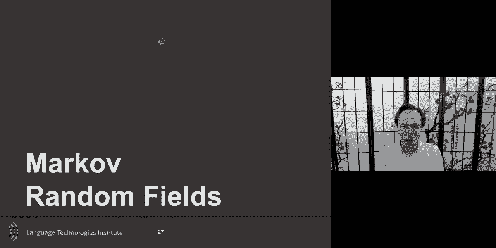

slightly different uh，naming convention and allows a little，bit more flexibility but。

the markup random field is a lot like a，boltzmann machine，the equation is there if we we drop the。

constant，the constant from the boltzmann machine，is not there um，have。

random bible and my random variables，are going to be non-observed uh usually。

random viable or non-observed um，at least not directly and and for each。

uh for for this whole link for all these，random variables，i i will have this potential function。

and this potential function um，this potential function uh will be，defined by a series of you could。

say this mother potential function will，be defined with a series of smaller，potential function。

and these are all these links these，different links here，that i have each of them will be。

defining a potential function and we'll，go into more details in one but for now。

you'll say for each of these link here i，will have one of these potential，function。

and it could be just simple it could be，hey is it likely that these，two events happen cool together。

at the same time and it could be a，simple yes or no，like yes uh they are very likely when。

they happen and i give a very high，potential，very high score if they co-occur uh or。

or maybe not when they co-occur at the，same time this is the opposite i want。

them to be in opposite end，um and that would be another kind of，potential。

the algorithm will try to take all of，these potential，and try to find and maximize i mean try。

to optimize it such a way that you，get all of these mini constraints。

uh taken care of all at the same time，and so this formulation is。

often uh we call this potential function，and we call this energy function so you，will。

see both of those terms so potential is，the exponential，minus the energy function and the reason。

of this naming convention，really come from the boltzmann machine，originally。

and so this is fully connected it's very，rare that you will see a fully connected。

mark of random field，um although they will see some and i，will show，um uh example。

and you will usually need to do some uh，approximations，um to be able um to uh。

optimize it uh efficiently，but in many cases uh the，the random field the the the that graph。

that graphical model will in fact have，only a subset，of the uh the of the potentials。

defined uh you could call them link but，the potential so，instead of having all of them connected。

with each other，you will use some knowledge i mean if，you have no knowledge。

let's connect everything and just，wait and hope that i have enough data，and i can optimize things。

but if i have knowledge then i can say，hey，there is in fact some uh information i。

know i know that these，latent or i hypothesize that these，latent states will be connected together。

in that case as i mentioned i will only，define my potential over，these link instead of connecting。

everything with everything i will only，connect them，and then so the potential in this case。

will be like，i have a potential between one and two，and it has its own weight uh uh。

own parameters i will wait a define a，potential function between one and six，and each of these pairs。

this is uh this is called uh，markup random field and this is the，representation that you uh。

will have for um，for these uh potential function i want，to introduce，uh one thing here uh that's uh。

that's really interesting is that this，is i'm representing here，is like every possible link is。

is is pairwise but what if i wanted in，fact the potential，to be defined between three different。

variables like maybe，h5 h6 and h2 i need to know those，three random bible to be able to know if。

this combination，is likely has a high potential of，happening，and the typical markup random graphical。

representation，graphical model representation does not，represent。

markup random field gives some constrain，on it because only uh you get only these。

uh pairwise relationships uh，explicitly represented in a graphical，model。

and this is why people and one of my，preferred representation，is in fact factor graphs it's another。

ways to represent the，um the marker random field，there is the graphical model way and the。

factor graph，and the factor graph here if if it's，only pair wise，this。

new factor uh which is a square，but the power of it uh is that，uh you can um also。

start putting factors with maybe，some observed variable because all of，this。

is all my non unlatent viable，but you may also have observe but the，more interesting。

is this one here i can suddenly，connect tweetings together and say hey，high potential if h5 is zero。

h4 is one and h3 is one，let's say an or or some other，combination，now i have these try tryona rig。

if you would like uh i'm just creating，words um，to um to define over my latent variable。

so in the same network i will have，pairwise，i will have triplets and and it can be。

as complex if you want，although this function will become more，complex。

and i could also have unary and the，unary will make a lot more sense in a，second。

when i start introducing also observed，variables，is，factor graph and this is called also。

what's called a click，factorization i know it's a lot of terms，i apologize for that。

um but now when you look at this there's，a click，and the clicks are i what are the。

variables together what is the smallest，uh that i can uh to compute my potential。

and and and and for for，for all of these it's all pairwise，so that big is the idea of。

click is a little bit like when i look，at my graphical model and i factorize it。

and the click is this way of factorizing，and so i'm gonna factorize with by。

having all of my pairwise potentials，and i will factorize also maybe the，unary。

and more importantly like when i have my，triplets so now，for this factor here i can't。

just use h4 and h3 i need，h5 so i need all three of them so my，click。

to be able to infer that potential，is going to be uh at least these three，nodes。

and so if h3 was also connected with，if that potential was also connected，with h2。

then my click will be these four，together，graph，is that now i can visit the classic。

problem sequence prediction，i have a sequence i have a sequence。

of observations i have many observation，and then i want to infer uh，something about these um。

uh latent state and this is a little bit，similar to an hmm okay，in，time i have potential。

uh and so i define a potential，i define potential between my vibe my，latent variables，is。

maybe it's a binary it's like zero or，one，or it could be a discrete like maybe。

zero one two three four five um so this，is the h1，the same for h2 can be maybe from zero。

to five zero to five，and then i have potential between them i，say。

the weights here are also tied to the，weights here are also tight so these，weights could be tied or。

untied and then i could say but this，latent viable is not just has like。

a dependence it has a link and i use the，word dependency and i，i know in the hmm we're going to talk。

about probably see graphical，models when we talk about the a bayesian，network like，through。

a conditional probability that you，define these，in the case of the markup random field。

the main difference is these，there's no restriction to have these to，be probabilities。

as long as they're like any value，from like minus infinity to plus，infinity although。

you probably want to keep it in a，smaller range，for um for just numerical stability but。

um there's no constraint that these are，probability and that's why。

they're like you should not see it as，like，h of what h2 given h1 which is the way，you would look at。

it from hmm no here this is just like，this is a symmetric relationship like。

how likely these two events co-occur at，the same time，that's the simplest way to see what's。

the potential that these two events，occur at the same time that's the way。

to look at this and the formulation，looked like an hmm i could have put my。

x here explicitly and that's what it but，the the big difference is i don't define。

it as a conditional probability，the dependence i will look at it as a。

symmetric how are those two events to be，co-occurring at the same time how is，that if that。

event latent event to occur at the same，time as an，observed event um that's that's the way。

to think of those，unary potential how i have some observe，event and observe event and uh maybe。

me smiling and and i i want to have，my age that is going gonna model all。

the different emotion maybe and if you，remember，like，zero one two three four five um it。

doesn't have a direct，link to um to the，label directly maybe this will be in，fact predicting。

a sequence of uh happy so the label will，be more，like you're gonna have one model maybe a。

mock of random field for happy，and then you have a mark of random field，for sad。

and then what you you so you'll have a，set of perimeters for the american，friend and feel for，for。

sad and then i give you a video sequence，a bunch of video sequence。

and then i see which one much better，i give you this and this input。

and then which one match the better and，so i can look，and find what is the probability which。

one has the，largest probability or likelihood in，this case not，just priority but likelihood and that。

would be my way，of using something like an hmm or，marker friend and feel um for this。

and so i know um it's a little bit，abstract so。

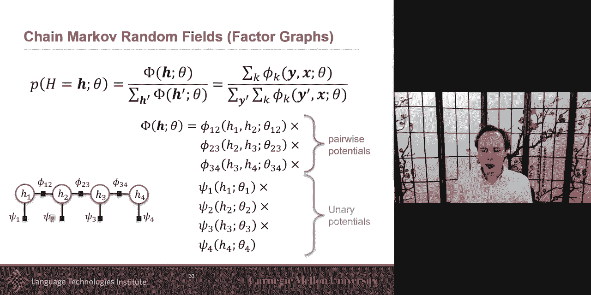

i would like to revisit our example but，look at it from a markup random field，perspective。

like how do i use this from a marker，how do i do it and i will start doing it。

with a graphical model representation，where only things can be pairwise，connected。

and so in that case i will follow the，same kind of thing，as as um as as i will have for。

a bayesian network uh but the difference，here，you have to look because it's not uh，directional。

it's both ways what it means is it's not，like，uh p of uh h give，uh uh p of x given h or。

uh it will be modeled with this kind of，link here，um but no what i will model here is like。

what is the，potential of both uh let's say，is，either high or low high learning or low，learning。

what is the potential of a high learning，and a high number uh book that i viewed。

uh and let's say number of book can also，be binary like high number of book that，i viewed。

or low number book are viewed high，number of notes a low number of your。

notes high number of posts or low number，of posters，so they put their potential is。

is is lo is because it's submit it's a，symmetric，relation is really looking at how these，cooker。

how are these co-occurring for，performance of，high number of correct answer and high，performance。

or low correct number of answer and low，performance，and uh similarly for the violence。

i will start looking at a high learning，uh hi what's the probability。

of the probability but potential of，being having an event of high learning，and high balance。

or positive balance and and low learning，and high value positive balance。

and then i can do positive balance and，high performance positive balance and。

and low performance this is example of，what will be，modeled by each of these link。

this is the graphical model and and then，and then you can add to this all the，different links that i。

that i previously had in the other but，the factor graph gives me more。

flexibility and i like this a little bit，better，and like so if you look at all of this。

like where will it make sense to，not just have a pair wise but have，like a meta like a metanode。

that will really take into consideration，not just pair-wise like。

learning with balance performance with，balance，each of them separately that's not，really how the um。

the model was originally designed like，if you remember，like when we look at the the theory。

of emotions the theory of emotion was，saying that it is jointly。

um that like maybe i have praise and my，personality together，and so like instead of having days。

separately，which would be the simple way of putting，factor graph is like keep exactly the，same link。

and make it as a factor graph，representation，and and if you look at this model like。

how many of them are，uh pairwise potential and unary，potential。

how many unitary and pairwise pairwise，are between two random variables so。

you have one two uh three and four，uh pairwise potential and unary are，compared between。

uh random variable uh latent and then，with observed variable and then you have。

one two three four five six，seven eight nine and ten eleven so。

but how to improve the factor graph as i，mentioned this，is a nice way what i like of this。

representation now it makes a lot more，sense to me，just，between。

learning and performance is like high，learning high performance or。

um high learning and low performance，that's the contrast between these two。

that is really useful and if i don't if，i just do pairwise，this will not be explicitly modeled but。

now i have a，way of defining a potential function，that would could model that contrast。

really more easily，and i could have contrast also between，my balance and my personality to focus。

that is another way i could better，represent that，so if you ask me this is a better way of。

representing that model take into，consideration，so this is an example of building a。

factor graph and markup random field，but these models come uh，um these are generative model in fact。

macro random field，the basic marker random field in fact，[Music]，is designed to optimize p of。

y given x p of y the emotion i don't，know p of y given x i said，generative so p of x and a comma。

x p of y comma x so p，of emotion and these events so that's a，generative model。

but i would like maybe and i may want to。

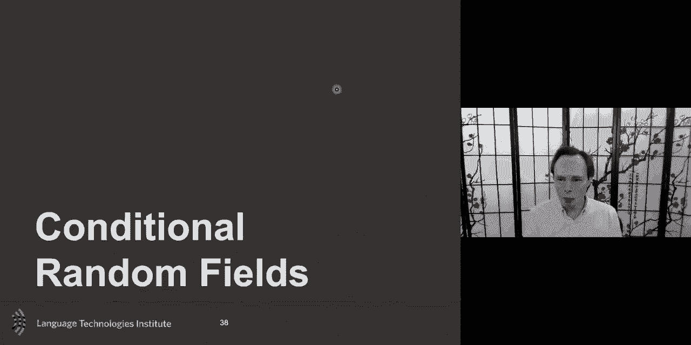

not model uh the joint distribution but，i may also want to model，the conditional random the。

the the discriminative maybe i would，like to have a，discriminative random field and that's。

what the conditional random field does，it says okay now i'm not going to。

model p of p of a y and x i'm gonna，model，p of y given x um，and so that's the main difference of the。

conditional random field，the rest of the formulation is a lot，like a，that，probability p of y given x。

using potential function uh which are，defined，with both pairwise potential。

pairwise potential and unary potentials，um and so that tells me and i。

maybe i have one x for the whole，sequence，the，uh time sample and then finally。

one thing that i will do in a typical，conditional random field。

is i will often tie the weights so this，the weights for these will。

often be tied with this like the same，way and that will allow me。

if i don't do that and i don't tie the，weight then i will need to have a set。

length for my conditional random field，uh，to nicely um have it so that i can have。

any sequence length，because then these potential function is，exactly the same。

as this the parameters are the same on，both，so this is what the conditional random。

field the typical one is like it says，uh where you have one potential function。

uh maybe for uh defining the，relationship between，x and y and then uh you will have。

a unary and you will have tied the，weights between，each of the pairwise and each of the，unary。

and when the conditional random field，was in and，introduced instead of calling them。

potential function，um they uh are calling them energy，function，they they decouple it uh like uh and。

they just，call it feature function but it's just，another name convention uh unfortunately，that got。

function，feature function they're almost the same，up to some，exponential uh of each other so just。

unfortunately there's，the naming convention and how do you，optimize。

is that this has a nice gradient that，can be computed，analytically you can compute this。

i did it myself during my own phd，can，if，it there is no loop um if it's loopy。

then the that's gonna get a little bit，more uh，challenging but if it's a a chain or if，it's a，and。

often the inference can be done with，belief propagation，uh or like a forward backward kind of。

algorithm and so one of the first，application，of this was in fact in text and i will。

if you ask me these are wonderful for，text and，and these were in fact that's a 2003，paper i think。

if you remember back in the days the，text was，also represented as a one。

hot encoding so it's a ten thousand，land that that's what this often we're，done。

now these days you will do word，embedding and all this but why is it so，cool that the。

um uh when you have a one-hot encoding，is that x is gonna be a bunch of zero，and one。

and maybe your label is like also zero，and one like is it like，happy sad or is it a uh。

determinant or is it the beginning of a，non-phrase，like um so if you have y bunch a，multivariate。

but uh uh like um，uh bunch of zero and one uh and the same，for the x what's really nice with this。

is then the，potential function are really intrusive，because they're just like。

hey are these two uh events，these two events just high potential of，core occurring at the same time。

is that word very high potential of，corquering with that label，now。

if you start and start using like a word，embedding，where it's no more just。

zero and one but a continuous value then，the potential function will have two，tasks at that point。

one is to know is these two event likely，to happen，but also it will need to kind of。

normalize your feature，the，others you could do it yourself and help，the model。

but if you don't then this is going to，have the perimeter association。

associated with it will have to，normalize it for you，and that's why when you have binary。

outputs very zero and one，and the output of a neuron if you make，them very sharp like it。

almost zero or one like uh if depending，which activation function you have。

so it makes sense that you could use the，output，of an uh um of a neural network。

depending on what you may want to tweak，which kind of activation function you。

use right before the cif just to make it，a little bit easier for the cif。

so uh for the task of bina the shallow，parsing it，like is like detecting the non-phrases。

like beginning，of a noun phrase or consideration of a，non-phrase。

um so i ask you if there's three labels，like beginning of a noun phrase。

continuation of a noun phrase，or others there's three labels uh，how many uh parameters。

here between and let's say my vocabulary，is ten thousand，i have ten thousand and i have three。

labels how many parameters here do i，have，okay it will be three times ten thousand，learn，happen。

potential that disco occur with the，beginning，that's what this is gonna learn uh and，the。

the what the e is gonna learn is is，gonna be a transition what is it。

how likely that uh what's the potential，that if i have a beginning，that i will have uh um。

no consideration um like and one thing，is like if i have a beginning how likely，do i have。

a continuation and so this is what you，will get，from the uh from these potentials。

but in many cases you don't want to just，model directly，observed to the label you would like to。

have something in the middle，you would like to have some latent，process and the latent dynamics。

arrive is a nice little extension of，that，uh and in this case is like if you would，like to do。

something like do uh prediction，of non-phrases it will be a very easy。

task if someone had manually annotated，the part of speech tag。

because once you get the part of speech，tags，uh of of the word it is almost a。

straightforward task to do，but there's this like latent but uh and。

you don't want to manually annotate it，so you're going to just put it as a，latent viable。

like and and you're gonna maybe the，number of states here may be similar to，the number。

of known part of speech tag for that，language，say，you will have some hidden state，associated。

uh for the beginning of a noun phrase，you will have some hidden state，associated with the。

others and then some of them for，continuation，and then we can nicely if you do this。

assumption which is um an interes，interesting assumption is you say for。

each for each of my label i will，have a subset of hidden state if you do，that then。

the latent dynamics cif end up being，mostly，the same equation as a cif but with。

a different kind of summation and that，summation，just uh correctly assigned hidden state。

to their label，that's what it does in the cif and so，with the ldcif，how many parameters here。

if i have 10 000 and i have here i have，12 of them，so it will be 12 x 10 000 and what does。

it learn here is a kind of a clustering，it's a clustering that happens it's a。

little bit like the hmm，latent viable our our friend，you should see them as clustering。

what it does it takes those 10 000 words，and cluster them in 12 different。

bins four of these bins if you cluster，anything in four of these beings it's，gonna be supposed。

that it is related to the beginning of a，non-phrase，if you cluster any of those ten thousand。

words in the middle ones，then we'll suppose it's a continuation。

and if you cluster a word in the last，four，then we'll suppose that it is uh the。

other one and so that's what you will，learn here is kind of a clustering，with the theta x the data e。

is interesting because it's going to，learn two different things，it's going to learn what's called。

intraclass dynamic and，nx between class or cross class，dynamic um it will learn。

within a class like within like，all of these beginning of uh，no a non-phrase like what is the。

probability to go from b1 to b2 what's，not probability but what's the potential。

to have both b1 and b2 uh co-occurring，at the same time with these values，what's the。

those uh core currents or potential of，b2 and b3，to co-occur that's the intrinsic dynamic。

the more interesting is extrinsic what，it is from，b1 and corkering with uh a i。

uh i want i won like at the next time，step，that's extrinsic dynamic and that's。

really interesting because now，your model your hidden dynamics here is，going to train，within。

the label and between labels as well，and when you do it in real data and you，learn a model with this。

predicted hidden states it's really，interesting because you see that。

effectively the text ended up being，clustering you never told。

uh that b1 should be about specific part，of speech tag，but what's really interesting is that it。

naturally uh cluster it for you so，a b1 ended up being a lot more，determinant pronouns。

um like and that's the beginning like，beginning of a non-phrase，d house or the greenhouse very。

pronoun，at the beginning of a noun phrase so it，not only learned that determinant and。

pronouns are likely，but it it put them in two different bins，two different latent state。

so this is a latent dynamic conditional，random field，and another one that's uh and and。

that's one of the last one in the family，of conditional random field。

uh before we get into the multimodal but，it's the idea of having only one label。

what if i have only one label uh i have，all this word and i want to know the，sentiment。

over the whole um sentence，field，allow you to do it um what it will have，it will have potential。

between the hidden state it will have，potential，uh between uh the。

uh observe and the hidden states that's，the same，and then you have also the potential and。

these will be shared between labels as，well，and so the inference is tractable in，linear sequence。

and so you can train that using gradient，descent，if you want to train the usual way you，and you。

instead of using stochastic gradient，distance with，batches you may use all of the data。

but this is non-multimodal but what if，you have，multimodal data and let's say that。

both language and visual there，you can learn um you can you have a，model。

and you can make it a multi-view what it，means，is your audio is going to have。

its own hidden dynamic and then，visual will have its own hidden dynamic。

and then you need to pair it the two of，them，and one way to do it is to directly or。

you could also do a coupling，but nicely this model what's really nice，is that it allows。

the problem with the doing the same as，if you remember with the hmm is we had，to couple。

we had a couple temporarily coupling，things，here we don't need the model allows us。

uh because it's modeling those potential，functions，allows us to directly model uh the core。

currents like potential of，events core happening at the same time，uh is is system isn't it。

um asynchronously uh and that's，where your probability of y that's what。

you want to model probability of y，given your x a and x v and your trained，parameter。

theta um and then the idea is，to solve this uh is uh simply by，um uh。

by integrating over all the hidden state，and now，this can be done there's nice ways to。

approximate this，using loopy believe if you realize the，problem here，you。

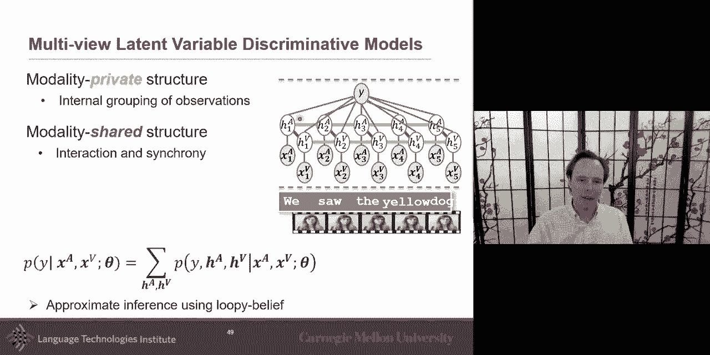

have either junction tree or loopy，belief to do that，i can，not only model uh with，a model with a。

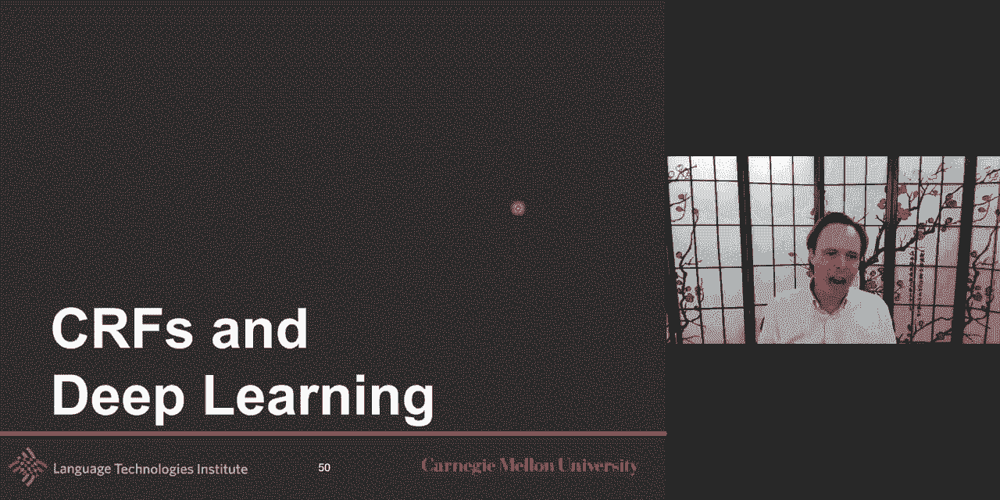

conditional benefit but i can also bring，neural representations with it。

and so i can go ahead and take，my representation my my，my input representation and use neural。

network，uh and then on top of a ci and if you，ask me，if you have cif and neural networks and。

you want to merge them together，it makes a lot more sense to have neural，networks。

at the bottom with the with the where，you have a high dimensional and so。

we we've seen beautiful work on like，learning good representation and maybe。

you pretend that representation，uh with another data set and then the。

conditional random field allows me to，put knowledge that i have over the，structure of my label。

and here the struct the knowledge i have，is that it's a sequence it's a temporal，information。

and so i will put that knowledge uh，of of temporal contingency uh，in my model and。

uh so the conditional neural field，well it will do it will model my uh，my temporal consistency。

and it will also model um here，my grouping so what does this do if you，remember。

it's a lot about clustering it takes，some high dimensional，embed it into some lower dimensional。

and then take this and and kind of，cluster it，into these different labels that's what，is the。

gonna do in this and so this is the，uh and they this and to，this function here will be defined based。

on the neural network，and here this could be as complex as you，want i mean i。

i put it only one layer but it could be，as many layer as you want so this。

this could be as many neural networks uh，layers as you want uh there's nothing。

stopping you from that，and now as you can expect people，decided hey why，why are my representations。

not recurrent and yes you can do it，there's nothing stopping you from just，going。

and saying hey i'm going to learn a，representation for x，that is contingent um but。

i so that's what the elastium but lscm，is always in other ways to think it more。

on the representation learning side，but i may have some knowledge that uh，useful。

with the cif one is that my，state has a nice discrete，clustering that i want to take advantage，of。

or nice and the second is that there is，a structure，and here is a simple temporal structure。

could be a little bit more，complex but um and the nice thing is you，can go。

and back propagate the learning is，feed forward and then and then the。

gradient back propagation so here you，will do，believe propagation for that part and。

then back propagation at the same so，feet forward believe propagation，and then back propagation um。

so what would be the number of，parameters in this，so theta e will be based on the number。

of labels so if you have a hundred，entities，so it would be hundred times a hundred，um。

and as i just mentioned what does the，what do you get from the lscm。

uh a lot of it is in fact from um，what you get from the lscm is a little，bit of a recurrence of your。

representation but it's still in the，representation learning phase。

here what i get is i can integrate，knowledge over my labels，and finally uh you could go all the way。

put everything in and just say hey not，only i want deep neural representation，lstm uh and also。

uh cif so there was this paper that，brought everything together，and one example would be character。

embedding for that。

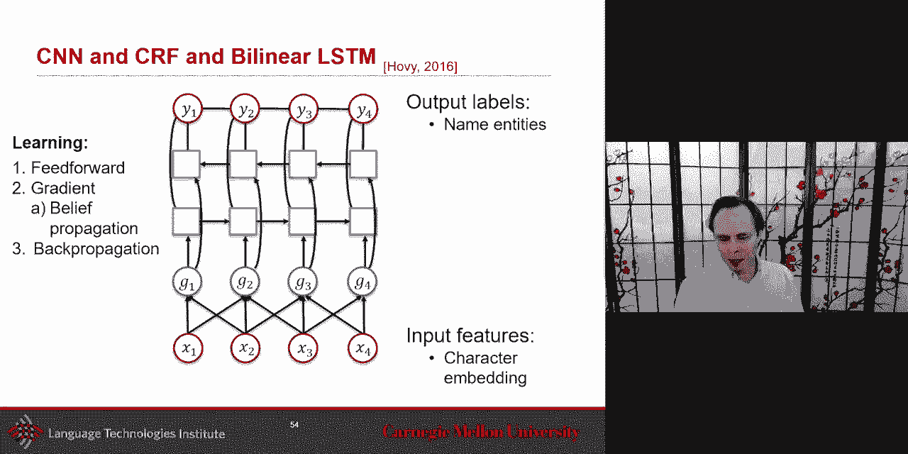

um i talked and gave an example at some，point。

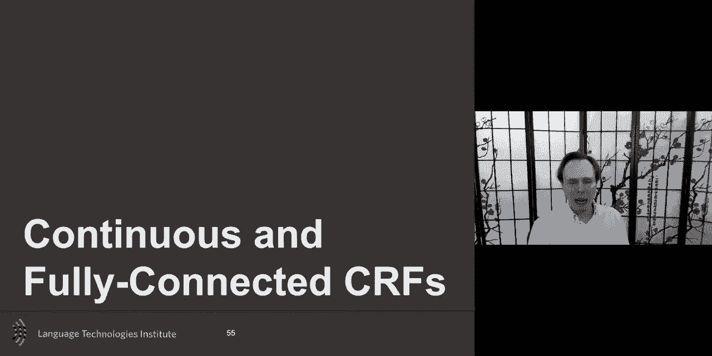

uh where i would like maybe to not just，have my uh um direct，link with my direct neighbors maybe i。

want to do，also continuous prediction and so，maybe my prediction here are not just，discrete。

but i want to predict something over，time that is also continuous。

um and so in this case the equation is，really similar as a typical conditional，random field。

the problem really the problem is，is here is that i is a，i need to like a conditional random。

field i need to，divide by the potential uh function，and the potential the partition function，sorry。

in this partition function in the case，of the cif we had some little tricks to。

make it work because they were，discrete state but if it's continuous，you get that。

very infinite integral that you need to，integrate over，that gets a little bit harder and so for，that。

when you see this kind of like infinite，one thing you should think about this，kind is to。

think about it right away as a multivite，gaussian integral that that's usually a，good trick。

um uh if i if i can take this equation，and put it as a multivariate gaussian。

integral if i can make it in that form，then i have a closed form solution。

what it means is that now i can't use，any potential function or any feature，function。

they need to be feature function that，will allow me to eventually。

uh create uh have a formulation that，is close to the multivit gaussian。

integral and so this is one example that，was uh suggested，when this continuous cif uh was，presented。

and so you can take this uh and there，because it's close form。

what's really nice is that it takes this，uh，the cif conditional uh probability that，you're modeling。

and then now suddenly you don't need to，go gradient descent and now this there's。

a closed form solution，so it's beautiful and then that，one is uh related to the matrix of here。

uh and then one is related to this，and so since cnf can be viewed as a much，wider than。

the optimal of a gaussian like since it，can be seen as a multivital gaussian。

and then what's the optimal of，gaussian distribution uh the the。

the prediction is simply the mean of it，and you can optimize，um uh so。

yeah that's and then what's really nice，is like as long as i can，keep it into the multivitamin。

distribution，um then uh they sorry，earlier i mentioned sorry i mentioned，that closed form solution。

is close form solution for the inference，of the probability，i will still need to do at optimization。

time do a gradient descent sorry，sorry for for this um typo um。

but um but the closed form solution is，for the inference i can really quickly，get the optimal why。

um so um，the the high order allows you，if we use certain potential function to。

connect anything with anything，and finally you get to the fully，connected crf。

and that's as you remember that was one，of the example i gave you，i said fully connected crf is。

uh very interesting because now every，pixel，will be connected with every pixel or at，least。

i'm going to be counted with all of my，neighboring pixels，and the challenge there is that。

to do the inference it can get a little，bit hard，and so what i will do is in fact。

look at it as a mixture of kernel and，um if i uh do the optimization for this。

uh i often end up doing this with an，approximation using the mean field，approximation。

and we'll discuss a little bit the mean，field approximation，um when we discuss um。

uh next lecture uh when we discuss，a variational auto encoder um but yeah。

uh mean field approximation so you it's，not exact but，by doing this approximation then i can，get my。

uh in one shot i can get all of my，uh prediction and i can use and that's，one of the paper。

that is presented uh for today and，that's going to be my last slide today。

um is that well as i can use this idea，of fully connected cif，uh to predict the the action。

of every frame in the sequence at the，same time，markup，assumption but allow for every frame to。

be connected with all the other frames，and that was that's another example of，bringing cif。

with a neural representation，if you look at the slides that are，posted online。

you can see a few examples of another，example where。

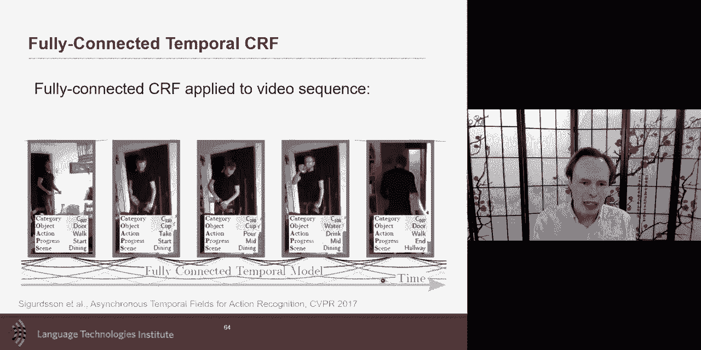

the labeling of the cif，is not a hard labeling but a soft，labeling。

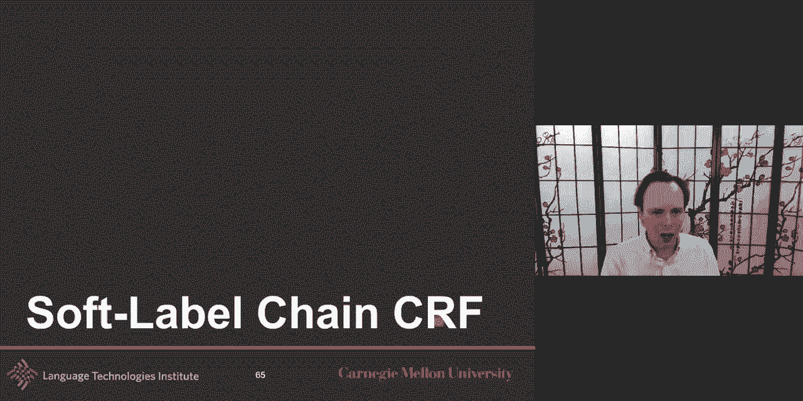

and that's what's called a soft label，for more。