# 【双语字幕+资料下载】CMU 11-777 ｜ 多模态机器学习(2020·完整版) - P16：L9.2- 多模态强化学习 - ShowMeAI - BV1Pf4y1P7zc

i'm going to begin hey everyone welcome，back to uh multi-modal machine learning。

today i'm going to talk more about，reinforcement learning and really wrap。

up uh some of the ideas and generative，models that we've talked about last。

thursday so we recall last thursday we，started with these deep generative。

models we've talked about their，applications，in image generation and we left out this。

part of applying them to text generation，so today we're gonna wrap up。

reinforcement learning and then also，link back to how we can do。

uh generation of text which are these，discrete tokens，and we're going to use some ideas on。

reinforcement learning to actually，so just some admin stuff first the。

instructions for the midterm reports and，also midterm presentations，are on piazza so recall that。

you first have to do a pre-recorded，presentation and that's due on friday，november 13th。

that's in about two weeks and you also，have to write up a midterm report。

and that's also due in two weeks in，about on about november 15th。

so just make sure you start working on，both of these midterm assignments right，now and not。

leave it until the last minute the whole，goal of the midterm report is to。

implement some of these multi-modal，baselines for your，for your problems and really do some。

error analysis of these multi-modal，baselines and really go more in depth，into your。

also lp made this post about there being，wildcards for readings as well so we've。

already announced that there are，wildcards for your project assignments。

so those are free 24-hour extensions for，either your proposal midterm or final，reports。

i'm also introducing it for your reading，assignments so i think each student gets。

one wild card that can extend one of the，reading assignments by up to 24 hours。

so make sure you check out details on，piazza，and also recall that you know whenever。

we're giving lectures feel free to type，here，i'll be looking at it live and also type。

up questions on piazza，and other tas will be following up on。

so let's begin for today's lecture again，some acknowledgements from the deepara。

courses at berkeley and cmu，again i'm going to go through at a。

really high level this introduction to，reinforcement learning and really focus。

on the multi-modal applications，but if you really want to go more in。

depth i would encourage you to check out。

these semester-long courses at other，universities，so just a quick recap last week we kind。

of looked at the reinforcement learning，problem，we looked at an agent who is situated in。

some environment and this agent，continuously，starts in some state and take actions。

and observe rewards and go to next，states within this environment。

so this sequence of state action and，rewards is known as trajectory。

we also looked at uh this formalism of，reinforcement learning。

being that there being a set of states s，in which the agent could be in，which。

an agent will start sampling actions，from as well as a transition function。

which tells you given a particular state，and a particular action。

what's the distribution of next states，the id agent could end up in。

and also this reward function so given a，particular state and taking an action。

and going to a particular next state，what is the reward returned by the，environment。

the agent is in some start state at the，beginning，and the goal of reinforcement learning。

is to maximize these cumulative，discounted rewards across a really long，term period。

across the horizon age and we've seen，how this，markov decision process of an agent。

being some environment really，encapsulates many of the broad。

applications of real-world reinforcement，learning so that includes a robot being。

an agent situated in some environment in，which it has to explore。

and also in multi-agent reinforcement，agents，in this case you know 22 players playing，playing soccer。

situated in some environment and trying，to maximize rewards of scoring a goal。

so this uh this general reinforcement，learning and these markov decision，processes。

are really broad ways of encapsulating。

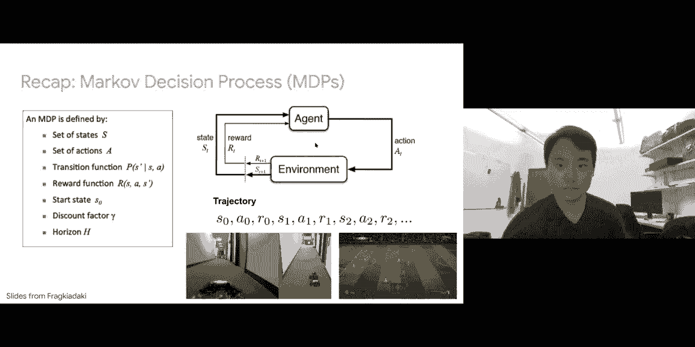

all right so we looked at in，reinforcement learning the goal is to。

maximize this cumulative long-term，reward，so at a particular time step we denote，that as g of t。

and what that's equal to is you know the，reward and the next time step。

that's your immediate reward as well as，rewards into the future，and we see that we want to discount。

these rewards into the future，by a factor gamma which is called a，discount factor。

and the goal of this discount factor，gamma is is to，make sure that both empirically and。

theoretically you can actually build，policies and converge，it's also borrowed from this idea in。

economics that you know money you have，might have，in the future so the goal is to maximize。

the set of long-term uh total discounted，rewards，and that's where the main difference on。

supervised learning is right in，supervised learning you just care about。

an immediate reward but reinforcement，learning you care about this long-term，discount rewards。

and again just to recap a discount，factor close to zero，which means that all the pre order。

rewards in the future are discounted，to be zero and you care more about。

rewards in the immediate short term，and on the other hand this large values。

of the discount factor gamma close to，one means that you，care more about long-term rewards。

possibly at the expense of，short-term rewards and the whole goal of。

reinforcement learning is to learn a，policy and a policy describes a，distribution of。

actions given a particular state pi of a，given s，which basically tells you you know what，possibly。

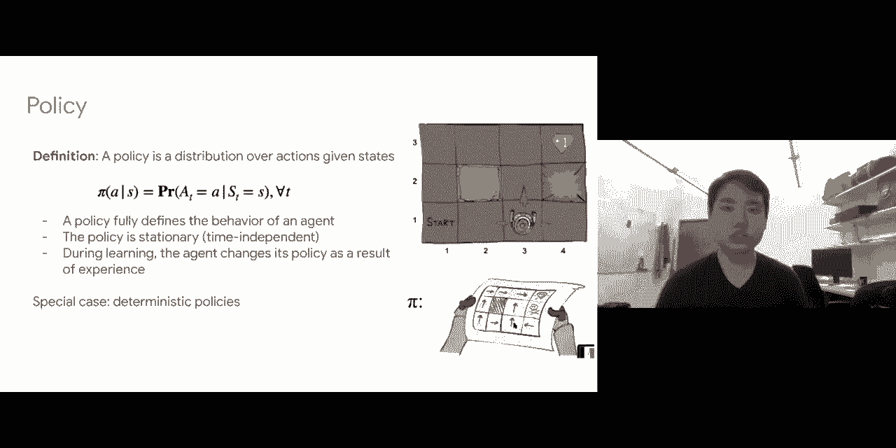

be in what is the distribution of，maximize，so here is a slide that summarizes。

everything an agent in some environment，the uh the important terms in the mdp，is。

to find the best policy taking arc max，over all policies，that maximizes the expected long-term。

reward，and we also looked last on tuesday the，main differences between reinforcement。

learning and supervised learning，the fact that reinforcement learning。

involves making sequential decisions，which allows you to look at cumulative，rewards。

while supervised learning only looks at，one-step decisions and maximizing media，reward。

in reinforcement learning we also run，into this issue of sparse rewards so，that means taking。

multiple actions across a very long，horizon only observing various parts，rewards at the end。

but you don't get that in supervised，learning because in supervised learning。

for every prediction for every，prediction that you take，you have a dense reward and sometimes。

reinforcement learning the environment，may be unknown，so in case of markov decision processors。

not knowing the transition probabilities，but in supervised learning the。

environment which is your your set of，predictions are always known。

so just to quickly recap last week on，tuesday，we looked at the first case where if we。

had a fully known markov decision，processes，where we could enumerate all states we。

knew the transitions and we need the，rewards，we derive this set of bellman optimality。

and expectation equations，essentially these are equations，regarding q star or q pi。

so what q star would mean is given a，particular state，and taking a particular action under the。

optimal policy what is my expected long，term reward，and for v star so that will be given a，state and。

for uh taking the optimal policy what is，the long term expected reward starting，from that state。

so these are the values of the markov，decision process that you want to，calculate。

and we show that we could derive using，um using equations，and the these exact optimality equations。

of relating your q stars for a，particular state in action，with your q stars for other states and。

other actions into the future，and we could therefore optimize our q，stars in order to respect。

this optimality equation if you're，working with your optimality equations。

it's called q value iteration and value，iteration，if you're working with expectation。

equations that means computing，q of pi or v of pi over specific policy。

that'll be called q policy or policy，iteration，so we show that at least in these simple。

cases where you could fully enumerate，these states you know compute this。

expectation with respect to your，transitions exactly，you could uh you could guarantee you're。

guaranteed to convert to the optimal，policy，but you know in the real world you don't。

actually have this these assumptions you，know，you um this this only works for small。

and discreet state action spaces，uh so it doesn't really work for high。

dimensional states being images，and actions being continuous and。

likewise it requires known transitions，in the markov decision process。

which you don't get in the real world，so to relax that assumption we looked at。

mdps with unknown transitions，so we went from bottom and optimality。

equations to actually replacing these，true expectations over your next states。

with just uh approximate expectation in，other words samples，of next states so in other words when。

you when you're in a state and a，particular action，you would just you know give that to the。

environment and see what the environment，returns you as this next state。

without knowing the exact transitions，and we saw here that this this idea of。

exploring the environment is important，to use an epsilon greedy method so in，other words you know。

uh leave epsilon probability of you，exploring in the environment randomly。

instead of depending completely on your，current policy because your current，policies。

are not good and again once you replace，this expectation by，samples you would like to solve for your。

q stars，that respect this vermin optimality，equation and what you would do is that，you would treat。

the left hand the right-hand side as a，target and the left-hand side as the old，estimate。

compute the difference and you want to，again the issues are that you will have，to keep all your cues。

of s and a separately so in other words，you'll keep a table that has you know。

number of s rows and number of actions，columns，so it still requires small and discrete。

state and action spaces，although now you do not need to use the，true。

transition probabilities to compute the，expectation but rather using samples。

so the next question is how can we，generalize this to even work with unseen，states and。

large and continuous state and action，spaces。

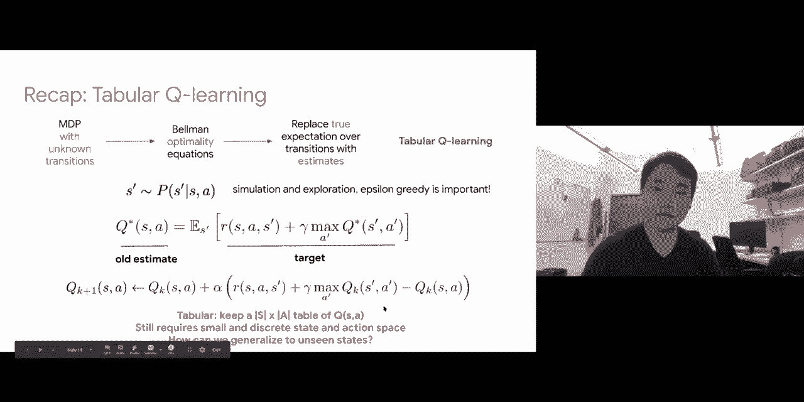

so that's why we extended tabular queue，learning to deep queue learning。

which is the idea that instead of，keeping a table of your cues across。

all states and actions i would like to，amortize it but just learning a single，wait function。

a set of a neural network parameters in，practice，that takes in a state that takes in a。

state and predicts you know your q，essays for all possible actions。

so the benefit here is that you know，just because you have really powerful。

function approximators if you've，trained your model for a particular，state to predict is q essays。

for a very similar state you know you，can also apply it through your function，approximation。

and get similar realistic values of your，q essays so now it works for uh，your。

your function approximation be it，convolutional networks or，or recurrent models and transformers you。

can also work with high dimensional，state spaces，you know，the optimization is has the same ideas。

which is to treat uh the right hand side，as a target，and the left-hand side as the previous。

estimate we know that optimality these q，stars on the left and right hand side，should be equal。

so what you can do is take the，difference and try to minimize that to，zero using gradient descent。

we saw that this naive method might have，some issues with correlated samples。

and non-stationary targets and we also，looked at how we can，alleviate some of these issues by using。

uh using these replay buffers，experience replay buffers and sampling a，mini batch of transitions。

they are not correlated with each other，and to remove the problem of。

non-stationary targets you will keep one，set of weights fixed，so at least your targets that you're。

trying to match are fixed，and you're only updating the weights as，given by your predictions。

and only replace these previous weights，w minus with your，latest set of weights every one thousand。

iterations，so these were done a lot on tuesday so，this is just a very quick recap of what。

and using all these ideas of gradient，descent plus，exploration uh epsilon greedy，exploration plus。

experience replay and fixed q targets，this actually works for high dimensional。

state and action spaces and also，generalizes，to unseen states and we've seen how this。

can work for at least，these games including like atari games，so you have these images as。

so recall uh all we've done so far we've，looked at three methods of。

three methods of basically estimating，our q stars right we started with this。

policy and value iteration，to solve them exactly we've looked at q。

learning to solve them approximately，and deep q learning which further，involves deep networks。

all of this was to find your q stars，which is the，action value function for a particular。

state and actions，so if we have these q stars we know that，we can obtain the optimal policies。

using epsilon greedy so if the action，satisfies the arc max over all actions。

then you would take that with really，high probability，and otherwise you would take maybe very。

small otherwise small x a small，probability of random actions。

and likewise uh the other method was to，solve for your v star，right so v star would be a value。

iteration and likewise，we can relate our q stars and v stars。

and again if we solve for v star what we，can do is we can also obtain。

the optimal policy but now you have to，do one step look ahead。

so in other words you know given a state，i'm going to take a max over。

possible actions and for each action i'm，going to compute，an expectation over possible next states。

the reward that you obtain，and the optimal value function for the，next state。

so that allows us to compute the utility，of each action and the action that。

satisfies the arcmax would be the action，that's taken by the optimal policy。

so of all of the methods we've talked，about on tuesday we'll define these q，stars and v stars。

as an intermediate step before we，which，so in today's lectures we're actually。

going to give an alternative perspective，on reinforcement learning。

instead of optimizing for our value，functions or q stars and v stars。

and then referring the policy we're，going to try to optimize for the policy，directly。

so we're going to forget all these q，stars and v stars i'm going to forget。

mdp so i'm just going to optimize for，this policy directly，and we're going to see whether we can。

derive some good algorithms for that，and afterwards we're going to look at。

these set of algorithms called，activecritic methods which kind of，combine。

last week's tuesday's lectures in，today's lecture and then we'll look at。

so again on tuesday we look at all these，state value functions and。

action value functions your v's and q's，and after we obtain these optimal v's。

and queues we then derive the policy，now this is in general called a value，based rl。

named for the fact that we are trying to，derive these optimal state and action。

and the other perspective of rl is，called a policy based rl，so in other words we're going to forget。

these value functions our q's and v's，completely and instead just directly，learn a policy。

so what would that look like so a policy，would take in a state and it would try。

to output some set of actions，in other words you know given state it。

will try to output a distribution over，all actions that you can take。

and in general we're going to assume，that we have a set of parameterized，policies。

that are given a state in this case an，image，go through a bunch of neural network。

parameters data and，outputs your distribution of reactions，so in this case you just have。

uh this this pattern moving up and down，so you just have one output neuron。

that represents the probability of，moving up and one minus the value of。

that neuron would be the probability of，moving down，so you see in this case you have you。

have nothing about q's and v's and，you're just directly parameterizing a，policy。

from states to actions through a set of，so why we want to do this so um there's，a couple of reasons。

one reason is that often your policy pi，can be simpler than qs and v's。

so consider the case of you know，training a robot arm to kind of pick up，some objects。

right so if you want to really define a，markov decision process for robot arm。

picking up these objects，you possibly have to define all your，status all possible parameters in the。

row by hand，so all possible parameters across all，possible joints。

that a robot hand contains so your qsas，and your va vos could be。

very high dimensional but your policy，instead it could abstract across all of。

these uh very low dimensional states，very very like very fine green states。

and just define some high-level semantic，policies such as open or close your hand。

so you could possibly train a model that，just has two output neurons you know one。

the probability of opening a hand and，two the probability of closing a hand。

so this is an example of your policy，being simpler than，uh the q's and v's across your markov。

another issue is that you know for both，your v's and q's once you compute them。

you have to do one more step before you，actually derive your optimal policy。

so this works you know we saw that for v，stars you guys do one step look ahead。

and sometimes just one step look ahead，is hard if you have a very large number。

of possible next states they could，transition to，sometimes computing this expectation。

might be difficult and likewise no，even if if even if computing this one。

step look ahead is not difficult，you do need an arc max over your actions，before you can。

get the best possible policy and that，presents a challenge，uh for continuous and high dimensional。

action spaces you might not be able to，do this arc max over your actions very，easily。

so sometimes it makes more sense to，directly optimize for policy。

instead of computing these q stars and v，stars，so that is the main motivation of。

today's lectures you know uh on tuesday，we looked at value-based methods today。

we're going to go into policy-based，methods，we started to learn some policy and then。

at the end of the lecture we're also，going to look at this set of methods。

called activecritic which really，so obviously since there's two branches，of methods in rl。

value-based and policy-based there must，be some trade-offs right so。

the sum designing both conceptual and，empirical trade-offs uh conceptually。

policy-based methods directly learning，the policy you would optimize what you，care about。

on the other hand for value-based，methods you're indirectly solving the，problem。

because you're first solving your markov，decision process which is good because。

it exploits the problem structure，but but in some sense you're indirectly。

solving for the optimal policy，empirically policy based methods are in。

practice are more compatible with your，deep networks，they are more versatile and they're more。

flexible and we've，we're also going to see how we can kind，of extend these policy-based methods。

even beyond reinforcement learning，to text generation on the other hand，value-based methods。

they're more compatible with exploration，so defining things like epsilon greedy，and exploration。

and off policy learning and in，particular because they exploit the，problem。

structure of these markov decision，processes they are more sample efficient，when they work。

so a bunch of trade-offs between。

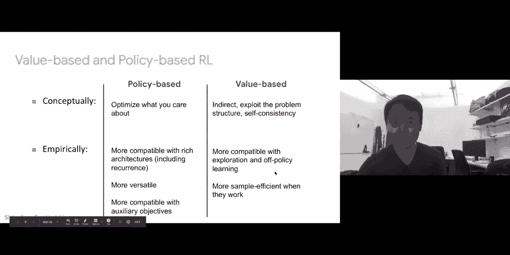

so now let's go into detail how exactly，do these policy-based methods work。

so we're going to look at this very，simple game this is the pong game where，this is the opponent and。

you are controlling this single paddle，down，and the goal is to you know bounce the。

ball into the opponent's，area while preventing the opponent from，into。

your area this is a very simple pawn，game，and we're going to see how we can design。

a policy based method，to solve this so you see that no，this game operates on raw pixels we have。

this pixel which depicts the score of，yourself and the opponent。

we have the paddles for yourself and the，opponent the positions and also the ball。

right so in this case it's an 80 by 80，height by width image，so we're going to define a model uh it。

can be a neural network or a，convolutional model with some hidden，layers。

with uh with that of parameters theta，that predicts the probability of moving，up。

again since there's just two actions you，can just define one neuron，the probability of moving up and。

conversely you have the probability of，moving down which is one minus that，action。

and we know that in this game if you，successfully bounce your ball over。

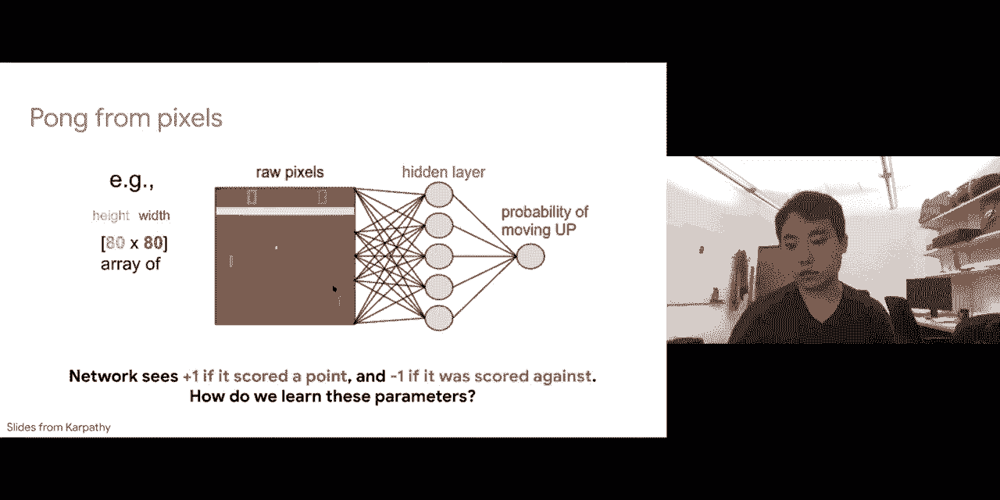

you get a reward of positive one and，otherwise if the ball gets bounced by。

the opponent across your side then you，get a score of negative one。

and then a goal is how can we actually，learn this set of parameters theta。

that you know prescribes a good sequence，of actions to actually allow us to。

so now suppose for simplicity that we we，had these training levels so in other。

words you know given all these states x1，x2 x3，we knew what we should do so in other。

words we could maybe get a human to play，this game，a human expert and you know for all。

these states it will give you the，perfect sequence of actions，to get this reward then you will。

probably treat this learning problem as，a supervised learning problem so you're，given some inputs。

and you're given these targets whether，you should move up and down as given by，a human expert。

and what you would try to do is to，maximize the log probability of the，correct action。

given your state so this is simply your，cross entropy loss and you would do an。

average over your sample your data，points，that would be your objective function。

and you will kind of solve that using，gradient based methods，that's if you knew the training labels。

but of course the main issue here is，that we don't have labels we don't want。

we don't uh we don't want or we don't，have a human expert labeling it for us。

so the question is you know should we，actually go up and down what should we。

so let's just try and act according to，our current policy so this model defines。

a policy which is the probability of up，and down given state，so just given this policy i'm gonna i'm。

gonna follow it，so maybe at the initial state it outputs，a higher probability of moving up and。

then after sampling from it you actually，move up，and that gives you into a new state and。

given this new state i'm gonna put it，back into the current，model and the model describes a current。

policy that maybe tells me to move，move up and then you probably move up。

again and then move down move up move up，across your sequence of states as。

prescribed by your current policy，if you recall this sequence of stated。

actions as defined by a current policy，is called a trajectory so after a long，term of playing。

uh obviously we have this sparse reward，problem in reinforcement learning so we，spent。

every time step but across a sequence，maybe we finally，observe some reward so maybe you know。

after the sequence of，six steps you are able to bounce the，ball over to your opponent's side and。

you win so you get a，and i'm just going to keep doing this so，going to。

use my current policy i'm going to win，at the end，maybe for a certain and i'm going to。

reset my start state i'm going to follow，the policy again，and you know it ends quicker because i。

lost and maybe for another one i lost，and for the fourth one i want。

so i can collect many of these rollouts，given my current policy。

so using these rollouts what can i do so，we know that，in this sequence of actions，well。

but we know that no apparently it was，something good because we got a positive，reward。

and likewise for this one and on the，other hand for，this sequence of actions that we've been。

taking given our policy，from the initial start states we don't。

know what we did but we know that it was，so we're going to do is just to pretend。

that every action we're going to give，equal credit to each of these actions。

that we've taken across this trajectory，we've won and for each of these actions。

i'm just going to maximize the log，probability of taking those actions，again。

when i see those same states because i，know that those are good actions。

that having taken them in the past i i，was able to see positive rewards。

and on the other hand for this sequence，of actions which i eventually uh。

lost i'm gonna say i'm gonna think that，states i，take these actions and they eventually。

led me to a negative one reward，so i'm gonna try to like decrease the。

probability of taking these actions in，the future，so in other words i will maximize，negative one。

times the log probability of taking，those rewards uh taking those actions。

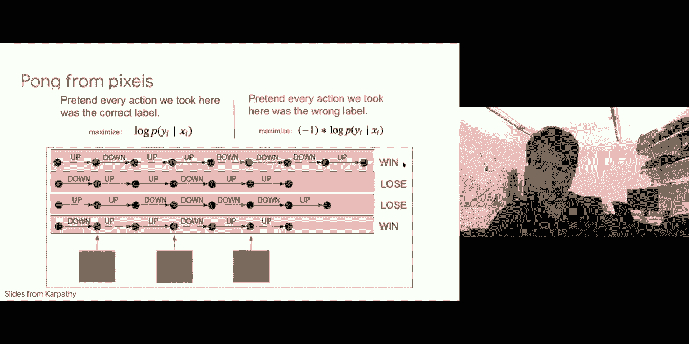

from those states so this is quite，intuitive right，and uh because we want to work in this。

reinforcement learning setting，again we're going to incorporate this。

discount rewards so in other words i'm，going to you know discount。

uh discount rewards into the past so at，one，took，you would scale it by negative one but。

previous actions i'm gonna discount it，by you know，your gamma so one of them be negative，0。

9 and then negative 0。81，and before that so this would just now，very simply。

modify our objective function again，you're going to，try to much you're going to try to。

optimize for your your log probability，of taking those actions given some，states。

but now the rewards are scaled either，negative positive one or negative one，scaled by。

so this this presents a very simple，algorithm right，you're defining a policy pi that takes，in states。

goes through some parameters data and，outputs your actions，and you initialize your policy network。

at random so initially your parameters，for your model are random now i'm going，to repeat。

by taking uh i'm gonna repeat i'm gonna，repeat by taking a bunch of rollouts。

with respect to this policy so using，this policy i'm gonna，you know sample a bunch of these actions。

and see what，see what states i end up in and what，rewards i eventually obtain。

and we know that for some of these，rollouts you're going to get you know a。

good sequence of rewards with high，rewards and for some of these rollouts。

you're going to get you know a bad，sequence of actions that give you。

and given all these actions that i've，taken all these rewards that are。

obtained i'm just going to increase the，probability of actions that work well。

that have worked well with high reward，so maximize a lot of properties of all。

these actions with some discount factor，and for all of these that i've lost i'm。

gonna you know try to downplay，the log probabilities of these actions，by multiplying。

uh your your your objective by negative，one and some discount factor。

so this presents a very simple algorithm，again over here，so in。

so uh again that's epsilon greedy from，the lecture before which is。

instead of just always following uh，taking action sample from your current，policy。

you want to also save a probability，and what are some benefits so it does。

not require transition probabilities so，our，our q stars or v stars our optimality。

equation that involves these，transition probabilities and our。

expectations and it predicts the policy，directly so this is actually a very，simple algorithm。

and you know you'll probably think after，all the trouble that we did in。

deriving your q stars and v stars from，last lecture it would actually be a。

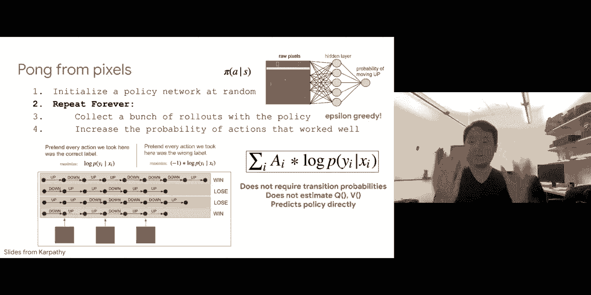

surprise if this actually worked well，right，but in practice it actually does so you。

know after training it for a bit，you can actually um so this is the，opponent this is you。

it's very jumpy because at every times，that you're making a bunch of actions up，and down。

and you see after training for a bit it，actually works really well。

he's able to quite uh consistently beat。

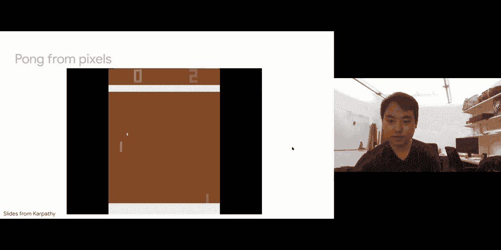

yeah you get a point so then the，question is，you know such a simple algorithm why，does this work。

and if it really works so well why did，we go through all the trouble of the of。

deriving our value and policies，policy iteration methods on from，tuesday's lecture。

and if it does work you know under what，scenarios does it work and what。

scenarios are there possible drawbacks，to this method so we're going to look at。

this method in more detail，and we're going to see you know whether。

we can actually you know give some，guarantees for why such an objective，function would actually work。

so let's look at this so i'm going to，first start by defining a class。

of parametrized policies so for each，policy uh，pi is associated with some set of weight，parameters。

so again you can think of this as you，know if you're either defining a neural。

network that takes in states，uh goes through some parameters data and，goes and i'll put some actions。

you will have this set of all your，neural networks now each of them with。

one particular set of weight parameters，some are obviously good some are。

obviously you know random and bad，so for each policy i'm going to define。

its value and what this value would be，is you know condition on this particular。

policy pi with parameters theta，the expected long-term reward，uh by taking this policy in this。

environment so again this long-term，reward will，you know take time steps from zero all。

the way to your horizon，uh and for each time step you observe a。

so that's the value of each policy and，so according to to this value you know，some values of a。

theta some set of parameters will give，you a really good policy。

that consistently gives you really high，expected reward over your long term。

and some policies will give you very bad，reward and just never really gets any。

any reward so also going to define two，things we're going to again revisit this。

in terms of trajectories，so trajectories are you know starting。

from some state taking actions observing，rewards and going to next states。

so i'm also going to write out the，probability of each of these，trajectories。

so the probability of a trajectory is，given by a couple of things first of all。

if you're in some star state your policy，high with current value of your，parameters data will define。

what probability of taking action a0，that your your agent will currently take。

and once you choose a probability of，taking action a0，you will then have to give it to the。

environment and actually multiply it by，the transition probability。

of going to your particular next state，s1，and then once you're in s1 you're again。

going to reevaluate your policy，with our s1 as input and predict the，probability of taking action a1。

and likewise you know given s1 and a1，you will multiply it by the transition，probabilities。

that it goes to s2 so all this sequence，of multiplications，up into your horizon that is equal to。

the probability of a particular，trajectory，and likewise i'm also going to define a。

reward of these trajectories which is，very simple it just takes in all these，rewards。

and you know sums them after multiplying，by，your discount factor to the power of t。

so given these two things i can write，the uh the reward for a particular set。

for a particular policy with parameters，data，as you know instead of the expectation。

of the rewards under this policy，i can write it as the expectation under，trajectories。

sampled by your property distribution，over all trajectories under your policy，pi。

times the reward of each particular，trajectory，so see how these are equal so obviously。

you know inside the expectation this you，know，summation of rewards scaled by your。

discount factor is exactly a reward of a，trajectory，and my expectations under a policy are。

exactly an expectation，under the distribution of trajectories，because you know for each trajectory。

you're actually following your policy pi，and taking actions as described by what，my policy should be。

so then the goal is you know we can，write the value of these policies。

and the goal is to find the optimal，policy theta star，and we know that the optimal policy will。

simply be an arc max over，all values of your parameters，j of theta which is the long term。

expected reward under this policy，so this is a maximization problem uh a。

general method of solving these，just be，you know taking a gradient and doing。

gradient ascent because you want to，maximize，and you take grading with respect to。

so how can we do actually you know do，this grading ascent so we know that the。

expected reward is equals to the，expectation，on the trajectories sample from the。

distribution of trajectories given by，your current policy，the reward of your trajectories right。

i'm going to write that as an integral，over trajectories tau，and i'm going to try to differentiate。

to，j of theta of the gradient of theta with，respect to j of theta，so uh i can move my gradient with。

respect to theta inside the integral，doesn't，depend on theta and if you recall the。

probability of a trajectory，terms，so you know starting from an initial。

state you know looking at what actions，your your your policy tells you to do。

and all these transition probabilities，so taking gradient of this really you，know this。

huge bunch of uh multiplicative terms is，intractable right you can't even think。

of how you can do the，chain rule for this so you can't really。

take a gradient of this with respect to，but there's some tricks we can do so one。

trick we're going to do is that we're，going to rewrite the gradient，of you know your probability of。

trajectories with respect to theta，i'm going to multiply both the numerator。

and denominator by the probability of，your trajectories，all right so these two cancel to be one。

so this doesn't really change anything，and then we also know that you know the，gradient。

of a term divided by the term itself is，equals to the gradient of log of the，term。

right this is uh just by calculus so in，other words we've converted the gradient。

with respect to your，your probability of trajectories as，first of all the probability of，trajectory。

multiplied by the gradient with respect，to log of your，so now putting this back inside we're。

going to again get this integral，uh over your trajectories the reward of，a single trajectory。

and now this term which is you know the，gradient，with respect to the log of the。

probabilities times the probability of，the trajectory itself，and we know that this integral of tau p。

of tau d tau is exactly an expectation，of trajectories，right i can rewrite this as an。

expectation and what's left inside the，term of your expectation。

is the reward of your trajectories times，the gradient，of the log probabilities of your，trajectories。

so why is this more tractable so let's，um so again we know that no the。

probability of trajectories is equal to，this really huge，product of many terms given by your。

policy and your transitions，so we we know that we we are going to，end up taking a。

gradient of the log of these，probabilities so you take log，the product becomes a sum uh。

multiplication becomes log，addition you get this and taking the。

gradient with respect to theta one very，nice property emerges which is that the。

log probabilities of your transitions，actually don't depend on theta。

you know that that's some unknown，they're just giving us given to us by，the environment。

so this term actually goes away and all，that's left is a summation over your，time steps。

the gradient with respect to theta all，the log probabilities of each of the，actions。

taken at each time step as given by the，problem as given by a policy。

so we've now removed the dependence on，your transition properties which is。

really good for us because you know，that was one big thing we had to uh deal，with on tuesday。

and therefore the gradient with respect，to the reward of each policy。

is exactly equals to it can't exactly be，approximated in this way so。

uh replace this expectation with just，samples，and for each of this sample i'm going to。

sample some trajectories i'm going to，evaluate，the reward of that trajectory and i'm。

also going to compute the gradient with，respect to each of the actions。

taken in that trajectory under my policy，so this gives us a very easy way of you。

know computing the gradient，with respect to this reward the grading。

again the benefits here are that you，know all these terms are easy to compute，right you know you can。

you can collect a bunch of trajectories，from the environment under your current，policy。

i can evaluate the rewards of these，trajectories that's already given to me，by the environment。

that's just the sum of my long-term，discounted rewards，and again for each particular uh。

sequence of states and actions，that，computes the the probability of a，particular action。

and the good thing is that we now no，longer depend on these transition。

so what is the interpretation of this of，this gradient estimator，uh so it's very similar to the the。

now，if the reward of a trajectory if r of，tau is high，i'm going to push up the probabilities。

of all the actions seen，that allowed me to obtain this，trajectory so that would be increasing。

this would be high and positive i'm，going to increase the log probabilities。

of all the actions under this trajectory，and conversely if the reward of my，trajectory is low。

so this is no high or negative then i'm，going to push down the log probabilities。

of all the actions seen under under this，trajectory，which was exactly what we saw in punk。

right you know we sampled a bunch of，trajectories，we don't know what happened in the，end。

so for all of these actions in the，middle so for all the summation over。

your t from zero all the way to when you，finished i'm gonna try to maximize。

the log probabilities with scale by，positive reward positive one and you，know for these。

i would kind of scale each of these by，negative ones so to decrease the。

probabilities of taking these actions，that led to you losing，so these are actually the same uh the。

the intuit the intuitive algorithm that，we derived for，for playing pawn is actually the exactly。

the same as the gradient estimator，and that actually gives us a very nice，algorithm this is called。

the reinforced algorithm it's also known，as policy gradients，what you're going to do here is that。

you're going to start by initializing a，differentiable policy，some。

parameters theta again you want it to be，differentiable so that you can actually。

take gradients with respect to，theta to update your policy waste data。

and you're just gonna forever repeat by，generating an episode，again this episode which is your，dates。

this is exactly your trajectory you'll，try to sample these trajectories。

given your current value of the policies，pi，and for each step of the episode i'm。

going to look at the cumulative return，and i'm just going to update my。

parameters using this update rule which，is the accumulated return，uh you know times the gradients of。

the log probabilities of the action that，and that will give me a rule to compute。

the gradients with respect to theta and，therefore update theta to get a better。

set of policy weights and a better，again when you when we say a sample an。

episode or a sample trajectory according，to your current policy。

you want to do something that's epsilon，greedy so with no one minus epsilon。

follow the current version of your，policy pi and with epsilon probability，you would just want to x。

sample randomly so that you explore the，environment，and this epsilon should start really，rubbish。

you will just do all exploration and，slowly as you get a better policy you，would also。

you also follow your policy more rather，so this this seems a very simplistic。

method right i think the main the main，issue here is that，uh was saying that you know this。

trajectory can occur over a very long，term maybe a thousand time steps before。

you actually observe a reward，so it's very simplistic to say that if。

this whole trajectory over a thousand，time steps，ends up being good then all of the，thousand actions。

were good so that doesn't seem ideal，right it seems that you know if you did。

a sequence of thousand actions maybe，some of them are bad，and only some of them were good that。

actually led to a high positive reward，although it's simplistic by an，expectation and we do enough。

samples it actually averages out and，actually gives you a very good decent，estimator。

to get a good policy，uh but again that requires many many，samples right so again。

if you look if you look at the the slide，we saw previously all your your q。

learning your q stars and your v stars，and all the methods we saw in the。

on tuesdays lecture they are much more，sample efficient，on all these policy gradients if they。

actually work they're more sample，inefficient，and requires more samples and requiring。

more samples also means that if you have，very few samples you're going to suffer，from high variance。

so how can we actually do better，there's a couple of tricks uh one very，important trick is。

that called variance reduction so the，idea here is that you know if you're。

actually observing these trajectories，the raw reward is actually not that。

meaningful so if all the rewards across，this trajectory，are positive you know if most of the。

rewards that you obtained from the，environment are positive，you're going to keep pushing up。

probabilities of all actions，and that's that's not going to be very，meaningful for your policy。

so instead instead of the raw reward，what's more important is that whether。

the current reward you're obtaining，is higher or lower than what you，normally expect to get。

so that at least gives you a sense of，you know whether your policy or this，right。

or wrong direction so therefore a very，simple，uh very simple extension is doing to use。

a baseline function，uh a baseline function that kind of，scales this reward。

by uh by a particular baseline so this，baseline should probably track like。

something like the moving average，of all the rewards so that gives you，know what what these uh。

the normal expectation of rewards you，should get this，and therefore you see you know in future，these。

rewards are higher or lower than a，and again you can show that it proves it。

probably reduces the variance of this，estimator，while also remaining an unbiased。

estimation of your your gradient，so this is a variance reduction with a。

baseline is very important and usually，these baselines are very simple just，know any。

exponential moving average of the，rewards can give you a big boost in。

but we can also do better than that uh，instead of just keeping a，you know exponential moving average。

which seems very simplistic，what we can also do is you know i want。

to push up the probability of an action，at a particular state if this action is。

better than the expected value of what，we should get from that state。

so in this case the expected value of，what we should get from that state。

should remind you of one thing which is，actually the state value function。

so recall the state value function，exactly computes you know given this，particular state。

and following either a policy or optimal，policy what is the expected long-term，reward。

that this state should give me and on，the other hand your q function。

which is your uh your q essays that will，tell you if i'm from a particular state。

and i take a particular action，under a policy or under the optimal，policy what is the expected。

long-term reward i get so in other words，this q s a minus v of s exactly tells us。

what is the difference，between this taking this action uh，the different the benefit of taking this。

action with respect to my long term，so then if qsa minus v of s is large。

then i should be happy by taking this，action a now otherwise if it's us。

it's small or even negative then we，should be unhappy with this action。

so using using this we actually get a，better estimator which is that um。

i'm going to scale it not by the raw，term the raw reward，or even reward minus the baseline i'm。

going to compute the expected，utility of taking this particular action，from my state。

so that'll be uh my qsa is minus v of s，so this actually presents our next。

method which is actually a combination，of q says algorithm and today's，algorithm。

so on tuesday we know that at a start，you don't know these queues and v's。

so right and tuesday we presented some，methods to learn them so we can use uh q。

learning or you know any of these dpq，networks to actually learn these q's and，v's。

and the combination of these methods is，actually called actor credit methods。

they combine uh policy gradients and，queue learning，why is that uh they will train two。

things so they'll train an actor，an actor will be the one that you know，outputs a policy。

so in this case you know given a，particular state you're going to maybe，start sharing some layers。

and you're going to then branch out now，on one side you're going to predict。

a policy which is a distribution over，your possible actions to take。

and at the same time i'm also going to，predict a value function。

which is the value my q of a particular，state and a particular action。

so again you can um so again these are，called active critic methods because the，policy。

is the actor that tells you how i should，act and the critic，is the value from the critic which is。

the q function is one that，evaluates how good the states and，so how would you train these jointly。

um so for the critic the one that，estimates the q values，we've actually seen from tuesday's。

lecture that we can actually train using，deep queue learning，so again we derive these uh bearing。

optimality equations we know that，the queues at optimality should have。

this term the q learning target and the，output from the q network being exactly，the same。

so if that happens the optimality what i，can then do is you know compute the。

difference and try to minimize that，your uh，your value function your critic and at。

the same time you will also，uh train your actor which is you know。

the one that actually outputs a policy，and tells you which actions to take so。

what is the objective function for，training the actor，again that would be the um the objective。

that we just derived which is that you，know the gradient，of you know j theta which is how good a。

particular policy is you're going to，take gradients with respect to theta。

and that's equals to uh the advantage，which is you know how good this action，was。

and how good the action was is actually，given by the critic，so right you use a critic to you know at。

a given state，compute what is the value of taking，action at that state。

and this value will be your long term，cumulative rewards as estimated by your，q values。

and you will subtract the baseline value，of that state which is no。

an average over all possible actions，so this difference will tell you the um。

the difference in expected rewards by，taking this particular action。

and you will try to scale that by the，loss probability，of taking that action so if this is high。

your push up，the value of that action and you will，try to take it more in the future。

and conversely if this is a smaller or，negative you would you know decrease the，log。

probability of taking，uh decrease the lock probably of taking，that action in the future。

cool so these are called active critic，methods you know combining。

um critics you know they evaluate these，these uh the state，and action value functions with actors。

which actually tell you what actions to，think，and i guess uh most of the most of the。

methods i think nowadays i think these，these active critic methods。

are very strong baselines for many，reinforcement learning problems。

um they're also kind of these like go to，baselines if you have no。

a discreet set of actions that you want，and again you want to use some of the。

tricks we saw in the previous lecture，which is that you want to use sufficient。

exploration so whether star you know，your policies are bad so you want to do，sufficient exploration。

so as to actually get trajectories with，actions that give you high rewards。

you also want to um as you're doing，exploration you want to keep an。

experience replay which is to collect，remember some of the sequences of states。

and actions that you've taken，and store it and when you're doing these。

grading updates you know in both for the，critic and for the actor you want to，sample。

a badge from your experience replay you，want to stand behind a shuffler you want。

to sample a random batch，so you're actually decorating these，samples and likewise you want to use。

fixed targets，so again you want to use w minus，a previous set of parameters to give you。

a q learning target，while updating w for your predictions，and then maybe after a few thousand。

epochs you will replace your w minus，with the current value of w。

so um this this fixed targets prevents。

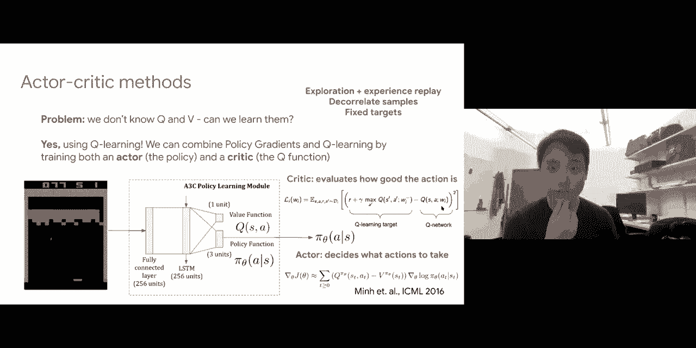

awesome so that is the main at least，from the algorithm side those are the，main。

and these are the main introduction to，the different types algorithms used in。

reinforcement learning so just to，summarize real quick，we looked at value-based methods so。

these value-based methods um，we started by looking at these mdps，which formalized the reinforcement。

learning problem，we looked at important values our qs and，v's。

and we derived these bellman optimality，equations，and then we showed how to obtain the。

best the optimal values of q's and v's，using，value iteration policy iteration tabular，q learning and。

the extension to deep queue learning so，the benefits here is that you're。

using the structure of mdps and，therefore they're more sample efficient。

but the main problem is that i know，after learning these qs and fees you。

then have to rederive a policy，which might be difficult if um your。

actions are high dimensional and you，can't really take arc max over your，actions。

on the other hand in today's lecture，we've actually looked at more，policy-based methods。

so instead of you know using these value，functions your q's and v's you will try。

to estimate your policy directly，to just define a model that takes in，states and predicts。

uh your actions so that's your policy，and you'll update this，using a policy grading method which is。

the gradient estimation that we just，looked，so the benefit here is that you're。

directly learning the policy uh you，don't have to you know go through all。

this trouble of learning your q's and，fees，and then deriving a policy but the issue。

here is that because you're not really，leveraging any structure in the problem，in these mdps。

you are most likely going to be less，sample efficient，and we also looked at how we can combine。

these methods using after critical，approaches，where you have an actor that are using。

policy gradients，predicts a policy and at the same time，we have a critic which predicts these q。

values，that tells you you know how good each of，the actions you are taking are。

so instead of you know actually just，using the rewards or rewards minus the，baseline。

you will use uh you use a critic to，estimate how good these actions are。

so that's kind of in the middle these，so now we're going to look at some，applications um。

we'll look at two sets of applications，uh last week i just went very very，quickly using。

i went very quickly through like，language and reinforcement learning。

today we're going to look at another set，of applications which uh we。

uses rl to do a stochastic optimization，and this will be very useful in kind of。

optimizing over your discrete tokens，like you have you need to do in text。

so we're going to look at stochastic，optimization so what is what is this。

area of stochastic optimization so，here's a very general optimization。

function i'm going to take a max，with respect to some parameters phi and。

what i'm going to what am i going to，take the max of i'm going to take an，expectation。

with respect to some distribution of z，and this distribution of z actually，depends on phi。

and once you're able to sample some，sample some values of z from this，distribution of z。

you're going to evaluate f of z which，actually tells you how good each of，these these are。

so why why did i you know give you this，problem well this is a very general，problem set up。

uh that we actually saw before we，actually saw this in vaes，so recall what we had in va is we。

started，by deriving this evidence lower bound，right and in this case the evidence，lower bound。

depends on x and also depends on two，parameters theta，and phi so what are these two parameters。

so again uh，given x you actually have two sets of，models an inference model。

uh q of i that takes in x and predicts a，distribution over z，so x is your input data z is your。

unobserved latent variables，the inference model takes in your，observed input data x and outputs a。

distribution，over z so q phi z given x，and then we saw that you know you want。

you have to sample a new set of z's，before you can actually put it back into。

the generative model so the generative，model will take in zs，and use a generator p。

of p with respect to theta parameters，theta that actually takes in z。

and outputs a distribution over your，real data x，right this would have was a va。

formulation that we looked at last，thursday，so we saw that the goal which was to。

maximize its evidence lower bound，can be rewritten as you know an。

expectation under the inference model，the log likelihood of predicting your。

real data under the generative model，minus this kl term which encourages the。

the distribution of your latent，variables to be close to your prior。

so i'm going to ignore this this kl term，for now and just focus on this part。

this optimization problem so this and，this actually share many similarities so。

if you recall for vaes we know that the，gradient with respect to theta。

is very easy to do right once you have，sample z，you're going to put parameters theta and。

predict your x，and maybe define your log likelihood or，your mean square error。

and that is directly differentiable with，respect to uh theta，so the generative model is very easy to。

learn，the difficulty was in learning the，inference model，why is that because in the inference。

model you have an expectation，under the inference model expectation of。

under the samples from this inference，model，and some terms that further depends on z。

and you want to be able to take，gradients all the way back，you know all the way from from the。

outputs of z，through z and through the parameters of，the inference model that。

generated this distribution over z，and why was that difficult we saw that。

one option was to take in your inference，model from x，through parameters phi get a。

distribution over z，and then sample z from this distribution，and then you know continue on with your。

computation but once you start sampling，z，the issue is that uh you have this node，this random sample。

that you can no longer back propagate，through to the，parameters phi that output your。

distribution over z，right there this is a stochastic，bottleneck this random node over here。

so you saw how to kind of get around，this problem by reparametrization。

so instead of sampling z from a，distribution as given by，the inference model what you should do。

instead is to just sample，epsilon a noise vector and then do a，linear transformation of this epsilon。

using the mean and variance parameters，as given by q of z，so what you will get is that you know。

the randomness is now within this，epsilon，and your z will now be deterministic。

so that your z can actually go on to，fuel further computations to actually，reconstruct x。

and all these loss functions can now，back propagate with respect to z。

which is deterministic and back，propagate with respect to phi which are。

the parameters that generated the，mean and variance of your your q of z。

right so all of this was back in the vae，lecture，last thursday so we look at the，similarities here。

again theta was easy the main，similarities is in optimizing，for phi you actually do exactly get this。

formulation right，you're taking an expectation under q，which depends on phi。

that actually defines the distribution，over z from which you have to do some，sampling。

and then the sampling the sample z then，goes through some computation。

and that's why we call it stochastic，optimization because，in this computation graph there is a。

part where you actually have to sample，certain layers or certain variables。

before these variables can then define，your reward，that's why we call this stochastic。

so now that we've seen this general，stochastic optimization problem，encapsulates vaes。

and we saw that the whole and we saw，that we saw that you know we can，actually solve。

at least in the vae case by，re-parametrization but what are some。

requirements that we can actually you，know get it to solve by reprimatization。

there are a few so we first have to，require that z is continuous。

why is that so once z is continuous then，you can actually uh，go through computation afterwards to。

compute your loss function，and then compute the loss of your uh the。

grading of your loss with respect to z，right these gradients are only well。

defined if z is continuous，and in the case of va is z is continuous。

and then uh and then c was a continuous，sample from this gaussian。

so z is continuous we have that in vaes，uh what we also have is that q of z is，re-parametrizable。

and we saw that as well we saw that，instead of sampling z from。

the distribution as given by the latents，we could instead sample a noise vector。

from just standard gaussian noise，and then obtain a deterministic z using。

a linear transformation of this noise，by，the mean and variance parameters as，output by。

your your inference model so in at least，in the case of va，is our q of z was re-parametrizable so。

we could move the randomness into，epsilon，and f z this z deterministic and you，could back proper。

something else we needed was that f of z，which is all the computation function，that goes on。

after z that is also differentiable with，respect to phi，and in the case of vaes we do because。

once you sample，a discrete z3 parameterization it just，goes through a bunch of。

neural network layers to get your output，and define your loss，so all this is so differentiable with。

respect to，so phi are some requirements and，now let's look at reinforcement learning。

so in reinforcement learning we actually，have a very very similar setup。

right if you look at what we derived in，the first half of the lecture，we looked at all this set of。

parametrized policies，uh with you know policies that take in，states。

and go through a plan go to some set of，parameters five，to predict actions and we looked at the。

expected reward of all these policies，right that's a function of your，parameters phi。

and we saw how we could rewrite this as，again a maximization problem，of my policy parameters phi and。

expectation，of trajectories sampled from this set of，uh from from this particular policy，times uh。

an expectation of the reward of these，trajectories all right so this was the，exact uh。

reinforcement learning problem the，had，which we then derived policy gradients。

so what is happening here so，first observe that this and this is，again under the same formulation。

when you're maximizing over some，parameters uh you have an expectation。

in which you have to actually take uh，samples，from uh from uh from a distribution。

that's why we call it stochastic，optimization，and the distribution actually depends。

on the parameters phi so again the big，issue here is that once you take samples。

from this distribution，and then your reward is only defined on。

these samples how can you actually back，propagate this reward。

through your stochastic sampling process，so what is different from reinforcement。

learning why can't we use a，reparameterization，so in rl at least what we've seen for uh。

this set of discrete actions，instead of z being continuous our，trajectories。

are now a sequence of discrete actions，you know given state，some set of discrete actions that you。

take so we no longer have this uh，this property where the things that，you're sampling are continuous。

which is kind of bad uh another big，issue is you know，the probability of your trajectories。

giving your current policy，is also not re-parametrizable and that。

follows on the same argument that you，know now t，is a set of discrete actions so your，your p。

which is your basically your policy，that's going to output a，multinomial over your possible actions。

that is not really parametrizable like，how gaussians are，so that's also a big issue and lastly。

you know once you get your states you're，going to go through a policy to get，actions。

so a sequence of actions to your，trajectory when you go from trajectory。

to rewards instead of having these，decoder layers that you did in uh，variational auto encoders。

now you just have a black box function，right why is it a black box function。

because you know you have all these，actions，that you are that your agent is taking。

you're going to give it to the，box，we don't have a parametrized function。

for the environment that we can，differentiate with respect to，and now this environment is just going。

to speed me up some reward，so this dotted line question mark here。

basically means that this reward is a，black box function with respect to your，actions。

so then that gives you even it's almost，impossible to，to uh to take gradients of your reward。

with respect，to your actions all with respect to the，so although both of these fall under the。

same framework of stochastic，optimization we've seen that there's，some conditions that。

if met we can actually you know solve，stochastic optimizations through。

reparameterization but at least in the，case of rl，because of discreteness and because of。

you know this black box，uh black box function that produces the，rewards we can no longer do this。

and what we've actually seen are，reinforced our policy gradients，is actually a very general purpose。

solution to solving for these uh，stochastic optimization problems。

to recall what we didn't reinforce was，that you know given this problem we want。

to take graduates with respect to phi，we show that a gradient with respect to。

phi can be written as something like，this this is the exact uh，equation that we derived which is an。

expectation under，distributions from your q，um f of z which is the reward of a，particular trajectory。

you know scaled by uh the gradient with，respect to log probabilities。

of that sample so that's exactly what we，derived when we did policy gradients，right we're gonna。

you know take a scale by the rewards of，a trajectory，and the log probabilities of taking。

those actions right so in this case，our policies basically corresponds to，this uh q of i。

our rewards correspond to our f of z，and you're maximizing where parameter is。

phi or in this case theta，so reinforce as what we've derived is a。

very general way of taking gradients，with respect to these，stochastic optimization problems and。

once you take gradient you can actually，compute a monte carlo estimate。

so instead of taking true expectation，over your，your q of zs which you know is difficult。

what you can do is just sample a bunch，of the zs，so sample a bunch and for each of the，z's。

uh compute f of z and then also evaluate，the gradient with respect to the log，probability。

of picking that particular z and i'm，z，so by replacing the expectation with，respect to an average。

and that's exactly what we've seen right，uh in this case these are trajectories。

i'm going to sample a bunch of，trajectories in this case it's one，sample one trajectory but you can。

to do an estimate you would take a，sample over a bunch of trajectories and。

for each of your trajectories you would，compute the reward，which is your f of f of z and then a。

gradient of taking all of the actions in，that trajectory，so this the reinforced estimator as we。

derive is a very general estimator for，these，stochastic optimization problems and the。

good things are that，no we just need a distribution q to，allow for easy sampling。

as long as you can sample all these z's，you're good，so that means my z can be disputed or，continuous。

right in our case our z's which is，trajectories，they are actually you know discrete。

actions being sampled at each，time step so z can be discrete or，continuous。

uh q of z which is the distribution that，out that，the distribution over your z so in our。

case the distribution of trajectories，can also be discrete or continuous uh in，our case you know。

our q of z was basically a policy pi，right that you know，taken states and outputs a bunch of。

actions a distribution over actions but，then you have to sample an action。

before you compute the reward of those，actions and therefore the reward of the，trajectory。

so uh the q of these can be both，discrete and continuous，uh one thing that it must be is that it，phi。

so obviously in our case our our，parameters，our policy is uh is parametrized by。

by theta and you must be able to take，gradients with respect to theta of the，policy。

so that is very easily achievable but a，good thing is that q of z can be，discrete or continuous。

and the other good thing is that your f，of z can be a black box。

right you no longer need something like，a decoder that had gradients with。

respect to like in vaes but now，your f of z's or in our case the reward，of this trajectories。

it can be just any arbitrary black box，that you know you give it a trajectory。

and the environment will return you some，reward you just need it。

you just need to be able to query it you，inside，it can just be a black box that you can，query。

so the reinforced estimator for，stochastic optimization has all of these。

so you've seen these benefits in the，some，discreteness in our actions we had this。

black box reward function given by the，environment，but what are some other important。

applications of using reinforce，and that that will be in text generation，so in text generation。

uh if you want to you know define these，generative models against the text，generation。

one big issue is that text data is，indeed discrete right，so um in this case you have true data。

from the real world so again，if you call gans have this a generator，that generates text。

and use of a discriminator that takes in，a real text，from the real world and the text that。

you generate and you will try to，distinguish between these right。

and then you would play a mini max game，between the generator and discriminator。

so text data both from the real world，and also what you generate。

uh they'll be discrete so you can think，of you know，you know your generator will be some uh。

some lstm or transformer that outputs，probabilities of words at each time step。

and then you will need to sample these，words to actually get a sentence and。

once you get a sentence you will compare，it with some real sentence，from real world data and your。

discriminator will try to give you a，signal of how，how close or how different these two。

sentences would be，so that's one main issue and therefore，this discriminative gradient does not。

exist because once you，start sampling these words you can no，longer take gradient with respect to。

what you had，before sampling so how can you do this，so here i think here's one of the early。

papers called a sequence，seek sequence scan which is a sequence，generative adversarial networks。

and what they did exactly was to build a，generator and discriminator，for text generation so what the。

generator was was no，given a particular words may be given，three words generated so far。

your generator was will be some language，model that would then define。

our next next words to generate so the，words to generate will be your next，actions。

and you will do some search uh it's not，really important what this search is but。

you can just think of，it as an efficient search strategy for，the most likely sentence because if you。

want to generate a sentence of 10 words，and you've generated three words so far。

you actually have to you know possibly，search over all，vocabulary size to the power of seven。

next words，in order to get the true arc max of your，sequence right。

so you can do some you know simple，heuristics that you can do local，maximums at every time step。

or you can do something in the middle，which is uh what they're doing called a，monte carlo search。

but that's not super important just know，that you know the generator will take in，some words。

and it will try to predict the next，words to generate，so you can actually sample an entire。

sentence from the generator，once you sample an entire sentence uh。

you want to apply this discriminator on，either real sentences or the sentences。

that you have generated，and if they're similar so if what you，generated is similar to real text。

you should give a high reward to your，generator and otherwise you should give。

a low reward to your generator，so what would you do now so again it's。

not differentiable but you can apply，these policy grading methods so what you，to z。

case so what these are what these are，will be you know each of these these。

will be complete sentences，as output by the generator that you have，sampled from the generator。

uh and the generator will define a，distribution over your zs right so，that'll be your language model。

and after you've sampled all these，complete sentences what you would like，to do。

is you will come like to compute，gradients，uh with respect to phi which are the。

parameters of your language model your，generator，of the expectation under the sampled。

sentences or a distribution of sentences，and the reward of each of these。

sentences and we saw that using policy，gradients，we could approximate it using a monte，carlo sample。

uh sample a bunch of complete sentences，for each of these complete sentences。

uh my reward will be given by the，discriminatory word，so how close it is to real text and you。

would multiply this by the gradients，of the language model with respect to，language model parameters。

the likelihood of generating each of，these sentences，so again the intuition here is that you。

know for some of these generated，sentences they're going to look like。

garbage so the discriminatory reward is，going to be very bad，and then you will want to decrease the。

log likelihood of generating those，sentences，of the language model the generator and。

for some of the generated sentences you，know at a start just by just by luck and。

eventually as you get a better generator，some of these generated sentences are。

going to look really good like real，sentences，so that will get higher reward and you。

will try to push up，the probabilities of the generator，language model generating those。

so um yeah so that that's the basic，application and text generation，uh and of course training and。

discriminate is easy right the，discriminator it takes in you know true，data and real。

and fake data it will just train a。

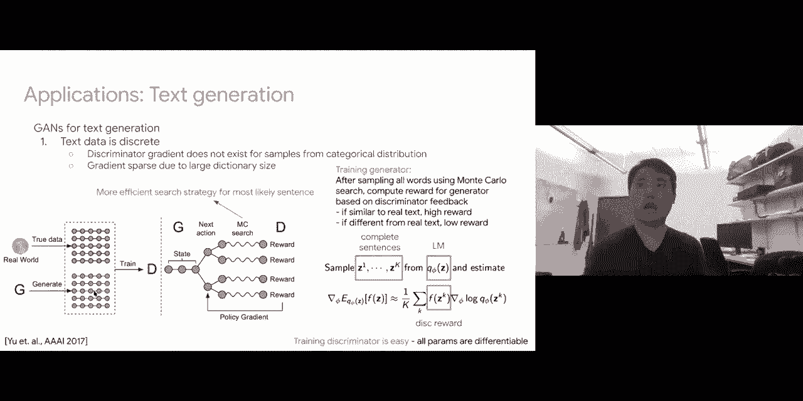

classifier everything is differentiable，is easy there's no there's no stochastic。

and of course there's a that was in 2017，and subsequently people have proposed。

better methods to do this，and there are some issues that you know。

at least in in this case you need to，wait for the generator to generate the，long。

before you get a single reward which，really reminds you of this uh。

sparse reward problem in reinforcement，learning so what you can do is you can。

you know define better discriminators，then instead of giving a single feedback。

after the entire sentence is generated，give partial feedback for prefixes that，you're generating。

so this subsequent paper define a，discriminator based on recurrent models。

that compare real prefixes at every time，step，generated by the model with our real。

prefixes from real text，so now you get better dance rewards so，again under this formulation。

your samples instead of complete，sentences will just be prefixes，uh your generator that defines the。

distribution over your，the things that the prefixes that you，want to generate is again your language。

model，and you will estimate the gradients with，respect to your language model。

using this monte carlo samples that you，know for every prefix，the discriminator tells you how。

weight up，the samples of those that have high，reward，um also some things you know like using。

large batch sizes again，reinforces large variants uh and it's in。

general super sample efficient so you，have to use large batch sizes。

you have to subtract your baselines to，make the variance lower，and just look at the paper for other。

um there's also other approaches um if，you want to do text generation without。

actually reinforcement learning there's，also some approaches，i'm，linking some references and。

just to also go over briefly what are，some other applications you can also，apply this in dialogue。

so in dialogue again you have a model，ql5 that's your generator model for your。

dialogue across multiple utterances，and you will sample these dialog so each。

sample will be the input message，a bunch of responses across your dialog，and your reward。

you know just because we've looked at，these these approaches can be you can。

basically find any black box reward，function right so you're not limited to，a discriminator。

so any type of um reward function like，no，like this paper looked at a bunch of。

auxiliary rewards like how easy it is to，answer，your utterances information flow across。

the sentences，how meaningful it is you know if you had，human data or you you can even get。

humans to annotate，all these black box reward functions you，can use it in place。

of f of z right so as long as any reward，function that you can define on your，samples。

it can be a black box you don't need to，take gradients of it you can um。

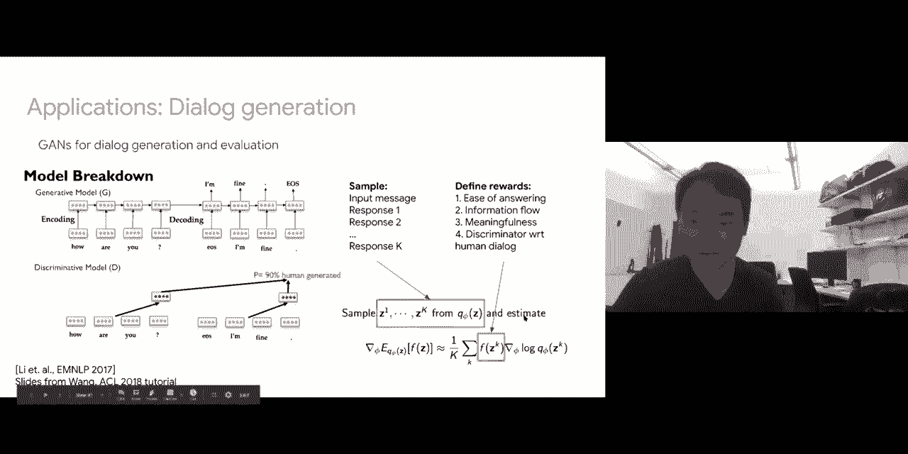

and even for things like a blue scores，uh blue squares again it requires you to，have。

like sample the text into raw text，into these discrete tokens and you can。

kind of compare these sample text to，your referencing to compute blue scores，cider scores。

all of these black box uh black box，evaluation metrics，can be used in place of f of z right。

and again those are not differentiable，using standard gradient methods one is。

because of the sampling that you have to，do to get the text，and also all these blue score things。

that match engrams those are in general，not，not a smooth differentiable functions so。

all these can be used，can be solved using your policy，gradients。

now just guess one last application uh，just another few minutes。

this last application will be that in，using heart attention，so uh i'm sure most of you have seen。

soft attention right，uh soft attention is basically uh，outputting an attention map。

that has that has gone through a soft，max so it's values between zero and one。

a heart attention on the other hand，would be a discrete latent variable。

that you would try to output a，probability of it being zero，and probability of it being one and you。

actually want to sample，a discrete gate it's either zero one，again once you do have once you have。

this sampling process in the middle of，your model，uh you can no longer back propagate。

through it so you can again use uh，grease，policy gradient methods so in this case。

we're looking at multi-modal learning，uh you have you know language visual。

acoustic coming in every time，step you want to use lstm to combine all，this information。

and what we're defining here are these，uh heart attention 001 gates。

that basically tells me whether the，visual modality at this particular time，step。

is going to be useful if it is i should，assign it one，and it will go through and otherwise i。

should assign it zero so，this particular timestamp would have，zero for the visual modality。

so again because i have to define a，model，that outputs a distribution over zero。

and one before actually sampling the，values zero and one，this part here you're going to involve a。

stochastic sample so you can't back，propagate with respect to these。

parameters but what i can do is again，using，here，will be my heart attention scores which。

are either zero or one，my q of z would be this controller which。

actually defines the distribution over，my zeros or once，so this will take in the visual inputs。

and tell me whether，this visual input looks like it's going，to be useful or not useful。

so it takes in the input and outputs uh，you know probably that should be 0 and。

probability that should be 1。and if i want to take gradients with，respect to the。

parameters of this controller what i，need to do is also define a reward，function。

so for each of these hard attention，scores 0 1，i'm going to actually apply it to my。

data and train a model to tell me how i，was able to classify，sentiment and emotions or whatever task。

you want to complete，and this classification accuracy is then，can be used as a reward function。

to tell me how informative or how good，my zero or one heart attention choices，were right。

so at a start my zero on one for random，is going to mask out。

important visual features and it's going，to let in use useless visual features。

so my classification accuracy is not，going to be good so the reward is going，to be low。

and i'm going to try to push down those，probabilities，given by the controller and now slowly。

as i get better i'm going to，be able to accurately uh mask out，useless visual features and let in。

useful visual features，so now my accuracy is going to be higher，and i'm going to push up these。

probabilities that gave me this um。

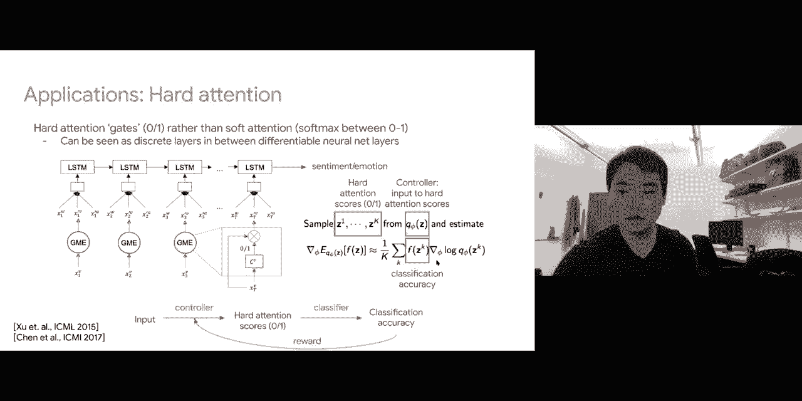

these zero ones so that's another，example and we find that，uh in the case of sentimental motions it。

actually you know rejects uh，non-informative visual features，and passes through you know smiles and。

in the case of image captioning，we're given an image uh heart attention，also looks like you know。

a bird uh currently looks looks at a，bird and，over a body of water you look at water。

well conversely if you use you know soft，attention，sometimes it looks at the bird but other。

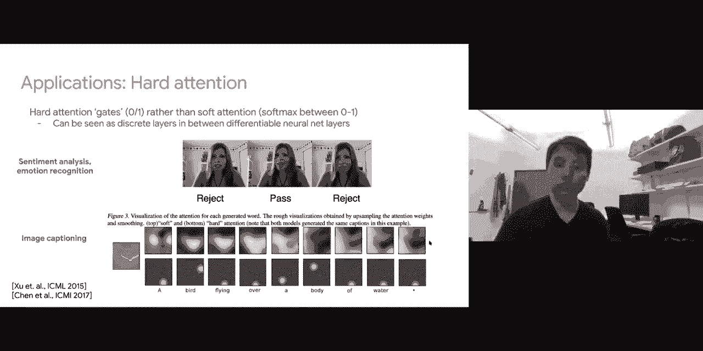

so that's it um let me stop there for，language and ro，we talked about uh these different types。

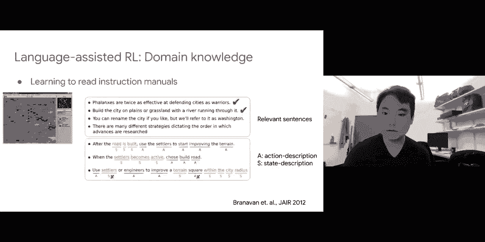

of applications previously i think，all of these are also quite simple so i。

will just leave these slides online，but just to summarize real quick we，looked at。

three classes of rrl methods value based，uh starting from mdps solving for our，queues and v's。

using policy and value iteration or q，learning and then going back to obtain a，policy。

we've also looked at policy-based，methods and you know throw away these qs。

and v's and directly optimize for a，policy，and there's some trade-offs between。

these two methods so value-based methods，are more sample efficient because they。

leverage the structure of the problem，at the mdp uh but there are。

disadvantages that you know you have to，compute all these expectations。

and uh and arc maxes over your actions，your states your trajectories which is，difficult。

uh policy based methods you know，completely throwaways your queues and。

fees they throw away the trajectories，all they need is just you know sampling。

your actions and getting the rewards，but the disadvantage here is that you。

know since it's much more general and，flexible，it doesn't really exploit the structure。

of the problem and therefore are more，sample and efficient，we also looked at you know certain types。

of combinations called active critical，approaches，that trains the policy which is an actor。

and also critic。

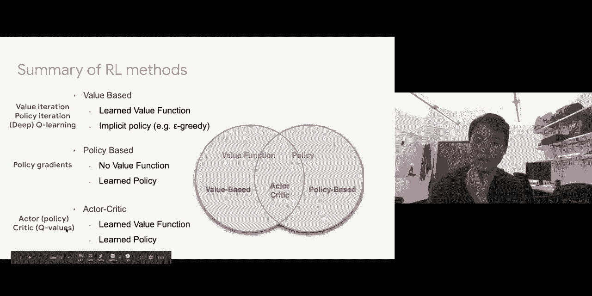

to evaluate um how good the states and，currently，in uh we looked at you know more。

generally you know going from policy，gradients a general form of stochastic。

optimization problem which，is uh useful for reinforcement learning。

with this blackbaud reward functions，but also in general for uh for like text。

generation where you have to，sample discrete tokens which you cannot，normally back propagate through。

so looking at text generation uh，due to discreteness black box reward，functions such as blue scores。

or discriminators you can also use that，and heart attention，so uh your your samples being your。

intentions and your，reward functions being how useful this，attention。

is this gated input is to your your。

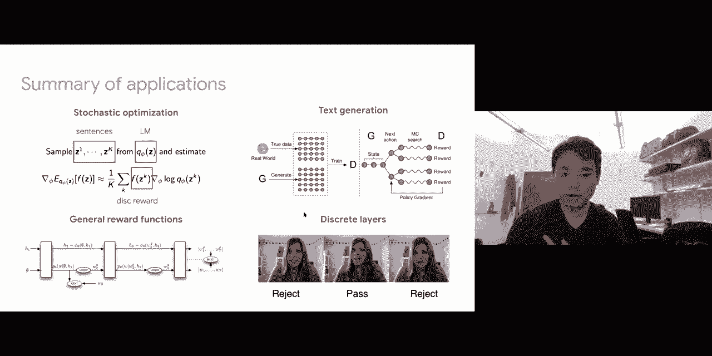

and to summarize for like language and，rl we've also seen a bunch of，applications i think。

on tuesday we talked about things like，instruction following uh we look at you。

know giving external rewards，to your model so that you can actually，encourage。

the agent to do better than random，exploring，and you can also look at some of these。

slides which give you some language as，domain knowledge which kind of。

annotates text to describe certain uh，objects in the url environments。

and also better ways of you know，designing your policies to answer these，uh。

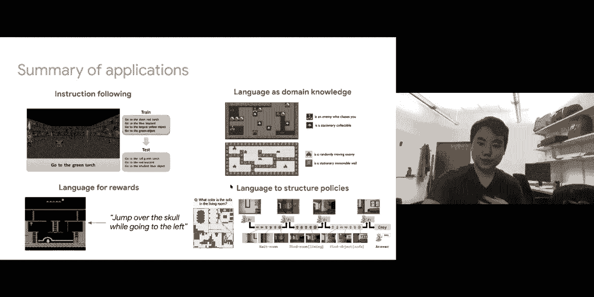