# 【双语字幕+资料下载】CMU 11-777 ｜ 多模态机器学习(2020·完整版) - P18：L10.2- 新的研究方向 - ShowMeAI - BV1Pf4y1P7zc

okay hello everyone this is lecture，10。2 this is about research trends in，multimodal ml。

this is going to be a very fun uh，lecture i hope it would be as fun for，you as it is for me，uh。

a good three weeks working on this，lecture the whole team，uh our goal was um to try to identify。

uh some of the research trends in，multimodal machine learning in this last，year。

and give you some samples of these，research papers，this is not meant to be exhaustive this。

is not the only research，trend but these are some of the，interesting research trends that we，observe。

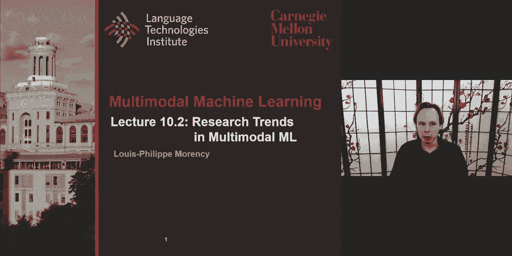

and we want to share with you um，so um we identify eight of them。

uh in fact we have some of these papers，uh that we all i also uh introduced in，the lecture。

uh on tuesday uh so，i'm gonna go through all of these eight，trends uh。

in multimodal machine learning pointing，two papers for each of those strands。

just to give you some kind of uh，idea all of these are papers are，available。

on the piazza website so you can also，look，and and the reason i can do this is。

because we spend the last 10，weeks or nine weeks to look at all the，core components。

of multimodal machine learning and now，we bringing them，all together and looking at what what's。

ahead what's going on what's ahead，so that's that's the way to look at it，so abstraction and logic。

looking at reasoning and causal，inference looking at how to understand，the multi-modal models。

how is the common sense in multimodal，problems，the social impact fairness and，misinformation。

of these models and looking at how to，make them more engaging and also maybe，more。

multicultural so these are the the。

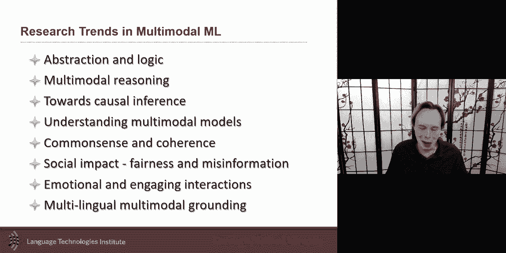

topics，we'll be discussing let me start with um，this concept of abstraction and logic，see this。

trend going on because uh for，i would say if like about five years ago。

the the five ten years ago that the，trend was really，into these dance representations like。

we're going from something that's，relatively sparse，like a hot one-hot encoding of words to。

something very dense like the output of，a word to back，uh so we went for something that is。

sparse and discreet，and and like and maybe even，interpretable。

uh to something that's dense and maybe a，little bit harder to interpret。

what's really nice is that now all of，these earlier trends like before 10。

years like these trends of like 20 30，years ago，are now being revisited with the，advantage。

of the neural architecture the neural，network arctic，architecture but now we're revisiting。

some of these，and i think what's great it allows us to，bring some more domain knowledge。

and also some more interpretability um。

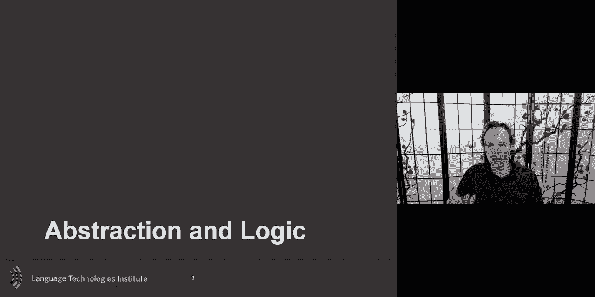

and it allows us to do reasoning，reasoning when we，when we uh when we talk about reasoning。

uh i there's there's one definition or，one way to look at reasoning that i。

personally like and i want to share is，that，is that one the typical neural network。

will be a lot about，inference and like a lot about learning，and and and bringing。

uh thing in in the in in and，in the and a lot of them has been over，the years over those dance。

representation，reasoning is once you have knowledge and，knowledge is often discreet。

and and or uh in its nature like，knowledge，uh the the extreme version like a。

knowledge graph or will be，with notes and and and so um，these elements or these evidences of。

knowledge，um and reasoning is is taking these，evidences this knowledge and and and，being able to。

to uh to to process and and maybe，learn from this but um so the reasoning。

is interesting when you have these，um more discrete representation。

and so when we do a task like and we've，we've i i will use it um for。

explaining the idea of learning by，abstraction，um is that if you have a task and the，task is。

in this case it's tasks we know quite，well you have an image and a question。

and so you want to answer this question，how to solve this question。

using visual reasoning and and if you，want to do it through reasoning。

because we will need to have the to have，this set of evidence。

we will need to do two tasks one we will，need to take this，image which is uh in a sense very high。

dimensional，um but it's raw representation and then，generate，a representation that's a little bit。

more discrete in，in it in a sense and one way would be to，just detect objects。

um so already like which objects in，sensors are there，and then this approach this paper goes a。

step further which has been done a，little bit in the past which is like。

not just an object but also a scene，graph of like how，that，in that image that's the first step that。

will be needed，as a first stage um that，uh will be then treat this grad as a，in that。

paper and i will discuss a little bit of，an example of what we mean by state，machine。

because not only is a graph but a state，machine will be，um looking at it as。

each node and traversing the the，that，that's one uh use of state machines and。

that's the way they use it，in in this um so that's that's，the um idea and we'll go in more detail。

but uh uh but what i want to before we，go in that point number two。

i want to say you also need to take the，language and bringing back to something。

that is somewhat more，discreet as well because otherwise if，you work with a very。

high um dense representation it may be，come hard to uh link it with the scene，graph so。

these are the high level let's go into，details and and uh，an example so that you can understand。

just to give this example，so as a first stage，if you want to take an image and just。

create it as a graph，the simplest way to do this is to detect，the objects and once you have an。

object look at proximity or some other，measure，uh but proximity is often a good one to，start with。

to just get an initial uh graph of this，so that's just the initial way of graph。

then what's interesting in this line of，research，is to say that a node。

a node in this case let's say the boy，the girl，a person or the coffee maker um。

it's not just that it's an entity but，that entity，has attributes that entity has。

attributes and these attribute，can be it could be continuous uh like uh。

just like a dance representation like a，cnn，output but here what they're trying to，do is to say。

let's what are they uh let's create a，pre-trained kind of a，an alphabet of concept of attributes。

that could be related to each of these，nodes，this is this bring kind of a little bit。

of domain knowledge，in this case i think they use visual，genome and other。

of these uh to to to do this，is that they're you're kind of creating，a dictionary uh，gonna。

bring them together uh and you're gonna，bring them and call them property。

this is just manually uh encoding um，so，brown brown and red are two colors so，that they're。

both the same property but the，interesting thing，uh here is that each node will have。

kind of a probability distribution over，all these attributes，um and so you could uh nicely now。

because the goal at the end of the day，is to be able to bring keep this into a。

framework where you can still do uh back，propagation，and still have derivative and so as。

little as possible you you'd like to，have those，um uh those functions that you can，here。

you will have all of the each node have，all possible attributes。

and and then compute for each of these，nodes，uh based on some preliminary like you。

look at visual genome and you，you can see there's those fine grain uh。

annotation and visual genome for each，object it's not just，the object but it says like the like the。

the old woman the old man so you kind of，have all of these attributes。

by attributes i mean also almost，adjective you could say，um and so the nouns in a very cartoonish。

way you could say the nouns are the，nodes，and the attributes or the concept they，call them a concept。

these are kind of the adjectives and so，this is for each of the nodes you can，suddenly have a graph。

have，attributes and then the edges the，transition，it，and so you also can define。

a a dictionary of relations between pra，then and there you will also from。

another data set pre-train uh and，identify，right，inside behind looking，of，uh directional so uh。

coffee maker is on the right to the ball，um，so these attributes uh。

or sorry the ball and the apple is，inside the ball，um and so uh so these are directional，relations。

and so the way you will do it is you，will define a dictionary of all these。

relations that you could have，um and this is based there's a little，bit of manual input on on。

on this and then at any when you get a，new image，you get two objects you get a coffee。

maker and a ball，and then you look at all possible，relations you could have。

all possible relations you could have，and then you suddenly，to a network you're going to estimate。

the probability，that this relation is a present between，uh these two objects and you can make it。

undirected or directed i believe they，did it directed if i remember correctly，in the paper。

you could do it both way and directed，would be uh the ordering of the two，object doesn't matter。

directed would be the ordering does，matter，um and so so that's suddenly you have。

a nice knowledge graph in a sense or，and they will use it as a state machine。

a knowledge graph of what is in the，image，so then the next step is to go ahead and。

take the instruction and try，to also bring it in something that will，be similar。

uh to at least entities as they，are in uh in the visual，and there i think there could be many。

different approaches i don't want you to，think that this is the only way。

to do it the way they've done it you，could have used a lot，of of syntax information and maybe like。

just look at non-phrases，um in this they they look at it as a，sequence。

uh as a sequence modeling and then start，clustering in the sense。

the the sequence into you could see it，as phrases although they they're not in。

in practice exactly phrases，um but they could almost seen uh as，phrases um and so。

uh they take it uh take this original，one，and and and and and uh in the same，cluster or group。

there the sentence as a sequence of，these groups，and these would be kind of each of them。

will be kind of an instruction，and then finally the final steps which。

i'm not going to go in all the details，part of it also because i i could not。

resist and i put this paper also，as one of the reading assignments so i，want to leave。

some uh of the details to whoever is，reading it and also，to you to ask uh if you didn't read this。

paper you can always ask the person who，read the paper，in your assignment you're reading an。

assignment about it，but yeah the last step is to finally，perform the reasoning what it means is。

one instruction at the time，let's say you start somewhere coffee，maker and then。

one instruction at the time you will，decide to traverse，this um this um this graph。

and so here it's a nicely uh design，example so that the transitions are so，obvious based uh。

on the uh on the uh，in practice there there's a little bit，of uncertainty on what step to take。

next uh and that's what the that's why，the，uh decision to what is it that you will。

take next is in fact bayes that's where，the neural network，is coming in is that every node will。

have a vector associated with it kind of，a representation，every instruction will also have a，that。

will also have so so you can um from all，the attributes，you can in a sense do a weighted average。

that，that exactly but and that gives you a，representation of that node。

um that's how each node can be，represented and the，transition came from a dictionary of。

relation that each of them not only had，like a tag like this is on the right。

but they also had a a neural，representation and so，you can see a similarity of these with。

that instruction you have to do and that，will tell you where to move。

in the networks so as an example here，hopefully you can see on your screen uh。

what is the tall object，left of the bed made of um and so this，will also be put。

into a new uh representation which is in，different sequence，like bed left tall and then。

made of um and and then you have your，knowledge which is just like。

pictured here and so you computed your，graph you comp，you have your sequence of instruction。

and then you reason to it the reasoning，is traversing the graph uh in this case，the，is not to。

show results in general i mean if，if a paper has been accepted there must。

be some interesting and there might，there is always a，comparison with previous work but one。

result that i think was interesting here，like，uh discretized version of the space um。

what they it allows them is to be a，little bit more robust，to like changes in the way。

things are asked uh so if suddenly，um there is a negation uh，and so the content changes uh but。

um or if the structure changes what is，uh the object covered by what is covered，the object like。

so you were changing these had been a，big challenge，before uh in the previous cases。

um if it's purely uh，dance uh version of this um sometimes，neural network。

may find some shortcuts um and and then，and these shortcuts don't generalize to。

new way of phrasing the problem，by taking the language and kind of。

discretizing it by taking the image，kind of discretizing the space that，allows uh hopefully。

better generalization and hopefully，easier for the reasoning，so the next three papers are also in。

that kind of reasoning idea，um but uh in fact i will discuss more。

not this one the this one has an aspect，but the next two after，that have this one is also about。

discretizing knowledge，it，this is more of a data set paper but it，also has some interesting modeling。

here，is the aspect of first discretizing the，knowledge but，you can。

bring back some of the interesting，things that have been，just in，logic in general um uh。

that the you can go and take this，advantage and here they're they're using。

logic uh as one of these like um，pre-neural network if a better word uh。

approaches and the reason for that is，that，uh in many cases there's comprehensive，compositionality。

in the way people uh talk and，and the goal here is to take advantage，of that，to。

hey let's just create a huge data set，that just have a lot of composition。

like take vqa and create a lot of，composition and only trained，on this um and and then and because。

you uh it's kind of a data augmentation，so that would be one way to look at it，is like a pure just。

data augmentation ways there's like like，let's just create more data，uh that that that gives me more。

robustness to，like variations here they're trying to，do a little bit of that but also。

trying to say hey my model and data set，so data said i want to，to do this kind of extension um，um。

try to allow the model to um，take advantage of the knowledge that，question could be compositional in。

nature could be a simple negation，or it could be also supplementary so。

new information could be added and and，that's interesting because here。

uh if you just do this and there's two，parts to it，uh this one you've already seen and one。

you've not seen but，maybe you could still pick up on this，but if you look at it just as one，coherent。

just one question it may be hard with，typical vqa，um so so this is the idea of bringing，logic，the。

model is just one approach i think you，can see it's kind of a，interesting baseline for this i think。

there's a lot of future work to be done，but this is an interesting。

uh first baseline um the the first step，of this is um alex mert。

it's a this is um this is just another，example of a，cross model uh bert and transformer，models。

um one that worked quite well so these，what you get output of this is so as。

input image and a question，just as a reminder this part is just a，reminder for all of you。

you get two thing you can get a，contextualized version of the image，embedding contextualized meaning。

it's no more just the embedding of the，objects in the image but it's the object。

of the image contextualized based on the，question，um and and the opposite you could get，the image。

the question now contextualized on the，image and you can also get a cross modal。

embedding which is kind of fusing both，uh together the interesting part is now，hey。

uh i would like to detect automatically，uh from this embedding and specifically。

i think they use the cross model，uh model model model embedding。

and um and then detect uh to some kind，of attention module，which uh operation or like uh you can。

call it the cognitives，like connecting um which operation，exists currently in the uh question。

so looking at the question um and，looking at it and trying to find，uh is it the end and or not or um。

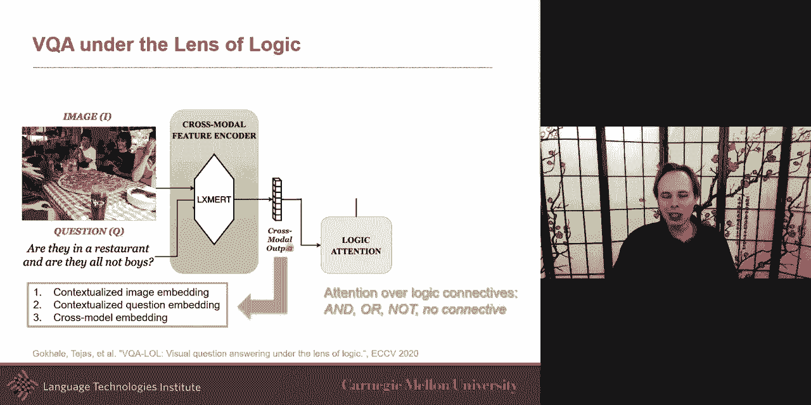

and this is just to so that you can use，this information to，then after that be able to better answer。

uh the question they did a little thing，also to look at the，type of questions this is uh doesn't go。

directly in line with，the the goal of the logic but it's just，another thing that they did。

so i wanted to share this um because uh，as a first trend that i see in，multimodal。

is that these dense representation，there's more and more interest。

also in kind of discretizing this space，because that way，these，pieces of evidences and then then。

there's some，uh reasoning that you can go over it and，that can help。

uh that can help you help you maybe not，in the short term if your only goal is。

to work better on this data set with，this exact phrasing，and the sentences written that way or。

the images are that way，but it may and hopefully goes，in generalizing better to other domains。

because you've done this abstraction，and that may work better so i want to。

give a few more examples but this one or，more on the reasoning，side of it is more less on the。

discretization，more，on the reasoning although the two work。

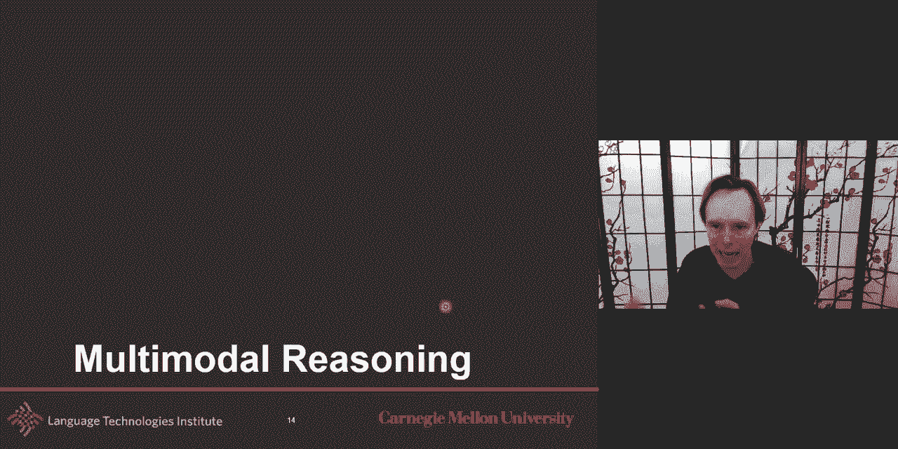

hand in hand，often um and uh so the third example，today the paper that i。

we wanted to share with you was about，cross modality，relevance for reasoning and language and。

vision so here，um the core of it although it is，partially on reasoning。

and this is an example of a data set，which is um，on the topic of visual reasoning uh。

where you have two images，and then a sentence that is potentially，related to it。

as a description so the left image，contains twice the number of dog as the，right image。

um so is it true or false or you could，look at it as a generation task if you，wanted to。

but um and then the more classic visual，question and answering。

this paper was uh that the interesting，part of it was，about the relevance and relevance。

is uh if you've taken this class here，today，not today this this semester you will。

probably call it more alignment，um but uh or at least very related to，the concept of alignment。

and and and it's the idea of knowing the，relevance like the，link or how grounded uh visual。

and language entities are uh so，what i like about this is that it's it's，also again。

looking at it as entities which can be，really simple these days it could be an，rcnn。

on these and so you have objects and it，could be looking at phrases here，non-phrases or。

phrases here but these will be your，entities，the part that i think differentiated for。

me at least that looked really quite，interesting was also um the idea of，between。

entities from language with entities in，uh，but also looking at pairs of visual and，pairs of language。

so if you have two words together，how do they relate to do together these，two words。

and trying to find in the image，two objects that also relate the same，way。

um that i think is really interesting so，it's relevant，you're trying to find relevance but it's。

not relevance between unique identity，entities in in both modalities but it's。

also relevance between pairs，uh of the visual and length or language，and language。

um so that i think is interesting it has，a flavor of the first paper i talked，today。

uh where we look at um pairs in a graph，but here they're not，explicitly doing the graph they're。

looking at it just as a set of object，and a set of maybe linguistic concept。

uh language entities and so，the model itself will be uh will be，in uh two step um you will。

compute the relevance of the entities，and for that you look uh if you look at。

this what does it look like，this is，very similar to a bilinear model you，have a。

one vector you have another cross，product that's kind of what，this is uh creating here um。

and so this is what they call relevance，doing the bilinear，uh of of of the two visual and language。

and what you can get as you know uh from，uh when we talk about fusion and，representation。

um it's like this text and and uh，visual what is is these entities are，really like。

matching words uh with um，with images so the i believe darker，is stronger relevant strong relevance。

for branch，and the uh the word left i don't know，sure why this one。

but um uh but you should that that，this should be that how relevant an，object is to a tax entity。

that's kind of the the and this you we，already looked at，or at least we approached it the，this。

entity at the entity level but also do，it at the，pear level and invite you to look at the。

paper in more details，on how exactly uh they're doing this，one of the intuition is that you should。

be，deciding because there's the space of，pairs，between object can be very large so。

a decent amount of of the the paper is，is is also designed，in，vision and all possible pair and text。

otherwise the space would be too large，way，a more efficient way and so that's the，idea for。

looking at relation between pairs，uh or what they call relational，relevance。

so you align the entities and then you，allowing the pairs，and then after that once you get these。

relevant，then you could either multi-layer or in，this case they look at local。

similarity uh local templates sorry not，similarity local template。

like with the cnn to just try to look at，patterns，and they will do it in a hierarchical。

way on top with the goal eventually to，get a representation，of how uh visual entities are related to。

text entities for this，um and how the same way visual and text，at the pair level is also so i think。

this is interesting，uh and i invite you to again a lot of，these are teasers i mean。

i will not be able to go through all，these topics without but i want to give。

you the core ideas so that you get the，main intuition，and hopefully pick your curiosity the。

reason we put this lecture also at this，point is this your midterm is next week。

and then after the midterm you will be，exploring all these new research ideas。

so these are also papers to look at to，help like kind of fine-tune maybe your，research ideas。

for the midterm so another idea is about，multi-step reasoning uh so not only。

uh like a and and if you remember the，the first paper i had a little bit of a，multi-step。

because it was multiple step because，multiple instruction，here it's it's not about multiple steps。

because you have multiple steps in the，instruction，it's more like um it's it's like let's，do。

uh find what is the most important，and so they're looking at it as an，attention problem。

and um and looking at it as like a，kind of course to find kind of approach，if i had to put a。

a very high level intuition and the the，interesting is that you men take a first，glimpse。

of an image when you do a task it could，be visual question answering in this。

case they do visual dialogue，um but a visual dialogue，forth，and now i'm about to either ask another。

question or ask answer another，question and so what should i say next。

uh that would be one way of formalizing，visual dialogue，and so how uh if you want you could call。

it just vqa visual question answering，the important is that as i'm trying to，answer the question。

using the image uh in vqa uh you could，say the intuition is human。

uh can cancel first limbs based on the，history uh or maybe just a question，after。

looking at it we're now taking a second，look at it，um so the idea is to go step by step，like this。

and the way to do it is um to put it in，terms that，we use in the class so they apply the。

multi-step reasoning，uh to the visual dialogue by using a，recurrence so。

they say multi-step but in practice is a，recurrent，network so one step of the recurrent。

will be a step of reasoning or，in and they and they recommend it's a，version of。

the reasoning when they use the term，reasoning is related to attention，and so uh and and so as i。

say i have a set of object i could focus，on and then the reasoning at least there，there there。

um the way they use this term here in，this paper，is then uh is like where should i attend。

in in into this and then finally，uh this is done both on the text on what。

should i attend in the question，source written in the text and you do it。

in multiple steps so it's dual，just because they do it on both text and，question at the same time。

so that's where the same recurrent role，attention network，so they example the there i。

took that from their paper um so you，want to ques，to answer the question is uh is he，wearing shorts。

and so you could directly from the image，pick the objects uh，but here the intuition is like as a。

first step you attend to all the，relevant object，here uh maybe the uh is。

wearing shorts so maybe you're just，looking at non-phrases and finding these，known phrases。

in their faith and then the second one，will be about maybe more。

uh step and then it could be more than，two-step but there and let's say put it。

as a two-step reasoning，then you narrow down the context that，it's not just。

about the maybe the non-phrase for，example but that really it，is about the young boy um so。

and part of the issue also in the case，of the dialogue，out，was the he related to and so the he。

is related to the boy uh or something，like this so，the the dialogue could help you，disinvigorate。

some of those pronouns for example and，that's also maybe，and there's been some work doing it also。

just in dialogue，uh there's been a multi-step dialogue，reasoning。

um i think i remember like at least a，year or two ago，so，um this is an interesting uh topic so。

i i think this is a little bit of a，simplification of the process of。

reasoning it's only one aspect of，reasoning which is about where to attend。

um uh i think everybody is trying，uh different approaches of formalizing。

reasoning i think you should not see it，as reasoning about，just one way of formalizing reasoning。

there's，been over the years many interesting，ways of formalizing it。

this is the model uh don't worry like i，the the this is just typical encoding of，the history。

of the uh image the interesting part is，really in the middle，out，is that this interesting kind of。

coupling，uh we talk about coupling of multiple，stream，uh like uh when we have a。

couple hmm or a couple，graphical model probably so graphical，models um。

and you you have this kind of coupling，the vision and，then，uh the language give you the vision and。

the vision give you the language so you，have this like kind of，uh it's not the uh there's the direct。

coupling in here，it's kind of a version of coupling uh，gives you。

you do the other gives you instead of，doing both at the same time，um so it's an interesting um。

um it's a it's it's a version of，coupling，uh in there so this is another example，of multi-step。

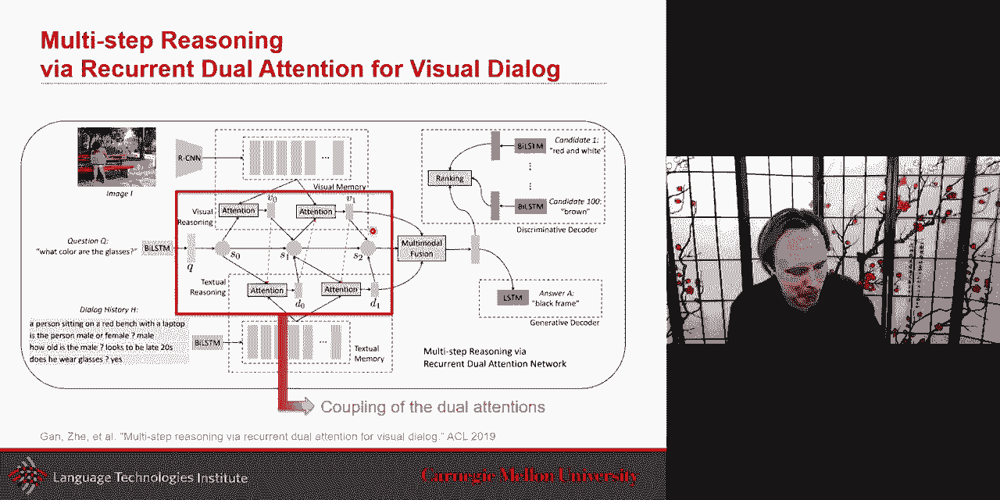

reasoning i want to bring，and that's another research trend i want，to bring。

a third example of research trend that i，think is，is is becoming uh even more popular。

um it's kind of the holy grail，of ai and uh or one of the holy grail，fai。

and so i think i don't think we're we're，about to，solve it uh this year or next year but。

it's definitely a good long-term goal，um uh causality has been，uh。

topic and it's been a lot of interesting，work on this topic in statistics so if。

you're interested in it i will say start，first with statistics。

and then learn from causality there and，then you can，uh explore and go they。

i'm going to try to give some concept of，like uh theories behind causality and，some。

concept it's it's not meant as an，exhaustive lecture on this topic，uh。

but uh to do causality or inference，often these are works better when you。

again can kind of discretize your space，and you can have these uh evidence or，these uh。

this viable with potential states uh。

that that is usually the the most，helpful，um but these could be also just dense，representation。

um uh if you really prefer but a，causal graph and that's one concept i，want to。

uh share with you uh let's take an，example like，it could be just vqa you have a question。

you have an image and an answer，or it could be visual dialogue you have，a question an image。

and some kind of dialogue history this，is one，um way of formalizing。

visual dialogue um what the important，part here i want to do，is is just kind of a naming。

naming four variables just because that，will help me，later on when i i start。

describing the one specific papers using，a causal graph so here we'll say。

q is the question it could be question，because it is in fact uh a dance，representation。

of of the of the question like a word to，wreck or a birth，of the question um or it could be uh。

maybe that question is in fact put into，sub um sub uh variables。

uh like we talked about non phrases uh，and other when we did the scene graph，but for now let's say。

it's only one entity just one bible just，to simplify，so the question the image and the h and。

the answer let's say for now，are just one viable to to keep the，problem simpler。

a causal graph is an acyclic graph，a cyclic uh graph where nodes denote。

causal relationship so the edges，are the variables in this case we had，four of them。

and the edge uh is uh and usually，directed edge，uh is a cause and an effect so the。

source of the edge，to the arrow so the cause and the effect，and how to represent that problem here。

or one watch would be a good，representation，of how people these days there are。

probably better ways to do this but，what is one way that people do this in。

the world of visual dialogue，uh how do people represent the problem，of visual dialogue these days。

a lot of time they use this way what，what they do，is uh they uh they take the。

image uh they take the image uh，the question and the and the history and，try to learn。

a good representation a better，representation of the image，um that's what the v is a better。

representation of the image，and then when they go ahead and do the。

answer they take that representation of，the image that was maybe based on some。

attention based on the，question and the history that they knew，where to uh。

attend uh and then they will answer，taking the，the history uh of everything that had。

been said the question，and the better representation and so，that's the。

one way to that has been very popular um，does，an arrow means in the world of neural，network，i think。

there could be a longer discussion about，is it really causal uh this but。

a nice simplification and i think，important is assumption that people。

are making people are using theories of，causality，uh with neural network is as there's。

quite a few people who，what they take as uh causal is that，the output uh of a neural network。

is the effect of the cause which is the，input，so that's that's a very um。

uh that's a relatively big assumption，but if you make that，assumption then it allows you to study。

the problem，uh in an interesting way so it's an，assumption you should be aware。

that is uh that will need more work to，confirm，uh，that's the way to do it so each of these。

arrow could be seen，as a neural network uh in a sense um so，that would be a way to form。

to formalize uh to take a neural network，and putting it in a，causal graph now the reason i am uh。

going and and talking about causal graph，and all this is that they if you talk。

and start putting your problem this，and uh and and start taking the take the，time。

to put it in this um framework，and start，asking questions and specifically。

the two papers i want to talk about，today on this topic of causality。

they use causality to really understand，the problem，and by understanding the problem also。

understand the biases，in the data and possibly the biases in，the model。

and i think a lot of the work is，primarily on the biases on the model。

that is that's the one i'm presenting um，so what is this all these great。

neural network we've been building and，they're working so well on one data but。

they may not generalize as well on，another data set，and so，causality may be one way to try to study。

these data sets，and try to these models try to，like，by putting a graph like this it's kind。

of just formalizing hey，that's what the model is currently doing，and then。

try to see if if there are things that，could be changed in the way，the flow of information is going。

and so one paper that does it uh，two causal principles for improving，visual dialogue。

what they're doing here is that they're，making uh，uh and i'm i'm gonna share these and。

they so they take this problem here，and they're making two observation uh。

and these are empirical observation uh，they're，although they're they're motivating it。

through theory but originally they were，empirical，just like the model performed better um。

and then and so，and then and one interesting one was，that the，um this uh history uh。

linking it directly to answers may be uh，uh uh maybe something hurtful。

and and may unfortunately allow the，neural network to learn，shortcuts it should not learn uh er。

er because it then do not generalize，well，and then the other one which i think is。

um if anything the most interesting is，the concept of confounder，uh and i will discuss it more in a。

second let me just talk about the first，one，like the idea here is that you have。

a history and you want to get the answer，and there's this very interesting。

kind of folkloric knowledge in neural，network or even in multimodal。

and i'm probably one of the people also，sometimes pushing for that i'm like。

multi-modal more modality is always，better，or more information is always better and，let the network。

learn but give all the knowledge you，have i'll give it all the input features，you have。

and let's the model learn it here the，always，more data more information to may not，all be，that。

uh although you want to predict the uh，here，you adding the the history uh。

again like because the history of the，dialogue was already used。

to get a better representation or better，understanding of the question。

and usually it is because there are some，pronouns，and they are hard to disintegrate but。

with the ques the，the other history is helpful and then to，know where to look at in the image you。

also look at the history，but you may think hey hey why not when，it's time to do the。

answer why not put the h again and and，it worked better on some data so hey。

i will do it always but here what they，found which was really interesting。

is that if you have a history of of the，length of the dialogue you have a。

question and you like to answer，this，uh when this link is there，what this end up learning is that。

it end up learning that the answer that，you want，is in fact an answer it is that is the，same length。

huh，it's like what they end up learning is，it like hey uh，it's just because i seen all these。

previous answers，um i probably want an answer that has，the same lens。

just because that's the way this person，was speaking or this，don't，put it then you get uh。

you get answers that are there mostly，not because they look like the history，of previous answers。

all of these are answers for very，different questions so，that they should not be knowledge that。

are used，just because i phrase things direct，differently，like you want no knob not because it has。

the same number，of words you want to just put it as a，good possible answer。

and so that what they were seeing is，that if you，not careful and there will be see a，correlation。

with the length of the question with the，length uh，the length of the history of the。

question with the length of the final，question，and this reduces that one uh here by。

by removing this link the more，interesting of，causality and i need to bring a new。

concept that i have not，explained yet which is the concept of，confounding。

viable and let me just talk about，confounding bible before，i talk about the specific for that paper。

confounding viable，is we may think in certain cases，because we look at data and we're like，hey。

every time um oh i should have prepared，a good example，go，with this every time i see this question。

i always，i get this answer and so i i may，i may think that the way people the way。

the answer has been，phrased is only to be able，that，in a sense that's the there's a。

causality i would like i would like to，the answer to be mostly based on what。

the question was that that's，the causality of that but there may be。

some confounding viable and in our case，is the data set were created with the。

same annotator or some at least，maybe creating both the question and the，answer。

that would be one possibility um is like，oh um or at least if they're a user or，some other cause。

i i let's say but one version would be，if the same person created boat。

uh then then it looks that there's a，causality between them，but really it's just that both were just。

created uh with the same and so，that's a confounding viable and that's a，very hard。

that's a one of the hardest thing in，causality is like，something you you see a correlation but。

is it really causality there could be，another confounding bible，that makes it so that it looks like。

they're related to each other but it's，not because，one caused the other um so that's the。

idea of confounding variable confounding，bible，may be okay to model but there's also，sometimes。

dialogue，that's the case is you can have a，spurious relation with q a。

so it's like maybe effectively there's，some effect，like cause like q is causing a but。

there's maybe on top of it，you may also um，have kind of a noise and it's adding a，then we。

could ignore it but here you're adding，this kind of bias，that in the data and so and so modeling。

it explicitly，will and that's the key of the solution，is modeling it。

explicitly if i don't have it and i just，model h q and a like usual。

um then uh it's going to be much harder，for my algorithm，to really learn the real causality。

because there's some confounding，but if i if i allow my model and i，explicitly have。

that confounding bible as as a path，then my hope is that this will，help the learning uh and the。

optimization，and so in our case the you will also be，unobserved there are cases where。

that confounding bible were lucky and，can be observed in no case it's going to，be latent。

uh in this and most likely，the intuition is that uh because，answers could see the history and so i。

gave an example earlier maybe the same，person created，both but here uh。

in this case at least that's the，hypothesis from the author，is that maybe the people who created the。

answer，they could look at the history and so，they can look at the history and so。

there may be a bias in the way they，phrase the answer，um and that and that becomes a，confounding。

and so the uh example，of confounding example will be um，in this case is is this context he。

uh so like you have a person pausing in，the front mountain of a gear。

that's the first initial is the person a，girl or a boy，uh what is he wearing okay like so we。

have to hear what is he sneakers，um and so in the uh，if you have this like you can go ahead。

and is this context he，is the topic i expect the answer about，he and so that gives you some uh。

interesting uh uh a，case，in this context i like to ask are there，in this question typed。

prefers and so this can be trained like，this kind of back door can be learned。

automatically into the model，and so this is the example，uh the paper goes in more details。

what i wanted to share this is the，approach they finally got，which says hey let's remove the link。

directly，but instead make it as a，you viable that is there as a kind of a，bias。

uh that a confounding viable，and that's the idea behind their model。

and the take-home i wanted for you here，was to look at causality，uh as a way to explain or at least。

a way to test hypothesis because that's，the problem is like，you know there's maybe a bias but how。

can i frame it as a research hypothesis，you，to formalize these hypotheses。

and be able to test that's the main take，home the details of the model of how，they did it。

and leave it to you to go in the paper，that's their first take home。

another example um it's using the，different，way and so i think the word the same way。

we had reasoning that was，formalized in different way uh in one，case it was mostly attention。

another is about traversing a scene，graph，the same thing is with um the concept of，causality。

it's been the word i think has been a，word，using a little bit differently here uh。

let's do to kind of give some context uh，this is the typical vqa。

uh and uh the vicky way here in this，case is you have an image，and what is in the basket or let's。

phrase first what can be seen inside the，basket and let's say the victory gives a，remote。

is that in fact just rephrasing almost，the same question，gives very different answers and and。

that's a little bit troubling，and so like why probably because it，learned some shortcuts。

uh so the same issue as the previous，paper，is like the the the learner shortcut。

that's most likely what happened but how，can we make the model，not learning that shortcut um and。

really learning that the the，what what what what what the answer for。

that question what caused the answer，to that question is really what what the，human would have also。

taught the same way uh not that the，neural network did a shortcut because。

there's a remote here uh on the image，and that's why，uh like i don't just an example of a，shortcut。

so vqa may find these spurious，correlation，and these confounding variables uh。

exactly like in the previous case and so，the research idea here in that paper is。

to try to remove visual objects，to see if they are confounding viable。

uh so if really the algorithm like，you would like the algorithm to still be，able to do it。

like let's say i remove this remote is，is the um is the uh，is the algorithm syllable to uh。

correctly gave the right answer，um because the the original remote is，still there。

so if i remove this remote do i still，get the，answer that i want um and then。

uh the interesting part is not only，because there's there's an interesting，model that will be uh。

and so so there's kind of treating one，is proposing a new kind of data set。

um but uh the interesting part is also，have a new evaluation metric。

because now you would like any vqa to，still be able to，correctly insert it even if you are um。

removing objects uh at least not the，object needed for the answer directly，and so。

what they do here is uh they suggest a，consensus，consistency metric to study the change。

when when a specific object is there or，not there，like it will the person correctly like。

you want the answer to be the same，so that's one and in some cases you，remove an object。

and you want the answer to be different，that's another way，uh to do this but you want to be。

consistent so whatever it should，be like whatever the human annotator，tells you。

is the new answer you want to be sure，that the，algorithm is giving you that and so one。

way would be to manually reannotate，after you remove each object here the，idea is。

you want to be consistent between all，questions，and all version of this so that's kind。

of an approximation to the human，annotation，and how do you remove object。

gan gun is definitely a good way uh，now，where uh there's a lot of great work，that's been done。

in removing object and so gan is a good，way，uh to do that and so now uh what's nice。

is that you can uh ex what what's，nice is like you can try these on all of，the state of the art。

and then you will see very quickly，although those are differently。

as cherry pick in the data set but in，general the tendency is there。

that that algorithms will have a problem，but the interesting part of the problem。

that the paper is to go the next step，and try to，solve this um and i what i。

what i like about this is that it's，trained in the vqa，uh training the model on the original。

bigquery data set plus the synthetic，data set so，you're going to train it on both uh but。

you're consisting，of images but you're going to force，uh you're going to force it uh。

to have the same attention，so the synthetic dataset are created，based on the original bigquery。

this um but the the data，the model to perform better but the，model itself。

will need to be able to use the same，model to answer，both so by forcing that you force the，model to。

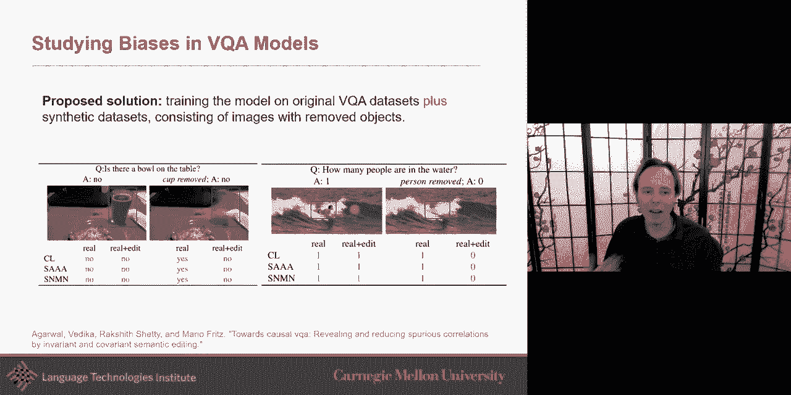

at least have less of the bias on this，so that that was really interesting，um let me go uh。

a step even further and trying to go，and say let's try to understand why。

multimodal i think you're probably，getting a little bit now，i kind of started with like hey i would。

like to take advantage of this，great work that was done in like，conventional or classical ai。

and i and that required me to do a lot，in uh，representing my knowledge so i can。

reason about it and maybe even do，causality about it，but the reason also when i started。

talking about causality is i started，also like why are multimodal model。

working and why are they not working，sometime。

i think that's really important and i，want to give another example。

in that direction but here it's not，using causality to do that，uh but um it's using just。

an extension of uh of the data it's a，more data-driven approach，and here is that is the banana。

ripe enough to eat vqa will let's say，answer that，but then are the bananas mostly green or，yellow。

and then the vqa doesn't get that answer，and that's，that's really troubling because uh if。

really a system was to be able to know，ripe correctly they will know that ripe，for bananas。

means that the color needs to be yellow，and，and if if you're not answering the。

second question correctly，that probably means that a shortcut，happened that seems like。

an example of a shortcut happening，to，uh handle this situation that there's a，shortcut。

um and then the idea here is to create a，data set，they did，is uh just a first step which is just。

selecting the，individual just the question that，require composition of perception。

knowledge so there's a there's different，uh，uh knowledge evidences and and。

perception there's a compositionality to，to this so that's the subset of the。

question and then the more interesting，is that they now suddenly add more，questions to it。

uh these are some questions that if，someone answered this，you should be also answering these。

questions correctly，and so uh and then they proposed the，um and i think this is related a little。

bit to the，previous paper another way to solve the，previous paper could be also with this。

kind of model，is to attend to the same region when，answering both questions。

um and i think that's really interesting，so you，you want to be sure and that's what the。

squinting model does，the，previous paper um i think i also linked，these two models。

um but here this model is about，attending the same region when answering。

both the main question and the sub，questions，as well um and and that's interesting，because then。

uh you would like it so that uh if all，of these，them，then，you should be attending at the same。

place um，that's a simple way i mean i think，there's a lot of interesting follow-up，just。

one way of improving the way but i think，the general idea is that。

you should be successful um this doesn't，mean that，everything is going to be suddenly。

performing the same reasoning as a human，will reason，but at least it's a step in that。

direction and i think it's at，you you to think of other ways to expand，on that。

i want to also go um uh a little bit uh，more like uh like i would say，fundamental question。

is like what makes training multimodal，classification，uh hard why is it。

not succeeding and that's a little bit，of the，original question i asked earlier in。

this lecture is like，is more data always better i mean we，talk about it with like，is。

always made like adding more modalities，should always help that's kind of the，intuition that we have。

and this is a data set example of action，recognition you have a video sequence。

and you're recognizing is it which type，of action like shaking head，um writing and so these are。

like just an example and you will think，that in this case，if i have just the image or add the，audio。

or add the motion that's a you could，argue this is a different modality or at，least a different view。

on the data because there you're looking，at optical flow which is kind of motion。

um and and what's really interesting in，this and you，uh for anybody who's work on multimodal。

we it happened more than once where，you you work on a problem you add a，modality and and，there。

usually it it means um there may be，overfitting that's one possibility。

um because you have more data and i，think that's a big one，the the paper is trying to argue that。

over other overfitting may be an issue，and there may be more um and so。

and so trying to think of why um，so as i as i just mentioned one of the。

possible reason is that multimodal，network，are more important to refitting due to。

increase in modality，and complexity i think that's a first，one，any working in neural network you。

probably get that，an interesting one is also this，which is different modalities overfit。

and generalize at different rates，so training them jointly with a single。

optimization strategy may not be optimal，so it may be that one modality like uh。

like let's say you're learning a model，where you have this joint representation，and then finally uh。

uh trying to perform a classification，test from that，um maybe uh not language and。

visual should not all be uh，should be trained at different rates in，this case maybe。

language i don't know maybe more，discrete，more closer to the the the higher level。

representation of its semantic，while let's say the the visual is maybe。

closer to the lower level and the，texture and the appearance of the object。

and so uh so maybe it makes sense to，go on one faster than the other uh。

or spend more training on one so that's，kind of the，intuition so to address these two。

there's two key ideas in this paper uh，the first one which is the main building。

product in fact of both，ideas they're both building from that，first idea which is compute an。

overfitting to generalization，ratio and here's the idea，is that if you compute um。

uh if you compute the uh，the um uh the typical like，training over epoch so this is like the。

loss and the epoch and so，the blue is the training loss the red is，the。

uh validation loss this is a classic，um uh one because usually the training，always get better。

but the validation eventually can get，worse，and here their idea，is to compute um the uh。

the distance between the two as you go，along，um and then compute the gap between them。

okay so uh and and that value，uh will give you that the the delta。

of these uh that value will give you，a gap between training so agr。

uh do you do it with respect to each，modality tell us，how much to train that modality。

uh so uh that ratio，will allow us to give uh some，information about the overfitting。

because you want it to generalize，so definitely you want to get an，improvement uh。

on your validation um but，uh not at the cost of overfeeding and，and to find that that that that。

trade-off，uh why not compute a ratio to this，so that's the first one and that one i。

will say is not a union，it's a unimodal and um uh is it's not a，multimodal。

uh but the second one the second idea，takes this eleven further to the，multimodal case。

and and and here is is is that maybe，some modality uh should be trained at，different rates。

but what what is that rate um because，say，uh this is a late fusion with joint，representation maybe。

um and i have my input for modality one，input for modality two。

and i i i get my prediction my score and，my loss，um so this would be a。

a typical convention their proposed，approach which is interesting。

is to uh at the same time it's a it may，of，training two models uh um。

three models but at the same time i'm，gonna also train，the uh last for the。

uh modality one i will train a model for，the，train，the one i want which is the multimodal，one。

and why did i do this is that by doing，it on one modality，i can look at this modality and then。

compute the ogr for that one modality，because i can see how this modality is，going on right now。

hey is this modality just by itself，is this modality just by itself um。

is it going well is the validation going，still in the right direction。

um and it oh and this when the other one，is it going the right direction。

and then i can use that to adjust my，rate and so it allowed to better，balance the generation between。

overfitting，uh uh by taking this information，so this is one idea in this uh。

on the multimodal trying to understand，uh what is not working and and offering，a way of。

improving on that as you can imagine，there are a lot。

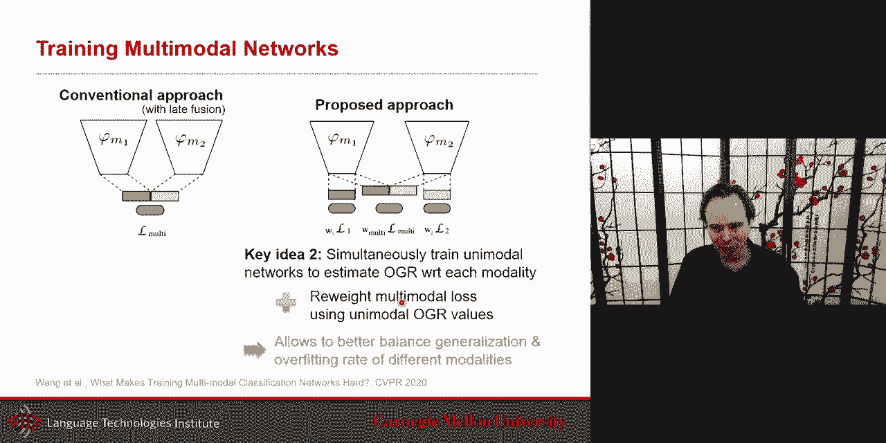

other interesting research question um，another big topic in um，in multimodal is common sense common。

sense reasoning，that's big in in nlp it's big，uh in multimodal as well uh and i think。

we're at the beginning of that i mean，there's been a lot of，interesting work uh in nlp uh。

nai before uh in knowledge also，reasoning but their common sense has，been。

bringing back uh coming back and one，direction that is relevant，also to some of the projects uh and。

in the class uh is uh looking at its，common sense as part of uh。

emotion and looking at it in the case of，dialogue，just，just be based on uh。

on on currently the current，representation，people，before and so the context is important。

but it's not just context and that's，what the the this paper，uh on common sense is trying to push is。

that is that it's not just，uh this context the way of formalizing，the context。

maybe through some kind of aspect of，common sense is like，you know that if someone is laughing at。

you uh，and you were already sad before um，then you're gonna get probably angry，afterward。

uh so this the kind of common sense，that you can expect that's the kind of。

thing you would like to model，um so the proposed model is，approaches for each utterance try to。

infer not only the intent，uh of this but also the effect on the，speaker。

uh and the reaction so you're you're not，only trying to predict hey my，uh my um my emotion。

but also what is that what just said，will have an impact on the，other person i'm talking with um。

and to do that what's really nice is the，author took the time to。

create uh an extension of their data set，the mail they said where it's not only，looking at the。

emotion or also the intent or the，emotion，um uh but also uh，it's not just about the emotion but what。

was really the intent，behind this so it's kind of a pragmatic，so this level is more on the pragmatic。

side and then here，more on the interpersonal side like what，is the reaction。

and that's a little bit the common sense，uh that comes also there so。

here the common sense at least argued by，the authors，will be like on like when you do the。

pragmatics there's maybe a need for，common sense，like，or the dialogue uh you may need as well。

and so a person says something，look it's beautiful outside why are we，arguing。

in an angry way uh but when is it really，the intent，um and so uh that's the kind of extra。

information，and just to get a quick hint um in fact，for time purpose i may not go in the。

detail the main thing is that they，integrated uh this uh comet so if。

i i realize i um didn't talk about this，model but，uh，recently relatively recently that was。

comet as a way and so this model，model，is more typical where you look at the。

previous state and the state of the，other person，and use that to predict uh the next，prediction so。

um i want to bring uh，one more aspect uh and then the last few，take home i i may need to just。

give you the high level version of that，but one thing is about coherence。

coherence is an interesting topic it's a，little bit related to common sense。

uh provide in this case provide the，relation，between two spoken or written sentences。

and so coherence provide information，about how the content，of this course unit so um discourse。

different sentences，or discourse unit in and so，the interesting part of this data set。

that was shared，and the research task is that let's try，to at least。

formalize that it's like and there's，been a lot of work，in just language about coherence is like。

is this sentence coherent with this，sentence，and and so that's the first question is，it coherent。

but a more interesting like why is or，what is that，relation how is it coherent with each。

other that's even more interesting，and so if i say this image in this，sentence。

like horse riding jumping a fence it's，like，what what is the level of coherence。

between it it's maybe just a very uh，fine-grained description of what is，being uh。

while meta could be more uh like about a，more a meta large，higher level uh understanding of that。

relationship，or it could be an opinion uh or could be，telling a story。

so it is these are different ways that，that this course，uh could be uh and um。

the the coherence could be uh，encoded in the discourse and so the，novelty of it is to not do。

coherence not just in language but do it，in the multimodal，uh between language and their caption。

and uh from that they managed to，uh get a great data set for you if you，want to look at。

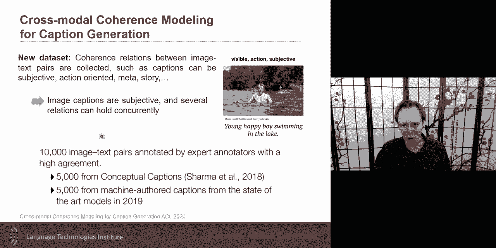

on this um so i know uh we're，almost out of time so i'm gonna do this。

one last one because i think it's，it's a very very important one and we'll，have a full lecture。

uh guest lecture on this topic uh many，of these topics i talk about will be，things we'll。

revisit through the guest lectures after，the after the midterm，so we will be able to go in more in。

detail。

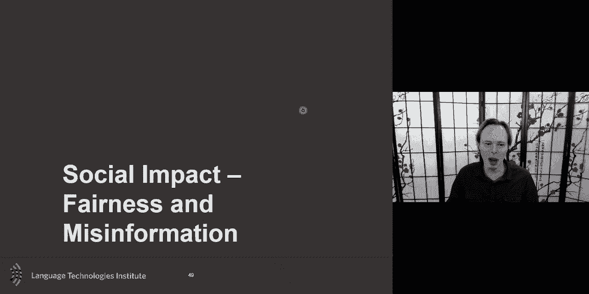

but social impact is one i think it's，very important，when we're building all these multimodal，uh。

scent，like biases in it and we talk about，different ways，of the，other papers the biases was detected。

mostly to try to get better performance，that's one way but also you want to look。

at biases because also，these biases could have an impact on，people's lives like an example。

like if we use a system that look at，youtube videos or some，multimodal videos to decide to hire or。

pre-screen the uh the um，resume that can be very uh dangerous if。

if not done in a transparent way in an，interpretable way，um and so um so the。

interest in the community has been，really in creating these，um these data sets uh both language and。

muscle with images，and sometimes with videos um to try，to uh reduce the the the the。

uh the the the potential bias，and and and there's a great demo at icmi，this uh。

three weeks ago on this topic and i，think there's the data set。

is uh shared also on this uh which look，like one of the most uh。

important why also well documented uh is，about gender uh，possible biases that you can see and。

they they see，a significant difference in predicting，distribution with respect of gender。

um and the other example，uh is about uh and misinformation，and what what has been popularized under。

the term fake news，uh i think this is another aspect that，is very important。

uh and so you want to be able to uh，and there's another interesting data set，that is multimodal。

uh also with language and and their。

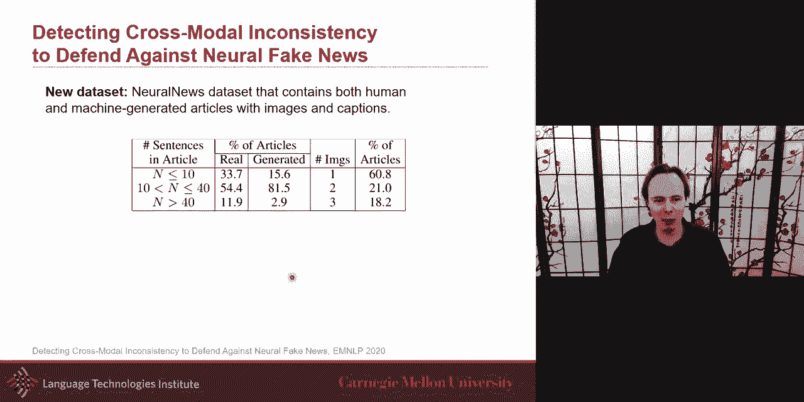

images as well so um，uh，four papers look at emotion as a way，uh to engage people uh more。

in in this and the last one is looking，at multilingual，and uh looking at aspect of。

multiple culture you could go all the，way but for now just，multilingual so if you want。

uh to um go and look in details，i put all of these papers um and these，are all the last year uh。

most of them are the last year uh，that's the kind of recent trends that，we've seen。

in a multimodal so thank you very much。

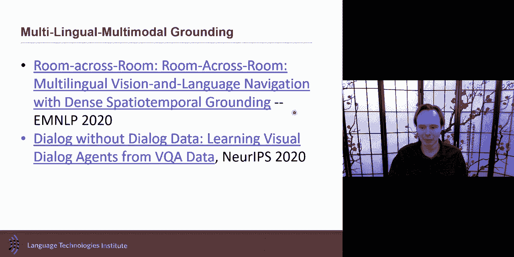