# 【双语字幕+资料下载】CMU 11-777 ｜ 多模态机器学习(2020·完整版) - P2：L1.2- 数据集 - ShowMeAI - BV1Pf4y1P7zc

uh today's lecture we're going to dive，deep into some of the main。

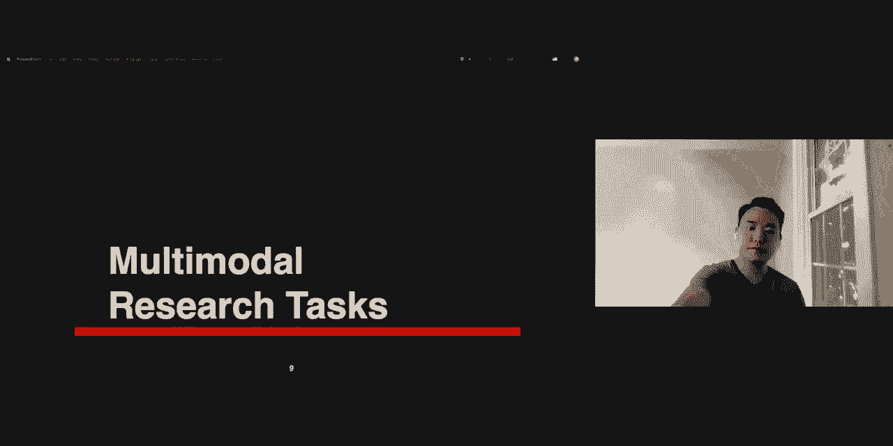

research tasks in multi-modal learning，and as rp mentioned that last week uh，sorry on tuesday。

there's four main prior eras of，multi-modal research，so multimodal research really started in。

1970s where people from psychology and，philosophy really asked。

how can we build these behavioral models，to understand human communication。

and human interaction in these social，settings，and in that era one of the biggest。

projects was the my gerk effect from a，cognitive psychologist。

which really looked at the importance of，both audio and visual information。

in speech recognition so a lot of，research then was inspired by psychology，and philosophy。

and it was not into the 1980s where，there was a resurgence，and really really accessible computing。

tools that people went into the，computational era，where the goal was to build some of。

these computational models to test，the psychology and philosophy theories。

that had developed in the behavioral era，some of the main research projects in。

the computational era involved building，these statistical models，that learn from data for tasks like。

and slowly towards them in the 2000s，became the interaction era where people。

focus less on understanding a single，human，but also looked at the interaction。

between humans and other humans，and humans and computers that was when，multimodal hci。

saw a boom in research and finally in，the 2010s，uh ever since you know there's been deep。

learning boom a lot of people have tried，get，really really good performance in。

multi-modal research and that will be，so we look at one of some of the。

specific research tasks that really led，to this resurgence in multimodal，learning。

it started with audiovisual speech，recognition in the 1990s，slowly then there was also a boom in a。

content-based video retrieval because，the internet was starting，a lot more videos being available on。

youtube and people really wanted to be，able to retrieve these videos based on，some content。

such as keywords and descriptions that，it provided so that was a huge。

motivating factor for both academia，industry，to work on multi-modal learning towards，the 2000s。

there was huge interest in effective，computing especially from groups like，roslyn picards。

and slowly then people also worked on，video event recognition there were these。

really large traffic challenges where，the goal is that you're given a video。

and you have to recognize the events，in the video uh lp's group。

also did a lot of the work in early work，in multi-modal sentiment analysis。

extending a lot of the work a，language-based sentiment analysis。

to the multi-modal form where you have，to look at both verbal and non-verbal，cues。

again align with this interaction era，where you're trying to build better，models。

and it wasn't really until the middle of，the 2010s or 2015s where there was this。

huge boom in multimodal research，really inspired by the work done in deep，learning。

for these unimodal data sets for example，really good models，for language such as language models and。

really good models for vision such as，your，cnns and the combination of these models。

really led to a booming language，and vision research it's not a surprise，that two most。

two modalities that people work on，primarily in multimodal learning are，language and vision。

and these are also the modalities that，deep learning has had the most success。

so in this era the deep learning era，some of the main，tasks that we're looking at involve。

image captioning，for sure and given the success of image，captioning be able to generate these。

really descriptive，captions from images people also started，looking at video captioning。

so adding this challenge of having the，temporal component where we have to。

reason over long-term interactions in，the video，and possibly and possibly give different。

captions for different times in a video，that was also a big area people looked，at。

but soon people realized that both image，captioning and video captioning。

while really catchy subjects that gave，really good results，there's some inherent problems and that。

main problem is that it's really hard to，evaluate these generation tasks。

so people begin kind of simplifying but，also localizing the problem a lot more。

by looking at visual question answering，where again you're given an image。

but instead of captioning any part about，the image you're asking a question。

about a specific area in the image and，you want to uncover an answer based on，that。

so this converted some of the，traditional generation tasks，into ones that were more classification。

based and also more localized，because given an image you can ask。

questions about any part of the image，there are large data sets built for that。

and soon there was also a vested，interest in extending these two videos，being able to reason。

across the temporal dependencies given a，question，localizing which part of the video that。

question refers to，and being able to retrieve an answer，from that from that area of the video。

uh soon after another area of research，that kind of extends these。

these multi-modal tasks what was that in，multi-modal dialogue，we are really trying to build the next。

generation of these interactive agents，that are able to interact both through。

language but at the same time also refer，to，particular aspects in the environment so。

building dialogue that is grounded in，oh someone's asking a question here what，is grounding。

so grounding is the essential task of，taking what，is described in language and being able。

to understand what language refers to in，the environment，there is no clear definition for this。

but throughout the years that is the，definition which people motivate their。

their applications based on so one，example is that，if i were to ask a question about the。

image for example，um how many boxes are in this image one，example of grounding would be to，localize。

what it means for the word box to be，referring to in this image，so you could kind of draw a region。

around the image representations of box，in the image，given your question so grounding is a，very。

very important question it is very，similar to alignment in the sense that。

your goal is to align the meaning of，concepts in language，with the meaning of concepts in image so。

that you can reason over them jointly，now we're going to go into grounding a。

lot more into in some of the future，slides that we're going to look at。

in particular when we're going to go，into these specific data sets and。

so extending multimodal dialogue in the，early 2018s，there was also a really large benefit of。

having large scale data sets from，industry，especially uh google and this youtube。

data set where the goal is to kind of，take these videos and understand what。

are the events going on within them，both as a classification task and also。

as a retrieval task so that if you're，given，some video that you're trying to search。

for you can retrieve the correct video，and recently in the past two years，linked。

all the great research happening in，reinforcement learning and robotics with，multimodal learning。

so on the reinforcement learning side，people started to look at。

language and vision navigation so you're，in some environment and you're given。

some natural language instruction，and you would like to build an agent。

that is able to navigate and follow，these instructions，in your environment combining both。

aspects of our language and vision，understanding and also reinforcement，learning。

to obtain these long-term goals，in terms of robotics there's also been a，resurgence in uh。

deep learning for self-driving cars and，a lot of these multi-sensory inputs that。

these self-driving cars have to take in，spanning both visual and signals such as。

lidar are also being processed by these，multi-modal machine learning。

methods and of course there's many more，problems to come，recently multimodal learning has been。

applied to robotics，to healthcare to education and we really。

hope that you you're going to be able to，explore some of these existing tasks on。

this slide and also the，so given all these real-world tasks，we've tried to group our best。

we try our best to group these，applications into seven groups，these are by no means exhaustive and。

this is by no means a perfect，categorization，but we'd like to share some of this kind。

of categorization with you so that helps，you localize what area you want to work。

on for your research，research project and also the data sets，that are within this area。

so the first one is that on effective，recognition effective computing。

uh building these computers are able to，understand these human centric behaviors。

like emotion and sentiment media，description，for image and video captioning。

multimodal qa which for the localizers，media description，by only answering a question by only。

providing an answer about a specific，question，target to one specific area of the image。

uh multi-modal navigation which really，combines these aspects of reinforcement，learning。

and robotics with understanding language，and vision，uh multi-modal dialogue being able to。

hold dialogue with a human，while being grounded in an image event。

recognition these are more computer，vision tasks，where you like to recognize the activity。

in a video and also segment the correct，activity the region，corresponding to that activity in a。

video and finally，multimedia retrieval where you're given，some tags。

possibly some similar images possibly，some tags and language and your goal is。

to retrieve a similar image or video uh，someone asking a really good question。

here has the reverse been done，can we go from caption to videos um。

there's this well even caption to images，is a really hard problem。

if you're trying to retrieve images it，really simplifies the problem but if。

you're trying to go from caption，to actually generating an image that is。

a very very difficult problem，both in terms of these high dimensional。

images that you have to generate，and also on evaluation it's really hard。

to evaluate what makes a good image，and in all of these machine learning。

tasks as you have seen if there，lacks good evaluation metrics this is。

really hard to make progress on them，uh for caption to video i would assume。

that there are some data sets where your，goal is to，take a caption and retrieve the nearest。

video so retrieval，kind of simplifies this generation，problem into a classification problem。

over all the videos that you have，which is more likely to be to be able to，be done uh。

if you want to go from a caption to，actually generating a video that is most，likely a very。

very difficult task just because，generating videos is really hard。

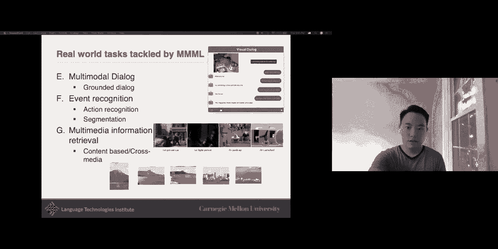

cool so right now i'm going to delve，into，a couple of these categories i think。

four of these categories real quick just，to give you a sense of what are some of。

the main research questions，some of the main data sets and some of，the main uh。

main course projects that have been done，in this similar area so that you can。

have a look at what are the standards，that other people have done in this，course。

so we're going to start with effective，computing uh，effective computing the grand goal of。

being of building computers that are，able to recognize emotions，and human effective states so when。

people think effective computing most of，you would just zoom into the first area。

where the goal is to look at these，effective states such as emotions。

moods and feelings but throughout the，years effective computing has。

taken a lot of different forms they've，studied a lot of different areas。

and many of these are very interesting，areas from both psychology and computer，science research。

so one example is uh understanding，cognitive states，given humans both individuals and in，groups。

can we understand whether humans are，thinking and concentrating。

that is very important in education a，lot of multimodal machine learning is。

being applied to education，the goal is to kind of interact with。

humans i interact with teachers in the，classroom，to find out whether the students are。

thinking or concentrating are curious，or have questions about the material，these。

cognitive states in terms of，personalities，the goal is not just to model like a。

single snapshot of emotion，but rather to make a long-term reasoning，and long-term judgment。

of the innate personalities that a human，might have expanding things like。

introvert and extrovert and other more，complex personalities，pathology focuses primarily on the。

intersection of machine learning and，healthcare，and the goal there is to to look at。

humans and decide whether they，are prone to various mental health，disorders or such as depression or。

anxiety and so on，finally social processes really extend a，lot of the research in both。

in individual affective computing to，that of groups，looking at how humans interact with each。

other to be able to，reason about these social processes，so just to go into a bit more detail and。

look at some of the labels，and annotations that people look at for，these tasks。

for effective states most of you are，quite familiar with this the goal here，is to。

recognize some more emotions standing，the simpler basic emotions like anger，discuss fear。

and also more complex emotions like，shame guilt frustration and anxiety。

at the same time i'm going to also give，you a highlight of these other states。

for cognitive states is really about，understanding whether someone is engaged。

has knowledge very important for，educational purposes，for personalities not just looking at a。

single state instantaneous in time but，reasoning over a long term to find out。

the innate personalities intrinsic to a，person so there's a well-known。

introverted extrovert but it also goes，beyond to describe things like whether a。

person seems to be artistic，seems to be responsible and seems to be，trusting。

pathology is a subset of effective，computing that is done a lot in。

in lp's group which is the intersection，of machine learning and healthcare。

so some of the doctors they were working，with were actually able to bring these。

multi-modal technologies，to these doctors and watch them interact，with these patients。

given these pre given these patients，both verbal and nonverbal cues。

the goal is to kind of predict whether，this person is at risk of being，depressed。

at risk of having anxiety having trauma，and many of these other mental health。

mental health disorders and this is a，very important research problem because。

most people when they go to the doctor，they don't know that they themselves are。

depressed and they're not going to，say it clearly from their verbal。

information that you know they seem to，be depressed it's really a lot of these。

subtle nonverbal gestures that，you have to look at in order to figure。

out whether this person is at risk of，and finally in the 2000s in the era of。

interaction people also started looking，at the social processes，both in terms of human computer。

interaction and also human human，interaction，so being able to understand these social，signals in。

groups and determining whether a group，of people show rapport，so obviously these are these are very。

very cool problems in machine learning，inspired by psychology but the main。

drawback about all of these is that the，data sets are rather small。

and these annotations are also quite，difficult to obtain it really，requires a good amount of human。

expertise to be able to，to annotate accurately a lot of these，labels for things like you know social。

processes and pathology you need doctors，to annotate that accurately。

but there are still some data sets in，this area that i go into，and there are also people looking at。

machine learning methods to model these，if you're interested more this course。

will not go that much into effective，computing the focus is more on the。

algorithms in multi-modal machine，learning but lp teaches this other。

course on multimodal effective computing，in this other semester so usually he，teaches it in spring。

and that might be taught next semester，or the following year，to be determined but you can always get。

these slides from，piazza in previous versions of the，course if you're interested in。

so i'm getting some questions here can，we get some references，to state-of-the-art papers and hiv。

subdomains，of course um that is the goal of，some of the things that i'll be going。

into both in terms of data sets and，models，some of these references will also be，posted online。

and also you know getting these，state-of-the-art papers is also a goal。

of your research so once you localize，into what area that you're trying to。

look at use the first thing you should，do is kind of look at these，state-of-the-art papers both。

not just in machine learning but also，you know in prior work in psychology。

so a lot of this effective computing did，start from being，inspired from psychology and philosophy。

research so you should also look at some，of the state-of-the-art works。

some of the state-of-the-art features，that people use in psychology as well。

that will cost you a big part of the，first project assignment。

another question i have here is is most，of multimodal learning supervised，that's a great question um。

after this lecture you will think that，most of multimodal learning is。

supervised because i'm introducing these，data sets the data set by data set and a。

lot of the models that i introduced，will also be specific to these data sets，but。

one of the main areas of of multi-modal，learning and machine learning in general。

is that of going towards unsupervised，learning and there's also a ton of cool，challenges there。

how can you learn useful multimodal，representations，without labels uh some of it will get，into。

in the fourth or fifth week of course of，the course uh，if you're interested early i think there。

are also some papers that will be posted，coming soon and you can also email some。

of the instructors to talk more about，unsupervised multi-modal learning yeah。

but these are great questions，if anytime anyone has any questions just，feel free to type in the chat。

i'm looking out for it and i'll answer，cool so that was a brief overview of，effective。

so right now we're going to go into some，of the specific data sets，that people look at in effective。

computing so that you have a sense of，what machine learning models have been，designed for it。

and it's impossible it's impossible for，me to talk about effective computing。

without talking about this audio visual，emotion challenge this challenge has，been here。

since 2011 it's been here for around 10，years，and every year they have this new。

challenge on being able to test whether，machine learning models can。

take both audio content what people say，in the verbal modalities，and also visual content so people's。

gestures and expressions，in the nonverbal modalities，and really trying to understand whether。

you can infer emotions from these，modalities some of the annotations，include both discrete emotions。

spanning happiness sadness and surprise，and also continuous emotions which might。

be a term new to some of you，continuous emotions are real valued。

dimensions of emotion that range across，continuous numbers，they range across the spectrum so one。

spectrum which people analyze is a，spectrum from positive to negative。

that is called valence another spectrum，which people analyze，is that of active to passive that is。

called arousal，so a lot of these data sets they are，looking at both valence positive and，negative。

and arousal active to passive and really，getting human annotators to v to，annotate these。

on a continuous spectrum so it's a，regression problem，and the goal is to take in this audio，both。

your discrete and continuous emotions，some of the recent data sets also have。

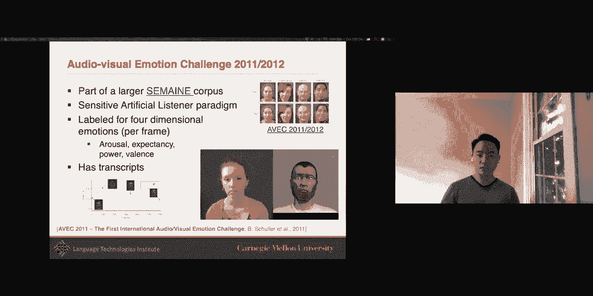

transcripts so you can，process text without actually looking at。

and there's also been some extensions of，this，some of them in other languages like。

german some of them more focused on，human computer interaction。

and some of these are more popular than，uh one really interesting data set is。

this one called the recola data set，and it's really popular firstly for a。

couple of reasons first it contains very，fine-grained annotations。

at the frame level so some of the data，says i'm going to be describing to you。

have an entire video and after you，finish the entire video of someone。

speaking you have a single annotation，for that entire video，for the zuccola data set you have this。

entire video，and you actually have fables at every，frame so you have these temporal labels。

in this case these are continuous，emotions of arousal and valence。

and essentially you have a slider of，these continuous emotions that goes。

up and down across the frames in the，video so these are really really，fine-grained labels。

that add in uh further challenges which，i've made this data set a very。

interesting one for people to study，another interesting aspect is that apart。

from both audio and visual features，it also includes physiologic，physiological data。

so one of them is uh electrocardiography，which is a graph of voltage versus time。

of the electrical activity of the heart，so how fast the heart is pumping。

and that is measured using using some，electrodes on the skin，eda is another another physiological。

signal that measures how much a，person is sweating so both your sweating，and heart rates。

have been seen in psychology psychology，research to be predictors of。

emotion and the goal here is also to see，where the machine learning models are。

able to accurately integrate，both your verbal non-verbal features and，also these。

physiological data sources to be able to，so a lot of these data sets in effective。

computing have been around for longer，just because effective computing is an。

earlier field that started，in both psychology and statistical，analysis before moving into this deep。

learning era，and it's always a trade-off so a lot of，these data sets and effective computing。

have been along for some time the，benefit is that there's a lot of work。

in both data driven and also psychology，research and studying these。

these problems but the main the main，drawback is that you then have to work，harder to find。

ways to improve these problems these are，cool some of the also talk about some of。

the research that has come out of our，group，so our group has really focused on。

multimodal central analysis，so sentiment is a concept in language，and people have studied this in。

linguistics，essentially whether a person is，reflecting positively or negatively to a。

particular video，this started off as a main research，important。

if i express something like you know i，went to the restaurant and i loved the。

food the service was awesome，it's clear that i'm giving a very，subjectively positive opinion。

about this about a topic i had which is，this restaurant，so language kind of offers most of the。

heavy lifting offers most of the，information and，sentiment analysis but uh we also。

realized that people also tend to，express their opinions in normal，gestures。

so things like you know sarcasm things，like uh，just being ambivalent in language by you，know showing。

visibly discontent with visible，discontent，using uh your verbal nonverbal gestures。

so if what we've done is we extended，some of this work in language-based，sentiment analysis。

to these multimodal sources we've，collected some videos on youtube。

spanning many speakers and spanning，a bunch of opinion videos and the goal，is to take in these。

language visual and acoustic data and。

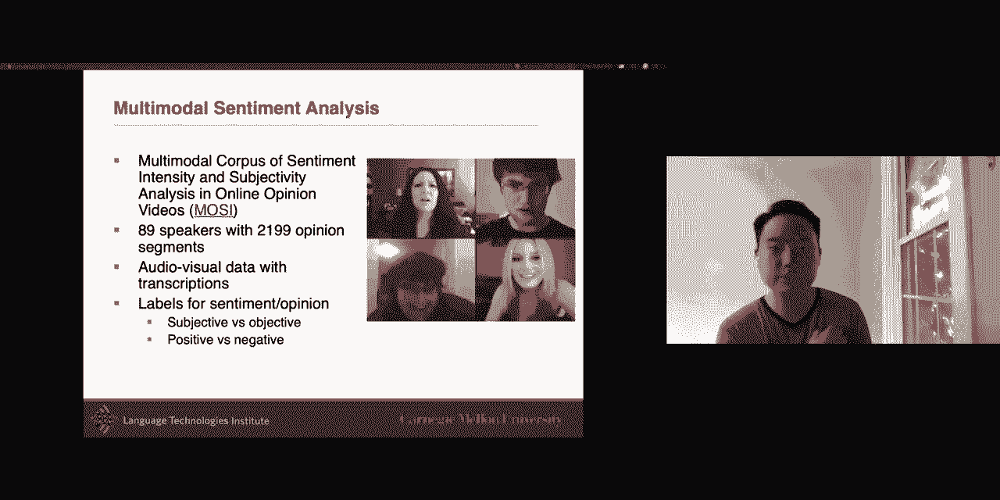

we've also since then expanded this data，set so now this is one of the largest，data sets。

in multi-modal learning that spans，almost 25 000 video segments。

a thousand speakers and 250 topics and，we've also extended the annotations from，both。

fine-grained sentiment five class，sentiment to a lot of these emotions。

at the same time people have also，extended the research，on both from single person to。

multi-party emotional recognition，so this mel data set is a data set，show。

and you're annotating the emotions of，each of the characters separately。

so the goal here is not just to look at，the overall，sentiment and emotions of the entire。

conversation but rather to keep these，baseline models，of how each each individual is。

is progressing in terms of their，emotions now in this case，one of the characters is always showing。

positive emotion，joy and surprise while the other person，is，showing more anger。

cool so i have a question here i would，think that defining emotional state。

would require combinations of some time，period of facial landmarks。

gestures and eyes across multiple frames，so does it make sense to have emotion。

labels at a frame level，that's a great question so um this，really ties into what i'm going to talk。

a bit next，which is what are the core challenges，most involved in effect recognition。

so i think the main question here is，that is that of the alignment problem。

because you have these like really long，term videos，you have language you have visual and。

acoustic and a lot of these features are，not necessarily going to be aligned。

if i'm saying something positive at time，5，i'm most likely going to smile at some。

other time maybe i would smile you know，two seconds later，and maybe i would even laugh maybe a few。

seconds later so there's this alignment，problem where，not all the modalities are perfectly。

aligned at the same time level，so whether it makes sense to have。

annotations at that particular frame，level，such a way that people deal with this。

well there's two aspects first of all，problem，which is a big problem in research。

regardless of whether you want to have，predictions at a frame level or you want。

to put have predictions at a video level，alignment is one of those problems which，is always there。

uh in terms of actually having emotions，at a frame level，what people do tend to do is that。

uh you will want to annotate when these，annotators are looking at these videos。

they're kind of having，they have a sliding bar so the frame the，annotation。

for the frame t equals to five is，actually looking at the information。

before t equals to five so you want to，keep a rolling average of the features。

that you have seen so far，and use that to update your your your，frame level emotion annotation。

so in this case it's kind of simplifying，the alignment problem to only having to。

reason about information that has，happened，in the previous time steps in the video。

but these are awesome questions um these，are kind of the research questions that。

you should be looking at，basically not just looking at the data。

set itself but really challenging some，of the，hypotheses and assumptions and research，questions that。

came out when this when the authors of，so going on that similar vein when。

everyone's working on these tasks，i want everyone to think about what are，the main challenges in。

modeling these problems not just trying，to get better results on。

the data set but really thinking about，some of the research questions so。

uh for affect recognition a lot of the，main challenges comes in fusing these，modalities。

you have multiple data sources some of，which are more useful than others at，different time periods。

the goal is related to how to best，leverage all these data sources to make，a prediction。

at the same time you need to have，suitable levels of extraction，to get really good multimodal。

representations，and you also need alignment so in this，case because most of these data sets。

are temporal data sets consisting of，videos alignment is a very big challenge。

where you have to align，you know positive words in text with，smiles and gestures and。

co-learning is something that people，don't usually study but，it's also an area which has has arisen。

in affective computing，and there was one example which lp，talked about last week which is to。

look at language-based sentiment，analysis but during training，you kind of enriching language with。

visual and audio behaviors，if you recall that was the model where，you took language。

you're trying to construct construct，these audio and visual behaviors to make。

language more informative，but at test time you're only using，language。

so that is one example of co-learning，and i have seen people apply co-learning。

cool at this point i'm going to go into，two examples of past research projects。

and from taken done by students taking，this course，on affected computing so one of this。

research projects is called，select additive learning and the goal，here is to。

perform better on multimodal sentiment，analysis across these data sets。

and the main idea is to reduce the，effect of confounding factors。

so what are these confounding factors，let me give you an example。

so suppose you have a data set like this，you have um，each of these are video clips and。

they're saying something and you know，each of these，each of these uh these speakers are say。

multiple utterances no some of them are，positive some of them are negative。

annotated in the most data set，so the main problem in machine learning。

research is to find what rules you can，infer from this data，rules being a mapping from input。

features，to labels that you want to predict so if，you look at this for example you see the。

first person is smiling，the third person is smiling and they，consistently show positive sentiment。

so one rule that you could infer from，training these supervised learning。

models is that the presence of a smile，leads to positive sentiment another rule。

that you could infer based on you know，this person，and this person down here is that the。

presence of a frown indicates negative，sentiment，and these are very reasonable rules that。

most likely would generalize，likewise you could see that a nod might，refer to positive sentiment。

but if you look at this data set another，rule that you could infer is that。

because this person is wearing glasses，and this person is wearing glasses。

and so is this person and they all，co-occur with the fact that they're。

saying something that contains negative，sentiment a possible rule that you could。

infer that would still be consistent，with this data set，is that the presence of glasses worn by。

a person，leads to negative sentiment and if you，if you use such a rule and you train it。

on this data set you will still get a，really good training，and test error but this is what we call。

a confounding factor that most likely，will not generalize，so essentially this is an artifact in。

so what the students proposed was to，build a solution that，learns representations that kind of。

masks out the effect of user identity，because a lot of they found they went。

through these data sets they found that，a lot of these，confounding factors actually had to do。

with these you know person-specific，things i know whether a person is，wearing glasses。

whether a person you know is male or，female has you know black or brown hair。

so what they did was to modify the，conventional representation learning。

approach that goes from features，through a model to your labels。

to a new model that takes in features，learns the representations，but at the same time also takes in。

identities learns a representation，and adding noise to the representation，of these identities。

the hypothesis here is that the，representation of，the uh the representation that is most。

useful in predicting a label，should come from these person，independent features you know。

things that whether you're actually，smiling or nodding，and these personal dependent factors。

which actually should not take part，in making your prediction things like。

whether you're actually wearing glasses，or what color your hair is。

so by adding noise and sampling various，amounts of noise across this data set。

you're actually marginalizing the effect，of speakers out from the model。

you're making sure that a model is is，not really taking it into account。

the identity of the speaker and still，being able to focus on，the real useful input features towards。

right so this was a course project done，i think about three years ago and。

this was published in this multimedia，conference，another research project which is also。

focused on multimodal sentiment analysis，is that of solving the alignment and。

both both fusion and alignment problem，so the goal is to estimate the。

importance of each modality at the word，level in a video，so in terms of fusion the goal is to。

kind of take this video and break it，apart into multiple，frames and for each frame we're going to。

reason about whether，the language visual and acoustic，gestures are actually useful。

so in this case we see that this speaker，is only showing a smile at this time，step。

and what we should do is build a gate，that lets these visual features pass。

into the model to predict that this，person is showing positive sentiment。

and the other times of the video where，the person is not showing any visible。

gestures from visual modality we should，not use this visual modality，towards making a prediction。

the goal is to you know build a model，that is more interpretable。

that estimates modality and temporal，importance and learns to attend to this，important information。

and our solution here was um a couple of，components in this model。

one of the main components is to to be，the first one to do a word level。

alignment so we're actually segmenting，uh we're defining like a reasonable。

approximation to segment the video，into the level of words so we're going，to take all of these words。

each of them correspond to one time step，and we're going to take the audio and。

visual gestures and align them，with respect to these words so the basic，assumption here is that。

whatever is you're going to say a word，and you're also going to attend to the。

visual and audio gestures that were set，during this same duration and in terms。

of estimating the importance，we have both a temporal attention which。

estimates the importance of each time，step，certain time steps might correspond more。

towards predicting a label，if you know that time step has a very，visibly important word or gesture。

and other time steps will correspond，less，and for these other modalities like。

audio and visual we also have this scada，attention，that is a binary gate that is either，zero or one。

which either lets these audio visual，features go through，if the model estimates that they are。

important towards producing a label，so the hypothesis here is that the。

attention weights represent the，contribution of each modality at each，time step。

and likewise the modality gates is meant，to determine the importance and。

contribution of each modality，and because these gates are zero and one。

they're not continuous numbers that you，can back propagate through we're，actually。

training these gates using reinforcement，learning and that's one of the main。

cool so those are two examples of cross，projects that were done in previous。

now i'm going to jump into a media。

so as you recall in this computational，and deep learning era media description。

uh given an image like a video like，videos and audios and being able to，accurately caption the image。

was one of the main enablers of modern，multi-modal machine learning research。

both in terms of really large data sets，that have images and captions and a lot。

of these data sets are also obtained，from the internet for example a lot of。

these data sets are from things like，instagram flickr where you have where。

people just upload these images and，provide some user generated captions for，these。

so these large data sets and progress in。

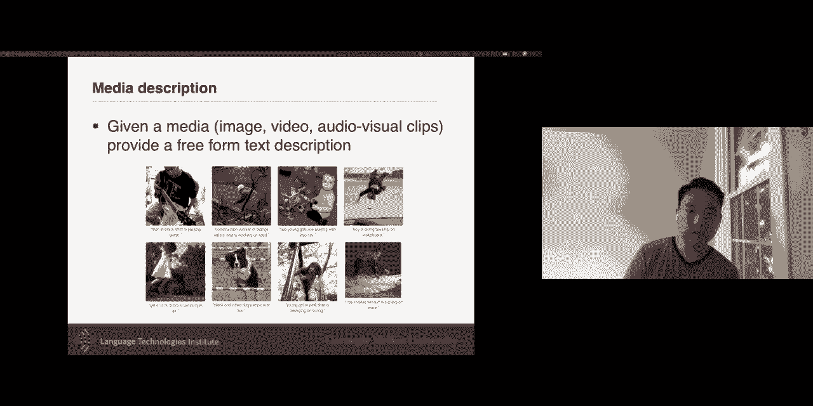

modeling really enabled this modern boom，in multi-modal machine learning research。

and one of the biggest data sets that，enabled this was the，ms cocoa data set uh this one was a。

really large 120 000 images and each of，these images was taken onto amazon。

mechanical turk and annotated，with um five different captions and it's，really important to。

get high quality annotations that span，many captions because，uh because this is like a this this。

problem requires you to，reason about many different captions，that could be generated from the same。

uh the main challenge here again is that，of evaluation，many of these generation tasks is very。

difficult to evaluate，what is what makes a good caption and，what makes a bad caption you don't want。

to necessarily just，constrain yourself with something like，supervised learning where you just try。

to match the captures exactly because，capture an，image and many of these could still be。

reasonable captions despite，so when these people released these data。

set they also had an evaluation server，um and the goal here was to at least try。

their best to take this candidate，sentence，and evaluate against a set of ground。

truth sentences using either，human or evaluation metrics，and what they did at cbpr 2015 was that。

they actually，uh tested a lot of these models that，people submitted。

and they did a very exhaustive test，using human annotations they actually。

gave these images and captions to humans，on enter，and they had humans look at whether。

and not surprisingly the answer was no a，lot of these，these models done by google microsoft a。

lot of these big companies，they had very good models but a lot of。

it was still quite far from how humans，would judge whether a good a good，caption would be。

so there's still a lot of work to be，done in this area one of the main。

challenges again is annotation，because ideally you don't want to build。

a model and have to annotate it using，humans，evaluate it using humans every time you，model。

humans labels are really expensive so，people have also tried coming up with，automatic。

labels these are things like cider，meteor rogue，blue essentially these look at um the。

captions that you generate and some of，the reference captions and they match。

some overlap in terms of your n-grams so，how much your，the，and the main question here is that you。

know if you want to not rely that much，on human，evaluation and instead rely on these。

automatic evaluation methods which are，really really fast，well these two things have to be。

consistent so there must be a clear，correspondence clear correlation between。

automatic and human evaluations，well the answer is that it doesn't it，doesn't correspond so well。

in fact just based on automatic captions，a lot of these models from the same，challenge by google msr。

they actually outperform human，performance，so clearly there's some issue with these。

automatic metrics that，are kind of allowing these models to，overfit to the training data。

still get really good automatic，evaluation performance but obviously not。

good performance as judged by a human，so at the same time a lot of people are。

working on building better models for，these media description and captioning。

problems a lot of the research is also，going into building better。

evaluation metrics that you'll contain a，big a mix of human and automatic metrics。

so soon after image captioning uh people，extended the task to videos。

to mainly tackle this new problem of，having，having temporal dependence so，essentially you want to。

capture not just a single part of the，image but also caption。

various parts of a video possibly across，a continuous spectrum，as the video is being played。

and there's also been some interesting，data sets coming out including a，character's data set，uh。

in this case you're actually asking，amterkers to act out this description。

so the benefit here is that you actually，have these ground truth。

scripts that you start by generating you，get the videos of people acting it out。

and then you get more people to annotate，these descriptions so this already。

allows for more fine-grained control，over，what you're actually seeing in a data。

set and what the ground truth，there's some questions here uh one，question is what is the objective。

function，in image captioning，that's a good question again coupled。

with the fact that it's very difficult，to evaluate，there is no clear objective function。

that people prefer i think the one，that's most popular is just to。

have something that optimizes for the，step，when you're generating this sentence so。

similar loss function to that in，language modeling or machine translation。

but as people work on designing better，evaluation metrics，people have also started looking at。

building objective functions to directly，optimize for these evaluation metrics，directly。

because you know there's there is a，mismatch between optimizing for negative。

log likelihood and some of the，metrics that people care about，so there's some research done in。

designing these better objective，functions，some of the main challenges there are。

that some of the objectives some of the，evaluation metrics that。

should be optimized for including these，things like uh，blue cider rogue scores which check for。

matching，engrams these are not differentiable so，it's not，as trivial to optimize as your cross。

entropy loss，so people have also designed some，methods to circumvent that being able to。

tackle these uh，these directly optimizing for these，evaluation metrics but at the same time。

heading the fact that they are not，someone is also asking can we have an，evaluation model。

since verification is easier than，generation this could be feasible。

so essentially a verification evaluation，model that takes in images。

and possible captions and scores how，good these captions are i have not。

seen some of this but i wouldn't be，surprised if some of these exist i think。

it definitely is an interesting idea，it's uh，similar in the sense to how people who。

work in complexity theory know that you，know solving an empty heart problem is，clearly harder than。

verifying that a solution to an empty，heart problem is indeed true so that is。

that is one of the interesting research，areas if you're interested in that i。

would highly suggest you look at some of，the related work and，and perhaps do it for your course。

so another way to circumvent the problem，of these really difficult evaluation。

metrics is to change the task from，direct generation of the captions to，referring expressions。

which essentially what you're doing is，given an image，and you're given some descriptions。

within the image，and your goal is to localize the，particular areas in the image that you。

are referring to，for example in this case you are just，you have given an image there's two，women。

the goal is to localize the women on the，right in the white shirt and your goal，is to uh。

to be able to identify this particular，object that the text is corresponding to。

this is also a pretty interesting task，it is related to grounding the goal。

where you're trying to link，these linguistic elements so what is，being described in text。

to what is being referred to in the，image，and while this seems like a isolated，task in itself。

grounding is actually an important area，that has to be solved first before you，and。

alignment problems that come up later in，recently people have also built these。

larger scale description and grounding，data sets，i really like this visual genome data。

set because it offers really really，fine-grained annotations。

in text as well as the bounding boxes of，where they're referring to the image。

so in this case you always have these，entities that correspond to nouns in the。

image like in this case，you have a girl corresponding to a，bounding box around the girl。

you also have these attributes like，behind，and there's going to be no man behind。

girl so the man would，so，a very very densely connected graph of。

all the entities in the image as well as，possible relationships。

between these entities and this has also，emerged as a very useful data set。

both for reasoning and grounding and，also as a pre-training step towards，building better multi-modal。

representations for，so the main challenges here are，definitely translation。

the goal is to uh map data from one，modality to semantically meaningful。

high-dimensional data in another，modality for example image to captions。

but at the same time you need a very，good representation，that is aligned between these two。

modalities to be able to，to accurately perform translation，and when people kind of simplify the。

problem using referring expressions and，you know grounding the core there is。

also the alignment problem。

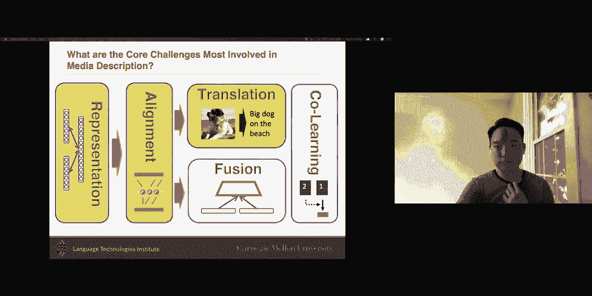

all right just two more sections to go，so for multi-modal qa the main。

motivation of this task was really to，supplement some of the challenges。

um in image captioning and video，captioning where it's really hard to，evaluate generation。

so it's really so to convert these you，know image and，these media description tasks into a。

classification task，so one of the most popular is this，visual question answering data set where。

you have a bunch of images，you're asking some questions like what，of。

and your goal is to localize what the，question is referring to in the image。

and uncover the correct answer this data，set has been long for。

for very long it's been almost six years，and many many methods have been proposed。

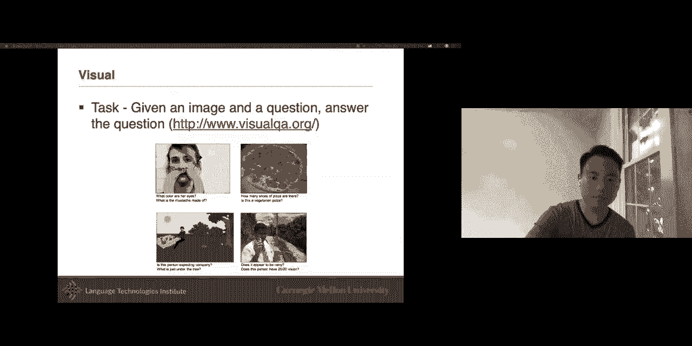

for this，so this vqa data set uh i think since，then people have also expanded it to。

include both real images and also，synthetic images，and the benefit of this data set is that。

it's just really really large，in scale it's more than 200 000 images，and。

in terms of these uh multiple choice，questions that are both true and false，it spans more than。

uh six million answers out of which 1。8，and every year at um some of the。

language and vision conferences there，are these challenges for vqa。

and people have found that currently，they're quite good at vcs and no，questions。

but some of the main challenges are that，in free form questions and counting so。

free-form questions are questions where，the sentence structure differs quite。

quite quite a lot between training and，testing，accounting is also a very difficult task。

now if i were to ask you know how many，how many yellow bananas are there that。

is a more challenging task for，for machine learning rather than just。

beyond supervised learning people have，also found some issues with these。

vqa datasets which is just guessing，without an image so just given a。

question and predicting an answer based，on a question using，these are purely language based models。

they actually perform pretty well，and adding the visual only leads to a 14，increase accuracy。

so one example is um if i have a vqa，model，and i'm going to ask the model what。

color is the banana without actually，looking at the image，most of the time your vqa model will。

answer yellow just because 80，of the bananas in the training set are，yellow。

and as a result if you actually test，this vqa model on a green banana。

which obviously doesn't happen that much，it's still going to predict yellow。

so some of these models are shown to be，biased in a sense that they just rely on，a simple form。

kind of looking at these simple，statistics in a data set looking at what。

correlates the most in these in the，language modality，and kind of ignoring the image which is。

a more complex task for the model to do，and recently there have been some new，data sets to。

to solve this problem by really，having the same question by giving the。

same question and having a bunch of，images where the answer is different。

so i like this example a lot the，question is where is the child sitting。

and most of the times you would just，answer arms like or arms or chair or，something。

and you actually they actually got an，image of a child sitting in a fridge。

to force the model to make sure that you，know you can't understand the image and，surface。

correctly so these are some of the more，interesting problems that people are。

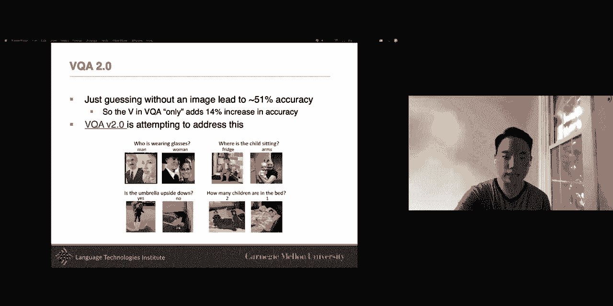

looking at that，and beyond vqa there's a bunch of other，data sets。

most of them similar in vein here's a，reference you can。

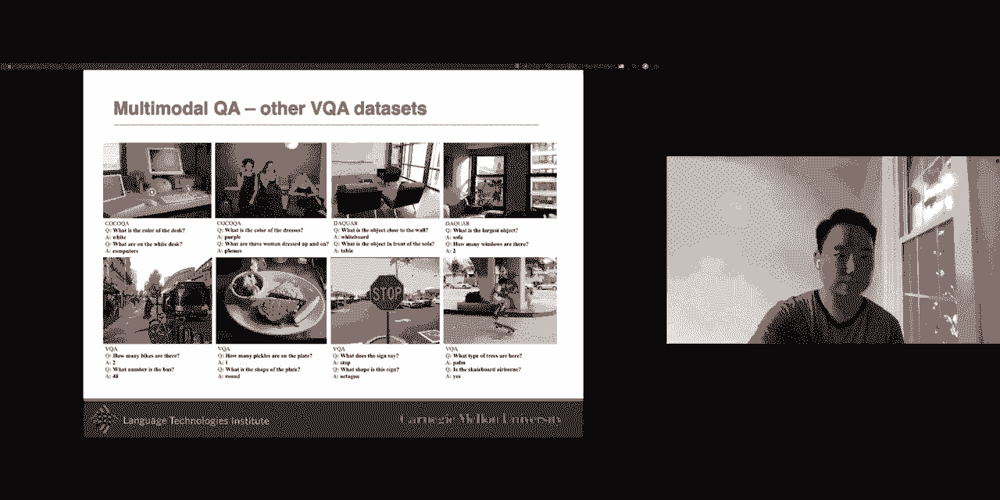

look more at them if you're interested，these are all，image-based qa and likewise people have。

also tried to extend this to a video，based qa so，tvqa is one where you're given a，long-term。

tv show and you have to ask and answer，questions as specific parts of the tv，show。

one challenge here is that one challenge，here is that，you also have to deal with compositional。

questions because，some of the questions might actually，refer to previous parts of the video or。

previous questions，vcr is also a nice data set it extends，vqa，to requiring the model to give an。

explanation，instead of just uh instead of just，giving the correct answer。

and a lot of this does require some，amount of common sense reasoning。

to provide a rational for why the answer。

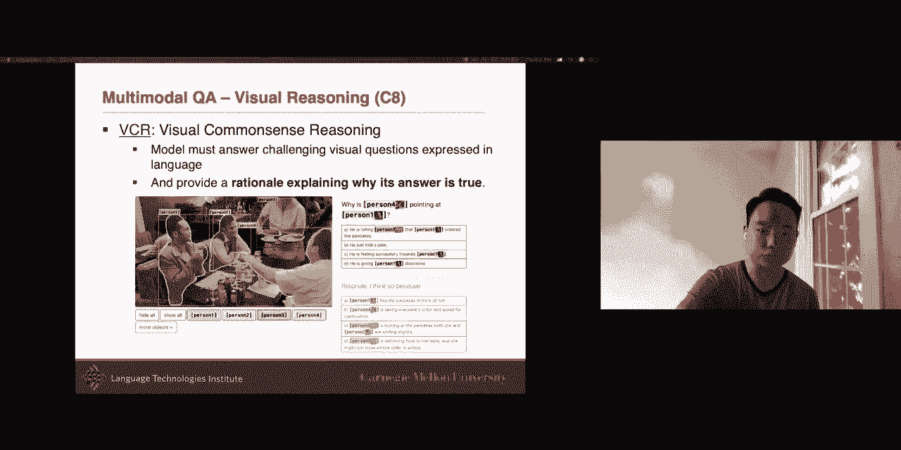

is true，one of the data sets that came out of，our group is this a social iq data set。

which is a mix of you know effective，computing and also，recent research in a multi-modal qa so。

it's a qa data set that is primarily，focused on，uh social behaviors and social。

interactions so things like，you know uh how is the discussion，between the woman and the man in the。

white shirt，uh so one of the answers could be she is，blaming her in a tense voice and not。

letting him defend himself，so a lot of these don't really focus on，objects which vqa。

and vcr data sets have and instead focus，i have a question here in vqa do we。

manually balance the data，so that it does not have any bias that's，a great question。

i think there is no universal answer to，this，well and this is a question that is not。

just specific to vqa this is a question，that，happens everywhere in machine learning。

research you're going to collect some，data sets you think your data set is。

awesome it's large it's very annotated，but then you realize that their data set。

has you know inherent inherent biases it，can be，biases and de-annotation it can be，biases in the。

data it can be social biases language，biases and so on，and people are generally split across。

what i think you know two different，areas，one area is to take a closer look at the。

data set balance it make sure that it's，not biased，which you know does work well but it。

does require some effort you know you，might have to remove certain portions of，the data set。

you might have to annotate new data to，make sure that you know all the aspects。

of bias are equally represented，which is a more challenging task but the。

hope is that once you have a balanced，data set，training a model results in a model that。

shows less bias，another area is to ignore the data and，really look at。

how a model can be used to take in，bios data but learn representations that，are not biased。

so that is more of the algorithmic，challenge where you're trying to，learn unbiased learn fair。

representations from possibly biased，data，and that is also difficult because you。

have to define what bias means sometimes，you might require retraining these。

models sometimes it might require you，know post-processing these models。

but this is also a big area of research，and and i really like this area i think。

more people should work on it especially，in the context of multi-modal research。

i think the the end result is possibly，going to be a mix between。

making sure that data sets on by data，sets you know，try to be unbiased as possible but at。

the same time you also want to make sure，that，your algorithms your evaluation metrics。

are actually accurately characterizing，these biases。

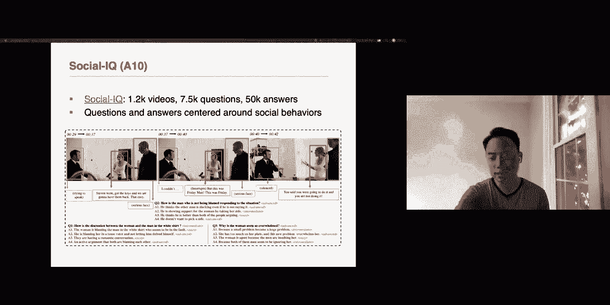

so in multimodal qa likewise you know a，lot of research questions to look at。

translation alignment and representation，are the the main challenges。

as well as fusion uh a lot of these，challenges are the same as that。

as a media description and retrieval i，think the main，additional challenge that qa has is that。

you must also comprehend the question，and localize what part of the image or，video that。

the question is corresponding to so in，this case alignment is a。

is a bigger challenge than it would have，cool just to give a sense of what are，some of the。

problems uh that some students have，worked on for week for a。

multimodal qa i really like this project，from，fall 2019 i think so the goal here is to。

design adversarial attacks on these bqa，models，so for people who are unfamiliar。

adversarial attacks are this，new area of research in ensuring testing。

and benchmarking the robustness of these，deep learning methods。

so deep learning obviously has is very，good at supervised learning it has。

obtained really really good performance，on multiple tasks but people still don't。

really understand how，most of these deep learning models work，and what people have found is that if。

you give the，deep learning model an image so in this，case you're giving it to a pre-trained。

image net，you're giving this image it predicts，panda with pretty high confidence。

that's good you can actually add a，really really small amount of you know。

gaussian noise or some other type of，noise which is，which causes a change that is basically。

imperceptible to the human eye，and if you put the same image to the，given，with really really high 99。

3 confidence，so this is a，what's called an adversarial attack uh，an attack because。

an adversary attack because it's making，the neural network change your，wrong。

with very high confidence and yet it's，and the goal here is not just to to show。

that these attacks are possible，it's also moral to show that you know。

these are some adversarial settings that，neural nets don't work well on how can。

we show that social some of these，settings，and at the same time benchmark and。

improve the robustness of these existing，models，so a lot of these other server attacks。

are start off being in computer vision，image classification this group looked。

at the adversarial attacks，on vqa models as a step towards。

benchmarking their robustness，and what would it look like in a vqa。

setting so let's say this is the image，that you started off with。

and the question is what kind of flowers，are in the face，and your answer would be rose if you。

know everything went wrong this was a，pre-trained model everything goes well。

and they found that they were able to，design these um，these perturbations to the image in this。

case it's very interesting because they，were able to design a preservation that，focuses primarily。

on the vase and they're able to add this，perturbation to the image。

feed the same image to the vqa model and，given the same question。

the vqa model will now predict sunflower，instead of rose with very high。

higher confidence and the question here，is how can we design a targeted attack。

on these images on vqa models，which will further help in assessing。

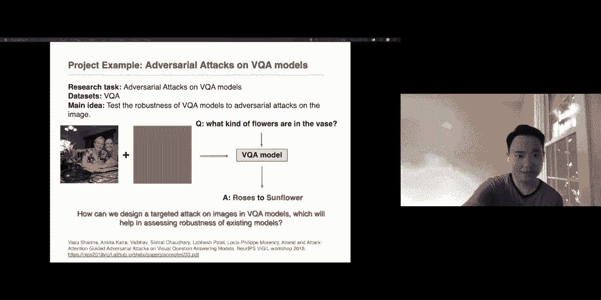

robustness of these existing methods，and the core idea here was to use a。

fusion over the original image and the，question，to generate these adversarial，perturbation maps that。

were localized with the um that were，localized in the image，with respect to the question so i found。

this here saying you know the question，helps you to localize these important，visual regions。

these are the uh regions that the vqa，model that is pre-trained will look at。

and you really want to target these，important visual regions。

to get a better adversarial attack so in，this case，the question is what is the man doing。

they were able to generate，these perturbation maps that focus，primarily on demand。

in this case a minus snowboarding so，these maps are primarily on demand。

and these adversarial perturbation maps，will then be uh input，added to the image and input to the。

model and force the model to，to make a wrong prediction so this is an，example of。

a pretty cool project where language，helps in localizing which areas you have，several attacks。

should focus on i think they also found，that if you just did adversarial attacks。

on the image it would just be you know，possibly something like uniform noise，across the entire image。

that is not interpretable and that is，not localizable with respect to where。

the question is answering but they're，able to generate uh，both smaller perturbations of smaller。

norm and more localized to where。

so just on to the very last topic，and very last set of data sets that i'll。

be introducing，and that is for multi-modal navigation，and this really comes up。

with no the really the growth of，reinforcement learning and the growth of。

robotics that have really enabled，the next general generation of ai。

assistants to interact with the real，world，we've seen a lot of these you know。

personal assistants we have these，personal robots coming up，we have them being deployed both in。

simulation and also in the real world，we also have self-driving cars which is，another example of a。

ai agent that has to interact with the，real world possibly taking into account，these。

multimodal signals and the core，challenge here is that。

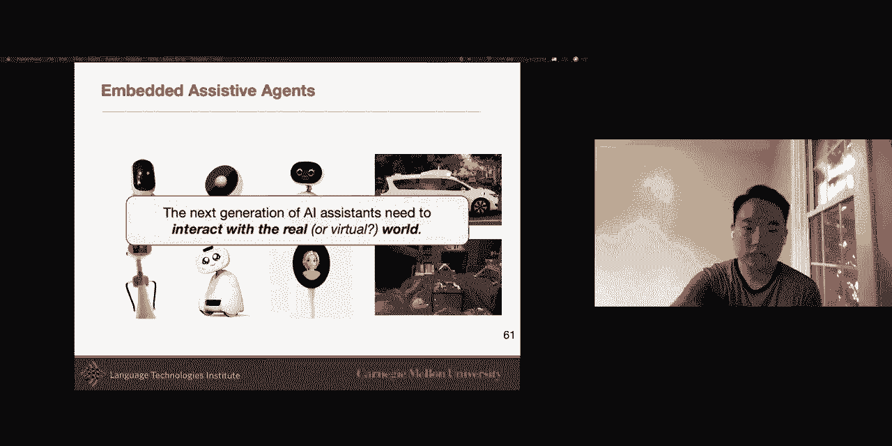

in addition to just understanding，language and vision we also have to take，actions in the real world。

so it's really about both multi-modal，perception，of the environment and also linking that，to action。

uh taking actions in the real world，which possibly leads you to a next state。

and therefore you have a loop between a，multi-modal perception and actions that，you have to take。

so here's an example you're in this，environment this is a hotel room。

the user tells the robot to go to the，entrance of the lounge area。

so first the robot has to do exactly，that it goes to the entrance of the，lounge area。

it's gonna that that's a set of actions，that it's gonna take at a start。

it's gonna take a response and tell the，human that you know i'm here。

what else should i do a user would say，on the right，there is a bar on top of the counter。

you'll see a box and bring that to me，so that's also a very complex natural，language instruction。

which the robot has to understand both，the language，and the visual environments and take，these。

these correct actions in order to，so here's like another example uh to。

really illustrate the technical，challenges that come here，that that arise in multimodal navigation。

so we're going to look at instruction，following for example so we're going to，start with an。

instruction and you're also going to，start with an initial viewpoint。

that the robot is currently in so in，this case the viewpoint is，in this house facing a door。

the first goal is to just start parsing，the sentence and look at the，instructions that are given so。

you always have these uh these are verbs，like find，so these fine verbs represent。

the actions that you have to take in，this environment so in this case the。

robot is starting to find something in，which case it could point。

it could be orienting its viewpoints and，you also have these nouns that help you，localize。

and ground where you are at the，environment so in this case your window，so you're going to turn。

possibly you know clockwise until you，see a window in which case you would，stop。

and then again you would have this，sequence of verbs that says look left。

which represents the actions that you，have so it's going to look left。

and it's going to keep looking left，where，where the robot should look at and in，this case you would。

turn left until you see the crips and，this this series of you know action and，grounding localization。

just keeps going on until you eventually，finish uh and，finish the executing all the。

instructions so you will go to，you're going to search for the crib and。

you will look for the target below the，crypt and then you would，return your answer to the human。

so it's really about this action，language and vision loop that you have，to execute。

throughout possibly long time steps，before you actually complete。

so there's been some uh very new data，sets，very realistic data sets in the real。

world and also with a good series of，instructions one of this is the room to。

room data set which is a navigation task，in real buildings no you have。

instructions like head upstairs and walk，past the。

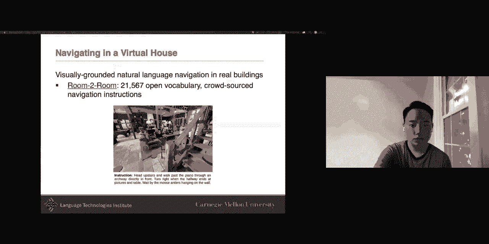

and again you have these you know，multi-step questions that go through，multiple steps。

where you have to continuously localize，and take actions until you complete the。

i have a couple of questions here so，first question，for adversarial attacks on vqa is it。

possible to generate class-specific，perturbations for example，or，expert，in in adversarial attacks。

but i have seen some people work on this，so in this case a lot of this goes into。

the algorithm specifically design，forever several attacks essentially what。

they were trying to do is that they，would try to um，solve this optimization problem where。

you're given some amount of，corruption you want to minimize this。

corruption that is added to the image，while at the same time，ensuring that the image the at plus the。

corruption，feed forward through a neural network，maximizes your。

prediction in some category so that is a，general setup you want to。

minimize the noise such as the noise，added to the image leads to the highest，change。

in the output prediction so that would，cause you to，adversely predict some other category。

and i have seen work in，changing this optimization to one where，you are directly optimizing for one。

specific category，which you will want to predict maximally，um if you're interested in that you'll。

definitely look at look at the related，works，uh going off of that question is there。

work happening and modifying an image，according to natural language。

instructions turning the rose into a，sunflower，uh the answer is also yes although i。

don't remember the exact paper i think，um i'll have to check i think if i find。

the paper corresponding to this，this project i can link it on piazza but。

that's a really cool question so，the goal is to kind of take an image and。

give it a set of natural language，instructions and kind of modify the，image in this targeted way。

again i'll assume the main challenges，there are more of the evaluation。

than the the model itself because you，know image generation is always a very。

difficult problem and if you，want to do like you know targeted image，generation that's also even。

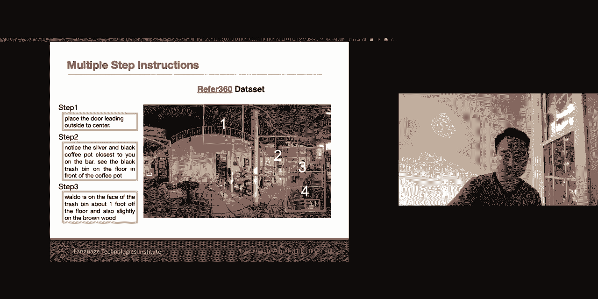

cool um just a couple of slides left i，think some of the very interesting，projects that。

i've been looking at myself and a lot of，at，is this general area of language and，games。

so a lot of these are these are some，reinforcement learning games this is，called the nether game。

if some of you are old you might have，played this one，back in the days um these are these。

great world games where an agent has is，situated in some world。

and has to follow some natural language，instructions like you know。

you you know this kind of moving pretty，you know you，you you're you're at this crosswalk。

there's like three ways to go，which way do you want to go you see like，key do you want to pick it up。

you want to climb up the ladder and so，on so you're always faced with。

both the environment that you're in，possible actions to take，you know your cardinal directions。

picking up objects using objects，but at the same time you're also given。

these a set of natural language，instructions and prompts that you either。

have to follow or you have to reason，about，these seem simple because they don't。

actually require real-world images，but in terms of the reasoning and。

long-term reinforcement learning，problems that you have to solve，i personally think these are more。

challenging than uh，these instruction following tasks the，main reason being that these instruction。

following tasks，a lot of it is partially supervised in，the sense that you have a。

you have this reward signal that you，obtain after you，you execute these instructions correctly。

a lot of these games have very very，sparse reward signals so you really have，to。

explore for a long time before you，actually see something happening。

uh the other benefit is that these are，language and games execute very quickly。

you're not actually working with these，high-dimensional photorealistic images。

but you're rather working with these no，pixel grid world so，they also run much faster and and are。

also good。

another cool data set that i love this，is a more difficult data set。

is a data set that tests whether agents，can both speak，and act in a game so what we've seen so。

far in these uh multi-modal navigation，and multi-modal reinforcement learning。

the goal is only to perform an action，you know either following the，instructions or。

you know moving up down left right，executing instructions，the goal is only to act in this case。

these agents have to both speak and act，which really brings it towards uh。

which really brings it towards this，modern era of you know building these，socially intelligent，act。

in these environments so in this case，you are，there this player in this fantasy world。

right in this case you're a villager，and the partner is is，a knight and each of these agents are。

given some persona，and you're also given some goal which is，that you're supposed to either perform。

some actions or you're supposed to say，something to the opposing player the，knight。

to make them smile so in this case what，you could say is that，wow you're a real knight thanks for。

keeping us safe i'd also love to be a，knight someday，so that is something that you could say。

to the uh to the other player，and the other player is also going to。

predict the utterance something that can，be tough but i'm happy to do it i will，protect the realm。

and also predict some actions like smile，so this，this is also like a pretty cool。

environment that really tests it kind of，combines both dialogue。

you have to convert back and forth with，the other players，and you also have to take actions in。

cool so the core challenges here are，primarily on representation。

in my opinion and fusion so the goal，here is uh both to kind of，reason about language as well as the。

environment and the goal is to not just，to get a representation that is useful。

for supervised learning，and to maximize the label at that one，time step it's also to learn a good。

representation that can be useful for，reinforcement learning，being able to reason about long-term。

interactions with the world，with possibly very sparse rewards so，for those of you not familiar with。

reinforcement learning i'm actually，giving two more lectures on multi-modal。

rl towards the middle of the course so，we're really going to go in depth。

into some of the learning algorithms and，technical challenges，if you're working with some of the the。

recent data set，where you have to both speak and act in，dialogue there's also going to be a。

translation problem where you have to，take in your inputs and generate，realistic utterances that。

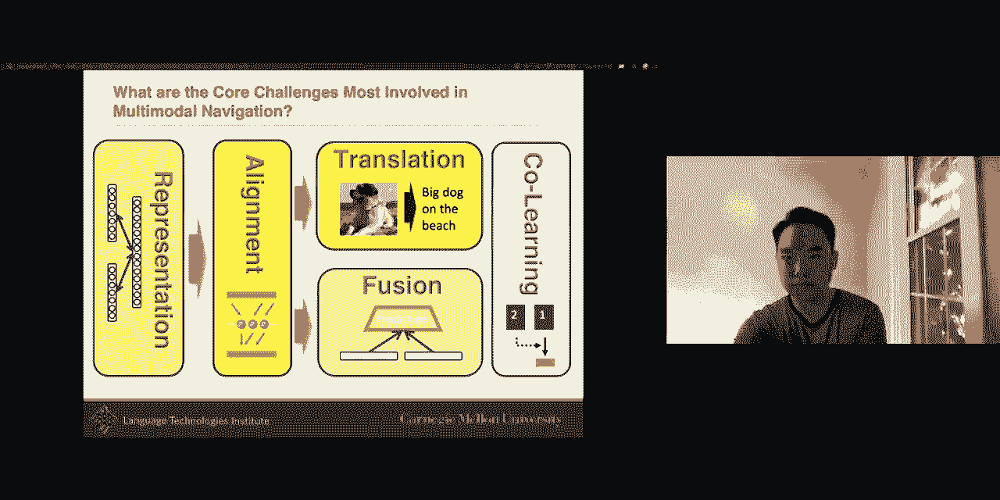

just to give two uh very quick examples，of some of the course projects in this，area。

uh this was i think about two years ago，and in this case you're also in this，embodied environment。

from the doom video game and the goal is，to follow these instructions like you。

know go to the green short pillar and，you would like to go to that。

pillar and you only get a positive，reward of，of you know plus one if you reach it。

correctly and zero reward otherwise，and the goal here is to build a model，that comprehends these。

instructions are able to ground the，entities so in this case grounding means。

understanding what it means to be green，what it means to be a pillar。

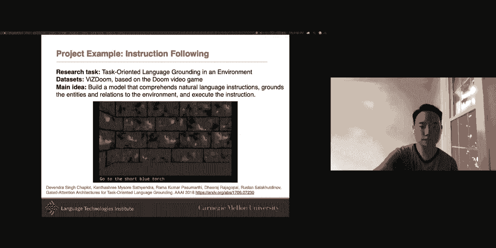

what it means to be short and so on，here's to ground these entities and。

relations and execute the instruction，so this paper is pretty interesting they。

are the model is quite simple，actually so they they embed these，instructions。

using some instruction processing model，designed for text，they process the image to get some。

convolutional，feature representations and they perform，a fusion using getting attention。

essentially uh learning a model that you，know takes in the instructions and it。

tends to correct parts of the image，to figure out which parts of the image。

are actually corresponding to，the particular instructions that gives，you a representation。

and normally if you were doing something，like qa you would，use this directly optimizes for the。

cross entropy loss for classification，but because this is a reinforcement。

learning problem they have a，policy they have a policy learning model，that outputs a policy。

which is basically a distribution over，what actions to take at every time step。

and this policy is trained to maximize，the long-term rewards of。

actually getting to the correct object，of getting to the correct object。

and they found that this this model，actually learns to ground and compose，attributes。

in natural language with the image，features so in this case i'm saying，composition because。

you want to learn these separate ground，representations for green，and torch so that you can also。

generalize to other attributes like red，torch，small torch so that that means uh。

that's really the concept of，compositionality where you have to，take these you know basic feature。

representations，grounded in the image and be able to，compose them using。

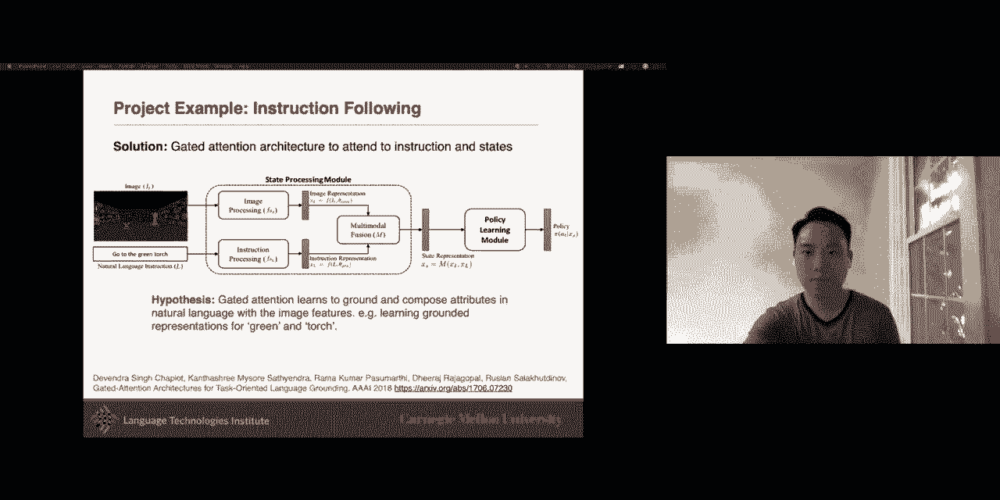

another example just from this past year，we presented this paper at eccv this。

year was that on multi-agent trajectory，forecasting，so in this case we're primarily。

concerned with you know building these，better models for，these autonomous driving cars autonomous。

driving data sets in simulation，and the main problem here is that you're。

going to have these multiple agents，one two three these can be uh both cars，can be pedestrians。

in this environment where you have these，uh these road boundaries。

in white and these pavements that you're，not supposed to go to in black。

and one of the core challenges in，autonomous driving is to be is to be，able to。

reason about these multiple agents and，the possible trajectories that they，could take in the future。

so that you're actually going to be able，to predict what you should take no。

if you predict that the other agent is，going to to go at a stop sign then you，should stop。

if you predict that the pedestrian is，going to cross then you should stop as，well。

so the core challenge here was that we，wanted to do a diverse strategic，forecasting。

instead of just predicting a single，possible trajectory we want to learn a，probability distribution。

over these possible trajectories for，each agent，and this distribution should reflect，samples of a。

low likelihood such as you know driving，onto that payment pavement which is not。

very likely and also regions of a high，likelihood，such as you know turning left or going，straight。

and in this case just because you know，people are more likely to go straight。

and make a turn you would have this，multi-modal distribution where。

one mode of going straight is more。

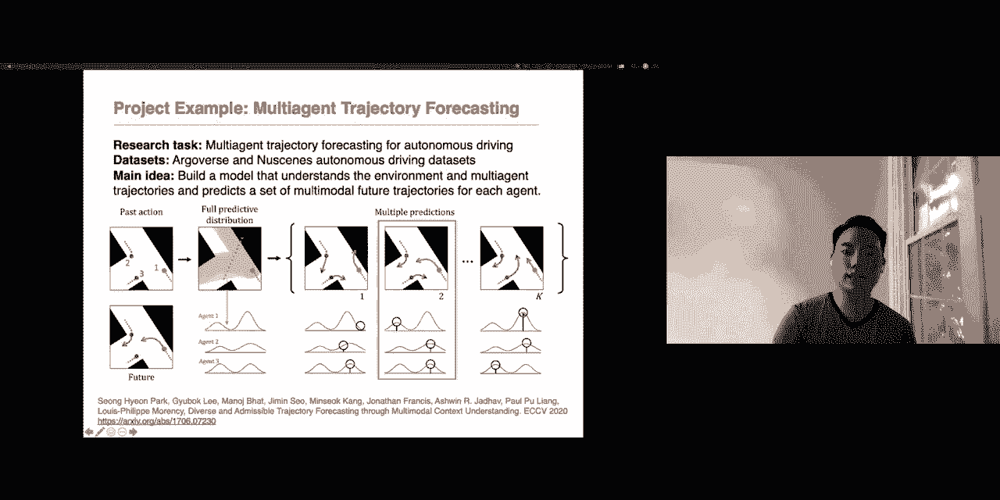

likely than a mode of。

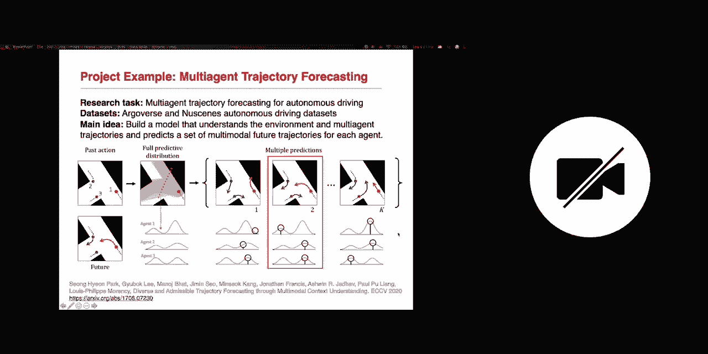

so this is also a pretty challenging，problem，we have to build a probabilistic，probabilistic model。

across multiple agents to，join your jointly reasonable all the。

positive trajectories that other agents，are taking so that you can give accurate，predictions of。

your trajectory and we found that this，model that both，looks at these asian agent interactions。

so modeling your interactions with other，agents，and also agent scene interactions are。

pretty important so agency interactions，like looking at，what are the drivable areas of the map。

and what are the non-drivable areas of，the map，to generate this realistic distribution。

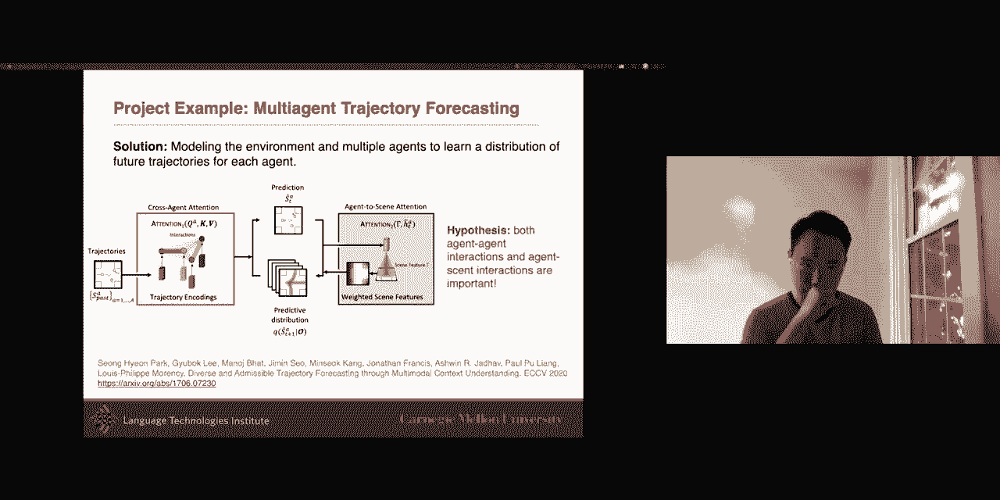

cool so i know that was a，long lecture and we're almost out of，time but。

just let me just give you some advice，for the project moving forward。

so um there's a full list of data sets，that we have we have uh kind of，summarized for all of you。

spanning the seven areas of effect，recognition media description。

qa navigation i didn't go into dialogue，event detection and cross media，retrieval。

but a lot of these data sets are here，and，definitely uh you don't have to look at，the data sets。

directly in this list you're also free，to look at some other data sets，that。

we might not be aware of or even some of，the old ones that，are not included in this list but。

definitely let us know on piazza if you，find some other interesting data sets to，look at。

we also have more project examples on，the website including links to。

papers to code if they were released，so feel free to check that out。

and just in general to give some advice，about multimodal research and the。

projects they will be undertaking i，think the main thing is to think more。

about their research problems，and ask important research questions。

instead of and think less about the data，sets themselves，so i know what kind of motivating this。

lecture and going up，going into detail about a lot of these，data sets and these data set specific。

models but，i always want everyone to keep in mind，the main research problem。

that are inherent to many of these data，sets that are inherent to the problem，itself。

and if you think about these research，problems and design，solutions based on these research。

problems that also helps you build these，more generalizable models。

that can work across several data sets，within the same area，and likewise if there's existing work in。

these areas，in particular looking at effective，computing where a lot of the research。

started with psychology，you should also look at this existing，research and aim for models that are。

also inspired by some of the work in，psychology，there might be uh some very interesting。

you know hand defined features，some very interesting modeling methods。

from psychology that are useful in this，another thing to take note of is that a。

lot of people in machine learning look，primarily at performance。

with respect to some evaluation metric，i would think i would suggest everyone。

to also really think about，the metrics beyond simple performance so。

things like whether your model is robust，to missing or noisy modalities whether。

you can design adversarial attacks to，reason about the robustness of these，methods。

these are things that people who work on，uh you know performance driven，multimodal learning。

don't really think of right now so i，also think that a lot of research should。

be devoted into these areas，so that we can actually make these，models applicable in the real world。

another area instead of studying uh，social biases，whether these representations actually，carry these。

speaker artifacts that are undesirable，towards making a prediction for example。

you wouldn't want to pick up on，someone's，race or gender if you're like making。

some sensitive prediction like，related to affected healthcare so you。

want to make sure that your models，are fair with your suspect and likewise。

you want to build interpretable models，things that can be easily understood。

rather than black box methods，you can also build interpretable，versions of existing models。

or methods to analyze existing models to，make them more interpretable。

a lot of multi-modal learning really，focuses on finding out what are the。

dependencies between modalities what are，the contributions of modalities and。

that is still not an answered question，so any area，of interpretable research that goes into。

answering these questions would also be，useful contributions likewise nowadays，people are trying to。

bring these methods into the real world，putting them on mobile devices so。

faster models in terms of training，and finally i also encourage you know。

people who have background in theory to，also look at theoretical research，we're going to。

give are focused more on these，intuitions and deep learning and，experiments but we're also hoping to。

look into more theoretical areas for，multimodal learning，and if you have contributions in this。

area that would be great as well just，make sure that there's also a decent。

amount of experiments to validate your，theory，although you probably don't need to run。

that many experiments as compared to a，cool as just some final advice um。

if you are used to dealing with text or，speech you're going to realize that if，you want to deal with。

images and videos it can be a space，space can be an issue，so make sure that you either partner。

with someone who，who has these large resources and we're，also going to be giving some of these uh。

aws and google cloud credits to help you，in your research，cool so that's the end of the lecture。

today，uh just to give a recap on some of the，upcoming course assignments。

uh make sure that you either look at，today's lecture look at the slides or。

look at the videos if you're not，attending this，this right now uh look at some of the。

main project preferences，data sets research topics that you're，for。

at least your initial list of project，preferences and we also reserve a moment。

on next thursday to help everyone find，teammates in this really cool。

interactive session that we have planned，out，so here help we're really trying to help。

you find the best teammates the best，projects that you're most interested in。

to let everyone have a successful course，project，two small tasks the reading assignment。

is going to start next week，it's going to be due the following，friday make sure to。

to look at the reading assignments，discuss them with your group start。

reading them and discussing them，and the lecture highlights are also。

going to be start be starting next week，so that one is also very simple it's not。

meant to put a lot of pressure on，yourselves to chat that i know everyone，is kind of。

understanding the basic material of the，course and it's also to help us improve。

on whatever areas that，was not explained too well yeah so see，piazza for detailed instructions。

and that's it thanks for coming everyone，that is the end of today's lecture。

i actually have a large appendix of more，multi-modal data sets。

some of these are slides that we had in。

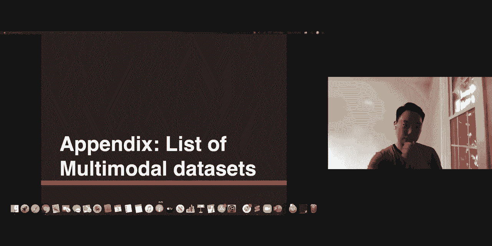

uh previous versions of the course，of time。

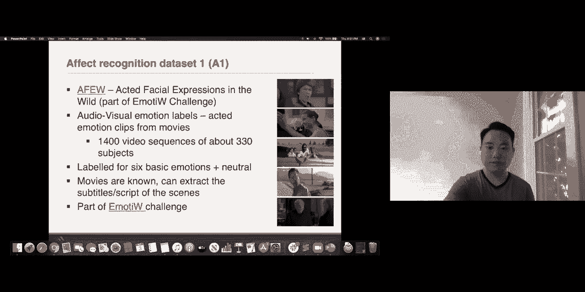

but you know feel free to look at all of，these data sets we're going to post all。

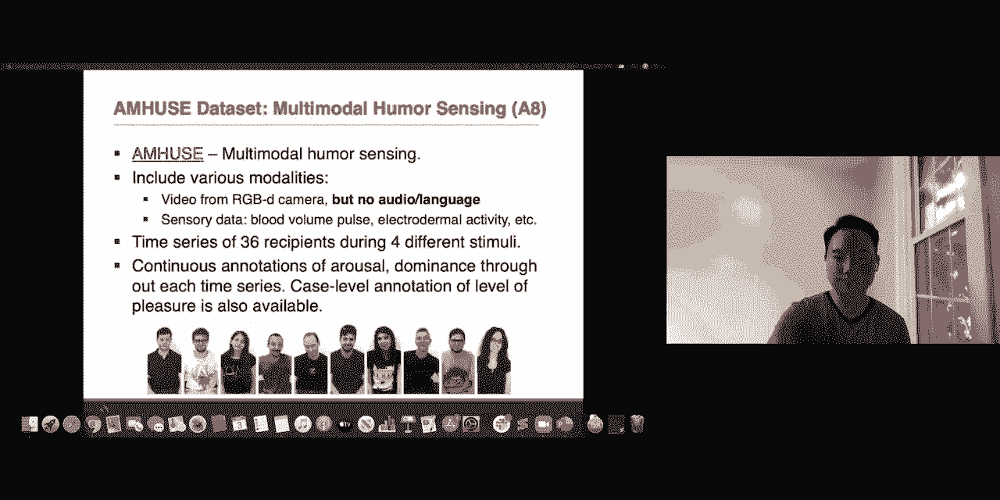

these slides on piazza as well，thank you i'm going to stay here for a。

