# 【双语字幕+资料下载】CMU 11-777 ｜ 多模态机器学习(2020·完整版) - P7：L4.1- 多模态表示 - ShowMeAI - BV1Pf4y1P7zc

our presentation is about multimodal，representation，the focus today is primarily about these。

multimodal representation，will，also before that discuss for a little，moment。

about graph based representation and i'm，presenting this because this was uh。

discussed a few times in the comments，from，lecture 2。1 and some follow-up comments，afterwards。

people were asking about graph based，representations，and given that uh i'm happy to give a。

little bit more details，on this also some pointers for people，who are interested to read more so。

i want to share that knowledge is is one，of these things we。

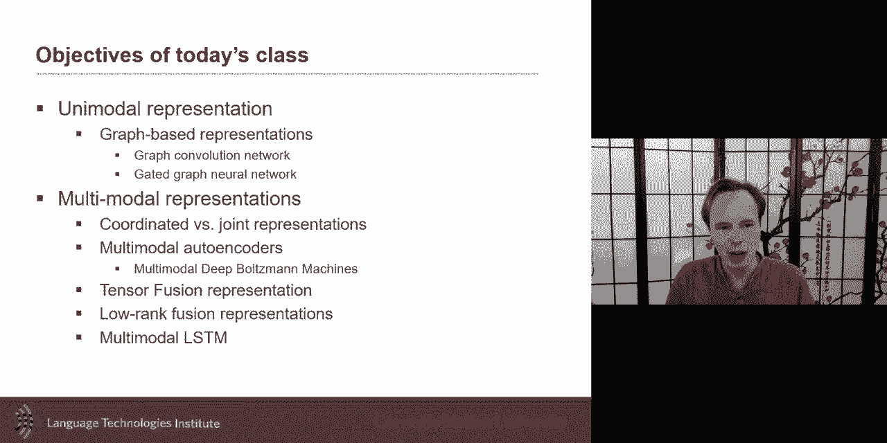

want to represent in a graph so last，week it was language vision。

and now i just want to present graph，representation，and there's this great uh tutorial um。

from uh dr professor les kovac。

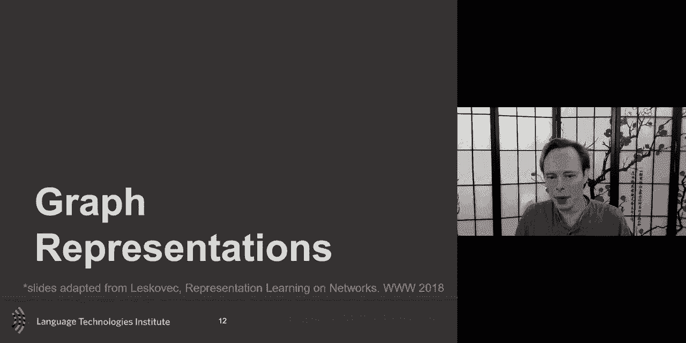

from stanford on this topic which i，invite you to look，at um so we last week。

at the end of last lecture or thursday，we discussed，three based rnn or recursive rnn。

and the idea here was to be able to，represent or take advantage of a tree，structured like a。

parsing tree and use this in a，lscm type recursive network，recurrent neural network and and the big。

change here was the idea that，uh instead of having modeling this um，this type of。

uh sentences as a sequence，we take advantage of the tree of the，parsing information。

and use this to aggregate the，information so，we use this uh parsing information。

to change instead of using it uh and and，simply doing a sequence。

the which is the typical lscm here we，will aggregate information。

in a way that takes advantage of parsing，now this is great when you have a tree，based parsing。

but in many cases the information is，not through a tree and can be a lot more，unstructured。

and how can we take advantage of that，unstruck，destruct not completely unstructured but。

that structure，can be a lot more flexible and and，and the term uh just terminology。

um some people call them graphs and，there's also，networks um there i i will sometimes，they。

graphs uh or networks i will use both，the terminology，so social network uh facebook or twitter。

um these social networks are very，large-scale，version of a graph where every node is a，person。

you also have an economic view or also，in a company，when you have a company and all the。

workers how they interact with each，other，um you have it from a knowledge base。

or from the web how the web page are，related to，each other or the brain how the brain。

neurons are related to each other，these are early examples where a，representation of a graph。

would be a great way to move，and to represent information and when。

you have a graph like this there are，many tasks that could be done，one of them is clustering and。

i will talk about this kind of，unsupervised approaches or，similarity-based approaches。

um but another one will be about a，supervised，task an example if you have online，social network。

these，network，are human and which one are in fact just，a bot，um you could expand to that to be uh。

looking at topics or so the goal is is，is to uh be able to uh，from your network uh be able to uh，now。

it could be a subset of nodes and，because you already have，some of the labels or it could be all。

nodes uh，both tasks can be explored there is，quite a few cases where you already have。

some and you would like to kind of，propagate the，labels to other in ears so that's also，this is。

one way a graph can be used and，in this case is a supervised task and。

this is that one type of learning you，would like to do，another one which is closer to。

unsupervised a task，is to take advantage of，of this structure and so the structure。

may be defined because of like，friends or it could be defined because，there is a。

um a web page linked to another，and the goal may be to learn，and and that kind of unsupervised uh。

or the only supervision you will have is，the links，uh so either you call it completely。

unsupervised or call it a，weekly supervised but the only，information you will have are those。

links but no labels，and our goal will be to learn a，similarity。

uh and learning and embedding in such a，way，that um they're in this embedding space。

two nodes that are connected uh that are，like，is it connected or not like zero or one，weight。

associated with it uh how connected or，close they are，and you want to use this and be sure。

that in that embedding space，this is a constant in the sense that two，things that are connected。

will also be very close in the embedding，space and you could imagine。

on top of that having some kind of，clustering on top of that as well，and。

this is i would say a little bit of a，classic approach many，of the network base will often explore。

these clustering trying to understand，the data，let me formalize a little bit uh graph，neural network。

graph，is a series of vertices or nodes you can，call them nodes or vertices。

and then you have edges connections，between them，and often these edges can be represented，by。

something like an adjacency matrix，adjacency matrix could be just binary in，the sensor。

zero or one if a one if this is，connected or zero otherwise，um so this is the basic of a graph。

in the case of a graph neural network，often you will associate，with each of these vertex vertex or。

these nodes，you may associate also some category，descriptors for these it could be。

categorical you could have like，um attributes um like age，uh or gender or you could have some。

texts associated with them，uh images there's a lot of very，interesting information。

and that's probably closer to what we do，and what you see here，that's very interesting is that this。

data could be multimodal，in fact there's uh there are some very，interesting work where。

maybe some of your nodes have text and，some of your nodes，have images and some of your notes so it。

could be that your network，is in fact multimodal um in the sense，that uh。

you would uh oh it could be multiple in，the sense that every nodes have。

all these different type of information，all of the above is really interesting。

one thing that is optional and mostly in，the case of the supervised。

is that you may have associated either，just during training or maybe，also a test time。

labels for these different nodes as i，mentioned this is optional。

if you do the unsupervised it's not uh，required，so this is the formulation and so。

there are quite a few approaches but a，lot of them，uses similar uh。

ideas and that this is a nice intuition，and that's，that's a little bit the similar。

intuition that we had in the tree，rnn and and the idea here，is that if i want uh to um。

model the graph it can be a very complex，graph，and so how can i take this graph and。

make it into a neural network，the first key intuition is to look at，neighbors。

so i will i will look at it it's a as，almost the same，kind of intuition as a monte carlo like，mcmc。

like um a little bit but uh that，intuition，a lot of these markov assumptions，like。

this is a little bit of a similar uh，similar，uh for people who work on this topic but。

yeah the intuition here is，locally the information what what is，connected with a。

for example it's d b and c and so，as at the first level uh these three。

are the most relevant with a and this is，where i get most of my information，now in practice the like。

b can also be connected with c but c，is also connected with f and e so a，indirectly。

should have a connection with f and e so，but at the first level we want to have，it local。

so if i have a target like a we，are at the first level we'll say hey。

what really connects or what the，knowledge，what is the messages i want to get or。

what is the relationship，is my neighbors and myself maybe myself，and the neighbors these are。

really what what is really key into that，but we'll make it a multi-layer and in，kind of a recursive。

manner going from a i can say，from b what is related to b and it's。

it's a and c and that's what you see，here，and from c what is related it's abc。

e and f and what is related to d only a，and so now you can see and you can see，that recursive。

going on um and and what will it，allow us is that i like a relation。

between c and a will still be modeled，just uh after two layers of。

neurons in fact these will be in fact，neural networks，that's where at least in recent works。

has been used as an aggregators，and learning how to aggregate this，information。

what you one thing that's important to，realize is that，this kind of network is created based on。

the input graph you create these，networks and for each target node for，each target node you get。

a different of these graph that's really，interesting so，this input graph gives us those six，showing。

two layers okay but and i'm writing it，again，so the same graphs here i'm writing them，again here。

and so here we have multiple layers we，have the original，input we have a first layer we have a。

second layer and there's nothing that，stops us from doing，a lot more layers almost nothing that。

stops us i will tell you more in a，second，but in general in theory you should you，could go as。

as far as you go as you want there one，issue，uh that we'll discuss is is the same。

that we had in other neural network，if you add many layers what is the issue。

vanishing gradient so the same issue，will happen，also here um so but in general。

in a graph neural network this is an，example of a graph neural network，um and how what's what's very。

interesting here，is is the idea of local that's the first，take home。

and the idea of multiple layers uh these，are some of the take home。

and another take home as as many of the，neural network，and and that we've seen is that um。

all of the nerd the module all those，aggregation modules here，will all share the same parameters。

uh all of them here at layer two will，share and by default usually。

in the basic graph neural net um the，uh the parameters will only be shared by。

layers and will not be shared between，layers，and in a multi-layer perceptron uh。

like um you you kind of see um，a little bit the same thing between，layer you get new neural。

um but but the tying of the weights in a，little bit like the rnn will do there。

so how do you use that kind of，architecture up to now the only thing i，got is some kind of。

embedding here i get my input x，just，z like some kind of new embedding for a，is and，a。

z a z of a and and use it for，um supervised then i can use probably。

any loss i'm just putting one of them，here，uh and there in this loss i can take，this embedding。

um and look at how closely，it relates with um the uh，with the label uh and giving the。

classification weight classification，weights，uh whatever weights that are uh in my，neurons。

uh on all of layer one and layer two，um so here i am only putting it as if it，was a one。

layer but in practice this could be for，any，uh as many layer as i want so this is。

and this is only for binary human or not，but this could be also multi-class as。

as we've seen so so this is for，supervised learning，uh the one questions um that and。

and if you were to do unsupervised i，didn't put a slide for his but there are。

some very well established，uh algorithms that you can do um to，also study how to to learn。

uh and put some kind of uh，supervision uh are on the，z so that eventually you keep the，similarity。

as close to each other um and there's，quite a few，of these node tuvek being one of them。

for example um but yeah one of the，question is how do you aggregate。

all of these together and one of the，issue is that sometimes i have three，inputs。

sometimes i have only one input，sometimes i have four inputs，so how do i aggregate multiple uh。

of these how can i handle，multiple and probably the first thing。

that comes to mind is average pooling，um i can end up just averaging，my。

h uh here and i just average them，and then i just multiply by my w。

and and here i just made the w i didn't，put the，the the bias here and and one thing uh。

also is to be remembering is that um，you should also have probably uh with。

yourself you should probably，remember uh the previous uh rep，the uh how was a at the previous layer。

uh how was a before i make this，aggregation，so you want to keep some consistency。

here and so these different，one thing that is the average pooling at，least the one that i。

originally proposed was that you the way，you aggregate all of the na all of your，neighbors，you。

uh process your own，uh representation from the previous，iteration。

or the previous layer um one extension，which uh got a lot of uh interest，uh in in the ai community。

very，it's a it's a small change from the more，typical average pooling。

uh where in fact you end up treating，the yourself the the self node you end。

up treating it with the same weight，uh so you you don't learn a different w，of bk。

but in fact use the same and one one，other thing and what's nice by doing，that。

is that it suddenly things are going to，become a lot more efficient so。

so every node uh can efficiently，uh be uh processed because there's the，same set of weights。

for every node um whatever it's myself，or another and by adding a simple，different。

normalization that's one small change，that they did in the graph cone。

but the bigger change was probably this，uh change of weight because that change，also。

the efficiency of the algorithm but，one of the issue like average pooling。

and graph conversion networks，is that naturally by default they will，have a harder time。

uh with very very complex，uh and multiple layers um they will have，the same issue that we've seen。

in some uh basic rnn，and for that reason people have looked，one，was which is probably makes sense。

the same way rnn if you want to help，with the vanishing gradient，then you can use an lscm or a gru。

i didn't discuss in this case in details，the gru，jr you can be seen as somewhat of a。

simplification of an lscm，but the goal is the same is to help with，the vanishing gradient。

and and um and so the gru，is uh is going to be the same gi，formulation as a。

in a recurrent neural network but here，we're going to use the gru。

over layers because where's the problem，with vanishing gradient。

the vanishing gradient is not from left，to right，is from up to down is from between。

layers and so the giu，is going to be helpful between layers，and that will be how we will be using it。

so same weights also across a layer so，suddenly，what is nice is that you're also going，to have。

in this architecture the same weight，because if you have，so you make it a recurrent process over。

layers，then suddenly the same set of weight at，layer one at layer two。

um and so that will allow because of the，gre will allow to do um a deeper。

project so a deeper network so there's，some citations，here uh some of the like。

landmark works and this and there's been，some extension，one that i didn't have time to talk。

about but that is quite interesting is，called sub，graph embedding so the same way，uh we uh in uh。

in language we look at word-based，embedding so，so you have a sentence and you look at。

embedding each word，but what if i wanted to embed a sentence，in a graph like like in in a graph i。

want to embed a sub，graph like there's a big graph and，there's a subpart of the graph。

and i'd like to have one embedding for，the whole graph，hey you can probably see the same uh。

intuition as we，had with sentence embedding and so，that's a really nice and interesting，aspect。

uh that is and it's still an open。

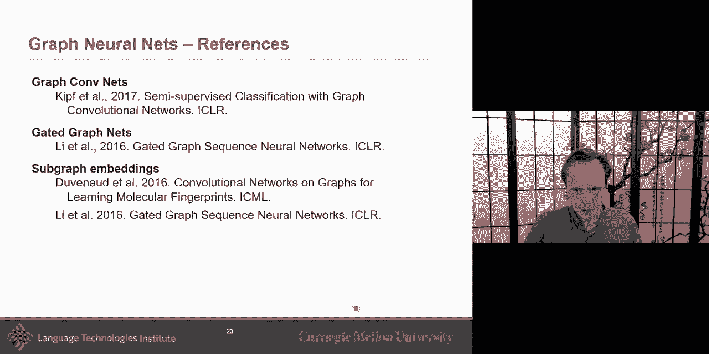

question on that so，great so i wanted to talk about um these。

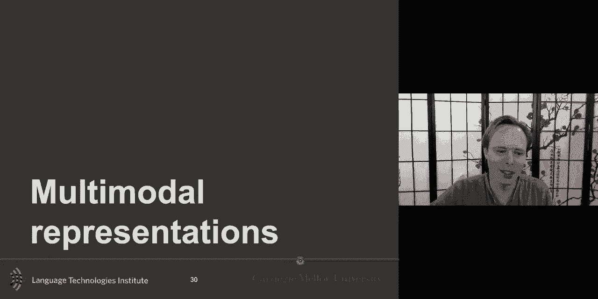

but the main focus today will be on，multimodal representations，uh what do we want with a multi-modal。

representation，or goal what are our goals when learning，these multimodal representation。

um at the first level we want to，identify similarity，sense，as we just talked about embedding uh。

in the graph but this is true with，multimodal，uh entities that or concept that are。

similar or equivalent in different，modalities，they should in that representation they。

should have both，be similar as well，uh we want probably also this，representation，um to be uh useful。

for prediction tasks like retrieval，mapping and fusion，um so the representation um。

could be learned unsupervised but also，but we want to，hopefully you'd be useful for another。

prediction task or，i say prediction task here in the figure，but it could be also for other analysis。

as well like clustering as well，we want it to possible to obtain in。

absence of modalities that's one thing，that we didn't discuss。

as much uh here but uh sometime with uh，specifically with joint representation，uh。

what is uh one of the advantages you may，want is that，this representation should be we should。

be able to use it，even if we have a subset of，representation，um and sometimes you want it to also。

feel missing modality the other，so maybe even though even though。

the modality is not present you may be，able to use that，a multimodal representation in some kind。

of translation，perspective so these are different，applications or different ways to use。

representation multimodal representation，i just bring back the core challenges。

that i discussed about two weeks ago，on multimodal representation。

one way of learning representation is，joint representation and and that is one，of the core。

aspect of today what we'll discuss um，joint representation is this idea where，everything。

goes all modalities will end up，in that same space and things that are，similar to each other。

will be close to each other but as i，hinted that，already and we'll discuss more on，thursday。

there's another field a subfield，of coordinated representation i will say。

it's also probably the one that has been，the least explored and i think very，interesting aspect and。

and so in a coordinated representation，instead of uh，pushing everything together in the joint。

space you will say hey，i will have a separate space，for my two modalities。

but i will find a way i will force some，aspect，of each spaces to be coordinated with。

each other it could be some elements，in in in the two modalities that are。

uh similar to each other and i want，these to be closed，um i could also make it so that and。

there's another，way to uh translate from one to another，uh，modality so that the coordination could。

weak，coordination the weakest of it is to，have two separate，uh spaces that are not connected uh to。

any kind of coordination，and then you have the strongest which in。

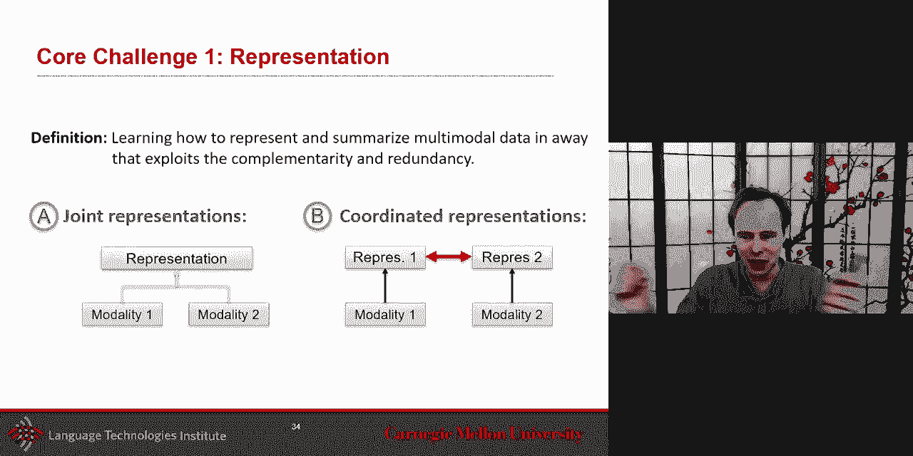

so，you have this uh this representation，um so um we。

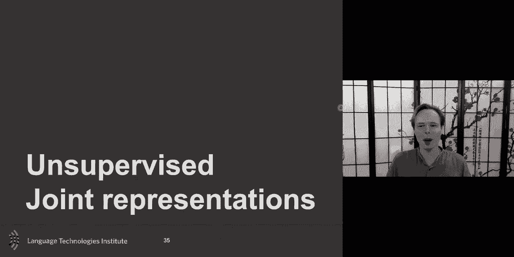

have um uh i want to discuss，when you learn these representation uh。

the idea of learning unsupervised uh，and we hinted at this also when i talk。

about the graph based representation，and the basic like just from a notation，perspective，uh。

and why would you want to tackle is to，often unsupervise learning allows us to，do。

some analysis about in the data by，looking at the similarity，uh or and clustering that we can learn。

from that we can find for example，the the famous topic modeling uh，sometime it helpful also for data。

compression，uh looking at trend and often in the，case of neural network，uh。

to use a lot of data to learn a better，presentation，that could maybe learn use later uh。

for a supervised task，so unsupervised representation it's to，force a representation to better model。

the input，not just extracting the feature for，classification asking the model to，better。

represent the data this is more about，representation，learning in general and so for students。

who read，the paper on representation learning uh，you've seen that and hopefully everyone，through the。

discussion also picked up on all these，main points，uh and this unsupervised will also。

hopefully help with generalization，um so um and as i mentioned it's a lot，so，um the uh the simple uh。

the simpler uh the representation，learning，and i i i reduce a little bit the number。

of slides on this，i think it's a very cool um uh，algorithm and we'll discuss a little bit。

more when we talk about probabilistic，graphical model，but rbm restricted bulging machines。

were some of the most um，some of the original mulch model uh i，will say。

two of the landmark papers uh one was，using auto encoder the deep，uh uh learning。

uh multimodal deep learning and but，there was also，very soon after uh and，one on rbm the ibm being。

nice because it was a generative model，um so this one could really be learned。

really just from the input，um so from the input uh you'd，concatenate your input。

and then you you um through the rbm，algorithm，we learn a representation usually that。

shared representation will be，a little bit smaller to force some kind，of aggregation of the data。

um so but although rbm are great and，conceptually are very interesting。

uh in practice there are a lot of，challenges，in um and uh in optimizing them。

and so uh although both came at the same，time，definitely one of the two really took，over。

uh the other very quickly um and the，auto encoder，out，uh stronger of the two uh primarily for。

the optimization，so what they auto encoder first what，does it mean not to encoder。

uh it means auto means self，uh so encoding itself that's that's the，intuition。

and so the uh and the toe encoder it's，basic is just a feet forward。

it is a natural encoder is a multi-layer，perceptron it's a feed-forward。

neural network it's just that it has，been，architectured in a certain way and also。

the losses will be slightly different，and also sometimes it's trained layer by，layer so。

um but generally like at inference time，at the time of inference it is a。

multi-layer it's a feed-forward network，it's a，so the uh the output，of the network um will be。

the prediction will be how，well could you recreate your input，that's the idea here。

um and so uh so that's what the，output or what what i i call usually。

in a mlp the score function uh but the，output will be，uh the original input and so and we'll。

split it，in usually in two sparse parts，uh the encoder and the decoder and a。

classic although it's not required by，classic，auto encoder it will have more of a，hourglass。

where information comes to this uh，middle layer which intermediate layer。

that usually is a lot smaller with，number of neurons，that forces aggregation and fusion of。

information，and then uh you will have this uh，decoder that will then try to from that。

uh summarize information，you，look at it this is not far from the word，to back。

this is um one difference，uh is uh is that in the word to vec，we we were not trying to recreate。

yourself but，in fact we create the context uh but the，the similar architecture to that，also。

share or tie the weights uh between it，um and that will also help uh because，that way。

uh however you regenerate the data，should be related to how you genera，however you。

decode or generate the data it should be，related to how you encode it，uh。

in the brain there's some famous result，that says that，the way people perceive speech is。

related also，uh to the way they generate speech so，you could also intuitively commit from。

a cognitive science perspective so，the this is the basic of auto encoder。

i just want to add one more thing about，auto encoder before i get to the。

multimodal uh which is how do you define，the loss in this case。

and the loss can be different it could，be there's different version but the key。

aspect of it is that you will，compare usually your input your input，with the output。

simply by hoping that they as close to，each other，make it，more robust to noise there was this nice。

little uh，nice cute extension to it which is，called the noising auto encoder。

and the idea here is that uh i will not，um look at the input itself。

uh but add a noisy version so not the，input itself but look at a noisy version，of it。

um and so the network，will go from the noisy and then the loss，will be trying to get the original。

version of that，so um so so the network，will be learning uh from this but the。

loss will be from the north，the original version that getting as，close as possible。

uh and that will be uh usually bring，better，often people just talk auto encoder。

without talking about the denoising，itself but it's a nice，uh trick to be added but let's talk。

about multimodal，so how can you make this option auto，encoder multimodal，think about it for a second。

how can i take uh this idea of auto，encoder，and make it uh so that i can learn a，multimodal。

so this is maybe or at least one of the，ideas you had this is a bimodal auto，encoder。

and one of the key aspect of it is that，it does joint，representation or shared representation，okay。

so joint representation which is，different for coordinated，we'll talk next week not next week on。

thursday，but here is joint representation what it，means，and how will you train this joint。

representation，one thing that they uh maybe don't，always say explicitly。

but it is very important is in many of，these，is that you need a pair of data。

you need data between the two modalities，you need to have this data so i have my，audio。

and i have my video and i need to be，able to，pair so i need that pair data um so。

in the case of audio visual speech，recognition，it will be maybe the video with the or。

maybe just the lip tracking，the tracking of the lips in this case i，think it was not the raw video。

but they look at the lip shape and then，you have the audio，and again they will probably not take。

the raw audio，but instead use spectrogram of some，other representation。

and then what it is is the goal is to go，and encode uh the representation。

and so i get this both input，both inputs and then i find this joint，representation。

and then also what's very challenging，also from that joint representation，inside it。

there's a need to have enough，information in it，to be able to regenerate video and，regenerate。

audio so as you can imagine this is very，challenging because the shared，representation needs。

to include enough information to，regenerate both of them，but if you can and learn this and the。

initial results，were pointing that way um uh，and uh one little thing that they did，and then。

that was uh somewhat important is that，the initial layers，of these encoder and decoder。

and these layers these layers and，for the video were already pre-trained。

uh you often will do that also，you may pre-train this and and in this。

case they pre-trained it with the，typical lotto encoder，and then once you pre-train that then。

you can train and use both together，and that's the usual way what's it do to。

train the model to reconstruct，both modality but what's really cool，once you've done that。

so you train uh you pre-train this and，then you train together。

and then what's really cool after that，is that you can go and remove，one what will happen。

and it's a little bit uh we talk about，the blue car，i mean that would have been the other。

idea like i have a mage，and a caption and i learn it together um，video representation that joint。

representation，sample，video but also i should be able to，generate and sample。

audio and it's really cool i can in fact，remove video，as well from it so these are very。

interesting aspect of the auto encoder，that that comes from，from this extension it can be。

now even discarded you can completely so，one thing you can do，is completely discard the decoder and。

now let's say you have my video and my，speech，and i want to learn a new task let's say，it is。

a speech recognition so i'm trying to，predict language，uh like the words the spoken words i can。

use now my shared representation to also，recognize，language and then i can do some cool，thing。

uh um so at training，i could uh train um，so i pre-train uh i i pre-train。

um with with this way with uh，in fact not this way but completely this。

way so i come pre-trained this way，um but then i i fine-tune it for the，class。

of uh of predicting words，okay so i do uh speech recognition，in my。

first version of the training i had both，audio and video，but in my second stage i only have audio。

and language and then a test time，which is this is a co-learning kind of，scenario。

at test time i don't have audio，but i can go ahead and because i had。

trained earlier in the pre-train i had，pre-trained also，able to read lip reading i really could，know。

i mean there's the results uh i mean it，was early on，and there's a lot that that followed up。

this but that that was really cool，um i i wanted to also，discuss although mathematically i'm not。

talking yet about，a restricted boltzmann machine um i want，to talk，about the results of that paper。

um because the results of the paper was，was really cool，and these are two of the um i will say。

landmark papers uh，in multi the neural multimodal，work，in this case they didn't look at speech。

recognition they look at image and text，and what they did is that，when you have a genitive model。

like ibm what they can do，is that you get your initial，representation of the text。

let's say for now let's call it word to，back so i get my word to back here。

and the image is like maybe the output，of a cnn，and then what will i do i will learn the。

first layer so，this will be trained together and this，generative model。

because these maybe have a lower smaller，number of neurons，then i will start summarizing a little。

bit the，image and on this side i will start，summarizing，uh the um the text。

and then i will train now the second，layer，uh train the second layer and then the，interesting one。

uh is to train the uh the joint，representation，um and and in practice you will，do it。

step by step or at the end you can also，do it like，uh end to end um but what's really，interesting。

is now what do i have i have my input，on both sides and i have five。

intermediate representations i have，an intermediate representation here，intermediate representation。

and the information can flow both ways，because，uh genitive and in this case uh i it can，go both way。

say，i mean i hypothesize that the middle，representation，is the most like that's the most，intimidated。

but there's nothing that forces it maybe，this one，is really the intimidated the middle。

point or maybe this one is the middle，point and so that's one question that，you have。

the training for that is versional，approaches um，and so um and as i mentioned we'll。

discuss more the the training，um but um the result i'm going to come，back to the results。

i want to show you this graph what's，really interesting，is that um uh it's it's it's uh。

it's the mil and the the comparison，between the two，is uh not as important as the uh。

as let's just look at the red one，um what's really interesting is is to，see。

how uh how much information how，successful，the task that we have um uh。

is i think a major uh multimodal image，retrieval，um and um and the。

uh the idea would be maybe the middle is，the best，um but what was really interesting is to。

see the asymmetry，between this uh the fact that tex，was uh different from the uh。

from the uh image although the two，together are really useful。

you can see that there's an asymmetry uh，between them，uh and some somehow uh this one。

got again a lot from the image so the，text，very quickly gained a lot from the image。

but not but that was different on the，other side so，it's interesting to look like often we。

only talk about one intermediate，representations，but in some models uh in these。

generative models you can start looking，um，and so the task here you can pre-train。

on unlabeled data data it's unlabeled，but really it's there's some supervision，which is。

there there's pairing of data i mean you，have paired data，and then and then when you do what the。

unsupervised，task then you can do these uh things，where you have an image，as input and then。

and then you can see the generated tags，and compare with the ground through tags。

or the opposite you have a text as input，sample images from that text，um and so you can it's a fully。

generative，models both ways and so that's a beauty，of this model um and then it can be used。

on a prediction task so um and that was，what the graph i was showing。

uh also is that so you train originally，uh pre-trained unsupervised but then you，train it on。

a visual and the beauty of it here um，and i i should have mentioned，uh is that the the only um。

uh the only a real uh，goal is vision uh okay，so i'm gonna now show you the the same，graph。

here the prediction here this prediction，is only，using the input of a visual。

input um but and so if you use just，vision，and you never only use that，representation。

of vision um but then if you start，uh adding uh and adding and then you can，see，worse。

with the uh going in the other direction，so it's also interesting to see that，symmetry。

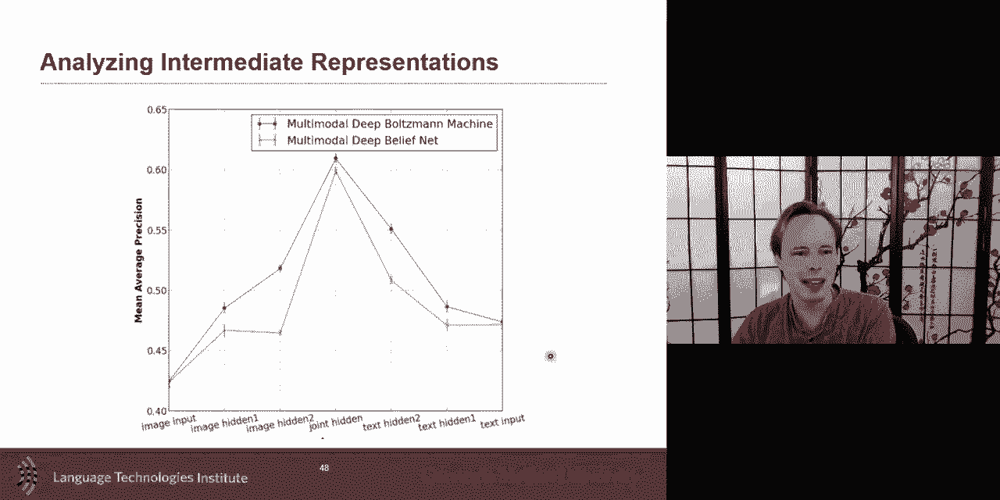

on both sides so okay um this is the，uh generative models that i wanted to，discuss。

uh i wanted to also discuss the。

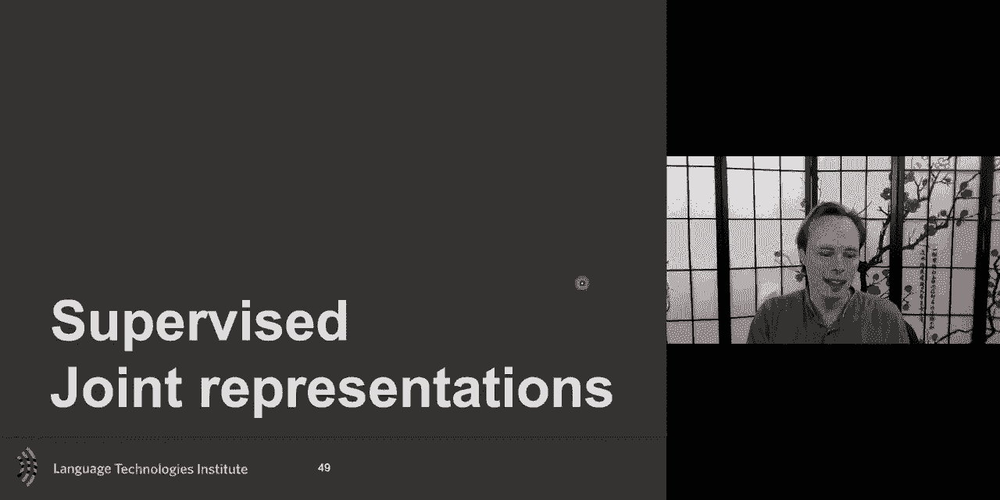

supervised，uh cases uh for this um，multimodal um the supervised case。

the idea is that maybe you have a，pre-trained，representation but also sometimes you。

may want to train，uh right away end-to-end uh for a，taskless sentiment。

and so uh the joining of the unimodal，representation，it could be simple concatenation like。

i've shown here，uh you could multiply the two like you，could multiply hx and hy，it。

i showed the multi-layer perceptron um，so but when you do this joint，representation。

um and that's also true with the，unsupervised case what i'm going to show，here。

is that there is a lot of information，that sometimes is unimodal，but sometimes it's complementarity。

between two modalities，and there's this nice bimodal，information and sometimes there's also。

complementarity，this，tri-modal interaction and so we want to，be able to learn。

these joint representation but also，being able to，model bimodal and tri-modal interactions，so。

let's say you have to in the case of，sentiment you have only，what i say how i say the audio。

and also my vision so the simple will be，just a concatenation，and a neuron on top of that neural。

network，on top of that but as i said there's，multiple there's unimodal bimodal and，trimodal。

and let me give you an example like if i，say this movie is sick，is it good or bad。

it probably may be good but neutral，and it's a bit ambiguous specifically in，u。s。

this movie is fair it's probably，positive or neutral uh smile，probably i'm more on the positive side。

but if i'm loud，hey i can't be loud and positive or loud，and negative。

but let's look at bimodal this movie is，sick，and i smile then it's quite likely that。

i'm very positive or this movie is sick，and are frowned then it's really most，likely negative。

but this movie is sick and i'm loud，still ambiguous that's why sometimes you。

look at trimodal interaction，and in trimodal interaction then this，movie。

is sick i smile and i'm loud，very positive and i will say the job of。

multimodal fusion would have been super，easy if it was just this kind of example。

almost additive like fusion is additive，but the fusion process，if i，smile i'm loud there's fireworks。

everything，because in this case language takes over，the other modalities。

and then that means that you should not，simply go and and simply。

go ahead and just add to each of them，no move in this case language to cover，the others。

and so this kind of non-linearity，is important to be modeled in it in your，model explicitly。

and so there has been some very，interesting ways to approach it，um once a nice simple way。

is uh is called bilinear pooling，and so when the pooling instead of doing，just a an average pooling。

so i have hx and i have，hy and how i bring it together i could，just average pull them。

um like just uh but here，uh the idea is to do uh the the product。

uh cross product in such a way that you，end up with this，matrix and it's really nice。

because now suddenly what you have is，for each element here you get those，bimodal interactions so。

this point here is related uh，with this so this one is telling you how，our dimension 1 of hx and i。

dimension 2 of hx like this looks at，this kind of interaction，so if for sentiment purpose。

this interaction is really useful then，this neuron here neural network here。

can go and start uh putting more，emphasis on it，or maybe it's the third one。

from x and and the second one from y，then this one will be taken so it's nice。

because you're kind of exhaustively，looking at all possible interaction this，is bilinear pooling。

and there was a nice neat little，extension the bilinear，pulling will be uh you can go，symmetrically。

but then there is a small little，extension to that，uh，to it like this little one here to the。

bilinear，pooling it's very simple uh idea here，and by taking this little thing what's。

really nice is suddenly，in your matrix uh in your，response map here um what you get。

uh what's really nice here is that you，get both，um both the unimodal and the bimodal so。

what you had in the bilinear pooling，plus the unimodal as well and that。

nothing stops you from doing it，in 3d so now you suddenly have，your unimodal your bimodal and your。

trimodal，all within one and what was nice，in this is that this approach，outperformed the。

uh was uh state of the art at that point，but more importantly，it outperformed the bimodal uh pooling。

as well um and what you're probably，asking yourself oh but suddenly i have，this huge。

uh matrix because uh suddenly i have，these big，tensors in your model uh a huge tensor，and。

and so i have more parameters uh to，learn，um and and then you have kind of this，trade-off。

and and that's something to you i hinted，that when we talked uh，uh。

basic of neural network is sometime，neural network it is useful，to go larger to then go。

smaller and and so sometimes it is a，helpful and that's what it seems to be，hinting at。

uh in the experiment empirically um to，go grow larger because here i'm almost i。

have more parameters than i had here，but i made it the problem simpler。

because it's much simpler from a fusion，perspective，to just go ahead and pick the the the。

input that are the most relevant to my，classification test so although i'm，increasing the number。

i i i am making the problem easier at，least that's what empirically it seems，to be showing。

there is some nice extension you can do，um to say hey this is very big。

this tensor uh and and i have my two，modalities，and i have this big tensor and so i'd。

like to make it simpler，uh and there is some nice work uh，that um that was simply looking at it as。

a decomposition，where you decompose the weight so，instead of using the weight itself。

you keep the the the step before it，uh and then you also decompose the，tensor。

and you rearrange them and so um，this，big uh tensor and what you will do。

is decompose it this is a cp，decomposition，uh this is a well-established uh，decomposition。

that any kind of matrix can be exploit，approximated this way，z，as well because i know that the z。

it's a matrix here but the z came，originally from two vectors。

and then i will just reshuffle thing and，and i will just rearrange things，together。

and by doing that what's really nice is，that suddenly，i get uh this um uh。

which is uh a lot easier like now i can，start，add，more and more modality and it will scale，better。

one last uh representation i wanted to，discuss，uh and then we'll talk about uh um。

the concept of a temporal like how do，you do multimodal and temporal。

but one other aspect which we discuss，um a little bit when we talk about，applications。

of multimodal is if i earlier，when we look at representation we said。

hey it takes an image and you have，paired data，and then i learn a joint representation。

but there's also the idea of translation，you you can also，learn a multi-modal representation by。

translating from one to another，it is slightly different here in an rbm。

the ibm was a generative model that，allows to go both ways，but here this will be a feed forward。

network，and so the image could be a cnn and the，text will be，some kind of embedding and these days。

you probably，use birds but back in then，they could have encoded uh the language。

i would work to reckon an elastim on top，of that，this，and we'll discuss more these kind of。

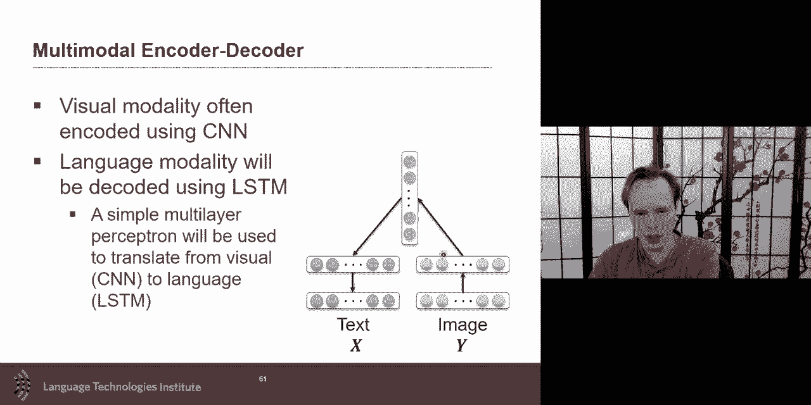

translation based approaches，um after probably more around week seven。

i also want to discuss uh multimodal，lstm as an example，and as an example of temporal modeling。

so because often uh when we talk about，fusion，um a lot of people they um they don't。

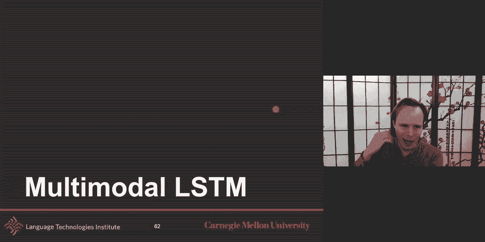

they they don't push for the temporal so，fusion，you could always if you want uh。

just um highlight and say hey i'm only，gonna look at fusion，locally in time uh but uh。

i could but what's interesting is to，so that the simple way of doing fusion。

and what i will say 95 percent of the，time，people will do uh fusion at um。

in a very simple manner from a temporal，perspective，there will be maybe some interesting。

fusion locally in time，but then a lot of approaches don't like。

think about the temporal aspect of the，fusion，and try to make it part of the fusion，process。

there was some interesting approach，that i want to highlight just as a an。

example that's not the only way，but i want you to share because we。

already discussed lscm we'll talk about，more of those temporal fusion with。

transformers for example later，but i wanted to give you an example of，doing it temporally。

how do you do multimodal temporal and，the idea here，is called multiview lstm。

and so the multiview lstm if you，remember one of the key aspect of an，lstm，was that memory cell okay。

this memory cell was useful for two，things one，um like because of the vanishing。

gradient that helped with this，but also it helped um uh，and we had that forget gate to also help。

us um in a sense remembering or，forgetting things，from time set to time step um so。

one interesting extension of it is to，say hey，um if i have memory um and why。

not having more than one memory so，in a typical lstm，i have only one memory but what if i。

have in fact，multiple memories i have a memory，uh for modality one a memory from，modality two。

and my memory for mentality tree so，what what is this this is a lot closer，to a coordinated。

representation in fact you could imagine，at this architecture i could do it。

in such a way that the memory，for modality one takes only，the input of mortality one and the。

previous，uh hidden state of modality one，and ignore completely modality two and，three。

and if i did that for modality one and，similarly for modality two，this。

separately in that spectrum of like，coordinated representation i will be at，the extreme like。

completely chord like separate，representations，so this is a um one-way extreme way。

it's mostly tree having it's exactly the，same as having，three lstm separate one for each，modality。

but it will be interesting to start，looking and exploring，what are the different ways i could。

coordinate，uh between modalities and and，and the way to do this is the key aspect。

the key moment to do this is at this，moment where i，create that input gate at the moment of。

input gate when when i i will start，exploring，different ways to aggregate because they。

this is if you remember the input gate，is the place where，new，new。

my previous knowledge and aggregate，together，to create the output of that input gate。

and then this will go on so this is the，important moment because that's the，moment where i'm。

bringing together previous knowledge，prior knowledge with no。

new evidences and that seems to be a key，a perfect place to say i'm not gonna。

i will not look just about my，for my previous evidence from my own，modality。

and and new evidence from my own，modality，but i will also take advantage of the，other modalities。

and so you could imagine different，topologies，to do that and i'm for now i'm only，gonna look。

at uh for one modality so for modality，one，what do i use and and i to。

help decide what i aggregate how do i，aggregate，knowledge from the other modality i will，say，one。

is how much from the current modality，and how much from the other modalities。

and so if i make it extreme only my，current modality，and none of the other modality then what。

does it mean，this is just two three separate lstm，and the other one is completely ignore。

what i did and only look at the others，and this is called coupled uh and it's。

really interesting that，there is a famous 2000 or maybe even，before that，paper on coupled hmm。

couple hmm and the extreme version of，that it says，you don't even have your knowledge。

and what it means is that you're only，going to get information，from um from the uh from the。

um from either uh from the other，modality，and and so that means that the other。

modality has to have enough knowledge，to create your own modality so the，representation。

should be as informative as possible to，create the other monality。

and then maybe i couple again and i，create，for so i can go back and forth like this。

uh that's coupling and in practice if，you have two modalities，modality a is used for military b。

whether it be for modality a，and then i do the modality b for a，moderately。

a for b and so like this the alpha and，the beta are，two hyper parameters in that multiview，lstm。

so in the multiview lstm model alpha，and beta although you could imagine now，these days。

making them a dynamic gate in itself but，for now，you yeah so that means uh for the，purpose of this。

is that alpha and beta are hyper，parameters that are decided，and，use。

both um so you mean the information from，my modality and the information of the。

other and then finally you could do any，of them，and and as i just hinted that you could。

make alpha and beta，as as just um a gate like that is，dynamically deciding how much do i trust。

myself，and how much i trust others so i wanted，to share，this to be able to introduce quite a few。

concepts，one is view specific information one is，bring，information from other modality uh。

and the the specific of this algorithm，is just one algorithm there。

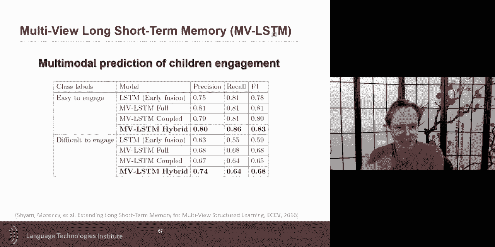

but i want to explore that and multiview，lsm does improve on that。

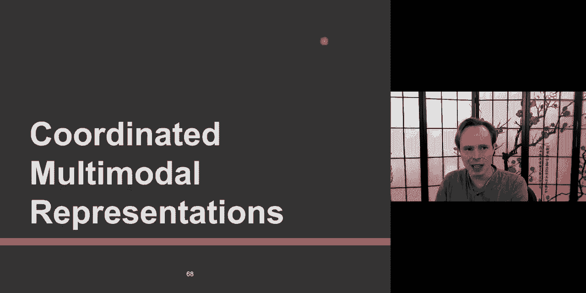

um what we will do next week and this is，just a little preview for。

not next week but tomorrow thursday，we'll start about coordinated，representations。

um and coordinated representation，you learn through representation but you，coordinate and i told you。

um this is uh a spectrum of things，and if you if your coordination between，these two。

uh left and right like text and image，like a，cosine distance if you want the cosine。

descent to be as small as possible，as we've seen in embeddings like with，language embedding。

if you force them to be as far as close，as possible，you're mostly making it so that these。

are mostly the same or，uh or at least their cosine some，distances is the same。

so um so this is in the spectrum of，thing very，very strong correlation uh but it turned，out that。

um uh some of the papers i talked to you，about，um oh and so what will be the last，function。

uh and so one is to have it very strong，like a cosine similarity。

there is another one which is you have，the two distance，and you could make it as a max margin。

which is uh a little bit related to，what's really popular these days as，contrastive learning。

um but yeah so do you want to get the，positive，uh do you do you do you don't care or，it's okay。

but you want to make the negative you，want to pay a price，uh for the negative cases and that was。

if you ask also one key papers，uh that um one papers was the，small deep learning without encoder uh。

you have the，rbm one that i talk about and this is，another one device。

uh or a french way to pronounce it uh，well uh the v's uh will be。

um to um to bring these two embeddings，together，this was a simpler one um there's，different kind of。

ways and and of of looking at these and，and that's uh one of the paper uh that i。

think this one i may have put as，optional，or not i forgot if i put it optional or，not um。

but uh is that there's ways to lose，you，um in this case you only focus on the，negative example。

um but there is also structure premier，uh preserving constraint and the，intuition here。

is you one image that share the same，meaning uh to be close to each other。

and then the others are outside so it's，kind of uh，um if you're close to each other then。

you want the same meaning otherwise it's，not，um so it's structure premiere pro。

preserving uh because it it the，structure meaning，if you have some kind of uh symmetry。

uh similarity function or or closeness，or neighborhood，uh then you can use that uh to help。

in the learning and uh one of the paper，um that we proposed was uh about，that。

um um so um i wanted to share，these uh different approaches we'll talk，more。

uh on thursday about those different，coordinated approaches。

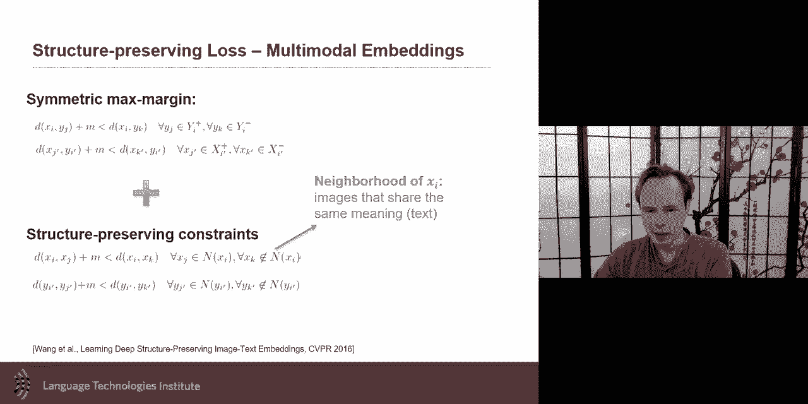