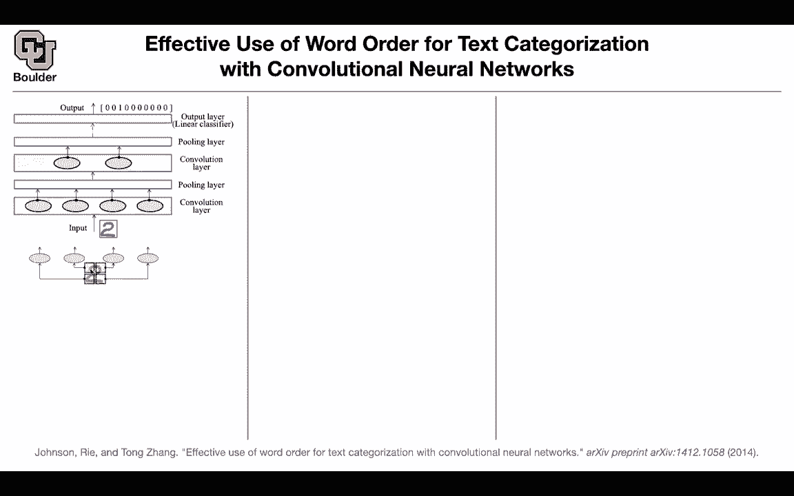
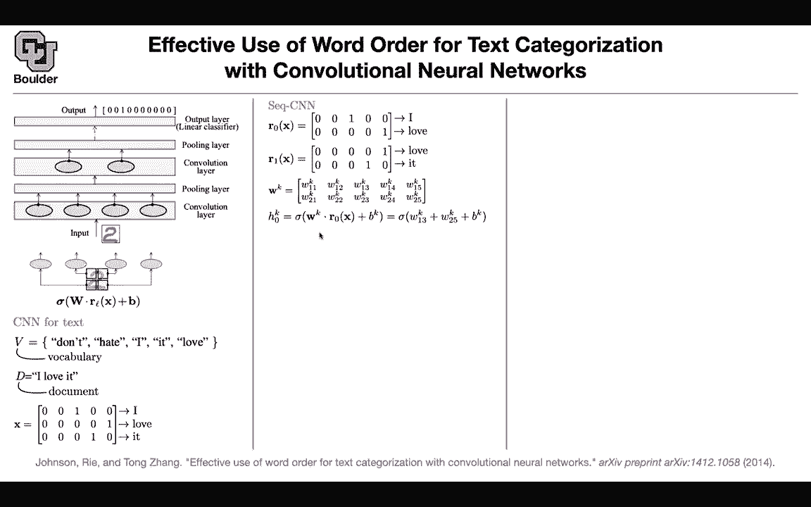
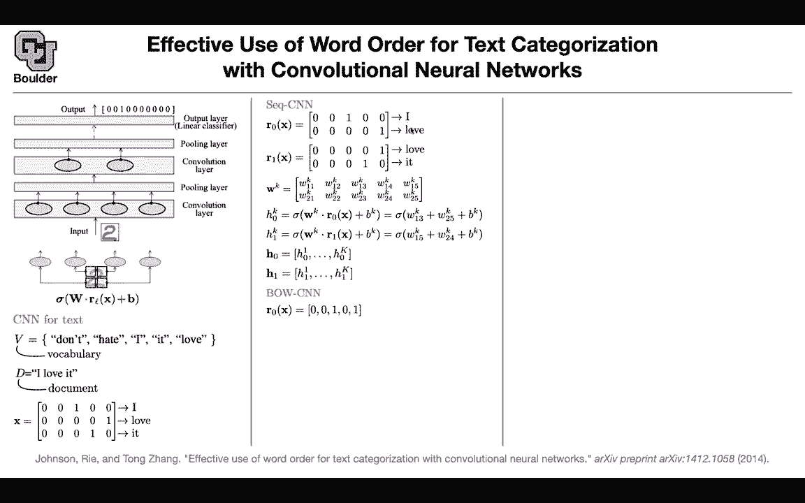
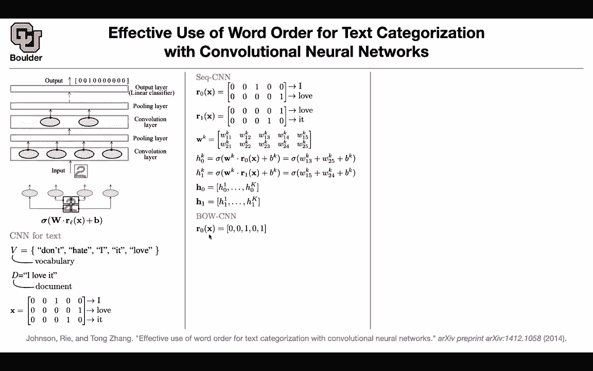
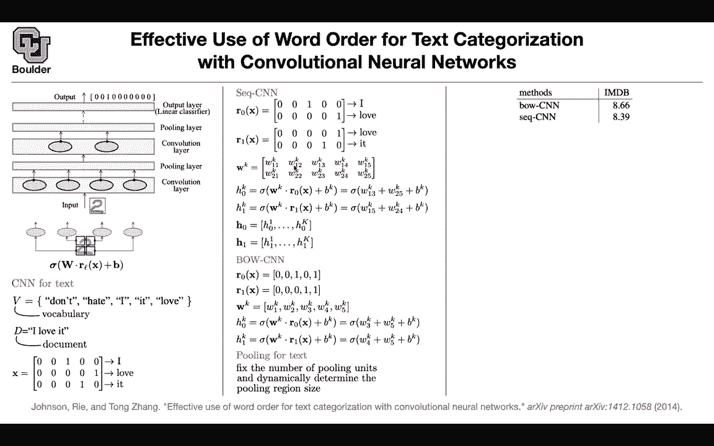
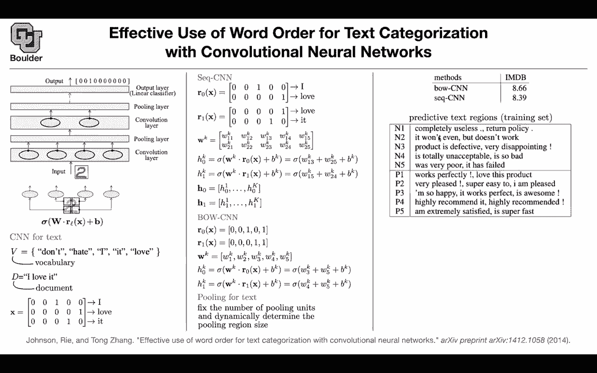

# P104：L49.3- 基于CNNs的文本分类 - ShowMeAI - BV1Dg411F71G

Let's go back to convolutions， we're still going to use it for text classification。

 but then this time rather than using word vectors， we are going to use Waha encoding vectors。

And let's take that if you had an image， what would you do you would have a sliding window。

 you take a window， you use the same parameters here。

 and then you would slide it over your image and then that's going to give you a vector in the end or it's going to give you a new image that you can do pullinging layer on it once you do the pulling you're reducing your resolution once you reduce the resolution you can do the same convolutions again then you do pool you reduce the resolution and in the end you're going to predict your class okay this is class3 wherever you have a one in the output that's going to be class 3 or class 10 or whatever and what is the operation that you're doing for a convolution you take a window of your image x is your image X is your input。

 you take a window you turn that into a vector or even you don't even need to turn it to a vector that's going to be your window or L of X and this is window 1。

2，3，4 L is 1，2，3，4 you do。

dot product by a bunch of parameters so w is a parameter b is another parameter you push it through an on linearity for instance R and then that's going to give you these four numbers here or these four vectors because these could be vectors they could have dimensions so that's just the convolution how do you do it for text that's an example this is your vocabulary and your vocabulary is going to be don't hate I eat love so that's your vocabulary。

Let's take a look at the document， for instance， I love it。 So that's a document in your dataset。

 Let's represent that with one hot vectors， so this is not word vectors， these are one hot vectors。

 I is going be hot in the third location Y because in your vocabulary I is the third entry123 so the order of your words in your vocabulary matter so you cannot reorder them if you reorder them Everything is gonna get messed up。

 Love is the last word in your vocabulary， so you have one here and a bunch of zeros It is the fourth word in your vocabulary。

 so it going be a one here and it's going to be zeros everywhere else so that's your x for images for text for images that was your X so this is x what is gonna be these windows。

 let's say what is R0 so you're going to process words in pair for instance the first first you're gonna。

Two words I love and this is going to give you I love and this is R0 and these are vectors now you have a one here and then you have a one in the end that's R0 and then you're going to slide it to the next pair of words in your sequence love it Love was the last it is the fourth and these are going to be your slideed windows over your document。

Then you're gonna to have a bunch of parameters These are these ws don't worry about k for now you're going have a parameter that has the same size as your input because you want to do dot product it's going to be w11 w12 W13 up until W25 then this operation here that I was explaining is just a dot product of this matrix and let's say r0 and let's just do it this is gonna to be0 if you multiply this is going to be0 W13 is to be w13 because there is a1 there and w25 is going end up here so only two of those entries in your weight are going to survive because these are sparse matrices and then in the end you're going to get a number and you're going to put that number in h0 k you do the same thing for H1k and then only w15 and w24 are going to survive the rest of them are going to end up0 and then you add them up that's a dot product that's going。

Give you a new number and then for each window you're gonna end up with a vector。

 This is what we were talking now I mean in the first slide of today This is how many kernels you're gonna have。

 you can have K kernels This is the size of the vector that you're gonna end up with after doing your convolution and then for each window you're gonna have a vector and these are exactly what you have here。

 these are these H1 H0 H1 H2 H3 and that depends on the length of your input vector that's one way of doing it this has a lot of parameters you can reduce a number of parameters by treating these pair of words as back So you're ignoring the ordering there So there is always a tradeoff you're giving up something for less parameters and it's just a matter of summing them up that's going to give you r0 that's going to give you r1 now your w rather than having 10 entries in it。

can have only five entries， you can do H0， do the dot product， H1， do the dot product。

 and therefore pooling layer， what are we going to do？

We want to reduce the length of our sequence from one sequence to the next。

 but then with sequences you can have variable length for your sequence。

 Some sentences are shorter medium size longer but in the end you want to end up let's say with 10 words or 10 vectors So you're going to fix that So you're going to fix the number of pulling units that you want to end up with in this case you want to end up with two and then you want to know how many of these inputs vectors to merge。

 That's one you can determine on the fly depending on the input length so you're going to divide the input length by the number of output length that you want to end up with。

 and then that's going to give you the window size that's how you're going。

Determine the pooling size let's see the performance on IMDB So it turns out that sequence CNNN is doing better than bag of words maybe because it has more parameters and then if you want to know the cool thing about convolutions is that you can actually look at its receptive field and that means that for prediction let's say negative what words we contributing to that prediction and let's take a look at the first five So these are negative sense completely useless it won't even what doesn't work was very poor for positive works perfectly etc and then that was for training you can have the similar thing for testing I think we are one minute over time for those of you who want to leave you're more than welcome to leave and for those of you who want to stay and ask questions I'll be around The question regard the receptive field looks like a lot of the words are like XM。

Like useless like the first one or want， but some of them are seems really irrelevant。

 like eat or has。Someoneing did it give it how many walls should output or was it just based on sentences So the way that you come up with this table is that for the last layer you have two cases it's either a negative or a positive so forget about the rest of the entries here it's either a positive or a negative and then you have a matrix that is taking the high dimensional vector and then projecting it into two okay。

 you can take a look at the importance of those weights that are predicting the negative that are predicting the positive and then you can trace it back you can trace it back and see how many words are contributing to that positive case or to that negative case that's going to give you a sequence of words that are contributing the most for that negative or that positive case but then you can report the first most important weight。

You can report the second most important I mean the second largest or the third largest。

 the fourth largest or the fifth largest contributing to that prediction being negative and now you can trace it back and see what words we're contributing and these are the words that are contributing and youre right for instance。

 this point here and this comma here they don't have any meaning but this is at least showing you that we are looking inside the predictions of the model we are trying to interpret it Why did it make the decision that it has to be a negative case completely useless Does that answer your question Yeah definitely really cool idea with theceptive field。

Yeah， go， thank you， sure， any other questions？