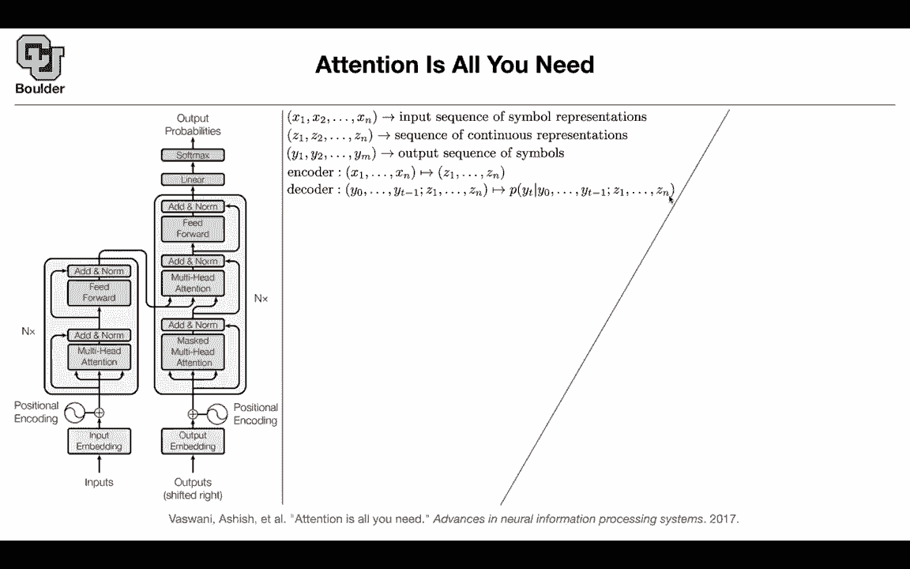

# P118：L56.2- Reformer - ShowMeAI - BV1Dg411F71G

There is this wrong belief that attentions are going to solve all of our problems。

 but that's a wrong belief。 that's a good model。 it has very little inductive bias and it's very good for big data like the type of data that you have for language modeling but they have their own drawback can somebody guess what that is I mean there is no free lunch it require a stupid amountada stupid big animated data and for language modeling we have so let's say that's fine。

And the type of data that you need for these are unlabeled。

 forget about translation for a second if you're doing language modeling。

It's onlabeled data and you have a lot of it there is no free lunch these are not cheap models attention and we are going to see what is the cost they are costly both in terms of memory and in terms of computation and there is a thread of literature and trying to make transformers the model that we just saw is called transformer they want to make it more efficient and let's take only the decoder part because that one we're going to need for you can use both the encoder part and the decoder part of of a transformer for language modeling and we are going to see both both of them being used but for this paper let's take the decoder and try to make that more efficient and there is a thread of literature on making transformers more efficient。

I don't want you to understand every single detail of this paper and I want to go through it really fast but the idea is that there is no free lunch for attention what I just explained I was expanding across the terms and explaining it that way because it is more intuitive it's going to help us understand it better but on your computers this is what you do Q is the you put all of your sentence in a big matrix you multiplied by a weight that's going to give you Q you take your sentence multiplied by another matrix that's going to give you k that's query that's key and you have the value and that's how you're gonna to code it on your computer query times key it's going to give you your attention after the softmax and then you're spreading your attention among your values so that's how you're gonna to code it but let's take a look at the sizes of Q K and V you want to process。

Things in parallel because you want to use your GPUs or TUs more efficiently so you're going to process things in batch each sequence is going to have a length and the length let's say it's D it's L and then each one of these matrices they're going to have embeddings and that's going be dimension D so it's going to be a tensor of size B by L by D all of these matrices B is a bad size L is a sequence length and d is a dimension of your query key or your values let's take a look at this Q times k Q times k you're doing your summation over D so that's the cost of that is order D we don't worry about that that's cheap but then what's going to come out is going be B by L by L dimensional after these operation then you do your softmax for your softmax you need to pay attention to every single other word in your sentence。

So every single other word in the sentence that's going to have a for loopbe that's the size of L you need to do it twice the operational cost is going to be L squared so it's quited statictic in your sequence length so the bigger your sentence length。

 the more operations you need to do this matrix here is going to have a big memory footprint first of all you need to store it and it's going have a big computational cost so this paper is going to tell us how they want to make it more efficient and it's not the only way of making it a more efficient。

So there is a thread of literature trying to do that， okay？

Let's say L is 64K 64000 is the sequence length and for language modeling that's a reasonable size for your sentence length even if your batches1 the memory footprint of computing and storing Q times k transpose is going to be 64K by 64K each one of the entries is a float 32 and that's going to add up to being 16 gigabytes so a very good GPU these days has around 48 gigs of memory it means that perhaps you can process four batches and this is just for this operation so this is not going to fit on most of the GPUs even on the best GPUs you can process batches of very small size so how do we make it more memory efficient don't compute this matrix altogether computed one at a time and this is exactly what we were doing in the previous。

or okay。Just compute your softmax and multiplication by VS and expand it out， do it one at a time。

 so it's going to be Qie that product by KS。Cha is the key。 You do your dot product。

 There is an exponential。 you divide it by a normalization term as summation of a bunch of exponentials。

 okay all of that term you can put it in Z The question is what is your PT P if you're doing the decoder part you are not allowed to pay attention to the future information So that's your PT anys that is less than your time that's going to go inside this Z for computation of that selfmax and doing this summation here for the output and this is exactly your attention mechanism。

 so don't compute this and a store it do it one at a time It's gonna be more memory efficient。

There is this idea of locality sensitive hashing， LHS。

 we know that the computational complexity of computing this matrix and multiplying it by this V is going to be quadratic in L。

 There is a way to make it cost L log L okay。What is the observation What is the big observation The softmax is dominated by its largest elements。

 the more similar your query and key， the larger that's going to be and that's going to give you a bigger softmax what does it mean you only need to focus on the keys that are closest to your query So you have a query here for computing this Z you just need to pay attention to the ones that are closest to z but how do you encode that that's why you need a hashing mechanism your hashing mechanism is going to say that nearby vectors are going to get the same hash if they're close give them the same hash otherwise give them different hashes and you have a hash function Now what you're going do is you're going to change this PT your PT is all of the S that are less than t you are still not allowed to pay attention into the future but then you look at the hashing function and if two vectors are close to each other according to your hash they are part of your P and then you can reduce the。

pitational complexity from quadra de in L to order of L logl， so I'm not going into a lot of details。

 a lot of details I'm glossing over， but that's fine。

 This is just to introduce to you that attention mechanisms are not for free Even for back propagation you have trouble when you're doing back propagation you need to know your forward variables to compute your backward derivatives The trick is that you're going divide x into x1 and x2。

 you process them separately。 you have your attention here。 you have your feet forward here。

 and y1 is going to be f of x2 plus x1 y2 is going to be x2 plus G of y1 Why did we do that because when you're going backward you don't need to store the forward variables you can just compute them you can compute x2。

 you just solve it x2 is y2 minus G of y1 and x1 is y1 minus f。

Of X2 so if you divide your vector into two components and process them separately。

 you don't need to store any of your forward operations。

 you can just compute them when you need them in your backward pass and this is called back propagation without storing activations What else we are going to chunk our data or sequences across deposit so if you have a large sequence don't process it at once process it in chunks so you have a long sequence and then you're going to have C chunks and then you are going to process them independently and at some point they're going to talk to each other there is a nice figure in the paper if you want to take a look。

So what is the performance did we lose anything if you use the regular forward pass versus reversible。

 reversible is more efficient than regular， but in terms of performance you have the same performance。

 you didn't lose much。There is another idea that you can actually share the same weight that you are multiplying your sequences to obtain query key basically your query and key are going to be in the same space if you do that you're going to save some parameters but then you don't lose much performance。

 there is another one， this is to study the effect of the hashing and how many hash buckets you need to have。

 this is the H function here， how many buckets you're going to use。

And you don't lose much information and most of them are being okay except for the two hashes so that's probably too low for a bucket and what is this axis here this is the perplexity I don't want you guys to be afraid of perplexity we're going to need it for later on for language modeling for language models you have a sequence we know that you're going to have a probability。

If you take a log it's going to become more clear if you take a log you're going to get one over n of the negative of the log of your probabilities so this is square root of n now makes sense you can think of it as geometric averaging or you can think of it as arithmetic averaging if you take a log and that's going to give you a perplexity measure the perplexity is directly related to your probability of the sequence and this is this y axis I guess I'm going to stop here for those of you who want to leave you are more than welcome to leave for those of you who want to stay and ask questions I'll be around this question about the last paper Sure so what I was trying to say is that in like the initial the input size to the output encoding branch is some fixed size based on the length of that output like the target output。

And then you mask part of that because you only want to pay attention to the past， not the future。

 but then once that goes through that encoder branch and it goes into another encoder branch it seems like it doesn't make sense to mask it again or because like or maybe it does I guess I'm just confused like why you would mask multiple times like will it still be say say the original output size is size in and then you mask the last three elements then once it goes through that encoder branch will it still be size in and then you again mask the last three elements that makes sense's hard to No it's say it's fine the decoder the probability is that you're going to get out here let's say you are here in your sequence it's Y t your sequence is now located that T and you want to predict that word okay。

know that your attention mechanism， these blocks are going to give you sequences of length M so it's going to be the entire sentence when you're doing your training okay so it's going to give you from one up until M but then if you're sitting here you need to cut your attention somehow you are not allowed to pay any attention to information in the future but what about like subsequent like this depth in during training when you this is the first layer you are fine that one you're understanding there' is no problem with that your problem is with the next layer for the next layer when you're doing your training some information is going go from Yt plus one and Yt plus2 when you're processing this okay some information are going to leak into the part of the block that you don't need to attention to okay because they share parameter。

Okay， so some information is gonna get leaked So you need to mask it again So you need to mask it again otherwise you're cheating you're paying attention to yes。

 it's not direct but indirectly you're paying attention to your future through the hidden states Okay yes it's not direct it's not exactly Yt plus one that you're inputting but it's a variant of yt plus1 it's zt plus one or ht plus1 that is leaking to the next layer so you're not allowed to pay attention to that because in subsequent layers the input to this output incoding will always be size M Yes so it's always size m okay and then we need to remask each time Okay Yes see this is size M goes in size m comes out a sequence of size M goes in sequence of size m comes out to the next layer Why don't they do mask multi head。

Attention in that oh I guess because that one's paying attention to that branch yeah you mean I was going say the the second one in that this one yeah because you need all of them you can pay attention to everything it's not from one up until T it's from one up until n yeah from the other branch Okay yeah so you know all of your sentence in your sentence Yeah okay thank you Yes sure。

