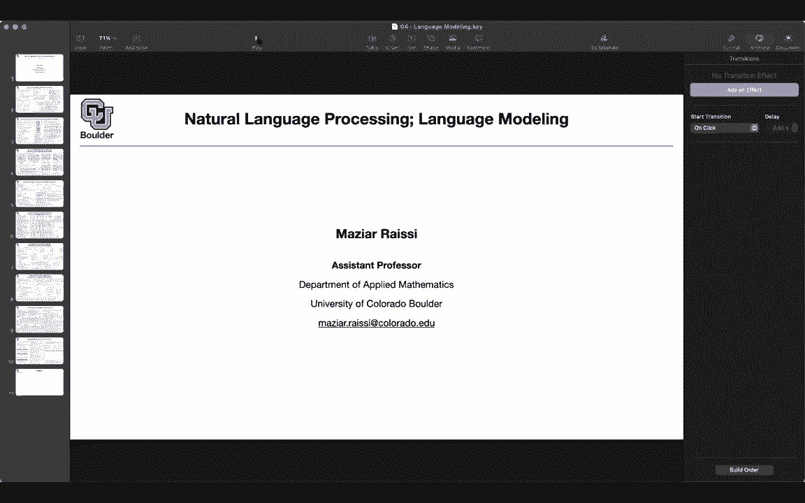
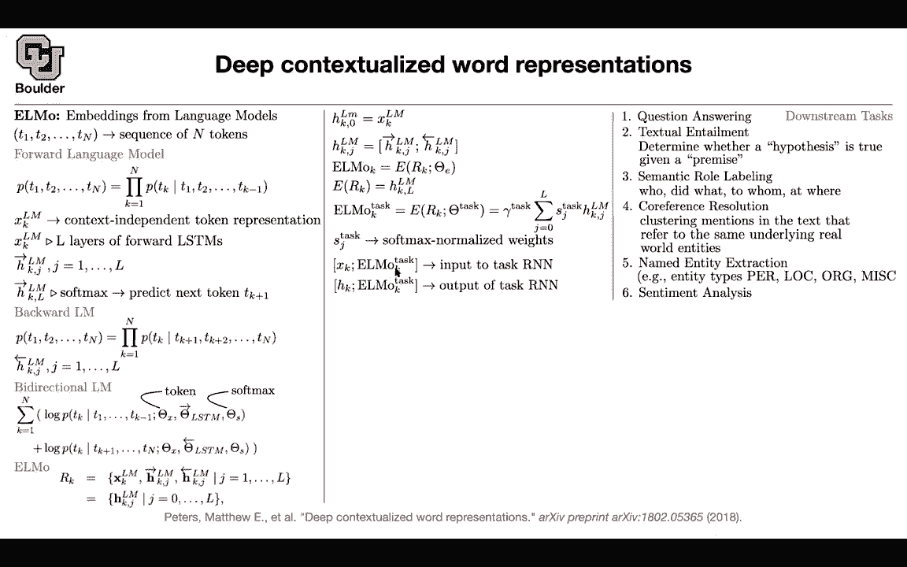

# P119：L57.1- ELMo - ShowMeAI - BV1Dg411F71G

Okay I'm gonna start with a question So why do you guys think we are interested in language modeling Any thoughts for pretraining Yes。

 so that's the answer I is looking for so you don't you are not interested in language models for the sake of language modeling Okay because language modeling is like I give you a word and then you predict the next one that's not an interesting task on its own you do it because you want to do pretraining because you have a lot of data on the internet。

 you are unlabeled data you are gonna to learn something from those data and then you want to do transfer learning and then go back to your classification task Sen analysis so those are the target tasks or translation once you have a good language model it's gonna to help you do some transfer learning or new tasks so we are not interested in language models for the sake of language models but because。

They're going to help us do transfer learning and we already saw a version of transfer learning Can somebody remember so when we were doing word embedding we were doing some transfer learning at the first layer of our neural networks for classification or for translation so we already saw an example of that some transfer learning and actually the field of language natural language processing is these days taken taken by transfer learning so you can just rename it to be transfer learning so this paper is going to expand upon word representations but we saw before that peer word in our dictionary we had a vector it means that peer word we have only one meaning but we know that words are going to change meaning according to their context for instance bank can have two different。

Meanings if you're talking about a river bank it has a different meaning compared to when you're talking about a money bank so if you assign only one vector to your words in the dictionary you're going to associate with that only one meaning so the idea of this paper is that you can have multiple meanings for your words depending on the context and how can we do that the model is going to be called Elmo embedding from language model so what is our data our data is is a corpus of size N so that's a sorted corpus one word is going to follow the next word and you can have a forward language model so what is a forward language model you want to know the probability of this sentence happening you can use the chain rule for probability so there is nothing wrong with that and it can decompose your con your joint distribution。

To conditional distributions so you first know the first the first word and then you can predict the next word。

 then you know the first two words and then you are predicting the third word， etc。

 and that's the product of all of those we saw this before when you were doing word representations So for each word you had a vector and that's that vector and this one is a context independent token representation。

 Yes， during training you are looking at the context but for each word you have one meaning for instance。

 you cannot model bank having two different meanings so that we know k corresponds to this K here so that's the index of the word that you are predicting you can take XlM that vector in addition to the other vectors that you have and push that through a layers of LSTMs。

So a sequence goes in a sequence comes out， you take that sequence。

 you push it through the next LSTM and you do it multiple times， so we are still using LsTMs。

 you push it through a layers and in the end you're going to get h forward of these index K and you're going to have J layers so J is counting the layers so these guys are still vectors Okay so far so good you keep track of each basically representation after each LSTM Yes exactly so that's what we are doing。

It's not only the last layer but it's all of the layers in between so we are keeping track of what is happening parish layer parish is stack of your LSTM then the last layer。

 the hidden state of the last layer you take it you push it through a softmax and then you do your prediction you predict the next word and that's how you're modeling your probability okay that's a forward language model you can have a backward language model as well there is basically the order doesn't matter how you want to do your decomposition you can do your decomposition and predict the word a TK conditioned on the future words and still you get the joint distribution of your corpus okay if that's the case you can write a model for this you can have a backward LsTM stacks of that LS stacks of backward LTM and now you can have a bidirectional language model how do you train this how do you train the weights of this LSTM。

Add to your context independent word representations。

 you just take a log of this objective function and the other objective function and add them up so you're giving equal weight to the forward and backward language models If you take the log of the product is going to give you the summation of the logs Now here you see all of your parameters these torkens are your context independent token representations So these are your word vectors your LsTMs are going to have parameters。

 the forward LsTM is going to have its own parameters。

 the backward LstM is going to have its own parameters and then the softmax that's giving you the probability of the next layer the next word it's going to have its own parameters。

 and these are the parameters of your softmax Now you're optimizing this you're maximizing these log likelihood we respect to these parameters okay once that's done this is called pretraining and as you can see you don't need to。

Have labels for your data。 It doesn't have to be a translation task。

 It doesn't have to be a classification task so you just learn these weights using this objective function。

 it's unsupervised once you learn them you're going end up with a set and that's exactly the question that you asked are you're going keep track of all of these hidden outcomes and the answer is yes。

 so you take your word representations you put it in this set are K the forward hidden states。

 the backward hidden states for all of the layers not only the last one but all of the intermediate ones you just put them in this set actually you can make that notation simpler by setting Hk0 to be your initial word vectors now this hk0 is gonna be your x of Lm So now you are just making the notation easier and you can stack the forward and backward hidden states in one。

Vctor that has twice the size of the other ones individual individually So what is the Lmo representation then you don't want to have a set。

 you want to have a vector per each word now for each word K or Tk we have a set you want to turn the set into a vector so you can have a function here。

 this is a general formulation for Lmo for word K this is a this is an example of that function it could have no parameters at all and you' are just taking the last layer and you are just representing this set by one of its entries。

 the last entry that's one version another version is to actually have some parameters。

 these are task dependent parameters so these have to be optimized when you' are doing your downstream task。

Whatever you're going do you take all of your layers intermediate layers and let's say you have a budget of one that you're spreading among all of these layers so whenever you have a budget of one there is a softmax so these SJ task there is a softm on it but then you can increase your budget by multiplying it by Lambda task so now you're increasing your budget from one to sorry this is gamma task so these feta task is now gamma task and SJ task SJ tasks add up to one so whatever are youre going to do now you have a classification task a sentence goes in and maybe you want to classify the sentiment previously you had only the context independent token representations for your words now you take your words push them through these forward and backward a SMs get Lmo K task so you get this guy you concatenate the two now this is the input your task RNN and let's say。

have an RN for your task or you can have your R&N for the task， you take Xk。

 you push it through the RN for the task， you get Hk and then before you push it through your softmax for classification purposes you just add this vector here here you just concatennate it so you can have different versions of you can play around with how you want to use these representations do you want to use it at the first layer as the input your RN or you just want to concate it to the output so you have flexibility of how you want to use it。

 it's gonna to have its own parameters now you're going to write down your loss function for your target task or your downstream task and let's say your downstream task is question answering maybe somebody gives you a question and it gives you four answers and you want to select the correct answer that's question answering you can have text。

Entailment and each one of these have their own data but their data is much smaller compared to the data that you use to train your language model it could be textual entailment you have a premise given the premise is the hypothesis true or no you can have semantic role labeling and the task is this word is it a person is it is it correspond to a who or is it the what is it an action the action is done to whom and the action is done where we can have co resolution so these are different downstream tasks you can say I want to cluster thes in the text that refer to the same underlying real word entity maybe the real word entity is a person and sometimes for the person we are going to use he she they etc and they are referring to the same real word person and we want to highlight that we covered。

We saw an example of named entity recognition where each word had to be classified as a person。

 location， organization or miscellaneous， and we saw semantic analysis or sorry， sentiment analysis。

 sentiment classification。So here are some tasks and some data sets for you to explore S is a Stanford question answering SNLI is a Stanford natural language inference。

 semantic role labeling is SRL。Cof is core reference resolution NR is named entity recognition and SST sentiment Stanford sentimentmentary bank and sometimes you're using F1 F1 is a weighted average between precision and recall as your performance metric or some other techniques these are highly optimized methods for that particular task so they are not using language models you can have a baseline system which is an RN doing the classification if you're doing sentiment analysis and it hasn't seen any un labelbeled data so there is no pre-training going on that's the baseline if you add a mo representations to those baseline all of these scores are going to improve and these are the percentage improvements so these are huge improvements and in the end how does it differ from。

Glove or word vector representations and to understand that let's take a word let's take play play can have multiple meanings according to the context if you use nearest neighbor and you find the nearest neighbors of play so you have a word vector for play and you're gonna have word vectors for other words in your dictionary you can compute their distance and that's going to give you the nearest neighbors and these are the nearest neighbors playing game games play players play so it turns out that all of them are conveying the same meaning but now if you take into account the context of the word play so now play in this sentence as a different meaning then play in this other sentence and to understand that you can find the nearest sentence that contains a play to this sentence here and you can see that this first sentence correspond to。

Probably baseball so that's playing baseball or this one is about a or playing it's about actors and actors playing okay。

 now this is the way that you are going to convey multiple meanings for your work so there's a question are those nearest neighbors in the like in the context of the source or is it just the semantic meaning of like the word or is like the sentence that you input with play related to the nearest neighbor。

So what you're going to do is you take this sentence you're going to push it through your LSDMs。

 but then you' are going to take a look at the representation for this word so let's say this is one234。

56 so you're going to take a look at the representation for the six word and that's going to be this Lmo here you do the same thing here one23456789 you look at the representation of the ninth word in this sentence that's going give you another Lmo then you're going do the same thing for your other sentences that contain the word play in them now you have a word vector for play you have another vector for play here if you're close to each other you're going to report it okay thank you any other question I have two questions then one is that that kind of limits the words that are。

Nearest neighbors to only only the exact same spelling word right you weren you're not going to find。

Production as a synonym for play。 No， so those sort of tasks， you can。

Now you have vectors for those two words。 And if the vectors are close to each other。

 they probably have the same meaning。 Yeah， so no the what we are looking at here is you have the same word previously。

 you had only one vector corresponding to it。 But now you can have multiple vectors depending on the context。

 So now this play is going to have a different vector compared to display。 Yeah， okay。

 the other question I had was about the。The soft max for predicting the next token Tk plus one in the left column So when you when you have a the M。

The output of layer L from the LSTMs you end up with k vectors that are each I don't know some hidden dimension and then you do a fully connected layer from that to some vector which has as many entries as the number of tokens or your vocabulary size Yes so for this last layer the softmax layer I'm deliberately being a little bit vague and there is a reason for it because these parameters could be a spread across all of these words at the last layer because the sequence goes in an LSTM the sequence comes out and this is the last layer of all of your LSTMs you can actually look at the last word or the last representation or you can look at all of them and multiply them by a bunch of parameters but whatever that you do you're gonna to push that through a softmax so yeah we are being a little bit weight。

Here for good reasons because there's there's many different design choices for how to how to get the softm word prediction done Yes exactly well usually it's the last layer and the last entry sort the case entry you're going to use to if you want to do classification or no here you want to do predict an X word which is basically a classification task。

Any other questions How are we minimizing the objective like what is the objective you have two objective one objective is pretraining so you want to learn your Lmo representations for that you maximizing these loss function that's exactly your loss function with respect to these parameters the parameters of your tokens LSDM and your softmax that's going to give you Lmo and then you're going to fix it you can fix those parameters now you can go to your task your task is let's say is a sentiment analysis task a sentence goes in and a class comes out of positive review or negative review let's say then that task is going have its own RN it's going to have its own softmax and it's going to have its own loss function and it's gonna to have its own data you take that data and then in addition to whatever that you were doing before you are doing word。

and pushing it through your RN Now you're going to add these Lmo vectors either at the input or at the output layer by adding in you just concateulated So this is this layer here is right before your softmax for your sentiment analysis and then you're gonna have a loss function for that that loss function you're going optimize with respect to the parameters of your task RCn R So you're gonna to have a task R you're going to minimize your loss function with respect to those parameters and this gamma and SJ do you see my screen now its we can see it but it's still frozen where your cursor is putting an Elma at least for me I it better。

No yeah， we can see now okay perfect so where were we So yeah you have your task are so now you have your downstream tasks they are going have their own loss theyre going have their own network in addition to whatever that you were doing before with your word vector that you were doing before you're going to add these Lmo representations and then you can you can opt over these parameters when you're optimizing your downstream downstream tasks you can optimize these parameters as well does it answer your question so the El vectors fine tuned as well yes。

 you can fine tune them if you want so you can fine tune these all of these parameters if you want in your downstream task Okay Okay the other question will have multiple representations of the same word one is the original the next is theelmo representation as important so your down。

T task is going to have your X case。 Yes， your word representations。

 in addition to L more representations。One of them is taking into account the context the other one is not okay does that answer your questions can a particular word have different meanings in a particular downstream task absolutely it's exactly what we are doing here that's the whole objective here。

So the word play here is going to have a totally different meaning than the word play in the other sentence that's the whole purpose of what we are doing okay and so then depending on the amount of times play is mentioned in your input senses you could have multipleelmos of play but then only one word one only Xk that represents play yes。

 so you have one Xk that represents play and you can have depending on the context you're going to have a different Elmo because these Elmo is going to go through a bunch of LSTMs okay all of these words matter spectacular on made etca they matter to give play and other meaning and it seems like you could get you a differentelmo meaning depending on how。

Big the sentences that you choose to input are like you could you could use a I don't know a five word window or a 10 word window and those are going to give you different helmets yes that's correct so do they always just default to a fixed sequence length or do they do naturally just based on where where sentences end for the LSDms at least during inference time you don't need to have a fixed sentence length you can have variable length inputs。

And that's fine， so you can take a look at where the sentence starts and when it ends because that's an LsM。

Okay， yeah it seems like a lot of times they try to maximize the like the amount of tokens that you can pass into a GPU at once so you try to make make your batch really large。

 but it seems like that could be problematic with this because if you make your context too big it kind of like would would reduce the importance of the sentence you actually care about if you include an entire paragraph at once so that depends this could be sentence by sentence yeah。

Okay， shall be more on， okay， sounds good。