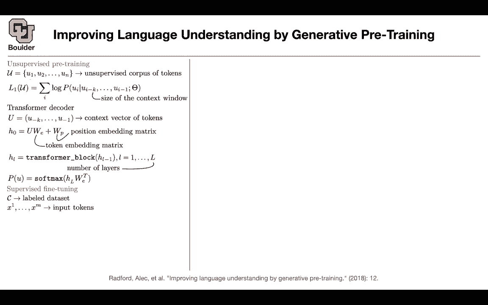
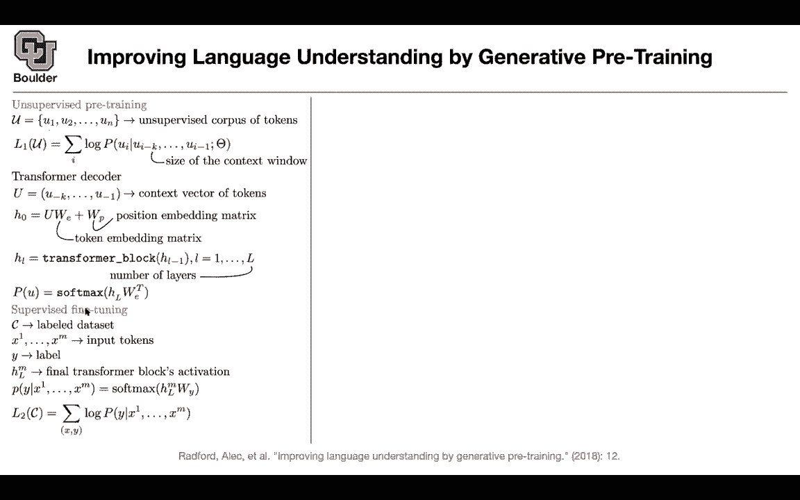
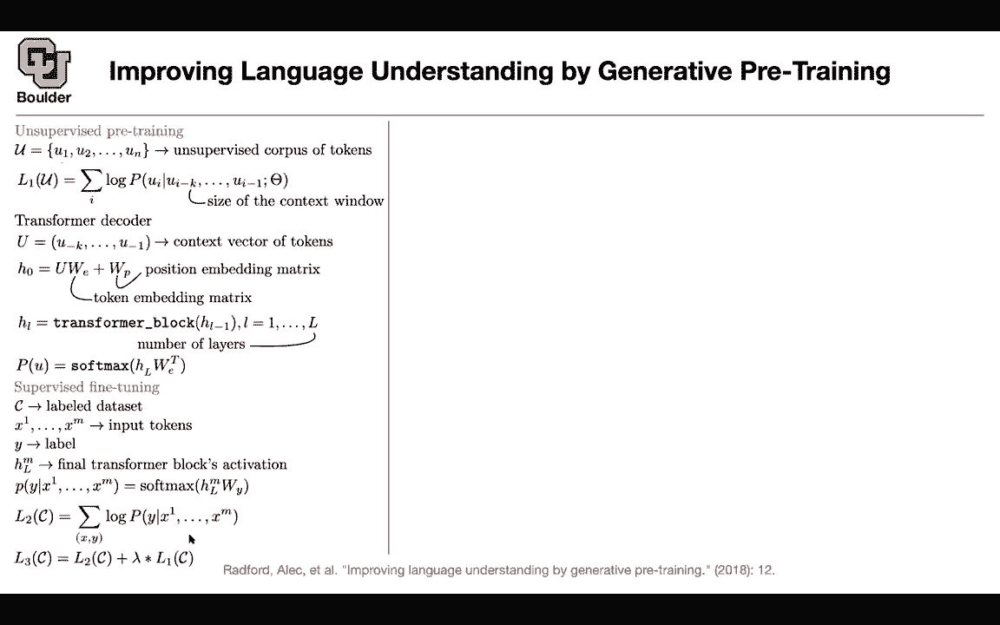

# P120：L57.2- GPT-1 - ShowMeAI - BV1Dg411F71G

So I'm sure you have heard about GPT1， GPT2 and GPT3， now we are going to talk about GPT1。

 and then we are going to cover GPT2 and GPT3 later on。So what is the idea。

 the idea is the same as what we saw for Lmo， but now you're using the decoder part of a transformer rather than LSTMs again you have unsupervised pretraining that' your corpus your task is given the context predict the next word now you're going to have a transformer decoder rather rather than an LSTM that's your context vector of tokens then we know that for transformers not only you need to do word embeddings but also you need to do position embedding because you're processing the entire sentence in one pass in parallel and then you're going to have multiple blocks of transformers。

 these are like multiple layers of LSTMs so you're stacking one layer on top of each other and you're gonna to have L layers L is counting the layers each one of these guys is a sequence a sequence goes in a sequence。

Out then you can take the last layer， the output of your last layer multiplied by a weight matrix that's going to give you a probability of the next word that's your pretraining so you do your pre-training on your unlabeled data it's very simple the only changes that you're using a transformer decoder you' are not using an LSDM anymore then you can do supervised fine tuning somebody gives you a new data set this is a labeled data set previously this is unlabeled。

 this is labeled， this is unsupervised， this is supervised。

 you have your input tokens and let's say your task is sentiment analysis classification a sentence goes in then you need to say the probability of that sentence belonging to a class What is that and then you're gonna have the corresponding label this is input data output data you can take the last layer and from the last layer you can take the last entry of your sequence。

This could be your final transformer block blocks activation you take that you push it through a softmax it's going to have its own parameters and that's going to give you the probability distribution now you can have a loss function corresponding to this objective your classification objective let's say this is L2 you had L1 and then you're going to optimize this you're going to fine tune in these parameters so you're going to optimize this w y in addition to fine tuning whatever parameters that you had in your transformer and that's how you're doing your transfer learning if you have only L2 of c you might run into trouble because you don't have enough data sometimes you can add the unsupervised loss that we just define up there but now on the corpus on the labeled corpus and then you can try to properly weight the two okay that's going give you a loss3 and that's what you're going to optimize during fine2。

So this is a paradigm of pretraing fine tuning you pretrain on unlabeled data you fine tune on supervised data so let's see the type of tasks that you're gonna have you take you take your text and position embedding that your text and position embedding you push it through your transformer and you can have 12 of them L here is 12 because we are dealing with a decoder part of our transformer this is masked multiat multi head selfat and then you have a layer norm you push it through feed forward neural network so we covered the decoder part of a transformer last session and then you have two heads one is the task classification head which has its own WY and then you can have a text prediction Pre the next word it's going to have its own head it's WE。

So let's take a look at some of the tasks you can do classification， as sentence goes in。

 you push it through your transformer and then you can classify it。

 you can solve the entailment problem， given the premises is this hypothesises true or no now you're taking the start premises a delimiter the hypothesises the extract is where you're extracting your classification hidden state you push it through your transformer that's going to give you your probability is this following or no are these two sentences similar we can take them and push them through these a SM sorry this transformer blocks and in the end are these similar or no that's going to give you a probability for multiple choice question answering somebody gives you a context it gives you multiple answers and then you're going to out with the probability of the first answer。

 the second answer and the third answer。

Being the correct answer and then you're going to choose the one that is giving you the highest probability so you can solve multiple different problems through the same paradigm you first do your pretraining and then you do your fine tuning here are some data sets for you to explore some of them are for natural language inference this entailment task that we saw some of them are question answersing some of them are sentence similarity are these two sentence is similar and some of them are classification like SST and then for later language inference。

 what are these acronyms and what is the task actually the task is entailment contradiction or neutral you give it two sentences is this a logical entailment of this sentence or is it the contradiction or they don't have any relationship the relationship between them it's neutral so SnLI are coming from image captions M andLI this multinLI。

Well transcribed speech popular fiction and government reports Q andI is coming from WikipedD articlesstail or scientific exams or science exams news articles aret semantic textual similarity and corpus ofling linguistic accessibility that's callla and that's a classification task so using the same paradigm you can first pretrain fine tune and solve multiple different tasks and these usually are much smaller data sets compared to unlabeled corpus that you find on the internet any questions the supervised fine tuning is task specific exactly so dis supervised fine tuning depends on the objective function that you have called the architecture is the same you are just changing your input and then the output you're modifying it a little bit any other questions start。

Dlim are special word tokens Yes， exactly this is the start of the sentence。

 That's the you can say that's the end of the sentence token Okay the other question you have is the position embedding matrix just gets linearly added So it every single h zero gets exactly the same position embedding No。

 so the notation here is a little bit sloppy don't worry about it you're just reading of the position of this matrix So you have a large matrix that is mapping one to a vector2 to a vector3 to another vector and then you're reading of the corresponding entry so should the the if entry would it be closer notation just put a parentheses around W plus W and then your U vector gets multiplied into both of those to so yes don't worry about the notation Okay then notation don't worry about it This is that's fine as long as you get。

Concept that's fine so the the first word always gets a certain vector exactly yes and a second word in a sentence always gets a certain vector and so on yes。

 the position embedding we covered it for the convolutional neural network that was the one with like the messy looking sine and cosine function and we also covered it for the translation yeah attention is all unit so we covered it don't worry but the notation over there is more precise Okay okay。

There is a question on the chat。 One detail I missed from last class is how you do your class prediction。

 class prediction solvemax from the last layer of your transformer since you have a variable number of vectors。

 Do you just do the class prediction from the last vector in the sequence。 Yes。

 so that's exactly what we are doing here。 You take the last layer。 That's a sequence。

 And that this is the last element of your sequence。 See this M corresponds to this M。

 So that's the last element of your sequence。 And that's exactly the location where you have the extract。

 Does't answer your question。 Okay， perfect。