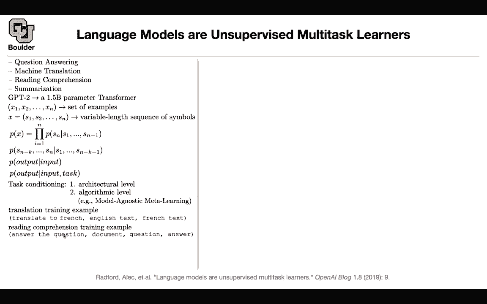
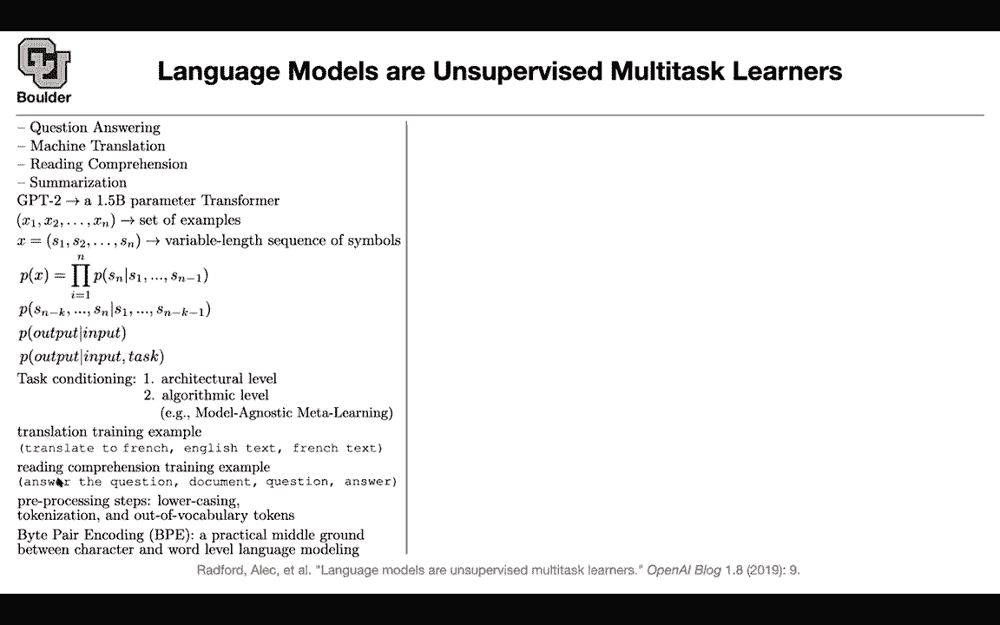

# P122：L58.2- GPT-2 - ShowMeAI - BV1Dg411F71G

So now let's move on to the next this is language models on unsupervised multitask learners。

 this is GPT2 so we covered GPT1， this is GPT2 and the framework is going to change from fine tuning and then from pretraining fine tuning to something else and you're going to love the idea。

 it's beautiful so that's the big idea of this paper the rest of it is massive scales but the neat idea of this paper I'm going to explain it and you know that you can do question answering。

 you can do machine translation， you can do reading comprehension summarization。

 these are your downstream tasks。

First of all， it has a lot of parameters， these days it's nothing 1。

5 billion parameters and this is the decoder part of the transformer， Bt was the encoder。

 this is the decoder。

We know how our data are going to look like you have n sentences and then each sentence is a variable lens sequence。

 so I'm sticking to the notation of the paper and this is a little bit sloppy。

 this should be a different n compared to the size of your corpus。

 but that's okay okay let's not make a big deal about it so these are your sentences you have a bunch of sentences in your corpus We know that we can do next word prediction or next symbol prediction we can expand your probability of each word each sentence。

By expanding its words and this is just a chain rule there is nothing wrong with that and we can actually not only predict the next word you can predict multiple next words or multiple next symbols so that's okay you can generalize it this we know already nothing new if you have a particular task somebody gives you an input and then you need to predict the output for these tasks I don't know question answering machine translation reading comprehension summarization etc。

 there is an input there is an output that's why we generalized it from one word to multiple words or multiple symbols。

But wouldn't it be nice if you could somehow condition on the task that you're interested in that you're solving maybe the task is question answering。

 maybe it is machine translation reading comprehension summarization wouldn't it be nice if you're in the realm of machine learning in general and deep learning which could include speech recognition and image classification then there are these ideas maybe you can condition on your task by modifying your architecture and this is exactly what we did for B and GPT1 and Elmo so you had particular task specific heads for your classification you had a different head for question answering you had a different head and then you were learning them you were doing some fine tuning so that's paradigm1 that we were doing there is another paradigm in the literature and we are going go through it when we do reinforcement learning and that's the idea of model astic。

LearSo you create a model that is supposed to solve all of these problems。

Okay if you have a model that is supposed to solve a lot of problems the idea of meta learning is that you're going to put your parameters in a sweet spot what do I mean by sweet spot your parameters are in a good location so that a few iterations of a stochastic gradient decentcent maybe one2。

 three or four iterations of your stochastic gradient decentcent is going to help you solve question answering a few iterations is going to solve machine translation etc okay that's how your conditioning on your task but this is for machine learning in general there is something nice about language you can actually describe your task in human language and this is beautiful you can say maybe for translation let's modify our training examples。

 let's modify them slightly let's just say our data rather than it being pairs of English and French sentences input output let's just concatenate。

Everything and then tell it what we want。 Just give it a directive。 translate to French。

 This is the first few words。 This is your data now， translate to French English text。

 French text and then you're concatenating everything in one sentence or a variable length sequence beautiful This is your training examples for machine translation reading comprehension。

 What can you do， you can say you have a prompt here， answer the question。

 you give it a document question and answer again beautiful。

 you just you are just increasing the size of your sentences slightly by giving it a prompt and you are talking to your model The rest of it is preprocessing step and these I know that you have been doing already there is some lower casing。

 there is some tokenization out of you take care of your outof vocabulary tokens so this we know how to do and then we learned about bypher encoding so that's why we are working with symbols rather than。

Okay because these by pair encoded symbols are gonna be our words if you want to think of it or sub words and we know that by pairingcoding we covered it。

 it's a media ground between character and word devil language modeling So the key idea is this translate to French answer the question and this is only possible because your task is about languages and without any fine tuning okay you are just pretraining without any fine tuning you're gonna to be able to solve multiple different tasks for reading comprehension for translation for summarization question answering and without doing any modification to your network you're solving multiple different problems by giving it a prompt So you might wonder how is it possible How does a language model is going to know how to translate because it has seen some translations on the internet Here are some examples these are naturally a occurring。

Trading data。 I'm not the cleverest man in the world。 but like they say in French。

 That's the French translation In a now deleted post from August 16。

 Tory candidates in the writing of Juliet wrote in French。 That's the French sentence。

 That's the translation。 So these are naturally occurring in our language。

 So the training of a language model is enough to help you solve different problems。

 Let's say you want to do， I don't know。 thats a question answering。 You give it the paragraph。

 That's the paragraph。 you give it the context what you want to do。

 This is the instructions that you had here。 you say passage and previous question and answer pairs。

 This is your context。 This is your question。 This is an example of how you want to do your task。

 This is your answer。 This is now your question。 predict the next word。 and youre gonna to predict。

 is' going to give you a stockholm。 And then the answers that could be correct or Sweden。

Sweden and Swedenden and Swedenden so not bad okay because you are not doing any fine tuning and this is not task specific you lack in terms of performance but you are not doing any fine tuning at all your performance is not the state of the art in this paper so these are the state of the art but this is really impressive that you can just condition on the prompt use your language model to solve different tasks so this is the big idea okay and this is a third way of solving the same problem So did you guys get a big idea here before I move through the next topic。

Okay awesome let's move on， this was GP2 it has a lot of parameters。

 but to me the smart part of the paper is here the rest of it you have a lot of computing power okay。

 but this is really smart to condition on the task or task description。

