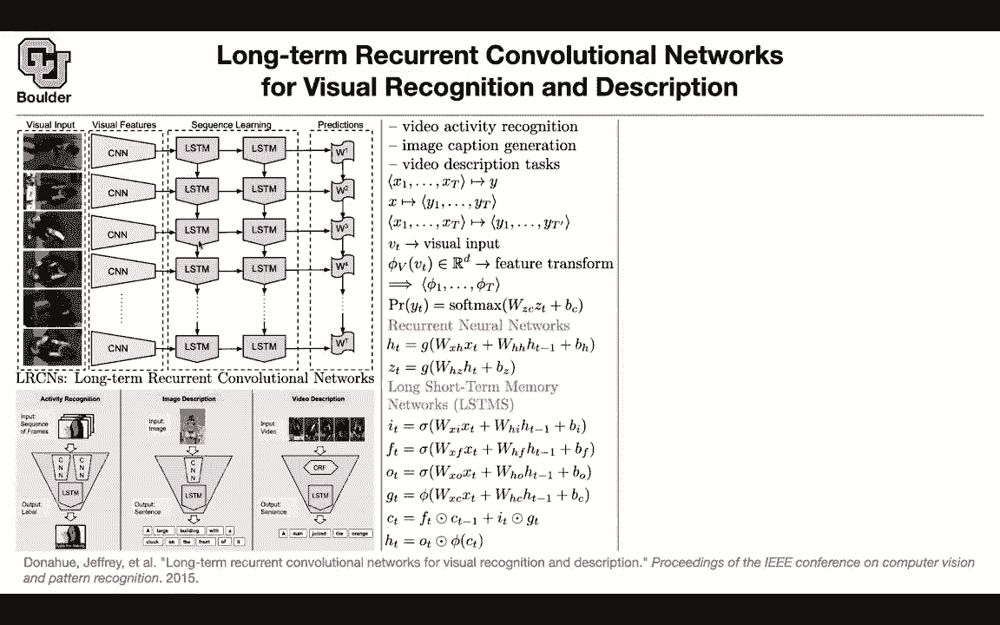

# P128：L61.1- 视觉识别与描述 - ShowMeAI - BV1Dg411F71G

So we are going to do multimodal learning for exactly that reason we want to ground our language models。

 we want to ground them with videos， we want to ground them with images。

 we want to ground them with the speech so that they have at least seen something if they are talking about something they have seen it before so we are moving toward general AI but we are taking tiny steps okay let's start with this paper longterm recur and convolutional networks for visual recognition and description it's going to be called LRCN and this is going to stand for long-term recur and convolutional networks whatever are we going to try to do we are going to try don't worry about that figure I'm going to talk about it in more details but what are the tasks for instance it could be activity recognition so gives you a video and then you want to know what that video is about for instance this person is applying eye makeup that's activity recognition。

You can have image description an image goes in and a sentence is gonna to come out a description。

 for instance， that's the image of a building and this is gonna to be a large building with a clock on the front of it or you can have video description a video goes in and a sentence is going to come out you describe the video Now this is about images and languages So now you have two modes。

 one is an image， the other mode is a language and that's why it's called multimodal。

 These are the tasks。 video description image caption generation video description tasks for action recognition you have a video and a video you can think of it as consecutive snapshots or consecutive images So these are images image one upon image T and then you want to know the corresponding label the corresponding action So could give you an image and then you can ask for a description of the image So now the。

is an image the output is a sequence of words or it could be a video goes in and a description of the video is going to come out so it's going to be a sequence to sequence but the first sequence is a sequence of images this is a sequence of words it can have different types it could be that a sentence is going to go in and then you want to draw that image it could be a sentence going in and an image coming out so you can have all sorts of multimodal frameworks。

So let's see what we want to do VT is the visual input V1 V2 V3， V4， V5 V6， these are your images。

 you take VT and you push it through a convolutional neural network so don't worry about the structure of the convolution for now think about it as a feature extractor and image goes in and a vector in Rd is going to come out a Ddisional vector so you take an image you push it through your CNN vector is going to come out now you turned your images into sequences of vectors now we can work with vectors working with images was harder we borrowed some CNNn to turn them into vectors so now these are vectors so I talked about this CNN part about the prediction part it has its own parameters ws so these are parameters w1 w2 w3 etc and then we know that we are usually doing some softmax at the end。

Maybe you're doing a softmax here if you're doing classification or if you're output outputting a sentence。

 you're gonna to have solvemax for all of these Okay so I told you what is the input and how you process the input what is your output and then whatever we going use in between we are going use recurrent neural networks now everything is in terms of vectors you're going have a recurrent neural network I'm not going to go into details because this one we covered thousands of times up until now or you can use a fancy version with some fancy activations you can use LSDs I think I'm going to stop here and continue next session for those of you who have questions you are more than welcome to stay and ask and for those of you who want to leave it can live question so。

I suppose that does weight sharing so CNNs all have the same weights and also the LMs and the ws in the end the ws could be specific to the output but you are right these are STMs share parameters and the CNN its the same CNN so okay。

 so that makes sense but the W you said that each task we might have a different w Yes so that one I'm being a little bit vague about it for good reasons。

Okay， sounds because we want to have the same framework solving activity recognition image description and video description and you see there are different tasks slightly okay okay thanks sure。

I had a quick question as well for this visual， for this this vector of features from the visual input if are we always assuming that the visual input is multiple frames。

 or could this vector just be P1 piece sub1 it could be see that depends。

 So I'm keeping it general for now， and then we are gonna solve video activity recognition。

 then that needs to be a sequence。 If you want to do image caption generation。

 then you're gonna have only one image and it's gonna be replicated。

 gonna be the same image you copy it and replicated or it could be video description。 It's a video。

 and then the output is a sentence。 Okay， any other questions in this diagram the W1 and W2 and W3 those represent layers。

These represent parameters for the output when you want to predict。

See the output the softm is going to have its own parameters Okay so these values here are and would be the output of the LST the first error or secondary or third Yes so here are your ZTs ZT is going to get multiplied by W1 and then it's gonna actually Z1 is going to get multiplied by w1 and it's going give you the output the probability of whatever size that you have this could be your vocabulary size makes sense That's why you last session we started multimodal learning and can somebody tell me why we are doing multimodel I motivated it last session when we were doing G3 I think we're trying to get to general intelligence exactly the one problem or one criticism for G3 There are many criticisms about it but one of the criticisms。

is that if it's talking about something it has no idea where it has never seen it or it has never heard about it。

 it has only read the internet about the existence of for instance airplanes but it has never seen it or for instance。

 if you want to build a robot and you want to interact with it and say pick that thing up and put it on the table it has no idea what that or these refers to unless you show it some image unless it has some vision built into the built into its brain so that's why we are moving towards multimodel where you can process not only images but can but also text but also speech etc and it's exactly what you said we are moving towards general AI so we are getting a little bit more ambitious compared to what we have been doing so far and we are taking baby steps one of the baby steps is this paper。

That we started last session it's long-term recurrent convolutional neural networks as I mentioned don't worry about this figure I'm going to explain it more and the type of activities that we are going to start with or the type of tasks or for instance activity recognition a video goes in and you want to know the corresponding label for instance this label here is applying eye makeup or you can do image description so I'm going to give you an image and then you are asking the computer to describe it for you or you can have video description a video goes in and a sequence of words is going to come out mathematically you're going to have a sequence of tensors because each image is a tensor so this is going to be a video a sequence of images is going to give you a video so it's a time series of sequences。

It's a time series of images and each image is a tensor and a sequence goes in and you want to know the corresponding label so this is sort of a classification task and this is activity recognition the other one image description an image goes in and a sequence of words is going to come out or a sequence of tokens a sequence of numbers the video description a sequence of images goes in and a sequence of words is going to come out out of the machine learning framework or it could be the other way around for instance a sequence of words can go in and then you' are going to generate images or generate video if you are a little bit more ambitious etc so now your machine is starting to imagines starting to dream so let's go a little bit more into details you have a visual input that your visual input each T is going to be an image is' a tensor。

Then working with images is hard， the same way that working with tokens was hard for languages。

 so we need to turn them into vectors so one way to turn them into vectors is CNNNs so we are going to use a convolutional neural network the type doesn't matter these sorts of things we cover we study a lot in part one of the course an image goes in and in the end a vector is going to come out and image goes in a vector in RD is going to come out so now we can think of your CNN as a feature extractor。

Now you turned your images or your video into a bunch of vectors a time series of vectors forget about these LSDM for a second the prediction part you are gonna either output sentences so per each of these weights you're going to have a word that you're outputting or it could be classification like what you have here and then maybe you can use the last entry to output your probability this could be the number of classes or this could be the size of your vocabulary and then the ret neural network that we are doing here is I'm not going to go into details because we covered it we have been doing a lot of language but now your X the input are going to be the outputs of ECNS so are going be these fees and then H is the hidden state of your rit neural network and Z is going to be what is coming out of here or。

it is what you are passing to the next layer of your LSDM because LSDMs could be deep in time like what you have here and deep in space you can have multiple stacks of LSDMs and then LSDMs I'm not going to go into details we covered it you have input gate for for the gate output gate the information that you currently receive and then this is your cell gate and then some parts of your cell gate you're going to output to your hidden state and then hidden state is the one that you're gonna use to pass information from one LSDN to the other LSTM as well as C actually so there is this data you CF101 you have one01 activities that your machine needs to distinguish among you have the activity recognition task a video goes in and you want to know the corresponding label for instance applying I makeupup so that's that dataset I want。

to explore it because it's good it's going to give you images and it's going to give you videos and the target label and when you're doing videos there is a we spend at least one week in part one of the course studying videos you have the option to take a single frame of your video for instance this frame and that could be your benchmark you ignore everything else。

You just take one image out of your video and then push it through your CNN and then do a classification that's going to give you a benchmark to start with and these are the numbers that you need to beat and in terms of your input data for videos you have the option to process to your red green blue videos or you have the option to work with the optical flow and the optical flow is going to be for each image you can obtain it from this image and the next image so two consecutive snapshot that's going to give you the movement of your pixels the movements of these the person it's going to give you a vector or per each pixel is going to give you a vector so it's going to have the X component it's going to have the Y component and it's going to give you the movement so you can either process red green blue or you can process the optical flow and these are going to be the numbers that you're going to need to beat or you can have a weighted average。

Of these two has your input， for instance， one half of red green blue。

 one half of your optical flow or onetd of red green blue or twotd of flow that's your input your CNN and the output is the class or the label If you use LRCn the method that is being advocated in this paper you're gonna get improvements because now you have all of these not only one snapshots。

 you have multiple snapshots that you're processing and in terms of fully connected6 fully connected7。

 these are the layers that you're gonna cut your CNN because your CNN could be very deep and then usually the last layers are fully connected you can say I'm going use the first fully connected or the second fully connected So this is the first fully connected。

 this is the second fully connected and6 is just the depth of your neural network up until that point or7 is the total depth of this feature extractor and this data set I want you to。

Stud it it has multiple splits if you use only one split split one。

 these are your results if you train it on all of these splits。

 these are gonna be your results so this is just more data that's activity recognition a video goes in a label is going to come out image description and image goes in a description is going to come out a sentence is going to come out and there are two data sets flick here 30k and Microsoft Coco 2014 that you can explore again the same way that for translation you could have multiple good translations for image description you can have multiple good descriptions so multiple different sentences could describe an image equally good that's why we are going to work with the blue score the same way that we have blue score for translation and then LRCN is beating the previous state of the art in terms of the blue score and this B1 B2 B3 b4 if you remember in your blue score you could include。

Uiograms， bigrams， trigrams， etc。 So that's what it means for the retrieval task it is search you give an image and then you want to find in your data the best description for this image This is a little bit different from image description here you know your descriptions you have a data set of descriptions and now you can score them given this image among these descriptions。

 which ones are the best can you list them for me is the same thing that you do when you do a search on Google you look for a sentence or you can look for for an image and then a bunch of results are going to get sorted for you we usually click on the first one。

 but maybe the 10 result from Google is the best corresponding to what youre looking for and the way that you're gonna score this you are gonna score pairs of images and captions。

Using the probability model that is coming out of here out of this softmax so you always get a conditional probability what is the probability of this sentence conditioned on the input image or the other way around what is the probability of this image conditioned on this sentence this caption and you might wonder what is this R1 or5 or 10 and me R so ME R is the median rank so youre for instance you're looking for a particular image and that image in your search is going to appear the ground truth is going to appear as a10 outcome or the Fps outcome or the fourth or is the first outcome so recall at one is going to give you a positive thumbs up if you are if your ground truth is appearing in your first search if it's appearing among the top five then you're going to give it a thumbs up。

You're gonna say okay Google or this retrieval system you did a good job。

 you count it as positive otherwise it's negative result So as you can see this is more relaxed R1 is a harder score compared to R5 compared to R actually I was explaining the recall but you get the idea R1 is a harder score compared to R5 compared to R 10 what I just explained was recall this is then total number of images or captions that are correctly appearing in the in the top one results or in the top five results or in the top 10 results and R is just a rank of the ground truth you're looking for something and it is appearing in the fourth place sometimes it is appearing in the first place and then you do the median of those numbers So for recall the higher is better and for median rank the lower is better because you want your result to appear on the first page of your。

Google search rather than on the 10th page okay is everything clear so far in terms of the metrics question I had was about the the dimensions of the RGB versus the flow Do you have a three dimensional flow vector that's for all three channels at the same time so thats the dimensions for RGB and image is going be I don't know 256 by 256 by three channels red green blue for flow it's gonna be 256 by 256 these are the number of pixels the height and the width of your image and then the flow has two components the x component of your flow the y component of your flow and maybe you can concatenate them or you can add them together because that that's the part that doesn't make sense like man how do you take an RGB triple and average it with a flow double So these you can have multiple streams if you remember I know that you are in part one of the course。

For that when you had a video you could have two streams one stream is processing the red green blue the other stream is processing flow and then in the end you can average the amount you can average a probabilities out so no it's not happening at the P level appearing at the classification level the probabilities first and then averaging the output you know that's a good question and then for video description the problem is that you don't have enough data so somebody needs to sit down and describe a video because a video goes in and then somebody needs to describe it so you don't have that much data for that task so you could in principle apply this framework longterm recurren convolutional run network you can process an a video push it through a bunch of LDMs and then out the sentence you could in principle do that but this paper。

At that time they didn't have enough data， so they said first we are gonna turn these images into a sentence or a bunch of words I don't know there is a man here。

 there is there is shoe here， there is tying going on etc So you turn your image into a bunch of phrases using the classical machine learning techniques like conditional random field you do that and then you take that sentence and you push it through your LSDMs and then get a sentence out so this is not the main reason that I'm covering this paper but if you want to learn about it you can read the paper in more details so you take your visual input you do your some CRF on it you get a bunch of words person cut cutting board you give those vectors to your LSDM so it's gonna to be the same vectors to your LsDMs and then your LsTM is gonna output a man cuts on the board。

Okayy， any questions？