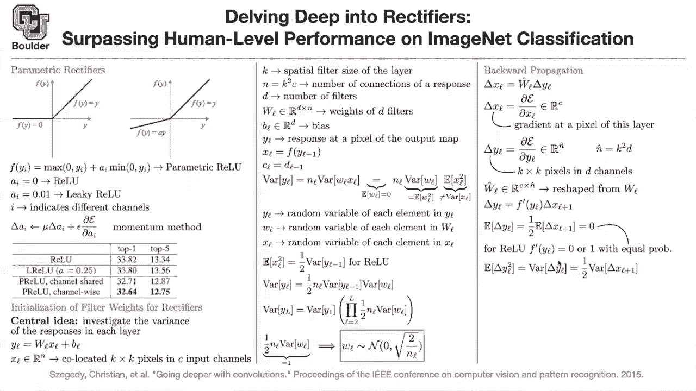
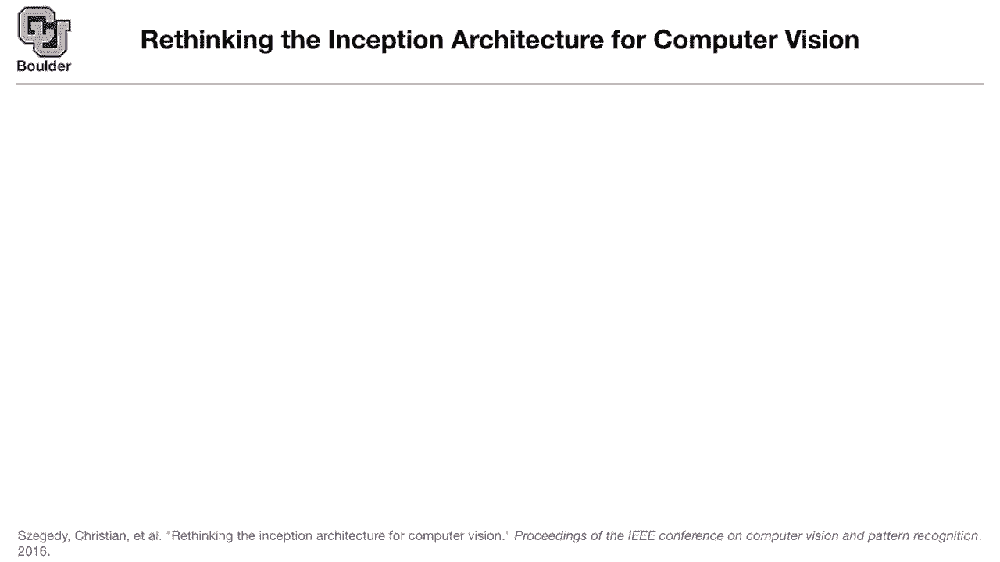

# P14：L7.1- Kaiming参数初始化 [续] - ShowMeAI - BV1Dg411F71G

we talked about rectifiers，u，the figure on the right，is parametric value and。

you can have the parameter ai，to be channel dependent or filter，dependent。

it means that per each filter you're，gonna have，a different activation function that you。

want to learn，and we came up to the conclusion that，yes it actually slightly improves our。

accuracy and basically drops our error，rates，then the question is how are we going to。

initialize your filters，when your activation function is a，rectifier。

and we said we are going to look at the，variance，of the response in each layer and that's。

gonna help us，come up with an idea of how to，initialize these parameters。

usually the bias is gonna be initialized，to zero，so that we know how to initialize it。

we we know that uh we are gonna，initialize，w's with a distribution probably it's，gonna be normal。

that's gonna have a mean zero，and we want to figure out what's the，proper variance。

for these weights or for our filters，we said we are gonna flatten everything，out。

we take a k by k window，of our image and the k by k window is，going to be。

k squared pixels and they're gonna have，c channels，for instance the first layer is gonna be。

red green blue and the other layers are，gonna be i don't know，47 channels so we are flattening。

everything out i'm putting everything in，one，long vector and n is going to be，basically k。

squared c and that's the number of，connections of a response。

d is the number of filters that you have，and it's going to correspond to the。

number of pixels of your next layer，not the number of pixels actually the，dimension of the pixels。

because each pixel is going to have，dimensions it's going to be a vector。

and then we said convolution，is nothing but matrix，vector multiplications that's our rate。

that's our bias our bias we are going to，initialize it to zeros，now how is this layer related to the。

previous layer，they are related to each other by an，activation function。

basically the output of a linear，combination of your inputs，is gonna go through a non-linearity in。

this case our non-linearity is，value and then it's gonna give us，xl the input to the next layer。

or the input to the current layer，according to this，indices and the way the dimensions。

or our filter sizes match，is that the filter size of the output，of the previous layer is gonna be。

the number of channels of the current，so that's how these guys are related so。

basically whenever you have，n it has to be an l or，c l and v l but for。

ease of notation i'm just using that，and it's just k squared c d is the，number of filters。

but these are per layer so，if you want to be really careful then，you keep the index l all the time。

and then the idea was to look at the，variance，of the response basically variance of yl。

we know that yl is one，element of，the output so it has a distribution，wl is an element of your。

and we want to know how to initialize，them independent from each other。

so each entry of your w is going to get，initialized independently。

it's going to be identically distributed，and independent，but then there is a summation here over。

n whenever you are doing matrix vector，multiplication，there is a summation over n。

and then you are summing the entries of，your vectors basically it's a dot，product。

that's why you get nl out，and then you have variance of wl xl，now i hope you spend the time。

to look at the variance the formula for，the variance，of product of two random variables and。

if you just google it，this formula is gonna come up it's one，of the formulas。

that it's gonna show up so what we are，doing is just writing variants of wlxl。

as variance of wl and expected value of，xl square，then we know that we want to initialize。

our weights，such that they have a mean，so that's that we are going to assume。

therefore the variance is equal to，expected value，of your random variable squared。

basically the second moment is going to，be your variance，if this was true then initializing would。

be easy，you would just initialize it by square，root of 1 over，at it。

xl is a non-linear function of your，of x l，squared is one half the variance of y l，minus one。

so half of the times it's zero and the，other half，is the same as your variable。

so it's going to be one half of the，that's what you get for relu now you go。

ahead and plug this formula，going to，replace that and this is what you get。

variance of yl is one half，coming from this formula nl，is what you have up there variance of wl。

is here and variance of，y l minus one is coming from here，is this clear any questions so far。

now you keep doing that for all of your，layers，basically variance of，y2 is equal to variance of y1。

times whatever that you have at that，moment，and then you keep doing that in an，iteration。

that's going to give you the variance of，your last layer，is equal to variance of the current，layer。

i mean the first layer the first input，and then a product of these one halves，and variance of wl。

so the problem with multiplying many，numbers as i mentioned in the previous。

session is that it's either gonna，explode，or it's gonna go to zero if it explodes。

it means that your outputs are getting，huge，and then it's getting out of control if。

it vanishes you are always getting a，constant you're always getting a zero。

to avoid that does anybody have any，idea what we need to do so we want to，avoid，exploding yes。

so jacob has the right answer you want，to make all the numbers close to one。

so you want to make these numbers that，are being multiplied by each other。

to be close to one so that's what we are，gonna do，we are gonna say let's assume this is。

one or let's try to make it as close as，possible to one，and then that's going to give you your。

initialization，if your variance times a number is，has to be equal to one so the variance，of your。

weights has to be 2 over，n l it's coming from this part，and then the standard deviation is going。

to be a square root of 2 over n l，so this is the proper way of，initializing。

uh convolutional neural networks，with value activation any questions so，far。

so prior to this work people were using，just，a constant，standard deviation and the problem with，that。

is that this formula is not going to，hold and the variance is either going to，explode。

or go to zero so this，the variance has to depend on the number，on your filter size and the number of。

input channels，basically it's depend depending on the，filter size。

and the number of the input channels but，this is not game over，this is when you are pushing forward。

through your neural network，things could go wrong when you go，backward。

when you're taking your derivatives when，you're doing back propagation。

and that's going to be either exploding，gradients or，vanishing gradients if your gradients，explode。

then you're always jumping around in，your optimization landscape，and if your gradients vanish。

then you have zero gradients and there，is no learning happening，so you are always going to be stuck。

where you are starting so no，learning is going to happen so back，propagation matters。

let's see what happens in the back，propagation pass，delta x l is gonna be。

the derivative of your loss function，with respect to x l，which is a pixel at your input。

it's going to be w l hat，times the derivative of your loss，with respect to y out so these are just。

derivatives，derivative of the loss with respect to，the input pixel derivative of the loss。

with respect to the outputs，and wl hat is gonna come from wl，by reshaping it maybe transpose。

and then flipping your basically，flipping your filters left and right。

looking at it in a mirror i have a，question about that because i've seen，back propagation。

briefly with um convolutional neural，networks and i've i've not understood，that part，that or。

a simple maybe like intro textbook or，something which，goes into those details so what i have，online。

i share the link with everybody i think，the first session，in that link that's for one by one。

convolutions，that's for a fully connected one how，about you take that and then try to。

extend that but then it's very easy the，thing that you're doing is take the，derivative of yl。

the derivative of your loss with respect，to yl，and then these summations if you expand，them。

you're gonna see how wl is related to wl，hat，so you just have to expand this there is，a summation。

over all of these entries and then you，take the derivative of your，loss with respect to this pixel。

and see what happens but everything is，coming from taking the derivative of，this guy。

it's a chain rule so if you if the，pixels，were one by one if your windows were。

one by one then you know that the，derivative，of xl of your loss with respect to xl。

is going to be w l transpose，times the derivative of y l basically。

the derivative of your loss with respect，to y l，but now you have a bunch of other pixels。

so there is another summation，so it has to do with transposing this，guy wl。

so i don't want to get it into the heavy，machinery，of this because then it's going to be。

one slide for itself but，i think you guys can do it at home it's，not rocket science。

it's just taking derivatives and using，chain rule，so now what are we doing we are taking a。

look at one of the pixels，and we are taking the derivative of the，loss with respect to that pixel。

and each pixel is in rc it has c，channels，so same thing is going to happen for the。

loss it's going to be in rc，these are just gradients，the gradient is going to have the same。

dimension as your，number of variables in this case xl，so that's just one pixel and then that。

pixel is going to get affected，pixels of the output，and the output is going to have d。

and hat is going to be k squared by d，similar to n which was k squared by。

c and hat is going to be k squared by d，and as i said wl hat you're going to get，it from reshaping w。

and to make sure that things are at，least correct，on the as for the big picture，this is c by m hat。

which is going to be c k squared by d，so let's remember that number and let's，go back here，w was d。

k squared by c numbers，so at least you have the same number of，numbers and that's going to give you。

some comfort，that things are correct but in the end，what's happening is just a reshaping of，w。

so you are doing the transpose，for the channels and then，you're flipping your filters left and，right。

you're looking at it in the mirror so，that's how you do back propagation。

and things are linear and i'm sure if，you write out，the summation on a piece of paper you're。

gonna see，this relationship and it's actually a，very good exercise。

i highly recommend it any questions，so far okay then what happens when you，have the activation。

you're gonna have to take a look at this，one this formula here。

and shift it one layer forward so it's，to give you x，l plus 1 is equal to f of。

y l now you take the derivative of your，loss，with respect to x l plus 1 write down，the chain rule。

and then you get the derivative of your，activation out，on your yl times the derivative of your。

input which is basically you are，thinking backwards now，but it's coming from this formula and。

writing down the chain rule，this is xl plus 1 is equal to f of yl。

now you write down the derivative of，your loss with respect to xl plus。

the derivative of your activation is，going to come out because of the chain，rule。

and then the derivative of your，loss with respect to yl so this formula，is coming from here。

and from the chain rule so that's，another exercise，just write that down more carefully。

so now we are in a good shape we know，how things are back propagating，in terms of loss through the。

non-linearity and through these linear，operations，the linear operations are happening this。

way and all you are doing is reshaping，of your weights，the，derivative of your non-linearity out。

so many people think that，back propagation is just chain rule。

but it's more than that can can somebody，tell me，thing，so we are just reshaping which is coming。

from the chain rule，so that's just the chain rule yes which，is just a chain rule。

it's something more than the chain rule，why is it fast，you are getting close so do you guys。

know about this concept，of memoization it's not memorization but。

memo i hope i'm writing it correctly，here，sort of memorizing。

some of the operations that you did when，you were doing your forward pass。

so when you are doing your forward path，through your neural network there are a。

bunch of things that you are calculating，like here you're calculating yl。

when you are here you're calculating xl，or，recompute them there is no need to do，this operation。

once more you just memorize the value of，yl，why do you memorize it basically you are，storing it in。

memory why do you memorize it，because here you need it when you're，doing a back。

backward pass you just read from memory，and that's why things are fast the rest，of it is just。

scalar vector multiplication and matrix，vector multiplications so it's going to。

be as fast as your forward pass，otherwise you would need to compute yl。

each time which is not efficient，so is it clear exactly，so it's caching it so there are two。

things for back propagation，and why is why it's nice one is the，chain rule。

and that's from the mathematical，perspective，and from implementation perspective what。

computer actually sees and does，is this concept of memorization so，back propagation is memorization。

plus chain rule okay，that was a good cut set that's a，parenthesis that we opened。

let's close it and let's go ahead and，take a look at the expected value of。

the derivative of the loss with respect，to yl，so the derivative here the one that you，see。

is gonna be either zero or one with，equal probability，and it's independent from the one under。

the other variable it means that，its expected value is one half the，expected value of。

delta x l plus one and we know that the，expected value of delta x l plus one is，zero。

they're going to have mean 0。 now what，we can take a look at the second moment。

which is going to be equivalent to the，variance，and once again we're using the fact that，it's either。

zero or one with equal probability and，that's gonna give you one half。

variance of the other guy so this one，half term is showing up。

when you are doing forward pass and when，you are doing backward pass。

so now you take that and plug that back，inside actually you are taking the，variance。

of delta x there is a summation here，of size ml hat and then variance of wl，because we know that wl。

hat and wl have the same entries，so it's just going to be wl it's not，going to be wl hat。

they have the same entries，and then it's going to be variance of，delta y。

and then we are going to use this，formula，and plug it inside，variance of wl and that's what you get。

and then you do a basically go backward，you know that variance of delta x2 is。

relevant to variance of delta x3，and so on you do your iterations。

and again this entry here has to be，close to one，and that's going to give you another way。

it turns out what is the message you can，either use nl hat，and or ml to initialize。

but it turns out that，in the end these are gonna be different，by only a constant。

the variance of your output if you use，this formula，then the variance of your forward pass。

is going to be，different from this variance by a，constant，and a constant doesn't make sense so。

it's not exploding，or it's not vanishing and what is，n l hat n l hat is。

all the way up here and l hat，is k squared df and these are different。

and l hat is a different number from nl，does that answer your question okay，perfect。

so you can either use an l hat，to initialize or you can use nl to，initialize。

in the ends it doesn't matter much，things are not going to explode。

or vanish either in the forward pass or，in the backward pass now we did a lot of，work。

to reach here you can do the same，algebra，and come up with the right，initialization。

for where you have，uh parametric value for parametric value，these are the final equations that。

you're going to end up with，when you go through this algebra。

so if you're using parametric relu there，is one，plus a squared that's appearing in your，formulas。

if a is zero you go back to relu and，these two formulas are the same as the。

ones that we discovered here，here and here，so what is the message here the big，picture。

i think we went into a lot of details，but let's now come back and look at the，big picture。

the big picture is that activation，function matters，when you're doing your initialization。

initialization is not a trivial task，initialization matters activation，matters。

and the problem comes from either in the，forward pass or the backward pass。

when you're multiplying a lot of numbers，together，or a lot of matrices together so。

things are gonna either explode or，vanish and you want things to be。

to behave nicely i think this is the，most technical，slide of this uh。

this course that we're gonna go through，but，it was a nice exercise to go through，these details。

in the end what you're gonna remember，from this paper are these two。

how to initialize it and you're gonna，use this formula to initialize your。

neural network but if you change your，activation function then you have to be，careful。

any questions we learned a lot of nice，techniques，one is that we learned about relu。

and these are big steps in the deep，learning literature，before relu things were not converging。

things were not behaving，about，uh batch normalization and we learned。

about how to properly initialize our，neural networks so these are big steps。

without these it's gonna be really hard，to train neural networks okay if there，are no questions。

let's move to the next topic does，leaky value change the initialization。

leaky value is similar to parametric，value，but then those parameters are fixed to a。

constant let's say 0 0 1。

small constant but then the formula that，to the，previous yes i can this is the formula。

that you're going to use，for parametric value this guy is channel，dependent。

does that answer your question，would you ever use different activations。

actually let's look at the final，activation of a binary classifier。

the final activation is going to be a，sigmoid because you want things to。

turn into probability so for the final，layer you're using a different，activation。

and if you think about this parametric，rectifier，okay that's a great question how would。

how would that affect the initialization，it wouldn't if the only thing that。

gradients are not going to explode or，vanish，or your forward pass is not going to，explode or vanish。

because it's just one activation that，you're changing，the problem arises when you're doing。

this multiple times i and your network，is deep，then you're multiplying a lot of numbers，together。

and things could either vanish or，explode，does that answer your question okay。

