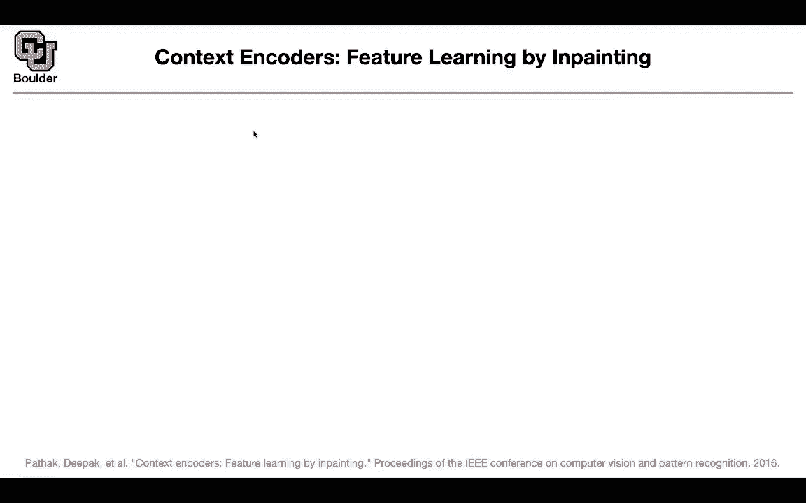
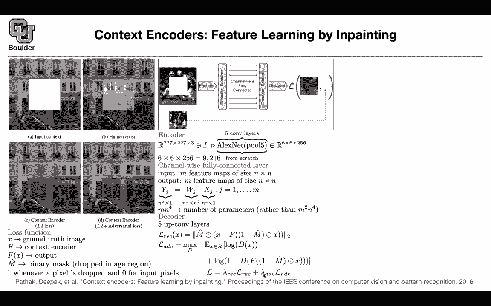

# P143：L66.3- 上下文编码器 - ShowMeAI - BV1Dg411F71G

Okay I know one of you asked me about in painting and what is in painting and what could be an application of in painting in painting is an application on its own you have an image and you want to fill in the missing parts can you actually use this framework to learn features like what you are doing with bird you are masking some part of your input and you are requesting your neural network your transformer to give you the masked words can you do the same thing here can you mask a bunch of pixels so this is the part that is missing and if you ask a human to imagine what's happening in this box they are gonna be able to do it if they are good artists if you ask if you try to solve the same problem using an L2 loss youre going get some blurry output if you add adversarial loss you're going to get some imagine the fine details in that box and remember。

This is an in ill posed problem There is no correct answer to this if you give this to another human you're going to draw something else okay and this is a one too many mapping again this are illpost problems whatever we're going to do you take your the context of your image this is a context this is the missing part and your task is to predict the missing part you're going put a neural network and encode codeder that is going to take this image the context is 227 by 227 by three channels red green blue that' your image it's going to push it through some Alexnet Alexnet is the paper that is started deep learning as we know it today it's a paper written in 2012 and you're going to take that the structure you keep but the parameters you're going train from scratch and you keep five layers of your Alexnet and after that operation and image goes in and another image is going to come out it's going have。

lowower resolution but it's gonna have more channels and now you're here。

 One idea is to flatten this it's going give you a vector that is 9216 dimensional and then you can put a fully connected network here but then it's gonna be a lot of parameters rather than doing that you're going do a channel by you're gonna do it 256 times so you have m features M is 256 these are n by n6 by6 this is your input thats your output you want it to have the same shape now you're defining these operation here you're gonna do a channel wise you're going do a for loop here on your number of channels if this is if M is 256。

 you're gonna have a for loop that is a size of 256 and then you're going do matrix vector multiplications Each pixelel is a vector actually each channel is going give you a vector that is 36 this is n is squared you're gonna have a matrix that。

N squared by N squared and that's going to give you an output vector per each channel。

 How did you reduce the cost the number of parameters This is going to be m because you have a four loop here and then you are going to have two four loop here that's going to give you n to the power4 if you wanted to if you want to flatten everything and then multiply by a matrix of proper size you're going to get these many parameters so you are saving an order of m parameters your decoder so now we are here we want to decocode you're going have five up convolutional layers so up convolution is very similar to fractional but is' different it's very similar to fractional least right it but it is slightly different but here the aim is to look at the loss so somehow you go back to the resolution of your image what is your loss function you take your ground truth image you have your encodeder is。

Basically the entire thing that's your context encoder that's your F function If you take an image you push it through F。

 you're going to get another image， that's your output image。

 you have your mask it's a binary mask and this corresponds to where you are dropping you have a one value if you're dropping the pixel and you have a zero value if you're keeping that pixel so this is going to be one here and it's going to be zero here you are gonna have a reconstruction loss。

 you take X your input image and you mask it if M hat is one1 minus M hat is going to be zero so you're zeroing out that portion of your image first you push it through your neural network。

 you compare it to the original image but then you are not interested in all of your image you're interested in only in that portion that you masked out that's where you're going multiply by M hat so M hat is going to be one in this box and it's going to be zero。

Everywhere else so you're dropping the context so first you're keeping the context here you're dropping the context and that's L2 norm and that is what is giving you this image that is blurry you can do generative adversarial neural network you take an image you mask it。

 you push it through your F F is now your generator and then you discriminate between the generated image and the original image that's gonna to give you your adversarial loss you can combine the two with some properly chosen hyperparameters now you can do cool stuff like this you can fill in the details this is in painting so this particle is missing you are putting it back you can use the features that you learned out of this method to do all sorts of things like classification etc but how do you measure the quality of such a task there is the signal to noise ratio you can also look at mean L2 loss mean one loss etc。

You can look at the features and see what part of the features are closer Basically you take a context like this that's going to give you a vector and then that vector you' are going to find its closest neighbors in your data so these are the closest neighbors all of these method all of them belong to the faces of dogs if you use histogram of oriented gradients don't worry about that that's a classical machine machine learning technique actually featureurizing images technique these are not going to be images of dog and if you use Alexnet which is not a generative model it's a discriminative model some of them are faces of dogs and some of them are birds and as I mentioned this is going to help you learn some features and those features you can use them to do classification detection segmentation and actually they're not doing that path those features in a fraction of the pretraining time than competing method so this is。

Bt like method for images I think I'm gonna stop here and for those of you have questions I'll be around and for those of you who want to leave you can leave I had a question about this sure adversarial loss in this case we're just looking at a discriminator we're not looking at any sort of generator we're just trying to we are is we're generator Okay yeah okay you take we just yeah go ahead sorry so yeah you take this image that is covered that is masked and then you want to generate a apart that is in the middle and that's your F F is gonna be your generator Okay and we just want to be able to correctly we want to maximize over D so we're trying to correctly identify that as fake when we inva Yes。

 so yourre discriminator once to discriminate between the fake and real and then you。

generator wants the images that that it is generating to look as real as possible。

So F has two objectives， one is to fool a discriminator and the other one is to do a good job at reconstructing now at the same time that is' trying to reconstruct it wants to make the images look more real。

Okay， yeah， and you don't want to imagine unrealistic stuff here you want it to look real at the same time you don't want it to be blurry because you could have a smaller L2 loss。

 even if it doesn't necessarily look that good Yes。

 and that's why I didn't emphasize that much on these scores because they are highly correlated with L2 loss maybe this score plus the inceptionist score would have been a better score to evaluate this method okay。

Yeah， thanks， sure， any other questions？