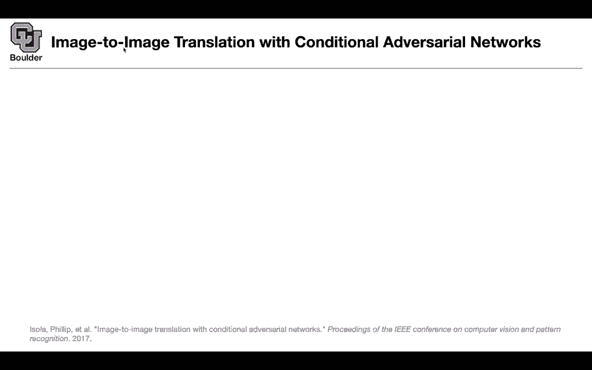
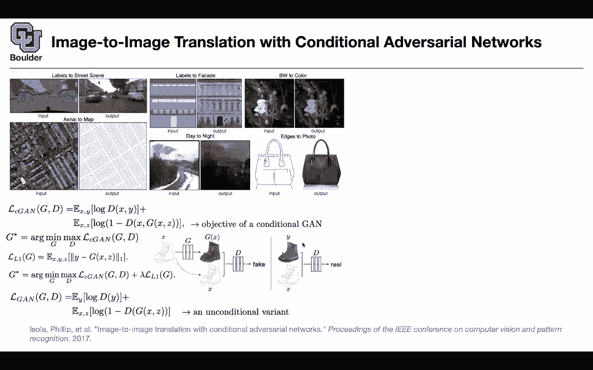

# P145：L67.2- Pix2pix - ShowMeAI - BV1Dg411F71G

So as I mentioned I'm going to go back and forth between unconditional Gms and then conditional Gms because one of them is pushing the methodology the unconditional is giving you new objective functions it's giving you new neural network structure etc and the other one is for applications when you do conditional Gs so let's see some applications and let's apply Gs to the task of image to image translation what are the applications or what are the type of data sets that you're gonna to see for those of you who know about segmentation you know that you go from an image and then you segmented you say this is a car this pixel is a car that pixel is a road that pixel is a tree that pixel is a traffic light etc so you label them and these are your label data now you're switching the role of your labels and images okay that was your input previously this is your out。

Now you switch the row， this is your input， generate images for me。

 You can go back and forth between the aerial to map and map to aerial you can go from labels to facade it's very similar to labels to street scenes you can do colorization you have a black and white image and you want to look at it in terms of colors you can apply to self drivingriving cars so for self drivingiv cars you're not gonna have enough data if you want to have enough data to train a neural network there estimate that it's going to take you 300 years to have enough data to train the type of neural networks that you need for self-driving cars okay because the reality is messed up sometimes it is rainy sometimes it is it's sunny sometimes there is fog etc。

 so this framework is going help you translate between images。

You can translate between day to night between summer to autumn etc summer to fall you name it and now you're gonna have enough data hopefully and this is useful for fashion you draw and sketch or the edges of a foot and then you translate it to photo so what is the framework you're gonna have a last function coming out of a discriminator so the discriminator is giving you your last function and this is conditional and what you conditioning on is X so x is your in this case this is your semantic labels this could be your input the other inputs etc so x is your input y is the output this is the ground truth these are the real data and G of x and z is your late variable and then given x you are generating images so these are going to be your generated images and basically your training G you are training a function that takes you from X。

Y and then you're discriminating between real and fake that's going to give you your Gs star at the same time。

 because you know your ground truth， you can put a reconstruction loss。

 You can say that I want the output of the generator to be close to the real data So now you have two losses one is coming out of L1 loss The other one is coming out of the discriminator and then you can just add them up properly with a hyperparameter that you can choose based on your validation data。

 There is a study in the paper which says how important is it to put x here and that's basically an unconditional variant and it turns out that that is actually important Okay it helps So this is a systematic study and there are empirical reasons for putting X here basically conditioning your discriminator on x as well on the input as well。

 and there is also x here X comma G okay visually speaking this is what is happening You take X you push it through your generator。

That's going to give you a generated image and why am I removing Z now because Z whenever you have an input Z could be your dropout noise so your dropout variables could act as z so there is no need to put Z as an input dropout is going to give you the randomness that you need so you take X you push it through through G that's going to give you G of x you take G of x and x and you push it through your discriminator because now your discriminator depends on x as well。

 this is exactly what we discussed now and the discriminator is going to discriminate between f and real it's going to know that some images are real some images are fake Y are the real data Gx are the generated data as I promised you can apply to colorization So this is the colorized version of the images on the right These are the ground root and these are what L1 plus cgan is going to give you you can do。

Map to aerial。 So these were your data。 these are the predictions of the model now These are generated images you can do you can have an L1。

 This is basically this problem that you are mapping your labels to streets if you use L1 only things are gonna become blurry if you add L1 plus Cgan you're gonna yourgan is going to try to imagine cars and some details but then here is where not only you need to make some contributions on the lost part on the objective part you also need to make some contributions on your neural network because your neuraln network needs to remember some of the details is so unit we usually use it for image segmentation So an image goes in and a segmentation is going to come out you can use the same structure here and it has shortcuts like what you had in resnet so unit is going to be an encoder decoder architecture with shortcuts and thats。

That starts to give you better results so what is the big lesson here not only you need to change your loss function the loss function matters you need to change your neural network your structure as well I'm sure you know about this application and we are using it all the time these days we are removing our background when we are communicating over zoom and then we replace the background with some other stuff so you can use this to remove the background you can do deep fake。

And basically the methodology behind the fake is a conditional GNS somebody goes in and then you're going to change that person to someone else schedules goes in and then you're going to get the output okay any questions about this yeah in terms of math this is not hard but in terms of applications you can start to see the applications of GNs now why do you do GNS。

