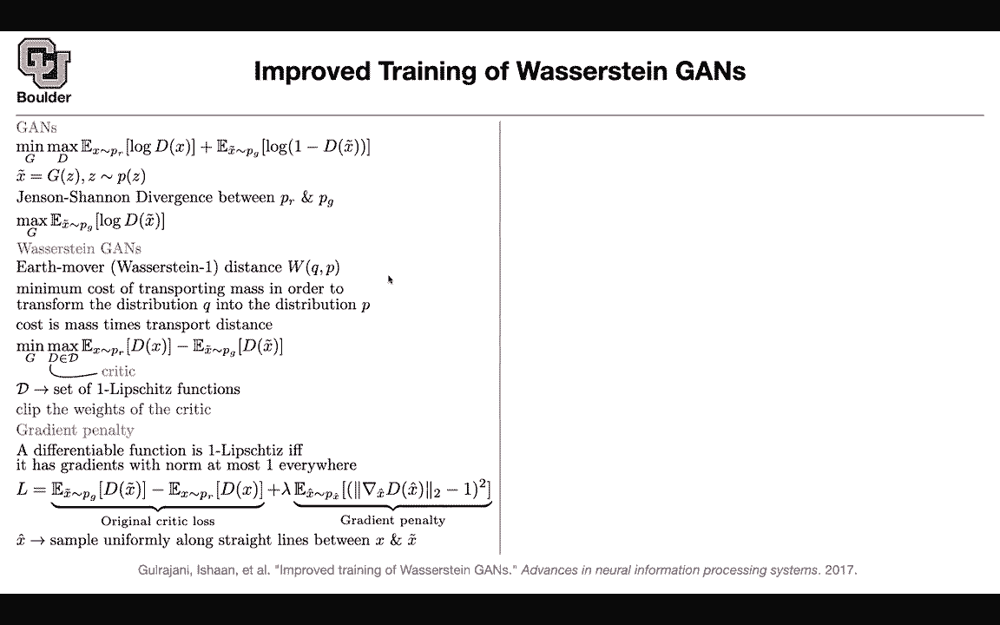
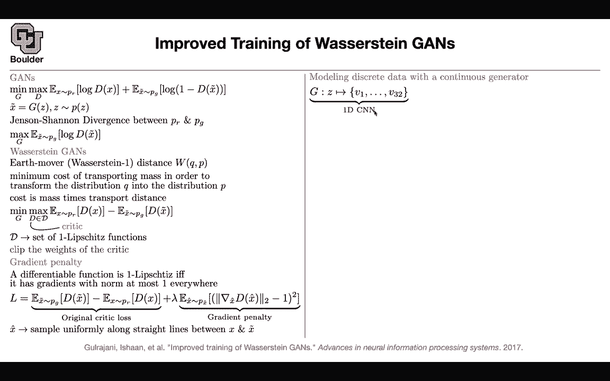

# P150：L69.1- 离散数据的GAN - ShowMeAI - BV1Dg411F71G

Let's get us started last session we covered this paper。

 which was about super resolution and super resolution has applications in there。

Gaming industry and film industry and for gaming industry I'm sure you have heard of DLSS it's a service that NVDdia provides it's for basically the technology behind it is a generative adversarial neural network so it's the same GPU but it's going to be able to process high resolution images because of adversarial neural networks so that's the technology behind it。

And that's deep learning， super sampling， super resolution。

then we covered a theoretical paper on trying to improve Wasrestrgans， we covered most of it。

 we reviewed GNs a little bit， then we talked about Wasstrgans we compared the two objectives and we saw that there are similarities between the two and then we said in Wasrestrgan。

 an important factor was that we were looking at all of the neural networks that are one Lehes functions and one way to enforce Le sheets continuity was by clipping the weights of your critique but then that seemed a little bit ho because now you're changing the structure of your neural network during training whenever one of your weights exits a box you're going to clip it。

 clip the weights， but is there a way to enforce this lipshe continuity in a soft manner。

The idea is to use gradient penalty there is a theorem which says that if you have a differentiable function。

 it is going to be one lip sheets， it's going to be a lip sheet continuous function with a constant of one if it has gradients with L2 norm that are at most one everywhere so every single word in this sentence is crucial first it needs to be differentiable because you need the gradients then you need to compute the norm and the norm has to be at most one everywhere so you can start with the original C loss so that's our original C loss it's going to give you one x tilda for the generator。

 one x for the real data and then you cannot enforce the gradient penalty everywhere because the space is huge the space of images so you cannot enforce it everywhere but you cannot enforce it on the fly。

The line between the real data and the generated data so you are going to keep sampling on that line so not only you sample from your real data。

 not only you sample from your generated data while you sample the point on the line between them and try to enforce these gradient penalty on that line so this is a smart way of spanning your space otherwise the space is too huge and then it's not going to be possible to enforce this guy everywhere okay that's exactly what I mentioned so x hat is sample uniformly so it's going to be sampled according to a uniform distribution on the line between X and xtda any questions up until this point this we covered last session so so far our data was in the form of images and for images your output is continuous so your pixel values are a continuous variable they can take numbers from0 to 255。

Or if you normalize it， it's going to be from zero to one or from negative one to one depending on how you normalize your images。

 but this is going to be a continuous variable now the question is can you generate this data and by discontinu data I mean data in the form of text because then you have a vocabulary。

 either you're using a character based model or a wordbased model。

 whatever that you do you're going to have a dictionary。

 you're going to have a vocabulary and members of that vocabulary are your discrete values so you have only a finite set of outcomes。

That could happen Can we use GNs for such a purpose for modeling discrete data rather than continuous data whatever we're going to do whenever you have discrete data our generator needs to take as input a code so it's a latent variable so it's going to take Z it's a vector and it's going to output a sequence of vectors and 32 let's say is the length of your sequence so if these are characterbased models。

 you're outputting 32 characters including the space it's going to give you a sentence that is 32 32 characters long so a vector goes in a sequence of vectors is going to come out and this we are going to model with CNNnns one dimensional cnn is' actually the deconvolution it's not a convolution it's a deconvolution but it's1 d now you're going pass that information to a cr or to a discri。

Rather than output these are going to be one hot vectors rather than pushing one hot vectors through your critic。

 you can actually push the softm because now all of your variables are going to have values One of them is going to dominate it' going to have the biggest softm value。

But all of your variables are contributing all of the entries of these vectors and as I mentioned these VIs。

 after you sample from your softm， they're going to give you your words。

 they're going to be in the form of 10 characters。

One had character vectors and theyre n dimensionional and n is the size of your vocabulary I don't know if you' are doing English maybe have 32 or two ns okay and your discriminator is going to take a sequence of vectors as input and it's going to output a number if you are doing a regulargan that's going to give you the probability if you are doing v restrain stringgan it's just a number a real valued number now you have two choices one is to usegans objective function the other one is to use was restraingan it turns out that if you use GNs it's not going to converge and there theoretical reasons for it and I'm going to tell you why but if you use v restraingan it's going to converge and it's going to give you some decoded samples now youre sampling from your generator whatever are you going get you're going to get sentences that are 32 characters long so it's going to be one。

2，3，4，5，6。

And if it count is it's going to be 32 and these are samples， this is another sample。

 this is another sample， this is another sample， etc， same thing here。

This this is another sample from this distribution and the way that you're sampling is you're going to sample a z vector from a normal distribution you're going to push it through your generator iss going to give you a sequence of probabilities so there is going to be softm there and then you're going to choose a maximum so you're going to do art max to give you the corresponding character Now why is GNs not converging but what the restrain G is converging let's take a look at what we are modeling with the generator up there each vector that is coming out of the softm is going to be n dimensionional so it's going to have n entries each entry is positive actually not negative and it's going to add up to one so these are probabilities and this is going give you a simplex in Rn what is your target distribution you're going to have one hot vectors and what is that this is going to be again n dimensional。

There is still going add up to one， so there are gonna be probability but you only have two values for your outcome so your entries are either zero or one and we know that Vn is a subset of delta Okay so far so good if you evaluate the genen channel divergence genen Shanon divergence is for Gs it's gonna to saturate on this space so it's gonna to become zero but your waser is trying distance is it still going be a welldefin objective function you're gonna have values there non-zero their gradients are nonze and you can optimize that okay so you can use waser is trying gam to do discrete data Any questions so far a question just about this text output is the result here just that we can model discrete data and it's semi understandable not that it's like doing any sort of a good job Yes so the result is that you。

Can actually model discrete data using GNs but actually for discrete data。

 we have been doing it for half of the semester， there are better ways of doing it like bird like GPT type models the language modeling type models because they are conditioned they are doing one word at a time they sorry they it's either one word at a time or one character at a time any other questions but this is neat that you can actually model discontinu data using GNs because GNs are typically used for continuous data but this is a neat observation that yes。

 it is actually possible to do it。