# P158：L71.3- StarGAN - ShowMeAI - BV1Dg411F71G

Let's move on this is the last paper that I'm going to cover for G and after this paper you guys are going to be in great shape to do cutting gauge research if you want to do or read cutting edge research of other people this is star G is very related to the cycle consistent paper and over there you are doing image to image translation but you didn't have pairs of data pairs of input output the data you just have two sets of images from one style and another style and then you wanted to translate from one style to the other maybe you wanted to translate monet style pictures to realistic looking images or the other way around another application is that you have an input and then you want to make that guy have a blonde hair or change the gender change the age or make the skin color a different skill color or you want to make this guy。

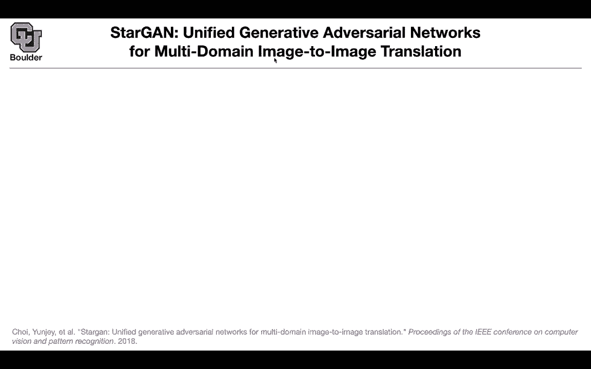

happy fearful If you want to apply something like cycleconistent Gs on all of these tasks。

 then you're gonna need to have multiple neural networks， multiple generators。

 one for the blunter one for the gender one for the a one for the pale scheme one for angry one for happy one for fearful one for from going from one gender and change the age so you're gonna have combinatorially many generators using that framework I there a way to get away with only one neural networks So that's the question This is exactly what I said if you want to translate from domain one to domain2 you're going to need G12 that's one generator and if you want to go from domain2 to domain one you're going need another generator to one so you're going to need combinatorially many generators combinatorially many neural networks can you get away with only one neural network。

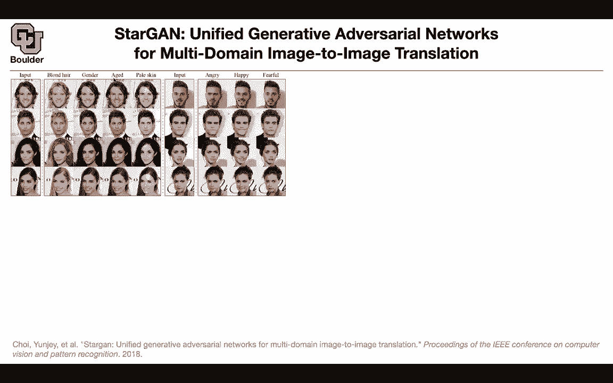

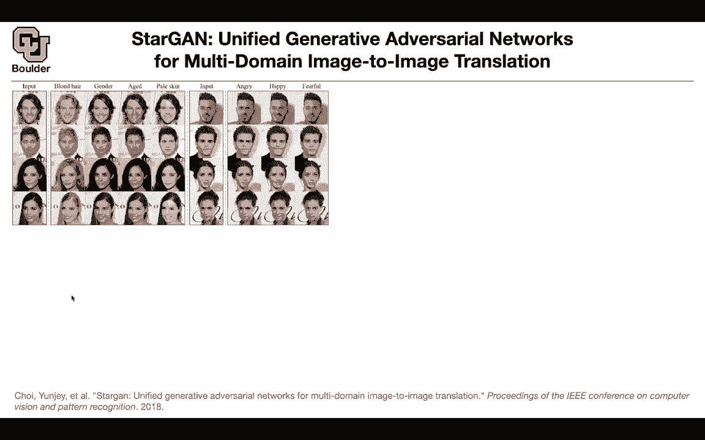

The idea is just to condition on the class on the type of images that you want to generate so as soon as you condition on the gender that's going to be extra input your generator and that's going to help you generate images that are for that particular gender but let's see we are gonna have a discriminator and once a discriminator is trained you can use it to train a generator it's the same framework has before a real image goes in a fake image goes in your discriminator which is a neural network and that's going to give you two objectives now one is is it real or is that fake so discriminate between real and fake at the same time tell me what domain you are classifying just classify the domain for me or you classifying blonder gender age paleer skin etc so that's your discriminator and you're gonna to train it and once you know D you are going to be able to train。

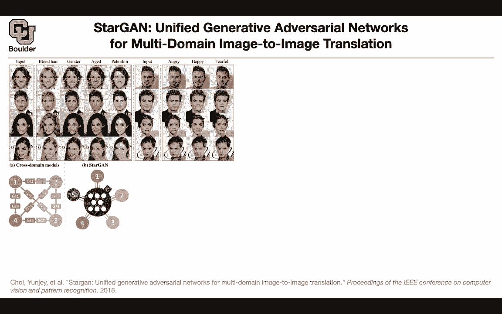

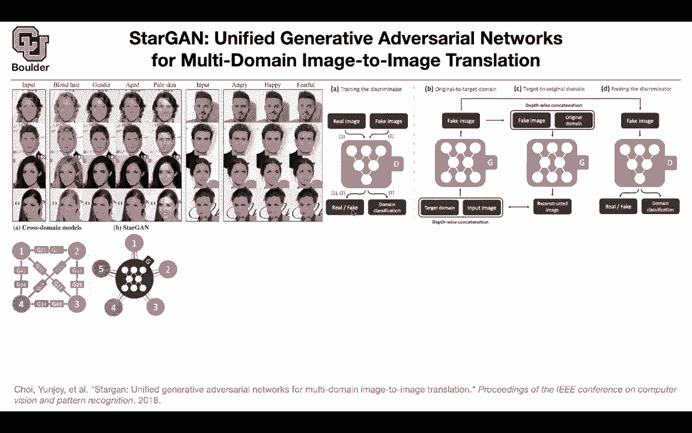

It's going to give you the loss function that you're going to need to train G So the idea was condition on the domain that you're interested in you have a generator。

 you're going to condition on the domain and the input image and let's say your input image is this guy and you want to out with a fake image the guy with a bluer and that's going to out with a fake image you can take that fake image and give it to your discriminator and your discriminator is going to tell you real or fake at the same time the corresponding class so the corresponding class should be the same as the target domain that you started with okay that's the loss for the adversarial loss and the classification loss and then we know that for cycle consistency because you didn't have pairs of data you needed to create pairs of data on the fly so you take your fake image and the original domain as the condition you give it to the generator it's going to give you a reconstructed image。

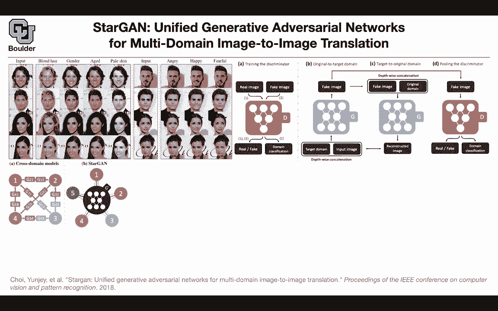

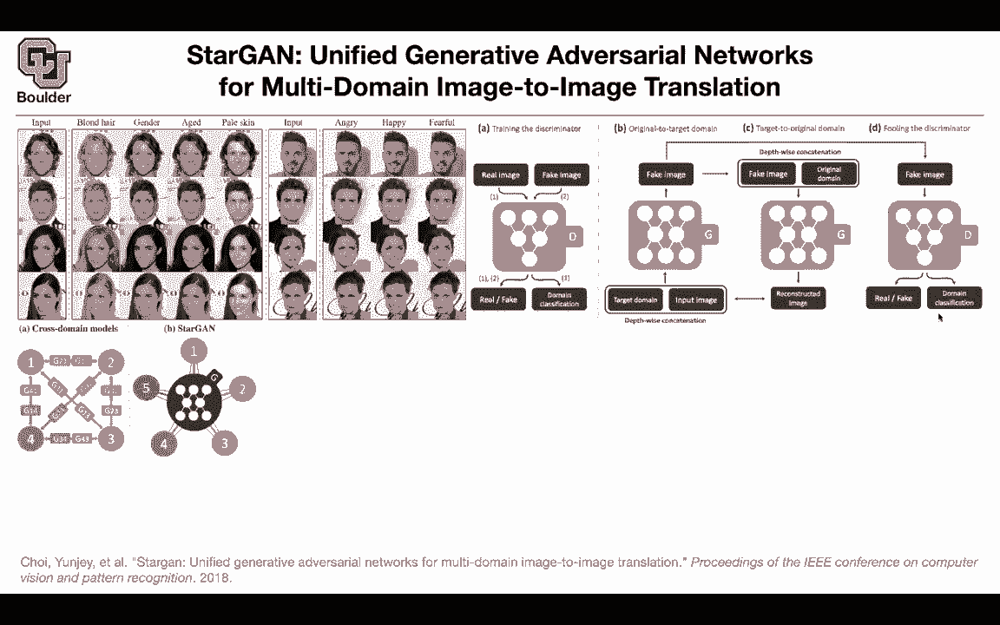

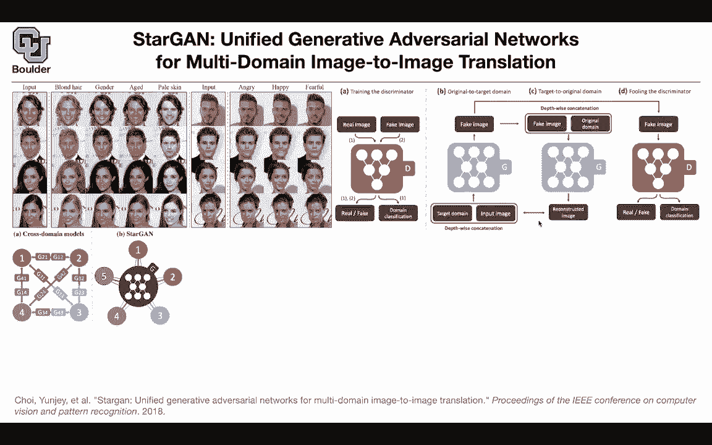

Now you're back in the domain of images you're in the original input domain now you can compare these two images so this is the idea of the reconstruction loss that was qualitatively but in terms of math what do we have We have a single generator you have the input image you have the output image and then you have the target domain label and these are one hot encoded for blondeer for gender for age for pale skin so however many classes that you have and then your condition on that target domain to generate your images your discriminator is going to tell you what class that image belongs to is it a blondnter gender age pale skin etc So it' kind have an output here and then it's going to tell you what is the source of this data was it real or was it fake and then the loss of the discriminator is coming from an adversarial loss it's coming from the loss。

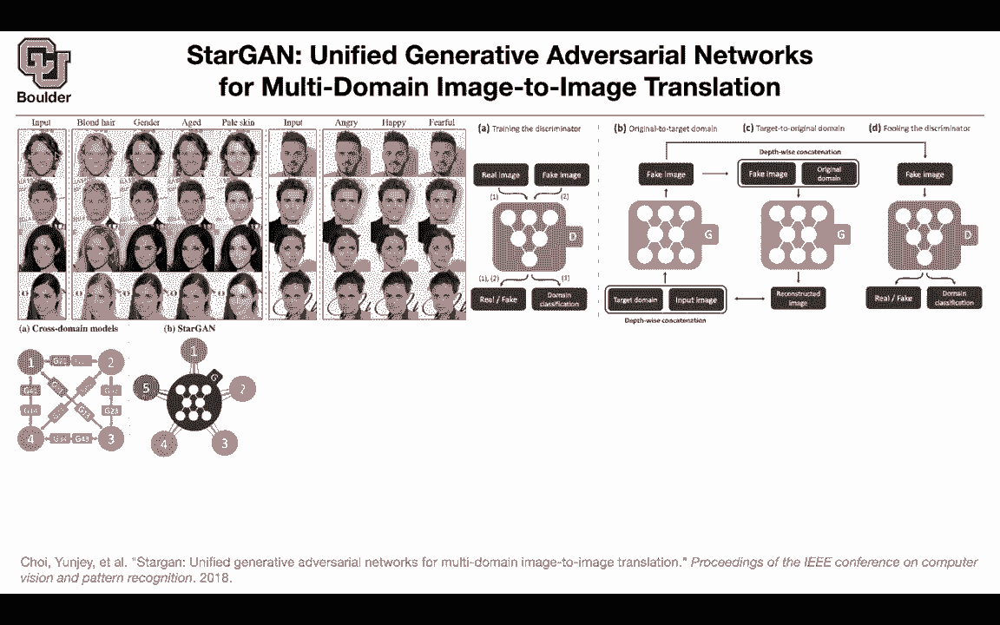

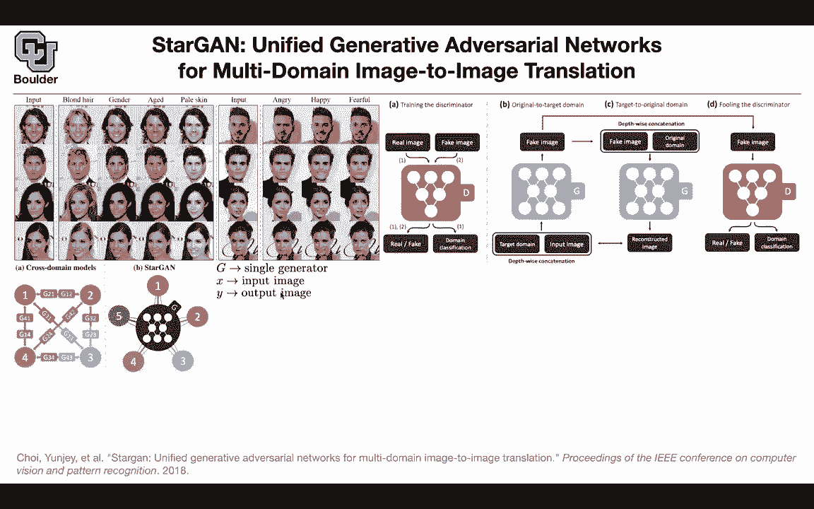

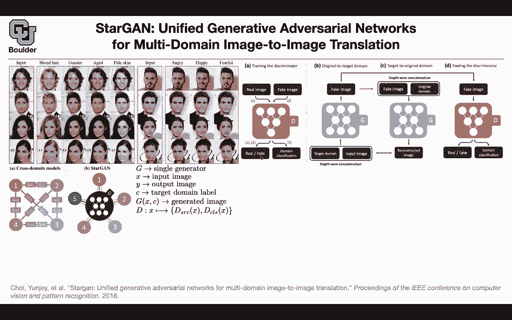

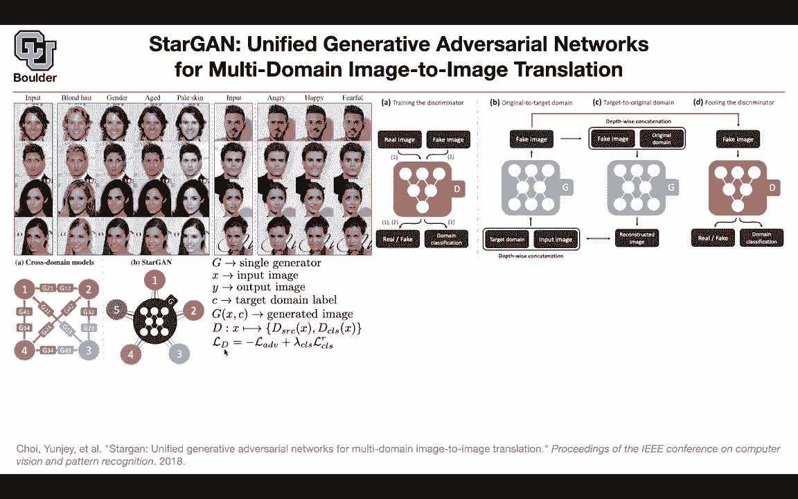

of the discriminator classic classification loss the generator is going to have an adversarial loss here is going to have a classification loss and it's going have a reconstruction loss so if you want to write down the details what you're going to get is the adversarial loss is coming out of the output of your discriminator discriminating between real and fake so there is a sigmoid here but for the domain classification you have a softmax at the end the classification you' are maximizing the log of your likelihood and there is a softmax here it's giving you the corresponding class and for each input you're gonna know the corresponding class and that is for the real part for real images for each real image you're gonna know the corresponding class for the fake images you know what the corresponding class is so you're going to give that as an input you're going to say I want to。

Andrate faces of angry men， and then the class should be angry men。

Okay that fake image the reconstruction is L1 and in terms of the figure it corresponds to this part of the figure you generate an image and then you give that generated image to the generator again to take you back to the original domain now we can compare x to X so you're comparing apples to apples now and these are some hyperparameters that you're gonna to choose before I go into multiple data sets is everything here so far what do I mean by multiple data sets this is one dataset set this is another data now you want to combine both of them together Sure what is the question it seems that these domain classification labels are nonunique like any image the image in the top left of the man with the brown hair you could say they have like a gender label and you could say they have a pale skin label and you could say they have a non blonde hair labels I'm confused how that domain classification。

variableable works you said it was one hot encoded Yes， so first of all。

 what is the data like it's not like you have this same guy having two different types of hair okay so that's never going to happen in your data set you have a data set of women you have a data set of people with blonde hair you have a data set of old guys etc。

 and these are not paired images Okay so this is one data set of blonde people of different gender etc。

 what you're gonna do is you're gonna one hot encode these So if you' are looking for coding the blonde hair。

 you're gonna to put a one here0，0 zero there Okay if you want to generate female that's gonna be a one here000 So that's your one hoting and that's a class that's C that is going again。

Does that make sense now， Does that answer your question somewhat I'm still I'm still concerned like what if there was a blond old person that could happen。

 but they're gonna to belong to one of these classes in one of your data sets but now the question is what happens if you have multiple data sets like what you have here you're going have maybe two classes two data sets maybe select a and R AFD you're gonna have a mass vector which is a one hott vector again if you're in the select a data you have a one there and0 for the other guy so that's one hott vector and you can catnate it and additional input to your target domain label these are one hott vectors these are one hott vectors and this N is different from that n so don't confuse it and here could be for1。

2，34 and n for the other data could be3 and if one of the data sets has less number of Cs。

Just assign zero to the remaining entries so you keep the same dimension the dimension is going to be four and then you're just assigning a zero to everything else in terms of training you're gonna do your usual training with the gradient penalty because you want these to be as close as possible to lips sheets continuous and gradient penalty we know that is not the only way of doing it and perhaps it's not the it's not the base and by the way these y have are samples that you generate between your generated images and real images on the fly and you have a gradient penalty loss and if you want to compare it to a style to cycle consistent can the other ones are not output so if you want to compare it to cycle can it is slightly better maybe because some transfer learning is going on from multiple domains but there is a cost with cycle consistent can and the cost is that you're going to need to have。

Many generators here you only have one generator so you can think of this if you want to draw some analogy。

 the analogy to translation is that here you have multiple data sets of images over there you had multiple languages Okay that's how you can draw the analogy I think I'm going to stop here and for those of you who have questions I'll be around and for those of you who want to leave it can leave a really quick question on this star game Sure so just to confirm it is possible to take an input image and transform it into several domains so by just feeding it into the generator over exactly Okay so what's going to happen so all of these trouble that I went through was for you to just train your generator okay once the generator is trained what's going to happen is that you're gonna to give it an input an input image。

 maybe this guy and you're gonna say，You're gonna input a1 h vector as well for the blonde hair and then it's gonna to be able to generate blonde hair if you change your1 hot vector to female that's gonna to turn that guy into a female etc Yeah I think I meant if you take the males the brown hair guy at the top left go to the blonde hair and then take the blonde hair output and go to a different gender then you have a blonde different gender Yes of course but you can call your generator multiple times you can generate this guy but then then this could be your input this could be the input that you can change the gender Okay that's very impressive thank you yeah no this is impressive and this is actually I think there is an app on iPhone or your Pixel Google Pixel that you can actually do that it's doing that for you you take your image and then it's gonna change your age how are you gonna look。

When you're older so what's the question I was going to ask if you thought that doing that over and over again would eventually result in like a degradation of quality。

 yes probably， but in the end of the day there is no reason to doing it over and over again yeah。

Or maybe there is maybe you want to see if I were blonde and old how would I look like， so yes。

 you're going to lose a little bit of quality。But a couple times wouldn't be bad。

 but maybe if he did it a thousand times， which is unlikely， yes。

And then I had one other question which was from my understanding。

 you do some amount of training of the discriminator first No that was just for me to explain stuff but we know that the paradigm of training GNs is that youre gonna to do it in a consecutive fashion maybe a couple of iterations of this one iteration of that couple of iterations of this or this two timescale thing or the two time scale thing okay that's what I thought I just wanted to clarify them no you do it in an iterative fashion you're not going to wait for the discriminator to converge Yeah yeah that that's what I'm saying I thought but I guess I'd got a little confused Yeah the way that I explained it was just to separate the concept of the training and the loss function and the generator because what you're doing in GANS in the end you want to know what is your generator Yeah yeah that's the goal the rest of it is just for your。

to get good loss functions although I guess like an application of GNs could be to like identify fake images in the wild that were created adversarially for some reason for the discriminator yes that could be one application Okay think yes maybe you don't want to throw away your discriminator now that you trained it maybe you can use it I had a quick question in regards to to produce paper this one so I guess the one before that yeah so when we go from Z to W is it enough for the function to just be complex to make it more complex or does it have to be attainable I guess I'm asking is it turnable or is it just enough for it to make it more complex。

This is actually trainable so these are additional parameters these fully connected ones they have their own parameters and then you can learn them on the fly is the reason that you want to learn them because I thought we just want to make see more complex distribution yes but you have two objectives one is to make them complex and the other one is for these ws to have some meaning as well okay so you want this w to be correlated the distribution that you're putting on w you want it to be correlated to the distribution of the generated images Okay that't makes sense。

