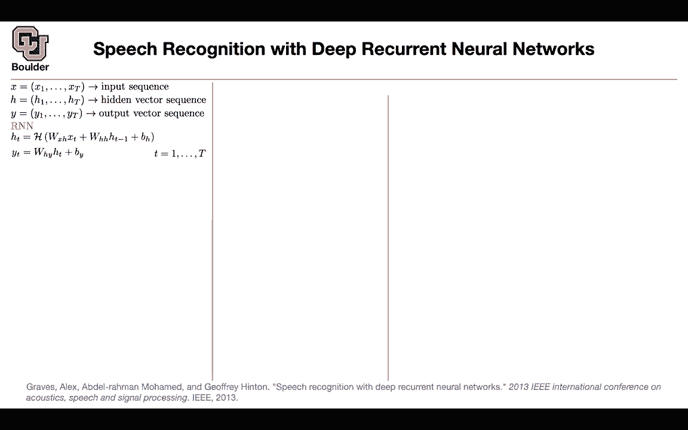
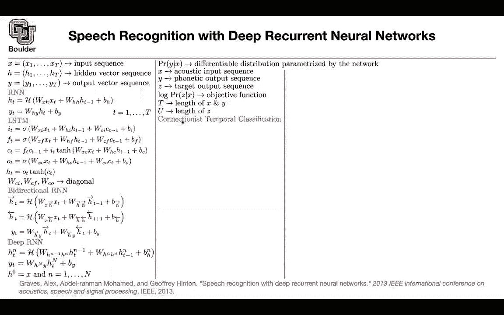
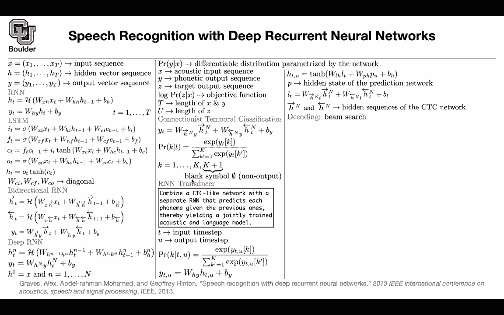

# P161：L73.1- 语音识别 - ShowMeAI - BV1Dg411F71G

Last session we covered two very fundamental topics。

 one of them was about me Spectrogram and MFCCs these are two different representations of your speech or your audio。

 you can work with raw audio or you can equivalently work with meE Spectrogram when it comes to deep learning when it comes to general machine learning people usually use MFCCs。

And then we said okay for now let's assume that you have a recon run network。

 the first question is how we're going to train it。

 the problem with the speech is that your input sequence is usually going to be longer than your target sequence and at the same time you're not going to be aligned so we need to be able to write a good loss function for it and we said there is going to be some work to be done for you to be able to write down and compute your loss for writing your loss you can write down you can consider all of the path that are going to lead to the same labeling but to compute it。

 you're going to use a dynamic programming framework for you to be able to compute this like Li and let's say now you train your model if you want to evaluate it you're going to use something called label label error rate which is coming out of edit distance what is the minimum number of insertions subs situationstitution and deletions。

require to fix the predictions of the model to the correct one。

 But today let's talk about the deep neural network part， So we talked about the loss。

 we talked about the data we talked about how we' are going to evaluate it Now let's see what type of neural networks we are going to work with You have an input sequence this could be your mespectro graph we know that recon neural network is going to take as input as sequence and it's going output the sequence and in the layers in between it's going to generate hidden and vector sequences and it's going to give you a sequence of output input heat output a simple RN I'm just recapping here we saw them when we were doing natural language processing。

 but as a reminder your input sequence is going to go in you're going to multiply by matrix then you're going to keep the history。

Inside some hidden vectors and that's going update your hidden state and then you're going to get your probabilities in the or your scores these scores you can now push them through a softmax if these activation function is a little bit more fancy you're going to get a SDM you're going to have input gate for get gate output gate the only cache is these are all matrices the coefficients in front of your Cs are going to be diagonal so these are just you can think of them as vectors。

For bidirectional RN because you're a speech you can also process it in a bidirectional fashion。

 you have a forward dynamic， you have a backward dynamic and then you're going concatenate the two and then multiply them by a weight matrix or if you expand out you're multiplying each one of those by their respective matrices and actually you can actually go deep RNNs are deep in time you can go deep in space as well and the only catch is you are going from one layer to the next layer so now N is counting your layer。

Okay， so far so good， in the end what you're going to get out of this framework is a probability of your labels and this is going to be differentiable because you just have a bunch of simple activation functions and a bunch of weights and linear operations。

So this is where you are writing your model you're modeling that probability the only catch the only difference from text is that now your input is in terms of either mespectrogram or it could be audio for this paper it's mespectrogram and then your task could be character based or it could be phonetic based or it could be subward based or it could be word based this paper is about phonetic so you are going to predict the phonetics and we know that we are not interested in y we are interested in Z and we want to compute the log of the probability of Z given X this is your objective function we know that x and y they have the same length lens of Z is usually smaller and that's why you need to use connection is temporal classification that's going to give you a last function and we covered this last session and the probabil is。

Probability of label K， given the current time， you're going to do it through a softax and we know that we need to output blank symbols to cover the fact that you don't have enough outputs because the length of z is going to be less than the length of T actually U is going to be less than t but we observe this last session that the connection is temporal classification loss is making an independence assumption。

 so it's not like the fact that you know the previous phonemes that are being outputwited that fact is not going to help you predict the next phoneme。

So you can actually add another neural network that this job is to predict the next forme given the previous ones to compensate for the fact that connection is temporal classification is making an independence assumption on the output So what is the idea you're going to compute combine a CTC like network like the one that I just described with another neural network that this job is to predict the next forme given the previous ones and this is going to give you you can think of the one that is predicting the next formes and a language model and this is where language models are going to help your speech and your objective is jointly training your acoustic and language model but how are we're going to do it your input is going to be indexed by T so your input is going to be x1 x2 xt Xt plus one up untilx capital T。

Your output which is z in this case you can index it by U so that's the index but what is your model now you are going to predict the label given the input time and the output time step so this is for you to be able to incorporate your language model somehow and we are going to see how so you all you need to change the Southmax is not going to change these scores are going to change they're going to depend on time and you the output location。

Still the last layer is gonna be a linear combination of a bunch of hidden units that are functions of TNU now I need to tell you what is HNU HNU some parts of it is going to come from your acoustic model these are the hidden states of your acoustic model and P are the hidden states of your language model so you have a recurrent run network that is predicting the next form and that's going to give you you're going keep the hidden units of that P so and in the end L is just what you have here from your bidirectional recurrent run network it's coming out of those so HN and HN minus1 are the hidden sequences of your CTC network and P is the hidden state of your prediction network and then you're going train it this is going give you a loss function you're going this is going to give you your likelihood and then you're going to write down your last。

Using CTC， you're gonna train it and then you're gonna decocoded it previously we decoded it in a different fashion。

 but here you're gonna to use beam search beamm search I'm going explain it today in another paper so don't worry about it It's gonna be similar to what you are doing in language model but it's a little bit different it's a little bit more complicated in term numbers。

 whether we gonna to report you're going to report phoneme error rate So label error rate if you use a reren neural network that's your phoneme error rate and re run network is this one if you use LSDMs with different configurations maybe one layer deep two layer deep you are going to improve and these are all unidirectal but then you can start making them bidirectal and deeper and somehow wider youre improving your performance and then this transducer loss or transducer R&N the language model is going to help。

lot and pre transnce is a transducer that is pre trained so you have a prediction network that is already pre trained and you're using that。

In terms of predictions this is actually your data what you have down here is your data。

 this is time this is frequency and then these are the labels。

 these are your findings H hashtag AES etc so these are your findings what you see up there is you' are taking the derivative of the prediction of the model at this output so your K is now equal to ah with respect to your input and you can see for speech you need to attend to some other time steps as well its like only one time step is contributing so your the neighborhood speech also matters and it's going to output a single AH of them are going to be blank so this is exactly what I just mentioned the figure on top is the input sensitivity and the data set that I want you to explore its you can think of it as the mN equivalent。

L for a speech and that's called tiid it's a data set it's an all data set created by a project supported by DARPA okay。

 any questions so far， this was not a difficult paper because most of the difficult parts we covered last session with cC and the error rates any questions。

